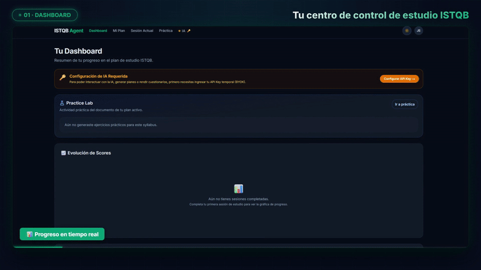
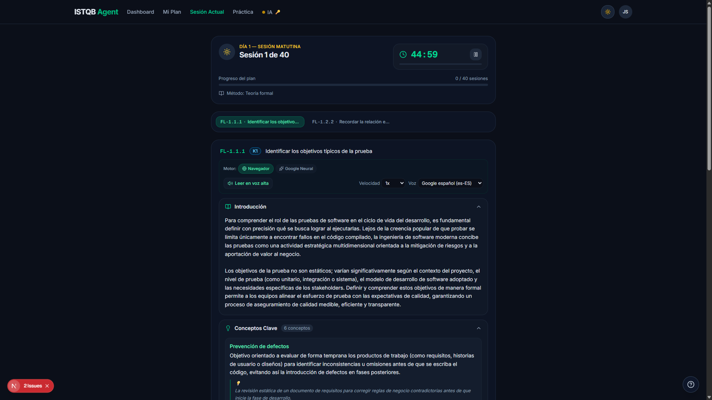

# 🎓 ISTQB Study Agent — Plataforma Inteligente de Preparación ISTQB FL 4.0



> **Plataforma web de aprendizaje adaptativo para la certificación ISTQB Certified Tester Foundation Level (CTFL v4.0).**  
> Incluye **Síntesis de Voz Inteligente con Gemini 2.5 Flash TTS** (con la voz *Aoede*), seguimiento de lectura guiada palabra-por-palabra estilo *Immersive Reader*, laboratorio de práctica interactivo y tutor con Inteligencia Artificial (BYOK).

---

## 🌟 Características Principales

- 🎙️ **Lectura Guiada en Voz Alta (Gemini 2.5 Flash TTS)**:
  - Síntesis de audio ultra-fluida con voces neuronales de alta calidad (*Aoede*, *Leda*, *Zephyr*, *Kore*, etc.).
  - Sincronización en tiempo real (*Word Tracking*) que resalta la frase y palabra activa sobre la teoría sin alterar la maquetación.
  - Generación rápida por fragmentos (*chunking pipeline*) con latencia < 2 segundos.
- 🎯 **Plan de Estudio Personalizado**:
  - Estructurado en 40 sesiones matutinas y vespertinas alineadas 100% al Syllabus ISTQB v4.0.
  - Seguimiento de progreso por niveles K1, K2 y K3.
- 🧪 **Laboratorio de Práctica Interactivo**:
  - Simuladores de examen con preguntas clasificadas por objetivo de aprendizaje (FL-1.1.1, FL-1.2.1, etc.).
  - Explicaciones detalladas de respuestas correctas e incorrectas.
- 🤖 **Asistente IA Integrado (BYOK - Bring Your Own Key)**:
  - Configura tu propia API Key de Google AI Studio (`aistudio.google.com`) compartida en toda la aplicación.
  - Persistencia segura en memoria / `sessionStorage` sin guardar tu clave en servidores de terceros.

---

## 📽️ Demo en Video (HyperFrames)

El video promocional de la plataforma fue producido utilizando **HyperFrames** (Motion Graphics + GSAP) y narrado automáticamente con la voz **Aoede** de **Gemini 2.5 Flash TTS**.



---

## 🛠️ Arquitectura y Tecnologías

### Frontend
- **Framework**: Next.js 15+ (App Router)
- **UI & Estilos**: React 19, TailwindCSS, Lucide Icons, Shadcn UI
- **Audio Engine**: Gemini 2.5 Flash TTS API Proxy + WAV RIFF Header Encoder
- **Estado & Persistencia**: React Context (`AiSessionProvider`), `sessionStorage`

### Backend & Microservicios
- **Motor de Extracción**: FastAPI + Python 3.11
- **Parser de Syllabus**: `pdfplumber` + Detección de tópicos por Regex
- **Base de Datos**: Supabase PostgreSQL con RLS (Row Level Security) y migraciones declarativas

---

## 🚀 Inicio Rápido en Local

### Requisitos previos
- Node.js 18+
- npm / pnpm

### Pasos de instalación

1. **Clonar el repositorio**:
   ```bash
   git clone https://github.com/JuanSifuentesF/practica-testing.git
   cd practica-testing
   ```

2. **Instalar dependencias del frontend**:
   ```bash
   cd frontend
   npm install
   ```

3. **Configurar variables de entorno**:
   Copia `.env.example` a `.env.local` y coloca las credenciales de Supabase.

4. **Iniciar el servidor de desarrollo**:
   ```bash
   npm run dev
   ```
   Abre `http://localhost:3000` en tu navegador.

5. **Configurar la API Key de Gemini (opcional pero recomendado)**:
   Ve a `/settings/ai` en la aplicación e ingresa tu API Key de [Google AI Studio](https://aistudio.google.com/apikey) para habilitar el motor Gemini TTS y el tutor IA.

---

## 📜 Licencia

Desarrollado para el aprendizaje y preparación del examen ISTQB CTFL v4.0.
