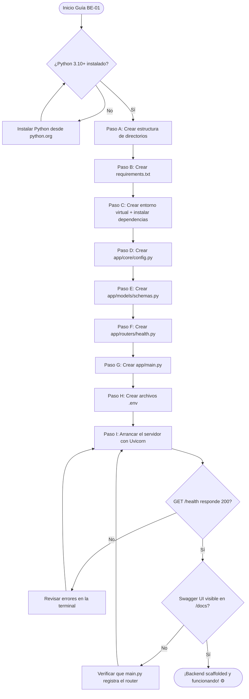
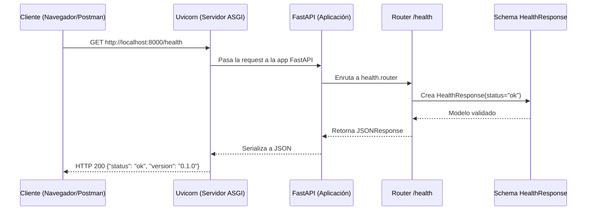

# Guía Didáctica BE-01: Scaffold del Proyecto FastAPI

---

## 🎓 1. Introducción y Fundamentos Conceptuales

### Recapitulación: ¿Dónde estamos?

En el **Bloque A (Base de Datos)** construiste toda la infraestructura de persistencia de datos del ISTQB Study Agent: un proyecto Supabase con 6 tablas (`user_profiles`, `documents`, `study_plans`, `sessions`, `answers`, `topic_progress`), CHECK constraints, índices de rendimiento, un bucket privado para PDFs y políticas de Row Level Security que aíslan los datos de cada usuario.

Ahora entramos al **Bloque B (Backend)** — el cerebro del sistema. Aquí construirás un **microservicio en Python con FastAPI** cuya misión principal es recibir un archivo PDF del syllabus ISTQB, extraer su texto, detectar los 40 objetivos de aprendizaje (tópicos `FL-x.x.x`) y retornar un JSON estructurado que el frontend consumirá para generar el plan de estudio.

Esta primera guía (**BE-01**) establece los cimientos: la estructura de carpetas, las dependencias, la configuración del entorno y un endpoint de salud (`GET /health`) que demuestra que todo funciona.

### ¿Por qué FastAPI?

FastAPI no es simplemente "otro framework web de Python". Es el framework moderno de referencia para construir APIs de alto rendimiento. Veamos por qué es la elección ideal para este proyecto:

```
┌──────────────────────────────────────────────────────────────────────────────┐
│                         ¿POR QUÉ FASTAPI?                                   │
├──────────────────────────────────────────────────────────────────────────────┤
│                                                                              │
│  1. ASGI vs WSGI: La diferencia fundamental                                  │
│  ┌────────────────────────────────────────────────────────────────────────┐  │
│  │  WSGI (Flask, Django):                                                │  │
│  │    Petición 1 → [ESPERAR I/O] → Respuesta 1                          │  │
│  │    Petición 2 → [ESPERAR I/O] → Respuesta 2  (BLOQUEADA)             │  │
│  │    → Un hilo por petición. Limitado a ~100-200 concurrentes.          │  │
│  │                                                                       │  │
│  │  ASGI (FastAPI + Uvicorn):                                            │  │
│  │    Petición 1 → [ESPERAR I/O...] ────────────→ Respuesta 1            │  │
│  │    Petición 2 → [ESPERAR I/O...] ─→ Respuesta 2  (SIN BLOQUEO)       │  │
│  │    Petición 3 → [RESPUESTA INMEDIATA]                                 │  │
│  │    → Un solo hilo maneja miles de conexiones con async/await.         │  │
│  └────────────────────────────────────────────────────────────────────────┘  │
│                                                                              │
│  2. Type Hints + Pydantic = Documentación automática                         │
│     → FastAPI genera Swagger UI y ReDoc sin escribir una línea de YAML.      │
│     → Los modelos Pydantic validan datos de entrada Y generan el schema.     │
│                                                                              │
│  3. Performance real                                                         │
│     → Comparable a Go y Node.js en benchmarks de I/O.                        │
│     → Perfecto para nuestro caso: leer PDFs (I/O de archivo) y procesar     │
│       texto (CPU-bound en ráfagas cortas).                                   │
│                                                                              │
│  4. Ecosistema Python                                                        │
│     → pdfplumber, PyMuPDF, regex: todas las bibliotecas que necesitamos      │
│       para extraer y analizar texto del PDF del ISTQB son nativas de         │
│       Python. No hay equivalente comparable en Node.js o Go.                 │
│                                                                              │
└──────────────────────────────────────────────────────────────────────────────┘
```

### Analogía: El Laboratorio de Análisis Clínico

Piensa en nuestro backend como un **laboratorio de análisis clínico**:

- **La muestra** es el PDF del syllabus ISTQB que el usuario sube.
- **La recepción** es el endpoint `POST /extract-pdf` que recibe la muestra.
- **El laboratorio** son los servicios internos (`topic_detector.py`, `extractor.py`) que procesan la muestra.
- **El informe de resultados** es el JSON estructurado con los 40 tópicos detectados.
- **El endpoint `GET /health`** es como el letrero de "ABIERTO" en la puerta: confirma que el laboratorio está operando.

En esta guía, montamos el edificio del laboratorio, instalamos los equipos (dependencias) y ponemos el letrero de "ABIERTO" (`/health`). En las guías siguientes, construiremos cada estación de análisis.

### Arquitectura del Microservicio

El backend sigue una arquitectura de **capas limpias** que separa responsabilidades:

```
┌──────────────────────────────────────────────────────────────────────────────┐
│                    ARQUITECTURA DE CAPAS DEL BACKEND                         │
├──────────────────────────────────────────────────────────────────────────────┤
│                                                                              │
│  CAPA 1: Routers (Presentación)                                              │
│  ├── Definen los endpoints HTTP (GET, POST, PUT, DELETE)                     │
│  ├── Validan los datos de entrada con Pydantic                               │
│  ├── Delegan la lógica de negocio a los Services                             │
│  └── Archivos: app/routers/*.py                                              │
│                                                                              │
│  CAPA 2: Services (Lógica de Negocio)                                        │
│  ├── Contienen la lógica de procesamiento (extracción, detección, etc.)      │
│  ├── Son independientes del framework HTTP                                   │
│  ├── Se pueden testear unitariamente sin levantar el servidor                │
│  └── Archivos: app/services/*.py                                             │
│                                                                              │
│  CAPA 3: Models (Contratos de Datos)                                         │
│  ├── Modelos Pydantic que definen la forma exacta de los datos               │
│  ├── Validan automáticamente tipos, rangos y formatos                        │
│  └── Archivos: app/models/*.py                                               │
│                                                                              │
│  CAPA 4: Core (Configuración y Utilidades)                                   │
│  ├── Variables de entorno, constantes, helpers                               │
│  └── Archivos: app/core/*.py                                                 │
│                                                                              │
│  ─ ─ ─ ─ ─ ─ ─ ─ ─ ─ ─ ─ ─ ─ ─ ─ ─ ─ ─ ─ ─ ─ ─ ─ ─ ─ ─ ─ ─ ─ ─ ─ ─ ─  │
│  REGLA DE ORO: Cada capa solo conoce a la capa inmediatamente inferior.      │
│  Un Router NUNCA accede directamente a la base de datos.                     │
│  Un Service NUNCA importa FastAPI (Request, Response, etc.).                 │
│                                                                              │
└──────────────────────────────────────────────────────────────────────────────┘
```

### ¿Qué es Uvicorn?

Uvicorn es el **servidor ASGI** que ejecuta nuestra aplicación FastAPI. FastAPI define *qué* hacer con las peticiones; Uvicorn se encarga de *recibir* las peticiones de la red y pasarlas a FastAPI.

Es como la diferencia entre un **chef** (FastAPI) y el **mesero** (Uvicorn): el mesero recibe los pedidos de los clientes y los lleva a la cocina; el chef los prepara y los devuelve. Sin mesero, el chef no puede servir a nadie. Sin chef, el mesero no tiene nada que servir.

```
Cliente HTTP ──→ Uvicorn (ASGI Server) ──→ FastAPI (Application) ──→ Respuesta
```

### ¿Qué es python-dotenv?

`python-dotenv` es una librería que carga variables de entorno desde un archivo `.env` al inicio de la aplicación. Esto permite:

1. **Separar la configuración del código**: las credenciales de Supabase, la URL del proyecto, las claves API nunca se hardcodean en el código fuente.
2. **Diferentes configuraciones por entorno**: `.env.local` para desarrollo, variables de entorno reales en DigitalOcean para producción.
3. **Seguridad**: el archivo `.env.local` está en `.gitignore` y nunca se sube al repositorio.

---

## 📋 2. Prerrequisitos y Verificación del Entorno

### A. Herramientas del sistema

| Herramienta | Comando de verificación | Versión mínima | Propósito |
|---|---|---|---|
| Python | `python --version` | 3.10+ | Runtime del backend |
| pip | `pip --version` | 21.0+ | Gestor de paquetes Python |
| Git | `git --version` | 2.x | Control de versiones |

Ejecuta los siguientes comandos desde PowerShell para verificar:

```powershell
# Verificar Python (DEBE ser 3.10 o superior)
python --version
# Esperado: Python 3.10.x o superior (ej. Python 3.12.4)

# Verificar pip
pip --version
# Esperado: pip 24.x.x from ... (python 3.12)

# Verificar Git
git --version
# Esperado: git version 2.x.x
```

> [!CAUTION]
> **Si `python --version` muestra una versión inferior a 3.10**, debes instalar Python 3.10+ desde [python.org](https://www.python.org/downloads/). FastAPI requiere Python 3.8+ como mínimo, pero usamos 3.10+ para tener acceso a las sintaxis modernas de type hints (`X | None` en lugar de `Optional[X]`).

### B. Verificar que NO existe contenido previo en backend/

```powershell
# Verificar el estado actual del directorio backend
Get-ChildItem -Recurse "backend"
# Esperado: solo el directorio backend/app/ vacío
```

Si encuentras archivos dentro de `backend/app/`, elimínalos antes de continuar para partir de una base limpia.

### C. Variables de entorno (para guías futuras)

El archivo `.env.example` ya existe en la raíz del proyecto con las credenciales de Supabase (creado en **DB-01**). En esta guía no necesitamos esas variables todavía — el endpoint `/health` no requiere conexión a la base de datos. Sin embargo, configuraremos el sistema para que esté listo para cargarlas en guías posteriores.

> [!NOTE]
> **Dependencia cruzada:** BE-01 NO depende de ninguna guía de base de datos. Es el primer paso independiente del Bloque B. Las credenciales de Supabase serán necesarias a partir de BE-03 cuando el backend necesite descargar PDFs del Storage.

---

## 📂 3. Estructura de Directorios del Proyecto

Después de completar esta guía, tu proyecto tendrá la siguiente estructura. Los archivos marcados con **[NUEVO]** son los que crearás:

```
practica-testing/
│
├── supabase/                                # [CAPA DE BASE DE DATOS]
│   ├── config.toml                          # Configuración de Supabase local (DB-01)
│   └── migrations/                          # Carpeta de migraciones
│       ├── 20260522183543_remote_schema.sql # Migración inicial remota (DB-01)
│       ├── 20260531183745_create_schema.sql # Schema de tablas y constraints (DB-02)
│       ├── 20260531221544_create_storage_bucket.sql # Bucket + políticas de Storage (DB-03)
│       └── 20260601015125_create_rls_policies.sql   # Políticas RLS (DB-04)
│
├── backend/                                 # [CAPA DE EXTRACCIÓN] (FastAPI/Python)
│   ├── app/                                 # [NUEVO] Paquete principal de la aplicación
│   │   ├── __init__.py                      # [NUEVO] Marca app/ como paquete Python
│   │   ├── main.py                          # [NUEVO] Punto de entrada de FastAPI
│   │   ├── core/                            # [NUEVO] Configuración y utilidades
│   │   │   ├── __init__.py                  # [NUEVO] Marca core/ como paquete
│   │   │   └── config.py                    # [NUEVO] Carga de variables de entorno
│   │   ├── models/                          # [NUEVO] Modelos Pydantic (schemas)
│   │   │   ├── __init__.py                  # [NUEVO] Marca models/ como paquete
│   │   │   └── schemas.py                   # [NUEVO] Schemas de request/response
│   │   ├── routers/                         # [NUEVO] Endpoints HTTP agrupados
│   │   │   ├── __init__.py                  # [NUEVO] Marca routers/ como paquete
│   │   │   └── health.py                    # [NUEVO] Router del endpoint /health
│   │   └── services/                        # [NUEVO] Lógica de negocio
│   │       └── __init__.py                  # [NUEVO] Marca services/ como paquete
│   ├── requirements.txt                     # [NUEVO] Dependencias del proyecto
│   ├── .env                                 # [NUEVO] Variables de entorno del backend
│   └── .env.example                         # [NUEVO] Plantilla pública de variables
│
├── frontend/                                # [CAPA DE INTERFAZ] (Next.js 14+)
│   └── ...                                  # (sin cambios en esta guía)
│
├── docs/                                    # [DOCUMENTACIÓN Y GUÍAS]
│   ├── architecture/
│   │   └── ISTQB_StudyAgent_ProjectDoc.md   # Documento de arquitectura
│   ├── roadmap/
│   │   └── ISTQB_Guias_Implementacion.md    # Hoja de ruta global
│   └── guides/
│       ├── db/
│       │   ├── DB-01.md                     # Guía completada
│       │   ├── DB-02.md                     # Guía completada
│       │   ├── DB-03.md                     # Guía completada
│       │   └── DB-04.md                     # Guía completada
│       └── be/
│           └── BE-01.md                     # [NUEVO] Esta guía
│
├── .env.example                             # Plantilla pública de variables (DB-01)
├── .env.local                               # Variables secretas locales (DB-01)
└── .gitignore                               # Exclusiones de Git (DB-01)
```

### ¿Por qué `__init__.py` en cada carpeta?

En Python, un directorio solo es un **paquete importable** si contiene un archivo `__init__.py`. Sin este archivo, las sentencias `from app.routers.health import router` fallarían con `ModuleNotFoundError`.

Aunque en Python 3.3+ existen los "namespace packages" que no requieren `__init__.py`, es una **buena práctica explícita** incluirlos para que:
1. Cualquier herramienta (linters, IDEs, pytest) reconozca la estructura.
2. El código sea compatible con empaquetadores como `setuptools`.
3. Quede claro qué directorios son paquetes y cuáles son simples carpetas de recursos.

---

## 🔄 4. Diagrama de Flujo del Proceso



### Diagrama de la petición HTTP en BE-01:



---

## 🛠️ 5. Implementación Paso a Paso

### Paso A: Crear la Estructura de Directorios

Desde PowerShell, en la raíz del proyecto (`practica-testing/`), ejecuta los siguientes comandos para crear todos los directorios y archivos `__init__.py` necesarios:

```powershell
# Crear los subdirectorios del paquete backend
New-Item -ItemType Directory -Path "backend\app\core" -Force
New-Item -ItemType Directory -Path "backend\app\models" -Force
New-Item -ItemType Directory -Path "backend\app\routers" -Force
New-Item -ItemType Directory -Path "backend\app\services" -Force
```

*Salida esperada para cada comando:*
```text
    Directory: C:\Users\jsife\OneDrive\Desktop\Repositorios\practica-testing\backend\app

Mode                 LastWriteTime         Length Name
----                 -------------         ------ ----
d-----          6/1/2026  ...                     core
```

Ahora crea los archivos `__init__.py` vacíos que marcan cada directorio como paquete Python:

```powershell
# Crear todos los __init__.py necesarios
New-Item -ItemType File -Path "backend\app\__init__.py" -Force
New-Item -ItemType File -Path "backend\app\core\__init__.py" -Force
New-Item -ItemType File -Path "backend\app\models\__init__.py" -Force
New-Item -ItemType File -Path "backend\app\routers\__init__.py" -Force
New-Item -ItemType File -Path "backend\app\services\__init__.py" -Force
```

> [!TIP]
> Los archivos `__init__.py` se crean vacíos intencionalmente. Su única función es decirle a Python: "este directorio es un paquete importable". En guías futuras podríamos agregar re-exportaciones dentro de ellos, pero por ahora vacíos son suficientes.

**📦 Entregable del Paso A:**
- Directorios `backend/app/core/`, `backend/app/models/`, `backend/app/routers/`, `backend/app/services/` creados.
- 5 archivos `__init__.py` vacíos creados.

---

### Paso B: Crear `requirements.txt`

El archivo `requirements.txt` lista todas las dependencias de Python que el proyecto necesita. Crea el archivo `backend/requirements.txt` con el siguiente contenido:

```text
# ═══════════════════════════════════════════════════════════════
# DEPENDENCIAS DEL BACKEND — ISTQB Study Agent
# ═══════════════════════════════════════════════════════════════
#
# Instalar con: pip install -r requirements.txt
# Dentro del entorno virtual activado.
#
# Política de versionado: usamos >= para permitir parches de
# seguridad, pero fijamos la versión mayor para evitar cambios
# incompatibles (breaking changes).
# ═══════════════════════════════════════════════════════════════

# --- Framework Web ---
# FastAPI: framework ASGI moderno con validación automática,
# documentación OpenAPI y soporte nativo de async/await.
fastapi>=0.115.0

# Uvicorn: servidor ASGI de alto rendimiento que ejecuta FastAPI.
# [standard] incluye uvloop (Linux) y httptools para máximo performance.
uvicorn[standard]>=0.32.0

# --- Procesamiento de PDFs ---
# pdfplumber: extrae texto, tablas y metadatos de archivos PDF.
# Es la librería principal para la extracción del syllabus ISTQB.
pdfplumber>=0.11.0

# PyMuPDF (fitz): alternativa de alto rendimiento para PDFs complejos.
# Se usa como fallback cuando pdfplumber no extrae bien el texto
# (ej. PDFs escaneados o con capas de watermark pesadas).
pymupdf>=1.24.0

# --- Manejo de Archivos ---
# python-multipart: permite recibir archivos via multipart/form-data
# en los endpoints de FastAPI (requerido para UploadFile).
python-multipart>=0.0.17

# --- Configuración ---
# python-dotenv: carga variables de entorno desde archivos .env
# para separar la configuración del código fuente.
python-dotenv>=1.0.0

# --- Validación de Datos ---
# pydantic-settings: extensión de Pydantic para manejar configuración
# desde variables de entorno con validación de tipos.
pydantic-settings>=2.6.0
```

**¿Por qué cada dependencia?**

| Dependencia | Para qué la usamos | Guía donde se usa |
|---|---|---|
| `fastapi` | Framework web principal | BE-01 (esta guía) |
| `uvicorn[standard]` | Servidor ASGI que ejecuta FastAPI | BE-01 (esta guía) |
| `pdfplumber` | Extraer texto del PDF del ISTQB | BE-03 |
| `pymupdf` | Fallback para PDFs con watermarks | BE-03 |
| `python-multipart` | Recibir archivos PDF vía HTTP | BE-03 |
| `python-dotenv` | Cargar variables de `.env` | BE-01 (esta guía) |
| `pydantic-settings` | Validar configuración del entorno | BE-01 (esta guía) |

> [!NOTE]
> Instalamos **todas** las dependencias desde el inicio, aunque `pdfplumber` y `pymupdf` no se usen hasta BE-03. Esto evita conflictos de versiones futuros y garantiza que el `requirements.txt` siempre refleje el estado completo del proyecto.

**📦 Entregable del Paso B:**
- Archivo `backend/requirements.txt` creado con 7 dependencias documentadas.

---

### Paso C: Crear el Entorno Virtual e Instalar Dependencias

Un **entorno virtual** (`venv`) es un directorio aislado que contiene una instalación independiente de Python y sus paquetes. Esto evita conflictos entre proyectos que usan diferentes versiones de las mismas librerías.

#### C.1. Crear el entorno virtual

```powershell
# Navegar al directorio del backend
cd backend

# Crear el entorno virtual llamado "venv"
python -m venv venv
```

*Salida esperada: ninguna (silencioso si todo está bien). Se crea el directorio `backend/venv/`.*

#### C.2. Activar el entorno virtual

```powershell
# Activar el entorno virtual en PowerShell
.\venv\Scripts\Activate.ps1
```

*Salida esperada: el prompt de PowerShell cambia para mostrar el nombre del entorno virtual:*
```text
(venv) PS C:\Users\jsife\OneDrive\Desktop\Repositorios\practica-testing\backend>
```

> [!WARNING]
> **Si ves un error de ejecución de scripts**, PowerShell tiene una política de seguridad que impide ejecutar scripts. Solución:
> ```powershell
> Set-ExecutionPolicy -Scope CurrentUser -ExecutionPolicy RemoteSigned
> ```
> Después, intenta activar el venv de nuevo.

#### C.3. Instalar las dependencias

```powershell
# Instalar todas las dependencias del requirements.txt
pip install -r requirements.txt
```

*Salida esperada (resumida):*
```text
Collecting fastapi>=0.115.0
  Downloading fastapi-0.115.6-py3-none-any.whl (94 kB)
Collecting uvicorn[standard]>=0.32.0
  Downloading uvicorn-0.32.1-py3-none-any.whl (63 kB)
...
Successfully installed annotated-types-0.7.0 anyio-4.8.0 fastapi-0.115.6 ...
```

#### C.4. Verificar la instalación

```powershell
# Verificar que FastAPI se instaló correctamente
python -c "import fastapi; print(f'FastAPI {fastapi.__version__}')"
# Esperado: FastAPI 0.115.6 (o versión similar)

# Verificar que Uvicorn se instaló correctamente
python -c "import uvicorn; print(f'Uvicorn {uvicorn.__version__}')"
# Esperado: Uvicorn 0.32.1 (o versión similar)

# Verificar que pdfplumber se instaló correctamente
python -c "import pdfplumber; print(f'pdfplumber {pdfplumber.__version__}')"
# Esperado: pdfplumber 0.11.x
```

#### C.5. Agregar `venv/` al `.gitignore`

El directorio `venv/` **nunca** debe subirse al repositorio. Es pesado (~50-100 MB) y cada desarrollador debe crear el suyo propio. Verifica que el `.gitignore` en la raíz del proyecto ya contiene la exclusión:

```powershell
# Volver a la raíz del proyecto
cd ..

# Verificar que venv está excluido
Select-String -Path ".gitignore" -Pattern "venv"
```

Si NO aparece `venv` en el resultado, agrégalo manualmente al archivo `.gitignore`:

```text
# Python virtual environment
venv/
backend/venv/
```

**📦 Entregable del Paso C:**
- Directorio `backend/venv/` creado con Python y dependencias instaladas.
- Entorno virtual activable con `.\venv\Scripts\Activate.ps1`.
- `.gitignore` actualizado para excluir `venv/`.

---

### Paso D: Crear `app/core/config.py` — Configuración del Entorno

Este archivo centraliza la carga de variables de entorno usando `pydantic-settings`. En lugar de llamar `os.getenv("VARIABLE")` en cada archivo, definimos un modelo tipado que valida todas las variables al inicio.

Crea el archivo `backend/app/core/config.py` con el siguiente contenido:

```python
"""
Módulo de configuración del backend — ISTQB Study Agent.

Usa pydantic-settings para cargar y validar variables de entorno
desde un archivo .env o del sistema operativo.

Patrón: Singleton funcional.
La función get_settings() se usa como dependencia inyectable de
FastAPI. Solo se instancia una vez y se reutiliza en todas las
peticiones gracias al mecanismo de caché de lru_cache.

Ejemplo de uso en un router:
    from app.core.config import get_settings

    @router.get("/example")
    def example(settings: Settings = Depends(get_settings)):
        return {"project": settings.PROJECT_NAME}
"""

from functools import lru_cache

from pydantic_settings import BaseSettings, SettingsConfigDict


class Settings(BaseSettings):
    """
    Configuración global de la aplicación.

    Cada atributo corresponde a una variable de entorno.
    pydantic-settings busca automáticamente la variable con el
    mismo nombre (case-insensitive) en el archivo .env o en
    las variables de entorno del sistema.

    Atributos con valor por defecto NO requieren estar definidos
    en el .env — se usan los defaults si no se encuentran.
    """

    # ─── Metadatos de la Aplicación ───
    PROJECT_NAME: str = "ISTQB Study Agent API"
    VERSION: str = "0.1.0"
    DESCRIPTION: str = "Microservicio de extracción y análisis de syllabus ISTQB"
    DEBUG: bool = False

    # ─── Servidor ───
    HOST: str = "0.0.0.0"
    PORT: int = 8000

    # ─── Supabase (se usarán a partir de BE-03) ───
    # Estas variables NO son requeridas en BE-01.
    # Se definen como opcionales con None por defecto.
    SUPABASE_URL: str | None = None
    SUPABASE_SERVICE_ROLE_KEY: str | None = None

    # ─── Configuración de pydantic-settings ───
    model_config = SettingsConfigDict(
        # Nombre del archivo de variables de entorno.
        # pydantic-settings buscará este archivo en el directorio
        # de trabajo actual (cwd), que será backend/ cuando
        # ejecutemos uvicorn desde ahí.
        env_file=".env",

        # Si el archivo .env no existe, no lanzar error.
        # En producción (DigitalOcean), las variables se configuran
        # directamente en el entorno del contenedor, no en un archivo.
        env_file_encoding="utf-8",

        # Los nombres de las variables son case-insensitive:
        # SUPABASE_URL, supabase_url y Supabase_Url son equivalentes.
        case_sensitive=False,

        # Variables extra que no estén definidas en el modelo
        # serán ignoradas en lugar de causar un error de validación.
        extra="ignore",
    )


@lru_cache
def get_settings() -> Settings:
    """
    Retorna una instancia singleton de Settings.

    lru_cache garantiza que Settings() solo se instancia una vez,
    sin importar cuántas veces se llame a get_settings(). Esto es
    eficiente porque leer y parsear el .env solo ocurre al inicio.

    En tests, se puede sobreescribir con app.dependency_overrides.
    """
    return Settings()
```

**Conceptos clave explicados:**

1. **`BaseSettings` vs `BaseModel`**: Mientras que `BaseModel` de Pydantic valida datos pasados explícitamente, `BaseSettings` busca los valores automáticamente en variables de entorno. Es la diferencia entre "dame los datos" y "encuéntralos tú mismo".

2. **`lru_cache`**: Es un decorador de la librería estándar de Python que memoriza el resultado de la función. La primera vez que se llama `get_settings()`, crea la instancia. Las siguientes veces, retorna la misma instancia cacheada sin re-leer el `.env`.

3. **`str | None = None`**: Sintaxis de Python 3.10+ para tipos opcionales. Equivale a `Optional[str]` de versiones anteriores. Significa: "esta variable puede ser un string o None, y por defecto es None".

**📦 Entregable del Paso D:**
- Archivo `backend/app/core/config.py` creado con la clase `Settings` y la función `get_settings()`.

---

### Paso E: Crear `app/models/schemas.py` — Modelos Pydantic

Los modelos Pydantic definen la **forma exacta** de los datos que entran y salen de la API. Funcionan como **contratos**: si el servidor promete retornar un `HealthResponse`, el cliente puede confiar en que siempre recibirá exactamente esos campos con esos tipos.

Crea el archivo `backend/app/models/schemas.py` con el siguiente contenido:

```python
"""
Schemas Pydantic del backend — ISTQB Study Agent.

Define los modelos de request (entrada) y response (salida) para
todos los endpoints de la API. Los schemas sirven como:

1. VALIDADORES: rechazan automáticamente datos con tipos incorrectos.
2. SERIALIZADORES: convierten objetos Python a JSON y viceversa.
3. DOCUMENTACIÓN: FastAPI los usa para generar el schema OpenAPI
   visible en Swagger UI (/docs) y ReDoc (/redoc).

Convención de nombres:
  - *Request  → datos que el cliente envía al servidor
  - *Response → datos que el servidor retorna al cliente

Ejemplo: HealthResponse es lo que retorna GET /health.
"""

from pydantic import BaseModel, Field


# ═══════════════════════════════════════════════════════════════
# SCHEMAS DE HEALTH CHECK
# ═══════════════════════════════════════════════════════════════

class HealthResponse(BaseModel):
    """
    Modelo de respuesta del endpoint GET /health.

    Campos:
        status: Estado del servicio ("ok" si está funcionando).
        version: Versión actual del API (semver).

    Ejemplo de respuesta:
        {
            "status": "ok",
            "version": "0.1.0"
        }
    """

    status: str = Field(
        default="ok",
        description="Estado del servicio. 'ok' indica que el backend está operativo.",
        examples=["ok"],
    )

    version: str = Field(
        default="0.1.0",
        description="Versión semántica del API (major.minor.patch).",
        examples=["0.1.0"],
    )
```

**¿Por qué usar `Field()` en lugar de solo asignar el valor?**

`Field()` permite agregar metadatos que enriquecen la documentación automática:
- `description`: aparece en Swagger UI junto al campo.
- `examples`: aparece como valor de ejemplo en la interfaz de prueba.
- En schemas futuros usaremos `min_length`, `max_length`, `ge`, `le` para validaciones numéricas y de texto.

**📦 Entregable del Paso E:**
- Archivo `backend/app/models/schemas.py` creado con el modelo `HealthResponse`.

---

### Paso F: Crear `app/routers/health.py` — Endpoint de Salud

Un **router** en FastAPI es un grupo de endpoints relacionados. Separar los endpoints en routers diferentes mantiene el código organizado y permite activar/desactivar funcionalidades fácilmente.

Crea el archivo `backend/app/routers/health.py` con el siguiente contenido:

```python
"""
Router de Health Check — ISTQB Study Agent.

Propósito:
  Proveer un endpoint ligero que confirma que el backend está
  operativo. Usado por:
  - DigitalOcean App Platform para health checks automáticos.
  - El frontend para verificar conectividad antes de enviar PDFs.
  - CI/CD pipelines para validar que el deploy fue exitoso.

Ruta: GET /health
Autenticación: Ninguna (público).
"""

from fastapi import APIRouter

from app.core.config import get_settings
from app.models.schemas import HealthResponse

# ─── Crear instancia del Router ───
# prefix: todas las rutas de este router empiezan con ""
#         (sin prefijo, porque /health es una ruta raíz).
# tags: agrupa los endpoints en Swagger UI bajo la etiqueta "Health".
router = APIRouter(
    tags=["Health"],
)


@router.get(
    "/health",
    response_model=HealthResponse,
    summary="Verificar estado del servicio",
    description=(
        "Retorna el estado actual del backend y su versión. "
        "Este endpoint es público y no requiere autenticación. "
        "Usado por plataformas de hosting para health checks automáticos."
    ),
    responses={
        200: {
            "description": "El servicio está operativo.",
            "content": {
                "application/json": {
                    "example": {
                        "status": "ok",
                        "version": "0.1.0",
                    }
                }
            },
        }
    },
)
async def health_check() -> HealthResponse:
    """
    Endpoint de verificación de salud del backend.

    No requiere parámetros ni autenticación.
    Retorna siempre un JSON con status "ok" y la versión actual.

    Returns:
        HealthResponse: Objeto con status y version del servicio.
    """
    settings = get_settings()
    return HealthResponse(
        status="ok",
        version=settings.VERSION,
    )
```

**Conceptos clave explicados:**

1. **`APIRouter`**: Es como un "mini-app" de FastAPI. Permite definir endpoints en archivos separados y luego montarlos en la aplicación principal. Es el equivalente de los `Blueprints` de Flask.

2. **`async def`**: Declara la función como **asíncrona**. Aunque este endpoint no hace I/O (no lee archivos ni llama APIs), usamos `async` por consistencia con los endpoints futuros que sí lo harán. Uvicorn puede manejar más peticiones concurrentes con funciones `async`.

3. **`response_model=HealthResponse`**: Le dice a FastAPI que la respuesta **siempre** tendrá la forma del modelo `HealthResponse`. Si por error retornas un campo extra, FastAPI lo **filtra automáticamente**. Si falta un campo obligatorio, FastAPI **lanza un error 500** antes de enviar la respuesta.

4. **`responses={200: {...}}`**: Agrega ejemplos personalizados a la documentación de Swagger UI. No afecta el comportamiento del código, solo la documentación.

**📦 Entregable del Paso F:**
- Archivo `backend/app/routers/health.py` creado con el endpoint `GET /health`.

---

### Paso G: Crear `app/main.py` — Punto de Entrada de la Aplicación

Este es el archivo más importante: crea la instancia de FastAPI, configura los metadatos de la API y monta todos los routers.

Crea el archivo `backend/app/main.py` con el siguiente contenido:

```python
"""
Punto de entrada principal del backend — ISTQB Study Agent.

Este archivo:
1. Crea la instancia de FastAPI con metadatos del proyecto.
2. Configura CORS para permitir peticiones desde el frontend.
3. Registra todos los routers (endpoints) de la aplicación.

Para ejecutar el servidor de desarrollo:
    cd backend
    uvicorn app.main:app --reload --host 0.0.0.0 --port 8000

La referencia 'app.main:app' significa:
    - 'app.main' → módulo Python en backend/app/main.py
    - ':app'     → variable 'app' dentro de ese módulo (la instancia FastAPI)
"""

from fastapi import FastAPI
from fastapi.middleware.cors import CORSMiddleware

from app.core.config import get_settings
from app.routers import health

# ─── Cargar configuración ───
settings = get_settings()

# ═══════════════════════════════════════════════════════════════
# INSTANCIA DE FASTAPI
# ═══════════════════════════════════════════════════════════════
#
# Estos metadatos se muestran en la documentación automática
# de Swagger UI (/docs) y ReDoc (/redoc).
# ═══════════════════════════════════════════════════════════════
app = FastAPI(
    title=settings.PROJECT_NAME,
    version=settings.VERSION,
    description=settings.DESCRIPTION,
    docs_url="/docs",       # Swagger UI en http://localhost:8000/docs
    redoc_url="/redoc",     # ReDoc en http://localhost:8000/redoc
    openapi_url="/openapi.json",  # Schema OpenAPI en formato JSON
)

# ═══════════════════════════════════════════════════════════════
# CONFIGURACIÓN DE CORS (Cross-Origin Resource Sharing)
# ═══════════════════════════════════════════════════════════════
#
# CORS controla qué dominios pueden hacer peticiones HTTP a
# nuestro backend desde un navegador.
#
# Sin esta configuración, el frontend de Next.js en
# http://localhost:3000 NO podría llamar al backend en
# http://localhost:8000 — el navegador bloquearía la petición
# con un error de CORS.
#
# allow_origins: lista de dominios permitidos.
#   - localhost:3000 → frontend en desarrollo local.
#   - En producción, agregaremos el dominio real.
#
# allow_methods: métodos HTTP permitidos.
#   - ["*"] permite GET, POST, PUT, DELETE, etc.
#
# allow_headers: headers personalizados permitidos.
#   - ["*"] permite Authorization, Content-Type, etc.
# ═══════════════════════════════════════════════════════════════
app.add_middleware(
    CORSMiddleware,
    allow_origins=[
        "http://localhost:3000",    # Frontend Next.js en desarrollo
        "http://127.0.0.1:3000",   # Variante de localhost
    ],
    allow_credentials=True,
    allow_methods=["*"],
    allow_headers=["*"],
)

# ═══════════════════════════════════════════════════════════════
# REGISTRO DE ROUTERS
# ═══════════════════════════════════════════════════════════════
#
# Cada router agrupa endpoints relacionados. Al incluirlos aquí,
# FastAPI los "monta" en la aplicación principal.
#
# En guías futuras agregaremos más routers:
#   - app.routers.pdf      → POST /extract-pdf (BE-03)
# ═══════════════════════════════════════════════════════════════
app.include_router(health.router)
```

**Conceptos clave explicados:**

1. **CORS (Cross-Origin Resource Sharing)**: Es un mecanismo de seguridad del navegador. Cuando el frontend (en `localhost:3000`) intenta llamar al backend (en `localhost:8000`), son **orígenes diferentes**. Sin CORS configurado, el navegador bloquea la petición para proteger al usuario. Nosotros añadimos `localhost:3000` a la lista de orígenes permitidos.

2. **`app.include_router(health.router)`**: "Monta" el router de health check en la aplicación. Todos los endpoints definidos en `health.py` se registran automáticamente. Es como conectar un módulo USB a una computadora: plug and play.

3. **`docs_url="/docs"`**: FastAPI genera automáticamente una interfaz visual de documentación (Swagger UI) donde puedes probar todos los endpoints sin necesidad de Postman o curl. Es una de las ventajas más poderosas del framework.

**📦 Entregable del Paso G:**
- Archivo `backend/app/main.py` creado con la instancia de FastAPI, CORS configurado y el router health registrado.

---

### Paso H: Crear Archivos de Variables de Entorno

#### H.1. Crear `backend/.env` (variables locales)

Este archivo contiene las variables de entorno para desarrollo local. **NO se sube al repositorio.**

Crea el archivo `backend/.env` con el siguiente contenido:

```env
# ═══════════════════════════════════════════════════════════════
# Variables de Entorno — Backend ISTQB Study Agent (Desarrollo)
# ═══════════════════════════════════════════════════════════════

# --- Metadatos de la Aplicación ---
PROJECT_NAME=ISTQB Study Agent API
VERSION=0.1.0
DEBUG=true

# --- Servidor ---
HOST=0.0.0.0
PORT=8000

# --- Supabase (se configurarán en BE-03) ---
# SUPABASE_URL=https://tu-proyecto.supabase.co
# SUPABASE_SERVICE_ROLE_KEY=tu-service-role-key
```

#### H.2. Crear `backend/.env.example` (plantilla pública)

Este archivo es la versión pública del `.env`: muestra qué variables existen sin revelar los valores reales. **SÍ se sube al repositorio.**

Crea el archivo `backend/.env.example` con el siguiente contenido:

```env
# ═══════════════════════════════════════════════════════════════
# Variables de Entorno — Backend ISTQB Study Agent
# ═══════════════════════════════════════════════════════════════
# Copia este archivo como .env y reemplaza los valores.
# NO subas el archivo .env al repositorio.
# ═══════════════════════════════════════════════════════════════

# --- Metadatos de la Aplicación ---
PROJECT_NAME=ISTQB Study Agent API
VERSION=0.1.0
DEBUG=false

# --- Servidor ---
HOST=0.0.0.0
PORT=8000

# --- Supabase ---
SUPABASE_URL=https://tu-proyecto.supabase.co
SUPABASE_SERVICE_ROLE_KEY=tu-service-role-key
```

#### H.3. Verificar que `.env` está excluido en `.gitignore`

Abre el archivo `.gitignore` en la raíz del proyecto y asegúrate de que contiene las siguientes líneas:

```text
# Variables de entorno (contienen secrets)
.env
.env.local
backend/.env

# Python virtual environment
venv/
backend/venv/

# Python bytecode
__pycache__/
*.py[cod]
*$py.class
```

**📦 Entregable del Paso H:**
- Archivo `backend/.env` creado con variables de desarrollo.
- Archivo `backend/.env.example` creado como plantilla pública.
- `.gitignore` actualizado para excluir archivos sensibles y bytecode de Python.

---

### Paso I: Arrancar el Servidor de Desarrollo

¡El momento de la verdad! Vamos a ejecutar el servidor y verificar que todo funciona.

#### I.1. Activar el entorno virtual (si no está activo)

```powershell
cd backend
.\venv\Scripts\Activate.ps1
```

*El prompt debe mostrar `(venv)` al inicio.*

#### I.2. Arrancar Uvicorn

```powershell
uvicorn app.main:app --reload --host 0.0.0.0 --port 8000
```

*Salida esperada:*
```text
INFO:     Will watch for changes in these directories: ['C:\\Users\\jsife\\...\\backend']
INFO:     Uvicorn running on http://0.0.0.0:8000 (Press CTRL+C to quit)
INFO:     Started reloader process [12345] using StatReload
INFO:     Started server process [12346]
INFO:     Waiting for application startup.
INFO:     Application startup complete.
```

**¿Qué significa cada flag?**

| Flag | Significado |
|---|---|
| `app.main:app` | Ruta al objeto FastAPI: módulo `app.main`, variable `app` |
| `--reload` | Reinicia automáticamente al detectar cambios en el código |
| `--host 0.0.0.0` | Acepta conexiones de cualquier IP (necesario para Docker) |
| `--port 8000` | Puerto donde escucha el servidor |

> [!WARNING]
> El flag `--reload` es **solo para desarrollo**. En producción (DigitalOcean), NO se usa porque reduce el rendimiento al monitorear cambios en archivos constantemente.

#### I.3. Probar el endpoint `/health`

Abre una **nueva terminal** de PowerShell (sin cerrar la de Uvicorn) y ejecuta:

```powershell
# Probar con Invoke-RestMethod de PowerShell
Invoke-RestMethod -Uri "http://localhost:8000/health" -Method GET
```

*Salida esperada:*
```text
status version
------ -------
ok     0.1.0
```

O si prefieres ver el JSON crudo:

```powershell
# Ver la respuesta JSON completa
(Invoke-WebRequest -Uri "http://localhost:8000/health" -Method GET).Content
```

*Salida esperada:*
```json
{"status":"ok","version":"0.1.0"}
```

#### I.4. Verificar Swagger UI

Abre tu navegador web y visita:

```
http://localhost:8000/docs
```

Deberías ver la interfaz de **Swagger UI** con:
- Título: "ISTQB Study Agent API"
- Versión: "0.1.0"
- Un endpoint expandible: `GET /health` bajo la sección "Health"

Haz clic en el endpoint, luego en **"Try it out"** → **"Execute"**. Deberías ver la respuesta JSON directamente en el navegador.

También puedes visitar la documentación alternativa en ReDoc:
```
http://localhost:8000/redoc
```

**📦 Entregable del Paso I:**
- Servidor Uvicorn arrancado sin errores.
- `GET /health` retorna `{"status": "ok", "version": "0.1.0"}`.
- Swagger UI visible en `http://localhost:8000/docs`.
- ReDoc visible en `http://localhost:8000/redoc`.

---

## ✅ 6. Checkpoints de Verificación

### Checkpoint 1: Endpoint `/health`

```powershell
# Desde otra terminal (con el servidor corriendo)
Invoke-RestMethod -Uri "http://localhost:8000/health" -Method GET
```

**✅ Esperado:**
```text
status version
------ -------
ok     0.1.0
```

### Checkpoint 2: Swagger UI

Abre `http://localhost:8000/docs` en el navegador.

**✅ Esperado:**
- Se muestra la interfaz de Swagger UI.
- El título dice "ISTQB Study Agent API".
- Existe el endpoint `GET /health` listado.
- Al ejecutarlo con "Try it out", retorna el JSON correcto.

### Checkpoint 3: Verificación del OpenAPI Schema

```powershell
# Verificar que el schema OpenAPI se genera correctamente
(Invoke-WebRequest -Uri "http://localhost:8000/openapi.json" -Method GET).Content | python -m json.tool
```

**✅ Esperado:** Un JSON largo con la especificación OpenAPI completa, incluyendo la definición del endpoint `/health` y el schema `HealthResponse`.

### Checkpoint 4: Estructura de archivos completa

```powershell
# Verificar la estructura de archivos del backend
Get-ChildItem -Recurse "backend\app" -File | Select-Object FullName
```

**✅ Esperado:**
```text
FullName
--------
...\backend\app\__init__.py
...\backend\app\main.py
...\backend\app\core\__init__.py
...\backend\app\core\config.py
...\backend\app\models\__init__.py
...\backend\app\models\schemas.py
...\backend\app\routers\__init__.py
...\backend\app\routers\health.py
...\backend\app\services\__init__.py
```

### Checklist Resumen de Entregables

| # | Entregable | Estado |
|---|---|---|
| 1 | `backend/app/__init__.py` | ☐ |
| 2 | `backend/app/main.py` | ☐ |
| 3 | `backend/app/core/__init__.py` | ☐ |
| 4 | `backend/app/core/config.py` | ☐ |
| 5 | `backend/app/models/__init__.py` | ☐ |
| 6 | `backend/app/models/schemas.py` | ☐ |
| 7 | `backend/app/routers/__init__.py` | ☐ |
| 8 | `backend/app/routers/health.py` | ☐ |
| 9 | `backend/app/services/__init__.py` | ☐ |
| 10 | `backend/requirements.txt` | ☐ |
| 11 | `backend/.env` | ☐ |
| 12 | `backend/.env.example` | ☐ |
| 13 | `backend/venv/` (entorno virtual) | ☐ |
| 14 | `GET /health` retorna `{"status":"ok","version":"0.1.0"}` | ☐ |
| 15 | Swagger UI visible en `http://localhost:8000/docs` | ☐ |

---

## 🚨 7. Troubleshooting — Problemas Comunes

| Problema | Causa Probable | Solución |
|---|---|---|
| `ModuleNotFoundError: No module named 'fastapi'` | El entorno virtual no está activado o las dependencias no se instalaron. | 1. Activa el venv: `.\venv\Scripts\Activate.ps1`. 2. Instala dependencias: `pip install -r requirements.txt`. |
| `ModuleNotFoundError: No module named 'app'` | Estás ejecutando `uvicorn` desde el directorio incorrecto. | Asegúrate de ejecutar `uvicorn app.main:app` desde **dentro** del directorio `backend/`, NO desde la raíz del proyecto. |
| Puerto 8000 ya en uso: `[Errno 10048]` | Otro proceso está usando el puerto 8000 (quizás otra instancia de Uvicorn). | Encuentra y termina el proceso: `netstat -ano \| findstr :8000` → anota el PID → `Stop-Process -Id <PID>`. |
| `scripts is disabled on this system` al activar venv | La política de ejecución de PowerShell es restrictiva. | Ejecuta: `Set-ExecutionPolicy -Scope CurrentUser -ExecutionPolicy RemoteSigned` y vuelve a intentar. |
| Swagger UI no carga (pantalla en blanco) | El navegador tiene caché de una versión anterior o hay un error CORS. | Abre en modo incógnito o limpia la caché. Verifica que no hay errores en la terminal de Uvicorn. |
| `ImportError: cannot import name 'router' from 'app.routers.health'` | El archivo `health.py` no define una variable llamada `router`. | Verifica que el archivo contiene `router = APIRouter(...)` exactamente como se muestra en el Paso F. |
| `pydantic_settings` no encontrado | La versión de `pydantic-settings` no se instaló correctamente. | Ejecuta: `pip install pydantic-settings>=2.6.0` dentro del venv. |
| El servidor arranca pero `/health` retorna 404 | El router no está registrado en `main.py`. | Verifica que `app.include_router(health.router)` está presente en `main.py`. |

---

## 📝 8. Resumen y Próximo Paso

### Lo que completaste en esta guía:

1. **Creaste la estructura de carpetas** del backend siguiendo la arquitectura de capas (routers → services → models → core).
2. **Instalaste las dependencias** del proyecto en un entorno virtual aislado (`venv`).
3. **Configuraste `pydantic-settings`** para cargar variables de entorno de forma tipada y validada.
4. **Definiste el primer modelo Pydantic** (`HealthResponse`) como contrato de datos del endpoint.
5. **Implementaste el router `/health`** con documentación completa para Swagger UI.
6. **Ensamblaste `main.py`** con FastAPI, CORS configurado para el frontend y el router registrado.
7. **Configuraste las variables de entorno** con archivos `.env` y `.env.example`.
8. **Verificaste que todo funciona**: el endpoint responde, Swagger UI se muestra y la documentación se genera automáticamente.

### Valida tu progreso

Para validar que completaste todos los pasos correctamente, puedes usar el comando del validador:

```
/istqb-step-validator BE-01
```

### Próxima guía: BE-02 — Dockerfile + Configuración de DigitalOcean

En la guía **BE-02** containerizaremos el backend para que pueda ejecutarse en cualquier entorno sin depender de la instalación local de Python:

- Crearemos un `Dockerfile` optimizado para FastAPI con multi-stage build.
- Configuraremos `.dockerignore` para excluir archivos innecesarios del contenedor.
- Crearemos el archivo `.do/app.yaml` con la configuración de DigitalOcean App Platform.
- Verificaremos que el contenedor Docker arranca correctamente y responde en `/health`.

> [!IMPORTANT]
> **No avances a BE-02** hasta que todos los checkpoints de esta guía estén en verde ✅. El Dockerfile de BE-02 depende de que `requirements.txt`, `app/main.py` y la estructura de carpetas existan exactamente como se definieron aquí.
