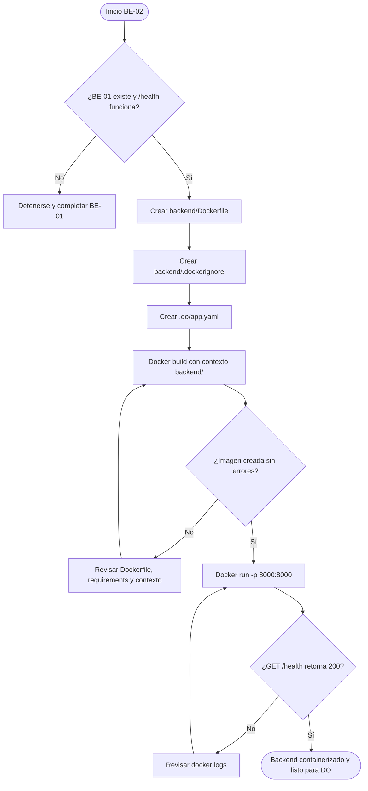
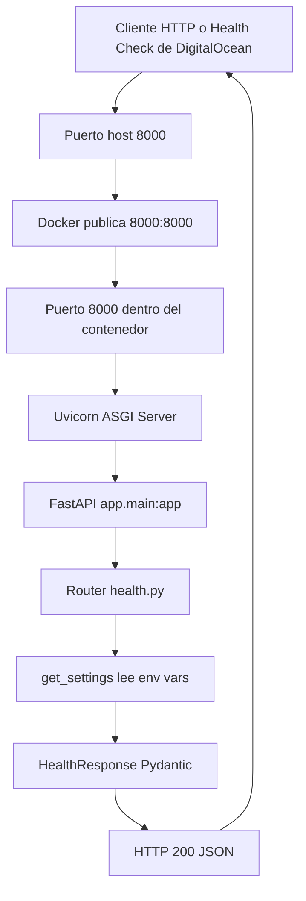
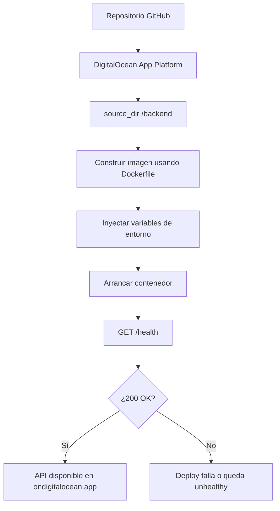

# Guía Didáctica BE-02: Dockerfile + Configuración DigitalOcean

---

## 🎓 1. Introducción y Fundamentos Conceptuales

### Recapitulación: lo que ya construiste en BE-01

En **BE-01** dejaste montado el esqueleto profesional del microservicio FastAPI del ISTQB Study Agent:

- `backend/app/main.py`: punto de entrada de FastAPI.
- `backend/app/routers/health.py`: endpoint público `GET /health`.
- `backend/app/models/schemas.py`: contrato Pydantic `HealthResponse`.
- `backend/app/core/config.py`: configuración tipada con `pydantic-settings`.
- `backend/requirements.txt`: dependencias base de FastAPI, Uvicorn, pdfplumber, PyMuPDF y configuración.
- `backend/.env` y `backend/.env.example`: variables de entorno locales y plantilla pública.

Ese backend ya puede correr localmente con Uvicorn y responder:

```json
{"status":"ok","version":"0.1.0"}
```

La guía **BE-02** convierte ese backend local en un artefacto portable: una **imagen Docker** lista para ejecutarse de forma reproducible en cualquier máquina y preparada para DigitalOcean App Platform.

### ¿Por qué containerizar ahora?

Una API que funciona en tu laptop no necesariamente funcionará igual en producción. Diferencias de versión de Python, librerías del sistema, rutas de archivos, variables de entorno o puertos pueden romper el deploy aunque el código sea correcto.

Docker resuelve ese problema empaquetando el backend con su runtime:

```text
Código FastAPI + requirements.txt + Python + librerías del sistema = Imagen Docker
Imagen Docker + variables de entorno + puerto = Contenedor ejecutándose
```

Analogía profesional: piensa en Docker como una **caja de envío industrial**. BE-01 construyó el producto; BE-02 diseña el embalaje exacto para que el producto llegue intacto a producción. DigitalOcean no necesita adivinar cómo ejecutar tu proyecto: solo construye la imagen y arranca el contenedor con el comando definido.

### Contenedor no es lo mismo que máquina virtual

Una máquina virtual trae un sistema operativo completo. Un contenedor comparte el kernel del host y solo empaqueta lo necesario para ejecutar la aplicación.

```text
Máquina virtual:
Host OS -> Hypervisor -> Guest OS completo -> Python -> FastAPI

Contenedor:
Host OS -> Docker Engine -> Python + dependencias -> FastAPI
```

Por eso Docker es ideal para este backend:

- Arranca rápido.
- Consume menos memoria que una VM.
- Hace reproducible el entorno.
- Evita instalar Python y dependencias manualmente en el servidor.
- Permite que DigitalOcean construya y ejecute la API de forma automatizada.

### ¿Qué problema resuelve el Dockerfile?

El `Dockerfile` es una receta declarativa. Cada instrucción responde una pregunta concreta:

| Instrucción | Pregunta que responde |
|---|---|
| `FROM python:3.12-slim` | ¿Qué runtime base usa la API? |
| `WORKDIR /app` | ¿Dónde vive el código dentro del contenedor? |
| `COPY requirements.txt .` | ¿Qué dependencias debe instalar? |
| `RUN pip install ...` | ¿Cómo se instalan esas dependencias? |
| `COPY app ./app` | ¿Qué código fuente se incluye? |
| `EXPOSE 8000` | ¿Qué puerto documenta el contenedor? |
| `CMD [...]` | ¿Qué proceso arranca cuando inicia el contenedor? |

La clave profesional es entender que una imagen Docker se compone de **capas**. Si copias primero `requirements.txt` y luego instalas dependencias, Docker puede reutilizar esa capa mientras no cambien las dependencias. Si copiaras todo el proyecto antes de instalar, cualquier cambio pequeño en `main.py` invalidaría la instalación completa y haría el build más lento.

### ASGI, Uvicorn y Docker

FastAPI no escucha conexiones directamente. FastAPI define la aplicación ASGI; Uvicorn es el servidor que abre el puerto HTTP y entrega cada request a FastAPI.

En local ejecutas algo como:

```text
uvicorn app.main:app --reload --host 0.0.0.0 --port 8000
```

En Docker y producción cambia un detalle importante: **no usamos `--reload`**. Ese flag es útil en desarrollo porque reinicia el servidor cuando editas archivos, pero en producción consume recursos y puede comportarse mal dentro de contenedores. En producción queremos un proceso estable:

```text
uvicorn app.main:app --host 0.0.0.0 --port 8000
```

El `--host 0.0.0.0` es obligatorio en contenedores. Si Uvicorn escuchara solo en `127.0.0.1`, aceptaría conexiones internas dentro del contenedor, pero Docker no podría exponer correctamente el servicio hacia tu máquina o hacia DigitalOcean.

### Variables de entorno en producción

En BE-01 definiste `Settings` con `pydantic-settings`. Esa decisión empieza a pagar dividendos en BE-02: el contenedor no necesita un archivo `.env` para producción. DigitalOcean inyectará las variables desde su panel o desde el App Spec.

Regla de seguridad:

- Variables no sensibles como `PROJECT_NAME`, `VERSION`, `DEBUG=false` pueden aparecer en `.do/app.yaml`.
- Secrets como `SUPABASE_SERVICE_ROLE_KEY`, `OPENAI_API_KEY` o tokens privados **nunca** deben quedar escritos en archivos versionados.
- Las credenciales de Supabase vienen de **DB-01**, donde creaste `.env.local` con `SUPABASE_URL`, `SUPABASE_ANON_KEY` y `SUPABASE_SERVICE_ROLE_KEY`.

En esta guía no conectamos todavía con Supabase. Esa conexión aparecerá más adelante, cuando el backend necesite procesar PDFs y coordinarse con el frontend. Aquí dejamos la infraestructura preparada sin exponer secrets.

---

## 📋 2. Prerequisitos y Verificación del Entorno

### A. Herramientas necesarias antes de empezar

| Herramienta | Comando de verificación | Versión mínima esperada | Uso en BE-02 |
|---|---|---|---|
| Python | `python --version` | 3.10+ | Mantener compatibilidad con el backend local |
| pip | `pip --version` | 21.0+ | Instalar dependencias si necesitas validar localmente |
| Git | `git --version` | 2.x | Repositorio que DigitalOcean conectará |
| Docker Desktop | `docker --version` | 24.x+ | Construir y ejecutar la imagen local |
| Docker Engine activo | `docker info --format "{{.OSType}}"` | `linux` | Confirmar que Docker puede construir contenedores Linux |
| Cuenta DigitalOcean | Verificación manual | App Platform disponible | Configuración futura del deploy |

Verifica Python:

```powershell
python --version
```

Salida esperada:

```text
Python 3.10.x o superior
```

Verifica pip:

```powershell
pip --version
```

Salida esperada:

```text
pip 24.x from ... (python 3.10 o superior)
```

Verifica Git:

```powershell
git --version
```

Salida esperada:

```text
git version 2.x.x
```

Verifica Docker:

```powershell
docker --version
```

Salida esperada:

```text
Docker version 24.x.x o superior, build ...
```

Verifica que Docker Desktop está corriendo y usando contenedores Linux:

```powershell
docker info --format "{{.OSType}}"
```

Salida esperada:

```text
linux
```

> [!WARNING]
> Si el comando anterior falla con `Cannot connect to the Docker daemon`, Docker Desktop no está abierto o todavía está iniciando. Abre Docker Desktop y espera a que diga que el engine está listo.

### B. Dependencia obligatoria: BE-01 completada

BE-02 depende directamente de **BE-01**. Antes de escribir el Dockerfile, deben existir estos entregables:

| Entregable de BE-01 | Ruta esperada | Debe existir |
|---|---|---|
| Aplicación FastAPI | `backend/app/main.py` | Sí |
| Router de health check | `backend/app/routers/health.py` | Sí |
| Schemas Pydantic | `backend/app/models/schemas.py` | Sí |
| Configuración tipada | `backend/app/core/config.py` | Sí |
| Dependencias Python | `backend/requirements.txt` | Sí |
| Plantilla de entorno | `backend/.env.example` | Sí |
| Guía previa | `docs/guides/be/BE-01.md` | Sí |

Ejecuta esta verificación desde la raíz del proyecto:

```powershell
Test-Path "backend\app\main.py"
Test-Path "backend\app\routers\health.py"
Test-Path "backend\app\models\schemas.py"
Test-Path "backend\app\core\config.py"
Test-Path "backend\requirements.txt"
Test-Path "backend\.env.example"
Test-Path "docs\guides\be\BE-01.md"
```

Salida esperada:

```text
True
True
True
True
True
True
True
```

Si alguno retorna `False`, detente y completa BE-01 antes de continuar.

### C. Dependencias cruzadas con base de datos

BE-02 no necesita conectarse a Supabase todavía. Sin embargo, en producción futura el backend tendrá que recibir variables sensibles creadas durante el bloque de base de datos:

- `SUPABASE_URL`: creada en **DB-01**, durante la configuración inicial del proyecto Supabase.
- `SUPABASE_SERVICE_ROLE_KEY`: creada en **DB-01** y reservada exclusivamente para servidor.
- Bucket privado `pdfs`: creado en **DB-03**.
- Políticas RLS y Storage: trabajadas en **DB-04**.

En esta guía solo dejamos preparada la estrategia: DigitalOcean recibirá secrets desde su dashboard, no desde archivos versionados.

### D. Archivos que todavía NO deben existir

Antes de empezar BE-02, estos archivos normalmente todavía no existen:

```powershell
Test-Path "backend\Dockerfile"
Test-Path "backend\.dockerignore"
Test-Path ".do\app.yaml"
```

Salida esperada si aún no has implementado BE-02:

```text
False
False
False
```

Si alguno ya existe, no lo borres automáticamente. Léelo, compara su contenido con esta guía y decide si debes actualizarlo manualmente.

---

## 📂 3. Estructura de Directorios del Proyecto

Después de completar BE-02, la estructura operativa del proyecto debe quedar así. Los elementos marcados como **[NUEVO BE-02]** son los entregables de esta guía. Los directorios generados o pesados se muestran sin expandir para mantener el árbol legible.

```text
practica-testing/
│
├── .antigravitycli/                         # Existente: configuración local de herramienta
├── .do/                                     # [NUEVO BE-02] Configuración DigitalOcean App Platform
│   └── app.yaml                             # [NUEVO BE-02] App Spec del backend
│
├── .env.example                             # Existente DB-01: plantilla pública global
├── .env.local                               # Existente DB-01: secrets locales, no versionar
├── .git/                                    # Existente: metadatos Git
├── .gitignore                               # Existente: excluye envs, venv y bytecode
│
├── backend/                                 # Backend FastAPI
│   ├── Dockerfile                           # [NUEVO BE-02] Receta de imagen Docker
│   ├── .dockerignore                        # [NUEVO BE-02] Exclusiones del contexto Docker
│   ├── .env                                 # Existente BE-01: variables locales, no versionar
│   ├── .env.example                         # Existente BE-01: plantilla pública del backend
│   ├── .idea/                               # Existente local: configuración del IDE, no relevante para deploy
│   ├── requirements.txt                     # Existente BE-01: dependencias Python
│   ├── venv/                                # Existente local: entorno virtual, no se copia a Docker
│   │
│   └── app/                                 # Paquete principal de FastAPI
│       ├── __init__.py                      # Existente BE-01
│       ├── __pycache__/                     # Generado por Python, ignorado por Docker
│       ├── main.py                          # Existente BE-01: instancia FastAPI + CORS + routers
│       │
│       ├── core/
│       │   ├── __init__.py                  # Existente BE-01
│       │   ├── __pycache__/                 # Generado por Python
│       │   └── config.py                    # Existente BE-01: Settings + get_settings()
│       │
│       ├── models/
│       │   ├── __init__.py                  # Existente BE-01
│       │   ├── __pycache__/                 # Generado por Python
│       │   └── schemas.py                   # Existente BE-01: HealthResponse
│       │
│       ├── routers/
│       │   ├── __init__.py                  # Existente BE-01
│       │   ├── __pycache__/                 # Generado por Python
│       │   └── health.py                    # Existente BE-01: GET /health
│       │
│       └── services/
│           └── __init__.py                  # Existente BE-01; servicios futuros BE-03/BE-04/BE-05
│
├── dev-tools/                               # Existente: utilidades locales del proyecto
│
├── docs/                                    # Documentación del proyecto
│   ├── architecture/
│   │   └── ISTQB_StudyAgent_ProjectDoc.md   # Existente: documento de arquitectura
│   ├── dev-agent/                           # Existente: documentación de agente/desarrollo
│   ├── roadmap/
│   │   └── ISTQB_Guias_Implementacion.md    # Existente: roadmap global
│   └── guides/
│       ├── db/
│       │   ├── DB-01.md                     # Existente: Supabase inicial
│       │   ├── DB-02.md                     # Existente: schema y constraints
│       │   ├── DB-03.md                     # Existente: Storage bucket privado
│       │   └── DB-04.md                     # Existente: RLS policies
│       └── be/
│           ├── BE-01.md                     # Existente: scaffold FastAPI
│           └── BE-02.md                     # [NUEVO BE-02] Esta guía
│
├── frontend/                                # Frontend Next.js futuro
│   ├── app/                                 # Existente vacío por ahora
│   ├── components/                          # Existente vacío por ahora
│   └── lib/                                 # Existente vacío por ahora
│
└── supabase/                                # Configuración y migraciones Supabase
    ├── .branches/                           # Existente: metadatos Supabase CLI
    ├── .gitignore                           # Existente: exclusiones de Supabase
    ├── .temp/                               # Existente: temporales Supabase CLI
    ├── config.toml                          # Existente DB-01
    ├── snippets/                            # Existente: snippets SQL auxiliares
    └── migrations/
        ├── 20260522183543_remote_schema.sql          # Existente DB-01
        ├── 20260531183745_create_schema.sql          # Existente DB-02
        ├── 20260531221544_create_storage_bucket.sql  # Existente DB-03
        └── 20260601015125_create_rls_policies.sql    # Existente DB-04
```

### Estructura interna del backend después de BE-02

La parte importante del backend quedará así:

```text
backend/
├── Dockerfile             # Nuevo: build reproducible para FastAPI
├── .dockerignore          # Nuevo: evita copiar venv, envs, caches y archivos locales
├── requirements.txt       # Ya existía: dependencias instaladas dentro de la imagen
└── app/
    ├── main.py            # Ya existía: Uvicorn importará app.main:app
    ├── core/config.py     # Ya existía: lee variables de entorno del contenedor
    ├── models/schemas.py  # Ya existía: valida responses
    ├── routers/health.py  # Ya existía: DigitalOcean usará /health como health check
    └── services/          # Ya existía: lógica futura para extracción PDF
```

---

## 🔄 4. Diagrama de Flujo del Proceso

### Flujo de build y ejecución local



### Flujo request/response dentro del contenedor



### Flujo futuro en DigitalOcean App Platform



---

## 🛠️ 5. Implementación Paso a Paso

### Paso A: Verificar el punto de partida de BE-01

Antes de crear archivos de Docker, confirma que el backend base sigue intacto.

Ejecuta desde la raíz del proyecto:

```powershell
Test-Path "backend\app\main.py"
Test-Path "backend\app\routers\health.py"
Test-Path "backend\requirements.txt"
```

Salida esperada:

```text
True
True
True
```

Si tienes el servidor local disponible, también puedes validar el endpoint de BE-01:

```powershell
Invoke-RestMethod -Uri "http://localhost:8000/health" -Method GET
```

Salida esperada:

```text
status version
------ -------
ok     0.1.0
```

Si el servidor no está corriendo, no pasa nada. Este paso solo confirma que BE-01 está funcional antes de encapsularlo.

**📦 Entregable del Paso A:**

- No se crea ningún archivo nuevo.
- Confirmación de que los entregables mínimos de BE-01 existen.
- Confirmación opcional de que `GET /health` responde correctamente.

---

### Paso B: Crear `backend/Dockerfile`

Ruta completa del archivo:

```text
c:\Users\jsife\OneDrive\Desktop\Repositorios\practica-testing\backend\Dockerfile
```

Crea el archivo `backend/Dockerfile` con el siguiente contenido completo:

```dockerfile
# syntax=docker/dockerfile:1

# ===============================================================
# Dockerfile — Backend FastAPI ISTQB Study Agent
# ===============================================================
# Objetivo:
#   Construir una imagen reproducible para ejecutar el microservicio
#   FastAPI en local, CI/CD y DigitalOcean App Platform.
#
# Decisiones principales:
#   - python:3.12-slim: runtime estable, liviano y compatible.
#   - WORKDIR /app: ruta estándar dentro del contenedor.
#   - Copiar requirements.txt antes que el código: mejora cache de Docker.
#   - No usar --reload: producción debe ejecutar un proceso estable.
# ===============================================================

FROM python:3.12-slim

# Evita crear archivos .pyc y fuerza logs sin buffer.
# Esto hace que los logs aparezcan inmediatamente en Docker y DigitalOcean.
ENV PYTHONDONTWRITEBYTECODE=1 \
    PYTHONUNBUFFERED=1 \
    PIP_NO_CACHE_DIR=1 \
    PORT=8000

# Directorio de trabajo dentro del contenedor.
WORKDIR /app

# Dependencias del sistema:
# - build-essential: útil para paquetes Python con extensiones nativas.
# - poppler-utils: soporte práctico para herramientas de procesamiento PDF.
#
# Aunque BE-02 solo prueba /health, las guías BE-03/BE-05 usarán pdfplumber
# y PyMuPDF. Instalar estas dependencias ahora reduce sorpresas en producción.
RUN apt-get update \
    && apt-get install -y --no-install-recommends \
        build-essential \
        poppler-utils \
    && rm -rf /var/lib/apt/lists/*

# Copiamos primero requirements.txt para aprovechar la cache de Docker.
# Si cambia el código pero no cambian las dependencias, esta capa se reutiliza.
COPY requirements.txt .

# Instalación de dependencias Python.
RUN python -m pip install --upgrade pip \
    && pip install -r requirements.txt

# Copiamos únicamente el paquete de aplicación.
# .dockerignore evita que entren venv, .env, caches y archivos locales.
COPY app ./app

# Puerto documentado del contenedor.
# DigitalOcean usará http_port: 8000 en el App Spec.
EXPOSE 8000

# Comando de arranque del contenedor.
# Usamos sh -c para permitir que ${PORT} venga del entorno de DigitalOcean.
# Si PORT no existe, cae al default 8000.
CMD ["sh", "-c", "uvicorn app.main:app --host 0.0.0.0 --port ${PORT:-8000}"]
```

#### Por qué este Dockerfile está diseñado así

| Bloque | Razón técnica |
|---|---|
| `python:3.12-slim` | Imagen más liviana que `python:3.12` completa y más estable para producción que una versión demasiado nueva. |
| `PYTHONUNBUFFERED=1` | Evita que los logs se queden en buffer; DigitalOcean los muestra en tiempo real. |
| `PIP_NO_CACHE_DIR=1` | Reduce tamaño de imagen al no conservar cache de paquetes. |
| `apt-get ... && rm -rf /var/lib/apt/lists/*` | Instala dependencias del sistema y limpia metadatos para reducir peso final. |
| `COPY requirements.txt .` antes de `COPY app ./app` | Optimiza la cache del build. |
| `CMD` sin `--reload` | Producción no debe usar autoreload. |
| `${PORT:-8000}` | Respeta `PORT` si DigitalOcean lo define, con fallback local a 8000. |

**📦 Entregable del Paso B:**

- Archivo `backend/Dockerfile` creado con el contenido completo anterior.

---

### Paso C: Crear `backend/.dockerignore`

Ruta completa del archivo:

```text
c:\Users\jsife\OneDrive\Desktop\Repositorios\practica-testing\backend\.dockerignore
```

El `.dockerignore` controla qué archivos quedan fuera del contexto de build. Esto es crítico por tres motivos:

- Seguridad: evita copiar `.env` con secrets dentro de la imagen.
- Rendimiento: evita enviar `venv/`, caches y bytecode a Docker.
- Reproducibilidad: la imagen debe depender del código fuente, no de archivos locales del IDE.

Crea `backend/.dockerignore` con el siguiente contenido completo:

```dockerignore
# ===============================================================
# .dockerignore — Backend FastAPI ISTQB Study Agent
# ===============================================================
# Todo lo listado aquí NO se envía al contexto de build de Docker.
# Mantener este archivo estricto evita imágenes pesadas y leaks de secrets.
# ===============================================================

# Entornos virtuales locales
venv/
.venv/
env/
ENV/

# Variables de entorno y secrets
.env
.env.*
!.env.example

# Bytecode y caches de Python
__pycache__/
*.py[cod]
*$py.class
.pytest_cache/
.mypy_cache/
.ruff_cache/
.coverage
htmlcov/

# Archivos del sistema operativo
.DS_Store
Thumbs.db

# IDEs y editores
.idea/
.vscode/
*.swp
*.swo

# Git y metadatos locales
.git/
.gitignore

# Logs y temporales
*.log
tmp/
temp/

# Documentación local no necesaria dentro de la imagen
README.md
*.md
```

#### Regla importante sobre `.env.example`

La línea `!.env.example` significa: aunque ignores `.env.*`, permite conservar `.env.example` si en algún momento decides copiarlo. En este Dockerfile no lo copiamos, pero mantener la excepción documenta la intención: las plantillas públicas son seguras; los archivos reales de entorno no.

**📦 Entregable del Paso C:**

- Archivo `backend/.dockerignore` creado con exclusiones de venv, envs, caches, IDEs y temporales.

---

### Paso D: Crear `.do/app.yaml` para DigitalOcean App Platform

Ruta completa del archivo:

```text
c:\Users\jsife\OneDrive\Desktop\Repositorios\practica-testing\.do\app.yaml
```

Primero crea la carpeta `.do` desde la raíz del proyecto:

```powershell
New-Item -ItemType Directory -Path ".do" -Force
```

Salida esperada:

```text
    Directory: C:\Users\jsife\OneDrive\Desktop\Repositorios\practica-testing

Mode                 LastWriteTime         Length Name
----                 -------------         ------ ----
d-----          ...                         .do
```

Ahora crea `.do/app.yaml` con este contenido completo:

```yaml
name: istqb-study-agent-backend
region: nyc

services:
  - name: api
    source_dir: /backend
    dockerfile_path: Dockerfile

    github:
      repo: TU_USUARIO_GITHUB/practica-testing
      branch: main
      deploy_on_push: true

    http_port: 8000
    instance_count: 1
    instance_size_slug: basic-xxs

    health_check:
      http_path: /health

    envs:
      - key: PROJECT_NAME
        scope: RUN_TIME
        value: ISTQB Study Agent API

      - key: VERSION
        scope: RUN_TIME
        value: 0.1.0

      - key: DESCRIPTION
        scope: RUN_TIME
        value: Microservicio de extracción y análisis de syllabus ISTQB

      - key: DEBUG
        scope: RUN_TIME
        value: "false"

      - key: HOST
        scope: RUN_TIME
        value: 0.0.0.0

      - key: PORT
        scope: RUN_TIME
        value: "8000"
```

#### Ajuste obligatorio antes de usarlo en DigitalOcean

Reemplaza esta línea:

```yaml
repo: TU_USUARIO_GITHUB/practica-testing
```

Por tu repositorio real, por ejemplo:

```yaml
repo: jsife/practica-testing
```

#### Por qué no ponemos secrets en `app.yaml`

En producción futura necesitarás variables como estas:

```text
SUPABASE_URL
SUPABASE_SERVICE_ROLE_KEY
OPENAI_API_KEY
```

No las escribas en `.do/app.yaml`. Aunque DigitalOcean permite variables secretas, esta guía mantiene el App Spec sin secrets para que sea seguro versionarlo. Cuando llegue BE-06, configurarás esas variables desde el dashboard de DigitalOcean o usando el mecanismo seguro de secrets de App Platform.

Referencia cruzada:

- Las credenciales de Supabase fueron obtenidas en **DB-01**.
- El `SUPABASE_SERVICE_ROLE_KEY` es de servidor y nunca debe exponerse al frontend.
- El frontend consumirá este backend desde futuras guías de Upload, especialmente **UP-03**, cuando Next.js llame a `POST /extract-pdf`.

**📦 Entregable del Paso D:**

- Carpeta `.do/` creada en la raíz del proyecto.
- Archivo `.do/app.yaml` creado con configuración base de DigitalOcean App Platform.
- Repositorio GitHub reemplazado por el valor real del proyecto.

---

### Paso E: Construir la imagen Docker localmente

Ejecuta desde la raíz del proyecto:

```powershell
docker build -t istqb-study-agent-backend:be-02 -f "backend\Dockerfile" "backend"
```

Salida esperada resumida:

```text
[+] Building ...
 => [internal] load build definition from Dockerfile
 => [internal] load .dockerignore
 => [internal] load metadata for docker.io/library/python:3.12-slim
 => [1/6] FROM docker.io/library/python:3.12-slim
 => [2/6] WORKDIR /app
 => [3/6] RUN apt-get update && apt-get install -y --no-install-recommends ...
 => [4/6] COPY requirements.txt .
 => [5/6] RUN python -m pip install --upgrade pip && pip install -r requirements.txt
 => [6/6] COPY app ./app
 => exporting to image
 => naming to docker.io/library/istqb-study-agent-backend:be-02
```

#### Entender el comando

| Parte | Significado |
|---|---|
| `docker build` | Construye una imagen Docker. |
| `-t istqb-study-agent-backend:be-02` | Asigna nombre y tag a la imagen. |
| `-f "backend\Dockerfile"` | Indica dónde está el Dockerfile. |
| `"backend"` | Usa `backend/` como contexto de build. |

El contexto `backend/` es importante. Como el Dockerfile contiene `COPY requirements.txt .`, Docker buscará `requirements.txt` dentro del contexto. Si usas la raíz del repo como contexto sin ajustar rutas, el build fallará.

Verifica que la imagen existe:

```powershell
docker image ls istqb-study-agent-backend
```

Salida esperada:

```text
REPOSITORY                  TAG       IMAGE ID       CREATED          SIZE
istqb-study-agent-backend   be-02     abc123def456   1 minute ago     450MB
```

**📦 Entregable del Paso E:**

- Imagen local `istqb-study-agent-backend:be-02` construida sin errores.

---

### Paso F: Ejecutar el contenedor localmente

Ejecuta la imagen y publica el puerto interno `8000` hacia tu máquina:

```powershell
docker run --rm --name istqb-backend-be02 -p 8000:8000 --env PORT=8000 istqb-study-agent-backend:be-02
```

Salida esperada:

```text
INFO:     Started server process [1]
INFO:     Waiting for application startup.
INFO:     Application startup complete.
INFO:     Uvicorn running on http://0.0.0.0:8000 (Press CTRL+C to quit)
```

Esta terminal quedará ocupada mientras el contenedor esté corriendo. Déjala abierta para el siguiente paso.

#### Qué significa `-p 8000:8000`

```text
-p HOST:CONTENEDOR
-p 8000:8000
```

El primer `8000` es el puerto de tu máquina Windows. El segundo `8000` es el puerto dentro del contenedor Linux. Cuando visitas `http://localhost:8000/health`, Docker redirige la request al contenedor.

**📦 Entregable del Paso F:**

- Contenedor `istqb-backend-be02` ejecutándose localmente.
- Uvicorn escuchando en `0.0.0.0:8000` dentro del contenedor.

---

### Paso G: Probar `/health` contra el contenedor

Abre una segunda terminal de PowerShell y ejecuta:

```powershell
Invoke-RestMethod -Uri "http://localhost:8000/health" -Method GET
```

Salida esperada:

```text
status version
------ -------
ok     0.1.0
```

Para ver el JSON crudo:

```powershell
(Invoke-WebRequest -Uri "http://localhost:8000/health" -Method GET).Content
```

Salida esperada:

```json
{"status":"ok","version":"0.1.0"}
```

También verifica Swagger UI:

```powershell
(Invoke-WebRequest -Uri "http://localhost:8000/docs" -Method GET).StatusCode
```

Salida esperada:

```text
200
```

**📦 Entregable del Paso G:**

- `GET /health` responde desde Docker con `status=ok`.
- `/docs` responde con HTTP `200` desde Docker.

---

### Paso H: Revisar logs y detener el contenedor

Desde otra terminal, revisa logs:

```powershell
docker logs istqb-backend-be02
```

Salida esperada:

```text
INFO:     Started server process [1]
INFO:     Waiting for application startup.
INFO:     Application startup complete.
INFO:     Uvicorn running on http://0.0.0.0:8000 (Press CTRL+C to quit)
INFO:     172.17.0.1:xxxxx - "GET /health HTTP/1.1" 200 OK
```

Detén el contenedor:

```powershell
docker stop istqb-backend-be02
```

Salida esperada:

```text
istqb-backend-be02
```

Como usaste `--rm`, Docker elimina el contenedor al detenerlo. La imagen permanece disponible.

**📦 Entregable del Paso H:**

- Logs revisados sin errores de importación ni arranque.
- Contenedor detenido correctamente.

---

### Paso I: Verificar que no versionaste secrets en DigitalOcean config

Ejecuta desde la raíz:

```powershell
Select-String -Path ".do\app.yaml" -Pattern "SUPABASE|SERVICE_ROLE|OPENAI|SECRET|sk-|eyJ|postgresql://"
```

Salida esperada:

```text
# Sin salida. El archivo no contiene nombres de secrets ni claves sensibles.
```

Ahora verifica que `.dockerignore` excluye `.env`:

```powershell
Select-String -Path "backend\.dockerignore" -Pattern "\.env"
```

Salida esperada:

```text
backend\.dockerignore:...:.env
backend\.dockerignore:...:.env.*
backend\.dockerignore:...:!.env.example
```

**📦 Entregable del Paso I:**

- Confirmación de que `.do/app.yaml` no contiene secrets.
- Confirmación de que `backend/.dockerignore` excluye archivos `.env` reales.

---

## ✅ 6. Checkpoints de Verificación

### Checkpoint 1: Archivos nuevos de BE-02 existen

```powershell
Test-Path "backend\Dockerfile"
Test-Path "backend\.dockerignore"
Test-Path ".do\app.yaml"
```

Salida esperada:

```text
True
True
True
```

### Checkpoint 2: La imagen Docker se construye sin errores

```powershell
docker build -t istqb-study-agent-backend:be-02 -f "backend\Dockerfile" "backend"
```

Salida esperada resumida:

```text
[+] Building ...
 => exporting to image
 => naming to docker.io/library/istqb-study-agent-backend:be-02
```

### Checkpoint 3: La imagen existe localmente

```powershell
docker image ls istqb-study-agent-backend
```

Salida esperada:

```text
REPOSITORY                  TAG       IMAGE ID       CREATED          SIZE
istqb-study-agent-backend   be-02     abc123def456   ...              ...
```

### Checkpoint 4: El contenedor responde `/health`

Primero arranca el contenedor:

```powershell
docker run --rm --name istqb-backend-be02 -p 8000:8000 --env PORT=8000 istqb-study-agent-backend:be-02
```

Salida esperada:

```text
INFO:     Uvicorn running on http://0.0.0.0:8000 (Press CTRL+C to quit)
```

En otra terminal prueba el endpoint:

```powershell
Invoke-RestMethod -Uri "http://localhost:8000/health" -Method GET
```

Salida esperada:

```text
status version
------ -------
ok     0.1.0
```

### Checkpoint 5: Swagger UI responde desde Docker

```powershell
(Invoke-WebRequest -Uri "http://localhost:8000/docs" -Method GET).StatusCode
```

Salida esperada:

```text
200
```

### Checkpoint 6: App Spec no contiene secrets

```powershell
Select-String -Path ".do\app.yaml" -Pattern "SUPABASE|SERVICE_ROLE|OPENAI|SECRET|sk-|eyJ|postgresql://"
```

Salida esperada:

```text
# Sin salida.
```

### Checklist resumen de entregables

| # | Entregable | Estado |
|---|---|---|
| 1 | `backend/Dockerfile` creado | ☐ |
| 2 | `backend/.dockerignore` creado | ☐ |
| 3 | `.do/` creado en la raíz | ☐ |
| 4 | `.do/app.yaml` creado | ☐ |
| 5 | `repo` en `.do/app.yaml` reemplazado por tu repo real | ☐ |
| 6 | Imagen `istqb-study-agent-backend:be-02` construida | ☐ |
| 7 | Contenedor responde `GET /health` con `status=ok` | ☐ |
| 8 | Swagger UI responde en `/docs` desde Docker | ☐ |
| 9 | `.dockerignore` excluye `.env` y `venv/` | ☐ |
| 10 | `.do/app.yaml` no contiene secrets | ☐ |

---

## 🚨 7. Troubleshooting — Problemas Comunes

| Problema | Causa Probable | Solución |
|---|---|---|
| `docker: The term 'docker' is not recognized` | Docker Desktop no está instalado o no está en el PATH | Instala Docker Desktop para Windows, reinicia PowerShell y ejecuta `docker --version` |
| `Cannot connect to the Docker daemon` | Docker Desktop no está abierto o el engine aún está iniciando | Abre Docker Desktop, espera a que esté listo y vuelve a ejecutar `docker info --format "{{.OSType}}"` |
| `failed to read dockerfile: open backend\Dockerfile: no such file or directory` | Estás ejecutando el build desde otra carpeta o el archivo no existe | Ejecuta desde la raíz del repo: `docker build -t istqb-study-agent-backend:be-02 -f "backend\Dockerfile" "backend"` |
| `COPY requirements.txt: file not found` | El contexto de build no es `backend/` | Usa el contexto correcto al final del comando: `"backend"` |
| `ModuleNotFoundError: No module named 'app'` | El Dockerfile no copió `app/` o el `WORKDIR` no es `/app` | Verifica que existan `WORKDIR /app`, `COPY app ./app` y `CMD ... app.main:app` |
| `ModuleNotFoundError: No module named 'fastapi'` | Las dependencias no se instalaron dentro de la imagen | Revisa que `COPY requirements.txt .` y `pip install -r requirements.txt` estén antes de `COPY app ./app`; reconstruye con `docker build ...` |
| Puerto 8000 ya en uso | Otro Uvicorn o contenedor está ocupando el puerto | Identifica el PID con el comando indicado debajo de la tabla, luego usa `Stop-Process -Id <PID>`; o cambia el mapeo a `-p 8001:8000` |
| `Bind for 0.0.0.0:8000 failed` | Docker no puede publicar el puerto porque ya está ocupado | Detén el proceso existente o ejecuta `docker run -p 8001:8000 ...` y prueba `http://localhost:8001/health` |
| El contenedor arranca y se apaga inmediatamente | Error en importación o comando `CMD` inválido | Ejecuta `docker logs istqb-backend-be02` si el contenedor existe, o vuelve a correr sin `--rm` para inspeccionarlo |
| `/health` funciona local pero DigitalOcean marca unhealthy | `http_port` o `health_check.http_path` no coincide con el backend | En `.do/app.yaml` confirma `http_port: 8000` y `health_check: http_path: /health` |
| Build lento o imagen demasiado pesada | `venv/`, caches o archivos locales entraron al contexto Docker | Revisa `backend/.dockerignore`; asegúrate de incluir `venv/`, `__pycache__/`, `.env` y caches |
| Secrets aparecen en la imagen o App Spec | `.env` no fue ignorado o alguien escribió claves en `.do/app.yaml` | Elimina secrets del archivo, rota las claves si se expusieron y valida buscando `SERVICE_ROLE`, `OPENAI` o `SUPABASE` en `.do/app.yaml` |

> [!NOTE]
> Para identificar qué proceso usa el puerto 8000, ejecuta en PowerShell:
> ```powershell
> netstat -ano | findstr :8000
> ```
> Salida esperada:
> ```text
> TCP    0.0.0.0:8000    0.0.0.0:0    LISTENING    12345
> ```

---

## 📝 8. Resumen y Próximo Paso

En esta guía deberías haber completado lo siguiente:

1. Verificaste que los entregables de **BE-01** existen y que `/health` sigue siendo el contrato mínimo del backend.
2. Creaste `backend/Dockerfile` con una imagen Python liviana, reproducible y preparada para FastAPI.
3. Creaste `backend/.dockerignore` para evitar copiar `venv/`, `.env`, caches, bytecode y archivos locales.
4. Creaste `.do/app.yaml` como configuración base para DigitalOcean App Platform.
5. Construiste la imagen local `istqb-study-agent-backend:be-02`.
6. Ejecutaste el contenedor con `docker run` publicando el puerto `8000`.
7. Confirmaste que `GET /health` responde correctamente desde Docker.
8. Confirmaste que `/docs` responde desde Docker.
9. Validaste que `.do/app.yaml` no contiene secrets.

Cuando termines, valida tu progreso con el validador de pasos usando una frase como:

```text
Valida mi progreso de la guía BE-02 en su sección 6
```

El próximo hito será **BE-03 — Endpoint POST /extract-pdf**. Ahí construirás el primer endpoint funcional del backend: recibirá un PDF vía `multipart/form-data`, lo leerá con `UploadFile`, extraerá texto usando `pdfplumber`, manejará errores de archivos inválidos y devolverá una respuesta estructurada para que el frontend pueda iniciar el flujo de generación del plan de estudio.
