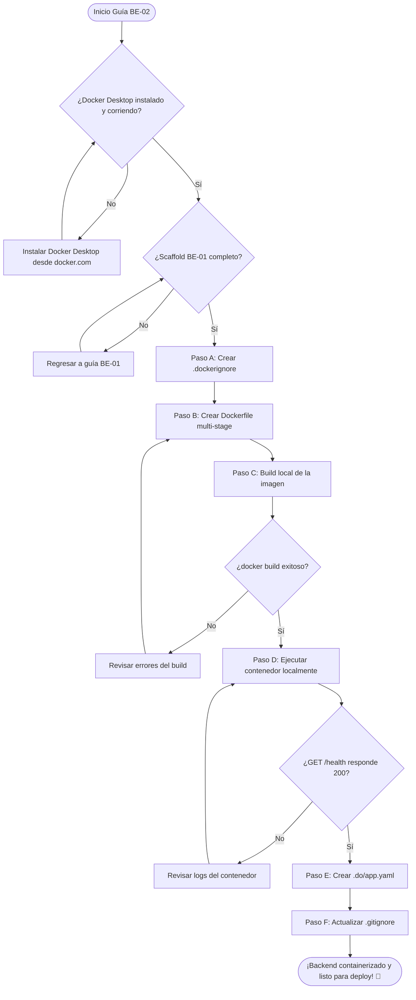
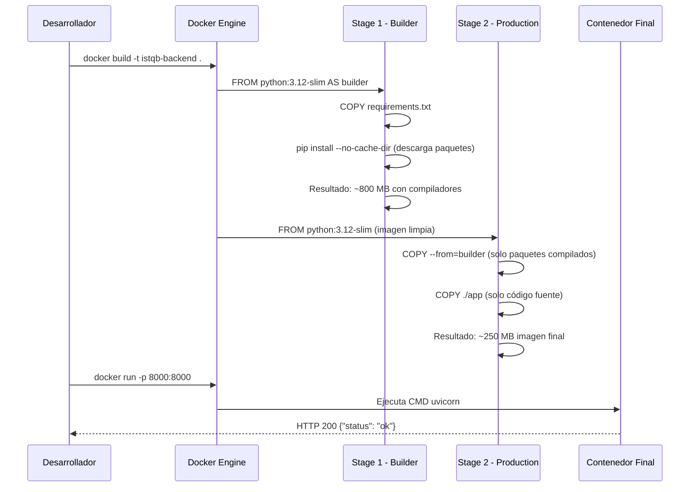
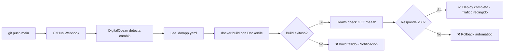

# Guía Didáctica BE-02: Dockerfile + Configuración DigitalOcean

---

## 🎓 1. Introducción y Fundamentos Conceptuales

### Recapitulación: ¿Dónde estamos?

En la guía anterior (**BE-01**) construiste el **scaffold completo** del microservicio FastAPI: la estructura de directorios (`app/core/`, `app/models/`, `app/routers/`, `app/services/`), la configuración centralizada con `pydantic-settings`, el modelo Pydantic `HealthResponse` y el endpoint `GET /health` que confirma que el backend está operativo. Todo esto corre localmente con `uvicorn app.main:app --reload` en `http://localhost:8000`.

Ahora damos el siguiente paso crítico: **empaquetar** ese backend para que pueda ejecutarse **en cualquier máquina del mundo**, no solo en tu laptop. Eso es exactamente lo que hace Docker — y es lo que configuraremos en esta guía junto con la especificación de despliegue para **DigitalOcean App Platform**.

### ¿Por qué Docker?

Imagina que llevas tu código Python a un servidor nuevo. Necesitarías:

1. Instalar la versión correcta de Python (3.10+).
2. Crear un entorno virtual.
3. Instalar todas las dependencias de `requirements.txt`.
4. Configurar las variables de entorno.
5. Asegurarte de que las librerías del sistema operativo necesarias para `pdfplumber` y `PyMuPDF` estén instaladas.
6. Ejecutar uvicorn con los parámetros correctos.

Si algo cambia en el servidor (una actualización del OS, una librería del sistema), todo podría romperse. Docker elimina este problema empaquetando **todo** — el código, las dependencias, el runtime y hasta el sistema operativo — en una **imagen inmutable** que se ejecuta de forma idéntica en desarrollo, staging y producción.

```
┌──────────────────────────────────────────────────────────────────────────────┐
│                         ¿POR QUÉ DOCKER?                                    │
├──────────────────────────────────────────────────────────────────────────────┤
│                                                                              │
│  1. PORTABILIDAD: "Funciona en mi máquina" → "Funciona en TODAS"            │
│  ┌────────────────────────────────────────────────────────────────────────┐  │
│  │  Sin Docker:                                                          │  │
│  │    Tu laptop (Windows) → OK ✅                                        │  │
│  │    Servidor Linux      → "ModuleNotFoundError" ❌                     │  │
│  │    Laptop del colega   → "Python 3.8 incompatible" ❌                 │  │
│  │                                                                       │  │
│  │  Con Docker:                                                          │  │
│  │    Tu laptop           → docker run → OK ✅                           │  │
│  │    Servidor Linux      → docker run → OK ✅                           │  │
│  │    Laptop del colega   → docker run → OK ✅                           │  │
│  │    DigitalOcean        → docker run → OK ✅                           │  │
│  └────────────────────────────────────────────────────────────────────────┘  │
│                                                                              │
│  2. AISLAMIENTO: El contenedor no contamina tu sistema ni viceversa         │
│     → Las dependencias de Python viven DENTRO del contenedor.               │
│     → No necesitas venv en producción; el contenedor ES el entorno.         │
│                                                                              │
│  3. REPRODUCIBILIDAD: La misma imagen que probaste localmente es            │
│     exactamente la que se ejecuta en DigitalOcean.                          │
│     → Elimina el "pero en mi máquina funciona".                             │
│                                                                              │
│  4. ESCALABILIDAD: Puedes correr N copias del mismo contenedor              │
│     detrás de un balanceador de carga si necesitas más capacidad.           │
│                                                                              │
└──────────────────────────────────────────────────────────────────────────────┘
```

### Analogía: El Contenedor de Envío

Piensa en Docker como los **contenedores de carga** que ves en los puertos marítimos:

- **Sin contenedor**: cada fabricante empaca sus productos de forma distinta. El puerto necesita grúas especiales, camiones de diferentes tamaños y personal especializado para cada tipo de carga. Es caos.
- **Con contenedor estándar**: todos los productos van dentro de una caja metálica de 20 o 40 pies. Cualquier barco, cualquier grúa, cualquier camión puede moverla. No importa si dentro hay televisores, ropa o comida — la interfaz externa es la misma.

Docker hace lo mismo con software:
- El **Dockerfile** es la **receta de empaque** — describe qué va dentro del contenedor.
- La **imagen Docker** es el **contenedor sellado** — inmutable, listo para enviar.
- El **contenedor en ejecución** es el **contenedor abierto en destino** — la app corriendo.
- **DigitalOcean App Platform** es el **puerto de destino** — recibe el contenedor y lo pone a funcionar.

### Conceptos Fundamentales de Docker

```
┌──────────────────────────────────────────────────────────────────────────────┐
│                    CONCEPTOS CLAVE DE DOCKER                                 │
├──────────────────────────────────────────────────────────────────────────────┤
│                                                                              │
│  DOCKERFILE                                                                  │
│  └── Archivo de texto con instrucciones paso a paso.                        │
│      Cada instrucción crea una "capa" (layer) de la imagen.                 │
│      Es como una receta de cocina: FROM (ingrediente base),                 │
│      COPY (agregar ingredientes), RUN (cocinar), CMD (servir).              │
│                                                                              │
│  IMAGEN (Image)                                                              │
│  └── Snapshot inmutable del sistema de archivos.                            │
│      Se construye con `docker build`.                                       │
│      Es como un ISO de un sistema operativo + tu app.                       │
│      Se versiona con "tags" (ej. mi-app:1.0, mi-app:latest).               │
│                                                                              │
│  CONTENEDOR (Container)                                                      │
│  └── Instancia en ejecución de una imagen.                                  │
│      Se crea con `docker run`.                                              │
│      Es como una VM liviana pero sin el overhead de un OS completo.         │
│      Tiene su propio filesystem, red y procesos aislados.                   │
│                                                                              │
│  LAYER (Capa)                                                                │
│  └── Cada instrucción del Dockerfile crea una capa.                         │
│      Las capas se cachean — si no cambias el código, la capa de             │
│      `pip install` no se re-ejecuta. Esto acelera los rebuilds.             │
│                                                                              │
│  MULTI-STAGE BUILD                                                           │
│  └── Técnica avanzada con múltiples FROM en un Dockerfile.                  │
│      Stage 1: instalar dependencias (imagen pesada con compiladores).       │
│      Stage 2: copiar solo lo necesario (imagen ligera, sin basura).         │
│      Resultado: imagen final mucho más pequeña y segura.                    │
│                                                                              │
└──────────────────────────────────────────────────────────────────────────────┘
```

### ¿Qué es DigitalOcean App Platform?

DigitalOcean App Platform es un servicio **PaaS** (Platform as a Service) que simplifica el despliegue de aplicaciones. En lugar de configurar manualmente un servidor Linux con Nginx, systemd y certificados SSL, App Platform:

1. **Detecta** tu repositorio de GitHub.
2. **Construye** la imagen Docker automáticamente.
3. **Despliega** el contenedor en su infraestructura.
4. **Maneja** HTTPS, health checks, logs y scaling.

El archivo `.do/app.yaml` es la **especificación declarativa** que le dice a App Platform exactamente cómo construir y ejecutar tu servicio.

```
┌──────────────────────────────────────────────────────────────────────────────┐
│              FLUJO DE DEPLOY CON DIGITALOCEAN APP PLATFORM                   │
├──────────────────────────────────────────────────────────────────────────────┤
│                                                                              │
│  1. git push origin main                                                     │
│           │                                                                  │
│           ▼                                                                  │
│  2. DigitalOcean detecta el push (webhook de GitHub)                        │
│           │                                                                  │
│           ▼                                                                  │
│  3. Lee .do/app.yaml para configuración                                     │
│           │                                                                  │
│           ▼                                                                  │
│  4. Ejecuta docker build con el Dockerfile                                  │
│           │                                                                  │
│           ▼                                                                  │
│  5. Crea contenedor con la imagen resultante                                │
│           │                                                                  │
│           ▼                                                                  │
│  6. Ejecuta health check: GET /health                                       │
│           │                                                                  │
│           ▼                                                                  │
│  7. Si responde 200 → tráfico se redirige al nuevo contenedor              │
│     Si falla → rollback automático al contenedor anterior                   │
│                                                                              │
└──────────────────────────────────────────────────────────────────────────────┘
```

---

## 📋 2. Prerrequisitos y Verificación del Entorno

### A. Herramientas del sistema

| Herramienta | Comando de verificación | Versión mínima | Propósito |
|---|---|---|---|
| Docker Desktop | `docker --version` | 24.0+ | Motor de contenedores |
| Docker Compose | `docker compose version` | 2.20+ | Incluido en Docker Desktop |
| Python | `python --version` | 3.10+ | Ya verificado en BE-01 |
| Git | `git --version` | 2.x | Ya verificado en BE-01 |

Ejecuta los siguientes comandos desde PowerShell para verificar:

```powershell
# Verificar Docker (DEBE estar instalado y corriendo)
docker --version
# Esperado: Docker version 27.x.x, build xxxxxxx

# Verificar que Docker está corriendo (el daemon debe estar activo)
docker info --format '{{.ServerVersion}}'
# Esperado: 27.x.x (o similar)
# Si da error "Cannot connect to the Docker daemon" → abrir Docker Desktop

# Verificar Docker Compose (incluido en Docker Desktop)
docker compose version
# Esperado: Docker Compose version v2.x.x
```

> [!CAUTION]
> **Si `docker --version` falla o Docker no está instalado**, descárgalo desde [docker.com/products/docker-desktop](https://www.docker.com/products/docker-desktop/). En Windows, Docker Desktop usa **WSL 2** como backend. Durante la instalación, habilita la integración con WSL 2 si se te pide.

> [!WARNING]
> **Docker Desktop debe estar CORRIENDO** antes de ejecutar cualquier comando `docker`. Búscalo en la bandeja del sistema (ícono de ballena). Si no está activo, ábrelo y espera a que el ícono muestre "Docker Desktop is running".

### B. Entregables previos de BE-01

Verifica que los siguientes archivos y directorios existen:

```powershell
# Verificar que el scaffold de BE-01 está completo
Test-Path "backend\app\main.py"
# Esperado: True

Test-Path "backend\app\routers\health.py"
# Esperado: True

Test-Path "backend\app\core\config.py"
# Esperado: True

Test-Path "backend\app\models\schemas.py"
# Esperado: True

Test-Path "backend\requirements.txt"
# Esperado: True

Test-Path "backend\.env"
# Esperado: True
```

> [!IMPORTANT]
> **Si alguno retorna `False`**, regresa a la guía [BE-01](file:///c:/Users/jsife/OneDrive/Desktop/Repositorios/practica-testing/docs/guides/be/BE-01.md) y completa los pasos faltantes antes de continuar. BE-02 depende **directamente** de tener el scaffold funcional de BE-01.

### C. Verificar que el backend corre localmente

Antes de containerizar, asegúrate de que el servidor arranca sin errores:

```powershell
# Desde la carpeta backend/, con el venv activado
cd backend
.\venv\Scripts\Activate.ps1
uvicorn app.main:app --host 0.0.0.0 --port 8000
```

*Salida esperada:*
```text
INFO:     Started server process [xxxx]
INFO:     Waiting for application startup.
INFO:     Application startup complete.
INFO:     Uvicorn running on http://0.0.0.0:8000 (Press CTRL+C to quit)
```

Prueba rápida en otra terminal:

```powershell
# En una NUEVA terminal de PowerShell
Invoke-RestMethod -Uri "http://localhost:8000/health"
# Esperado: 
# status version
# ------ -------
# ok     0.1.0
```

Si todo responde correctamente, detén el servidor con `Ctrl+C` y continúa.

---

## 📂 3. Estructura de Directorios del Proyecto

Después de completar esta guía, tu proyecto tendrá la siguiente estructura. Los archivos marcados con **[NUEVO]** son los que crearás:

```
practica-testing/
│
├── supabase/                                # [CAPA DE BASE DE DATOS]
│   ├── config.toml                          # Configuración de Supabase (DB-01)
│   └── migrations/                          # Migraciones SQL
│       ├── 20260522183543_remote_schema.sql # Migración inicial (DB-01)
│       ├── 20260531183745_create_schema.sql # Tablas y constraints (DB-02)
│       ├── 20260531221544_create_storage_bucket.sql # Storage (DB-03)
│       └── 20260601015125_create_rls_policies.sql   # RLS (DB-04)
│
├── backend/                                 # [CAPA DE EXTRACCIÓN] (FastAPI/Python)
│   ├── app/                                 # Paquete principal (BE-01)
│   │   ├── __init__.py                      # Marca app/ como paquete
│   │   ├── main.py                          # Punto de entrada de FastAPI
│   │   ├── core/                            # Configuración
│   │   │   ├── __init__.py
│   │   │   └── config.py                    # Variables de entorno
│   │   ├── models/                          # Schemas Pydantic
│   │   │   ├── __init__.py
│   │   │   └── schemas.py                   # HealthResponse
│   │   ├── routers/                         # Endpoints HTTP
│   │   │   ├── __init__.py
│   │   │   └── health.py                    # GET /health
│   │   └── services/                        # Lógica de negocio
│   │       └── __init__.py
│   ├── requirements.txt                     # Dependencias Python (BE-01)
│   ├── .env                                 # Variables de entorno dev (BE-01)
│   ├── .env.example                         # Plantilla pública (BE-01)
│   ├── Dockerfile                           # [NUEVO] Receta de imagen Docker
│   ├── .dockerignore                        # [NUEVO] Exclusiones del build
│   └── venv/                               # Entorno virtual (excluido de Git y Docker)
│
├── .do/                                     # [NUEVO] Configuración DigitalOcean
│   └── app.yaml                             # [NUEVO] Spec de App Platform
│
├── frontend/                                # [CAPA DE INTERFAZ] (Next.js 14+)
│   └── ...                                  # (sin cambios en esta guía)
│
├── docs/                                    # [DOCUMENTACIÓN Y GUÍAS]
│   ├── architecture/
│   │   └── ISTQB_StudyAgent_ProjectDoc.md   # Documento de arquitectura
│   ├── roadmap/
│   │   └── ISTQB_Guias_Implementacion.md    # Hoja de ruta global
│   └── guides/
│       ├── db/
│       │   ├── DB-01.md                     # Completada ✅
│       │   ├── DB-02.md                     # Completada ✅
│       │   ├── DB-03.md                     # Completada ✅
│       │   └── DB-04.md                     # Completada ✅
│       └── be/
│           ├── BE-01.md                     # Completada ✅
│           └── BE-02.md                     # [NUEVO] Esta guía
│
├── .env.example                             # Plantilla global (DB-01)
├── .env.local                               # Variables secretas locales (DB-01)
└── .gitignore                               # Exclusiones de Git (DB-01)
```

> [!NOTE]
> Observa que el `Dockerfile` y `.dockerignore` van **dentro de `backend/`** porque containerizamos solo el microservicio Python. El archivo `.do/app.yaml` va **en la raíz del proyecto** dentro de un directorio `.do/` porque DigitalOcean App Platform lo busca ahí para configurar todo el despliegue.

---

## 🔄 4. Diagrama de Flujo del Proceso

### Flujo de la guía BE-02:



### Diagrama del proceso de build Docker:



### Flujo de deploy a DigitalOcean:



---

## 🛠️ 5. Implementación Paso a Paso

### Paso A: Crear `.dockerignore` — Exclusiones del Build

El archivo `.dockerignore` funciona exactamente como `.gitignore`, pero para Docker. Le dice al **daemon de Docker** qué archivos y directorios **NO** incluir cuando ejecuta `COPY` en el Dockerfile.

¿Por qué es importante? Porque cuando ejecutas `docker build`, Docker envía **todo el contenido del directorio** (el "build context") al daemon. Si incluyes `venv/` (que pesa ~50-100 MB) o `__pycache__/`, el build será más lento y la imagen final más pesada — sin ningún beneficio.

Crea el archivo `backend/.dockerignore` con el siguiente contenido:

```text
# ═══════════════════════════════════════════════════════════════
# .dockerignore — Backend ISTQB Study Agent
# ═══════════════════════════════════════════════════════════════
#
# Archivos y directorios excluidos del "build context" de Docker.
# Esto acelera el build y reduce el tamaño de la imagen final.
# ═══════════════════════════════════════════════════════════════

# --- Entorno virtual de Python ---
# El contenedor instala sus propias dependencias desde
# requirements.txt. No necesita el venv local.
venv/
.venv/

# --- Bytecode compilado de Python ---
# Python los regenera automáticamente al importar módulos.
# Incluirlos sería basura innecesaria en la imagen.
__pycache__/
*.py[cod]
*$py.class
*.pyo

# --- Variables de entorno locales ---
# Los secrets NO deben estar en la imagen Docker.
# En producción, se inyectan como variables de entorno
# del contenedor (configuradas en DigitalOcean dashboard).
.env
.env.local
.env.*.local

# --- IDE y editor ---
.idea/
.vscode/
*.swp
*.swo
*~

# --- Git ---
.git/
.gitignore

# --- Docker (evitar recursión) ---
Dockerfile
.dockerignore
docker-compose*.yml

# --- Tests y documentación ---
tests/
docs/
*.md
LICENSE

# --- Archivos del sistema operativo ---
.DS_Store
Thumbs.db
```

**¿Por qué excluir cada cosa?**

| Exclusión | Razón | Ahorro estimado |
|---|---|---|
| `venv/` | El contenedor instala sus propias dependencias | ~50-100 MB |
| `__pycache__/` | Python los regenera al importar | ~1-5 MB |
| `.env` | Los secrets se inyectan como variables de entorno | Seguridad |
| `.git/` | El historial de Git no se necesita en producción | ~10-50 MB |
| `.idea/` | Configuración del IDE es local | ~5 MB |
| `Dockerfile` | No necesita copiarse a sí mismo | Limpieza |

> [!IMPORTANT]
> **Seguridad crítica:** Nunca incluyas archivos `.env` en la imagen Docker. Si lo haces, cualquiera que tenga acceso a la imagen podría extraer tus `SUPABASE_SERVICE_ROLE_KEY` y otros secrets con `docker inspect` o `docker cp`. Las variables de entorno se configuran en DigitalOcean dashboard, no en la imagen.

**📦 Entregable del Paso A:**
- Archivo `backend/.dockerignore` creado con exclusiones documentadas.

---

### Paso B: Crear `Dockerfile` — La Receta de la Imagen

El Dockerfile describe cada paso para construir la imagen Docker de nuestro backend. Usaremos la técnica de **multi-stage build** para producir una imagen optimizada.

#### ¿Qué es un Multi-Stage Build?

Un multi-stage build divide la construcción en fases:

```
┌──────────────────────────────────────────────────────────────────────────────┐
│                    MULTI-STAGE BUILD EXPLICADO                                │
├──────────────────────────────────────────────────────────────────────────────┤
│                                                                              │
│  STAGE 1: "builder" (Etapa de construcción)                                  │
│  ├── Usa una imagen con herramientas de compilación.                        │
│  ├── Instala las dependencias de requirements.txt.                          │
│  ├── Algunas dependencias (como PyMuPDF) necesitan compilar                 │
│  │   código C/C++ — requieren gcc, g++, headers del OS.                     │
│  └── Esta stage pesa ~800 MB pero NO va a producción.                       │
│                                                                              │
│  STAGE 2: "production" (Etapa final)                                         │
│  ├── Parte de una imagen LIMPIA (sin compiladores).                         │
│  ├── COPIA solo los paquetes ya compilados del Stage 1.                     │
│  ├── COPIA el código fuente de la aplicación.                               │
│  └── Imagen final: ~250 MB (en lugar de ~800 MB).                           │
│                                                                              │
│  ANALOGÍA: Es como cocinar en un restaurante profesional.                   │
│  Stage 1 = La cocina trasera (desordenada, con ingredientes crudos).        │
│  Stage 2 = El plato final (limpio, solo lo que el cliente ve).              │
│                                                                              │
└──────────────────────────────────────────────────────────────────────────────┘
```

Crea el archivo `backend/Dockerfile` con el siguiente contenido:

```dockerfile
# ═══════════════════════════════════════════════════════════════
# Dockerfile — Backend ISTQB Study Agent (FastAPI)
# ═══════════════════════════════════════════════════════════════
#
# Multi-stage build optimizado para producción en DigitalOcean.
#
# Stage 1 (builder):
#   - Instala dependencias de compilación temporales.
#   - Compila las dependencias Python de requirements.txt.
#   - Esta etapa NO se incluye en la imagen final.
#
# Stage 2 (production):
#   - Imagen limpia basada en python:3.12-slim.
#   - Copia solo los paquetes compilados y el código fuente.
#   - Resultado: imagen pequeña (~250 MB) y segura.
#
# Build:  docker build -t istqb-backend .
# Run:    docker run -p 8000:8000 istqb-backend
# ═══════════════════════════════════════════════════════════════


# ───────────────────────────────────────────────────────────────
# STAGE 1: Builder — Instalación de dependencias
# ───────────────────────────────────────────────────────────────
#
# python:3.12-slim es la variante "delgada" de la imagen oficial
# de Python. Incluye solo lo mínimo para ejecutar Python, sin
# herramientas de desarrollo innecesarias.
#
# "AS builder" le da un nombre a esta etapa para referenciarla
# desde la siguiente con COPY --from=builder.
# ───────────────────────────────────────────────────────────────
FROM python:3.12-slim AS builder

# Instalar dependencias del sistema operativo necesarias para
# compilar paquetes Python con extensiones nativas (C/C++).
#
# - build-essential: incluye gcc, g++, make (compiladores C/C++).
#   PyMuPDF y algunas dependencias de pdfplumber necesitan
#   compilar código nativo durante `pip install`.
#
# - libffi-dev: headers de la librería Foreign Function Interface.
#   Usada por cffi (dependencia de cryptography y otros).
#
# Las 3 líneas (update, install, rm) se ejecutan en un solo RUN
# para crear una sola capa y reducir el tamaño de la imagen.
RUN apt-get update && \
    apt-get install -y --no-install-recommends \
        build-essential \
        libffi-dev \
    && rm -rf /var/lib/apt/lists/*

# Definir el directorio de trabajo dentro del contenedor.
# Todos los comandos siguientes se ejecutan desde /app.
WORKDIR /app

# Copiar SOLO el archivo de dependencias primero.
#
# ¿Por qué? Docker cachea cada capa (layer). Si copiamos
# requirements.txt por separado y no ha cambiado, Docker
# reutiliza la capa de `pip install` del build anterior.
#
# Esto es CRÍTICO para velocidad de desarrollo:
# - Si solo cambias código Python → rebuild en segundos.
# - Si cambias requirements.txt → rebuild completo (~2 min).
COPY requirements.txt .

# Instalar las dependencias Python.
#
# --no-cache-dir: no guardar la caché de pip dentro de la imagen.
#   Ahorra ~50-100 MB de archivos temporales.
#
# --prefix=/install: instalar en un directorio especial en lugar
#   del directorio default de Python. Esto nos permite copiar
#   SOLO los paquetes instalados al Stage 2 con COPY --from.
RUN pip install --no-cache-dir --prefix=/install -r requirements.txt


# ───────────────────────────────────────────────────────────────
# STAGE 2: Production — Imagen final optimizada
# ───────────────────────────────────────────────────────────────
#
# Partimos de una imagen NUEVA y limpia, sin los compiladores
# ni archivos temporales del Stage 1.
# ───────────────────────────────────────────────────────────────
FROM python:3.12-slim

# Metadata de la imagen siguiendo las convenciones OCI.
# Esto es informativo — no afecta el comportamiento.
LABEL maintainer="Juan Sifuentes <jsifuentes@example.com>"
LABEL description="ISTQB Study Agent — FastAPI PDF extraction microservice"
LABEL version="0.1.0"

# Configurar variables de entorno de Python para producción.
#
# PYTHONDONTWRITEBYTECODE=1
#   → No crear archivos .pyc (bytecode compilado).
#   → En un contenedor no necesitamos .pyc porque el código
#     no cambia en runtime. Ahorra espacio en disco.
#
# PYTHONUNBUFFERED=1
#   → Desactivar el buffering de stdout/stderr.
#   → Los logs de print() y logging aparecen inmediatamente
#     en `docker logs` sin esperar a que se llene el buffer.
#   → Crítico para debugging en producción.
ENV PYTHONDONTWRITEBYTECODE=1 \
    PYTHONUNBUFFERED=1

WORKDIR /app

# Copiar los paquetes Python compilados del Stage 1.
#
# --from=builder: indica que el origen es la etapa "builder".
# /install/lib → contiene los site-packages de Python.
# /install/bin → contiene los scripts ejecutables (uvicorn, etc.).
#
# Esto es el truco del multi-stage build: copiamos solo el
# resultado de la compilación, sin los compiladores pesados.
COPY --from=builder /install/lib /usr/local/lib
COPY --from=builder /install/bin /usr/local/bin

# Copiar el código fuente de la aplicación.
#
# El .dockerignore se encarga de excluir venv/, __pycache__/,
# .env y otros archivos que no deben estar en la imagen.
COPY ./app ./app

# Exponer el puerto 8000.
#
# EXPOSE es declarativo — documenta que el contenedor escucha
# en el puerto 8000. No abre el puerto; eso lo hace -p al
# ejecutar `docker run -p 8000:8000`.
EXPOSE 8000

# Comando de inicio del contenedor.
#
# uvicorn: servidor ASGI que ejecuta FastAPI.
# app.main:app: módulo y variable de la instancia FastAPI.
# --host 0.0.0.0: escuchar en todas las interfaces de red
#   (necesario dentro del contenedor para que el tráfico
#   externo pueda llegar a la aplicación).
# --port 8000: puerto de escucha.
#
# NO usamos --reload en producción porque:
# 1. No hay archivos que cambien en un contenedor inmutable.
# 2. --reload consume CPU innecesariamente.
# 3. --reload importa watchfiles que no está instalado.
CMD ["uvicorn", "app.main:app", "--host", "0.0.0.0", "--port", "8000"]
```

**Conceptos clave explicados línea por línea:**

| Instrucción Dockerfile | Qué hace | Analogía |
|---|---|---|
| `FROM python:3.12-slim AS builder` | Define la imagen base del Stage 1 | "Empezar con una cocina equipada" |
| `RUN apt-get install build-essential` | Instala compiladores C/C++ | "Traer las herramientas pesadas" |
| `COPY requirements.txt .` | Copia solo el listado de dependencias | "Pedir los ingredientes por nombre" |
| `RUN pip install --prefix=/install` | Compila e instala las dependencias | "Cocinar los ingredientes" |
| `FROM python:3.12-slim` | Inicia Stage 2 con imagen limpia | "Pasar a un plato limpio" |
| `COPY --from=builder /install/lib` | Copia solo los paquetes compilados | "Servir solo el plato terminado" |
| `COPY ./app ./app` | Copia el código fuente | "Agregar la guarnición final" |
| `EXPOSE 8000` | Documenta el puerto | "Poner el número de mesa" |
| `CMD ["uvicorn", ...]` | Define el comando de inicio | "Decir '¡servido!'" |

> [!TIP]
> **¿Por qué `python:3.12-slim` y no `python:3.12-alpine`?** Alpine Linux usa `musl` en lugar de `glibc`, lo que causa problemas de compatibilidad con muchas librerías Python que tienen extensiones C (como PyMuPDF). `slim` está basada en Debian y es compatible con todo, con solo ~50 MB más que Alpine.

**📦 Entregable del Paso B:**
- Archivo `backend/Dockerfile` creado con multi-stage build documentado.

---

### Paso C: Build Local de la Imagen Docker

Ahora vamos a construir la imagen Docker localmente para verificar que todo funciona antes de enviarla a DigitalOcean.

```powershell
# Navegar al directorio del backend (donde está el Dockerfile)
cd backend

# Construir la imagen Docker
# -t istqb-backend: asigna el nombre (tag) "istqb-backend" a la imagen
# . : el punto indica que el "build context" es el directorio actual
docker build -t istqb-backend .
```

*Salida esperada (proceso completo, ~2-5 minutos la primera vez):*
```text
[+] Building 120.5s (14/14) FINISHED
 => [internal] load build definition from Dockerfile                    0.0s
 => [internal] load .dockerignore                                       0.0s
 => [internal] load metadata for docker.io/library/python:3.12-slim    1.2s
 => [builder 1/4] FROM docker.io/library/python:3.12-slim@sha256:...   5.3s
 => [builder 2/4] RUN apt-get update && apt-get install -y ...        25.4s
 => [builder 3/4] COPY requirements.txt .                              0.0s
 => [builder 4/4] RUN pip install --no-cache-dir --prefix=/install ... 65.2s
 => [stage-1 1/4] FROM docker.io/library/python:3.12-slim@sha256:...   0.0s
 => [stage-1 2/4] COPY --from=builder /install/lib /usr/local/lib      3.1s
 => [stage-1 3/4] COPY --from=builder /install/bin /usr/local/bin      0.1s
 => [stage-1 4/4] COPY ./app ./app                                     0.0s
 => exporting to image                                                  2.3s
 => => naming to docker.io/library/istqb-backend                        0.0s
```

Verifica que la imagen fue creada:

```powershell
# Listar imágenes Docker locales
docker images istqb-backend
```

*Salida esperada:*
```text
REPOSITORY       TAG       IMAGE ID       CREATED          SIZE
istqb-backend    latest    a1b2c3d4e5f6   30 seconds ago   250MB
```

> [!NOTE]
> El tamaño de ~250 MB es normal para una imagen Python con las dependencias de procesamiento de PDFs. Sin el multi-stage build, sería de ~800 MB o más. En builds subsecuentes (cuando solo cambias código Python, no `requirements.txt`), Docker reutiliza las capas cacheadas y el build toma solo **2-5 segundos**.

**📦 Entregable del Paso C:**
- Imagen Docker `istqb-backend` construida localmente sin errores.

---

### Paso D: Ejecutar el Contenedor Localmente

Ahora ejecutaremos la imagen como un contenedor para verificar que el backend funciona dentro de Docker exactamente igual que fuera de él.

```powershell
# Ejecutar el contenedor
# -d: modo "detached" (en segundo plano)
# --name istqb-api: nombre del contenedor (para referenciarlo después)
# -p 8000:8000: mapear puerto 8000 del host al puerto 8000 del contenedor
docker run -d --name istqb-api -p 8000:8000 istqb-backend
```

*Salida esperada:*
```text
a1b2c3d4e5f6g7h8i9j0k1l2m3n4o5p6q7r8s9t0u1v2w3x4y5z6
```

(El hash largo es el ID del contenedor — significa que se creó exitosamente)

#### D.1. Verificar que el contenedor está corriendo

```powershell
# Listar contenedores en ejecución
docker ps
```

*Salida esperada:*
```text
CONTAINER ID   IMAGE           COMMAND                  STATUS          PORTS                    NAMES
a1b2c3d4e5f6   istqb-backend   "uvicorn app.main:ap…"   Up 5 seconds   0.0.0.0:8000->8000/tcp   istqb-api
```

#### D.2. Probar el endpoint /health desde el host

```powershell
# Probar el health check (el contenedor está sirviendo en localhost:8000)
Invoke-RestMethod -Uri "http://localhost:8000/health"
```

*Salida esperada:*
```text
status version
------ -------
ok     0.1.0
```

#### D.3. Verificar Swagger UI

Abre un navegador y ve a:
```
http://localhost:8000/docs
```

Deberías ver la interfaz de Swagger UI idéntica a cuando corres el backend sin Docker.

#### D.4. Revisar los logs del contenedor

```powershell
# Ver los logs del contenedor
docker logs istqb-api
```

*Salida esperada:*
```text
INFO:     Started server process [1]
INFO:     Waiting for application startup.
INFO:     Application startup complete.
INFO:     Uvicorn running on http://0.0.0.0:8000 (Press CTRL+C to quit)
INFO:     172.17.0.1:xxxxx - "GET /health HTTP/1.1" 200 OK
```

#### D.5. Limpiar el contenedor de prueba

```powershell
# Detener el contenedor
docker stop istqb-api

# Eliminar el contenedor
docker rm istqb-api
```

*Salida esperada para cada comando:*
```text
istqb-api
```

> [!TIP]
> **Atajo para detener y eliminar en un solo paso:**
> ```powershell
> docker rm -f istqb-api
> ```
> El flag `-f` (force) detiene el contenedor si está corriendo y luego lo elimina.

**📦 Entregable del Paso D:**
- Contenedor `istqb-api` ejecutado exitosamente.
- `GET /health` respondió `200 OK` desde el contenedor.
- Swagger UI visible en `http://localhost:8000/docs`.
- Contenedor limpiado (detenido y eliminado).

---

### Paso E: Crear `.do/app.yaml` — Especificación de DigitalOcean

El archivo `app.yaml` es la **especificación declarativa** que le dice a DigitalOcean App Platform cómo construir, ejecutar y monitorear tu servicio. Es como un contrato: defines lo que quieres, y DigitalOcean se encarga de implementarlo.

Primero, crea el directorio `.do/` en la **raíz del proyecto** (no dentro de `backend/`):

```powershell
# Desde la raíz del proyecto (practica-testing/)
New-Item -ItemType Directory -Path ".do" -Force
```

*Salida esperada:*
```text
    Directory: C:\Users\jsife\OneDrive\Desktop\Repositorios\practica-testing

Mode                 LastWriteTime         Length Name
----                 -------------         ------ ----
d-----          6/2/2026  ...                     .do
```

Ahora crea el archivo `.do/app.yaml` con el siguiente contenido:

```yaml
# ═══════════════════════════════════════════════════════════════
# app.yaml — DigitalOcean App Platform Spec
# ═══════════════════════════════════════════════════════════════
#
# Este archivo define cómo DigitalOcean construye y despliega
# el microservicio FastAPI del ISTQB Study Agent.
#
# Referencia de la spec:
# https://docs.digitalocean.com/products/app-platform/reference/app-spec/
#
# Para aplicar cambios sin usar el dashboard:
#   doctl apps update <APP_ID> --spec .do/app.yaml
# ═══════════════════════════════════════════════════════════════

# Nombre de la aplicación en el dashboard de DigitalOcean.
# Este nombre aparece en la URL generada automáticamente:
# https://istqb-study-agent-api-xxxxx.ondigitalocean.app
name: istqb-study-agent-api

# Región del datacenter donde se despliega la aplicación.
# "nyc" = New York. Elegimos una región cercana para baja latencia.
# Opciones comunes: nyc, sfo, ams, sgp, lon, fra, tor, blr, syd.
region: nyc

# ─── Servicios ───
# Un "service" en App Platform es un proceso que recibe tráfico
# HTTP público. Para workers (procesos sin tráfico HTTP), se
# usa la clave "workers" en lugar de "services".
services:
  # Nombre interno del servicio (usado en logs y métricas).
  - name: api

    # ─── Fuente del código ───
    # App Platform clonará este repositorio de GitHub para
    # construir la imagen Docker.
    github:
      # Formato: usuario/repositorio
      # IMPORTANTE: Reemplaza con tu usuario real de GitHub.
      repo: JuanSifuentesF/practica-testing
      # Branch a monitorear. Cada push a este branch
      # dispara un re-deploy automático.
      branch: main
      # Activar deploys automáticos al detectar nuevos commits.
      deploy_on_push: true

    # ─── Configuración del build ───
    # Ruta al Dockerfile RELATIVA a la raíz del repositorio.
    dockerfile_path: backend/Dockerfile

    # Directorio raíz del "build context" de Docker.
    # Docker ejecutará el build DESDE este directorio.
    # Es equivalente al "." en `docker build .` pero relativo
    # a la raíz del repo.
    source_dir: backend

    # ─── Tipo de instancia ───
    # "basic-xxs" es el plan más económico de App Platform:
    # - 1 vCPU compartida
    # - 256 MB RAM
    # - $5/mes (cubierto por los $200 de créditos)
    #
    # Para nuestro caso de uso (extraer texto de PDFs), es
    # suficiente porque:
    # 1. La extracción es I/O-bound (leer bytes del PDF).
    # 2. Solo un usuario a la vez (uso personal).
    # 3. El procesamiento más pesado (regex) es CPU ligero.
    #
    # Si en el futuro la extracción es lenta, escalar a
    # "basic-xs" (512 MB RAM, $10/mes) o "basic-s" (1 GB, $12/mes).
    instance_size_slug: basic-xxs

    # Número de instancias (contenedores) a ejecutar.
    # 1 es suficiente para uso personal.
    instance_count: 1

    # ─── Puerto HTTP ───
    # El puerto donde el contenedor escucha peticiones HTTP.
    # Debe coincidir con el EXPOSE y CMD del Dockerfile.
    http_port: 8000

    # ─── Health Check ───
    # App Platform usa este endpoint para verificar que el
    # servicio está operativo. Si falla después de un deploy,
    # App Platform hace rollback automático.
    #
    # Coincide con el endpoint GET /health creado en BE-01.
    health_check:
      http_path: /health
      # Tiempo en segundos antes de considerar que el check falló.
      timeout_seconds: 10
      # Intervalo entre checks (cada 30 segundos).
      period_seconds: 30
      # Número de checks fallidos consecutivos antes de reiniciar.
      failure_threshold: 3
      # Número de checks exitosos para considerar el servicio sano.
      success_threshold: 1

    # ─── Variables de entorno ───
    # Estas variables se inyectan al contenedor en runtime.
    # NO van en el Dockerfile ni en la imagen.
    #
    # Por ahora solo definimos los metadatos de la app.
    # En guías futuras (BE-03+) agregaremos:
    # - SUPABASE_URL
    # - SUPABASE_SERVICE_ROLE_KEY
    #
    # NOTA: Los valores con secrets reales se configuran
    # en el dashboard de DigitalOcean, NO en este archivo.
    # Este archivo puede estar en el repositorio público.
    envs:
      - key: PROJECT_NAME
        value: "ISTQB Study Agent API"
      - key: VERSION
        value: "0.1.0"
      - key: DEBUG
        value: "false"
      - key: HOST
        value: "0.0.0.0"
      - key: PORT
        value: "8000"
```

**Campos clave explicados:**

```
┌──────────────────────────────────────────────────────────────────────────────┐
│                    CAMPOS CLAVE DE app.yaml                                  │
├──────────────────────────────────────────────────────────────────────────────┤
│                                                                              │
│  name               → Nombre de la app en DigitalOcean                      │
│  region             → Datacenter (nyc = New York)                           │
│  services[].github  → De dónde viene el código                              │
│  dockerfile_path    → Dónde está el Dockerfile (relativo a raíz repo)       │
│  source_dir         → Build context de Docker (relativo a raíz repo)        │
│  instance_size_slug → Tamaño de la máquina ($5 con basic-xxs)              │
│  http_port          → Puerto del contenedor (8000)                          │
│  health_check       → Endpoint para verificar salud del servicio            │
│  envs               → Variables de entorno inyectadas al runtime            │
│                                                                              │
│  ⚠️ NUNCA pongas secrets reales (API keys, passwords) en este archivo.      │
│     Usa el dashboard de DigitalOcean para configurar variables secretas.     │
│                                                                              │
└──────────────────────────────────────────────────────────────────────────────┘
```

> [!WARNING]
> **Reemplaza `JuanSifuentesF/practica-testing`** con tu usuario real de GitHub y el nombre de tu repositorio si es diferente. Este campo debe coincidir exactamente con la URL de tu repo en GitHub.

> [!NOTE]
> **Dependencia cruzada:** Las variables de entorno de Supabase (`SUPABASE_URL`, `SUPABASE_SERVICE_ROLE_KEY`) se agregarán en la guía **BE-03** cuando el backend necesite conectarse a la base de datos para descargar PDFs. Por ahora, solo se configuran los metadatos básicos de la aplicación.

**📦 Entregable del Paso E:**
- Directorio `.do/` creado en la raíz del proyecto.
- Archivo `.do/app.yaml` creado con la especificación completa de DigitalOcean.

---

### Paso F: Actualizar `.gitignore` para Docker

Verifica que el `.gitignore` en la raíz del proyecto excluye archivos específicos de Docker que no deben subirse al repositorio. Los archivos que **SÍ** deben subirse son el `Dockerfile`, `.dockerignore` y `.do/app.yaml` — estos son parte del código del proyecto.

Sin embargo, hay archivos que Docker Desktop puede generar localmente que no deben subirse:

```powershell
# Verificar el .gitignore actual
Get-Content ".gitignore"
```

Si NO contiene las siguientes líneas, agrégalas al final del archivo `.gitignore`:

```text
# Docker (archivos locales que no deben subirse)
# El Dockerfile y .dockerignore SÍ se suben al repo.
docker-compose.override.yml
```

> [!TIP]
> Los archivos `Dockerfile`, `.dockerignore` y `.do/app.yaml` **SÍ deben estar en el repositorio**. Son parte esencial del proyecto — definen cómo se construye y despliega el backend. Solo excluimos archivos de override local que cada desarrollador podría personalizar.

**📦 Entregable del Paso F:**
- `.gitignore` verificado y actualizado si era necesario.

---

## ✅ 6. Checkpoints de Verificación

### Checkpoint 1: Build de la imagen Docker

```powershell
# Desde backend/
cd backend
docker build -t istqb-backend .
```

**✅ Esperado:** El build completa sin errores y muestra `naming to docker.io/library/istqb-backend`.

```powershell
# Verificar que la imagen existe
docker images istqb-backend --format "table {{.Repository}}\t{{.Tag}}\t{{.Size}}"
```

**✅ Esperado:**
```text
REPOSITORY       TAG       SIZE
istqb-backend    latest    ~250MB
```

---

### Checkpoint 2: Contenedor corriendo y respondiendo

```powershell
# Ejecutar el contenedor
docker run -d --name istqb-api-test -p 8000:8000 istqb-backend

# Esperar 2 segundos para que arranque
Start-Sleep -Seconds 2

# Probar el health check
Invoke-RestMethod -Uri "http://localhost:8000/health"
```

**✅ Esperado:**
```text
status version
------ -------
ok     0.1.0
```

```powershell
# Verificar Swagger UI (debe retornar HTML)
$response = Invoke-WebRequest -Uri "http://localhost:8000/docs" -UseBasicParsing
$response.StatusCode
```

**✅ Esperado:** `200`

```powershell
# Limpiar el contenedor de prueba
docker rm -f istqb-api-test
```

---

### Checkpoint 3: Verificar archivos de configuración

```powershell
# Verificar que todos los archivos nuevos existen
Test-Path "backend\Dockerfile"
# Esperado: True

Test-Path "backend\.dockerignore"
# Esperado: True

Test-Path ".do\app.yaml"
# Esperado: True
```

---

### Checkpoint 4: Verificar que la especificación app.yaml es válida

```powershell
# Verificar que el YAML es parseable (verificación básica de sintaxis)
# PowerShell no tiene un parser YAML nativo, pero podemos verificar
# que el archivo no está vacío y tiene contenido relevante
Select-String -Path ".do\app.yaml" -Pattern "name: istqb-study-agent-api"
Select-String -Path ".do\app.yaml" -Pattern "dockerfile_path: backend/Dockerfile"
Select-String -Path ".do\app.yaml" -Pattern "http_path: /health"
```

**✅ Esperado:** Cada comando retorna la línea correspondiente del archivo.

---

### Resumen de Entregables — Checklist Final

| # | Entregable | Ruta | Verificación |
|---|---|---|---|
| 1 | `.dockerignore` | `backend/.dockerignore` | Excluye `venv/`, `.env`, `__pycache__/` |
| 2 | `Dockerfile` | `backend/Dockerfile` | Multi-stage build, `python:3.12-slim` |
| 3 | Imagen Docker | Local: `istqb-backend:latest` | `docker images` muestra la imagen |
| 4 | Contenedor funcional | `istqb-api` (temporal) | `GET /health` responde `200 OK` |
| 5 | `app.yaml` | `.do/app.yaml` | Health check configurado en `/health` |
| 6 | `.gitignore` actualizado | `.gitignore` | Docker overrides excluidos |

---

## 🚨 7. Troubleshooting — Problemas Comunes

| Problema | Causa Probable | Solución |
|---|---|---|
| `error during connect: This error may indicate that the docker daemon is not running` | Docker Desktop no está activo | Abrir Docker Desktop desde el menú de inicio y esperar a que el ícono de ballena muestre "Running" |
| `docker build` falla con `failed to solve: python:3.12-slim: error getting credentials` | Docker no puede descargar la imagen base | Verificar conexión a internet. Ejecutar `docker login` si tienes una cuenta. Si estás detrás de un proxy corporativo, configurar el proxy en Docker Desktop > Settings > Resources > Proxies |
| `ERROR: failed to solve: failed to compute cache key: failed to calculate checksum of ref: "/requirements.txt": not found` | El `Dockerfile` no encuentra `requirements.txt` | Verificar que estás ejecutando `docker build` desde el directorio `backend/` (donde está el Dockerfile). Verificar que `requirements.txt` existe en `backend/` |
| El build es muy lento (~10+ minutos) | Primera vez descargando la imagen base de Python | Normal la primera vez. Los builds subsecuentes serán mucho más rápidos gracias al caché de capas. Si sigue lento, verificar que Docker Desktop tiene suficientes recursos asignados (Settings > Resources > Memory ≥ 4 GB) |
| `docker run` falla con `port is already allocated` | Otro proceso está usando el puerto 8000 | Detener el proceso que usa el puerto: `netstat -ano | findstr :8000` → anotar el PID → `taskkill /PID <PID> /F`. O usar otro puerto: `docker run -p 9000:8000 istqb-backend` |
| `docker run` arranca pero `GET /health` devuelve "Connection refused" | El contenedor está arrancando o falló internamente | Esperar 3-5 segundos después de `docker run`. Si persiste, revisar logs: `docker logs istqb-api`. Buscar errores de importación como `ModuleNotFoundError` |
| `ModuleNotFoundError: No module named 'app'` en los logs del contenedor | El `WORKDIR` o `COPY` en el Dockerfile no está correcto | Verificar que el Dockerfile tiene `WORKDIR /app` y `COPY ./app ./app`. Verificar que el CMD es `app.main:app` (no `backend.app.main:app`) |
| Imagen Docker pesa más de 500 MB | Multi-stage build no está funcionando correctamente | Verificar que el Dockerfile tiene DOS instrucciones `FROM`. La segunda `FROM` no debe tener `AS builder`. Verificar que `COPY --from=builder` está copiando solo `/install/lib` y `/install/bin` |
| `.do/app.yaml` da error de sintaxis YAML | Indentación incorrecta (YAML es sensible a espacios) | YAML usa espacios, NO tabs. Cada nivel de indentación debe ser consistente (2 espacios). Verificar con un linter YAML online como [yamllint.com](https://www.yamllint.com/) |
| `COPY failed: file not found in build context` | El archivo está excluido por `.dockerignore` | Revisar `.dockerignore` — asegurarse de que NO excluye archivos necesarios como `app/` o `requirements.txt`. Solo debe excluir `venv/`, `.env`, `__pycache__/`, etc. |

---

## 📝 8. Resumen y Próximo Paso

### Lo que completaste en esta guía:

1. **Aprendiste los fundamentos de Docker**: imágenes, contenedores, capas, y multi-stage builds.
2. **Creaste `.dockerignore`** para excluir archivos innecesarios y sensibles del build context.
3. **Creaste un `Dockerfile` optimizado** con multi-stage build que produce una imagen de ~250 MB.
4. **Construiste la imagen Docker** localmente con `docker build`.
5. **Ejecutaste y probaste el contenedor** verificando que `GET /health` responde correctamente.
6. **Creaste la especificación `.do/app.yaml`** para DigitalOcean App Platform con health check, variables de entorno y configuración de deploy automático.

### Validar tu progreso

Puedes validar que completaste esta guía correctamente usando el **step validator** de las herramientas de desarrollo del proyecto.

### Próxima guía: BE-03 — Endpoint POST /extract-pdf

En la siguiente guía construirás la funcionalidad principal del backend:

- **Router** `app/routers/pdf.py` con el endpoint `POST /extract-pdf`.
- Recibir un archivo PDF vía `multipart/form-data` con `UploadFile`.
- Extraer texto del PDF página por página con **pdfplumber**.
- Manejar PDFs con watermarks (como el del ISTQB) con **PyMuPDF** como fallback.
- Retornar el texto crudo y número de páginas.
- Manejo de errores: PDF corrupto, archivo no PDF, etc.

El endpoint `/extract-pdf` es el corazón del microservicio — convierte el PDF estático del ISTQB en texto procesable. Los cimientos de Docker que creaste en esta guía garantizan que ese procesamiento funcione de forma idéntica en tu laptop y en DigitalOcean.

> [!NOTE]
> **Dependencia para BE-06:** La guía BE-06 (Deploy a DigitalOcean) usará directamente el `Dockerfile` y `.do/app.yaml` que creaste aquí. Asegúrate de que ambos archivos están commiteados en Git y subidos a GitHub antes de llegar a esa guía.
