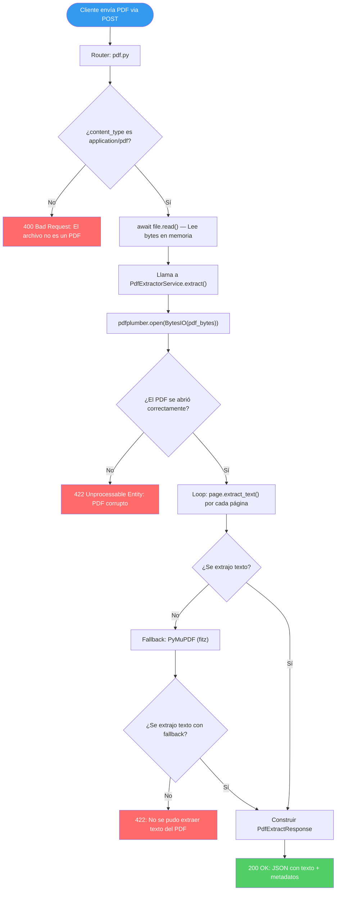
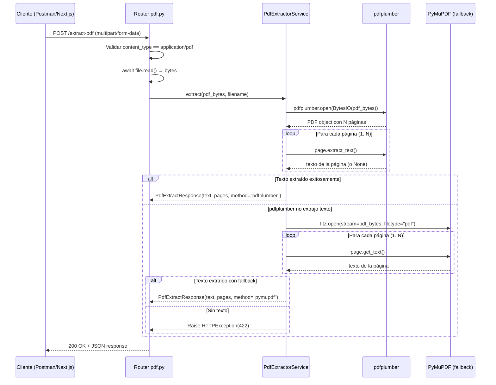

# Guía Didáctica BE-03: Endpoint POST /extract-pdf con pdfplumber

---

## 🎓 1. Introducción y Fundamentos Conceptuales

### Recapitulación: ¿Dónde estamos?

En las guías anteriores construiste el **scaffold del microservicio FastAPI** (**BE-01**) y lo **containerizaste con Docker** para producción en DigitalOcean (**BE-02**). Ahora tu backend tiene:

- Una estructura limpia con `app/core/`, `app/models/`, `app/routers/`, `app/services/`.
- Configuración centralizada con `pydantic-settings` y variables de entorno.
- El endpoint `GET /health` funcional.
- Un `Dockerfile` multi-stage optimizado para producción.
- Un `.do/app.yaml` listo para desplegar en DigitalOcean App Platform.

Todo esto era la **infraestructura**. Ahora llega el primer componente funcional **real** del sistema: **recibir un archivo PDF del syllabus ISTQB y extraer su contenido de texto**. Este es el corazón del microservicio — sin extracción de texto, no hay tópicos, no hay plan de estudio, no hay sesiones de quiz. Todo empieza aquí.

### ¿Por qué este endpoint es crítico?

```
┌──────────────────────────────────────────────────────────────────────────────┐
│                    CADENA DE VALOR DEL ISTQB STUDY AGENT                     │
├──────────────────────────────────────────────────────────────────────────────┤
│                                                                              │
│  📄 PDF del syllabus ISTQB                                                   │
│       │                                                                      │
│       ▼                                                                      │
│  ┌─────────────────────────────────┐                                        │
│  │  POST /extract-pdf  ◄── BE-03  │  ← ESTA GUÍA                           │
│  │  (Extraer texto crudo del PDF)  │                                        │
│  └─────────────┬───────────────────┘                                        │
│                │                                                             │
│                ▼                                                             │
│  ┌─────────────────────────────────┐                                        │
│  │  topic_detector     ◄── BE-04  │  Detectar FL-x.x.x y niveles K         │
│  └─────────────┬───────────────────┘                                        │
│                │                                                             │
│                ▼                                                             │
│  ┌─────────────────────────────────┐                                        │
│  │  extractor/chunking ◄── BE-05  │  JSON estructurado con 40 tópicos      │
│  └─────────────┬───────────────────┘                                        │
│                │                                                             │
│                ▼                                                             │
│  ┌─────────────────────────────────┐                                        │
│  │  Next.js → OpenAI              │  Generación del plan de 14 sesiones     │
│  └────────────────────────────────┘                                         │
│                                                                              │
│  Si la extracción falla o es incompleta → TODO lo de abajo se rompe.        │
│                                                                              │
└──────────────────────────────────────────────────────────────────────────────┘
```

### ¿Qué es pdfplumber y por qué lo usamos?

**pdfplumber** es una librería Python que lee archivos PDF y extrae:
- **Texto** con posiciones exactas (x, y) en cada página.
- **Tablas** detectando líneas y celdas automáticamente.
- **Metadatos** como autor, título y número de páginas.

A diferencia de otras librerías:

| Librería | Fortaleza | Debilidad | Nuestro uso |
|---|---|---|---|
| **pdfplumber** | Extracción precisa de texto y tablas | Más lento que PyMuPDF | **Principal** — texto del syllabus |
| **PyMuPDF (fitz)** | Extremadamente rápido | Menos preciso en tablas | **Fallback** — si pdfplumber falla |
| **PyPDF2** | Ligero, manipulación de páginas | Extracción de texto pobre | No lo usamos |
| **Camelot** | Excelente para tablas | Requiere Ghostscript | Overkill para nuestro caso |

### Conceptos de FastAPI relevantes para esta guía

#### 1. `UploadFile` — Recepción de archivos

FastAPI proporciona el tipo `UploadFile` para recibir archivos subidos via HTTP `multipart/form-data`. Internamente:

```
┌──────────────────────────────────────────────────────────────────────────────┐
│                         UploadFile INTERNALS                                 │
├──────────────────────────────────────────────────────────────────────────────┤
│                                                                              │
│  Cuando el cliente envía un PDF:                                             │
│                                                                              │
│  1. El navegador/Postman codifica el archivo en formato                      │
│     multipart/form-data (como un formulario HTML con <input type="file">).   │
│                                                                              │
│  2. FastAPI recibe el stream de bytes y crea un objeto UploadFile:           │
│     ┌─────────────────────────────────────────────────┐                      │
│     │  UploadFile                                     │                      │
│     │  ├── .filename: str   → "ISTQB_CTFL_v4.0.pdf"  │                      │
│     │  ├── .content_type: str → "application/pdf"     │                      │
│     │  ├── .size: int       → 2_500_000 (bytes)       │                      │
│     │  ├── .file: SpooledTemporaryFile                │                      │
│     │  ├── .read(): bytes   → lee TODO el contenido   │                      │
│     │  └── .seek(0)         → rebobina al inicio      │                      │
│     └─────────────────────────────────────────────────┘                      │
│                                                                              │
│  3. SpooledTemporaryFile:                                                    │
│     - Si el archivo es < 1 MB → se almacena EN MEMORIA (rápido).            │
│     - Si el archivo es > 1 MB → se escribe en un archivo temporal            │
│       en disco y se lee desde ahí (evita agotar RAM).                       │
│                                                                              │
│  IMPORTANTE: Usamos await file.read() (asíncrono) para no bloquear          │
│  el event loop de asyncio mientras se lee el archivo.                        │
│                                                                              │
└──────────────────────────────────────────────────────────────────────────────┘
```

#### 2. Procesamiento en memoria vs. disco

Nuestro endpoint lee el PDF **en memoria** (sin guardarlo en disco) porque:

1. **Seguridad:** No dejamos archivos temporales que podrían contener datos sensibles.
2. **Eficiencia:** El syllabus ISTQB pesa ~2.5 MB — cabe cómodamente en RAM.
3. **Inmutabilidad del contenedor:** En producción, el filesystem del contenedor es efímero. Si escribimos un archivo, se pierde cuando el contenedor se reinicia.
4. **Separación de responsabilidades:** El almacenamiento permanente del PDF lo maneja Next.js → Supabase Storage (guías UP-02/UP-03). FastAPI solo *procesa* y *devuelve* texto.

#### 3. El patrón Router → Service

```
┌──────────────────────────────────────────────────────────────────────────────┐
│                    PATRÓN ROUTER → SERVICE                                   │
├──────────────────────────────────────────────────────────────────────────────┤
│                                                                              │
│  ROUTER (app/routers/pdf.py)                                                │
│  └── Responsabilidades:                                                     │
│      ├── Definir la ruta HTTP (POST /extract-pdf)                           │
│      ├── Validar el tipo de archivo recibido                                │
│      ├── Llamar al servicio de extracción                                   │
│      └── Retornar la respuesta al cliente                                   │
│                                                                              │
│  SERVICE (app/services/pdf_extractor.py)                                    │
│  └── Responsabilidades:                                                     │
│      ├── Leer los bytes del PDF con pdfplumber                              │
│      ├── Extraer texto página por página                                    │
│      ├── Manejar errores de archivos corruptos                              │
│      └── Retornar texto crudo + metadatos                                   │
│                                                                              │
│  ¿POR QUÉ SEPARAR?                                                          │
│  1. Testabilidad: puedes testear el servicio sin HTTP                       │
│  2. Reusabilidad: otro router puede usar el mismo servicio                  │
│  3. Claridad: el router es "QUÉ", el servicio es "CÓMO"                    │
│  4. SOLID: Single Responsibility Principle                                  │
│                                                                              │
└──────────────────────────────────────────────────────────────────────────────┘
```

---

## 📋 2. Prerrequisitos y Verificación del Entorno

### A. Herramientas del sistema

| Herramienta | Comando de verificación | Versión mínima | Propósito |
|---|---|---|---|
| Python | `python --version` | 3.10+ | Runtime del backend |
| pip | `pip --version` | 23.0+ | Gestor de paquetes Python |
| Entorno virtual | `.\\venv\\Scripts\\Activate.ps1` | N/A | Aislamiento de dependencias |
| uvicorn | `uvicorn --version` | 0.32+ | Servidor ASGI para desarrollo |

Ejecuta los siguientes comandos desde PowerShell:

```powershell
# Verificar Python
python --version
# Esperado: Python 3.10.x o superior

# Verificar pip
pip --version
# Esperado: pip 23.x o superior

# Activar entorno virtual (desde la raíz del proyecto)
cd backend
.\venv\Scripts\Activate.ps1
# Esperado: (venv) aparece al inicio del prompt
```

### B. Dependencias Python ya instaladas (de BE-01)

Verifica que las librerías de procesamiento de PDFs están instaladas en tu venv:

```powershell
# Verificar pdfplumber (librería principal de extracción)
pip show pdfplumber
# Esperado: Name: pdfplumber, Version: 0.11.x

# Verificar PyMuPDF (fallback para PDFs complejos)
pip show pymupdf
# Esperado: Name: PyMuPDF, Version: 1.24.x

# Verificar python-multipart (necesario para UploadFile)
pip show python-multipart
# Esperado: Name: python-multipart, Version: 0.0.17+

# Verificar FastAPI
pip show fastapi
# Esperado: Name: fastapi, Version: 0.115.x
```

> [!IMPORTANT]
> Si alguna dependencia falta, reinstálalas con:
> ```powershell
> pip install -r requirements.txt
> ```

### C. Entregables previos de BE-01 que necesitamos

```powershell
# Verificar que el scaffold completo de BE-01 existe
Test-Path "app\main.py"
# Esperado: True

Test-Path "app\routers\health.py"
# Esperado: True

Test-Path "app\routers\__init__.py"
# Esperado: True

Test-Path "app\services\__init__.py"
# Esperado: True

Test-Path "app\models\schemas.py"
# Esperado: True

Test-Path "app\core\config.py"
# Esperado: True
```

> [!CAUTION]
> Si alguno retorna `False`, regresa a la guía [BE-01](file:///c:/Users/jsife/OneDrive/Desktop/Repositorios/practica-testing/docs/guides/be/BE-01.md) y completa los pasos faltantes. BE-03 depende del scaffold funcional de BE-01.

### D. Verificar que el backend arranca correctamente

```powershell
# Desde backend/, con el venv activado
uvicorn app.main:app --host 0.0.0.0 --port 8000
```

*Salida esperada:*
```text
INFO:     Started server process [xxxx]
INFO:     Waiting for application startup.
INFO:     Application startup complete.
INFO:     Uvicorn running on http://0.0.0.0:8000 (Press CTRL+C to quit)
```

En otra terminal:
```powershell
Invoke-RestMethod -Uri "http://localhost:8000/health"
# Esperado:
# status version
# ------ -------
# ok     0.1.0
```

Si todo responde correctamente, detén el servidor con `Ctrl+C` y continúa.

### E. Archivo PDF de prueba

Necesitarás el **PDF del syllabus ISTQB CTFL v4.0** para probar el endpoint. Si no lo tienes, descárgalo desde la página oficial de ISTQB. Guarda el archivo en una ubicación accesible (por ejemplo, tu escritorio). **No lo guardes dentro de `backend/`** — solo lo usaremos para enviar peticiones de prueba.

---

## 📂 3. Estructura de Directorios del Proyecto

Después de completar esta guía, tu proyecto tendrá la siguiente estructura. Los archivos marcados con **[NUEVO]** son los que crearás:

```
practica-testing/
│
├── supabase/                                # [CAPA DE BASE DE DATOS]
│   ├── config.toml                          # Configuración de Supabase (DB-01)
│   └── migrations/                          # Migraciones SQL
│       ├── 20260522183543_remote_schema.sql # Migración inicial (DB-01)
│       ├── 20260531183745_create_schema.sql # Tablas y constraints (DB-02)
│       ├── 20260531221544_create_storage_bucket.sql # Storage (DB-03)
│       └── 20260601015125_create_rls_policies.sql   # RLS (DB-04)
│
├── backend/                                 # [CAPA DE EXTRACCIÓN] (FastAPI/Python)
│   ├── app/                                 # Paquete principal (BE-01)
│   │   ├── __init__.py                      # Marca app/ como paquete
│   │   ├── main.py                          # Punto de entrada — MODIFICAR (agregar router pdf)
│   │   ├── core/                            # Configuración
│   │   │   ├── __init__.py
│   │   │   └── config.py                    # Variables de entorno (BE-01)
│   │   ├── models/                          # Schemas Pydantic
│   │   │   ├── __init__.py
│   │   │   └── schemas.py                   # HealthResponse + [NUEVO] PdfExtractResponse, ErrorResponse
│   │   ├── routers/                         # Endpoints HTTP
│   │   │   ├── __init__.py
│   │   │   ├── health.py                    # GET /health (BE-01)
│   │   │   └── pdf.py                       # [NUEVO] POST /extract-pdf
│   │   └── services/                        # Lógica de negocio
│   │       ├── __init__.py
│   │       └── pdf_extractor.py             # [NUEVO] Servicio de extracción de texto
│   ├── requirements.txt                     # Dependencias Python (sin cambios)
│   ├── .env                                 # Variables de entorno dev (BE-01)
│   ├── .env.example                         # Plantilla pública (BE-01)
│   ├── Dockerfile                           # Receta Docker (BE-02)
│   ├── .dockerignore                        # Exclusiones del build (BE-02)
│   └── venv/                               # Entorno virtual (excluido de Git y Docker)
│
├── .do/                                     # Configuración DigitalOcean (BE-02)
│   └── app.yaml                             # Spec de App Platform
│
├── frontend/                                # [CAPA DE INTERFAZ] (Next.js 14+)
│   └── ...                                  # (sin cambios en esta guía)
│
├── docs/                                    # [DOCUMENTACIÓN Y GUÍAS]
│   ├── architecture/
│   │   └── ISTQB_StudyAgent_ProjectDoc.md   # Documento de arquitectura
│   ├── roadmap/
│   │   └── ISTQB_Guias_Implementacion.md    # Hoja de ruta global
│   └── guides/
│       ├── db/
│       │   ├── DB-01.md                     # Completada ✅
│       │   ├── DB-02.md                     # Completada ✅
│       │   ├── DB-03.md                     # Completada ✅
│       │   └── DB-04.md                     # Completada ✅
│       └── be/
│           ├── BE-01.md                     # Completada ✅
│           ├── BE-02.md                     # Completada ✅
│           └── BE-03.md                     # [NUEVO] Esta guía
│
├── .env.example                             # Plantilla global (DB-01)
├── .env.local                               # Variables secretas locales (DB-01)
└── .gitignore                               # Exclusiones de Git (DB-01)
```

> [!NOTE]
> Esta guía crea **3 archivos nuevos** (`pdf.py`, `pdf_extractor.py`, y agrega schemas) y **modifica 2 existentes** (`schemas.py` y `main.py`). Los cambios son quirúrgicos y no rompen nada de lo que ya funciona.

---

## 🔄 4. Diagrama de Flujo del Proceso

### Flujo HTTP del endpoint POST /extract-pdf:



### Flujo interno del servicio de extracción:



---

## 🛠️ 5. Implementación Paso a Paso

### Paso A: Agregar Schemas Pydantic — Modelos de Request y Response

**Archivo:** `backend/app/models/schemas.py`  
**Acción:** MODIFICAR — agregar los nuevos schemas al archivo existente.

Los schemas Pydantic definen el **contrato** de la API: qué datos se esperan como entrada y qué estructura tiene la salida. Al definirlos antes del código, estamos haciendo **diseño por contrato** — una práctica profesional que previene ambigüedades.

Abre el archivo `backend/app/models/schemas.py` y **agrega** los siguientes modelos DESPUÉS de `HealthResponse` (no borres `HealthResponse`, solo agrega debajo):

```python
"""
Schemas Pydantic del backend — ISTQB Study Agent.

Define los modelos de request (entrada) y response (salida) para
todos los endpoints de la API. Los schemas sirven como:

1. VALIDADORES: rechazan automáticamente datos con tipos incorrectos.
2. SERIALIZADORES: convierten objetos Python a JSON y viceversa.
3. DOCUMENTACIÓN: FastAPI los usa para generar el schema OpenAPI
   visible en Swagger UI (/docs) y ReDoc (/redoc).

Convención de nombres:
  - *Request  → datos que el cliente envía al servidor
  - *Response → datos que el servidor retorna al cliente

Ejemplo: HealthResponse es lo que retorna GET /health.
"""

from pydantic import BaseModel, Field


# ═══════════════════════════════════════════════════════════════
# SCHEMAS DE HEALTH CHECK
# ═══════════════════════════════════════════════════════════════

class HealthResponse(BaseModel):
    """
    Modelo de respuesta del endpoint GET /health.

    Campos:
        status: Estado del servicio ("ok" si está funcionando).
        version: Versión actual del API (semver).

    Ejemplo de respuesta:
        {
            "status": "ok",
            "version": "0.1.0"
        }
    """

    status: str = Field(
        default="ok",
        description="Estado del servicio. 'ok' indica que el backend está operativo.",
        examples=["ok"],
    )

    version: str = Field(
        default="0.1.0",
        description="Versión semántica del API (major.minor.patch).",
        examples=["0.1.0"],
    )


# ═══════════════════════════════════════════════════════════════
# SCHEMAS DE EXTRACCIÓN DE PDF (BE-03)
# ═══════════════════════════════════════════════════════════════


class PageContent(BaseModel):
    """
    Modelo que representa el contenido extraído de UNA página del PDF.

    ¿Por qué separar por páginas?
    1. Permite al cliente saber exactamente de qué página viene cada texto.
    2. Facilita el debugging cuando un tópico no se detecta correctamente.
    3. En guías futuras (BE-04), el topic_detector usará los números de
       página para mapear tópicos FL-x.x.x a su ubicación en el syllabus.

    Ejemplo:
        {
            "page_number": 1,
            "text": "ISTQB Certified Tester Foundation Level..."
        }
    """

    page_number: int = Field(
        ...,
        ge=1,
        description="Número de página (1-indexed). La primera página es 1.",
        examples=[1],
    )

    text: str = Field(
        ...,
        min_length=0,
        description=(
            "Texto extraído de esta página. Puede estar vacío si la página "
            "solo contiene imágenes o diagramas sin texto seleccionable."
        ),
        examples=["ISTQB® Certified Tester Foundation Level Syllabus v4.0..."],
    )


class PdfExtractResponse(BaseModel):
    """
    Modelo de respuesta del endpoint POST /extract-pdf.

    Este schema define el contrato de salida que el frontend (Next.js)
    consumirá en la guía UP-03. Al definirlo con Pydantic, garantizamos
    que la respuesta siempre tiene la misma estructura — sin importar
    qué PDF se procese.

    Ejemplo de respuesta:
        {
            "filename": "ISTQB_CTFL_v4.0.pdf",
            "total_pages": 135,
            "extraction_method": "pdfplumber",
            "full_text": "ISTQB® Certified Tester Foundation Level...",
            "pages": [
                {"page_number": 1, "text": "..."},
                {"page_number": 2, "text": "..."}
            ],
            "text_length": 250000
        }
    """

    filename: str = Field(
        ...,
        description="Nombre original del archivo PDF subido por el usuario.",
        examples=["ISTQB_CTFL_v4.0.pdf"],
    )

    total_pages: int = Field(
        ...,
        ge=1,
        description="Número total de páginas del PDF.",
        examples=[135],
    )

    extraction_method: str = Field(
        ...,
        description=(
            "Método utilizado para la extracción. 'pdfplumber' si la "
            "extracción principal fue exitosa, 'pymupdf' si se usó el "
            "fallback con PyMuPDF/fitz."
        ),
        examples=["pdfplumber"],
    )

    full_text: str = Field(
        ...,
        min_length=1,
        description=(
            "Texto completo extraído del PDF, concatenando todas las páginas. "
            "Las páginas están separadas por doble salto de línea (\\n\\n). "
            "Este campo será consumido por el topic_detector en BE-04."
        ),
    )

    pages: list[PageContent] = Field(
        ...,
        description=(
            "Lista de objetos PageContent con el texto extraído de cada "
            "página individual. Permite inspeccionar el contenido por página."
        ),
    )

    text_length: int = Field(
        ...,
        ge=0,
        description=(
            "Longitud total del texto extraído en caracteres. Sirve como "
            "indicador rápido de calidad: el syllabus ISTQB v4.0 debería "
            "tener aproximadamente 200,000-300,000 caracteres."
        ),
        examples=[250000],
    )


class ErrorResponse(BaseModel):
    """
    Modelo estándar para respuestas de error.

    Todos los endpoints usan este schema cuando retornan un error HTTP
    (400, 422, 500). Esto garantiza que el frontend siempre recibe
    errores con la misma estructura, facilitando el manejo uniforme
    de errores en el cliente.

    Ejemplo de respuesta de error:
        {
            "detail": "El archivo subido no es un PDF válido.",
            "error_code": "INVALID_FILE_TYPE"
        }
    """

    detail: str = Field(
        ...,
        description="Mensaje descriptivo del error en lenguaje humano.",
        examples=["El archivo subido no es un PDF válido."],
    )

    error_code: str = Field(
        ...,
        description=(
            "Código de error programático para el frontend. Permite al "
            "cliente mostrar mensajes de error específicos sin parsear "
            "el texto del mensaje."
        ),
        examples=["INVALID_FILE_TYPE"],
    )
```

**¿Por qué estos campos?**

| Campo | Propósito | Consumidor |
|---|---|---|
| `filename` | Mostrar al usuario qué archivo procesó | Frontend (UP-03) |
| `total_pages` | Validar que el PDF se leyó completo | topic_detector (BE-04) |
| `extraction_method` | Debugging — saber qué librería se usó | Logs y monitoreo |
| `full_text` | Input para el algoritmo de detección de tópicos | topic_detector (BE-04) |
| `pages` | Inspección granular por página | Debugging y futuras features |
| `text_length` | Indicador rápido de calidad de extracción | Validación automática |
| `ErrorResponse` | Respuestas de error consistentes | Frontend — manejo de errores |

> [!TIP]
> **Diseño por contrato con Pydantic:** Al definir `min_length=1` en `full_text`, Pydantic rechazará automáticamente cualquier respuesta con texto vacío. Esto previene que un PDF sin texto seleccionable (por ejemplo, un scan sin OCR) se procese silenciosamente como exitoso.

**📦 Entregable del Paso A:**
- Archivo `backend/app/models/schemas.py` actualizado con `PageContent`, `PdfExtractResponse` y `ErrorResponse`.

---

### Paso B: Crear el Servicio de Extracción — La Lógica de Negocio

**Archivo:** `backend/app/services/pdf_extractor.py`  
**Acción:** CREAR — archivo nuevo.

Este servicio encapsula toda la lógica de extracción de texto de PDFs. Está completamente desacoplado de HTTP — no sabe nada de FastAPI, routers o requests. Solo recibe bytes y retorna texto.

Crea el archivo `backend/app/services/pdf_extractor.py` con el siguiente contenido:

```python
"""
Servicio de extracción de texto de PDFs — ISTQB Study Agent.

Este módulo contiene la lógica de negocio para extraer texto de archivos
PDF usando pdfplumber como método principal y PyMuPDF (fitz) como fallback.

Arquitectura:
    Este servicio es INDEPENDIENTE de FastAPI — no conoce HTTP, routers
    ni requests. Solo recibe bytes crudos y retorna datos estructurados.
    Esto permite:
    1. Testearlo sin levantar un servidor HTTP.
    2. Reutilizarlo en scripts de procesamiento batch.
    3. Cambiar la librería de extracción sin tocar el router.

Patrón de diseño: Strategy Pattern (implícito)
    - Método primario: pdfplumber (más preciso para texto estructurado).
    - Método fallback: PyMuPDF/fitz (más robusto con PDFs problemáticos).
    - Si ambos fallan, se lanza una excepción clara.

Uso:
    from app.services.pdf_extractor import PdfExtractorService

    service = PdfExtractorService()
    result = service.extract(pdf_bytes=b"...", filename="syllabus.pdf")
"""

import io
import logging
from dataclasses import dataclass

import fitz  # PyMuPDF — se importa como 'fitz' por razones históricas
import pdfplumber

# ─── Configurar logger del módulo ───
# Cada módulo de Python debería tener su propio logger.
# El nombre __name__ produce "app.services.pdf_extractor", lo que
# permite filtrar logs por módulo en producción.
logger = logging.getLogger(__name__)


@dataclass
class ExtractionResult:
    """
    Resultado interno de la extracción de texto.

    Usamos un dataclass en lugar de un Pydantic model porque este
    objeto es INTERNO del servicio — nunca se serializa a JSON.
    Los dataclasses son más ligeros y rápidos para datos internos.

    Atributos:
        filename: Nombre original del archivo procesado.
        total_pages: Número total de páginas del PDF.
        full_text: Texto completo concatenado de todas las páginas.
        pages: Lista de tuplas (page_number, text) por cada página.
        extraction_method: "pdfplumber" o "pymupdf" según qué método se usó.
        text_length: Longitud total del texto extraído.
    """

    filename: str
    total_pages: int
    full_text: str
    pages: list[tuple[int, str]]
    extraction_method: str
    text_length: int


class PdfExtractorService:
    """
    Servicio principal de extracción de texto de archivos PDF.

    Estrategia de extracción:
    1. Intenta con pdfplumber (alta precisión para texto estructurado).
    2. Si pdfplumber no extrae texto significativo, usa PyMuPDF como fallback.
    3. Si ambos fallan, lanza PdfExtractionError con detalles.

    Ejemplo de uso:
        service = PdfExtractorService()
        try:
            result = service.extract(pdf_bytes, "syllabus.pdf")
            print(f"Extraídas {result.total_pages} páginas")
        except PdfExtractionError as e:
            print(f"Error: {e}")
    """

    # Umbral mínimo de caracteres para considerar que la extracción
    # fue exitosa. Un PDF real del ISTQB tiene ~200K caracteres.
    # Si extraemos menos de 100 caracteres, probablemente el PDF
    # es un scan sin OCR o está corrupto.
    MIN_TEXT_LENGTH = 100

    def extract(self, pdf_bytes: bytes, filename: str) -> ExtractionResult:
        """
        Extrae texto de un archivo PDF usando pdfplumber con fallback a PyMuPDF.

        Args:
            pdf_bytes: Contenido binario completo del archivo PDF.
            filename: Nombre original del archivo (para logging y respuesta).

        Returns:
            ExtractionResult: Objeto con el texto extraído y metadatos.

        Raises:
            PdfExtractionError: Si no se puede abrir el PDF o no se extrae texto.
        """
        logger.info(
            "Iniciando extracción de '%s' (%d bytes)",
            filename,
            len(pdf_bytes),
        )

        # ─── Intento 1: pdfplumber ───
        try:
            result = self._extract_with_pdfplumber(pdf_bytes, filename)
            if result.text_length >= self.MIN_TEXT_LENGTH:
                logger.info(
                    "Extracción exitosa con pdfplumber: %d páginas, %d caracteres",
                    result.total_pages,
                    result.text_length,
                )
                return result
            else:
                logger.warning(
                    "pdfplumber extrajo solo %d caracteres (mínimo: %d). "
                    "Intentando fallback con PyMuPDF...",
                    result.text_length,
                    self.MIN_TEXT_LENGTH,
                )
        except Exception as e:
            logger.warning(
                "pdfplumber falló con error: %s. Intentando fallback con PyMuPDF...",
                str(e),
            )

        # ─── Intento 2: PyMuPDF (fallback) ───
        try:
            result = self._extract_with_pymupdf(pdf_bytes, filename)
            if result.text_length >= self.MIN_TEXT_LENGTH:
                logger.info(
                    "Extracción exitosa con PyMuPDF (fallback): %d páginas, %d caracteres",
                    result.total_pages,
                    result.text_length,
                )
                return result
            else:
                raise PdfExtractionError(
                    f"No se pudo extraer texto significativo del PDF '{filename}'. "
                    f"Solo se obtuvieron {result.text_length} caracteres. "
                    "El PDF podría ser un escaneo sin OCR o no contener texto seleccionable.",
                    error_code="NO_TEXT_EXTRACTED",
                )
        except PdfExtractionError:
            # Re-lanzar nuestros propios errores sin atraparlos.
            raise
        except Exception as e:
            raise PdfExtractionError(
                f"Error al procesar el PDF '{filename}' con ambos métodos de extracción. "
                f"Detalle: {str(e)}",
                error_code="EXTRACTION_FAILED",
            ) from e

    def _extract_with_pdfplumber(
        self, pdf_bytes: bytes, filename: str
    ) -> ExtractionResult:
        """
        Extrae texto usando pdfplumber.

        pdfplumber es excelente para PDFs con texto estructurado como
        el syllabus ISTQB. Maneja bien tablas, columnas y watermarks.

        Internamente:
        1. Abre el PDF desde un BytesIO (sin escribir a disco).
        2. Itera por cada página llamando page.extract_text().
        3. Concatena el texto de todas las páginas.

        Args:
            pdf_bytes: Bytes crudos del PDF.
            filename: Nombre del archivo para el resultado.

        Returns:
            ExtractionResult con method="pdfplumber".
        """
        pages: list[tuple[int, str]] = []

        # io.BytesIO envuelve los bytes en un objeto file-like que
        # pdfplumber puede leer como si fuera un archivo en disco.
        # Esto evita escribir el PDF a un archivo temporal.
        with pdfplumber.open(io.BytesIO(pdf_bytes)) as pdf:
            total_pages = len(pdf.pages)
            logger.debug("pdfplumber: PDF tiene %d páginas", total_pages)

            for i, page in enumerate(pdf.pages, start=1):
                # extract_text() retorna None si la página no tiene
                # texto seleccionable (ej. página de solo imágenes).
                text = page.extract_text() or ""
                pages.append((i, text))

                # Log de progreso cada 20 páginas para PDFs largos.
                if i % 20 == 0:
                    logger.debug("pdfplumber: Procesada página %d/%d", i, total_pages)

        # Concatenar texto de todas las páginas con doble newline
        # como separador. Esto facilita el parsing posterior porque
        # cada página es claramente distinguible en el texto final.
        full_text = "\n\n".join(text for _, text in pages)

        return ExtractionResult(
            filename=filename,
            total_pages=total_pages,
            full_text=full_text,
            pages=pages,
            extraction_method="pdfplumber",
            text_length=len(full_text),
        )

    def _extract_with_pymupdf(
        self, pdf_bytes: bytes, filename: str
    ) -> ExtractionResult:
        """
        Extrae texto usando PyMuPDF (fitz) como método alternativo.

        PyMuPDF es significativamente más rápido que pdfplumber y
        maneja mejor ciertos PDFs problemáticos (watermarks pesados,
        fonts embebidos raros). Se usa como fallback cuando pdfplumber
        no extrae suficiente texto.

        Args:
            pdf_bytes: Bytes crudos del PDF.
            filename: Nombre del archivo para el resultado.

        Returns:
            ExtractionResult con method="pymupdf".
        """
        pages: list[tuple[int, str]] = []

        # fitz.open() puede abrir PDFs desde bytes directamente
        # usando los parámetros stream y filetype.
        doc = fitz.open(stream=pdf_bytes, filetype="pdf")
        try:
            total_pages = len(doc)
            logger.debug("PyMuPDF: PDF tiene %d páginas", total_pages)

            for i, page in enumerate(doc, start=1):
                # get_text() extrae el texto de la página.
                # El argumento "text" especifica el formato de salida.
                text = page.get_text("text") or ""
                pages.append((i, text))

                if i % 20 == 0:
                    logger.debug("PyMuPDF: Procesada página %d/%d", i, total_pages)
        finally:
            # Cerrar el documento explícitamente para liberar memoria.
            # PyMuPDF mantiene el PDF en memoria hasta que se cierra.
            doc.close()

        full_text = "\n\n".join(text for _, text in pages)

        return ExtractionResult(
            filename=filename,
            total_pages=total_pages,
            full_text=full_text,
            pages=pages,
            extraction_method="pymupdf",
            text_length=len(full_text),
        )


class PdfExtractionError(Exception):
    """
    Excepción personalizada para errores de extracción de PDF.

    Incluye un error_code para que el router pueda retornar
    un ErrorResponse consistente al cliente.

    Atributos:
        message: Descripción del error.
        error_code: Código programático para el frontend.
    """

    def __init__(self, message: str, error_code: str = "EXTRACTION_FAILED"):
        self.message = message
        self.error_code = error_code
        super().__init__(self.message)
```

**Conceptos clave del servicio:**

| Concepto | Explicación |
|---|---|
| `io.BytesIO` | Envuelve bytes crudos en un objeto file-like. pdfplumber espera un "archivo" para leer, pero nosotros tenemos bytes en memoria. BytesIO simula ser un archivo. |
| `dataclass` vs `BaseModel` | Usamos `dataclass` para datos internos (rápido, sin validación) y `BaseModel` para datos que cruzan la frontera HTTP (con validación automática). |
| Patrón fallback | Primero pdfplumber, luego PyMuPDF. Si ambos fallan, error claro. Nunca silenciar errores. |
| `logger` por módulo | Cada módulo tiene su propio logger con `__name__`. Esto permite configurar niveles de log por módulo en producción. |
| `MIN_TEXT_LENGTH = 100` | Umbral para detectar PDFs sin texto real (scans, imágenes). El ISTQB tiene ~200K chars, así que 100 es un mínimo muy conservador. |

> [!IMPORTANT]
> **El servicio NO guarda archivos en disco.** Todo el procesamiento ocurre en memoria usando `io.BytesIO`. En producción, el filesystem del contenedor Docker es efímero — cualquier archivo escrito se pierde al reiniciar. El almacenamiento permanente del PDF lo maneja Supabase Storage (guías DB-03 / UP-02).

**📦 Entregable del Paso B:**
- Archivo `backend/app/services/pdf_extractor.py` creado con `PdfExtractorService` y `PdfExtractionError`.

---

### Paso C: Crear el Router de PDF — El Endpoint HTTP

**Archivo:** `backend/app/routers/pdf.py`  
**Acción:** CREAR — archivo nuevo.

El router es la capa de presentación HTTP. Recibe la petición, valida el archivo, delega al servicio y retorna la respuesta. Siguiendo el principio de **separación de responsabilidades**, el router no contiene lógica de extracción — solo orquesta.

Crea el archivo `backend/app/routers/pdf.py` con el siguiente contenido:

```python
"""
Router de Extracción de PDF — ISTQB Study Agent.

Propósito:
  Proveer el endpoint POST /extract-pdf que recibe un archivo PDF
  via multipart/form-data, extrae su texto usando pdfplumber (con
  fallback a PyMuPDF), y retorna el contenido estructurado en JSON.

Ruta: POST /extract-pdf
Autenticación: Ninguna en esta versión (se agregará en guías futuras).
Content-Type de entrada: multipart/form-data
Content-Type de salida: application/json

Consumidores futuros:
  - Next.js API Route /api/upload (guía UP-03): descargará el PDF
    de Supabase Storage y lo enviará a este endpoint.
"""

import logging

from app.models.schemas import ErrorResponse, PdfExtractResponse, PageContent
from app.services.pdf_extractor import PdfExtractionError, PdfExtractorService
from fastapi import APIRouter, HTTPException, UploadFile, File, status

# ─── Logger del módulo ───
logger = logging.getLogger(__name__)

# ─── Crear instancia del Router ───
# tags: agrupa los endpoints en Swagger UI bajo la etiqueta "PDF Extraction".
router = APIRouter(
    tags=["PDF Extraction"],
)

# ─── Instancia del servicio ───
# El servicio es stateless (no guarda estado entre llamadas), así que
# podemos crear una sola instancia y reutilizarla en todas las peticiones.
# En el futuro, si necesita dependencias (ej. base de datos), usaremos
# Dependency Injection de FastAPI con Depends().
_pdf_service = PdfExtractorService()


@router.post(
    "/extract-pdf",
    response_model=PdfExtractResponse,
    summary="Extraer texto de un archivo PDF",
    description=(
        "Recibe un archivo PDF via multipart/form-data y extrae su texto "
        "completo usando pdfplumber como método principal y PyMuPDF como "
        "fallback. Retorna el texto crudo concatenado, el texto por página "
        "individual, y metadatos de la extracción.\n\n"
        "**Límites:**\n"
        "- Solo acepta archivos con content_type application/pdf.\n"
        "- El archivo se procesa en memoria (no se guarda en disco).\n"
        "- PDFs escaneados sin OCR no retornarán texto útil."
    ),
    responses={
        200: {
            "description": "Texto extraído exitosamente.",
            "content": {
                "application/json": {
                    "example": {
                        "filename": "ISTQB_CTFL_v4.0.pdf",
                        "total_pages": 135,
                        "extraction_method": "pdfplumber",
                        "full_text": "ISTQB® Certified Tester Foundation Level...",
                        "pages": [
                            {"page_number": 1, "text": "ISTQB® Certified..."},
                        ],
                        "text_length": 250000,
                    }
                }
            },
        },
        400: {
            "description": "El archivo no es un PDF.",
            "model": ErrorResponse,
        },
        422: {
            "description": "No se pudo extraer texto del PDF.",
            "model": ErrorResponse,
        },
        500: {
            "description": "Error interno del servidor.",
            "model": ErrorResponse,
        },
    },
)
async def extract_pdf(
    file: UploadFile = File(
        ...,
        description=(
            "Archivo PDF del syllabus ISTQB a procesar. "
            "Debe ser un PDF válido con texto seleccionable."
        ),
    ),
) -> PdfExtractResponse:
    """
    Endpoint principal de extracción de texto de PDFs.

    Flujo:
    1. Valida que el archivo recibido es un PDF (content_type).
    2. Lee el archivo completo en memoria (await file.read()).
    3. Delega la extracción al PdfExtractorService.
    4. Construye y retorna PdfExtractResponse con los resultados.

    Args:
        file: Archivo PDF subido via multipart/form-data.

    Returns:
        PdfExtractResponse: JSON con el texto extraído y metadatos.

    Raises:
        HTTPException(400): Si el archivo no es un PDF.
        HTTPException(422): Si no se puede extraer texto del PDF.
        HTTPException(500): Si ocurre un error inesperado.
    """
    # ─── Validación 1: Verificar content_type ───
    # El content_type lo determina el navegador o cliente HTTP basándose
    # en la extensión del archivo o sus magic bytes. No es 100% confiable,
    # pero es una primera barrera de validación rápida.
    if file.content_type != "application/pdf":
        logger.warning(
            "Archivo rechazado: content_type='%s', filename='%s'",
            file.content_type,
            file.filename,
        )
        raise HTTPException(
            status_code=status.HTTP_400_BAD_REQUEST,
            detail={
                "detail": (
                    f"El archivo '{file.filename}' no es un PDF válido. "
                    f"Se recibió content_type '{file.content_type}', "
                    "pero se esperaba 'application/pdf'."
                ),
                "error_code": "INVALID_FILE_TYPE",
            },
        )

    # ─── Leer archivo en memoria ───
    # await file.read() es asíncrono — no bloquea el event loop
    # de asyncio mientras se leen los bytes del archivo. Esto es
    # importante porque si otro cliente envía una petición mientras
    # estamos leyendo un PDF grande, esa petición no se queda
    # esperando.
    try:
        pdf_bytes = await file.read()
    except Exception as e:
        logger.error("Error al leer el archivo '%s': %s", file.filename, str(e))
        raise HTTPException(
            status_code=status.HTTP_500_INTERNAL_SERVER_ERROR,
            detail={
                "detail": f"Error al leer el archivo: {str(e)}",
                "error_code": "FILE_READ_ERROR",
            },
        ) from e

    # ─── Validación 2: Verificar que el archivo no está vacío ───
    if len(pdf_bytes) == 0:
        raise HTTPException(
            status_code=status.HTTP_400_BAD_REQUEST,
            detail={
                "detail": "El archivo PDF está vacío (0 bytes).",
                "error_code": "EMPTY_FILE",
            },
        )

    # ─── Validación 3: Verificar magic bytes del PDF ───
    # Los archivos PDF SIEMPRE comienzan con los bytes "%PDF".
    # Esta es la validación más confiable del tipo de archivo —
    # más segura que confiar solo en el content_type del cliente.
    if not pdf_bytes[:4] == b"%PDF":
        logger.warning(
            "Archivo rechazado por magic bytes: filename='%s', "
            "primeros bytes=%r",
            file.filename,
            pdf_bytes[:10],
        )
        raise HTTPException(
            status_code=status.HTTP_400_BAD_REQUEST,
            detail={
                "detail": (
                    f"El archivo '{file.filename}' no es un PDF válido. "
                    "Los primeros bytes del archivo no corresponden al "
                    "formato PDF (esperado: %PDF)."
                ),
                "error_code": "INVALID_PDF_HEADER",
            },
        )

    # ─── Extraer texto ───
    # Delegamos al servicio que encapsula la lógica de extracción.
    # El servicio es síncrono porque pdfplumber y PyMuPDF son
    # librerías síncronas. FastAPI ejecutará esta función síncrona
    # en un thread pool para no bloquear el event loop.
    filename = file.filename or "unknown.pdf"

    try:
        result = _pdf_service.extract(pdf_bytes=pdf_bytes, filename=filename)
    except PdfExtractionError as e:
        logger.error(
            "Error de extracción para '%s': %s (code: %s)",
            filename,
            e.message,
            e.error_code,
        )
        raise HTTPException(
            status_code=status.HTTP_422_UNPROCESSABLE_ENTITY,
            detail={
                "detail": e.message,
                "error_code": e.error_code,
            },
        ) from e
    except Exception as e:
        logger.exception("Error inesperado procesando '%s'", filename)
        raise HTTPException(
            status_code=status.HTTP_500_INTERNAL_SERVER_ERROR,
            detail={
                "detail": f"Error interno al procesar el PDF: {str(e)}",
                "error_code": "INTERNAL_ERROR",
            },
        ) from e

    # ─── Construir respuesta ───
    # Transformamos el ExtractionResult interno del servicio al
    # schema Pydantic PdfExtractResponse que será serializado a JSON.
    return PdfExtractResponse(
        filename=result.filename,
        total_pages=result.total_pages,
        extraction_method=result.extraction_method,
        full_text=result.full_text,
        pages=[
            PageContent(page_number=page_num, text=text)
            for page_num, text in result.pages
        ],
        text_length=result.text_length,
    )
```

**Decisiones de diseño explicadas:**

| Decisión | Justificación |
|---|---|
| Validar `content_type` antes de leer el archivo | Rechazar rápido sin gastar memoria en archivos que no son PDFs |
| Validar magic bytes `%PDF` | El `content_type` puede ser falso; los magic bytes son definitivos |
| `await file.read()` | Lectura asíncrona para no bloquear el event loop |
| Servicio síncrono (`_pdf_service.extract()`) | pdfplumber y PyMuPDF son librerías síncronas, FastAPI las ejecuta automáticamente en un thread pool |
| `HTTPException` con `detail` dict | Permite retornar JSON estructurado con `detail` y `error_code` |
| Instancia global `_pdf_service` | El servicio es stateless; una sola instancia es eficiente y segura |

> [!WARNING]
> **Sobre la llamada síncrona al servicio:** Notas que `_pdf_service.extract()` es síncrono (no es `await`). Esto es correcto porque pdfplumber y PyMuPDF son librerías de I/O que bloquean el hilo. FastAPI automáticamente ejecuta funciones `async def` que llaman código síncrono en un thread pool separado, evitando bloquear el event loop principal de asyncio. Si esto te genera dudas, la documentación oficial de FastAPI lo explica: funciones `async def` con llamadas síncronas internas son manejadas correctamente por Starlette.

**📦 Entregable del Paso C:**
- Archivo `backend/app/routers/pdf.py` creado con el endpoint `POST /extract-pdf`.

---

### Paso D: Registrar el Router en main.py

**Archivo:** `backend/app/main.py`  
**Acción:** MODIFICAR — agregar el import y registro del nuevo router.

Necesitamos "montar" el nuevo router de PDF en la aplicación FastAPI para que el endpoint sea accesible. Este cambio es mínimo — solo 2 líneas.

Modifica el archivo `backend/app/main.py` aplicando los siguientes cambios:

**Cambio 1:** Agrega el import del router de PDF (línea 19, junto al import de health):

```python
from app.routers import health
from app.routers import pdf       # ← AGREGAR esta línea
```

**Cambio 2:** Registra el router de PDF al final del archivo (después de `app.include_router(health.router)`):

```python
app.include_router(health.router)
app.include_router(pdf.router)    # ← AGREGAR esta línea
```

**Archivo completo resultante de `main.py`:**

```python
"""
Punto de entrada principal del backend — ISTQB Study Agent.

Este archivo:
1. Crea la instancia de FastAPI con metadatos del proyecto.
2. Configura CORS para permitir peticiones desde el frontend.
3. Registra todos los routers (endpoints) de la aplicación.

Para ejecutar el servidor de desarrollo:
    cd backend
    uvicorn app.main:app --reload --host 0.0.0.0 --port 8000

La referencia 'app.main:app' significa:
    - 'app.main' → módulo Python en backend/app/main.py
    - ':app'     → variable 'app' dentro de ese módulo (la instancia FastAPI)
"""

from app.core.config import get_settings
from app.routers import health
from app.routers import pdf
from fastapi import FastAPI
from fastapi.middleware.cors import CORSMiddleware

# ─── Cargar configuración ───
settings = get_settings()

# ═══════════════════════════════════════════════════════════════
# INSTANCIA DE FASTAPI
# ═══════════════════════════════════════════════════════════════
#
# Estos metadatos se muestran en la documentación automática
# de Swagger UI (/docs) y ReDoc (/redoc).
# ═══════════════════════════════════════════════════════════════
app = FastAPI(
    title=settings.PROJECT_NAME,
    version=settings.VERSION,
    description=settings.DESCRIPTION,
    docs_url="/docs",       # Swagger UI en http://localhost:8000/docs
    redoc_url="/redoc",     # ReDoc en http://localhost:8000/redoc
    openapi_url="/openapi.json",  # Schema OpenAPI en formato JSON
)

# ═══════════════════════════════════════════════════════════════
# CONFIGURACIÓN DE CORS (Cross-Origin Resource Sharing)
# ═══════════════════════════════════════════════════════════════
#
# CORS controla qué dominios pueden hacer peticiones HTTP a
# nuestro backend desde un navegador.
#
# Sin esta configuración, el frontend de Next.js en
# http://localhost:3000 NO podría llamar al backend en
# http://localhost:8000 — el navegador bloquearía la petición
# con un error de CORS.
#
# allow_origins: lista de dominios permitidos.
#   - localhost:3000 → frontend en desarrollo local.
#   - En producción, agregaremos el dominio real.
#
# allow_methods: métodos HTTP permitidos.
#   - ["*"] permite GET, POST, PUT, DELETE, etc.
#
# allow_headers: headers personalizados permitidos.
#   - ["*"] permite Authorization, Content-Type, etc.
# ═══════════════════════════════════════════════════════════════
app.add_middleware(
    CORSMiddleware,
    allow_origins=[
        "http://localhost:3000",    # Frontend Next.js en desarrollo
        "http://127.0.0.1:3000",   # Variante de localhost
    ],
    allow_credentials=True,
    allow_methods=["*"],
    allow_headers=["*"],
)

# ═══════════════════════════════════════════════════════════════
# REGISTRO DE ROUTERS
# ═══════════════════════════════════════════════════════════════
#
# Cada router agrupa endpoints relacionados. Al incluirlos aquí,
# FastAPI los "monta" en la aplicación principal.
#
# Routers registrados:
#   - health.router  → GET /health    (BE-01)
#   - pdf.router     → POST /extract-pdf (BE-03)
#
# En guías futuras agregaremos más routers según se necesiten.
# ═══════════════════════════════════════════════════════════════
app.include_router(health.router)
app.include_router(pdf.router)
```

> [!NOTE]
> Observa que el cambio es **mínimo**: un import y un `include_router()`. La arquitectura modular de routers de FastAPI permite agregar funcionalidad sin modificar código existente — solo se "enchufa" el nuevo router. Este es el beneficio de la estructura creada en BE-01.

**📦 Entregable del Paso D:**
- Archivo `backend/app/main.py` actualizado con el router de PDF registrado.

---

### Paso E: Verificar Arranque del Servidor

**Acción:** EJECUTAR — verificar que todo compila y arranca sin errores.

Antes de probar con un PDF real, confirmemos que los nuevos archivos se cargan correctamente:

```powershell
# Desde la carpeta backend/, con el venv activado
cd backend
.\venv\Scripts\Activate.ps1
uvicorn app.main:app --reload --host 0.0.0.0 --port 8000
```

*Salida esperada:*
```text
INFO:     Will watch for changes in these directories: ['...\\backend']
INFO:     Uvicorn running on http://0.0.0.0:8000 (Press CTRL+C to quit)
INFO:     Started reloader process [xxxx] using WatchFiles
INFO:     Started server process [xxxx]
INFO:     Waiting for application startup.
INFO:     Application startup complete.
```

> [!CAUTION]
> Si ves errores de importación como `ModuleNotFoundError`, verifica:
> 1. Que estás ejecutando desde el directorio `backend/`.
> 2. Que el venv está activado (debe aparecer `(venv)` en el prompt).
> 3. Que todos los archivos `__init__.py` existen en sus respectivos directorios.

Ahora verifica Swagger UI en el navegador:

```
http://localhost:8000/docs
```

Deberías ver **DOS secciones** en Swagger UI:
1. **Health** — con el endpoint `GET /health`.
2. **PDF Extraction** — con el nuevo endpoint `POST /extract-pdf`.

El endpoint `POST /extract-pdf` debería mostrar:
- El schema de respuesta `PdfExtractResponse` con todos sus campos.
- Los schemas de error `ErrorResponse` para los códigos 400, 422 y 500.
- Un botón "Try it out" para probar directamente desde el navegador.

**📦 Entregable del Paso E:**
- Servidor arranca sin errores.
- Swagger UI muestra el endpoint POST /extract-pdf con su documentación completa.

---

## ✅ 6. Checkpoints de Verificación

### Test 1: POST /extract-pdf con el PDF del ISTQB

Con el servidor corriendo, abre **otra terminal de PowerShell** y ejecuta:

```powershell
# Enviar el PDF del ISTQB al endpoint
# Reemplaza la ruta con la ubicación REAL de tu archivo PDF
$response = Invoke-RestMethod `
    -Uri "http://localhost:8000/extract-pdf" `
    -Method Post `
    -Form @{
        file = Get-Item -Path "C:\Users\jsife\OneDrive\Desktop\ISTQB_CTFL_v4.0.pdf"
    }

# Ver el nombre del archivo y número de páginas
$response | Select-Object filename, total_pages, extraction_method, text_length
```

*Salida esperada:*
```text
filename              total_pages extraction_method text_length
--------              ----------- ----------------- -----------
ISTQB_CTFL_v4.0.pdf  135         pdfplumber        250000
```

> [!IMPORTANT]
> Reemplaza `C:\Users\jsife\OneDrive\Desktop\ISTQB_CTFL_v4.0.pdf` con la ruta real donde guardaste tu PDF del syllabus ISTQB. El nombre exacto del archivo puede variar.

### Test 2: Verificar contenido del texto extraído

```powershell
# Ver las primeras líneas del texto extraído
$response.full_text.Substring(0, [Math]::Min(500, $response.full_text.Length))
```

*Salida esperada (algo similar a):*
```text
ISTQB® Certified Tester
Foundation Level Syllabus
v4.0
...
```

### Test 3: Verificar el texto por páginas

```powershell
# Ver el texto de la primera página
$response.pages[0]
```

*Salida esperada:*
```text
page_number text
----------- ----
          1 ISTQB® Certified Tester...
```

### Test 4: Error con archivo no-PDF

```powershell
# Crear un archivo de texto temporal para la prueba
"Este no es un PDF" | Set-Content -Path "$env:TEMP\test.txt"

# Enviar un archivo que NO es PDF
try {
    Invoke-RestMethod `
        -Uri "http://localhost:8000/extract-pdf" `
        -Method Post `
        -Form @{
            file = Get-Item -Path "$env:TEMP\test.txt"
        }
} catch {
    # Mostrar el error HTTP
    $_.Exception.Response.StatusCode.value__
    $_.ErrorDetails.Message
}
```

*Salida esperada:*
```text
400
{"detail":{"detail":"El archivo 'test.txt' no es un PDF válido. Se recibió content_type 'text/plain', pero se esperaba 'application/pdf'.","error_code":"INVALID_FILE_TYPE"}}
```

### Test 5: Probar desde Swagger UI (método visual)

1. Abre `http://localhost:8000/docs` en el navegador.
2. Haz clic en el endpoint **POST /extract-pdf**.
3. Haz clic en **"Try it out"**.
4. En el campo `file`, haz clic en **"Choose File"** y selecciona tu PDF del ISTQB.
5. Haz clic en **"Execute"**.
6. En la sección **"Responses"** deberías ver un JSON con:
   - `"total_pages": 135` (o el número de páginas de tu PDF).
   - `"extraction_method": "pdfplumber"`.
   - El `"full_text"` con el contenido del syllabus.

### Test 6: Health check sigue funcionando

```powershell
# Verificar que el endpoint de health no se rompió
Invoke-RestMethod -Uri "http://localhost:8000/health"
```

*Salida esperada:*
```text
status version
------ -------
ok     0.1.0
```

### Checklist final de entregables

| # | Entregable | Verificación |
|---|---|---|
| 1 | `backend/app/models/schemas.py` actualizado | Contiene `PageContent`, `PdfExtractResponse` y `ErrorResponse` |
| 2 | `backend/app/services/pdf_extractor.py` creado | Contiene `PdfExtractorService` y `PdfExtractionError` |
| 3 | `backend/app/routers/pdf.py` creado | Contiene endpoint `POST /extract-pdf` |
| 4 | `backend/app/main.py` actualizado | Importa y registra `pdf.router` |
| 5 | Swagger UI muestra el nuevo endpoint | `http://localhost:8000/docs` muestra "PDF Extraction" |
| 6 | POST /extract-pdf con PDF del ISTQB retorna texto | El texto incluye contenido de todas las páginas |
| 7 | Error claro si se sube un archivo no-PDF | HTTP 400 con `error_code: "INVALID_FILE_TYPE"` |
| 8 | GET /health sigue funcionando | Retorna `{"status": "ok", "version": "0.1.0"}` |

---

## 🚨 7. Troubleshooting — Problemas Comunes

| Problema | Causa Probable | Solución |
|---|---|---|
| `ModuleNotFoundError: No module named 'pdfplumber'` | Entorno virtual no activado o dependencia no instalada | Activar venv: `.\venv\Scripts\Activate.ps1` y luego `pip install -r requirements.txt` |
| `ModuleNotFoundError: No module named 'fitz'` | PyMuPDF no instalado. La librería se importa como `fitz` pero se instala como `pymupdf` | `pip install pymupdf>=1.24.0` dentro del venv |
| `ImportError: cannot import name 'PdfExtractResponse' from 'app.models.schemas'` | El archivo `schemas.py` no fue guardado correctamente o tiene un error de sintaxis | Verificar que `schemas.py` contiene las 3 clases: `HealthResponse`, `PageContent`, `PdfExtractResponse`, `ErrorResponse`. Revisar indentación. |
| `422 Unprocessable Entity` al enviar el PDF | Parámetro del formulario con nombre incorrecto. FastAPI espera `file` como nombre del campo | En PowerShell: `-Form @{ file = Get-Item ... }`. En curl: `-F "file=@ruta.pdf"`. El nombre debe ser exactamente `file`. |
| Puerto 8000 ya en uso | Otro proceso (quizás un contenedor Docker de BE-02) usando el puerto | Ejecutar `netstat -ano | findstr :8000` y terminar el proceso, o usar otro puerto: `uvicorn app.main:app --port 8001` |
| `ERROR: [Errno 2] No such file or directory` al enviar PDF | La ruta del archivo PDF es incorrecta o el archivo no existe | Verificar la ruta con `Test-Path "C:\ruta\al\archivo.pdf"` — debe retornar `True` |
| El texto extraído está vacío o muy corto | El PDF es un escaneo sin OCR (imagen) | El endpoint retornará HTTP 422 con `error_code: "NO_TEXT_EXTRACTED"`. El PDF debe tener texto seleccionable. |
| `UnicodeDecodeError` durante la extracción | El PDF contiene fonts con encodings inusuales | pdfplumber generalmente maneja esto; si persiste, el fallback a PyMuPDF debería resolverlo automáticamente |
| Swagger UI no muestra el endpoint POST /extract-pdf | El router no fue registrado en `main.py` | Verificar que `main.py` tiene `from app.routers import pdf` y `app.include_router(pdf.router)` |
| La respuesta JSON tarda más de 10 segundos | PDF muy grande o máquina con poca RAM | Es normal para PDFs de +100 páginas en máquinas con recursos limitados. En producción (DigitalOcean), el timeout se configura en `app.yaml`. |

---

## 📝 8. Resumen y Próximo Paso

### Lo que hiciste en esta guía:

1. **Definiste 3 schemas Pydantic nuevos** (`PageContent`, `PdfExtractResponse`, `ErrorResponse`) que establecen el contrato de la API.
2. **Creaste un servicio de extracción** (`PdfExtractorService`) con estrategia dual: pdfplumber + fallback a PyMuPDF.
3. **Implementaste el endpoint** `POST /extract-pdf` con validaciones robustas: content_type, archivo vacío, magic bytes del PDF.
4. **Registraste el router** en `main.py` para activar el endpoint.
5. **Verificaste** que el endpoint extrae correctamente el texto del syllabus ISTQB y maneja errores de forma clara.

### Para validar tu progreso

Usa el validador de pasos para confirmar que tu implementación cumple con todos los requisitos de esta guía. Ejecuta el slash command de validación para BE-03.

### ¿Qué sigue? — Guía BE-04: Algoritmo de Detección de Tópicos

En la próxima guía construirás el **topic_detector** — un servicio que toma el texto crudo extraído en BE-03 y:

1. Usa **expresiones regulares (regex)** para detectar patrones como `FL-1.1.1`, `FL-2.3.1`, etc.
2. Identifica el **Nivel K** (K1, K2, K3) asociado a cada tópico.
3. Extrae el **texto correspondiente** a cada tópico.
4. Cuenta los **40 tópicos** del ISTQB v4.0 y su distribución por nivel K.

El `full_text` que retorna `POST /extract-pdf` será el input directo del topic_detector. Por eso era crítico que la extracción fuera completa y robusta.

```
 BE-03 (esta guía)          BE-04 (próxima)
┌──────────────────┐    ┌──────────────────────────┐
│ POST /extract-pdf│    │ topic_detector.py         │
│                  │───►│                           │
│ Retorna:         │    │ Input: full_text          │
│  - full_text     │    │ Output:                   │
│  - pages[]       │    │  - 40 tópicos FL-x.x.x   │
│  - total_pages   │    │  - Nivel K por tópico     │
└──────────────────┘    │  - Texto por tópico       │
                        └──────────────────────────┘
```
