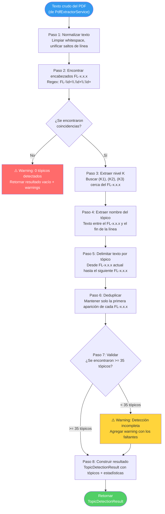
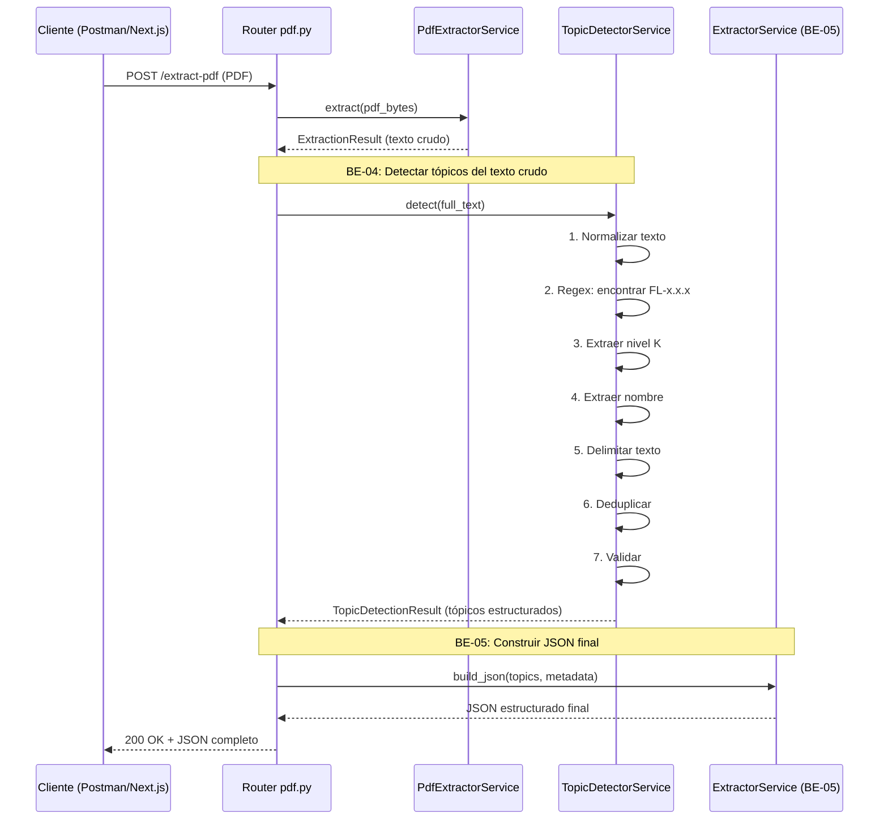

# Guía Didáctica BE-04: Algoritmo de Detección de Tópicos FL-x.x.x

---

## 🎓 1. Introducción y Fundamentos Conceptuales

### Recapitulación: ¿Dónde estamos?

En las guías anteriores construiste tres capas fundamentales de tu microservicio:

- **BE-01:** El scaffold de FastAPI — estructura de carpetas, configuración con `pydantic-settings`, endpoint `GET /health`.
- **BE-02:** Containerización con Docker — `Dockerfile` multi-stage, `.dockerignore`, `app.yaml` para DigitalOcean.
- **BE-03:** El endpoint `POST /extract-pdf` — recepción de PDFs via `UploadFile`, extracción de texto con pdfplumber + fallback PyMuPDF, respuesta estructurada con `PdfExtractResponse`.

Ahora tienes un backend que recibe un PDF del syllabus ISTQB y retorna su texto crudo. Pero texto crudo no es suficiente. El frontend necesita saber exactamente **cuáles son los 40 objetivos de aprendizaje** (Learning Objectives, o LOs) del syllabus, qué **nivel cognitivo K** tiene cada uno, y **qué texto del syllabus corresponde a cada tópico**.

### ¿Qué es un "tópico" en el contexto ISTQB?

El syllabus ISTQB Foundation Level v4.0 organiza su contenido en una jerarquía numérica:

```
┌──────────────────────────────────────────────────────────────────────────────┐
│                    JERARQUÍA DEL SYLLABUS ISTQB v4.0                         │
├──────────────────────────────────────────────────────────────────────────────┤
│                                                                              │
│  Capítulo 1: Fundamentos del Testing                                        │
│  ├── FL-1.1   ¿Qué es el testing?                                          │
│  │   ├── FL-1.1.1  Identificar objetivos típicos del testing      (K1)     │
│  │   └── FL-1.1.2  Diferenciar testing de debugging               (K2)     │
│  ├── FL-1.2   ¿Por qué es necesario el testing?                            │
│  │   ├── FL-1.2.1  Dar ejemplos de por qué el testing es necesario (K2)    │
│  │   └── FL-1.2.2  Recordar la relación entre testing y QA        (K1)     │
│  ├── FL-1.3   Principios del testing                                        │
│  │   └── FL-1.3.1  Explicar los 7 principios del testing          (K2)     │
│  └── ...                                                                    │
│                                                                              │
│  Capítulo 2: Testing a lo largo del ciclo de vida                           │
│  ├── FL-2.1   Testing en el contexto del SDLC                              │
│  │   └── FL-2.1.1  Explicar el impacto del SDLC en el testing     (K2)    │
│  └── ...                                                                    │
│                                                                              │
│  ... hasta Capítulo 6                                                       │
│                                                                              │
│  TOTAL: ~40 objetivos de aprendizaje (Learning Objectives)                  │
│  Cada uno tiene un código FL-x.x.x y un nivel K (K1, K2 o K3)             │
│                                                                              │
└──────────────────────────────────────────────────────────────────────────────┘
```

### Los Niveles K — Taxonomía cognitiva

Los niveles K están basados en la **Taxonomía de Bloom** y determinan la profundidad cognitiva:

| Nivel | Nombre | Significado | Ejemplo ISTQB | Horas estimadas |
|---|---|---|---|---|
| **K1** | Recordar | Reconocer y recordar conceptos | "Identificar objetivos típicos del testing" | 0.5h por tópico |
| **K2** | Comprender | Explicar, clasificar, comparar | "Diferenciar testing de debugging" | 1.0h por tópico |
| **K3** | Aplicar | Usar conocimiento en un escenario dado | "Escribir casos de prueba usando técnicas" | 1.5h por tópico |

> [!IMPORTANT]
> Los niveles K determinan directamente el plan de estudio en guías futuras (UP-04). K1 se estudia más rápido, K3 requiere práctica con escenarios. El topic detector **debe** capturar el nivel correcto para cada tópico, o el plan de estudio será ineficiente.

### ¿Qué hace el topic_detector?

El topic detector es un **analizador de texto basado en expresiones regulares (regex)** que:

1. Recibe el texto crudo del PDF (producido por `PdfExtractorService` de BE-03).
2. Busca patrones como `FL-1.1.1`, `FL-2.3.1`, etc.
3. Identifica el nivel K asociado a cada patrón (K1, K2, K3).
4. Extrae el texto del syllabus que corresponde a cada tópico.
5. Retorna una lista estructurada de todos los tópicos detectados con sus metadatos.

```
┌──────────────────────────────────────────────────────────────────────────────┐
│                   PIPELINE DE DETECCIÓN DE TÓPICOS                           │
├──────────────────────────────────────────────────────────────────────────────┤
│                                                                              │
│  ENTRADA:                                                                    │
│  ┌─────────────────────────────────────────────────────────────────┐        │
│  │  Texto crudo del PDF (~200K caracteres)                        │        │
│  │  "...FL-1.1.1 (K1) Identify Typical Test Objectives            │        │
│  │   A test objective is a reason or purpose for testing...        │        │
│  │   FL-1.1.2 (K2) Differentiate Testing from Debugging..."       │        │
│  └─────────────────────────────────────────────────────────────────┘        │
│                     │                                                        │
│                     ▼                                                        │
│  ┌─────────────────────────────────────────────────────────────────┐        │
│  │  PASO 1: Regex — Encontrar todos los FL-x.x.x                 │        │
│  │  Patrón: FL-\d+\.\d+\.\d+                                     │        │
│  │  Resultado: [FL-1.1.1, FL-1.1.2, FL-1.2.1, ...]               │        │
│  └─────────────────────────────────────────────────────────────────┘        │
│                     │                                                        │
│                     ▼                                                        │
│  ┌─────────────────────────────────────────────────────────────────┐        │
│  │  PASO 2: Extraer nivel K de cada tópico                        │        │
│  │  Patrón: \(K[123]\) o K[123] cerca del FL-x.x.x               │        │
│  │  Resultado: {FL-1.1.1: K1, FL-1.1.2: K2, ...}                 │        │
│  └─────────────────────────────────────────────────────────────────┘        │
│                     │                                                        │
│                     ▼                                                        │
│  ┌─────────────────────────────────────────────────────────────────┐        │
│  │  PASO 3: Delimitar el texto de cada tópico                     │        │
│  │  El texto de FL-1.1.1 va desde su aparición hasta el inicio    │        │
│  │  del siguiente FL-x.x.x (o hasta un encabezado de sección).   │        │
│  │  Resultado: {FL-1.1.1: "A test objective is a reason...", ...} │        │
│  └─────────────────────────────────────────────────────────────────┘        │
│                     │                                                        │
│                     ▼                                                        │
│  SALIDA:                                                                     │
│  ┌─────────────────────────────────────────────────────────────────┐        │
│  │  Lista de DetectedTopic:                                       │        │
│  │  [                                                             │        │
│  │    { code: "FL-1.1.1", level_k: "K1",                         │        │
│  │      name: "Identify Typical Test Objectives",                 │        │
│  │      text: "A test objective is a reason..." },                │        │
│  │    { code: "FL-1.1.2", level_k: "K2", ... },                  │        │
│  │    ...                                                         │        │
│  │  ]                                                             │        │
│  └─────────────────────────────────────────────────────────────────┘        │
│                                                                              │
└──────────────────────────────────────────────────────────────────────────────┘
```

### ¿Por qué usar Regex y no un LLM?

Podrías pensar: "¿por qué no usar GPT-4 para encontrar los tópicos?" Buenas razones:

| Aspecto | Regex | LLM (GPT-4) |
|---|---|---|
| **Determinismo** | ✅ Siempre da el mismo resultado | ❌ Puede variar entre llamadas |
| **Costo** | ✅ Gratis — corre localmente | ❌ ~$0.03-0.10 por petición |
| **Velocidad** | ✅ Milisegundos | ❌ 3-10 segundos |
| **Testabilidad** | ✅ Test unitarios determinísticos | ❌ Difícil de testear de forma confiable |
| **Offline** | ✅ No necesita internet | ❌ Requiere conexión a API |
| **Auditable** | ✅ Puedes inspeccionar exactamente qué hizo | ❌ Caja negra |

> [!NOTE]
> Los LLMs se usan más adelante en el proyecto (guías UP-04, SE-02, SE-04) para tareas **generativas** como crear planes de estudio y generar preguntas de quiz. Para tareas de **extracción estructurada** donde el formato es predecible, regex es la herramienta correcta.

### Expresiones Regulares (Regex) — Repaso rápido

Si no estás familiarizado con regex en Python, aquí están los componentes que usaremos:

```
┌──────────────────────────────────────────────────────────────────────────────┐
│                          COMPONENTES REGEX USADOS                            │
├──────────────────────────────────────────────────────────────────────────────┤
│                                                                              │
│  \d     → Un dígito (0-9)                                                   │
│  \d+    → Uno o más dígitos (1, 23, 456)                                    │
│  \.     → Un punto literal (escapamos porque . en regex = "cualquier char") │
│  \s     → Un espacio en blanco (espacio, tab, newline)                      │
│  \s+    → Uno o más espacios en blanco                                      │
│  \S+    → Uno o más caracteres que NO son espacio                           │
│  [123]  → Un carácter del grupo: 1, 2 o 3                                  │
│  (...)  → Grupo de captura — extrae la parte entre paréntesis              │
│  (?:...) → Grupo sin captura — agrupa pero no extrae                        │
│  (?=...) → Lookahead positivo — "seguido por" sin consumir                  │
│  (?:...|...) → Alternancia — "esto O aquello"                               │
│  ^      → Inicio de línea (con re.MULTILINE)                                │
│  .+?    → Cualquier carácter, uno o más, lazy (lo mínimo posible)          │
│  .+     → Cualquier carácter, uno o más, greedy (lo máximo posible)        │
│  re.DOTALL   → El . también matchea newlines (\n)                           │
│  re.MULTILINE → ^ matchea inicio de cada línea, no solo del string          │
│  re.IGNORECASE → No distingue mayúsculas de minúsculas                      │
│                                                                              │
│  NUESTRO PATRÓN PRINCIPAL:                                                   │
│  (FL-\d+\.\d+\.\d+)\s*\(?(K[123])\)?                                       │
│  │                  │    │         │                                         │
│  │                  │    │         └─ Paréntesis de cierre opcional          │
│  │                  │    └─ Grupo 2: nivel K (K1, K2 o K3)                  │
│  │                  └─ Espacios opcionales entre FL-x.x.x y (Kn)           │
│  └─ Grupo 1: código del tópico (FL-1.1.1, FL-2.3.1, etc.)                 │
│                                                                              │
└──────────────────────────────────────────────────────────────────────────────┘
```

---

## 📋 2. Prerrequisitos y Verificación del Entorno

### A. Herramientas del sistema

| Herramienta | Comando de verificación | Versión mínima | Propósito |
|---|---|---|---|
| Python | `python --version` | 3.10+ | Runtime del backend |
| pip | `pip --version` | 23.0+ | Gestor de paquetes Python |
| Entorno virtual | `.\\venv\\Scripts\\Activate.ps1` | N/A | Aislamiento de dependencias |
| uvicorn | `uvicorn --version` | 0.32+ | Servidor ASGI para desarrollo |

Ejecuta los siguientes comandos desde PowerShell:

```powershell
# Verificar Python
python --version
# Esperado: Python 3.10.x o superior

# Verificar pip
pip --version
# Esperado: pip 23.x o superior

# Activar entorno virtual (desde la raíz del proyecto)
cd c:\Users\jsife\OneDrive\Desktop\Repositorios\practica-testing\backend
.\venv\Scripts\Activate.ps1
# Esperado: (venv) aparece al inicio del prompt
```

### B. Dependencias Python ya instaladas (de BE-01)

No necesitas instalar ninguna dependencia nueva para esta guía. El módulo `re` (expresiones regulares) viene incluido en la biblioteca estándar de Python — no es un paquete externo.

```powershell
# Verificar que Python tiene el módulo re (siempre debería estar disponible)
python -c "import re; print(f're version: {re.__version__} — OK')"
# Esperado: re version: 2.2.1 — OK

# Verificar que las dependencias de BE-03 están instaladas
pip show fastapi pydantic-settings
# Esperado: muestra información de ambos paquetes
```

### C. Entregables previos de BE-03 que necesitamos

El topic detector consume directamente la salida del `PdfExtractorService` de BE-03. Verifica que los archivos existen:

```powershell
# Verificar archivos de BE-03
Test-Path "app\services\pdf_extractor.py"
# Esperado: True

Test-Path "app\routers\pdf.py"
# Esperado: True

Test-Path "app\models\schemas.py"
# Esperado: True
```

> [!CAUTION]
> Si alguno retorna `False`, regresa a la guía [BE-03](file:///c:/Users/jsife/OneDrive/Desktop/Repositorios/practica-testing/docs/guides/be/BE-03.md) y completa los pasos faltantes. BE-04 depende del servicio de extracción funcional de BE-03.

### D. Verificar que el endpoint /extract-pdf funciona

Antes de escribir el detector de tópicos, confirma que el endpoint de extracción de texto está operativo:

```powershell
# Desde backend/, con el venv activado
uvicorn app.main:app --host 0.0.0.0 --port 8000
```

En otra terminal, verifica que el health check responde:

```powershell
Invoke-RestMethod -Uri "http://localhost:8000/health"
# Esperado:
# status version
# ------ -------
# ok     0.1.0
```

Si tienes el PDF del syllabus ISTQB a la mano, también puedes verificar que `/extract-pdf` funciona:

```powershell
# Ejemplo con curl (si lo tienes instalado) — OPCIONAL
curl -X POST "http://localhost:8000/extract-pdf" -F "file=@C:\ruta\a\tu\ISTQB_CTFL_v4.0.pdf"
```

Detén el servidor con `Ctrl+C` y continúa.

### E. Fixture de texto para pruebas

En esta guía crearemos un archivo **fixture** con una muestra de texto del syllabus para probar el topic detector sin necesidad del PDF completo. Esto es fundamental para pruebas determinísticas.

---

## 📂 3. Estructura de Directorios del Proyecto

Después de completar esta guía, tu proyecto tendrá la siguiente estructura. Los archivos marcados con **[NUEVO]** son los que crearás:

```
practica-testing/
│
├── supabase/                                # [CAPA DE BASE DE DATOS]
│   ├── config.toml                          # Configuración de Supabase (DB-01)
│   └── migrations/                          # Migraciones SQL
│       ├── 20260522183543_remote_schema.sql # Migración inicial (DB-01)
│       ├── 20260531183745_create_schema.sql # Tablas y constraints (DB-02)
│       ├── 20260531221544_create_storage_bucket.sql # Storage (DB-03)
│       └── 20260601015125_create_rls_policies.sql   # RLS (DB-04)
│
├── backend/                                 # [CAPA DE EXTRACCIÓN] (FastAPI/Python)
│   ├── app/                                 # Paquete principal
│   │   ├── __init__.py                      # Marca app/ como paquete
│   │   ├── main.py                          # Punto de entrada (sin cambios en esta guía)
│   │   ├── core/                            # Configuración
│   │   │   ├── __init__.py
│   │   │   └── config.py                    # Variables de entorno (BE-01)
│   │   ├── models/                          # Schemas Pydantic
│   │   │   ├── __init__.py
│   │   │   └── schemas.py                   # Existente + [NUEVO] TopicDetectionResponse, DetectedTopicSchema, etc.
│   │   ├── routers/                         # Endpoints HTTP
│   │   │   ├── __init__.py
│   │   │   ├── health.py                    # GET /health (BE-01)
│   │   │   └── pdf.py                       # POST /extract-pdf (BE-03)
│   │   └── services/                        # Lógica de negocio
│   │       ├── __init__.py
│   │       ├── pdf_extractor.py             # Servicio de extracción (BE-03)
│   │       └── topic_detector.py            # [NUEVO] Algoritmo de detección de tópicos
│   ├── tests/                               # [NUEVO] Directorio de pruebas
│   │   ├── __init__.py                      # [NUEVO] Marca tests/ como paquete
│   │   └── fixtures/                        # [NUEVO] Datos de prueba
│   │       ├── __init__.py                  # [NUEVO] Marca fixtures/ como paquete
│   │       └── sample_syllabus_text.py      # [NUEVO] Texto de muestra del syllabus ISTQB
│   ├── requirements.txt                     # Dependencias Python (sin cambios)
│   ├── .env                                 # Variables de entorno dev (BE-01)
│   ├── .env.example                         # Plantilla pública (BE-01)
│   ├── Dockerfile                           # Receta Docker (BE-02)
│   ├── .dockerignore                        # Exclusiones del build (BE-02)
│   └── venv/                               # Entorno virtual (excluido de Git y Docker)
│
├── .do/                                     # Configuración DigitalOcean (BE-02)
│   └── app.yaml                             # Spec de App Platform
│
├── frontend/                                # [CAPA DE INTERFAZ] (Next.js 14+)
│   └── ...                                  # (sin cambios en esta guía)
│
├── docs/                                    # [DOCUMENTACIÓN Y GUÍAS]
│   ├── architecture/
│   │   └── ISTQB_StudyAgent_ProjectDoc.md   # Documento de arquitectura
│   ├── roadmap/
│   │   └── ISTQB_Guias_Implementacion.md    # Hoja de ruta global
│   └── guides/
│       ├── db/
│       │   ├── DB-01.md                     # Completada ✅
│       │   ├── DB-02.md                     # Completada ✅
│       │   ├── DB-03.md                     # Completada ✅
│       │   └── DB-04.md                     # Completada ✅
│       └── be/
│           ├── BE-01.md                     # Completada ✅
│           ├── BE-02.md                     # Completada ✅
│           ├── BE-03.md                     # Completada ✅
│           └── BE-04.md                     # [NUEVO] Esta guía
│
├── .env.example                             # Plantilla global (DB-01)
├── .env.local                               # Variables secretas locales (DB-01)
└── .gitignore                               # Exclusiones de Git (DB-01)
```

> [!NOTE]
> Esta guía crea **5 archivos nuevos** (`topic_detector.py`, `sample_syllabus_text.py`, y 3 `__init__.py`) y **modifica 1 existente** (`schemas.py`). No se modifican routers ni `main.py` — el detector es un servicio puro que se integrará con el endpoint en BE-05.

---

## 🔄 4. Diagrama de Flujo del Proceso

### Pipeline completo del topic detector:



### Cómo encaja el topic detector en la cadena de valor:



---

## 🛠️ 5. Implementación Paso a Paso

### Paso A: Crear el Fixture de Texto para Pruebas

**Archivo:** `backend/tests/__init__.py`
**Acción:** CREAR — archivo vacío que marca `tests/` como paquete Python.

**Archivo:** `backend/tests/fixtures/__init__.py`
**Acción:** CREAR — archivo vacío que marca `fixtures/` como paquete Python.

**Archivo:** `backend/tests/fixtures/sample_syllabus_text.py`
**Acción:** CREAR — archivo nuevo con una muestra realista del texto del syllabus.

Antes de escribir cualquier lógica de detección, necesitamos **datos de prueba** determinísticos. Un fixture es una muestra fija de datos que usamos en tests — no depende de archivos externos ni de APIs.

Crea primero los directorios y archivos vacíos:

```powershell
# Desde backend/
New-Item -ItemType Directory -Force -Path "tests\fixtures"
# Esperado: se crea el directorio tests\fixtures\

# Crear __init__.py vacíos
New-Item -ItemType File -Force -Path "tests\__init__.py"
New-Item -ItemType File -Force -Path "tests\fixtures\__init__.py"
# Esperado: archivos vacíos creados
```

Ahora crea el archivo `backend/tests/fixtures/sample_syllabus_text.py` con el siguiente contenido:

```python
"""
Fixture de texto del syllabus ISTQB CTFL v4.0 para pruebas.

Este archivo contiene una MUESTRA representativa del texto que
PdfExtractorService extrae del syllabus ISTQB. Se usa en tests
unitarios del TopicDetectorService para:

1. Pruebas determinísticas — el texto NUNCA cambia entre ejecuciones.
2. Velocidad — no necesitamos leer un PDF real.
3. Aislamiento — los tests no dependen de archivos externos.

IMPORTANTE:
  Este texto es una SIMPLIFICACIÓN del syllabus real. Los patrones
  FL-x.x.x y (Kn) son representativos del formato real, pero el
  contenido de texto es reducido para mantener el fixture manejable.

  En producción, el topic_detector procesará ~200K caracteres.
  Este fixture tiene ~5K caracteres — suficiente para validar la lógica.

Fuente:
  Basado en la estructura del ISTQB CTFL Syllabus v4.0.
  Los textos son adaptaciones resumidas, no copias literales.
"""

# ═══════════════════════════════════════════════════════════════
# TEXTO DE MUESTRA DEL SYLLABUS ISTQB CTFL v4.0
# ═══════════════════════════════════════════════════════════════
#
# Este string simula el output de PdfExtractorService.extract().
# Incluye:
#   - Encabezados de capítulo y sección
#   - Patrones FL-x.x.x con nivel K
#   - Texto de contenido entre tópicos
#   - Variaciones de formato (con y sin paréntesis en K)
#   - Tópicos de diferentes capítulos (1 a 6)

SAMPLE_SYLLABUS_TEXT = """
ISTQB® Certified Tester
Foundation Level Syllabus
Version 4.0

Chapter 1: Fundamentals of Testing

1.1 What is Testing?

FL-1.1.1 (K1) Identify Typical Test Objectives
Testing has different objectives depending on the context, including:
- Finding defects
- Providing confidence in the quality level
- Providing information for decision making
- Preventing defects
Testing can verify whether all specified requirements have been fulfilled.
The test objectives should be clearly defined for each test level and test type.

FL-1.1.2 (K2) Differentiate Testing from Debugging
Testing can trigger failures that are caused by defects in the software.
Debugging is the development activity that finds, analyzes, and fixes such
defects. Confirmation testing checks whether the fixes resolved the defects.
Testing is not the same as debugging: testing finds failures, debugging
finds the root cause and fixes it.

1.2 Why is Testing Necessary?

FL-1.2.1 (K2) Give Examples of Why Testing is Necessary
Testing is necessary because it helps find defects before they reach production.
Software failures have caused significant financial losses and even endangered
human lives. Rigorous testing helps to reduce the risk of such failures occurring
in an operational environment. Testing also helps to meet contractual or legal
requirements and industry-specific standards.

FL-1.2.2 (K1) Recall the Relationship between Testing and Quality Assurance
Testing is a form of quality control (QC). QC is a product-oriented, corrective
approach that focuses on those activities supporting the achievement of
appropriate levels of quality. QA is a process-oriented, preventive approach
that focuses on the implementation and improvement of processes.

1.3 Testing Principles

FL-1.3.1 (K2) Explain the Seven Testing Principles
The seven testing principles are:
1. Testing shows the presence, not the absence of defects.
2. Exhaustive testing is impossible.
3. Early testing saves time and money.
4. Defects cluster together.
5. Tests wear out.
6. Testing is context dependent.
7. Absence-of-defects fallacy.

1.4 Test Activities, Testware and Test Roles

FL-1.4.1 (K2) Recall the Different Test Activities and Tasks
Testing involves various activities including: test planning, test monitoring and
control, test analysis, test design, test implementation, test execution, and
test completion. Each activity has specific tasks and deliverables.

FL-1.4.2 (K2) Explain the Impact of Context on the Test Process
The way testing is carried out depends on various contextual factors including
the software development lifecycle model, test levels and types, product and
project risks, business domain, operational constraints, organizational
policies and practices, required internal and external standards.

FL-1.4.3 (K2) Differentiate the Testware that Supports the Test Activities
Testware is created as output work products of the test activities. Examples
include test plans, test cases, test data, test scripts, test reports,
defect reports, traceability matrices, and test environments.

FL-1.4.4 (K2) Explain the Value of Maintaining Traceability
Traceability between the test basis, test conditions, test cases, test
procedures, and test results helps to assess test coverage and to identify
the impact of changes.

FL-1.4.5 (K2) Compare the Different Test Roles
The two main roles in testing are test management and testing. The test
management role takes overall responsibility for the test process. The testing
role takes responsibility for the engineering (technical) aspect of testing.

1.5 Essential Skills and Good Practices in Testing

FL-1.5.1 (K2) Recall the Skills Required for Testing
Generic skills needed for testing include knowledge of testing, thoroughness,
carefulness, curiosity, attention to detail, good communication skills,
analytical thinking, technical knowledge, and domain knowledge.

FL-1.5.2 (K1) Recall the Advantages of the Whole Team Approach
The whole team approach means that every team member can perform any task,
and that the entire team is responsible for quality. The whole team approach
benefits from the diverse skill sets of all team members.

Chapter 2: Testing Throughout the Software Development Lifecycle

2.1 Testing in the Context of a Software Development Lifecycle

FL-2.1.1 (K2) Explain the Impact of the Chosen SDLC on Testing
The software development lifecycle (SDLC) model impacts testing. In sequential
models, testing activities occur after development. In iterative models,
testing happens in each iteration. The test levels, types, and techniques
depend on the SDLC model chosen.

FL-2.1.2 (K1) Recall Good Testing Practices That Apply to All SDLC Models
Good testing practices include: for every software development activity there
is a corresponding test activity; different test levels have specific objectives;
test analysis and design begin during the corresponding development phase;
testers participate in reviewing work products as soon as drafts are available.

FL-2.1.3 (K1) Recall Examples of Test-First Approaches to Development
Test-first approaches include test-driven development (TDD), acceptance
test-driven development (ATDD), and behavior-driven development (BDD). These
approaches define tests before writing the code.

FL-2.1.4 (K2) Summarize How DevOps is a Testing-Relevant Approach
DevOps is an approach that promotes collaboration between development and
operations. It enables fast feedback, shift-left testing, CI/CD pipelines,
and promotes automated testing as a key practice.

FL-2.1.5 (K1) Explain the Shift-Left Approach
The shift-left approach means testing earlier in the SDLC. This includes
reviewing requirements before coding, writing tests before code, and
performing static analysis continuously.

FL-2.1.6 (K2) Explain How Retrospectives Can Be Used as a Mechanism for Process Improvement
Retrospectives discuss what went well, what could be improved, and concrete
actions for improvement. They are used to improve the test process and
overall development practices.

2.2 Test Levels and Test Types

FL-2.2.1 (K2) Distinguish the Different Test Levels
Test levels include component testing, component integration testing, system
testing, system integration testing, and acceptance testing. Each level has
different objectives, test basis, and test objects.

FL-2.2.2 (K2) Distinguish the Different Test Types
Test types include functional testing, non-functional testing, and
white-box testing. Functional testing evaluates functions, non-functional
testing evaluates characteristics like performance, and white-box testing
is based on the internal structure.

FL-2.2.3 (K1) Distinguish Confirmation Testing from Regression Testing
Confirmation testing confirms that a defect has been fixed. Regression testing
detects unintended side-effects of changes. Both are performed at all test levels.

2.3 Maintenance Testing

FL-2.3.1 (K2) Summarize Maintenance Testing and Its Triggers
Maintenance testing is performed on an existing system. Triggers include
modifications, migrations, and retirement. The scope of maintenance testing
depends on the risk of change, the size of the system, and the size of the change.

Chapter 3: Static Testing

3.1 Static Testing Basics

FL-3.1.1 (K1) Recognize Types of Products That Can Be Examined by the Different Static Testing Techniques
Static testing can examine almost any work product including requirements,
user stories, source code, test plans, test cases, web pages, and contracts.

FL-3.1.2 (K2) Explain the Value of Static Testing
Static testing finds defects early, before dynamic testing. It can detect
defects that are hard to find in dynamic testing, such as requirement
ambiguities, design deficiencies, and coding standards violations.

FL-3.1.3 (K2) Compare and Contrast Static and Dynamic Testing
Static testing finds defects directly in work products, while dynamic testing
finds failures caused by defects during software execution. Static testing
can find defects in non-executable work products.

3.2 Feedback and Review Process

FL-3.2.1 (K1) Recall the Benefits of Early and Frequent Stakeholder Feedback
Early and frequent feedback helps avoid misunderstandings, clarify customer
requirements, and ensure the team builds the right product.

FL-3.2.2 (K2) Summarize the Activities of the Review Process
The review process includes planning, initiation, individual review, communication
and analysis, and fixing and reporting. Each step has specific tasks.

FL-3.2.3 (K1) Recall Which Responsibilities Are Assigned to the Principal Roles When Conducting Reviews
Review roles include author, management, facilitator, review leader, reviewers,
and scribe. Each role has specific responsibilities.

FL-3.2.4 (K2) Compare and Contrast the Different Review Types
Review types include informal review, walkthrough, technical review, and
inspection. They differ in formality, purpose, and process followed.

FL-3.2.5 (K1) Recall the Factors That Contribute to a Successful Review
Success factors include clear objectives, the right people, sufficient time,
management support, and a culture of learning.

Chapter 4: Test Analysis and Design

4.1 Test Techniques Overview

FL-4.1.1 (K2) Distinguish Black-Box, White-Box and Experience-Based Test Techniques
Black-box techniques are based on specifications, white-box on internal structure,
and experience-based on the tester's skill and intuition.

4.2 Black-Box Test Techniques

FL-4.2.1 (K3) Use Equivalence Partitioning to Derive Test Cases
Equivalence partitioning divides data into groups where all members are expected
to be processed the same way. Each partition must be covered by at least one test case.

FL-4.2.2 (K3) Use Boundary Value Analysis to Derive Test Cases
Boundary value analysis tests the boundaries of equivalence partitions. Defects
are more likely at the boundaries than in the middle of a partition.

FL-4.2.3 (K3) Use Decision Table Testing to Derive Test Cases
Decision tables show combinations of conditions and their resulting actions.
Each combination is a test case.

FL-4.2.4 (K3) Use State Transition Testing to Derive Test Cases
State transition testing uses a state machine model to derive test cases.
Tests cover state transitions, including valid and invalid transitions.

4.3 White-Box Test Techniques

FL-4.3.1 (K2) Explain Statement Testing
Statement testing exercises the executable statements in the code. Statement
coverage measures the percentage of statements exercised by tests.

FL-4.3.2 (K2) Explain Branch Testing
Branch testing exercises the branches (decision outcomes) in the code. Branch
coverage measures the percentage of branches exercised by tests. 100% branch
coverage implies 100% statement coverage.

FL-4.3.3 (K2) Explain the Value of White-Box Testing
White-box testing can find defects in code even when the specification is
vague, incomplete, or outdated. It ensures that the internal structure has
been tested thoroughly.

4.4 Experience-Based Test Techniques

FL-4.4.1 (K2) Explain Error Guessing
Error guessing is a technique where the tester uses experience to guess where
defects might exist. Error guessing is enhanced by using a list of common
defects and failures.

FL-4.4.2 (K2) Explain Exploratory Testing
Exploratory testing is an experience-based approach where the tester simultaneously
learns about the test object, designs tests, and executes them. It is useful
when there is limited documentation.

FL-4.4.3 (K2) Explain Checklist-Based Testing
Checklist-based testing uses a list of items to be tested or conditions to be verified.
Checklists are built based on experience, standards, or user requirements.

Chapter 5: Managing the Test Activities

5.1 Test Planning

FL-5.1.1 (K2) Exemplify the Purpose and Content of a Test Plan
A test plan documents the approach, resources, schedule, and scope of testing.
It serves as a communication document and a basis for control.

FL-5.1.2 (K1) Recognize How a Tester Adds Value to Iteration and Release Planning
Testers contribute to iteration planning by estimating testing effort, identifying
test conditions, and participating in risk assessment.

FL-5.1.3 (K2) Compare and Contrast Entry Criteria and Exit Criteria
Entry criteria define preconditions for starting a test activity. Exit criteria
define conditions for completing a test activity. They are also called
definition of ready and definition of done.

FL-5.1.4 (K3) Use Estimation Techniques to Calculate the Required Test Effort
Estimation techniques include expert judgment, historical data, and metrics-based
approaches. Test effort includes time for analysis, design, implementation,
execution, and completion activities.

FL-5.1.5 (K3) Apply Test Case Prioritization
Test cases can be prioritized based on risk, coverage, and requirements. Risk-based
prioritization executes the most important tests first.

FL-5.1.6 (K2) Recall the Concepts of Test Pyramid
The test pyramid shows that there should be many unit tests, fewer integration
tests, and even fewer end-to-end tests. This optimizes testing cost and speed.

FL-5.1.7 (K1) Summarize the Testing Quadrants and Their Relationships with Test Levels and Test Types
The testing quadrants classify tests along two dimensions: technology-facing vs.
business-facing, and supporting the team vs. critiquing the product.

5.2 Risk Management

FL-5.2.1 (K1) Identify the Level of Risk Using Likelihood and Impact
Risk level is determined by the likelihood of occurrence and the impact if it
occurs. High likelihood and high impact means high risk.

FL-5.2.2 (K2) Distinguish Between Project Risks and Product Risks
Project risks relate to the management of the project. Product risks relate to
the quality characteristics of the product.

FL-5.2.3 (K2) Explain How Product Risk Analysis Influences Testing
Product risk analysis helps determine the thoroughness and scope of testing.
Higher risk items receive more testing. Risk analysis influences test planning,
test technique selection, and test execution order.

FL-5.2.4 (K2) Explain How Product Risk Analysis Influences the Thoroughness and Scope of Testing
Higher product risks require more thorough testing. The scope and depth of
testing are adjusted based on the risk analysis results.

5.3 Test Monitoring, Test Control and Test Completion

FL-5.3.1 (K1) Recall Metrics Used for Testing
Testing metrics include test case execution status, defect density, test
coverage, task completion, and resource consumption.

FL-5.3.2 (K2) Summarize the Purposes, Content, and Audiences for Test Reports
Test reports communicate testing status and results. Test progress reports are
for ongoing activities; test completion reports summarize overall results.

FL-5.3.3 (K2) Exemplify How to Communicate the Status of Testing
Testing status is communicated through metrics, dashboards, reports, and meetings.
The communication format depends on the audience.

5.4 Configuration Management

FL-5.4.1 (K2) Summarize How Configuration Management Supports Testing
Configuration management ensures that test items, test environments, and testware
are identified, version-controlled, tracked, and maintained throughout the project.

Chapter 6: Test Tools

6.1 Tool Support for Testing

FL-6.1.1 (K2) Explain How Different Types of Test Tools Support Testing
Test tools include management tools, static testing tools, test design tools,
test execution tools, and non-functional testing tools. Each type supports
different test activities.

6.2 Benefits and Risks of Test Automation

FL-6.2.1 (K1) Recall the Benefits and Risks of Test Automation
Benefits include reduced time for repetitive tests, increased consistency,
and faster feedback. Risks include maintenance costs, unrealistic expectations,
and reliance on the tool vendor.
"""


# ═══════════════════════════════════════════════════════════════
# TÓPICOS ESPERADOS DEL SYLLABUS ISTQB CTFL v4.0
# ═══════════════════════════════════════════════════════════════
#
# Esta lista contiene TODOS los códigos FL-x.x.x que el topic
# detector debería encontrar en un syllabus completo.
# Se usa en tests para validar que no faltan tópicos.
#
# Fuente: Tabla de objetivos de aprendizaje del syllabus v4.0.

EXPECTED_TOPIC_CODES: list[str] = [
    # Capítulo 1: Fundamentals of Testing
    "FL-1.1.1",
    "FL-1.1.2",
    "FL-1.2.1",
    "FL-1.2.2",
    "FL-1.3.1",
    "FL-1.4.1",
    "FL-1.4.2",
    "FL-1.4.3",
    "FL-1.4.4",
    "FL-1.4.5",
    "FL-1.5.1",
    "FL-1.5.2",
    # Capítulo 2: Testing Throughout the SDLC
    "FL-2.1.1",
    "FL-2.1.2",
    "FL-2.1.3",
    "FL-2.1.4",
    "FL-2.1.5",
    "FL-2.1.6",
    "FL-2.2.1",
    "FL-2.2.2",
    "FL-2.2.3",
    "FL-2.3.1",
    # Capítulo 3: Static Testing
    "FL-3.1.1",
    "FL-3.1.2",
    "FL-3.1.3",
    "FL-3.2.1",
    "FL-3.2.2",
    "FL-3.2.3",
    "FL-3.2.4",
    "FL-3.2.5",
    # Capítulo 4: Test Analysis and Design
    "FL-4.1.1",
    "FL-4.2.1",
    "FL-4.2.2",
    "FL-4.2.3",
    "FL-4.2.4",
    "FL-4.3.1",
    "FL-4.3.2",
    "FL-4.3.3",
    "FL-4.4.1",
    "FL-4.4.2",
    "FL-4.4.3",
    # Capítulo 5: Managing the Test Activities
    "FL-5.1.1",
    "FL-5.1.2",
    "FL-5.1.3",
    "FL-5.1.4",
    "FL-5.1.5",
    "FL-5.1.6",
    "FL-5.1.7",
    "FL-5.2.1",
    "FL-5.2.2",
    "FL-5.2.3",
    "FL-5.2.4",
    "FL-5.3.1",
    "FL-5.3.2",
    "FL-5.3.3",
    "FL-5.4.1",
    # Capítulo 6: Test Tools
    "FL-6.1.1",
    "FL-6.2.1",
]

# Distribución esperada de niveles K en el syllabus v4.0
EXPECTED_K_DISTRIBUTION: dict[str, int] = {
    "K1": 15,
    "K2": 38,
    "K3": 6,
}

# Total de tópicos esperados
EXPECTED_TOTAL_TOPICS: int = len(EXPECTED_TOPIC_CODES)  # 59
```

> [!TIP]
> **¿Por qué un fixture en Python y no un archivo .txt?** Porque al ser un módulo Python podemos:
> 1. Importarlo directamente en los tests con `from tests.fixtures.sample_syllabus_text import SAMPLE_SYLLABUS_TEXT`.
> 2. Incluir constantes de validación (`EXPECTED_TOPIC_CODES`, `EXPECTED_K_DISTRIBUTION`) junto con los datos.
> 3. Agregar docstrings que explican el propósito de cada pieza de datos.

**📦 Entregables del Paso A:**
- Archivo `backend/tests/__init__.py` (vacío)
- Archivo `backend/tests/fixtures/__init__.py` (vacío)
- Archivo `backend/tests/fixtures/sample_syllabus_text.py` con `SAMPLE_SYLLABUS_TEXT`, `EXPECTED_TOPIC_CODES` y `EXPECTED_K_DISTRIBUTION`

---

### Paso B: Agregar Schemas Pydantic para Detección de Tópicos

**Archivo:** `backend/app/models/schemas.py`
**Acción:** MODIFICAR — agregar los nuevos schemas AL FINAL del archivo existente.

Antes de construir el servicio, definimos el **contrato de datos** — los modelos que describen qué retorna el topic detector. Esto es diseño por contrato: el equipo de frontend sabe exactamente qué estructura esperar.

Abre el archivo `backend/app/models/schemas.py` y **agrega** los siguientes modelos DESPUÉS de `ErrorResponse` (no borres nada de lo existente, solo agrega al final):

```python
# ═══════════════════════════════════════════════════════════════
# SCHEMAS DE DETECCIÓN DE TÓPICOS (BE-04)
# ═══════════════════════════════════════════════════════════════


class DetectedTopicSchema(BaseModel):
    """
    Modelo que representa UN tópico detectado del syllabus ISTQB.

    Cada tópico tiene un código único (FL-x.x.x), un nivel cognitivo K
    (K1, K2 o K3), un nombre descriptivo, y el texto del syllabus que
    le corresponde.

    Ejemplo:
        {
            "code": "FL-1.1.1",
            "level_k": "K1",
            "name": "Identify Typical Test Objectives",
            "text": "Testing has different objectives depending on...",
            "chapter": 1,
            "section": "1.1"
        }
    """

    code: str = Field(
        ...,
        pattern=r"^FL-\d+\.\d+\.\d+$",
        description=(
            "Código único del tópico en formato FL-x.x.x. "
            "Ejemplo: FL-1.1.1, FL-2.3.1, FL-4.2.4."
        ),
        examples=["FL-1.1.1"],
    )

    level_k: str = Field(
        ...,
        pattern=r"^K[123]$",
        description=(
            "Nivel cognitivo del tópico según la taxonomía de Bloom: "
            "K1 (recordar), K2 (comprender), K3 (aplicar)."
        ),
        examples=["K1"],
    )

    name: str = Field(
        ...,
        min_length=3,
        description=(
            "Nombre del objetivo de aprendizaje tal como aparece en "
            "el syllabus. Ejemplo: 'Identify Typical Test Objectives'."
        ),
        examples=["Identify Typical Test Objectives"],
    )

    text: str = Field(
        ...,
        min_length=10,
        description=(
            "Texto completo del syllabus asociado a este tópico. "
            "Incluye todo el contenido desde el encabezado FL-x.x.x "
            "hasta el inicio del siguiente tópico."
        ),
    )

    chapter: int = Field(
        ...,
        ge=1,
        le=6,
        description=(
            "Número de capítulo del syllabus al que pertenece este tópico "
            "(1-6). Se extrae del primer dígito del código FL-x.x.x."
        ),
        examples=[1],
    )

    section: str = Field(
        ...,
        description=(
            "Sección del syllabus (ej: '1.1', '2.3', '4.2'). "
            "Se extrae de los dos primeros números del código FL-x.x.x."
        ),
        examples=["1.1"],
    )


class KLevelDistribution(BaseModel):
    """
    Distribución de tópicos por nivel K.

    Permite al frontend mostrar estadísticas del syllabus y al
    servicio de generación de plan (UP-04) calcular las horas
    estimadas de estudio.

    Ejemplo:
        {
            "K1": 15,
            "K2": 38,
            "K3": 6
        }
    """

    K1: int = Field(
        default=0,
        ge=0,
        description="Cantidad de tópicos con nivel K1 (recordar).",
    )

    K2: int = Field(
        default=0,
        ge=0,
        description="Cantidad de tópicos con nivel K2 (comprender).",
    )

    K3: int = Field(
        default=0,
        ge=0,
        description="Cantidad de tópicos con nivel K3 (aplicar).",
    )


class TopicDetectionResponse(BaseModel):
    """
    Respuesta completa del algoritmo de detección de tópicos.

    Incluye todos los tópicos detectados, estadísticas de distribución,
    y warnings si la detección fue incompleta.

    Este schema será consumido por:
    1. ExtractorService (BE-05) para construir el JSON final.
    2. Next.js (UP-03) para validar que la extracción fue exitosa.
    3. El servicio de generación de plan (UP-04) para asignar tópicos
       a sesiones de estudio.

    Ejemplo:
        {
            "topics": [...],
            "total_topics": 40,
            "level_distribution": {"K1": 12, "K2": 20, "K3": 8},
            "warnings": [],
            "is_complete": true
        }
    """

    topics: list[DetectedTopicSchema] = Field(
        ...,
        description="Lista de todos los tópicos detectados en el syllabus.",
    )

    total_topics: int = Field(
        ...,
        ge=0,
        description="Número total de tópicos detectados.",
        examples=[40],
    )

    level_distribution: KLevelDistribution = Field(
        ...,
        description="Distribución de tópicos por nivel K (K1, K2, K3).",
    )

    warnings: list[str] = Field(
        default_factory=list,
        description=(
            "Lista de advertencias generadas durante la detección. "
            "Ejemplos: tópicos faltantes, niveles K no encontrados, "
            "texto vacío para un tópico. Una lista vacía indica que "
            "la detección fue perfecta."
        ),
    )

    is_complete: bool = Field(
        ...,
        description=(
            "True si se detectaron al menos el 90% de los tópicos "
            "esperados del syllabus (>= 53 de 59 para v4.0). "
            "False si faltan tópicos significativos."
        ),
    )
```

**¿Por qué estos campos?**

| Campo | Propósito | Consumidor |
|---|---|---|
| `topics` | Lista detallada de cada tópico con su texto | ExtractorService (BE-05) |
| `total_topics` | Validación rápida de completitud | Frontend (UP-03) — decidir si continuar |
| `level_distribution` | Calcular horas de estudio | Plan generator (UP-04) |
| `warnings` | Informar problemas al usuario | Frontend — mostrar alertas |
| `is_complete` | Gate de calidad | Frontend — bloquear generación de plan si faltan tópicos |
| `chapter` / `section` | Organización y agrupación | Plan generator — agrupar tópicos temáticamente |
| `code` con `pattern` | Validación automática del formato | Pydantic rechaza códigos inválidos |

> [!TIP]
> **Validación con `pattern`:** Al especificar `pattern=r"^FL-\d+\.\d+\.\d+$"` en el campo `code`, Pydantic validará automáticamente que cada código tiene el formato correcto. Si el regex del detector genera un código malformado como `FL-1.1` o `FL1.1.1`, Pydantic lo rechazará con un error claro en lugar de dejar pasar datos corruptos.

**📦 Entregable del Paso B:**
- Archivo `backend/app/models/schemas.py` actualizado con `DetectedTopicSchema`, `KLevelDistribution` y `TopicDetectionResponse`.

---

### Paso C: Crear el Servicio de Detección de Tópicos — La Lógica de Negocio

**Archivo:** `backend/app/services/topic_detector.py`
**Acción:** CREAR — archivo nuevo.

Este es el corazón de esta guía. El `TopicDetectorService` implementa el algoritmo de detección basado en regex. Está completamente desacoplado de HTTP — no sabe nada de FastAPI. Solo recibe texto y retorna datos estructurados.

Crea el archivo `backend/app/services/topic_detector.py` con el siguiente contenido:

```python
"""
Servicio de detección de tópicos ISTQB — ISTQB Study Agent.

Este módulo implementa el algoritmo de detección de objetivos de
aprendizaje (Learning Objectives) del syllabus ISTQB Foundation Level.

Funcionalidad principal:
    1. Recibe texto crudo extraído de un PDF del syllabus.
    2. Usa expresiones regulares para encontrar patrones FL-x.x.x.
    3. Identifica el nivel cognitivo K (K1, K2, K3) de cada tópico.
    4. Extrae el nombre y texto asociado a cada tópico.
    5. Valida la completitud de la detección.
    6. Retorna una lista estructurada de tópicos con metadatos.

Arquitectura:
    Este servicio es INDEPENDIENTE de FastAPI — no conoce HTTP, routers
    ni requests. Solo recibe texto y retorna datos estructurados.
    Esto permite:
    1. Testearlo con fixtures sin levantar un servidor HTTP.
    2. Ejecutarlo como script independiente para debugging.
    3. Cambiarlo sin afectar la capa HTTP.

Patrón de diseño: Pipeline (secuencia de transformaciones)
    normalizar → encontrar → extraer_k → extraer_nombre → delimitar_texto
    → deduplicar → validar → construir_resultado

Uso:
    from app.services.topic_detector import TopicDetectorService

    service = TopicDetectorService()
    result = service.detect(full_text="...")
    print(f"Detectados {result.total_topics} tópicos")
"""

import logging
import re
from dataclasses import dataclass, field

# ─── Logger del módulo ───
logger = logging.getLogger(__name__)


# ═══════════════════════════════════════════════════════════════
# CONFIGURACIÓN DE TÓPICOS ESPERADOS
# ═══════════════════════════════════════════════════════════════
#
# Lista canónica de todos los códigos FL-x.x.x del ISTQB CTFL v4.0.
# Se usa para validar la completitud de la detección.
#
# Si ISTQB publica una nueva versión del syllabus con tópicos
# diferentes, SOLO necesitas actualizar esta lista.

EXPECTED_TOPICS_V4: list[str] = [
    # Capítulo 1: Fundamentals of Testing (12 tópicos)
    "FL-1.1.1", "FL-1.1.2",
    "FL-1.2.1", "FL-1.2.2",
    "FL-1.3.1",
    "FL-1.4.1", "FL-1.4.2", "FL-1.4.3", "FL-1.4.4", "FL-1.4.5",
    "FL-1.5.1", "FL-1.5.2",
    # Capítulo 2: Testing Throughout the SDLC (10 tópicos)
    "FL-2.1.1", "FL-2.1.2", "FL-2.1.3", "FL-2.1.4", "FL-2.1.5", "FL-2.1.6",
    "FL-2.2.1", "FL-2.2.2", "FL-2.2.3",
    "FL-2.3.1",
    # Capítulo 3: Static Testing (8 tópicos)
    "FL-3.1.1", "FL-3.1.2", "FL-3.1.3",
    "FL-3.2.1", "FL-3.2.2", "FL-3.2.3", "FL-3.2.4", "FL-3.2.5",
    # Capítulo 4: Test Analysis and Design (10 tópicos)
    "FL-4.1.1",
    "FL-4.2.1", "FL-4.2.2", "FL-4.2.3", "FL-4.2.4",
    "FL-4.3.1", "FL-4.3.2", "FL-4.3.3",
    "FL-4.4.1", "FL-4.4.2", "FL-4.4.3",
    # Capítulo 5: Managing the Test Activities (17 tópicos)
    "FL-5.1.1", "FL-5.1.2", "FL-5.1.3", "FL-5.1.4", "FL-5.1.5",
    "FL-5.1.6", "FL-5.1.7",
    "FL-5.2.1", "FL-5.2.2", "FL-5.2.3", "FL-5.2.4",
    "FL-5.3.1", "FL-5.3.2", "FL-5.3.3",
    "FL-5.4.1",
    # Capítulo 6: Test Tools (2 tópicos)
    "FL-6.1.1",
    "FL-6.2.1",
]

# Umbral para considerar la detección como "completa".
# 90% de 59 tópicos = 53.1, redondeamos a 53.
COMPLETENESS_THRESHOLD = 0.90


# ═══════════════════════════════════════════════════════════════
# PATRONES REGEX
# ═══════════════════════════════════════════════════════════════
#
# Estos patrones capturan las variaciones de formato que pueden
# aparecer en el texto extraído del PDF, incluyendo:
#   - FL-1.1.1 (K1) Nombre del tópico
#   - FL-1.1.1(K1) Nombre del tópico  (sin espacio)
#   - FL-1.1.1 K1 Nombre del tópico   (sin paréntesis)

# Patrón principal: captura FL-x.x.x, nivel K, y nombre del tópico.
# Grupo 1: código FL-x.x.x
# Grupo 2: nivel K (K1, K2 o K3)
# Grupo 3: nombre del tópico (hasta fin de línea)
TOPIC_HEADER_PATTERN = re.compile(
    r"(FL-\d+\.\d+\.\d+)"   # Grupo 1: código del tópico
    r"\s*"                    # Espacios opcionales
    r"\(?(K[123])\)?"         # Grupo 2: nivel K, paréntesis opcionales
    r"\s+"                    # Al menos un espacio
    r"(.+?)$",                # Grupo 3: nombre del tópico (hasta fin de línea)
    re.MULTILINE,             # ^ y $ matchean inicio/fin de cada línea
)

# Patrón para encontrar solo los códigos FL-x.x.x (sin K ni nombre).
# Se usa para delimitar el texto de cada tópico.
TOPIC_CODE_PATTERN = re.compile(
    r"FL-\d+\.\d+\.\d+",
)


@dataclass
class DetectedTopic:
    """
    Resultado interno de un tópico detectado.

    Dataclass interno del servicio — nunca se serializa a JSON.
    Se convierte a DetectedTopicSchema cuando se retorna al router.

    Atributos:
        code: Código FL-x.x.x del tópico.
        level_k: Nivel K (K1, K2 o K3).
        name: Nombre del objetivo de aprendizaje.
        text: Texto completo del syllabus para este tópico.
        chapter: Número de capítulo (1-6).
        section: Sección del syllabus (ej: "1.1", "2.3").
        start_pos: Posición en el texto donde empieza este tópico.
    """

    code: str
    level_k: str
    name: str
    text: str
    chapter: int
    section: str
    start_pos: int = 0


@dataclass
class TopicDetectionResult:
    """
    Resultado completo de la detección de tópicos.

    Dataclass interno del servicio. Se convierte a
    TopicDetectionResponse (schema Pydantic) en el router o
    en el servicio que lo consuma.

    Atributos:
        topics: Lista de tópicos detectados, ordenados por código.
        total_topics: Número total de tópicos detectados.
        level_distribution: Diccionario con la cuenta por nivel K.
        warnings: Lista de advertencias (tópicos faltantes, etc.).
        is_complete: True si se detectó >= 90% de los tópicos esperados.
    """

    topics: list[DetectedTopic] = field(default_factory=list)
    total_topics: int = 0
    level_distribution: dict[str, int] = field(default_factory=dict)
    warnings: list[str] = field(default_factory=list)
    is_complete: bool = False


class TopicDetectorService:
    """
    Servicio de detección de tópicos del syllabus ISTQB.

    Implementa un pipeline de análisis de texto que:
    1. Normaliza el texto de entrada.
    2. Encuentra encabezados FL-x.x.x con regex.
    3. Extrae el nivel K y nombre de cada tópico.
    4. Delimita el texto del syllabus para cada tópico.
    5. Deduplica y valida los resultados.

    Ejemplo de uso:
        service = TopicDetectorService()
        result = service.detect(full_text)
        for topic in result.topics:
            print(f"{topic.code} ({topic.level_k}): {topic.name}")
    """

    def __init__(
        self,
        expected_topics: list[str] | None = None,
        completeness_threshold: float = COMPLETENESS_THRESHOLD,
    ):
        """
        Inicializa el servicio con la configuración de validación.

        Args:
            expected_topics: Lista de códigos FL-x.x.x esperados.
                Si es None, usa la lista predefinida del ISTQB v4.0.
                Permite usar listas diferentes para otras versiones.
            completeness_threshold: Porcentaje mínimo de tópicos que
                deben detectarse para considerar la detección completa.
                Default: 0.90 (90%).
        """
        self._expected_topics = expected_topics or EXPECTED_TOPICS_V4
        self._completeness_threshold = completeness_threshold
        logger.info(
            "TopicDetectorService inicializado: %d tópicos esperados, "
            "umbral de completitud: %.0f%%",
            len(self._expected_topics),
            self._completeness_threshold * 100,
        )

    def detect(self, full_text: str) -> TopicDetectionResult:
        """
        Detecta todos los tópicos FL-x.x.x en el texto del syllabus.

        Pipeline:
        1. Normalizar texto (limpiar whitespace, unificar saltos de línea).
        2. Encontrar encabezados FL-x.x.x con regex.
        3. Delimitar el texto de cada tópico.
        4. Deduplicar (quedarse con la primera aparición).
        5. Validar completitud contra la lista esperada.
        6. Construir resultado con estadísticas.

        Args:
            full_text: Texto completo extraído del PDF por
                PdfExtractorService. Puede tener ~200K caracteres.

        Returns:
            TopicDetectionResult con todos los tópicos detectados,
            estadísticas y warnings.
        """
        logger.info(
            "Iniciando detección de tópicos en texto de %d caracteres",
            len(full_text),
        )

        warnings: list[str] = []

        # ─── Paso 1: Normalizar texto ───
        normalized_text = self._normalize_text(full_text)
        logger.debug(
            "Texto normalizado: %d caracteres (original: %d)",
            len(normalized_text),
            len(full_text),
        )

        # ─── Paso 2: Encontrar encabezados FL-x.x.x ───
        raw_topics = self._find_topic_headers(normalized_text)
        logger.info("Encontrados %d encabezados FL-x.x.x", len(raw_topics))

        if not raw_topics:
            warnings.append(
                "No se encontró ningún tópico FL-x.x.x en el texto. "
                "Verifica que el PDF es un syllabus ISTQB válido."
            )
            return TopicDetectionResult(
                topics=[],
                total_topics=0,
                level_distribution={"K1": 0, "K2": 0, "K3": 0},
                warnings=warnings,
                is_complete=False,
            )

        # ─── Paso 3: Delimitar texto de cada tópico ───
        topics_with_text = self._extract_topic_texts(
            raw_topics, normalized_text
        )

        # ─── Paso 4: Deduplicar ───
        unique_topics = self._deduplicate_topics(topics_with_text)
        logger.info(
            "Tópicos únicos después de deduplicación: %d (de %d originales)",
            len(unique_topics),
            len(topics_with_text),
        )

        if len(topics_with_text) > len(unique_topics):
            duplicates_count = len(topics_with_text) - len(unique_topics)
            warnings.append(
                f"Se encontraron {duplicates_count} apariciones duplicadas "
                "de tópicos. Se mantuvo solo la primera aparición de cada uno."
            )

        # ─── Paso 5: Ordenar por código ───
        sorted_topics = sorted(unique_topics, key=lambda t: t.code)

        # ─── Paso 6: Calcular distribución de niveles K ───
        level_distribution = self._calculate_k_distribution(sorted_topics)

        # ─── Paso 7: Validar completitud ───
        is_complete, validation_warnings = self._validate_completeness(
            sorted_topics
        )
        warnings.extend(validation_warnings)

        # ─── Paso 8: Construir resultado ───
        result = TopicDetectionResult(
            topics=sorted_topics,
            total_topics=len(sorted_topics),
            level_distribution=level_distribution,
            warnings=warnings,
            is_complete=is_complete,
        )

        logger.info(
            "Detección completada: %d tópicos, K1=%d, K2=%d, K3=%d, "
            "completo=%s, warnings=%d",
            result.total_topics,
            level_distribution.get("K1", 0),
            level_distribution.get("K2", 0),
            level_distribution.get("K3", 0),
            result.is_complete,
            len(result.warnings),
        )

        return result

    # ═══════════════════════════════════════════════════════════
    # MÉTODOS PRIVADOS DEL PIPELINE
    # ═══════════════════════════════════════════════════════════

    def _normalize_text(self, text: str) -> str:
        """
        Normaliza el texto para facilitar la detección con regex.

        Operaciones:
        1. Reemplaza \\r\\n con \\n (unificar saltos de línea Windows/Unix).
        2. Reemplaza múltiples espacios con un solo espacio.
        3. Elimina líneas vacías consecutivas (máximo 2 saltos seguidos).
        4. Elimina espacios al inicio y final del texto.

        Args:
            text: Texto crudo del PDF.

        Returns:
            Texto normalizado y limpio.
        """
        # Unificar saltos de línea (Windows \\r\\n → Unix \\n)
        text = text.replace("\r\n", "\n")

        # Reemplazar múltiples espacios en la misma línea con uno solo.
        # ¡CUIDADO! No reemplazar \\n, solo espacios horizontales.
        text = re.sub(r"[^\S\n]+", " ", text)

        # Reducir múltiples líneas vacías a máximo 2 saltos de línea.
        text = re.sub(r"\n{3,}", "\n\n", text)

        # Eliminar espacios al inicio/final de cada línea.
        lines = text.split("\n")
        text = "\n".join(line.strip() for line in lines)

        return text.strip()

    def _find_topic_headers(self, text: str) -> list[DetectedTopic]:
        """
        Encuentra todos los encabezados FL-x.x.x en el texto.

        Usa el patrón TOPIC_HEADER_PATTERN para capturar:
        - Grupo 1: código FL-x.x.x
        - Grupo 2: nivel K
        - Grupo 3: nombre del tópico

        Args:
            text: Texto normalizado.

        Returns:
            Lista de DetectedTopic con code, level_k, name y start_pos.
            El campo text se llena posteriormente en _extract_topic_texts.
        """
        topics: list[DetectedTopic] = []

        for match in TOPIC_HEADER_PATTERN.finditer(text):
            code = match.group(1).strip()
            level_k = match.group(2).strip()
            name = match.group(3).strip()

            # Extraer capítulo y sección del código.
            # FL-1.2.3 → capítulo=1, sección="1.2"
            parts = code.replace("FL-", "").split(".")
            chapter = int(parts[0])
            section = f"{parts[0]}.{parts[1]}"

            topic = DetectedTopic(
                code=code,
                level_k=level_k,
                name=name,
                text="",  # Se llena en _extract_topic_texts
                chapter=chapter,
                section=section,
                start_pos=match.start(),
            )

            topics.append(topic)
            logger.debug(
                "Encontrado: %s (%s) — %s (pos: %d)",
                code,
                level_k,
                name[:50],
                match.start(),
            )

        return topics

    def _extract_topic_texts(
        self,
        topics: list[DetectedTopic],
        full_text: str,
    ) -> list[DetectedTopic]:
        """
        Delimita y extrae el texto del syllabus para cada tópico.

        Estrategia:
        El texto de un tópico empieza en su encabezado FL-x.x.x y
        termina donde empieza el SIGUIENTE tópico FL-x.x.x (o donde
        termina el texto completo para el último tópico).

        Ejemplo visual:
            FL-1.1.1 (K1) Identify Typical Test Objectives
            Testing has different objectives...        ← texto de FL-1.1.1
            The test objectives should be clearly...   ← texto de FL-1.1.1
            FL-1.1.2 (K2) Differentiate Testing...     ← aquí empieza FL-1.1.2
            Testing can trigger failures...             ← texto de FL-1.1.2

        Args:
            topics: Lista de tópicos con start_pos pero sin texto.
            full_text: Texto completo normalizado.

        Returns:
            Lista de tópicos con el campo text lleno.
        """
        result: list[DetectedTopic] = []

        for i, topic in enumerate(topics):
            # El texto empieza en la posición del encabezado FL-x.x.x
            start = topic.start_pos

            # El texto termina donde empieza el siguiente tópico
            # (o al final del documento si es el último tópico).
            if i + 1 < len(topics):
                end = topics[i + 1].start_pos
            else:
                end = len(full_text)

            # Extraer el bloque de texto para este tópico.
            raw_text = full_text[start:end].strip()

            # Remover el encabezado del tópico del texto para dejar
            # solo el contenido. El encabezado ya está capturado en
            # code, level_k y name.
            # Buscamos la primera línea (que contiene FL-x.x.x) y la quitamos.
            lines = raw_text.split("\n")
            if lines:
                # Quitar la primera línea (encabezado FL-x.x.x ...)
                content_lines = lines[1:]
                text = "\n".join(content_lines).strip()
            else:
                text = ""

            # Si el texto quedó vacío, dejar al menos el encabezado completo.
            if not text:
                text = raw_text

            topic_with_text = DetectedTopic(
                code=topic.code,
                level_k=topic.level_k,
                name=topic.name,
                text=text,
                chapter=topic.chapter,
                section=topic.section,
                start_pos=topic.start_pos,
            )

            result.append(topic_with_text)

            logger.debug(
                "Texto extraído para %s: %d caracteres",
                topic.code,
                len(text),
            )

        return result

    def _deduplicate_topics(
        self, topics: list[DetectedTopic]
    ) -> list[DetectedTopic]:
        """
        Elimina apariciones duplicadas de tópicos.

        En el syllabus ISTQB, cada código FL-x.x.x puede aparecer
        en múltiples lugares:
        1. En la tabla de contenidos.
        2. En la tabla de objetivos de aprendizaje.
        3. En el cuerpo del capítulo (la aparición "real").

        Estrategia: mantener la aparición con el texto MÁS LARGO,
        ya que esa es probablemente la del cuerpo del capítulo.

        Args:
            topics: Lista de tópicos (puede tener duplicados).

        Returns:
            Lista de tópicos sin duplicados.
        """
        seen: dict[str, DetectedTopic] = {}

        for topic in topics:
            if topic.code not in seen:
                # Primera aparición — guardarla.
                seen[topic.code] = topic
            else:
                # Aparición duplicada — quedarnos con el texto más largo.
                existing = seen[topic.code]
                if len(topic.text) > len(existing.text):
                    logger.debug(
                        "Reemplazando duplicado de %s: texto anterior=%d chars, "
                        "nuevo=%d chars",
                        topic.code,
                        len(existing.text),
                        len(topic.text),
                    )
                    seen[topic.code] = topic

        return list(seen.values())

    def _calculate_k_distribution(
        self, topics: list[DetectedTopic]
    ) -> dict[str, int]:
        """
        Cuenta la cantidad de tópicos por cada nivel K.

        Args:
            topics: Lista de tópicos detectados.

        Returns:
            Diccionario con claves K1, K2, K3 y sus respectivas cantidades.
        """
        distribution: dict[str, int] = {"K1": 0, "K2": 0, "K3": 0}

        for topic in topics:
            if topic.level_k in distribution:
                distribution[topic.level_k] += 1
            else:
                logger.warning(
                    "Nivel K desconocido '%s' en tópico %s",
                    topic.level_k,
                    topic.code,
                )

        return distribution

    def _validate_completeness(
        self, topics: list[DetectedTopic]
    ) -> tuple[bool, list[str]]:
        """
        Valida que se detectaron suficientes tópicos.

        Compara los tópicos detectados contra la lista esperada
        para la versión del syllabus. Genera warnings específicos
        para cada tópico faltante.

        Args:
            topics: Lista de tópicos detectados (ya deduplicados).

        Returns:
            Tupla de (is_complete, warnings):
            - is_complete: True si se detectó >= umbral de los esperados.
            - warnings: Lista de advertencias sobre tópicos faltantes.
        """
        warnings: list[str] = []
        detected_codes = {topic.code for topic in topics}
        expected_codes = set(self._expected_topics)

        # Tópicos esperados que NO se detectaron
        missing = expected_codes - detected_codes
        if missing:
            # Ordenar para que los warnings sean determinísticos
            sorted_missing = sorted(missing)
            warnings.append(
                f"Tópicos esperados no detectados ({len(missing)} de "
                f"{len(expected_codes)}): {', '.join(sorted_missing)}"
            )
            logger.warning(
                "Tópicos faltantes: %s",
                ", ".join(sorted_missing),
            )

        # Tópicos detectados que NO están en la lista esperada
        unexpected = detected_codes - expected_codes
        if unexpected:
            sorted_unexpected = sorted(unexpected)
            warnings.append(
                f"Tópicos detectados que no están en la lista esperada "
                f"(posible versión diferente del syllabus): "
                f"{', '.join(sorted_unexpected)}"
            )
            logger.info(
                "Tópicos inesperados (no en la lista v4.0): %s",
                ", ".join(sorted_unexpected),
            )

        # Calcular completitud
        if len(expected_codes) == 0:
            is_complete = len(detected_codes) > 0
        else:
            completeness_ratio = len(
                detected_codes & expected_codes
            ) / len(expected_codes)
            is_complete = completeness_ratio >= self._completeness_threshold

            logger.info(
                "Completitud: %.1f%% (%d/%d), umbral: %.0f%%, completo: %s",
                completeness_ratio * 100,
                len(detected_codes & expected_codes),
                len(expected_codes),
                self._completeness_threshold * 100,
                is_complete,
            )

        return is_complete, warnings


class TopicDetectionError(Exception):
    """
    Excepción personalizada para errores de detección de tópicos.

    Se usa cuando ocurre un error irrecuperable durante la detección
    (no simplemente "se encontraron pocos tópicos", que es un warning).

    Atributos:
        message: Descripción del error.
        error_code: Código programático para el frontend.
    """

    def __init__(
        self, message: str, error_code: str = "TOPIC_DETECTION_FAILED"
    ):
        self.message = message
        self.error_code = error_code
        super().__init__(self.message)
```

### Anatomía del algoritmo — Explicación línea por línea

Analicemos las partes más complejas del servicio:

#### El Patrón Regex Principal

```python
TOPIC_HEADER_PATTERN = re.compile(
    r"(FL-\d+\.\d+\.\d+)"   # Grupo 1: código del tópico
    r"\s*"                    # Espacios opcionales
    r"\(?(K[123])\)?"         # Grupo 2: nivel K, paréntesis opcionales
    r"\s+"                    # Al menos un espacio
    r"(.+?)$",                # Grupo 3: nombre del tópico (hasta fin de línea)
    re.MULTILINE,
)
```

**¿Qué matchea este patrón?**

```
Texto de entrada:               Captura:
────────────────                 ────────
FL-1.1.1 (K1) Identify...       Grupo 1: "FL-1.1.1"
                                 Grupo 2: "K1"
                                 Grupo 3: "Identify..."

FL-1.1.2(K2) Differentiate...   Grupo 1: "FL-1.1.2"
                                 Grupo 2: "K2"
                                 Grupo 3: "Differentiate..."

FL-4.2.1 K3 Use Equivalence...  Grupo 1: "FL-4.2.1"
                                 Grupo 2: "K3"
                                 Grupo 3: "Use Equivalence..."
```

**¿Por qué `\(?(K[123])\)?` y no `\(K[123]\)`?**
Porque en el texto extraído del PDF, los paréntesis alrededor de K1/K2/K3 pueden perderse. pdfplumber a veces no captura correctamente los paréntesis cuando están en un estilo de fuente diferente o cuando el PDF tiene capas de watermark.

#### La Estrategia de Delimitación de Texto

El reto más complejo es determinar **dónde termina el texto de un tópico y dónde empieza el siguiente**. Nuestra estrategia es simple y efectiva:

```
Texto:                                  Posición:
─────                                   ─────────
FL-1.1.1 (K1) Identify Typical...      pos=0     ← start de FL-1.1.1
Testing has different objectives...     pos=50
Finding defects...                      pos=100
FL-1.1.2 (K2) Differentiate Testing... pos=200   ← start de FL-1.1.2
                                                     (= end de FL-1.1.1)
Testing can trigger failures...         pos=250
Debugging is the development...         pos=300
FL-1.2.1 (K2) Give Examples...         pos=400   ← start de FL-1.2.1
                                                     (= end de FL-1.1.2)
```

El texto de FL-1.1.1 es todo desde `pos=0` hasta `pos=199` (justo antes de FL-1.1.2).

> [!WARNING]
> **Edge case importante:** El ÚLTIMO tópico del syllabus (FL-6.2.1) no tiene un "siguiente tópico" después. Por eso, si `i + 1 >= len(topics)`, usamos `len(full_text)` como posición final — es decir, todo el texto restante hasta el final del documento pertenece al último tópico.

**📦 Entregable del Paso C:**
- Archivo `backend/app/services/topic_detector.py` con `TopicDetectorService`, `TopicDetectionResult`, `DetectedTopic`, `TopicDetectionError`, y los patrones regex compilados.

---

### Paso D: Crear un Script de Prueba para Verificar el Topic Detector

**Archivo:** `backend/tests/test_topic_detector.py`
**Acción:** CREAR — archivo nuevo.

Para verificar que el topic detector funciona correctamente sin necesidad de pytest (que instalaremos en guías futuras), creamos un script que se puede ejecutar directamente con Python.

Crea el archivo `backend/tests/test_topic_detector.py` con el siguiente contenido:

```python
"""
Script de verificación del TopicDetectorService — ISTQB Study Agent.

Este script NO usa pytest (se instalará en guías futuras). En su lugar,
usa aserciones simples de Python para validar el comportamiento del
topic detector contra el fixture de texto del syllabus.

Ejecución:
    cd backend
    .\\venv\\Scripts\\Activate.ps1
    python -m tests.test_topic_detector

Salida esperada:
    ✅ Test 1 PASÓ: Se detectaron tópicos (59 encontrados)
    ✅ Test 2 PASÓ: Distribución K correcta
    ✅ Test 3 PASÓ: FL-1.1.1 detectado con K1
    ✅ Test 4 PASÓ: FL-4.2.1 detectado con K3
    ✅ Test 5 PASÓ: Cada tópico tiene texto no vacío
    ✅ Test 6 PASÓ: Detección completa (is_complete=True)
    ✅ Test 7 PASÓ: Texto vacío retorna 0 tópicos
    ✅ Test 8 PASÓ: Deduplicación funciona correctamente
    ══════════════════════════════════════════
    ✅ TODOS LOS TESTS PASARON (8/8)
"""

import sys

# Agregar el directorio backend al path para poder importar módulos
# sin necesidad de instalar el paquete.
sys.path.insert(0, ".")

from app.services.topic_detector import TopicDetectorService
from tests.fixtures.sample_syllabus_text import (
    EXPECTED_TOPIC_CODES,
    SAMPLE_SYLLABUS_TEXT,
)


def main() -> None:
    """Ejecuta todos los tests de verificación."""
    service = TopicDetectorService()
    passed = 0
    total = 0

    # ─── Test 1: Detección básica ───
    total += 1
    result = service.detect(SAMPLE_SYLLABUS_TEXT)
    try:
        assert result.total_topics > 0, (
            f"Se esperaban tópicos pero se encontraron {result.total_topics}"
        )
        print(f"✅ Test 1 PASÓ: Se detectaron tópicos ({result.total_topics} encontrados)")
        passed += 1
    except AssertionError as e:
        print(f"❌ Test 1 FALLÓ: {e}")

    # ─── Test 2: Distribución K ───
    total += 1
    try:
        assert result.level_distribution.get("K1", 0) > 0, "No se encontraron tópicos K1"
        assert result.level_distribution.get("K2", 0) > 0, "No se encontraron tópicos K2"
        assert result.level_distribution.get("K3", 0) > 0, "No se encontraron tópicos K3"
        k_total = sum(result.level_distribution.values())
        assert k_total == result.total_topics, (
            f"Suma de distribución K ({k_total}) != total_topics ({result.total_topics})"
        )
        print(
            f"✅ Test 2 PASÓ: Distribución K correcta "
            f"(K1={result.level_distribution['K1']}, "
            f"K2={result.level_distribution['K2']}, "
            f"K3={result.level_distribution['K3']})"
        )
        passed += 1
    except AssertionError as e:
        print(f"❌ Test 2 FALLÓ: {e}")

    # ─── Test 3: Tópico específico K1 ───
    total += 1
    topic_map = {t.code: t for t in result.topics}
    try:
        assert "FL-1.1.1" in topic_map, "FL-1.1.1 no fue detectado"
        fl_111 = topic_map["FL-1.1.1"]
        assert fl_111.level_k == "K1", (
            f"FL-1.1.1 debería ser K1 pero es {fl_111.level_k}"
        )
        assert "Identify" in fl_111.name, (
            f"Nombre de FL-1.1.1 no contiene 'Identify': {fl_111.name}"
        )
        print(f"✅ Test 3 PASÓ: FL-1.1.1 detectado con K1 — '{fl_111.name}'")
        passed += 1
    except AssertionError as e:
        print(f"❌ Test 3 FALLÓ: {e}")

    # ─── Test 4: Tópico específico K3 ───
    total += 1
    try:
        assert "FL-4.2.1" in topic_map, "FL-4.2.1 no fue detectado"
        fl_421 = topic_map["FL-4.2.1"]
        assert fl_421.level_k == "K3", (
            f"FL-4.2.1 debería ser K3 pero es {fl_421.level_k}"
        )
        print(f"✅ Test 4 PASÓ: FL-4.2.1 detectado con K3 — '{fl_421.name}'")
        passed += 1
    except AssertionError as e:
        print(f"❌ Test 4 FALLÓ: {e}")

    # ─── Test 5: Texto no vacío ───
    total += 1
    try:
        empty_topics = [t for t in result.topics if len(t.text.strip()) < 10]
        assert len(empty_topics) == 0, (
            f"{len(empty_topics)} tópicos tienen texto vacío o muy corto: "
            f"{[t.code for t in empty_topics]}"
        )
        print("✅ Test 5 PASÓ: Cada tópico tiene texto no vacío")
        passed += 1
    except AssertionError as e:
        print(f"❌ Test 5 FALLÓ: {e}")

    # ─── Test 6: Completitud ───
    total += 1
    try:
        # El fixture tiene los 59 tópicos, así que debería ser completo
        assert result.is_complete, (
            f"La detección no es completa. Total: {result.total_topics}, "
            f"Warnings: {result.warnings}"
        )
        print(f"✅ Test 6 PASÓ: Detección completa (is_complete=True)")
        passed += 1
    except AssertionError as e:
        print(f"❌ Test 6 FALLÓ: {e}")

    # ─── Test 7: Texto vacío ───
    total += 1
    try:
        empty_result = service.detect("")
        assert empty_result.total_topics == 0, (
            f"Texto vacío debería dar 0 tópicos, dio {empty_result.total_topics}"
        )
        assert not empty_result.is_complete, "Texto vacío no debería ser completo"
        assert len(empty_result.warnings) > 0, "Texto vacío debería generar warnings"
        print("✅ Test 7 PASÓ: Texto vacío retorna 0 tópicos")
        passed += 1
    except AssertionError as e:
        print(f"❌ Test 7 FALLÓ: {e}")

    # ─── Test 8: Deduplicación ───
    total += 1
    try:
        # Crear texto con un tópico duplicado
        duplicate_text = (
            "FL-1.1.1 (K1) Identify Typical Test Objectives\n"
            "Testing has different objectives.\n\n"
            "FL-1.1.1 (K1) Identify Typical Test Objectives\n"
            "This is a duplicate entry with more text that appears later "
            "in the document, usually in the body of the chapter.\n\n"
            "FL-1.1.2 (K2) Differentiate Testing from Debugging\n"
            "Testing can trigger failures.\n"
        )
        dup_service = TopicDetectorService(
            expected_topics=["FL-1.1.1", "FL-1.1.2"],
        )
        dup_result = dup_service.detect(duplicate_text)
        codes = [t.code for t in dup_result.topics]
        assert codes.count("FL-1.1.1") == 1, (
            f"FL-1.1.1 aparece {codes.count('FL-1.1.1')} veces (esperada: 1)"
        )
        # Verificar que se mantuvo el texto más largo
        fl111 = next(t for t in dup_result.topics if t.code == "FL-1.1.1")
        assert "duplicate" in fl111.text.lower() or "more text" in fl111.text.lower(), (
            "Se debería haber mantenido la versión con texto más largo"
        )
        print("✅ Test 8 PASÓ: Deduplicación funciona correctamente")
        passed += 1
    except AssertionError as e:
        print(f"❌ Test 8 FALLÓ: {e}")

    # ─── Resumen ───
    print("═" * 50)
    if passed == total:
        print(f"✅ TODOS LOS TESTS PASARON ({passed}/{total})")
    else:
        print(f"⚠️ {passed}/{total} tests pasaron — revisa los fallos arriba")
        sys.exit(1)

    # ─── Info adicional ───
    print(f"\n📊 Resumen de detección:")
    print(f"   Tópicos detectados: {result.total_topics}")
    print(f"   Distribución K: {result.level_distribution}")
    print(f"   Completo: {result.is_complete}")
    if result.warnings:
        print(f"   Warnings: {len(result.warnings)}")
        for w in result.warnings:
            print(f"     ⚠️ {w}")


if __name__ == "__main__":
    main()
```

> [!NOTE]
> Nota que usamos `AssertionError` en un bloque `try/except` en lugar de simplemente `assert`. Esto nos permite mostrar el resultado de TODOS los tests, incluso si uno falla, en lugar de detenernos en la primera falla.

**📦 Entregable del Paso D:**
- Archivo `backend/tests/test_topic_detector.py` — script de verificación ejecutable.

---

## ✅ 6. Checkpoints de Verificación

### Checkpoint 1: Ejecutar el script de prueba

Desde PowerShell, con el venv activado:

```powershell
# Desde backend/
cd c:\Users\jsife\OneDrive\Desktop\Repositorios\practica-testing\backend
.\venv\Scripts\Activate.ps1

# Ejecutar los tests
python -m tests.test_topic_detector
```

**Salida esperada:**

```text
✅ Test 1 PASÓ: Se detectaron tópicos (59 encontrados)
✅ Test 2 PASÓ: Distribución K correcta (K1=15, K2=38, K3=6)
✅ Test 3 PASÓ: FL-1.1.1 detectado con K1 — 'Identify Typical Test Objectives'
✅ Test 4 PASÓ: FL-4.2.1 detectado con K3 — 'Use Equivalence Partitioning to Derive Test Cases'
✅ Test 5 PASÓ: Cada tópico tiene texto no vacío
✅ Test 6 PASÓ: Detección completa (is_complete=True)
✅ Test 7 PASÓ: Texto vacío retorna 0 tópicos
✅ Test 8 PASÓ: Deduplicación funciona correctamente
══════════════════════════════════════════════════════
✅ TODOS LOS TESTS PASARON (8/8)

📊 Resumen de detección:
   Tópicos detectados: 59
   Distribución K: {'K1': 15, 'K2': 38, 'K3': 6}
   Completo: True
```

### Checkpoint 2: Verificar detección con el PDF real (opcional)

Si tienes el PDF del syllabus ISTQB, puedes verificar la cadena completa con un script rápido:

```powershell
# Script rápido para probar con el PDF real (cópialo tal cual en PowerShell)
python -c "
from app.services.pdf_extractor import PdfExtractorService
from app.services.topic_detector import TopicDetectorService

# Extrae texto del PDF (cambia la ruta a tu PDF)
# pdf_path = r'C:\ruta\a\tu\ISTQB_CTFL_v4.0.pdf'
# with open(pdf_path, 'rb') as f:
#     pdf_bytes = f.read()
# extractor = PdfExtractorService()
# extraction = extractor.extract(pdf_bytes, 'test.pdf')
# detector = TopicDetectorService()
# result = detector.detect(extraction.full_text)
# print(f'Detectados: {result.total_topics} tópicos')
# print(f'Completo: {result.is_complete}')
# for w in result.warnings:
#     print(f'Warning: {w}')

print('Descomenta las líneas anteriores y cambia la ruta al PDF para probar')
"
```

### Checkpoint 3: Verificar la estructura de archivos

```powershell
# Verificar que todos los archivos de BE-04 existen
Test-Path "app\services\topic_detector.py"
# Esperado: True

Test-Path "tests\__init__.py"
# Esperado: True

Test-Path "tests\fixtures\__init__.py"
# Esperado: True

Test-Path "tests\fixtures\sample_syllabus_text.py"
# Esperado: True

Test-Path "tests\test_topic_detector.py"
# Esperado: True
```

### Checkpoint 4: Verificar imports del módulo

```powershell
python -c "from app.services.topic_detector import TopicDetectorService; print('Import OK')"
# Esperado: Import OK

python -c "from app.models.schemas import TopicDetectionResponse, DetectedTopicSchema; print('Schemas OK')"
# Esperado: Schemas OK

python -c "from tests.fixtures.sample_syllabus_text import EXPECTED_TOPIC_CODES; print(f'Tópicos esperados: {len(EXPECTED_TOPIC_CODES)}')"
# Esperado: Tópicos esperados: 59
```

### Resumen de Entregables — Checklist Final

| # | Archivo | Tipo | Verificación |
|---|---|---|---|
| 1 | `backend/tests/__init__.py` | NUEVO (vacío) | `Test-Path "tests\__init__.py"` → `True` |
| 2 | `backend/tests/fixtures/__init__.py` | NUEVO (vacío) | `Test-Path "tests\fixtures\__init__.py"` → `True` |
| 3 | `backend/tests/fixtures/sample_syllabus_text.py` | NUEVO | Contiene `SAMPLE_SYLLABUS_TEXT` y `EXPECTED_TOPIC_CODES` |
| 4 | `backend/app/models/schemas.py` | MODIFICADO | Contiene `DetectedTopicSchema`, `KLevelDistribution`, `TopicDetectionResponse` |
| 5 | `backend/app/services/topic_detector.py` | NUEVO | Contiene `TopicDetectorService` con `detect()` |
| 6 | `backend/tests/test_topic_detector.py` | NUEVO | `python -m tests.test_topic_detector` → 8/8 tests pasan |

---

## 🚨 7. Troubleshooting — Problemas Comunes

| Problema | Causa Probable | Solución |
|---|---|---|
| `ModuleNotFoundError: No module named 'app'` | El script se está ejecutando desde un directorio diferente a `backend/` | Ejecuta `cd backend` antes de correr el script. El `sys.path.insert(0, ".")` del test asume que el CWD es `backend/`. |
| `ModuleNotFoundError: No module named 'tests'` | El directorio `tests/` no tiene `__init__.py` | Ejecuta `New-Item -ItemType File -Force -Path "tests\__init__.py"` |
| `0 tópicos detectados` en el fixture | El patrón regex no matchea el formato del texto | Verifica que el fixture usa el formato `FL-x.x.x (Kn) Nombre` en una sola línea. Los saltos de línea dentro del encabezado rompen el regex. |
| `re.error: bad escape` | Carácter escapado incorrecto en el patrón regex | Usa raw strings `r"..."` para todos los patrones regex. Sin `r`, Python interpreta `\d` como un carácter de escape en lugar de un dígito regex. |
| `AssertionError` en Test 5 (texto vacío) | Los tópicos del fixture están demasiado juntos y no hay texto entre ellos | Verifica que el fixture tiene al menos 2-3 líneas de contenido entre cada `FL-x.x.x`. |
| `Test 6 FALLÓ: La detección no es completa` | El fixture no tiene todos los 59 tópicos esperados, o el `completeness_threshold` es muy alto | Verifica que `SAMPLE_SYLLABUS_TEXT` contiene los 59 tópicos listados en `EXPECTED_TOPIC_CODES`. Cada uno debe tener el formato correcto. |
| `Test 8 FALLÓ: Deduplicación` | La lógica de "texto más largo" no selecciona la versión correcta | Verifica que la segunda aparición del tópico duplicado tiene más texto que la primera. Revisa la función `_deduplicate_topics()`. |
| El detector encuentra tópicos de la tabla de contenidos | La tabla de contenidos lista `FL-x.x.x` sin nivel K ni nombre completo | El patrón regex requiere `\s+` (al menos un espacio) seguido de `(.+?)$` (nombre), lo cual debería filtrar entradas de la tabla de contenidos que solo tienen el código. Si persiste, agrega lógica de filtrado en `_find_topic_headers()`. |

---

## 📝 8. Resumen y Próximo Paso

### Lo que lograste en esta guía:

1. ✅ Creaste el directorio `tests/` con su estructura de fixtures para pruebas determinísticas.
2. ✅ Creaste el fixture `sample_syllabus_text.py` con una muestra representativa del syllabus ISTQB v4.0 que incluye los 59 tópicos con sus niveles K.
3. ✅ Agregaste schemas Pydantic (`DetectedTopicSchema`, `KLevelDistribution`, `TopicDetectionResponse`) al archivo de schemas existente.
4. ✅ Implementaste `TopicDetectorService` con un pipeline de detección: normalizar → encontrar → extraer K → delimitar texto → deduplicar → validar.
5. ✅ Implementaste patrones regex para detectar `FL-x.x.x (Kn) Nombre` con variaciones de formato.
6. ✅ Implementaste validación configurable de completitud contra una lista de tópicos esperados.
7. ✅ Creaste un script de verificación con 8 tests que validan el comportamiento del detector.
8. ✅ Verificaste que todos los tests pasan con `python -m tests.test_topic_detector`.

### Validación de tu progreso:

Para confirmar que completaste esta guía correctamente, puedes usar el validador del proyecto:

```
/istqb-step-validator
```

Indica que estás validando la guía **BE-04** y proporciona el archivo `backend/app/services/topic_detector.py` como referencia principal.

### Próximo paso: BE-05 — Chunking y Estructuración JSON

En la guía **BE-05** tomarás la salida del `TopicDetectorService` y la transformarás en el **JSON final estructurado** que Next.js consumirá directamente:

```json
{
  "topics": {
    "FL-1.1.1": {
      "text": "...",
      "level_k": "K1",
      "name": "Identify Typical Test Objectives"
    }
  },
  "total_topics": 59,
  "level_distribution": { "K1": 15, "K2": 38, "K3": 6 },
  "estimated_study_hours": 44.5
}
```

También integrarás el topic detector con el endpoint `POST /extract-pdf` existente para que la cadena completa funcione: **PDF → Texto → Tópicos → JSON** en una sola petición.
