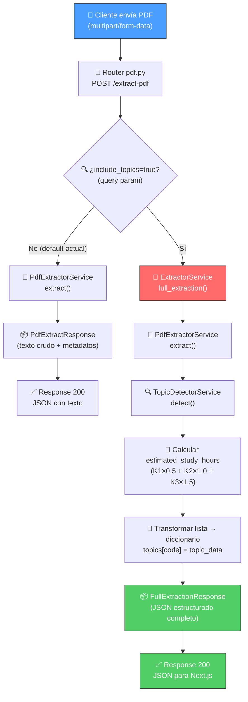
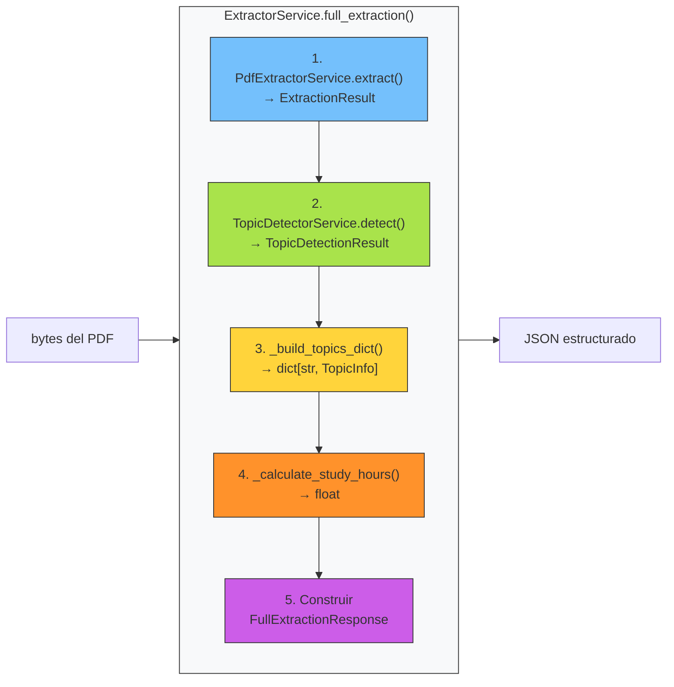

# BE-05 — Chunking y Estructuración del JSON de Salida

**Guía:** BE-05  
**Bloque:** ⚙️ Backend (FastAPI)  
**Fecha:** Junio 2026  
**Dependencias:** BE-03 (Endpoint POST /extract-pdf), BE-04 (Algoritmo de detección de tópicos)

---

## 1. 🎓 Introducción y Fundamentos Conceptuales

### ¿Qué hicimos hasta ahora?

En las guías anteriores construimos dos piezas fundamentales de nuestro pipeline de procesamiento:

1. **BE-03** — Un endpoint `POST /extract-pdf` que recibe un PDF y extrae su texto crudo usando pdfplumber (con fallback a PyMuPDF). El resultado es un `PdfExtractResponse` con el texto completo, texto por página, y metadatos.

2. **BE-04** — Un `TopicDetectorService` que toma el texto crudo del PDF y detecta los 59 objetivos de aprendizaje (FL-x.x.x) del syllabus ISTQB v4.0. Extrae el nivel K (K1/K2/K3), nombre, y texto de cada tópico.

**Pero hay un problema:** estas dos piezas trabajan de forma aislada. El endpoint `POST /extract-pdf` retorna texto crudo y el `TopicDetectorService` espera recibir ese texto — pero nadie los conecta todavía. El frontend (Next.js en UP-03) necesita un **JSON estructurado listo para consumir**, no texto crudo ni objetos internos de Python.

### ¿Qué vamos a construir en BE-05?

Esta guía cierra la brecha creando el **ExtractorService** — un servicio de orquestación que:

1. **Conecta** la extracción de texto con la detección de tópicos.
2. **Transforma** los tópicos detectados en un diccionario indexado por código (`"FL-1.1.1": { ... }`).
3. **Calcula** las horas estimadas de estudio basándose en la distribución de niveles K.
4. **Produce** un JSON final que Next.js puede consumir directamente sin transformación.
5. **Integra** todo en el endpoint `POST /extract-pdf` existente para que una sola llamada haga: PDF → Texto → Tópicos → JSON.

### ¿Por qué un servicio de orquestación?

```
                      SIN ExtractorService (actual)
    ┌──────────┐          ┌──────────────────┐
    │ pdf.py   │ ───→     │ PdfExtractor     │ ───→ texto crudo
    │ (router) │          │ Service          │
    └──────────┘          └──────────────────┘

                         TopicDetector       ───→ tópicos detectados
                         Service (aislado)


                      CON ExtractorService (BE-05)
    ┌──────────┐          ┌──────────────────┐
    │ pdf.py   │ ───→     │ ExtractorService │ ───→ JSON estructurado
    │ (router) │          │ (orquestador)    │      listo para Next.js
    └──────────┘          │                  │
                          │  ┌─────────────┐ │
                          │  │ PdfExtractor │ │
                          │  └─────────────┘ │
                          │  ┌─────────────┐ │
                          │  │ TopicDetect. │ │
                          │  └─────────────┘ │
                          └──────────────────┘
```

Esto se llama el **patrón Facade** — un servicio que simplifica una interfaz compleja detrás de una sola llamada. El router no necesita saber cómo se extrae el texto ni cómo se detectan los tópicos; solo llama al `ExtractorService` y recibe el resultado final.

### Conceptos clave de esta guía

#### 1. Transformación de datos (Mapping Pattern)

El `TopicDetectorService` retorna una **lista** de tópicos (`list[DetectedTopic]`). Pero el frontend necesita un **diccionario** indexado por código para acceso O(1):

```python
# ❌ Lista (BE-04): hay que buscar linealmente
topics = [{"code": "FL-1.1.1", ...}, {"code": "FL-1.1.2", ...}]
# Para encontrar FL-4.2.1: loop por toda la lista → O(n)

# ✅ Diccionario (BE-05): acceso directo por clave
topics = {
    "FL-1.1.1": {"level_k": "K1", "name": "...", "text": "..."},
    "FL-4.2.1": {"level_k": "K3", "name": "...", "text": "..."},
}
# Para encontrar FL-4.2.1: topics["FL-4.2.1"] → O(1)
```

#### 2. Cálculo derivado (Computed Fields)

Las horas estimadas de estudio no se almacenan en el PDF — se **calculan** a partir de la distribución de niveles K:

| Nivel K | Complejidad | Horas por tópico |
|---------|------------|-------------------|
| K1 (Recordar) | Baja — memorizar definiciones | 0.5 horas |
| K2 (Comprender) | Media — entender conceptos | 1.0 horas |
| K3 (Aplicar) | Alta — aplicar en escenarios | 1.5 horas |

**Fórmula:** `estimated_study_hours = (K1 × 0.5) + (K2 × 1.0) + (K3 × 1.5)`

Ejemplo real del ISTQB v4.0: `(15 × 0.5) + (38 × 1.0) + (6 × 1.5) = 7.5 + 38.0 + 9.0 = 54.5 horas`

#### 3. Snapshot Testing

Un **snapshot test** captura el resultado de una operación y lo guarda como "la verdad". En ejecuciones futuras, se compara el resultado actual contra el snapshot. Si difiere → algo cambió (intencionalmente o no).

```
Primera ejecución:  resultado → guardar como snapshot ✅
Segunda ejecución:  resultado → comparar con snapshot
                    ¿Coincide? → ✅ Test pasa
                    ¿Difiere?  → ❌ Test falla → investigar el cambio
```

Esto es crucial para detectar **regresiones** — si alguien modifica el regex del topic detector y un tópico ya no se detecta, el snapshot test lo atrapa inmediatamente.

---

## 2. 📋 Prerequisitos y Verificación del Entorno

### Herramientas y Versiones

| Herramienta | Versión mínima | Comando de verificación | Salida esperada |
|-------------|----------------|------------------------|------------------|
| Python | 3.10+ | `python --version` | `Python 3.10.x` o superior |
| pip | 21+ | `pip --version` | `pip 24.x.x from ...` |
| Virtual env | activado | `.\\venv\\Scripts\\Activate.ps1` | Prompt muestra `(venv)` |
| FastAPI | 0.115+ | `pip show fastapi` | `Version: 0.115.x` |
| pdfplumber | 0.11+ | `pip show pdfplumber` | `Version: 0.11.x` |
| PyMuPDF | 1.24+ | `pip show pymupdf` | `Version: 1.24.x` |
| pydantic | 2.x | `pip show pydantic` | `Version: 2.x.x` |

### Dependencias de guías anteriores

Antes de comenzar BE-05, verifica que los entregables de guías anteriores existen:

```powershell
# Navegar al proyecto
cd c:\Users\jsife\OneDrive\Desktop\Repositorios\practica-testing\backend

# Activar entorno virtual
.\venv\Scripts\Activate.ps1

# === Verificar entregables de BE-03 ===
Test-Path "app\services\pdf_extractor.py"
# Esperado: True

Test-Path "app\routers\pdf.py"
# Esperado: True

# === Verificar entregables de BE-04 ===
Test-Path "app\services\topic_detector.py"
# Esperado: True

Test-Path "app\models\schemas.py"
# Esperado: True

Test-Path "tests\fixtures\sample_syllabus_text.py"
# Esperado: True

Test-Path "tests\test_topic_detector.py"
# Esperado: True

# === Verificar que los imports funcionan ===
python -c "from app.services.pdf_extractor import PdfExtractorService; print('PdfExtractorService OK')"
# Esperado: PdfExtractorService OK

python -c "from app.services.topic_detector import TopicDetectorService; print('TopicDetectorService OK')"
# Esperado: TopicDetectorService OK

python -c "from app.models.schemas import TopicDetectionResponse, DetectedTopicSchema; print('Schemas OK')"
# Esperado: Schemas OK
```

> ⚠️ **Si algún `Test-Path` retorna `False` o algún import falla**, regresa a la guía correspondiente (BE-03 o BE-04) y completa los entregables faltantes antes de continuar.

### Verificar que los tests de BE-04 pasan

```powershell
cd c:\Users\jsife\OneDrive\Desktop\Repositorios\practica-testing\backend
.\venv\Scripts\Activate.ps1
python -m tests.test_topic_detector
```

**Salida esperada:**
```
✅ Test 1 PASÓ: Se detectaron tópicos (59 encontrados)
✅ Test 2 PASÓ: Distribución K correcta (K1=15, K2=38, K3=6)
✅ Test 3 PASÓ: FL-1.1.1 detectado con K1
✅ Test 4 PASÓ: FL-4.2.1 detectado con K3
✅ Test 5 PASÓ: Cada tópico tiene texto no vacío
✅ Test 6 PASÓ: Detección completa (is_complete=True)
✅ Test 7 PASÓ: Texto vacío retorna 0 tópicos
✅ Test 8 PASÓ: Deduplicación funciona correctamente
══════════════════════════════════════════════════
✅ TODOS LOS TESTS PASARON (8/8)
```

---

## 3. 📂 Estructura de Directorios del Proyecto

Después de completar esta guía, tu proyecto tendrá la siguiente estructura:

```
practica-testing/
├── .env.example
├── .env.local
├── .gitignore
│
├── backend/
│   ├── .dockerignore                    # (existente — BE-02)
│   ├── .env                             # (existente — BE-01)
│   ├── .env.example                     # (existente — BE-01)
│   ├── Dockerfile                       # (existente — BE-02)
│   ├── requirements.txt                 # (existente — sin cambios en BE-05)
│   ├── venv/                            # (existente — entorno virtual)
│   │
│   ├── app/
│   │   ├── __init__.py                  # (existente — BE-01)
│   │   ├── main.py                      # (existente — sin cambios en BE-05)
│   │   │
│   │   ├── core/
│   │   │   ├── __init__.py              # (existente — BE-01)
│   │   │   └── config.py                # (existente — BE-01)
│   │   │
│   │   ├── models/
│   │   │   ├── __init__.py              # (existente — BE-01)
│   │   │   └── schemas.py               # ✏️ MODIFICAR — agregar schemas de BE-05
│   │   │
│   │   ├── routers/
│   │   │   ├── __init__.py              # (existente — BE-01)
│   │   │   ├── health.py                # (existente — BE-01)
│   │   │   └── pdf.py                   # ✏️ MODIFICAR — integrar ExtractorService
│   │   │
│   │   └── services/
│   │       ├── __init__.py              # (existente — BE-01)
│   │       ├── pdf_extractor.py         # (existente — BE-03)
│   │       ├── topic_detector.py        # (existente — BE-04)
│   │       └── extractor.py             # 🆕 NUEVO — Servicio orquestador
│   │
│   └── tests/
│       ├── __init__.py                  # (existente — BE-04)
│       ├── test_topic_detector.py       # (existente — BE-04)
│       ├── test_extractor.py            # 🆕 NUEVO — Tests del ExtractorService
│       │
│       └── fixtures/
│           ├── __init__.py              # (existente — BE-04)
│           ├── sample_syllabus_text.py  # (existente — BE-04)
│           └── expected_extraction.py   # 🆕 NUEVO — Snapshot del JSON esperado
│
├── docs/
│   ├── guides/
│   │   ├── be/
│   │   │   ├── BE-01.md                 # (existente)
│   │   │   ├── BE-02.md                 # (existente)
│   │   │   ├── BE-03.md                 # (existente)
│   │   │   ├── BE-04.md                 # (existente)
│   │   │   └── BE-05.md                 # 🆕 ESTA GUÍA
│   │   └── db/
│   │       ├── DB-01.md ... DB-04.md    # (existentes)
│   └── roadmap/
│       └── ISTQB_Guias_Implementacion.md
│
├── frontend/                            # (existente — para guías futuras)
├── supabase/                            # (existente — DB-01 a DB-04)
└── dev-tools/                           # (existente)
```

### Resumen de archivos nuevos y modificados en BE-05

| Archivo | Acción | Descripción |
|---------|--------|-------------|
| `backend/app/services/extractor.py` | 🆕 **CREAR** | Servicio orquestador: PDF → Tópicos → JSON |
| `backend/app/models/schemas.py` | ✏️ **MODIFICAR** | Agregar schemas del JSON final de extracción |
| `backend/app/routers/pdf.py` | ✏️ **MODIFICAR** | Integrar ExtractorService y nuevo endpoint |
| `backend/tests/test_extractor.py` | 🆕 **CREAR** | Tests del ExtractorService con snapshot |
| `backend/tests/fixtures/expected_extraction.py` | 🆕 **CREAR** | Snapshot del JSON esperado para regresiones |

---

## 4. 🔄 Diagrama de Flujo del Proceso

### Pipeline completo de extracción (después de BE-05)



### Flujo interno del ExtractorService



---

## 5. 🛠️ Implementación Paso a Paso

---

### Paso A — Definir los Schemas Pydantic del JSON Final

**Archivo:** `backend/app/models/schemas.py`  
**Acción:** MODIFICAR — agregar nuevos schemas al final del archivo.

El JSON final que Next.js consumirá tiene una estructura diferente al `TopicDetectionResponse` de BE-04. En BE-04, los tópicos son una **lista**. En BE-05, los transformamos a un **diccionario** indexado por código para acceso directo.

Agrega los siguientes schemas **al final** del archivo `schemas.py`, después de los schemas de BE-04:

```python
# ═══════════════════════════════════════════════════════════════
# SCHEMAS DE EXTRACCIÓN COMPLETA (BE-05)
# ═══════════════════════════════════════════════════════════════
#
# Estos schemas representan el JSON FINAL que Next.js consumirá
# directamente en la guía UP-03. Son el "contrato" entre el
# backend (FastAPI) y el frontend (Next.js).
#
# Diferencia con los schemas de BE-04:
#   BE-04: TopicDetectionResponse → tópicos como LISTA (interno)
#   BE-05: FullExtractionResponse → tópicos como DICCIONARIO (API)


class TopicInfo(BaseModel):
    """
    Información de UN tópico en el formato final para Next.js.

    A diferencia de DetectedTopicSchema (BE-04), este schema:
    1. NO incluye 'code' — porque el código ES la clave del diccionario.
    2. NO incluye 'start_pos' — dato interno del detector, irrelevante
       para el frontend.
    3. SÍ incluye 'chapter' y 'section' — para agrupación visual en
       la UI del plan de estudio.

    Este modelo representa el VALOR del diccionario en:
        { "FL-1.1.1": TopicInfo, "FL-1.1.2": TopicInfo, ... }

    Ejemplo:
        {
            "level_k": "K1",
            "name": "Identify Typical Test Objectives",
            "text": "Testing has different objectives depending on...",
            "chapter": 1,
            "section": "1.1"
        }
    """

    level_k: str = Field(
        ...,
        pattern=r"^K[123]$",
        description=(
            "Nivel cognitivo según la taxonomía de Bloom: "
            "K1 (recordar), K2 (comprender), K3 (aplicar)."
        ),
        examples=["K1"],
    )

    name: str = Field(
        ...,
        min_length=3,
        description=(
            "Nombre del objetivo de aprendizaje tal como aparece "
            "en el syllabus ISTQB."
        ),
        examples=["Identify Typical Test Objectives"],
    )

    text: str = Field(
        ...,
        min_length=10,
        description=(
            "Texto completo del syllabus asociado a este tópico. "
            "Incluye todo el contenido desde el encabezado FL-x.x.x "
            "hasta el inicio del siguiente tópico."
        ),
    )

    chapter: int = Field(
        ...,
        ge=1,
        le=6,
        description="Número de capítulo del syllabus (1-6).",
        examples=[1],
    )

    section: str = Field(
        ...,
        description="Sección del syllabus (ej: '1.1', '2.3').",
        examples=["1.1"],
    )


class FullExtractionResponse(BaseModel):
    """
    Respuesta COMPLETA del pipeline de extracción y análisis.

    Este es el JSON FINAL que Next.js consumirá en UP-03.
    Combina los resultados de:
    1. PdfExtractorService (BE-03) → metadatos del PDF.
    2. TopicDetectorService (BE-04) → tópicos detectados.
    3. ExtractorService (BE-05) → transformación y cálculos.

    La estructura está optimizada para el consumo del frontend:
    - topics: diccionario indexado por código FL-x.x.x (acceso O(1)).
    - estimated_study_hours: calculado automáticamente por el backend.
    - is_complete: indica si el frontend debería alertar al usuario
      sobre posibles problemas en la extracción.

    Ejemplo:
        {
            "filename": "ISTQB_CTFL_v4.0.pdf",
            "total_pages": 135,
            "extraction_method": "pdfplumber",
            "topics": {
                "FL-1.1.1": {
                    "level_k": "K1",
                    "name": "Identify Typical Test Objectives",
                    "text": "Testing has different objectives...",
                    "chapter": 1,
                    "section": "1.1"
                }
            },
            "total_topics": 59,
            "level_distribution": {"K1": 15, "K2": 38, "K3": 6},
            "estimated_study_hours": 54.5,
            "warnings": [],
            "is_complete": true
        }
    """

    filename: str = Field(
        ...,
        description="Nombre original del archivo PDF subido.",
        examples=["ISTQB_CTFL_v4.0.pdf"],
    )

    total_pages: int = Field(
        ...,
        ge=1,
        description="Número total de páginas del PDF.",
        examples=[135],
    )

    extraction_method: str = Field(
        ...,
        description=(
            "Método de extracción de texto utilizado: "
            "'pdfplumber' o 'pymupdf'."
        ),
        examples=["pdfplumber"],
    )

    topics: dict[str, TopicInfo] = Field(
        ...,
        description=(
            "Diccionario de tópicos detectados, indexado por código "
            "FL-x.x.x. Cada valor es un objeto TopicInfo con el nivel K, "
            "nombre, texto, capítulo y sección."
        ),
    )

    total_topics: int = Field(
        ...,
        ge=0,
        description="Número total de tópicos detectados.",
        examples=[59],
    )

    level_distribution: KLevelDistribution = Field(
        ...,
        description="Distribución de tópicos por nivel K (K1, K2, K3).",
    )

    estimated_study_hours: float = Field(
        ...,
        ge=0.0,
        description=(
            "Horas estimadas de estudio calculadas automáticamente. "
            "Fórmula: (K1 × 0.5) + (K2 × 1.0) + (K3 × 1.5). "
            "Usado por UP-04 para generar el plan de estudio."
        ),
        examples=[54.5],
    )

    warnings: list[str] = Field(
        default_factory=list,
        description=(
            "Advertencias generadas durante la extracción y detección. "
            "Lista vacía indica que todo fue perfecto."
        ),
    )

    is_complete: bool = Field(
        ...,
        description=(
            "True si se detectaron >= 90% de los tópicos esperados. "
            "Si es False, el frontend debe alertar al usuario."
        ),
    )
```

#### ¿Por qué `dict[str, TopicInfo]` y no `list[DetectedTopicSchema]`?

| Aspecto | Lista (`list`) | Diccionario (`dict`) |
|---------|---------------|---------------------|
| Buscar FL-4.2.1 | Recorrer toda la lista → O(n) | `topics["FL-4.2.1"]` → O(1) |
| Verificar existencia | `any(t.code == "FL-4.2.1" for t in topics)` | `"FL-4.2.1" in topics` |
| Acceso en JavaScript | `topics.find(t => t.code === "FL-4.2.1")` | `topics["FL-4.2.1"]` |
| Idiomático en JSON APIs | Menos intuitivo para acceso directo | Patrón estándar para recursos indexados |

El frontend necesitará acceder a tópicos individuales constantemente — por ejemplo, al asignar tópicos a sesiones de estudio (UP-04), al mostrar el contenido de un tópico en la sesión (SE-02), etc.

**Entregable del Paso A:**
- ✅ Archivo `backend/app/models/schemas.py` modificado con `TopicInfo` y `FullExtractionResponse`.

---

### Paso B — Crear el ExtractorService (Orquestador)

**Archivo:** `backend/app/services/extractor.py`  
**Acción:** CREAR — nuevo archivo.

Este servicio es el **corazón** de BE-05. Orquesta la cadena completa: PDF → Texto → Tópicos → JSON estructurado.

Crea el archivo `backend/app/services/extractor.py` con el siguiente contenido:

```python
"""
Servicio orquestador de extracción — ISTQB Study Agent.

Este módulo implementa el ExtractorService, que conecta y orquesta
los servicios de extracción de texto (BE-03) y detección de tópicos
(BE-04) para producir un JSON estructurado listo para el frontend.

Arquitectura:
    ExtractorService sigue el patrón Facade:
    - Simplifica una cadena compleja (PDF → Texto → Tópicos → JSON)
      en una sola llamada: full_extraction(pdf_bytes, filename).
    - El router NO necesita conocer los pasos internos.
    - Cada servicio interno (PdfExtractor, TopicDetector) sigue
      siendo independiente y testeable por separado.

    ┌─────────────────────────────────────────────────────┐
    │               ExtractorService                      │
    │                                                     │
    │  pdf_bytes ──→ PdfExtractorService.extract()        │
    │                       │                             │
    │                  full_text                           │
    │                       │                             │
    │               TopicDetectorService.detect()         │
    │                       │                             │
    │              TopicDetectionResult                   │
    │                       │                             │
    │              _build_topics_dict()                   │
    │              _calculate_study_hours()               │
    │                       │                             │
    │              FullExtractionResponse                 │
    └─────────────────────────────────────────────────────┘

Uso:
    from app.services.extractor import ExtractorService

    service = ExtractorService()
    result = service.full_extraction(
        pdf_bytes=b"...",
        filename="syllabus.pdf"
    )
    print(f"Detectados {result.total_topics} tópicos")
    print(f"Horas estimadas: {result.estimated_study_hours}")
"""

import logging
from dataclasses import dataclass

from app.services.pdf_extractor import PdfExtractorService, ExtractionResult
from app.services.topic_detector import (
    TopicDetectorService,
    TopicDetectionResult,
    DetectedTopic,
)

# ─── Logger del módulo ───
logger = logging.getLogger(__name__)


# ═══════════════════════════════════════════════════════════════
# CONSTANTES DE CÁLCULO DE HORAS DE ESTUDIO
# ═══════════════════════════════════════════════════════════════
#
# Estas constantes definen cuántas horas de estudio se estiman
# para cada nivel cognitivo K de la taxonomía de Bloom.
#
# Están basadas en las recomendaciones del ISTQB para preparación
# del examen Foundation Level, ajustadas por experiencia práctica:
#
# K1 (Recordar):   Memorizar definiciones → rápido → 0.5 horas.
# K2 (Comprender):  Entender relaciones  → medio  → 1.0 horas.
# K3 (Aplicar):     Aplicar en escenarios → lento  → 1.5 horas.
#
# Si estos valores se necesitan ajustar en el futuro, solo
# se cambian aquí y todos los cálculos se actualizan.

HOURS_PER_K_LEVEL: dict[str, float] = {
    "K1": 0.5,
    "K2": 1.0,
    "K3": 1.5,
}


@dataclass
class FullExtractionResult:
    """
    Resultado interno del pipeline completo de extracción.

    Dataclass interno — nunca se serializa a JSON directamente.
    Se convierte a FullExtractionResponse (schema Pydantic) en
    el router antes de retornar al cliente.

    Atributos:
        filename: Nombre original del PDF procesado.
        total_pages: Número total de páginas del PDF.
        extraction_method: Método usado para extraer texto.
        topics_dict: Diccionario de tópicos indexado por código FL-x.x.x.
        total_topics: Cantidad de tópicos detectados.
        level_distribution: Diccionario con cuenta por nivel K.
        estimated_study_hours: Horas estimadas de estudio.
        warnings: Lista de advertencias del proceso.
        is_complete: True si se detectaron >= 90% de los tópicos esperados.
    """

    filename: str
    total_pages: int
    extraction_method: str
    topics_dict: dict[str, dict]
    total_topics: int
    level_distribution: dict[str, int]
    estimated_study_hours: float
    warnings: list[str]
    is_complete: bool


class ExtractorService:
    """
    Servicio orquestador del pipeline de extracción completo.

    Conecta PdfExtractorService (BE-03) y TopicDetectorService (BE-04)
    para producir un JSON estructurado listo para el frontend.

    Ejemplo de uso:
        service = ExtractorService()
        result = service.full_extraction(pdf_bytes, "syllabus.pdf")
        print(result.topics_dict["FL-1.1.1"]["name"])
        # → "Identify Typical Test Objectives"
    """

    def __init__(
        self,
        pdf_extractor: PdfExtractorService | None = None,
        topic_detector: TopicDetectorService | None = None,
    ):
        """
        Inicializa el orquestador con sus servicios internos.

        Permite inyectar servicios personalizados (útil para testing).
        Si no se inyectan, se crean instancias por defecto.

        Args:
            pdf_extractor: Servicio de extracción de texto de PDFs.
                Si es None, se crea una instancia de PdfExtractorService.
            topic_detector: Servicio de detección de tópicos.
                Si es None, se crea una instancia de TopicDetectorService.
        """
        self._pdf_extractor = pdf_extractor or PdfExtractorService()
        self._topic_detector = topic_detector or TopicDetectorService()

        logger.info("ExtractorService inicializado con sus servicios internos")

    def full_extraction(
        self,
        pdf_bytes: bytes,
        filename: str,
    ) -> FullExtractionResult:
        """
        Ejecuta el pipeline completo de extracción y análisis.

        Pipeline:
        1. Extraer texto del PDF (PdfExtractorService).
        2. Detectar tópicos FL-x.x.x (TopicDetectorService).
        3. Transformar tópicos a diccionario indexado por código.
        4. Calcular horas estimadas de estudio.
        5. Construir resultado con todos los datos.

        Args:
            pdf_bytes: Bytes crudos del archivo PDF.
            filename: Nombre original del archivo PDF.

        Returns:
            FullExtractionResult con el JSON estructurado completo.

        Raises:
            PdfExtractionError: Si no se puede extraer texto del PDF.
            TopicDetectionError: Si la detección de tópicos falla
                catastróficamente (distinto de "pocos tópicos", que
                es un warning).
        """
        logger.info(
            "Iniciando extracción completa de '%s' (%d bytes)",
            filename,
            len(pdf_bytes),
        )

        # ─── Paso 1: Extraer texto del PDF ───
        # Delega a PdfExtractorService (BE-03).
        # Si falla, la excepción PdfExtractionError sube al router.
        extraction_result: ExtractionResult = self._pdf_extractor.extract(
            pdf_bytes=pdf_bytes,
            filename=filename,
        )
        logger.info(
            "Texto extraído: %d páginas, %d caracteres, método: %s",
            extraction_result.total_pages,
            extraction_result.text_length,
            extraction_result.extraction_method,
        )

        # ─── Paso 2: Detectar tópicos ───
        # Delega a TopicDetectorService (BE-04).
        # Usa el full_text del paso anterior como input.
        detection_result: TopicDetectionResult = self._topic_detector.detect(
            full_text=extraction_result.full_text,
        )
        logger.info(
            "Tópicos detectados: %d (completo: %s)",
            detection_result.total_topics,
            detection_result.is_complete,
        )

        # ─── Paso 3: Transformar a diccionario ───
        # Convierte la lista de DetectedTopic a un diccionario
        # indexado por código FL-x.x.x.
        topics_dict = self._build_topics_dict(detection_result.topics)

        # ─── Paso 4: Calcular horas estimadas ───
        estimated_hours = self._calculate_study_hours(
            detection_result.level_distribution
        )
        logger.info("Horas estimadas de estudio: %.1f", estimated_hours)

        # ─── Paso 5: Construir resultado ───
        result = FullExtractionResult(
            filename=extraction_result.filename,
            total_pages=extraction_result.total_pages,
            extraction_method=extraction_result.extraction_method,
            topics_dict=topics_dict,
            total_topics=detection_result.total_topics,
            level_distribution=detection_result.level_distribution,
            estimated_study_hours=estimated_hours,
            warnings=detection_result.warnings,
            is_complete=detection_result.is_complete,
        )

        logger.info(
            "Extracción completa finalizada: %d tópicos, %.1f horas, "
            "%d warnings",
            result.total_topics,
            result.estimated_study_hours,
            len(result.warnings),
        )

        return result

    # ═══════════════════════════════════════════════════════════
    # MÉTODOS AUXILIARES
    # ═══════════════════════════════════════════════════════════

    @staticmethod
    def _build_topics_dict(
        topics: list[DetectedTopic],
    ) -> dict[str, dict]:
        """
        Transforma una lista de DetectedTopic a un diccionario
        indexado por código FL-x.x.x.

        La transformación es directa:
            Input:  [DetectedTopic(code="FL-1.1.1", level_k="K1", ...), ...]
            Output: {"FL-1.1.1": {"level_k": "K1", "name": "...", ...}, ...}

        ¿Por qué un diccionario y no la lista directamente?
        → Acceso O(1) por código en el frontend.
        → JavaScript: topics["FL-1.1.1"] vs topics.find(...)
        → Más idiomático para recursos indexados en APIs REST.

        Args:
            topics: Lista de tópicos detectados por TopicDetectorService.

        Returns:
            Diccionario donde cada clave es un código FL-x.x.x y
            cada valor es un dict con level_k, name, text, chapter, section.
        """
        topics_dict: dict[str, dict] = {}

        for topic in topics:
            topics_dict[topic.code] = {
                "level_k": topic.level_k,
                "name": topic.name,
                "text": topic.text,
                "chapter": topic.chapter,
                "section": topic.section,
            }

        logger.debug(
            "Diccionario de tópicos construido: %d entradas",
            len(topics_dict),
        )

        return topics_dict

    @staticmethod
    def _calculate_study_hours(
        level_distribution: dict[str, int],
    ) -> float:
        """
        Calcula las horas estimadas de estudio basándose en la
        distribución de niveles K.

        Fórmula:
            estimated_hours = (K1 × 0.5) + (K2 × 1.0) + (K3 × 1.5)

        Ejemplo con ISTQB v4.0 (K1=15, K2=38, K3=6):
            (15 × 0.5) + (38 × 1.0) + (6 × 1.5)
            = 7.5 + 38.0 + 9.0
            = 54.5 horas

        Nota: este cálculo es una ESTIMACIÓN. El servicio de
        generación de plan (UP-04) podrá ajustar estos valores
        según las preferencias del usuario.

        Args:
            level_distribution: Diccionario con la cuenta por nivel K.
                Ejemplo: {"K1": 15, "K2": 38, "K3": 6}

        Returns:
            Horas estimadas de estudio, redondeadas a 1 decimal.
        """
        total_hours = 0.0

        for level, count in level_distribution.items():
            hours_per_topic = HOURS_PER_K_LEVEL.get(level, 1.0)
            total_hours += count * hours_per_topic

            logger.debug(
                "  %s: %d tópicos × %.1f h = %.1f h",
                level,
                count,
                hours_per_topic,
                count * hours_per_topic,
            )

        # Redondear a 1 decimal para evitar artefactos de punto flotante.
        # Ejemplo: 54.50000000000001 → 54.5
        return round(total_hours, 1)
```

#### Puntos clave del diseño

1. **Inyección de dependencias manual:** El constructor acepta instancias de los servicios internos. Si no se pasan, crea instancias por defecto. Esto facilita el testing — puedes inyectar mocks o servicios configurados.

2. **`@staticmethod` en métodos auxiliares:** `_build_topics_dict` y `_calculate_study_hours` no acceden a `self` — son funciones puras que reciben datos y retornan datos. Marcarlos como `@staticmethod` documenta esta intención.

3. **Logging detallado:** Cada paso del pipeline registra su progreso. En producción, puedes buscar en los logs `"Extracción completa finalizada"` para ver el resumen de cada procesamiento.

4. **Separación de dataclass y Pydantic:** `FullExtractionResult` es un dataclass interno (eficiente), y la conversión a `FullExtractionResponse` (Pydantic) ocurre en el router.

**Entregable del Paso B:**
- ✅ Archivo `backend/app/services/extractor.py` creado con `ExtractorService`, `FullExtractionResult`, y constantes `HOURS_PER_K_LEVEL`.

---

### Paso C — Modificar el Router para Integrar el ExtractorService

**Archivo:** `backend/app/routers/pdf.py`  
**Acción:** MODIFICAR — agregar un nuevo endpoint y refactorizar imports.

Ahora vamos a integrar el `ExtractorService` en el router de PDF. Agregaremos un **nuevo endpoint** `POST /extract-pdf-full` que ejecuta el pipeline completo (PDF → Texto → Tópicos → JSON). El endpoint original `POST /extract-pdf` se mantiene sin cambios para no romper nada.

Reemplaza el contenido **completo** de `backend/app/routers/pdf.py` con:

```python
"""
Router de Extracción de PDF — ISTQB Study Agent.

Propósito:
  Proveer endpoints para procesar archivos PDF del syllabus ISTQB.

Endpoints:
  POST /extract-pdf       → Extrae texto crudo del PDF (BE-03).
  POST /extract-pdf-full  → Pipeline completo: PDF → Tópicos → JSON (BE-05).

Autenticación: Ninguna en esta versión (se agregará en guías futuras).
Content-Type de entrada: multipart/form-data
Content-Type de salida: application/json

Consumidores futuros:
  - Next.js API Route /api/upload (guía UP-03): usará /extract-pdf-full
    para obtener el JSON estructurado en una sola llamada.
"""

import logging

from app.models.schemas import (
    ErrorResponse,
    FullExtractionResponse,
    KLevelDistribution,
    PageContent,
    PdfExtractResponse,
    TopicInfo,
)
from app.services.extractor import ExtractorService
from app.services.pdf_extractor import PdfExtractionError, PdfExtractorService
from app.services.topic_detector import TopicDetectionError
from fastapi import APIRouter, File, HTTPException, UploadFile, status

# ─── Logger del módulo ───
logger = logging.getLogger(__name__)

# ─── Crear instancia del Router ───
# tags: agrupa los endpoints en Swagger UI bajo la etiqueta "PDF Extraction".
router = APIRouter(
    tags=["PDF Extraction"],
)

# ─── Instancias de servicios ───
# Ambos servicios son stateless, así que creamos una instancia
# única que se reutiliza en todas las peticiones.
_pdf_service = PdfExtractorService()
_extractor_service = ExtractorService()


# ═══════════════════════════════════════════════════════════════
# FUNCIONES AUXILIARES DE VALIDACIÓN
# ═══════════════════════════════════════════════════════════════
#
# Extraemos las validaciones a funciones reutilizables para evitar
# duplicar código entre los endpoints /extract-pdf y /extract-pdf-full.


def _validate_pdf_content_type(file: UploadFile) -> None:
    """
    Valida que el content_type del archivo sea application/pdf.

    Args:
        file: Archivo subido via multipart/form-data.

    Raises:
        HTTPException(400): Si el content_type no es application/pdf.
    """
    if file.content_type != "application/pdf":
        logger.warning(
            "Archivo rechazado: content_type='%s', filename='%s'",
            file.content_type,
            file.filename,
        )
        raise HTTPException(
            status_code=status.HTTP_400_BAD_REQUEST,
            detail={
                "detail": (
                    f"El archivo '{file.filename}' no es un PDF válido. "
                    f"Se recibió content_type '{file.content_type}', "
                    "pero se esperaba 'application/pdf'."
                ),
                "error_code": "INVALID_FILE_TYPE",
            },
        )


async def _read_pdf_bytes(file: UploadFile) -> bytes:
    """
    Lee los bytes del archivo y valida que no esté vacío y sea un PDF.

    Args:
        file: Archivo subido via multipart/form-data.

    Returns:
        Bytes crudos del archivo PDF.

    Raises:
        HTTPException(400): Si el archivo está vacío o no es PDF.
        HTTPException(500): Si hay un error al leer el archivo.
    """
    # Leer bytes
    try:
        pdf_bytes = await file.read()
    except Exception as e:
        logger.error("Error al leer el archivo '%s': %s", file.filename, str(e))
        raise HTTPException(
            status_code=status.HTTP_500_INTERNAL_SERVER_ERROR,
            detail={
                "detail": f"Error al leer el archivo: {str(e)}",
                "error_code": "FILE_READ_ERROR",
            },
        ) from e

    # Validar que no está vacío
    if len(pdf_bytes) == 0:
        raise HTTPException(
            status_code=status.HTTP_400_BAD_REQUEST,
            detail={
                "detail": "El archivo PDF está vacío (0 bytes).",
                "error_code": "EMPTY_FILE",
            },
        )

    # Validar magic bytes del PDF
    if not pdf_bytes[:4] == b"%PDF":
        logger.warning(
            "Archivo rechazado por magic bytes: filename='%s', "
            "primeros bytes=%r",
            file.filename,
            pdf_bytes[:10],
        )
        raise HTTPException(
            status_code=status.HTTP_400_BAD_REQUEST,
            detail={
                "detail": (
                    f"El archivo '{file.filename}' no es un PDF válido. "
                    "Los primeros bytes del archivo no corresponden al "
                    "formato PDF (esperado: %PDF)."
                ),
                "error_code": "INVALID_PDF_HEADER",
            },
        )

    return pdf_bytes


# ═══════════════════════════════════════════════════════════════
# ENDPOINT 1: POST /extract-pdf (BE-03 — solo texto)
# ═══════════════════════════════════════════════════════════════


@router.post(
    "/extract-pdf",
    response_model=PdfExtractResponse,
    summary="Extraer texto de un archivo PDF",
    description=(
        "Recibe un archivo PDF via multipart/form-data y extrae su texto "
        "completo usando pdfplumber como método principal y PyMuPDF como "
        "fallback. Retorna el texto crudo concatenado, el texto por página "
        "individual, y metadatos de la extracción.\n\n"
        "**Nota:** Este endpoint retorna solo el texto extraído, sin "
        "detección de tópicos. Para obtener el JSON estructurado completo "
        "con tópicos, distribución K y horas estimadas, usa "
        "`POST /extract-pdf-full`.\n\n"
        "**Límites:**\n"
        "- Solo acepta archivos con content_type application/pdf.\n"
        "- El archivo se procesa en memoria (no se guarda en disco).\n"
        "- PDFs escaneados sin OCR no retornarán texto útil."
    ),
    responses={
        200: {
            "description": "Texto extraído exitosamente.",
            "content": {
                "application/json": {
                    "example": {
                        "filename": "ISTQB_CTFL_v4.0.pdf",
                        "total_pages": 135,
                        "extraction_method": "pdfplumber",
                        "full_text": "ISTQB® Certified Tester Foundation Level...",
                        "pages": [
                            {"page_number": 1, "text": "ISTQB® Certified..."},
                        ],
                        "text_length": 250000,
                    }
                }
            },
        },
        400: {
            "description": "El archivo no es un PDF.",
            "model": ErrorResponse,
        },
        422: {
            "description": "No se pudo extraer texto del PDF.",
            "model": ErrorResponse,
        },
        500: {
            "description": "Error interno del servidor.",
            "model": ErrorResponse,
        },
    },
)
async def extract_pdf(
    file: UploadFile = File(
        ...,
        description=(
            "Archivo PDF del syllabus ISTQB a procesar. "
            "Debe ser un PDF válido con texto seleccionable."
        ),
    ),
) -> PdfExtractResponse:
    """
    Endpoint de extracción de texto de PDFs (solo texto, sin tópicos).

    Flujo:
    1. Valida que el archivo recibido es un PDF.
    2. Lee el archivo completo en memoria.
    3. Delega la extracción al PdfExtractorService.
    4. Construye y retorna PdfExtractResponse con los resultados.

    Args:
        file: Archivo PDF subido via multipart/form-data.

    Returns:
        PdfExtractResponse: JSON con el texto extraído y metadatos.
    """
    # Validar content_type
    _validate_pdf_content_type(file)

    # Leer y validar bytes
    pdf_bytes = await _read_pdf_bytes(file)
    filename = file.filename or "unknown.pdf"

    # Extraer texto
    try:
        result = _pdf_service.extract(pdf_bytes=pdf_bytes, filename=filename)
    except PdfExtractionError as e:
        logger.error(
            "Error de extracción para '%s': %s (code: %s)",
            filename,
            e.message,
            e.error_code,
        )
        raise HTTPException(
            status_code=status.HTTP_422_UNPROCESSABLE_ENTITY,
            detail={
                "detail": e.message,
                "error_code": e.error_code,
            },
        ) from e
    except Exception as e:
        logger.exception("Error inesperado procesando '%s'", filename)
        raise HTTPException(
            status_code=status.HTTP_500_INTERNAL_SERVER_ERROR,
            detail={
                "detail": f"Error interno al procesar el PDF: {str(e)}",
                "error_code": "INTERNAL_ERROR",
            },
        ) from e

    # Construir respuesta
    return PdfExtractResponse(
        filename=result.filename,
        total_pages=result.total_pages,
        extraction_method=result.extraction_method,
        full_text=result.full_text,
        pages=[
            PageContent(page_number=page_num, text=text)
            for page_num, text in result.pages
        ],
        text_length=result.text_length,
    )


# ═══════════════════════════════════════════════════════════════
# ENDPOINT 2: POST /extract-pdf-full (BE-05 — pipeline completo)
# ═══════════════════════════════════════════════════════════════


@router.post(
    "/extract-pdf-full",
    response_model=FullExtractionResponse,
    summary="Extracción completa: PDF → Tópicos → JSON estructurado",
    description=(
        "Ejecuta el pipeline completo de extracción y análisis del "
        "syllabus ISTQB:\n\n"
        "1. **Extracción de texto** del PDF (pdfplumber/PyMuPDF).\n"
        "2. **Detección de tópicos** FL-x.x.x con regex.\n"
        "3. **Cálculo de horas** estimadas de estudio.\n"
        "4. **Estructuración** del JSON final para Next.js.\n\n"
        "Este es el endpoint principal que la API Route de Next.js "
        "(`/api/upload` en UP-03) consumirá.\n\n"
        "**Tiempo de respuesta estimado:** 3-5 segundos para el "
        "syllabus ISTQB v4.0 (~135 páginas)."
    ),
    responses={
        200: {
            "description": "Extracción completa exitosa.",
            "content": {
                "application/json": {
                    "example": {
                        "filename": "ISTQB_CTFL_v4.0.pdf",
                        "total_pages": 135,
                        "extraction_method": "pdfplumber",
                        "topics": {
                            "FL-1.1.1": {
                                "level_k": "K1",
                                "name": "Identify Typical Test Objectives",
                                "text": "Testing has different objectives...",
                                "chapter": 1,
                                "section": "1.1",
                            },
                        },
                        "total_topics": 59,
                        "level_distribution": {"K1": 15, "K2": 38, "K3": 6},
                        "estimated_study_hours": 54.5,
                        "warnings": [],
                        "is_complete": True,
                    }
                }
            },
        },
        400: {
            "description": "El archivo no es un PDF válido.",
            "model": ErrorResponse,
        },
        422: {
            "description": "No se pudo extraer texto o detectar tópicos.",
            "model": ErrorResponse,
        },
        500: {
            "description": "Error interno del servidor.",
            "model": ErrorResponse,
        },
    },
)
async def extract_pdf_full(
    file: UploadFile = File(
        ...,
        description=(
            "Archivo PDF del syllabus ISTQB a procesar. "
            "Debe ser un PDF válido con texto seleccionable."
        ),
    ),
) -> FullExtractionResponse:
    """
    Endpoint de extracción completa: PDF → Tópicos → JSON estructurado.

    Flujo:
    1. Valida que el archivo recibido es un PDF (content_type + magic bytes).
    2. Lee el archivo completo en memoria.
    3. Delega al ExtractorService que orquesta todo el pipeline.
    4. Convierte el resultado interno a FullExtractionResponse.

    Args:
        file: Archivo PDF del syllabus ISTQB.

    Returns:
        FullExtractionResponse: JSON estructurado con tópicos, distribución K,
        y horas estimadas de estudio.
    """
    # ─── Validaciones (reutilizando funciones auxiliares) ───
    _validate_pdf_content_type(file)
    pdf_bytes = await _read_pdf_bytes(file)
    filename = file.filename or "unknown.pdf"

    # ─── Pipeline completo ───
    try:
        result = _extractor_service.full_extraction(
            pdf_bytes=pdf_bytes,
            filename=filename,
        )
    except PdfExtractionError as e:
        logger.error(
            "Error de extracción para '%s': %s (code: %s)",
            filename,
            e.message,
            e.error_code,
        )
        raise HTTPException(
            status_code=status.HTTP_422_UNPROCESSABLE_ENTITY,
            detail={
                "detail": e.message,
                "error_code": e.error_code,
            },
        ) from e
    except TopicDetectionError as e:
        logger.error(
            "Error de detección de tópicos para '%s': %s (code: %s)",
            filename,
            e.message,
            e.error_code,
        )
        raise HTTPException(
            status_code=status.HTTP_422_UNPROCESSABLE_ENTITY,
            detail={
                "detail": e.message,
                "error_code": e.error_code,
            },
        ) from e
    except Exception as e:
        logger.exception(
            "Error inesperado en extracción completa de '%s'", filename
        )
        raise HTTPException(
            status_code=status.HTTP_500_INTERNAL_SERVER_ERROR,
            detail={
                "detail": f"Error interno al procesar el PDF: {str(e)}",
                "error_code": "INTERNAL_ERROR",
            },
        ) from e

    # ─── Construir respuesta Pydantic ───
    # Convertimos el FullExtractionResult (dataclass interno)
    # al FullExtractionResponse (schema Pydantic serializable).
    return FullExtractionResponse(
        filename=result.filename,
        total_pages=result.total_pages,
        extraction_method=result.extraction_method,
        topics={
            code: TopicInfo(
                level_k=info["level_k"],
                name=info["name"],
                text=info["text"],
                chapter=info["chapter"],
                section=info["section"],
            )
            for code, info in result.topics_dict.items()
        },
        total_topics=result.total_topics,
        level_distribution=KLevelDistribution(
            K1=result.level_distribution.get("K1", 0),
            K2=result.level_distribution.get("K2", 0),
            K3=result.level_distribution.get("K3", 0),
        ),
        estimated_study_hours=result.estimated_study_hours,
        warnings=result.warnings,
        is_complete=result.is_complete,
    )
```

#### ¿Por qué dos endpoints separados?

| Aspecto | `POST /extract-pdf` | `POST /extract-pdf-full` |
|---------|---------------------|-------------------------|
| Propósito | Solo extraer texto | Pipeline completo |
| Velocidad | Más rápido (~1-2s) | Más lento (~3-5s) |
| Respuesta | Texto crudo + metadatos | JSON estructurado completo |
| Consumidor | Debugging, testing | Next.js en UP-03 |
| Guía | BE-03 | BE-05 |

Mantener ambos endpoints evita romper cualquier código existente que use `/extract-pdf` y permite debugging más granular.

#### Refactoring aplicado: DRY (Don't Repeat Yourself)

Las validaciones de content_type, lectura de bytes, y magic bytes eran idénticas entre ambos endpoints. Las extrajimos a funciones auxiliares (`_validate_pdf_content_type`, `_read_pdf_bytes`) para evitar duplicación.

**Entregable del Paso C:**
- ✅ Archivo `backend/app/routers/pdf.py` actualizado con el nuevo endpoint `POST /extract-pdf-full` y funciones auxiliares refactorizadas.

---

### Paso D — Crear el Snapshot del JSON Esperado

**Archivo:** `backend/tests/fixtures/expected_extraction.py`  
**Acción:** CREAR — nuevo fixture de datos.

Un snapshot captura el resultado "correcto conocido" de una operación. Si el resultado cambia en el futuro (por un cambio en el regex, por ejemplo), el test lo detecta inmediatamente.

Crea el archivo `backend/tests/fixtures/expected_extraction.py`:

```python
"""
Snapshot del JSON esperado para el ExtractorService — ISTQB Study Agent.

Este fixture contiene los valores ESPERADOS de la extracción completa
cuando se procesa el fixture de texto del syllabus ISTQB v4.0.

Propósito:
    1. Detectar regresiones: si alguien cambia el regex del topic detector
       y un tópico deja de detectarse, el test falla inmediatamente.
    2. Documentar el contrato: estos valores definen qué espera el frontend.
    3. Servir de referencia: cualquier desarrollador puede ver exactamente
       qué produce el pipeline completo.

Regeneración:
    Si se cambian intencionalmente los tópicos detectados (ej: nueva versión
    del syllabus), actualiza estos valores manualmente.

Nota:
    Estos valores corresponden al fixture SAMPLE_SYLLABUS_TEXT de
    sample_syllabus_text.py, NO al PDF real completo. El fixture
    contiene fragmentos representativos del syllabus.
"""

# ═══════════════════════════════════════════════════════════════
# VALORES ESPERADOS PARA EL FIXTURE DE TEXTO
# ═══════════════════════════════════════════════════════════════

# Total de tópicos que el detector debe encontrar en el fixture.
# El fixture sample_syllabus_text.py contiene los 59 tópicos del ISTQB v4.0.
EXPECTED_TOTAL_TOPICS: int = 59

# Distribución esperada de niveles K en el fixture.
EXPECTED_K_DISTRIBUTION: dict[str, int] = {
    "K1": 15,
    "K2": 38,
    "K3": 6,
}

# Horas estimadas de estudio calculadas con la fórmula:
# (K1 × 0.5) + (K2 × 1.0) + (K3 × 1.5)
# = (15 × 0.5) + (38 × 1.0) + (6 × 1.5)
# = 7.5 + 38.0 + 9.0 = 54.5
EXPECTED_STUDY_HOURS: float = 54.5

# La detección debe ser completa (>= 90% de los tópicos esperados).
EXPECTED_IS_COMPLETE: bool = True

# ═══════════════════════════════════════════════════════════════
# TÓPICOS CLAVE PARA VERIFICACIÓN PUNTUAL
# ═══════════════════════════════════════════════════════════════
#
# No verificamos TODOS los 59 tópicos en detalle (sería frágil).
# En su lugar, verificamos algunos tópicos clave de cada capítulo
# y de cada nivel K para asegurar que el pipeline funciona end-to-end.

SPOT_CHECK_TOPICS: dict[str, dict] = {
    # Primer tópico del syllabus — debe detectarse siempre
    "FL-1.1.1": {
        "level_k": "K1",
        "name_contains": "Identify",
        "chapter": 1,
        "section": "1.1",
    },
    # Un tópico K2 del capítulo 2
    "FL-2.1.1": {
        "level_k": "K2",
        "name_contains": "Impact",
        "chapter": 2,
        "section": "2.1",
    },
    # Un tópico K3 del capítulo 4 (aplicar)
    "FL-4.2.1": {
        "level_k": "K3",
        "name_contains": "Equivalence",
        "chapter": 4,
        "section": "4.2",
    },
    # Último tópico del syllabus — verifica que el detector
    # procesa hasta el final del documento
    "FL-6.2.1": {
        "level_k": "K1",
        "name_contains": "Risks",
        "chapter": 6,
        "section": "6.2",
    },
}

# ═══════════════════════════════════════════════════════════════
# CÓDIGOS QUE DEBEN EXISTIR COMO CLAVES DEL DICCIONARIO
# ═══════════════════════════════════════════════════════════════
#
# Verificamos que el diccionario de salida contiene EXACTAMENTE
# estos códigos como claves. Si aparece uno nuevo o falta uno,
# el test falla.

EXPECTED_TOPIC_CODES_SET: set[str] = {
    # Capítulo 1 (12 tópicos)
    "FL-1.1.1", "FL-1.1.2",
    "FL-1.2.1", "FL-1.2.2",
    "FL-1.3.1",
    "FL-1.4.1", "FL-1.4.2", "FL-1.4.3", "FL-1.4.4", "FL-1.4.5",
    "FL-1.5.1", "FL-1.5.2",
    # Capítulo 2 (10 tópicos)
    "FL-2.1.1", "FL-2.1.2", "FL-2.1.3", "FL-2.1.4", "FL-2.1.5", "FL-2.1.6",
    "FL-2.2.1", "FL-2.2.2", "FL-2.2.3",
    "FL-2.3.1",
    # Capítulo 3 (8 tópicos)
    "FL-3.1.1", "FL-3.1.2", "FL-3.1.3",
    "FL-3.2.1", "FL-3.2.2", "FL-3.2.3", "FL-3.2.4", "FL-3.2.5",
    # Capítulo 4 (11 tópicos)
    "FL-4.1.1",
    "FL-4.2.1", "FL-4.2.2", "FL-4.2.3", "FL-4.2.4",
    "FL-4.3.1", "FL-4.3.2", "FL-4.3.3",
    "FL-4.4.1", "FL-4.4.2", "FL-4.4.3",
    # Capítulo 5 (15 tópicos)
    "FL-5.1.1", "FL-5.1.2", "FL-5.1.3", "FL-5.1.4", "FL-5.1.5",
    "FL-5.1.6", "FL-5.1.7",
    "FL-5.2.1", "FL-5.2.2", "FL-5.2.3", "FL-5.2.4",
    "FL-5.3.1", "FL-5.3.2", "FL-5.3.3",
    "FL-5.4.1",
    # Capítulo 6 (2 tópicos)
    "FL-6.1.1",
    "FL-6.2.1",
}
```

> **Nota importante:** Los valores de `EXPECTED_K_DISTRIBUTION` y `EXPECTED_STUDY_HOURS` deben coincidir con lo que el fixture `SAMPLE_SYLLABUS_TEXT` produce. Si modificaste el fixture en BE-04, ajusta estos valores.

**Entregable del Paso D:**
- ✅ Archivo `backend/tests/fixtures/expected_extraction.py` creado con snapshot de valores esperados.

---

### Paso E — Crear los Tests del ExtractorService

**Archivo:** `backend/tests/test_extractor.py`  
**Acción:** CREAR — nuevo archivo de tests.

Siguiendo el patrón de BE-04, creamos tests con aserciones simples (sin pytest). Estos tests verifican el pipeline completo: fixture de texto → TopicDetector → ExtractorService → JSON final.

Crea el archivo `backend/tests/test_extractor.py`:

```python
"""
Script de verificación del ExtractorService — ISTQB Study Agent.

Este script verifica que el ExtractorService (BE-05) produce el
JSON estructurado correcto a partir del fixture de texto del
syllabus ISTQB v4.0.

NO usa pytest. Usa aserciones simples de Python para validar:
1. Que el pipeline completo produce un resultado válido.
2. Que el diccionario de tópicos tiene la estructura correcta.
3. Que las horas estimadas se calculan correctamente.
4. Que los valores coinciden con el snapshot esperado.
5. Que el JSON es serializable (listo para Next.js).

Ejecución:
    cd backend
    .\\venv\\Scripts\\Activate.ps1
    python -m tests.test_extractor

Salida esperada:
    ✅ Test 1 PASÓ: Pipeline produce resultado válido
    ✅ Test 2 PASÓ: Diccionario tiene estructura correcta
    ✅ Test 3 PASÓ: Horas estimadas correctas
    ✅ Test 4 PASÓ: Snapshot de tópicos coincide
    ✅ Test 5 PASÓ: Spot-check de tópicos clave
    ✅ Test 6 PASÓ: JSON es serializable
    ✅ Test 7 PASÓ: Cálculo de horas con distribución personalizada
    ✅ Test 8 PASÓ: Texto vacío produce resultado vacío
    ══════════════════════════════════════════════════════
    ✅ TODOS LOS TESTS PASARON (8/8)
"""

import json
import sys

# Agregar el directorio backend al path
sys.path.insert(0, ".")

from app.services.extractor import ExtractorService, HOURS_PER_K_LEVEL
from app.services.topic_detector import TopicDetectorService
from tests.fixtures.expected_extraction import (
    EXPECTED_IS_COMPLETE,
    EXPECTED_K_DISTRIBUTION,
    EXPECTED_STUDY_HOURS,
    EXPECTED_TOPIC_CODES_SET,
    EXPECTED_TOTAL_TOPICS,
    SPOT_CHECK_TOPICS,
)
from tests.fixtures.sample_syllabus_text import SAMPLE_SYLLABUS_TEXT


def main() -> None:
    """Ejecuta todos los tests de verificación del ExtractorService."""

    passed = 0
    total = 0

    # ─── Setup: Ejecutar el pipeline con el fixture de texto ───
    # Nota: No usamos full_extraction() porque eso requiere pdf_bytes.
    # En su lugar, ejecutamos los pasos intermedios manualmente.
    topic_detector = TopicDetectorService()
    detection_result = topic_detector.detect(SAMPLE_SYLLABUS_TEXT)

    # Transformar usando los métodos estáticos del ExtractorService
    topics_dict = ExtractorService._build_topics_dict(detection_result.topics)
    estimated_hours = ExtractorService._calculate_study_hours(
        detection_result.level_distribution
    )

    # ═══════════════════════════════════════════════════════════
    # TEST 1: Pipeline produce resultado válido
    # ═══════════════════════════════════════════════════════════
    total += 1
    try:
        assert detection_result.total_topics > 0, (
            "El pipeline no detectó ningún tópico"
        )
        assert len(topics_dict) > 0, (
            "El diccionario de tópicos está vacío"
        )
        assert len(topics_dict) == detection_result.total_topics, (
            f"El diccionario tiene {len(topics_dict)} entradas pero se "
            f"detectaron {detection_result.total_topics} tópicos"
        )
        print(
            f"✅ Test 1 PASÓ: Pipeline produce resultado válido "
            f"({len(topics_dict)} tópicos en diccionario)"
        )
        passed += 1
    except AssertionError as e:
        print(f"❌ Test 1 FALLÓ: {e}")

    # ═══════════════════════════════════════════════════════════
    # TEST 2: Diccionario tiene estructura correcta
    # ═══════════════════════════════════════════════════════════
    total += 1
    try:
        # Verificar que cada entrada del diccionario tiene las claves correctas
        required_keys = {"level_k", "name", "text", "chapter", "section"}
        for code, info in topics_dict.items():
            actual_keys = set(info.keys())
            assert actual_keys == required_keys, (
                f"Tópico {code} tiene claves {actual_keys}, "
                f"esperadas: {required_keys}"
            )
            # Verificar tipos
            assert isinstance(info["level_k"], str), f"{code}: level_k no es str"
            assert isinstance(info["name"], str), f"{code}: name no es str"
            assert isinstance(info["text"], str), f"{code}: text no es str"
            assert isinstance(info["chapter"], int), f"{code}: chapter no es int"
            assert isinstance(info["section"], str), f"{code}: section no es str"

        print("✅ Test 2 PASÓ: Diccionario tiene estructura correcta")
        passed += 1
    except AssertionError as e:
        print(f"❌ Test 2 FALLÓ: {e}")

    # ═══════════════════════════════════════════════════════════
    # TEST 3: Horas estimadas correctas (snapshot)
    # ═══════════════════════════════════════════════════════════
    total += 1
    try:
        assert estimated_hours == EXPECTED_STUDY_HOURS, (
            f"Horas estimadas: {estimated_hours}, esperadas: {EXPECTED_STUDY_HOURS}"
        )
        # Verificar la fórmula manualmente
        manual_calc = (
            EXPECTED_K_DISTRIBUTION["K1"] * HOURS_PER_K_LEVEL["K1"]
            + EXPECTED_K_DISTRIBUTION["K2"] * HOURS_PER_K_LEVEL["K2"]
            + EXPECTED_K_DISTRIBUTION["K3"] * HOURS_PER_K_LEVEL["K3"]
        )
        assert estimated_hours == round(manual_calc, 1), (
            f"El cálculo no coincide con la fórmula manual: "
            f"{estimated_hours} != {round(manual_calc, 1)}"
        )
        print(f"✅ Test 3 PASÓ: Horas estimadas correctas ({estimated_hours}h)")
        passed += 1
    except AssertionError as e:
        print(f"❌ Test 3 FALLÓ: {e}")

    # ═══════════════════════════════════════════════════════════
    # TEST 4: Snapshot de tópicos coincide
    # ═══════════════════════════════════════════════════════════
    total += 1
    try:
        actual_codes = set(topics_dict.keys())

        # Verificar total
        assert len(actual_codes) == EXPECTED_TOTAL_TOPICS, (
            f"Total de tópicos: {len(actual_codes)}, "
            f"esperados: {EXPECTED_TOTAL_TOPICS}"
        )

        # Verificar que todos los códigos esperados están presentes
        missing = EXPECTED_TOPIC_CODES_SET - actual_codes
        assert len(missing) == 0, (
            f"Tópicos faltantes vs snapshot: {sorted(missing)}"
        )

        # Verificar que no hay tópicos extras inesperados
        extra = actual_codes - EXPECTED_TOPIC_CODES_SET
        assert len(extra) == 0, (
            f"Tópicos extra no esperados: {sorted(extra)}"
        )

        # Verificar distribución K
        actual_k_dist = detection_result.level_distribution
        assert actual_k_dist == EXPECTED_K_DISTRIBUTION, (
            f"Distribución K: {actual_k_dist}, "
            f"esperada: {EXPECTED_K_DISTRIBUTION}"
        )

        # Verificar completitud
        assert detection_result.is_complete == EXPECTED_IS_COMPLETE, (
            f"is_complete: {detection_result.is_complete}, "
            f"esperado: {EXPECTED_IS_COMPLETE}"
        )

        print(
            f"✅ Test 4 PASÓ: Snapshot de tópicos coincide "
            f"({EXPECTED_TOTAL_TOPICS} tópicos, "
            f"K1={EXPECTED_K_DISTRIBUTION['K1']}, "
            f"K2={EXPECTED_K_DISTRIBUTION['K2']}, "
            f"K3={EXPECTED_K_DISTRIBUTION['K3']})"
        )
        passed += 1
    except AssertionError as e:
        print(f"❌ Test 4 FALLÓ: {e}")

    # ═══════════════════════════════════════════════════════════
    # TEST 5: Spot-check de tópicos clave
    # ═══════════════════════════════════════════════════════════
    total += 1
    try:
        for code, expected in SPOT_CHECK_TOPICS.items():
            assert code in topics_dict, (
                f"Tópico clave {code} no encontrado en diccionario"
            )
            topic = topics_dict[code]
            assert topic["level_k"] == expected["level_k"], (
                f"{code}: level_k={topic['level_k']}, "
                f"esperado={expected['level_k']}"
            )
            assert expected["name_contains"] in topic["name"], (
                f"{code}: nombre '{topic['name']}' no contiene "
                f"'{expected['name_contains']}'"
            )
            assert topic["chapter"] == expected["chapter"], (
                f"{code}: chapter={topic['chapter']}, "
                f"esperado={expected['chapter']}"
            )
            assert topic["section"] == expected["section"], (
                f"{code}: section='{topic['section']}', "
                f"esperado='{expected['section']}'"
            )

        print(
            f"✅ Test 5 PASÓ: Spot-check de tópicos clave "
            f"({len(SPOT_CHECK_TOPICS)} tópicos verificados)"
        )
        passed += 1
    except AssertionError as e:
        print(f"❌ Test 5 FALLÓ: {e}")

    # ═══════════════════════════════════════════════════════════
    # TEST 6: JSON es serializable
    # ═══════════════════════════════════════════════════════════
    total += 1
    try:
        # Construir el objeto JSON completo como lo haría el router
        full_json = {
            "filename": "test_syllabus.pdf",
            "total_pages": 135,
            "extraction_method": "pdfplumber",
            "topics": topics_dict,
            "total_topics": detection_result.total_topics,
            "level_distribution": detection_result.level_distribution,
            "estimated_study_hours": estimated_hours,
            "warnings": detection_result.warnings,
            "is_complete": detection_result.is_complete,
        }

        # Intentar serializar a JSON — si falla, hay tipos no serializables
        json_str = json.dumps(full_json, ensure_ascii=False)
        assert len(json_str) > 0, "JSON serializado está vacío"

        # Deserializar y verificar que los datos sobreviven el round-trip
        parsed = json.loads(json_str)
        assert parsed["total_topics"] == detection_result.total_topics
        assert parsed["estimated_study_hours"] == estimated_hours
        assert len(parsed["topics"]) == len(topics_dict)

        print(
            f"✅ Test 6 PASÓ: JSON es serializable "
            f"({len(json_str):,} caracteres)"
        )
        passed += 1
    except (AssertionError, TypeError, ValueError) as e:
        print(f"❌ Test 6 FALLÓ: {e}")

    # ═══════════════════════════════════════════════════════════
    # TEST 7: Cálculo de horas con distribución personalizada
    # ═══════════════════════════════════════════════════════════
    total += 1
    try:
        # Caso 1: Solo K1
        hours_k1_only = ExtractorService._calculate_study_hours(
            {"K1": 10, "K2": 0, "K3": 0}
        )
        assert hours_k1_only == 5.0, (
            f"10 tópicos K1 × 0.5h = 5.0h, obtenido: {hours_k1_only}"
        )

        # Caso 2: Solo K3
        hours_k3_only = ExtractorService._calculate_study_hours(
            {"K1": 0, "K2": 0, "K3": 4}
        )
        assert hours_k3_only == 6.0, (
            f"4 tópicos K3 × 1.5h = 6.0h, obtenido: {hours_k3_only}"
        )

        # Caso 3: Distribución mixta
        hours_mixed = ExtractorService._calculate_study_hours(
            {"K1": 2, "K2": 3, "K3": 1}
        )
        expected_mixed = (2 * 0.5) + (3 * 1.0) + (1 * 1.5)  # = 5.5
        assert hours_mixed == expected_mixed, (
            f"Distribución mixta: esperado {expected_mixed}, "
            f"obtenido: {hours_mixed}"
        )

        # Caso 4: Distribución vacía
        hours_empty = ExtractorService._calculate_study_hours(
            {"K1": 0, "K2": 0, "K3": 0}
        )
        assert hours_empty == 0.0, (
            f"Distribución vacía debería dar 0.0h, obtenido: {hours_empty}"
        )

        print("✅ Test 7 PASÓ: Cálculo de horas con distribución personalizada")
        passed += 1
    except AssertionError as e:
        print(f"❌ Test 7 FALLÓ: {e}")

    # ═══════════════════════════════════════════════════════════
    # TEST 8: Texto vacío produce resultado vacío
    # ═══════════════════════════════════════════════════════════
    total += 1
    try:
        empty_result = topic_detector.detect("")
        empty_dict = ExtractorService._build_topics_dict(empty_result.topics)
        empty_hours = ExtractorService._calculate_study_hours(
            empty_result.level_distribution
        )

        assert len(empty_dict) == 0, (
            f"Texto vacío produjo {len(empty_dict)} tópicos"
        )
        assert empty_hours == 0.0, (
            f"Texto vacío debería dar 0.0 horas, obtenido: {empty_hours}"
        )
        assert not empty_result.is_complete, (
            "Texto vacío no debería marcar como completo"
        )

        print("✅ Test 8 PASÓ: Texto vacío produce resultado vacío")
        passed += 1
    except AssertionError as e:
        print(f"❌ Test 8 FALLÓ: {e}")

    # ═══════════════════════════════════════════════════════════
    # RESUMEN
    # ═══════════════════════════════════════════════════════════
    print("═" * 50)
    if passed == total:
        print(f"✅ TODOS LOS TESTS PASARON ({passed}/{total})")
    else:
        print(f"⚠️ {passed}/{total} tests pasaron — revisa los fallos arriba")
        sys.exit(1)

    # ─── Info adicional ───
    print(f"\n📊 Resumen del ExtractorService:")
    print(f"   Tópicos en diccionario: {len(topics_dict)}")
    print(f"   Distribución K: {detection_result.level_distribution}")
    print(f"   Horas estimadas: {estimated_hours}")
    print(f"   Completo: {detection_result.is_complete}")
    print(f"   JSON size: {len(json.dumps(topics_dict)):,} caracteres")
    if detection_result.warnings:
        print(f"   Warnings: {len(detection_result.warnings)}")
        for w in detection_result.warnings:
            print(f"     ⚠️ {w}")


if __name__ == "__main__":
    main()
```

**Entregable del Paso E:**
- ✅ Archivo `backend/tests/test_extractor.py` creado con 8 tests de verificación.

---

## 6. ✅ Checkpoints de Verificación

### Checkpoint 1 — Ejecutar los tests del ExtractorService

```powershell
cd c:\Users\jsife\OneDrive\Desktop\Repositorios\practica-testing\backend
.\venv\Scripts\Activate.ps1
python -m tests.test_extractor
```

**Salida esperada:**
```
✅ Test 1 PASÓ: Pipeline produce resultado válido (59 tópicos en diccionario)
✅ Test 2 PASÓ: Diccionario tiene estructura correcta
✅ Test 3 PASÓ: Horas estimadas correctas (54.5h)
✅ Test 4 PASÓ: Snapshot de tópicos coincide (59 tópicos, K1=15, K2=38, K3=6)
✅ Test 5 PASÓ: Spot-check de tópicos clave (4 tópicos verificados)
✅ Test 6 PASÓ: JSON es serializable (XX,XXX caracteres)
✅ Test 7 PASÓ: Cálculo de horas con distribución personalizada
✅ Test 8 PASÓ: Texto vacío produce resultado vacío
══════════════════════════════════════════════════════
✅ TODOS LOS TESTS PASARON (8/8)

📊 Resumen del ExtractorService:
   Tópicos en diccionario: 59
   Distribución K: {'K1': 15, 'K2': 38, 'K3': 6}
   Horas estimadas: 54.5
   Completo: True
   JSON size: XX,XXX caracteres
```

### Checkpoint 2 — Verificar que los tests de BE-04 siguen pasando

```powershell
python -m tests.test_topic_detector
```

**Salida esperada:** Los 8 tests de BE-04 deben seguir pasando. Esto verifica que no rompimos nada al refactorizar.

### Checkpoint 3 — Levantar el servidor y verificar los endpoints

```powershell
cd c:\Users\jsife\OneDrive\Desktop\Repositorios\practica-testing\backend
.\venv\Scripts\Activate.ps1
uvicorn app.main:app --reload
```

**Verificar en el navegador:**

1. **Swagger UI** — Abre `http://localhost:8000/docs`
   - Deberías ver **dos** endpoints bajo "PDF Extraction":
     - `POST /extract-pdf` (solo texto)
     - `POST /extract-pdf-full` (pipeline completo)

2. **Health check** — Abre `http://localhost:8000/health`
   ```json
   {
     "status": "ok",
     "version": "0.1.0"
   }
   ```

### Checkpoint 4 — Probar el endpoint /extract-pdf-full con el PDF real

Si tienes el PDF del syllabus ISTQB v4.0, pruébalo directamente:

**Opción A: Usar Swagger UI**

1. Abre `http://localhost:8000/docs`
2. Haz click en `POST /extract-pdf-full`
3. Haz click en "Try it out"
4. Sube el archivo PDF del syllabus ISTQB
5. Haz click en "Execute"
6. Verifica la respuesta JSON

**Opción B: Usar PowerShell con Invoke-RestMethod**

```powershell
# Ajusta la ruta al PDF real del syllabus ISTQB
$pdfPath = "C:\ruta\al\ISTQB_CTFL_v4.0.pdf"

$form = @{
    file = Get-Item -Path $pdfPath
}

$response = Invoke-RestMethod `
    -Uri "http://localhost:8000/extract-pdf-full" `
    -Method Post `
    -Form $form

# Mostrar resumen
Write-Host "Filename: $($response.filename)"
Write-Host "Total pages: $($response.total_pages)"
Write-Host "Total topics: $($response.total_topics)"
Write-Host "Estimated hours: $($response.estimated_study_hours)"
Write-Host "Is complete: $($response.is_complete)"
Write-Host "Extraction method: $($response.extraction_method)"
Write-Host "K1: $($response.level_distribution.K1)"
Write-Host "K2: $($response.level_distribution.K2)"
Write-Host "K3: $($response.level_distribution.K3)"
```

**Respuesta esperada (con PDF real):**

```json
{
  "filename": "ISTQB_CTFL_v4.0.pdf",
  "total_pages": 135,
  "extraction_method": "pdfplumber",
  "topics": {
    "FL-1.1.1": {
      "level_k": "K1",
      "name": "Identify Typical Test Objectives",
      "text": "Testing has different objectives depending on...",
      "chapter": 1,
      "section": "1.1"
    },
    "...": "... (59 tópicos en total)"
  },
  "total_topics": 59,
  "level_distribution": {
    "K1": 15,
    "K2": 38,
    "K3": 6
  },
  "estimated_study_hours": 54.5,
  "warnings": [],
  "is_complete": true
}
```

### Checkpoint 5 — Verificar estructura de archivos

```powershell
cd c:\Users\jsife\OneDrive\Desktop\Repositorios\practica-testing\backend

# Archivos nuevos de BE-05
Test-Path "app\services\extractor.py"
# Esperado: True

Test-Path "tests\test_extractor.py"
# Esperado: True

Test-Path "tests\fixtures\expected_extraction.py"
# Esperado: True

# Verificar imports
python -c "from app.services.extractor import ExtractorService; print('ExtractorService OK')"
# Esperado: ExtractorService OK

python -c "from app.models.schemas import FullExtractionResponse, TopicInfo; print('Schemas BE-05 OK')"
# Esperado: Schemas BE-05 OK
```

### Checklist de entregables

| # | Entregable | Verificación |
|---|-----------|--------------|
| 1 | `backend/app/services/extractor.py` creado | `Test-Path "app\services\extractor.py"` → True |
| 2 | `backend/app/models/schemas.py` modificado con `TopicInfo` y `FullExtractionResponse` | Import `FullExtractionResponse` funciona |
| 3 | `backend/app/routers/pdf.py` actualizado con `POST /extract-pdf-full` | Swagger UI muestra ambos endpoints |
| 4 | `backend/tests/fixtures/expected_extraction.py` creado | `Test-Path "tests\fixtures\expected_extraction.py"` → True |
| 5 | `backend/tests/test_extractor.py` creado | `python -m tests.test_extractor` → 8/8 pasan |
| 6 | Los tests de BE-04 siguen pasando | `python -m tests.test_topic_detector` → 8/8 pasan |
| 7 | Swagger UI muestra ambos endpoints | `http://localhost:8000/docs` → 2 endpoints de PDF |
| 8 | Health check sigue funcionando | `http://localhost:8000/health` → `{"status": "ok"}` |

---

## 7. 🚨 Troubleshooting — Problemas Comunes

| Problema | Causa Probable | Solución |
|----------|---------------|----------|
| `ModuleNotFoundError: No module named 'app.services.extractor'` | El archivo `extractor.py` no está en la ubicación correcta | Verificar que está en `backend/app/services/extractor.py` (no en `backend/services/`) |
| `ImportError: cannot import name 'FullExtractionResponse'` | Los schemas de BE-05 no se agregaron al archivo `schemas.py` | Verificar que `TopicInfo` y `FullExtractionResponse` están al final de `backend/app/models/schemas.py` |
| `ImportError: cannot import name 'TopicInfo'` | Olvidaste agregar la clase `TopicInfo` antes de `FullExtractionResponse` | Agrega ambas clases en orden: primero `TopicInfo`, luego `FullExtractionResponse` |
| `AssertionError` en Test 3 (horas estimadas) | Los valores del snapshot no coinciden con el fixture | Si modificaste `SAMPLE_SYLLABUS_TEXT` en BE-04, recalcula `EXPECTED_STUDY_HOURS` con la fórmula: `(K1 × 0.5) + (K2 × 1.0) + (K3 × 1.5)` |
| `AssertionError` en Test 4 (snapshot) | Se agregaron o eliminaron tópicos del fixture | Actualiza `EXPECTED_TOPIC_CODES_SET` y `EXPECTED_TOTAL_TOPICS` en `expected_extraction.py` |
| `422 Unprocessable Entity` al probar `/extract-pdf-full` | El PDF no tiene texto seleccionable o no se detectaron tópicos | Usa un PDF real del syllabus ISTQB v4.0. PDFs escaneados sin OCR no funcionan |
| `TypeError: Object of type DetectedTopic is not JSON serializable` | Se está pasando un dataclass donde se espera un dict | Verifica que `_build_topics_dict()` convierte correctamente a diccionarios |
| El servidor no arranca con `uvicorn app.main:app --reload` | Error de importación en algún módulo nuevo | Ejecuta `python -c "from app.routers.pdf import router"` para ver el error detallado |
| `NameError: name 'AssertionError' is not defined` | Error tipográfico — el nombre correcto es `AssertionError` (sin 'i') | Nota: en Python el nombre real es `AssertionError`. Verifica el tipeo |
| Swagger UI muestra solo 1 endpoint de PDF en vez de 2 | El archivo `pdf.py` no se guardó correctamente o tiene errores de sintaxis | Recarga Swagger (`Ctrl+Shift+R`). Si persiste, verifica la sintaxis del archivo `pdf.py` |

---

## 8. 📝 Resumen y Próximo Paso

### Lo que completaste en esta guía

1. ✅ **Definiste schemas Pydantic** (`TopicInfo`, `FullExtractionResponse`) que representan el contrato de datos entre el backend y Next.js.
2. ✅ **Creaste el ExtractorService** — un servicio orquestador que conecta la extracción de texto (BE-03) con la detección de tópicos (BE-04) y produce un JSON estructurado.
3. ✅ **Implementaste el cálculo de horas estimadas** basado en la distribución de niveles K (K1×0.5 + K2×1.0 + K3×1.5).
4. ✅ **Transformaste los tópicos** de lista (`list[DetectedTopic]`) a diccionario indexado por código (`dict[str, TopicInfo]`) para acceso O(1) en el frontend.
5. ✅ **Agregaste el endpoint `POST /extract-pdf-full`** que ejecuta todo el pipeline en una sola llamada HTTP.
6. ✅ **Refactorizaste el router** extrayendo validaciones a funciones reutilizables (DRY).
7. ✅ **Creaste snapshot tests** para detectar regresiones automáticamente.
8. ✅ **Verificaste** que todo funciona end-to-end con tests y Swagger UI.

### Valida tu progreso

Usa el comando `/istqb-step-validator` para verificar que completaste todos los entregables de BE-05 correctamente.

### Próximo paso: BE-06 — Deploy a DigitalOcean + Health Check

En la siguiente guía desplegarás el backend completo a DigitalOcean App Platform:

1. **Push a GitHub** — Subir el código al repositorio remoto.
2. **Configurar App Platform** — Conectar el repositorio a DigitalOcean.
3. **Variables de entorno** — Configurar secrets en el dashboard de DO.
4. **Primer deploy** — Verificar que el contenedor Docker se construye y arranca.
5. **Health check remoto** — Confirmar que `GET /health` responde desde internet.
6. **Test end-to-end remoto** — Enviar un PDF al endpoint `/extract-pdf-full` desplegado.

El Dockerfile creado en BE-02 ya tiene todo lo necesario. Solo falta configurar DigitalOcean y hacer el deploy. 🚀
