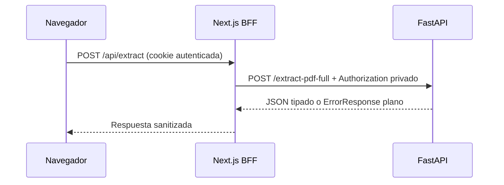

# BE-06 — Deploy Backend (Documento Histórico Redactado)

> **Estado:** implementación histórica en DigitalOcean; no usar como receta de
> producción. El destino vigente pendiente de redefinir es Heroku (PR-02).
> **Redacción de seguridad:** 20/07/2026. La versión anterior contenía una
> credencial real y fue sustituida por completo. La credencial debe rotarse y el
> historial Git debe sanearse antes de publicar o clonar como entorno confiable.

## 1. Objetivo Histórico

BE-06 desplegó el microservicio FastAPI y comprobó `/health`. El deploy legado
continúa accesible, pero ejecuta la versión `0.1.0`: no declara `BFFBearer` y no
aplica el contrato privado BFF-to-backend implementado localmente.

## 2. Arquitectura Vigente Esperada



La URL y el secreto se configuran fuera del repositorio:

- Frontend server-only: `FASTAPI_URL` y `BFF_SHARED_SECRET`.
- Backend server-only: `BFF_SHARED_SECRET` y `FRONTEND_ORIGIN`/`CORS_ORIGINS`
  según el contrato vigente.
- Nunca usar prefijo `NEXT_PUBLIC_` para el secreto.
- Nunca escribir valores reales en Markdown, YAML, comandos, logs o capturas.

## 3. Verificación Segura

```powershell
curl.exe -sS https://squid-app-y364m.ondigitalocean.app/health
```

La verificación del 19/07/2026 obtuvo HTTP 200. El PDF real también produjo 63
tópicos, pero eso no demuestra que el deploy tenga autenticación BFF.

Antes de considerar un deploy productivo, comprobar sin imprimir credenciales:

```powershell
npm --prefix frontend run test:extract
```

Resultado local vigente: 29/29. Backend Docker/Python 3.12: 15/15 tests HTTP.

## 4. Troubleshooting

| Problema | Causa probable | Solución |
|---|---|---|
| `401` desde FastAPI | Secret ausente o distinto entre servicios | Rotar y configurar el mismo valor en ambos dashboards, sin imprimirlo. |
| `SERVICE_CONFIGURATION_ERROR` | Falta `FASTAPI_URL` o `BFF_SHARED_SECRET` en Next.js | Configurar variables server-only y volver a desplegar. |
| OpenAPI no muestra `BFFBearer` | Sigue activo el artefacto legado | No aprobar producción; desplegar la imagen endurecida. |
| `doctl` responde `401` | Token de DigitalOcean expirado | Renovar autenticación fuera del repositorio. |
| Git conserva una credencial antigua | El secreto estuvo en un commit | Rotar primero y sanear historial con coordinación del equipo; no basta editar HEAD. |

## 5. Checklist De Cierre

- [x] Health histórico accesible.
- [x] Extracción real de 63 tópicos comprobada.
- [ ] Credencial Supabase expuesta rotada.
- [ ] Historial Git saneado y clones/CI actualizados.
- [ ] Backend endurecido desplegado con `BFFBearer`.
- [ ] `FASTAPI_URL` y `BFF_SHARED_SECRET` productivos configurados.
- [ ] Smoke autenticado `200` y requests sin bearer rechazados con `401`.
- [ ] PR-02 regenerada y auditada para Heroku.

## 6. Próximo Paso

No copiar la configuración DigitalOcean anterior. Cerrar primero la rotación de
secretos y el saneamiento de historial; después generar de nuevo PR-02 para el
hosting Heroku vigente y ejecutar smoke tests con evidencia sanitizada.
