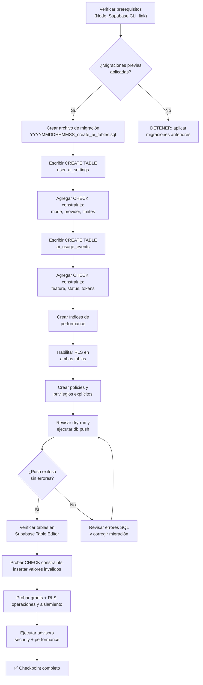

# AI-01 — Schema: preferencias IA + tracking de uso/tokens

> **Estado:** implementada y validada (12/07/2026). Migracion desplegada, 20/20 checkpoints seccion 6 pasaron.  
> **Fecha de generación y auditoría:** 12/07/2026.  
> **Método de verdad:** roadmap + migraciones reales + documentación oficial de Supabase/PostgreSQL. El repositorio todavía no registra un skill DB canónico en `.agents/skills/`.  
> **Alcance:** Esta guía crea las tablas `user_ai_settings` y `ai_usage_events` con constraints, índices, privilegios explícitos y RLS. No modifica `frontend/`, `backend/` ni código existente.  
> **Gate previo satisfecho (12/07/2026):** `20260712230548_protect_practice_solution_json.sql` y `20260713005928_harden_handle_new_user.sql` están aplicadas; PL-02, PL-05, PL-09 y PL-11 están implementadas y verificadas. AI-01 está lista para implementación manual.

---

## Sección 1: 🎓 Introducción y Fundamentos Conceptuales

### Conexión con lo anterior

Con el Bloque H completado (PL-01 a PL-14), la aplicación ISTQB Study Agent ya soporta:

- **Sesiones de estudio** con teoría, quiz y sistema adaptativo (Bloque E).
- **Dashboard de progreso** con métricas visuales (Bloque F).
- **QA Practice Lab** con ejercicios prácticos, evaluación por IA y navegación protegida (Bloque H).

Todos estos flujos llaman directamente a Gemini o GPT usando `GEMINI_API_KEY` / `OPENAI_API_KEY` desde variables de entorno del servidor. No hay:

- **Modo sin costo** para que un usuario pruebe la app sin que el servidor gaste llamadas LLM.
- **Límites por usuario** para evitar que un solo usuario agote la cuota del proveedor.
- **Auditoría de consumo** para que el usuario (o el admin) sepa cuántos tokens se gastaron.
- **Configuración de proveedor por usuario** para que cada persona elija Gemini o OpenAI.

AI-01 crea la **base de datos mínima** que soportará todo el Bloque I. Piensa en estas tablas como los cimientos de un edificio de control de costos y seguridad IA.

### Analogía profesional

Imagina una cafetería de oficina con dos tipos de café: uno del servidor interno (Gemini, que el equipo ya paga) y otro premium externo (OpenAI). Hoy, cualquier empleado puede servirse ilimitadamente de ambos sin registro. AI-01 instala:

1. **El perfil de consumo** (`user_ai_settings`): una tarjeta por empleado que dice qué tipo de café prefiere y cuántas tazas puede tomar al día/mes. La tarjeta NO guarda la contraseña del dispensador externo.
2. **El registro de consumo** (`ai_usage_events`): cada vez que alguien se sirve una taza, el sistema anota quién, cuándo, qué tipo, cuántos mililitros y si la máquina lo sirvió exitosamente o le dijo "límite alcanzado".

Con estos dos registros, las guías AI-02 a AI-05 construirán el dispensador inteligente (runtime), la pantalla de configuración (UI Settings) y el tablero de consumo (Usage Dashboard).

### Límite deliberado de AI-01: almacenar no equivale a reservar cuota

Estas tablas permiten consultar límites y consumo, pero por sí solas no vuelven atómica la secuencia “consultar cuota → llamar al proveedor → registrar evento”. Dos requests concurrentes podrían leer la misma cuota disponible.

Por eso AI-02 tendrá un gate obligatorio: el modo `managed` debe permanecer deshabilitado hasta que la reserva de request sea atómica (RPC/transacción con lock) e idempotente usando un `id` de evento generado una sola vez por request. No aceptes una implementación basada en un `SELECT` y un `INSERT` separados. AI-01 conserva el schema mínimo; si la solución de AI-02 requiere estado de reserva o una función SQL, deberá agregar una migración correctiva antes de habilitar costos reales.

### ¿Por qué NO almacenamos API keys del usuario?

La regla **más importante** del Bloque I es que la base de datos **nunca** almacena API keys personales. El modo BYOK ("Bring Your Own Key") recibirá la key temporalmente en la request, la usará en memoria y la descartará. Guardar keys en PostgreSQL, localStorage, sessionStorage o cookies crearía un vector de ataque que comprometería a todos los usuarios si la base de datos se filtra.

| Lo que SÍ se persiste | Lo que NUNCA se persiste |
|---|---|
| Modo elegido: `demo` / `managed` / `byok` | La API key del usuario |
| Proveedor preferido: `gemini` / `openai` | Tokens de autenticación del proveedor |
| Límites de cuota (requests/tokens por día/mes) | Secretos encriptados o hashes de keys |
| Eventos de consumo con tokens contados | Keys en ningún formato recuperable |

### Las dos tablas del milestone

```
┌─────────────────────────────┐     ┌─────────────────────────────┐
│   user_ai_settings          │     │   ai_usage_events           │
│   (1 fila por usuario)      │     │   (N filas por usuario)     │
├─────────────────────────────┤     ├─────────────────────────────┤
│ PK: user_id → auth.users    │     │ PK: id (UUID)               │
│ mode: demo|managed|byok     │     │ FK: user_id → auth.users    │
│ provider: gemini|openai     │     │ feature: plan|theory|quiz…  │
│ model_name: nullable        │     │ mode: demo|managed|byok     │
│ daily_request_limit: 20     │     │ provider: NULL|gemini|openai│
│ monthly_request_limit: 300  │     │ model_name: nullable demo   │
│ daily_token_limit: 50000    │     │ prompt/completion/total_tkns│
│ monthly_token_limit: 500000 │     │ request_units: 0..N         │
│ updated_at                  │     │ status: success|blocked|err │
└─────────────────────────────┘     │ error_code: nullable        │
                                    │ created_at                  │
                                    └─────────────────────────────┘
```

---

## Sección 2: 📋 Prerequisitos y Verificación del Entorno

Ejecuta todos los comandos desde la raíz del proyecto:

```powershell
Set-Location "C:\Users\jsife\OneDrive\Desktop\Repositorios\practica-testing"
```

### 2.1 Herramientas instaladas

```powershell
node --version
# Requisito del frontend actual: >=20.9.0

npx supabase --version
# Auditado: 2.109.1

git --version
# Esperado: git version 2.x.x
```

### 2.2 Proyecto Supabase vinculado y estado de migraciones

```powershell
npx supabase migration list --linked
```

El comando debe conectar sin imprimir credenciales y mostrar una fila local/remota por migración. Si el proyecto no está vinculado, detente y usa el flujo de DB-01; no pegues el project ref ni contraseñas en esta guía.

### 2.3 Migraciones previas y gate correctivo de PL-02

Verifica el inventario local:

```powershell
Get-ChildItem -Path supabase/migrations -Name
```

Salida esperada:

```
20260522183543_remote_schema.sql
20260531183745_create_schema.sql
20260531221544_create_storage_bucket.sql
20260601015125_create_rls_policies.sql
20260621224042_create_auth_trigger.sql
20260706232553_create_practice_tables.sql
20260707005450_create_practice_rls.sql
20260712230548_protect_practice_solution_json.sql
20260713005928_harden_handle_new_user.sql
```

En la auditoría final del 12/07/2026, todas las migraciones anteriores figuran aplicadas tanto en local como en remoto. `20260712230548` oculta `solution_json` al cliente y `20260713005928` endurece el trigger de Auth. La comprobación vigente es:

```powershell
npx supabase db push --linked --dry-run
npx supabase migration list --linked
```

Resultado auditado: `Remote database is up to date` y cada versión local tiene su par remoto. Si tu salida difiere antes de crear AI-01, detente y reconcilia el historial; el orden de archivos también es el orden de despliegue.

### 2.4 Guías DB previas completadas

Verifica que existen las guías de base de datos que AI-01 extiende:

```powershell
Test-Path "docs/guides/db/DB-04.md"   # RLS — patrón base
Test-Path "docs/guides/db/PL-01.md"   # Practice tables — patrón reciente
Test-Path "docs/guides/db/PL-02.md"   # Practice RLS — patrón reciente
```

Las tres deben devolver `True`.

### 2.5 Dependencias funcionales del Bloque H

PL-14 y los addenda correctivos de PL-02, PL-05, PL-09 y PL-11 están implementados y verificados. Confirma al menos la estructura:

```powershell
Test-Path -LiteralPath "frontend/proxy.ts"
```

Esperado: `True`. El roadmap debe conservar `Implementado y verificado` para esos prerequisitos. Este gate ya está satisfecho; no implica que las tablas de AI-01 existan todavía.

---

## Sección 3: 📂 Estructura de Directorios del Proyecto

```
practica-testing/
├── supabase/
│   └── migrations/
│       ├── 20260522183543_remote_schema.sql         # EXISTENTE
│       ├── 20260531183745_create_schema.sql         # EXISTENTE (DB-02)
│       ├── 20260531221544_create_storage_bucket.sql # EXISTENTE (DB-03)
│       ├── 20260601015125_create_rls_policies.sql   # EXISTENTE (DB-04)
│       ├── 20260621224042_create_auth_trigger.sql   # EXISTENTE (DB-05)
│       ├── 20260706232553_create_practice_tables.sql # EXISTENTE (PL-01)
│       ├── 20260707005450_create_practice_rls.sql   # EXISTENTE (PL-02)
│       ├── 20260712230548_protect_practice_solution_json.sql # EXISTENTE (PL-02)
│       ├── 20260713005928_harden_handle_new_user.sql # EXISTENTE (DB-05)
│       └── YYYYMMDDHHMMSS_create_ai_tables.sql      # 🆕 NUEVO (AI-01)
├── docs/
│   └── guides/
│       └── db/
│           ├── DB-01.md a DB-05.md                  # EXISTENTE
│           ├── PL-01.md, PL-02.md                   # EXISTENTE
│           └── AI-01.md                             # 🆕 NUEVO (esta guía)
└── frontend/
    └── types/
        └── database.ts                              # NO TOCAR en esta guía
```

| Archivo | Acción | Guía |
|---|---|---|
| `supabase/migrations/YYYYMMDDHHMMSS_create_ai_tables.sql` | **CREAR** | AI-01 |
| `docs/guides/db/AI-01.md` | **CREAR** | AI-01 |
| `frontend/types/database.ts` | **NO TOCAR** | AI-02 agregará los tipos TS |
| Todas las migraciones existentes | **NO TOCAR** | — |

---

## Sección 4: 🔄 Diagrama de Flujo del Proceso



---

## Sección 5: 🛠️ Implementación Paso a Paso

### Paso A: Crear el archivo de migración

Usa la CLI para generar el nombre y timestamp correctos:

```powershell
npx supabase migration new create_ai_tables
```

Confirma que se creó exactamente un archivo nuevo:

```powershell
Get-ChildItem -LiteralPath "supabase/migrations" -Filter "*_create_ai_tables.sql"
```

No crees el archivo manualmente si la CLI ya lo generó y no reutilices un timestamp aplicado.

**Entregable del Paso A:** Archivo vacío `supabase/migrations/YYYYMMDDHHMMSS_create_ai_tables.sql` creado.

---

### Paso B: Tabla `user_ai_settings` — preferencias de IA por usuario

Copia el siguiente SQL en el archivo de migración:

```sql
-- ============================================================
-- MIGRACIÓN: Tablas de AI Settings & Usage Control
-- Guía: AI-01
-- Descripción: Crea las tablas user_ai_settings (preferencias
--              de IA por usuario) y ai_usage_events (auditoría
--              de consumo de tokens/requests).
--
-- REGLA DE SEGURIDAD FUNDAMENTAL:
--   Estas tablas NO contienen columnas para almacenar API keys
--   del usuario. El modo BYOK recibe la key temporalmente en
--   la request y la descarta. Nunca persiste en la DB.
-- ============================================================

-- ──────────────────────────────────────────────────────────────
-- TABLA 9: user_ai_settings
-- Propósito: Almacena las preferencias de configuración de IA
--            de cada usuario. Controla qué modo (demo/managed/byok),
--            qué proveedor (gemini/openai) y qué límites tiene.
--
-- ¿Por qué user_id como PRIMARY KEY (no UUID genérico)?
--   Cada usuario tiene exactamente UNA configuración de IA.
--   Usar user_id como PK garantiza la relación 1:1 y evita
--   duplicados. Es el mismo patrón de user_profiles (DB-02).
--
-- ¿Por qué model_name es nullable?
--   Si el usuario no especifica un modelo, el runtime server-side
--   (AI-02) elegirá el modelo por defecto según el proveedor.
--   NULL significa "usar el default del sistema".
--
-- ¿Por qué NO hay columna api_key, encrypted_key ni secret?
--   Almacenar API keys personales en la DB crea un vector de
--   ataque masivo. Si la DB se filtra (SQL injection, backup
--   expuesto, insider threat), TODAS las keys de usuario quedan
--   comprometidas. El modo BYOK usa la key solo en memoria
--   durante la request y la descarta.
--
-- CONSTRAINTS DE NEGOCIO:
--   - mode: solo 'demo', 'managed' o 'byok'
--   - provider: solo 'gemini' u 'openai'
--   - todos los límites deben ser >= 0
-- ──────────────────────────────────────────────────────────────
CREATE TABLE public.user_ai_settings (
  -- Clave primaria que referencia directamente al usuario.
  -- ON DELETE CASCADE: si se borra el usuario de Auth, se borran sus settings.
  -- Mismo patrón que user_profiles (DB-02).
  user_id UUID PRIMARY KEY REFERENCES auth.users(id) ON DELETE CASCADE,

  -- Modo de uso de IA elegido por el usuario.
  -- 'demo':    funcionalidad educativa sin llamadas LLM reales.
  --            Útil para probar la app sin costo.
  -- 'managed': usa las API keys del servidor (GEMINI_API_KEY / OPENAI_API_KEY).
  --            Sujeto a límites por usuario para controlar costos.
  -- 'byok':    "Bring Your Own Key". El usuario provee su key
  --            temporalmente en cada request. No se almacena.
  mode TEXT NOT NULL DEFAULT 'demo',

  -- Proveedor de IA preferido.
  -- El runtime (AI-02) usará este proveedor salvo que el modo
  -- sea 'demo' (que no llama a ningún proveedor externo).
  provider TEXT NOT NULL DEFAULT 'gemini',

  -- Modelo específico (nullable).
  -- NULL = usar el default del proveedor según el sistema.
  -- Ejemplo: 'gemini-2.5-flash', 'gpt-4o-mini'.
  -- No se valida contra una lista fija porque los modelos
  -- cambian frecuentemente. AI-02 DEBE validarlo contra una allowlist
  -- server-side; nunca debe pasar este texto directamente al SDK.
  model_name TEXT,

  -- ═══════════════════════════════════════════════════════════
  -- LÍMITES DE CUOTA POR USUARIO
  -- ═══════════════════════════════════════════════════════════
  --
  -- Estos límites aplican al modo 'managed'.
  -- El modo 'demo' no consume cuota (no llama al LLM).
  -- El modo 'byok' usa la key del usuario, pero igual
  -- registra consumo para auditoría.
  --
  -- ¿Por qué defaults razonables?
  --   Un usuario nuevo en modo 'demo' no se ve afectado.
  --   Si cambia a 'managed', los defaults (20 requests/día,
  --   300/mes) son suficientes para uso normal sin agotar
  --   la cuota del proyecto.
  -- ═══════════════════════════════════════════════════════════

  -- Máximo de requests LLM por día (todas las features).
  daily_request_limit INTEGER NOT NULL DEFAULT 20,

  -- Máximo de requests LLM por mes.
  monthly_request_limit INTEGER NOT NULL DEFAULT 300,

  -- Máximo de tokens consumidos por día (prompt + completion).
  daily_token_limit INTEGER NOT NULL DEFAULT 50000,

  -- Máximo de tokens consumidos por mes.
  monthly_token_limit INTEGER NOT NULL DEFAULT 500000,

  -- Última vez que se actualizó la configuración.
  updated_at TIMESTAMPTZ NOT NULL DEFAULT NOW(),

  -- ═══════════════════════════════════════════════════════════
  -- CONSTRAINTS (Reglas de negocio grabadas en piedra)
  -- ═══════════════════════════════════════════════════════════

  -- Regla 1: Solo 3 modos válidos.
  -- ¿Por qué? Cada modo tiene un flujo completamente diferente
  -- en el runtime. Un modo inventado causaría un comportamiento
  -- indefinido.
  CONSTRAINT user_ai_settings_mode_chk
    CHECK (mode IN ('demo', 'managed', 'byok')),

  -- Regla 2: Solo 2 proveedores válidos.
  -- Si en el futuro se agrega Anthropic o Mistral, se amplía
  -- este CHECK con una nueva migración.
  CONSTRAINT user_ai_settings_provider_chk
    CHECK (provider IN ('gemini', 'openai')),

  -- Regla 3: Todos los límites deben ser no-negativos.
  -- Un límite de -1 no tiene sentido lógico.
  -- Un límite de 0 significa "bloqueado" (puede ser útil
  -- para suspender temporalmente a un usuario).
  CONSTRAINT user_ai_settings_limits_chk
    CHECK (
      daily_request_limit >= 0
      AND monthly_request_limit >= 0
      AND daily_token_limit >= 0
      AND monthly_token_limit >= 0
    ),

  -- NULL usa el modelo del sistema; si se informa, no acepta vacío ni texto excesivo.
  CONSTRAINT user_ai_settings_model_name_chk
    CHECK (
      model_name IS NULL
      OR char_length(btrim(model_name)) BETWEEN 1 AND 100
    )
);

COMMENT ON TABLE public.user_ai_settings IS
  'Preferencias de IA por usuario: modo (demo/managed/byok), proveedor, modelo y límites de cuota. NO almacena API keys.';

-- updated_at lo controla PostgreSQL; el cliente no recibe privilegio para editarlo.
CREATE OR REPLACE FUNCTION public.set_user_ai_settings_updated_at()
RETURNS TRIGGER
LANGUAGE plpgsql
SET search_path = ''
AS $$
BEGIN
  NEW.updated_at = NOW();
  RETURN NEW;
END;
$$;

REVOKE ALL ON FUNCTION public.set_user_ai_settings_updated_at()
  FROM PUBLIC, anon, authenticated;

CREATE TRIGGER set_user_ai_settings_updated_at
  BEFORE UPDATE ON public.user_ai_settings
  FOR EACH ROW
  EXECUTE FUNCTION public.set_user_ai_settings_updated_at();
```

**Entregable del Paso B:** Tabla `user_ai_settings` definida con PK, preferencias, cuotas administradas, `updated_at` no nulo y 4 CHECK constraints.

---

### Paso C: Tabla `ai_usage_events` — auditoría de consumo

Agrega a continuación en el **mismo archivo** de migración:

```sql
-- ──────────────────────────────────────────────────────────────
-- TABLA 10: ai_usage_events
-- Propósito: Registra cada interacción con un proveedor de IA.
--            Permite auditar consumo, detectar abuso, calcular
--            costos y mostrar métricas al usuario.
--
-- ¿Por qué una tabla separada de user_ai_settings?
--   - user_ai_settings: configuración (1 fila por usuario).
--   - ai_usage_events: log inmutable (N filas por usuario).
--   Son datos con ciclos de vida diferentes. Los settings
--   cambian raramente; los events crecen con cada request.
--
-- ¿Por qué registrar tanto 'success' como 'blocked_quota'?
--   Los eventos bloqueados son igual de valiosos para auditoría.
--   Permiten detectar si un usuario está siendo bloqueado
--   injustamente (límites muy bajos) o si está intentando
--   abusar del sistema.
--
-- ¿Por qué prompt_tokens, completion_tokens y total_tokens?
--   Gemini y OpenAI devuelven estos contadores en cada response.
--   Registrarlos permite calcular costos reales por usuario,
--   feature y proveedor. Si el proveedor no los devuelve,
--   el runtime guarda 0 y usa un estimado conservador.
--
-- ¿Por qué request_units DEFAULT 1?
--   Una llamada externa = 1 request unit. Demo y blocked_quota
--   deben enviar 0. Esto simplifica el
--   cálculo de cuota diaria/mensual sin contar tokens
--   (que son más granulares pero más difíciles de estimar
--   antes de hacer la llamada).
--
-- CONSTRAINTS DE NEGOCIO:
--   - feature: solo las 6 features que llaman al LLM
--   - mode: coherente con user_ai_settings.mode
--   - provider/model_name: NULL en demo; reales en managed/byok
--   - status: solo 'success', 'blocked_quota' o 'error'
--   - tokens y request_units: >= 0
-- ──────────────────────────────────────────────────────────────
CREATE TABLE public.ai_usage_events (
  -- Identificador único del evento.
  id UUID PRIMARY KEY DEFAULT gen_random_uuid(),

  -- ¿Quién generó este evento?
  -- ON DELETE CASCADE: si se borra el usuario, se borran sus eventos.
  user_id UUID NOT NULL REFERENCES auth.users(id) ON DELETE CASCADE,

  -- ¿Qué feature de la app generó la llamada LLM?
  -- Cada feature corresponde a un endpoint que llama al LLM.
  -- Esto permite analizar consumo por feature:
  --   "¿Cuántos tokens gasta en promedio generar un plan?"
  --   "¿practice_evaluate consume más que theory?"
  feature TEXT NOT NULL,

  -- Modo de IA activo al momento de la llamada.
  -- Se captura aquí (no se lee de user_ai_settings) porque
  -- el usuario podría cambiar de modo entre llamadas.
  -- Así cada evento refleja el modo exacto que se usó.
  mode TEXT NOT NULL,

  -- Proveedor usado en esta llamada específica.
  -- NULL en modo demo porque no hubo proveedor externo.
  -- Puede diferir del provider de user_ai_settings si hubo fallback.
  provider TEXT,

  -- Modelo real que respondió; NULL en modo demo.
  model_name TEXT,

  -- Tokens del prompt (input).
  -- 0 si el proveedor no reportó usage o si status = 'blocked_quota'.
  prompt_tokens INTEGER NOT NULL DEFAULT 0,

  -- Tokens de la respuesta (output).
  completion_tokens INTEGER NOT NULL DEFAULT 0,

  -- Tokens totales (prompt + completion).
  -- Redundante, pero facilita consultas de agregación
  -- sin calcular la suma cada vez.
  total_tokens INTEGER NOT NULL DEFAULT 0,

  -- Unidades de request consumidas.
  -- Normalmente 1 por llamada LLM. Podría ser 0 para
  -- eventos bloqueados que no consumieron cuota real.
  request_units INTEGER NOT NULL DEFAULT 1,

  -- Resultado de la interacción.
  -- 'success':       llamada exitosa al LLM.
  -- 'blocked_quota': bloqueada por límite diario/mensual.
  -- 'error':         falló la llamada al proveedor.
  status TEXT NOT NULL,

  -- Código de error opcional (NULL si success).
  -- Ejemplos: 'RATE_LIMIT', 'TIMEOUT', 'INVALID_JSON',
  -- 'PROVIDER_DOWN', 'DAILY_LIMIT', 'MONTHLY_LIMIT'.
  -- Permite filtrar y agrupar errores por tipo.
  error_code TEXT,

  -- Timestamp del evento (inmutable, no se actualiza).
  created_at TIMESTAMPTZ NOT NULL DEFAULT NOW(),

  -- ═══════════════════════════════════════════════════════════
  -- CONSTRAINTS (Reglas de negocio)
  -- ═══════════════════════════════════════════════════════════

  -- Regla 1: Solo las 6 features que llaman al LLM.
  -- Coherente con las API Routes existentes:
  --   plan           → /api/plan/generate
  --   theory         → /api/sessions/[id]/theory
  --   quiz           → /api/sessions/[id]/quiz
  --   evaluate       → /api/sessions/[id]/evaluate
  --   practice_generate  → /api/practice/generate
  --   practice_evaluate  → /api/practice/evaluate
  CONSTRAINT ai_usage_events_feature_chk
    CHECK (feature IN (
      'plan', 'theory', 'quiz', 'evaluate',
      'practice_generate', 'practice_evaluate'
    )),

  -- Regla 2: Modo coherente con los 3 modos válidos.
  CONSTRAINT ai_usage_events_mode_chk
    CHECK (mode IN ('demo', 'managed', 'byok')),

  -- Regla 3: demo no inventa proveedor; managed/byok exigen proveedor real.
  CONSTRAINT ai_usage_events_provider_chk
    CHECK (
      (mode = 'demo' AND provider IS NULL)
      OR (
        mode IN ('managed', 'byok')
        AND provider IS NOT NULL
        AND provider IN ('gemini', 'openai')
      )
    ),

  -- Regla 4: Solo 3 estados de resultado válidos.
  CONSTRAINT ai_usage_events_status_chk
    CHECK (status IN ('success', 'blocked_quota', 'error')),

  -- Regla 5: Tokens y request units no pueden ser negativos.
  -- Un valor negativo es claramente un bug del runtime.
  CONSTRAINT ai_usage_events_tokens_chk
    CHECK (
      prompt_tokens >= 0
      AND completion_tokens >= 0
      AND total_tokens >= 0
      AND request_units >= 0
    ),

  -- Evita métricas contradictorias entre el desglose y el total.
  CONSTRAINT ai_usage_events_total_tokens_chk
    CHECK (total_tokens = prompt_tokens + completion_tokens),

  -- Un evento exitoso no lleva error; bloqueos y errores sí deben clasificarse.
  CONSTRAINT ai_usage_events_error_code_chk
    CHECK (
      (status = 'success' AND error_code IS NULL)
      OR (
        status IN ('blocked_quota', 'error')
        AND error_code IS NOT NULL
        AND char_length(btrim(error_code)) BETWEEN 1 AND 100
      )
    ),

  CONSTRAINT ai_usage_events_model_name_chk
    CHECK (
      (mode = 'demo' AND model_name IS NULL)
      OR (
        mode IN ('managed', 'byok')
        AND model_name IS NOT NULL
        AND char_length(btrim(model_name)) BETWEEN 1 AND 100
      )
    ),

  -- Demo y bloqueos no consumen proveedor; un éxito externo consume >=1 unidad.
  CONSTRAINT ai_usage_events_request_status_chk
    CHECK (
      (
        status = 'blocked_quota'
        AND mode = 'managed'
        AND request_units = 0
        AND total_tokens = 0
      )
      OR (
        status = 'success'
        AND (
          (mode = 'demo' AND request_units = 0 AND total_tokens = 0)
          OR (mode IN ('managed', 'byok') AND request_units >= 1)
        )
      )
      OR (
        status = 'error'
        AND (
          mode IN ('managed', 'byok')
          OR (mode = 'demo' AND request_units = 0 AND total_tokens = 0)
        )
      )
    )
);

COMMENT ON TABLE public.ai_usage_events IS
  'Log inmutable de cada interacción con proveedores de IA: tokens, status y feature. NO contiene API keys ni secretos.';
```

**Entregable del Paso C:** Tabla `ai_usage_events` definida como log inmutable, con timestamps no nulos y 9 CHECK constraints, incluido `total_tokens = prompt_tokens + completion_tokens`.

---

### Paso D: Índices de performance

Agrega a continuación en el **mismo archivo** de migración:

```sql
-- ══════════════════════════════════════════════════════════════
-- ÍNDICES DE PERFORMANCE — AI SETTINGS & USAGE
-- ══════════════════════════════════════════════════════════════
-- Estos índices optimizan las consultas más frecuentes del
-- Bloque I. user_ai_settings no necesita índices adicionales
-- porque user_id ya es PK (y por lo tanto tiene índice único).
-- ══════════════════════════════════════════════════════════════

-- Índice 10: Buscar eventos de un usuario ordenados por fecha.
-- Caso de uso: "Últimos 20 eventos de consumo del usuario X"
-- Consulta típica:
--   SELECT * FROM ai_usage_events
--   WHERE user_id = $1 ORDER BY created_at DESC LIMIT 20
-- El orden DESC es importante: siempre mostramos los más recientes primero.
CREATE INDEX idx_ai_usage_events_user_date
  ON public.ai_usage_events(user_id, created_at DESC);

-- Índice 11: Filtrar eventos por feature dentro de una ventana temporal.
-- Caso de uso: "¿Cuántos tokens gastó el usuario X en 'theory' hoy?"
-- Consulta típica:
--   SELECT SUM(total_tokens) FROM ai_usage_events
--   WHERE user_id = $1 AND feature = $2 AND created_at >= $3
-- Igualdades primero; rango/orden temporal al final.
CREATE INDEX idx_ai_usage_events_user_feature_date
  ON public.ai_usage_events(user_id, feature, created_at DESC);

-- Índice 12: Acelerar la observabilidad de bloqueos y errores.
-- Es parcial para no indexar la mayoría de eventos exitosos.
-- Consulta típica:
--   SELECT COUNT(*) FROM ai_usage_events
--   WHERE user_id = $1 AND status <> 'success' AND created_at >= $2
CREATE INDEX idx_ai_usage_events_user_non_success_date
  ON public.ai_usage_events(user_id, created_at DESC)
  WHERE status <> 'success';
```

**Entregable del Paso D:** 3 índices alineados con las consultas reales: cuota por ventana temporal, desglose por feature y observabilidad parcial de fallos.

---

### Paso E: Habilitar RLS y crear policies

Agrega a continuación en el **mismo archivo** de migración:

```sql
-- ══════════════════════════════════════════════════════════════
-- ROW LEVEL SECURITY — AI TABLES
-- ══════════════════════════════════════════════════════════════
--
-- Mismo patrón de ownership que DB-04/PL-02, optimizado con
-- (select auth.uid()). Los eventos son visibles pero inmutables para el usuario.
-- ══════════════════════════════════════════════════════════════

ALTER TABLE public.user_ai_settings ENABLE ROW LEVEL SECURITY;
ALTER TABLE public.ai_usage_events ENABLE ROW LEVEL SECURITY;

-- ──────────────────────────────────────────────────────────────
-- TABLA 9: user_ai_settings — Policies
-- ──────────────────────────────────────────────────────────────
--
-- Particularidad: la PK es user_id (como user_profiles).
-- La policy compara (select auth.uid()) con user_id para evitar reevaluarla por fila.
--
-- Operaciones permitidas:
--   SELECT: ver solo tu propia configuración
--   INSERT: crear tu propia configuración (primera vez)
--   UPDATE: modificar tu propia configuración (cambiar modo/provider)
--   DELETE: NO se permite (la config se borra vía CASCADE
--           cuando se elimina el usuario de auth.users)
-- ──────────────────────────────────────────────────────────────

-- SELECT: un usuario solo puede leer su propia configuración de IA.
-- Caso de uso: la UI de /settings/ai carga los settings actuales.
CREATE POLICY "user_ai_settings_select_own"
  ON public.user_ai_settings
  FOR SELECT
  TO authenticated
  USING ((SELECT auth.uid()) = user_id);

-- INSERT: un usuario solo puede crear su propia configuración.
-- Caso de uso: primera vez que el usuario visita /settings/ai,
-- el runtime crea la fila con valores por defecto.
CREATE POLICY "user_ai_settings_insert_own"
  ON public.user_ai_settings
  FOR INSERT
  TO authenticated
  WITH CHECK ((SELECT auth.uid()) = user_id);

-- UPDATE: un usuario solo puede modificar su propia configuración.
-- Caso de uso: el usuario cambia de modo 'demo' a 'managed'.
-- USING + WITH CHECK garantiza que no pueda cambiar el user_id.
CREATE POLICY "user_ai_settings_update_own"
  ON public.user_ai_settings
  FOR UPDATE
  TO authenticated
  USING ((SELECT auth.uid()) = user_id)
  WITH CHECK ((SELECT auth.uid()) = user_id);

-- DELETE: NO se crea política de borrado.
-- La configuración se elimina automáticamente vía ON DELETE CASCADE
-- cuando se borra el usuario de auth.users.

-- ──────────────────────────────────────────────────────────────
-- TABLA 10: ai_usage_events — Policies
-- ──────────────────────────────────────────────────────────────
--
-- Los eventos de uso son un LOG INMUTABLE.
-- El usuario puede verlos pero no modificarlos ni borrarlos.
-- Solo el runtime (service_role) puede insertar eventos.
--
-- ¿Por qué el INSERT es para service_role y no authenticated?
--   Los eventos se crean desde los Route Handlers que ya
--   validaron la autenticación. Usar service_role para INSERT
--   evita que un usuario malicioso fabrique eventos falsos
--   (ej. reportar menos tokens de los que realmente consumió
--   para evadir la cuota).
--
-- Operaciones permitidas:
--   SELECT: usuario puede ver sus propios eventos
--   INSERT: solo el runtime (service_role) puede crear eventos
--   UPDATE: NO se permite (log inmutable)
--   DELETE: NO se permite (log inmutable, CASCADE limpia al borrar usuario)
-- ──────────────────────────────────────────────────────────────

-- SELECT: un usuario solo puede ver sus propios eventos de consumo.
-- Caso de uso: la UI de /settings/ai/usage muestra el historial.
CREATE POLICY "ai_usage_events_select_own"
  ON public.ai_usage_events
  FOR SELECT
  TO authenticated
  USING ((SELECT auth.uid()) = user_id);

-- PRIVILEGIOS: RLS decide filas; GRANT/REVOKE decide operaciones y columnas.
-- No dependemos de privilegios predeterminados del proyecto.
REVOKE ALL ON TABLE public.user_ai_settings FROM anon, authenticated;
REVOKE ALL ON TABLE public.ai_usage_events FROM anon, authenticated;

-- El usuario puede leer su fila y crearla con defaults administrados.
-- Solo puede elegir preferencias; no puede elevar sus propias cuotas.
GRANT SELECT ON TABLE public.user_ai_settings TO authenticated;
GRANT INSERT (user_id, mode, provider, model_name)
  ON TABLE public.user_ai_settings TO authenticated;
GRANT UPDATE (mode, provider, model_name)
  ON TABLE public.user_ai_settings TO authenticated;

-- El historial es visible para su dueño, pero solo el servidor lo escribe.
GRANT SELECT ON TABLE public.ai_usage_events TO authenticated;

-- service_role es exclusivamente server-only y omite RLS; los Route Handlers
-- deben autenticar primero y aportar el user_id verificado.
GRANT ALL ON TABLE public.user_ai_settings TO service_role;
GRANT ALL ON TABLE public.ai_usage_events TO service_role;
```

> **Por qué no existe una policy INSERT para `service_role`:** ese rol omite RLS. La frontera efectiva es mantener la clave solo en servidor y no conceder INSERT a `authenticated`. Una policy redundante con `WITH CHECK (true)` puede sugerir una protección que realmente no aplica al rol con bypass.

**Entregable del Paso E:** RLS habilitado, 3 policies de settings, 1 policy SELECT de eventos y privilegios explícitos. El usuario no puede editar cuotas ni insertar/actualizar/borrar eventos.

---

## Sección 6: ✅ Checkpoints de Verificación

### 6.1 Revisar el plan de migración antes de escribir remoto

```powershell
npx supabase migration list --linked
npx supabase db push --linked --dry-run
```

El `dry-run` debe listar primero cualquier migración anterior pendiente y luego `*_create_ai_tables.sql`. Si aparece una migración inesperada, detente y reconcilia el historial.

Solo después de revisar el plan, aplica manualmente:

```powershell
npx supabase db push --linked
```

Salida esperada resumida:

```
Connecting to remote database...
Applying migration 20260712XXXXXX_create_ai_tables.sql...
Finished supabase db push.
```

No uses `migration repair` como solución automática: primero determina por qué difieren el filesystem y el historial remoto.

### 6.2 Verificar tablas en Supabase Table Editor

Abre tu proyecto en [https://supabase.com/dashboard](https://supabase.com/dashboard) y navega a **Table Editor**. Deberías ver:

- `user_ai_settings` (nueva)
- `ai_usage_events` (nueva)

Ambas junto a las 8 tablas existentes (user_profiles, documents, study_plans, sessions, answers, topic_progress, practice_exercises, practice_submissions).

Ejecuta también los advisors con la CLI vigente:

```powershell
npx supabase db advisors --linked --type security --level warn
npx supabase db advisors --linked --type performance --level warn
```

No aceptes errores nuevos causados por las dos tablas. Documenta warnings preexistentes por separado.

**Baseline remoto previo a AI-01 (12/07/2026):**

- Security Advisors: `1` warning, `auth_leaked_password_protection`, que requiere habilitar protección de contraseñas filtradas en Auth y queda como deuda de PR-03A.
- Performance Advisors: `28` warnings `auth_rls_initplan` en policies históricas que usan `auth.uid()` por fila; deben optimizarse en una migración dedicada y auditada usando `(select auth.uid())`.
- Tablas de Practice Lab: `0` warnings de seguridad después de proteger `solution_json`.
- La advertencia local por `[inbucket]` quedó corregida al nombre vigente `[local_smtp]` en `supabase/config.toml`.

AI-01 no debe aumentar esos conteos ni introducir nuevos tipos de warning. No mezcles la optimización global de policies históricas con la migración de AI-01.

### 6.3 Probar CHECK constraints — valores válidos

Usa el **SQL Editor** de Supabase, que opera con un rol administrativo, para probar integridad. Esto no prueba RLS. Necesitarás un `user_id` real de `auth.users`:

```sql
-- Obtener un user_id existente para la prueba
SELECT id FROM auth.users LIMIT 1;
-- Copia el UUID resultante y úsalo abajo
```

```sql
-- Insertar settings válidos desde el rol administrativo del SQL Editor
INSERT INTO public.user_ai_settings (user_id, mode, provider)
VALUES ('<tu-user-id>', 'managed', 'gemini');
-- Esperado: INSERT 0 1 (éxito)
```

```sql
-- Insertar evento de uso válido
INSERT INTO public.ai_usage_events (
  user_id, feature, mode, provider, model_name,
  prompt_tokens, completion_tokens, total_tokens,
  request_units, status
) VALUES (
  '<tu-user-id>', 'theory', 'managed', 'gemini', 'gemini-2.5-flash',
  1200, 800, 2000,
  1, 'success'
);
-- Esperado: INSERT 0 1 (éxito)
```

```sql
-- Evento demo válido: sin proveedor/modelo externo y sin consumo
INSERT INTO public.ai_usage_events (
  user_id, feature, mode, request_units, status
) VALUES (
  '<tu-user-id>', 'theory', 'demo', 0, 'success'
);
-- Esperado: INSERT 0 1; provider/model_name NULL y tokens 0
```

### 6.4 Probar CHECK constraints — valores inválidos

```sql
-- Mode inválido
INSERT INTO public.user_ai_settings (user_id, mode, provider)
VALUES ('<tu-user-id>', 'free_tier', 'gemini');
-- Esperado: ERROR: new row violates check constraint "user_ai_settings_mode_chk"
```

```sql
-- Provider inválido
UPDATE public.user_ai_settings
SET provider = 'anthropic'
WHERE user_id = '<tu-user-id>';
-- Esperado: ERROR: new row violates check constraint "user_ai_settings_provider_chk"
```

```sql
-- Límite negativo
UPDATE public.user_ai_settings
SET daily_request_limit = -5
WHERE user_id = '<tu-user-id>';
-- Esperado: ERROR: new row violates check constraint "user_ai_settings_limits_chk"
```

```sql
-- Feature inválida
INSERT INTO public.ai_usage_events (
  user_id, feature, mode, provider, model_name, status
) VALUES (
  '<tu-user-id>', 'chat', 'managed', 'gemini', 'gemini-2.5-flash', 'success'
);
-- Esperado: ERROR: new row violates check constraint "ai_usage_events_feature_chk"
```

```sql
-- Status inválido
INSERT INTO public.ai_usage_events (
  user_id, feature, mode, provider, model_name, status
) VALUES (
  '<tu-user-id>', 'theory', 'managed', 'gemini', 'gemini-2.5-flash', 'cancelled'
);
-- Esperado: ERROR: new row violates check constraint "ai_usage_events_status_chk"
```

```sql
-- Tokens negativos
INSERT INTO public.ai_usage_events (
  user_id, feature, mode, provider, model_name,
  prompt_tokens, status
) VALUES (
  '<tu-user-id>', 'quiz', 'managed', 'gemini', 'gemini-2.5-flash',
  -100, 'success'
);
-- Esperado: ERROR: new row violates check constraint "ai_usage_events_tokens_chk"
```

```sql
-- Total inconsistente
INSERT INTO public.ai_usage_events (
  user_id, feature, mode, provider, model_name,
  prompt_tokens, completion_tokens, total_tokens, status
) VALUES (
  '<tu-user-id>', 'quiz', 'managed', 'gemini', 'modelo-de-prueba',
  100, 50, 120, 'success'
);
-- Esperado: ERROR ... "ai_usage_events_total_tokens_chk"
```

```sql
-- Un error debe tener error_code
INSERT INTO public.ai_usage_events (
  user_id, feature, mode, provider, model_name, status
) VALUES (
  '<tu-user-id>', 'theory', 'managed', 'gemini', 'modelo-de-prueba', 'error'
);
-- Esperado: ERROR ... "ai_usage_events_error_code_chk"
```

```sql
-- Un bloqueo no puede consumir la unidad por defecto
INSERT INTO public.ai_usage_events (
  user_id, feature, mode, provider, model_name, status, error_code
) VALUES (
  '<tu-user-id>', 'theory', 'managed', 'gemini', 'modelo-de-prueba',
  'blocked_quota', 'DAILY_REQUEST_LIMIT'
);
-- Esperado: ERROR ... "ai_usage_events_request_status_chk"
-- El evento válido debe enviar request_units = 0.
```

### 6.5 Probar privilegios y RLS — operaciones + aislamiento de filas

Para probar RLS, usa la herramienta de **API** o **SQL Editor** de Supabase:

Primero verifica la matriz de privilegios:

```sql
SELECT
  has_table_privilege('authenticated', 'public.user_ai_settings', 'SELECT') AS settings_select,
  has_column_privilege('authenticated', 'public.user_ai_settings', 'mode', 'UPDATE') AS can_update_mode,
  has_column_privilege('authenticated', 'public.user_ai_settings', 'daily_request_limit', 'UPDATE') AS can_raise_quota,
  has_table_privilege('authenticated', 'public.ai_usage_events', 'SELECT') AS events_select,
  has_table_privilege('authenticated', 'public.ai_usage_events', 'INSERT') AS events_insert,
  has_table_privilege('anon', 'public.ai_usage_events', 'SELECT') AS anon_events_select;
```

Resultado obligatorio: `true, true, false, true, false, false`.

1. **Sin sesión (`anon`):** no tiene privilegio de tabla. A diferencia de una policy que retorna cero filas, aquí se espera `permission denied`.

Ejecuta cada prueba de rol en una transacción separada para que `SET LOCAL` no sobreviva al test:

```sql
BEGIN;
SET LOCAL ROLE anon;
SELECT * FROM public.user_ai_settings;
-- Esperado: ERROR permission denied for table user_ai_settings
ROLLBACK;
```

Repite con `public.ai_usage_events`. Si el editor detiene el lote tras el error, ejecuta `ROLLBACK;` antes de continuar.

2. **Con sesión de usuario A:** solo ve sus propios datos y no puede elevar cuotas ni fabricar eventos.

Usa un cliente autenticado de prueba o una transacción del SQL Editor con `SET LOCAL ROLE authenticated` y claims simulados. Verifica usuario A y usuario B por separado; nunca copies access tokens a la guía.

Pruebas obligatorias:

- A puede seleccionar su `user_ai_settings`, pero no la fila de B.
- A puede actualizar `mode`, `provider` y `model_name` de su fila.
- A recibe `permission denied` al intentar actualizar `daily_request_limit`.
- A recibe `permission denied` al intentar insertar, actualizar o borrar `ai_usage_events`.
- Un Route Handler con `service_role`, después de autenticar a A, puede insertar un evento usando el `user_id` verificado.

### 6.6 Verificar que NO existen columnas de API keys

```sql
SELECT column_name
FROM information_schema.columns
WHERE table_schema = 'public'
  AND table_name IN ('user_ai_settings', 'ai_usage_events')
  AND (
    column_name ILIKE '%api_key%'
    OR column_name ILIKE '%secret%'
    OR column_name ILIKE '%encrypted%'
    OR column_name ILIKE '%token_key%'
    OR column_name ILIKE '%credential%'
  );
-- Esperado: 0 filas (ninguna columna de keys existe)
```

### 6.7 Limpiar datos de prueba

```sql
-- Borrar evento de prueba
DELETE FROM public.ai_usage_events WHERE user_id = '<tu-user-id>';

-- Borrar settings de prueba
DELETE FROM public.user_ai_settings WHERE user_id = '<tu-user-id>';
```

### 6.8 Checklist final de entregables

```
[x] Archivo de migracion creado: supabase/migrations/20260713011509_create_ai_tables.sql
[x] Tabla user_ai_settings creada con preferencias, cuotas administradas + 4 CHECK constraints
[x] Tabla ai_usage_events creada como log inmutable + 9 CHECK constraints
[x] 3 indices de performance creados
[x] RLS habilitado en ambas tablas
[x] 3 policies en user_ai_settings (SELECT, INSERT, UPDATE para authenticated)
[x] 1 policy SELECT en ai_usage_events; sin policy redundante para service_role
[x] Privilegios explicitos impiden elevar cuotas o fabricar eventos desde authenticated
[x] dry-run revisado y supabase db push --linked ejecutado sin errores
[x] Ambas tablas visibles en Table Editor
[x] CHECK constraints rechazan valores invalidos (9/9 violaciones probadas)
[x] CHECK constraints aceptan valores validos (8/8 inserts probados)
[x] RLS aisla datos: anon sin acceso a events (select + insert rechazados)
[x] No existe ninguna columna tipo api_key, secret o credential
```

---

## Sección 7: 🚨 Troubleshooting — Problemas Comunes

| Problema | Causa Probable | Solución |
|---|---|---|
| `supabase db push` falla con "relation auth.users does not exist" | El proyecto no está vinculado o el esquema auth no está disponible | Ejecutar `npx supabase link --project-ref <tu-ref>` y reintentar |
| Error de duplicate key al insertar en `user_ai_settings` | Ya existe un registro para ese `user_id` (PK es user_id) | Usar `UPSERT` solo con `user_id`, `mode`, `provider` y `model_name`; nunca enviar columnas de cuota desde el cliente |
| `supabase db push` muestra un historial inesperado | Filesystem local e historial remoto no coinciden | Detenerse, ejecutar `migration list --linked` y diagnosticar la divergencia; no usar `migration repair` sin una causa confirmada |
| RLS o grants bloquean INSERT en `ai_usage_events` para el usuario autenticado | Es el diseño correcto: el log no es escribible desde el navegador | El Route Handler autentica primero y usa `createAdminClient()` server-only con el `user_id` verificado |
| `permission denied` al cambiar una cuota desde Settings | Las cuotas son controles de costo administrados, no preferencias del usuario | Cambiar cuotas solo desde un flujo administrativo server-only; la UI solo edita modo, proveedor y modelo |
| Un `model_name` guardado ya no existe o no está autorizado | La columna es una preferencia de texto, no una autorización | AI-02 valida contra una allowlist server-side y usa un default seguro o devuelve error controlado; nunca pasa el valor directo al SDK |
| Error "violates foreign key constraint" al insertar settings | El `user_id` no existe en `auth.users` | Verificar que el usuario existe con `SELECT id FROM auth.users WHERE id = '<uuid>'` |
| Tokens reportados como 0 en events exitosos | El proveedor no devolvió `usage` en la respuesta | Es normal para algunos modelos/endpoints. El runtime (AI-02) manejará estimados conservadores |
| Advisors siguen mostrando 1 warning de seguridad y 28 de performance antes de AI-01 | Son el baseline histórico auditado, no errores creados por esta guía | Registra el baseline, comprueba que AI-01 no lo aumente y resuelve ambas deudas en PR-03A mediante cambios separados y auditables |

---

## Sección 8: 📝 Resumen y Próximo Paso

### Lo que implementarás en AI-01

1. Crearás la tabla `user_ai_settings` con configuración de modo (demo/managed/byok), proveedor (gemini/openai), modelo preferido y 4 límites de cuota.
2. Crearás la tabla `ai_usage_events` con log inmutable de cada interacción LLM: feature, tokens, status y error_code.
3. Definirás 13 CHECK constraints que protegen enums, cuotas, nombres, contadores, totales y semántica de estados/errores.
4. Crearás 3 índices de performance para consultas frecuentes de auditoría.
5. Habilitarás RLS con 4 policies de ownership y privilegios explícitos que separan preferencias editables, cuotas administradas y eventos inmutables.
6. Mantendrás `service_role` exclusivamente en Route Handlers server-only; su bypass de RLS exige autenticación y `user_id` verificado antes de escribir.
7. Verificarás que NO exista ninguna columna para almacenar API keys personales.

### Validar tu progreso

Pide a tu asistente:

> "Valida mi progreso de la guía AI-01 en su sección 6"

### Próximo paso: AI-02

La guía **AI-02 — Runtime server-side: resolver proveedor, modo y cuota** usará estas tablas para:

- Leer `user_ai_settings` y decidir si usar demo/managed/byok.
- Consultar `ai_usage_events` para calcular consumo diario/mensual.
- Bloquear la request si la cuota fue superada.
- Registrar cada llamada LLM (exitosa, bloqueada o fallida) como un nuevo evento.
- Crear los tipos TypeScript en `frontend/types/ai.ts` para las nuevas tablas.
- Actualizar `frontend/types/database.ts` con las entradas de `user_ai_settings` y `ai_usage_events`.

AI-02 pertenece al skill `istqb-fe-guide-generator` porque su output es código TypeScript/Next.js en `frontend/`.

### Fuentes oficiales auditadas

- [Supabase — Row Level Security](https://supabase.com/docs/guides/database/postgres/row-level-security)
- [Supabase — Column-level security](https://supabase.com/docs/guides/database/postgres/column-level-security)
- [Supabase — Securing your API](https://supabase.com/docs/guides/api/securing-your-api)
- [Supabase — Secure data](https://supabase.com/docs/guides/database/secure-data)
