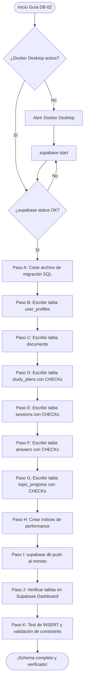
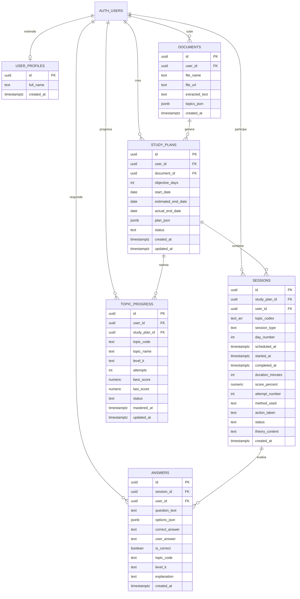

# Guía Didáctica DB-02: Schema — Tablas, Relaciones, Constraints e Índices

---

## 🎓 1. Introducción y Fundamentos Conceptuales

### Recapitulación: ¿Dónde estamos?

En la guía **DB-01** lograste algo fundamental: conectar tu entorno de desarrollo local con un servidor PostgreSQL real en la nube de Supabase. Instalaste el CLI, vinculaste tu proyecto mediante `supabase link`, levantaste los contenedores Docker locales con `supabase start` y descargaste el esquema remoto inicial con `supabase db pull`. En este momento tienes una "autopista" vacía lista para recibir tráfico — pero sin carriles, señales ni reglas. **Eso es exactamente lo que construiremos hoy.**

### ¿Por qué esta guía es tan importante?

Si la guía DB-01 fue la cimentación de un edificio, la guía DB-02 es la **estructura de acero**: los pilares, vigas y muros de carga. Sin un schema bien diseñado, tu aplicación es como un edificio sin planos; cualquier cambio lo puede derrumbar.

En bases de datos profesionales, el **schema** es mucho más que "crear tablas":

```
┌──────────────────────────────────────────────────────────────────────────┐
│                     ¿QUÉ ES UN SCHEMA PROFESIONAL?                      │
├──────────────────────────────────────────────────────────────────────────┤
│                                                                          │
│  1. TABLAS           → La estructura lógica de tus datos.               │
│                        Cada tabla es una entidad del negocio.            │
│                                                                          │
│  2. RELACIONES (FK)  → Los lazos entre entidades.                       │
│                        "Una sesión pertenece a un plan de estudio."      │
│                                                                          │
│  3. CONSTRAINTS      → Las reglas de negocio grabadas en piedra.        │
│                        Si el código frontend se equivoca,               │
│                        PostgreSQL rechaza el dato inválido.             │
│                                                                          │
│  4. ÍNDICES          → Los atajos de búsqueda.                          │
│                        Sin índices, buscar un dato en 10,000            │
│                        filas obliga a leer TODAS. Con índice,           │
│                        va directo al resultado.                         │
│                                                                          │
│  5. DEFAULTS         → Valores automáticos que PostgreSQL inserta       │
│                        si no proporcionas uno (ej. NOW(), UUIDs).       │
│                                                                          │
└──────────────────────────────────────────────────────────────────────────┘
```

### Analogía del Arquitecto de Bases de Datos

Imagina que estás diseñando el sistema de expedientes de un hospital:

- **La tabla `user_profiles`** es la ficha de registro del paciente (nombre, ID).
- **La tabla `documents`** es el expediente médico con los archivos adjuntos (PDFs).
- **La tabla `study_plans`** es el plan de tratamiento con fecha de inicio y fin.
- **La tabla `sessions`** son las citas médicas individuales dentro del plan.
- **La tabla `answers`** son los resultados de cada análisis clínico en cada cita.
- **La tabla `topic_progress`** es el historial de evolución por diagnóstico.

Las **foreign keys** (claves foráneas) son los cordones que enlazan todo: "esta cita pertenece a este plan" y "este plan pertenece a este paciente". Si alguien intenta crear una cita sin plan o un plan sin paciente, el sistema lo rechaza.

Los **CHECK constraints** son las reglas médicas: "un score de análisis no puede ser negativo" o "el estado del tratamiento solo puede ser 'activo', 'completado' o 'abandonado'".

---

## 📋 2. Prerrequisitos y Verificación del Entorno

Antes de escribir una sola línea de SQL, verifica que todo lo necesario de la guía anterior está en orden.

### A. Herramientas del sistema

| Herramienta | Comando de verificación | Versión mínima |
|---|---|---|
| Node.js | `node --version` | v18.x |
| Supabase CLI | `supabase --version` | v2.x |
| Docker Desktop | (Abierto y corriendo) | — |
| Git | `git --version` | v2.x |

### B. Entregables de DB-01 que DEBEN existir

Ejecuta los siguientes comandos en PowerShell para confirmar que los archivos clave de DB-01 están presentes:

```powershell
# Verificar que el archivo de configuración de Supabase existe
Test-Path "supabase\config.toml"
# Esperado: True

# Verificar que el directorio de migraciones existe
Test-Path "supabase\migrations"
# Esperado: True

# Verificar que la migración inicial remota existe
Test-Path "supabase\migrations\20260522183543_remote_schema.sql"
# Esperado: True

# Verificar que las variables de entorno locales existen
Test-Path ".env.local"
# Esperado: True

# Verificar que el .env.example público existe
Test-Path ".env.example"
# Esperado: True
```

> [!CAUTION]
> **BLOQUEO DE DEPENDENCIA:** Si alguno de estos comandos retorna `False`, **NO continúes.** Regresa a la guía DB-01 y completa los pasos faltantes. Un schema sin un proyecto vinculado es como construir muros sin cimientos.

### C. Docker y entorno local activo

El entorno local de Supabase **DEBE estar corriendo** para poder aplicar migraciones locales y verificar que el SQL es correcto antes de subirlo al remoto.

```powershell
# Verificar que Docker Desktop está corriendo
docker info --format '{{.ServerVersion}}'
# Esperado: algo como 28.1.1 (cualquier versión reciente)

# Verificar que Supabase local está levantado
supabase status
```

Si `supabase status` muestra que los servicios no están activos, levántalos:

```powershell
supabase start
```

---

## 📂 3. Estructura de Directorios del Proyecto

Después de completar esta guía, tu proyecto tendrá la siguiente estructura. Los archivos marcados con **[NUEVO]** son los que crearás en esta guía:

```
practica-testing/
│
├── supabase/                                # [CAPA DE BASE DE DATOS]
│   ├── config.toml                          # Configuración de Supabase local (DB-01)
│   └── migrations/                          # Carpeta de migraciones
│       ├── 20260522183543_remote_schema.sql # Migración inicial remota (DB-01)
│       └── YYYYMMDDHHMMSS_create_schema.sql # [NUEVO] Migración con todas las tablas, constraints e índices
│
├── frontend/                                # [CAPA DE INTERFAZ] (Next.js 14+)
│   └── ...                                  # (sin cambios en esta guía)
│
├── backend/                                 # [CAPA DE EXTRACCIÓN] (FastAPI/Python)
│   └── ...                                  # (sin cambios en esta guía)
│
├── docs/                                    # [DOCUMENTACIÓN Y GUÍAS]
│   ├── architecture/
│   │   └── ISTQB_StudyAgent_ProjectDoc.md   # Documento de arquitectura (referencia del schema)
│   ├── roadmap/
│   │   └── ISTQB_Guias_Implementacion.md    # Hoja de ruta global
│   └── guides/
│       └── db/
│           ├── DB-01.md                     # Guía anterior completada
│           └── DB-02.md                     # [NUEVO] Esta guía
│
├── .env.example                             # Plantilla pública de variables (DB-01)
├── .env.local                               # Variables secretas locales (DB-01)
└── .gitignore                               # Exclusiones de Git (DB-01)
```

---

## 🔄 4. Diagrama de Flujo del Proceso



### Diagrama Entidad-Relación del Schema

El siguiente diagrama muestra cómo se relacionan las 6 tablas del sistema:



---

## 🛠️ 5. Implementación Paso a Paso

### Paso A: Crear el Archivo de Migración SQL

Las migraciones en Supabase son archivos SQL con un prefijo de timestamp que garantiza el **orden de ejecución**. Cada migración se ejecuta exactamente una vez y en secuencia. Esto te da un historial completo y reproducible de todos los cambios en tu base de datos.

1. Ejecuta el siguiente comando en PowerShell desde la raíz del proyecto para crear un nuevo archivo de migración vacío:

```powershell
supabase migration new create_schema
```

*Salida esperada:*
```text
Created new migration at supabase\migrations\YYYYMMDDHHMMSS_create_schema.sql
```

> [!NOTE]
> El CLI generará el timestamp automáticamente (por ejemplo `20260522200000_create_schema.sql`). El nombre exacto del archivo variará según la hora a la que lo crees. **Anota el nombre completo** que el CLI te devuelve — lo usarás al pegar el SQL.

2. Abre el archivo de migración recién creado en tu editor de código. Estará **completamente vacío**. A continuación llenaremos este archivo con todo el schema de la aplicación.

**📦 Entregable del Paso A:**
- Archivo `supabase/migrations/YYYYMMDDHHMMSS_create_schema.sql` creado (vacío por ahora).

---

### Paso B: Tabla `user_profiles` — Extensión de Supabase Auth

Supabase Auth maneja internamente una tabla `auth.users` con el ID, email y metadatos de autenticación. Sin embargo, Supabase **no permite modificar esa tabla directamente** para añadir campos de negocio. La solución profesional es crear una tabla "espejo" en el schema `public` que extiende los datos del usuario.

Escribe el siguiente SQL **al inicio** del archivo de migración creado en el Paso A:

```sql
-- ============================================================
-- MIGRACIÓN: Schema completo del ISTQB Study Agent
-- Guía: DB-02
-- Descripción: Crea todas las tablas, relaciones, constraints
--              e índices del sistema.
-- ============================================================

-- ──────────────────────────────────────────────────────────────
-- TABLA 1: user_profiles
-- Propósito: Extiende auth.users con datos de perfil del negocio.
--            Cada usuario de Supabase Auth tendrá exactamente
--            un registro aquí (relación 1:1).
-- ──────────────────────────────────────────────────────────────
CREATE TABLE public.user_profiles (
  -- Clave primaria que referencia directamente al ID del usuario
  -- en la tabla interna de Supabase Auth.
  -- ON DELETE CASCADE: si se borra el usuario de Auth, se borra el perfil.
  id         UUID PRIMARY KEY REFERENCES auth.users(id) ON DELETE CASCADE,

  -- Nombre completo del usuario (opcional al registrarse).
  full_name  TEXT,

  -- Fecha de creación automática del registro.
  created_at TIMESTAMPTZ DEFAULT NOW()
);

-- Comentario de documentación de la tabla para Supabase Studio.
COMMENT ON TABLE public.user_profiles IS
  'Perfil extendido de cada usuario registrado en Supabase Auth.';
```

**¿Por qué `REFERENCES auth.users(id)`?**

Esta clave foránea crea un vínculo *inquebrantable* entre `user_profiles` y la tabla interna de autenticación de Supabase. PostgreSQL **garantiza** que:
- No puedes crear un perfil sin que el usuario exista previamente en Auth.
- Si borras un usuario de Auth (`ON DELETE CASCADE`), su perfil se borra automáticamente.

**📦 Entregable del Paso B:**
- Tabla `user_profiles` definida dentro del archivo de migración.

---

### Paso C: Tabla `documents` — Documentos PDF Subidos

Esta tabla almacena los metadatos de cada PDF que el usuario sube a la aplicación. El archivo físico del PDF vive en **Supabase Storage** (bucket privado); aquí solo guardamos la referencia y el resultado de la extracción.

Añade el siguiente SQL **después** de la tabla `user_profiles` en el mismo archivo de migración:

```sql
-- ──────────────────────────────────────────────────────────────
-- TABLA 2: documents
-- Propósito: Registra cada PDF subido por un usuario.
--            Almacena el texto extraído y los tópicos detectados
--            como JSONB para consultas flexibles.
-- ──────────────────────────────────────────────────────────────
CREATE TABLE public.documents (
  -- Identificador único generado automáticamente por PostgreSQL.
  id              UUID PRIMARY KEY DEFAULT gen_random_uuid(),

  -- ¿De quién es este documento?
  -- ON DELETE CASCADE: si se borra el usuario, se borran sus documentos.
  user_id         UUID NOT NULL REFERENCES auth.users(id) ON DELETE CASCADE,

  -- Nombre original del archivo subido (ej. "ISTQB_CTFL_v4.0.pdf").
  file_name       TEXT NOT NULL,

  -- Ruta interna en Supabase Storage (ej. "pdfs/{user_id}/timestamp_filename.pdf").
  file_url        TEXT NOT NULL,

  -- Texto crudo extraído del PDF por FastAPI/pdfplumber.
  -- Puede ser NULL si la extracción aún no ha ocurrido.
  extracted_text  TEXT,

  -- Tópicos estructurados detectados por el algoritmo de detección.
  -- Formato esperado: { "FL-1.1.1": { "text": "...", "level_k": "K1" }, ... }
  -- JSONB permite indexar y consultar dentro del JSON directamente en SQL.
  topics_json     JSONB,

  -- Fecha de creación automática.
  created_at      TIMESTAMPTZ DEFAULT NOW()
);

COMMENT ON TABLE public.documents IS
  'Metadatos de PDFs subidos por usuarios. El archivo físico reside en Supabase Storage.';
```

**¿Por qué `JSONB` y no `JSON`?**

PostgreSQL ofrece dos tipos para datos JSON:
- `JSON`: almacena el texto tal cual. No permite indexación ni operadores avanzados.
- `JSONB`: almacena una representación binaria optimizada. Permite crear índices GIN, usar operadores como `->`, `->>`, `@>`, y es significativamente más rápido para consultas.

Para datos que vas a **consultar** (como buscar todos los tópicos K1), `JSONB` es la opción profesional.

**📦 Entregable del Paso C:**
- Tabla `documents` definida dentro del archivo de migración.

---

### Paso D: Tabla `study_plans` — Planes de Estudio con Constraints

Esta tabla es el corazón del sistema adaptativo. Cada plan contiene la configuración elegida por el usuario, las fechas estimadas y el JSON completo con la distribución de las 14 sesiones generadas por OpenAI.

Añade el siguiente SQL a continuación en el archivo de migración:

```sql
-- ──────────────────────────────────────────────────────────────
-- TABLA 3: study_plans
-- Propósito: Almacena el plan de estudio generado por la IA.
--            Incluye el JSON completo del plan, fechas estimadas
--            y el estado del plan (activo, completado, abandonado).
--
-- CONSTRAINTS DE NEGOCIO:
--   - objective_days debe estar entre 1 y 30.
--   - status solo puede ser: 'active', 'completed', 'abandoned'.
-- ──────────────────────────────────────────────────────────────
CREATE TABLE public.study_plans (
  id                  UUID PRIMARY KEY DEFAULT gen_random_uuid(),

  -- Dueño del plan.
  user_id             UUID NOT NULL REFERENCES auth.users(id) ON DELETE CASCADE,

  -- ¿De qué documento PDF se generó este plan?
  document_id         UUID NOT NULL REFERENCES public.documents(id),

  -- Número de días objetivo definido por el usuario (default: 7).
  -- CHECK: no aceptamos valores menores a 1 ni mayores a 30.
  objective_days      INT DEFAULT 7,

  -- Fecha de inicio real del plan.
  start_date          DATE NOT NULL,

  -- Fecha estimada de finalización (se recalcula dinámicamente
  -- cuando el sistema adaptativo agrega sesiones de refuerzo).
  estimated_end_date  DATE NOT NULL,

  -- Fecha real en la que el usuario completó el plan (NULL si aún no termina).
  actual_end_date     DATE,

  -- JSON completo del plan con las 14 sesiones distribuidas por día.
  -- Este campo se actualiza cuando el sistema adaptativo reestructura el plan.
  plan_json           JSONB NOT NULL,

  -- Estado actual del plan de estudio.
  status              TEXT DEFAULT 'active',

  -- Timestamps de auditoría.
  created_at          TIMESTAMPTZ DEFAULT NOW(),
  updated_at          TIMESTAMPTZ DEFAULT NOW(),

  -- ═══════════════════════════════════════════════════════════
  -- CONSTRAINTS (Reglas de negocio grabadas en piedra):
  -- ═══════════════════════════════════════════════════════════

  -- Regla: los días objetivo deben ser un rango razonable (1-30).
  -- ¿Por qué? Un plan de 0 días no tiene sentido,
  -- y más de 30 días viola la filosofía "sprint intensivo".
  CONSTRAINT study_plans_objective_days_chk
    CHECK (objective_days BETWEEN 1 AND 30),

  -- Regla: el status solo puede ser uno de tres valores definidos.
  -- ¿Por qué? Evita que un bug del frontend inserte
  -- estados inventados como "paused" o "deleted".
  CONSTRAINT study_plans_status_chk
    CHECK (status IN ('active', 'completed', 'abandoned'))
);

COMMENT ON TABLE public.study_plans IS
  'Plan de estudio adaptativo generado por la IA, con fechas dinámicas y estado de progreso.';
```

**¿Qué son los CHECK constraints y por qué son vitales?**

Un `CHECK` es una regla lógica que PostgreSQL evalúa **en cada INSERT y UPDATE**. Si la condición es falsa, la operación se rechaza con un error. Esto te da una garantía que el código del frontend o backend **nunca puede violar**, sin importar cuántos bugs tenga.

Piensa en los CHECKs como un guardia de seguridad en la puerta de la base de datos:

```
┌──────────────────────────────────────────────────────┐
│  INSERT INTO study_plans (status) VALUES ('paused')  │
│                      ↓                               │
│  PostgreSQL: "ERROR: new row for relation            │
│  'study_plans' violates CHECK constraint             │
│  'study_plans_status_chk'"                           │
│                      ↓                               │
│  La fila NO se inserta. Dato corrupto: EVITADO. ✅   │
└──────────────────────────────────────────────────────┘
```

**📦 Entregable del Paso D:**
- Tabla `study_plans` con 2 CHECK constraints definida en el archivo de migración.

---

### Paso E: Tabla `sessions` — Sesiones de Estudio con Constraints Avanzados

Esta es la tabla más rica en constraints. Cada sesión representa una cita de estudio de 90 minutos (mañana o noche) y puede contener múltiples tópicos. Los constraints protegen TODOS los campos de estado del negocio.

Añade el siguiente SQL al archivo de migración:

```sql
-- ──────────────────────────────────────────────────────────────
-- TABLA 4: sessions
-- Propósito: Cada sesión de estudio individual (mañana/noche/refuerzo).
--            Contiene los tópicos asignados, score, método de enseñanza
--            y la decisión adaptativa tomada por la IA.
--
-- CONSTRAINTS DE NEGOCIO (6 reglas):
--   - session_type: 'morning', 'night', 'reinforcement', 'mock_exam'
--   - method_used: 'theory', 'examples', 'analogies'
--   - action_taken: NULL (aún no evaluada) o 'advance'/'reinforce'/'restructure'
--   - status: 'pending', 'active', 'completed', 'skipped'
--   - duration_minutes > 0
--   - score_percent: NULL o entre 0 y 100
-- ──────────────────────────────────────────────────────────────
CREATE TABLE public.sessions (
  id                UUID PRIMARY KEY DEFAULT gen_random_uuid(),

  -- ¿A qué plan pertenece esta sesión?
  study_plan_id     UUID NOT NULL REFERENCES public.study_plans(id) ON DELETE CASCADE,

  -- ¿De quién es la sesión? (redundante con study_plans.user_id
  -- pero necesario para RLS directo sin JOINs).
  user_id           UUID NOT NULL REFERENCES auth.users(id),

  -- Array de códigos de tópicos cubiertos en esta sesión.
  -- Ejemplo: ["FL-1.1.1", "FL-1.2.1"]
  -- PostgreSQL nativo soporta arrays como tipo de columna.
  topic_codes       TEXT[] NOT NULL,

  -- Tipo de sesión: mañana, noche, refuerzo, o simulacro final.
  session_type      TEXT NOT NULL,

  -- Número del día dentro del plan (1-30).
  day_number        INT NOT NULL,

  -- Fecha/hora programada para esta sesión.
  scheduled_at      TIMESTAMPTZ,

  -- Fecha/hora real en que el usuario inició la sesión.
  started_at        TIMESTAMPTZ,

  -- Fecha/hora real en que la sesión se completó.
  completed_at      TIMESTAMPTZ,

  -- Duración planificada en minutos (default: 90).
  duration_minutes  INT DEFAULT 90,

  -- Score obtenido en el quiz (NULL si aún no se ha evaluado).
  score_percent     NUMERIC(5,2),

  -- Número de intento para este grupo de tópicos (1 = primera vez).
  attempt_number    INT DEFAULT 1,

  -- Método de enseñanza usado en la teoría de esta sesión.
  method_used       TEXT DEFAULT 'theory',

  -- Decisión tomada por el sistema adaptativo tras evaluar el quiz.
  -- NULL si la sesión aún no ha sido evaluada.
  action_taken      TEXT,

  -- Estado actual de la sesión.
  status            TEXT DEFAULT 'pending',

  -- Contenido teórico generado por OpenAI para esta sesión.
  theory_content    TEXT,

  -- Fecha de creación del registro.
  created_at        TIMESTAMPTZ DEFAULT NOW(),

  -- ═══════════════════════════════════════════════════════════
  -- CONSTRAINTS (6 reglas de negocio):
  -- ═══════════════════════════════════════════════════════════

  -- Regla 1: Solo 4 tipos de sesión válidos.
  CONSTRAINT sessions_session_type_chk
    CHECK (session_type IN ('morning', 'night', 'reinforcement', 'mock_exam')),

  -- Regla 2: Solo 3 métodos de enseñanza válidos.
  -- El sistema adaptativo rota entre ellos cuando el score es bajo.
  CONSTRAINT sessions_method_used_chk
    CHECK (method_used IN ('theory', 'examples', 'analogies')),

  -- Regla 3: La acción puede ser NULL (no evaluada aún)
  -- o uno de los 3 resultados del sistema adaptativo.
  CONSTRAINT sessions_action_taken_chk
    CHECK (action_taken IS NULL OR action_taken IN ('advance', 'reinforce', 'restructure')),

  -- Regla 4: Solo 4 estados válidos para una sesión.
  CONSTRAINT sessions_status_chk
    CHECK (status IN ('pending', 'active', 'completed', 'skipped')),

  -- Regla 5: La duración siempre debe ser positiva.
  -- Un valor de 0 o negativo no tiene sentido lógico.
  CONSTRAINT sessions_duration_chk
    CHECK (duration_minutes > 0),

  -- Regla 6: El score puede ser NULL (no evaluado)
  -- pero si existe, debe estar entre 0 y 100.
  CONSTRAINT sessions_score_chk
    CHECK (score_percent IS NULL OR score_percent BETWEEN 0 AND 100)
);

COMMENT ON TABLE public.sessions IS
  'Sesiones individuales de estudio: mañana, noche, refuerzo o simulacro.';
```

**¿Por qué `user_id` está tanto en `sessions` como en `study_plans`?**

Esto se llama **desnormalización intencional**. En un mundo académico perfecto, bastaría con tener `user_id` solo en `study_plans` y hacer un JOIN para saber de quién es cada sesión. Pero en producción:

1. **Row Level Security (RLS)** en Supabase necesita evaluar `user_id = auth.uid()` **directamente en cada tabla** sin JOINs, porque los JOINs en políticas RLS son costosos y a veces imposibles.
2. Las consultas de sesiones son las más frecuentes ("dame la próxima sesión pendiente del usuario X") y un JOIN adicional por cada consulta suma latencia.

La regla profesional: **desnormaliza cuando la seguridad o el rendimiento lo exigen**, nunca por pereza.

**📦 Entregable del Paso E:**
- Tabla `sessions` con 6 CHECK constraints definida en el archivo de migración.

---

### Paso F: Tabla `answers` — Respuestas del Quiz

Cada pregunta del quiz genera una fila en esta tabla. Esto permite análisis detallados de patrones de error por tópico y nivel K.

Añade el siguiente SQL al archivo de migración:

```sql
-- ──────────────────────────────────────────────────────────────
-- TABLA 5: answers
-- Propósito: Almacena cada respuesta individual del quiz.
--            Permite análisis de patrones de error por tópico,
--            nivel K y tipo de pregunta.
--
-- CONSTRAINTS DE NEGOCIO:
--   - correct_answer y user_answer: solo 'a', 'b', 'c', 'd'
--   - level_k: NULL o 'K1', 'K2', 'K3'
-- ──────────────────────────────────────────────────────────────
CREATE TABLE public.answers (
  id              UUID PRIMARY KEY DEFAULT gen_random_uuid(),

  -- ¿En qué sesión se respondió esta pregunta?
  session_id      UUID NOT NULL REFERENCES public.sessions(id) ON DELETE CASCADE,

  -- ¿Quién respondió? (desnormalizado para RLS).
  user_id         UUID NOT NULL REFERENCES auth.users(id),

  -- Texto completo de la pregunta del quiz.
  question_text   TEXT NOT NULL,

  -- Las 4 opciones de respuesta en formato JSON.
  -- Ejemplo: { "a": "Un defecto en el código", "b": "Un error humano", ... }
  options_json    JSONB NOT NULL,

  -- La respuesta correcta (a, b, c o d).
  correct_answer  TEXT NOT NULL,

  -- La respuesta que dio el usuario (a, b, c o d).
  user_answer     TEXT NOT NULL,

  -- ¿Acertó? Calculado al momento de insertar.
  is_correct      BOOLEAN NOT NULL,

  -- Código del tópico al que pertenece la pregunta (ej. "FL-1.1.1").
  topic_code      TEXT NOT NULL,

  -- Nivel K de la pregunta (K1=recordar, K2=entender, K3=aplicar).
  level_k         TEXT,

  -- Explicación detallada de por qué la respuesta correcta es correcta.
  -- Generada por OpenAI durante la evaluación.
  explanation     TEXT,

  -- Fecha de creación del registro.
  created_at      TIMESTAMPTZ DEFAULT NOW(),

  -- ═══════════════════════════════════════════════════════════
  -- CONSTRAINTS:
  -- ═══════════════════════════════════════════════════════════

  -- La respuesta correcta solo puede ser a, b, c o d.
  -- Esto protege contra errores del backend que podrían enviar "e" o "1".
  CONSTRAINT answers_correct_answer_chk
    CHECK (correct_answer IN ('a', 'b', 'c', 'd')),

  -- La respuesta del usuario solo puede ser a, b, c o d.
  CONSTRAINT answers_user_answer_chk
    CHECK (user_answer IN ('a', 'b', 'c', 'd')),

  -- El nivel K puede ser NULL (si el quiz no lo especifica)
  -- o uno de los 3 niveles válidos del ISTQB.
  CONSTRAINT answers_level_k_chk
    CHECK (level_k IS NULL OR level_k IN ('K1', 'K2', 'K3'))
);

COMMENT ON TABLE public.answers IS
  'Respuestas individuales del quiz, con análisis de correctitud por tópico y nivel K.';
```

**📦 Entregable del Paso F:**
- Tabla `answers` con 3 CHECK constraints definida en el archivo de migración.

---

### Paso G: Tabla `topic_progress` — Progreso por Tópico

Esta tabla es el "panel de control" del sistema adaptativo. Por cada tópico FL-x.x.x dentro de un plan, se rastrea el estado, número de intentos, mejor y último score, y cuándo fue dominado.

Añade el siguiente SQL al archivo de migración:

```sql
-- ──────────────────────────────────────────────────────────────
-- TABLA 6: topic_progress
-- Propósito: Rastrea el progreso del usuario por cada tópico
--            individual dentro de un plan de estudio.
--            Alimenta el dashboard y las decisiones adaptativas.
--
-- CONSTRAINTS DE NEGOCIO:
--   - level_k: NULL o 'K1', 'K2', 'K3'
--   - best_score y last_score: entre 0 y 100
--   - status: 'pending', 'in_progress', 'mastered', 'failed'
-- CONSTRAINT ÚNICO:
--   - Un usuario solo puede tener UN progreso por tópico por plan.
-- ──────────────────────────────────────────────────────────────
CREATE TABLE public.topic_progress (
  id              UUID PRIMARY KEY DEFAULT gen_random_uuid(),

  -- ¿De quién es este progreso?
  user_id         UUID NOT NULL REFERENCES auth.users(id) ON DELETE CASCADE,

  -- ¿En qué plan de estudio se está rastreando?
  study_plan_id   UUID NOT NULL REFERENCES public.study_plans(id),

  -- Código del tópico ISTQB (ej. "FL-1.1.1").
  topic_code      TEXT NOT NULL,

  -- Nombre legible del tópico (ej. "¿Qué es el Testing?").
  topic_name      TEXT,

  -- Nivel K del tópico (K1/K2/K3).
  level_k         TEXT,

  -- Número de intentos del usuario en este tópico.
  attempts        INT DEFAULT 0,

  -- Mejor score obtenido en cualquier intento.
  best_score      NUMERIC(5,2) DEFAULT 0,

  -- Score del último intento.
  last_score      NUMERIC(5,2) DEFAULT 0,

  -- Estado actual del progreso en este tópico.
  status          TEXT DEFAULT 'pending',

  -- Fecha en la que el usuario dominó este tópico (score >= 70%).
  -- NULL si aún no lo ha dominado.
  mastered_at     TIMESTAMPTZ,

  -- Última vez que se actualizó este registro.
  updated_at      TIMESTAMPTZ DEFAULT NOW(),

  -- ═══════════════════════════════════════════════════════════
  -- CONSTRAINT ÚNICO COMPUESTO:
  -- Un usuario solo puede tener un registro de progreso
  -- por cada combinación (usuario, plan, tópico).
  -- Esto evita duplicados que corromperían las métricas.
  -- ═══════════════════════════════════════════════════════════
  UNIQUE(user_id, study_plan_id, topic_code),

  -- ═══════════════════════════════════════════════════════════
  -- CONSTRAINTS:
  -- ═══════════════════════════════════════════════════════════

  -- Nivel K válido o NULL.
  CONSTRAINT topic_progress_level_k_chk
    CHECK (level_k IS NULL OR level_k IN ('K1', 'K2', 'K3')),

  -- Scores siempre en rango [0, 100].
  -- Un score de -5 o 150 es claramente un bug.
  CONSTRAINT topic_progress_scores_chk
    CHECK (best_score BETWEEN 0 AND 100 AND last_score BETWEEN 0 AND 100),

  -- Solo 4 estados válidos para el progreso de un tópico.
  CONSTRAINT topic_progress_status_chk
    CHECK (status IN ('pending', 'in_progress', 'mastered', 'failed'))
);

COMMENT ON TABLE public.topic_progress IS
  'Progreso individual por tópico ISTQB dentro de un plan: intentos, scores y estado.';
```

**¿Por qué el UNIQUE compuesto `(user_id, study_plan_id, topic_code)`?**

Sin este constraint, un bug en el backend podría insertar **dos registros** de progreso para el mismo tópico del mismo usuario en el mismo plan. Esto haría que:
- El dashboard mostrara datos inconsistentes.
- El sistema adaptativo no supiera cuál registro usar.
- Las métricas totales se duplicaran.

El constraint `UNIQUE` garantiza que **por cada combinación de usuario + plan + tópico**, solo puede existir **exactamente un registro**. PostgreSQL rechazará automáticamente cualquier INSERT duplicado.

**📦 Entregable del Paso G:**
- Tabla `topic_progress` con 3 CHECKs + 1 UNIQUE constraint definida en el archivo de migración.

---

### Paso H: Índices de Performance

Los índices son como el índice de un libro: permiten a PostgreSQL encontrar filas relevantes sin escanear toda la tabla. Sin índices, cada consulta `WHERE user_id = X AND status = 'pending'` leería **todas** las filas de la tabla — inaceptable con miles de registros.

Añade el siguiente SQL **al final** del archivo de migración (después de todas las tablas):

```sql
-- ══════════════════════════════════════════════════════════════
-- ÍNDICES DE PERFORMANCE
-- ══════════════════════════════════════════════════════════════
-- Cada índice optimiza las consultas más frecuentes del sistema.
-- Sin ellos, PostgreSQL haría un "Sequential Scan" (lectura completa
-- de la tabla) en cada consulta — O(n) en vez de O(log n).
-- ══════════════════════════════════════════════════════════════

-- Índice 1: Buscar sesiones pendientes/activas de un usuario.
-- Caso de uso: "Dame la próxima sesión pendiente del usuario X"
-- Consulta típica: SELECT * FROM sessions WHERE user_id = $1 AND status = 'pending'
CREATE INDEX idx_sessions_user_status
  ON public.sessions(user_id, status);

-- Índice 2: Ordenar sesiones por plan y fecha programada.
-- Caso de uso: "Muestra las sesiones del plan X ordenadas cronológicamente"
-- Consulta típica: SELECT * FROM sessions WHERE study_plan_id = $1 ORDER BY scheduled_at
CREATE INDEX idx_sessions_plan_schedule
  ON public.sessions(study_plan_id, scheduled_at);

-- Índice 3: Buscar respuestas por sesión.
-- Caso de uso: "Dame todas las respuestas del quiz de la sesión X"
-- Consulta típica: SELECT * FROM answers WHERE session_id = $1
CREATE INDEX idx_answers_session
  ON public.answers(session_id);

-- Índice 4: Buscar progreso de tópicos por usuario y plan.
-- Caso de uso: "Muestra el progreso de todos los tópicos del usuario X en el plan Y"
-- Consulta típica: SELECT * FROM topic_progress WHERE user_id = $1 AND study_plan_id = $2
CREATE INDEX idx_topic_progress_user
  ON public.topic_progress(user_id, study_plan_id);
```

**¿Cuándo agregar un índice?**

```
┌────────────────────────────────────────────────────────────────┐
│  REGLA DE ORO PARA ÍNDICES:                                    │
│                                                                │
│  ✅ AGREGA un índice cuando:                                   │
│     - La columna aparece frecuentemente en WHERE, JOIN u ORDER │
│     - La tabla tendrá más de ~1,000 filas                     │
│     - La consulta se ejecuta muchas veces por minuto           │
│                                                                │
│  ❌ NO AGREGUES un índice cuando:                              │
│     - La tabla tiene menos de 100 filas                        │
│     - La columna cambia constantemente (el índice se           │
│       reconstruye en cada UPDATE, lo que es costoso)           │
│     - Ya hay un índice que cubre esas columnas                 │
│                                                                │
│  💡 PostgreSQL crea automáticamente un índice para:            │
│     - PRIMARY KEY                                              │
│     - UNIQUE constraints                                       │
│     - No necesitas crear índices manuales para esos.           │
└────────────────────────────────────────────────────────────────┘
```

**📦 Entregable del Paso H:**
- 4 índices de performance definidos al final del archivo de migración.

---

### Paso I: Aplicar la Migración al Remoto con `supabase db push`

Ahora que tu archivo de migración contiene el schema completo (6 tablas, 14+ constraints, 4 índices), es hora de ejecutarlo contra tu base de datos remota de Supabase.

> [!IMPORTANT]
> **ANTES DE EJECUTAR:** Revisa el archivo de migración una última vez. Una vez que `db push` se ejecuta exitosamente, la migración se marca como "aplicada" y Supabase no la volverá a ejecutar. Si detectas un error después, tendrás que crear una migración de corrección nueva.

1. Asegúrate de estar en la raíz del proyecto en PowerShell.
2. Ejecuta el push de migración:

```powershell
supabase db push
```

*Salida esperada (exitosa):*
```text
Connecting to remote database...
Applying migration YYYYMMDDHHMMSS_create_schema.sql...
Finished supabase db push.
```

> [!WARNING]
> Si ves un error como `relation "user_profiles" already exists`, significa que las tablas ya fueron creadas manualmente en el dashboard de Supabase. En ese caso, tendrías que borrarlas primero desde el SQL Editor del dashboard (`DROP TABLE IF EXISTS ...` en orden inverso) o crear una migración de corrección. **Siempre es mejor crear tablas mediante migraciones**, no desde el dashboard.

**📦 Entregable del Paso I:**
- Migración aplicada exitosamente al servidor remoto de Supabase.

---

### Paso J: Verificar las Tablas en el Supabase Dashboard

1. Abre tu navegador e ingresa al [Dashboard de Supabase](https://supabase.com/dashboard).
2. Selecciona tu proyecto `istqb-study-agent`.
3. En la barra lateral, haz clic en **Table Editor**.
4. Deberías ver las 6 tablas creadas:

```
✅ user_profiles
✅ documents
✅ study_plans
✅ sessions
✅ answers
✅ topic_progress
```

5. Haz clic en cada tabla y verifica que las columnas coinciden con las definidas en tu migración.

**📦 Entregable del Paso J:**
- Las 6 tablas son visibles en el Table Editor de Supabase Dashboard.

---

### Paso K: Tests de INSERT y Validación de Constraints

Esta es la prueba de fuego: verificar que los CHECK constraints funcionan correctamente rechazando datos inválidos. Abre el **SQL Editor** en el Dashboard de Supabase (barra lateral → SQL Editor) y ejecuta las siguientes pruebas.

#### K.1 — Test de inserción válida en `study_plans`

Primero, necesitamos un usuario de prueba. Si ya tienes uno registrado en Supabase Auth, usa su UUID. Si no, puedes obtener uno desde **Authentication → Users** en el dashboard.

> [!NOTE]
> Las siguientes pruebas asumen que tienes al menos un usuario registrado en Supabase Auth. Si aún no tienes ninguno, puedes crear uno de prueba desde el Dashboard: **Authentication → Users → Add user** (email: `test@example.com`, password: `Test1234!`).

```sql
-- Obtener el ID de un usuario existente para las pruebas
SELECT id, email FROM auth.users LIMIT 1;
-- Anota el UUID que aparece (ej: '12345678-abcd-...')
```

#### K.2 — Test: constraint `study_plans_status_chk` (debe FALLAR)

```sql
-- Este INSERT debe FALLAR porque 'paused' no es un status válido.
INSERT INTO public.study_plans (user_id, document_id, start_date, estimated_end_date, plan_json, status)
VALUES (
  '00000000-0000-0000-0000-000000000000',  -- Usa un user_id real aquí
  gen_random_uuid(),
  CURRENT_DATE,
  CURRENT_DATE + 7,
  '{"sessions": []}',
  'paused'  -- ← ESTADO INVÁLIDO: esto debe ser rechazado
);
```

*Error esperado:*
```text
ERROR: new row for relation "study_plans" violates check constraint "study_plans_status_chk"
DETAIL: Failing row contains (..., paused).
```

✅ **Si ves este error, tu constraint funciona correctamente.**

#### K.3 — Test: constraint `sessions_score_chk` (debe FALLAR)

```sql
-- Este INSERT debe FALLAR porque 150 está fuera del rango [0, 100].
INSERT INTO public.sessions (study_plan_id, user_id, topic_codes, session_type, day_number, score_percent)
VALUES (
  gen_random_uuid(),
  '00000000-0000-0000-0000-000000000000',
  ARRAY['FL-1.1.1'],
  'morning',
  1,
  150  -- ← SCORE INVÁLIDO: fuera de rango [0, 100]
);
```

*Error esperado:*
```text
ERROR: new row for relation "sessions" violates check constraint "sessions_score_chk"
```

#### K.4 — Test: constraint `answers_user_answer_chk` (debe FALLAR)

```sql
-- Este INSERT debe FALLAR porque 'e' no es una opción válida.
INSERT INTO public.answers (session_id, user_id, question_text, options_json, correct_answer, user_answer, is_correct, topic_code)
VALUES (
  gen_random_uuid(),
  '00000000-0000-0000-0000-000000000000',
  'Pregunta de prueba',
  '{"a": "opción A", "b": "opción B", "c": "opción C", "d": "opción D"}',
  'a',
  'e',  -- ← RESPUESTA INVÁLIDA: solo se acepta a, b, c, d
  false,
  'FL-1.1.1'
);
```

*Error esperado:*
```text
ERROR: new row for relation "answers" violates check constraint "answers_user_answer_chk"
```

#### K.5 — Test: constraint `topic_progress_status_chk` (debe FALLAR)

```sql
-- Este INSERT debe FALLAR porque 'completed' no es un status válido para topic_progress.
INSERT INTO public.topic_progress (user_id, study_plan_id, topic_code, status)
VALUES (
  '00000000-0000-0000-0000-000000000000',
  gen_random_uuid(),
  'FL-1.1.1',
  'completed'  -- ← ESTADO INVÁLIDO: debería ser 'mastered', no 'completed'
);
```

*Error esperado:*
```text
ERROR: new row for relation "topic_progress" violates check constraint "topic_progress_status_chk"
```

> [!TIP]
> **Nota de aprendizaje:** Observa que `study_plans` usa `'completed'` como status válido, pero `topic_progress` usa `'mastered'`. Esta diferencia es **intencional**: un plan se "completa", pero un tópico se "domina". Mantener vocabulario preciso en la base de datos evita ambigüedades en el código del frontend y backend.

**📦 Entregable del Paso K:**
- Los 4 tests de constraints inválidos retornan errores de CHECK como se esperaba.
- Ningún dato inválido fue insertado.

---

## ✅ 6. Checkpoints de Verificación

### Comando de verificación principal

Ejecuta `supabase db push` para verificar que no hay migraciones pendientes:

```powershell
supabase db push
```

*Salida esperada (si ya se aplicó en el Paso I):*
```text
Connecting to remote database...
Finished supabase db push.
```

Si retorna sin errores y sin "Applying migration...", significa que todas las migraciones ya están aplicadas. ✅

### Verificación adicional vía SQL Editor en el Dashboard

Ejecuta esta consulta en el SQL Editor del Dashboard para confirmar que las 6 tablas existen:

```sql
SELECT table_name
FROM information_schema.tables
WHERE table_schema = 'public'
  AND table_type = 'BASE TABLE'
ORDER BY table_name;
```

*Resultado esperado:*
```
 table_name
──────────────────
 answers
 documents
 sessions
 study_plans
 topic_progress
 user_profiles
(6 rows)
```

### Verificación de constraints

Ejecuta esta consulta para listar todos los CHECK constraints activos:

```sql
SELECT
  tc.table_name,
  tc.constraint_name,
  cc.check_clause
FROM information_schema.table_constraints tc
JOIN information_schema.check_constraints cc
  ON tc.constraint_name = cc.constraint_name
WHERE tc.table_schema = 'public'
  AND tc.constraint_type = 'CHECK'
ORDER BY tc.table_name, tc.constraint_name;
```

Deberías ver al menos **14 CHECK constraints** distribuidos entre las 4 tablas que los tienen (`study_plans`, `sessions`, `answers`, `topic_progress`).

### 📋 Checklist de Entregables Completados

```
✅ Archivo de migración creado: supabase/migrations/YYYYMMDDHHMMSS_create_schema.sql
✅ Tabla user_profiles creada con FK a auth.users
✅ Tabla documents creada con FK a auth.users y campo JSONB
✅ Tabla study_plans creada con 2 CHECK constraints
✅ Tabla sessions creada con 6 CHECK constraints
✅ Tabla answers creada con 3 CHECK constraints
✅ Tabla topic_progress creada con 3 CHECKs + 1 UNIQUE
✅ 4 índices de performance creados
✅ Migración aplicada al remoto con supabase db push sin errores
✅ Las 6 tablas visibles en Supabase Dashboard → Table Editor
✅ Tests de constraints inválidos rechazados correctamente por PostgreSQL
```

---

## 🚨 7. Troubleshooting — Problemas Comunes

| Problema | Causa Probable | Solución |
|---|---|---|
| `ERROR: relation "auth.users" does not exist` | El archivo de migración se ejecutó localmente sin los schemas internos de Supabase Auth disponibles. | Usa `supabase db push` para aplicar la migración al **remoto**, no `supabase db reset` local, ya que el remoto tiene `auth.users` disponible. Si necesitas probar localmente, asegúrate de que `supabase start` esté corriendo, ya que el entorno local replica los schemas de Auth. |
| `ERROR: relation "user_profiles" already exists` | Las tablas fueron creadas manualmente desde el SQL Editor del Dashboard **antes** de ejecutar la migración. | Ve al SQL Editor del Dashboard y ejecuta `DROP TABLE` en **orden inverso** (primero `topic_progress`, luego `answers`, `sessions`, `study_plans`, `documents`, `user_profiles`). Después vuelve a ejecutar `supabase db push`. |
| `ERROR: type "gen_random_uuid" does not exist` o `function gen_random_uuid() does not exist` | La extensión `pgcrypto` no está habilitada en tu proyecto de Supabase. | Tu migración inicial (`20260522183543_remote_schema.sql`) ya incluye `CREATE EXTENSION IF NOT EXISTS "pgcrypto"`. Si por alguna razón no está activa, ejecuta en el SQL Editor: `CREATE EXTENSION IF NOT EXISTS pgcrypto WITH SCHEMA extensions;` |
| `supabase db push` muestra `Finished` pero las tablas no aparecen en el Dashboard | Puede haber un error silencioso o la migración fue marcada como "ya aplicada" sin ejecutarse realmente. | Ve al SQL Editor y ejecuta la consulta de verificación: `SELECT table_name FROM information_schema.tables WHERE table_schema = 'public'`. Si las tablas no están, ejecuta el contenido del archivo de migración directamente en el SQL Editor. Luego ejecuta `supabase migration repair --status applied YYYYMMDDHHMMSS` para marcar la migración como aplicada manualmente. |
| Los CHECK constraints no aparecen al ejecutar la consulta de `information_schema.check_constraints` | El filtro `table_schema` puede no coincidir o la consulta es incorrecta. | Asegúrate de que el filtro es `table_schema = 'public'`. También puedes verificar directamente con: `SELECT conname, consrc FROM pg_constraint WHERE contype = 'c' AND conrelid::regclass::text LIKE 'public.%';` |

---

## 📝 8. Resumen y Próximo Paso

### ¿Qué lograste en esta guía?

1. Creaste un archivo de migración SQL profesional con timestamp automático.
2. Diseñaste e implementaste **6 tablas** con sus relaciones de claves foráneas:
   - `user_profiles` (extensión 1:1 de Supabase Auth)
   - `documents` (PDFs subidos con extracción JSONB)
   - `study_plans` (planes adaptativos con estado y fechas dinámicas)
   - `sessions` (sesiones individuales con 6 constraints de negocio)
   - `answers` (respuestas del quiz con validación de opciones)
   - `topic_progress` (progreso por tópico con constraint UNIQUE compuesto)
3. Definiste **14+ CHECK constraints** que protegen la integridad de todos los campos de estado del sistema.
4. Creaste **4 índices de performance** para las consultas más frecuentes.
5. Aplicaste la migración al servidor remoto con `supabase db push`.
6. Verificaste visualmente las tablas en el Dashboard de Supabase.
7. Probaste que los constraints rechazan correctamente datos inválidos.

### Valida tu progreso

Ahora que has alcanzado este checkpoint, ejecuta y solicítame validar tu avance escribiendo textualmente:

> **`Valida mi progreso de la guía DB-02 en su sección 6`**

El **Validador de Pasos (Step Validator)** verificará que tu archivo de migración existe, que las 6 tablas están definidas con sus constraints correctos, y que los índices de performance están presentes.

### ¿Qué sigue? → Guía DB-03: Storage Bucket para PDFs

En la próxima guía configuraremos el **bucket privado de Supabase Storage** para recibir y servir los PDFs del ISTQB. Cubriremos:
- Creación del bucket `pdfs` como almacén privado.
- Políticas de acceso: cada usuario solo puede ver sus propios PDFs.
- Generación de URLs firmadas (signed URLs) para descarga segura.
- Prueba de subida y descarga de un PDF de prueba.

¡Tu esquema de base de datos está listo y blindado con constraints! Ahora toca darle almacenamiento de archivos. 🚀
