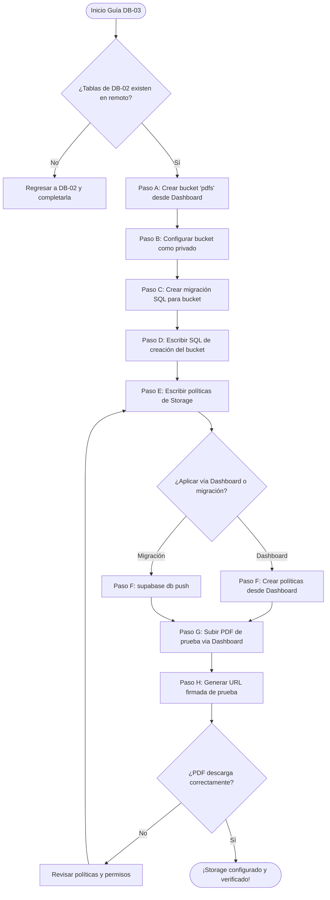

# Guía Didáctica DB-03: Storage Bucket Privado para PDFs

---

## 🎓 1. Introducción y Fundamentos Conceptuales

### Recapitulación: ¿Dónde estamos?

En la guía **DB-01** construiste los cimientos: creaste el proyecto Supabase en la nube, configuraste las credenciales de forma segura, instalaste el CLI y vinculaste tu repositorio local con el servidor remoto. En la guía **DB-02** levantaste la estructura de acero: 6 tablas con 14+ CHECK constraints, claves foráneas, índices de performance y migraciones reproducibles.

Ahora mismo tienes un **sistema que sabe guardar metadatos sobre documentos** (tabla `documents` con `file_name`, `file_url`, `extracted_text`, `topics_json`), pero no tiene **dónde guardar los archivos físicos**. Es como tener un catálogo de biblioteca sin estantes para los libros. **Eso es exactamente lo que resolveremos hoy.**

### ¿Qué es Supabase Storage?

Supabase Storage es un servicio de almacenamiento de objetos (archivos) construido sobre **S3-compatible storage** que se integra nativamente con la autenticación y las políticas de seguridad de Supabase. Piensa en él como un **Google Drive programable** donde cada archivo vive dentro de un "bucket" (contenedor) y el acceso se controla con políticas SQL idénticas a las de Row Level Security (RLS).

```
┌─────────────────────────────────────────────────────────────────────────┐
│                     SUPABASE STORAGE — ANATOMÍA                         │
├─────────────────────────────────────────────────────────────────────────┤
│                                                                         │
│  BUCKET (Contenedor lógico)                                             │
│  ├── Nombre único global dentro del proyecto (ej. "pdfs")               │
│  ├── Tipo: PÚBLICO o PRIVADO                                            │
│  │   ├── Público: cualquiera con la URL puede descargar.               │
│  │   └── Privado: solo usuarios autenticados con política válida.       │
│  └── Restricciones: tamaño máximo, tipos MIME permitidos.               │
│                                                                         │
│  OBJETO (Archivo individual)                                            │
│  ├── Ruta: {bucket}/{carpeta}/{archivo}                                 │
│  │   Ejemplo: pdfs/550e8400-e29b-41d4-a716-446655440000/ISTQB.pdf      │
│  ├── Metadatos: nombre, tamaño, tipo MIME, fecha de subida.             │
│  └── Acceso: controlado por Storage Policies (SQL).                     │
│                                                                         │
│  SIGNED URL (URL firmada temporalmente)                                 │
│  ├── URL con token criptográfico de duración limitada.                  │
│  ├── Permite descargar un archivo privado sin autenticación directa.    │
│  └── Expira automáticamente (ej. 60 segundos, 5 minutos).              │
│                                                                         │
└─────────────────────────────────────────────────────────────────────────┘
```

### Analogía: La Bóveda de Seguridad del Hospital

Continuando con nuestra analogía médica de DB-02:

- El **bucket `pdfs`** es la **bóveda de documentos médicos** del hospital. No está en el mostrador de recepción (público), sino en una sala cerrada con llave (privado).
- Cada **carpeta `{user_id}/`** dentro del bucket es el **casillero personal** de cada paciente. Solo el paciente (y el médico autorizado) puede abrir su casillero.
- Una **URL firmada** es como un **pase temporal** que le das a un especialista externo: "puedes ver este expediente durante los próximos 5 minutos, pero después el pase expira y no podrás volver a acceder sin otro pase".

### ¿Por qué privado y no público?

Los PDFs del ISTQB contienen contenido con copyright y, más importante, los datos de estudio de cada usuario son **información privada**. Si el bucket fuera público:
- Cualquier persona con la URL podría descargar los PDFs de cualquier usuario.
- Un atacante podría enumerar las rutas y descargar archivos masivamente.
- No habría control de quién accede a qué.

Con un bucket **privado** + **políticas de acceso** + **URLs firmadas**:
- Solo el dueño del archivo puede descargarlo.
- Las URLs expiran automáticamente.
- Supabase verifica la identidad del usuario en cada operación.

---

## 📋 2. Prerrequisitos y Verificación del Entorno

### A. Herramientas del sistema

| Herramienta | Comando de verificación | Versión mínima |
|---|---|---|
| Node.js | `node --version` | v18.x |
| Supabase CLI | `supabase --version` | v2.x |
| Git | `git --version` | v2.x |

### B. Entregables de DB-01 que DEBEN existir

```powershell
# Verificar que el proyecto Supabase está inicializado
Test-Path "supabase\config.toml"
# Esperado: True

# Verificar que las variables de entorno existen
Test-Path ".env.local"
# Esperado: True

# Verificar que el .env.example público existe
Test-Path ".env.example"
# Esperado: True
```

### C. Entregables de DB-02 que DEBEN existir

```powershell
# Verificar que la migración del schema existe
Get-ChildItem "supabase\migrations\*create_schema*"
# Esperado: un archivo como YYYYMMDDHHMMSS_create_schema.sql
```

Además, las 6 tablas deben estar creadas en el servidor remoto de Supabase. Puedes verificarlo desde el **SQL Editor** del Dashboard:

```sql
SELECT table_name
FROM information_schema.tables
WHERE table_schema = 'public'
  AND table_type = 'BASE TABLE'
ORDER BY table_name;
```

*Resultado esperado: 6 tablas (answers, documents, sessions, study_plans, topic_progress, user_profiles).*

### D. Cuenta de Supabase con acceso al Dashboard

Necesitarás acceso al **Dashboard de Supabase** ([supabase.com/dashboard](https://supabase.com/dashboard)) para:
- Crear el bucket de Storage manualmente.
- Configurar las políticas de acceso.
- Probar la subida y descarga de un PDF.

> [!CAUTION]
> **BLOQUEO DE DEPENDENCIA:** Si alguna de las verificaciones anteriores falla, **NO continúes.** La tabla `documents` (de DB-02) almacenará la referencia (`file_url`) a los archivos que guardemos en Storage. Sin ella, no hay dónde registrar los metadatos del PDF subido.

---

## 📂 3. Estructura de Directorios del Proyecto

Después de completar esta guía, tu proyecto tendrá la siguiente estructura. Los archivos marcados con **[NUEVO]** son los que crearás en esta guía:

```
practica-testing/
│
├── supabase/                                # [CAPA DE BASE DE DATOS]
│   ├── config.toml                          # Configuración de Supabase local (DB-01)
│   └── migrations/                          # Carpeta de migraciones
│       ├── 20260522183543_remote_schema.sql # Migración inicial remota (DB-01)
│       ├── YYYYMMDDHHMMSS_create_schema.sql # Schema de tablas y constraints (DB-02)
│       └── YYYYMMDDHHMMSS_create_storage_bucket.sql # [NUEVO] Migración: bucket + policies
│
├── frontend/                                # [CAPA DE INTERFAZ] (Next.js 14+)
│   └── ...                                  # (sin cambios en esta guía)
│
├── backend/                                 # [CAPA DE EXTRACCIÓN] (FastAPI/Python)
│   └── ...                                  # (sin cambios en esta guía)
│
├── docs/                                    # [DOCUMENTACIÓN Y GUÍAS]
│   ├── architecture/
│   │   └── ISTQB_StudyAgent_ProjectDoc.md   # Documento de arquitectura
│   ├── roadmap/
│   │   └── ISTQB_Guias_Implementacion.md    # Hoja de ruta global
│   └── guides/
│       └── db/
│           ├── DB-01.md                     # Guía completada (configuración inicial)
│           ├── DB-02.md                     # Guía completada (schema y constraints)
│           └── DB-03.md                     # [NUEVO] Esta guía (Storage bucket)
│
├── .env.example                             # Plantilla pública de variables (DB-01)
├── .env.local                               # Variables secretas locales (DB-01)
└── .gitignore                               # Exclusiones de Git (DB-01)
```

---

## 🔄 4. Diagrama de Flujo del Proceso



---

## 🛠️ 5. Implementación Paso a Paso

### Paso A: Crear el Bucket `pdfs` desde el Dashboard de Supabase

El bucket es el contenedor de nivel superior donde vivirán todos los archivos PDF del sistema. Lo crearemos primero desde el Dashboard (interfaz web) para entender visualmente cómo funciona, y después lo documentaremos como migración SQL para que sea reproducible.

1. Abre tu navegador e ingresa al [Dashboard de Supabase](https://supabase.com/dashboard).
2. Selecciona tu proyecto `istqb-study-agent`.
3. En la barra lateral izquierda, haz clic en **Storage** (ícono de carpeta/nube).
4. Haz clic en el botón **New bucket** (parte superior derecha).
5. Rellena los datos de configuración del bucket:

   | Campo | Valor | Justificación |
   |---|---|---|
   | **Bucket name** | `pdfs` | Nombre corto, descriptivo y en minúsculas. Se usará en rutas como `pdfs/{user_id}/archivo.pdf`. |
   | **Public bucket** | ❌ **Desactivado** (toggle apagado) | Los PDFs son contenido privado. Solo el dueño debe poder acceder. |
   | **Allowed MIME types** | `application/pdf` | Restringe la subida exclusivamente a archivos PDF. Evita que alguien suba ejecutables, imágenes u otros archivos. |
   | **Max file size** | `20` MB (20971520 bytes) | Los PDFs del ISTQB pesan entre 2-5 MB. 20 MB da margen suficiente sin permitir abusos de almacenamiento. |

6. Haz clic en **Create bucket**.

> [!IMPORTANT]
> **¿Por qué desactivamos "Public bucket"?**
> Un bucket público genera URLs directas y permanentes a cada archivo. Cualquier persona que obtenga esa URL (por un descuido del usuario, un log expuesto, o un ataque) podría descargar el PDF sin autenticación. Con un bucket **privado**, cada descarga requiere o bien una sesión autenticada con política válida, o bien una URL firmada de corta duración.

**📦 Entregable del Paso A:**
- Bucket `pdfs` creado y visible en el panel de Storage del Dashboard.

---

### Paso B: Comprender la Estructura de Rutas dentro del Bucket

Antes de configurar las políticas de acceso, es fundamental entender **cómo organizaremos los archivos** dentro del bucket. La convención profesional para aplicaciones multi-usuario es:

```
pdfs/
├── {user_id_1}/                           # Carpeta del usuario 1
│   ├── 1716400000_ISTQB_CTFL_v4.0.pdf    # Timestamp + nombre original
│   └── 1716405000_otro_syllabus.pdf
│
├── {user_id_2}/                           # Carpeta del usuario 2
│   └── 1716410000_ISTQB_CTFL_v4.0.pdf
│
└── {user_id_N}/                           # Cada usuario tiene su carpeta aislada
    └── ...
```

**¿Por qué `{user_id}/` como primer nivel?**

1. **Aislamiento natural:** Cada usuario tiene su "casillero" propio. Las políticas de Storage verifican que `auth.uid()` coincida con la carpeta.
2. **Escalabilidad:** Con miles de usuarios, los archivos no se mezclan en una sola carpeta plana.
3. **Performance:** Supabase indexa por prefijo de ruta, lo que hace eficiente listar los archivos de un solo usuario.

**¿Por qué el timestamp como prefijo del nombre?**

- Evita colisiones si un usuario sube dos archivos con el mismo nombre.
- Permite ordenar cronológicamente sin consultar metadatos.
- El patrón `{timestamp}_{nombre_original}` es un estándar de la industria.

> [!NOTE]
> En esta guía solo configuramos el bucket y las políticas. El código que construye la ruta `{user_id}/{timestamp}_{filename}` se implementará en la guía **UP-02** (API Route `/api/upload`), dentro del bloque de Frontend.

**📦 Entregable del Paso B:**
- Comprensión clara de la estructura de rutas. No se crea ningún archivo en este paso.

---

### Paso C: Crear el Archivo de Migración SQL para Storage

Aunque creamos el bucket manualmente en el Dashboard (Paso A), necesitamos **documentar la configuración como código SQL** para que sea reproducible. Si alguien clona tu repositorio mañana, debería poder recrear todo el bucket con un solo `supabase db push`.

1. Ejecuta el siguiente comando en PowerShell desde la raíz del proyecto:

```powershell
supabase migration new create_storage_bucket
```

*Salida esperada:*
```text
Created new migration at supabase\migrations\YYYYMMDDHHMMSS_create_storage_bucket.sql
```

2. Abre el archivo de migración recién creado. Estará vacío. En los siguientes pasos llenaremos este archivo.

> [!NOTE]
> **Anota el nombre completo** del archivo generado (con el timestamp). Lo necesitarás para identificar esta migración en los logs.

**📦 Entregable del Paso C:**
- Archivo `supabase/migrations/YYYYMMDDHHMMSS_create_storage_bucket.sql` creado (vacío por ahora).

---

### Paso D: SQL de Creación del Bucket

Escribe el siguiente SQL **al inicio** del archivo de migración creado en el Paso C:

```sql
-- ============================================================
-- MIGRACIÓN: Storage Bucket para PDFs del ISTQB Study Agent
-- Guía: DB-03
-- Descripción: Crea el bucket privado "pdfs" y configura las
--              políticas de acceso (RLS) para que cada usuario
--              solo pueda leer y escribir sus propios archivos.
-- ============================================================

-- ──────────────────────────────────────────────────────────────
-- BUCKET: pdfs
-- Propósito: Almacén privado de archivos PDF subidos por los
--            usuarios. Cada usuario tiene su propia carpeta
--            aislada: pdfs/{user_id}/{timestamp}_{filename}.pdf
--
-- Configuración:
--   - Privado (public = false): requiere autenticación.
--   - Tamaño máximo por archivo: 20 MB (20971520 bytes).
--   - Tipos MIME permitidos: solo application/pdf.
-- ──────────────────────────────────────────────────────────────
INSERT INTO storage.buckets (id, name, public, file_size_limit, allowed_mime_types)
VALUES (
  'pdfs',                          -- ID único del bucket (igual al nombre)
  'pdfs',                          -- Nombre visible del bucket
  FALSE,                           -- Privado: no se puede acceder sin autenticación
  20971520,                        -- 20 MB en bytes (20 * 1024 * 1024)
  ARRAY['application/pdf']         -- Solo se permiten archivos PDF
)
ON CONFLICT (id) DO NOTHING;
-- ON CONFLICT: si el bucket ya existe (lo creamos manualmente en Paso A),
-- esta sentencia no falla. Esto hace la migración idempotente.
```

**¿Por qué `ON CONFLICT (id) DO NOTHING`?**

Como ya creamos el bucket manualmente desde el Dashboard en el Paso A, ejecutar esta migración sin `ON CONFLICT` fallaría con un error de duplicado. La cláusula `ON CONFLICT DO NOTHING` hace que la migración sea **idempotente**: se puede ejecutar múltiples veces sin efectos secundarios.

**¿Qué es `storage.buckets`?**

Supabase almacena la configuración de todos los buckets en una tabla interna llamada `storage.buckets`. Cuando creas un bucket desde el Dashboard, Supabase internamente hace un `INSERT` en esta tabla. Al escribir el SQL directamente, estamos haciendo lo mismo pero de forma **reproducible y versionada**.

**📦 Entregable del Paso D:**
- SQL de creación del bucket escrito en el archivo de migración.

---

### Paso E: Políticas de Acceso (Storage Policies)

Las políticas de Storage funcionan exactamente como Row Level Security (RLS) pero aplicadas a los **objetos** (archivos) del bucket. Cada operación (SELECT, INSERT, UPDATE, DELETE) se evalúa contra estas políticas antes de ejecutarse.

Añade el siguiente SQL **después** de la creación del bucket, en el mismo archivo de migración:

```sql
-- ══════════════════════════════════════════════════════════════
-- POLÍTICAS DE ACCESO PARA EL BUCKET "pdfs"
-- ══════════════════════════════════════════════════════════════
--
-- Supabase Storage usa la tabla storage.objects para almacenar
-- los metadatos de cada archivo. Las políticas se aplican sobre
-- esta tabla, filtrando por bucket_id y por la ruta del archivo.
--
-- PATRÓN DE RUTA: pdfs/{user_id}/{timestamp}_{filename}.pdf
--
-- La función (storage.foldername(name))[1] extrae el primer
-- segmento de la ruta del archivo (la carpeta del usuario).
-- La comparamos con auth.uid()::TEXT para verificar ownership.
-- ══════════════════════════════════════════════════════════════

-- ──────────────────────────────────────────────────────────────
-- POLÍTICA 1: SELECT (Lectura/Descarga)
-- Permite a un usuario autenticado DESCARGAR únicamente los
-- archivos que están dentro de su propia carpeta.
--
-- Ejemplo: el usuario con UUID "abc-123" solo puede leer
-- archivos en la ruta pdfs/abc-123/...
-- ──────────────────────────────────────────────────────────────
CREATE POLICY "Users can read own PDFs"
  ON storage.objects
  FOR SELECT
  TO authenticated
  USING (
    bucket_id = 'pdfs'
    AND (storage.foldername(name))[1] = auth.uid()::TEXT
  );

-- ──────────────────────────────────────────────────────────────
-- POLÍTICA 2: INSERT (Subida/Upload)
-- Permite a un usuario autenticado SUBIR archivos únicamente
-- dentro de su propia carpeta.
--
-- Esto evita que un usuario suba archivos a la carpeta de otro
-- (ej. sobreescribir el PDF de otro usuario).
-- ──────────────────────────────────────────────────────────────
CREATE POLICY "Users can upload own PDFs"
  ON storage.objects
  FOR INSERT
  TO authenticated
  WITH CHECK (
    bucket_id = 'pdfs'
    AND (storage.foldername(name))[1] = auth.uid()::TEXT
  );

-- ──────────────────────────────────────────────────────────────
-- POLÍTICA 3: UPDATE (Actualización de metadatos)
-- Permite a un usuario autenticado ACTUALIZAR los metadatos de
-- sus propios archivos (ej. renombrar).
--
-- En la práctica, raramente se actualiza un objeto en Storage;
-- es más común eliminar y volver a subir. Pero esta política
-- cubre el caso por completitud y seguridad.
-- ──────────────────────────────────────────────────────────────
CREATE POLICY "Users can update own PDFs"
  ON storage.objects
  FOR UPDATE
  TO authenticated
  USING (
    bucket_id = 'pdfs'
    AND (storage.foldername(name))[1] = auth.uid()::TEXT
  )
  WITH CHECK (
    bucket_id = 'pdfs'
    AND (storage.foldername(name))[1] = auth.uid()::TEXT
  );

-- ──────────────────────────────────────────────────────────────
-- POLÍTICA 4: DELETE (Eliminación)
-- Permite a un usuario autenticado ELIMINAR únicamente sus
-- propios archivos.
--
-- Caso de uso: el usuario quiere reemplazar un PDF incorrecto.
-- Primero elimina el anterior, luego sube el nuevo.
-- ──────────────────────────────────────────────────────────────
CREATE POLICY "Users can delete own PDFs"
  ON storage.objects
  FOR DELETE
  TO authenticated
  USING (
    bucket_id = 'pdfs'
    AND (storage.foldername(name))[1] = auth.uid()::TEXT
  );
```

**Desglose técnico de las políticas:**

```
┌────────────────────────────────────────────────────────────────────────┐
│  ¿CÓMO FUNCIONA (storage.foldername(name))[1] = auth.uid()::TEXT?     │
├────────────────────────────────────────────────────────────────────────┤
│                                                                        │
│  Ejemplo de archivo subido:                                            │
│    name = "550e8400-e29b-41d4-a716-446655440000/1716400000_ISTQB.pdf" │
│                                                                        │
│  storage.foldername(name) retorna un array con los segmentos de       │
│  carpeta de la ruta del archivo:                                       │
│    → ['550e8400-e29b-41d4-a716-446655440000']                          │
│                                                                        │
│  [1] extrae el primer (y único) segmento de carpeta:                   │
│    → '550e8400-e29b-41d4-a716-446655440000'                            │
│                                                                        │
│  auth.uid()::TEXT retorna el UUID del usuario autenticado como texto:  │
│    → '550e8400-e29b-41d4-a716-446655440000'                            │
│                                                                        │
│  Comparación:                                                          │
│    '550e8400...' = '550e8400...'  →  TRUE  →  ACCESO CONCEDIDO ✅     │
│                                                                        │
│  Si otro usuario (UUID 'aaaa...') intenta acceder:                     │
│    '550e8400...' = 'aaaa...'  →  FALSE  →  ACCESO DENEGADO ❌         │
│                                                                        │
└────────────────────────────────────────────────────────────────────────┘
```

**¿Cuál es la diferencia entre `USING` y `WITH CHECK`?**

| Cláusula | Se evalúa en | Propósito |
|---|---|---|
| `USING` | SELECT, UPDATE (filas existentes), DELETE | Filtra qué filas **puede ver/modificar** el usuario. |
| `WITH CHECK` | INSERT, UPDATE (filas nuevas) | Valida que las filas **que se están creando/modificando** cumplen la condición. |

- Para `SELECT` y `DELETE`: solo necesitas `USING` (estás leyendo/eliminando filas existentes).
- Para `INSERT`: solo necesitas `WITH CHECK` (estás creando una fila nueva).
- Para `UPDATE`: necesitas **ambas** — `USING` para filtrar qué filas puedes actualizar, y `WITH CHECK` para validar que la fila modificada sigue cumpliendo la política.

**📦 Entregable del Paso E:**
- 4 políticas de Storage escritas en el archivo de migración.

---

### Paso F: Aplicar las Políticas al Remoto

Dado que el bucket ya fue creado manualmente desde el Dashboard (Paso A), ahora necesitamos aplicar las **políticas de acceso** que escribimos en nuestra migración SQL.

#### Opción 1: Aplicar vía `supabase db push` (Recomendada)

Esta es la opción profesional y reproducible. Ejecuta desde PowerShell:

```powershell
supabase db push
```

*Salida esperada:*
```text
Connecting to remote database...
Applying migration YYYYMMDDHHMMSS_create_storage_bucket.sql...
Finished supabase db push.
```

> [!WARNING]
> Si ves el error `duplicate key value violates unique constraint "buckets_pkey"`, significa que `ON CONFLICT (id) DO NOTHING` no se aplicó correctamente. Verifica que la cláusula `ON CONFLICT` esté exactamente como se muestra en el Paso D.

#### Opción 2: Aplicar vía SQL Editor del Dashboard (Alternativa)

Si por alguna razón `supabase db push` falla, puedes copiar el contenido SQL completo del archivo de migración y ejecutarlo directamente en el **SQL Editor** del Dashboard de Supabase. Luego marca la migración como aplicada manualmente:

```powershell
supabase migration repair --status applied YYYYMMDDHHMMSS
```

*Reemplaza `YYYYMMDDHHMMSS` con el timestamp real de tu archivo de migración.*

**📦 Entregable del Paso F:**
- Migración aplicada exitosamente. El bucket y sus 4 políticas están activos en el servidor remoto.

---

### Paso G: Verificar las Políticas en el Dashboard

1. Abre el [Dashboard de Supabase](https://supabase.com/dashboard).
2. Ve a **Storage** en la barra lateral.
3. Haz clic en el bucket **pdfs**.
4. Haz clic en el ícono de **Policies** (o ve a **Storage → Policies** en el menú lateral).
5. Deberías ver las 4 políticas listadas:

```
✅ "Users can read own PDFs"     — SELECT — authenticated
✅ "Users can upload own PDFs"    — INSERT — authenticated
✅ "Users can update own PDFs"    — UPDATE — authenticated
✅ "Users can delete own PDFs"    — DELETE — authenticated
```

Si las políticas no aparecen en la sección de Storage Policies, pero la migración se ejecutó sin error, puedes verificarlas directamente vía SQL:

```sql
-- Verificar políticas de Storage activas para el bucket "pdfs"
SELECT
  policyname,
  cmd AS operation,
  roles,
  qual AS using_expression,
  with_check AS with_check_expression
FROM pg_policies
WHERE tablename = 'objects'
  AND schemaname = 'storage';
```

*Resultado esperado: 4 filas, una por cada operación (SELECT, INSERT, UPDATE, DELETE), todas con el rol `authenticated`.*

**📦 Entregable del Paso G:**
- Las 4 políticas verificadas visualmente en el Dashboard o vía SQL.

---

### Paso H: Subir un PDF de Prueba desde el Dashboard

Ahora probaremos que el bucket funciona correctamente subiendo un archivo de prueba.

1. En el Dashboard de Supabase, ve a **Storage → pdfs**.
2. Necesitamos crear primero la carpeta del usuario. Pero **importante:** las políticas están activas, así que desde el Dashboard (que usa la cuenta de `service_role` internamente) puedes crear carpetas libremente.
3. Haz clic en **Create folder** y escribe el UUID de tu usuario de prueba. Si no recuerdas el UUID, búscalo desde el **SQL Editor**:

```sql
-- Obtener el UUID de tu usuario de prueba
SELECT id, email FROM auth.users LIMIT 1;
```

4. Anota el UUID (ej: `550e8400-e29b-41d4-a716-446655440000`).
5. Crea la carpeta con ese UUID como nombre.
6. Entra a la carpeta y haz clic en **Upload files**.
7. Selecciona cualquier archivo PDF de tu computadora (puedes usar el mismo PDF del ISTQB si lo tienes).
8. Espera a que la subida se complete. Deberías ver el archivo listado dentro de la carpeta.

> [!TIP]
> Si no tienes un PDF a la mano, puedes crear uno rápido desde cualquier herramienta o incluso renombrar un archivo `.txt` a `.pdf` para la prueba. Sin embargo, la validación de MIME type del bucket **podría rechazar** un `.txt` renombrado si el cliente envía el MIME type correcto. Para una prueba rápida, usa un PDF real.

**📦 Entregable del Paso H:**
- Al menos un archivo PDF visible dentro de la carpeta `{user_id}/` en el bucket `pdfs`.

---

### Paso I: Generar y Verificar una URL Firmada (Signed URL)

La URL firmada es el mecanismo que usará la aplicación de Next.js para descargar los PDFs del usuario de forma segura y temporal. Probemos este mecanismo desde el Dashboard.

1. En **Storage → pdfs → {user_id}/**, haz clic en el archivo PDF que subiste.
2. Aparecerá un panel de detalles del archivo a la derecha.
3. Busca el botón o enlace **Get URL** (o "Generate signed URL").
4. Configura la **duración de la URL**:
   - Para pruebas: **300 segundos** (5 minutos) es suficiente.
   - En producción, la guía UP-02 usará URLs de **60 segundos** para máxima seguridad.
5. Haz clic en **Copy URL** para copiar la URL firmada.
6. Pega la URL en una nueva pestaña del navegador.

*Resultado esperado:*
- El PDF se descarga o se muestra en el navegador correctamente. ✅
- Si esperas más de 5 minutos y vuelves a intentar con la misma URL, debería fallar con un error de expiración. ❌ (Esto confirma que la URL temporal funciona.)

**¿Cómo se genera una URL firmada programáticamente?**

Desde el código de Next.js (guía UP-02), usarás el cliente de Supabase:

```typescript
// Este código es solo REFERENCIA — se implementará en UP-02.
// NO lo agregues a ningún archivo del proyecto todavía.
const { data, error } = await supabase.storage
  .from('pdfs')
  .createSignedUrl(`${userId}/${fileName}`, 60); // 60 segundos de validez

// data.signedUrl contiene la URL temporal para descargar el PDF.
```

> [!NOTE]
> **Cross-Layer:** Las URLs firmadas serán consumidas en la guía **UP-02** (API Route `/api/upload`) y en **UP-03** (llamada a FastAPI para extracción). La ruta `file_url` guardada en la tabla `documents` (DB-02) será la ruta *interna* del Storage (`{user_id}/{timestamp}_{filename}`), **no** la URL firmada. La URL firmada se genera bajo demanda cada vez que se necesita descargar el archivo.

**📦 Entregable del Paso I:**
- URL firmada generada exitosamente.
- PDF descargable a través de la URL firmada.
- URL expirada no permite descarga (verificación opcional).

---

## ✅ 6. Checkpoints de Verificación

### Verificación de existencia del bucket vía SQL

Ejecuta esta consulta en el **SQL Editor** del Dashboard para confirmar que el bucket existe con la configuración correcta:

```sql
SELECT
  id,
  name,
  public,
  file_size_limit,
  allowed_mime_types
FROM storage.buckets
WHERE id = 'pdfs';
```

*Resultado esperado:*
```
 id   | name | public | file_size_limit | allowed_mime_types
──────┼──────┼────────┼─────────────────┼────────────────────
 pdfs | pdfs | false  | 20971520        | {application/pdf}
(1 row)
```

### Verificación de políticas activas

```sql
SELECT
  policyname,
  cmd
FROM pg_policies
WHERE tablename = 'objects'
  AND schemaname = 'storage'
  AND qual::TEXT LIKE '%pdfs%';
```

*Resultado esperado:*
```
            policyname            |  cmd
──────────────────────────────────┼────────
 Users can read own PDFs          | SELECT
 Users can upload own PDFs        | INSERT
 Users can update own PDFs        | UPDATE
 Users can delete own PDFs        | DELETE
(4 rows)
```

### Verificación de migración aplicada

```powershell
supabase db push
```

*Salida esperada (sin migraciones pendientes):*
```text
Connecting to remote database...
Finished supabase db push.
```

### 📋 Checklist de Entregables Completados

```
✅ Bucket "pdfs" creado en Supabase Storage (privado, 20 MB, solo PDF)
✅ Archivo de migración creado: supabase/migrations/YYYYMMDDHHMMSS_create_storage_bucket.sql
✅ SQL de creación del bucket con ON CONFLICT para idempotencia
✅ 4 políticas de Storage configuradas:
    ✅ SELECT: usuario solo puede leer sus propios PDFs
    ✅ INSERT: usuario solo puede subir a su propia carpeta
    ✅ UPDATE: usuario solo puede actualizar metadatos de sus PDFs
    ✅ DELETE: usuario solo puede eliminar sus propios PDFs
✅ Migración aplicada al remoto con supabase db push sin errores
✅ Políticas verificadas vía Dashboard o consulta SQL
✅ PDF de prueba subido exitosamente al bucket
✅ URL firmada generada y PDF descargable a través de ella
```

---

## 🚨 7. Troubleshooting — Problemas Comunes

| Problema | Causa Probable | Solución |
|---|---|---|
| `ERROR: duplicate key value violates unique constraint "buckets_pkey"` al ejecutar `supabase db push` | El bucket `pdfs` ya existe (lo creaste manualmente en el Dashboard) y la migración no tiene `ON CONFLICT`. | Verifica que el `INSERT INTO storage.buckets` incluya la cláusula `ON CONFLICT (id) DO NOTHING` al final. Si ya ejecutaste la migración sin esta cláusula, arregla el SQL y ejecuta `supabase migration repair --status reverted YYYYMMDDHHMMSS` seguido de `supabase db push`. |
| La subida del PDF falla con `new row violates row-level security policy` desde el frontend | El usuario autenticado está intentando subir a una ruta que no comienza con su propio UUID. | Asegúrate de que la ruta del archivo siga el patrón `{auth.uid()}/{filename}`. La política verifica que el primer segmento de carpeta coincida con el UUID del usuario. Ejemplo correcto: `550e8400.../1716400000_ISTQB.pdf`. |
| La URL firmada genera un error `Object not found` al abrirla | La ruta del archivo en `createSignedUrl()` no coincide con la ruta real en Storage. | Verifica que la ruta pasada a `createSignedUrl` coincida **exactamente** con cómo se guardó el archivo en Storage. Las rutas son case-sensitive. Puedes verificar la ruta real desde el Dashboard en **Storage → pdfs → {carpeta}**. |
| `ERROR: policy "Users can read own PDFs" already exists` al ejecutar la migración | Las políticas se crearon manualmente desde el Dashboard antes de ejecutar la migración SQL. | Elimina las políticas duplicadas desde el Dashboard (**Storage → Policies → botón de eliminar en cada política**). Luego vuelve a ejecutar `supabase db push`. Alternativamente, envuelve cada `CREATE POLICY` con una verificación: `DO $$ BEGIN IF NOT EXISTS (SELECT 1 FROM pg_policies WHERE policyname = 'Users can read own PDFs') THEN ... END IF; END $$;` |
| El archivo se sube correctamente pero no puedo generar URL firmada | Es posible que las políticas de SELECT no estén activas o que el usuario con el que generas la URL no sea el dueño del archivo. | Desde el Dashboard, la URL firmada se genera con privilegios de `service_role` (bypassa RLS). Si falla desde código, verifica que el usuario autenticado sea el mismo que subió el archivo. Ejecuta la consulta de verificación de políticas del Checkpoint para confirmar que las políticas existen. |

---

## 📝 8. Resumen y Próximo Paso

### ¿Qué lograste en esta guía?

1. Comprendiste el modelo de Supabase Storage: **buckets**, **objetos**, **políticas de acceso** y **URLs firmadas**.
2. Creaste el bucket `pdfs` con configuración **privada**, límite de 20 MB y restricción de tipo MIME a `application/pdf`.
3. Diseñaste y aplicaste **4 políticas de acceso** que garantizan que cada usuario solo puede leer, subir, actualizar y eliminar sus propios archivos.
4. Documentaste toda la configuración como una **migración SQL reproducible** con idempotencia (`ON CONFLICT`).
5. Probaste la subida de un PDF de prueba y la generación de una **URL firmada temporal** para descarga segura.
6. Entendiste la función `storage.foldername()` y cómo se usa para implementar aislamiento por usuario en Storage.

### Valida tu progreso

Ahora que has alcanzado este checkpoint, ejecuta y solicítame validar tu avance escribiendo textualmente:

> **`Valida mi progreso de la guía DB-03 en su sección 6`**

El **Validador de Pasos (Step Validator)** verificará que tu migración de Storage existe, que el bucket `pdfs` está configurado correctamente y que las políticas de acceso están activas.

### ¿Qué sigue? → Guía DB-04: Row Level Security (RLS) Policies

En la próxima guía blindaremos **todas las tablas** del sistema (no solo Storage) con políticas de Row Level Security. Cubriremos:
- Habilitar RLS en las 6 tablas (`user_profiles`, `documents`, `study_plans`, `sessions`, `answers`, `topic_progress`).
- Crear políticas SELECT, INSERT, UPDATE y DELETE para cada tabla.
- Verificar que un usuario B **no puede ver** ningún dato del usuario A.
- Probar que sin sesión activa, **ningún dato es visible**.

Las políticas de Storage que creaste hoy son un **adelanto** de lo que viene en DB-04, pero aplicadas a archivos. En DB-04 aplicarás el mismo concepto a las **filas de las tablas SQL**. ¡A blindar la base de datos! 🛡️
