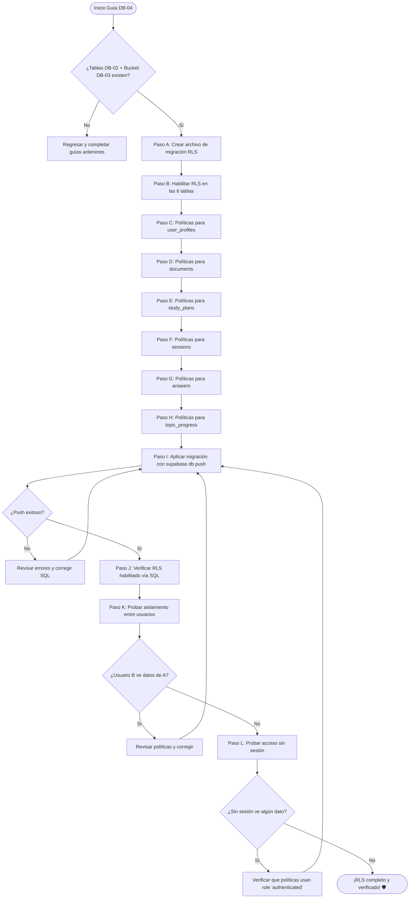

# Guía Didáctica DB-04: Row Level Security (RLS) Policies

> **Addendum de defensa en profundidad verificado (19/07/2026):** una policy que
> solo comprueba `user_id = auth.uid()` aísla filas, pero no garantiza que una FK
> desnormalizada apunte a un padre del mismo tenant. La migración
> `20260719193643_enforce_core_ownership_integrity.sql` alinea las policies
> `INSERT/UPDATE` con el ownership del padre y agrega FKs compuestas que también
> protegen escrituras con `service_role` o SQL directo.

---

## 🎓 1. Introducción y Fundamentos Conceptuales

### Recapitulación: ¿Dónde estamos?

En la guía **DB-01** construiste los cimientos del proyecto Supabase: credenciales, CLI y vinculación remota. En la guía **DB-02** levantaste las 6 tablas del sistema (`user_profiles`, `documents`, `study_plans`, `sessions`, `answers`, `topic_progress`) con 14+ CHECK constraints, índices de performance y claves foráneas. En la guía **DB-03** creaste el bucket privado `pdfs` en Supabase Storage con 4 políticas de acceso que garantizan que cada usuario solo puede leer, subir, actualizar y eliminar sus propios archivos.

Ahora mismo tu base de datos tiene un **problema grave de seguridad**: cualquier usuario autenticado puede leer, modificar y eliminar **todos los datos de todos los demás usuarios**. Las tablas no tienen ningún filtro de acceso. Es como un edificio de departamentos donde todas las puertas están abiertas de par en par: cada vecino puede entrar al departamento de cualquier otro.

**Eso termina hoy.** En esta guía implementaremos **Row Level Security (RLS)** en las 6 tablas del esquema público para garantizar que cada usuario solo pueda acceder a sus propios datos.

### ¿Qué es Row Level Security (RLS)?

Row Level Security es una funcionalidad nativa de PostgreSQL (no es exclusiva de Supabase) que permite definir **políticas de acceso a nivel de fila**. En lugar de controlar quién puede acceder a una **tabla** completa, RLS controla quién puede acceder a **cada fila individual** dentro de esa tabla.

```
┌──────────────────────────────────────────────────────────────────────────────┐
│                     ROW LEVEL SECURITY — MODELO MENTAL                       │
├──────────────────────────────────────────────────────────────────────────────┤
│                                                                              │
│  SIN RLS (estado actual):                                                    │
│  ┌──────────────────────────────────────────────────────────┐                │
│  │  SELECT * FROM documents;                                │                │
│  │  → Retorna TODOS los documentos de TODOS los usuarios    │                │
│  │  → El usuario A ve los PDFs del usuario B               │                │
│  │  → Cualquier usuario puede DELETE sobre cualquier fila   │                │
│  └──────────────────────────────────────────────────────────┘                │
│                                                                              │
│  CON RLS (lo que implementaremos):                                           │
│  ┌──────────────────────────────────────────────────────────┐                │
│  │  SELECT * FROM documents;                                │                │
│  │  → Retorna SOLO los documentos del usuario autenticado   │                │
│  │  → PostgreSQL inyecta automáticamente:                   │                │
│  │    WHERE user_id = auth.uid()                            │                │
│  │  → El usuario A NUNCA ve datos del usuario B             │                │
│  └──────────────────────────────────────────────────────────┘                │
│                                                                              │
│  CLAVE: RLS actúa como un filtro INVISIBLE e INELUDIBLE.                     │
│  Ni siquiera el código del frontend puede saltarse las políticas.            │
│  Solo el service_role (servidor) puede bypasear RLS si es necesario.         │
│                                                                              │
└──────────────────────────────────────────────────────────────────────────────┘
```

### Analogía: El Sistema de Expedientes del Hospital

Continuemos con nuestra analogía médica:

- **Sin RLS** es como un hospital donde **todos los expedientes están en una estantería abierta** en el pasillo principal. Cualquier médico, enfermera o visitante puede tomar el expediente de cualquier paciente, leerlo, modificarlo o tirarlo a la basura.

- **Con RLS** es como un hospital con un **sistema de control de acceso electrónico**. Cada expediente tiene una etiqueta con el ID del paciente dueño. Cuando un médico pide "muéstrame todos los expedientes", el sistema automáticamente filtra y solo le muestra los de **sus** pacientes asignados. No importa qué consulta SQL escriba el médico — el sistema **siempre** agrega el filtro. Es imposible saltárselo desde la aplicación.

- La función `auth.uid()` es como la **tarjeta de identificación** del médico. PostgreSQL la lee automáticamente en cada consulta para saber quién está pidiendo los datos.

### Las 3 Capas de Seguridad de Supabase

RLS es la segunda capa de un modelo de seguridad de 3 niveles:

```
┌──────────────────────────────────────────────────────────────────────────────┐
│                 MODELO DE SEGURIDAD EN CAPAS DE SUPABASE                     │
├──────────────────────────────────────────────────────────────────────────────┤
│                                                                              │
│  CAPA 1: Autenticación (auth.users)                   [Ya configurada]       │
│  ├── ¿Quién eres? → JWT token con el UUID del usuario                        │
│  └── Sin token válido → acceso denegado completamente                        │
│                                                                              │
│  CAPA 2: Row Level Security (RLS)                     [ESTA GUÍA]           │
│  ├── Ya sé quién eres. ¿Puedes ver ESTA fila específica?                     │
│  ├── Política: user_id = auth.uid()                                          │
│  └── Cada fila se evalúa individualmente                                     │
│                                                                              │
│  CAPA 3: CHECK Constraints                            [Ya configurados]      │
│  ├── Ya sé que puedes ver esta fila. ¿Los datos son VÁLIDOS?                 │
│  ├── Ejemplo: status IN ('active', 'completed', 'abandoned')                 │
│  └── Protege la integridad de los datos, no el acceso                        │
│                                                                              │
│  → La seguridad es como una cebolla: cada capa protege contra algo distinto. │
│  → RLS protege contra acceso no autorizado entre usuarios.                   │
│  → CHECK constraints protegen contra datos inválidos.                        │
│  → La autenticación protege contra acceso anónimo.                           │
│                                                                              │
└──────────────────────────────────────────────────────────────────────────────┘
```

### ¿Por qué CADA tabla tiene `user_id`?

Si revisas la migración de DB-02, notarás que las tablas `sessions` y `answers` incluyen un `user_id` que parece redundante (ya que se podría obtener a través de `study_plans.user_id` o `sessions.user_id`). Esto es **intencional** y se llama **desnormalización para RLS**:

```
┌─────────────────────────────────────────────────────────────────────────────┐
│  ¿POR QUÉ DESNORMALIZAR user_id EN CADA TABLA?                             │
├─────────────────────────────────────────────────────────────────────────────┤
│                                                                             │
│  OPCIÓN A (sin desnormalizar): Obtener user_id via JOIN                     │
│    SELECT * FROM answers                                                    │
│    WHERE session_id IN (                                                    │
│      SELECT id FROM sessions                                                │
│      WHERE study_plan_id IN (                                               │
│        SELECT id FROM study_plans                                           │
│        WHERE user_id = auth.uid()                                           │
│      )                                                                      │
│    );                                                                       │
│    → 3 niveles de subqueries. Lento. Complejo. Frágil.                      │
│                                                                             │
│  OPCIÓN B (con desnormalización): user_id directamente en cada tabla        │
│    SELECT * FROM answers WHERE user_id = auth.uid();                        │
│    → 1 comparación directa. Rápido. Simple. Robusto.                       │
│                                                                             │
│  PostgreSQL ejecuta la política RLS en CADA consulta. Si la política        │
│  requiere JOINs, el rendimiento se degrada exponencialmente con el          │
│  volumen de datos. Con user_id directo, el índice se usa de forma           │
│  óptima (O(log n) en vez de O(n²)).                                         │
│                                                                             │
└─────────────────────────────────────────────────────────────────────────────┘
```

### ¿Qué pasa con `user_profiles`?

La tabla `user_profiles` es especial: su `id` **es** el UUID del usuario (referencia directa a `auth.users(id)`). No tiene una columna `user_id` separada. La política RLS comparará `id = auth.uid()` en lugar de `user_id = auth.uid()`.

---

## 📋 2. Prerrequisitos y Verificación del Entorno

### A. Herramientas del sistema

| Herramienta | Comando de verificación | Versión mínima |
|---|---|---|
| Node.js | `node --version` | v18.x |
| Supabase CLI | `supabase --version` | v2.x |
| Git | `git --version` | v2.x |

### B. Entregables de DB-01 que DEBEN existir

```powershell
# Verificar que el proyecto Supabase está inicializado
Test-Path "supabase\config.toml"
# Esperado: True

# Verificar las variables de entorno
Test-Path ".env.local"
# Esperado: True
```

### C. Entregables de DB-02 que DEBEN existir

```powershell
# Verificar que la migración del schema existe
Get-ChildItem "supabase\migrations\*create_schema*"
# Esperado: 20260531183745_create_schema.sql
```

Además, las 6 tablas deben existir en el servidor remoto. Verifica ejecutando esta consulta en el **SQL Editor** del Dashboard de Supabase:

```sql
SELECT table_name
FROM information_schema.tables
WHERE table_schema = 'public'
  AND table_type = 'BASE TABLE'
ORDER BY table_name;
```

*Resultado esperado: 6 tablas — `answers`, `documents`, `sessions`, `study_plans`, `topic_progress`, `user_profiles`.*

### D. Entregables de DB-03 que DEBEN existir

```powershell
# Verificar que la migración del Storage bucket existe
Get-ChildItem "supabase\migrations\*create_storage_bucket*"
# Esperado: 20260531221544_create_storage_bucket.sql
```

El bucket `pdfs` y sus 4 políticas de Storage deben estar activos. Verifica desde el SQL Editor:

```sql
SELECT id, name, public FROM storage.buckets WHERE id = 'pdfs';
-- Esperado: pdfs | pdfs | false

SELECT policyname, cmd FROM pg_policies
WHERE tablename = 'objects' AND schemaname = 'storage';
-- Esperado: 4 filas (SELECT, INSERT, UPDATE, DELETE)
```

### E. Verificar que RLS NO está activo aún en las tablas públicas

```sql
SELECT
  schemaname,
  tablename,
  rowsecurity
FROM pg_tables
WHERE schemaname = 'public'
ORDER BY tablename;
```

*Resultado esperado: todas las tablas con `rowsecurity = false`. Si alguna ya tiene `true`, alguien lo habilitó manualmente — no es un problema, pero tómalo en cuenta.*

> [!CAUTION]
> **BLOQUEO DE DEPENDENCIA:** Si alguna de las verificaciones anteriores falla (tablas no existen, migraciones ausentes, bucket no configurado), **NO continúes.** Las políticas RLS que crearemos referencian las columnas `user_id` e `id` de las tablas. Sin las tablas, las políticas fallarán.

---

## 📂 3. Estructura de Directorios del Proyecto

Después de completar esta guía, tu proyecto tendrá la siguiente estructura. Los archivos marcados con **[NUEVO]** son los que crearás:

```
practica-testing/
│
├── supabase/                                # [CAPA DE BASE DE DATOS]
│   ├── config.toml                          # Configuración de Supabase local (DB-01)
│   └── migrations/                          # Carpeta de migraciones
│       ├── 20260522183543_remote_schema.sql # Migración inicial remota (DB-01)
│       ├── 20260531183745_create_schema.sql # Schema de tablas y constraints (DB-02)
│       ├── 20260531221544_create_storage_bucket.sql # Bucket + políticas de Storage (DB-03)
│       └── YYYYMMDDHHMMSS_create_rls_policies.sql   # [NUEVO] Políticas RLS para 6 tablas
│
├── frontend/                                # [CAPA DE INTERFAZ] (Next.js 14+)
│   └── ...                                  # (sin cambios en esta guía)
│
├── backend/                                 # [CAPA DE EXTRACCIÓN] (FastAPI/Python)
│   └── ...                                  # (sin cambios en esta guía)
│
├── docs/                                    # [DOCUMENTACIÓN Y GUÍAS]
│   ├── architecture/
│   │   └── ISTQB_StudyAgent_ProjectDoc.md   # Documento de arquitectura
│   ├── roadmap/
│   │   └── ISTQB_Guias_Implementacion.md    # Hoja de ruta global
│   └── guides/
│       └── db/
│           ├── DB-01.md                     # Guía completada (configuración inicial)
│           ├── DB-02.md                     # Guía completada (schema y constraints)
│           ├── DB-03.md                     # Guía completada (Storage bucket)
│           └── DB-04.md                     # [NUEVO] Esta guía (RLS policies)
│
├── .env.example                             # Plantilla pública de variables (DB-01)
├── .env.local                               # Variables secretas locales (DB-01)
└── .gitignore                               # Exclusiones de Git (DB-01)
```

---

## 🔄 4. Diagrama de Flujo del Proceso



---

## 🛠️ 5. Implementación Paso a Paso

### Paso A: Crear el Archivo de Migración para RLS

Al igual que en las guías anteriores, documentaremos toda la configuración de RLS como una migración SQL reproducible. Ejecuta desde PowerShell en la raíz del proyecto:

```powershell
supabase migration new create_rls_policies
```

*Salida esperada:*
```text
Created new migration at supabase\migrations\YYYYMMDDHHMMSS_create_rls_policies.sql
```

Abre el archivo generado. Estará vacío. En los siguientes pasos lo llenaremos con todo el SQL necesario.

> [!NOTE]
> **Anota el nombre completo** del archivo generado (con el timestamp). Lo necesitarás para identificar esta migración en los logs.

**📦 Entregable del Paso A:**
- Archivo `supabase/migrations/YYYYMMDDHHMMSS_create_rls_policies.sql` creado (vacío por ahora).

---

### Paso B: Habilitar RLS en las 6 Tablas

El primer paso es **activar** el mecanismo de RLS en cada tabla. Cuando habilitas RLS en una tabla, PostgreSQL pasa de "acceso abierto por defecto" a "acceso denegado por defecto": si no hay políticas definidas, **nadie** puede acceder a la tabla (excepto el superusuario y `service_role`).

Escribe el siguiente SQL **al inicio** del archivo de migración creado en el Paso A:

```sql
-- ============================================================
-- MIGRACIÓN: Row Level Security (RLS) para todas las tablas
-- Guía: DB-04
-- Descripción: Habilita RLS y crea políticas CRUD (SELECT,
--              INSERT, UPDATE, DELETE) en las 6 tablas del
--              esquema público para aislar datos por usuario.
-- ============================================================

-- ══════════════════════════════════════════════════════════════
-- PASO 1: HABILITAR RLS EN TODAS LAS TABLAS PÚBLICAS
-- ══════════════════════════════════════════════════════════════
--
-- ALTER TABLE ... ENABLE ROW LEVEL SECURITY activa el motor
-- de evaluación de políticas para cada tabla.
--
-- EFECTO INMEDIATO: una vez habilitado, si no existen políticas
-- definidas, NINGÚN usuario puede leer ni escribir en la tabla
-- (excepto el superuser de PostgreSQL y el rol service_role).
--
-- Por eso definimos las políticas en los pasos siguientes
-- DENTRO DE LA MISMA MIGRACIÓN: habilitar RLS y crear políticas
-- ocurre en una sola transacción atómica.
-- ══════════════════════════════════════════════════════════════

ALTER TABLE public.user_profiles ENABLE ROW LEVEL SECURITY;
ALTER TABLE public.documents ENABLE ROW LEVEL SECURITY;
ALTER TABLE public.study_plans ENABLE ROW LEVEL SECURITY;
ALTER TABLE public.sessions ENABLE ROW LEVEL SECURITY;
ALTER TABLE public.answers ENABLE ROW LEVEL SECURITY;
ALTER TABLE public.topic_progress ENABLE ROW LEVEL SECURITY;
```

**¿Por qué habilitar RLS y crear políticas en la misma migración?**

Las migraciones de Supabase se ejecutan en una **transacción**. Si habilitaras RLS en una migración y crearas las políticas en otra, habría un momento intermedio donde RLS está activo pero sin políticas — bloqueando completamente el acceso a las tablas. Hacerlo todo en una migración garantiza atomicidad: o todo se aplica o nada.

**📦 Entregable del Paso B:**
- 6 sentencias `ALTER TABLE ... ENABLE ROW LEVEL SECURITY` escritas en el archivo de migración.

---

### Paso C: Políticas para `user_profiles`

La tabla `user_profiles` es especial: su columna `id` **es** el UUID del usuario (no tiene `user_id` separado). Un usuario solo debe poder ver y modificar su propio perfil.

Añade el siguiente SQL después del Paso B, en el mismo archivo de migración:

```sql
-- ══════════════════════════════════════════════════════════════
-- TABLA 1: user_profiles
-- ══════════════════════════════════════════════════════════════
--
-- Particularidad: la columna `id` ES el UUID del usuario
-- (referencia directa a auth.users(id)), no hay columna
-- `user_id` separada. La política compara id = auth.uid().
--
-- Operaciones permitidas:
--   SELECT: ver solo tu propio perfil
--   INSERT: crear solo tu propio perfil (al registrarte)
--   UPDATE: modificar solo tu propio perfil
--   DELETE: no se permite (el perfil se borra vía CASCADE
--           cuando se elimina el usuario de auth.users)
-- ══════════════════════════════════════════════════════════════

-- SELECT: un usuario solo puede leer su propio perfil.
-- Caso de uso: el frontend muestra el nombre del usuario logueado.
CREATE POLICY "user_profiles_select_own"
  ON public.user_profiles
  FOR SELECT
  TO authenticated
  USING (id = auth.uid());

-- INSERT: un usuario solo puede crear su propio perfil.
-- Caso de uso: el trigger de DB-05 (Supabase Auth) insertará
-- automáticamente una fila cuando un usuario se registre.
-- La política garantiza que nadie puede crear un perfil con
-- un ID que no sea el suyo.
CREATE POLICY "user_profiles_insert_own"
  ON public.user_profiles
  FOR INSERT
  TO authenticated
  WITH CHECK (id = auth.uid());

-- UPDATE: un usuario solo puede actualizar su propio perfil.
-- Caso de uso: el usuario cambia su nombre completo.
CREATE POLICY "user_profiles_update_own"
  ON public.user_profiles
  FOR UPDATE
  TO authenticated
  USING (id = auth.uid())
  WITH CHECK (id = auth.uid());

-- DELETE: NO se crea política de borrado.
-- ¿Por qué? El perfil se elimina automáticamente vía
-- ON DELETE CASCADE cuando se borra el usuario de auth.users.
-- No queremos que un usuario pueda borrar su perfil desde el
-- frontend y quedar en un estado inconsistente (usuario de Auth
-- sin perfil en la base de datos).
```

**¿Por qué no incluimos DELETE?**

Si un usuario pudiera borrar su `user_profile` desde el frontend, quedaría en un estado inconsistente: existiría en `auth.users` pero no en `user_profiles`. Muchas consultas del sistema asumen que todo usuario autenticado tiene un perfil. La eliminación del perfil solo debe ocurrir cuando se elimina el usuario completo — y eso lo maneja el `ON DELETE CASCADE` definido en DB-02.

**📦 Entregable del Paso C:**
- 3 políticas para `user_profiles` (SELECT, INSERT, UPDATE) escritas en el archivo de migración.

---

### Paso D: Políticas para `documents`

Cada usuario solo debe poder ver y gestionar sus propios documentos (PDFs subidos). Esta tabla usa la columna `user_id` para identificar al dueño.

Añade el siguiente SQL en el archivo de migración:

```sql
-- ══════════════════════════════════════════════════════════════
-- TABLA 2: documents
-- ══════════════════════════════════════════════════════════════
--
-- Columna de ownership: user_id
-- Patrón: user_id = auth.uid()
--
-- Operaciones permitidas:
--   SELECT: ver solo tus documentos
--   INSERT: crear documentos solo a tu nombre
--   UPDATE: actualizar solo tus documentos (ej. topics_json)
--   DELETE: eliminar solo tus documentos
-- ══════════════════════════════════════════════════════════════

-- SELECT: un usuario solo puede ver sus propios documentos.
-- Caso de uso: listar los PDFs subidos por el usuario en el dashboard.
CREATE POLICY "documents_select_own"
  ON public.documents
  FOR SELECT
  TO authenticated
  USING (user_id = auth.uid());

-- INSERT: un usuario solo puede crear documentos a su nombre.
-- Caso de uso: la API Route /api/upload registra un nuevo PDF.
-- WITH CHECK garantiza que el user_id del INSERT coincide con
-- el usuario autenticado — evita que un frontend manipulado
-- inserte documentos con el user_id de otro usuario.
CREATE POLICY "documents_insert_own"
  ON public.documents
  FOR INSERT
  TO authenticated
  WITH CHECK (user_id = auth.uid());

-- UPDATE: un usuario solo puede actualizar sus propios documentos.
-- Caso de uso: después de la extracción, se actualiza el campo
-- extracted_text y topics_json con los resultados de FastAPI.
CREATE POLICY "documents_update_own"
  ON public.documents
  FOR UPDATE
  TO authenticated
  USING (user_id = auth.uid())
  WITH CHECK (user_id = auth.uid());

-- DELETE: un usuario solo puede eliminar sus propios documentos.
-- Caso de uso: el usuario decide reemplazar un PDF incorrecto.
CREATE POLICY "documents_delete_own"
  ON public.documents
  FOR DELETE
  TO authenticated
  USING (user_id = auth.uid());
```

**📦 Entregable del Paso D:**
- 4 políticas CRUD para `documents` escritas en el archivo de migración.

---

### Paso E: Políticas para `study_plans`

El plan de estudio es el recurso más sensible del sistema: contiene la estrategia personalizada de cada usuario. Nadie debería poder ver ni modificar el plan de otro.

Añade el siguiente SQL en el archivo de migración:

```sql
-- ══════════════════════════════════════════════════════════════
-- TABLA 3: study_plans
-- ══════════════════════════════════════════════════════════════
--
-- Columna de ownership: user_id
-- Patrón: user_id = auth.uid()
--
-- Operaciones permitidas:
--   SELECT: ver solo tus planes de estudio
--   INSERT: crear planes solo a tu nombre
--   UPDATE: actualizar solo tus planes (ej. status, end_date)
--   DELETE: eliminar solo tus planes (abandono del plan)
-- ══════════════════════════════════════════════════════════════

-- SELECT: un usuario solo puede ver sus propios planes.
-- Caso de uso: el dashboard muestra el plan activo del usuario.
CREATE POLICY "study_plans_select_own"
  ON public.study_plans
  FOR SELECT
  TO authenticated
  USING (user_id = auth.uid());

-- INSERT: un usuario solo puede crear planes a su nombre.
-- Caso de uso: la generación del plan por OpenAI (guía UP-04)
-- inserta un nuevo registro con el user_id del solicitante.
CREATE POLICY "study_plans_insert_own"
  ON public.study_plans
  FOR INSERT
  TO authenticated
  WITH CHECK (user_id = auth.uid());

-- UPDATE: un usuario solo puede actualizar sus propios planes.
-- Caso de uso: el sistema adaptativo (guía SE-07) actualiza
-- estimated_end_date, actual_end_date y status cuando el plan
-- se completa, reestructura o abandona.
CREATE POLICY "study_plans_update_own"
  ON public.study_plans
  FOR UPDATE
  TO authenticated
  USING (user_id = auth.uid())
  WITH CHECK (user_id = auth.uid());

-- DELETE: un usuario solo puede eliminar sus propios planes.
-- Caso de uso: el usuario decide abandonar un plan y empezar
-- de cero. En la práctica, preferimos cambiar el status a
-- 'abandoned' en vez de borrar, pero la política existe por
-- completitud y seguridad.
CREATE POLICY "study_plans_delete_own"
  ON public.study_plans
  FOR DELETE
  TO authenticated
  USING (user_id = auth.uid());
```

**📦 Entregable del Paso E:**
- 4 políticas CRUD para `study_plans` escritas en el archivo de migración.

---

### Paso F: Políticas para `sessions`

Las sesiones de estudio contienen el progreso individual de cada usuario: scores, teoría generada y decisiones adaptativas. Son datos altamente personales.

Añade el siguiente SQL en el archivo de migración:

```sql
-- ══════════════════════════════════════════════════════════════
-- TABLA 4: sessions
-- ══════════════════════════════════════════════════════════════
--
-- Columna de ownership: user_id (desnormalizada desde study_plans)
-- Patrón: user_id = auth.uid()
--
-- Nota: user_id fue deliberadamente desnormalizada en DB-02
-- para evitar JOINs costosos en las políticas RLS. Sin esta
-- desnormalización, PostgreSQL tendría que hacer un JOIN con
-- study_plans en CADA consulta para verificar el ownership.
--
-- Operaciones permitidas:
--   SELECT: ver solo tus sesiones
--   INSERT: crear sesiones solo a tu nombre
--   UPDATE: actualizar solo tus sesiones (score, status, etc.)
--   DELETE: eliminar solo tus sesiones
-- ══════════════════════════════════════════════════════════════

-- SELECT: un usuario solo puede ver sus propias sesiones.
-- Caso de uso: el endpoint /api/sessions/next busca la próxima
-- sesión pendiente del usuario para continuar su estudio.
CREATE POLICY "sessions_select_own"
  ON public.sessions
  FOR SELECT
  TO authenticated
  USING (user_id = auth.uid());

-- INSERT: un usuario solo puede crear sesiones a su nombre.
-- Caso de uso: al generar el plan (UP-05), se insertan las 14
-- sesiones iniciales. El sistema adaptativo (SE-07) puede
-- insertar sesiones adicionales de refuerzo.
CREATE POLICY "sessions_insert_own"
  ON public.sessions
  FOR INSERT
  TO authenticated
  WITH CHECK (user_id = auth.uid());

-- UPDATE: un usuario solo puede actualizar sus propias sesiones.
-- Caso de uso: al completar un quiz, se actualiza score_percent,
-- action_taken, completed_at y status de la sesión.
CREATE POLICY "sessions_update_own"
  ON public.sessions
  FOR UPDATE
  TO authenticated
  USING (user_id = auth.uid())
  WITH CHECK (user_id = auth.uid());

-- DELETE: un usuario solo puede eliminar sus propias sesiones.
-- Caso de uso: el sistema adaptativo puede necesitar eliminar
-- sesiones futuras al reestructurar un plan.
CREATE POLICY "sessions_delete_own"
  ON public.sessions
  FOR DELETE
  TO authenticated
  USING (user_id = auth.uid());
```

**📦 Entregable del Paso F:**
- 4 políticas CRUD para `sessions` escritas en el archivo de migración.

---

### Paso G: Políticas para `answers`

Las respuestas individuales del quiz contienen el detalle de cada pregunta y la respuesta del usuario. Son datos que alimentan el análisis de patrones de error del sistema adaptativo.

Añade el siguiente SQL en el archivo de migración:

```sql
-- ══════════════════════════════════════════════════════════════
-- TABLA 5: answers
-- ══════════════════════════════════════════════════════════════
--
-- Columna de ownership: user_id (desnormalizada desde sessions)
-- Patrón: user_id = auth.uid()
--
-- Operaciones permitidas:
--   SELECT: ver solo tus respuestas
--   INSERT: crear respuestas solo a tu nombre
--   UPDATE: NO se permite (las respuestas son inmutables)
--   DELETE: NO se permite (preservar historial de aprendizaje)
-- ══════════════════════════════════════════════════════════════

-- SELECT: un usuario solo puede ver sus propias respuestas.
-- Caso de uso: el FeedbackPanel (SE-08) muestra las preguntas
-- fallidas con su explicación. El dashboard analiza patrones
-- de error por tópico y nivel K.
CREATE POLICY "answers_select_own"
  ON public.answers
  FOR SELECT
  TO authenticated
  USING (user_id = auth.uid());

-- INSERT: un usuario solo puede insertar respuestas a su nombre.
-- Caso de uso: al enviar el quiz completo (SE-06), el endpoint
-- /api/sessions/[id]/evaluate inserta una fila por cada respuesta.
CREATE POLICY "answers_insert_own"
  ON public.answers
  FOR INSERT
  TO authenticated
  WITH CHECK (user_id = auth.uid());

-- UPDATE y DELETE: NO se crean políticas.
-- ¿Por qué?
--   1. Las respuestas del quiz son INMUTABLES. Una vez enviadas,
--      no se pueden cambiar (sería como alterar un examen ya entregado).
--   2. El historial de respuestas alimenta el análisis de patrones
--      del sistema adaptativo. Eliminar respuestas corrompería
--      las métricas de progreso.
--   3. Sin política de UPDATE/DELETE, estas operaciones están
--      BLOQUEADAS por RLS para todos los usuarios autenticados.
```

**¿Por qué las respuestas son inmutables?**

Imagina que un estudiante pudiera editar sus respuestas después de ver los resultados: el sistema adaptativo pensaría que dominó un tópico cuando en realidad falló, tomando decisiones incorrectas sobre el plan de estudio. La inmutabilidad de las respuestas garantiza la **integridad del ciclo adaptativo**.

**📦 Entregable del Paso G:**
- 2 políticas para `answers` (SELECT, INSERT) escritas en el archivo de migración.

---

### Paso H: Políticas para `topic_progress`

El progreso por tópico es el registro que alimenta el dashboard y las decisiones adaptativas. Cada registro rastrea cuántas veces un usuario ha intentado un tópico, su mejor score y su estado actual.

Añade el siguiente SQL en el archivo de migración:

```sql
-- ══════════════════════════════════════════════════════════════
-- TABLA 6: topic_progress
-- ══════════════════════════════════════════════════════════════
--
-- Columna de ownership: user_id
-- Patrón: user_id = auth.uid()
--
-- Operaciones permitidas:
--   SELECT: ver solo tu progreso
--   INSERT: crear registros de progreso solo a tu nombre
--   UPDATE: actualizar solo tu progreso (score, status, attempts)
--   DELETE: eliminar solo tu progreso (al abandonar un plan)
-- ══════════════════════════════════════════════════════════════

-- SELECT: un usuario solo puede ver su propio progreso.
-- Caso de uso: el dashboard (DA-02 a DA-05) muestra el heatmap
-- de tópicos, gráficas de score y la fecha estimada de examen.
CREATE POLICY "topic_progress_select_own"
  ON public.topic_progress
  FOR SELECT
  TO authenticated
  USING (user_id = auth.uid());

-- INSERT: un usuario solo puede crear registros a su nombre.
-- Caso de uso: al guardar el plan en Supabase (UP-05), se
-- insertan 40 registros de progreso (uno por tópico ISTQB)
-- con status 'pending' y score 0.
CREATE POLICY "topic_progress_insert_own"
  ON public.topic_progress
  FOR INSERT
  TO authenticated
  WITH CHECK (user_id = auth.uid());

-- UPDATE: un usuario solo puede actualizar su propio progreso.
-- Caso de uso: el sistema adaptativo (SE-07) actualiza status
-- ('pending' → 'mastered' o 'failed'), best_score, last_score,
-- attempts y mastered_at después de cada evaluación.
CREATE POLICY "topic_progress_update_own"
  ON public.topic_progress
  FOR UPDATE
  TO authenticated
  USING (user_id = auth.uid())
  WITH CHECK (user_id = auth.uid());

-- DELETE: un usuario solo puede eliminar su propio progreso.
-- Caso de uso: si un plan se elimina o reinicia, el progreso
-- asociado se puede limpiar. También cubierto por CASCADE
-- desde study_plans si se configura.
CREATE POLICY "topic_progress_delete_own"
  ON public.topic_progress
  FOR DELETE
  TO authenticated
  USING (user_id = auth.uid());
```

**📦 Entregable del Paso H:**
- 4 políticas CRUD para `topic_progress` escritas en el archivo de migración.

---

### Paso I: Aplicar la Migración al Remoto

Ahora que el archivo de migración está completo con las 6 habilitaciones de RLS y las 21 políticas, es hora de aplicarlo al servidor remoto.

Ejecuta desde PowerShell:

```powershell
supabase db push
```

*Salida esperada:*
```text
Connecting to remote database...
Applying migration YYYYMMDDHHMMSS_create_rls_policies.sql...
Finished supabase db push.
```

> [!WARNING]
> Si ves algún error, **no entres en pánico**. Los errores más comunes son:
> - `policy "xxx" already exists` → alguna política se creó manualmente. Solución en la sección de Troubleshooting.
> - `relation "public.xxx" does not exist` → la tabla no existe. Regresa a DB-02.
> - `column "user_id" does not exist` → la tabla no tiene la columna esperada. Regresa a DB-02.

**📦 Entregable del Paso I:**
- Migración aplicada exitosamente sin errores.

---

### Paso J: Verificar RLS Habilitado y Políticas Activas

Después de aplicar la migración, verifica que todo esté correcto ejecutando estas consultas en el **SQL Editor** del Dashboard de Supabase.

#### J.1. Verificar que RLS está habilitado en las 6 tablas

```sql
SELECT
  schemaname,
  tablename,
  rowsecurity
FROM pg_tables
WHERE schemaname = 'public'
ORDER BY tablename;
```

*Resultado esperado:*
```
 schemaname |   tablename    | rowsecurity
────────────┼────────────────┼─────────────
 public     | answers        | true
 public     | documents      | true
 public     | sessions       | true
 public     | study_plans    | true
 public     | topic_progress | true
 public     | user_profiles  | true
(6 rows)
```

**Todas** las tablas deben mostrar `rowsecurity = true`.

#### J.2. Verificar el número de políticas por tabla

```sql
SELECT
  tablename,
  COUNT(*) AS total_policies
FROM pg_policies
WHERE schemaname = 'public'
GROUP BY tablename
ORDER BY tablename;
```

*Resultado esperado:*
```
   tablename    | total_policies
────────────────┼────────────────
 answers        |              2
 documents      |              4
 sessions       |              4
 study_plans    |              4
 topic_progress |              4
 user_profiles  |              3
(6 rows)
```

**Total: 21 políticas** (3 + 4 + 4 + 4 + 2 + 4).

#### J.3. Listar todas las políticas con detalle

```sql
SELECT
  tablename,
  policyname,
  cmd AS operation,
  roles
FROM pg_policies
WHERE schemaname = 'public'
ORDER BY tablename, cmd;
```

*Resultado esperado: 21 filas, cada una con el nombre de la política, la operación (SELECT/INSERT/UPDATE/DELETE) y el rol `{authenticated}`.*

**📦 Entregable del Paso J:**
- Las 6 tablas con `rowsecurity = true`.
- 21 políticas verificadas vía SQL.

---

### Paso K: Probar Aislamiento entre Usuarios

Esta es la prueba más importante: verificar que un usuario **no puede ver** los datos de otro usuario. Realizaremos esta prueba desde el SQL Editor del Dashboard usando la función `set_config` para simular diferentes usuarios.

#### K.1. Crear datos de prueba (si no existen)

Primero, necesitamos al menos un usuario en `auth.users`. Si ya creaste usuarios de prueba en guías anteriores, salta al paso K.2. Si no, puedes crear un usuario de prueba desde el Dashboard: **Authentication → Users → Add user → Create new user**.

Una vez que tengas al menos un usuario, obtén su UUID:

```sql
SELECT id, email FROM auth.users LIMIT 5;
```

*Anota el UUID del usuario. Lo usaremos como `{USER_UUID}` en los siguientes ejemplos.*

#### K.2. Insertar un registro de prueba en `documents`

```sql
-- Insertar un documento de prueba como service_role (bypassa RLS)
INSERT INTO public.documents (user_id, file_name, file_url)
VALUES (
  '{USER_UUID}',                    -- Reemplaza con el UUID real
  'test_rls_document.pdf',
  'pdfs/{USER_UUID}/test_rls.pdf'   -- Reemplaza con el UUID real
);
```

> [!NOTE]
> Las consultas ejecutadas desde el SQL Editor del Dashboard se ejecutan con privilegios de `service_role`, que **bypasea RLS**. Esto es equivalente a las operaciones del backend con `SUPABASE_SERVICE_ROLE_KEY`. Es por eso que el INSERT funciona sin problemas.

#### K.3. Simular acceso como el usuario dueño

Ahora simularemos una consulta desde la perspectiva del usuario autenticado. Para ello, usamos `set_config` para establecer el `role` y el `request.jwt.claims`:

```sql
-- Simular acceso como usuario autenticado (dueño del documento)
-- PASO 1: Cambiar al rol 'authenticated'
SET ROLE authenticated;

-- PASO 2: Establecer el JWT claim con el UUID del usuario
SET request.jwt.claims = '{"sub": "{USER_UUID}"}';

-- PASO 3: Intentar leer documentos
SELECT id, user_id, file_name FROM public.documents;

-- PASO 4: Restaurar el rol de servicio para futuras consultas
RESET ROLE;
SET request.jwt.claims = '';
```

*Resultado esperado: solo verás el documento de `{USER_UUID}`. Si hay otros documentos en la tabla (de otros usuarios), NO aparecerán.*

#### K.4. Simular acceso como un usuario diferente

```sql
-- Simular acceso como un SEGUNDO usuario (que NO es dueño)
SET ROLE authenticated;

-- Usar un UUID ficticio que NO coincide con el dueño
SET request.jwt.claims = '{"sub": "00000000-0000-0000-0000-000000000000"}';

-- Intentar leer documentos
SELECT id, user_id, file_name FROM public.documents;

-- Restaurar
RESET ROLE;
SET request.jwt.claims = '';
```

*Resultado esperado: **0 filas** retornadas. El usuario ficticio no puede ver ningún documento porque ninguno le pertenece.*

#### K.5. Limpiar datos de prueba

```sql
-- Limpiar el documento de prueba (como service_role, bypassa RLS)
DELETE FROM public.documents WHERE file_name = 'test_rls_document.pdf';
```

**📦 Entregable del Paso K:**
- El usuario dueño puede ver sus propios documentos. ✅
- Un usuario diferente no puede ver los documentos del primero. ✅

---

### Paso L: Probar Acceso Sin Sesión (Rol Anónimo)

Finalmente, verificamos que sin autenticación, no se puede acceder a ningún dato:

```sql
-- Simular acceso como usuario anónimo (sin autenticar)
SET ROLE anon;

-- Intentar leer documentos
SELECT id, user_id, file_name FROM public.documents;
-- Esperado: 0 filas (RLS bloquea al rol 'anon')

-- Intentar leer user_profiles
SELECT id, full_name FROM public.user_profiles;
-- Esperado: 0 filas

-- Intentar leer study_plans
SELECT id, status FROM public.study_plans;
-- Esperado: 0 filas

-- Restaurar
RESET ROLE;
```

*Resultado esperado: **0 filas** en todas las consultas. Las políticas están definidas para el rol `authenticated` solamente. El rol `anon` no tiene ninguna política, por lo tanto RLS bloquea todo acceso.*

> [!IMPORTANT]
> **¿Por qué funciona esto?** Cuando habilitamos RLS con `ALTER TABLE ... ENABLE ROW LEVEL SECURITY`, PostgreSQL pasa al modo "denegar por defecto". Solo los roles que tengan políticas explícitas pueden acceder. Como nuestras políticas usan `TO authenticated`, el rol `anon` no tiene acceso a nada.

**📦 Entregable del Paso L:**
- El rol `anon` (sin sesión) no puede acceder a ninguna tabla. ✅

---

## ✅ 6. Checkpoints de Verificación

### Verificación rápida: RLS habilitado

```sql
SELECT tablename, rowsecurity
FROM pg_tables
WHERE schemaname = 'public'
ORDER BY tablename;
```

*Esperado: 6 filas, todas con `rowsecurity = true`.*

### Verificación rápida: total de políticas

```sql
SELECT COUNT(*) AS total_policies
FROM pg_policies
WHERE schemaname = 'public';
```

*Esperado: `21`.*

### Verificación rápida: distribución por tabla

```sql
SELECT
  tablename,
  COUNT(*) AS policies,
  string_agg(cmd, ', ' ORDER BY cmd) AS operations
FROM pg_policies
WHERE schemaname = 'public'
GROUP BY tablename
ORDER BY tablename;
```

*Resultado esperado:*
```
   tablename    | policies |         operations
────────────────┼──────────┼────────────────────────────
 answers        |        2 | INSERT, SELECT
 documents      |        4 | DELETE, INSERT, SELECT, UPDATE
 sessions       |        4 | DELETE, INSERT, SELECT, UPDATE
 study_plans    |        4 | DELETE, INSERT, SELECT, UPDATE
 topic_progress |        4 | DELETE, INSERT, SELECT, UPDATE
 user_profiles  |        3 | INSERT, SELECT, UPDATE
(6 rows)
```

### Verificación rápida: migración aplicada

```powershell
supabase db push
```

*Salida esperada (sin migraciones pendientes):*
```text
Connecting to remote database...
Finished supabase db push.
```

### 📋 Checklist de Entregables Completados

```
✅ Archivo de migración creado: supabase/migrations/YYYYMMDDHHMMSS_create_rls_policies.sql
✅ RLS habilitado en las 6 tablas públicas (rowsecurity = true)
✅ 21 políticas RLS creadas en total:
    ✅ user_profiles: 3 políticas (SELECT, INSERT, UPDATE)
    ✅ documents: 4 políticas (SELECT, INSERT, UPDATE, DELETE)
    ✅ study_plans: 4 políticas (SELECT, INSERT, UPDATE, DELETE)
    ✅ sessions: 4 políticas (SELECT, INSERT, UPDATE, DELETE)
    ✅ answers: 2 políticas (SELECT, INSERT) — inmutables por diseño
    ✅ topic_progress: 4 políticas (SELECT, INSERT, UPDATE, DELETE)
✅ Migración aplicada al remoto con supabase db push sin errores
✅ RLS verificado vía consultas SQL en pg_tables y pg_policies
✅ Aislamiento entre usuarios comprobado: usuario B NO ve datos de A
✅ Acceso anónimo bloqueado: sin sesión, 0 filas retornadas
```

---

## 🚨 7. Troubleshooting — Problemas Comunes

| Problema | Causa Probable | Solución |
|---|---|---|
| `ERROR: policy "documents_select_own" already exists` al ejecutar `supabase db push` | Las políticas se crearon manualmente desde el Dashboard o se ejecutó la migración dos veces. | Elimina las políticas duplicadas desde el Dashboard (**Authentication → Policies** o vía SQL: `DROP POLICY "documents_select_own" ON public.documents;`). Luego vuelve a ejecutar `supabase db push`. Si prefieres hacer la migración idempotente, puedes agregar `DROP POLICY IF EXISTS "nombre" ON tabla;` antes de cada `CREATE POLICY`. |
| Después de habilitar RLS, la aplicación no puede leer ningún dato (todas las consultas retornan vacío) | RLS está habilitado pero las políticas no se aplicaron correctamente (la migración falló a mitad). | Verifica con `SELECT * FROM pg_policies WHERE schemaname = 'public';` que las 21 políticas existen. Si no, reverte la migración con `supabase migration repair --status reverted YYYYMMDDHHMMSS` y vuelve a ejecutar `supabase db push`. |
| `ERROR: column "user_id" does not exist` en alguna tabla | La migración de DB-02 no se aplicó correctamente o la tabla fue creada sin la columna `user_id`. | Ejecuta `SELECT column_name FROM information_schema.columns WHERE table_name = 'la_tabla' AND table_schema = 'public';` para verificar las columnas. Si falta `user_id`, regresa a DB-02 y reaplica la migración del schema. |
| El SQL Editor del Dashboard puede leer todas las filas a pesar de tener RLS habilitado | Esto es **comportamiento esperado**. El SQL Editor usa el rol `service_role` (superusuario) que bypasea RLS automáticamente. | No es un error. El `service_role` siempre tiene acceso completo. Las políticas solo aplican a los roles `authenticated` y `anon`. Para probar RLS, usa `SET ROLE authenticated;` como se muestra en el Paso K. |
| `ERROR: permission denied for table xxx` después de habilitar RLS | El rol `authenticated` no tiene permisos `GRANT` sobre la tabla. | Verifica que la migración de DB-01 (`remote_schema.sql`) incluya los `GRANT` para el rol `authenticated`. Si no, ejecuta: `GRANT ALL ON ALL TABLES IN SCHEMA public TO authenticated;` desde el SQL Editor. |
| La simulación con `SET ROLE authenticated` falla con `ERROR: unrecognized configuration parameter "request.jwt.claims"` | Estás ejecutando la consulta en un entorno PostgreSQL que no es Supabase (ej. local sin Docker). | Este parámetro solo existe en el runtime de Supabase. Ejecuta las pruebas de simulación únicamente desde el **SQL Editor del Dashboard** de Supabase, no desde un cliente PostgreSQL local. |

---

## 📝 8. Resumen y Próximo Paso

### ¿Qué lograste en esta guía?

1. Comprendiste el modelo de **Row Level Security (RLS)** de PostgreSQL y cómo Supabase lo integra con su sistema de autenticación JWT.
2. Entendiste las **3 capas de seguridad** de Supabase: autenticación, RLS y CHECK constraints.
3. Aprendiste por qué se **desnormaliza** `user_id` en cada tabla para optimizar el rendimiento de las políticas RLS.
4. Habilitaste RLS en las **6 tablas** del esquema público con `ALTER TABLE ... ENABLE ROW LEVEL SECURITY`.
5. Creaste **21 políticas RLS** distribuidas estratégicamente:
   - `user_profiles`: 3 políticas (SELECT, INSERT, UPDATE) — sin DELETE por integridad referencial.
   - `documents`: 4 políticas CRUD completas.
   - `study_plans`: 4 políticas CRUD completas.
   - `sessions`: 4 políticas CRUD completas.
   - `answers`: 2 políticas (SELECT, INSERT) — inmutables por diseño del sistema adaptativo.
   - `topic_progress`: 4 políticas CRUD completas.
6. Verificaste el **aislamiento entre usuarios**: usuario B no puede ver datos de usuario A.
7. Verificaste el **bloqueo de acceso anónimo**: sin sesión activa, ningún dato es visible.
8. Documentaste toda la configuración como una **migración SQL reproducible y atómica**.

### Valida tu progreso

Ahora que has alcanzado este checkpoint, solicítame validar tu avance escribiendo textualmente:

> **`Valida mi progreso de la guía DB-04 en su sección 6`**

El **Validador de Pasos (Step Validator)** verificará que RLS está habilitado en las 6 tablas, que las 21 políticas existen con los nombres y operaciones correctas, y que la migración fue aplicada exitosamente.

### ¿Qué sigue? → Guía DB-05: Supabase Auth Configuración

En la próxima guía configuraremos el **sistema de autenticación** completo de Supabase. Cubriremos:

- Habilitar el proveedor **Email/Password** en Supabase Auth.
- Configurar las **redirect URLs** para desarrollo local (`localhost:3000`) y el dominio futuro de producción.
- Personalizar el **template del email de confirmación** para que sea coherente con la marca del ISTQB Study Agent.
- Crear un **trigger de PostgreSQL** que automáticamente inserte un registro en `user_profiles` cada vez que un usuario se registre en `auth.users` — garantizando que el perfil siempre exista.
- Probar el flujo completo de registro y login desde el Dashboard de Supabase.

Las políticas RLS que creaste hoy **ya están listas** para trabajar con el sistema de autenticación de DB-05. Cuando un usuario se autentique y obtenga su JWT token, `auth.uid()` retornará su UUID automáticamente, y las 21 políticas filtrarán los datos sin que el frontend tenga que hacer nada especial. ¡Vamos a conectar las últimas piezas! 🔐
