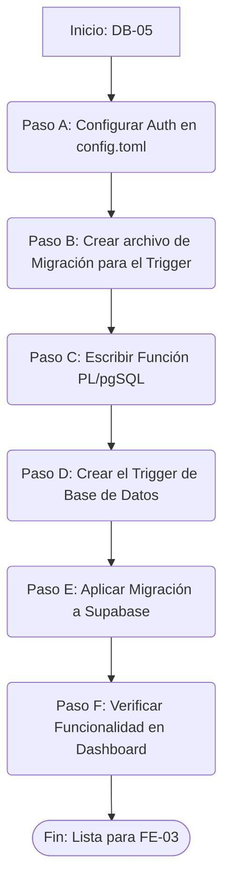

# DB-05 — Supabase Auth Configuración y Triggers Automáticos

**Bloque:** 🗄️ BLOQUE A: Base de Datos  
**Guía anterior:** [DB-04 — Row Level Security (RLS) Policies](file:///c:/Users/jsife/OneDrive/Desktop/Repositorios/practica-testing/docs/guides/db/DB-04.md)  
**Estado:** ✅ Completado  
**Fecha:** Junio 2026

---

## Sección 1: 🎓 Introducción y Fundamentos Conceptuales

¡Bienvenido a la última guía del bloque de Base de Datos! En **DB-04** construimos un muro de seguridad impenetrable usando Row Level Security (RLS). Sin embargo, ese muro depende de una pregunta clave: *¿quién es la persona que está intentando cruzar?*

Ahí es donde entra **Supabase Auth**. Es el sistema de identidad que valida a los usuarios mediante un email y contraseña, generando el JWT (JSON Web Token) que nuestras políticas RLS evalúan (`auth.uid()`).

Además de configurar el proveedor de autenticación, esta guía resolverá un problema clásico de arquitectura: **sincronización de perfiles**. Cuando un usuario se registra, Supabase lo guarda en su esquema interno (`auth.users`), pero nosotros necesitamos tener un registro en nuestro esquema público (`public.user_profiles`) para asociarle información del negocio (como su nombre completo). En lugar de depender de que el frontend haga dos peticiones (registrar y luego crear el perfil), usaremos la potencia de PostgreSQL: un **Trigger de Base de Datos**. Un Trigger garantiza que *siempre* que se cree un usuario, la base de datos automáticamente creará su perfil asociado, asegurando la integridad referencial al 100%.

---

## Sección 2: 📋 Prerequisitos y Verificación del Entorno

Antes de comenzar, asegúrate de cumplir con los siguientes requisitos:

| Herramienta / Entregable | Comando de Verificación | Resultado Esperado |
| :--- | :--- | :--- |
| **Supabase CLI** | `supabase --version` | Versión `1.x.x` o superior. |
| **Proyecto Supabase** | `supabase status` | Proyecto local corriendo (opcional) o enlazado al remoto. |
| **Tablas Creadas (DB-02)** | Revisar Supabase Studio | Tabla `user_profiles` debe existir. |
| **RLS Configurado (DB-04)** | Revisar Supabase Studio | Políticas RLS habilitadas en `user_profiles`. |

**Credenciales Previas:**
Las URL de redirección en esta guía asumirán que tu frontend se ejecutará en `http://localhost:3000`.

---

## Sección 3: 📂 Estructura de Directorios del Proyecto

Después de completar esta guía, la estructura de tu directorio `supabase` se verá de la siguiente manera. El archivo marcado con `← NUEVO` es el que crearás:

```text
practica-testing/
│
├── 📁 docs/guides/db/
│   ├── DB-01.md
│   ├── DB-02.md
│   ├── DB-03.md
│   ├── DB-04.md
│   └── DB-05.md                          ← NUEVO (esta guía)
│
└── 📁 supabase/
    ├── config.toml                       ← SE MODIFICA (Ajustes de Auth)
    └── 📁 migrations/
        ├── 20260522183543_remote_schema.sql
        ├── 20260531183745_create_schema.sql
        ├── 20260531221544_create_storage_bucket.sql
        ├── 20260601015125_create_rls_policies.sql
        └── 20260621223000_create_auth_trigger.sql ← NUEVO (Trigger de perfil)
```

---

## Sección 4: 🔄 Diagrama de Flujo del Proceso



---

## Sección 5: 🛠️ Implementación Paso a Paso

### Paso A — Configurar Supabase Auth (Local/Remoto)

Para configurar la autenticación en Supabase, ajustaremos las configuraciones de Auth en `config.toml` (para desarrollo local) y explicaremos cómo replicarlo en el Dashboard en la nube.

**Archivo a modificar:** `supabase/config.toml`
**Ruta completa:** `c:\Users\jsife\OneDrive\Desktop\Repositorios\practica-testing\supabase\config.toml`

Abre el archivo `config.toml` y asegúrate de que la sección de `[auth]` tenga habilitado el proveedor de email y la URL de redirección local (normalmente ya viene configurada por defecto para `localhost:3000`).

```toml
# Busca la sección [auth] y asegúrate de que las redirecciones incluyan localhost:3000
[auth]
site_url = "http://localhost:3000"
additional_redirect_urls = ["https://localhost:3000"]
jwt_expiry = 3600
enable_refresh_token_rotation = true
refresh_token_reuse_interval = 10
enable_signup = true

[auth.email]
enable_signup = true
double_confirm_changes = true
enable_confirmations = false # Opcional: Ponlo en false en dev para no requerir validar email
```

> [!NOTE]
> En producción (desde el Supabase Dashboard en la web), deberás ir a **Authentication > URL Configuration** y asegurarte de agregar la URL de tu frontend en Vercel como `Site URL` y como `Redirect URL`.

### Paso B — Crear la migración del Trigger

Necesitamos crear una migración que contenga la lógica para insertar un registro en `user_profiles` automáticamente cuando un usuario se registra.

Abre PowerShell en la raíz de tu proyecto y ejecuta:

```powershell
supabase migration new create_auth_trigger
```

Esto generará un archivo vacío dentro de `supabase/migrations/` con un timestamp (ej: `20260621223000_create_auth_trigger.sql`).

### Paso C y D — Función PL/pgSQL y Trigger

Abre el archivo SQL recién creado y agrega el siguiente código.

**Archivo a modificar:** `supabase/migrations/<timestamp>_create_auth_trigger.sql`

```sql
-- ============================================================
-- MIGRACIÓN: Creación de Función y Trigger para Perfiles
-- Guía: DB-05
-- Descripción: Crea una función que inserta automáticamente en
--              public.user_profiles cuando un nuevo usuario se
--              registra en auth.users.
-- ============================================================

-- 1. Crear la función del Trigger en PL/pgSQL
-- SECURITY DEFINER asegura que la función tenga permisos para
-- bypassear el RLS (necesario ya que el usuario aún no está del
-- todo autenticado cuando se ejecuta).
CREATE OR REPLACE FUNCTION public.handle_new_user()
RETURNS trigger AS $$
BEGIN
  INSERT INTO public.user_profiles (id, full_name)
  VALUES (
    new.id,
    -- Extraemos el 'full_name' si se proporciona en los raw_user_meta_data
    -- durante el registro en el frontend. Si no, quedará nulo.
    new.raw_user_meta_data->>'full_name'
  );
  RETURN new;
END;
$$ LANGUAGE plpgsql SECURITY DEFINER;

-- 2. Crear el Trigger
-- Se ejecutará DESPUÉS (AFTER) de cada INSERT en el esquema auth.users
CREATE TRIGGER on_auth_user_created
  AFTER INSERT ON auth.users
  FOR EACH ROW EXECUTE PROCEDURE public.handle_new_user();

-- Comentario de documentación
COMMENT ON FUNCTION public.handle_new_user IS 'Trigger automático: crea un perfil público al registrarse un usuario.';
```

**Explicación Pedagógica:**
*   `NEW`: Es una variable especial en PL/pgSQL que contiene el registro que se acaba de insertar. `new.id` es el UUID generado por Supabase.
*   `SECURITY DEFINER`: Es vital. Como nuestra tabla `user_profiles` tiene RLS (Row Level Security), un usuario anónimo (o en proceso de creación) no tendría permisos para hacer un `INSERT`. `SECURITY DEFINER` le dice a la base de datos que ejecute esta función con los privilegios del creador de la función (el administrador), bypasseando el RLS temporalmente solo para esta acción específica.

### Paso E — Aplicar la Migración

Con el archivo SQL guardado, vamos a aplicar los cambios a tu proyecto de Supabase.

Ejecuta en tu terminal PowerShell:

```powershell
supabase db push
```

**Salida Esperada:**
```
Applying migration 20260621223000_create_auth_trigger.sql...
Success!
```

---

## Sección 6: ✅ Checkpoints de Verificación

Validemos que el trigger y la autenticación funcionen correctamente utilizando Supabase Studio (el panel de control).

1.  Abre el **Supabase Dashboard** en la web (o localmente con `supabase start` y accediendo a `http://localhost:54323`).
2.  Ve a **Authentication > Users**.
3.  Haz clic en **Add User > Create New User**.
4.  Crea un usuario con un email de prueba (ej. `test@example.com`) y una contraseña (`password123`). Quita la opción de "Auto Confirm User?" si lo deseas para probar el flujo completo, o déjala para ir rápido.
5.  Una vez creado, navega a **Table Editor > `user_profiles`**.
6.  ✅ **ÉXITO:** Deberías ver una nueva fila en `user_profiles` con el mismo ID que el usuario que acabas de crear. ¡El trigger funcionó perfectamente!

**Checklist de Entregables:**
```text
✅ Configuración de Auth (Site URL y Providers) lista.
✅ Migración `..._create_auth_trigger.sql` generada y guardada.
✅ Función `handle_new_user()` y Trigger creados en base de datos.
✅ Prueba de registro exitosa: el perfil se crea automáticamente.
```

---

## Sección 7: 🚨 Troubleshooting — Problemas Comunes

| Problema | Causa Probable | Solución |
| :--- | :--- | :--- |
| **El registro de Auth tiene éxito, pero la tabla `user_profiles` está vacía.** | Falla en los permisos del Trigger por RLS. | Asegúrate de haber incluido `SECURITY DEFINER` al final de la definición de la función `handle_new_user()`. Si no, el RLS bloquea el INSERT. |
| **Error `auth.users` no existe al correr la migración.** | La base de datos local está desincronizada. | Asegúrate de no haber borrado schemas del sistema. Ejecuta `supabase db reset` localmente si estás en desarrollo para rehacer todo limpio. |
| **Recibo un error de permisos al ejecutar `supabase db push`.** | El token o el link expiró. | Ejecuta `supabase login` para renovar tu token y luego asegúrate de estar enlazado con `supabase link --project-ref [TU_PROJECT_REF]`. |
| **El `raw_user_meta_data` no guarda el nombre.** | El frontend no está enviando el payload correcto. | Esto lo resolveremos en FE-03. Al llamar a `supabase.auth.signUp()`, debemos pasar un objeto `options.data` que contenga la propiedad `full_name`. |

---

## Sección 8: 📝 Resumen y Próximo Paso

¡Felicidades! Has completado el **Bloque A: Base de Datos** del ISTQB Study Agent.

**Resumen de lo logrado hoy:**
1.  Verificaste la configuración del proveedor de Email/Contraseña en Supabase.
2.  Escribiste una función en PL/pgSQL y la conectaste a un Trigger de base de datos.
3.  Garantizaste la integridad referencial: ¡ningún usuario existirá en el sistema sin su perfil correspondiente en la tabla pública!

**Valida tu progreso:**
Abre una nueva solicitud y escribe: `"Valida mi progreso de la guía DB-05 en su sección 6"`. Nuestro tester validará el trigger.

**Próximo Paso:**
¡La base de datos está oficialmente terminada para los requerimientos iniciales! Tu siguiente hito será volver al frontend para implementar la interfaz de registro, login y protección de rutas. 
**Puedes volver a ejecutar `/istqb-fe-guide-generator`** y avanzaremos triunfantes a la guía **FE-03**.
