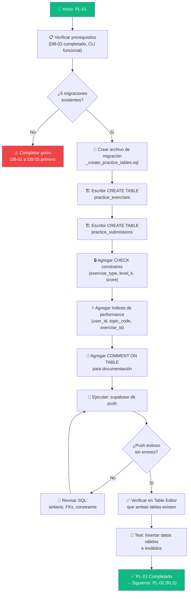

# Guía Didáctica PL-01: Schema — Tablas del QA Practice Lab

---

## Sección 1: 🎓 Introducción y Fundamentos Conceptuales

### Recapitulación: ¿Dónde estamos?

Has completado **34 guías** a lo largo de 6 bloques (A–F). Tu aplicación ISTQB Study Agent tiene:

- **6 tablas** funcionando con CHECK constraints, índices y RLS (`user_profiles`, `documents`, `study_plans`, `sessions`, `answers`, `topic_progress`).
- **5 migraciones** aplicadas exitosamente en Supabase.
- Un pipeline completo: subir PDF → detectar tópicos → generar plan → sesiones de teoría + quiz → sistema adaptativo → dashboard con métricas.

Todo eso cubre la **teoría ISTQB**. Pero un QA profesional no solo sabe teoría — necesita **practicar**. Y eso es exactamente lo que vamos a construir: las tablas de base de datos que sostendrán el **QA Practice Lab** (Bloque H).

### ¿Por qué necesitamos tablas nuevas?

La tabla `answers` guarda respuestas de quiz (opción múltiple A/B/C/D). Pero los ejercicios prácticos son fundamentalmente diferentes:

```
┌───────────────────────────────────────────────────────────────────────┐
│                 QUIZ (lo que ya tienes)                                │
│                                                                       │
│  Pregunta: "¿Qué es Equivalence Partitioning?"                       │
│  Respuesta: (a) (b) (c) (d) ← una sola opción                       │
│  Evaluación: is_correct = true/false                                  │
│  Almacenamiento: tabla answers, 1 fila por pregunta                   │
├───────────────────────────────────────────────────────────────────────┤
│                 PRÁCTICA (lo que vas a construir)                      │
│                                                                       │
│  Escenario: "Una app acepta edades entre 18 y 65 años."              │
│  Respuesta: tabla editable con 5+ casos de prueba ← estructura libre │
│  Evaluación: score + feedback detallado por criterios                 │
│  Almacenamiento: JSONB flexible (scenarios, submissions, feedback)    │
└───────────────────────────────────────────────────────────────────────┘
```

Los quizzes son **cerrados** (4 opciones). Las prácticas son **abiertas** (el usuario redacta). Eso requiere un modelo de datos distinto: **JSONB** para almacenar estructuras flexibles (tablas de test cases, formularios de bug reports, checklists de API testing).

### Analogía: El laboratorio de pruebas de un hospital

En DB-02 usamos la analogía del hospital. Las tablas existentes son como el **archivo médico**: fichas, citas, resultados de análisis. Las tablas nuevas del Practice Lab son como el **laboratorio de prácticas** donde los residentes médicos practican procedimientos reales:

- **`practice_exercises`** → Los **casos clínicos** preparados por el instructor. Cada caso tiene un escenario (paciente con síntomas), una tarea ("diagnostica"), y una solución de referencia.
- **`practice_submissions`** → Los **reportes del residente**. Lo que el estudiante escribió, el score que obtuvo, y el feedback del instructor.

El laboratorio es **independiente** del archivo médico — un residente puede practicar sin tener pacientes reales asignados. Pero ambos sistemas comparten la misma infraestructura del hospital (usuarios, autenticación, permisos). Exactamente así funcionarán nuestras tablas nuevas con las existentes.

---

## Sección 2: 📋 Prerequisitos y Verificación del Entorno

Antes de escribir una sola línea de SQL, verifica que tienes todo lo necesario.

### Herramientas requeridas

| Herramienta | Comando de verificación | Versión mínima |
|:---|:---|:---|
| Node.js | `node --version` | v18.0.0+ |
| Supabase CLI | `npx supabase --version` | 1.100.0+ |
| Git | `git --version` | 2.40+ |

### Verificaciones en PowerShell

```powershell
# 1. Node.js instalado
node --version
# Esperado: v18.x.x o superior

# 2. Supabase CLI disponible
npx supabase --version
# Esperado: 1.1xx.x o superior

# 3. Proyecto vinculado a Supabase remoto
npx supabase projects list
# Esperado: tu proyecto aparece en la lista
```

### Entregables de guías anteriores que DEBEN existir

| Guía | Entregable | Verificación |
|:---|:---|:---|
| **DB-01** | Proyecto Supabase vinculado | `npx supabase projects list` muestra tu proyecto |
| **DB-02** | 6 tablas creadas | Las tablas son visibles en Supabase Table Editor |
| **DB-04** | RLS habilitado en todas las tablas | Policies activas en Authentication → Policies |
| **DA-05** | Bloque F completado | Dashboard funcional con métricas |

### Verificación rápida del estado actual

```powershell
# Verificar que las migraciones anteriores existen
Get-ChildItem -Path "supabase\migrations" -Name
```

Resultado esperado:
```
20260522183543_remote_schema.sql
20260531183745_create_schema.sql
20260531221544_create_storage_bucket.sql
20260601015125_create_rls_policies.sql
20260621224042_create_auth_trigger.sql
```

Si ves estos 5 archivos, estás listo para continuar. ✅

---

## Sección 3: 📂 Estructura de Directorios del Proyecto

```
practica-testing/
├── .env.example                          ← (existente)
├── .env.local                            ← (existente, excluido de Git)
├── .gitignore                            ← (existente)
│
├── backend/                              ← (existente — FastAPI)
│   ├── app/
│   │   ├── main.py
│   │   ├── routers/
│   │   │   ├── health.py
│   │   │   └── pdf.py
│   │   ├── services/
│   │   │   ├── extractor.py
│   │   │   ├── pdf_extractor.py
│   │   │   └── topic_detector.py
│   │   └── models/
│   │       └── schemas.py
│   ├── tests/
│   ├── requirements.txt
│   └── Dockerfile
│
├── frontend/                             ← (existente — Next.js)
│   ├── app/
│   │   ├── (auth)/
│   │   ├── (dashboard)/
│   │   │   ├── dashboard/
│   │   │   ├── plan/
│   │   │   ├── session/
│   │   │   └── setup/
│   │   └── api/
│   ├── components/
│   ├── lib/
│   └── types/
│
├── supabase/                             ← (existente — Supabase)
│   ├── config.toml
│   └── migrations/
│       ├── 20260522183543_remote_schema.sql
│       ├── 20260531183745_create_schema.sql
│       ├── 20260531221544_create_storage_bucket.sql
│       ├── 20260601015125_create_rls_policies.sql
│       ├── 20260621224042_create_auth_trigger.sql
│       └── YYYYMMDDHHMMSS_create_practice_tables.sql   ← 🆕 NUEVO EN ESTA GUÍA
│
└── docs/
    ├── guides/
    │   ├── db/
    │   │   ├── DB-01.md ... DB-05.md
    │   │   └── PL-01.md                  ← 🆕 ESTA GUÍA
    │   ├── be/
    │   └── fe/
    └── roadmap/
        └── ISTQB_Guias_Implementacion.md ← (actualizado con Bloque H)
```

> **Nota:** El nombre del archivo de migración incluirá un timestamp automático. En esta guía usaremos `YYYYMMDDHHMMSS_create_practice_tables.sql` como referencia. El timestamp real se generará al crear la migración.

---

## Sección 4: 🔄 Diagrama de Flujo del Proceso



---

## Sección 5: 🛠️ Implementación Paso a Paso

### Paso A: Crear el archivo de migración

Desde la raíz del proyecto, ejecuta:

```powershell
npx supabase migration new create_practice_tables
```

Resultado esperado:
```
Created new migration at supabase\migrations\20260706224700_create_practice_tables.sql
```

> **Nota:** El timestamp será diferente en tu caso. Lo importante es que se cree el archivo vacío en `supabase/migrations/`.

**Entregable del Paso A:**
- ✅ Archivo `supabase/migrations/YYYYMMDDHHMMSS_create_practice_tables.sql` creado (vacío).

---

### Paso B: Escribir la tabla `practice_exercises`

Abre el archivo de migración que acabas de crear y escribe el siguiente SQL:

**Archivo:** `supabase/migrations/YYYYMMDDHHMMSS_create_practice_tables.sql`

```sql
-- ============================================================
-- MIGRACIÓN: Tablas del QA Practice Lab
-- Guía: PL-01
-- Descripción: Crea las tablas practice_exercises y
--              practice_submissions para ejercicios prácticos
--              de testing (casos de prueba, bug reports, etc.).
-- ============================================================

-- ──────────────────────────────────────────────────────────────
-- TABLA 7: practice_exercises
-- Propósito: Almacena los ejercicios prácticos generados por la IA
--            para cada tópico ISTQB. Cada ejercicio incluye un
--            escenario, una tarea, y una solución de referencia.
--
-- ¿Por qué JSONB para scenario_json y solution_json?
--   Los ejercicios tienen estructuras variables según el tipo:
--   - test_cases: { scenario, input_range, expected_partitions }
--   - bug_report: { user_story, business_rule, observed_bug }
--   - api_testing: { endpoint, validations[], expected_responses }
--   - exploratory: { charter, scope, heuristics[] }
--   JSONB permite almacenar cualquiera de estas estructuras
--   sin necesidad de tablas separadas para cada tipo.
--
-- ¿Por qué document_id?
--   Un usuario podría subir múltiples PDFs (ej. ISTQB CTFL v4.0
--   y luego ISTQB CTAL). Sin document_id, los ejercicios de
--   FL-4.2.1 de un PDF se mezclarían con los del otro.
--   document_id permite filtrar prácticas por certificación.
--
-- ¿Por qué study_plan_id es opcional (nullable)?
--   El usuario puede practicar sin tener un plan activo.
--   Por ejemplo, si ya completó su plan pero quiere seguir
--   practicando tópicos débiles. Cuando SÍ hay plan activo,
--   este vínculo permite correlacionar prácticas con sesiones.
--
-- CONSTRAINTS DE NEGOCIO:
--   - exercise_type: solo 4 tipos válidos
--   - level_k: solo K1, K2 o K3
--   - attempt_number: >= 1 (primer intento = 1)
--
-- CONSTRAINT DE OWNERSHIP CRUZADO:
--   UNIQUE (id, user_id) permite que practice_submissions
--   use una FK compuesta (exercise_id, user_id) apuntando aquí.
--   Esto garantiza a nivel de DB que un usuario NO pueda crear
--   submissions para ejercicios de otro usuario, incluso si
--   RLS falla o se desactiva temporalmente.
-- ──────────────────────────────────────────────────────────────
CREATE TABLE public.practice_exercises (
  -- Identificador único generado automáticamente.
  id              UUID PRIMARY KEY DEFAULT gen_random_uuid(),

  -- ¿De quién es este ejercicio?
  -- ON DELETE CASCADE: si se borra el usuario, se borran sus ejercicios.
  user_id         UUID NOT NULL REFERENCES auth.users(id) ON DELETE CASCADE,

  -- ¿De qué documento/PDF provienen los tópicos?
  -- ON DELETE CASCADE: si se borra el documento, se borran sus ejercicios.
  -- Esto vincula la práctica con la certificación específica
  -- (ej. ISTQB CTFL v4.0) y evita ambigüedad entre PDFs con
  -- códigos de tópico similares.
  document_id     UUID NOT NULL REFERENCES public.documents(id) ON DELETE CASCADE,

  -- ¿A qué plan de estudio pertenece esta práctica? (OPCIONAL)
  -- NULL si el usuario practica sin plan activo.
  -- ON DELETE SET NULL: si se borra el plan, la práctica queda
  -- huérfana pero no se pierde — el usuario puede seguir viéndola.
  study_plan_id   UUID REFERENCES public.study_plans(id) ON DELETE SET NULL,

  -- Código del tópico ISTQB asociado (ej. "FL-4.2.1").
  -- Permite agrupar ejercicios por tópico y vincularlos con topic_progress.
  topic_code      TEXT NOT NULL,

  -- Nivel cognitivo del ejercicio (K1=recordar, K2=comprender, K3=aplicar).
  -- Determina la complejidad y tipo de tarea generada.
  level_k         TEXT NOT NULL,

  -- Tipo de ejercicio práctico.
  -- Cada tipo tiene una estructura de escenario y evaluación diferente.
  exercise_type   TEXT NOT NULL,

  -- Número de intento/generación para este tópico+tipo.
  -- Primer ejercicio = 1, segundo = 2, etc.
  -- Permite rastrear cuántas veces se ha generado un ejercicio
  -- para el mismo tópico, y al prompt de IA le sirve para
  -- producir escenarios diferentes en cada regeneración.
  attempt_number  INTEGER NOT NULL DEFAULT 1,

  -- Escenario y tarea del ejercicio en formato JSONB.
  -- Generado por la IA (Gemini) a partir del tópico y nivel K.
  -- Estructura típica:
  --   {
  --     "scenario": "Una app permite registrar usuarios de 18 a 65 años.",
  --     "task_description": "Define particiones válidas e inválidas.",
  --     "constraints": ["Mínimo 5 casos de prueba", "Incluir positivos y negativos"],
  --     "evaluation_criteria": ["Cobertura de particiones", "Valores límite"]
  --   }
  scenario_json   JSONB NOT NULL,

  -- Solución de referencia generada por la IA.
  -- Se muestra al usuario DESPUÉS de enviar su respuesta.
  -- NULL si la solución aún no ha sido generada.
  -- Estructura típica:
  --   {
  --     "model_test_cases": [...],
  --     "explanation": "Se identificaron 3 particiones: ...",
  --     "key_points": ["Valor límite inferior: 18", "Valor límite superior: 65"]
  --   }
  solution_json   JSONB,

  -- Fecha de creación del ejercicio.
  created_at      TIMESTAMPTZ DEFAULT NOW(),

  -- ═══════════════════════════════════════════════════════════
  -- CONSTRAINTS (Reglas de negocio grabadas en piedra):
  -- ═══════════════════════════════════════════════════════════

  -- Regla 1: Solo 4 tipos de ejercicio válidos.
  -- ¿Por qué? Cada tipo tiene un flujo de UI y evaluación diferente.
  -- Si el frontend envía un tipo inventado, PostgreSQL lo rechaza.
  CONSTRAINT practice_exercises_type_chk
    CHECK (exercise_type IN ('test_cases', 'bug_report', 'api_testing', 'exploratory')),

  -- Regla 2: Solo niveles K válidos del ISTQB.
  -- Coherente con el constraint de topic_progress y answers.
  CONSTRAINT practice_exercises_level_k_chk
    CHECK (level_k IN ('K1', 'K2', 'K3')),

  -- Regla 3: El número de intento siempre es >= 1.
  -- Evita valores absurdos como 0 o negativos.
  CONSTRAINT practice_exercises_attempt_chk
    CHECK (attempt_number >= 1)
);

-- ═══════════════════════════════════════════════════════════
-- CONSTRAINT ÚNICO PARA OWNERSHIP CRUZADO
-- ═══════════════════════════════════════════════════════════
-- ¿Por qué UNIQUE (id, user_id) si id ya es PRIMARY KEY?
--
-- Porque la tabla practice_submissions necesita una FK COMPUESTA
-- (exercise_id, user_id) que apunte aquí. PostgreSQL requiere
-- que el target de una FK compuesta tenga un UNIQUE o PK
-- sobre esas mismas columnas.
--
-- Esto garantiza que un usuario NO pueda crear submissions
-- para ejercicios de otro usuario, incluso sin RLS.
-- Es una defensa en profundidad (defense-in-depth).
-- ═══════════════════════════════════════════════════════════
ALTER TABLE public.practice_exercises
  ADD CONSTRAINT practice_exercises_id_user_unique
  UNIQUE (id, user_id);

-- Documentación de la tabla para Supabase Studio.
COMMENT ON TABLE public.practice_exercises IS
  'Ejercicios prácticos de QA generados por IA, vinculados a tópicos ISTQB por código FL-x.x.x y documento fuente.';
```

**Entregable del Paso B:**
- ✅ Tabla `practice_exercises` definida con 11 columnas, 3 CHECK constraints, UNIQUE (id, user_id) y COMMENT.

---

### Paso C: Escribir la tabla `practice_submissions`

Continúa escribiendo en el **mismo archivo de migración**, debajo de la tabla anterior:

```sql
-- ──────────────────────────────────────────────────────────────
-- TABLA 8: practice_submissions
-- Propósito: Almacena cada intento de respuesta del usuario a un
--            ejercicio práctico. Incluye lo que escribió, el score
--            obtenido, y el feedback detallado de la IA.
--
-- RELACIÓN CON practice_exercises:
--   Cada submission pertenece a UN ejercicio (FK exercise_id).
--   Un ejercicio puede tener MÚLTIPLES submissions (reintentos).
--   ON DELETE CASCADE: si se borra el ejercicio, se borran sus submissions.
--
-- FK COMPUESTA (exercise_id, user_id):
--   ¿Por qué no solo exercise_id?
--   Porque con una FK simple, un usuario malicioso podría
--   insertar una submission con el exercise_id de OTRO usuario.
--   RLS lo bloquearía normalmente, pero si RLS se desactiva
--   (ej. por error del admin, o en un test), la FK compuesta
--   sigue protegiendo la integridad.
--   Es como tener DOS cerraduras en tu puerta:
--   - RLS = cerradura principal (software)
--   - FK compuesta = cerrojo físico (hardware/DB)
--
-- ¿Por qué JSONB para submission_json y feedback_json?
--   - submission_json: contiene la tabla de test cases que el usuario
--     redactó, o el bug report completo. La estructura varía según
--     exercise_type del ejercicio padre.
--   - feedback_json: contiene el análisis detallado de la IA con
--     criterios evaluados, casos faltantes, fortalezas y mejoras.
--     Estructura variable según el tipo de evaluación.
--
-- CONSTRAINTS DE NEGOCIO:
--   - score_percent: NULL (aún no evaluado) o entre 0 y 100
-- ──────────────────────────────────────────────────────────────
CREATE TABLE public.practice_submissions (
  -- Identificador único generado automáticamente.
  id              UUID PRIMARY KEY DEFAULT gen_random_uuid(),

  -- ¿Quién envió esta respuesta?
  -- ON DELETE CASCADE: si se borra el usuario, se borran sus submissions.
  -- Desnormalizado desde practice_exercises.user_id para:
  --   1. RLS directo sin necesidad de JOINs (mismo patrón que sessions.user_id)
  --   2. FK compuesta que protege ownership cruzado (ver abajo)
  user_id         UUID NOT NULL REFERENCES auth.users(id) ON DELETE CASCADE,

  -- ¿A qué ejercicio responde?
  -- NOTA: exercise_id NO tiene FK simple aquí.
  -- La FK real es COMPUESTA y se define con ALTER TABLE más abajo.
  exercise_id     UUID NOT NULL,

  -- Lo que el usuario escribió/redactó en formato JSONB.
  -- Para test_cases:
  --   {
  --     "test_cases": [
  --       { "id": "TC-001", "scenario": "Edad mínima válida", "test_data": "18",
  --         "expected_result": "Registro permitido", "type": "positive" },
  --       ...
  --     ]
  --   }
  -- Para bug_report:
  --   {
  --     "title": "Campo edad acepta valores menores a 18",
  --     "preconditions": "Usuario en página de registro",
  --     "steps": ["1. Ingresar edad 17", "2. Click en Registrar"],
  --     "actual_result": "El sistema permite el registro",
  --     "expected_result": "El sistema muestra error de validación",
  --     "severity": "high",
  --     "priority": "medium"
  --   }
  submission_json JSONB NOT NULL,

  -- Score obtenido en la evaluación (0-100).
  -- NULL si la submission aún no ha sido evaluada por la IA.
  score_percent   NUMERIC(5,2),

  -- Feedback detallado de la IA en formato JSONB.
  -- NULL si aún no se ha evaluado.
  -- Estructura típica:
  --   {
  --     "feedback_summary": "Buena cobertura pero faltaron valores límite.",
  --     "criteria_results": [
  --       { "criterion": "Cobertura de particiones", "passed": true, "detail": "..." },
  --       { "criterion": "Valores límite", "passed": false, "detail": "Faltó 17 y 66" }
  --     ],
  --     "missing_cases": ["Valor límite inferior -1 (17)", "Texto no numérico"],
  --     "strengths": ["Buenos nombres de escenario", "Tipos bien clasificados"],
  --     "improvements": ["Agregar caso de valor no numérico", "Considerar campo vacío"],
  --     "model_answer": { ... }
  --   }
  feedback_json   JSONB,

  -- Fecha y hora en que el usuario envió su respuesta.
  submitted_at    TIMESTAMPTZ DEFAULT NOW(),

  -- ═══════════════════════════════════════════════════════════
  -- CONSTRAINTS:
  -- ═══════════════════════════════════════════════════════════

  -- Regla: El score puede ser NULL (no evaluado aún)
  -- pero si existe, debe estar entre 0 y 100.
  -- Coherente con sessions.score_percent y topic_progress.best_score.
  CONSTRAINT practice_submissions_score_chk
    CHECK (score_percent IS NULL OR score_percent BETWEEN 0 AND 100)
);

-- ═══════════════════════════════════════════════════════════
-- FK COMPUESTA: PROTECCIÓN DE OWNERSHIP CRUZADO
-- ═══════════════════════════════════════════════════════════
-- Esta FK apunta al UNIQUE (id, user_id) de practice_exercises.
-- PostgreSQL garantiza que:
--   1. El exercise_id existe en practice_exercises
--   2. El user_id de la submission coincide con el user_id
--      del ejercicio padre
--
-- Si un usuario intenta insertar una submission con un
-- exercise_id que pertenece a otro usuario, PostgreSQL
-- rechaza el INSERT con un error de FK violation.
--
-- ON DELETE CASCADE: si se borra el ejercicio, las
-- submissions se borran automáticamente.
-- ═══════════════════════════════════════════════════════════
ALTER TABLE public.practice_submissions
  ADD CONSTRAINT practice_submissions_exercise_user_fk
  FOREIGN KEY (exercise_id, user_id)
  REFERENCES public.practice_exercises(id, user_id)
  ON DELETE CASCADE;

-- Documentación de la tabla para Supabase Studio.
COMMENT ON TABLE public.practice_submissions IS
  'Respuestas del usuario a ejercicios prácticos, con score y feedback de la IA. FK compuesta protege ownership.';
```

**Entregable del Paso C:**
- ✅ Tabla `practice_submissions` definida con 7 columnas, 1 CHECK constraint, FK compuesta (exercise_id, user_id) → practice_exercises(id, user_id) y COMMENT.

---

### Paso D: Agregar los índices de performance

Continúa escribiendo en el **mismo archivo de migración**, debajo de las tablas:

```sql
-- ══════════════════════════════════════════════════════════════
-- ÍNDICES DE PERFORMANCE — PRACTICE LAB
-- ══════════════════════════════════════════════════════════════
-- Estos índices optimizan las consultas más frecuentes del
-- Practice Lab. Siguen el mismo patrón de nomenclatura que
-- los índices de DB-02 (idx_tabla_columnas).
-- ══════════════════════════════════════════════════════════════

-- Índice 5: Buscar ejercicios de un usuario por tópico.
-- Caso de uso: "Dame todos los ejercicios del usuario X para FL-4.2.1"
-- Consulta típica:
--   SELECT * FROM practice_exercises
--   WHERE user_id = $1 AND topic_code = $2
-- Este es el query más frecuente: cuando el usuario entra a
-- /practice/FL-4.2.1, necesitamos cargar sus ejercicios previos.
CREATE INDEX idx_practice_exercises_user_topic
  ON public.practice_exercises(user_id, topic_code);

-- Índice 6: Buscar ejercicios de un usuario por tipo.
-- Caso de uso: "Cuántos ejercicios de tipo bug_report tiene el usuario X"
-- Consulta típica:
--   SELECT COUNT(*) FROM practice_exercises
--   WHERE user_id = $1 AND exercise_type = $2
-- Usado por el Hub de prácticas (/practice) para los contadores.
CREATE INDEX idx_practice_exercises_user_type
  ON public.practice_exercises(user_id, exercise_type);

-- Índice 7: Buscar ejercicios por documento.
-- Caso de uso: "Dame todos los ejercicios del documento X"
-- Consulta típica:
--   SELECT * FROM practice_exercises
--   WHERE document_id = $1
-- Necesario para filtrar prácticas por PDF/certificación.
-- También útil para ON DELETE CASCADE performance.
CREATE INDEX idx_practice_exercises_document
  ON public.practice_exercises(document_id);

-- Índice 8: Buscar submissions por ejercicio.
-- Caso de uso: "Dame todos los intentos del ejercicio X"
-- Consulta típica:
--   SELECT * FROM practice_submissions
--   WHERE exercise_id = $1 ORDER BY submitted_at DESC
-- Necesario para mostrar el historial de intentos de un ejercicio.
CREATE INDEX idx_practice_submissions_exercise
  ON public.practice_submissions(exercise_id);

-- Índice 9: Buscar submissions de un usuario (para Dashboard).
-- Caso de uso: "Score promedio de práctica del usuario X"
-- Consulta típica:
--   SELECT AVG(score_percent) FROM practice_submissions
--   WHERE user_id = $1 AND score_percent IS NOT NULL
-- Usado por /api/dashboard/metrics para las métricas de práctica (PL-13).
CREATE INDEX idx_practice_submissions_user
  ON public.practice_submissions(user_id);
```

**Entregable del Paso D:**
- ✅ 5 índices de performance creados siguiendo la convención `idx_tabla_columnas`.

---

### Paso E: Verificación visual del archivo completo

Tu archivo de migración debería tener esta estructura general:

```
supabase/migrations/YYYYMMDDHHMMSS_create_practice_tables.sql
├── Header con metadata (guía PL-01, descripción)
├── CREATE TABLE practice_exercises (11 columnas + 3 constraints)
├── ALTER TABLE practice_exercises ADD UNIQUE (id, user_id)
├── COMMENT ON TABLE practice_exercises
├── CREATE TABLE practice_submissions (7 columnas + 1 constraint)
├── ALTER TABLE practice_submissions ADD FK compuesta (exercise_id, user_id)
├── COMMENT ON TABLE practice_submissions
└── 5 índices CREATE INDEX
```

Verifica que el archivo tiene aproximadamente **250-280 líneas** de SQL (incluyendo comentarios educativos).

**Entregable del Paso E:**
- ✅ Archivo de migración completo con tablas, constraints, comments e índices.

---

## Sección 6: ✅ Checkpoints de Verificación

### Checkpoint 1: Aplicar la migración a Supabase remoto

```powershell
npx supabase db push
```

Resultado esperado:
```
Connecting to remote database...
Applying migration 20260706XXXXXX_create_practice_tables.sql...
Finished supabase db push.
```

> **⚠️ Si ves errores**, revisa la sección de Troubleshooting antes de continuar.

### Checkpoint 2: Verificar tablas en Supabase Table Editor

1. Abre tu proyecto en [Supabase Dashboard](https://supabase.com/dashboard).
2. Ve a **Table Editor** en el menú lateral.
3. Verifica que aparecen las nuevas tablas:
   - `practice_exercises`
   - `practice_submissions`

Deberías ver ahora **8 tablas** en total (6 originales + 2 nuevas).

### Checkpoint 3: Verificar CHECK constraints con datos válidos

En el **SQL Editor** de Supabase, ejecuta:

```sql
-- Primero, necesitamos un user_id real. Usa el tuyo:
-- (cópialo de Authentication → Users en el dashboard)

-- Test 1: Insertar ejercicio VÁLIDO
-- Nota: necesitas tu user_id Y un document_id real.
-- Copia tu user_id de Authentication → Users.
-- Copia un document_id de Table Editor → documents.
INSERT INTO public.practice_exercises (
  user_id, document_id, topic_code, level_k, exercise_type,
  attempt_number, scenario_json
)
VALUES (
  'TU_USER_ID_AQUÍ',     -- ← reemplaza con tu UUID real
  'TU_DOCUMENT_ID_AQUÍ', -- ← reemplaza con un document_id real
  'FL-4.2.1',
  'K3',
  'test_cases',
  1,
  '{"scenario": "App acepta edades 18-65", "task_description": "Crea 5 test cases"}'::jsonb
);
-- Esperado: INSERT 0 1 (éxito)

-- Test 2: Verificar que se insertó con todas las columnas nuevas
SELECT id, document_id, study_plan_id, topic_code, level_k,
       exercise_type, attempt_number
FROM public.practice_exercises;
-- Esperado: 1 fila, study_plan_id = NULL (es opcional), attempt_number = 1
```

### Checkpoint 4: Verificar CHECK constraints con datos INVÁLIDOS

```sql
-- Test 3: exercise_type inválido → DEBE FALLAR
INSERT INTO public.practice_exercises (
  user_id, document_id, topic_code, level_k, exercise_type, scenario_json
)
VALUES (
  'TU_USER_ID_AQUÍ', 'TU_DOCUMENT_ID_AQUÍ',
  'FL-4.2.1', 'K3',
  'invalid_type',   -- ← tipo inválido
  '{"scenario": "test"}'::jsonb
);
-- Esperado: ERROR: new row violates check constraint "practice_exercises_type_chk"

-- Test 4: level_k inválido → DEBE FALLAR
INSERT INTO public.practice_exercises (
  user_id, document_id, topic_code, level_k, exercise_type, scenario_json
)
VALUES (
  'TU_USER_ID_AQUÍ', 'TU_DOCUMENT_ID_AQUÍ',
  'FL-4.2.1',
  'K5',             -- ← nivel K inválido
  'test_cases',
  '{"scenario": "test"}'::jsonb
);
-- Esperado: ERROR: new row violates check constraint "practice_exercises_level_k_chk"

-- Test 5: attempt_number inválido → DEBE FALLAR
INSERT INTO public.practice_exercises (
  user_id, document_id, topic_code, level_k, exercise_type,
  attempt_number, scenario_json
)
VALUES (
  'TU_USER_ID_AQUÍ', 'TU_DOCUMENT_ID_AQUÍ',
  'FL-4.2.1', 'K3', 'test_cases',
  0,                -- ← attempt_number < 1
  '{"scenario": "test"}'::jsonb
);
-- Esperado: ERROR: new row violates check constraint "practice_exercises_attempt_chk"

-- Test 6: score fuera de rango → DEBE FALLAR
INSERT INTO public.practice_submissions (user_id, exercise_id, submission_json, score_percent)
VALUES (
  'TU_USER_ID_AQUÍ',
  (SELECT id FROM public.practice_exercises LIMIT 1),
  '{"test_cases": []}'::jsonb,
  150               -- ← score > 100
);
-- Esperado: ERROR: new row violates check constraint "practice_submissions_score_chk"

-- Test 7: FK compuesta — submission con exercise de OTRO usuario → DEBE FALLAR
-- (Solo puedes probar esto si tienes 2 usuarios registrados.
--  Si no, omítelo — RLS + FK compuesta lo cubren en producción.)
-- INSERT INTO public.practice_submissions (user_id, exercise_id, submission_json)
-- VALUES (
--   'OTRO_USER_ID',  -- ← usuario B
--   (SELECT id FROM public.practice_exercises WHERE user_id = 'TU_USER_ID_AQUÍ' LIMIT 1),
--   '{"test_cases": []}'::jsonb
-- );
-- Esperado: ERROR: insert or update violates foreign key constraint
--           "practice_submissions_exercise_user_fk"
```

### Checkpoint 5: Verificar FK CASCADE

```sql
-- Test 8: Insertar una submission válida
INSERT INTO public.practice_submissions (user_id, exercise_id, submission_json, score_percent)
VALUES (
  'TU_USER_ID_AQUÍ',
  (SELECT id FROM public.practice_exercises LIMIT 1),
  '{"test_cases": [{"id": "TC-001", "scenario": "Edad válida", "test_data": "25", "expected_result": "OK", "type": "positive"}]}'::jsonb,
  80.00
);
-- Esperado: INSERT 0 1

-- Test 9: Borrar el ejercicio → la submission debe desaparecer
DELETE FROM public.practice_exercises WHERE topic_code = 'FL-4.2.1';

-- Verificar que las submissions también se borraron (CASCADE)
SELECT COUNT(*) FROM public.practice_submissions;
-- Esperado: 0
```

### Checklist de entregables PL-01

```
✅ Archivo de migración creado: supabase/migrations/YYYYMMDDHHMMSS_create_practice_tables.sql
✅ Tabla practice_exercises con 11 columnas (incl. document_id, study_plan_id, attempt_number)
✅ Tabla practice_submissions con 7 columnas y FK compuesta
✅ 3 CHECK constraints en exercises (type, level_k, attempt_number) + 1 en submissions (score)
✅ UNIQUE (id, user_id) en practice_exercises para ownership cruzado
✅ FK compuesta (exercise_id, user_id) en practice_submissions
✅ 5 índices de performance creados (incl. document_id)
✅ COMMENT ON TABLE en ambas tablas
✅ supabase db push ejecutado sin errores
✅ Ambas tablas visibles en Table Editor (8 tablas total)
✅ CHECK constraints funcionan (exercise_type, level_k, attempt_number, score rechazados si son inválidos)
✅ FK compuesta impide crear submissions para ejercicios de otro usuario
✅ FK CASCADE funciona (borrar ejercicio borra submissions)
```

---

## Sección 7: 🚨 Troubleshooting — Problemas Comunes

| Problema | Causa Probable | Solución |
|:---|:---|:---|
| `ERROR: relation "auth.users" does not exist` | Ejecutando la migración en un entorno local sin Supabase Auth | Usa `npx supabase db push` para aplicar contra el proyecto **remoto**, no local. Las tablas de `auth.*` solo existen en el servidor de Supabase. |
| `ERROR: relation "practice_exercises" already exists` | Intentaste ejecutar `db push` dos veces sin limpiar | Borra las tablas manualmente desde SQL Editor (`DROP TABLE IF EXISTS public.practice_submissions; DROP TABLE IF EXISTS public.practice_exercises;`) y vuelve a ejecutar `db push`. |
| `ERROR: relation "documents" does not exist` | La migración de DB-02 no se aplicó o se borró | Verifica que la tabla `documents` existe en Table Editor. Si no, re-ejecuta `npx supabase db push` para aplicar todas las migraciones pendientes. |
| `ERROR: there is no unique constraint matching given keys for referenced table` | El UNIQUE (id, user_id) de practice_exercises falta o se escribió mal | Verifica que el `ALTER TABLE ... ADD CONSTRAINT practice_exercises_id_user_unique UNIQUE (id, user_id)` está ANTES del CREATE TABLE de practice_submissions. |
| `ERROR: insert or update violates foreign key constraint` al probar | El `user_id` que usaste no existe en `auth.users`, o intentaste crear una submission con un exercise de otro usuario | Copia tu UUID real desde Authentication → Users. Si la FK compuesta rechaza, es porque el user_id de la submission no coincide con el del ejercicio — eso es el comportamiento esperado. |
| `supabase db push` muestra `No changes detected` | El archivo de migración está vacío o no fue guardado | Abre el archivo y verifica que tiene contenido SQL. Guárdalo con `Ctrl+S` y vuelve a ejecutar. |
| Error de sintaxis SQL genérico | Falta una coma, paréntesis no cerrado, o keyword mal escrita | Revisa las líneas indicadas en el error. Los errores más comunes son: coma después del último campo antes de un CONSTRAINT, o paréntesis sin cerrar en el CHECK. |

---

## Sección 8: 📝 Resumen y Próximo Paso

### Lo que lograste en esta guía

1. Creaste un **archivo de migración** para el QA Practice Lab.
2. Definiste la tabla **`practice_exercises`** con **11 columnas** incluyendo `document_id` (vínculo al PDF fuente), `study_plan_id` (vínculo opcional al plan activo) y `attempt_number` (rastreo de regeneraciones).
3. Definiste la tabla **`practice_submissions`** con 7 columnas para almacenar las respuestas del usuario, scores y feedback detallado.
4. Implementaste **4 CHECK constraints** para garantizar integridad (exercise_type, level_k, attempt_number, score_percent).
5. Implementaste **protección de ownership cruzado** con `UNIQUE (id, user_id)` + FK compuesta `(exercise_id, user_id)`, garantizando que un usuario no pueda crear submissions para ejercicios de otro usuario incluso sin RLS.
6. Creaste **5 índices de performance** optimizados, incluyendo cobertura por `document_id` para consultas por certificación.
7. Verificaste que ambas tablas funcionan correctamente con datos válidos e inválidos.
8. Confirmaste que **FK CASCADE** borra submissions automáticamente al borrar un ejercicio.
9. Confirmaste que la **FK compuesta** rechaza submissions para ejercicios de otro usuario.

### Valida tu progreso

Cuando termines de implementar todo, puedes validar tu progreso diciéndome:

> *"Valida mi progreso de la guía PL-01 en su sección 6"*

### Próximo paso: PL-02 — RLS Policies para tablas de práctica

En la guía **PL-02** protegeremos las tablas que acabas de crear con **Row Level Security (RLS)**. Sin RLS, cualquier usuario autenticado podría ver los ejercicios y respuestas de otros usuarios. Aplicaremos el mismo patrón de policies que usamos en DB-04 (`user_id = auth.uid()`) para garantizar aislamiento total.

> **Recordatorio:** Para generar la guía PL-02, usa:
> `/istqb-db-guide-generator` → *"Genera la guía PL-02"*
