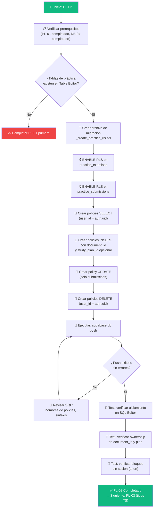

# Guía Didáctica PL-02: RLS Policies para Tablas de Práctica

> **Estado actual:** Implementado y verificado (12/07/2026). La migración RLS original y el addendum de privilegios por columna de `solution_json` están aplicados en remoto.

---

## Sección 1: 🎓 Introducción y Fundamentos Conceptuales

### Recapitulación: ¿Dónde estamos?

En la guía **PL-01** construiste los cimientos del QA Practice Lab:

- **Tabla `practice_exercises`** con 11 columnas, incluyendo `document_id` (vincula al PDF fuente), `study_plan_id` (vínculo opcional al plan), y `attempt_number` (rastreo de regeneraciones).
- **Tabla `practice_submissions`** con 7 columnas y FK compuesta `(exercise_id, user_id)` que protege ownership a nivel de DB.
- **4 CHECK constraints** (exercise_type, level_k, attempt_number, score_percent).
- **5 índices de performance**.

Las tablas están creadas, los constraints funcionan, los índices optimizan. Pero hay un problema **crítico**: **cualquier usuario autenticado puede ver y modificar los datos de cualquier otro usuario.**

### ¿Por qué es esto un problema real?

Imagina este escenario:

```
┌──────────────────────────────────────────────────────────────────┐
│  SIN RLS (estado actual de las tablas de práctica)               │
├──────────────────────────────────────────────────────────────────┤
│                                                                  │
│  Usuario A sube su PDF de ISTQB CTFL.                           │
│  Genera un ejercicio de Equivalence Partitioning.                │
│  Escribe su solución con 8 test cases.                          │
│                                                                  │
│  → Usuario B abre la consola del navegador.                      │
│  → Ejecuta: supabase.from('practice_exercises').select('*')     │
│  → VE los ejercicios de A, incluyendo solution_json.            │
│  → Peor: puede INSERTAR submissions contra los ejercicios de A. │
│                                                                  │
│  ¡Esto es una violación de privacidad y de integridad!          │
└──────────────────────────────────────────────────────────────────┘
```

### ¿Qué resuelve RLS?

**Row Level Security (RLS)** es un firewall a nivel de fila que PostgreSQL evalúa en **cada operación** (SELECT, INSERT, UPDATE, DELETE). Funciona así:

```
┌──────────────────────────────────────────────────────────────────┐
│  CON RLS (lo que construiremos en esta guía)                     │
├──────────────────────────────────────────────────────────────────┤
│                                                                  │
│  Cada query pasa por un filtro automático:                       │
│                                                                  │
│  SELECT * FROM practice_exercises                                │
│    → PostgreSQL agrega internamente: WHERE user_id = auth.uid() │
│    → Resultado: solo TUS ejercicios                              │
│                                                                  │
│  INSERT INTO practice_exercises (user_id, document_id, ...)      │
│    → PostgreSQL verifica: ¿user_id = auth.uid()?                │
│    → Si no coincide: ERROR (violación de política)              │
│                                                                  │
│  INSERT INTO practice_exercises (user_id, document_id, ...)      │
│    → PostgreSQL verifica: ¿document_id pertenece a auth.uid()? │
│    → Si el documento es de otro usuario: ERROR                   │
│                                                                  │
│  Si study_plan_id viene informado:                               │
│    → PostgreSQL verifica: ¿study_plan_id pertenece a auth.uid()?│
│    → Si el plan es de otro usuario: ERROR                        │
│                                                                  │
└──────────────────────────────────────────────────────────────────┘
```

### Analogía: El laboratorio con llaves de acceso

En PL-01 usamos la analogía del laboratorio de prácticas. Ahora imaginemos que el laboratorio tiene casilleros con llave:

- **RLS en `practice_exercises`** → Cada estudiante tiene su propio casillero con ejercicios. Solo puede abrir el suyo.
- **RLS en `practice_submissions`** → Las respuestas enviadas se guardan en un buzón personal. Solo el dueño puede leer las suyas.
- **Validación de ownership del documento y plan** → Para tomar un caso clínico del archivo, el sistema verifica que ese archivo te pertenece. Si además lo vinculas a un plan, ese plan también debe ser tuyo.
- **Validación de ownership cruzado** → Para enviar una respuesta a un ejercicio, el sistema verifica que ese ejercicio es tuyo. No puedes responder el examen de otro.

### Defensa en profundidad (Defense-in-Depth)

En PL-01 ya construimos una primera capa de protección:

| Capa | Mecanismo | Protege contra |
|:---|:---|:---|
| **Capa 1 (DB-level)** | FK compuesta `(exercise_id, user_id)` | Un INSERT directo con exercise de otro usuario |
| **Capa 2 (DB-level)** | RLS policies ← **ESTA GUÍA** | Cualquier operación CRUD no autorizada |
| **Capa 3 (App-level)** | API Routes con `getUser()` | Requests sin autenticación |

RLS es la capa más poderosa porque actúa dentro de PostgreSQL — no depende de que el frontend o la API Route hagan la validación correctamente.

---

## Sección 2: 📋 Prerequisitos y Verificación del Entorno

### Herramientas requeridas

| Herramienta | Comando de verificación | Versión mínima |
|:---|:---|:---|
| Node.js | `node --version` | v18.0.0+ |
| Supabase CLI | `npx supabase --version` | 1.100.0+ |
| Git | `git --version` | 2.40+ |

### Verificaciones en PowerShell

```powershell
# 1. Node.js instalado
node --version
# Esperado: v18.x.x o superior

# 2. Supabase CLI disponible
npx supabase --version
# Esperado: 1.1xx.x o superior

# 3. Proyecto vinculado
npx supabase projects list
# Esperado: tu proyecto aparece en la lista
```

### Entregables de guías anteriores que DEBEN existir

| Guía | Entregable | Verificación |
|:---|:---|:---|
| **PL-01** | Guía PL-01 completada | `docs/guides/db/PL-01.md` existe |
| **PL-01** | Tablas `practice_exercises` y `practice_submissions` | Visibles en Supabase Table Editor |
| **PL-01** | FK compuesta + UNIQUE constraint | `practice_exercises_id_user_unique` existe |
| **DB-04** | RLS habilitado en las 6 tablas originales | Policies activas en Authentication → Policies |
| **DB-04** | Guía DB-04 completada | `docs/guides/db/DB-04.md` existe |

### Verificación rápida del estado actual

```powershell
# Verificar que las migraciones existen (deben ser 6)
Get-ChildItem -Path "supabase\migrations" -Name
```

Resultado esperado:
```
20260522183543_remote_schema.sql
20260531183745_create_schema.sql
20260531221544_create_storage_bucket.sql
20260601015125_create_rls_policies.sql
20260621224042_create_auth_trigger.sql
YYYYMMDDHHMMSS_create_practice_tables.sql
```

Si ves estos 6 archivos, estás listo para continuar. ✅

---

## Sección 3: 📂 Estructura de Directorios del Proyecto

```
practica-testing/
├── .env.example                          ← (existente)
├── .env.local                            ← (existente, excluido de Git)
├── .gitignore                            ← (existente)
│
├── backend/                              ← (existente — FastAPI)
│   └── ...
│
├── frontend/                             ← (existente — Next.js)
│   └── ...
│
├── supabase/                             ← (existente — Supabase)
│   ├── config.toml
│   └── migrations/
│       ├── 20260522183543_remote_schema.sql
│       ├── 20260531183745_create_schema.sql
│       ├── 20260531221544_create_storage_bucket.sql
│       ├── 20260601015125_create_rls_policies.sql        ← RLS de tablas 1-6
│       ├── 20260621224042_create_auth_trigger.sql
│       ├── YYYYMMDDHHMMSS_create_practice_tables.sql     ← PL-01
│       └── YYYYMMDDHHMMSS_create_practice_rls.sql        ← 🆕 NUEVO EN ESTA GUÍA
│
└── docs/
    ├── guides/
    │   ├── db/
    │   │   ├── DB-01.md ... DB-05.md
    │   │   ├── PL-01.md
    │   │   └── PL-02.md                  ← 🆕 ESTA GUÍA
    │   ├── be/
    │   └── fe/
    └── roadmap/
        └── ISTQB_Guias_Implementacion.md
```

---

## Sección 4: 🔄 Diagrama de Flujo del Proceso



---

## Sección 5: 🛠️ Implementación Paso a Paso

### Paso A: Crear el archivo de migración

Desde la raíz del proyecto, ejecuta:

```powershell
npx supabase migration new create_practice_rls
```

Resultado esperado:
```
Created new migration at supabase\migrations\20260706235100_create_practice_rls.sql
```

> **Nota:** El timestamp será diferente en tu caso.

**Entregable del Paso A:**
- ✅ Archivo `supabase/migrations/YYYYMMDDHHMMSS_create_practice_rls.sql` creado (vacío).

---

### Paso B: Habilitar RLS en ambas tablas

Abre el archivo de migración y escribe:

**Archivo:** `supabase/migrations/YYYYMMDDHHMMSS_create_practice_rls.sql`

```sql
-- ============================================================
-- MIGRACIÓN: Row Level Security (RLS) para tablas del Practice Lab
-- Guía: PL-02
-- Descripción: Habilita RLS y crea políticas CRUD en
--              practice_exercises y practice_submissions
--              para aislar datos por usuario.
--
-- DIFERENCIA con DB-04:
--   Además del patrón básico (user_id = auth.uid()), esta
--   migración incluye VALIDACIONES DE OWNERSHIP CRUZADO:
--   - INSERT en practice_exercises valida que document_id
--     pertenezca al mismo usuario.
--   - INSERT en practice_exercises valida que study_plan_id
--     pertenezca al mismo usuario cuando viene informado.
--   - INSERT en practice_submissions valida que exercise_id
--     pertenezca al mismo usuario (vía subquery).
--
--   Estas validaciones se suman a la FK compuesta de PL-01
--   para crear una defensa en profundidad (defense-in-depth).
-- ============================================================

-- ══════════════════════════════════════════════════════════════
-- PASO 1: HABILITAR RLS EN LAS TABLAS DEL PRACTICE LAB
-- ══════════════════════════════════════════════════════════════
--
-- EFECTO INMEDIATO: una vez habilitado, si no existen políticas,
-- NINGÚN usuario puede leer ni escribir (excepto service_role).
-- Por eso las políticas se crean en la misma migración.
-- ══════════════════════════════════════════════════════════════

ALTER TABLE public.practice_exercises ENABLE ROW LEVEL SECURITY;
ALTER TABLE public.practice_submissions ENABLE ROW LEVEL SECURITY;
```

**Entregable del Paso B:**
- ✅ RLS habilitado en `practice_exercises` y `practice_submissions`.

---

### Paso C: Policies para `practice_exercises`

Continúa en el **mismo archivo**, debajo del Paso B:

```sql
-- ══════════════════════════════════════════════════════════════
-- TABLA 7: practice_exercises
-- ══════════════════════════════════════════════════════════════
--
-- Columna de ownership: user_id
-- Patrón base: user_id = auth.uid()
--
-- PARTICULARIDAD DE ESTA TABLA:
--   El INSERT requiere validación adicional de document_id
--   y study_plan_id cuando viene informado.
--   No basta con que user_id = auth.uid(); también debemos
--   verificar que las referencias proporcionadas pertenecen
--   al mismo usuario. Sin esto, un usuario podría:
--     1. Obtener el document_id de otro usuario (ej. por URL)
--     2. Obtener el study_plan_id de otro usuario (ej. por logs)
--     3. Crear ejercicios vinculados a datos ajenos
--     4. Potencialmente acceder a tópicos privados
--
-- Operaciones permitidas:
--   SELECT: ver solo tus ejercicios
--   INSERT: crear ejercicios solo con TUS documentos y, si aplica, TUS planes
--   UPDATE: NO se permite (los ejercicios son generados por IA
--           y no deben ser modificados por el usuario)
--   DELETE: eliminar solo tus ejercicios
-- ══════════════════════════════════════════════════════════════

-- SELECT: un usuario solo puede ver sus propios ejercicios.
-- Caso de uso: el Hub de prácticas (/practice) lista los ejercicios
-- disponibles agrupados por tópico y tipo.
CREATE POLICY "practice_exercises_select_own"
  ON public.practice_exercises
  FOR SELECT
  TO authenticated
  USING (user_id = auth.uid());

-- INSERT: un usuario solo puede crear ejercicios a su nombre.
-- Además, el document_id debe pertenecer al mismo usuario y,
-- si study_plan_id viene informado, también debe ser suyo.
--
-- ¿Por qué validar document_id?
--   La tabla practice_exercises tiene una FK a documents(id),
--   pero esa FK solo verifica que el documento EXISTE, no que
--   pertenezca al usuario que crea el ejercicio.
--   Sin esta validación RLS, un usuario malicioso podría:
--     INSERT INTO practice_exercises (user_id, document_id, ...)
--     VALUES (su_uid, documento_de_otro_usuario, ...)
--   Y el FK no lo bloquearía porque el documento sí existe.
--
-- La subquery EXISTS verifica ownership del documento:
--   "¿Hay un documento con este ID donde user_id = yo?"
--   Si no existe → PostgreSQL rechaza el INSERT.
--
-- ¿Por qué validar study_plan_id si es opcional?
--   Porque una FK solo verifica que el plan EXISTE, no que
--   pertenece al usuario que crea el ejercicio. Si un usuario
--   conoce el UUID de un plan ajeno, podría vincular su práctica
--   a ese plan si no validamos ownership explícitamente.
--   Permitimos NULL, pero si viene informado exigimos:
--     study_plans.id = study_plan_id AND study_plans.user_id = auth.uid()
CREATE POLICY "practice_exercises_insert_own"
  ON public.practice_exercises
  FOR INSERT
  TO authenticated
  WITH CHECK (
    user_id = auth.uid()
    AND
    EXISTS (
      SELECT 1 FROM public.documents
      WHERE id = document_id
      AND user_id = auth.uid()
    )
    AND
    (
      study_plan_id IS NULL
      OR
      EXISTS (
        SELECT 1 FROM public.study_plans
        WHERE id = study_plan_id
        AND user_id = auth.uid()
      )
    )
  );

-- UPDATE: NO se crea política de actualización.
-- ¿Por qué?
--   Los ejercicios son generados por la IA (Gemini) y su contenido
--   es inmutable una vez creado. Si el usuario quiere un ejercicio
--   diferente, genera uno nuevo (attempt_number se incrementa).
--   Permitir UPDATE podría:
--     1. Modificar el scenario_json (alterar la pregunta)
--     2. Modificar la solution_json (ver la respuesta antes de intentar)
--   Ambos escenarios comprometen la integridad del ejercicio.
--
--   Sin política de UPDATE, esta operación está BLOQUEADA
--   por RLS para todos los usuarios autenticados.

-- DELETE: un usuario solo puede eliminar sus propios ejercicios.
-- Caso de uso: el usuario quiere limpiar ejercicios antiguos o
-- reiniciar su práctica para un tópico específico.
-- Las submissions asociadas se borran por CASCADE (FK de PL-01).
CREATE POLICY "practice_exercises_delete_own"
  ON public.practice_exercises
  FOR DELETE
  TO authenticated
  USING (user_id = auth.uid());
```

**Entregable del Paso C:**
- ✅ 3 policies para `practice_exercises`: SELECT, INSERT (con validación de `document_id` y `study_plan_id` opcional), DELETE.
- ✅ UPDATE intencionalmente bloqueado (sin policy = bloqueado por RLS).

---

### Paso D: Policies para `practice_submissions`

Continúa en el **mismo archivo**, debajo del Paso C:

```sql
-- ══════════════════════════════════════════════════════════════
-- TABLA 8: practice_submissions
-- ══════════════════════════════════════════════════════════════
--
-- Columna de ownership: user_id
-- Patrón base: user_id = auth.uid()
--
-- PARTICULARIDAD DE ESTA TABLA:
--   El INSERT requiere validación de que exercise_id
--   pertenece al mismo usuario. Esto se suma a la FK
--   compuesta (exercise_id, user_id) de PL-01.
--
--   ¿Por qué ambos mecanismos?
--     - FK compuesta: protege a nivel de integridad referencial.
--       Si RLS se desactiva (ej. service_role), la FK sigue ahí.
--     - RLS policy: protege a nivel de acceso.
--       Funciona incluso si alguien modifica el frontend.
--     → Defensa en profundidad: dos capas independientes.
--
-- Operaciones permitidas:
--   SELECT: ver solo tus submissions
--   INSERT: crear submissions solo para TUS ejercicios
--   UPDATE: actualizar solo tus submissions (score y feedback)
--   DELETE: eliminar solo tus submissions
-- ══════════════════════════════════════════════════════════════

-- SELECT: un usuario solo puede ver sus propias submissions.
-- Caso de uso: el FeedbackPanel de práctica (PL-10) muestra
-- el score, los criterios evaluados y la comparación con la
-- solución de referencia.
CREATE POLICY "practice_submissions_select_own"
  ON public.practice_submissions
  FOR SELECT
  TO authenticated
  USING (user_id = auth.uid());

-- INSERT: un usuario solo puede crear submissions a su nombre
-- Y el exercise_id debe pertenecer al mismo usuario.
--
-- ¿Por qué validar exercise_id vía RLS además de la FK compuesta?
--   La FK compuesta ya garantiza coherencia de ownership,
--   pero RLS agrega una capa visible y auditable.
--   Si en el futuro alguien modifica la FK o agrega un nuevo
--   camino de inserción (ej. función PL/pgSQL con SECURITY DEFINER),
--   la policy RLS sigue protegiendo.
--
-- La subquery EXISTS verifica ownership del ejercicio:
--   "¿Hay un exercise con este ID donde user_id = yo?"
CREATE POLICY "practice_submissions_insert_own"
  ON public.practice_submissions
  FOR INSERT
  TO authenticated
  WITH CHECK (
    user_id = auth.uid()
    AND
    EXISTS (
      SELECT 1 FROM public.practice_exercises
      WHERE id = exercise_id
      AND user_id = auth.uid()
    )
  );

-- UPDATE: un usuario solo puede actualizar sus propias submissions.
-- Caso de uso: la API Route /api/practice/evaluate (PL-09)
-- actualiza score_percent y feedback_json después de que la IA
-- evalúa la respuesta del usuario.
--
-- ¿Por qué SÍ se permite UPDATE aquí pero NO en exercises?
--   Las submissions se crean primero con score_percent = NULL
--   y feedback_json = NULL. Luego, la evaluación llena esos campos.
--   Es un patrón de "crear → evaluar → actualizar con resultado".
--   En cambio, los exercises se generan completos por la IA.
CREATE POLICY "practice_submissions_update_own"
  ON public.practice_submissions
  FOR UPDATE
  TO authenticated
  USING (user_id = auth.uid())
  WITH CHECK (user_id = auth.uid());

-- DELETE: un usuario solo puede eliminar sus propias submissions.
-- Caso de uso: el usuario quiere reintentar un ejercicio desde cero,
-- borrando intentos anteriores. También útil para limpiar datos
-- de práctica al reiniciar.
CREATE POLICY "practice_submissions_delete_own"
  ON public.practice_submissions
  FOR DELETE
  TO authenticated
  USING (user_id = auth.uid());
```

**Entregable del Paso D:**
- ✅ 4 policies para `practice_submissions`: SELECT, INSERT (con validación de exercise_id), UPDATE, DELETE.

---

### Paso E: Verificación visual del archivo completo

Tu archivo de migración debería tener esta estructura general:

```
supabase/migrations/YYYYMMDDHHMMSS_create_practice_rls.sql
├── Header con metadata (guía PL-02, descripción)
├── ALTER TABLE ENABLE RLS (2 tablas)
├── Policies practice_exercises:
│   ├── SELECT: user_id = auth.uid()
│   ├── INSERT: user_id = auth.uid() + EXISTS document_id ownership + study_plan_id opcional
│   ├── (UPDATE: bloqueado intencionalmente — sin policy)
│   └── DELETE: user_id = auth.uid()
├── Policies practice_submissions:
│   ├── SELECT: user_id = auth.uid()
│   ├── INSERT: user_id = auth.uid() + EXISTS exercise_id ownership
│   ├── UPDATE: user_id = auth.uid() (USING + WITH CHECK)
│   └── DELETE: user_id = auth.uid()
└── Total: 7 policies creadas + 1 operación bloqueada
```

Verifica que el archivo tiene aproximadamente **180-220 líneas** de SQL (incluyendo comentarios educativos).

**Entregable del Paso E:**
- ✅ Archivo de migración completo con 7 policies y comentarios educativos.

---

## Sección 6: ✅ Checkpoints de Verificación

### Checkpoint 1: Aplicar la migración a Supabase remoto

```powershell
npx supabase db push
```

Resultado esperado:
```
Connecting to remote database...
Applying migration 20260706XXXXXX_create_practice_rls.sql...
Finished supabase db push.
```

> **⚠️ Si ves errores**, revisa la sección de Troubleshooting antes de continuar.

### Checkpoint 2: Verificar RLS habilitado en el Dashboard

1. Abre tu proyecto en [Supabase Dashboard](https://supabase.com/dashboard).
2. Ve a **Authentication → Policies**.
3. Verifica que aparecen las nuevas policies:
   - `practice_exercises`: 3 policies (select_own, insert_own, delete_own)
   - `practice_submissions`: 4 policies (select_own, insert_own, update_own, delete_own)
4. Verifica que el icono de candado 🔒 aparece junto a ambas tablas, indicando que RLS está habilitado.

### Checkpoint 3: Verificar aislamiento — SELECT solo muestra datos propios

En el **SQL Editor** de Supabase, ejecuta:

```sql
-- Primero insertar un ejercicio de prueba (usa TU user_id y document_id reales)
INSERT INTO public.practice_exercises (
  user_id, document_id, topic_code, level_k, exercise_type,
  attempt_number, scenario_json
)
VALUES (
  'TU_USER_ID_AQUÍ',
  'TU_DOCUMENT_ID_AQUÍ',
  'FL-4.2.1',
  'K3',
  'test_cases',
  1,
  '{"scenario": "Test RLS", "task_description": "Verificación PL-02"}'::jsonb
);

-- Verificar que el SELECT retorna SOLO tus datos
-- (El SQL Editor usa service_role, así que verás todo.
-- Para probar RLS real, usa el frontend o la API con JWT.)
SELECT id, user_id, document_id, topic_code
FROM public.practice_exercises;
```

> **Nota importante:** El SQL Editor de Supabase usa el rol `service_role` que **bypasea** RLS. Para verificar el aislamiento real, debes usar el cliente de Supabase del frontend (que usa el JWT del usuario autenticado). Los tests SQL aquí validan que las policies existen y están bien escritas.

### Checkpoint 4: Verificar que INSERT con document_id o study_plan_id ajeno falla

Para probar esto correctamente necesitas tener **2 usuarios registrados**. Si no los tienes, puedes verificar la lógica de la policy manualmente:

```sql
-- Verificar que la policy de INSERT existe y tiene la subquery correcta
SELECT policyname, cmd, qual, with_check
FROM pg_policies
WHERE tablename = 'practice_exercises';
```

Resultado esperado:
```
 policyname                       | cmd    | qual                      | with_check
----------------------------------+--------+---------------------------+---------------------------
 practice_exercises_select_own    | SELECT | (user_id = auth.uid())    |
  practice_exercises_insert_own    | INSERT |                           | (user_id = auth.uid() AND ... document_id ... study_plan_id ...)
 practice_exercises_delete_own    | DELETE | (user_id = auth.uid())    |
```

### Checkpoint 5: Verificar policies de submissions

```sql
-- Verificar que las 4 policies de submissions existen
SELECT policyname, cmd, qual, with_check
FROM pg_policies
WHERE tablename = 'practice_submissions';
```

Resultado esperado:
```
 policyname                         | cmd    | qual                      | with_check
------------------------------------+--------+---------------------------+---------------------------
 practice_submissions_select_own    | SELECT | (user_id = auth.uid())    |
 practice_submissions_insert_own    | INSERT |                           | (user_id = auth.uid() AND ...)
 practice_submissions_update_own    | UPDATE | (user_id = auth.uid())    | (user_id = auth.uid())
 practice_submissions_delete_own    | DELETE | (user_id = auth.uid())    |
```

### Checkpoint 6: Verificar que UPDATE en exercises está bloqueado

```sql
-- Intentar actualizar un ejercicio (debe fallar si NO estás usando service_role)
-- Nota: desde SQL Editor esto SÍ funcionará porque usa service_role.
-- En el frontend con JWT, esto será bloqueado por RLS.
-- Verificamos la AUSENCIA de policy de UPDATE:
SELECT policyname FROM pg_policies
WHERE tablename = 'practice_exercises' AND cmd = 'UPDATE';
-- Esperado: 0 filas (sin policy = bloqueado)
```

### Checkpoint 7: Contar policies totales del sistema

```sql
-- Verificar el conteo total de policies (debería ser 7 nuevas + las existentes)
SELECT tablename, COUNT(*) as policies_count
FROM pg_policies
WHERE tablename IN ('practice_exercises', 'practice_submissions')
GROUP BY tablename
ORDER BY tablename;
```

Resultado esperado:
```
 tablename               | policies_count
-------------------------+----------------
 practice_exercises      |              3
 practice_submissions    |              4
```

### Checkpoint 8: Limpieza de datos de prueba

```sql
-- Borrar el ejercicio de prueba que insertamos
DELETE FROM public.practice_exercises WHERE topic_code = 'FL-4.2.1'
  AND scenario_json->>'scenario' = 'Test RLS';
-- Esperado: DELETE 1
```

### Checklist de entregables PL-02

```
✅ Archivo de migración creado: supabase/migrations/YYYYMMDDHHMMSS_create_practice_rls.sql
✅ RLS habilitado en practice_exercises y practice_submissions
✅ 3 policies en practice_exercises (SELECT, INSERT con document_id + study_plan_id check, DELETE)
✅ UPDATE en practice_exercises intencionalmente bloqueado (sin policy)
✅ 4 policies en practice_submissions (SELECT, INSERT con exercise_id check, UPDATE, DELETE)
✅ INSERT en exercises valida ownership del document_id via subquery EXISTS
✅ INSERT en exercises valida ownership del study_plan_id via subquery EXISTS cuando no es NULL
✅ INSERT en submissions valida ownership del exercise_id via subquery EXISTS
✅ supabase db push ejecutado sin errores
✅ pg_policies confirma 3 + 4 = 7 policies creadas
✅ No hay policy de UPDATE para practice_exercises (confirmado con query)
✅ Policies son consistentes con el patrón de DB-04 (TO authenticated, USING/WITH CHECK)
```

---

## Sección 7: 🚨 Troubleshooting — Problemas Comunes

| Problema | Causa Probable | Solución |
|:---|:---|:---|
| `ERROR: policy "practice_exercises_select_own" already exists` | Ejecutaste `db push` dos veces o creaste las policies manualmente en el Dashboard | Borra las policies existentes desde SQL Editor: `DROP POLICY IF EXISTS "practice_exercises_select_own" ON public.practice_exercises;` (repite para cada policy). Luego re-ejecuta `db push`. |
| `ERROR: relation "practice_exercises" does not exist` | La migración de PL-01 no se aplicó | Verifica que `practice_exercises` existe en Table Editor. Si no, revisa que el archivo de migración de PL-01 tiene contenido y ejecuta `npx supabase db push`. |
| Las policies se crearon pero el frontend sigue viendo todos los datos | El cliente de Supabase está usando `service_role` key en vez de `anon` key | Verifica que el frontend usa `NEXT_PUBLIC_SUPABASE_ANON_KEY` (no la service key). La `anon` key respeta RLS; la `service_role` key la bypasea. |
| `ERROR: subquery in WITH CHECK must return boolean` o similar | Error de sintaxis en la subquery EXISTS | Verifica que `EXISTS (SELECT 1 FROM ...)` está correctamente cerrado con paréntesis. Cada `(` debe tener su `)`. |
| INSERT funciona desde SQL Editor pero falla desde el frontend | El SQL Editor usa `service_role` (bypasea RLS) mientras que el frontend usa JWT (`anon`/`authenticated`) | Esto es el **comportamiento esperado**. El SQL Editor siempre bypasea RLS. Para probar RLS real, usa el frontend con un usuario autenticado. |
| `ERROR: permission denied for table practice_exercises` sin ningún detalle | RLS está habilitado pero no existen policies | Esto ocurre si la migración se cortó a la mitad. Verifica con `SELECT * FROM pg_policies WHERE tablename = 'practice_exercises'`. Si no hay policies, re-ejecuta la migración completa. |
| La validación de document_id bloquea INSERTs legítimos | El document_id existe pero su `user_id` no coincide con el usuario autenticado | Verifica que el documento fue creado por el mismo usuario que intenta crear el ejercicio. Usa `SELECT id, user_id FROM documents` para confirmar ownership. |
| La validación de study_plan_id bloquea INSERTs legítimos | El study_plan_id no es NULL y pertenece a otro usuario, o no coincide con el usuario autenticado | Verifica que el plan fue creado por el mismo usuario. Usa `SELECT id, user_id FROM study_plans` para confirmar ownership, o envía `study_plan_id = NULL` si la práctica no pertenece a un plan activo. |

---

## Sección 8: 📝 Resumen y Próximo Paso

### Lo que lograste en esta guía

1. Habilitaste **Row Level Security (RLS)** en las tablas `practice_exercises` y `practice_submissions`.
2. Creaste **3 policies en `practice_exercises`**: SELECT (solo tus ejercicios), INSERT (con validación de ownership del document_id y del study_plan_id cuando aplica), y DELETE (solo tus ejercicios).
3. Bloqueaste intencionalmente **UPDATE en `practice_exercises`** — los ejercicios generados por IA son inmutables.
4. Creaste **4 policies en `practice_submissions`**: SELECT, INSERT (con validación de ownership del exercise_id), UPDATE (para llenar score/feedback), y DELETE.
5. Implementaste **validación de ownership cruzado** en ambas tablas usando subqueries EXISTS dentro de las policies de INSERT.
6. Verificaste que las policies están correctamente registradas en `pg_policies` (3 + 4 = 7 policies nuevas).
7. Confirmaste la **defensa en profundidad**: FK compuesta (PL-01) + RLS policies (PL-02) protegen ownership desde dos capas independientes.

### Valida tu progreso

Cuando termines de implementar todo, puedes validar tu progreso diciéndome:

> *"Valida mi progreso de la guía PL-02 en su sección 6"*

### Próximo paso: PL-03 — Tipos TypeScript de práctica

En la guía **PL-03** cruzaremos al mundo del frontend. Definiremos los **tipos TypeScript** que representan las tablas que acabas de asegurar: `PracticeExercise`, `PracticeSubmission`, `TestCaseRow`, `BugReportData`, y los tipos de request/response para los endpoints de generación y evaluación.

> **Recordatorio:** Para generar la guía PL-03, cambia al skill de frontend:
> `/istqb-fe-guide-generator` → *"Genera la guía PL-03"*

---

## Addendum Correctivo Obligatorio: RLS no oculta `solution_json`

**Causa raíz:** la policy `practice_exercises_select_own` aísla filas por usuario, pero no oculta columnas de una fila autorizada. Un cliente autenticado podía seleccionar `solution_json` de sus propios ejercicios antes de enviar la respuesta y ver la solución modelo.

La corrección autoritativa es la migración local:

`supabase/migrations/20260712230548_protect_practice_solution_json.sql`

Esta migración debe:

1. revocar el `SELECT` de tabla a `anon` y `authenticated`;
2. devolver a `authenticated` únicamente las columnas públicas del ejercicio;
3. excluir expresamente `solution_json`;
4. dejar la lectura de la solución únicamente a Route Handlers server-only mediante `service_role`;
5. conservar RLS y el filtro explícito `exercise_id + user_id` en el consumidor admin de PL-09.

Verificación previa al despliegue:

```powershell
npx supabase migration list --linked
npx supabase db push --linked --dry-run
```

El `dry-run` debe listar `20260712230548_protect_practice_solution_json.sql`. Después de aplicar manualmente la migración, verifica en SQL Editor:

```sql
SELECT
  has_column_privilege('authenticated', 'public.practice_exercises', 'scenario_json', 'SELECT') AS can_read_scenario,
  has_column_privilege('authenticated', 'public.practice_exercises', 'solution_json', 'SELECT') AS can_read_solution;
```

Resultado obligatorio: `can_read_scenario = true` y `can_read_solution = false`.

### Resultado verificado (12/07/2026)

- `20260712230548_protect_practice_solution_json.sql` está aplicada y `migration list --linked` muestra historial local/remoto sincronizado.
- `authenticated` puede seleccionar `scenario_json`, pero no `solution_json`; `anon` tampoco puede leer la solución y `service_role` sí puede hacerlo desde servidor.
- La generación autenticada persistió escenario y solución sin exponer la solución en la respuesta pública.
- La evaluación autenticada siguió funcionando mediante el cliente admin server-only después de comprobar ownership.

**Gate de salida:** satisfecho. PL-02 queda `Implementado y verificado`.
