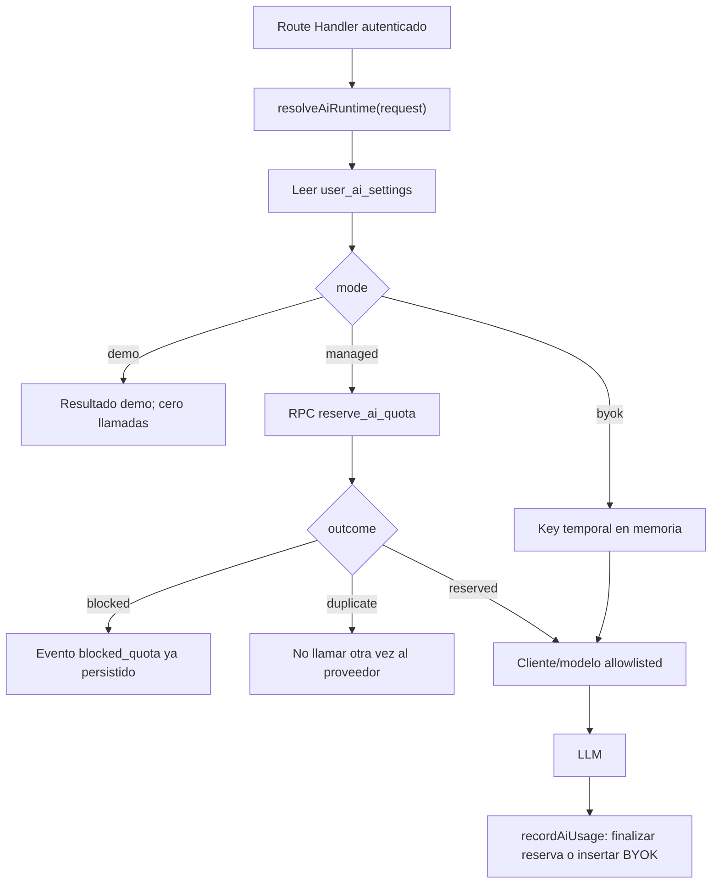
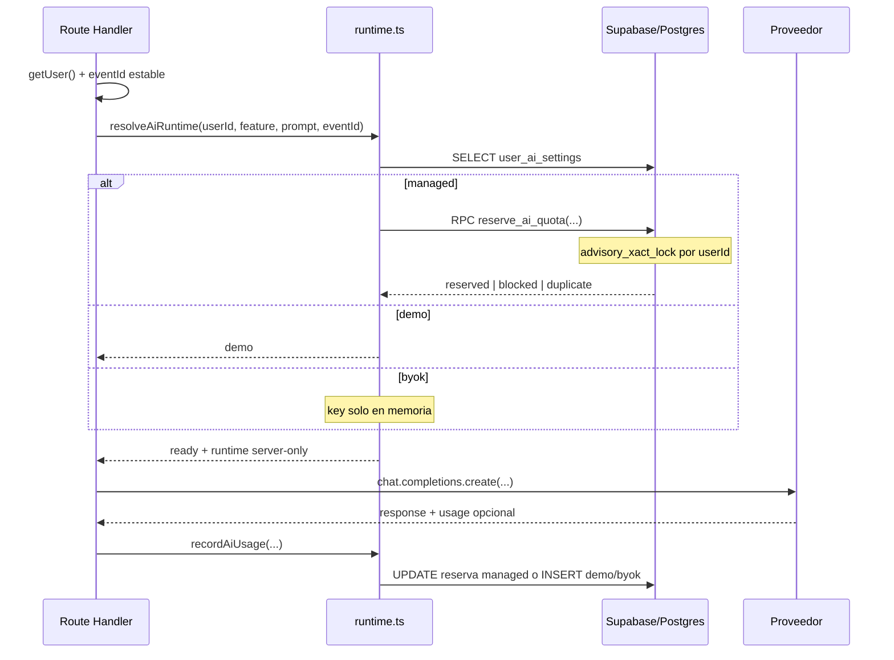

# AI-02 — Runtime server-side: resolver proveedor, modo y cuota

> **Estado:** implementada y validada (12/07/2026). tsc+build OK, 16/16 checkpoints, RPC con privilegios service_role.
> **Auditoría:** Corregida y aprobada documentalmente el 12/07/2026.
> **Fecha de generación y auditoría:** 12/07/2026.
> **Skill:** `istqb-fe-guide-generator`
> **Dependencia cerrada:** AI-01 implementada y validada.
> **Alcance:** Esta guía agrega el contrato atómico que AI-01 dejó expresamente para AI-02, crea los tipos y el runtime server-only y adapta la fábrica de proveedores. No integra todavía los Route Handlers existentes; esa migración pertenece a AI-05.

---

## Addendum Correctivo Obligatorio

La primera versión de esta guía no era segura para implementar. Calculaba consumo con un `SELECT` y registraba después con un `INSERT`; dos requests concurrentes podían leer la misma cuota disponible y ambas llamar al proveedor. También declaraba BYOK y creación de cliente sin implementarlos, ignoraba errores al leer o registrar consumo y no utilizaba `feature`.

AI-01 permanece cerrada: su schema mínimo es válido y usa `ai_usage_events.id` como clave idempotente. AI-02 debe agregar una migración nueva con `reserve_ai_quota(...)`, sin editar la migración histórica de AI-01.

| Operación correctiva | Archivo/anchor real |
|---|---|
| **CREAR** función RPC transaccional | `supabase/migrations/<timestamp>_add_ai_quota_reservation.sql` |
| **MODIFICAR** tipos de las dos tablas y RPC | `frontend/types/database.ts`, antes de `export interface Database` y dentro de `Tables`/`Functions` |
| **CREAR** contrato de dominio | `frontend/types/ai.ts` |
| **MODIFICAR** barrel de tipos | `frontend/types/index.ts`, después del export de `./database` |
| **MODIFICAR** fábrica canónica | `frontend/lib/ai/model-cascade.ts`, archivo completo |
| **CREAR** runtime | `frontend/lib/ai/runtime.ts` |
| **CREAR** fixture remoto sin secretos | `frontend/scripts/verify-ai02-quota.mjs` |

**Gate bloqueante:** el modo `managed` no se habilita en ningún endpoint hasta que el fixture demuestre simultáneamente: una reserva + un bloqueo bajo concurrencia y una reserva + un duplicado al reutilizar el mismo `event_id`.

---

## Sección 1: 🎓 Introducción y Fundamentos Conceptuales

### Analogía profesional

Imagina una cafetería corporativa con un cupo diario por persona. Consultar cuántos cafés quedan y anotar el consumo después de prepararlo son dos acciones separadas: dos cajeros pueden ver “queda uno” al mismo tiempo y servir dos. Una cuota real necesita una única operación de caja que, bajo un candado breve, revise el saldo y reserve la unidad.

`reserve_ai_quota(...)` cumple esa función dentro de una transacción PostgreSQL. Usa un advisory lock por usuario, vuelve idempotente cada intento mediante `ai_usage_events.id` y deja una reserva conservadora antes de cualquier llamada externa. El lock se libera al terminar la función; nunca permanece abierto mientras Gemini u OpenAI responden.

El runtime es una Data Access Layer server-only. El Route Handler autentica con `getUser()`, genera una vez el `eventId` y entrega al runtime el `userId` verificado. El runtime decide `demo`, `managed` o `byok`, valida el modelo, reserva cuota cuando corresponde y devuelve un cliente que nunca cruza al navegador.

### Fronteras de seguridad

- `demo`: no usa proveedor ni API key y registra cero tokens/unidades.
- `managed`: usa exclusivamente variables privadas del servidor y reserva cuota antes de llamar al LLM.
- `byok`: recibe la key en memoria para esa request; no la guarda en Supabase, storage, cookies, respuesta ni logs.
- `server-only`: Next.js impide importar el runtime desde un Client Component.
- `service_role`: solo se usa tras autenticar al usuario; la RPC queda revocada para `PUBLIC`, `anon` y `authenticated`.

Estas decisiones siguen la recomendación de Next.js de aislar el acceso a datos y secretos en una DAL marcada con `server-only`, y la recomendación de Supabase de preferir funciones `security invoker`, restringir `EXECUTE` explícitamente y mantener transacciones cortas. Referencias: [Data Security de Next.js](https://nextjs.org/docs/app/guides/data-security), [Database Functions de Supabase](https://supabase.com/docs/guides/database/functions) y [Advisory Locks de PostgreSQL](https://www.postgresql.org/docs/current/explicit-locking.html#ADVISORY-LOCKS).

---

## Sección 2: 📋 Prerequisitos y Verificación del Entorno

Desde la raíz:

```powershell
Set-Location "C:\Users\jsife\OneDrive\Desktop\Repositorios\practica-testing"
```

Versiones verificadas al auditar:

```powershell
node --version
# v24.16.0

node -e "const p=require('./frontend/node_modules/next/package.json'); console.log(p.version, p.engines.node)"
# 16.2.9 >=20.9.0

node -e "console.log(require('./frontend/node_modules/typescript/package.json').version)"
# 5.9.3

npx supabase --version
# 2.109.1
```

Dependencia DB:

```powershell
Test-Path -LiteralPath "supabase/migrations/20260713011509_create_ai_tables.sql"
# True

Select-String -LiteralPath "docs/guides/db/AI-01.md" -Pattern "implementada y validada"
# Debe encontrar el estado de AI-01
```

Instala `server-only`; Next.js entiende el marcador internamente, pero declararlo evita una dependencia extraneous y deja el lockfile reproducible:

```powershell
npm --prefix frontend install server-only
```

Esto modifica `frontend/package.json` y `frontend/package-lock.json`. No instales SDKs adicionales: el proyecto ya usa `openai` como cliente compatible para Gemini y OpenAI.

---

## Sección 3: 📂 Estructura de Directorios del Proyecto

```text
practica-testing/
├── supabase/
│   └── migrations/
│       └── <timestamp>_add_ai_quota_reservation.sql  ← NUEVO
└── frontend/
    ├── package.json                                  ← MODIFICAR por npm
    ├── package-lock.json                             ← MODIFICAR por npm
    ├── scripts/
    │   └── verify-ai02-quota.mjs                    ← NUEVO
    ├── types/
    │   ├── ai.ts                                    ← NUEVO
    │   ├── database.ts                              ← MODIFICAR
    │   └── index.ts                                 ← MODIFICAR
    └── lib/ai/
        ├── model-cascade.ts                         ← MODIFICAR
        └── runtime.ts                               ← NUEVO
```

| Crear | Modificar | No tocar |
|---|---|---|
| Migración complementaria, `ai.ts`, `runtime.ts`, fixture | `package*.json`, `database.ts`, `index.ts`, `model-cascade.ts` | Route Handlers, componentes React, migración histórica AI-01, `.env*`, backend |

---

## Sección 4: 🎨 Diagrama de Arquitectura de Componentes



### Flujo Completo



---

## Sección 5: 🛠️ Implementación Paso a Paso

### Paso A: crear la migración de reserva atómica

**Acción:** CREAR. **No edites** `20260713011509_create_ai_tables.sql`.

```powershell
npx supabase migration new add_ai_quota_reservation
```

Abre el archivo recién creado `supabase/migrations/<timestamp>_add_ai_quota_reservation.sql` y pega:

```sql
-- ============================================================
-- AI-02: reserva atómica e idempotente de cuota managed
--
-- La función hace exclusivamente trabajo de base de datos.
-- NUNCA llama al proveedor LLM dentro de la transacción.
-- ============================================================
create or replace function public.reserve_ai_quota(
  p_user_id uuid,
  p_event_id uuid,
  p_feature text,
  p_provider text,
  p_model_name text,
  p_reserved_prompt_tokens integer,
  p_reserved_completion_tokens integer
)
returns table (
  reservation_outcome text,
  block_reason text,
  daily_requests bigint,
  daily_tokens bigint,
  monthly_requests bigint,
  monthly_tokens bigint
)
language plpgsql
security invoker
set search_path = ''
as $$
declare
  -- Copias tipadas de las filas existentes. %rowtype evita que
  -- la función se desincronice si cambia el tipo de una columna.
  v_settings public.user_ai_settings%rowtype;
  v_existing public.ai_usage_events%rowtype;

  -- Las ventanas de cuota son UTC para que servidor, DB y UI
  -- no dependan de la zona horaria del proceso de Next.js.
  v_day_start timestamptz;
  v_month_start timestamptz;
  v_daily_requests bigint := 0;
  v_daily_tokens bigint := 0;
  v_monthly_requests bigint := 0;
  v_monthly_tokens bigint := 0;
  v_reserved_total integer;
  v_reason text;
begin
  -- Defensa previa: nunca reservar una cantidad negativa.
  if p_reserved_prompt_tokens < 0 or p_reserved_completion_tokens < 0 then
    raise exception 'AI_QUOTA_INVALID_TOKEN_RESERVATION' using errcode = '22023';
  end if;

  v_reserved_total := p_reserved_prompt_tokens + p_reserved_completion_tokens;
  v_day_start := date_trunc('day', timezone('UTC', clock_timestamp())) at time zone 'UTC';
  v_month_start := date_trunc('month', timezone('UTC', clock_timestamp())) at time zone 'UTC';

  -- Un solo lock por usuario y siempre en el mismo orden.
  -- Al ser xact_lock, PostgreSQL lo libera al salir de la función.
  perform pg_advisory_xact_lock(hashtextextended(p_user_id::text, 0));

  -- Idempotencia: el event_id se genera una sola vez en el
  -- Route Handler. Si reaparece, no cobra ni inserta otra fila.
  select e.*
  into v_existing
  from public.ai_usage_events as e
  where e.id = p_event_id;

  -- Una sola agregación mensual calcula también el subconjunto
  -- diario mediante FILTER. Las reservas en curso cuentan porque
  -- ya tienen request_units/tokens conservadores.
  select
    coalesce(sum(e.request_units) filter (where e.created_at >= v_day_start), 0),
    coalesce(sum(e.total_tokens) filter (where e.created_at >= v_day_start), 0),
    coalesce(sum(e.request_units), 0),
    coalesce(sum(e.total_tokens), 0)
  into v_daily_requests, v_daily_tokens, v_monthly_requests, v_monthly_tokens
  from public.ai_usage_events as e
  where e.user_id = p_user_id
    and e.created_at >= v_month_start;

  if v_existing.id is not null then
    -- El mismo UUID nunca puede reutilizarse para otro usuario o feature.
    if v_existing.user_id <> p_user_id or v_existing.feature <> p_feature then
      raise exception 'AI_QUOTA_EVENT_ID_CONFLICT' using errcode = '22023';
    end if;

    return query select
      'duplicate'::text,
      v_existing.error_code,
      v_daily_requests,
      v_daily_tokens,
      v_monthly_requests,
      v_monthly_tokens;
    return;
  end if;

  -- FOR UPDATE serializa cambios de settings con la reserva.
  -- El advisory lock resuelve la concurrencia entre requests del usuario.
  select s.*
  into v_settings
  from public.user_ai_settings as s
  where s.user_id = p_user_id
  for update;

  if not found or v_settings.mode <> 'managed' then
    raise exception 'AI_QUOTA_MANAGED_MODE_REQUIRED' using errcode = '22023';
  end if;

  if v_settings.provider <> p_provider then
    raise exception 'AI_QUOTA_PROVIDER_MISMATCH' using errcode = '22023';
  end if;

  if v_daily_requests + 1 > v_settings.daily_request_limit then
    v_reason := 'DAILY_REQUEST_LIMIT';
  elsif v_monthly_requests + 1 > v_settings.monthly_request_limit then
    v_reason := 'MONTHLY_REQUEST_LIMIT';
  elsif v_daily_tokens + v_reserved_total > v_settings.daily_token_limit then
    v_reason := 'DAILY_TOKEN_LIMIT';
  elsif v_monthly_tokens + v_reserved_total > v_settings.monthly_token_limit then
    v_reason := 'MONTHLY_TOKEN_LIMIT';
  end if;

  if v_reason is not null then
    -- El bloqueo también es auditable, pero no consume cuota.
    insert into public.ai_usage_events (
      id, user_id, feature, mode, provider, model_name,
      prompt_tokens, completion_tokens, total_tokens,
      request_units, status, error_code
    ) values (
      p_event_id, p_user_id, p_feature, 'managed', p_provider, p_model_name,
      0, 0, 0, 0, 'blocked_quota', v_reason
    );

    return query select
      'blocked'::text, v_reason, v_daily_requests, v_daily_tokens,
      v_monthly_requests, v_monthly_tokens;
    return;
  end if;

  -- Marcador transitorio compatible con los CHECK de AI-01.
  -- Cuenta la reserva de forma conservadora hasta su finalización.
  -- AI-05 llamará recordAiUsage tanto en éxito como en error.
  insert into public.ai_usage_events (
    id, user_id, feature, mode, provider, model_name,
    prompt_tokens, completion_tokens, total_tokens,
    request_units, status, error_code
  ) values (
    p_event_id, p_user_id, p_feature, 'managed', p_provider, p_model_name,
    p_reserved_prompt_tokens, p_reserved_completion_tokens, v_reserved_total,
    1, 'error', 'QUOTA_RESERVED'
  );

  return query select
    'reserved'::text,
    null::text,
    v_daily_requests + 1,
    v_daily_tokens + v_reserved_total,
    v_monthly_requests + 1,
    v_monthly_tokens + v_reserved_total;
end;
$$;

revoke all on function public.reserve_ai_quota(
  uuid, uuid, text, text, text, integer, integer
) from public, anon, authenticated;

grant execute on function public.reserve_ai_quota(
  uuid, uuid, text, text, text, integer, integer
) to service_role;

comment on function public.reserve_ai_quota(
  uuid, uuid, text, text, text, integer, integer
) is 'Reserva atómica e idempotente de cuota managed. Solo service_role.';
```

La función usa `security invoker`: no necesita elevar privilegios porque solo `service_role` puede ejecutarla. El lock vive milisegundos y termina antes de la llamada HTTP.

**Entregable:** migración nueva, reversible por historial y sin alterar AI-01.

### Paso B: extender `frontend/types/database.ts`

**Acción:** MODIFICAR. **Anchor:** después de `PracticeExerciseTypeDB`, agrega:

```typescript
// Tipos del schema. No expresan qué rol puede escribir cada campo;
// esa autorización sigue viviendo en GRANT + RLS de PostgreSQL.
export type AiUsageModeDB = "demo" | "managed" | "byok";
export type AiProviderDB = "gemini" | "openai";
export type AiFeatureDB =
  | "plan"
  | "theory"
  | "quiz"
  | "evaluate"
  | "practice_generate"
  | "practice_evaluate";
export type AiUsageStatusDB = "success" | "blocked_quota" | "error";

export interface UserAiSettingsRowDB {
  user_id: string;
  mode: AiUsageModeDB;
  provider: AiProviderDB;
  model_name: string | null;
  daily_request_limit: number;
  monthly_request_limit: number;
  daily_token_limit: number;
  monthly_token_limit: number;
  updated_at: string;
  [key: string]: unknown;
}

export interface UserAiSettingsInsertDB {
  user_id: string;
  mode?: AiUsageModeDB;
  provider?: AiProviderDB;
  model_name?: string | null;
  daily_request_limit?: number;
  monthly_request_limit?: number;
  daily_token_limit?: number;
  monthly_token_limit?: number;
  updated_at?: string;
  [key: string]: unknown;
}

export interface UserAiSettingsUpdateDB {
  mode?: AiUsageModeDB;
  provider?: AiProviderDB;
  model_name?: string | null;
  daily_request_limit?: number;
  monthly_request_limit?: number;
  daily_token_limit?: number;
  monthly_token_limit?: number;
  updated_at?: string;
  [key: string]: unknown;
}

export interface AiUsageEventRowDB {
  id: string;
  user_id: string;
  feature: AiFeatureDB;
  mode: AiUsageModeDB;
  provider: AiProviderDB | null;
  model_name: string | null;
  prompt_tokens: number;
  completion_tokens: number;
  total_tokens: number;
  request_units: number;
  status: AiUsageStatusDB;
  error_code: string | null;
  created_at: string;
  [key: string]: unknown;
}

export interface AiUsageEventInsertDB {
  id?: string;
  user_id: string;
  feature: AiFeatureDB;
  mode: AiUsageModeDB;
  provider?: AiProviderDB | null;
  model_name?: string | null;
  prompt_tokens?: number;
  completion_tokens?: number;
  total_tokens?: number;
  request_units?: number;
  status: AiUsageStatusDB;
  error_code?: string | null;
  created_at?: string;
  [key: string]: unknown;
}

export interface AiUsageEventUpdateDB {
  // Solo service_role usa este shape para convertir QUOTA_RESERVED
  // en el resultado final. Identidad y timestamps no se modifican.
  prompt_tokens?: number;
  completion_tokens?: number;
  total_tokens?: number;
  request_units?: number;
  status?: AiUsageStatusDB;
  error_code?: string | null;
  [key: string]: unknown;
}

export interface ReserveAiQuotaRowDB {
  // Contrato exacto retornado por la RPC. Mantenerlo sincronizado
  // evita casts en runtime.ts.
  reservation_outcome: "reserved" | "blocked" | "duplicate";
  block_reason: string | null;
  daily_requests: number;
  daily_tokens: number;
  monthly_requests: number;
  monthly_tokens: number;
}
```

Dentro de `Database.public.Tables`, después de `practice_submissions`, agrega:

```typescript
      user_ai_settings: {
        Row: UserAiSettingsRowDB;
        Insert: UserAiSettingsInsertDB;
        Update: UserAiSettingsUpdateDB;
        Relationships: [];
      };
      ai_usage_events: {
        Row: AiUsageEventRowDB;
        Insert: AiUsageEventInsertDB;
        Update: AiUsageEventUpdateDB;
        Relationships: [];
      };
```

Reemplaza el bloque vacío `Functions` por:

```typescript
    Functions: {
      reserve_ai_quota: {
        Args: {
          p_user_id: string;
          p_event_id: string;
          p_feature: AiFeatureDB;
          p_provider: AiProviderDB;
          p_model_name: string;
          p_reserved_prompt_tokens: number;
          p_reserved_completion_tokens: number;
        };
        Returns: ReserveAiQuotaRowDB[];
      };
    };
```

`Update` no es `never`: el navegador sigue sin privilegio, pero `service_role` debe finalizar una reserva. Los tipos describen el schema; RLS y GRANT describen autorización.

**Entregable del Paso B:** `Database` conoce ambas tablas y la RPC con nullabilidad, argumentos y retorno exactos.

### Paso C: crear `frontend/types/ai.ts`

```typescript
// El dominio reutiliza los unions del schema en vez de declarar
// una segunda lista de modos/proveedores que pueda divergir.
import type {
  AiFeatureDB,
  AiProviderDB,
  AiUsageModeDB,
  AiUsageStatusDB,
  Database,
} from "./database";

export type AiUsageMode = AiUsageModeDB;
export type AiProvider = AiProviderDB;
export type AiFeature = AiFeatureDB;
export type AiUsageStatus = AiUsageStatusDB;

export type UserAiSettingsRow =
  Database["public"]["Tables"]["user_ai_settings"]["Row"];
export type AiUsageEventRow =
  Database["public"]["Tables"]["ai_usage_events"]["Row"];

export type AiQuotaBlockReason =
  | "DAILY_REQUEST_LIMIT"
  | "MONTHLY_REQUEST_LIMIT"
  | "DAILY_TOKEN_LIMIT"
  | "MONTHLY_TOKEN_LIMIT";

export interface AiUsageSummary {
  daily_requests: number;
  daily_tokens: number;
  monthly_requests: number;
  monthly_tokens: number;
}

export interface AiRuntimeRequest {
  // userId proviene exclusivamente de supabase.auth.getUser().
  userId: string;
  // eventId se genera una vez y se conserva durante reintentos.
  eventId: string;
  feature: AiFeature;
  promptText: string;
  maxCompletionTokens: number;
  timeoutMs: number;
  byokApiKey?: string;
}

interface AiRuntimeBase {
  eventId: string;
  settings: UserAiSettingsRow;
}

export interface AiRuntimeDemo extends AiRuntimeBase {
  status: "demo";
  mode: "demo";
}

export interface AiRuntimeBlocked extends AiRuntimeBase {
  status: "blocked";
  mode: "managed";
  reason: AiQuotaBlockReason;
  usage: AiUsageSummary;
}

export interface AiRuntimeDuplicate extends AiRuntimeBase {
  status: "duplicate";
  mode: "managed";
}

export interface AiRuntimeUnavailable extends AiRuntimeBase {
  status: "unavailable";
  mode: AiUsageMode;
  reason:
    | "BYOK_KEY_REQUIRED"
    | "PROVIDER_CONFIGURATION_ERROR"
    | "QUOTA_SERVICE_UNAVAILABLE"
    | "INVALID_RUNTIME_REQUEST";
}

export interface AiRuntimeReady extends AiRuntimeBase {
  status: "ready";
  mode: "managed" | "byok";
  provider: AiProvider;
  model: string;
  modelWasDefaulted: boolean;
  estimatedPromptTokens: number;
  maxCompletionTokens: number;
  usage: AiUsageSummary;
}

export type AiRuntimeResult =
  | AiRuntimeDemo
  | AiRuntimeBlocked
  | AiRuntimeDuplicate
  | AiRuntimeUnavailable
  | AiRuntimeReady;

export interface ProviderUsage {
  prompt_tokens?: number | null;
  completion_tokens?: number | null;
  total_tokens?: number | null;
}
```

`AiRuntimeResult` es una unión discriminada. El consumidor debe resolver explícitamente `demo`, `blocked`, `duplicate`, `unavailable` y `ready`; no existe un fallback que convierta un error en éxito vacío.

**Entregable del Paso C:** contrato de dominio único, derivado de `Database` y sin campos para API keys.

### Paso D: actualizar `frontend/types/index.ts`

En el export existente de `./database`, agrega los símbolos DB de AI-02. Después de ese bloque agrega:

```typescript
export type {
  AiUsageMode,
  AiProvider,
  AiFeature,
  AiUsageStatus,
  AiQuotaBlockReason,
  AiUsageSummary,
  AiRuntimeRequest,
  AiRuntimeResult,
  AiRuntimeDemo,
  AiRuntimeBlocked,
  AiRuntimeDuplicate,
  AiRuntimeUnavailable,
  AiRuntimeReady,
  ProviderUsage,
  UserAiSettingsRow,
  AiUsageEventRow,
} from "./ai";
```

Los símbolos DB a sumar al primer bloque son: `AiUsageModeDB`, `AiProviderDB`, `AiFeatureDB`, `AiUsageStatusDB`, `UserAiSettingsRowDB`, `UserAiSettingsInsertDB`, `UserAiSettingsUpdateDB`, `AiUsageEventRowDB`, `AiUsageEventInsertDB`, `AiUsageEventUpdateDB` y `ReserveAiQuotaRowDB`.

**Entregable del Paso D:** los Route Handlers futuros podrán importar tipos desde `@/types` sin rutas paralelas.

### Paso E: adaptar `frontend/lib/ai/model-cascade.ts`

**Acción:** MODIFICAR. Conserva `createModelRuntimes`, `isModelTimeout` y `getModelErrorStatus`. Agrega `import "server-only";` como primera línea. Reemplaza `DEFAULT_GEMINI_MODELS` y `DEFAULT_OPENAI_MODELS` por esta única allowlist y agrega la fábrica de un proveedor:

```typescript
// Allowlist canónica. Una preferencia guardada en DB no es una
// autorización: solo estos identificadores pueden llegar al SDK.
export const MODEL_ALLOWLIST = {
  gemini: [
    "gemini-3.5-flash",
    "gemini-3.1-pro-preview",
    "gemini-3.1-flash-lite",
    "gemini-3-pro-preview",
    "gemini-3-flash-preview",
    "gemini-2.5-pro",
    "gemini-2.5-flash",
  ],
  openai: ["gpt-4o-mini"],
} as const satisfies Record<LlmProvider, readonly string[]>;

export function isAllowedModel(
  provider: LlmProvider,
  model: string,
): boolean {
  return MODEL_ALLOWLIST[provider].some((candidate) => candidate === model);
}

interface CreateProviderRuntimeOptions {
  provider: LlmProvider;
  model: string;
  apiKey: string;
  timeoutMs: number;
  maxRetries?: number;
}

export function createProviderRuntime({
  provider,
  model,
  apiKey,
  timeoutMs,
  maxRetries = 1,
}: CreateProviderRuntimeOptions): ModelRuntime {
  // Validar antes de construir el SDK evita enviar texto arbitrario
  // desde user_ai_settings.model_name al proveedor.
  if (!isAllowedModel(provider, model)) {
    throw new Error("AI_MODEL_NOT_ALLOWED");
  }

  // Gemini expone una API compatible con OpenAI; OpenAI no usa baseURL.
  // La key permanece encapsulada en este objeto server-only.
  const client = new OpenAI({
    apiKey,
    baseURL:
      provider === "gemini"
        ? process.env.GEMINI_OPENAI_BASE_URL || GEMINI_OPENAI_BASE_URL
        : undefined,
    timeout: timeoutMs + 15_000,
    maxRetries,
  });

  return { provider, model, client, timeoutMs };
}
```

Dentro de `createModelRuntimes`, reemplaza las dos referencias retiradas por `...MODEL_ALLOWLIST.gemini` y `...MODEL_ALLOWLIST.openai`, respectivamente. No pongas modelos en `runtime.ts`: esta exportación queda como fuente única para cascada, managed, BYOK y la futura UI.

**Entregable del Paso E:** fábrica única para managed/BYOK sin romper la cascada usada por los endpoints actuales.

### Paso F: crear `frontend/lib/ai/runtime.ts`

```typescript
import "server-only";

import { createAdminClient } from "@/lib/supabase/admin";
import {
  createProviderRuntime,
  isAllowedModel,
  MODEL_ALLOWLIST,
  type ModelRuntime,
} from "@/lib/ai/model-cascade";
import type {
  AiProvider,
  AiQuotaBlockReason,
  AiRuntimeReady,
  AiRuntimeRequest,
  AiRuntimeResult,
  AiUsageSummary,
  ProviderUsage,
  UserAiSettingsRow,
} from "@/types/ai";

type ReadyRuntime = AiRuntimeReady & { runtime: ModelRuntime };
// El cliente OpenAI no forma parte del DTO serializable de types/ai.ts.
// Solo aparece en esta extensión server-only.
export type ResolvedAiRuntime =
  | Exclude<AiRuntimeResult, AiRuntimeReady>
  | ReadyRuntime;

export interface RecordAiUsageInput {
  eventId: string;
  userId: string;
  feature: AiRuntimeRequest["feature"];
  mode: "demo" | "managed" | "byok";
  provider: AiProvider | null;
  model: string | null;
  status: "success" | "error";
  errorCode?: string;
  providerUsage?: ProviderUsage;
  fallbackPromptTokens: number;
  fallbackCompletionTokens: number;
}

const EMPTY_USAGE: AiUsageSummary = {
  daily_requests: 0,
  daily_tokens: 0,
  monthly_requests: 0,
  monthly_tokens: 0,
};

/**
 * Replica los DEFAULT de AI-01 únicamente en memoria.
 * No crea una fila por una lectura y no eleva al usuario a managed.
 */
function defaultSettings(userId: string): UserAiSettingsRow {
  return {
    user_id: userId,
    mode: "demo",
    provider: "gemini",
    model_name: null,
    daily_request_limit: 20,
    monthly_request_limit: 300,
    daily_token_limit: 50_000,
    monthly_token_limit: 500_000,
    updated_at: new Date().toISOString(),
  };
}

function estimatePromptTokens(text: string): number {
  // Estimación deliberadamente conservadora para reservar antes
  // de que el proveedor entregue usage real.
  return Math.max(1, Math.ceil(text.length / 3));
}

function isValidRequest(request: AiRuntimeRequest): boolean {
  // Este guard valida datos de runtime; un cast TypeScript no bastaría.
  return (
    /^[0-9a-f]{8}-[0-9a-f]{4}-[1-5][0-9a-f]{3}-[89ab][0-9a-f]{3}-[0-9a-f]{12}$/i.test(
      request.eventId,
    ) &&
    request.promptText.length > 0 &&
    Number.isInteger(request.maxCompletionTokens) &&
    request.maxCompletionTokens > 0 &&
    Number.isInteger(request.timeoutMs) &&
    request.timeoutMs > 0
  );
}

function usageFromRow(row: {
  daily_requests: number;
  daily_tokens: number;
  monthly_requests: number;
  monthly_tokens: number;
}): AiUsageSummary {
  return {
    daily_requests: Number(row.daily_requests),
    daily_tokens: Number(row.daily_tokens),
    monthly_requests: Number(row.monthly_requests),
    monthly_tokens: Number(row.monthly_tokens),
  };
}

function isQuotaBlockReason(value: string | null): value is AiQuotaBlockReason {
  return (
    value === "DAILY_REQUEST_LIMIT" ||
    value === "MONTHLY_REQUEST_LIMIT" ||
    value === "DAILY_TOKEN_LIMIT" ||
    value === "MONTHLY_TOKEN_LIMIT"
  );
}

function providerKey(provider: AiProvider): string | undefined {
  return provider === "gemini"
    ? process.env.GEMINI_API_KEY
    : process.env.OPENAI_API_KEY;
}

/**
 * Adaptador tipado de la RPC. Mantenerlo separado permite probar la
 * reserva sin construir un cliente ni llamar a un proveedor externo.
 */
async function reserveAiQuota(
  admin: ReturnType<typeof createAdminClient>,
  request: AiRuntimeRequest,
  provider: AiProvider,
  model: string,
  estimatedPromptTokens: number,
) {
  return admin.rpc("reserve_ai_quota", {
    p_user_id: request.userId,
    p_event_id: request.eventId,
    p_feature: request.feature,
    p_provider: provider,
    p_model_name: model,
    p_reserved_prompt_tokens: estimatedPromptTokens,
    p_reserved_completion_tokens: request.maxCompletionTokens,
  });
}

export async function resolveAiRuntime(
  request: AiRuntimeRequest,
): Promise<ResolvedAiRuntime> {
  // El admin client es válido aquí porque el Route Handler ya autenticó
  // y userId proviene de getUser(), nunca del body sin verificar.
  const admin = createAdminClient();
  const { data, error } = await admin
    .from("user_ai_settings")
    .select("*")
    .eq("user_id", request.userId)
    .maybeSingle();

  const settings = data ?? defaultSettings(request.userId);

  // Fail-closed: una caída de settings/cuota nunca se interpreta como
  // "usuario sin consumo" ni autoriza una llamada managed.
  if (error || !isValidRequest(request)) {
    return {
      status: "unavailable",
      mode: settings.mode,
      reason: error ? "QUOTA_SERVICE_UNAVAILABLE" : "INVALID_RUNTIME_REQUEST",
      eventId: request.eventId,
      settings,
    };
  }

  if (settings.mode === "demo") {
    // Demo termina aquí: no lee keys, no reserva y no crea cliente.
    return { status: "demo", mode: "demo", eventId: request.eventId, settings };
  }

  const provider = settings.provider;
  const requestedModel = settings.model_name?.trim();
  // Una preferencia legacy se corrige al default allowlisted y queda
  // visible mediante modelWasDefaulted para AI-03.
  const model =
    requestedModel && isAllowedModel(provider, requestedModel)
      ? requestedModel
      : MODEL_ALLOWLIST[provider][0];
  const modelWasDefaulted = model !== requestedModel;
  const estimatedPromptTokens = estimatePromptTokens(request.promptText);

  const key =
    settings.mode === "byok" ? request.byokApiKey?.trim() : providerKey(provider);

  if (!key) {
    return {
      status: "unavailable",
      mode: settings.mode,
      reason:
        settings.mode === "byok"
          ? "BYOK_KEY_REQUIRED"
          : "PROVIDER_CONFIGURATION_ERROR",
      eventId: request.eventId,
      settings,
    };
  }

  let usage = EMPTY_USAGE;

  if (settings.mode === "managed") {
    // Único punto autorizado para reservar costos de la plataforma.
    const reservation = await reserveAiQuota(
      admin,
      request,
      provider,
      model,
      estimatedPromptTokens,
    );

    const row = reservation.data?.[0];
    if (reservation.error || !row) {
      return {
        status: "unavailable",
        mode: "managed",
        reason: "QUOTA_SERVICE_UNAVAILABLE",
        eventId: request.eventId,
        settings,
      };
    }

    usage = usageFromRow(row);

    if (
      row.reservation_outcome === "blocked" &&
      isQuotaBlockReason(row.block_reason)
    ) {
      return {
        status: "blocked",
        mode: "managed",
        reason: row.block_reason,
        eventId: request.eventId,
        settings,
        usage,
      };
    }

    if (row.reservation_outcome === "duplicate") {
      // Un reintento con el mismo eventId nunca repite la llamada externa.
      return {
        status: "duplicate",
        mode: "managed",
        eventId: request.eventId,
        settings,
      };
    }
  }

  try {
    // La key se entrega directamente al SDK y no se copia al resultado.
    return {
      status: "ready",
      mode: settings.mode,
      provider,
      model,
      modelWasDefaulted,
      estimatedPromptTokens,
      maxCompletionTokens: request.maxCompletionTokens,
      eventId: request.eventId,
      settings,
      usage,
      runtime: createProviderRuntime({
        provider,
        model,
        apiKey: key,
        timeoutMs: request.timeoutMs,
      }),
    };
  } catch {
    return {
      status: "unavailable",
      mode: settings.mode,
      reason: "PROVIDER_CONFIGURATION_ERROR",
      eventId: request.eventId,
      settings,
    };
  }
}

function nonNegativeInteger(value: number | null | undefined): number | null {
  if (typeof value !== "number" || !Number.isInteger(value) || value < 0) {
    return null;
  }
  return value;
}

function normalizeUsage(input: RecordAiUsageInput) {
  // No confiar en total_tokens del proveedor: se deriva siempre de
  // prompt + completion para cumplir el CHECK de AI-01.
  const prompt =
    nonNegativeInteger(input.providerUsage?.prompt_tokens) ??
    input.fallbackPromptTokens;
  const completion =
    nonNegativeInteger(input.providerUsage?.completion_tokens) ??
    input.fallbackCompletionTokens;

  return {
    prompt_tokens: prompt,
    completion_tokens: completion,
    total_tokens: prompt + completion,
  };
}

export async function recordAiUsage(input: RecordAiUsageInput): Promise<void> {
  const normalizedErrorCode = input.errorCode?.trim();
  if (
    input.status === "error" &&
    (!normalizedErrorCode || normalizedErrorCode.length > 100)
  ) {
    throw new Error("AI_USAGE_ERROR_CODE_REQUIRED");
  }

  const hasExternalProvider = input.provider !== null && input.model !== null;
  if (
    input.fallbackPromptTokens < 0 ||
    input.fallbackCompletionTokens < 0 ||
    (input.mode === "demo" && hasExternalProvider) ||
    (input.mode !== "demo" && !hasExternalProvider)
  ) {
    throw new Error("AI_USAGE_INVALID_INPUT");
  }

  const tokens = normalizeUsage(input);
  if (input.mode === "demo" && tokens.total_tokens !== 0) {
    throw new Error("AI_USAGE_INVALID_INPUT");
  }

  const admin = createAdminClient();
  const values = {
    ...tokens,
    request_units: input.mode === "demo" ? 0 : 1,
    status: input.status,
    error_code: input.status === "success" ? null : normalizedErrorCode,
  } as const;

  if (input.mode === "managed") {
    // Managed no inserta un segundo evento: finaliza exactamente la
    // reserva creada antes de gastar. El filtro QUOTA_RESERVED impide
    // finalizar dos veces el mismo eventId.
    const finalized = await admin
      .from("ai_usage_events")
      .update(values)
      .eq("id", input.eventId)
      .eq("user_id", input.userId)
      .eq("error_code", "QUOTA_RESERVED")
      .select("id")
      .maybeSingle();

    if (finalized.error || !finalized.data) {
      throw new Error("AI_USAGE_FINALIZATION_FAILED");
    }
    return;
  }

  // Demo y BYOK no necesitan reserva managed. La PK vuelve el INSERT
  // idempotente y el conflicto se acepta solo si conserva identidad.
  const inserted = await admin.from("ai_usage_events").insert({
    id: input.eventId,
    user_id: input.userId,
    feature: input.feature,
    mode: input.mode,
    provider: input.provider,
    model_name: input.model,
    ...values,
  });

  if (inserted.error?.code === "23505") {
    const existing = await admin
      .from("ai_usage_events")
      .select("user_id, feature, mode")
      .eq("id", input.eventId)
      .maybeSingle();

    const sameEvent =
      existing.data?.user_id === input.userId &&
      existing.data.feature === input.feature &&
      existing.data.mode === input.mode;

    if (!existing.error && sameEvent) return;
  }

  if (inserted.error) throw new Error("AI_USAGE_INSERT_FAILED");
}
```

No cambies los `throw` por `console.error` + continuar. Fallar abierto permitiría consumo real sin contabilidad. Los endpoints de AI-05 deben traducir estos códigos a respuestas seguras sin mostrar errores crudos.

**Entregable del Paso F:** resolución completa de modo/proveedor/modelo, reserva managed, BYOK solo en memoria y finalización fail-closed.

### Paso G: fixture de concurrencia `frontend/scripts/verify-ai02-quota.mjs`

```javascript
import { randomUUID } from "node:crypto";
import { createClient } from "@supabase/supabase-js";

const url = process.env.NEXT_PUBLIC_SUPABASE_URL;
const serviceRole = process.env.SUPABASE_SERVICE_ROLE_KEY;
if (!url || !serviceRole) throw new Error("Faltan variables server-only");

const admin = createClient(url, serviceRole, {
  auth: { persistSession: false, autoRefreshToken: false },
});

const email = `ai02-${randomUUID()}@example.invalid`;
const password = `${randomUUID()}Aa1!`;
const created = await admin.auth.admin.createUser({
  email,
  password,
  email_confirm: true,
});
if (created.error || !created.data.user) throw new Error("No se creó fixture");

const userId = created.data.user.id;
const args = (eventId) => ({
  p_user_id: userId,
  p_event_id: eventId,
  p_feature: "theory",
  p_provider: "gemini",
  p_model_name: "gemini-3.5-flash",
  p_reserved_prompt_tokens: 10,
  p_reserved_completion_tokens: 10,
});

try {
  // Límite 1: dos reservas distintas simultáneas deben producir
  // exactamente una reserva y un bloqueo.
  const settings = await admin.from("user_ai_settings").insert({
    user_id: userId,
    mode: "managed",
    provider: "gemini",
    model_name: "gemini-3.5-flash",
    daily_request_limit: 1,
    monthly_request_limit: 1,
    daily_token_limit: 100,
    monthly_token_limit: 100,
  });
  if (settings.error) throw new Error("No se creó settings fixture");

  const concurrent = await Promise.all([
    admin.rpc("reserve_ai_quota", args(randomUUID())),
    admin.rpc("reserve_ai_quota", args(randomUUID())),
  ]);
  const outcomes = concurrent.map((result) => result.data?.[0]?.reservation_outcome).sort();
  if (outcomes.join(",") !== "blocked,reserved") {
    throw new Error(`Concurrencia falló: ${outcomes.join(",")}`);
  }

  await admin.from("ai_usage_events").delete().eq("user_id", userId);
  // Mismo eventId: debe existir una sola fila y el segundo resultado
  // debe ser duplicate, incluso si ambas llamadas parten juntas.
  const stableEventId = randomUUID();
  const repeated = await Promise.all([
    admin.rpc("reserve_ai_quota", args(stableEventId)),
    admin.rpc("reserve_ai_quota", args(stableEventId)),
  ]);
  const repeatedOutcomes = repeated
    .map((result) => result.data?.[0]?.reservation_outcome)
    .sort();
  if (repeatedOutcomes.join(",") !== "duplicate,reserved") {
    throw new Error(`Idempotencia falló: ${repeatedOutcomes.join(",")}`);
  }

  console.log("PASS AI-02: concurrencia e idempotencia");
} finally {
  // auth.users -> settings/events usan ON DELETE CASCADE.
  await admin.auth.admin.deleteUser(userId);
}
```

El fixture crea un usuario aislado, no imprime credenciales ni keys y lo elimina en `finally`.

**Entregable del Paso G:** prueba reproducible que detecta la carrera exacta omitida por la primera versión de la guía.

---

## Sección 6: ✅ Checkpoints de Verificación

### 6.1 Migración y seguridad

```powershell
npx supabase db push --linked --dry-run
# Debe listar solo la nueva migración AI-02

npx supabase db push --linked
npx supabase db lint --linked --level warning
```

En SQL Editor verifica privilegios:

```sql
select
  has_function_privilege('anon', 'public.reserve_ai_quota(uuid,uuid,text,text,text,integer,integer)', 'EXECUTE') as anon_execute,
  has_function_privilege('authenticated', 'public.reserve_ai_quota(uuid,uuid,text,text,text,integer,integer)', 'EXECUTE') as authenticated_execute,
  has_function_privilege('service_role', 'public.reserve_ai_quota(uuid,uuid,text,text,text,integer,integer)', 'EXECUTE') as service_execute;
-- Esperado: false | false | true
```

### 6.2 Concurrencia e idempotencia

```powershell
node --env-file=frontend/.env.local frontend/scripts/verify-ai02-quota.mjs
# PASS AI-02: concurrencia e idempotencia
```

No habilites `managed` si el resultado difiere.

### 6.3 TypeScript y build

```powershell
npx tsc --noEmit --project frontend/tsconfig.json
npm --prefix frontend run build
```

**Baseline de auditoría (12/07/2026, antes de implementar AI-02):** ambos comandos terminaron con exit code `0`; Next.js 16.2.9 compiló, ejecutó TypeScript y generó 21/21 páginas sin warnings. Después de implementar, el resultado debe mantenerse.

### 6.4 Seguridad de secretos

```powershell
rg -n "NEXT_PUBLIC_.*(GEMINI|OPENAI|SERVICE_ROLE)|localStorage|sessionStorage" frontend/lib/ai frontend/types/ai.ts frontend/scripts/verify-ai02-quota.mjs
# No debe aparecer ninguna key ni persistencia BYOK

node --check frontend/scripts/verify-ai02-quota.mjs
git diff --check

# git diff omite archivos untracked: revisar whitespace explícitamente.
$newFiles = @(
  "frontend/types/ai.ts",
  "frontend/lib/ai/runtime.ts",
  "frontend/scripts/verify-ai02-quota.mjs"
)
foreach ($file in $newFiles) {
  $content = Get-Content -Raw -LiteralPath $file
  if ($content -match '(?m)[ \t]+$') {
    throw "Whitespace al final de línea: $file"
  }
}
```

### 6.5 Matriz de edge cases

| Fixture | Resultado obligatorio |
|---|---|
| Sin fila settings | `demo`; cero proveedor externo |
| Modelo `null` | default de la allowlist |
| Modelo legacy/no permitido | default seguro + `modelWasDefaulted=true`; nunca llega al SDK |
| Managed sin key del servidor | `unavailable`; no reserva ni llama |
| BYOK sin key temporal | `unavailable`; no persiste nada |
| Dos event IDs con última unidad | uno `reserved`, uno `blocked` |
| Mismo event ID repetido | uno `reserved`, otro `duplicate`; una sola fila |
| RPC/DB caída | fail-closed `QUOTA_SERVICE_UNAVAILABLE` |
| Provider sin usage | usa reserva conservadora; total siempre es prompt + completion |
| Finalización managed falla | error controlado; no entregar éxito sin contabilidad |
| Evento demo | provider/model `null`, tokens/unidades 0 |

### 6.6 Checklist final

```text
[x] server-only instalado y lockfile actualizado
[x] Migracion AI-02 nueva; AI-01 historica intacta
[x] RPC solo ejecutable por service_role
[x] Tipos DB reflejan tablas + funcion y permiten finalizacion server-only
[x] Allowlist unica en model-cascade.ts
[x] runtime.ts no contiene keys ni persiste BYOK
[x] feature y eventId participan en reserva/registro
[x] Lectura, reserva y registro fallan cerrados
[x] Fixture imprime PASS para concurrencia e idempotencia
[x] tsc sin errores
[x] build exitoso y warnings documentados
[x] managed continua deshabilitado en endpoints hasta AI-05
```

---

## Sección 7: 🚨 Troubleshooting — Problemas Comunes

| Problema | Causa probable | Solución |
|---|---|---|
| `Module not found: server-only` | No se ejecutó el Paso 2 | `npm --prefix frontend install server-only` |
| RPC no aparece en tipos | `Database.public.Functions` sigue vacío | Aplicar el bloque completo del Paso B |
| `permission denied for function` con admin | Falta GRANT a `service_role` o no usa admin client | Revisar firma exacta y `createAdminClient()` |
| RPC accesible como authenticated | Revocación incompleta; las funciones conceden EXECUTE a PUBLIC por defecto | Repetir REVOKE con la firma completa |
| Dos reservas concurrentes | Se quitó el advisory lock o el INSERT quedó fuera de la función | Restaurar la función como una sola transacción |
| Reserva queda `QUOTA_RESERVED` | El proveedor/endpoint terminó sin `recordAiUsage` | AI-05 debe finalizar en éxito y error; la reserva conservadora evita gasto sin cuota |
| `AI_USAGE_FINALIZATION_FAILED` | eventId cambió o se intentó finalizar dos veces | Generar una vez por request y conservarlo en reintentos |
| Modelo fuera de allowlist | Preferencia antigua o texto arbitrario | Usar default server-side y mostrar la corrección en AI-03 |
| Build detecta server-only en cliente | Importación transitiva desde `'use client'` | Importar runtime únicamente desde Route Handlers/Server Actions |

---

## Sección 8: 📝 Resumen y Próximo Paso

1. AI-01 continúa implementada y validada; no se reescribe su historial.
2. AI-02 agrega una RPC breve, atómica e idempotente usando el `id` existente del evento.
3. El runtime resuelve demo/managed/BYOK, allowlist y cliente sin exponer secretos.
4. El consumo real se reserva antes y se finaliza después con fallback conservador de tokens.
5. La verificación incluye concurrencia real, idempotencia, privilegios, TypeScript y build.

Cuando termines, solicita: **“Valida mi implementación de AI-02 contra la Sección 6”**.

Solo después de cerrar esos gates se genera AI-03. AI-05 será quien conecte este runtime con los seis endpoints LLM actuales; hasta entonces `managed` debe permanecer fuera de los flujos reales.
