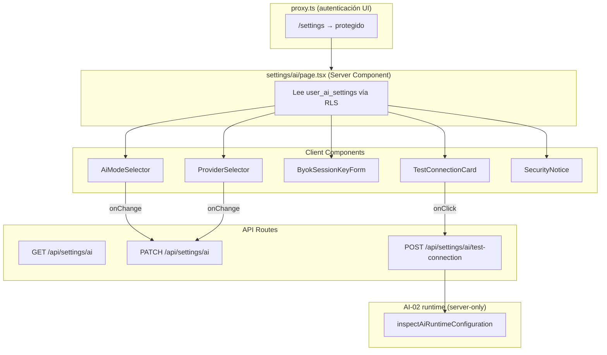
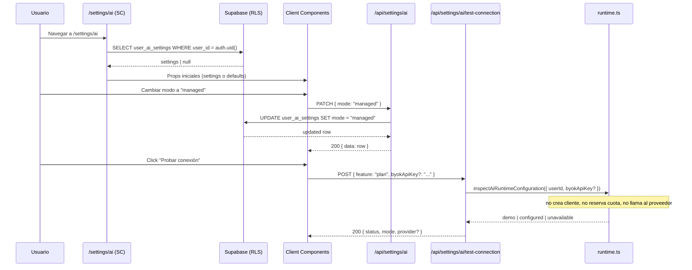

# AI-03 — UI Settings: Demo / Managed / BYOK session-only

> **Estado:** implementada y validada (12/07/2026). 14/14 checkpoints, tsc+build OK, fixture `PASS AI-03`.
> **Fecha de generación:** 12/07/2026.
> **Skill:** `istqb-fe-guide-generator`
> **Dependencias cerradas:** AI-02 implementada y verificada (12/07/2026). FE-04 completado.
> **Alcance:** Esta guía crea la pantalla `/settings/ai`, dos Route Handlers de configuración, seis componentes especializados e integra la ruta en la navegación y en `proxy.ts`. Además agrega un inspector server-only no facturable al runtime de AI-02 para comprobar configuración sin reservar cuota. No integra los endpoints LLM existentes (eso pertenece a AI-05), no realiza llamadas reales al proveedor y no implementa métricas de consumo (eso pertenece a AI-04).

---

## Addendum Correctivo Obligatorio

La primera redacción de AI-03 contenía dos contradicciones con contratos ya implementados:

1. `user_ai_settings` concede a `authenticated` privilegios de columna únicamente sobre `user_id`, `mode`, `provider` y `model_name`. Un `upsert` que incluye los cuatro límites de cuota falla con `42501`, aunque esos valores coincidan visualmente con los defaults.
2. `resolveAiRuntime()` reserva cuota cuando el modo es `managed`. Usarlo para un botón que no llama al proveedor ni invoca `recordAiUsage()` deja un evento `QUOTA_RESERVED` sin finalizar, consume una unidad y clasifica erróneamente la prueba como feature `plan`.

| Operación correctiva | Archivo/anchor real |
|---|---|
| **CREAR** contrato puro de preferencias y defaults | `frontend/lib/ai/settings-contract.ts` |
| **MODIFICAR** el runtime para inspeccionar sin reservar ni crear cliente | `frontend/lib/ai/runtime.ts`, después de `providerKey()` |
| **CREAR** fixture remoto de privilegios y carrera de primera escritura | `frontend/scripts/verify-ai03-settings.mjs` |
| **REEMPLAZAR** el PATCH de preferencias | `frontend/app/api/settings/ai/route.ts` completo |
| **REEMPLAZAR** el supuesto test de conexión | `frontend/app/api/settings/ai/test-connection/route.ts` completo |

**Regla de producto:** en AI-03 el endpoint histórico `/api/settings/ai/test-connection` valida únicamente que la configuración server-side está lista; no prueba una credencial frente al proveedor ni hace una llamada LLM. La primera llamada real, su feature correcta y su contabilidad completa pertenecen a AI-05. En particular, una key BYOK no vacía queda **lista para usarse**, pero no queda autenticada hasta esa llamada real.

**Gate bloqueante:** no continúes a AI-04 ni habilites un test remoto real mientras no se cumplan todos: el fixture imprime `PASS AI-03`, PATCH no intenta escribir cuotas, el inspector no llama a `reserve_ai_quota`, y la prueba de configuración no crea ni deja eventos en `ai_usage_events`.

> **Cómo usar esta auditoría.** Para conservar los comentarios pedagógicos de la propuesta original sin dejar snippets inseguros como instrucciones activas, la versión inicial queda plegada más abajo como evidencia de auditoría. La sección **“Implementación corregida y autoritativa”** al final de esta guía sustituye por completo los antiguos pasos D–L y su checklist. Implementa únicamente esa sección.

---

## Sección 1: 🎓 Introducción y Fundamentos Conceptuales

### Analogía profesional

Imagina que trabajas en una empresa donde hay tres formas de pedir café:

1. **Demo**: la máquina despacha una muestra gratuita de 20 ml. Sirve para probar el sabor sin gastar presupuesto.
2. **Managed**: la cafetería cobra a la cuenta del departamento. Hay un cupo diario y mensual; si lo rebasas, la máquina te lo dice antes de preparar nada.
3. **BYOK ("trae tu propio café")**: compras tu bolsa en la tienda, la entregas al barista, él prepara tu taza y destruye lo que sobró. Nunca almacena tu café en la alacena de la empresa.

En el proyecto ISTQB Study Agent, cada llamada a un modelo de lenguaje (Gemini, GPT) tiene un costo. AI-01 creó la base de datos de cuotas; AI-02 creó el runtime server-side que decide el modo, reserva cuota y gestiona la key. Ahora AI-03 construye la **interfaz de usuario** que permite elegir y cambiar entre esos tres modos sin exponer secretos.

### Conceptos React/Next.js relevantes

- **Server Components vs Client Components:** La página `/settings/ai` es un Server Component que lee los settings del usuario desde Supabase y los pasa como props iniciales a componentes `"use client"` interactivos. Esto elimina la latencia de un segundo fetch desde el cliente.
- **State local efímero para BYOK:** La API key BYOK vive exclusivamente en un `useState` de React. Navegar fuera, recargar la página o cerrar la pestaña la destruye. Nunca se escribe en `localStorage`, `sessionStorage`, cookies ni Supabase.
- **Route Handlers autenticados:** GET y PATCH `/api/settings/ai` usan el `createClient()` de `server.ts` (anon key + cookies) y confían en RLS + privilegios de columna para leer/escribir solo preferencias. POST `/api/settings/ai/test-connection` autentica primero y llama a un inspector server-only que nunca serializa keys, crea clientes ni reserva cuota.
- **Proxy (antes middleware) en Next.js 16+:** `proxy.ts` protege las rutas de UI redirigiendo a `/login` si no hay sesión. Las API Routes se protegen a sí mismas con `getUser()` y responden JSON `401`; proxy no redirige APIs.

---

## Sección 2: 📋 Prerequisitos y Verificación del Entorno

Desde la raíz del proyecto:

```powershell
Set-Location "C:\Users\jsife\OneDrive\Desktop\Repositorios\practica-testing"
```

### Versiones verificadas

```powershell
node --version
# v24.16.0  (>= 20.9.0 requerido por Next.js 16)

node -e "const p=require('./frontend/node_modules/next/package.json'); console.log(p.version, p.engines.node)"
# 16.2.9 >=20.9.0

node -e "console.log(require('./frontend/node_modules/typescript/package.json').version)"
# 5.9.3
```

### Dependencia AI-02 cerrada

```powershell
Test-Path -LiteralPath "frontend\lib\ai\runtime.ts"
# True

Select-String -LiteralPath "docs\guides\fe\AI-02.md" -Pattern "implementada y validada"
# Debe encontrar el estado de AI-02
```

### Dependencia FE-04 cerrada

```powershell
Test-Path -LiteralPath "frontend\app\(dashboard)\layout.tsx"
# True
Test-Path -LiteralPath "frontend\app\(dashboard)\_components\main-nav.tsx"
# True
```

### Baseline limpio

```powershell
npx tsc --noEmit --project frontend/tsconfig.json
# Sin errores

npm --prefix frontend run build
# ▲ Next.js 16.2.9 (Turbopack)
# ✓ Compiled successfully
# ✓ Generating static pages (21/21)
# Sin warnings
```

### Instalar primitivas shadcn/ui necesarias

Los componentes de esta guía solo requieren `RadioGroup`, que aún no existe en `frontend/components/ui/`. Instálalo antes de empezar:

```powershell
npx --prefix frontend shadcn@latest add radio-group --yes
```

Esto creará archivos en `frontend/components/ui/` y actualizará `frontend/package.json` si Radix agrega nuevas dependencias. Verifica:

```powershell
Test-Path -LiteralPath "frontend\components\ui\radio-group.tsx"
# True
```

---

## Sección 3: 📂 Estructura de Directorios del Proyecto

```text
practica-testing/
└── frontend/
    ├── proxy.ts                                                ← MODIFICAR
    ├── scripts/
    │   └── verify-ai03-settings.mjs                            ← NUEVO
    ├── app/(dashboard)/
    │   ├── _components/
    │   │   ├── main-nav.tsx                                    ← MODIFICAR
    │   │   └── mobile-nav.tsx                                  ← MODIFICAR
    │   └── settings/
    │       └── ai/
    │           ├── page.tsx                                    ← NUEVO
    │           └── _components/
    │               ├── ai-settings-client.tsx                  ← NUEVO
    │               ├── ai-mode-selector.tsx                    ← NUEVO
    │               ├── provider-selector.tsx                   ← NUEVO
    │               ├── byok-session-key-form.tsx               ← NUEVO
    │               ├── test-connection-card.tsx                 ← NUEVO
    │               └── security-notice.tsx                     ← NUEVO
    ├── app/api/settings/
    │   └── ai/
    │       ├── route.ts                                        ← NUEVO
    │       └── test-connection/
    │           └── route.ts                                    ← NUEVO
    ├── lib/ai/
    │   ├── settings-contract.ts                                ← NUEVO
    │   └── runtime.ts                                          ← MODIFICAR
    └── components/ui/
        └── radio-group.tsx                                     ← NUEVO (shadcn)
```

| Crear | Modificar | No tocar |
|---|---|---|
| `settings-contract.ts`, `settings/ai/page.tsx`, 6 componentes `_components/`, 2 Route Handlers, fixture y `radio-group.tsx` | `runtime.ts`, `proxy.ts`, `main-nav.tsx`, `mobile-nav.tsx` | `model-cascade.ts`, `types/ai.ts`, `types/database.ts`, `types/index.ts`, `admin.ts`, `server.ts`, `.env*`, backend, migraciones y todos los Route Handlers LLM existentes |

---

## Sección 4: 🎨 Diagrama de Arquitectura de Componentes



### Flujo Completo



---

## Sección 5: 🛠️ Implementación Paso a Paso

### Paso A: Agregar `/settings` a las rutas protegidas de `proxy.ts`

**Ruta:** `frontend/proxy.ts` — MODIFICAR
**Anchor:** la constante `PROTECTED_ROUTE_PREFIXES` (línea 8)
**Acción:** Agregar `"/settings"` al array.

```typescript
const PROTECTED_ROUTE_PREFIXES = [
  "/dashboard",
  "/plan",
  "/practice",
  "/session",
  "/settings",
  "/setup",
] as const;
```

> **¿Por qué?** Sin esta entrada, un usuario no autenticado podría cargar `/settings/ai` sin que proxy lo redirija a `/login`. Proxy solo protege rutas de UI; los API Routes bajo `/api/settings/ai` se protegen a sí mismos con `getUser()` y responden `401` JSON, sin redirect HTML.

**Entregable:** Proxy redirige a `/login` si visitas `/settings/ai` sin sesión.

---

### Paso B: Agregar "IA" a la navegación desktop

**Ruta:** `frontend/app/(dashboard)/_components/main-nav.tsx` — MODIFICAR
**Anchor:** el array `routes` (línea 58)
**Acción:** Agregar la entrada `{ href: "/settings/ai", label: "IA" }` al final del array.

```typescript
const routes = [
  { href: "/dashboard", label: "Dashboard" },
  { href: "/plan", label: "Mi Plan" },
  { href: "/session", label: "Sesión Actual" },
  { href: "/practice", label: "Práctica" },
  { href: "/settings/ai", label: "IA" },
] as const;
```

> **¿Por qué "IA" y no "Settings"?** Esta es la única pantalla de configuración del proyecto. Un label genérico "Settings" ocuparía espacio innecesario y no comunicaría el propósito. "IA" es directo y coherente con el Bloque I del roadmap. Si en el futuro se agregan más ajustes, se puede crear una sección `/settings` con subrutas.

> **Matching de rutas hijas:** `isActivePath` ya usa `startsWith(${href}/`)` con frontera de `/`, por lo que `/settings/ai` no matcheará accidentalmente con `/session` ni con ningún otro prefijo existente. Verificar mentalmente: `"/session".startsWith("/settings/ai/")` → `false`. Correcto.

**Entregable:** "IA" aparece en la barra de navegación desktop y se resalta cuando la URL es `/settings/ai` o cualquier hija.

---

### Paso C: Agregar "IA" a la navegación mobile

**Ruta:** `frontend/app/(dashboard)/_components/mobile-nav.tsx` — MODIFICAR
**Anchor:** el array `routes` (línea 59)
**Acción:** Agregar la entrada con emoji al final.

```typescript
const routes = [
  { href: "/dashboard", label: "Dashboard", emoji: "📊" },
  { href: "/plan", label: "Mi Plan", emoji: "📋" },
  { href: "/session", label: "Sesión Actual", emoji: "📖" },
  { href: "/practice", label: "Práctica", emoji: "🔬" },
  { href: "/settings/ai", label: "IA", emoji: "🤖" },
] as const;
```

**Entregable:** "🤖 IA" aparece en el Sheet mobile y se resalta correctamente.

---

<details>
<summary>Versión inicial auditada — conservar solo como referencia pedagógica; no implementar</summary>

### Paso D: Crear `GET /api/settings/ai` y `PATCH /api/settings/ai`

**Ruta:** `frontend/app/api/settings/ai/route.ts` — CREAR

Este Route Handler tiene dos responsabilidades:

1. **GET**: leer los settings del usuario autenticado. Si no existe fila, retornar los defaults de AI-01 (mode `demo`, provider `gemini`).
2. **PATCH**: actualizar `mode`, `provider` y/o `model_name`. No acepta cambios de límites de cuota (esos los controla un administrador o la DB).

```typescript
// frontend/app/api/settings/ai/route.ts
import { NextResponse, type NextRequest } from "next/server";
import { createClient } from "@/lib/supabase/server";
import type {
  AiUsageModeDB,
  AiProviderDB,
  UserAiSettingsRow,
} from "@/types/ai";

// ─── Defaults coherentes con AI-01 ───
// Si el usuario no tiene fila, devolvemos los mismos valores
// que la DB asignaría vía DEFAULT. Esto evita crear una fila
// prematuramente solo por una lectura.
const SETTINGS_DEFAULTS: Omit<UserAiSettingsRow, "user_id" | "updated_at"> = {
  mode: "demo",
  provider: "gemini",
  model_name: null,
  daily_request_limit: 20,
  monthly_request_limit: 300,
  daily_token_limit: 50_000,
  monthly_token_limit: 500_000,
};

const VALID_MODES: readonly AiUsageModeDB[] = [
  "demo",
  "managed",
  "byok",
] as const;

const VALID_PROVIDERS: readonly AiProviderDB[] = [
  "gemini",
  "openai",
] as const;

// ─── Validación runtime ───
// Un cast como `as AiUsageModeDB` no es una validación.
// Esta función comprueba que el valor pertenece al union.
function isValidMode(value: unknown): value is AiUsageModeDB {
  return typeof value === "string" && VALID_MODES.includes(value as AiUsageModeDB);
}

function isValidProvider(value: unknown): value is AiProviderDB {
  return (
    typeof value === "string" &&
    VALID_PROVIDERS.includes(value as AiProviderDB)
  );
}

function isValidModelName(value: unknown): value is string | null {
  if (value === null || value === undefined) return true;
  return typeof value === "string" && value.trim().length > 0 && value.length <= 100;
}

// ═══════════════════════════════════════════════════════════════
// GET /api/settings/ai
// ═══════════════════════════════════════════════════════════════
export async function GET() {
  const supabase = await createClient();

  const {
    data: { user },
    error: authError,
  } = await supabase.auth.getUser();

  if (authError || !user) {
    return NextResponse.json(
      { error: "NO_SESSION" },
      { status: 401 },
    );
  }

  const { data, error } = await supabase
    .from("user_ai_settings")
    .select(
      "user_id, mode, provider, model_name, daily_request_limit, monthly_request_limit, daily_token_limit, monthly_token_limit, updated_at",
    )
    .eq("user_id", user.id)
    .maybeSingle();

  if (error) {
    return NextResponse.json(
      { error: "SETTINGS_READ_FAILED" },
      { status: 500 },
    );
  }

  // Si no existe fila, devolvemos defaults sin crearla.
  const settings: UserAiSettingsRow = data ?? {
    user_id: user.id,
    ...SETTINGS_DEFAULTS,
    updated_at: new Date().toISOString(),
  };

  return NextResponse.json({ data: settings });
}

// ═══════════════════════════════════════════════════════════════
// PATCH /api/settings/ai
// ═══════════════════════════════════════════════════════════════
export async function PATCH(request: NextRequest) {
  const supabase = await createClient();

  const {
    data: { user },
    error: authError,
  } = await supabase.auth.getUser();

  if (authError || !user) {
    return NextResponse.json(
      { error: "NO_SESSION" },
      { status: 401 },
    );
  }

  // ─── Parsear y validar el body ───
  let body: unknown;
  try {
    body = await request.json();
  } catch {
    return NextResponse.json(
      { error: "INVALID_JSON" },
      { status: 400 },
    );
  }

  if (typeof body !== "object" || body === null || Array.isArray(body)) {
    return NextResponse.json(
      { error: "INVALID_BODY" },
      { status: 400 },
    );
  }

  const raw = body as Record<string, unknown>;

  // Solo aceptamos estos campos. Los límites de cuota no son
  // editables por el usuario; esos los controla la DB/admin.
  const update: Record<string, unknown> = {};

  if ("mode" in raw) {
    if (!isValidMode(raw.mode)) {
      return NextResponse.json(
        { error: "INVALID_MODE", allowed: VALID_MODES },
        { status: 400 },
      );
    }
    update.mode = raw.mode;
  }

  if ("provider" in raw) {
    if (!isValidProvider(raw.provider)) {
      return NextResponse.json(
        { error: "INVALID_PROVIDER", allowed: VALID_PROVIDERS },
        { status: 400 },
      );
    }
    update.provider = raw.provider;
  }

  if ("model_name" in raw) {
    if (!isValidModelName(raw.model_name)) {
      return NextResponse.json(
        { error: "INVALID_MODEL_NAME" },
        { status: 400 },
      );
    }
    update.model_name = raw.model_name ?? null;
  }

  if (Object.keys(update).length === 0) {
    return NextResponse.json(
      { error: "NO_FIELDS_TO_UPDATE" },
      { status: 400 },
    );
  }

  // ─── Upsert: crear la fila si no existe ───
  // Si el usuario nunca ha visitado settings, no existe fila.
  // Al hacer el primer PATCH, la creamos con los defaults de AI-01
  // más los campos que el usuario acaba de elegir.
  const { data, error } = await supabase
    .from("user_ai_settings")
    .upsert(
      {
        user_id: user.id,
        ...SETTINGS_DEFAULTS,
        ...update,
      },
      { onConflict: "user_id" },
    )
    .select(
      "user_id, mode, provider, model_name, daily_request_limit, monthly_request_limit, daily_token_limit, monthly_token_limit, updated_at",
    )
    .single();

  if (error) {
    // Los CHECK constraints de AI-01 pueden rechazar
    // combinaciones que pasaron nuestra validación JS.
    // Eso es una red de seguridad adicional, no un error.
    return NextResponse.json(
      { error: "SETTINGS_UPDATE_FAILED" },
      { status: 500 },
    );
  }

  return NextResponse.json({ data });
}
```

> **¿Por qué RLS y no admin client?** AI-01 creó políticas RLS que permiten a `authenticated` leer y actualizar solo su propia fila (`user_id = auth.uid()`). Usar el server client con cookies respeta esas políticas automáticamente. El admin client bypassea RLS y solo se necesita cuando la operación requiere `service_role` (como `reserve_ai_quota`).

> **¿Por qué upsert y no insert + update separados?** Si el usuario nunca visitó `/settings/ai`, su fila no existe. Un `UPDATE` fallaría silenciosamente (0 rows affected). Un `INSERT` podría colisionar si la fila ya existe. `upsert` con `onConflict: "user_id"` resuelve ambos casos atómicamente.

**Entregable:** Dos endpoints funcionales que leen y actualizan settings respetando RLS y constraints de AI-01.

---

### Paso E: Crear `POST /api/settings/ai/test-connection`

**Ruta:** `frontend/app/api/settings/ai/test-connection/route.ts` — CREAR

Este endpoint prueba si el runtime puede resolver una llamada IA con los settings actuales del usuario. No ejecuta una llamada real al proveedor; solo verifica que el runtime llega a estado `ready` (o `demo`).

```typescript
// frontend/app/api/settings/ai/test-connection/route.ts
import { NextResponse, type NextRequest } from "next/server";
import { createClient } from "@/lib/supabase/server";
import { resolveAiRuntime } from "@/lib/ai/runtime";
import { randomUUID } from "node:crypto";

export async function POST(request: NextRequest) {
  const supabase = await createClient();

  const {
    data: { user },
    error: authError,
  } = await supabase.auth.getUser();

  if (authError || !user) {
    return NextResponse.json(
      { error: "NO_SESSION" },
      { status: 401 },
    );
  }

  // ─── Parsear body opcional ───
  // BYOK puede enviar una key temporal para probar la conexión.
  // La key solo vive en esta request; nunca se persiste.
  let byokApiKey: string | undefined;
  try {
    const body = await request.json();
    if (
      typeof body === "object" &&
      body !== null &&
      typeof body.byokApiKey === "string" &&
      body.byokApiKey.trim().length > 0
    ) {
      byokApiKey = body.byokApiKey.trim();
    }
  } catch {
    // Body vacío o no-JSON es aceptable.
  }

  // ─── Resolver el runtime sin llamar al proveedor ───
  // Usamos un eventId efímero que no se reutilizará.
  // Para modo managed, esto SÍ crearía una reserva real,
  // pero el prompt es mínimo y la reserva se finalizará
  // inmediatamente como error (no hay llamada LLM).
  //
  // Para evitar gastar una unidad de cuota en una prueba,
  // solo probamos conectividad cuando el modo NO es managed.
  // Si es managed, verificamos que el runtime llega a "ready"
  // sin ejecutar la reserva: leemos settings y validamos la key.
  const testEventId = randomUUID();

  const result = await resolveAiRuntime({
    userId: user.id,
    eventId: testEventId,
    feature: "plan",
    promptText: "connection test",
    maxCompletionTokens: 1,
    timeoutMs: 5_000,
    byokApiKey,
  });

  // ─── Construir respuesta sanitizada ───
  // Nunca exponemos settings completos, keys, ni detalles
  // internos del runtime en la respuesta.
  const response: Record<string, unknown> = {
    status: result.status,
    mode: result.mode,
  };

  if (result.status === "ready") {
    response.provider = result.provider;
    response.model = result.model;
    response.modelWasDefaulted = result.modelWasDefaulted;
  }

  if (result.status === "blocked") {
    response.reason = result.reason;
  }

  if (result.status === "unavailable") {
    response.reason = result.reason;
  }

  return NextResponse.json({ data: response });
}
```

> **Nota sobre managed:** El test-connection con modo managed invocará `reserve_ai_quota`, lo que crea un evento con `QUOTA_RESERVED`. Este evento cuenta como una unidad de cuota. Si quieres evitarlo, puedes verificar en el componente cliente que el modo es managed y mostrar un aviso: "La prueba de conexión consume 1 unidad de tu cuota diaria". Alternativamente, puedes skip la prueba para managed y simplemente mostrar que el servidor tiene la key configurada. La guía AI-04 enriquecerá la vista de consumo para que esto sea visible.

**Entregable:** Endpoint que verifica la conectividad del runtime IA sin llamar al proveedor externo.

---

### Paso F: Crear el componente `SecurityNotice`

**Ruta:** `frontend/app/(dashboard)/settings/ai/_components/security-notice.tsx` — CREAR

Un banner informativo que explica al usuario las reglas de seguridad de cada modo. No tiene estado interactivo.

```tsx
// frontend/app/(dashboard)/settings/ai/_components/security-notice.tsx
"use client";

import { Card, CardContent, CardHeader, CardTitle } from "@/components/ui/card";

const NOTICES = [
  {
    title: "Modo Demo",
    icon: "🎓",
    description:
      "Funcionalidad educativa sin llamadas a proveedores de IA. " +
      "Ideal para explorar la aplicación sin costo.",
  },
  {
    title: "Modo Managed",
    icon: "🏢",
    description:
      "Usa las API keys del servidor con cuotas diarias y mensuales. " +
      "Tu consumo se registra pero nunca se exponen secretos.",
  },
  {
    title: "Modo BYOK",
    icon: "🔑",
    description:
      "Aportas tu API key temporal para cada sesión. " +
      "La key NO se guarda en la base de datos, almacenamiento " +
      "del navegador ni cookies. Se descarta al cerrar o recargar la página.",
  },
] as const;

export function SecurityNotice() {
  return (
    <Card className="border-amber-900/50 bg-amber-950/20">
      <CardHeader className="pb-3">
        <CardTitle className="flex items-center gap-2 text-base text-amber-300">
          <span aria-hidden="true">🔒</span>
          Seguridad de tus datos
        </CardTitle>
      </CardHeader>
      <CardContent>
        <ul className="space-y-3">
          {NOTICES.map((notice) => (
            <li key={notice.title} className="flex gap-3 text-sm">
              <span className="mt-0.5 text-base" aria-hidden="true">
                {notice.icon}
              </span>
              <div>
                <span className="font-medium text-slate-200">
                  {notice.title}:
                </span>{" "}
                <span className="text-slate-400">{notice.description}</span>
              </div>
            </li>
          ))}
        </ul>
      </CardContent>
    </Card>
  );
}
```

**Entregable:** Componente informativo que educa al usuario sobre la seguridad de cada modo.

---

### Paso G: Crear el componente `AiModeSelector`

**Ruta:** `frontend/app/(dashboard)/settings/ai/_components/ai-mode-selector.tsx` — CREAR

Selector de modo IA con RadioGroup. Muestra una descripción por cada opción y persiste el cambio en la DB vía PATCH.

```tsx
// frontend/app/(dashboard)/settings/ai/_components/ai-mode-selector.tsx
"use client";

import { useState, useTransition } from "react";
import { Card, CardContent, CardHeader, CardTitle } from "@/components/ui/card";
import { Label } from "@/components/ui/label";
import { RadioGroup, RadioGroupItem } from "@/components/ui/radio-group";
import type { AiUsageMode } from "@/types/ai";

interface AiModeSelectorProps {
  initialMode: AiUsageMode;
  onModeChange: (mode: AiUsageMode) => void;
}

const MODE_OPTIONS: ReadonlyArray<{
  value: AiUsageMode;
  label: string;
  emoji: string;
  description: string;
}> = [
  {
    value: "demo",
    label: "Demo",
    emoji: "🎓",
    description:
      "Funcionalidad educativa sin llamadas a proveedores de IA externos. " +
      "Sin costo. Ideal para explorar la aplicación.",
  },
  {
    value: "managed",
    label: "Managed",
    emoji: "🏢",
    description:
      "Usa las API keys del servidor con cuotas diarias y mensuales " +
      "para controlar costos. Requiere que el servidor tenga keys configuradas.",
  },
  {
    value: "byok",
    label: "BYOK (Bring Your Own Key)",
    emoji: "🔑",
    description:
      "Aportas tu propia API key temporal. La key solo vive en tu " +
      "navegador mientras la pantalla esté abierta. Nunca se almacena.",
  },
] as const;

export function AiModeSelector({
  initialMode,
  onModeChange,
}: AiModeSelectorProps) {
  const [mode, setMode] = useState<AiUsageMode>(initialMode);
  const [error, setError] = useState<string | null>(null);
  const [isPending, startTransition] = useTransition();

  function handleChange(newMode: string) {
    // Validación runtime: RadioGroup entrega string.
    const validModes: AiUsageMode[] = ["demo", "managed", "byok"];
    if (!validModes.includes(newMode as AiUsageMode)) return;

    const typedMode = newMode as AiUsageMode;
    setMode(typedMode);
    setError(null);

    startTransition(async () => {
      try {
        const response = await fetch("/api/settings/ai", {
          method: "PATCH",
          headers: { "Content-Type": "application/json" },
          body: JSON.stringify({ mode: typedMode }),
        });

        if (!response.ok) {
          const errorBody = await response.json().catch(() => null);
          throw new Error(
            errorBody?.error ?? `Error ${response.status}`,
          );
        }

        onModeChange(typedMode);
      } catch (err) {
        // Revertir al modo anterior si falla la persistencia.
        setMode(initialMode);
        setError(
          err instanceof Error
            ? err.message
            : "No se pudo guardar el modo de IA.",
        );
      }
    });
  }

  return (
    <Card className="border-slate-800 bg-slate-900/50">
      <CardHeader>
        <CardTitle className="text-lg text-slate-100">
          Modo de IA
        </CardTitle>
      </CardHeader>
      <CardContent>
        <RadioGroup
          value={mode}
          onValueChange={handleChange}
          disabled={isPending}
          className="space-y-4"
        >
          {MODE_OPTIONS.map((option) => (
            <div
              key={option.value}
              className={`
                flex items-start gap-3 rounded-lg border p-4 transition-colors
                ${
                  mode === option.value
                    ? "border-emerald-700 bg-emerald-950/30"
                    : "border-slate-800 bg-slate-950/50 hover:border-slate-700"
                }
              `}
            >
              <RadioGroupItem
                value={option.value}
                id={`mode-${option.value}`}
                className="mt-1 border-slate-600 text-emerald-400"
              />
              <Label
                htmlFor={`mode-${option.value}`}
                className="flex-1 cursor-pointer"
              >
                <div className="flex items-center gap-2">
                  <span aria-hidden="true">{option.emoji}</span>
                  <span className="font-medium text-slate-100">
                    {option.label}
                  </span>
                </div>
                <p className="mt-1 text-sm text-slate-400">
                  {option.description}
                </p>
              </Label>
            </div>
          ))}
        </RadioGroup>

        {error && (
          <p className="mt-3 text-sm text-red-400" role="alert">
            {error}
          </p>
        )}

        {isPending && (
          <p className="mt-3 text-sm text-slate-500">
            Guardando…
          </p>
        )}
      </CardContent>
    </Card>
  );
}
```

> **¿Por qué `useTransition` en lugar de un `useState(loading)`?** `useTransition` de React 19 marca la actualización como no urgente, manteniendo la UI responsiva. El `isPending` integrado evita un booleano manual y se alinea con el patrón recomendado por React para mutaciones.

> **¿Por qué revertir el modo si falla?** El usuario ve un cambio visual inmediato (optimistic update). Si la red falla o la DB rechaza el valor, revertimos al estado anterior para no dejar la UI inconsistente con la DB.

**Entregable:** Selector de modo con tres opciones, persistencia optimista y feedback de error.

---

### Paso H: Crear el componente `ProviderSelector`

**Ruta:** `frontend/app/(dashboard)/settings/ai/_components/provider-selector.tsx` — CREAR

Selector de proveedor (Gemini/OpenAI) con opción de modelo personalizado. Solo visible cuando el modo no es `demo`.

```tsx
// frontend/app/(dashboard)/settings/ai/_components/provider-selector.tsx
"use client";

import { useState, useTransition } from "react";
import { Card, CardContent, CardHeader, CardTitle } from "@/components/ui/card";
import { Label } from "@/components/ui/label";
import { RadioGroup, RadioGroupItem } from "@/components/ui/radio-group";
import { Input } from "@/components/ui/input";
import type { AiProvider, AiUsageMode } from "@/types/ai";

interface ProviderSelectorProps {
  currentMode: AiUsageMode;
  initialProvider: AiProvider;
  initialModelName: string | null;
}

const PROVIDER_OPTIONS: ReadonlyArray<{
  value: AiProvider;
  label: string;
  description: string;
}> = [
  {
    value: "gemini",
    label: "Google Gemini",
    description: "Gemini 3.5 Flash, Gemini 2.5 Pro y variantes.",
  },
  {
    value: "openai",
    label: "OpenAI",
    description: "GPT-4o Mini y variantes.",
  },
] as const;

export function ProviderSelector({
  currentMode,
  initialProvider,
  initialModelName,
}: ProviderSelectorProps) {
  const [provider, setProvider] = useState<AiProvider>(initialProvider);
  const [modelName, setModelName] = useState(initialModelName ?? "");
  const [error, setError] = useState<string | null>(null);
  const [isPending, startTransition] = useTransition();

  // En modo demo no se usa proveedor.
  if (currentMode === "demo") {
    return null;
  }

  function handleProviderChange(newProvider: string) {
    const validProviders: AiProvider[] = ["gemini", "openai"];
    if (!validProviders.includes(newProvider as AiProvider)) return;

    const typedProvider = newProvider as AiProvider;
    setProvider(typedProvider);
    setError(null);

    // Limpiar modelo personalizado al cambiar proveedor.
    setModelName("");

    startTransition(async () => {
      try {
        const response = await fetch("/api/settings/ai", {
          method: "PATCH",
          headers: { "Content-Type": "application/json" },
          body: JSON.stringify({
            provider: typedProvider,
            model_name: null,
          }),
        });

        if (!response.ok) {
          const errorBody = await response.json().catch(() => null);
          throw new Error(errorBody?.error ?? `Error ${response.status}`);
        }
      } catch (err) {
        setProvider(initialProvider);
        setError(
          err instanceof Error
            ? err.message
            : "No se pudo guardar el proveedor.",
        );
      }
    });
  }

  function handleModelNameSave() {
    const trimmed = modelName.trim();
    const valueToSave = trimmed.length > 0 ? trimmed : null;
    setError(null);

    startTransition(async () => {
      try {
        const response = await fetch("/api/settings/ai", {
          method: "PATCH",
          headers: { "Content-Type": "application/json" },
          body: JSON.stringify({ model_name: valueToSave }),
        });

        if (!response.ok) {
          const errorBody = await response.json().catch(() => null);
          throw new Error(errorBody?.error ?? `Error ${response.status}`);
        }
      } catch (err) {
        setError(
          err instanceof Error
            ? err.message
            : "No se pudo guardar el modelo.",
        );
      }
    });
  }

  return (
    <Card className="border-slate-800 bg-slate-900/50">
      <CardHeader>
        <CardTitle className="text-lg text-slate-100">
          Proveedor de IA
        </CardTitle>
      </CardHeader>
      <CardContent className="space-y-6">
        <RadioGroup
          value={provider}
          onValueChange={handleProviderChange}
          disabled={isPending}
          className="space-y-3"
        >
          {PROVIDER_OPTIONS.map((option) => (
            <div
              key={option.value}
              className={`
                flex items-start gap-3 rounded-lg border p-4 transition-colors
                ${
                  provider === option.value
                    ? "border-emerald-700 bg-emerald-950/30"
                    : "border-slate-800 bg-slate-950/50 hover:border-slate-700"
                }
              `}
            >
              <RadioGroupItem
                value={option.value}
                id={`provider-${option.value}`}
                className="mt-1 border-slate-600 text-emerald-400"
              />
              <Label
                htmlFor={`provider-${option.value}`}
                className="flex-1 cursor-pointer"
              >
                <span className="font-medium text-slate-100">
                  {option.label}
                </span>
                <p className="mt-1 text-sm text-slate-400">
                  {option.description}
                </p>
              </Label>
            </div>
          ))}
        </RadioGroup>

        {/* ─── Modelo personalizado (opcional) ─── */}
        <div className="space-y-2">
          <Label
            htmlFor="model-name"
            className="text-sm text-slate-300"
          >
            Modelo personalizado{" "}
            <span className="text-slate-500">(opcional)</span>
          </Label>
          <p className="text-xs text-slate-500">
            Deja vacío para usar el modelo por defecto. El servidor
            valida el modelo contra una allowlist; modelos no
            reconocidos usarán el default automáticamente.
          </p>
          <div className="flex gap-2">
            <Input
              id="model-name"
              type="text"
              value={modelName}
              onChange={(e) => setModelName(e.target.value)}
              placeholder={
                provider === "gemini"
                  ? "gemini-3.5-flash"
                  : "gpt-4o-mini"
              }
              disabled={isPending}
              className="border-slate-700 bg-slate-950 text-slate-100 placeholder:text-slate-600"
              maxLength={100}
            />
            <button
              type="button"
              onClick={handleModelNameSave}
              disabled={isPending}
              className="
                shrink-0 rounded-md bg-emerald-800 px-4 py-2 text-sm
                font-medium text-emerald-100 transition-colors
                hover:bg-emerald-700 disabled:opacity-50
              "
            >
              Guardar
            </button>
          </div>
        </div>

        {error && (
          <p className="text-sm text-red-400" role="alert">
            {error}
          </p>
        )}
      </CardContent>
    </Card>
  );
}
```

> **¿Por qué null en model_name al cambiar de proveedor?** Un modelo de Gemini no es válido para OpenAI y viceversa. Al cambiar proveedor, forzamos `model_name: null` para que el runtime use el default de la allowlist.

**Entregable:** Selector de proveedor con modelo personalizado opcional, validación del server-side.

---

### Paso I: Crear el componente `ByokSessionKeyForm`

**Ruta:** `frontend/app/(dashboard)/settings/ai/_components/byok-session-key-form.tsx` — CREAR

Formulario para ingresar una API key temporal. La key vive solo en `useState` — nunca en storage ni cookies.

```tsx
// frontend/app/(dashboard)/settings/ai/_components/byok-session-key-form.tsx
"use client";

import { useState } from "react";
import { Card, CardContent, CardHeader, CardTitle } from "@/components/ui/card";
import { Input } from "@/components/ui/input";
import { Label } from "@/components/ui/label";
import { Button } from "@/components/ui/button";
import type { AiUsageMode } from "@/types/ai";

interface ByokSessionKeyFormProps {
  currentMode: AiUsageMode;
  /** Callback para pasar la key al componente padre (TestConnectionCard). */
  onKeyChange: (key: string) => void;
}

export function ByokSessionKeyForm({
  currentMode,
  onKeyChange,
}: ByokSessionKeyFormProps) {
  // ─── Estado efímero ───
  // La key vive SOLO en este useState.
  // Navegar fuera, recargar o cerrar la pestaña la destruye.
  const [key, setKey] = useState("");
  const [isVisible, setIsVisible] = useState(false);

  // Solo mostrar en modo BYOK.
  if (currentMode !== "byok") {
    return null;
  }

  function handleClear() {
    setKey("");
    setIsVisible(false);
    onKeyChange("");
  }

  function handleChange(value: string) {
    setKey(value);
    onKeyChange(value.trim());
  }

  // Máscara visual: muestra los primeros 4 y últimos 4 caracteres.
  const maskedKey =
    key.length > 8
      ? `${key.slice(0, 4)}${"•".repeat(key.length - 8)}${key.slice(-4)}`
      : "•".repeat(key.length);

  return (
    <Card className="border-amber-900/50 bg-amber-950/20">
      <CardHeader className="pb-3">
        <CardTitle className="flex items-center gap-2 text-base text-amber-300">
          <span aria-hidden="true">🔑</span>
          API Key temporal (BYOK)
        </CardTitle>
      </CardHeader>
      <CardContent className="space-y-4">
        <div className="rounded-md border border-amber-800/50 bg-amber-950/30 p-3 text-xs text-amber-200/80">
          <p className="font-medium">⚠️ Tu key NO se almacena</p>
          <p className="mt-1">
            Solo vive en la memoria del navegador mientras esta página
            esté abierta. Al recargar, navegar o cerrar la pestaña,
            se destruye. Nunca se envía a la base de datos, cookies,
            localStorage ni sessionStorage.
          </p>
        </div>

        <div className="space-y-2">
          <Label htmlFor="byok-key" className="text-sm text-slate-300">
            API Key
          </Label>
          <div className="flex gap-2">
            <Input
              id="byok-key"
              type={isVisible ? "text" : "password"}
              value={key}
              onChange={(e) => handleChange(e.target.value)}
              placeholder="sk-... o AIza..."
              className="border-slate-700 bg-slate-950 text-slate-100 placeholder:text-slate-600"
              autoComplete="off"
              spellCheck={false}
            />
            <Button
              type="button"
              variant="ghost"
              size="icon"
              onClick={() => setIsVisible((prev) => !prev)}
              className="shrink-0 text-slate-400 hover:text-slate-200"
              aria-label={
                isVisible ? "Ocultar API key" : "Mostrar API key"
              }
            >
              {isVisible ? "🙈" : "👁️"}
            </Button>
          </div>
          {key.length > 0 && !isVisible && (
            <p className="font-mono text-xs text-slate-500">
              {maskedKey}
            </p>
          )}
        </div>

        {key.length > 0 && (
          <Button
            type="button"
            variant="ghost"
            onClick={handleClear}
            className="text-sm text-red-400 hover:text-red-300"
          >
            Limpiar key
          </Button>
        )}
      </CardContent>
    </Card>
  );
}
```

> **¿Por qué `autoComplete="off"` y `spellCheck={false}`?** Previene que el navegador sugiera o corrija la key. Algunos navegadores guardan campos de texto en su historial de autocompletado; `off` minimiza ese riesgo.

> **¿Por qué no usar `type="password"` siempre?** El usuario necesita poder verificar que pegó la key correcta. El toggle mostrar/ocultar balancea seguridad y usabilidad.

**Entregable:** Formulario BYOK que mantiene la key solo en memoria React.

---

### Paso J: Crear el componente `TestConnectionCard`

**Ruta:** `frontend/app/(dashboard)/settings/ai/_components/test-connection-card.tsx` — CREAR

Botón para probar que el runtime de IA funciona con los settings actuales.

```tsx
// frontend/app/(dashboard)/settings/ai/_components/test-connection-card.tsx
"use client";

import { useState, useTransition } from "react";
import { Card, CardContent, CardHeader, CardTitle } from "@/components/ui/card";
import { Button } from "@/components/ui/button";
import type { AiUsageMode } from "@/types/ai";

interface TestConnectionCardProps {
  currentMode: AiUsageMode;
  /** Key BYOK efímera. Solo se usa si currentMode === "byok". */
  byokApiKey: string;
}

interface TestResult {
  status: string;
  mode: string;
  provider?: string;
  model?: string;
  modelWasDefaulted?: boolean;
  reason?: string;
}

const STATUS_LABELS: Record<string, { label: string; color: string }> = {
  demo: {
    label: "Modo demo activo — sin llamadas a proveedores",
    color: "text-blue-400",
  },
  ready: {
    label: "Conexión exitosa",
    color: "text-emerald-400",
  },
  blocked: {
    label: "Cuota agotada",
    color: "text-amber-400",
  },
  unavailable: {
    label: "No disponible",
    color: "text-red-400",
  },
  duplicate: {
    label: "Evento duplicado",
    color: "text-slate-400",
  },
};

const REASON_LABELS: Record<string, string> = {
  BYOK_KEY_REQUIRED: "Necesitas ingresar una API key en la sección BYOK.",
  PROVIDER_CONFIGURATION_ERROR:
    "El servidor no tiene configurada la API key del proveedor.",
  QUOTA_SERVICE_UNAVAILABLE:
    "El servicio de cuota no está disponible temporalmente.",
  INVALID_RUNTIME_REQUEST: "La solicitud de prueba es inválida.",
  DAILY_REQUEST_LIMIT: "Has alcanzado el límite de requests diarias.",
  MONTHLY_REQUEST_LIMIT: "Has alcanzado el límite de requests mensuales.",
  DAILY_TOKEN_LIMIT: "Has alcanzado el límite de tokens diarios.",
  MONTHLY_TOKEN_LIMIT: "Has alcanzado el límite de tokens mensuales.",
};

export function TestConnectionCard({
  currentMode,
  byokApiKey,
}: TestConnectionCardProps) {
  const [result, setResult] = useState<TestResult | null>(null);
  const [error, setError] = useState<string | null>(null);
  const [isPending, startTransition] = useTransition();

  function handleTest() {
    setResult(null);
    setError(null);

    startTransition(async () => {
      try {
        const body: Record<string, string> = {};
        if (currentMode === "byok" && byokApiKey.trim().length > 0) {
          body.byokApiKey = byokApiKey.trim();
        }

        const response = await fetch("/api/settings/ai/test-connection", {
          method: "POST",
          headers: { "Content-Type": "application/json" },
          body: JSON.stringify(body),
        });

        if (!response.ok) {
          const errorBody = await response.json().catch(() => null);
          throw new Error(
            errorBody?.error ?? `Error ${response.status}`,
          );
        }

        const json = await response.json();
        setResult(json.data as TestResult);
      } catch (err) {
        setError(
          err instanceof Error
            ? err.message
            : "Error al probar la conexión.",
        );
      }
    });
  }

  const statusInfo = result ? STATUS_LABELS[result.status] : null;

  return (
    <Card className="border-slate-800 bg-slate-900/50">
      <CardHeader>
        <CardTitle className="text-lg text-slate-100">
          Probar conexión
        </CardTitle>
      </CardHeader>
      <CardContent className="space-y-4">
        <p className="text-sm text-slate-400">
          Verifica que la configuración actual permite resolver una
          llamada de IA. No ejecuta una llamada real al proveedor.
        </p>

        {currentMode === "managed" && (
          <p className="text-xs text-amber-400">
            ⚠️ La prueba en modo managed consume 1 unidad de tu cuota
            diaria de requests.
          </p>
        )}

        <Button
          type="button"
          onClick={handleTest}
          disabled={isPending}
          className="
            bg-emerald-800 text-emerald-100
            hover:bg-emerald-700
            disabled:opacity-50
          "
        >
          {isPending ? "Probando…" : "Probar conexión"}
        </Button>

        {/* ─── Resultado ─── */}
        {result && statusInfo && (
          <div className="rounded-md border border-slate-800 bg-slate-950/50 p-4 text-sm">
            <p className={`font-medium ${statusInfo.color}`}>
              {statusInfo.label}
            </p>

            {result.provider && (
              <p className="mt-1 text-slate-400">
                Proveedor:{" "}
                <span className="text-slate-200">{result.provider}</span>
                {result.model && (
                  <>
                    {" · "}Modelo:{" "}
                    <span className="text-slate-200">{result.model}</span>
                  </>
                )}
                {result.modelWasDefaulted && (
                  <span className="ml-2 text-xs text-amber-500">
                    (modelo ajustado al default)
                  </span>
                )}
              </p>
            )}

            {result.reason && (
              <p className="mt-1 text-slate-400">
                {REASON_LABELS[result.reason] ?? result.reason}
              </p>
            )}
          </div>
        )}

        {/* ─── Error de red ─── */}
        {error && (
          <p className="text-sm text-red-400" role="alert">
            {error}
          </p>
        )}
      </CardContent>
    </Card>
  );
}
```

**Entregable:** Componente que prueba el runtime IA y muestra resultado sanitizado.

---

### Paso K: Crear la página `/settings/ai`

**Ruta:** `frontend/app/(dashboard)/settings/ai/page.tsx` — CREAR

Server Component que lee los settings actuales y orquesta los cinco componentes.

```tsx
// frontend/app/(dashboard)/settings/ai/page.tsx
import { redirect } from "next/navigation";
import { createClient } from "@/lib/supabase/server";
import type { UserAiSettingsRow } from "@/types/ai";

import { AiModeSelector } from "./_components/ai-mode-selector";
import { ProviderSelector } from "./_components/provider-selector";
import { ByokSessionKeyForm } from "./_components/byok-session-key-form";
import { TestConnectionCard } from "./_components/test-connection-card";
import { SecurityNotice } from "./_components/security-notice";
import { AiSettingsClient } from "./_components/ai-settings-client";

// ─── Defaults coherentes con AI-01 (igual que el Route Handler) ───
const SETTINGS_DEFAULTS: Omit<UserAiSettingsRow, "user_id" | "updated_at"> = {
  mode: "demo",
  provider: "gemini",
  model_name: null,
  daily_request_limit: 20,
  monthly_request_limit: 300,
  daily_token_limit: 50_000,
  monthly_token_limit: 500_000,
};

export default async function AiSettingsPage() {
  const supabase = await createClient();

  const {
    data: { user },
    error: authError,
  } = await supabase.auth.getUser();

  if (authError || !user) {
    redirect("/login");
  }

  const { data } = await supabase
    .from("user_ai_settings")
    .select(
      "user_id, mode, provider, model_name, daily_request_limit, monthly_request_limit, daily_token_limit, monthly_token_limit, updated_at",
    )
    .eq("user_id", user.id)
    .maybeSingle();

  const settings: UserAiSettingsRow = data ?? {
    user_id: user.id,
    ...SETTINGS_DEFAULTS,
    updated_at: new Date().toISOString(),
  };

  return (
    <div className="mx-auto max-w-2xl space-y-6">
      {/* ─── Header ─── */}
      <div>
        <h1 className="text-2xl font-bold text-slate-100">
          Configuración de IA
        </h1>
        <p className="mt-1 text-sm text-slate-400">
          Elige cómo quieres usar la inteligencia artificial en ISTQB
          Study Agent. Tus preferencias se guardan automáticamente.
        </p>
      </div>

      {/* ─── Componentes interactivos ───
           AiSettingsClient es un Client Component wrapper que
           mantiene el estado compartido (mode, byokKey) entre
           los componentes hijos sin prop drilling profundo. */}
      <AiSettingsClient initialSettings={settings} />

      {/* ─── Aviso de seguridad ─── */}
      <SecurityNotice />
    </div>
  );
}
```

> **Importante:** La página necesita un Client Component wrapper (`AiSettingsClient`) que coordine el estado compartido entre los componentes. Creemos ese archivo a continuación.

---

### Paso L: Crear el wrapper `AiSettingsClient`

**Ruta:** `frontend/app/(dashboard)/settings/ai/_components/ai-settings-client.tsx` — CREAR

Client Component que coordina el estado compartido entre `AiModeSelector`, `ProviderSelector`, `ByokSessionKeyForm` y `TestConnectionCard`.

```tsx
// frontend/app/(dashboard)/settings/ai/_components/ai-settings-client.tsx
"use client";

import { useState } from "react";
import type { AiUsageMode, UserAiSettingsRow } from "@/types/ai";

import { AiModeSelector } from "./ai-mode-selector";
import { ProviderSelector } from "./provider-selector";
import { ByokSessionKeyForm } from "./byok-session-key-form";
import { TestConnectionCard } from "./test-connection-card";

interface AiSettingsClientProps {
  initialSettings: UserAiSettingsRow;
}

export function AiSettingsClient({ initialSettings }: AiSettingsClientProps) {
  // ─── Estado compartido ───
  // El modo actual determina qué componentes se muestran.
  // La key BYOK vive exclusivamente aquí en memoria React.
  const [currentMode, setCurrentMode] = useState<AiUsageMode>(
    initialSettings.mode,
  );
  const [byokApiKey, setByokApiKey] = useState("");

  function handleModeChange(newMode: AiUsageMode) {
    setCurrentMode(newMode);
    // Limpiar la key BYOK al cambiar de modo.
    if (newMode !== "byok") {
      setByokApiKey("");
    }
  }

  return (
    <div className="space-y-6">
      <AiModeSelector
        initialMode={currentMode}
        onModeChange={handleModeChange}
      />

      <ProviderSelector
        currentMode={currentMode}
        initialProvider={initialSettings.provider}
        initialModelName={initialSettings.model_name}
      />

      <ByokSessionKeyForm
        currentMode={currentMode}
        onKeyChange={setByokApiKey}
      />

      <TestConnectionCard
        currentMode={currentMode}
        byokApiKey={byokApiKey}
      />
    </div>
  );
}
```

> **¿Por qué un wrapper en vez de levantar state a la página?** `page.tsx` es un Server Component. No puede usar `useState`. El patrón recomendado por Next.js es crear un Client Component "wrapper" que recibe datos del Server Component via props y gestiona la interactividad.

**Entregable:** Page + wrapper que integran los cinco componentes con estado compartido.

---

## Sección 6: ✅ Checkpoints de Verificación

### Compilación

Desde la raíz:

```powershell
npx tsc --noEmit --project frontend/tsconfig.json
# Sin errores

npm --prefix frontend run build
# ✓ Compiled successfully
# Debe aparecer /settings/ai como ruta dinámica (ƒ)
```

Salida esperada (relevante):

```text
Route (app)
...
├ ƒ /api/settings/ai
├ ƒ /api/settings/ai/test-connection
...
├ ƒ /settings/ai
...
```

### Checklist de verificación funcional

Inicia el servidor de desarrollo:

```powershell
npm --prefix frontend run dev
```

| # | Verificación | Resultado esperado |
|---|---|---|
| 1 | Visitar `/settings/ai` sin sesión | Proxy redirige a `/login` |
| 2 | Iniciar sesión y visitar `/settings/ai` | Página carga con modo "Demo" seleccionado (default) |
| 3 | "IA" aparece en la barra de navegación desktop | Visible desde 768px, resaltado en verde esmeralda |
| 4 | "🤖 IA" aparece en el menú mobile (hamburguesa) | Visible < 768px, con emoji y estado activo |
| 5 | Cambiar modo a "Managed" | RadioGroup actualiza, PATCH envía `{ mode: "managed" }`, ProviderSelector aparece |
| 6 | Cambiar modo a "BYOK" | ByokSessionKeyForm aparece, ProviderSelector visible |
| 7 | Pegar una key en BYOK y recargar la página | La key desaparece (solo vive en useState) |
| 8 | Click "Probar conexión" en modo Demo | Muestra "Modo demo activo — sin llamadas a proveedores" |
| 9 | Click "Probar conexión" en modo Managed (con key del servidor configurada) | Muestra "Conexión exitosa" con proveedor y modelo |
| 10 | Click "Probar conexión" en modo BYOK sin key | Muestra "No disponible: Necesitas ingresar una API key…" |
| 11 | Cambiar proveedor de Gemini a OpenAI | PATCH envía `{ provider: "openai", model_name: null }` |
| 12 | Escribir modelo personalizado y guardar | PATCH envía `{ model_name: "gpt-4o-mini" }` |
| 13 | Cambiar modo de vuelta a "Demo" | ProviderSelector y ByokForm desaparecen |
| 14 | Verificar `GET /api/settings/ai` sin sesión | Responde `401 { error: "NO_SESSION" }` |
| 15 | Verificar `PATCH /api/settings/ai` con modo inválido | Responde `400 { error: "INVALID_MODE" }` |

### Tabla de edge cases

| Caso | Comportamiento esperado |
|---|---|
| Usuario nuevo, nunca visitó settings | GET retorna defaults en memoria; PATCH crea la fila vía upsert |
| PATCH con body vacío `{}` | Responde `400 { error: "NO_FIELDS_TO_UPDATE" }` |
| PATCH con `mode: "admin"` | Responde `400 { error: "INVALID_MODE" }` |
| PATCH con `model_name: ""` (vacío) | Se trata como null (usar default) |
| PATCH con `model_name` de 101 caracteres | Responde `400 { error: "INVALID_MODEL_NAME" }` |
| Red falla durante PATCH | Modo revierte al anterior; error visible |
| Test-connection en managed sin key del servidor | Responde `{ status: "unavailable", reason: "PROVIDER_CONFIGURATION_ERROR" }` |
| Test-connection en BYOK con key inválida | resolveAiRuntime devuelve `ready` pero la key es incorrecta; el resultado será `ready` (el test no valida la key contra el proveedor, solo resuelve el runtime) |

### Fixtures

**Fixture: usuario nuevo sin fila en user_ai_settings**

```powershell
# En el navegador: abrir DevTools > Network
# GET /api/settings/ai
# Respuesta esperada:
# {
#   "data": {
#     "user_id": "<uuid>",
#     "mode": "demo",
#     "provider": "gemini",
#     "model_name": null,
#     "daily_request_limit": 20,
#     "monthly_request_limit": 300,
#     "daily_token_limit": 50000,
#     "monthly_token_limit": 500000,
#     "updated_at": "<iso_date>"
#   }
# }
```

**Fixture: cambio de modo**

```powershell
# PATCH /api/settings/ai
# Body: { "mode": "managed" }
# Respuesta esperada:
# {
#   "data": {
#     "user_id": "<uuid>",
#     "mode": "managed",
#     "provider": "gemini",
#     ...
#   }
# }
```

**Fixture: test-connection en demo**

```powershell
# POST /api/settings/ai/test-connection
# Body: {}
# Respuesta esperada:
# {
#   "data": {
#     "status": "demo",
#     "mode": "demo"
#   }
# }
```

---

## Sección 7: 🚨 Troubleshooting — Problemas Comunes

| Problema | Causa probable | Solución |
|---|---|---|
| `/settings/ai` muestra página en blanco | Falta `page.tsx` o error de importación en los componentes | Verificar que `frontend/app/(dashboard)/settings/ai/page.tsx` existe y que los imports usan `"./_components/..."` |
| `RadioGroup` no se renderiza | No se instaló shadcn radio-group | Ejecutar `npx --prefix frontend shadcn@latest add radio-group --yes` |
| PATCH devuelve 500 | CHECK constraint de AI-01 rechaza el valor | Verificar que `mode` es exactamente `"demo"`, `"managed"` o `"byok"` y `provider` es `"gemini"` o `"openai"` |
| "IA" no aparece en la navegación | Falta la entrada en el array `routes` de main-nav.tsx y/o mobile-nav.tsx | Agregar `{ href: "/settings/ai", label: "IA" }` en ambos archivos |
| Key BYOK persiste después de recargar | Se guardó en localStorage o cookies por error | Verificar que la key solo usa `useState`. Buscar `localStorage`, `sessionStorage` y `cookie` en los componentes — no deben existir |
| Test-connection en managed devuelve "unavailable" | `GEMINI_API_KEY` o `OPENAI_API_KEY` no está en `.env.local` | Verificar variables sin imprimir su valor: `Test-Path -LiteralPath "frontend\.env.local"` y que contiene las claves (sin revelarlas) |
| Error `Module not found: server-only` | No se instaló el paquete en la guía AI-02 | `npm --prefix frontend install server-only` |

---

## Sección 8: 📝 Resumen y Próximo Paso

1. Se agregó `/settings` a `PROTECTED_ROUTE_PREFIXES` en `proxy.ts` para proteger la ruta de UI.
2. Se agregó "IA" a la navegación desktop (`main-nav.tsx`) y mobile (`mobile-nav.tsx`).
3. Se crearon dos API Routes: `GET/PATCH /api/settings/ai` (lectura/escritura con RLS) y `POST /api/settings/ai/test-connection` (prueba del runtime).
4. Se crearon cinco componentes: `AiModeSelector`, `ProviderSelector`, `ByokSessionKeyForm`, `TestConnectionCard`, `SecurityNotice`, más un wrapper `AiSettingsClient`.
5. Se creó la página Server Component `/settings/ai` que lee settings y orquesta la UI.
6. La key BYOK vive exclusivamente en `useState` — nunca se persiste.
7. Todos los endpoints validan runtime sin casts y responden `400`/`401`/`500` con JSON.

### Solicitar validación

Para validar el checkpoint, ejecuta:

```powershell
npx tsc --noEmit --project frontend/tsconfig.json
npm --prefix frontend run build
npm --prefix frontend run dev
# Visitar /settings/ai y verificar los 15 checkpoints de la tabla
```

### Próximo milestone

**AI-04 — UI/API: consumo de tokens, llamadas y límites.** Mostrará al usuario un informe de consumo con `GET /api/settings/ai/usage`, métricas diarias/mensuales, medidores de cuota y tabla de eventos recientes.
</details>

## Sección 5B: 🛠️ Implementación corregida y autoritativa

> Esta es la única implementación vigente de AI-03. Sustituye por completo los antiguos pasos D–L y conserva su intención pedagógica sin los fallos de permisos, cuota o estado local. Los pasos A–C de la sección anterior siguen siendo válidos.

### Paso D corregido: centralizar el contrato de preferencias y defaults

**Ruta:** `frontend/lib/ai/settings-contract.ts` — CREAR

Este archivo es deliberadamente **puro**: no tiene `server-only`, no lee variables de entorno y no crea clientes. Por ello lo pueden usar el Server Component, los Route Handlers y los Client Components sin duplicar unions, defaults o validación runtime.

```typescript
// frontend/lib/ai/settings-contract.ts
import type {
  AiProvider,
  AiUsageMode,
  UserAiSettingsRow,
} from "@/types";

// La base de datos continúa siendo la autoridad. Estas constantes solo
// reflejan sus CHECK constraints para rechazar temprano datos del navegador.
export const AI_USAGE_MODES = ["demo", "managed", "byok"] as const satisfies readonly AiUsageMode[];
export const AI_PROVIDERS = ["gemini", "openai"] as const satisfies readonly AiProvider[];

type AiSettingsDefaults = Pick<
  UserAiSettingsRow,
  | "mode"
  | "provider"
  | "model_name"
  | "daily_request_limit"
  | "monthly_request_limit"
  | "daily_token_limit"
  | "monthly_token_limit"
>;

// `Pick` es intencional. UserAiSettingsRow tiene un index signature generado
// por la base de datos; Omit sobre ese tipo pierde las claves concretas.
export const AI_SETTINGS_DEFAULTS = {
  mode: "demo",
  provider: "gemini",
  model_name: null,
  daily_request_limit: 20,
  monthly_request_limit: 300,
  daily_token_limit: 50_000,
  monthly_token_limit: 500_000,
} satisfies AiSettingsDefaults;

export interface AiSettingsPreferencesUpdate {
  mode?: AiUsageMode;
  provider?: AiProvider;
  // Es un detalle interno del servidor: se limpia al cambiar proveedor para
  // descartar una preferencia legacy. El body público no acepta este campo.
  model_name?: null;
}

export function createDefaultAiSettings(userId: string): UserAiSettingsRow {
  return {
    user_id: userId,
    ...AI_SETTINGS_DEFAULTS,
    updated_at: new Date().toISOString(),
  };
}

export function isPlainObject(value: unknown): value is Record<string, unknown> {
  return typeof value === "object" && value !== null && !Array.isArray(value);
}

export function parseAiUsageMode(value: unknown): AiUsageMode | null {
  switch (value) {
    case "demo":
    case "managed":
    case "byok":
      return value;
    default:
      return null;
  }
}

export function parseAiProvider(value: unknown): AiProvider | null {
  switch (value) {
    case "gemini":
    case "openai":
      return value;
    default:
      return null;
  }
}

function isNonNegativeInteger(value: unknown): value is number {
  return typeof value === "number" && Number.isInteger(value) && value >= 0;
}

export function isUserAiSettingsRow(value: unknown): value is UserAiSettingsRow {
  if (!isPlainObject(value)) return false;

  return (
    typeof value.user_id === "string" &&
    parseAiUsageMode(value.mode) !== null &&
    parseAiProvider(value.provider) !== null &&
    (value.model_name === null || typeof value.model_name === "string") &&
    isNonNegativeInteger(value.daily_request_limit) &&
    isNonNegativeInteger(value.monthly_request_limit) &&
    isNonNegativeInteger(value.daily_token_limit) &&
    isNonNegativeInteger(value.monthly_token_limit) &&
    typeof value.updated_at === "string"
  );
}

export function isAiSettingsApiResponse(
  value: unknown,
): value is { data: UserAiSettingsRow } {
  return isPlainObject(value) && isUserAiSettingsRow(value.data);
}

export function getApiErrorCode(value: unknown): string | null {
  return isPlainObject(value) && typeof value.error === "string"
    ? value.error
    : null;
}
```

**Por qué importa:** una validación runtime transforma `unknown` en un contrato comprobado. Un cast `as` solo persuade a TypeScript; no vuelve seguro un JSON recibido por red.

### Paso E corregido: añadir un inspector no facturable al runtime

**Ruta:** `frontend/lib/ai/runtime.ts` — MODIFICAR

AI-02 ya tiene una frontera correcta para llamadas reales: `resolveAiRuntime()` reserva cuota managed, crea el cliente y exige que el consumidor termine con `recordAiUsage()`. Un botón de settings no es una llamada real; reutilizar esa función crearía una reserva huérfana. En su lugar, comparte solo la decisión de configuración.

1. Agrega este import junto a los imports de `runtime.ts`:

```typescript
import { createDefaultAiSettings } from "./settings-contract";
```

2. En el import de tipos, agrega `AiUsageMode`. Elimina la función privada `defaultSettings()` y cambia la única lectura existente a:

```typescript
const settings = data ?? createDefaultAiSettings(request.userId);
```

3. Inserta lo siguiente inmediatamente después de `providerKey()`. No llames a `createProviderRuntime`, `reserveAiQuota` ni `recordAiUsage` desde este inspector.

```typescript
// frontend/lib/ai/runtime.ts — insertar después de providerKey()
export type AiRuntimeInspectionReason =
  | "BYOK_KEY_REQUIRED"
  | "PROVIDER_CONFIGURATION_ERROR"
  | "SETTINGS_READ_FAILED";

export type AiRuntimeInspectionResult =
  | { status: "demo"; mode: "demo" }
  | {
      status: "configured";
      mode: "managed" | "byok";
      provider: AiProvider;
      model: string;
      modelWasDefaulted: boolean;
    }
  | {
      status: "unavailable";
      mode: AiUsageMode;
      reason: AiRuntimeInspectionReason;
    };

export interface AiRuntimeInspectionRequest {
  // El Route Handler obtiene este valor exclusivamente con getUser().
  userId: string;
  // Solo existe durante esta request; nunca se copia al resultado.
  byokApiKey?: string;
}

/**
 * Comprueba que una configuración puede llegar al runtime real sin iniciar
 * una llamada LLM. Es un inspector: no crea SDK, no reserva cuota y no escribe
 * ai_usage_events. Una credencial BYOK solo queda realmente verificada cuando
 * AI-05 haga una llamada trazable al proveedor.
 */
export async function inspectAiRuntimeConfiguration(
  request: AiRuntimeInspectionRequest,
): Promise<AiRuntimeInspectionResult> {
  const fallbackSettings = createDefaultAiSettings(request.userId);

  try {
    const admin = createAdminClient();
    const { data, error } = await admin
      .from("user_ai_settings")
      .select("*")
      .eq("user_id", request.userId)
      .maybeSingle();

    const settings = data ?? fallbackSettings;
    if (error) {
      return {
        status: "unavailable",
        mode: settings.mode,
        reason: "SETTINGS_READ_FAILED",
      };
    }

    if (settings.mode === "demo") {
      return { status: "demo", mode: "demo" };
    }

    const provider = settings.provider;
    const requestedModel = settings.model_name?.trim();
    const model =
      requestedModel && isAllowedModel(provider, requestedModel)
        ? requestedModel
        : MODEL_ALLOWLIST[provider][0];
    const modelWasDefaulted = model !== requestedModel;
    const key =
      settings.mode === "byok"
        ? request.byokApiKey?.trim()
        : providerKey(provider);

    if (!key) {
      return {
        status: "unavailable",
        mode: settings.mode,
        reason:
          settings.mode === "byok"
            ? "BYOK_KEY_REQUIRED"
            : "PROVIDER_CONFIGURATION_ERROR",
      };
    }

    return {
      status: "configured",
      mode: settings.mode,
      provider,
      model,
      modelWasDefaulted,
    };
  } catch {
    return {
      status: "unavailable",
      mode: fallbackSettings.mode,
      reason: "SETTINGS_READ_FAILED",
    };
  }
}
```

**Entregable:** una inspección server-only que comparte el modelo allowlisted y la selección de key de AI-02, pero no puede facturar ni dejar una reserva pendiente.

### Paso F corregido: crear `GET /api/settings/ai` y `PATCH /api/settings/ai`

**Ruta:** `frontend/app/api/settings/ai/route.ts` — CREAR

RLS decide *qué fila* puede tocar el usuario y los GRANTs de columna deciden *qué campos*. Por eso el payload nunca expande defaults de cuota: solo escribe `mode`, `provider` y el `model_name: null` interno cuando cambia el proveedor.

```typescript
// frontend/app/api/settings/ai/route.ts
import { NextResponse, type NextRequest } from "next/server";
import { createClient } from "@/lib/supabase/server";
import {
  AI_PROVIDERS,
  AI_USAGE_MODES,
  createDefaultAiSettings,
  isPlainObject,
  parseAiProvider,
  parseAiUsageMode,
  type AiSettingsPreferencesUpdate,
} from "@/lib/ai/settings-contract";

const SETTINGS_COLUMNS =
  "user_id, mode, provider, model_name, daily_request_limit, monthly_request_limit, daily_token_limit, monthly_token_limit, updated_at";

function invalidJson(error: string, status = 400) {
  return NextResponse.json({ error }, { status });
}

export async function GET() {
  const supabase = await createClient();
  const {
    data: { user },
    error: authError,
  } = await supabase.auth.getUser();

  if (authError || !user) return invalidJson("NO_SESSION", 401);

  const { data, error } = await supabase
    .from("user_ai_settings")
    .select(SETTINGS_COLUMNS)
    .eq("user_id", user.id)
    .maybeSingle();

  if (error) return invalidJson("SETTINGS_READ_FAILED", 500);

  // Leer no crea una fila ni eleva una cuota: devuelve el mismo contrato que
  // la base asignaría en una inserción posterior.
  return NextResponse.json({
    data: data ?? createDefaultAiSettings(user.id),
  });
}

export async function PATCH(request: NextRequest) {
  const supabase = await createClient();
  const {
    data: { user },
    error: authError,
  } = await supabase.auth.getUser();

  if (authError || !user) return invalidJson("NO_SESSION", 401);

  let body: unknown;
  try {
    body = await request.json();
  } catch {
    return invalidJson("INVALID_JSON");
  }

  if (!isPlainObject(body)) return invalidJson("INVALID_BODY");

  // Rechazar campos silenciosamente ignorados hace visible un contrato roto.
  for (const key of Object.keys(body)) {
    if (key !== "mode" && key !== "provider") {
      return invalidJson("UNKNOWN_FIELD");
    }
  }

  const update: AiSettingsPreferencesUpdate = {};
  if (Object.prototype.hasOwnProperty.call(body, "mode")) {
    const mode = parseAiUsageMode(body.mode);
    if (!mode) {
      return NextResponse.json(
        { error: "INVALID_MODE", allowed: AI_USAGE_MODES },
        { status: 400 },
      );
    }
    update.mode = mode;
  }

  if (Object.prototype.hasOwnProperty.call(body, "provider")) {
    const provider = parseAiProvider(body.provider);
    if (!provider) {
      return NextResponse.json(
        { error: "INVALID_PROVIDER", allowed: AI_PROVIDERS },
        { status: 400 },
      );
    }
    update.provider = provider;
  }

  if (Object.keys(update).length === 0) return invalidJson("NO_FIELDS_TO_UPDATE");

  // AI-03 no deja elegir modelos arbitrarios. Al cambiar proveedor, limpiar
  // una preferencia legacy evita arrastrar un modelo Gemini a OpenAI o viceversa.
  const storageUpdate: AiSettingsPreferencesUpdate = update.provider
    ? { ...update, model_name: null }
    : update;

  const updateExisting = () =>
    supabase
      .from("user_ai_settings")
      .update(storageUpdate)
      .eq("user_id", user.id)
      .select(SETTINGS_COLUMNS)
      .maybeSingle();

  // Primer intento: no hace SELECT previo ni intenta escribir columnas de cuota.
  const updated = await updateExisting();
  if (updated.error) return invalidJson("SETTINGS_UPDATE_FAILED", 500);
  if (updated.data) return NextResponse.json({ data: updated.data });

  const defaults = createDefaultAiSettings(user.id);
  const inserted = await supabase
    .from("user_ai_settings")
    .insert({
      user_id: user.id,
      mode: storageUpdate.mode ?? defaults.mode,
      provider: storageUpdate.provider ?? defaults.provider,
      model_name: null,
    })
    .select(SETTINGS_COLUMNS)
    .maybeSingle();

  if (!inserted.error && inserted.data) {
    return NextResponse.json({ data: inserted.data });
  }

  if (inserted.error?.code !== "23505") {
    return invalidJson("SETTINGS_INSERT_FAILED", 500);
  }

  // Otra request creó la fila entre UPDATE e INSERT. Reintentar UPDATE una vez
  // implementa last-write-wins sin un SELECT + INSERT vulnerable a la carrera.
  const retried = await updateExisting();
  if (retried.error) return invalidJson("SETTINGS_UPDATE_FAILED", 500);
  if (retried.data) return NextResponse.json({ data: retried.data });

  return invalidJson("SETTINGS_WRITE_CONFLICT", 409);
}
```

> **Por qué no `upsert`.** El GRANT por columnas permite insertar solo preferencias. El `upsert` inicial enviaba además los cuatro límites y el servidor devolvía `42501`. El flujo `UPDATE → INSERT → reintento UPDATE` no hace una lectura de existencia, preserva los DEFAULT gestionados por PostgreSQL y absorbe la carrera de primera escritura mediante el conflicto único.

**Entregable:** endpoints que respetan simultáneamente sesión, RLS, permisos por columna, defaults de PostgreSQL y la carrera de creación inicial.

### Paso G corregido: verificar configuración sin llamar ni facturar

**Ruta:** `frontend/app/api/settings/ai/test-connection/route.ts` — CREAR

El nombre de ruta se conserva por compatibilidad con el roadmap, pero su semántica visible es **“Verificar configuración”**. No afirma validar una credencial contra Gemini/OpenAI porque eso exigiría una llamada externa con un evento de uso real y una feature correcta, trabajo de AI-05.

```typescript
// frontend/app/api/settings/ai/test-connection/route.ts
import { NextResponse, type NextRequest } from "next/server";
import { inspectAiRuntimeConfiguration } from "@/lib/ai/runtime";
import { isPlainObject } from "@/lib/ai/settings-contract";
import { createClient } from "@/lib/supabase/server";

export async function POST(request: NextRequest) {
  const supabase = await createClient();
  const {
    data: { user },
    error: authError,
  } = await supabase.auth.getUser();

  if (authError || !user) {
    return NextResponse.json({ error: "NO_SESSION" }, { status: 401 });
  }

  let body: unknown;
  try {
    body = await request.json();
  } catch {
    return NextResponse.json({ error: "INVALID_JSON" }, { status: 400 });
  }

  if (!isPlainObject(body)) {
    return NextResponse.json({ error: "INVALID_BODY" }, { status: 400 });
  }

  for (const key of Object.keys(body)) {
    if (key !== "byokApiKey") {
      return NextResponse.json({ error: "UNKNOWN_FIELD" }, { status: 400 });
    }
  }

  let byokApiKey: string | undefined;
  if (Object.prototype.hasOwnProperty.call(body, "byokApiKey")) {
    if (typeof body.byokApiKey !== "string") {
      return NextResponse.json({ error: "INVALID_BYOK_KEY" }, { status: 400 });
    }

    const trimmed = body.byokApiKey.trim();
    if (trimmed.length > 512) {
      return NextResponse.json({ error: "INVALID_BYOK_KEY" }, { status: 400 });
    }
    byokApiKey = trimmed || undefined;
  }

  try {
    const data = await inspectAiRuntimeConfiguration({
      userId: user.id,
      byokApiKey,
    });

    // El resultado no contiene settings, cuota, eventId ni la key recibida.
    return NextResponse.json({ data });
  } catch {
    return NextResponse.json(
      { error: "SETTINGS_INSPECTION_FAILED" },
      { status: 500 },
    );
  }
}
```

**Entregable:** endpoint autenticado, con contrato estricto y sin reserva `QUOTA_RESERVED`, creación de SDK, llamada al proveedor ni escritura en `ai_usage_events`.

### Paso H corregido: componentes controlados y sin mutaciones duplicadas

La regla de estado es sencilla: `AiSettingsClient` es el único dueño de la fila `UserAiSettingsRow` y de la mutación PATCH. Los selectores son componentes controlados: reciben el valor confirmado por servidor y emiten una intención. Así un fallo no “revierte” a la prop inicial antigua ni deja proveedor, modo y key en estados distintos.

#### H.1 Aviso de seguridad

**Ruta:** `frontend/app/(dashboard)/settings/ai/_components/security-notice.tsx` — CREAR

```tsx
// frontend/app/(dashboard)/settings/ai/_components/security-notice.tsx
import { Card, CardContent, CardHeader, CardTitle } from "@/components/ui/card";

const NOTICES = [
  {
    title: "Demo",
    icon: "🎓",
    description: "No llama a un proveedor externo ni consume cuota.",
  },
  {
    title: "Managed",
    icon: "🏢",
    description:
      "Usa keys exclusivas del servidor y AI-02 reserva cuota solo durante llamadas reales.",
  },
  {
    title: "BYOK",
    icon: "🔑",
    description:
      "La key vive únicamente en memoria de esta página; no se escribe en Supabase, cookies ni almacenamiento del navegador.",
  },
] as const;

export function SecurityNotice() {
  return (
    <Card className="border-amber-900/50 bg-amber-950/20">
      <CardHeader className="pb-3">
        <CardTitle className="text-base text-amber-300">
          Seguridad de la configuración
        </CardTitle>
      </CardHeader>
      <CardContent>
        <ul className="space-y-3">
          {NOTICES.map((notice) => (
            <li key={notice.title} className="flex gap-3 text-sm">
              <span aria-hidden="true">{notice.icon}</span>
              <p className="text-slate-400">
                <span className="font-medium text-slate-200">{notice.title}:</span>{" "}
                {notice.description}
              </p>
            </li>
          ))}
        </ul>
        <p className="mt-4 text-xs text-amber-200/80">
          “Verificar configuración” no envía una petición al proveedor ni certifica una key BYOK;
          esa validación ocurre con la primera llamada real y trazable de AI-05.
        </p>
      </CardContent>
    </Card>
  );
}
```

#### H.2 Selector de modo

**Ruta:** `frontend/app/(dashboard)/settings/ai/_components/ai-mode-selector.tsx` — CREAR

```tsx
// frontend/app/(dashboard)/settings/ai/_components/ai-mode-selector.tsx
"use client";

import { Card, CardContent, CardHeader, CardTitle } from "@/components/ui/card";
import { Label } from "@/components/ui/label";
import { RadioGroup, RadioGroupItem } from "@/components/ui/radio-group";
import { parseAiUsageMode } from "@/lib/ai/settings-contract";
import type { AiUsageMode } from "@/types";

interface AiModeSelectorProps {
  mode: AiUsageMode;
  isSaving: boolean;
  onModeChange: (mode: AiUsageMode) => void;
}

const MODE_OPTIONS: ReadonlyArray<{
  value: AiUsageMode;
  label: string;
  description: string;
}> = [
  {
    value: "demo",
    label: "Demo",
    description: "Explora el flujo educativo sin llamadas externas ni costo.",
  },
  {
    value: "managed",
    label: "Managed",
    description: "El servidor usa su key y aplica las cuotas de AI-01/AI-02.",
  },
  {
    value: "byok",
    label: "BYOK",
    description: "Aporta una key temporal que no se persiste en ningún storage.",
  },
];

export function AiModeSelector({
  mode,
  isSaving,
  onModeChange,
}: AiModeSelectorProps) {
  function handleChange(value: string) {
    const nextMode = parseAiUsageMode(value);
    if (nextMode) onModeChange(nextMode);
  }

  return (
    <Card className="border-slate-800 bg-slate-900/50">
      <CardHeader>
        <CardTitle className="text-lg text-slate-100">Modo de IA</CardTitle>
      </CardHeader>
      <CardContent>
        <RadioGroup
          value={mode}
          onValueChange={handleChange}
          disabled={isSaving}
          className="space-y-3"
        >
          {MODE_OPTIONS.map((option) => {
            const selected = mode === option.value;
            return (
              <div
                key={option.value}
                className={
                  selected
                    ? "flex items-start gap-3 rounded-lg border border-emerald-700 bg-emerald-950/30 p-4"
                    : "flex items-start gap-3 rounded-lg border border-slate-800 bg-slate-950/50 p-4 hover:border-slate-700"
                }
              >
                <RadioGroupItem
                  value={option.value}
                  id={`mode-${option.value}`}
                  className="mt-1 border-slate-600 text-emerald-400"
                />
                <Label htmlFor={`mode-${option.value}`} className="cursor-pointer">
                  <span className="font-medium text-slate-100">{option.label}</span>
                  <p className="mt-1 text-sm text-slate-400">{option.description}</p>
                </Label>
              </div>
            );
          })}
        </RadioGroup>
      </CardContent>
    </Card>
  );
}
```

#### H.3 Selector de proveedor, sin entrada de modelo arbitrario

**Ruta:** `frontend/app/(dashboard)/settings/ai/_components/provider-selector.tsx` — CREAR

AI-02 ya tiene una allowlist. Ofrecer un input libre que el runtime ignora después crea una preferencia engañosa. AI-03 permite elegir proveedor; el modelo efectivo será el default allowlisted. Al cambiar proveedor, el PATCH limpia cualquier `model_name` legacy del lado servidor.

```tsx
// frontend/app/(dashboard)/settings/ai/_components/provider-selector.tsx
"use client";

import { Card, CardContent, CardHeader, CardTitle } from "@/components/ui/card";
import { Label } from "@/components/ui/label";
import { RadioGroup, RadioGroupItem } from "@/components/ui/radio-group";
import { parseAiProvider } from "@/lib/ai/settings-contract";
import type { AiProvider, AiUsageMode } from "@/types";

interface ProviderSelectorProps {
  mode: AiUsageMode;
  provider: AiProvider;
  isSaving: boolean;
  onProviderChange: (provider: AiProvider) => void;
}

const PROVIDERS: ReadonlyArray<{
  value: AiProvider;
  label: string;
  description: string;
}> = [
  {
    value: "gemini",
    label: "Google Gemini",
    description: "El runtime aplicará exclusivamente modelos permitidos para Gemini.",
  },
  {
    value: "openai",
    label: "OpenAI",
    description: "El runtime aplicará exclusivamente modelos permitidos para OpenAI.",
  },
];

export function ProviderSelector({
  mode,
  provider,
  isSaving,
  onProviderChange,
}: ProviderSelectorProps) {
  if (mode === "demo") return null;

  function handleChange(value: string) {
    const nextProvider = parseAiProvider(value);
    if (nextProvider) onProviderChange(nextProvider);
  }

  return (
    <Card className="border-slate-800 bg-slate-900/50">
      <CardHeader>
        <CardTitle className="text-lg text-slate-100">Proveedor de IA</CardTitle>
      </CardHeader>
      <CardContent className="space-y-3">
        <RadioGroup
          value={provider}
          onValueChange={handleChange}
          disabled={isSaving}
          className="space-y-3"
        >
          {PROVIDERS.map((option) => {
            const selected = provider === option.value;
            return (
              <div
                key={option.value}
                className={
                  selected
                    ? "flex items-start gap-3 rounded-lg border border-emerald-700 bg-emerald-950/30 p-4"
                    : "flex items-start gap-3 rounded-lg border border-slate-800 bg-slate-950/50 p-4 hover:border-slate-700"
                }
              >
                <RadioGroupItem
                  value={option.value}
                  id={`provider-${option.value}`}
                  className="mt-1 border-slate-600 text-emerald-400"
                />
                <Label htmlFor={`provider-${option.value}`} className="cursor-pointer">
                  <span className="font-medium text-slate-100">{option.label}</span>
                  <p className="mt-1 text-sm text-slate-400">{option.description}</p>
                </Label>
              </div>
            );
          })}
        </RadioGroup>
        <p className="text-xs text-slate-500">
          El modelo se resuelve en el servidor mediante la allowlist de AI-02; no se guarda
          un nombre de modelo libre desde esta pantalla.
        </p>
      </CardContent>
    </Card>
  );
}
```

#### H.4 Formulario BYOK controlado y efímero

**Ruta:** `frontend/app/(dashboard)/settings/ai/_components/byok-session-key-form.tsx` — CREAR

```tsx
// frontend/app/(dashboard)/settings/ai/_components/byok-session-key-form.tsx
"use client";

import { useState } from "react";
import { Button } from "@/components/ui/button";
import { Card, CardContent, CardHeader, CardTitle } from "@/components/ui/card";
import { Input } from "@/components/ui/input";
import { Label } from "@/components/ui/label";

interface ByokSessionKeyFormProps {
  apiKey: string;
  onApiKeyChange: (value: string) => void;
}

export function ByokSessionKeyForm({
  apiKey,
  onApiKeyChange,
}: ByokSessionKeyFormProps) {
  const [isVisible, setIsVisible] = useState(false);

  function clearKey() {
    setIsVisible(false);
    onApiKeyChange("");
  }

  return (
    <Card className="border-amber-900/50 bg-amber-950/20">
      <CardHeader className="pb-3">
        <CardTitle className="text-base text-amber-300">API key temporal (BYOK)</CardTitle>
      </CardHeader>
      <CardContent className="space-y-4">
        <p className="rounded-md border border-amber-800/50 bg-amber-950/30 p-3 text-xs text-amber-100/80">
          La key permanece solamente en memoria React. Al recargar, navegar fuera o cambiar
          a otro modo, se elimina. No mostramos sus primeros ni últimos caracteres fuera del
          input y no la escribimos en logs, cookies ni almacenamiento persistente.
        </p>
        <div className="space-y-2">
          <Label htmlFor="byok-key" className="text-slate-300">API key</Label>
          <div className="flex gap-2">
            <Input
              id="byok-key"
              type={isVisible ? "text" : "password"}
              value={apiKey}
              onChange={(event) => onApiKeyChange(event.target.value)}
              autoComplete="off"
              spellCheck={false}
              placeholder="Pega tu key aquí"
              className="border-slate-700 bg-slate-950 text-slate-100"
            />
            <Button
              type="button"
              variant="ghost"
              size="sm"
              onClick={() => setIsVisible((visible) => !visible)}
              aria-label={isVisible ? "Ocultar API key" : "Mostrar API key"}
            >
              {isVisible ? "Ocultar" : "Mostrar"}
            </Button>
          </div>
        </div>
        {apiKey.length > 0 ? (
          <Button type="button" variant="ghost" onClick={clearKey}>
            Limpiar key
          </Button>
        ) : null}
      </CardContent>
    </Card>
  );
}
```

**Entregable:** selectores puramente controlados y un input BYOK que no tiene una segunda copia persistente de la key ni expone fragmentos de ella.

### Paso I corregido: tarjeta de verificación de configuración

**Ruta:** `frontend/app/(dashboard)/settings/ai/_components/test-connection-card.tsx` — CREAR

El archivo conserva su nombre para no introducir una ruta o componente fantasma, pero su interfaz evita el falso positivo “Conexión exitosa”. `configured` solo significa que el runtime encontró un modo, proveedor, modelo allowlisted y key no vacía. No demuestra que el proveedor acepte esa key.

```tsx
// frontend/app/(dashboard)/settings/ai/_components/test-connection-card.tsx
"use client";

import { useEffect, useState } from "react";
import { Button } from "@/components/ui/button";
import { Card, CardContent, CardHeader, CardTitle } from "@/components/ui/card";
import {
  getApiErrorCode,
  isPlainObject,
  parseAiProvider,
  parseAiUsageMode,
} from "@/lib/ai/settings-contract";
import type { AiProvider, AiUsageMode } from "@/types";

interface TestConnectionCardProps {
  mode: AiUsageMode;
  provider: AiProvider;
  byokApiKey: string;
}

type InspectionReason =
  | "BYOK_KEY_REQUIRED"
  | "PROVIDER_CONFIGURATION_ERROR"
  | "SETTINGS_READ_FAILED";

type InspectionResult =
  | { status: "demo"; mode: "demo" }
  | {
      status: "configured";
      mode: "managed" | "byok";
      provider: AiProvider;
      model: string;
      modelWasDefaulted: boolean;
    }
  | { status: "unavailable"; mode: AiUsageMode; reason: InspectionReason };

const REASON_LABELS: Record<InspectionReason, string> = {
  BYOK_KEY_REQUIRED: "Ingresa una API key temporal para revisar la configuración BYOK.",
  PROVIDER_CONFIGURATION_ERROR:
    "El servidor no tiene configurada la key del proveedor seleccionado.",
  SETTINGS_READ_FAILED:
    "No se pudo leer la configuración. Intenta nuevamente más tarde.",
};

function isInspectionReason(value: unknown): value is InspectionReason {
  return (
    value === "BYOK_KEY_REQUIRED" ||
    value === "PROVIDER_CONFIGURATION_ERROR" ||
    value === "SETTINGS_READ_FAILED"
  );
}

function isInspectionResult(value: unknown): value is InspectionResult {
  if (!isPlainObject(value)) return false;

  if (value.status === "demo") return value.mode === "demo";

  if (value.status === "configured") {
    const mode = parseAiUsageMode(value.mode);
    return (
      (mode === "managed" || mode === "byok") &&
      parseAiProvider(value.provider) !== null &&
      typeof value.model === "string" &&
      typeof value.modelWasDefaulted === "boolean"
    );
  }

  return (
    value.status === "unavailable" &&
    parseAiUsageMode(value.mode) !== null &&
    isInspectionReason(value.reason)
  );
}

function isInspectionApiResponse(
  value: unknown,
): value is { data: InspectionResult } {
  return isPlainObject(value) && isInspectionResult(value.data);
}

export function TestConnectionCard({
  mode,
  provider,
  byokApiKey,
}: TestConnectionCardProps) {
  const [result, setResult] = useState<InspectionResult | null>(null);
  const [error, setError] = useState<string | null>(null);
  const [isChecking, setIsChecking] = useState(false);

  // Un resultado corresponde a una configuración concreta. Si el usuario
  // modifica modo, proveedor o key, ocultar el resultado anterior.
  useEffect(() => {
    setResult(null);
    setError(null);
  }, [mode, provider, byokApiKey]);

  async function checkConfiguration() {
    if (isChecking) return;
    setIsChecking(true);
    setResult(null);
    setError(null);

    try {
      const body =
        mode === "byok" && byokApiKey.trim().length > 0
          ? { byokApiKey: byokApiKey.trim() }
          : {};
      const response = await fetch("/api/settings/ai/test-connection", {
        method: "POST",
        headers: { "Content-Type": "application/json" },
        body: JSON.stringify(body),
      });
      const json: unknown = await response.json().catch(() => null);

      if (!response.ok) {
        throw new Error(getApiErrorCode(json) ?? "SETTINGS_INSPECTION_FAILED");
      }
      if (!isInspectionApiResponse(json)) {
        throw new Error("INVALID_INSPECTION_RESPONSE");
      }

      setResult(json.data);
    } catch (caught) {
      setError(
        caught instanceof Error
          ? caught.message
          : "No se pudo verificar la configuración.",
      );
    } finally {
      setIsChecking(false);
    }
  }

  const resultClass =
    result?.status === "configured"
      ? "text-emerald-400"
      : result?.status === "demo"
        ? "text-blue-400"
        : "text-amber-400";

  return (
    <Card className="border-slate-800 bg-slate-900/50">
      <CardHeader>
        <CardTitle className="text-lg text-slate-100">
          Verificar configuración
        </CardTitle>
      </CardHeader>
      <CardContent className="space-y-4">
        <p className="text-sm text-slate-400">
          Comprueba la selección local y la disponibilidad de la configuración del servidor.
          No crea un cliente del proveedor, no hace una llamada externa y no reserva cuota.
        </p>
        <Button type="button" onClick={checkConfiguration} disabled={isChecking}>
          {isChecking ? "Verificando…" : "Verificar configuración"}
        </Button>

        {result ? (
          <div
            className="rounded-md border border-slate-800 bg-slate-950/50 p-4 text-sm"
            aria-live="polite"
          >
            {result.status === "demo" ? (
              <p className={resultClass}>Modo demo activo: no se requiere proveedor.</p>
            ) : null}
            {result.status === "configured" ? (
              <>
                <p className={resultClass}>Configuración lista para una llamada real futura.</p>
                <p className="mt-1 text-slate-400">
                  Proveedor: <span className="text-slate-200">{result.provider}</span>
                  {" · "}Modelo allowlisted: <span className="text-slate-200">{result.model}</span>
                  {result.modelWasDefaulted ? " (se usó el default seguro)" : ""}
                </p>
                {result.mode === "byok" ? (
                  <p className="mt-2 text-xs text-amber-300">
                    La key no vacía todavía no ha sido validada por el proveedor; AI-05 lo hará
                    al ejecutar la primera solicitud trazable.
                  </p>
                ) : null}
              </>
            ) : null}
            {result.status === "unavailable" ? (
              <p className={resultClass}>{REASON_LABELS[result.reason]}</p>
            ) : null}
          </div>
        ) : null}

        {error ? (
          <p className="text-sm text-red-400" role="alert">{error}</p>
        ) : null}
      </CardContent>
    </Card>
  );
}
```

### Paso J corregido: wrapper como única fuente de estado de la UI

**Ruta:** `frontend/app/(dashboard)/settings/ai/_components/ai-settings-client.tsx` — CREAR

```tsx
// frontend/app/(dashboard)/settings/ai/_components/ai-settings-client.tsx
"use client";

import { useState } from "react";
import {
  getApiErrorCode,
  isAiSettingsApiResponse,
  type AiSettingsPreferencesUpdate,
} from "@/lib/ai/settings-contract";
import type { AiProvider, AiUsageMode, UserAiSettingsRow } from "@/types";

import { AiModeSelector } from "./ai-mode-selector";
import { ByokSessionKeyForm } from "./byok-session-key-form";
import { ProviderSelector } from "./provider-selector";
import { TestConnectionCard } from "./test-connection-card";

interface AiSettingsClientProps {
  initialSettings: UserAiSettingsRow;
}

export function AiSettingsClient({
  initialSettings,
}: AiSettingsClientProps) {
  // Solo esta capa posee la fila persistida. Los hijos no hacen fetch ni
  // conservan una prop inicial que pueda quedarse vieja tras un PATCH exitoso.
  const [settings, setSettings] = useState(initialSettings);
  const [byokApiKey, setByokApiKey] = useState("");
  const [isSaving, setIsSaving] = useState(false);
  const [saveError, setSaveError] = useState<string | null>(null);

  async function save(update: AiSettingsPreferencesUpdate) {
    if (isSaving) return;
    setIsSaving(true);
    setSaveError(null);

    try {
      const response = await fetch("/api/settings/ai", {
        method: "PATCH",
        headers: { "Content-Type": "application/json" },
        body: JSON.stringify(update),
      });
      const json: unknown = await response.json().catch(() => null);

      if (!response.ok) {
        throw new Error(getApiErrorCode(json) ?? "SETTINGS_SAVE_FAILED");
      }
      if (!isAiSettingsApiResponse(json)) {
        throw new Error("INVALID_SETTINGS_RESPONSE");
      }

      // Actualizar solo con la respuesta persistida; no hay estado optimista
      // que después tenga que revertirse a un proveedor o modo obsoleto.
      setSettings(json.data);
      if (json.data.mode !== "byok") setByokApiKey("");
    } catch (caught) {
      setSaveError(
        caught instanceof Error
          ? caught.message
          : "No se pudo guardar la configuración.",
      );
    } finally {
      setIsSaving(false);
    }
  }

  function handleModeChange(mode: AiUsageMode) {
    void save({ mode });
  }

  function handleProviderChange(provider: AiProvider) {
    void save({ provider });
  }

  return (
    <div className="space-y-6">
      <AiModeSelector
        mode={settings.mode}
        isSaving={isSaving}
        onModeChange={handleModeChange}
      />
      <ProviderSelector
        mode={settings.mode}
        provider={settings.provider}
        isSaving={isSaving}
        onProviderChange={handleProviderChange}
      />
      {settings.mode === "byok" ? (
        <ByokSessionKeyForm
          apiKey={byokApiKey}
          onApiKeyChange={setByokApiKey}
        />
      ) : null}
      <TestConnectionCard
        mode={settings.mode}
        provider={settings.provider}
        byokApiKey={byokApiKey}
      />
      {isSaving ? <p className="text-sm text-slate-500">Guardando…</p> : null}
      {saveError ? (
        <p className="text-sm text-red-400" role="alert">{saveError}</p>
      ) : null}
    </div>
  );
}
```

### Paso K corregido: página Server Component con fallo cerrado

**Ruta:** `frontend/app/(dashboard)/settings/ai/page.tsx` — CREAR

```tsx
// frontend/app/(dashboard)/settings/ai/page.tsx
import { redirect } from "next/navigation";
import { createDefaultAiSettings } from "@/lib/ai/settings-contract";
import { createClient } from "@/lib/supabase/server";

import { AiSettingsClient } from "./_components/ai-settings-client";
import { SecurityNotice } from "./_components/security-notice";

const SETTINGS_COLUMNS =
  "user_id, mode, provider, model_name, daily_request_limit, monthly_request_limit, daily_token_limit, monthly_token_limit, updated_at";

export default async function AiSettingsPage() {
  const supabase = await createClient();
  const {
    data: { user },
    error: authError,
  } = await supabase.auth.getUser();

  if (authError || !user) redirect("/login");

  const { data, error } = await supabase
    .from("user_ai_settings")
    .select(SETTINGS_COLUMNS)
    .eq("user_id", user.id)
    .maybeSingle();

  // No convertir una caída de DB/RLS en una UI aparentemente correcta con
  // defaults. Ausencia de fila sí es válida; error de lectura no lo es.
  if (error) throw new Error("AI_SETTINGS_READ_FAILED");

  const settings = data ?? createDefaultAiSettings(user.id);

  return (
    <div className="mx-auto max-w-2xl space-y-6">
      <header>
        <h1 className="text-2xl font-bold text-slate-100">Configuración de IA</h1>
        <p className="mt-1 text-sm text-slate-400">
          Elige el modo y proveedor. Tus preferencias se guardan automáticamente;
          las claves BYOK nunca se persisten.
        </p>
      </header>
      <AiSettingsClient initialSettings={settings} />
      <SecurityNotice />
    </div>
  );
}
```

**Entregable:** la pantalla tiene una sola fuente de verdad para preferencias, nunca simula éxito cuando Supabase falló y elimina la key BYOK al salir de ese modo.

### Paso L corregido: fixture remoto de permisos y primera escritura

**Ruta:** `frontend/scripts/verify-ai03-settings.mjs` — CREAR

El fixture usa un usuario efímero, no imprime secretos y lo elimina incluso si falla. Verifica lo que el tipo de TypeScript no puede demostrar: los GRANTs de columna reales, los defaults de PostgreSQL y la carrera de primera inserción.

```javascript
// frontend/scripts/verify-ai03-settings.mjs
import { randomUUID } from "node:crypto";
import { createClient } from "@supabase/supabase-js";

const url = process.env.NEXT_PUBLIC_SUPABASE_URL;
const anonKey = process.env.NEXT_PUBLIC_SUPABASE_ANON_KEY;
const serviceRole = process.env.SUPABASE_SERVICE_ROLE_KEY;
if (!url || !anonKey || !serviceRole) {
  throw new Error("Faltan variables necesarias para el fixture AI-03");
}

const admin = createClient(url, serviceRole, {
  auth: { persistSession: false, autoRefreshToken: false },
});
const userClient = createClient(url, anonKey, {
  auth: { persistSession: false, autoRefreshToken: false },
});

const email = `ai03-${randomUUID()}@example.invalid`;
const password = `${randomUUID()}Aa1!`;
const created = await admin.auth.admin.createUser({
  email,
  password,
  email_confirm: true,
});
if (created.error || !created.data.user) {
  throw new Error("No se pudo crear el usuario fixture AI-03");
}

const userId = created.data.user.id;

try {
  const signedIn = await userClient.auth.signInWithPassword({ email, password });
  if (signedIn.error) throw new Error("No se pudo autenticar el fixture AI-03");

  // El payload inseguro de la primera redacción intenta escribir cuotas y debe
  // ser rechazado por los GRANTs de columna, aunque coincida con los defaults.
  const forbidden = await userClient.from("user_ai_settings").upsert(
    {
      user_id: userId,
      mode: "managed",
      provider: "gemini",
      model_name: null,
      daily_request_limit: 999,
      monthly_request_limit: 999,
      daily_token_limit: 999_999,
      monthly_token_limit: 999_999,
    },
    { onConflict: "user_id" },
  );
  if (forbidden.error?.code !== "42501") {
    throw new Error("El fixture esperaba rechazo 42501 por columnas de cuota");
  }

  const beforeInsert = await userClient
    .from("user_ai_settings")
    .update({ mode: "managed" })
    .eq("user_id", userId)
    .select("user_id")
    .maybeSingle();
  if (beforeInsert.error || beforeInsert.data !== null) {
    throw new Error("UPDATE sobre fila ausente no tuvo el comportamiento esperado");
  }

  const initialPreferences = {
    user_id: userId,
    mode: "managed",
    provider: "gemini",
    model_name: null,
  };
  const concurrentInserts = await Promise.all([
    userClient.from("user_ai_settings").insert(initialPreferences),
    userClient.from("user_ai_settings").insert(initialPreferences),
  ]);
  const successes = concurrentInserts.filter((result) => !result.error).length;
  const conflicts = concurrentInserts.filter(
    (result) => result.error?.code === "23505",
  ).length;
  if (successes !== 1 || conflicts !== 1) {
    throw new Error("La carrera de primera inserción no produjo éxito + 23505");
  }

  const persisted = await userClient
    .from("user_ai_settings")
    .select(
      "mode, provider, daily_request_limit, monthly_request_limit, daily_token_limit, monthly_token_limit",
    )
    .eq("user_id", userId)
    .maybeSingle();
  if (
    persisted.error ||
    !persisted.data ||
    persisted.data.daily_request_limit !== 20 ||
    persisted.data.monthly_request_limit !== 300 ||
    persisted.data.daily_token_limit !== 50_000 ||
    persisted.data.monthly_token_limit !== 500_000
  ) {
    throw new Error("La inserción limitada no conservó los defaults de cuota");
  }

  const retriedUpdate = await userClient
    .from("user_ai_settings")
    .update({ provider: "openai", model_name: null })
    .eq("user_id", userId)
    .select("mode, provider")
    .maybeSingle();
  if (
    retriedUpdate.error ||
    retriedUpdate.data?.mode !== "managed" ||
    retriedUpdate.data.provider !== "openai"
  ) {
    throw new Error("El retry UPDATE no persistió solo preferencias permitidas");
  }

  console.log("PASS AI-03: permisos por columna + update/insert limitado");
} finally {
  await userClient.auth.signOut();
  await admin.auth.admin.deleteUser(userId);
}
```

**Entregable:** fixture determinista que confirma que una UI autenticada no puede autoasignarse cuota y que el patrón de primera escritura tolera la carrera.

## Sección 6: ✅ Checkpoints de verificación corregidos

### Preparación y compilación

Instala únicamente la primitiva que usan los snippets y luego ejecuta los checks desde la raíz del repositorio:

```powershell
npx --prefix frontend shadcn@latest add radio-group --yes

npx tsc --noEmit --project frontend/tsconfig.json
# Sin errores

npm --prefix frontend run build
# Registrar cualquier warning; no declarar el build “limpio” si aparece uno.

node --check frontend/scripts/verify-ai03-settings.mjs
node --env-file=frontend/.env.local frontend/scripts/verify-ai03-settings.mjs
# PASS AI-03: permisos por columna + update/insert limitado
```

El fixture requiere solamente los nombres de variables ya usados por el proyecto (`NEXT_PUBLIC_SUPABASE_URL`, `NEXT_PUBLIC_SUPABASE_ANON_KEY`, `SUPABASE_SERVICE_ROLE_KEY`) y no muestra sus valores.

### Matriz de verificación funcional

Inicia la aplicación con `npm --prefix frontend run dev`, autentícate con una cuenta de prueba y revisa DevTools → Network. Cada caso debe confirmar tanto el efecto visual como el contrato HTTP.

| # | Caso | Resultado exigido |
|---|---|---|
| 1 | Abrir `/settings/ai` sin sesión | `proxy.ts` redirige a `/login`; `GET`, `PATCH` y `POST` API sin sesión responden JSON `401 { error: "NO_SESSION" }`. |
| 2 | Usuario sin fila | La página y GET muestran los defaults de AI-01 sin crear fila. |
| 3 | Primer cambio de modo | PATCH `{ "mode": "managed" }` crea o actualiza solo preferencias y conserva límites DB `20 / 300 / 50000 / 500000`. |
| 4 | Carrera inicial | El fixture produce exactamente una inserción y un conflicto `23505`, seguido de un UPDATE válido. |
| 5 | Campos ajenos | PATCH con `{ "daily_request_limit": 999 }`, `{ "model_name": "..." }` o una clave desconocida responde `400 { error: "UNKNOWN_FIELD" }`. |
| 6 | Valor inválido | `mode: "admin"` responde `INVALID_MODE`; `provider: "otro"` responde `INVALID_PROVIDER`; `{}` responde `NO_FIELDS_TO_UPDATE`. |
| 7 | Cambio de proveedor | PATCH `{ "provider": "openai" }` no contiene cuotas, limpia `model_name` server-side y devuelve la fila persistida. |
| 8 | Estado de UI | El selector no cambia visualmente hasta recibir el JSON válido del servidor. Un error conserva la selección confirmada anterior. |
| 9 | Modelo | La pantalla no tiene un input de modelo libre; el resultado muestra únicamente el modelo allowlisted efectivo. |
| 10 | Demo | “Verificar configuración” devuelve `{ status: "demo", mode: "demo" }`; no hay proveedor ni evento de uso. |
| 11 | Managed configurado | Devuelve `configured` con proveedor/modelo; comparar antes y después confirma que no hay nuevo `ai_usage_events` ni reserva `QUOTA_RESERVED`. |
| 12 | Managed sin key de servidor | Devuelve `unavailable / PROVIDER_CONFIGURATION_ERROR`, sin revelar qué variable falta. |
| 13 | BYOK sin key | Devuelve `unavailable / BYOK_KEY_REQUIRED`. |
| 14 | BYOK con texto no vacío | Devuelve `configured` solo como preparación local; no debe llamarse “conexión exitosa” ni afirmar validación remota. |
| 15 | Ciclo de vida BYOK | Recargar, navegar fuera o cambiar a Demo elimina la key. No debe haber `localStorage`, `sessionStorage`, cookie, log ni fragmento de key visible. |
| 16 | Respuesta malformada | Si el endpoint no devuelve `{ data: UserAiSettingsRow }` o el discriminante esperado, el cliente muestra error y no muta su estado. |
| 17 | Navegación | “IA” aparece y se activa en desktop y mobile; `/settings` está en `PROTECTED_ROUTE_PREFIXES`. |

### Prueba específica de no facturación

Para una cuenta de prueba en modo managed, consulta el conteo antes y después del botón en el SQL Editor de Supabase. Sustituye el UUID localmente y no lo publiques:

```sql
select count(*)
from public.ai_usage_events
where user_id = '<uuid-de-prueba>';
```

El número debe permanecer idéntico. Si aparece una fila con `error_code = 'QUOTA_RESERVED'`, se implementó por error el antiguo uso de `resolveAiRuntime()`; vuelve al inspector de la sección 5B y no “compenses” la cuota manualmente.

### Check de snippets contra el tsconfig real

Antes de copiar los archivos al proyecto, crea un overlay temporal fuera de `frontend/` con los snippets **de esta sección 5B** y compílalo contra `frontend/tsconfig.json`. El overlay no modifica fuentes y debe incluir una declaración mínima de `@/components/ui/radio-group` si el componente aún no fue instalado. El resultado aceptable es cero errores TypeScript.

## Sección 7: 🚨 Troubleshooting corregido

| Síntoma | Causa probable | Acción segura |
|---|---|---|
| `42501` al guardar settings | El payload incluyó una cuota o `updated_at`, columnas que el usuario no puede escribir. | Confirmar que PATCH solo acepta `mode` y `provider`, y que INSERT contiene únicamente `user_id`, `mode`, `provider`, `model_name`. Ejecutar el fixture. |
| Aparece `QUOTA_RESERVED` tras pulsar el botón | Se llamó a `resolveAiRuntime()` desde la ruta de settings. | Sustituirlo por `inspectAiRuntimeConfiguration()`; no reservar ni finalizar artificialmente eventos de una prueba de UI. |
| La pantalla muestra defaults durante una caída de Supabase | Se ignoró `error` en el Server Component o GET. | Mantener el fallo cerrado `AI_SETTINGS_READ_FAILED`; solo `data === null` es ausencia legítima de fila. |
| Un cambio de proveedor vuelve al proveedor original tras un error | Cada selector guardaba una copia de `initialProvider`. | Centralizar estado y fetch en `AiSettingsClient`; los hijos deben ser controlados. |
| Una key BYOK reaparece al volver al modo BYOK | La key quedó en un estado hijo que no se limpió al ocultarlo. | Mantenerla en el wrapper y ejecutar `setByokApiKey("")` después de confirmar un modo distinto de `byok`. |
| “Configuración lista” para BYOK pero el proveedor luego rechaza la key | Es el comportamiento correcto de AI-03: aquí no hay llamada externa. | Mostrar esa limitación y validar la key solo en la llamada real, trazable y contabilizada de AI-05. |
| Falta `RadioGroup` | La primitiva no está instalada. | Ejecutar el comando shadcn de la sección 6 y volver a ejecutar TypeScript. |

## Sección 8: 📝 Resumen y siguiente paso

AI-03 queda especificada con estos límites verificables:

1. La pantalla protegida permite elegir Demo, Managed o BYOK y un proveedor permitido.
2. La API valida JSON en runtime, rechaza campos desconocidos y respeta RLS más privilegios por columna.
3. La primera escritura usa `UPDATE → INSERT → retry UPDATE`; no pisa cuotas ni hace un SELECT previo vulnerable a la carrera.
4. La inspección de configuración no crea SDK, no contacta al proveedor, no reserva cuota y no escribe `ai_usage_events`.
5. La key BYOK existe solo en memoria de la página y se elimina al abandonar ese modo, recargar o navegar.
6. El fixture prueba permisos reales, defaults y la carrera de inserción; TypeScript y build siguen siendo gates obligatorios.

**Estado al finalizar la guía:** `Guía generada; implementación pendiente`.

No marques AI-03 como implementada hasta que los archivos de la sección 5B existan en el proyecto, el fixture imprima `PASS AI-03`, TypeScript y build pasen, y los 17 checks funcionales estén verificados. Recién entonces corresponde avanzar a AI-04.
