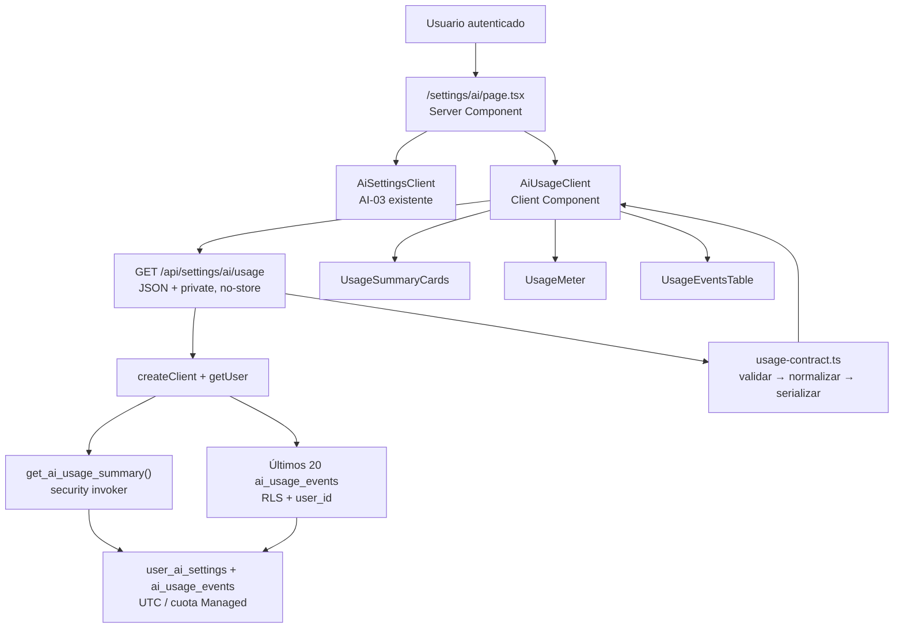
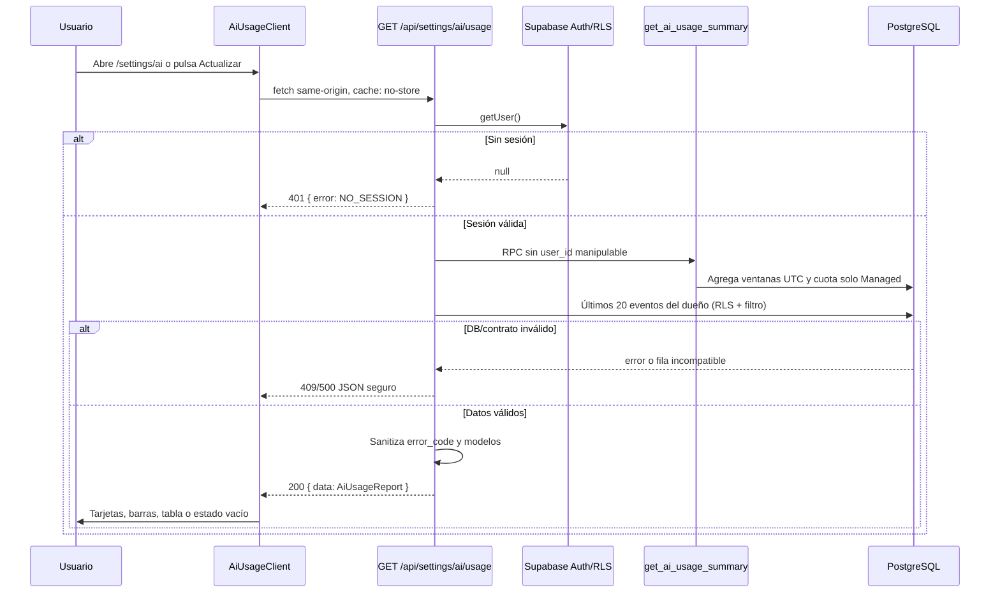

# AI-04 — UI/API: consumo de tokens, llamadas y límites

> **Estado:** Implementado y verificado.
> **Fecha de generación:** 13/07/2026.
> **Fecha de implementación/verificación:** 19/07/2026.
> **Skill:** `istqb-fe-guide-generator`.
> **Dependencias verificadas:** AI-01, AI-02, AI-03 y DA-01 están implementadas y verificadas.
> **Alcance:** Esta guía corrige la serialización de cuota/finalización Managed, crea el contrato de lectura de uso, una RPC de resumen segura, `GET /api/settings/ai/usage`, una sección de consumo dentro de `/settings/ai`, cuatro componentes de presentación y fixtures. No conecta todavía los endpoints LLM existentes al runtime: esa instrumentación pertenece exclusivamente a AI-05.

---

## Addendum Correctivo Obligatorio

Antes de construir medidores de cuota, hay que reconciliar tres contratos reales que hoy divergen:

1. La migración AI-01 declara que los límites de `user_ai_settings` aplican al modo `managed`; los eventos BYOK se guardan solo para auditoría. Sin embargo, `reserve_ai_quota(...)` de AI-02 suma todos los eventos del usuario sin filtrar `mode = 'managed'`. Un evento BYOK exitoso puede, por tanto, agotar una cuota pagada por la plataforma y volver engañoso cualquier medidor de AI-04.
2. `reserve_ai_quota(...)` usa un advisory lock por usuario, pero `recordAiUsage()` finaliza la reserva con un `UPDATE` directo que no toma ese lock. Una finalización puede cambiar tokens mientras otra reserva está agregando el consumo. La corrección necesita una RPC de finalización con el mismo lock, `FOR UPDATE` e idempotencia por `eventId`; no basta con un `UPDATE` filtrado por `QUOTA_RESERVED`.
3. `resolveAiRuntime()` y `recordAiUsage()` no tienen consumidores fuera de `frontend/lib/ai/runtime.ts`. Es correcto para la secuencia actual: AI-05 conectará los Route Handlers LLM. AI-04 debe mostrar un estado vacío honesto; no puede afirmar que ya existe telemetría completa ni convertir la ausencia de eventos en una lectura de proveedor exitosa.

| Operación correctiva | Archivo / anchor real |
|---|---|
| **CREAR** migración que limita la reserva a eventos `managed`, serializa la finalización y agrega el resumen seguro | `supabase/migrations/<timestamp>_scope_managed_ai_quota_and_add_usage_summary.sql` |
| **MODIFICAR** finalización Managed para usar la nueva RPC en lugar de `UPDATE` directo | `frontend/lib/ai/runtime.ts` |
| **MODIFICAR** contrato manual de funciones de Supabase | `frontend/types/database.ts`, bloque `Functions` |
| **MODIFICAR** barrel de tipos | `frontend/types/index.ts`, exportaciones de AI-02 |
| **CREAR** contrato/normalizador puro | `frontend/lib/ai/usage-contract.ts` |
| **CREAR** Route Handler autenticado | `frontend/app/api/settings/ai/usage/route.ts` |
| **CREAR** UI de lectura | `frontend/app/(dashboard)/settings/ai/_components/ai-usage-client.tsx` y cuatro componentes hermanos |
| **MODIFICAR** página existente | `frontend/app/(dashboard)/settings/ai/page.tsx` |
| **CREAR** fixture remoto | `frontend/scripts/verify-ai04-usage.mjs` |

**Gate de implementación:** no muestres un porcentaje de cuota Managed hasta aplicar la migración de este addendum y hasta que el fixture imprima `PASS AI-04`. El porcentaje es una fotografía informativa; la autorización y la finalización Managed deben quedar serializadas por `reserve_ai_quota(...)` y `finalize_managed_ai_usage(...)`.

**Límite deliberado:** la pantalla y `GET /api/settings/ai/usage` de AI-04 no llaman a Gemini/OpenAI, no reservan cuota y no crean eventos. El addendum solo corrige cómo se finaliza una reserva Managed ya existente. AI-05 será el productor de eventos al envolver cada llamada real con `resolveAiRuntime()` y `recordAiUsage()`.

---

## Sección 1: 🎓 Introducción y Fundamentos Conceptuales

### Analogía profesional

Imagina dos contadores en una empresa. El primero es un registro de actividad: anota cada café servido, incluso el que un empleado pagó con su propio termo. El segundo es la caja de la empresa: solo descuenta los cafés pagados por el presupuesto corporativo. Ambos contadores son útiles, pero responder preguntas diferentes.

En ISTQB Study Agent, `ai_usage_events` es el registro de actividad. Conserva llamadas demo, Managed y BYOK para trazabilidad. Las cuotas de `user_ai_settings`, en cambio, protegen el presupuesto Managed del proyecto. Si mezcláramos ambos contadores, un café BYOK podría gastar la caja de la empresa: exactamente la contradicción que el addendum corrige antes de dibujar una barra de progreso.

AI-04 convierte eventos crudos en un informe seguro: actividad diaria/mensual, cuota Managed observada, bloqueos, reservas pendientes y últimos eventos sanitizados. El usuario recibe información útil, pero nunca una API key, prompt, `error_code` interno ni una promesa falsa de que un valor observado autoriza la próxima llamada.

### Conceptos React, Next.js y Supabase relevantes

- **Route Handler dinámico y autenticado:** `GET /api/settings/ai/usage` usa `createClient()` y `getUser()`. En Next.js 16, `cookies()` es asíncrono y convierte la lectura en request-time; el Handler devuelve JSON `401`, nunca un redirect HTML.
- **RLS + filtro explícito:** La policy `ai_usage_events_select_own` limita las filas a `auth.uid() = user_id`. El Handler añade además `.eq("user_id", user.id)`: RLS mantiene la seguridad y el filtro expresa la intención y aprovecha el índice `(user_id, created_at DESC)`.
- **RPC `security invoker`:** El resumen se calcula en PostgreSQL para no descargar todos los eventos BYOK de un mes al navegador o a Node.js. Al ejecutarse con los permisos del invocador, RLS sigue vigente y la función no acepta un `user_id` manipulable.
- **Una sola exclusión mutua para reserva/finalización:** tanto `reserve_ai_quota` como `finalize_managed_ai_usage` toman el mismo advisory lock de usuario. Así una suma no se calcula mientras otra transacción cambia los tokens que esa suma debe ver.
- **Contrato puro entre servidor y cliente:** El Route Handler normaliza filas de DB y devuelve un DTO sin campos internos. El Client Component vuelve a validar el JSON antes de renderizar; si encuentra datos legacy o malformados, muestra error en vez de simular consumo `0`.
- **Ventanas UTC:** AI-02 ya reserva cuotas con límites diarios/mensuales UTC. AI-04 calcula y etiqueta sus periodos en UTC; el navegador no puede reinterpretar silenciosamente el inicio del día según la zona local.

---

## Sección 2: 📋 Prerequisitos y Verificación del Entorno

Desde la raíz del repositorio:

```powershell
Set-Location "C:\Users\jsife\OneDrive\Desktop\Repositorios\practica-testing"
```

### Versiones comprobadas

```powershell
node --version
# v24.16.0

node -e "const p=require('./frontend/node_modules/next/package.json'); console.log(p.version, p.engines.node)"
# 16.2.9 >=20.9.0

node -e "console.log(require('./frontend/node_modules/typescript/package.json').version)"
# 5.9.3

supabase --version
# 2.101.0
```

Next.js 16.2.9 requiere Node `>=20.9.0`; la versión instalada supera el mínimo. La documentación local confirma que los Route Handlers GET son dinámicos por defecto desde Next 15 y que `cookies()` es asíncrono, por lo que no se necesita `useSearchParams`, Suspense ni un redirect de Proxy para esta API.

### Dependencias reales

```powershell
Test-Path -LiteralPath "frontend\lib\ai\runtime.ts"
# True

Test-Path -LiteralPath "frontend\app\(dashboard)\settings\ai\page.tsx"
# True

Test-Path -LiteralPath "frontend\scripts\verify-ai02-quota.mjs"
# True

Test-Path -LiteralPath "frontend\scripts\verify-ai03-settings.mjs"
# True

node --env-file=frontend/.env.local frontend/scripts/verify-ai02-quota.mjs
# PASS AI-02: concurrencia e idempotencia

node --env-file=frontend/.env.local frontend/scripts/verify-ai03-settings.mjs
# PASS AI-03: permisos por columna + update/insert limitado
```

Los dos últimos fixtures se ejecutaron antes de redactar esta guía. Crean usuarios efímeros y no imprimen secretos.

### Línea base

```powershell
npx tsc --noEmit --project frontend/tsconfig.json
# Sin errores

npm --prefix frontend run build
# ▲ Next.js 16.2.9 (Turbopack)
# ✓ Compiled successfully
# ✓ Generating static pages (24/24)
# Sin warnings
```

### Migración nueva, nunca una edición histórica

AI-01 y AI-02 ya están desplegadas. No edites sus archivos históricos ni los renombres. El CLI instalado confirma estos comandos:

```powershell
supabase migration new scope_managed_ai_quota_and_add_usage_summary
# Crea un archivo nuevo en supabase/migrations/

supabase db push --linked --dry-run
# Muestra el plan sin aplicarlo

supabase migration list --linked
# Compara historial local y remoto
```

Ejecuta el `db push --linked` real solo después de revisar la migración y el código del fixture de la Sección 6; el fixture se ejecuta después del push. No muestres credenciales de Supabase ni pases `--db-url` en capturas o documentación.

---

## Sección 3: 📂 Estructura de Directorios del Proyecto

```text
practica-testing/
├── supabase/migrations/
│   └── <timestamp>_scope_managed_ai_quota_and_add_usage_summary.sql  ← NUEVO
├── frontend/
│   ├── scripts/
│   │   └── verify-ai04-usage.mjs                                    ← NUEVO
│   ├── types/
│   │   ├── database.ts                                               ← MODIFICAR
│   │   └── index.ts                                                  ← MODIFICAR
│   ├── lib/ai/
│   │   ├── runtime.ts                                                ← MODIFICAR
│   │   └── usage-contract.ts                                         ← NUEVO
│   └── app/
│       ├── api/settings/ai/usage/
│       │   └── route.ts                                              ← NUEVO
│       └── (dashboard)/settings/ai/
│           ├── page.tsx                                              ← MODIFICAR
│           └── _components/
│               ├── ai-usage-client.tsx                              ← NUEVO
│               ├── usage-summary-cards.tsx                          ← NUEVO
│               ├── usage-meter.tsx                                  ← NUEVO
│               ├── usage-events-table.tsx                           ← NUEVO
│               └── (QuotaNotice interno a usage-summary-cards.tsx)
```

| Crear | Modificar | No tocar |
|---|---|---|
| Una migración con tres RPC, contrato de uso, Handler, cuatro componentes y fixture | `types/database.ts`, `types/index.ts`, `lib/ai/runtime.ts`, `settings/ai/page.tsx` | `model-cascade.ts`, `settings-contract.ts`, `proxy.ts`, navegación, `.env*`, backend y los Route Handlers LLM existentes |

No se agrega una mini-card al dashboard: el roadmap la marca como opcional y DA-01 no necesita extenderse para cumplir el objetivo de AI-04. Mantener el informe dentro de `/settings/ai` reduce duplicación y evita un segundo contrato de métricas.

---

## Sección 4: 🎨 Diagrama de Arquitectura de Componentes



### Flujo Completo



### Matriz productor → contrato → consumidor

| Productor | Tipo de dominio | Validación/normalización | Persistencia/API | Consumidor |
|---|---|---|---|---|
| AI-02/AI-04 `reserve_ai_quota` | Reserva, bloqueo o duplicado | PostgreSQL, lock por usuario e idempotencia | `ai_usage_events` | Cuota Managed observada |
| AI-04 `finalize_managed_ai_usage` | Finalización o duplicado | Mismo lock, `FOR UPDATE`, valores exactos | `ai_usage_events` | Cuota correcta ante concurrencia |
| AI-02 `recordAiUsage` actualizado | Éxito/error final | Tokens no negativos; total derivado y RPC finalizadora | `ai_usage_events` | Actividad y últimos eventos |
| AI-03 | `UserAiSettingsRow` | `isUserAiSettingsRow` | `user_ai_settings` | Límites y modo actual |
| AI-04 RPC | `GetAiUsageSummaryRowDB` | `isGetAiUsageSummaryRow` | `GET /api/settings/ai/usage` | `AiUsageClient` |
| AI-04 contrato | `AiUsageReport` | `isAiUsageApiResponse` | JSON sanitizado | Tarjetas, medidores y tabla |

---

## Sección 5: 🛠️ Implementación Paso a Paso

### Paso A: corregir el alcance de cuota, serializar la finalización y crear el resumen SQL

**Ruta:** `supabase/migrations/<timestamp>_scope_managed_ai_quota_and_add_usage_summary.sql` — CREAR

**Acción:** primero ejecuta `supabase migration new scope_managed_ai_quota_and_add_usage_summary`. Pega el contenido completo siguiente en el archivo generado. No modifiques `20260713031619_add_ai_quota_reservation.sql`.

```sql
-- La cuota de plataforma corresponde solamente a llamadas Managed.
-- BYOK se conserva para auditoría, pero no puede consumir presupuesto Managed.
create or replace function public.reserve_ai_quota(
  p_user_id uuid,
  p_event_id uuid,
  p_feature text,
  p_provider text,
  p_model_name text,
  p_reserved_prompt_tokens integer,
  p_reserved_completion_tokens integer
)
returns table (
  reservation_outcome text,
  block_reason text,
  daily_requests bigint,
  daily_tokens bigint,
  monthly_requests bigint,
  monthly_tokens bigint
)
language plpgsql
security invoker
set search_path = ''
as $$
declare
  v_settings public.user_ai_settings%rowtype;
  v_existing public.ai_usage_events%rowtype;
  v_day_start timestamptz;
  v_month_start timestamptz;
  v_daily_requests bigint := 0;
  v_daily_tokens bigint := 0;
  v_monthly_requests bigint := 0;
  v_monthly_tokens bigint := 0;
  v_reserved_total integer;
  v_reason text;
begin
  if p_reserved_prompt_tokens < 0 or p_reserved_completion_tokens < 0 then
    raise exception 'AI_QUOTA_INVALID_TOKEN_RESERVATION' using errcode = '22023';
  end if;

  v_reserved_total := p_reserved_prompt_tokens + p_reserved_completion_tokens;
  v_day_start := date_trunc('day', timezone('UTC', clock_timestamp())) at time zone 'UTC';
  v_month_start := date_trunc('month', timezone('UTC', clock_timestamp())) at time zone 'UTC';

  perform pg_advisory_xact_lock(hashtextextended(p_user_id::text, 0));

  select e.*
  into v_existing
  from public.ai_usage_events as e
  where e.id = p_event_id;

  -- AI-04: el filtro mode = 'managed' alinea el contador con AI-01.
  select
    coalesce(sum(e.request_units) filter (where e.created_at >= v_day_start), 0),
    coalesce(sum(e.total_tokens) filter (where e.created_at >= v_day_start), 0),
    coalesce(sum(e.request_units), 0),
    coalesce(sum(e.total_tokens), 0)
  into v_daily_requests, v_daily_tokens, v_monthly_requests, v_monthly_tokens
  from public.ai_usage_events as e
  where e.user_id = p_user_id
    and e.mode = 'managed'
    and e.created_at >= v_month_start;

  if v_existing.id is not null then
    if v_existing.user_id <> p_user_id or v_existing.feature <> p_feature then
      raise exception 'AI_QUOTA_EVENT_ID_CONFLICT' using errcode = '22023';
    end if;

    return query select
      'duplicate'::text,
      v_existing.error_code,
      v_daily_requests,
      v_daily_tokens,
      v_monthly_requests,
      v_monthly_tokens;
    return;
  end if;

  select s.*
  into v_settings
  from public.user_ai_settings as s
  where s.user_id = p_user_id
  for update;

  if not found or v_settings.mode <> 'managed' then
    raise exception 'AI_QUOTA_MANAGED_MODE_REQUIRED' using errcode = '22023';
  end if;

  if v_settings.provider <> p_provider then
    raise exception 'AI_QUOTA_PROVIDER_MISMATCH' using errcode = '22023';
  end if;

  if v_daily_requests + 1 > v_settings.daily_request_limit then
    v_reason := 'DAILY_REQUEST_LIMIT';
  elsif v_monthly_requests + 1 > v_settings.monthly_request_limit then
    v_reason := 'MONTHLY_REQUEST_LIMIT';
  elsif v_daily_tokens + v_reserved_total > v_settings.daily_token_limit then
    v_reason := 'DAILY_TOKEN_LIMIT';
  elsif v_monthly_tokens + v_reserved_total > v_settings.monthly_token_limit then
    v_reason := 'MONTHLY_TOKEN_LIMIT';
  end if;

  if v_reason is not null then
    insert into public.ai_usage_events (
      id, user_id, feature, mode, provider, model_name,
      prompt_tokens, completion_tokens, total_tokens,
      request_units, status, error_code
    ) values (
      p_event_id, p_user_id, p_feature, 'managed', p_provider, p_model_name,
      0, 0, 0, 0, 'blocked_quota', v_reason
    );

    return query select
      'blocked'::text, v_reason, v_daily_requests, v_daily_tokens,
      v_monthly_requests, v_monthly_tokens;
    return;
  end if;

  insert into public.ai_usage_events (
    id, user_id, feature, mode, provider, model_name,
    prompt_tokens, completion_tokens, total_tokens,
    request_units, status, error_code
  ) values (
    p_event_id, p_user_id, p_feature, 'managed', p_provider, p_model_name,
    p_reserved_prompt_tokens, p_reserved_completion_tokens, v_reserved_total,
    1, 'error', 'QUOTA_RESERVED'
  );

  return query select
    'reserved'::text,
    null::text,
    v_daily_requests + 1,
    v_daily_tokens + v_reserved_total,
    v_monthly_requests + 1,
    v_monthly_tokens + v_reserved_total;
end;
$$;

revoke all on function public.reserve_ai_quota(
  uuid, uuid, text, text, text, integer, integer
) from public, anon, authenticated;

grant execute on function public.reserve_ai_quota(
  uuid, uuid, text, text, text, integer, integer
) to service_role;

-- La finalización usa el mismo lock que la reserva. Así una request nueva no
-- agrega tokens mientras la request anterior está reemplazando su estimación
-- reservada por el uso final observado.
create or replace function public.finalize_managed_ai_usage(
  p_user_id uuid,
  p_event_id uuid,
  p_prompt_tokens integer,
  p_completion_tokens integer,
  p_status text,
  p_error_code text
)
returns table (
  finalization_outcome text,
  accounted_prompt_tokens integer,
  accounted_completion_tokens integer,
  accounted_total_tokens integer
)
language plpgsql
security invoker
set search_path = ''
as $$
declare
  v_existing public.ai_usage_events%rowtype;
  v_total integer;
begin
  if p_user_id is null or p_event_id is null then
    raise exception 'AI_USAGE_FINALIZATION_ID_REQUIRED' using errcode = '22023';
  end if;

  if (
    p_prompt_tokens is null
    or p_completion_tokens is null
    or p_prompt_tokens < 0
    or p_completion_tokens < 0
  ) then
    raise exception 'AI_USAGE_FINALIZATION_INVALID_TOKENS' using errcode = '22023';
  end if;

  if p_status is null or p_status not in ('success', 'error') then
    raise exception 'AI_USAGE_FINALIZATION_INVALID_STATUS' using errcode = '22023';
  end if;

  if (
    (p_status = 'success' and p_error_code is not null)
    or (
      p_status = 'error'
      and (
        p_error_code is null
        or char_length(btrim(p_error_code)) not between 1 and 100
        -- Este valor identifica una reserva transitoria; nunca es un error
        -- final que deba conservarse en una fila ya terminada.
        or p_error_code = 'QUOTA_RESERVED'
      )
    )
  ) then
    raise exception 'AI_USAGE_FINALIZATION_INVALID_ERROR_CODE' using errcode = '22023';
  end if;

  v_total := p_prompt_tokens + p_completion_tokens;
  perform pg_advisory_xact_lock(hashtextextended(p_user_id::text, 0));

  select e.*
  into v_existing
  from public.ai_usage_events as e
  where e.id = p_event_id
  for update;

  if not found then
    raise exception 'AI_USAGE_RESERVATION_NOT_FOUND' using errcode = '22023';
  end if;

  if (
    v_existing.user_id is distinct from p_user_id
    or v_existing.mode <> 'managed'
  ) then
    raise exception 'AI_USAGE_RESERVATION_IDENTITY_CONFLICT' using errcode = '22023';
  end if;

  -- Repetir exactamente la misma finalización es seguro. Una segunda
  -- finalización con cifras/estado distintos se rechaza, nunca reescribe el log.
  if (
    v_existing.status = p_status
    and v_existing.prompt_tokens = p_prompt_tokens
    and v_existing.completion_tokens = p_completion_tokens
    and v_existing.total_tokens = v_total
    and v_existing.error_code is not distinct from p_error_code
  ) then
    return query select
      'duplicate'::text,
      v_existing.prompt_tokens,
      v_existing.completion_tokens,
      v_existing.total_tokens;
    return;
  end if;

  if (
    v_existing.status <> 'error'
    or v_existing.error_code is distinct from 'QUOTA_RESERVED'
  ) then
    raise exception 'AI_USAGE_FINALIZATION_CONFLICT' using errcode = '22023';
  end if;

  -- Guardar el uso observado, aunque supere la estimación inicial. Recortarlo
  -- ocultaría costo; gracias al mismo lock, la siguiente reserva verá este valor
  -- final y se bloqueará si ya no queda presupuesto.
  update public.ai_usage_events
  set
    prompt_tokens = p_prompt_tokens,
    completion_tokens = p_completion_tokens,
    total_tokens = v_total,
    status = p_status,
    error_code = p_error_code
  where id = p_event_id
  returning * into v_existing;

  return query select
    'finalized'::text,
    v_existing.prompt_tokens,
    v_existing.completion_tokens,
    v_existing.total_tokens;
end;
$$;

revoke all on function public.finalize_managed_ai_usage(
  uuid, uuid, integer, integer, text, text
) from public, anon, authenticated;

grant execute on function public.finalize_managed_ai_usage(
  uuid, uuid, integer, integer, text, text
) to service_role;

comment on function public.finalize_managed_ai_usage(
  uuid, uuid, integer, integer, text, text
) is 'Finaliza una reserva Managed bajo el mismo advisory lock de reserve_ai_quota; idempotente por event_id.';

-- Devuelve siempre una sola fila. No recibe user_id: el dueño procede de auth.uid().
create or replace function public.get_ai_usage_summary()
returns table (
  observed_at timestamptz,
  day_start timestamptz,
  month_start timestamptz,
  activity_daily_requests bigint,
  activity_daily_tokens bigint,
  activity_monthly_requests bigint,
  activity_monthly_tokens bigint,
  quota_daily_requests bigint,
  quota_daily_tokens bigint,
  quota_monthly_requests bigint,
  quota_monthly_tokens bigint,
  blocked_daily_events bigint,
  blocked_monthly_events bigint,
  pending_finalizations bigint
)
language sql
security invoker
set search_path = ''
as $$
  with sampled_now as (
    select clock_timestamp() as observed_at
  ),
  bounds as (
    select
      observed_at,
      date_trunc('day', timezone('UTC', observed_at)) at time zone 'UTC' as day_start,
      date_trunc('month', timezone('UTC', observed_at)) at time zone 'UTC' as month_start
    from sampled_now
  ),
  monthly_events as (
    select e.*
    from public.ai_usage_events as e
    cross join bounds as b
    where e.user_id = (select auth.uid())
      and e.created_at >= b.month_start
  )
  select
    b.observed_at,
    b.day_start,
    b.month_start,
    coalesce(sum(e.request_units) filter (where e.created_at >= b.day_start), 0)::bigint,
    coalesce(sum(e.total_tokens) filter (where e.created_at >= b.day_start), 0)::bigint,
    coalesce(sum(e.request_units), 0)::bigint,
    coalesce(sum(e.total_tokens), 0)::bigint,
    coalesce(sum(e.request_units) filter (
      where e.mode = 'managed' and e.created_at >= b.day_start
    ), 0)::bigint,
    coalesce(sum(e.total_tokens) filter (
      where e.mode = 'managed' and e.created_at >= b.day_start
    ), 0)::bigint,
    coalesce(sum(e.request_units) filter (where e.mode = 'managed'), 0)::bigint,
    coalesce(sum(e.total_tokens) filter (where e.mode = 'managed'), 0)::bigint,
    count(*) filter (
      where e.status = 'blocked_quota' and e.created_at >= b.day_start
    )::bigint,
    count(*) filter (where e.status = 'blocked_quota')::bigint,
    count(*) filter (
      where e.mode = 'managed'
        and e.status = 'error'
        and e.error_code = 'QUOTA_RESERVED'
    )::bigint
  from bounds as b
  left join monthly_events as e on true
  group by b.observed_at, b.day_start, b.month_start;
$$;

revoke all on function public.get_ai_usage_summary() from public, anon;
grant execute on function public.get_ai_usage_summary() to authenticated, service_role;

comment on function public.get_ai_usage_summary() is
  'Resumen UTC del dueño autenticado: actividad total y cuota Managed; no expone eventos ni acepta user_id.';
```

**Por qué esta decisión:** no uses `SELECT` de eventos + cálculos en el cliente como fuente de autorización. `reserve_ai_quota` sigue siendo el guard atómico y `finalize_managed_ai_usage` usa el mismo lock para que la contabilidad no cambie a mitad de una reserva. `get_ai_usage_summary` solo crea una fotografía de lectura bajo RLS. Separar autorización, finalización y observabilidad evita una carrera y evita descargar un historial BYOK no acotado para calcular una suma.

**Entregable:** las cuotas Managed dejan de mezclarse con BYOK, la finalización queda serializada e idempotente y existe una única consulta de resumen UTC protegida por RLS.

### Paso B: extender los tipos manuales de Supabase

**Rutas:** `frontend/types/database.ts` y `frontend/types/index.ts` — MODIFICAR

**Anchor:** después de `ReserveAiQuotaRowDB`, agrega los resultados de las dos RPC nuevas:

```typescript
export interface FinalizeManagedAiUsageRowDB {
  finalization_outcome: "finalized" | "duplicate";
  accounted_prompt_tokens: number;
  accounted_completion_tokens: number;
  accounted_total_tokens: number;
}

export interface GetAiUsageSummaryRowDB {
  observed_at: string;
  day_start: string;
  month_start: string;
  activity_daily_requests: number;
  activity_daily_tokens: number;
  activity_monthly_requests: number;
  activity_monthly_tokens: number;
  quota_daily_requests: number;
  quota_daily_tokens: number;
  quota_monthly_requests: number;
  quota_monthly_tokens: number;
  blocked_daily_events: number;
  blocked_monthly_events: number;
  pending_finalizations: number;
}
```

En `Database["public"]["Functions"]`, conserva `reserve_ai_quota` y agrega ambas entradas hermanas:

```typescript
finalize_managed_ai_usage: {
  Args: {
    p_user_id: string;
    p_event_id: string;
    p_prompt_tokens: number;
    p_completion_tokens: number;
    p_status: "success" | "error";
    p_error_code: string | null;
  };
  Returns: FinalizeManagedAiUsageRowDB[];
};

get_ai_usage_summary: {
  Args: Record<PropertyKey, never>;
  Returns: GetAiUsageSummaryRowDB[];
};
```

Por último, agrega ambos tipos junto a los re-exports de AI-02 en `frontend/types/index.ts`:

```typescript
FinalizeManagedAiUsageRowDB,
GetAiUsageSummaryRowDB,
```

**Por qué importa:** `supabase.rpc("finalize_managed_ai_usage")` y `supabase.rpc("get_ai_usage_summary")` dejan de ser nombres mágicos. Los tipos reflejan las filas reales de PostgreSQL, mientras el contrato del paso siguiente valida que la respuesta recibida conserve esa forma en runtime.

**Entregable:** las RPC nuevas son invocables con tipos estrictos y sin casts.

### Paso C: finalizar Managed dentro de la misma exclusión mutua

**Ruta:** `frontend/lib/ai/runtime.ts` — MODIFICAR

En la función `recordAiUsage`, conserva la validación existente de
`normalizedErrorCode`, `tokens` y los inserts Demo/BYOK. Reemplaza **solo** el
bloque `if (input.mode === "managed") { ... }` que hoy hace `.update(...)`
directo por lo siguiente:

```typescript
if (input.mode === "managed") {
  // La RPC comparte el advisory lock con reserve_ai_quota. Acepta un reintento
  // idéntico como duplicate, pero nunca deja que otro payload reescriba el log.
  const finalized = await admin.rpc("finalize_managed_ai_usage", {
    p_user_id: input.userId,
    p_event_id: input.eventId,
    p_prompt_tokens: tokens.prompt_tokens,
    p_completion_tokens: tokens.completion_tokens,
    p_status: input.status,
    p_error_code: input.status === "success" ? null : normalizedErrorCode ?? null,
  });
  const row = finalized.data?.[0];

  if (
    finalized.error ||
    !row ||
    (row.finalization_outcome !== "finalized" &&
      row.finalization_outcome !== "duplicate")
  ) {
    throw new Error("AI_USAGE_FINALIZATION_FAILED");
  }
  return;
}
```

No añadas un `SELECT` previo, no reintroduzcas el `UPDATE` directo y no uses
el resultado `duplicate` para volver a llamar al proveedor. Si un proveedor
reporta más tokens que la estimación reservada, la RPC conserva el uso
observado: ocultarlo sería subcontar costo; la siguiente reserva, protegida por
el mismo lock, verá el total nuevo y bloqueará si corresponde.

**Entrada:** un `eventId` que ya fue reservado, los tokens normalizados y el
estado final `success`/`error`.

**Salida:** una finalización o un duplicado idempotente. Un evento inexistente,
de otro usuario, ya finalizado con otro payload o con el marcador
`QUOTA_RESERVED` como error final falla cerrado.

**Entregable:** reserva y finalización Managed comparten la misma barrera de
concurrencia antes de que AI-05 tenga consumidores reales.

### Paso D: crear el contrato puro de uso y sanitización

**Ruta:** `frontend/lib/ai/usage-contract.ts` — CREAR

Este módulo no tiene `server-only`, no crea clientes ni lee variables de entorno. El servidor lo usa para convertir filas de Supabase en un DTO y el cliente lo usa para rechazar JSON corrupto. La validación sigue el orden correcto: discriminantes (`mode`, `status`, `feature`) antes de los campos que dependen de ellos.

```typescript
// frontend/lib/ai/usage-contract.ts
import type {
  AiFeature,
  AiUsageEventRow,
  AiUsageMode,
  AiUsageStatus,
  GetAiUsageSummaryRowDB,
  UserAiSettingsRow,
} from "@/types";
import {
  isPlainObject,
  isUserAiSettingsRow,
  parseAiProvider,
  parseAiUsageMode,
} from "./settings-contract";

export const AI_USAGE_FEATURES = [
  "plan",
  "theory",
  "quiz",
  "evaluate",
  "practice_generate",
  "practice_evaluate",
] as const satisfies readonly AiFeature[];

export type AiUsageDisplayStatus =
  | "success"
  | "blocked"
  | "pending"
  | "error";

export type AiQuotaLevel = "normal" | "warning" | "reached";

export interface UsageCounter {
  requests: number;
  tokens: number;
}

export interface UsageMeter {
  used: number;
  limit: number;
  percentage: number;
  level: AiQuotaLevel;
}

export interface AiUsageDisplayEvent {
  id: string;
  occurredAt: string;
  feature: AiFeature;
  mode: AiUsageMode;
  status: AiUsageDisplayStatus;
  requestUnits: number;
  totalTokens: number;
}

export interface AiUsageReport {
  generatedAt: string;
  timezone: "UTC";
  period: {
    dayStartsAt: string;
    monthStartsAt: string;
  };
  activity: {
    today: UsageCounter;
    month: UsageCounter;
    blockedToday: number;
    blockedMonth: number;
    pendingFinalizations: number;
  };
  quota: {
    scope: "managed";
    enforcementActive: boolean;
    daily: {
      requests: UsageMeter;
      tokens: UsageMeter;
    };
    month: {
      requests: UsageMeter;
      tokens: UsageMeter;
    };
  };
  lastEvents: AiUsageDisplayEvent[];
}

function isNonNegativeSafeInteger(value: unknown): value is number {
  return (
    typeof value === "number" &&
    Number.isSafeInteger(value) &&
    value >= 0
  );
}

function isIsoTimestamp(value: unknown): value is string {
  return (
    typeof value === "string" &&
    value.length > 0 &&
    Number.isFinite(Date.parse(value))
  );
}

function isBoundedNonEmptyString(value: unknown, maxLength: number): value is string {
  return (
    typeof value === "string" &&
    value.trim().length > 0 &&
    value.length <= maxLength
  );
}

function parseAiFeature(value: unknown): AiFeature | null {
  switch (value) {
    case "plan":
    case "theory":
    case "quiz":
    case "evaluate":
    case "practice_generate":
    case "practice_evaluate":
      return value;
    default:
      return null;
  }
}

function parseAiUsageStatus(value: unknown): AiUsageStatus | null {
  switch (value) {
    case "success":
    case "blocked_quota":
    case "error":
      return value;
    default:
      return null;
  }
}

/**
 * Comprueba una fila antes de agregarla o serializarla. Los tipos generados
 * describen la intención de la base; este guard protege ante datos legacy,
 * respuestas incompletas o cambios de schema todavía no reflejados en el cliente.
 */
export function isAiUsageEventRow(value: unknown): value is AiUsageEventRow {
  if (!isPlainObject(value)) return false;

  const feature = parseAiFeature(value.feature);
  const mode = parseAiUsageMode(value.mode);
  const status = parseAiUsageStatus(value.status);

  if (
    !isBoundedNonEmptyString(value.id, 100) ||
    !isBoundedNonEmptyString(value.user_id, 100) ||
    feature === null ||
    mode === null ||
    status === null ||
    !isNonNegativeSafeInteger(value.prompt_tokens) ||
    !isNonNegativeSafeInteger(value.completion_tokens) ||
    !isNonNegativeSafeInteger(value.total_tokens) ||
    !isNonNegativeSafeInteger(value.request_units) ||
    !isIsoTimestamp(value.created_at) ||
    value.total_tokens !== value.prompt_tokens + value.completion_tokens
  ) {
    return false;
  }

  if (mode === "demo") {
    if (value.provider !== null || value.model_name !== null) return false;
  } else if (
    parseAiProvider(value.provider) === null ||
    !isBoundedNonEmptyString(value.model_name, 100)
  ) {
    return false;
  }

  if (status === "success") return value.error_code === null;

  if (!isBoundedNonEmptyString(value.error_code, 100)) return false;

  if (status === "blocked_quota") {
    return (
      mode === "managed" &&
      value.request_units === 0 &&
      value.total_tokens === 0
    );
  }

  // El marcador transitorio solo lo crea reserve_ai_quota: conserva una
  // unidad y tokens reservados. Un dato legacy con el mismo texto no puede
  // disfrazarse de una reserva pendiente.
  if (value.error_code === "QUOTA_RESERVED") {
    return (
      mode === "managed" &&
      value.request_units === 1 &&
      value.total_tokens > 0
    );
  }

  return true;
}

function hasGetAiUsageSummaryScalars(
  value: Record<string, unknown>,
): value is Record<string, unknown> & GetAiUsageSummaryRowDB {
  return (
    isIsoTimestamp(value.observed_at) &&
    isIsoTimestamp(value.day_start) &&
    isIsoTimestamp(value.month_start) &&
    isNonNegativeSafeInteger(value.activity_daily_requests) &&
    isNonNegativeSafeInteger(value.activity_daily_tokens) &&
    isNonNegativeSafeInteger(value.activity_monthly_requests) &&
    isNonNegativeSafeInteger(value.activity_monthly_tokens) &&
    isNonNegativeSafeInteger(value.quota_daily_requests) &&
    isNonNegativeSafeInteger(value.quota_daily_tokens) &&
    isNonNegativeSafeInteger(value.quota_monthly_requests) &&
    isNonNegativeSafeInteger(value.quota_monthly_tokens) &&
    isNonNegativeSafeInteger(value.blocked_daily_events) &&
    isNonNegativeSafeInteger(value.blocked_monthly_events) &&
    isNonNegativeSafeInteger(value.pending_finalizations)
  );
}

export function isGetAiUsageSummaryRow(
  value: unknown,
): value is GetAiUsageSummaryRowDB {
  if (!isPlainObject(value) || !hasGetAiUsageSummaryScalars(value)) {
    return false;
  }

  // La RPC nunca debe devolver una cuota mayor que la actividad que la
  // contiene, ni un subtotal diario mayor que su total mensual.
  return (
    value.activity_daily_requests <= value.activity_monthly_requests &&
    value.activity_daily_tokens <= value.activity_monthly_tokens &&
    value.quota_daily_requests <= value.quota_monthly_requests &&
    value.quota_daily_tokens <= value.quota_monthly_tokens &&
    value.quota_daily_requests <= value.activity_daily_requests &&
    value.quota_daily_tokens <= value.activity_daily_tokens &&
    value.quota_monthly_requests <= value.activity_monthly_requests &&
    value.quota_monthly_tokens <= value.activity_monthly_tokens &&
    value.blocked_daily_events <= value.blocked_monthly_events &&
    value.pending_finalizations <= value.quota_monthly_requests
  );
}

function createMeter(used: number, limit: number): UsageMeter {
  // Un límite 0 significa que la siguiente llamada Managed quedará bloqueada,
  // incluso cuando el uso acumulado todavía sea 0.
  const percentage =
    limit === 0 ? 100 : Math.min(100, Math.round((used / limit) * 100));
  const level: AiQuotaLevel =
    percentage >= 100 ? "reached" : percentage >= 80 ? "warning" : "normal";

  return { used, limit, percentage, level };
}

function toDisplayStatus(event: AiUsageEventRow): AiUsageDisplayStatus {
  if (event.status === "success") return "success";
  if (event.status === "blocked_quota") return "blocked";

  // Es una reserva Managed ya contada, no un error de proveedor que deba
  // mostrarse con el código interno QUOTA_RESERVED.
  return event.error_code === "QUOTA_RESERVED" ? "pending" : "error";
}

function toDisplayEvent(event: AiUsageEventRow): AiUsageDisplayEvent {
  return {
    id: event.id,
    occurredAt: event.created_at,
    feature: event.feature,
    mode: event.mode,
    status: toDisplayStatus(event),
    requestUnits: event.request_units,
    totalTokens: event.total_tokens,
  };
}

/**
 * Construye el DTO público. Los totales de actividad incluyen eventos BYOK
 * para auditoría; los medidores de cuota usan exclusivamente columnas quota_*
 * de la RPC, que representan el presupuesto Managed.
 */
export function buildAiUsageReport(
  settings: unknown,
  summary: unknown,
  events: readonly unknown[],
): AiUsageReport {
  if (!isUserAiSettingsRow(settings)) {
    throw new Error("AI_USAGE_SETTINGS_CONTRACT_INVALID");
  }
  if (!isGetAiUsageSummaryRow(summary)) {
    throw new Error("AI_USAGE_SUMMARY_CONTRACT_INVALID");
  }

  const normalizedEvents = events.map((event) => {
    if (!isAiUsageEventRow(event)) {
      throw new Error("AI_USAGE_EVENT_CONTRACT_INVALID");
    }
    return toDisplayEvent(event);
  });

  return {
    generatedAt: summary.observed_at,
    timezone: "UTC",
    period: {
      dayStartsAt: summary.day_start,
      monthStartsAt: summary.month_start,
    },
    activity: {
      today: {
        requests: summary.activity_daily_requests,
        tokens: summary.activity_daily_tokens,
      },
      month: {
        requests: summary.activity_monthly_requests,
        tokens: summary.activity_monthly_tokens,
      },
      blockedToday: summary.blocked_daily_events,
      blockedMonth: summary.blocked_monthly_events,
      pendingFinalizations: summary.pending_finalizations,
    },
    quota: {
      scope: "managed",
      enforcementActive: settings.mode === "managed",
      daily: {
        requests: createMeter(
          summary.quota_daily_requests,
          settings.daily_request_limit,
        ),
        tokens: createMeter(
          summary.quota_daily_tokens,
          settings.daily_token_limit,
        ),
      },
      month: {
        requests: createMeter(
          summary.quota_monthly_requests,
          settings.monthly_request_limit,
        ),
        tokens: createMeter(
          summary.quota_monthly_tokens,
          settings.monthly_token_limit,
        ),
      },
    },
    lastEvents: normalizedEvents,
  };
}

function isUsageCounter(value: unknown): value is UsageCounter {
  return (
    isPlainObject(value) &&
    isNonNegativeSafeInteger(value.requests) &&
    isNonNegativeSafeInteger(value.tokens)
  );
}

function isUsageMeter(value: unknown): value is UsageMeter {
  if (!isPlainObject(value)) return false;

  if (
    !isNonNegativeSafeInteger(value.used) ||
    !isNonNegativeSafeInteger(value.limit) ||
    !isNonNegativeSafeInteger(value.percentage) ||
    value.percentage > 100 ||
    (value.level !== "normal" &&
      value.level !== "warning" &&
      value.level !== "reached")
  ) {
    return false;
  }

  const expected = createMeter(value.used, value.limit);
  return (
    value.percentage === expected.percentage && value.level === expected.level
  );
}

function isDisplayEvent(value: unknown): value is AiUsageDisplayEvent {
  if (!isPlainObject(value)) return false;

  const status = value.status;
  return (
    isBoundedNonEmptyString(value.id, 100) &&
    isIsoTimestamp(value.occurredAt) &&
    parseAiFeature(value.feature) !== null &&
    parseAiUsageMode(value.mode) !== null &&
    (status === "success" ||
      status === "blocked" ||
      status === "pending" ||
      status === "error") &&
    isNonNegativeSafeInteger(value.requestUnits) &&
    isNonNegativeSafeInteger(value.totalTokens)
  );
}

/** Cliente: no confiar en que fetch() devolvió el JSON prometido. */
export function isAiUsageReport(value: unknown): value is AiUsageReport {
  if (!isPlainObject(value)) return false;
  if (
    !isIsoTimestamp(value.generatedAt) ||
    value.timezone !== "UTC" ||
    !isPlainObject(value.period) ||
    !isIsoTimestamp(value.period.dayStartsAt) ||
    !isIsoTimestamp(value.period.monthStartsAt) ||
    !isPlainObject(value.activity) ||
    !isUsageCounter(value.activity.today) ||
    !isUsageCounter(value.activity.month) ||
    !isNonNegativeSafeInteger(value.activity.blockedToday) ||
    !isNonNegativeSafeInteger(value.activity.blockedMonth) ||
    !isNonNegativeSafeInteger(value.activity.pendingFinalizations) ||
    !isPlainObject(value.quota) ||
    value.quota.scope !== "managed" ||
    typeof value.quota.enforcementActive !== "boolean" ||
    !isPlainObject(value.quota.daily) ||
    !isPlainObject(value.quota.month) ||
    !isUsageMeter(value.quota.daily.requests) ||
    !isUsageMeter(value.quota.daily.tokens) ||
    !isUsageMeter(value.quota.month.requests) ||
    !isUsageMeter(value.quota.month.tokens) ||
    !Array.isArray(value.lastEvents) ||
    value.lastEvents.length > 20
  ) {
    return false;
  }

  return value.lastEvents.every(isDisplayEvent);
}

export function isAiUsageApiResponse(
  value: unknown,
): value is { data: AiUsageReport } {
  return isPlainObject(value) && isAiUsageReport(value.data);
}

/** Fixtures deterministas para desarrollo y para la compilación del contrato. */
export function assertAiUsageContractFixtures() {
  const settings: UserAiSettingsRow = {
    user_id: "00000000-0000-4000-8000-000000000001",
    mode: "managed",
    provider: "gemini",
    model_name: null,
    daily_request_limit: 2,
    monthly_request_limit: 10,
    daily_token_limit: 100,
    monthly_token_limit: 1_000,
    updated_at: "2026-07-13T00:00:00.000Z",
  };

  const summary: GetAiUsageSummaryRowDB = {
    observed_at: "2026-07-13T12:00:00.000Z",
    day_start: "2026-07-13T00:00:00.000Z",
    month_start: "2026-07-01T00:00:00.000Z",
    activity_daily_requests: 8,
    activity_daily_tokens: 70,
    activity_monthly_requests: 8,
    activity_monthly_tokens: 70,
    quota_daily_requests: 2,
    quota_daily_tokens: 20,
    quota_monthly_requests: 2,
    quota_monthly_tokens: 20,
    blocked_daily_events: 1,
    blocked_monthly_events: 1,
    pending_finalizations: 1,
  };

  const pendingReservation: AiUsageEventRow = {
    id: "00000000-0000-4000-8000-000000000002",
    user_id: settings.user_id,
    feature: "theory",
    mode: "managed",
    provider: "gemini",
    model_name: "gemini-3.5-flash",
    prompt_tokens: 10,
    completion_tokens: 10,
    total_tokens: 20,
    request_units: 1,
    status: "error",
    error_code: "QUOTA_RESERVED",
    created_at: "2026-07-13T11:59:00.000Z",
  };

  if (!isAiUsageEventRow(pendingReservation)) {
    throw new Error("Fixture AI-04 válido fue rechazado");
  }

  const { total_tokens: ignoredTotalTokens, ...legacyWithoutTotal } =
    pendingReservation;
  void ignoredTotalTokens;
  if (isAiUsageEventRow(legacyWithoutTotal)) {
    throw new Error("Fixture AI-04 legacy sin total_tokens fue aceptado");
  }

  if (isAiUsageEventRow({ ...pendingReservation, feature: "inventada" })) {
    throw new Error("Fixture AI-04 con discriminante inválido fue aceptado");
  }

  if (
    isGetAiUsageSummaryRow({
      ...summary,
      quota_daily_requests: summary.activity_daily_requests + 1,
    })
  ) {
    throw new Error("Fixture AI-04 aceptó resumen contradictorio");
  }

  const providerFailure: AiUsageEventRow = {
    ...pendingReservation,
    id: "00000000-0000-4000-8000-000000000003",
    error_code: "PROVIDER_TIMEOUT",
  };
  const report = buildAiUsageReport(settings, summary, [
    pendingReservation,
    providerFailure,
  ]);
  const [firstEvent, secondEvent] = report.lastEvents;
  if (
    !firstEvent ||
    firstEvent.status !== "pending" ||
    !secondEvent ||
    secondEvent.status !== "error" ||
    report.quota.daily.requests.level !== "reached"
  ) {
    throw new Error("Fixture AI-04 no normalizó reserva o límite correctamente");
  }

  const zeroLimitReport = buildAiUsageReport(
    { ...settings, daily_request_limit: 0 },
    summary,
    [],
  );
  if (zeroLimitReport.quota.daily.requests.level !== "reached") {
    throw new Error("Fixture AI-04 no trató límite cero como bloqueo");
  }

  if (
    isAiUsageApiResponse({
      data: { ...report, lastEvents: [{ ...firstEvent, status: "unknown" }] },
    })
  ) {
    throw new Error("Fixture AI-04 aceptó discriminante de respuesta inválido");
  }
}
```

**Por qué se ocultan campos:** `error_code`, `model_name`, `provider`, tokens de prompt/completion y cualquier prompt quedan en el servidor. La UI solo necesita total de tokens, unidades, modo, feature, fecha y un estado de presentación; devolver más datos aumenta superficie sin mejorar la decisión del usuario.

**Entregable:** un único contrato tipado, validado y reutilizable que distingue actividad de cuota Managed y no convierte datos incompatibles en valores vacíos.

### Paso E: exponer un Route Handler privado, sin caché y sin secretos

**Ruta:** `frontend/app/api/settings/ai/usage/route.ts` — CREAR

**Entrada:** la cookie de sesión que ya usa `createClient()`. El navegador no
envía un `userId`, límites, modelo, proveedor ni clave.

**Salida:** `200 { data: AiUsageReport }` con actividad y cuota ya
sanitizadas. Los errores deliberadamente cortos son `401`, `409` o `500`; no
se filtran detalles de Postgres, RLS, proveedor ni `error_code`.

```typescript
// frontend/app/api/settings/ai/usage/route.ts
import { NextResponse } from "next/server";
import {
  assertAiUsageContractFixtures,
  buildAiUsageReport,
} from "@/lib/ai/usage-contract";
import { createDefaultAiSettings } from "@/lib/ai/settings-contract";
import { createClient } from "@/lib/supabase/server";

export const runtime = "nodejs";
export const revalidate = 0;

const SETTINGS_COLUMNS =
  "user_id, mode, provider, model_name, daily_request_limit, monthly_request_limit, daily_token_limit, monthly_token_limit, updated_at";
const EVENT_COLUMNS =
  "id, user_id, feature, mode, provider, model_name, prompt_tokens, completion_tokens, total_tokens, request_units, status, error_code, created_at";

// El reporte depende de la identidad de la cookie. Un CDN o el navegador no
// debe reutilizar una respuesta de una persona para otra.
const PRIVATE_NO_STORE_HEADERS = {
  "Cache-Control": "private, no-store, max-age=0",
  Vary: "Cookie",
};

function usageError(error: string, status: number) {
  return NextResponse.json(
    { error },
    { status, headers: PRIVATE_NO_STORE_HEADERS },
  );
}

if (process.env.NODE_ENV !== "production") {
  // Fixtures puros: no abren red ni escriben la base. Si el contrato cambia
  // accidentalmente, falla antes de entregar un DTO falso al navegador.
  assertAiUsageContractFixtures();
}

export async function GET() {
  const supabase = await createClient();
  const {
    data: { user },
    error: authError,
  } = await supabase.auth.getUser();

  if (authError || !user) return usageError("NO_SESSION", 401);

  // Las tres lecturas son independientes y ocurren en paralelo. La RPC no
  // acepta user_id: auth.uid() y RLS preservan el ownership en PostgreSQL.
  const [settingsResult, summaryResult, eventsResult] = await Promise.all([
    supabase
      .from("user_ai_settings")
      .select(SETTINGS_COLUMNS)
      .eq("user_id", user.id)
      .maybeSingle(),
    supabase.rpc("get_ai_usage_summary").maybeSingle(),
    supabase
      .from("ai_usage_events")
      .select(EVENT_COLUMNS)
      .eq("user_id", user.id)
      .order("created_at", { ascending: false })
      .limit(20),
  ]);

  if (settingsResult.error || summaryResult.error || eventsResult.error) {
    // No usar defaults cuando una lectura real falló. Eso enseñaría 0 y
    // ocultaría una caída de DB, una política RLS rota o un contrato inválido.
    return usageError("USAGE_READ_FAILED", 500);
  }

  const settings = settingsResult.data ?? createDefaultAiSettings(user.id);
  const summary = summaryResult.data;
  const events = eventsResult.data ?? [];

  // `null` en summary es imposible para la función SQL de esta guía. Es una
  // incompatibilidad, no un reporte vacío legítimo.
  if (summary === null) return usageError("USAGE_DATA_INCOMPATIBLE", 409);

  try {
    return NextResponse.json(
      { data: buildAiUsageReport(settings, summary, events) },
      { headers: PRIVATE_NO_STORE_HEADERS },
    );
  } catch {
    // Los guards del contrato separan una respuesta legacy/corrupta de la
    // ausencia normal de eventos. Nunca se maquilla como cuota disponible.
    return usageError("USAGE_DATA_INCOMPATIBLE", 409);
  }
}
```

**Por qué no se llama `resolveAiRuntime()` aquí:** una pantalla de lectura no
debe crear una reserva, tocar un proveedor ni validar una key BYOK. AI-04
observa eventos persistidos; AI-05 será el único productor que use el runtime
en las rutas de generación/evaluación.

**Entregable:** un endpoint autenticado que responde un snapshot coherente,
privado y explícitamente no cacheable.

### Paso F: crear los cuatro componentes de presentación accesibles

#### F.1 Cliente de lectura y refresco

**Ruta:** `frontend/app/(dashboard)/settings/ai/_components/ai-usage-client.tsx` — CREAR

```tsx
// frontend/app/(dashboard)/settings/ai/_components/ai-usage-client.tsx
"use client";

import { useEffect, useState } from "react";
import { Button } from "@/components/ui/button";
import { Card, CardContent, CardHeader, CardTitle } from "@/components/ui/card";
import {
  isAiUsageApiResponse,
  type AiUsageReport,
} from "@/lib/ai/usage-contract";

import { UsageEventsTable } from "./usage-events-table";
import { UsageSummaryCards } from "./usage-summary-cards";

export function AiUsageClient() {
  const [report, setReport] = useState<AiUsageReport | null>(null);
  const [isLoading, setIsLoading] = useState(true);
  const [error, setError] = useState<string | null>(null);
  const [refreshNonce, setRefreshNonce] = useState(0);

  useEffect(() => {
    let cancelled = false;

    async function loadUsage() {
      setIsLoading(true);
      setError(null);

      try {
        const response = await fetch("/api/settings/ai/usage", {
          cache: "no-store",
          headers: { Accept: "application/json" },
        });
        const json: unknown = await response.json().catch(() => null);

        if (!response.ok || !isAiUsageApiResponse(json)) {
          throw new Error("USAGE_FETCH_FAILED");
        }

        if (!cancelled) setReport(json.data);
      } catch {
        if (!cancelled) {
          // El código técnico permanece en consola/telemetría del servidor;
          // al usuario se le comunica una acción recuperable.
          setError("No se pudo cargar el consumo. Intenta actualizarlo.");
        }
      } finally {
        if (!cancelled) setIsLoading(false);
      }
    }

    void loadUsage();
    return () => {
      // Una respuesta de una instancia anterior no puede sobrescribir un
      // refresco más reciente ni actualizar un componente desmontado.
      cancelled = true;
    };
  }, [refreshNonce]);

  function refresh() {
    setRefreshNonce((current) => current + 1);
  }

  if (!report && isLoading) {
    return (
      <Card aria-busy="true" className="border-slate-800 bg-slate-900/50">
        <CardHeader>
          <CardTitle className="text-lg text-slate-100">
            Consumo de IA
          </CardTitle>
        </CardHeader>
        <CardContent className="text-sm text-slate-400">
          Cargando consumo y límites…
        </CardContent>
      </Card>
    );
  }

  if (!report) {
    return (
      <Card className="border-red-900/60 bg-red-950/20">
        <CardHeader>
          <CardTitle className="text-lg text-red-200">
            Consumo no disponible
          </CardTitle>
        </CardHeader>
        <CardContent className="space-y-3">
          <p className="text-sm text-red-200/80" role="alert">
            {error ?? "No se pudo cargar el consumo."}
          </p>
          <Button type="button" variant="outline" onClick={refresh}>
            Reintentar
          </Button>
        </CardContent>
      </Card>
    );
  }

  return (
    <section className="space-y-6" aria-labelledby="ai-usage-title">
      <div className="flex flex-wrap items-center justify-between gap-3">
        <div>
          <h2 id="ai-usage-title" className="text-xl font-semibold text-slate-100">
            Consumo de IA
          </h2>
          <p className="mt-1 text-sm text-slate-400">
            Actividad registrada y cuota de plataforma medida en UTC.
          </p>
        </div>
        <Button
          type="button"
          variant="outline"
          onClick={refresh}
          disabled={isLoading}
        >
          {isLoading ? "Actualizando…" : "Actualizar consumo"}
        </Button>
      </div>

      {error ? (
        <p className="text-sm text-amber-300" role="status">
          No se pudo actualizar la lectura; se conservan los datos anteriores.
        </p>
      ) : null}

      <UsageSummaryCards report={report} />
      <UsageEventsTable events={report.lastEvents} />
    </section>
  );
}
```

#### F.2 Medidor semántico de cuota

**Ruta:** `frontend/app/(dashboard)/settings/ai/_components/usage-meter.tsx` — CREAR

```tsx
// frontend/app/(dashboard)/settings/ai/_components/usage-meter.tsx
import type { UsageMeter as UsageMeterValue } from "@/lib/ai/usage-contract";

interface UsageMeterProps {
  label: string;
  unitLabel: string;
  meter: UsageMeterValue;
}

const METER_COLORS = {
  normal: "bg-emerald-500",
  warning: "bg-amber-400",
  reached: "bg-red-500",
} as const;

export function UsageMeter({ label, unitLabel, meter }: UsageMeterProps) {
  // ARIA requiere un máximo positivo; para límite 0 se comunica un medidor
  // completo de 1/1, mientras el texto visible mantiene el 0/0 real.
  const ariaMaximum = meter.limit === 0 ? 1 : meter.limit;
  const ariaCurrent =
    meter.limit === 0 ? 1 : Math.min(meter.used, meter.limit);
  const description = `${meter.used.toLocaleString("es-PE")} de ${meter.limit.toLocaleString("es-PE")} ${unitLabel}`;

  return (
    <div className="space-y-2 rounded-lg border border-slate-800 bg-slate-950/40 p-4">
      <div className="flex items-baseline justify-between gap-4">
        <p className="font-medium text-slate-200">{label}</p>
        <p className="text-sm text-slate-400">{meter.percentage}%</p>
      </div>
      <div
        role="progressbar"
        aria-label={label}
        aria-valuemin={0}
        aria-valuemax={ariaMaximum}
        aria-valuenow={ariaCurrent}
        aria-valuetext={description}
        className="h-2 overflow-hidden rounded-full bg-slate-800"
      >
        <div
          className={`h-full rounded-full transition-[width] ${METER_COLORS[meter.level]}`}
          style={{ width: `${meter.percentage}%` }}
        />
      </div>
      <p className="text-sm text-slate-400">{description}</p>
    </div>
  );
}
```

#### F.3 Tarjetas, separación de conceptos y aviso de cuota

**Ruta:** `frontend/app/(dashboard)/settings/ai/_components/usage-summary-cards.tsx` — CREAR

```tsx
// frontend/app/(dashboard)/settings/ai/_components/usage-summary-cards.tsx
import { Card, CardContent, CardHeader, CardTitle } from "@/components/ui/card";
import type { AiUsageReport, UsageMeter } from "@/lib/ai/usage-contract";

import { UsageMeter as UsageMeterComponent } from "./usage-meter";

interface UsageSummaryCardsProps {
  report: AiUsageReport;
}

function formatUtc(timestamp: string) {
  return new Intl.DateTimeFormat("es-PE", {
    dateStyle: "medium",
    timeStyle: "short",
    timeZone: "UTC",
  }).format(new Date(timestamp));
}

function QuotaNotice({ report }: UsageSummaryCardsProps) {
  const meters: Array<{ label: string; meter: UsageMeter }> = [
    { label: "Solicitudes diarias", meter: report.quota.daily.requests },
    { label: "Tokens diarios", meter: report.quota.daily.tokens },
    { label: "Solicitudes mensuales", meter: report.quota.month.requests },
    { label: "Tokens mensuales", meter: report.quota.month.tokens },
  ];
  const reached = meters.find(({ meter }) => meter.level === "reached");
  const warning = meters.find(({ meter }) => meter.level === "warning");

  if (reached) {
    return (
      <p className="rounded-md border border-red-900/70 bg-red-950/30 p-3 text-sm text-red-200" role="alert">
        {reached.label} alcanzó su límite Managed. La próxima llamada Managed
        quedará bloqueada hasta que se abra una nueva ventana UTC o se ajuste
        el límite desde un flujo autorizado.
      </p>
    );
  }

  if (warning) {
    return (
      <p className="rounded-md border border-amber-900/70 bg-amber-950/30 p-3 text-sm text-amber-200" role="status">
        {warning.label} llegó al 80% o más de la cuota Managed.
      </p>
    );
  }

  return null;
}

export function UsageSummaryCards({ report }: UsageSummaryCardsProps) {
  return (
    <div className="space-y-4">
      <div className="grid gap-4 md:grid-cols-2">
        <Card className="border-slate-800 bg-slate-900/50">
          <CardHeader>
            <CardTitle className="text-base text-slate-100">
              Actividad registrada
            </CardTitle>
          </CardHeader>
          <CardContent className="space-y-2 text-sm text-slate-400">
            <p>
              Hoy: <span className="font-medium text-slate-200">{report.activity.today.requests}</span> solicitudes · {" "}
              <span className="font-medium text-slate-200">{report.activity.today.tokens.toLocaleString("es-PE")}</span> tokens
            </p>
            <p>
              Mes: <span className="font-medium text-slate-200">{report.activity.month.requests}</span> solicitudes · {" "}
              <span className="font-medium text-slate-200">{report.activity.month.tokens.toLocaleString("es-PE")}</span> tokens
            </p>
            <p className="text-xs text-slate-500">
              Incluye eventos Demo, Managed y BYOK para auditoría. Los bloqueos
              no consumen solicitudes ni tokens.
            </p>
          </CardContent>
        </Card>

        <Card className="border-slate-800 bg-slate-900/50">
          <CardHeader>
            <CardTitle className="text-base text-slate-100">
              Estado del registro
            </CardTitle>
          </CardHeader>
          <CardContent className="space-y-2 text-sm text-slate-400">
            <p>
              Bloqueos hoy / mes: {" "}
              <span className="font-medium text-slate-200">
                {report.activity.blockedToday} / {report.activity.blockedMonth}
              </span>
            </p>
            <p>
              Reservas pendientes de finalizar: {" "}
              <span className="font-medium text-slate-200">
                {report.activity.pendingFinalizations}
              </span>
            </p>
            <p className="text-xs text-slate-500">
              Lectura generada: {formatUtc(report.generatedAt)} UTC.
            </p>
          </CardContent>
        </Card>
      </div>

      <Card className="border-slate-800 bg-slate-900/50">
        <CardHeader>
          <CardTitle className="text-base text-slate-100">
            Cuota de plataforma Managed
          </CardTitle>
        </CardHeader>
        <CardContent className="space-y-4">
          {report.quota.enforcementActive ? (
            <p className="text-sm text-slate-400">
              En esta lectura, Managed estaba activo. Estos límites se aplican
              a llamadas Managed; la actividad BYOK se audita arriba, pero no
              consume este presupuesto.
            </p>
          ) : (
            <p className="rounded-md border border-blue-900/70 bg-blue-950/30 p-3 text-sm text-blue-200">
              En esta lectura, el modo no era Managed. Los medidores muestran
              el consumo histórico de la cuota de plataforma; actualiza esta
              sección después de cambiar de modo para obtener otro snapshot.
            </p>
          )}

          <QuotaNotice report={report} />

          <div className="grid gap-4 md:grid-cols-2">
            <UsageMeterComponent
              label="Solicitudes de hoy"
              unitLabel="solicitudes"
              meter={report.quota.daily.requests}
            />
            <UsageMeterComponent
              label="Tokens de hoy"
              unitLabel="tokens"
              meter={report.quota.daily.tokens}
            />
            <UsageMeterComponent
              label="Solicitudes del mes"
              unitLabel="solicitudes"
              meter={report.quota.month.requests}
            />
            <UsageMeterComponent
              label="Tokens del mes"
              unitLabel="tokens"
              meter={report.quota.month.tokens}
            />
          </div>
        </CardContent>
      </Card>
    </div>
  );
}
```

#### F.4 Tabla de últimos eventos sin exponer datos innecesarios

**Ruta:** `frontend/app/(dashboard)/settings/ai/_components/usage-events-table.tsx` — CREAR

```tsx
// frontend/app/(dashboard)/settings/ai/_components/usage-events-table.tsx
import { Badge } from "@/components/ui/badge";
import type { AiUsageDisplayEvent } from "@/lib/ai/usage-contract";

interface UsageEventsTableProps {
  events: readonly AiUsageDisplayEvent[];
}

const FEATURE_LABELS = {
  plan: "Plan",
  theory: "Teoría",
  quiz: "Quiz",
  evaluate: "Evaluación",
  practice_generate: "Práctica: generar",
  practice_evaluate: "Práctica: evaluar",
} as const;

const MODE_LABELS = {
  demo: "Demo",
  managed: "Managed",
  byok: "BYOK",
} as const;

const STATUS_LABELS = {
  success: "Completado",
  blocked: "Bloqueado por cuota",
  pending: "Reserva pendiente",
  error: "No completado",
} as const;

const STATUS_VARIANTS = {
  success: "default",
  blocked: "destructive",
  pending: "secondary",
  error: "outline",
} as const;

function formatEventTime(timestamp: string) {
  return new Intl.DateTimeFormat("es-PE", {
    dateStyle: "short",
    timeStyle: "short",
    timeZone: "UTC",
  }).format(new Date(timestamp));
}

export function UsageEventsTable({ events }: UsageEventsTableProps) {
  return (
    <section className="rounded-2xl border border-slate-800 bg-slate-900/50 p-5">
      <h3 className="text-base font-medium text-slate-100">Últimos eventos</h3>
      <p className="mt-1 text-sm text-slate-400">
        Se muestran como máximo 20 registros propios; las horas están en UTC.
      </p>

      {events.length === 0 ? (
        <p className="mt-4 rounded-md border border-slate-800 bg-slate-950/40 p-4 text-sm text-slate-400">
          Aún no hay eventos registrados. AI-05 conectará las rutas que
          producen llamadas reales; este estado vacío es esperado por ahora.
        </p>
      ) : (
        <div className="mt-4 overflow-x-auto">
          <table className="w-full min-w-[700px] text-left text-sm">
            <caption className="sr-only">Últimos eventos de consumo de IA</caption>
            <thead className="border-b border-slate-800 text-xs uppercase tracking-wide text-slate-500">
              <tr>
                <th className="px-3 py-2 font-medium">Fecha UTC</th>
                <th className="px-3 py-2 font-medium">Función</th>
                <th className="px-3 py-2 font-medium">Modo</th>
                <th className="px-3 py-2 font-medium">Estado</th>
                <th className="px-3 py-2 text-right font-medium">Solicitudes</th>
                <th className="px-3 py-2 text-right font-medium">Tokens</th>
              </tr>
            </thead>
            <tbody className="divide-y divide-slate-800 text-slate-300">
              {events.map((event) => (
                <tr key={event.id}>
                  <td className="whitespace-nowrap px-3 py-3">
                    {formatEventTime(event.occurredAt)}
                  </td>
                  <td className="px-3 py-3">{FEATURE_LABELS[event.feature]}</td>
                  <td className="px-3 py-3">{MODE_LABELS[event.mode]}</td>
                  <td className="px-3 py-3">
                    <Badge variant={STATUS_VARIANTS[event.status]}>
                      {STATUS_LABELS[event.status]}
                    </Badge>
                  </td>
                  <td className="px-3 py-3 text-right">{event.requestUnits}</td>
                  <td className="px-3 py-3 text-right">
                    {event.totalTokens.toLocaleString("es-PE")}
                  </td>
                </tr>
              ))}
            </tbody>
          </table>
        </div>
      )}
    </section>
  );
}
```

**Por qué no se usa una librería de gráfica:** el usuario necesita cuatro
relaciones exactas (uso/límite de solicitudes y tokens, diario y mensual), no
una estimación visual difícil de auditar. El medidor nativo aporta semántica
para teclado y lector de pantalla sin añadir una dependencia.

### Paso G: montar la lectura junto a las preferencias existentes

**Ruta:** `frontend/app/(dashboard)/settings/ai/page.tsx` — MODIFICAR

Conserva toda la autenticación server-side y cambia el archivo completo a:

```tsx
// frontend/app/(dashboard)/settings/ai/page.tsx
import { redirect } from "next/navigation";
import { createDefaultAiSettings } from "@/lib/ai/settings-contract";
import { createClient } from "@/lib/supabase/server";

import { AiSettingsClient } from "./_components/ai-settings-client";
import { AiUsageClient } from "./_components/ai-usage-client";
import { SecurityNotice } from "./_components/security-notice";

const SETTINGS_COLUMNS =
  "user_id, mode, provider, model_name, daily_request_limit, monthly_request_limit, daily_token_limit, monthly_token_limit, updated_at";

export default async function AiSettingsPage() {
  const supabase = await createClient();
  const {
    data: { user },
    error: authError,
  } = await supabase.auth.getUser();

  if (authError || !user) redirect("/login");

  const { data, error } = await supabase
    .from("user_ai_settings")
    .select(SETTINGS_COLUMNS)
    .eq("user_id", user.id)
    .maybeSingle();

  // Ausencia de configuración es válida; una falla de DB o RLS no lo es.
  if (error) throw new Error("AI_SETTINGS_READ_FAILED");

  const settings = data ?? createDefaultAiSettings(user.id);

  return (
    <div className="mx-auto max-w-4xl space-y-6">
      <header>
        <h1 className="text-2xl font-bold text-slate-100">
          Configuración de IA
        </h1>
        <p className="mt-1 text-sm text-slate-400">
          Elige el modo y proveedor. Tus preferencias se guardan
          automáticamente; las claves BYOK nunca se persisten.
        </p>
      </header>
      <AiSettingsClient initialSettings={settings} />
      <AiUsageClient />
      <SecurityNotice />
    </div>
  );
}
```

**Entregable de F/G:** la pantalla conserva la edición de AI-03 y suma una
lectura independiente. Cambiar Demo/BYOK/Managed no escribe ni altera las
cuotas; pulsar “Actualizar consumo” tampoco crea llamadas al proveedor.

### Paso H: fixture remoto para alcance Managed, RLS y RPC

**Ruta:** `frontend/scripts/verify-ai04-usage.mjs` — CREAR

Este fixture usa credenciales locales solo a través de `.env.local`; no las
imprime. Crea dos usuarios efímeros, los elimina aun si falla y nunca llama a
un proveedor LLM.

```javascript
// frontend/scripts/verify-ai04-usage.mjs
import { randomUUID } from "node:crypto";
import { createClient } from "@supabase/supabase-js";

const url = process.env.NEXT_PUBLIC_SUPABASE_URL;
const anonKey = process.env.NEXT_PUBLIC_SUPABASE_ANON_KEY;
const serviceRole = process.env.SUPABASE_SERVICE_ROLE_KEY;
if (!url || !anonKey || !serviceRole) {
  throw new Error("Faltan variables necesarias para el fixture AI-04");
}

const admin = createClient(url, serviceRole, {
  auth: { persistSession: false, autoRefreshToken: false },
});
const owner = createClient(url, anonKey, {
  auth: { persistSession: false, autoRefreshToken: false },
});
const otherUser = createClient(url, anonKey, {
  auth: { persistSession: false, autoRefreshToken: false },
});
const anonymous = createClient(url, anonKey, {
  auth: { persistSession: false, autoRefreshToken: false },
});

const ownerEmail = `ai04-owner-${randomUUID()}@example.invalid`;
const otherEmail = `ai04-other-${randomUUID()}@example.invalid`;
const ownerPassword = `${randomUUID()}Aa1!`;
const otherPassword = `${randomUUID()}Aa1!`;

async function createFixtureUser(email, password) {
  const result = await admin.auth.admin.createUser({
    email,
    password,
    email_confirm: true,
  });
  if (result.error || !result.data.user) {
    throw new Error("No se pudo crear un usuario fixture AI-04");
  }
  return result.data.user.id;
}

const ownerId = await createFixtureUser(ownerEmail, ownerPassword);
let otherId = null;

try {
  otherId = await createFixtureUser(otherEmail, otherPassword);

  const [ownerSignIn, otherSignIn] = await Promise.all([
    owner.auth.signInWithPassword({ email: ownerEmail, password: ownerPassword }),
    otherUser.auth.signInWithPassword({ email: otherEmail, password: otherPassword }),
  ]);
  if (ownerSignIn.error || otherSignIn.error) {
    throw new Error("No se pudo autenticar los fixtures AI-04");
  }

  const settings = await admin.from("user_ai_settings").insert({
    user_id: ownerId,
    mode: "managed",
    provider: "gemini",
    model_name: "gemini-3.5-flash",
    daily_request_limit: 2,
    monthly_request_limit: 2,
    daily_token_limit: 100,
    monthly_token_limit: 100,
  });
  if (settings.error) throw new Error("No se creó settings fixture AI-04");

  // 50 unidades BYOK hacen visible el defecto histórico: con la versión
  // anterior la reserva Managed se bloquearía aunque su cuota esté vacía.
  const byokEvent = await admin.from("ai_usage_events").insert({
    id: randomUUID(),
    user_id: ownerId,
    feature: "theory",
    mode: "byok",
    provider: "gemini",
    model_name: "gemini-3.5-flash",
    prompt_tokens: 200,
    completion_tokens: 300,
    total_tokens: 500,
    request_units: 50,
    status: "success",
    error_code: null,
  });
  if (byokEvent.error) throw new Error("No se creó evento BYOK fixture");

  const reserveArgs = (eventId) => ({
    p_user_id: ownerId,
    p_event_id: eventId,
    p_feature: "theory",
    p_provider: "gemini",
    p_model_name: "gemini-3.5-flash",
    p_reserved_prompt_tokens: 10,
    p_reserved_completion_tokens: 10,
  });

  const finalizedEventId = randomUUID();
  const reserve = await admin.rpc("reserve_ai_quota", reserveArgs(finalizedEventId));
  if (reserve.error || reserve.data?.[0]?.reservation_outcome !== "reserved") {
    throw new Error("BYOK consumió cuota Managed o la reserva falló");
  }

  // Dos finalizaciones idénticas concurrentes producen finalized + duplicate;
  // ningún UPDATE directo puede intercalarse con la siguiente reserva.
  const finalizationArgs = {
    p_user_id: ownerId,
    p_event_id: finalizedEventId,
    p_prompt_tokens: 6,
    p_completion_tokens: 7,
    p_status: "success",
    p_error_code: null,
  };
  const finalizations = await Promise.all([
    admin.rpc("finalize_managed_ai_usage", finalizationArgs),
    admin.rpc("finalize_managed_ai_usage", finalizationArgs),
  ]);
  const finalizationOutcomes = finalizations
    .map((result) => result.data?.[0]?.finalization_outcome)
    .sort()
    .join(",");
  if (finalizationOutcomes !== "duplicate,finalized") {
    throw new Error("La finalización no fue idempotente y serializada");
  }

  const conflict = await admin.rpc("finalize_managed_ai_usage", {
    ...finalizationArgs,
    p_prompt_tokens: 7,
  });
  if (conflict.error?.code !== "22023") {
    throw new Error("Una finalización conflictiva pudo reescribir el evento");
  }

  // Dejar una segunda reserva pendiente prueba que el resumen diferencia
  // finalizaciones reales de marcadores QUOTA_RESERVED.
  const pendingReservation = await admin.rpc(
    "reserve_ai_quota",
    reserveArgs(randomUUID()),
  );
  if (
    pendingReservation.error ||
    pendingReservation.data?.[0]?.reservation_outcome !== "reserved"
  ) {
    throw new Error("No se pudo crear la reserva pendiente fixture");
  }

  const summary = await owner.rpc("get_ai_usage_summary").maybeSingle();
  if (summary.error || !summary.data) {
    throw new Error("El usuario no pudo leer su resumen AI-04");
  }

  function aggregate(events) {
    return events.reduce(
      (totals, event) => {
        totals.activityRequests += event.request_units;
        totals.activityTokens += event.total_tokens;
        if (event.mode === "managed") {
          totals.quotaRequests += event.request_units;
          totals.quotaTokens += event.total_tokens;
        }
        if (event.status === "blocked_quota") totals.blocked += 1;
        if (
          event.mode === "managed" &&
          event.status === "error" &&
          event.error_code === "QUOTA_RESERVED"
        ) {
          totals.pending += 1;
        }
        return totals;
      },
      {
        activityRequests: 0,
        activityTokens: 0,
        quotaRequests: 0,
        quotaTokens: 0,
        blocked: 0,
        pending: 0,
      },
    );
  }

  async function eventsFrom(start) {
    const result = await admin
      .from("ai_usage_events")
      .select("mode, status, error_code, request_units, total_tokens")
      .eq("user_id", ownerId)
      .gte("created_at", start);
    if (result.error || !result.data) {
      throw new Error("No se pudo leer los eventos fixture para comparar RPC");
    }
    return aggregate(result.data);
  }

  // Derivar expectativas desde las mismas fronteras UTC de la RPC evita que
  // el fixture sea frágil si se ejecuta exactamente durante un cambio de día.
  const [today, month] = await Promise.all([
    eventsFrom(summary.data.day_start),
    eventsFrom(summary.data.month_start),
  ]);
  if (
    summary.data.activity_daily_requests !== today.activityRequests ||
    summary.data.activity_daily_tokens !== today.activityTokens ||
    summary.data.activity_monthly_requests !== month.activityRequests ||
    summary.data.activity_monthly_tokens !== month.activityTokens ||
    summary.data.quota_daily_requests !== today.quotaRequests ||
    summary.data.quota_daily_tokens !== today.quotaTokens ||
    summary.data.quota_monthly_requests !== month.quotaRequests ||
    summary.data.quota_monthly_tokens !== month.quotaTokens ||
    summary.data.blocked_daily_events !== today.blocked ||
    summary.data.blocked_monthly_events !== month.blocked ||
    summary.data.pending_finalizations !== month.pending
  ) {
    throw new Error("El resumen no separó actividad de cuota Managed");
  }

  // RLS: el segundo usuario puede consultar la tabla, pero no la fila ajena.
  const crossUserRead = await otherUser
    .from("ai_usage_events")
    .select("id")
    .eq("user_id", ownerId);
  if (crossUserRead.error || crossUserRead.data?.length !== 0) {
    throw new Error("RLS permitió leer eventos de otro usuario");
  }

  // `authenticated` sí puede ejecutar el resumen; `anon` no.
  const anonymousSummary = await anonymous.rpc("get_ai_usage_summary");
  if (anonymousSummary.error?.code !== "42501") {
    throw new Error("La RPC de resumen quedó expuesta a anon");
  }

  const clientReserve = await owner.rpc("reserve_ai_quota", {
    p_user_id: ownerId,
    p_event_id: randomUUID(),
    p_feature: "theory",
    p_provider: "gemini",
    p_model_name: "gemini-3.5-flash",
    p_reserved_prompt_tokens: 1,
    p_reserved_completion_tokens: 1,
  });
  if (clientReserve.error?.code !== "42501") {
    throw new Error("reserve_ai_quota quedó expuesta al cliente autenticado");
  }

  const clientFinalization = await owner.rpc(
    "finalize_managed_ai_usage",
    finalizationArgs,
  );
  if (clientFinalization.error?.code !== "42501") {
    throw new Error(
      "finalize_managed_ai_usage quedó expuesta al cliente autenticado",
    );
  }

  console.log("PASS AI-04: cuota Managed, finalización, resumen UTC y RLS");
} finally {
  await owner.auth.signOut();
  await otherUser.auth.signOut();
  if (otherId) await admin.auth.admin.deleteUser(otherId);
  await admin.auth.admin.deleteUser(ownerId);
}
```

**Entregable:** una prueba reproductible para la regresión que esta guía
corrige y para los dos límites de seguridad (RLS y `GRANT EXECUTE`).

---

## Sección 6: 🧪 Verificación y CHECKPOINT

### Orden de verificación después de implementar manualmente

Ejecuta desde la raíz del repositorio, en PowerShell. No copies secretos al
terminal ni al reporte.

```powershell
# 1. Confirma que la migración nueva es la siguiente y no reescribe AI-01/02.
supabase migration list --linked

# 2. Aplica únicamente la migración ya revisada al proyecto enlazado.
supabase db push --linked

# 3. Contrato de TypeScript, incluidos Route Handlers y componentes.
npx tsc --noEmit --project frontend/tsconfig.json

# 4. Compilación real de Next.js; registra cualquier warning como warning.
npm --prefix frontend run build

# 5. Regresión de la función reemplazada: conserva concurrencia e idempotencia.
node --env-file=frontend/.env.local frontend/scripts/verify-ai02-quota.mjs

# 6. Regresión AI-04: crea y borra fixtures efímeros.
node --env-file=frontend/.env.local frontend/scripts/verify-ai04-usage.mjs
```

### Matriz mínima de aceptación

| Caso | Preparación / acción | Resultado esperado |
|---|---|---|
| Sin sesión | `GET /api/settings/ai/usage` sin cookie | `401 NO_SESSION`, nunca un reporte vacío `200` |
| Sin fila settings | usuario autenticado sin fila | defaults visibles; no inserción implícita |
| Sin eventos | usuario autenticado con settings | `200`, contadores 0, tabla con estado vacío honesto |
| Evento BYOK | inserta/produce actividad BYOK | aumenta **actividad**, no los cuatro medidores Managed |
| Evento Managed | reserva/finaliza Managed | aumenta actividad y cuota Managed |
| Concurrencia | dos reservas Managed simultáneas | exactamente una reserva y un bloqueo; fixture AI-02 |
| Finalización concurrente | dos RPC con el mismo `eventId` y payload | exactamente `finalized` + `duplicate`; fixture AI-04 |
| Finalización conflictiva | mismo `eventId` con otros tokens/estado | `22023`, sin reescribir la fila finalizada |
| Idempotencia de reserva | mismo `eventId` repetido | una fila y resultado `duplicate`; fixture AI-02 |
| Límite 0 | settings con límite 0 | medidor `100%`, nivel `reached`; siguiente reserva se bloquea |
| 80% | uso 80% de un límite | aviso amarillo accesible |
| Reserva `QUOTA_RESERVED` | reserva sin finalizar | estado público `pending`, sin exponer el código interno |
| Error del proveedor | finalizar reserva con `status = error` y código interno válido | estado público `error`, sin `error_code` ni modelo/proveedor |
| Datos legacy | `total_tokens` inconsistente o discriminante inválido | `409 USAGE_DATA_INCOMPATIBLE`, nunca cifras falsas |
| Otro usuario | intenta leer eventos de owner | lista vacía por RLS |
| `anon` | invoca RPC resumen | `42501` por falta de `EXECUTE` |
| Usuario autenticado | invoca `reserve_ai_quota` o `finalize_managed_ai_usage` | `42501`; solo `service_role` puede mutar cuota |
| Recarga UI | refresca `/settings/ai` o pulsa botón | una lectura privada nueva, sin reserva ni llamada LLM |

### CHECKPOINT AI-04

AI-04 queda marcada como **Implementado y verificado** el 19/07/2026 porque todos los puntos siguientes quedaron comprobados:

- [x] La nueva migración (no una modificación histórica) filtra `mode = 'managed'` dentro de `reserve_ai_quota`.
- [x] `finalize_managed_ai_usage()` toma el mismo advisory lock, usa `FOR UPDATE`, solo acepta `success`/`error`, es idempotente con payload idéntico y rechaza conflictos.
- [x] `recordAiUsage()` usa la RPC finalizadora para Managed; no queda ningún `UPDATE` directo que finalice `QUOTA_RESERVED`.
- [x] `get_ai_usage_summary()` no recibe `user_id`, usa `auth.uid()`, es `security invoker`, revoca `anon/public` y concede solo a `authenticated` y `service_role`.
- [x] El resumen distingue actividad total de cuota Managed y usa ventanas UTC.
- [x] Los tipos de `Database`, `database.ts` e `index.ts` incluyen la RPC; no hay `as` usado como validación.
- [x] `GET /api/settings/ai/usage` autentica antes de consultar, emplea RLS, explícita columnas, limita eventos a 20 y responde `private, no-store`.
- [x] Un error de Supabase/RPC/contrato devuelve un error, no una cuota cero o éxito vacío.
- [x] El DTO no incluye API keys, prompts, `user_id`, `provider`, `model_name`, `error_code`, tokens de prompt/completion ni errores crudos.
- [x] La página presenta actividad, cuota Managed, 0/0, 80%, bloqueo, reserva pendiente, estado vacío y error recuperable con semántica accesible.
- [x] Los fixtures AI-02 (reserva concurrente/idempotente) y AI-04 (BYOK, finalización concurrente, RLS y RPC) pasan y limpian sus usuarios efímeros.
- [x] `npx tsc --noEmit --project frontend/tsconfig.json` y `npm --prefix frontend run build` terminan correctamente; no se observaron warnings en el build ejecutado.
- [x] AI-05 sigue en `Por iniciar`: ninguna ruta de generación/evaluación se conectó durante AI-04.

### Evidencia ejecutada el 19/07/2026

```powershell
supabase migration list --linked
# 20260719011944 aparece en Local y Remote.
# Warning no bloqueante: existe Supabase CLI v2.109.1; instalada v2.101.0.

npx tsc --noEmit --project frontend/tsconfig.json
# Sin salida; sin errores TypeScript.

npm --prefix frontend run build
# ▲ Next.js 16.2.9 (Turbopack)
# ✓ Compiled successfully
# ✓ Generating static pages using 15 workers (24/24)
# Rutas listadas: /api/settings/ai/usage y /settings/ai
# Sin warnings observados.

node --env-file=frontend/.env.local frontend/scripts/verify-ai02-quota.mjs
# PASS AI-02: concurrencia e idempotencia

node --env-file=frontend/.env.local frontend/scripts/verify-ai04-usage.mjs
# PASS AI-04: cuota Managed, finalización, resumen UTC y RLS
```

---

## Sección 7: 🐛 Troubleshooting y decisiones que no se deben degradar

| Síntoma | Causa probable | Corrección segura |
|---|---|---|
| La reserva Managed se bloquea tras actividad BYOK | se dejó la función AI-02 original | aplica la nueva migración; no ajustes contadores en el cliente |
| Una reserva nueva ve tokens viejos mientras otra request finaliza | `recordAiUsage` conserva el `UPDATE` directo | reemplázalo por `finalize_managed_ai_usage`; ambas RPC deben usar el mismo advisory lock |
| `AI_USAGE_FINALIZATION_CONFLICT` | se reintentó el mismo `eventId` con tokens, status o error distintos | conserva un payload de finalización estable por request; no intentes sobrescribir el evento |
| `function finalize_managed_ai_usage(...) does not exist` | migración nueva no aplicada o firma distinta | revisa la firma de seis argumentos, ejecuta `supabase migration list` y aplica la migración |
| `function get_ai_usage_summary() does not exist` | migración no aplicada o función escrita con firma distinta | ejecuta `supabase migration list`, revisa la firma sin argumentos y aplica la migración nueva |
| `42501 permission denied` en usuario autenticado al leer resumen | faltó `GRANT EXECUTE` o el cliente perdió la sesión | concede `authenticated` en la migración y verifica `auth.getUser()`; no cambies a `security definer` |
| `42501` para `anon` o `reserve_ai_quota` | comportamiento esperado de seguridad | conserva el rechazo; el fixture debe comprobarlo |
| La UI muestra 0 después de un error de DB | se usó `??` para ocultar `error` | solo usar defaults cuando `data === null` **y** `error === null`; responder `500` en el endpoint |
| La tabla muestra un código del proveedor | el DTO expone fila DB directamente | conservar `AiUsageDisplayEvent`; no enviar `error_code`, `provider`, `model_name` ni prompts |
| El medidor 0/0 parece vacío | se dividió por cero | `createMeter()` debe producir `100`, `reached`; el texto visible sigue siendo `0 de 0` |
| El refresco crea consumo | se invocó `resolveAiRuntime` o un SDK desde la pantalla | eliminar esa llamada; AI-04 solo lee SQL/RPC y AI-05 será productor |
| Build pasa pero el RPC no está tipado | se actualizó SQL sin `Database["public"]["Functions"]` | actualiza el tipo manual y reexporta la fila antes de usar `supabase.rpc` |
| Un usuario puede elegir límites por PATCH | se amplió el body de AI-03 | no hacerlo: los límites son administrativos y los GRANT de columna deben seguir bloqueándolos |

### Antipatrones expresamente descartados

1. **Calcular cuota con `SELECT` en Next.js y luego permitir la llamada.**
   Es una foto vieja: dos requests concurrentes pueden ver cupo y ambas
   gastar. `reserve_ai_quota` es la única autorización atómica.
2. **Finalizar `QUOTA_RESERVED` con un `UPDATE` directo.** Ese update no
   comparte el lock de reserva y permite que una agregación observe tokens
   que cambian a mitad de la decisión. Solo la RPC finalizadora puede mutar una
   reserva Managed.
3. **Sumar BYOK a la cuota Managed “porque es actividad”.** Actividad y
   presupuesto son conceptos distintos. La UI muestra ambos, pero no los
   confunde.
4. **Hacer una llamada artificial al proveedor para “probar” el medidor.**
   Cobraría dinero, contaminaría la auditoría y requeriría una key. El fixture
   trabaja con registros y RPC, no con LLMs.
5. **Cambiar a `security definer` para resolver permisos.** Eso ampliaría el
   poder del RPC. `security invoker`, RLS y `auth.uid()` son suficientes para
   una lectura del propio usuario.
6. **Modificar una migración aplicada.** Ambientes existentes no recibirían el
   cambio y el historial dejaría de ser reproducible.
7. **Tratar `as AiUsageReport` como validación del `fetch`.** Un cast silencia
   al compilador pero no convierte JSON corrupto en un contrato válido.

---

## Sección 8: Entrega, límites y handoff a AI-05

### Archivos que esta guía manda crear o modificar

| Acción | Ruta |
|---|---|
| Crear | `supabase/migrations/<timestamp>_scope_managed_ai_quota_and_add_usage_summary.sql` |
| Modificar | `frontend/types/database.ts` |
| Modificar | `frontend/types/index.ts` |
| Modificar | `frontend/lib/ai/runtime.ts` |
| Crear | `frontend/lib/ai/usage-contract.ts` |
| Crear | `frontend/app/api/settings/ai/usage/route.ts` |
| Crear | `frontend/app/(dashboard)/settings/ai/_components/ai-usage-client.tsx` |
| Crear | `frontend/app/(dashboard)/settings/ai/_components/usage-meter.tsx` |
| Crear | `frontend/app/(dashboard)/settings/ai/_components/usage-summary-cards.tsx` |
| Crear | `frontend/app/(dashboard)/settings/ai/_components/usage-events-table.tsx` |
| Modificar | `frontend/app/(dashboard)/settings/ai/page.tsx` |
| Crear | `frontend/scripts/verify-ai04-usage.mjs` |

### Lo que AI-04 no implementa

- No modifica `/api/plan/generate`, teoría, quiz, evaluación ni Practice Lab.
- No llama `resolveAiRuntime()` ni `recordAiUsage()` desde un consumidor real; solo corrige la finalización interna de `recordAiUsage`.
- No altera el formulario BYOK ni persiste una key.
- No agrega una tarjeta al dashboard: DA-01 está cerrado y esta lectura
  pertenece a `/settings/ai`.
- No autoriza cambios de límites desde el navegador.

### Contrato que recibe AI-05

AI-05 debe tratar la siguiente secuencia como obligatoria para cada endpoint
LLM real: autenticar → validar body → generar una vez `eventId` →
`resolveAiRuntime()` → si `ready`, invocar proveedor con timeout → siempre
`recordAiUsage()` con el mismo `eventId` → devolver resultado. Al repetir una
request, el UUID estable conserva idempotencia; si el proveedor falla, la
finalización no puede dejar una reserva invisible.

AI-05 **no debe** recalcular ni editar los medidores de AI-04. El endpoint de
uso leerá automáticamente los eventos finalizados por el runtime.

### Resultado documental de esta generación

- Dependencias inspeccionadas: roadmap, AI-01, AI-02, AI-03, DA-01, tipos,
  runtime, settings UI/API, migraciones, RLS/GRANT, `frontend/AGENTS.md`,
  Next.js local, Node, TypeScript y Supabase CLI.
- Contradicción corregida en la guía: la suma de BYOK dentro de la cuota
  Managed de `reserve_ai_quota` y la finalización directa fuera de su lock.
  Las correcciones son una migración aditiva, una adaptación acotada de
  `runtime.ts` y pruebas de regresión.
- Gate cerrado el 19/07/2026: migración local/remota alineada, `tsc`, build,
  fixture AI-02 y fixture AI-04 aprobados. AI-05 permanece sin generar ni
  implementar en esta actualización documental.
- Archivos documentales modificados durante la generación y el cierre: esta
  guía, el roadmap de implementación y `docs/session/SESSION_STATUS.md`.

> **Estado final de AI-04:** Implementado y verificado. No se creó AI-05 ni se
> conectaron las rutas LLM reales; ese trabajo queda reservado para la siguiente guía.
