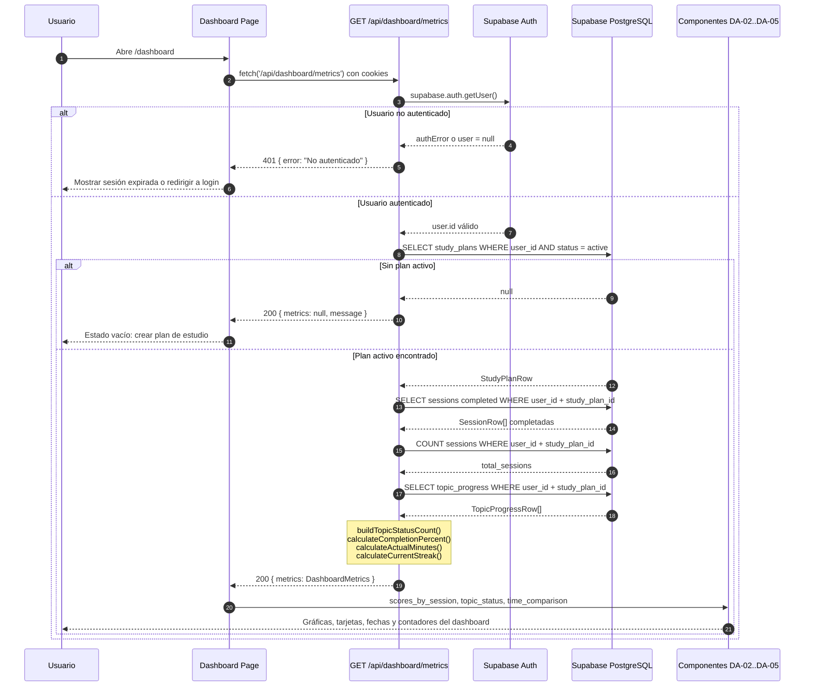
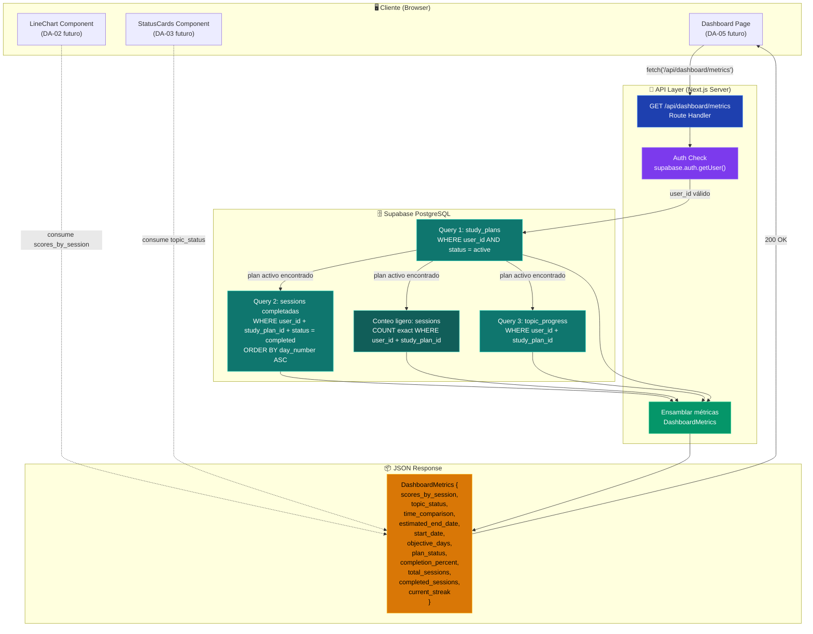

# DA-01 — API Route `/api/dashboard/metrics`

> **Bloque:** 📊 BLOQUE F — Dashboard de Progreso
> **Guía anterior:** SE-08 — UI: FeedbackPanel (score, errores, decisión, próxima sesión)
> **Siguiente guía:** DA-02 — UI: gráfica de score por sesión (LineChart)
> **Next.js version:** 16.2.9 (`params`/`searchParams` son Promises)
> **Fecha:** 30 junio 2026

---

## Sección 1: 🎓 Introducción y Fundamentos Conceptuales

Con la guía **SE-08** completamos el ciclo completo de una sesión de estudio: el usuario ve la teoría, responde el quiz, recibe su evaluación, y el sistema adaptativo decide si avanzar, reforzar o reestructurar. Ahora entramos al **Bloque F — Dashboard de Progreso**, donde convertimos toda esa información acumulada en **métricas visuales** que le permiten al estudiante comprender su avance global.

Esta primera guía del bloque (DA-01) crea el **endpoint API** que alimentará todo el dashboard. Es el cimiento: sin un endpoint que consolide los datos de `sessions`, `topic_progress` y `study_plans` en un único JSON estructurado, las gráficas y tarjetas de las guías DA-02 a DA-05 no tendrían de dónde obtener datos.

### Analogía profesional

Imagina que eres el **Director de Calidad de una planta manufacturera**. Cada día, cientos de piezas pasan por inspecciones (sesiones), cada inspector registra sus resultados (scores), y cada tipo de pieza tiene un estado de certificación: aprobada (mastered), en proceso (in_progress), pendiente de revisión (pending), o rechazada (failed). Al final de la semana, el Director no revisa cada informe individual — necesita un **tablero de mando** (dashboard) que consolide toda la información en métricas clave: tasa de aprobación, racha de días sin defectos, porcentaje de avance hacia la meta trimestral.

El Director de Calidad no va a la base de datos de inspecciones a hacer JOINs a mano. Tiene un **sistema de reportes** que consulta tres fuentes diferentes — el registro de inspecciones, el catálogo de piezas certificadas, y el plan trimestral — y genera un informe consolidado. Eso es exactamente lo que construiremos: un Route Handler que ejecuta **3 queries de datos + 1 conteo ligero** a Supabase, procesa los resultados en el servidor, y devuelve un JSON limpio y optimizado para el frontend.

¿Por qué queries separadas y no un JOIN complejo? Porque nuestra definición de tipos en `database.ts` tiene `Relationships: []` en todas las tablas. Esto significa que el cliente TypeScript de Supabase **no puede inferir los tipos de columnas foráneas** al usar la sintaxis `table!inner(...)`. Si intentáramos un JOIN, obtendríamos `unknown` como tipo de retorno, perdiendo toda la seguridad de TypeScript. La estrategia correcta es: una query por tabla, combinar los resultados en el servidor con tipos explícitos.

Esta arquitectura también es **más mantenible**: si mañana cambia la estructura de `topic_progress`, solo modificamos la query correspondiente sin afectar las demás. Es el mismo principio que el Director de Calidad aplica: cada departamento genera su propio informe con su formato, y el sistema de reportes los combina en el tablero final.

---

## Sección 2: 📋 Prerequisitos y Verificación del Entorno

Antes de empezar, verifica que todo el entorno esté listo:

| # | Requisito | Comando de verificación | Resultado esperado |
|---|-----------|------------------------|--------------------|
| 1 | Node.js 18+ | `node --version` | `v18.x.x` o superior |
| 2 | npm disponible | `npm --version` | `10.x.x` o superior |
| 3 | Next.js 16.2.9 | `npm --prefix frontend list next` | `next@16.2.9` |
| 4 | Supabase SSR | `npm --prefix frontend list @supabase/ssr` | `@supabase/ssr@0.12.x` |
| 5 | TypeScript 5+ | `npx --prefix frontend tsc --version` | `Version 5.x.x` |

### Dependencias de guías anteriores

Estos archivos **deben existir** antes de comenzar DA-01:

```powershell
# Verificar archivos críticos de guías anteriores
Test-Path "frontend/types/database.ts"          # DB-02: Tipos de base de datos
Test-Path "frontend/types/index.ts"             # DB-02: Barrel de tipos
Test-Path "frontend/lib/supabase/server.ts"     # FE-03: Cliente Supabase servidor
Test-Path "frontend/middleware.ts"              # FE-03: Auth middleware
```

**Salida esperada** (todos deben ser `True`):

```
True
True
True
True
```

### Variables de entorno

Tu archivo `frontend/.env.local` debe tener las claves de Supabase configuradas desde **DB-01, Paso B**:

```powershell
# Verificar que las variables existen (sin mostrar valores)
Select-String -Path "frontend/.env.local" -Pattern "^NEXT_PUBLIC_SUPABASE_URL=" -Quiet
Select-String -Path "frontend/.env.local" -Pattern "^NEXT_PUBLIC_SUPABASE_ANON_KEY=" -Quiet
```

**Salida esperada** (solo confirma que las variables existen, sin imprimir valores):

```
True
True
```

> [!IMPORTANT]
> Nunca imprimas los valores reales de las claves en la terminal. Solo verifica que las líneas existan.

---

## Sección 3: 📂 Estructura de Directorios del Proyecto

```
frontend/
├── app/
│   ├── (auth)/
│   │   ├── login/page.tsx
│   │   └── register/page.tsx
│   ├── (dashboard)/
│   │   ├── _components/
│   │   │   ├── MainNav.tsx
│   │   │   ├── MobileNav.tsx
│   │   │   └── UserMenu.tsx
│   │   ├── dashboard/page.tsx          ← Placeholder actual (se actualiza en DA-05)
│   │   ├── plan/page.tsx
│   │   ├── session/page.tsx
│   │   ├── setup/page.tsx
│   │   ├── layout.tsx
│   │   ├── loading.tsx
│   │   └── error.tsx
│   ├── api/
│   │   ├── dashboard/
│   │   │   └── metrics/
│   │   │       └── route.ts            ← 🆕 DA-01: NUEVO Route Handler
│   │   ├── extract/route.ts
│   │   ├── plan/generate/route.ts
│   │   ├── sessions/
│   │   │   ├── next/route.ts
│   │   │   └── [id]/
│   │   │       ├── route.ts
│   │   │       ├── theory/route.ts
│   │   │       ├── quiz/route.ts
│   │   │       ├── evaluate/route.ts
│   │   │       └── adapt/route.ts
│   │   └── upload/route.ts
│   ├── auth/callback/route.ts
│   ├── globals.css
│   ├── layout.tsx
│   └── page.tsx
├── components/
│   ├── session/
│   │   ├── theory-panel.tsx
│   │   ├── quiz-card.tsx
│   │   └── feedback-panel.tsx
│   ├── shared/
│   └── ui/                             ← shadcn/ui components
├── lib/
│   ├── supabase/
│   │   ├── client.ts
│   │   ├── server.ts
│   │   └── admin.ts
│   ├── openai.ts
│   ├── prompts/
│   ├── format.ts
│   └── utils.ts
├── types/
│   ├── database.ts
│   ├── sessions.ts
│   ├── theory.ts
│   ├── quiz.ts
│   ├── evaluate.ts
│   ├── adapt.ts
│   ├── dashboard.ts                    ← 🆕 DA-01: NUEVOS tipos del dashboard
│   └── index.ts                        ← 🔄 DA-01: Actualizado con re-exports
├── middleware.ts
├── package.json
└── tsconfig.json
```

> [!NOTE]
> Los archivos marcados con 🆕 son nuevos en esta guía. El archivo marcado con 🔄 será modificado para agregar las re-exportaciones de los nuevos tipos.

---

## Sección 4: 🎨 Diagrama de Arquitectura de Componentes

### Flujo de Métricas Completo



### Mapa de Responsabilidades y Consumo de Datos



### Flujo explicado

1. **El cliente** (dashboard page futuro) hace un `fetch` al endpoint `GET /api/dashboard/metrics`.
2. **El Route Handler** primero verifica la autenticación con `supabase.auth.getUser()`.
3. Con el `user_id` autenticado, ejecuta **3 queries de datos + 1 conteo ligero** a Supabase:
    - **Query 1:** Buscar el plan activo del usuario en `study_plans`.
    - **Query 2:** Obtener todas las sesiones completadas de ese plan, ordenadas por `day_number`.
    - **Conteo ligero:** Calcular el total de sesiones del plan sin descargar filas completas.
    - **Query 3:** Obtener el progreso de todos los tópicos de ese plan en `topic_progress`.
4. El bloque de ensamblado combina esos resultados en un objeto `DashboardMetrics`.
5. El JSON se retorna al cliente con status `200`.

> [!IMPORTANT]
> Las consultas son **independientes** entre sí (no usan JOINs) porque `Relationships: []` en `database.ts` impide que Supabase infiera las relaciones para TypeScript. Usamos `user_id` + `study_plan_id` como nexo común y como defensa adicional.

---

## Sección 5: 🛠️ Implementación Paso a Paso

### Paso A: Definir los tipos TypeScript para las métricas del dashboard

**Archivo:** `frontend/types/dashboard.ts`

Los tipos del dashboard definen la **forma exacta** del JSON que retornará nuestro endpoint. Diseñar los tipos primero (antes del Route Handler) es una buena práctica: nos obliga a pensar en la estructura de datos que el frontend necesitará para renderizar gráficas, tarjetas y tablas.

```typescript
// ============================================================
// types/dashboard.ts — Tipos para el API de métricas del Dashboard
// ============================================================
// Estos tipos definen la estructura del JSON que retorna
// GET /api/dashboard/metrics.
//
// PRINCIPIO DE DISEÑO:
//   Cada tipo corresponde a una "sección" visual del dashboard:
//   - SessionScore → alimenta la gráfica de scores (DA-02)
//   - TopicStatusCount → alimenta las tarjetas de estado (DA-03)
//   - TimeComparison → alimenta la tabla de tiempos (DA-04)
//   - DashboardMetrics → el contenedor maestro de todo
//
// ¿Por qué tipos separados y no un solo tipo grande?
//   Porque cada componente del dashboard solo necesita UNA parte
//   de las métricas. Tipos granulares permiten tipar los props
//   de cada componente con precisión (ej. LineChart recibe
//   SessionScore[], no todo el DashboardMetrics).
// ============================================================

import type {
  SessionType,
  ActionTaken,
  StudyPlanStatus,
} from "./database";

// ──────────────────────────────────────────────────────────────
// Score de una sesión individual (para la gráfica de líneas)
// ──────────────────────────────────────────────────────────────

/**
 * Representa el score de UNA sesión completada.
 * Se usa en la gráfica de scores por sesión (DA-02).
 *
 * ¿Por qué incluimos topic_codes?
 *   Para que el tooltip de la gráfica pueda mostrar QUÉ tópicos
 *   se evaluaron en esa sesión, dando contexto al score.
 *
 * ¿Por qué action_taken?
 *   Para que la gráfica pueda colorear puntos según la decisión
 *   del sistema adaptativo (verde=advance, amarillo=reinforce,
 *   rojo=restructure).
 */
export interface SessionScore {
  /** UUID de la sesión — útil como key en React */
  session_id: string;

  /** Número de día en el plan (1-based) — eje X de la gráfica */
  day_number: number;

  /** Tipo de sesión — para filtrar o agrupar en la gráfica */
  session_type: SessionType;

  /** Score obtenido (0-100) — eje Y de la gráfica */
  score_percent: number;

  /** Decisión del sistema adaptativo para esta sesión */
  action_taken: ActionTaken | null;

  /** Fecha de completación (ISO string) — tooltip de la gráfica */
  completed_at: string;

  /** Códigos de tópicos evaluados — tooltip contextual */
  topic_codes: string[];
}

// ──────────────────────────────────────────────────────────────
// Conteo de tópicos por estado (para tarjetas y donut chart)
// ──────────────────────────────────────────────────────────────

/**
 * Conteo agregado de tópicos por cada estado posible.
 * Alimenta las tarjetas de resumen y el gráfico circular (DA-03).
 *
 * INVARIANTE: pending + in_progress + mastered + failed === total
 *
 * ¿Por qué un conteo y no el array de tópicos?
 *   Las tarjetas del dashboard solo necesitan NÚMEROS, no los
 *   detalles de cada tópico. Enviar solo conteos reduce el
 *   tamaño del JSON y simplifica el rendering.
 */
export interface TopicStatusCount {
  /** Tópicos que el estudiante aún no ha intentado */
  pending: number;

  /** Tópicos que se están estudiando (al menos 1 intento, no mastered) */
  in_progress: number;

  /** Tópicos que el estudiante ya domina (score ≥ 70 en ISTQB) */
  mastered: number;

  /** Tópicos que el estudiante falló (score bajo, necesita refuerzo) */
  failed: number;

  /** Total de tópicos en el plan (para calcular porcentajes) */
  total: number;
}

// ──────────────────────────────────────────────────────────────
// Comparación de tiempo real vs estimado (para tabla de tiempos)
// ──────────────────────────────────────────────────────────────

/**
 * Compara el tiempo estimado vs el tiempo real de cada sesión.
 * Se usa en la tabla de gestión de tiempo (DA-04 futuro).
 *
 * ¿Cómo calculamos actual_minutes?
 *   started_at y completed_at son timestamps ISO en la tabla sessions.
 *   La diferencia en minutos nos da el tiempo real invertido.
 *   Si alguno es null, actual_minutes será null.
 *
 * ¿De dónde viene estimated_minutes?
 *   Del campo duration_minutes de la sesión, que se establece
 *   al crear el plan (valor default: 90 minutos por sesión).
 */
export interface TimeComparison {
  /** UUID de la sesión */
  session_id: string;

  /** Día del plan — para ordenar en la tabla */
  day_number: number;

  /** Tipo de sesión — para agrupar o filtrar */
  session_type: SessionType;

  /** Minutos estimados (de duration_minutes en la sesión) */
  estimated_minutes: number;

  /** Minutos reales invertidos (calculado de started_at → completed_at) */
  actual_minutes: number | null;
}

// ──────────────────────────────────────────────────────────────
// Contenedor maestro: TODAS las métricas del dashboard
// ──────────────────────────────────────────────────────────────

/**
 * Objeto completo que retorna GET /api/dashboard/metrics.
 * Contiene TODO lo que el dashboard necesita en una sola respuesta.
 *
 * PRINCIPIO: "Un fetch, todo el dashboard."
 *   En lugar de hacer 5 fetch desde el frontend (uno por gráfica),
 *   hacemos UNO solo que retorna todo. Esto reduce:
 *   - Latencia (1 roundtrip vs 5)
 *   - Complejidad del estado del frontend
 *   - Posibilidad de datos inconsistentes entre componentes
 *
 * ¿Por qué métricas derivadas (completion_percent, current_streak)?
 *   Calcularlas en el servidor (no en el frontend) garantiza que:
 *   1. La lógica de cálculo está en UN solo lugar (DRY)
 *   2. Todos los clientes (web, mobile futuro) ven los mismos números
 *   3. No enviamos datos crudos innecesarios al navegador
 */
export interface DashboardMetrics {
  // ─── Datos de series (arrays) ──────────────────────────────

  /** Scores de todas las sesiones completadas, ordenados cronológicamente */
  scores_by_session: SessionScore[];

  /** Comparación de tiempo real vs estimado por sesión */
  time_comparison: TimeComparison[];

  // ─── Datos agregados ──────────────────────────────────────

  /** Conteo de tópicos por estado */
  topic_status: TopicStatusCount;

  // ─── Datos del plan ────────────────────────────────────────

  /** Fecha estimada de finalización del plan (ISO date string) */
  estimated_end_date: string;

  /** Fecha de inicio del plan (ISO date string) */
  start_date: string;

  /** Número de días objetivo del plan (1-30) */
  objective_days: number;

  /** Estado actual del plan: active, completed, abandoned */
  plan_status: StudyPlanStatus;

  // ─── Métricas derivadas (calculadas en el servidor) ────────

  /** Porcentaje de tópicos mastered sobre el total (0-100) */
  completion_percent: number;

  /** Total de sesiones en el plan (completadas + pendientes + activas) */
  total_sessions: number;

  /** Número de sesiones con status = 'completed' */
  completed_sessions: number;

  /**
   * Racha actual: días consecutivos con al menos 1 sesión completada,
   * contados desde hoy hacia atrás. Si hoy no hay sesión → 0.
   *
   * REGLA DE NEGOCIO:
   *   - Día 5 completado, Día 4 completado, Día 3 sin completar
   *     → streak = 2 (Día 4 y Día 5)
   *   - Si no hay sesiones completadas → streak = 0
   */
  current_streak: number;
}

// ──────────────────────────────────────────────────────────────
// Respuesta del API (wrapper para consistencia)
// ──────────────────────────────────────────────────────────────

/**
 * Respuesta exitosa de GET /api/dashboard/metrics.
 * El wrapper { metrics: ... } permite agregar campos adicionales
 * en el futuro (ej. { metrics, notifications, announcements })
 * sin breaking changes.
 */
export interface DashboardMetricsResponse {
  metrics: DashboardMetrics;
}

/**
 * Respuesta cuando el usuario no tiene un plan activo.
 * El frontend mostrará un estado vacío con call-to-action.
 */
export interface NoPlanResponse {
  metrics: null;
  message: string;
}
```

**Entregable del Paso A:**
- ✅ Archivo `frontend/types/dashboard.ts` creado con 6 interfaces/tipos exportados

---

### Paso A.1: Actualizar el barrel de tipos

**Archivo a modificar:** `frontend/types/index.ts`

Debemos agregar las re-exportaciones de los nuevos tipos del dashboard para que cualquier componente pueda importar con `import type { DashboardMetrics } from '@/types'`.

Agrega el siguiente bloque **al final** del archivo `types/index.ts`, después de la re-exportación de los tipos de quiz:

```typescript
// ============================================================
// types/index.ts — Barrel de exportaciones de tipos
// ============================================================

// ... (todo el contenido existente se mantiene sin cambios) ...

// 🆕 SE-04: Re-exportar tipos de quiz
export type { QuizQuestion, QuizContent, QuizResponse } from "./quiz";

// 🆕 DA-01: Re-exportar tipos del dashboard de métricas
export type {
  SessionScore,
  TopicStatusCount,
  TimeComparison,
  DashboardMetrics,
  DashboardMetricsResponse,
  NoPlanResponse,
} from "./dashboard";
```

> [!NOTE]
> Solo agrega el bloque nuevo al final. **No elimines** las re-exportaciones existentes. El archivo final debe tener todas las exportaciones previas (database, sessions, theory, evaluate, adapt, quiz) más las nuevas del dashboard.

**Entregable del Paso A.1:**
- ✅ Archivo `frontend/types/index.ts` actualizado con re-exportaciones de `dashboard.ts`

---

### Paso B: Crear el Route Handler GET `/api/dashboard/metrics`

**Archivo:** `frontend/app/api/dashboard/metrics/route.ts`

Este es el corazón de DA-01. Un Route Handler que:
1. Autentica al usuario
2. Busca su plan activo
3. Ejecuta 3 queries de datos + 1 conteo ligero (study_plans, sessions, topic_progress)
4. Combina todo en un `DashboardMetrics` tipado
5. Retorna JSON con status 200

```typescript
// ─────────────────────────────────────────────────────────────────
// app/api/dashboard/metrics/route.ts
// Route Handler: retorna TODAS las métricas del dashboard en un
// solo JSON. Diseñado para ser consumido por los componentes
// del Bloque F (DA-02 a DA-05).
//
// Método:   GET
// Auth:     Requiere sesión válida (cookie JWT de Supabase)
//
// Response (200): { metrics: DashboardMetrics }
//   → Cuando hay un plan activo con datos
//
// Response (200): { metrics: null, message: "..." }
//   → Cuando el usuario no tiene plan activo
//
// Response (401): { error: "No autenticado" }
// Response (500): { error: "Error interno del servidor" }
//
// ESTRATEGIA DE QUERIES:
//   Ejecutamos consultas SEPARADAS a Supabase porque la definición
//   de tipos tiene Relationships: [] (no se pueden hacer JOINs con
//   tipos inferidos). Cada query retorna su propio tipo (SessionRow,
//   TopicProgressRow, StudyPlanRow) con autocompletado completo.
// ─────────────────────────────────────────────────────────────────

import { NextResponse } from "next/server";
import { createClient } from "@/lib/supabase/server";
import type { SessionRow, TopicProgressRow, StudyPlanRow } from "@/types";
import type {
  DashboardMetrics,
  SessionScore,
  TopicStatusCount,
  TimeComparison,
} from "@/types/dashboard";

// ─── Forzar Node.js runtime ─────────────────────────────────────
// El Edge Runtime podría funcionar, pero Node.js es más predecible
// para múltiples queries a Supabase con manejo de cookies.
export const runtime = "nodejs";

// ─── Revalidación ───────────────────────────────────────────────
// Las métricas del dashboard cambian con cada sesión completada.
// revalidate = 0 asegura que SIEMPRE obtenemos datos frescos.
// En el futuro, podríamos usar ISR con revalidación temporal.
export const revalidate = 0;

// =================================================================
// Handler principal: GET /api/dashboard/metrics
// =================================================================

export async function GET() {
  try {
    // ─── 1. AUTENTICACIÓN ──────────────────────────────────────
    // Crear cliente Supabase con las cookies de la petición.
    // createClient() lee las cookies del request para obtener
    // el JWT del usuario autenticado.
    const supabase = await createClient();

    // Verificar identidad con getUser() (NO getSession()).
    // getUser() valida el JWT contra el servidor de Supabase Auth,
    // mientras que getSession() solo lo decodifica localmente.
    // En endpoints que retornan datos sensibles, SIEMPRE usar getUser().
    const {
      data: { user },
      error: authError,
    } = await supabase.auth.getUser();

    // Si no hay usuario autenticado, retornar 401.
    // Esto ocurre cuando:
    //   - La cookie de sesión expiró y no se pudo refrescar
    //   - El usuario nunca hizo login
    //   - La cookie fue eliminada manualmente
    if (authError || !user) {
      return NextResponse.json(
        { error: "No autenticado" },
        { status: 401 }
      );
    }

    // ─── 2. QUERY 1: Buscar el plan activo ─────────────────────
    // Un usuario solo puede tener UN plan activo a la vez.
    // Buscamos el primer (y único) plan con status = 'active'.
    //
    // ¿Por qué .limit(1).maybeSingle()?
    //   - .limit(1) → eficiencia: no traer múltiples filas
    //   - .maybeSingle() → retorna null (no error) si no hay plan
    //     A diferencia de .single() que lanza error si no hay filas.
    const { data: activePlan, error: planError } = await supabase
      .from("study_plans")
      .select("*")
      .eq("user_id", user.id)
      .eq("status", "active")
      .order("created_at", { ascending: false })
      .limit(1)
      .maybeSingle();

    // Si hubo un error real de Supabase (no simplemente "no hay plan"),
    // retornamos 500 con el mensaje del error para debugging.
    if (planError) {
      console.error("[DA-01] Error buscando plan activo:", planError.message);
      return NextResponse.json(
        { error: "Error al buscar el plan de estudio" },
        { status: 500 }
      );
    }

    // Si no hay plan activo, retornamos una respuesta especial.
    // El frontend mostrará un estado vacío con call-to-action:
    // "Aún no tienes un plan activo. Ve a 'Mi Plan' para crear uno."
    if (!activePlan) {
      return NextResponse.json(
        {
          metrics: null,
          message: "No tienes un plan de estudio activo. Crea uno desde 'Mi Plan'.",
        },
        { status: 200 }
      );
    }

    // TypeScript ahora sabe que activePlan es StudyPlanRow (no null).
    // Lo tiparemos explícitamente para mayor claridad.
    const plan: StudyPlanRow = activePlan;

    // ─── 3. QUERY 2: Sesiones completadas del plan ─────────────
    // Traemos SOLO las sesiones con status = 'completed' porque:
    //   - Las sesiones pending/active/skipped no tienen score
    //   - La gráfica de scores solo muestra sesiones evaluadas
    //   - Ordenamos por day_number para que la gráfica sea cronológica
    //
    // NOTA: También necesitamos el TOTAL de sesiones (incluidas las
    // pendientes) para calcular completed_sessions / total_sessions.
    // Lo hacemos con una segunda query más abajo.

    const { data: completedSessions, error: sessionsError } = await supabase
      .from("sessions")
      .select("*")
      .eq("study_plan_id", plan.id)
      .eq("user_id", user.id)
      .eq("status", "completed")
      .order("day_number", { ascending: true });

    if (sessionsError) {
      console.error("[DA-01] Error obteniendo sesiones:", sessionsError.message);
      return NextResponse.json(
        { error: "Error al obtener las sesiones" },
        { status: 500 }
      );
    }

    // Query adicional: contar TODAS las sesiones del plan (sin filtro de status).
    // Usamos select('id', { count: 'exact', head: true }) para obtener
    // solo el conteo sin descargar las filas completas.
    const { count: totalSessionsCount, error: countError } = await supabase
      .from("sessions")
      .select("id", { count: "exact", head: true })
      .eq("study_plan_id", plan.id)
      .eq("user_id", user.id);

    if (countError) {
      console.error("[DA-01] Error contando sesiones:", countError.message);
      // No es crítico — usamos un fallback
    }

    // ─── 4. QUERY 3: Progreso de tópicos del plan ──────────────
    // Traemos TODOS los registros de topic_progress para este plan.
    // Cada fila tiene un status: pending, in_progress, mastered, failed.
    // Los contaremos en el servidor para generar TopicStatusCount.

    const { data: topicProgressData, error: topicError } = await supabase
      .from("topic_progress")
      .select("*")
      .eq("study_plan_id", plan.id)
      .eq("user_id", user.id);

    if (topicError) {
      console.error("[DA-01] Error obteniendo progreso:", topicError.message);
      return NextResponse.json(
        { error: "Error al obtener el progreso de tópicos" },
        { status: 500 }
      );
    }

    // ─── 5. CONSTRUIR LAS MÉTRICAS ────────────────────────────

    // Asegurar que los arrays nunca sean null (Supabase puede retornar null
    // si no hay filas, aunque normalmente retorna [])
    const sessions: SessionRow[] = completedSessions ?? [];
    const topicProgress: TopicProgressRow[] = topicProgressData ?? [];

    // 5a. Construir scores_by_session (para la gráfica de líneas)
    const scoresBySession: SessionScore[] = sessions.map((session) => ({
      session_id: session.id,
      day_number: session.day_number,
      session_type: session.session_type,
      // Defensivo: si score_percent es null en una sesión "completed",
      // algo extraño pasó. Usamos 0 como fallback seguro.
      score_percent: session.score_percent ?? 0,
      action_taken: session.action_taken,
      // Defensivo: completed_at debería existir en sesiones completadas,
      // pero por seguridad usamos la fecha de creación como fallback.
      completed_at: session.completed_at ?? session.created_at,
      topic_codes: session.topic_codes ?? [],
    }));

    // 5b. Construir topic_status (conteo por estado)
    const topicStatus: TopicStatusCount = buildTopicStatusCount(topicProgress);

    // 5c. Construir time_comparison (tiempo real vs estimado)
    const timeComparison: TimeComparison[] = sessions.map((session) => ({
      session_id: session.id,
      day_number: session.day_number,
      session_type: session.session_type,
      estimated_minutes: session.duration_minutes,
      // Calcular minutos reales entre started_at y completed_at.
      // Si alguno de los dos es null, actual_minutes será null.
      actual_minutes: calculateActualMinutes(
        session.started_at,
        session.completed_at
      ),
    }));

    // 5d. Calcular métricas derivadas
    const completedCount = sessions.length;
    const totalSessions = totalSessionsCount ?? sessions.length;
    const completionPercent = calculateCompletionPercent(topicStatus);
    const currentStreak = calculateCurrentStreak(sessions);

    // ─── 6. ENSAMBLAR Y RETORNAR EL JSON ──────────────────────

    const metrics: DashboardMetrics = {
      // Datos de series
      scores_by_session: scoresBySession,
      time_comparison: timeComparison,

      // Datos agregados
      topic_status: topicStatus,

      // Datos del plan
      estimated_end_date: plan.estimated_end_date,
      start_date: plan.start_date,
      objective_days: plan.objective_days,
      plan_status: plan.status,

      // Métricas derivadas
      completion_percent: completionPercent,
      total_sessions: totalSessions,
      completed_sessions: completedCount,
      current_streak: currentStreak,
    };

    // Retornar con status 200 y el wrapper { metrics: ... }
    return NextResponse.json({ metrics }, { status: 200 });

  } catch (error) {
    // ─── Catch-all para errores inesperados ─────────────────
    // En producción, logueamos el error completo pero retornamos
    // un mensaje genérico al cliente (no exponer detalles internos).
    console.error(
      "[DA-01] Error inesperado:",
      error instanceof Error ? error.message : error
    );
    return NextResponse.json(
      { error: "Error interno del servidor" },
      { status: 500 }
    );
  }
}

// =================================================================
// FUNCIONES AUXILIARES (privadas al módulo)
// =================================================================

/**
 * Cuenta los tópicos por cada estado (pending, in_progress, mastered, failed).
 *
 * ESTRATEGIA: Iteramos UNA sola vez sobre el array usando reduce().
 * Esto es O(n) — mucho mejor que hacer 4 filter() separados que
 * serían O(4n).
 *
 * @param topicProgress - Array de filas de topic_progress
 * @returns Objeto con conteos por estado + total
 */
function buildTopicStatusCount(
  topicProgress: TopicProgressRow[]
): TopicStatusCount {
  // Valor inicial: todos los contadores en 0
  const counts = topicProgress.reduce(
    (acc, topic) => {
      // Defensivo: si el status es un valor inesperado,
      // lo contamos como 'pending' para no perderlo.
      switch (topic.status) {
        case "pending":
          acc.pending++;
          break;
        case "in_progress":
          acc.in_progress++;
          break;
        case "mastered":
          acc.mastered++;
          break;
        case "failed":
          acc.failed++;
          break;
        default:
          // Status desconocido → contar como pending
          acc.pending++;
      }
      return acc;
    },
    { pending: 0, in_progress: 0, mastered: 0, failed: 0 }
  );

  return {
    ...counts,
    // total = suma de todos los estados.
    // Usamos topicProgress.length directamente, que es más fiable
    // que sumar los contadores (evita bugs de double-counting).
    total: topicProgress.length,
  };
}

/**
 * Calcula el porcentaje de avance del plan usando tópicos dominados.
 *
 * Fórmula:
 *   mastered / total * 100
 *
 * @param topicStatus - Conteo agregado de tópicos por estado
 * @returns Porcentaje redondeado a 2 decimales (0-100)
 */
function calculateCompletionPercent(topicStatus: TopicStatusCount): number {
  if (topicStatus.total === 0) {
    return 0;
  }

  return Math.round((topicStatus.mastered / topicStatus.total) * 10000) / 100;
}

/**
 * Calcula los minutos reales invertidos en una sesión.
 *
 * @param startedAt - ISO timestamp de inicio (puede ser null)
 * @param completedAt - ISO timestamp de finalización (puede ser null)
 * @returns Minutos reales (redondeados) o null si faltan datos
 *
 * MANEJO DEFENSIVO:
 *   - Si alguno de los timestamps es null → retorna null
 *   - Si la diferencia es negativa (dato corrupto) → retorna null
 *   - Si la diferencia es 0 → retorna 1 (mínimo 1 minuto)
 */
function calculateActualMinutes(
  startedAt: string | null,
  completedAt: string | null
): number | null {
  // Si falta alguno de los timestamps, no podemos calcular
  if (!startedAt || !completedAt) {
    return null;
  }

  // Parsear las fechas ISO a objetos Date
  const start = new Date(startedAt);
  const end = new Date(completedAt);

  // Calcular diferencia en milisegundos → convertir a minutos
  const diffMs = end.getTime() - start.getTime();

  // Validar que la diferencia sea positiva (datos consistentes)
  if (diffMs < 0) {
    // completed_at es ANTERIOR a started_at — dato corrupto
    // Retornar null en lugar de un número negativo
    return null;
  }

  // Convertir ms → minutos y redondear.
  // Math.max(1, ...) asegura mínimo 1 minuto (evitar "0 min").
  const minutes = Math.round(diffMs / (1000 * 60));
  return Math.max(1, minutes);
}

/**
 * Calcula la racha actual de días consecutivos con sesiones completadas.
 *
 * ALGORITMO:
 *   1. Extraer las fechas únicas de completed_at (solo la parte de fecha,
 *      ignorando la hora).
 *   2. Obtener la fecha de hoy.
 *   3. Verificar si hoy tiene al menos 1 sesión completada.
 *      Si no → la racha es 0 (se rompió).
 *   4. Contar hacia atrás: ¿ayer tuvo sesión? ¿anteayer? etc.
 *      La racha se rompe en el primer día sin sesión.
 *
 * NOTA: Usamos day_number en lugar de fechas calendario cuando las
 * sesiones no tienen completed_at fiable. Pero como filtramos por
 * status = 'completed', siempre deberían tener completed_at.
 *
 * @param sessions - Sesiones completadas, ordenadas por day_number ASC
 * @returns Número de días consecutivos con sesiones (0 si no hay racha)
 */
function calculateCurrentStreak(sessions: SessionRow[]): number {
  // Si no hay sesiones completadas, la racha es 0
  if (sessions.length === 0) {
    return 0;
  }

  // Extraer las fechas únicas de sesiones completadas.
  // Usamos un Set para eliminar duplicados (un día puede tener
  // morning + night, pero cuenta como 1 día en la racha).
  const completedDates = new Set<string>();

  for (const session of sessions) {
    if (session.completed_at) {
      // Extraer solo la parte de fecha (YYYY-MM-DD) del timestamp ISO.
      // "2026-06-28T14:30:00.000Z" → "2026-06-28"
      const dateOnly = session.completed_at.split("T")[0];
      if (dateOnly) {
        completedDates.add(dateOnly);
      }
    }
  }

  // Si no hay fechas válidas, la racha es 0
  if (completedDates.size === 0) {
    return 0;
  }

  // Empezar desde hoy y contar hacia atrás
  let streak = 0;
  const today = new Date();

  // Intentamos como máximo 365 días hacia atrás (safety limit)
  for (let daysBack = 0; daysBack < 365; daysBack++) {
    // Crear la fecha para "hoy - daysBack días"
    const checkDate = new Date(today);
    checkDate.setDate(today.getDate() - daysBack);

    // Formatear como YYYY-MM-DD para comparar con el Set
    const dateStr = checkDate.toISOString().split("T")[0];

    if (dateStr && completedDates.has(dateStr)) {
      // Este día tiene sesión completada → incrementar racha
      streak++;
    } else {
      // Este día NO tiene sesión → la racha se rompe.
      // EXCEPCIÓN: si es el primer día (hoy) y no tiene sesión,
      // aún podríamos contar la racha de ayer hacia atrás.
      // Pero por simplicidad y claridad, si hoy no tiene sesión,
      // la racha es 0.
      break;
    }
  }

  return streak;
}
```

#### Puntos clave del Route Handler

| Aspecto | Decisión | Razón |
|---------|----------|-------|
| `runtime = "nodejs"` | Node.js, no Edge | Múltiples queries Supabase + manejo de cookies |
| `revalidate = 0` | Sin cache | Datos cambian con cada sesión completada |
| `getUser()` vs `getSession()` | `getUser()` siempre | Validación real del JWT contra el servidor |
| `.maybeSingle()` vs `.single()` | `maybeSingle()` | No lanza error si no hay plan, retorna `null` |
| 3 queries de datos + 1 count | No JOINs | `Relationships: []` en `database.ts`, total de sesiones sin descargar filas completas |
| `?? 0` en score_percent | Fallback defensivo | Sesión "completed" sin score = dato corrupto |
| `Math.max(1, minutes)` | Mínimo 1 minuto | Evitar "0 min" en la tabla de tiempos |

**Entregables del Paso B:**
- ✅ Archivo `frontend/app/api/dashboard/metrics/route.ts` creado
- ✅ Autenticación con `getUser()`
- ✅ Query 1: plan activo del usuario
- ✅ Query 2: sesiones completadas del plan
- ✅ Conteo ligero: total de sesiones del plan
- ✅ Query 3: progreso de tópicos del plan
- ✅ Cálculo de `completion_percent`, `current_streak`, `time_comparison`
- ✅ Respuesta JSON tipada con `DashboardMetrics`

---

### Paso C: Verificar con TypeScript y Build

Ahora verificamos que todo compile correctamente y que no haya errores de tipos.

#### C.1 — Verificar existencia de archivos nuevos

```powershell
# Verificar que los archivos nuevos existen
Test-Path "frontend/types/dashboard.ts"
Test-Path -LiteralPath "frontend/app/api/dashboard/metrics/route.ts"
```

**Salida esperada:**

```
True
True
```

#### C.2 — Verificación de tipos con TypeScript

```powershell
npx tsc --noEmit --project frontend/tsconfig.json
```

**Salida esperada** (sin errores):

```

```

> [!TIP]
> Si `tsc` no produce output, significa que **no hay errores de tipos**. Eso es exactamente lo que queremos. TypeScript solo imprime cuando hay problemas.

Si ves errores, consulta la sección de Troubleshooting más abajo.

#### C.3 — Build completo de Next.js

```powershell
npm --prefix frontend run build
```

**Salida esperada** (parcial):

```
▲ Next.js 16.2.9 (Turbopack)

   Creating an optimized production build ...
 ✓ Compiled successfully
  Running TypeScript ...
  Finished TypeScript ...
  Collecting page data using 15 workers ...
✓ Generating static pages using 15 workers
  Finalizing page optimization ...

Route (app)
┌ ƒ /
├ ƒ /api/dashboard/metrics
├ ƒ /api/sessions/next
├ ƒ /api/sessions/[id]
...

○  (Static)   prerendered as static content
ƒ  (Dynamic)  server-rendered on demand
```

> [!NOTE]
> La ruta `/api/dashboard/metrics` aparece como `ƒ (Dynamic)` porque tiene `revalidate = 0`, lo que fuerza rendering dinámico en cada petición. Esto es correcto para un endpoint de métricas que debe retornar datos frescos.

#### C.4 — Probar el endpoint manualmente

Para probar el endpoint, necesitas estar autenticado. La forma más sencilla es:

1. Levantar el servidor de desarrollo:

```powershell
npm --prefix frontend run dev
```

**Salida esperada:**

```
▲ Next.js 16.2.9 (Turbopack)
- Local:        http://localhost:3000
- Environments: .env.local

 ✓ Starting...
 ✓ Ready in 2.3s
```

2. Abrir `http://localhost:3000/login` en el navegador y autenticarte.

3. Una vez autenticado, abrir la consola del navegador (`F12` → Console) y ejecutar:

```javascript
// Probar el endpoint desde la consola del navegador
// (las cookies de sesión se envían automáticamente)
fetch('/api/dashboard/metrics')
  .then(res => res.json())
  .then(data => console.log(JSON.stringify(data, null, 2)))
  .catch(err => console.error('Error:', err));
```

**Salida esperada (si NO hay plan activo):**

```json
{
  "metrics": null,
  "message": "No tienes un plan de estudio activo. Crea uno desde 'Mi Plan'."
}
```

**Salida esperada (si HAY plan activo con sesiones completadas):**

```json
{
  "metrics": {
    "scores_by_session": [
      {
        "session_id": "abc-123-...",
        "day_number": 1,
        "session_type": "morning",
        "score_percent": 75,
        "action_taken": "advance",
        "completed_at": "2026-06-28T10:30:00.000Z",
        "topic_codes": ["FL-1.1.1", "FL-1.1.2"]
      },
      {
        "session_id": "def-456-...",
        "day_number": 1,
        "session_type": "night",
        "score_percent": 60,
        "action_taken": "reinforce",
        "completed_at": "2026-06-28T20:00:00.000Z",
        "topic_codes": ["FL-1.1.1"]
      }
    ],
    "topic_status": {
      "pending": 15,
      "in_progress": 5,
      "mastered": 8,
      "failed": 2,
      "total": 30
    },
    "time_comparison": [
      {
        "session_id": "abc-123-...",
        "day_number": 1,
        "session_type": "morning",
        "estimated_minutes": 90,
        "actual_minutes": 72
      }
    ],
    "estimated_end_date": "2026-07-12",
    "start_date": "2026-06-25",
    "objective_days": 14,
    "plan_status": "active",
    "completion_percent": 26.67,
    "total_sessions": 28,
    "completed_sessions": 2,
    "current_streak": 1
  }
}
```

**Salida esperada (si NO estás autenticado):**

```json
{
  "error": "No autenticado"
}
```

> [!WARNING]
> Si recibes `401 No autenticado` estando en el dashboard, tu sesión puede haber expirado. Cierra sesión, vuelve a iniciar sesión, y repite la prueba desde la consola del navegador.

**Entregables del Paso C:**
- ✅ `npx tsc --noEmit` sin errores
- ✅ `npm run build` exitoso
- ✅ Endpoint responde JSON correcto desde la consola del navegador

---

## Sección 6: ✅ Checkpoints de Verificación

### Checklist de entregables

| # | Entregable | Archivo | Verificación |
|---|-----------|---------|--------------|
| 1 | Tipos del dashboard | `frontend/types/dashboard.ts` | `Test-Path "frontend/types/dashboard.ts"` → `True` |
| 2 | Barrel actualizado | `frontend/types/index.ts` | Contiene `export type { ... } from "./dashboard"` |
| 3 | Route Handler | `frontend/app/api/dashboard/metrics/route.ts` | `Test-Path -LiteralPath "frontend/app/api/dashboard/metrics/route.ts"` → `True` |
| 4 | TypeScript compila | — | `npx tsc --noEmit --project frontend/tsconfig.json` sin errores |
| 5 | Build exitoso | — | `npm --prefix frontend run build` sin errores |

### Verificación funcional del endpoint

| Escenario | Qué hacer | Resultado esperado |
|-----------|-----------|-------------------|
| Sin autenticación | `fetch` sin cookies de sesión | `401` con `{ error: "No autenticado" }` |
| Sin plan activo | Usuario autenticado sin plan | `200` con `{ metrics: null, message: "..." }` |
| Con plan y 0 sesiones completadas | Plan activo, sin sesiones completed | `200` con `scores_by_session: []`, `completed_sessions: 0`, `current_streak: 0` |
| Con plan y 2+ sesiones completadas | Plan activo, sesiones evaluadas | `200` con `scores_by_session` poblado, scores correctos, conteo de tópicos correcto |
| Scores correctos | Verificar manualmente en Supabase | Los `score_percent` del JSON coinciden con los de la tabla `sessions` |
| Conteo de tópicos correcto | Verificar contra `topic_progress` | `pending + in_progress + mastered + failed === total` |

### Verificación rápida desde PowerShell

Si tienes `curl` disponible (PowerShell 7+ lo incluye), puedes probar directamente. Sin embargo, necesitarás la cookie de sesión que Supabase establece en el navegador. La forma más práctica es usar la **consola del navegador** como se mostró en el Paso C.4.

```powershell
# Verificación rápida de que la ruta existe en el build
npm --prefix frontend run build 2>&1 | Select-String "dashboard/metrics"
```

**Salida esperada:**

```
├ ƒ /api/dashboard/metrics
```

---

## Sección 7: 🚨 Troubleshooting — Problemas Comunes

| # | Problema | Causa Probable | Solución |
|---|----------|---------------|----------|
| 1 | `Module not found: Can't resolve '@/types/dashboard'` | El archivo `dashboard.ts` no existe o está en la ruta incorrecta | Verificar que el archivo está en `frontend/types/dashboard.ts` (no `frontend/src/types/`). Verificar que `tsconfig.json` tiene `"paths": { "@/*": ["./*"] }` |
| 2 | `Type 'null' is not assignable to type 'SessionRow[]'` | Supabase puede retornar `null` en lugar de `[]` cuando no hay resultados | Usar el operador nullish coalescing: `const sessions = completedSessions ?? [];` |
| 3 | `Property 'score_percent' does not exist on type 'unknown'` | Estás usando `supabase.from("sessions").select("*")` sin el tipo `Database` en `createClient` | Verificar que `createClient()` en `server.ts` usa `createServerClient<Database>(...)`. El generic `<Database>` es lo que da autocompletado |
| 4 | `401 No autenticado` al probar desde el navegador | La cookie de sesión expiró o el middleware no está refrescando tokens | Cerrar sesión, volver a iniciar sesión. Verificar que `middleware.ts` llama a `supabase.auth.getUser()` para refrescar tokens automáticamente |
| 5 | `500 Error al buscar el plan de estudio` con RLS error | Las políticas RLS de `study_plans` no permiten SELECT para el usuario | Verificar en Supabase Dashboard → Authentication → Policies que la tabla `study_plans` tiene una política `SELECT` habilitada con `auth.uid() = user_id` |
| 6 | `current_streak` siempre es 0 | La zona horaria del servidor difiere de la del usuario | `calculateCurrentStreak` usa `new Date()` del servidor (UTC). Si el usuario completó sesiones a las 11 PM hora local pero el servidor está en UTC, la fecha puede no coincidir. En futuras iteraciones, se puede enviar la timezone del cliente como query param |
| 7 | `completion_percent` muestra `NaN` | `topicProgress` es un array vacío → `0 / 0 = NaN` | La función `calculateCompletionPercent` ya maneja este caso retornando `0` cuando `total === 0` |
| 8 | El build falla con `Type error: Property 'X' is missing` en `DashboardMetrics` | Agregaste una propiedad nueva al tipo pero no la incluiste en el objeto que retorna el Route Handler | Asegurar que el objeto `metrics` en el Route Handler tiene TODAS las propiedades definidas en la interfaz `DashboardMetrics` |

> [!TIP]
> **Debugging rápido:** Si el endpoint retorna 500, revisa la terminal donde corre `npm --prefix frontend run dev`. Los `console.error()` que incluimos en el Route Handler imprimen el mensaje exacto del error de Supabase.

---

## Sección 8: 📝 Resumen y Próximo Paso

### Lo que logramos en DA-01

1. **Diseñamos los tipos TypeScript** para el dashboard: `SessionScore`, `TopicStatusCount`, `TimeComparison`, `DashboardMetrics`, `DashboardMetricsResponse`, y `NoPlanResponse` — cada uno mapeado a una sección visual del dashboard futuro.

2. **Actualizamos el barrel de tipos** (`types/index.ts`) para re-exportar todos los tipos nuevos del dashboard, manteniendo la convención de importaciones centralizadas.

3. **Creamos el Route Handler** `GET /api/dashboard/metrics` que:
   - Autentica al usuario con `getUser()` (validación real del JWT)
   - Busca el plan activo con `.maybeSingle()` (manejo gracioso de "sin plan")
   - Ejecuta **3 queries de datos + 1 conteo ligero** a Supabase (sin JOINs, respetando `Relationships: []`)
   - Calcula métricas derivadas: `completion_percent`, `current_streak`, `time_comparison`
   - Retorna un JSON completo y tipado con todas las métricas

4. **Implementamos funciones auxiliares** defensivas:
   - `buildTopicStatusCount()` — conteo O(n) con `reduce()`
   - `calculateActualMinutes()` — manejo de null y datos corruptos
   - `calculateCurrentStreak()` — racha basada en fechas únicas del calendario

5. **Verificamos la compilación** con `tsc --noEmit` y `npm run build`, y probamos el endpoint desde la consola del navegador.

### Próximo paso: DA-02 — UI: gráfica de score por sesión (LineChart)

En la siguiente guía (**DA-02**) crearemos el componente `ScoreChart` que consumirá el array `scores_by_session` del JSON que acabamos de construir. Usaremos la librería **Recharts** (ya instalada: `recharts@3.8.1`) para renderizar una gráfica de líneas interactiva donde:

- El **eje X** mostrará `day_number` (día del plan)
- El **eje Y** mostrará `score_percent` (0-100)
- Los **puntos** se colorearán según `action_taken` (verde/amarillo/rojo)
- Los **tooltips** mostrarán `session_type`, `topic_codes`, y `completed_at`

Todo será un **Client Component** (`'use client'`) porque Recharts necesita el DOM del navegador para renderizar SVGs interactivos. El fetch al endpoint `GET /api/dashboard/metrics` se hará con un `useEffect` + `useState`, y manejaremos estados de loading, error, y datos vacíos.

> [!IMPORTANT]
> Antes de avanzar a DA-02, asegúrate de que DA-01 pasa todos los checkpoints de la Sección 6. Para validar tu progreso, puedes usar el step validator con el ID `DA-01`.
