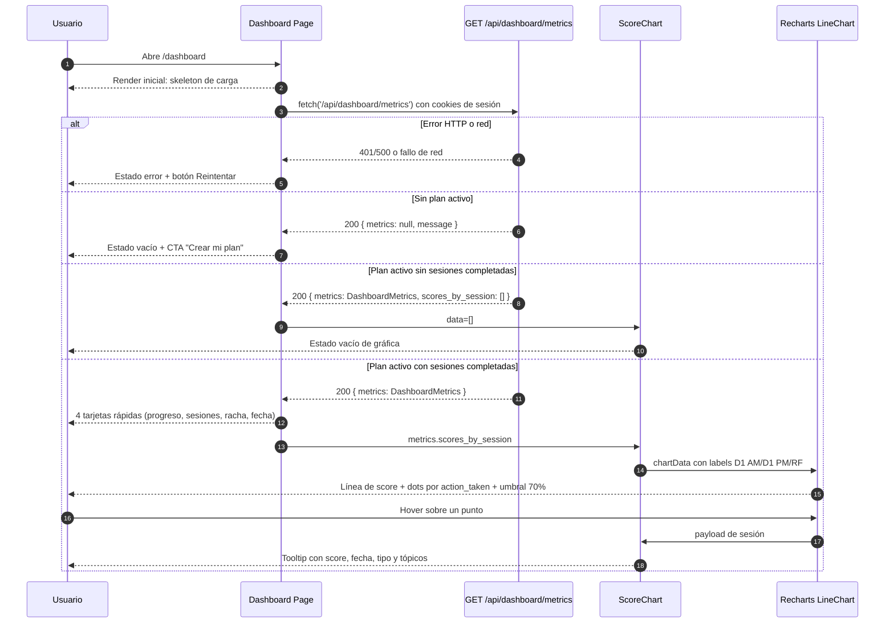
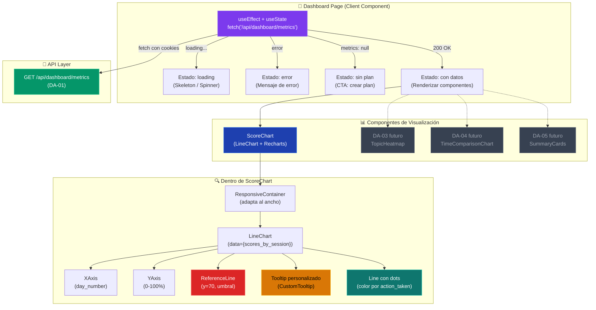

# DA-02 — UI: Gráfica de Score por Sesión (LineChart)

> **Bloque:** 📊 BLOQUE F — Dashboard de Progreso
> **Guía anterior:** [DA-01 — API Route `/api/dashboard/metrics`](file:///c:/Users/jsife/OneDrive/Desktop/Repositorios/practica-testing/docs/guides/fe/DA-01.md)
> **Siguiente guía:** DA-03 — UI: heatmap de tópicos por estado
> **Next.js:** **16.2.9** — `params` siempre `await`ed
> **Fecha:** 30 junio 2026

---

## Sección 1: 🎓 Introducción y Fundamentos Conceptuales

### ¿Dónde estamos?

En **DA-01** construimos el endpoint `GET /api/dashboard/metrics` que consolida toda la información de progreso del usuario en un solo JSON tipado (`DashboardMetrics`). Ese JSON incluye un array `scores_by_session` con el historial completo de scores de cada sesión completada.

Ahora es momento de **visualizar** esos datos. DA-02 crea el componente `<ScoreChart>` — una gráfica de líneas interactiva que muestra la evolución del rendimiento del estudiante a lo largo del tiempo.

| Guía completada | Qué aportó |
|---|---|
| DA-01 | `GET /api/dashboard/metrics` → JSON con `scores_by_session[]` |
| **DA-02** (esta guía) | `<ScoreChart>` → gráfica visual que consume `scores_by_session[]` |

### Analogía profesional

Imagina que eres el **entrenador de un atleta olímpico** que se prepara para los 100 metros planos. Cada día el atleta hace una serie de sprints cronometrados, y tú registras sus tiempos en una hoja de cálculo. Después de dos semanas, tienes 30 registros de tiempos — pero un listado de números no te dice nada útil de un vistazo.

Lo que realmente necesitas es una **gráfica de evolución**: el eje X son los días de entrenamiento, el eje Y es el tiempo en segundos, y cada punto está coloreado según si el atleta mejoró (verde), se mantuvo (amarillo) o empeoró (rojo). Con un solo vistazo al gráfico, tanto el entrenador como el atleta entienden la tendencia: ¿estoy mejorando? ¿me estanqué? ¿hubo una recaída?

El `ScoreChart` es exactamente esa gráfica para el estudiante de ISTQB. Cada sesión completada es un "sprint cronometrado", el score del quiz es el "tiempo registrado", y el color del punto refleja la decisión del sistema adaptativo: verde para `advance` (mejoró), amarillo para `reinforce` (necesita práctica), rojo para `restructure` (necesita ayuda seria). La línea de referencia en 70% es como el "tiempo clasificatorio" — si estás por encima, vas bien; si estás por debajo, hay que trabajar más.

Además, como buen entrenador, quieres que el atleta pueda interactuar con la gráfica: al pasar el cursor sobre un punto, ve los detalles de esa sesión (qué tópicos estudió, cuándo la completó, qué acción tomó el sistema). Eso es el **tooltip** de Recharts — información contextual sin saturar la vista principal.

La diferencia entre un dashboard amateur y uno profesional no son los datos (esos ya los tenemos desde DA-01) — es la **presentación visual**. Un LineChart bien diseñado con colores semánticos, tooltips informativos y una línea de referencia clara transforma números crudos en **información accionable**.

### Conceptos clave de esta guía

#### 1. Recharts — La librería de visualización

[Recharts](https://recharts.org/) es una librería de gráficas para React basada en D3.js pero con una API declarativa. Ya la tienes instalada (`recharts@3.8.1` en tu `package.json`).

Recharts funciona con **composición de componentes**:

```
<ResponsiveContainer>     → Contenedor que se adapta al ancho del padre
  <LineChart data={...}>   → El chart principal con los datos
    <CartesianGrid />      → Líneas de fondo (grid visual)
    <XAxis />              → Eje horizontal
    <YAxis />              → Eje vertical
    <Tooltip />            → Popup al hacer hover sobre un punto
    <Legend />             → Leyenda de colores
    <ReferenceLine />      → Línea de referencia (ej. 70%)
    <Line />               → La línea de datos
  </LineChart>
</ResponsiveContainer>
```

Cada componente es una pieza independiente que compones declarativamente — muy React.

#### 2. `'use client'` obligatorio

Recharts renderiza SVGs interactivos con event listeners (`mouseover`, `click`, etc.). Esto requiere acceso al DOM del navegador, por lo que **todos los componentes que usen Recharts deben tener `'use client'`**.

Esto también significa que los datos NO se pueden obtener directamente dentro del componente de gráfica. En su lugar, el componente padre (el dashboard page) hará el `fetch` y pasará los datos como props.

#### 3. Patrón de datos: Container → Presentación

Seguiremos el patrón clásico de React:

```
DashboardPage (Container)
  ├── fetch('/api/dashboard/metrics')
  ├── manage loading/error states
  └── <ScoreChart data={metrics.scores_by_session} />  (Presentación)
```

El `ScoreChart` solo recibe datos y los renderiza. No sabe de dónde vienen, no hace fetches, no maneja autenticación. Es un componente **puro de presentación**.

#### 4. Colores semánticos por action_taken

| `action_taken` | Color | Significado |
|---|---|---|
| `advance` | `#22c55e` (verde) | El estudiante aprobó y avanza |
| `reinforce` | `#eab308` (amarillo) | Necesita refuerzo (score 50-69%) |
| `restructure` | `#ef4444` (rojo) | Necesita reestructuración (score < 50%) |
| `null` | `#94a3b8` (gris) | Sin evaluación (datos legacy) |

Estos colores coinciden con los usados en el `FeedbackPanel` de SE-08, manteniendo consistencia visual en toda la aplicación.

---

## Sección 2: 📋 Prerequisitos y Verificación del Entorno

| # | Requisito | Comando de verificación | Resultado esperado |
|---|-----------|------------------------|---------------------|
| 1 | Node.js 18+ | `node --version` | `v18.x.x` o superior |
| 2 | Recharts instalado | `npm --prefix frontend list recharts` | `recharts@3.8.1` |
| 3 | Lucide React | `npm --prefix frontend list lucide-react` | `lucide-react@1.x.x` |
| 4 | Tipos dashboard | `Test-Path "frontend/types/dashboard.ts"` | `True` |
| 5 | API metrics | `Test-Path -LiteralPath "frontend/app/api/dashboard/metrics/route.ts"` | `True` |

### Dependencias de guías anteriores

Estos archivos **deben existir** (entregables de DA-01):

```powershell
# Verificar entregables de DA-01
Test-Path "frontend/types/dashboard.ts"
Test-Path -LiteralPath "frontend/app/api/dashboard/metrics/route.ts"
```

**Salida esperada:**

```
True
True
```

### Verificar que el barrel de tipos está actualizado

```powershell
Select-String -Path "frontend/types/index.ts" -Pattern "dashboard" -Quiet
```

**Salida esperada:**

```
True
```

> [!IMPORTANT]
> Si alguno de estos checks falla, **no avances**. Completa DA-01 primero.

---

## Sección 3: 📂 Estructura de Directorios del Proyecto

```
frontend/
├── app/
│   ├── (auth)/
│   │   ├── login/page.tsx
│   │   └── register/page.tsx
│   ├── (dashboard)/
│   │   ├── _components/
│   │   │   ├── main-nav.tsx
│   │   │   ├── mobile-nav.tsx
│   │   │   └── user-menu.tsx
│   │   ├── dashboard/page.tsx          ← 🔄 DA-02: Se MODIFICA (ya no es placeholder)
│   │   ├── plan/page.tsx
│   │   ├── session/page.tsx
│   │   ├── setup/page.tsx
│   │   ├── layout.tsx
│   │   ├── loading.tsx
│   │   └── error.tsx
│   ├── api/
│   │   ├── dashboard/
│   │   │   └── metrics/
│   │   │       └── route.ts            ← DA-01: Endpoint de métricas
│   │   ├── extract/route.ts
│   │   ├── plan/generate/route.ts
│   │   ├── sessions/
│   │   │   ├── next/route.ts
│   │   │   └── [id]/
│   │   │       ├── route.ts
│   │   │       ├── theory/route.ts
│   │   │       ├── quiz/route.ts
│   │   │       ├── evaluate/route.ts
│   │   │       └── adapt/route.ts
│   │   └── upload/route.ts
│   ├── auth/callback/route.ts
│   ├── globals.css
│   ├── layout.tsx
│   └── page.tsx
├── components/
│   ├── dashboard/                      ← 🆕 DA-02: NUEVO directorio
│   │   └── score-chart.tsx             ← 🆕 DA-02: Gráfica de scores
│   ├── session/
│   │   ├── theory-panel.tsx
│   │   ├── quiz-card.tsx
│   │   ├── feedback-panel.tsx
│   │   ├── collapsible-section.tsx
│   │   ├── quiz-navigation.tsx
│   │   ├── quiz-question-view.tsx
│   │   ├── quiz-summary.tsx
│   │   ├── session-timer.tsx
│   │   └── theory-topic-view.tsx
│   ├── shared/
│   └── ui/                             ← shadcn/ui components
│       ├── avatar.tsx
│       ├── badge.tsx
│       ├── button.tsx
│       ├── card.tsx
│       ├── dropdown-menu.tsx
│       ├── input.tsx
│       ├── label.tsx
│       ├── separator.tsx
│       └── sheet.tsx
├── lib/
│   ├── supabase/
│   │   ├── client.ts
│   │   ├── server.ts
│   │   └── admin.ts
│   ├── openai.ts
│   ├── prompts/
│   ├── format.ts
│   └── utils.ts
├── types/
│   ├── database.ts
│   ├── sessions.ts
│   ├── theory.ts
│   ├── quiz.ts
│   ├── evaluate.ts
│   ├── adapt.ts
│   ├── dashboard.ts                    ← DA-01: Tipos del dashboard
│   └── index.ts
├── middleware.ts
├── package.json
└── tsconfig.json
```

> [!NOTE]
> Los archivos marcados con 🆕 son nuevos en esta guía. El archivo marcado con 🔄 será modificado para reemplazar el placeholder con datos reales.

---

## Sección 4: 🎨 Diagrama de Arquitectura de Componentes

### Flujo de Visualización Completo



### Mapa de Componentes y Responsabilidades



### Flujo explicado

1. **Dashboard Page** (`'use client'`) hace un `fetch` al endpoint de DA-01 al montarse.
2. Maneja 4 estados: `loading`, `error`, `sin plan (metrics: null)`, y `con datos`.
3. Cuando hay datos, pasa `metrics.scores_by_session` como prop a `<ScoreChart>`.
4. **ScoreChart** usa Recharts para renderizar una gráfica de líneas interactiva.
5. Cada punto de la línea se colorea según `action_taken` (verde/amarillo/rojo).
6. La línea de referencia en 70% muestra el umbral de aprobación.
7. El tooltip personalizado muestra detalles de cada sesión al hacer hover.

> [!NOTE]
> Los componentes con fondo gris en el diagrama (DA-03, DA-04, DA-05) se crearán en guías futuras. En esta guía solo creamos `ScoreChart`.

---

## Sección 5: 🛠️ Implementación Paso a Paso

### Paso A: Crear el componente `ScoreChart`

**Archivo:** `frontend/components/dashboard/score-chart.tsx`

Este componente es el corazón de DA-02. Recibe un array de `SessionScore[]` y renderiza una gráfica de líneas interactiva con Recharts.

```typescript
"use client";

// ============================================================
// components/dashboard/score-chart.tsx — Gráfica de Scores por Sesión
// ============================================================
// TIPO: Client Component ('use client')
//
// ¿POR QUÉ CLIENT COMPONENT?
//   Recharts renderiza SVGs interactivos con event listeners
//   (mouseover para tooltips, click handlers, etc.). Esto
//   requiere acceso al DOM del navegador, imposible en Server
//   Components.
//
// RESPONSABILIDADES:
//   1. Recibir scores_by_session[] como prop
//   2. Renderizar una gráfica de líneas (LineChart)
//   3. Colorear cada punto según action_taken
//   4. Mostrar línea de referencia en 70% (umbral ISTQB)
//   5. Tooltip personalizado con contexto de la sesión
//
// PRINCIPIO DE DISEÑO:
//   Este componente es PURO de presentación. No hace fetches,
//   no maneja autenticación, no conoce rutas de API. Solo
//   recibe datos y los visualiza. Esto facilita testing y
//   reutilización.
//
// FUENTE DE DATOS:
//   Creado en DA-01: GET /api/dashboard/metrics
//   Campo consumido: metrics.scores_by_session (SessionScore[])
// ============================================================

import {
  LineChart,
  Line,
  XAxis,
  YAxis,
  CartesianGrid,
  Tooltip,
  ReferenceLine,
  ResponsiveContainer,
  type TooltipProps,
} from "recharts";
import type { SessionScore } from "@/types/dashboard";

// ──────────────────────────────────────────────────────────────
// Props del componente
// ──────────────────────────────────────────────────────────────

interface ScoreChartProps {
  /** Array de scores por sesión, ya ordenado cronológicamente por DA-01 */
  data: SessionScore[];
}

// ──────────────────────────────────────────────────────────────
// Constantes de diseño
// ──────────────────────────────────────────────────────────────

/** Umbral de aprobación del ISTQB — 70% es el estándar internacional */
const PASSING_THRESHOLD = 70;

/**
 * Mapa de colores por acción del sistema adaptativo.
 * Estos colores coinciden con los del FeedbackPanel (SE-08)
 * para mantener consistencia visual en toda la app.
 */
const ACTION_COLORS: Record<string, string> = {
  advance: "#22c55e",     // green-500 → aprobó y avanza
  reinforce: "#eab308",   // yellow-500 → necesita refuerzo
  restructure: "#ef4444", // red-500 → necesita reestructuración
  default: "#94a3b8",     // slate-400 → sin evaluación / legacy
};

/**
 * Etiquetas en español para el tipo de sesión.
 * Se usan en el tooltip para que el usuario entienda
 * qué tipo de sesión fue cada punto.
 */
const SESSION_TYPE_LABELS: Record<string, string> = {
  morning: "🌅 Mañana",
  night: "🌙 Noche",
  reinforcement: "🔄 Refuerzo",
  mock_exam: "📝 Simulacro",
};

/**
 * Etiquetas en español para la acción tomada.
 */
const ACTION_LABELS: Record<string, string> = {
  advance: "✅ Avanzar",
  reinforce: "⚠️ Refuerzo",
  restructure: "🔄 Reestructurar",
};

// ──────────────────────────────────────────────────────────────
// Funciones auxiliares
// ──────────────────────────────────────────────────────────────

/**
 * Obtiene el color del punto según la acción del sistema adaptativo.
 *
 * @param action - La acción tomada (advance, reinforce, restructure, o null)
 * @returns Color hexadecimal para el punto
 */
function getActionColor(action: string | null | undefined): string {
  if (!action) return ACTION_COLORS.default;
  return ACTION_COLORS[action] ?? ACTION_COLORS.default;
}

/**
 * Formatea la etiqueta del eje X.
 * Combina el número de día con el tipo de sesión para
 * dar contexto completo: "D1 AM", "D1 PM", "D2 AM", etc.
 *
 * @param entry - Entrada del dataset
 * @returns Etiqueta corta para el eje X
 */
function formatXAxisLabel(entry: SessionScore): string {
  const dayLabel = `D${entry.day_number}`;
  const typeShort =
    entry.session_type === "morning"
      ? "AM"
      : entry.session_type === "night"
        ? "PM"
        : entry.session_type === "reinforcement"
          ? "RF"
          : "EX";
  return `${dayLabel} ${typeShort}`;
}

/**
 * Formatea una fecha ISO en formato legible en español.
 * "2026-06-28T14:30:00.000Z" → "28 jun 2026, 14:30"
 */
function formatDate(isoString: string): string {
  try {
    const date = new Date(isoString);
    return date.toLocaleDateString("es-MX", {
      day: "numeric",
      month: "short",
      year: "numeric",
      hour: "2-digit",
      minute: "2-digit",
    });
  } catch {
    return isoString;
  }
}

// ──────────────────────────────────────────────────────────────
// Tooltip personalizado
// ──────────────────────────────────────────────────────────────

/**
 * Tooltip que aparece al hacer hover sobre un punto de la gráfica.
 *
 * Recharts pasa `active` (si el tooltip está visible) y `payload`
 * (los datos del punto sobre el que se hizo hover) como props.
 *
 * DISEÑO:
 *   - Fondo oscuro semi-transparente con backdrop-blur (glassmorphism)
 *   - Información jerárquica: score grande → detalles abajo
 *   - Colores consistentes con el tema de la app
 */
function CustomTooltip({
  active,
  payload,
}: TooltipProps<number, string>) {
  // Si el tooltip no está activo o no hay datos, no renderizar nada.
  // Esto es el patrón estándar de Recharts para tooltips personalizados.
  if (!active || !payload || payload.length === 0) {
    return null;
  }

  // Extraer los datos del primer punto del payload.
  // En una gráfica con una sola línea, payload siempre tiene 1 elemento.
  const data = payload[0]?.payload as SessionScore | undefined;

  if (!data) return null;

  // Obtener la etiqueta y color de la acción
  const actionLabel = data.action_taken
    ? ACTION_LABELS[data.action_taken] ?? data.action_taken
    : "Sin evaluar";

  const actionColor = getActionColor(data.action_taken);

  const sessionTypeLabel =
    SESSION_TYPE_LABELS[data.session_type] ?? data.session_type;

  return (
    // ─── Contenedor del tooltip ───
    // Glassmorphism: fondo semi-transparente + blur
    <div
      className="
        rounded-lg border border-slate-700
        bg-slate-900/95 backdrop-blur-sm
        px-4 py-3 shadow-xl
        min-w-[220px]
      "
    >
      {/* Score grande y prominente */}
      <div className="flex items-baseline justify-between gap-4 mb-2">
        <span
          className="text-2xl font-bold"
          style={{ color: actionColor }}
        >
          {data.score_percent}%
        </span>
        <span
          className="text-xs font-medium px-2 py-0.5 rounded-full"
          style={{
            backgroundColor: `${actionColor}20`,
            color: actionColor,
          }}
        >
          {actionLabel}
        </span>
      </div>

      {/* Detalles de la sesión */}
      <div className="space-y-1 text-xs text-slate-400">
        <div className="flex justify-between">
          <span>Sesión:</span>
          <span className="text-slate-200">
            Día {data.day_number} — {sessionTypeLabel}
          </span>
        </div>

        <div className="flex justify-between">
          <span>Fecha:</span>
          <span className="text-slate-200">
            {formatDate(data.completed_at)}
          </span>
        </div>

        {/* Tópicos evaluados (si hay) */}
        {data.topic_codes.length > 0 && (
          <div className="pt-1 border-t border-slate-700/50">
            <span className="text-slate-500">Tópicos:</span>
            <div className="flex flex-wrap gap-1 mt-1">
              {data.topic_codes.map((code) => (
                <span
                  key={code}
                  className="
                    text-[10px] font-mono px-1.5 py-0.5
                    rounded bg-slate-800 text-slate-300
                  "
                >
                  {code}
                </span>
              ))}
            </div>
          </div>
        )}
      </div>
    </div>
  );
}

// ──────────────────────────────────────────────────────────────
// Dot personalizado (punto de cada sesión en la línea)
// ──────────────────────────────────────────────────────────────

/**
 * Renderiza un punto (dot) personalizado en cada data point de la línea.
 *
 * Recharts pasa las coordenadas (cx, cy) y el payload completo
 * como props. Usamos el payload para determinar el color según
 * action_taken.
 *
 * DISEÑO:
 *   - Punto sólido con borde blanco para contraste
 *   - Tamaño más grande que el default (r=5 vs r=3)
 *   - Color semántico según la acción del sistema adaptativo
 */
interface CustomDotProps {
  cx?: number;
  cy?: number;
  payload?: SessionScore;
}

function CustomDot({ cx, cy, payload }: CustomDotProps) {
  // Defensivo: Recharts puede llamar sin coordenadas válidas
  if (cx === undefined || cy === undefined || !payload) {
    return null;
  }

  const fillColor = getActionColor(payload.action_taken);

  return (
    <circle
      cx={cx}
      cy={cy}
      r={5}
      fill={fillColor}
      stroke="#1e293b"
      strokeWidth={2}
    />
  );
}

/**
 * Dot más grande que se muestra al hacer hover (activeDot).
 * Crea un efecto visual de "selección" sobre el punto.
 */
function ActiveDot({ cx, cy, payload }: CustomDotProps) {
  if (cx === undefined || cy === undefined || !payload) {
    return null;
  }

  const fillColor = getActionColor(payload.action_taken);

  return (
    <g>
      {/* Halo exterior semi-transparente (efecto glow) */}
      <circle
        cx={cx}
        cy={cy}
        r={10}
        fill={fillColor}
        fillOpacity={0.2}
      />
      {/* Punto principal más grande */}
      <circle
        cx={cx}
        cy={cy}
        r={6}
        fill={fillColor}
        stroke="#f8fafc"
        strokeWidth={2}
      />
    </g>
  );
}

// ──────────────────────────────────────────────────────────────
// Componente principal: ScoreChart
// ──────────────────────────────────────────────────────────────

export function ScoreChart({ data }: ScoreChartProps) {
  // ─── Estado vacío ─────────────────────────────────────────
  // Si no hay datos, mostrar un placeholder elegante.
  // Esto ocurre cuando el usuario tiene plan pero no ha
  // completado ninguna sesión todavía.
  if (!data || data.length === 0) {
    return (
      <div className="rounded-xl border border-slate-800 bg-slate-900/50 p-6">
        <h3 className="text-lg font-semibold text-white mb-2">
          📈 Evolución de Scores
        </h3>
        <div
          className="
            flex flex-col items-center justify-center
            h-[300px] text-center
          "
        >
          <div className="text-4xl mb-3">📊</div>
          <p className="text-slate-400 text-sm">
            Aún no tienes sesiones completadas.
          </p>
          <p className="text-slate-500 text-xs mt-1">
            Completa tu primera sesión de estudio para ver la gráfica
            de progreso.
          </p>
        </div>
      </div>
    );
  }

  // ─── Preparar datos para Recharts ────────────────────────
  // Recharts espera un array de objetos con las propiedades
  // que usaremos en los ejes y la línea. Nuestros SessionScore
  // ya tienen la forma correcta, pero agregamos la etiqueta
  // formateada para el eje X.
  const chartData = data.map((entry) => ({
    ...entry,
    // Etiqueta del eje X: "D1 AM", "D1 PM", "D2 AM", etc.
    label: formatXAxisLabel(entry),
  }));

  return (
    <div className="rounded-xl border border-slate-800 bg-slate-900/50 p-6">
      {/* ─── Encabezado de la sección ─── */}
      <div className="flex items-center justify-between mb-4">
        <h3 className="text-lg font-semibold text-white">
          📈 Evolución de Scores
        </h3>
        {/* Leyenda compacta de colores */}
        <div className="hidden sm:flex items-center gap-3 text-xs text-slate-400">
          <span className="flex items-center gap-1">
            <span
              className="inline-block w-2.5 h-2.5 rounded-full"
              style={{ backgroundColor: ACTION_COLORS.advance }}
            />
            Avanzar
          </span>
          <span className="flex items-center gap-1">
            <span
              className="inline-block w-2.5 h-2.5 rounded-full"
              style={{ backgroundColor: ACTION_COLORS.reinforce }}
            />
            Refuerzo
          </span>
          <span className="flex items-center gap-1">
            <span
              className="inline-block w-2.5 h-2.5 rounded-full"
              style={{ backgroundColor: ACTION_COLORS.restructure }}
            />
            Reestructurar
          </span>
        </div>
      </div>

      {/* ─── Gráfica ─── */}
      {/* ResponsiveContainer adapta el ancho al 100% del padre.
          La altura es fija (300px) para consistencia visual.
          width="100%" es redundante con ResponsiveContainer pero
          TypeScript de Recharts lo requiere para el tipo. */}
      <ResponsiveContainer width="100%" height={300}>
        <LineChart
          data={chartData}
          margin={{ top: 10, right: 10, left: -10, bottom: 5 }}
        >
          {/* ─── Grid de fondo ─── */}
          {/* strokeDasharray="3 3" crea líneas punteadas sutiles.
              stroke con opacidad baja para no distraer de los datos. */}
          <CartesianGrid
            strokeDasharray="3 3"
            stroke="#334155"
            strokeOpacity={0.5}
          />

          {/* ─── Eje X (sesiones) ─── */}
          {/* dataKey="label" usa las etiquetas que generamos arriba.
              tick con estilo personalizado para el tema oscuro.
              angle=-45 rota las etiquetas para que no se solapen
              cuando hay muchas sesiones. */}
          <XAxis
            dataKey="label"
            tick={{ fill: "#94a3b8", fontSize: 11 }}
            tickLine={{ stroke: "#475569" }}
            axisLine={{ stroke: "#475569" }}
            angle={-45}
            textAnchor="end"
            height={60}
          />

          {/* ─── Eje Y (score 0-100%) ─── */}
          {/* domain={[0, 100]} fija el rango del eje.
              tickFormatter agrega "%" al número.
              Esto asegura que la escala siempre es la misma,
              incluso con pocos datos. */}
          <YAxis
            domain={[0, 100]}
            tick={{ fill: "#94a3b8", fontSize: 11 }}
            tickLine={{ stroke: "#475569" }}
            axisLine={{ stroke: "#475569" }}
            tickFormatter={(value: number) => `${value}%`}
          />

          {/* ─── Línea de referencia en 70% ─── */}
          {/* El umbral de aprobación del ISTQB es 65% (el examen real),
              pero nuestro sistema usa 70% como umbral de "advance".
              La línea es roja punteada para ser visible pero no
              dominante. */}
          <ReferenceLine
            y={PASSING_THRESHOLD}
            stroke="#ef4444"
            strokeDasharray="8 4"
            strokeOpacity={0.6}
            label={{
              value: "70% — Umbral",
              position: "insideTopRight",
              fill: "#ef4444",
              fontSize: 11,
              fontWeight: 500,
            }}
          />

          {/* ─── Tooltip personalizado ─── */}
          {/* content={<CustomTooltip />} reemplaza el tooltip
              default de Recharts por nuestro componente personalizado.
              cursor={{ stroke: ... }} muestra una línea vertical
              al hacer hover. */}
          <Tooltip
            content={<CustomTooltip />}
            cursor={{
              stroke: "#64748b",
              strokeWidth: 1,
              strokeDasharray: "4 4",
            }}
          />

          {/* ─── Línea principal de datos ─── */}
          {/* type="monotone" crea curvas suaves entre puntos.
              dataKey="score_percent" conecta con la propiedad del dato.
              stroke="#3b82f6" es el color de la línea (blue-500).
              strokeWidth=2 para buena visibilidad.
              dot y activeDot usan nuestros componentes personalizados
              para colorear cada punto según action_taken. */}
          <Line
            type="monotone"
            dataKey="score_percent"
            stroke="#3b82f6"
            strokeWidth={2}
            dot={<CustomDot />}
            activeDot={<ActiveDot />}
            connectNulls={false}
          />
        </LineChart>
      </ResponsiveContainer>

      {/* ─── Leyenda mobile (solo visible < sm) ─── */}
      <div className="flex sm:hidden items-center justify-center gap-3 mt-3 text-xs text-slate-400">
        <span className="flex items-center gap-1">
          <span
            className="inline-block w-2 h-2 rounded-full"
            style={{ backgroundColor: ACTION_COLORS.advance }}
          />
          Avanzar
        </span>
        <span className="flex items-center gap-1">
          <span
            className="inline-block w-2 h-2 rounded-full"
            style={{ backgroundColor: ACTION_COLORS.reinforce }}
          />
          Refuerzo
        </span>
        <span className="flex items-center gap-1">
          <span
            className="inline-block w-2 h-2 rounded-full"
            style={{ backgroundColor: ACTION_COLORS.restructure }}
          />
          Reestructurar
        </span>
      </div>
    </div>
  );
}
```

**Entregables del Paso A:**
- ✅ Directorio `frontend/components/dashboard/` creado
- ✅ Archivo `frontend/components/dashboard/score-chart.tsx` creado
- ✅ Componente `ScoreChart` con tooltip personalizado, dots coloreados, y línea de referencia

---

### Paso B: Actualizar el Dashboard Page para consumir datos reales

**Archivo a modificar:** `frontend/app/(dashboard)/dashboard/page.tsx`

Ahora transformamos la página placeholder del dashboard en una página funcional que:
1. Hace fetch a `GET /api/dashboard/metrics` al montarse
2. Maneja estados de loading, error, sin plan, y con datos
3. Renderiza el `ScoreChart` con los datos reales

> [!IMPORTANT]
> Esta página cambia de **Server Component** a **Client Component** (`'use client'`). ¿Por qué? Porque necesita `useState` y `useEffect` para el fetch asíncrono y el manejo de estados de UI. Recharts también requiere Client Component.

**Reemplaza TODO el contenido** del archivo `app/(dashboard)/dashboard/page.tsx` con:

```typescript
"use client";

// ============================================================
// app/(dashboard)/dashboard/page.tsx — Dashboard de Progreso
// ============================================================
// TIPO: Client Component ('use client')
//
// CAMBIO RESPECTO AL PLACEHOLDER (FE-04):
//   Antes era un Server Component con tarjetas estáticas.
//   Ahora es un Client Component que hace fetch al endpoint
//   de métricas (DA-01) y renderiza la gráfica de scores.
//
// ¿POR QUÉ CLIENT COMPONENT?
//   1. Necesita useState para manejar loading/error/datos
//   2. Necesita useEffect para el fetch al montar
//   3. ScoreChart (Recharts) requiere Client Component
//
// PATRÓN: Container Component
//   Esta página es el "container" que obtiene los datos y
//   los pasa a componentes de presentación (ScoreChart, etc.)
//   Los componentes hijos son "puros" — solo reciben props.
//
// FETCH CON COOKIES:
//   Al hacer fetch('/api/dashboard/metrics') desde un Client
//   Component, el navegador envía automáticamente las cookies
//   de sesión. El endpoint usa esas cookies para autenticar
//   al usuario via Supabase. No necesitamos pasar tokens
//   manualmente.
// ============================================================

import { useState, useEffect, useCallback } from "react";
import Link from "next/link";
import type { DashboardMetrics } from "@/types/dashboard";
import { ScoreChart } from "@/components/dashboard/score-chart";

// ──────────────────────────────────────────────────────────────
// Tipos internos para el estado del componente
// ──────────────────────────────────────────────────────────────

interface DashboardState {
  /** Métricas del dashboard, null si no hay plan activo */
  metrics: DashboardMetrics | null;
  /** Mensaje cuando no hay plan */
  message: string | null;
  /** true mientras se cargan los datos */
  isLoading: boolean;
  /** Mensaje de error si el fetch falló */
  error: string | null;
}

// ──────────────────────────────────────────────────────────────
// Helpers de fecha
// ──────────────────────────────────────────────────────────────

/**
 * Formatea un DATE de PostgreSQL (YYYY-MM-DD) sin desfase por zona horaria.
 *
 * ¿Por qué no usar solo new Date(isoDate).toLocaleDateString()?
 *   Porque PostgreSQL DATE llega como "2026-07-09". JavaScript lo interpreta
 *   como medianoche UTC y, dependiendo de la zona horaria local, puede mostrar
 *   el día anterior. Forzamos UTC para que el día visual coincida con la DB.
 */
function formatDateEsMx(isoDate: string): string {
  try {
    return new Intl.DateTimeFormat("es-MX", {
      day: "numeric",
      month: "short",
      year: "numeric",
      timeZone: "UTC",
    }).format(new Date(`${isoDate}T00:00:00Z`));
  } catch {
    return isoDate;
  }
}

function daysUntilIsoDate(isoDate: string): number | null {
  const targetMs = Date.parse(`${isoDate}T00:00:00Z`);

  if (Number.isNaN(targetMs)) {
    return null;
  }

  const now = new Date();
  const todayUtcMs = Date.UTC(
    now.getUTCFullYear(),
    now.getUTCMonth(),
    now.getUTCDate()
  );

  return Math.ceil((targetMs - todayUtcMs) / (1000 * 60 * 60 * 24));
}

// ──────────────────────────────────────────────────────────────
// Componente principal
// ──────────────────────────────────────────────────────────────

export default function DashboardPage() {
  // Estado unificado del dashboard.
  // Usamos un solo objeto en lugar de 4 useState separados
  // para evitar renders intermedios con estados inconsistentes.
  const [state, setState] = useState<DashboardState>({
    metrics: null,
    message: null,
    isLoading: true,
    error: null,
  });

  // ─── Función de fetch ────────────────────────────────────
  // useCallback memoiza la función para evitar re-creaciones
  // innecesarias. Esto es importante si en el futuro agregamos
  // un botón de "refrescar" que llame a fetchMetrics().
  const fetchMetrics = useCallback(async () => {
    setState((prev) => ({ ...prev, isLoading: true, error: null }));

    try {
      // fetch relativo — las cookies se envían automáticamente.
      // No necesitamos headers de Authorization porque Supabase
      // SSR usa cookies httpOnly, no tokens en headers.
      const response = await fetch("/api/dashboard/metrics");

      // Si el servidor responde con error HTTP, parseamos el body
      // para obtener el mensaje de error.
      if (!response.ok) {
        const errorData = await response
          .json()
          .catch(() => ({ error: "Error desconocido" }));
        throw new Error(
          errorData.error ?? `Error ${response.status}: ${response.statusText}`
        );
      }

      // Parsear la respuesta JSON.
      // Puede ser { metrics: DashboardMetrics } o { metrics: null, message: "..." }
      const data = await response.json();

      setState({
        metrics: data.metrics ?? null,
        message: data.message ?? null,
        isLoading: false,
        error: null,
      });
    } catch (err) {
      // Manejar errores de red, parsing, o del servidor.
      const errorMessage =
        err instanceof Error ? err.message : "Error al cargar las métricas";

      setState({
        metrics: null,
        message: null,
        isLoading: false,
        error: errorMessage,
      });
    }
  }, []);

  // ─── Fetch al montar el componente ───────────────────────
  // useEffect con [] se ejecuta UNA sola vez al montar.
  // El fetch es asíncrono pero useEffect no puede ser async,
  // por eso llamamos a fetchMetrics() sin await.
  useEffect(() => {
    fetchMetrics();
  }, [fetchMetrics]);

  // ═══════════════════════════════════════════════════════════
  // RENDER: Estado de carga
  // ═══════════════════════════════════════════════════════════

  if (state.isLoading) {
    return (
      <div className="flex flex-col gap-6">
        {/* Encabezado */}
        <div className="flex flex-col gap-2">
          <h1 className="text-3xl font-bold tracking-tight text-white">
            Tu Dashboard
          </h1>
          <p className="text-slate-400">Cargando tus métricas de estudio...</p>
        </div>

        {/* Skeleton de la gráfica */}
        <div className="rounded-xl border border-slate-800 bg-slate-900/50 p-6">
          <div className="h-5 w-48 bg-slate-800 rounded animate-pulse mb-4" />
          <div className="h-[300px] bg-slate-800/50 rounded-lg animate-pulse" />
        </div>

        {/* Skeleton de tarjetas */}
        <div className="grid gap-4 md:grid-cols-2 lg:grid-cols-3">
          {[1, 2, 3].map((i) => (
            <div
              key={i}
              className="rounded-xl border border-slate-800 bg-slate-900/50 p-6"
            >
              <div className="h-4 w-32 bg-slate-800 rounded animate-pulse mb-3" />
              <div className="h-8 w-20 bg-slate-800 rounded animate-pulse" />
            </div>
          ))}
        </div>
      </div>
    );
  }

  // ═══════════════════════════════════════════════════════════
  // RENDER: Estado de error
  // ═══════════════════════════════════════════════════════════

  if (state.error) {
    return (
      <div className="flex flex-col gap-6">
        <div className="flex flex-col gap-2">
          <h1 className="text-3xl font-bold tracking-tight text-white">
            Tu Dashboard
          </h1>
        </div>

        <div className="rounded-xl border border-red-900/50 bg-red-950/30 p-6">
          <h3 className="text-lg font-semibold text-red-400 mb-2">
            ⚠️ Error al cargar las métricas
          </h3>
          <p className="text-sm text-red-300/80 mb-4">{state.error}</p>
          <button
            onClick={fetchMetrics}
            className="
              px-4 py-2 text-sm font-medium rounded-lg
              bg-red-500/20 text-red-400
              hover:bg-red-500/30 transition-colors
              cursor-pointer
            "
          >
            Reintentar
          </button>
        </div>
      </div>
    );
  }

  // ═══════════════════════════════════════════════════════════
  // RENDER: Sin plan activo
  // ═══════════════════════════════════════════════════════════

  if (!state.metrics) {
    return (
      <div className="flex flex-col gap-6">
        <div className="flex flex-col gap-2">
          <h1 className="text-3xl font-bold tracking-tight text-white">
            Tu Dashboard
          </h1>
          <p className="text-slate-400">
            {state.message ??
              "No tienes un plan de estudio activo."}
          </p>
        </div>

        {/* Call to action para crear plan */}
        <div className="rounded-xl border border-slate-800 bg-slate-900/50 p-8 text-center">
          <div className="text-5xl mb-4">📚</div>
          <h2 className="text-xl font-semibold text-white mb-2">
            ¡Comienza tu preparación!
          </h2>
          <p className="text-slate-400 text-sm max-w-md mx-auto mb-6">
            Sube tu PDF del syllabus ISTQB, configura tu plan de estudio, y la
            IA generará un plan personalizado adaptado a tu ritmo.
          </p>
          <Link
            href="/setup"
            className="
              inline-flex items-center gap-2 px-6 py-3
              rounded-lg font-semibold text-sm
              bg-emerald-600 text-white
              hover:bg-emerald-500 transition-colors
            "
          >
            Crear mi plan de estudio →
          </Link>
        </div>
      </div>
    );
  }

  // ═══════════════════════════════════════════════════════════
  // RENDER: Con datos — Dashboard completo
  // ═══════════════════════════════════════════════════════════

  const { metrics } = state;

  return (
    <div className="flex flex-col gap-6">
      {/* ─── Encabezado ─── */}
      <div className="flex flex-col gap-2">
        <h1 className="text-3xl font-bold tracking-tight text-white">
          Tu Dashboard
        </h1>
        <p className="text-slate-400">
          Resumen de tu progreso en el plan de estudio ISTQB.
        </p>
      </div>

      {/* ─── Tarjetas de métricas rápidas ─── */}
      <div className="grid gap-4 md:grid-cols-2 lg:grid-cols-4">
        {/* Tarjeta 1: Progreso general */}
        <div className="rounded-xl border border-slate-800 bg-slate-900/50 p-6">
          <h3 className="text-sm font-medium text-slate-400">Progreso</h3>
          <p className="text-3xl font-bold text-emerald-400 mt-1">
            {metrics.completion_percent.toFixed(1)}%
          </p>
          <p className="text-xs text-slate-500 mt-1">
            {metrics.topic_status.mastered} de {metrics.topic_status.total}{" "}
            tópicos dominados
          </p>
        </div>

        {/* Tarjeta 2: Sesiones completadas */}
        <div className="rounded-xl border border-slate-800 bg-slate-900/50 p-6">
          <h3 className="text-sm font-medium text-slate-400">
            Sesiones Completadas
          </h3>
          <p className="text-3xl font-bold text-blue-400 mt-1">
            {metrics.completed_sessions}{" "}
            <span className="text-lg text-slate-500 font-normal">
              / {metrics.total_sessions}
            </span>
          </p>
          <p className="text-xs text-slate-500 mt-1">
            Plan de {metrics.objective_days} días
          </p>
        </div>

        {/* Tarjeta 3: Racha actual */}
        <div className="rounded-xl border border-slate-800 bg-slate-900/50 p-6">
          <h3 className="text-sm font-medium text-slate-400">
            Racha Actual
          </h3>
          <p className="text-3xl font-bold text-amber-400 mt-1">
            {metrics.current_streak}{" "}
            <span className="text-lg font-normal">
              {metrics.current_streak === 1 ? "día" : "días"}
            </span>
          </p>
          <p className="text-xs text-slate-500 mt-1">
            {metrics.current_streak > 0
              ? "¡Sigue así! 🔥"
              : "Completa una sesión hoy"}
          </p>
        </div>

        {/* Tarjeta 4: Fecha estimada */}
        <div className="rounded-xl border border-slate-800 bg-slate-900/50 p-6">
          <h3 className="text-sm font-medium text-slate-400">
            Fecha Estimada
          </h3>
          <p className="text-xl font-bold text-purple-400 mt-1">
            {formatDateEsMx(metrics.estimated_end_date)}
          </p>
          <p className="text-xs text-slate-500 mt-1">
            {(() => {
              const diffDays = daysUntilIsoDate(metrics.estimated_end_date);

              if (diffDays === null) {
                return "Fecha estimada de examen";
              }

              return diffDays > 0
                ? `${diffDays} días restantes`
                : diffDays === 0
                  ? "¡Es hoy!"
                  : "Fecha pasada";
            })()}
          </p>
        </div>
      </div>

      {/* ─── Gráfica de scores (DA-02) ─── */}
      <ScoreChart data={metrics.scores_by_session} />

      {/* ─── Placeholder para componentes futuros ─── */}
      {/* Estos se implementarán en DA-03, DA-04 y DA-05 */}
      <div className="grid gap-4 md:grid-cols-2">
        {/* Placeholder DA-03: Heatmap de tópicos */}
        <div className="rounded-xl border border-slate-800 bg-slate-900/30 p-6">
          <h3 className="text-lg font-semibold text-white mb-2">
            🗺️ Mapa de Tópicos
          </h3>
          <div className="flex items-center justify-center h-[200px]">
            <p className="text-slate-500 text-sm">
              Próximamente en DA-03
            </p>
          </div>
        </div>

        {/* Placeholder DA-04: Tiempo real vs estimado */}
        <div className="rounded-xl border border-slate-800 bg-slate-900/30 p-6">
          <h3 className="text-lg font-semibold text-white mb-2">
            ⏱️ Gestión de Tiempo
          </h3>
          <div className="flex items-center justify-center h-[200px]">
            <p className="text-slate-500 text-sm">
              Próximamente en DA-04
            </p>
          </div>
        </div>
      </div>
    </div>
  );
}
```

**Entregables del Paso B:**
- ✅ Archivo `frontend/app/(dashboard)/dashboard/page.tsx` actualizado
- ✅ Conversión de Server Component a Client Component (`'use client'`)
- ✅ Fetch a `GET /api/dashboard/metrics` con manejo de 4 estados
- ✅ Tarjetas de métricas rápidas (progreso, sesiones, racha, fecha)
- ✅ Integración del `ScoreChart` con datos reales
- ✅ Placeholders para DA-03 y DA-04

---

### Paso C: Verificar con TypeScript y Build

#### C.1 — Verificar existencia de archivos

```powershell
# Verificar archivos nuevos y modificados
Test-Path "frontend/components/dashboard/score-chart.tsx"
Test-Path -LiteralPath "frontend/app/(dashboard)/dashboard/page.tsx"
```

**Salida esperada:**

```
True
True
```

#### C.2 — Verificación de tipos con TypeScript

```powershell
npx tsc --noEmit --project frontend/tsconfig.json
```

**Salida esperada** (sin errores):

```

```

> [!TIP]
> Si `tsc` no produce output, significa que **no hay errores de tipos**. TypeScript solo imprime cuando hay problemas.

#### C.3 — Build completo de Next.js

```powershell
npm --prefix frontend run build
```

**Salida esperada** (parcial):

```
▲ Next.js 16.2.9 (Turbopack)

   Creating an optimized production build ...
 ✓ Compiled successfully
  Running TypeScript ...
  Finished TypeScript ...
  Collecting page data ...
✓ Generating static pages

Route (app)
┌ ƒ /
├ ƒ /api/dashboard/metrics
├ ƒ /dashboard
...

○  (Static)   prerendered as static content
ƒ  (Dynamic)  server-rendered on demand
```

> [!NOTE]
> La ruta `/dashboard` ahora aparece como `ƒ (Dynamic)` porque es un Client Component que hace fetch al montar. Esto es correcto.

#### C.4 — Verificación visual en el navegador

1. Levantar el servidor de desarrollo:

```powershell
npm --prefix frontend run dev
```

**Salida esperada:**

```
▲ Next.js 16.2.9 (Turbopack)
- Local:        http://localhost:3000
- Environments: .env.local

 ✓ Starting...
 ✓ Ready in 2.3s
```

2. Abrir `http://localhost:3000/login` e iniciar sesión.

3. Navegar a `http://localhost:3000/dashboard`.

**Verificación visual — Con plan activo y sesiones completadas:**

Deberías ver:
- **4 tarjetas** en la parte superior: Progreso (%), Sesiones Completadas (X/Y), Racha Actual (Z días), Fecha Estimada
- **Gráfica de líneas** con:
  - Puntos **coloreados** según la decisión del sistema (verde/amarillo/rojo)
  - Una **línea de referencia roja punteada** en 70%
  - Etiquetas en el eje X tipo "D1 AM", "D1 PM", "D2 AM"
  - Eje Y de 0% a 100%
- Al hacer **hover** sobre un punto: tooltip con score, tipo de sesión, fecha, y tópicos evaluados

**Verificación visual — Sin plan activo:**

Deberías ver:
- Un mensaje con emoji 📚 diciendo "¡Comienza tu preparación!"
- Un botón verde "Crear mi plan de estudio →" que navega a `/setup`

**Verificación visual — Sin sesiones completadas (plan existe pero sin progreso):**

Deberías ver:
- Las 4 tarjetas con valores en cero
- La gráfica con un estado vacío: emoji 📊 y mensaje "Aún no tienes sesiones completadas"

**Entregables del Paso C:**
- ✅ `npx tsc --noEmit` sin errores
- ✅ `npm --prefix frontend run build` exitoso
- ✅ Verificación visual en el navegador

---

## Sección 6: ✅ Checkpoints de Verificación

### Checklist de entregables

| # | Entregable | Archivo | Verificación |
|---|-----------|---------|--------------|
| 1 | Componente ScoreChart | `frontend/components/dashboard/score-chart.tsx` | `Test-Path "frontend/components/dashboard/score-chart.tsx"` → `True` |
| 2 | Dashboard actualizado | `frontend/app/(dashboard)/dashboard/page.tsx` | Contiene `'use client'` y `import { ScoreChart }` |
| 3 | TypeScript compila | — | `npx tsc --noEmit --project frontend/tsconfig.json` sin errores |
| 4 | Build exitoso | — | `npm --prefix frontend run build` sin errores |

### Verificación funcional del dashboard

| Escenario | Qué esperar | Cómo verificar |
|-----------|-------------|----------------|
| Loading state | Skeleton animado (tarjetas y gráfica grises pulsantes) | Throttle la red en DevTools a "Slow 3G" y refrescar |
| Error state | Tarjeta roja con botón "Reintentar" | Desconectar de internet y refrescar |
| Sin plan activo | Card con 📚 y botón "Crear mi plan de estudio" | Probar con usuario sin plan |
| Con plan sin sesiones | Gráfica vacía con 📊 y mensaje | Plan nuevo sin completar ninguna sesión |
| Con sesiones | Gráfica de líneas con puntos coloreados | Completar al menos 2 sesiones |
| Tooltip | Score, tipo, fecha, tópicos al hover | Pasar el mouse sobre un punto |
| Línea de referencia | Línea roja punteada en 70% | Visible en la gráfica |
| Responsive (mobile) | Gráfica se adapta al ancho | Reducir el viewport a 375px |
| Leyenda de colores | Verde/Amarillo/Rojo visibles | En desktop: arriba de la gráfica; en mobile: debajo |

---

## Sección 7: 🚨 Troubleshooting — Problemas Comunes

| # | Problema | Causa Probable | Solución |
|---|----------|---------------|----------|
| 1 | `Error: Hydration failed because the server-rendered HTML didn't match the client` | Recharts usa `Date.now()` o `Math.random()` internamente al renderizar | Asegúrate de que `ScoreChart` tiene `'use client'` en la PRIMERA línea del archivo. Los componentes con Recharts NUNCA deben ser Server Components |
| 2 | `Module not found: Can't resolve '@/components/dashboard/score-chart'` | El archivo no existe o el path tiene error | Verificar que el archivo está en `frontend/components/dashboard/score-chart.tsx` (no `frontend/src/components/...`). Verificar que `tsconfig.json` tiene `"paths": { "@/*": ["./*"] }` |
| 3 | La gráfica aparece con altura 0 (invisible) | `ResponsiveContainer` necesita un padre con ancho definido | El padre debe tener `width: 100%` o un ancho fijo. El contenedor `.rounded-xl` ya tiene `p-6` que da un ancho explícito al contenido |
| 4 | Los puntos no se colorean (todos del mismo color) | La función `CustomDot` no recibe `payload` correctamente | Verificar que el tipo de `dot` en `<Line>` es `{<CustomDot />}` (JSX element, no string). Verificar que `payload.action_taken` existe en los datos |
| 5 | `TypeError: Cannot read properties of undefined (reading 'score_percent')` al hover | El tooltip recibe datos inesperados | Verificar los guards defensivos: `if (!active \|\| !payload \|\| payload.length === 0) return null` y `const data = payload[0]?.payload as SessionScore \| undefined; if (!data) return null;` |
| 6 | Las etiquetas del eje X se solapan | Demasiadas sesiones para el ancho disponible | Ya incluimos `angle={-45}` y `textAnchor="end"` en el `XAxis`. Si sigue siendo un problema, puedes agregar `interval="preserveStartEnd"` para mostrar solo la primera y última etiqueta |
| 7 | El fetch retorna 401 desde la página del dashboard | La sesión expiró o las cookies no se envían | Cerrar sesión y volver a iniciar. Verificar que el `fetch` NO tiene `headers: { Authorization: ... }` — las cookies se envían automáticamente. Si usas `fetch` con `credentials: 'include'` desde otro dominio, eso no aplica aquí porque es same-origin |
| 8 | `ReferenceError: window is not defined` al importar Recharts | Recharts intenta acceder a `window` durante SSR | Verificar que `'use client'` está en la primera línea del archivo que importa Recharts. En Next.js 16, los Client Components se pre-renderizan en el servidor, pero `'use client'` asegura que la hidratación maneje las APIs del navegador |

> [!TIP]
> **Debugging de Recharts:** Si la gráfica se renderiza pero con datos incorrectos, abre la consola del navegador y ejecuta:
> ```javascript
> fetch('/api/dashboard/metrics')
>   .then(r => r.json())
>   .then(d => console.log(d.metrics?.scores_by_session))
> ```
> Esto te muestra exactamente qué datos recibe el componente.

---

## Sección 8: 📝 Resumen y Próximo Paso

### Lo que logramos en DA-02

1. **Creamos el componente `ScoreChart`** (`components/dashboard/score-chart.tsx`):
   - Gráfica de líneas con Recharts (`LineChart`, `Line`, `XAxis`, `YAxis`)
   - Puntos (dots) coloreados semánticamente según `action_taken`:
     - 🟢 Verde = advance (aprobó)
     - 🟡 Amarillo = reinforce (necesita práctica)
     - 🔴 Rojo = restructure (necesita ayuda)
   - Línea de referencia roja punteada en 70% (umbral de aprobación)
   - Tooltip personalizado con glassmorphism: score, tipo de sesión, fecha, tópicos
   - Active dot con efecto glow al hacer hover
   - Leyenda responsive (desktop: arriba, mobile: abajo)
   - Estado vacío elegante cuando no hay sesiones

2. **Transformamos el Dashboard Page** (`app/(dashboard)/dashboard/page.tsx`):
   - De Server Component placeholder a Client Component funcional
   - Fetch a `GET /api/dashboard/metrics` con `useEffect` + `useState`
   - Manejo de 4 estados: loading (skeleton), error (retry), sin plan (CTA), con datos
   - 4 tarjetas de métricas rápidas: progreso, sesiones, racha, fecha estimada
   - Integración del `ScoreChart` con datos reales
   - Placeholders para DA-03 y DA-04

3. **Verificamos** con `npx tsc --noEmit --project frontend/tsconfig.json`, `npm --prefix frontend run build`, y verificación visual en el navegador.

### Próximo paso: DA-03 — UI: heatmap de tópicos por estado

En la siguiente guía (**DA-03**) crearemos el componente `TopicHeatmap` — un grid visual de todos los tópicos ISTQB coloreados por estado:

- **Gris** → pending (no intentado)
- **Azul** → in_progress (en proceso)
- **Verde** → mastered (dominado)
- **Rojo** → failed (fallido)

Para crear este heatmap, necesitaremos extender el endpoint de métricas de DA-01 para incluir los **detalles individuales** de cada tópico (no solo los conteos). Alternativamente, podríamos crear un endpoint específico o consumir `topic_progress` directamente.

El componente mostrará un grid agrupado por sección del ISTQB (FL-1.x, FL-2.x, etc.) con tooltips al hover que muestren el nombre del tópico, el número de intentos, y el mejor score obtenido.

> [!IMPORTANT]
> Antes de avanzar a DA-03, asegúrate de que DA-02 pasa todos los checkpoints de la Sección 6. Para validar tu progreso, puedes usar el step validator con el ID `DA-02`.
