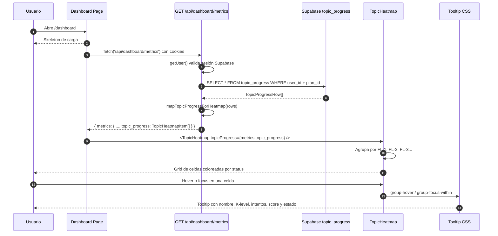
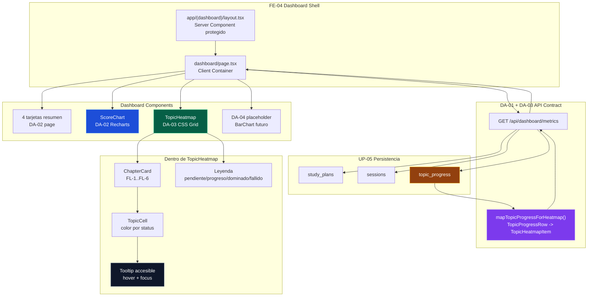

# DA-03 — UI: Heatmap de Tópicos por Estado (`TopicHeatmap`)

> **Bloque:** 📊 BLOQUE F — Dashboard de Progreso  
> **Guía anterior:** [DA-02 — UI: Gráfica de Score por Sesión](file:///c:/Users/jsife/OneDrive/Desktop/Repositorios/practica-testing/docs/guides/fe/DA-02.md)  
> **Siguiente guía:** DA-04 — UI: Tiempo Real vs Estimado (`BarChart`)  
> **Next.js:** **16.2.9** — `params` siempre `await`ed  
> **Fecha:** 30 junio 2026

---

## Sección 1: 🎓 Introducción y Fundamentos Conceptuales

### ¿Dónde estamos?

En **UP-05** persistimos el plan generado por la IA en Supabase: `study_plans`, `sessions` y `topic_progress`. Ese último nombre es clave para esta guía, porque contiene una fila por tópico ISTQB dentro del plan activo del usuario.

En **FE-04** construimos el shell visual del dashboard: layout protegido, navegación, estado de carga y placeholders profesionales. En **DA-01** convertimos esos placeholders en datos reales mediante `GET /api/dashboard/metrics`. En **DA-02** usamos una parte de ese JSON (`scores_by_session[]`) para construir `<ScoreChart>`, la gráfica temporal del rendimiento del estudiante.

Ahora necesitamos responder otra pregunta, más granular y más útil para estudiar: **¿qué tópicos específicos domino, cuáles están en proceso y cuáles requieren atención urgente?**

DA-03 crea el componente `<TopicHeatmap>`, un mapa visual de todos los tópicos del plan agrupados por capítulo (`FL-1`, `FL-2`, etc.). Cada celda representa un tópico y su color comunica el estado real de `topic_progress.status`.

| Guía | Qué aportó | Cómo conecta con DA-03 |
|---|---|---|
| **UP-05** | Inserta `topic_progress` al guardar el plan | DA-03 visualiza esas filas |
| **FE-04** | Crea el dashboard shell y placeholders | DA-03 reemplaza el placeholder “Mapa de Tópicos” |
| **SE-08** | Define lenguaje visual para estados adaptativos | DA-03 reutiliza colores semánticos similares |
| **DA-01** | Crea `/api/dashboard/metrics` | DA-03 enriquece esa respuesta sin romper DA-02 |
| **DA-02** | Crea `<ScoreChart>` | DA-03 convive con `<ScoreChart>` en la misma página |

### Analogía profesional

Imagina que eres el **jefe de operaciones de un centro de control ferroviario**. Tu pantalla principal puede decir “la red está al 82% de operación”, pero ese número agregado no te dice dónde actuar. Si hay una falla en una vía específica, necesitas ver el mapa completo: estaciones en verde, tramos en azul, tramos pendientes en gris y puntos críticos en rojo.

El dashboard de DA-02 ya funciona como una gráfica histórica: te dice si el estudiante viene mejorando o empeorando en sus sesiones. Pero estudiar para ISTQB no solo depende de la tendencia general. Un estudiante puede tener un score promedio aceptable y aun así estar fallando repetidamente en `FL-4.2.1` o `FL-5.1.1`.

El `TopicHeatmap` es ese mapa operacional. No reemplaza al `ScoreChart`; lo complementa. La gráfica de scores responde **“¿cómo voy en el tiempo?”**. El heatmap responde **“¿dónde exactamente debo estudiar hoy?”**.

### Conceptos clave de esta guía

#### 1. No exponer filas crudas de base de datos

`topic_progress` contiene columnas útiles para servidor (`id`, `user_id`, `study_plan_id`) y columnas útiles para UI (`topic_code`, `topic_name`, `level_k`, `attempts`, `best_score`, `last_score`, `status`, `mastered_at`, `updated_at`).

En DA-03 **no vamos a retornar `TopicProgressRow[]` directamente al navegador**. Siguiendo el patrón de DA-01 (`SessionScore`, `TimeComparison`), crearemos un DTO frontend llamado `TopicHeatmapItem`.

Esto mantiene el contrato limpio:

```ts
// DB row completa: contiene llaves internas
TopicProgressRow

// DTO de UI: solo lo que el heatmap necesita
TopicHeatmapItem
```

#### 2. Enriquecimiento incremental sin romper DA-02

DA-02 consume `metrics.scores_by_session`. Si agregamos `metrics.topic_progress`, DA-02 no se rompe porque estamos agregando una propiedad nueva al JSON, no cambiando las existentes.

Este patrón se llama **evolución compatible del contrato**:

```ts
// Antes de DA-03
DashboardMetrics = {
  scores_by_session,
  time_comparison,
  topic_status,
  ...
}

// Después de DA-03
DashboardMetrics = {
  scores_by_session,
  time_comparison,
  topic_progress, // nuevo
  topic_status,
  ...
}
```

#### 3. No asumir “40 tópicos”

El roadmap histórico menciona “40 celdas”, pero el extractor real del proyecto puede guardar más tópicos. En sesiones anteriores se validaron **63 tópicos** para un plan real.

Por eso DA-03 no hardcodea 40. El heatmap renderiza **todos los tópicos que retorne el API**. Si el syllabus o el extractor cambian, el componente sigue funcionando.

#### 4. Agrupamiento semántico en frontend

Supabase retorna una lista plana:

```ts
[
  { topic_code: "FL-1.1.1", status: "mastered" },
  { topic_code: "FL-1.2.1", status: "pending" },
  { topic_code: "FL-4.2.1", status: "failed" }
]
```

El usuario no debe ver una lista plana. Debe ver capítulos. Por eso agrupamos por prefijo:

```ts
"FL-1.1.1" → "FL-1"
"FL-4.2.1" → "FL-4"
```

#### 5. Tooltip accesible sin dependencia extra

No necesitamos instalar otra librería. El heatmap usa CSS con `group-hover` y `group-focus-within` para mostrar un tooltip por celda. Esto evita problemas de `mousemove`, reduce JavaScript y mejora accesibilidad con teclado.

---

## Sección 2: 📋 Prerequisitos y Verificación del Entorno

Ejecuta estos comandos desde la raíz del proyecto en PowerShell.

| # | Requisito | Comando | Resultado esperado |
|---|---|---|---|
| 1 | Node.js 18+ | `node --version` | `v18.x.x` o superior |
| 2 | Next resuelto a 16.2.9 | `npm --prefix frontend list next` | `next@16.2.9` |
| 3 | Tipos de DB existentes | `Test-Path "frontend/types/database.ts"` | `True` |
| 4 | Tipos de dashboard DA-01 | `Test-Path "frontend/types/dashboard.ts"` | `True` |
| 5 | API metrics DA-01 | `Test-Path -LiteralPath "frontend/app/api/dashboard/metrics/route.ts"` | `True` |
| 6 | ScoreChart DA-02 | `Test-Path "frontend/components/dashboard/score-chart.tsx"` | `True` |
| 7 | Dashboard page FE-04/DA-02 | `Test-Path -LiteralPath "frontend/app/(dashboard)/dashboard/page.tsx"` | `True` |

### Verificación conjunta

```powershell
Test-Path "frontend/types/database.ts"
Test-Path "frontend/types/dashboard.ts"
Test-Path -LiteralPath "frontend/app/api/dashboard/metrics/route.ts"
Test-Path "frontend/components/dashboard/score-chart.tsx"
Test-Path -LiteralPath "frontend/app/(dashboard)/dashboard/page.tsx"
```

**Salida esperada:**

```text
True
True
True
True
True
```

### Verificación del barrel de tipos

```powershell
Select-String -Path "frontend/types/index.ts" -Pattern "TopicProgressRow" -Quiet
```

**Salida esperada:**

```text
True
```

> [!IMPORTANT]
> Si `TopicProgressRow` no existe, no avances. Esa definición viene del bloque DB/UP y es necesaria para mapear los datos del servidor hacia el DTO `TopicHeatmapItem`.

---

## Sección 3: 📂 Estructura de Directorios del Proyecto

Estado relevante después de completar DA-03:

```text
frontend/
├── app/
│   ├── (auth)/
│   │   ├── login/page.tsx
│   │   └── register/page.tsx
│   ├── (dashboard)/
│   │   ├── _components/
│   │   │   ├── main-nav.tsx
│   │   │   ├── mobile-nav.tsx
│   │   │   └── user-menu.tsx
│   │   ├── dashboard/page.tsx          ← 🔄 DA-03: importa y renderiza TopicHeatmap
│   │   ├── plan/page.tsx
│   │   ├── session/page.tsx
│   │   ├── setup/page.tsx
│   │   ├── layout.tsx
│   │   ├── loading.tsx
│   │   └── error.tsx
│   ├── api/
│   │   ├── dashboard/
│   │   │   └── metrics/
│   │   │       └── route.ts            ← 🔄 DA-03: agrega topic_progress al JSON
│   │   ├── plan/generate/route.ts
│   │   ├── plan/save/route.ts          ← UP-05: crea topic_progress
│   │   ├── sessions/
│   │   └── upload/route.ts
│   └── auth/callback/route.ts
├── components/
│   ├── dashboard/
│   │   ├── score-chart.tsx             ← DA-02: gráfica de scores
│   │   └── topic-heatmap.tsx           ← 🆕 DA-03: heatmap de tópicos
│   ├── session/
│   │   ├── feedback-panel.tsx          ← SE-08: referencia visual de estados
│   │   ├── quiz-card.tsx
│   │   └── theory-panel.tsx
│   ├── shared/
│   └── ui/
├── lib/
│   └── supabase/
│       ├── client.ts
│       ├── server.ts
│       └── admin.ts
├── types/
│   ├── database.ts                     ← existente: TopicProgressRow
│   ├── dashboard.ts                    ← 🔄 DA-03: TopicHeatmapItem + topic_progress
│   └── index.ts                        ← 🔄 DA-03: re-export opcional
├── middleware.ts
├── package.json
└── tsconfig.json
```

### Resumen de archivos de DA-03

| Acción | Archivo | Razón |
|---|---|---|
| 🔄 Modificar | `frontend/types/dashboard.ts` | Agregar DTO `TopicHeatmapItem` y propiedad `topic_progress` |
| 🔄 Modificar | `frontend/types/index.ts` | Re-exportar `TopicHeatmapItem` para consistencia del barrel |
| 🔄 Modificar | `frontend/app/api/dashboard/metrics/route.ts` | Mapear `TopicProgressRow[]` a `TopicHeatmapItem[]` |
| 🆕 Crear | `frontend/components/dashboard/topic-heatmap.tsx` | Renderizar grid de capítulos, celdas y tooltip |
| 🔄 Modificar | `frontend/app/(dashboard)/dashboard/page.tsx` | Reemplazar placeholder DA-03 por `<TopicHeatmap>` |

---

## Sección 4: 🎨 Diagrama de Arquitectura de Componentes

### Flujo de Datos Completo



### Composición Visual del Dashboard



### Fronteras de responsabilidad

| Pieza | Responsabilidad | Qué NO debe hacer |
|---|---|---|
| `route.ts` | Leer Supabase, calcular métricas y mapear DTOs | Renderizar UI o retornar filas crudas innecesarias |
| `dashboard.ts` | Tipar el contrato público del dashboard | Contener lógica de agrupamiento visual |
| `DashboardPage` | Hacer fetch y orquestar componentes | Saber cómo se colorea cada tópico |
| `TopicHeatmap` | Agrupar, ordenar y renderizar tópicos | Hacer fetch, autenticar o consultar Supabase |

---

## Sección 5: 🛠️ Implementación Paso a Paso

### Paso A: Actualizar tipos del dashboard

**Archivo:** `frontend/types/dashboard.ts`

Primero agregamos un DTO específico para UI. No uses `TopicProgressRow` como prop directo del componente: contiene campos internos que no necesita el navegador.

#### A.1 — Actualizar imports

Busca el import actual:

```ts
import type { SessionType, ActionTaken, StudyPlanStatus } from "./database";
```

Reemplázalo por:

```ts
import type {
  SessionType,
  ActionTaken,
  StudyPlanStatus,
  LevelK,
  TopicProgressStatus,
} from "./database";
```

#### A.2 — Agregar el DTO `TopicHeatmapItem`

Colócalo después de `TopicStatusCount` y antes de `TimeComparison`.

```ts
// ──────────────────────────────────────────────────────────────
// Tópico individual para el heatmap (DA-03)
// ──────────────────────────────────────────────────────────────

/**
 * DTO público para pintar una celda del heatmap.
 *
 * No es igual a TopicProgressRow porque intencionalmente NO expone:
 * - id
 * - user_id
 * - study_plan_id
 *
 * El componente solo necesita información visual y pedagógica.
 */
export interface TopicHeatmapItem {
  /** Código oficial del tópico. Ej: "FL-4.2.1" */
  topic_code: string;

  /** Nombre legible extraído del syllabus o del PDF */
  topic_name: string | null;

  /** Nivel cognitivo ISTQB: K1, K2 o K3 */
  level_k: LevelK | null;

  /** Número de veces que el estudiante fue evaluado en este tópico */
  attempts: number;

  /** Mejor score histórico del tópico (0-100) */
  best_score: number;

  /** Score más reciente del tópico (0-100) */
  last_score: number;

  /** Estado actual del progreso: pending, in_progress, mastered, failed */
  status: TopicProgressStatus;

  /** Fecha en que se dominó el tópico, si aplica */
  mastered_at: string | null;

  /** Última actualización del progreso */
  updated_at: string;
}
```

#### A.3 — Agregar `topic_progress` a `DashboardMetrics`

Dentro de `DashboardMetrics`, debajo de `time_comparison`, agrega:

```ts
  /** Tópicos detallados para el heatmap por estado (DA-03) */
  topic_progress: TopicHeatmapItem[];
```

El bloque de arrays debe quedar así:

```ts
export interface DashboardMetrics {
  // ─── Datos de series (arrays) ──────────────────────────────

  /** Scores de todas las sesiones completadas, ordenados cronológicamente */
  scores_by_session: SessionScore[];

  /** Comparación de tiempo real vs estimado por sesión */
  time_comparison: TimeComparison[];

  /** Tópicos detallados para el heatmap por estado (DA-03) */
  topic_progress: TopicHeatmapItem[];

  // ... resto igual
}
```

**Entregables del Paso A:**

- ✅ `TopicHeatmapItem` creado en `frontend/types/dashboard.ts`
- ✅ `DashboardMetrics.topic_progress` agregado
- ✅ Imports de `LevelK` y `TopicProgressStatus` agregados

---

### Paso B: Actualizar el barrel de tipos

**Archivo:** `frontend/types/index.ts`

El proyecto ya re-exporta los tipos de dashboard desde DA-01. Agrega `TopicHeatmapItem` al bloque DA-01/DA-03.

Busca:

```ts
export type {
  SessionScore,
  TopicStatusCount,
  TimeComparison,
  DashboardMetrics,
  DashboardMetricsResponse,
  NoPlanResponse,
} from "./dashboard";
```

Déjalo así:

```ts
// 🆕 DA-01/DA-03: Re-exportar tipos del dashboard de métricas
export type {
  SessionScore,
  TopicStatusCount,
  TopicHeatmapItem,
  TimeComparison,
  DashboardMetrics,
  DashboardMetricsResponse,
  NoPlanResponse,
} from "./dashboard";
```

**Entregables del Paso B:**

- ✅ `TopicHeatmapItem` disponible desde `@/types`
- ✅ Barrel coherente con el resto de guías UP/SE/DA

---

### Paso C: Enriquecer `/api/dashboard/metrics`

**Archivo:** `frontend/app/api/dashboard/metrics/route.ts`

DA-01 ya consulta `topic_progress` para calcular `topic_status`. DA-03 aprovecha esa query existente y solo agrega un mapeo seguro para UI.

#### C.1 — Actualizar imports de tipos

Busca el import de `@/types/dashboard`:

```ts
import type {
  DashboardMetrics,
  SessionScore,
  TopicStatusCount,
  TimeComparison,
} from "@/types/dashboard";
```

Agrega `TopicHeatmapItem`:

```ts
import type {
  DashboardMetrics,
  SessionScore,
  TopicHeatmapItem,
  TopicStatusCount,
  TimeComparison,
} from "@/types/dashboard";
```

#### C.2 — Construir `topic_progress` para UI

Después de construir `timeComparison`, agrega este bloque:

```ts
    // 5d. Construir topic_progress para el heatmap (DA-03)
    // No retornamos TopicProgressRow completo para no exponer IDs internos
    // como user_id o study_plan_id. El dashboard solo necesita datos visuales.
    const topicHeatmap: TopicHeatmapItem[] = topicProgress.map((topic) => ({
      topic_code: topic.topic_code,
      topic_name: topic.topic_name,
      level_k: topic.level_k,
      attempts: topic.attempts,
      best_score: topic.best_score,
      last_score: topic.last_score,
      status: topic.status,
      mastered_at: topic.mastered_at,
      updated_at: topic.updated_at,
    }));
```

Luego renumera mentalmente las métricas derivadas. No pasa nada si el comentario queda como `5e`; lo importante es que el código compile.

#### C.3 — Agregar la propiedad al objeto `metrics`

En el objeto `const metrics: DashboardMetrics = { ... }`, debajo de `time_comparison`, agrega:

```ts
      topic_progress: topicHeatmap,
```

El bloque debe quedar así:

```ts
    const metrics: DashboardMetrics = {
      // Datos de series
      scores_by_session: scoresBySession,
      time_comparison: timeComparison,
      topic_progress: topicHeatmap,

      // Datos agregados
      topic_status: topicStatus,

      // Datos del plan
      estimated_end_date: plan.estimated_end_date,
      start_date: plan.start_date,
      objective_days: plan.objective_days,
      plan_status: plan.status,

      // Métricas derivadas
      completion_percent: completionPercent,
      total_sessions: totalSessions,
      completed_sessions: completedCount,
      current_streak: currentStreak,
    };
```

**Entregables del Paso C:**

- ✅ `TopicHeatmapItem` importado en `route.ts`
- ✅ `topicHeatmap` construido desde `topicProgress`
- ✅ `metrics.topic_progress` incluido en la respuesta
- ✅ DA-02 sigue funcionando porque `scores_by_session` no cambió

---

### Paso D: Crear `<TopicHeatmap>`

**Archivo nuevo:** `frontend/components/dashboard/topic-heatmap.tsx`

Este componente es de presentación. Recibe `topicProgress` como prop, agrupa por capítulo y pinta celdas. No hace fetch y no conoce Supabase.

```tsx
"use client";

// ============================================================
// components/dashboard/topic-heatmap.tsx — Heatmap de tópicos
// ============================================================
// TIPO: Client Component ('use client')
//
// RESPONSABILIDADES:
//   1. Recibir metrics.topic_progress desde /api/dashboard/metrics.
//   2. Agrupar tópicos por capítulo del syllabus (FL-1, FL-2...).
//   3. Renderizar celdas coloreadas por status.
//   4. Mostrar tooltip accesible con hover y focus.
//
// NO HACE:
//   - Fetch de datos
//   - Queries a Supabase
//   - Cálculo de métricas globales
// ============================================================

import type {
  LevelK,
  TopicHeatmapItem,
  TopicProgressStatus,
} from "@/types";

interface TopicHeatmapProps {
  /** Lista sanitizada de tópicos retornada por DashboardMetrics.topic_progress */
  topicProgress: TopicHeatmapItem[];
}

interface ChapterMeta {
  title: string;
  name: string;
  accentClass: string;
}

interface StatusStyle {
  label: string;
  cellClass: string;
  badgeClass: string;
  dotClass: string;
}

interface ChapterGroup {
  key: string;
  meta: ChapterMeta;
  topics: TopicHeatmapItem[];
}

const CHAPTER_META: Record<string, ChapterMeta> = {
  "FL-1": {
    title: "FL-1",
    name: "Fundamentos de la prueba",
    accentClass: "from-emerald-500/20 to-emerald-500/5 border-emerald-500/20",
  },
  "FL-2": {
    title: "FL-2",
    name: "Pruebas en el ciclo de vida",
    accentClass: "from-blue-500/20 to-blue-500/5 border-blue-500/20",
  },
  "FL-3": {
    title: "FL-3",
    name: "Pruebas estáticas",
    accentClass: "from-cyan-500/20 to-cyan-500/5 border-cyan-500/20",
  },
  "FL-4": {
    title: "FL-4",
    name: "Técnicas de prueba",
    accentClass: "from-purple-500/20 to-purple-500/5 border-purple-500/20",
  },
  "FL-5": {
    title: "FL-5",
    name: "Gestión de la prueba",
    accentClass: "from-amber-500/20 to-amber-500/5 border-amber-500/20",
  },
  "FL-6": {
    title: "FL-6",
    name: "Herramientas de prueba",
    accentClass: "from-rose-500/20 to-rose-500/5 border-rose-500/20",
  },
};

const STATUS_STYLES: Record<TopicProgressStatus, StatusStyle> = {
  pending: {
    label: "Pendiente",
    cellClass:
      "border-slate-700 bg-slate-800/70 text-slate-300 hover:bg-slate-700/90 focus-visible:bg-slate-700/90",
    badgeClass: "border-slate-700 bg-slate-800 text-slate-300",
    dotClass: "bg-slate-500",
  },
  in_progress: {
    label: "En progreso",
    cellClass:
      "border-blue-500/70 bg-blue-600/80 text-white shadow-blue-500/20 hover:bg-blue-500 focus-visible:bg-blue-500",
    badgeClass: "border-blue-500/40 bg-blue-950/70 text-blue-300",
    dotClass: "bg-blue-400",
  },
  mastered: {
    label: "Dominado",
    cellClass:
      "border-emerald-400/80 bg-emerald-500/85 text-slate-950 shadow-emerald-500/25 hover:bg-emerald-400 focus-visible:bg-emerald-400",
    badgeClass: "border-emerald-500/40 bg-emerald-950/70 text-emerald-300",
    dotClass: "bg-emerald-400",
  },
  failed: {
    label: "Fallido",
    cellClass:
      "border-red-400/80 bg-red-500/85 text-white shadow-red-500/25 hover:bg-red-400 focus-visible:bg-red-400",
    badgeClass: "border-red-500/40 bg-red-950/70 text-red-300",
    dotClass: "bg-red-400",
  },
};

function getChapterKey(topicCode: string): string {
  const match = topicCode.match(/^FL-(\d+)/);
  return match ? `FL-${match[1]}` : "OTROS";
}

function getCompactTopicLabel(topicCode: string): string {
  return topicCode.replace(/^FL-\d\./, "");
}

function getLevelClass(level: LevelK | null): string {
  switch (level) {
    case "K3":
      return "border-purple-500/40 bg-purple-950/70 text-purple-300";
    case "K2":
      return "border-blue-500/40 bg-blue-950/70 text-blue-300";
    case "K1":
    default:
      return "border-slate-600 bg-slate-800 text-slate-300";
  }
}

function groupTopicsByChapter(topicProgress: TopicHeatmapItem[]): ChapterGroup[] {
  const groups: Record<string, TopicHeatmapItem[]> = {};

  // Mantener visibles los capítulos oficiales aunque alguno no tenga tópicos.
  for (const key of Object.keys(CHAPTER_META)) {
    groups[key] = [];
  }

  for (const topic of topicProgress) {
    const chapterKey = getChapterKey(topic.topic_code);

    if (!groups[chapterKey]) {
      groups[chapterKey] = [];
    }

    groups[chapterKey].push(topic);
  }

  return Object.entries(groups)
    .sort(([a], [b]) => a.localeCompare(b, undefined, { numeric: true }))
    .map(([key, topics]) => ({
      key,
      meta: CHAPTER_META[key] ?? {
        title: key,
        name: "Tópicos adicionales del plan",
        accentClass: "from-slate-500/20 to-slate-500/5 border-slate-500/20",
      },
      topics: [...topics].sort((a, b) =>
        a.topic_code.localeCompare(b.topic_code, undefined, {
          numeric: true,
          sensitivity: "base",
        }),
      ),
    }));
}

function countMastered(topics: TopicHeatmapItem[]): number {
  return topics.filter((topic) => topic.status === "mastered").length;
}

function TopicTooltip({ topic }: { topic: TopicHeatmapItem }) {
  const status = STATUS_STYLES[topic.status];
  const bestScoreClass =
    topic.best_score >= 70
      ? "text-emerald-300"
      : topic.best_score > 0
        ? "text-red-300"
        : "text-slate-300";

  return (
    <div
      className="
        pointer-events-none absolute left-1/2 top-full z-50 mt-2
        w-72 -translate-x-1/2 rounded-xl border border-slate-700
        bg-slate-950/95 p-4 text-left shadow-2xl shadow-black/40
        opacity-0 backdrop-blur-md transition-opacity duration-150
        group-hover:opacity-100 group-focus-within:opacity-100
      "
      role="tooltip"
    >
      <div className="mb-3 flex items-start justify-between gap-3 border-b border-slate-800 pb-3">
        <div>
          <p className="font-mono text-sm font-bold text-white">
            {topic.topic_code}
          </p>
          <p className="mt-1 text-xs leading-relaxed text-slate-300">
            {topic.topic_name ?? "Tópico del syllabus ISTQB"}
          </p>
        </div>
        <span
          className={`shrink-0 rounded-md border px-2 py-1 text-[10px] font-bold ${getLevelClass(topic.level_k)}`}
        >
          {topic.level_k ?? "K?"}
        </span>
      </div>

      <div className="grid grid-cols-2 gap-3 text-xs">
        <div>
          <span className="block text-slate-500">Estado</span>
          <span className={`mt-1 inline-flex rounded-md border px-2 py-1 ${status.badgeClass}`}>
            {status.label}
          </span>
        </div>
        <div>
          <span className="block text-slate-500">Intentos</span>
          <span className="mt-1 block font-semibold text-slate-100">
            {topic.attempts}
          </span>
        </div>
        <div>
          <span className="block text-slate-500">Mejor score</span>
          <span className={`mt-1 block font-semibold ${bestScoreClass}`}>
            {topic.best_score}%
          </span>
        </div>
        <div>
          <span className="block text-slate-500">Último score</span>
          <span className="mt-1 block font-semibold text-slate-100">
            {topic.last_score}%
          </span>
        </div>
      </div>
    </div>
  );
}

export function TopicHeatmap({ topicProgress }: TopicHeatmapProps) {
  const chapterGroups = groupTopicsByChapter(topicProgress);
  const totalTopics = topicProgress.length;
  const masteredTopics = countMastered(topicProgress);

  if (totalTopics === 0) {
    return (
      <section className="rounded-xl border border-slate-800 bg-slate-900/50 p-6">
        <h2 className="text-lg font-semibold text-white">Mapa de Tópicos</h2>
        <div className="mt-4 flex h-[220px] flex-col items-center justify-center rounded-lg border border-dashed border-slate-800 bg-slate-950/30 text-center">
          <div className="mb-3 text-4xl">🗺️</div>
          <p className="text-sm text-slate-400">No hay tópicos disponibles.</p>
          <p className="mt-1 max-w-sm text-xs text-slate-500">
            Esto suele indicar que el plan activo no creó registros en
            topic_progress. Revisa UP-05 o crea un nuevo plan.
          </p>
        </div>
      </section>
    );
  }

  return (
    <section className="rounded-xl border border-slate-800 bg-slate-900/50 p-6 shadow-xl shadow-black/10">
      <div className="mb-6 flex flex-col gap-4 lg:flex-row lg:items-start lg:justify-between">
        <div>
          <div className="flex items-center gap-2">
            <span className="text-2xl">🗺️</span>
            <h2 className="text-xl font-bold tracking-tight text-white">
              Mapa de Tópicos por Estado
            </h2>
          </div>
          <p className="mt-2 max-w-2xl text-sm leading-relaxed text-slate-400">
            Visualiza todos los tópicos del plan activo agrupados por capítulo.
            Los colores siguen el estado real de topic_progress.
          </p>
        </div>

        <div className="rounded-lg border border-slate-800 bg-slate-950/60 px-4 py-3 text-sm">
          <p className="text-slate-500">Dominados</p>
          <p className="text-2xl font-bold text-emerald-400">
            {masteredTopics}
            <span className="text-sm font-normal text-slate-500">
              /{totalTopics}
            </span>
          </p>
        </div>
      </div>

      <div className="mb-6 flex flex-wrap gap-3 text-xs">
        {Object.entries(STATUS_STYLES).map(([status, config]) => (
          <div key={status} className="flex items-center gap-2 text-slate-300">
            <span className={`h-3 w-3 rounded-full ${config.dotClass}`} />
            <span>{config.label}</span>
          </div>
        ))}
      </div>

      <div className="grid gap-5 xl:grid-cols-2">
        {chapterGroups.map((chapter) => {
          const masteredInChapter = countMastered(chapter.topics);

          return (
            <article
              key={chapter.key}
              className={`rounded-xl border bg-gradient-to-br p-4 ${chapter.meta.accentClass}`}
            >
              <header className="mb-4 flex items-start justify-between gap-3">
                <div>
                  <p className="text-xs font-bold uppercase tracking-[0.2em] text-emerald-300">
                    {chapter.meta.title}
                  </p>
                  <h3 className="mt-1 text-sm font-semibold text-white">
                    {chapter.meta.name}
                  </h3>
                </div>
                <span className="rounded-full border border-slate-700 bg-slate-950/60 px-2.5 py-1 text-xs text-slate-300">
                  {masteredInChapter}/{chapter.topics.length} ok
                </span>
              </header>

              {chapter.topics.length > 0 ? (
                <div className="grid grid-cols-6 gap-2 sm:grid-cols-8">
                  {chapter.topics.map((topic) => {
                    const status = STATUS_STYLES[topic.status];
                    const label = getCompactTopicLabel(topic.topic_code);

                    return (
                      <div key={topic.topic_code} className="group relative">
                        <button
                          type="button"
                          className={`
                            aspect-square w-full rounded-lg border text-[10px]
                            font-bold shadow-sm transition-all duration-150
                            hover:-translate-y-0.5 focus-visible:-translate-y-0.5
                            focus-visible:outline-none focus-visible:ring-2
                            focus-visible:ring-emerald-400/70
                            ${status.cellClass}
                          `}
                          aria-label={`${topic.topic_code}: ${topic.topic_name ?? "Tópico ISTQB"}. Estado: ${status.label}. Mejor score: ${topic.best_score}%.`}
                        >
                          {label}
                        </button>
                        <TopicTooltip topic={topic} />
                      </div>
                    );
                  })}
                </div>
              ) : (
                <div className="flex h-24 items-center justify-center rounded-lg border border-dashed border-slate-800 bg-slate-950/30 text-xs text-slate-500">
                  Sin tópicos en este capítulo
                </div>
              )}
            </article>
          );
        })}
      </div>
    </section>
  );
}
```

**Entregables del Paso D:**

- ✅ `frontend/components/dashboard/topic-heatmap.tsx` creado
- ✅ Agrupamiento por capítulo (`FL-1`, `FL-2`, etc.)
- ✅ Ordenamiento numérico de tópicos
- ✅ Tooltip accesible con hover y focus
- ✅ Leyenda de colores
- ✅ Estado vacío si `topic_progress` llega vacío

---

### Paso E: Integrar `<TopicHeatmap>` en `/dashboard`

**Archivo:** `frontend/app/(dashboard)/dashboard/page.tsx`

#### E.1 — Agregar import

Debajo del import de `ScoreChart`, agrega:

```ts
import { TopicHeatmap } from "@/components/dashboard/topic-heatmap";
```

#### E.2 — Reemplazar placeholder DA-03

Busca este bloque:

```tsx
{/* Placeholder DA-03: Heatmap de tópicos */}
<div className="rounded-xl border border-slate-800 bg-slate-900/30 p-6">
  <h3 className="text-lg font-semibold text-white mb-2">
    🗺️ Mapa de Tópicos
  </h3>
  <div className="flex items-center justify-center h-[200px]">
    <p className="text-slate-500 text-sm">Próximamente en DA-03</p>
  </div>
</div>
```

Reemplázalo por:

```tsx
{/* DA-03: Heatmap de tópicos por estado */}
<div className="md:col-span-2">
  <TopicHeatmap topicProgress={metrics.topic_progress} />
</div>
```

#### E.3 — Ajustar el grid contenedor

El bloque completo después de `ScoreChart` debe quedar así:

```tsx
{/* ─── Gráfica de scores (DA-02) ─── */}
<ScoreChart data={metrics.scores_by_session} />

{/* ─── Componentes de análisis detallado ─── */}
<div className="grid gap-4 md:grid-cols-2">
  {/* DA-03: Heatmap de tópicos por estado */}
  <div className="md:col-span-2">
    <TopicHeatmap topicProgress={metrics.topic_progress} />
  </div>

  {/* Placeholder DA-04: Tiempo real vs estimado */}
  <div className="rounded-xl border border-slate-800 bg-slate-900/30 p-6">
    <h3 className="text-lg font-semibold text-white mb-2">
      ⏱️ Gestión de Tiempo
    </h3>
    <div className="flex items-center justify-center h-[200px]">
      <p className="text-slate-500 text-sm">Próximamente en DA-04</p>
    </div>
  </div>
</div>
```

**Entregables del Paso E:**

- ✅ `TopicHeatmap` importado en `dashboard/page.tsx`
- ✅ Placeholder DA-03 eliminado
- ✅ `metrics.topic_progress` conectado al componente
- ✅ Placeholder DA-04 conservado

---

### Paso F: Verificación local de la respuesta JSON

Con el servidor corriendo e iniciado sesión en el navegador, abre DevTools → Console en `/dashboard` y ejecuta:

```javascript
fetch('/api/dashboard/metrics')
  .then((response) => response.json())
  .then((data) => console.log(data.metrics?.topic_progress));
```

**Salida esperada:**

```text
[
  {
    topic_code: "FL-1.1.1",
    topic_name: "...",
    level_k: "K1",
    attempts: 0,
    best_score: 0,
    last_score: 0,
    status: "pending",
    mastered_at: null,
    updated_at: "2026-06-30T..."
  },
  ...
]
```

No debes ver `user_id` ni `study_plan_id` dentro de cada objeto. Si aparecen, el endpoint está retornando filas crudas y no el DTO `TopicHeatmapItem`.

---

## Sección 6: ✅ Checkpoints de Verificación

### Verificación 1: TypeScript

```powershell
npx tsc --noEmit --project frontend/tsconfig.json
```

**Salida esperada:**

```text

```

Una salida vacía significa que TypeScript compiló sin errores.

### Verificación 2: Build de producción

```powershell
npm --prefix frontend run build
```

**Salida esperada:**

```text
> frontend@0.1.0 build
> next build

▲ Next.js 16.2.9 (Turbopack)
- Environments: .env.local

  Creating an optimized production build ...
✓ Compiled successfully
  Running TypeScript ...
  Finished TypeScript

Route (app)
├ ƒ /api/dashboard/metrics
├ ƒ /dashboard
...
```

### Verificación 3: Archivos esperados

```powershell
Test-Path "frontend/components/dashboard/topic-heatmap.tsx"
Select-String -Path "frontend/types/dashboard.ts" -Pattern "TopicHeatmapItem" -Quiet
Select-String -Path "frontend/types/dashboard.ts" -Pattern "topic_progress" -Quiet
Select-String -Path "frontend/app/api/dashboard/metrics/route.ts" -Pattern "topicHeatmap" -Quiet
Select-String -Path "frontend/app/(dashboard)/dashboard/page.tsx" -Pattern "TopicHeatmap" -Quiet
```

**Salida esperada:**

```text
True
True
True
True
True
```

### Verificación 4: Visual en desktop

Levanta el servidor:

```powershell
npm --prefix frontend run dev
```

**Salida esperada:**

```text
▲ Next.js 16.2.9 (Turbopack)
- Local:        http://localhost:3000
- Environments: .env.local

 ✓ Starting...
 ✓ Ready
```

Abre `http://localhost:3000/dashboard` con un usuario que tenga plan activo.

Deberías ver:

- ✅ Las 4 tarjetas superiores de DA-02 siguen visibles
- ✅ `<ScoreChart>` sigue renderizando la línea de scores
- ✅ Debajo aparece “Mapa de Tópicos por Estado”
- ✅ Hay tarjetas por capítulo (`FL-1`, `FL-2`, `FL-3`, etc.)
- ✅ Cada tarjeta tiene celdas cuadradas con códigos compactos (`1.1`, `2.3`, etc.)
- ✅ La leyenda muestra Pendiente, En progreso, Dominado y Fallido
- ✅ Al hacer hover sobre una celda aparece un tooltip oscuro con código, nombre, K-level, intentos y scores

### Verificación 5: Visual en mobile

Reduce el viewport a `375px`.

Deberías ver:

- ✅ El heatmap se apila verticalmente
- ✅ Las celdas siguen siendo cuadradas
- ✅ La leyenda se envuelve en varias líneas sin romper layout
- ✅ El tooltip no tapa permanentemente el contenido porque aparece solo en hover/focus
- ✅ El dashboard sigue navegable dentro del layout FE-04

### Checklist de entregables

| # | Entregable | Estado esperado |
|---|---|---|
| 1 | `TopicHeatmapItem` en `types/dashboard.ts` | Existe y no expone `user_id` |
| 2 | `DashboardMetrics.topic_progress` | Existe como `TopicHeatmapItem[]` |
| 3 | API route enriquecida | Retorna `topic_progress` en `metrics` |
| 4 | `topic-heatmap.tsx` | Existe y exporta `TopicHeatmap` |
| 5 | Dashboard page | Importa y renderiza `<TopicHeatmap>` |
| 6 | TypeScript | `tsc` limpio |
| 7 | Build | `next build` exitoso |
| 8 | Visual | Heatmap + tooltip funcionan en `/dashboard` |

---

## Sección 7: 🚨 Troubleshooting — Problemas Comunes

| # | Problema | Causa probable | Solución |
|---|---|---|---|
| 1 | `Property 'topic_progress' does not exist on type 'DashboardMetrics'` | Agregaste el componente antes de actualizar `types/dashboard.ts` | Completa el **Paso A.3** y vuelve a ejecutar `npx tsc --noEmit --project frontend/tsconfig.json` |
| 2 | `Cannot find name 'TopicHeatmapItem'` | No importaste o no exportaste el DTO | Revisa el **Paso A.1** y el **Paso B**. Si importas desde `@/types`, el barrel debe exportarlo |
| 3 | El heatmap muestra “No hay tópicos disponibles” | El API retorna `topic_progress: []` | Verifica que UP-05 creó filas en `topic_progress`. También revisa que el plan activo sea el mismo que se consulta en `/api/dashboard/metrics` |
| 4 | Las celdas aparecen todas grises | Todos los tópicos tienen `status = 'pending'` | Esto es normal en un plan recién creado. Completa sesiones y evaluaciones para que SE-07/SE-08 actualicen el progreso |
| 5 | Los colores no coinciden con Supabase | El endpoint retorna un status distinto o antiguo | Ejecuta `fetch('/api/dashboard/metrics').then(r => r.json()).then(console.log)` y compara `topic_progress[].status` contra la celda |
| 6 | El tooltip se corta en el borde derecho | El contenedor tiene poco ancho o la celda está al extremo | Para un ajuste futuro, puedes alternar la posición del tooltip según columna. Para DA-03 basta con validar que el contenido principal no se rompe |
| 7 | `Module not found: Can't resolve '@/components/dashboard/topic-heatmap'` | El archivo no está en la ruta exacta o el nombre no coincide | Verifica `frontend/components/dashboard/topic-heatmap.tsx` y que el import use `@/components/dashboard/topic-heatmap` |
| 8 | Build falla pero dev funciona | TypeScript detecta un contrato incompleto en producción | Ejecuta primero `npx tsc --noEmit --project frontend/tsconfig.json`; el error de tipos suele señalar el archivo exacto |

> [!TIP]
> Si el heatmap se ve vacío pero el endpoint sí trae datos, agrega temporalmente `console.log(metrics.topic_progress)` dentro de `dashboard/page.tsx`. Si el array existe, el problema está en el componente. Si no existe, el problema está en `route.ts` o en `DashboardMetrics`.

---

## Sección 8: 📝 Resumen y Próximo Paso

### Lo que hiciste en DA-03

1. Creaste un DTO `TopicHeatmapItem` para no exponer filas crudas de `topic_progress`.
2. Extendiste `DashboardMetrics` con `topic_progress: TopicHeatmapItem[]` sin romper DA-02.
3. Enriqueciste `GET /api/dashboard/metrics` con datos detallados de tópicos.
4. Creaste `<TopicHeatmap>` como componente de presentación.
5. Agrupaste tópicos por capítulo (`FL-1`, `FL-2`, etc.) sin asumir un número fijo de celdas.
6. Reutilizaste el lenguaje visual de SE-08: verde para dominio, azul para progreso, rojo para alerta y gris para pendiente.
7. Reemplazaste el placeholder de FE-04/DA-02 por un dashboard real de progreso tópico.
8. Verificaste con `tsc`, `build` y prueba visual en navegador.

### Qué NO hiciste todavía

- No creaste el `BarChart` de tiempo real vs estimado. Eso corresponde a **DA-04**.
- No agregaste filtros por capítulo o status. Puede ser una mejora futura.
- No modificaste la lógica adaptativa de SE-07. DA-03 solo visualiza el estado ya calculado.

### Próxima guía: DA-04

En **DA-04 — UI: Tiempo Real vs Estimado**, construiremos un gráfico de barras con Recharts usando `metrics.time_comparison`. Compararemos `estimated_minutes` contra `actual_minutes` para responder otra pregunta clave: **¿el estudiante está invirtiendo más o menos tiempo del esperado por sesión?**

> [!IMPORTANT]
> Antes de avanzar a DA-04, valida DA-03 con el step validator: “Valida DA-03 completa”. Deben pasar `tsc`, build y verificación visual del heatmap con datos reales.
