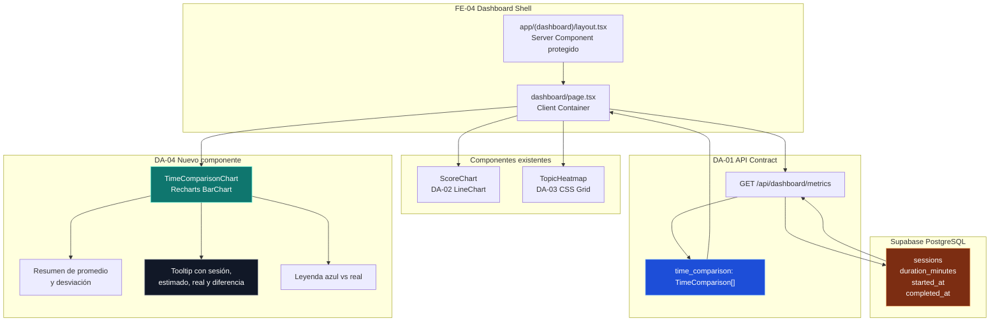
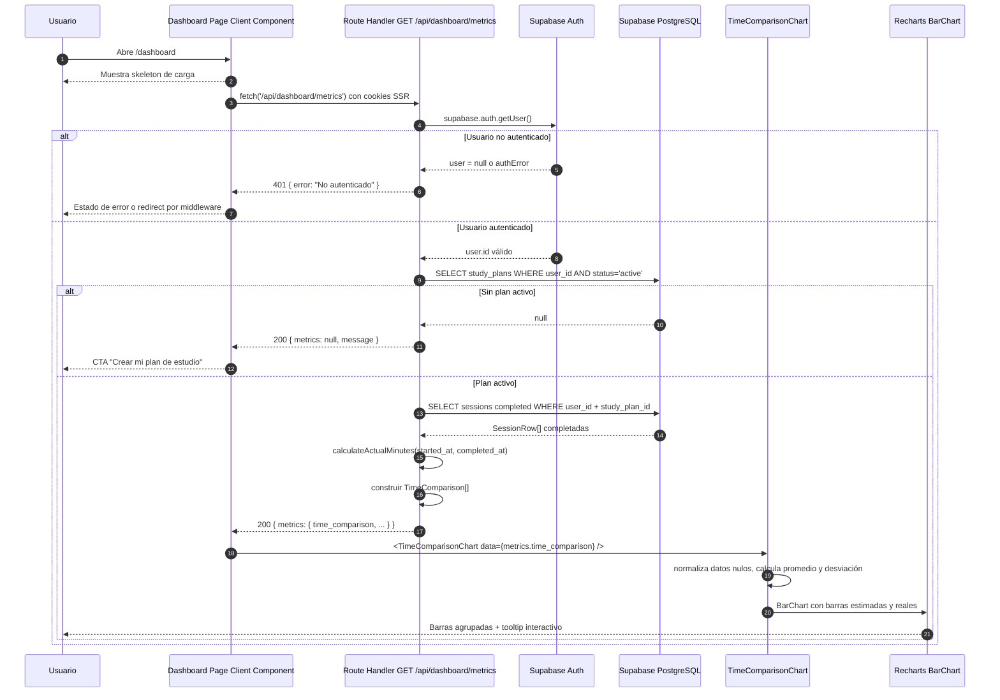

# DA-04 — UI: Tiempo Real vs Estimado (`BarChart`)

> **Bloque:** 📊 BLOQUE F — Dashboard de Progreso  
> **Guía anterior:** [DA-03 — UI: Heatmap de Tópicos por Estado](file:///c:/Users/jsife/OneDrive/Desktop/Repositorios/practica-testing/docs/guides/fe/DA-03.md)  
> **Siguiente guía:** DA-05 — UI: fecha estimada de examen + contadores ejecutivos  
> **Next.js instalado:** **16.2.9** según `frontend/package-lock.json` (`package.json` declara `^16.2.7`)  
> **Fecha:** 5 julio 2026

---

## Sección 1: 🎓 Introducción y Fundamentos Conceptuales

### ¿Dónde estamos?

Ya completaste una parte muy importante del dashboard. En **DA-01** construiste el endpoint `GET /api/dashboard/metrics`, que centraliza métricas del plan activo del usuario. En **DA-02** convertiste `metrics.scores_by_session` en una gráfica de evolución de scores con Recharts. En **DA-03** convertiste `metrics.topic_progress` en un heatmap visual para responder: "¿qué tópicos domino y cuáles requieren atención?".

Ahora DA-04 responde una pregunta distinta: **¿estoy usando mi tiempo de estudio como el plan esperaba?**. El plan genera sesiones estimadas de 90 minutos, pero una sesión real puede durar 55, 88, 104 o 130 minutos. Esa diferencia no es un bug; es información pedagógica. Un estudiante que termina siempre demasiado rápido puede estar leyendo superficialmente. Un estudiante que tarda demasiado puede necesitar refuerzo, mejor división de tópicos o pausas.

Esta guía crea un componente visual llamado `<TimeComparisonChart>`. El componente consumirá `metrics.time_comparison`, que ya existe en `frontend/types/dashboard.ts` y ya se construye en `frontend/app/api/dashboard/metrics/route.ts`. Por eso **DA-04 no necesita modificar el API Route**: se concentra en UI, accesibilidad, diseño responsive y lectura visual de datos.

### Analogía profesional

Imagina que eres el **director de operaciones de una aerolínea**. No basta con saber que los vuelos llegaron a destino; necesitas comparar el tiempo planificado contra el tiempo real de cada ruta. Si un vuelo de 90 minutos llega en 65, tal vez hubo viento favorable, pero si ocurre siempre, quizá la planificación está sobreestimada. Si llega en 130, puede indicar congestión, problemas de coordinación o una ruta mal optimizada.

En tu aplicación ISTQB ocurre algo parecido. Cada sesión tiene un tiempo estimado (`estimated_minutes`) y un tiempo real (`actual_minutes`). El dashboard no debe limitarse a decir "completaste 6 sesiones"; debe mostrar si esas sesiones están siguiendo el ritmo esperado. El `BarChart` de DA-04 funciona como el panel operacional de la aerolínea: una barra azul muestra el tiempo planeado y una barra verde/ámbar/roja muestra el tiempo real.

Piensa también en un **laboratorio de control de calidad**. Si una prueba debería tardar 90 minutos pero el técnico la termina en 20, el jefe no celebra automáticamente; primero revisa si se omitieron pasos. Si tarda 180, tampoco acusa al técnico de inmediato; revisa si la muestra era más compleja, si faltaban herramientas o si el procedimiento está mal documentado. DA-04 da esa misma lectura: no juzga al usuario, le entrega señales para ajustar su estrategia de estudio.

La clave profesional es que el dashboard empieza a evolucionar desde "métricas bonitas" hacia **métricas accionables**. DA-02 mostraba rendimiento académico. DA-03 mostraba cobertura temática. DA-04 muestra eficiencia temporal. Juntas, estas tres vistas permiten contestar: "¿voy mejorando?", "¿qué me falta?" y "¿mi ritmo es sostenible?".

### Conceptos React y Next.js relevantes

#### React Server Components vs Client Components

En Next.js App Router, los componentes son Server Components por defecto. Un Server Component puede leer datos en servidor y enviar HTML ya preparado, pero no puede usar `useState`, `useEffect`, eventos del navegador ni librerías que dependen del DOM.

Recharts renderiza SVG interactivo, tooltips y eventos de hover. Por eso `<TimeComparisonChart>` debe ser un **Client Component** con la directiva:

```tsx
"use client";
```

El patrón será el mismo que en DA-02 y DA-03:

```text
DashboardPage            -> Client Container: hace fetch y maneja loading/error
TimeComparisonChart      -> Client Presentation: recibe props y dibuja el chart
GET /api/dashboard/metrics -> Server Route Handler: autentica y consulta Supabase
```

#### Hidratación y datos dinámicos

La página `/dashboard` ya es Client Component porque hace `fetch('/api/dashboard/metrics')` desde el navegador. Eso significa que el HTML inicial puede mostrar skeletons y luego hidratar con datos reales. DA-04 debe evitar calcular fechas o valores visuales no determinísticos durante SSR, pero como el chart vive en cliente y recibe datos del estado, no habrá conflicto de hidratación si no usamos `Date.now()` o `Math.random()` para renderizar contenido inicial.

#### Recharts y `ResponsiveContainer`

El componente clave para un dashboard responsive es `ResponsiveContainer`. Este contenedor necesita que el padre tenga un ancho y una altura definidos. Si el padre no tiene altura, el chart puede quedar invisible. En DA-04 usaremos una altura fija (`h-[360px]`) y `ResponsiveContainer width="100%" height="100%"` para que funcione en móvil, tablet y desktop.

#### TypeScript y contratos de datos

`frontend/types/database.ts` tiene `Relationships: []` para todas las tablas. Eso significa que no conviene proponer queries con `table!inner(...)` porque TypeScript no inferirá bien los tipos. DA-04 respeta esa barrera: **no agrega joins**. El endpoint DA-01 ya calcula `time_comparison` con queries separadas y DTOs explícitos. La UI solo consume el DTO público `TimeComparison`.

---

## Sección 2: 📋 Prerequisitos y Verificación del Entorno

Ejecuta todos los comandos desde la raíz del workspace en PowerShell:

```powershell
node --version
```

Salida esperada:

```text
v20.9.0 o superior
```

```powershell
npm --version
```

Salida esperada:

```text
10.x.x o superior
```

```powershell
npm --prefix frontend list next
```

Salida esperada:

```text
frontend@0.1.0 C:\Users\jsife\OneDrive\Desktop\Repositorios\practica-testing\frontend
`-- next@16.2.9
```

```powershell
npm --prefix frontend list recharts
```

Salida esperada:

```text
frontend@0.1.0 C:\Users\jsife\OneDrive\Desktop\Repositorios\practica-testing\frontend
`-- recharts@3.8.1
```

```powershell
Test-Path "frontend/types/dashboard.ts"
```

Salida esperada:

```text
True
```

```powershell
Test-Path -LiteralPath "frontend/app/api/dashboard/metrics/route.ts"
```

Salida esperada:

```text
True
```

```powershell
Test-Path "frontend/components/dashboard/score-chart.tsx"
```

Salida esperada:

```text
True
```

```powershell
Test-Path "frontend/components/dashboard/topic-heatmap.tsx"
```

Salida esperada:

```text
True
```

```powershell
Test-Path -LiteralPath "frontend/app/(dashboard)/dashboard/page.tsx"
```

Salida esperada:

```text
True
```

### Verificar contrato `TimeComparison`

```powershell
Select-String -Path "frontend/types/dashboard.ts" -Pattern "interface TimeComparison" -Quiet
```

Salida esperada:

```text
True
```

```powershell
Select-String -Path "frontend/types/dashboard.ts" -Pattern "time_comparison: TimeComparison\[\]" -Quiet
```

Salida esperada:

```text
True
```

```powershell
Select-String -Path "frontend/app/api/dashboard/metrics/route.ts" -Pattern "time_comparison: timeComparison" -Quiet
```

Salida esperada:

```text
True
```

### Verificar variables de Supabase sin revelar secretos

DA-04 consume el endpoint protegido creado en **DA-01**, que a su vez usa Supabase configurado desde **DB-01**, Paso B, y clientes SSR creados en **FE-02/FE-03**. Verifica solo que las claves existan; no imprimas valores.

```powershell
Select-String -Path "frontend/.env.local" -Pattern "^NEXT_PUBLIC_SUPABASE_URL=" -Quiet
```

Salida esperada:

```text
True
```

```powershell
Select-String -Path "frontend/.env.local" -Pattern "^NEXT_PUBLIC_SUPABASE_ANON_KEY=" -Quiet
```

Salida esperada:

```text
True
```

### Dependencias funcionales de guías anteriores

| Guía | Entregable requerido | Por qué DA-04 lo necesita |
|---|---|---|
| **DA-01** | `GET /api/dashboard/metrics` | Provee `metrics.time_comparison` |
| **DA-02** | `<ScoreChart>` en dashboard | Mantiene composición visual del dashboard |
| **DA-03** | `<TopicHeatmap>` integrado | DA-04 se coloca debajo del heatmap |
| **UP-05** | `sessions.duration_minutes`, `started_at`, `completed_at` | Son la fuente de tiempo estimado y real |
| **SE-06/SE-08** | Sesiones completadas | El chart solo muestra sesiones con `status = completed` |

> [!IMPORTANT]
> Si `actual_minutes` llega como `null`, no significa necesariamente que DA-04 esté mal. Significa que `started_at` o `completed_at` faltan en la sesión. El componente debe mostrar ese caso como "sin tiempo real registrado" en vez de romper.

---

## Sección 3: 📂 Estructura de Directorios del Proyecto

Estructura completa del proyecto frontend después de completar DA-04. Se muestran también archivos de configuración y scripts auxiliares; `node_modules/`, `.next/` y `tsconfig.tsbuildinfo` aparecen marcados como generados porque existen localmente, pero no se editan manualmente.

```text
frontend/
├── .env.example                         <- EXISTENTE: plantilla sin secretos reales
├── .env.local                           <- EXISTENTE: variables locales, no imprimir valores
├── .gitignore
├── .next/                               <- GENERADO: build/dev local, no editar
├── AGENTS.md                            <- EXISTENTE: reglas locales del repo
├── CLAUDE.md
├── app/
│   ├── (auth)/
│   │   ├── login/page.tsx
│   │   └── register/page.tsx
│   ├── (dashboard)/
│   │   ├── _components/
│   │   │   ├── main-nav.tsx
│   │   │   ├── mobile-nav.tsx
│   │   │   └── user-menu.tsx
│   │   ├── dashboard/
│   │   │   └── page.tsx                    <- MODIFICADO EN DA-04: integra TimeComparisonChart
│   │   ├── plan/
│   │   │   ├── page.tsx
│   │   │   └── _components/
│   │   │       ├── day-card.tsx
│   │   │       ├── exam-countdown.tsx
│   │   │       ├── plan-calendar.tsx
│   │   │       ├── plan-header.tsx
│   │   │       ├── plan-preview.tsx
│   │   │       ├── plan-stats.tsx
│   │   │       └── session-card.tsx
│   │   ├── session/page.tsx
│   │   ├── setup/
│   │   │   ├── page.tsx
│   │   │   └── _components/
│   │   │       ├── file-preview.tsx
│   │   │       ├── pdf-dropzone.tsx
│   │   │       └── study-config.tsx
│   │   ├── error.tsx
│   │   ├── layout.tsx
│   │   └── loading.tsx
│   ├── api/
│   │   ├── dashboard/
│   │   │   └── metrics/
│   │   │       └── route.ts                <- EXISTENTE DA-01: ya retorna time_comparison
│   │   ├── extract/route.ts
│   │   ├── plan/
│   │   │   ├── generate/route.ts
│   │   │   └── save/route.ts
│   │   ├── sessions/
│   │   │   ├── next/route.ts
│   │   │   └── [id]/
│   │   │       ├── adapt/route.ts
│   │   │       ├── evaluate/route.ts
│   │   │       ├── quiz/route.ts
│   │   │       ├── route.ts
│   │   │       └── theory/route.ts
│   │   └── upload/route.ts
│   ├── auth/
│   │   └── callback/
│   │       └── route.ts                    <- EXISTENTE FE-03: callback de Supabase Auth
│   ├── favicon.ico
│   ├── globals.css                        <- EXISTENTE: Tailwind v4 + tokens shadcn
│   ├── layout.tsx
│   ├── page.tsx
│   └── supabase-client-test.tsx
├── components.json                       <- EXISTENTE: configuración shadcn/ui
├── components/
│   ├── dashboard/
│   │   ├── score-chart.tsx                <- EXISTENTE DA-02
│   │   ├── topic-heatmap.tsx              <- EXISTENTE DA-03
│   │   └── time-comparison-chart.tsx      <- NUEVO DA-04
│   ├── session/
│   │   ├── collapsible-section.tsx
│   │   ├── feedback-panel.tsx
│   │   ├── quiz-card.tsx
│   │   ├── quiz-navigation.tsx
│   │   ├── quiz-question-view.tsx
│   │   ├── quiz-summary.tsx
│   │   ├── session-timer.tsx
│   │   ├── theory-panel.tsx
│   │   └── theory-topic-view.tsx
│   ├── shared/
│   └── ui/
│       ├── avatar.tsx
│       ├── badge.tsx
│       ├── button.tsx
│       ├── card.tsx
│       ├── dropdown-menu.tsx
│       ├── input.tsx
│       ├── label.tsx
│       ├── separator.tsx
│       └── sheet.tsx
├── eslint.config.mjs
├── lib/
│   ├── format.ts
│   ├── openai.ts
│   ├── prompts/
│   │   ├── evaluate.ts
│   │   ├── quiz.ts
│   │   └── theory.ts
│   ├── supabase/
│   │   ├── admin.ts
│   │   ├── client.ts
│   │   └── server.ts
│   └── utils.ts
├── middleware.ts
├── next-env.d.ts
├── next.config.ts
├── node_modules/                         <- GENERADO: dependencias instaladas, no editar
├── package-lock.json
├── package.json
├── postcss.config.mjs
├── public/
├── README.md
├── test-compare-gemini-models.mjs
├── test-gemini-up04.ts
├── test-output-pro.txt
├── test-output.txt
├── tsconfig.json
├── tsconfig.tsbuildinfo                  <- GENERADO: caché incremental TypeScript
└── types/
    ├── adapt.ts
    ├── dashboard.ts                      <- EXISTENTE: TimeComparison ya definido
    ├── database.ts                       <- EXISTENTE: Relationships: []
    ├── evaluate.ts
    ├── index.ts
    ├── quiz.ts
    ├── sessions.ts
    └── theory.ts
```

### Resumen de archivos de DA-04

| Acción | Archivo | Motivo |
|---|---|---|
| Crear | `frontend/components/dashboard/time-comparison-chart.tsx` | Nuevo componente visual con `BarChart` agrupado |
| Modificar | `frontend/app/(dashboard)/dashboard/page.tsx` | Reemplazar placeholder "Gestión de Tiempo" por `<TimeComparisonChart>` |

No modificarás `frontend/app/api/dashboard/metrics/route.ts` en esta guía porque ya retorna `time_comparison`. Tampoco modificarás `frontend/types/dashboard.ts` porque `TimeComparison` y `DashboardMetrics.time_comparison` ya existen.

---

## Sección 4: 🎨 Diagrama de Arquitectura de Componentes



### Flujo Completo



### Responsabilidades por capa

| Capa | Responsabilidad | Qué no debe hacer |
|---|---|---|
| `route.ts` | Autenticar, consultar Supabase y calcular `actual_minutes` | Renderizar UI o depender de Recharts |
| `DashboardPage` | Hacer fetch, manejar loading/error/null y componer widgets | Calcular colores o detalles internos del chart |
| `TimeComparisonChart` | Normalizar datos, calcular resumen visual y renderizar barras | Hacer fetch o consultar Supabase |
| Recharts | Dibujar SVG responsive e interacciones de tooltip | Decidir reglas pedagógicas del negocio |

---

## Sección 5: 🛠️ Implementación Paso a Paso

### Paso A: Crear el componente `TimeComparisonChart`

**Archivo:** `c:\Users\jsife\OneDrive\Desktop\Repositorios\practica-testing\frontend\components\dashboard\time-comparison-chart.tsx`

Este componente es puro de presentación. Recibe `TimeComparison[]`, normaliza datos incompletos, calcula promedios y renderiza un `BarChart` agrupado.

Estrategia visual:

| Elemento | Color | Significado |
|---|---|---|
| Barra estimada | Azul (`#38bdf8`) | Tiempo planificado por sesión |
| Barra real rápida | Verde (`#34d399`) | Terminó al menos 10% antes del estimado |
| Barra real dentro del rango | Ámbar (`#fbbf24`) | Terminó cerca del estimado |
| Barra real lenta | Rojo (`#fb7185`) | Superó más de 10% el estimado |
| Barra real ausente | Gris (`#64748b`) | Falta `started_at` o `completed_at` |

Código completo del archivo:

```tsx
"use client";

// ============================================================
// components/dashboard/time-comparison-chart.tsx
// ============================================================
// TIPO: Client Component ('use client')
//
// RESPONSABILIDADES:
//   1. Recibir metrics.time_comparison desde /api/dashboard/metrics.
//   2. Normalizar valores nulos o parciales sin romper la UI.
//   3. Mostrar tiempo estimado vs tiempo real por sesión.
//   4. Calcular resumen de promedio real y desviación total.
//
// NO HACE:
//   - Fetch de datos
//   - Queries a Supabase
//   - Mutaciones o envíos de formularios
// ============================================================

import {
  Bar,
  BarChart,
  CartesianGrid,
  Cell,
  ReferenceLine,
  ResponsiveContainer,
  Tooltip,
  XAxis,
  YAxis,
} from "recharts";
import type { TimeComparison } from "@/types/dashboard";

interface TimeComparisonChartProps {
  /** Array creado por GET /api/dashboard/metrics en DA-01 */
  data: TimeComparison[];
}

type EfficiencyStatus = "faster" | "on_track" | "slower" | "unknown";

interface TimeChartDatum extends TimeComparison {
  label: string;
  actual_minutes: number | null;
  variance_minutes: number | null;
  efficiency_percent: number | null;
  status: EfficiencyStatus;
}

const SESSION_TYPE_LABELS: Record<TimeComparison["session_type"], string> = {
  morning: "Mañana",
  night: "Noche",
  reinforcement: "Refuerzo",
  mock_exam: "Simulacro",
};

const ESTIMATED_COLOR = "#38bdf8";

const ACTUAL_COLORS: Record<EfficiencyStatus, string> = {
  faster: "#34d399",
  on_track: "#fbbf24",
  slower: "#fb7185",
  unknown: "#64748b",
};

function toPositiveMinutes(value: number | null | undefined): number | null {
  if (typeof value !== "number" || Number.isNaN(value) || value <= 0) {
    return null;
  }

  return Math.round(value);
}

function getSessionShortLabel(sessionType: TimeComparison["session_type"]): string {
  switch (sessionType) {
    case "morning":
      return "AM";
    case "night":
      return "PM";
    case "reinforcement":
      return "RF";
    case "mock_exam":
      return "EX";
    default:
      return "SE";
  }
}

function getEfficiencyStatus(
  estimatedMinutes: number,
  actualMinutes: number | null,
): EfficiencyStatus {
  if (actualMinutes === null) {
    return "unknown";
  }

  const lowerBound = estimatedMinutes * 0.9;
  const upperBound = estimatedMinutes * 1.1;

  if (actualMinutes < lowerBound) {
    return "faster";
  }

  if (actualMinutes > upperBound) {
    return "slower";
  }

  return "on_track";
}

function getStatusLabel(status: EfficiencyStatus): string {
  switch (status) {
    case "faster":
      return "Más rápido";
    case "on_track":
      return "En rango";
    case "slower":
      return "Más lento";
    case "unknown":
    default:
      return "Sin registro";
  }
}

function normalizeTimeData(data: TimeComparison[] | null | undefined): TimeChartDatum[] {
  if (!Array.isArray(data)) {
    return [];
  }

  return data
    .map((entry, index): TimeChartDatum => {
      const estimatedMinutes = toPositiveMinutes(entry?.estimated_minutes) ?? 90;
      const actualMinutes = toPositiveMinutes(entry?.actual_minutes);
      const status = getEfficiencyStatus(estimatedMinutes, actualMinutes);
      const varianceMinutes =
        actualMinutes === null ? null : actualMinutes - estimatedMinutes;
      const efficiencyPercent =
        actualMinutes === null
          ? null
          : Math.round((actualMinutes / estimatedMinutes) * 100);

      return {
        session_id: entry?.session_id ?? `session-${index}`,
        day_number: entry?.day_number ?? index + 1,
        session_type: entry?.session_type ?? "morning",
        estimated_minutes: estimatedMinutes,
        actual_minutes: actualMinutes,
        label: `D${entry?.day_number ?? index + 1} ${getSessionShortLabel(
          entry?.session_type ?? "morning",
        )}`,
        variance_minutes: varianceMinutes,
        efficiency_percent: efficiencyPercent,
        status,
      };
    })
    .sort((a, b) => {
      if (a.day_number !== b.day_number) {
        return a.day_number - b.day_number;
      }

      return a.session_type.localeCompare(b.session_type);
    });
}

function calculateAverage(values: number[]): number | null {
  if (values.length === 0) {
    return null;
  }

  const total = values.reduce((sum, value) => sum + value, 0);
  return Math.round(total / values.length);
}

function formatSignedMinutes(value: number | null): string {
  if (value === null) {
    return "Sin datos";
  }

  if (value === 0) {
    return "0 min";
  }

  return value > 0 ? `+${value} min` : `${value} min`;
}

function CustomTooltip({ active, payload }: any) {
  if (!active || !payload || payload.length === 0) {
    return null;
  }

  const data = payload[0]?.payload as TimeChartDatum | undefined;

  if (!data) {
    return null;
  }

  const statusColor = ACTUAL_COLORS[data.status];

  return (
    <div className="min-w-[240px] rounded-xl border border-slate-700 bg-slate-950/95 p-4 shadow-2xl shadow-black/30 backdrop-blur-md">
      <div className="mb-3 border-b border-slate-800 pb-3">
        <p className="text-sm font-bold text-white">
          Día {data.day_number} — {SESSION_TYPE_LABELS[data.session_type]}
        </p>
        <p className="mt-1 text-xs text-slate-500">Sesión {data.session_id}</p>
      </div>

      <div className="space-y-2 text-xs">
        <div className="flex items-center justify-between gap-4">
          <span className="text-slate-400">Estimado</span>
          <span className="font-semibold text-sky-300">
            {data.estimated_minutes} min
          </span>
        </div>

        <div className="flex items-center justify-between gap-4">
          <span className="text-slate-400">Real</span>
          <span className="font-semibold" style={{ color: statusColor }}>
            {data.actual_minutes === null ? "Sin registro" : `${data.actual_minutes} min`}
          </span>
        </div>

        <div className="flex items-center justify-between gap-4">
          <span className="text-slate-400">Diferencia</span>
          <span className="font-semibold text-slate-100">
            {formatSignedMinutes(data.variance_minutes)}
          </span>
        </div>

        <div className="flex items-center justify-between gap-4">
          <span className="text-slate-400">Estado</span>
          <span
            className="rounded-full px-2 py-0.5 text-[11px] font-bold"
            style={{ backgroundColor: `${statusColor}20`, color: statusColor }}
          >
            {getStatusLabel(data.status)}
          </span>
        </div>
      </div>
    </div>
  );
}

export function TimeComparisonChart({ data }: TimeComparisonChartProps) {
  const chartData = normalizeTimeData(data);
  const sessionsWithActual = chartData.filter(
    (entry) => entry.actual_minutes !== null,
  );
  const averageEstimated = calculateAverage(
    chartData.map((entry) => entry.estimated_minutes),
  );
  const averageActual = calculateAverage(
    sessionsWithActual.map((entry) => entry.actual_minutes ?? 0),
  );
  const totalVariance = sessionsWithActual.reduce(
    (sum, entry) => sum + (entry.variance_minutes ?? 0),
    0,
  );

  if (chartData.length === 0) {
    return (
      <section className="rounded-xl border border-slate-800 bg-slate-900/50 p-6">
        <div className="flex items-center gap-2">
          <span className="text-2xl">⏱️</span>
          <h2 className="text-xl font-bold tracking-tight text-white">
            Gestión de Tiempo
          </h2>
        </div>

        <div className="mt-5 flex h-[240px] flex-col items-center justify-center rounded-lg border border-dashed border-slate-800 bg-slate-950/30 text-center">
          <p className="text-sm text-slate-400">
            Aún no hay sesiones completadas para comparar.
          </p>
          <p className="mt-1 max-w-sm text-xs text-slate-500">
            Completa una sesión de teoría y quiz para que el dashboard pueda
            calcular tiempo estimado vs tiempo real.
          </p>
        </div>
      </section>
    );
  }

  return (
    <section className="rounded-xl border border-slate-800 bg-slate-900/50 p-6 shadow-xl shadow-black/10">
      <div className="mb-6 flex flex-col gap-4 lg:flex-row lg:items-start lg:justify-between">
        <div>
          <div className="flex items-center gap-2">
            <span className="text-2xl">⏱️</span>
            <h2 className="text-xl font-bold tracking-tight text-white">
              Tiempo Real vs Estimado
            </h2>
          </div>
          <p className="mt-2 max-w-2xl text-sm leading-relaxed text-slate-400">
            Compara los minutos planificados para cada sesión contra el tiempo
            real registrado entre started_at y completed_at.
          </p>
        </div>

        <div className="grid grid-cols-3 gap-3 text-center text-xs">
          <div className="rounded-lg border border-slate-800 bg-slate-950/60 px-3 py-2">
            <p className="text-slate-500">Prom. estimado</p>
            <p className="mt-1 text-lg font-bold text-sky-300">
              {averageEstimated ?? 0}m
            </p>
          </div>
          <div className="rounded-lg border border-slate-800 bg-slate-950/60 px-3 py-2">
            <p className="text-slate-500">Prom. real</p>
            <p className="mt-1 text-lg font-bold text-emerald-300">
              {averageActual === null ? "--" : `${averageActual}m`}
            </p>
          </div>
          <div className="rounded-lg border border-slate-800 bg-slate-950/60 px-3 py-2">
            <p className="text-slate-500">Desvío total</p>
            <p className="mt-1 text-lg font-bold text-amber-300">
              {formatSignedMinutes(totalVariance)}
            </p>
          </div>
        </div>
      </div>

      <div className="mb-5 flex flex-wrap gap-4 text-xs text-slate-300">
        <span className="flex items-center gap-2">
          <span className="h-3 w-3 rounded-sm" style={{ backgroundColor: ESTIMATED_COLOR }} />
          Estimado
        </span>
        <span className="flex items-center gap-2">
          <span className="h-3 w-3 rounded-sm bg-emerald-400" />
          Real rápido
        </span>
        <span className="flex items-center gap-2">
          <span className="h-3 w-3 rounded-sm bg-amber-400" />
          Real en rango
        </span>
        <span className="flex items-center gap-2">
          <span className="h-3 w-3 rounded-sm bg-rose-400" />
          Real lento
        </span>
      </div>

      <div className="h-[360px] w-full">
        <ResponsiveContainer width="100%" height="100%">
          <BarChart
            data={chartData}
            margin={{ top: 12, right: 8, left: -16, bottom: 8 }}
            barGap={4}
            barCategoryGap="18%"
          >
            <CartesianGrid
              stroke="#334155"
              strokeDasharray="3 3"
              strokeOpacity={0.45}
              vertical={false}
            />
            <XAxis
              dataKey="label"
              tick={{ fill: "#94a3b8", fontSize: 11 }}
              tickLine={{ stroke: "#475569" }}
              axisLine={{ stroke: "#475569" }}
            />
            <YAxis
              tick={{ fill: "#94a3b8", fontSize: 11 }}
              tickFormatter={(value: number) => `${value}m`}
              tickLine={{ stroke: "#475569" }}
              axisLine={{ stroke: "#475569" }}
            />
            <ReferenceLine
              y={averageEstimated ?? 90}
              stroke="#38bdf8"
              strokeDasharray="6 4"
              strokeOpacity={0.45}
              label={{
                value: "Promedio estimado",
                position: "insideTopRight",
                fill: "#7dd3fc",
                fontSize: 11,
              }}
            />
            <Tooltip
              content={CustomTooltip}
              cursor={{ fill: "rgba(148, 163, 184, 0.08)" }}
            />
            <Bar
              dataKey="estimated_minutes"
              name="Estimado"
              fill={ESTIMATED_COLOR}
              radius={[8, 8, 0, 0]}
            />
            <Bar dataKey="actual_minutes" name="Real" radius={[8, 8, 0, 0]}>
              {chartData.map((entry) => (
                <Cell
                  key={entry.session_id}
                  fill={ACTUAL_COLORS[entry.status]}
                />
              ))}
            </Bar>
          </BarChart>
        </ResponsiveContainer>
      </div>

      {sessionsWithActual.length < chartData.length && (
        <p className="mt-4 rounded-lg border border-amber-500/20 bg-amber-500/10 px-4 py-3 text-xs leading-relaxed text-amber-200">
          Algunas sesiones no tienen tiempo real porque falta started_at o
          completed_at. El chart las mantiene visibles para que el dashboard no
          oculte datos incompletos.
        </p>
      )}
    </section>
  );
}
```

**Entregables del Paso A:**

- `frontend/components/dashboard/time-comparison-chart.tsx` creado.
- Componente marcado con `'use client'`.
- `BarChart` agrupado con barra estimada y barra real.
- Estado vacío para planes sin sesiones completadas.
- Manejo defensivo de `null`, `undefined`, minutos inválidos y payloads parciales.
- Tooltip personalizado con diferencia y estado temporal.
- Resumen superior con promedio estimado, promedio real y desvío total.

### Paso B: Integrar el chart en la página `/dashboard`

**Archivo:** `c:\Users\jsife\OneDrive\Desktop\Repositorios\practica-testing\frontend\app\(dashboard)\dashboard\page.tsx`

Este archivo ya importa `ScoreChart` y `TopicHeatmap`. Ahora agrega el nuevo componente.

#### B.1 — Agregar import

Busca este bloque:

```tsx
import { ScoreChart } from "@/components/dashboard/score-chart";
import { TopicHeatmap } from "@/components/dashboard/topic-heatmap";
```

Déjalo así:

```tsx
import { ScoreChart } from "@/components/dashboard/score-chart";
import { TimeComparisonChart } from "@/components/dashboard/time-comparison-chart";
import { TopicHeatmap } from "@/components/dashboard/topic-heatmap";
```

#### B.2 — Reemplazar placeholder DA-04

Busca el bloque actual:

```tsx
{/* Placeholder DA-04: Tiempo real vs estimado */}
<div className="rounded-xl border border-slate-800 bg-slate-900/30 p-6">
  <h3 className="text-lg font-semibold text-white mb-2">
    ⏱️ Gestión de Tiempo
  </h3>
  <div className="flex items-center justify-center h-[200px]">
    <p className="text-slate-500 text-sm">Próximamente en DA-04</p>
  </div>
</div>
```

Reemplázalo por:

```tsx
{/* DA-04: Tiempo real vs estimado */}
<div className="md:col-span-2">
  <TimeComparisonChart data={metrics.time_comparison} />
</div>
```

#### B.3 — Bloque final esperado alrededor de DA-03 y DA-04

El bloque de componentes visuales debajo de `<ScoreChart />` debe quedar así:

```tsx
{/* ─── Gráfica de scores (DA-02) ─── */}
<ScoreChart data={metrics.scores_by_session} />

{/* ─── Componentes detallados del dashboard ─── */}
<div className="grid gap-4 md:grid-cols-2">
  {/* DA-03: Heatmap de tópicos por estado */}
  <div className="md:col-span-2">
    <TopicHeatmap topicProgress={metrics.topic_progress} />
  </div>

  {/* DA-04: Tiempo real vs estimado */}
  <div className="md:col-span-2">
    <TimeComparisonChart data={metrics.time_comparison} />
  </div>
</div>
```

**Entregables del Paso B:**

- `TimeComparisonChart` importado en `dashboard/page.tsx`.
- Placeholder "Próximamente en DA-04" eliminado.
- Chart integrado con `metrics.time_comparison`.
- Layout responsive conservado con `md:col-span-2`.

### Paso C: Revisar que no hacen falta cambios en tipos ni API

**Archivo revisado:** `c:\Users\jsife\OneDrive\Desktop\Repositorios\practica-testing\frontend\types\dashboard.ts`

DA-04 depende de este tipo ya existente:

```ts
export interface TimeComparison {
  /** UUID de la sesión */
  session_id: string;

  /** Día del plan — para ordenar en la tabla */
  day_number: number;

  /** Tipo de sesión — para agrupar o filtrar */
  session_type: SessionType;

  /** Minutos estimados (de duration_minutes en la sesión) */
  estimated_minutes: number;

  /** Minutos reales invertidos (calculado de started_at → completed_at) */
  actual_minutes: number | null;
}
```

**Archivo revisado:** `c:\Users\jsife\OneDrive\Desktop\Repositorios\practica-testing\frontend\app\api\dashboard\metrics\route.ts`

El endpoint ya incluye:

```ts
const timeComparison: TimeComparison[] = sessions.map((session) => ({
  session_id: session.id,
  day_number: session.day_number,
  session_type: session.session_type,
  estimated_minutes: session.duration_minutes,
  actual_minutes: calculateActualMinutes(
    session.started_at,
    session.completed_at,
  ),
}));
```

Y el objeto final ya retorna:

```ts
const metrics: DashboardMetrics = {
  scores_by_session: scoresBySession,
  time_comparison: timeComparison,
  topic_progress: topicHeatmap,
  topic_status: topicStatus,
  estimated_end_date: plan.estimated_end_date,
  start_date: plan.start_date,
  objective_days: plan.objective_days,
  plan_status: plan.status,
  completion_percent: completionPercent,
  total_sessions: totalSessions,
  completed_sessions: completedCount,
  current_streak: currentStreak,
};
```

**Entregables del Paso C:**

- Confirmar que no agregaste joins a Supabase.
- Confirmar que no modificaste `DashboardMetrics` innecesariamente.
- Confirmar que DA-04 solo consume `metrics.time_comparison`.

### Paso D: Estrategia de diseño y responsive

DA-04 debe sentirse como parte del mismo sistema visual creado en DA-02 y DA-03.

Principios de styling:

| Decisión | Clase o técnica | Razón |
|---|---|---|
| Fondo del panel | `bg-slate-900/50` | Coherencia con dashboard oscuro |
| Borde | `border border-slate-800` | Separación sutil sin ruido visual |
| Altura chart | `h-[360px]` | Evita que `ResponsiveContainer` colapse |
| Barras redondeadas | `radius={[8, 8, 0, 0]}` | Estética premium y consistente |
| Tooltip | `bg-slate-950/95 backdrop-blur-md` | Legible sobre el chart |
| Móvil | `grid`, `flex-wrap`, `text-xs` | Evita overflow horizontal |

Tailwind v4 ya está configurado en `frontend/app/globals.css` con `@theme inline`, variables shadcn y tokens de color. No necesitas crear `tailwind.config.ts` para esta guía.

**Entregables del Paso D:**

- Chart legible en desktop.
- Chart usable en tablet.
- Leyenda envuelve correctamente en móvil.
- Tooltip no tapa datos críticos de forma permanente.

---

## Sección 6: ✅ Checkpoints de Verificación

### Checkpoint 1: TypeScript

```powershell
npx tsc --noEmit --project frontend/tsconfig.json
```

Salida esperada:

```text
Sin salida. TypeScript terminó correctamente.
```

Si aparece un error de import, revisa que el archivo exista exactamente como:

```text
frontend/components/dashboard/time-comparison-chart.tsx
```

### Checkpoint 2: Build de Next.js

```powershell
npm --prefix frontend run build
```

Salida esperada aproximada:

```text
> frontend@0.1.0 build
> next build

▲ Next.js 16.2.9 (Turbopack)
⚠ The "middleware" file convention is deprecated. Please use "proxy" instead.

✓ Compiled successfully
Running TypeScript ...
Finished TypeScript ...
Collecting page data ...
✓ Generating static pages
```

> [!NOTE]
> El warning de `middleware` viene del middleware de autenticación creado en FE-03. No bloquea DA-04, pero conviene migrarlo a `proxy` en una guía técnica futura o en el bloque de producción.

### Checkpoint 3: Servidor local

```powershell
npm --prefix frontend run dev
```

Salida esperada aproximada:

```text
> frontend@0.1.0 dev
> next dev

▲ Next.js 16.2.9
Local:        http://localhost:3000
Ready in 2s
```

Abre en el navegador:

```text
http://localhost:3000/dashboard
```

Salida visual esperada:

```text
La página muestra "Tu Dashboard", las tarjetas superiores, la gráfica de scores,
el mapa de tópicos y el panel "Tiempo Real vs Estimado" debajo del heatmap.
```

### Verificación visual exacta

Deberías ver un panel oscuro con el título **"Tiempo Real vs Estimado"**. En la parte superior derecha del panel aparecen tres mini tarjetas: **Prom. estimado**, **Prom. real** y **Desvío total**. Debajo aparece una leyenda con colores: Estimado, Real rápido, Real en rango y Real lento.

En el centro del panel debe aparecer una gráfica de barras. Cada sesión completada se ve como una pareja de barras: una barra azul para el tiempo estimado y una barra verde, amarilla o roja para el tiempo real. Al pasar el mouse sobre una barra, debe aparecer un tooltip oscuro con: día, tipo de sesión, minutos estimados, minutos reales, diferencia y estado.

Si el usuario tiene plan activo pero aún no completó sesiones, el panel no debe romperse. Debe mostrar un estado vacío con el texto **"Aún no hay sesiones completadas para comparar."**.

Si algunas sesiones no tienen `started_at` o `completed_at`, el panel debe mostrar un aviso ámbar indicando que faltan tiempos reales. La gráfica debe seguir visible para las sesiones con datos suficientes.

### Verificación responsive

Prueba estos tamaños en DevTools:

| Breakpoint | Qué verificar |
|---|---|
| 375px móvil | La leyenda baja de línea sin overflow horizontal |
| 768px tablet | El chart ocupa ancho completo y mantiene altura |
| 1280px desktop | Barras y tooltip se ven cómodos |

### Checklist de entregables

- `frontend/components/dashboard/time-comparison-chart.tsx` creado.
- `frontend/app/(dashboard)/dashboard/page.tsx` modificado.
- Import `TimeComparisonChart` agregado.
- Placeholder DA-04 eliminado.
- `<TimeComparisonChart data={metrics.time_comparison} />` renderizado.
- Estado vacío implementado.
- Tooltip implementado.
- Promedio estimado, promedio real y desvío total visibles.
- `npx tsc --noEmit --project frontend/tsconfig.json` sin errores.
- `npm --prefix frontend run build` sin errores.
- UI verificada en móvil y desktop.

---

## Sección 7: 🚨 Troubleshooting — Problemas Comunes

| Problema | Causa Probable | Solución |
|---|---|---|
| `Module not found: Can't resolve '@/components/dashboard/time-comparison-chart'` | El archivo no existe o el nombre no coincide | Verifica que el archivo se llame exactamente `frontend/components/dashboard/time-comparison-chart.tsx` y que el import use `@/components/dashboard/time-comparison-chart` |
| El chart aparece en blanco | `ResponsiveContainer` no tiene altura disponible | Asegura que el contenedor tenga `h-[360px] w-full` y que `ResponsiveContainer` use `width="100%" height="100%"` |
| `TypeError: Cannot read properties of undefined` en el tooltip | El payload de Recharts puede llegar vacío durante hover inicial | Mantén las defensas `if (!active || !payload || payload.length === 0) return null` y `if (!data) return null` |
| Todas las barras reales aparecen vacías | `actual_minutes` llega como `null` porque faltan `started_at` o `completed_at` | Revisa el flujo de sesiones SE-03 a SE-08 para confirmar que se registren timestamps al iniciar y completar sesión |
| `Hydration failed` | Se calculó contenido dinámico no determinístico durante render inicial | No uses `Date.now()` ni `Math.random()` para etiquetas renderizadas. Calcula desde props estables o dentro de efectos cliente si es necesario |
| `Property 'time_comparison' does not exist on type DashboardMetrics` | El archivo `frontend/types/dashboard.ts` no incluye la propiedad de DA-01 | Vuelve a validar DA-01. `DashboardMetrics` debe tener `time_comparison: TimeComparison[]` |
| `⚠ The "middleware" file convention is deprecated` | Next.js 16 recomienda `proxy` en lugar de `middleware` | Es un warning preexistente de FE-03. No bloquea DA-04; déjalo registrado para una migración posterior |
| Las barras se ven demasiado juntas | Muchas sesiones completadas en poco ancho | Reduce `barCategoryGap`, rota labels del eje X o acepta scroll horizontal en una mejora futura. Para DA-04, verifica primero desktop y tablet |
| `next build` falla por tipos de Recharts | Versión de Recharts o props personalizadas incompatibles | Sigue el patrón ya usado en `score-chart.tsx`. Si el error apunta al tooltip, usa la firma defensiva `function CustomTooltip({ active, payload }: any)` |

---

## Sección 8: 📝 Resumen y Próximo Paso

1. Detectaste que la siguiente guía pendiente después de DA-03 es **DA-04**.
2. Confirmaste que el backend visual del dashboard ya expone `metrics.time_comparison` desde **DA-01**.
3. Creaste `frontend/components/dashboard/time-comparison-chart.tsx` como Client Component con Recharts.
4. Reemplazaste el placeholder "Gestión de Tiempo" en `frontend/app/(dashboard)/dashboard/page.tsx`.
5. Agregaste manejo defensivo para datos nulos, sesiones sin timestamps y arrays vacíos.
6. Validaste TypeScript, build y visualización local en `http://localhost:3000/dashboard`.

Cuando termines de implementar DA-04, valida tu progreso con el step validator usando una petición como:

```text
Valida mi progreso de la guía DA-04 sección 6
```

La siguiente guía será **DA-05 — UI: fecha estimada de examen + contadores**, donde convertirás el encabezado del dashboard en un resumen ejecutivo más potente: fecha estimada, días restantes, contadores de tópicos, porcentaje de completitud, racha y mensaje motivacional del agente.
