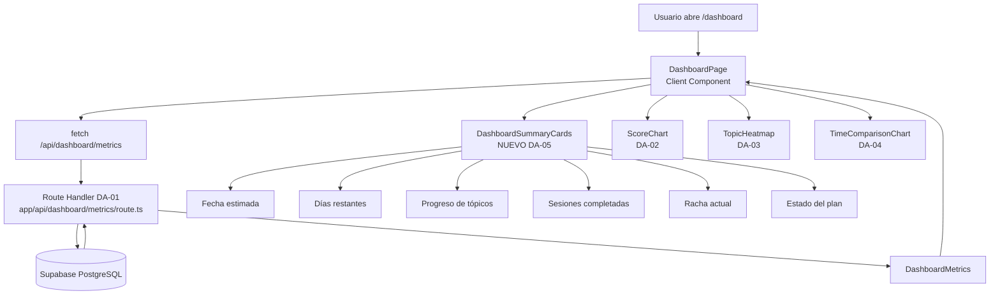
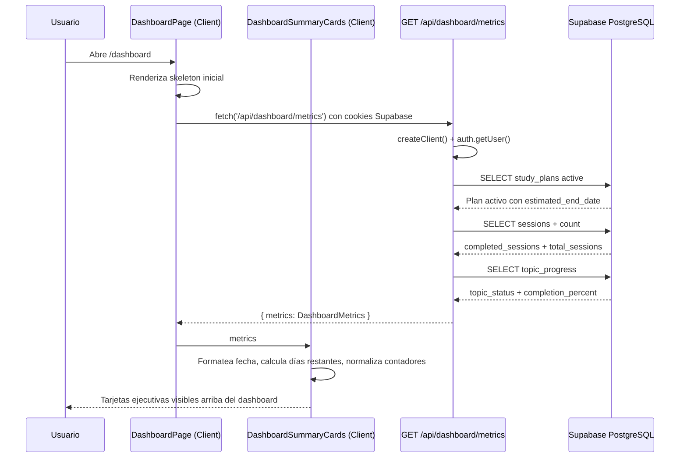

# DA-05 — UI: Fecha Estimada de Examen + Contadores Ejecutivos

> **Bloque:** 📊 BLOQUE F — Dashboard de Progreso  
> **Guía anterior:** [DA-04 — UI: Tiempo Real vs Estimado (`BarChart`)](file:///c:/Users/jsife/OneDrive/Desktop/Repositorios/practica-testing/docs/guides/fe/DA-04.md)  
> **Siguiente guía:** QA-01 — Configurar Cypress + `data-testid` en componentes clave  
> **Next.js instalado:** **16.2.9** según `frontend/package-lock.json` (`package.json` declara `^16.2.7`)  
> **Fecha:** 5 julio 2026

---

## Sección 1: 🎓 Introducción y Fundamentos Conceptuales

### ¿Dónde estamos?

Ya tienes el Bloque F casi completo. En **DA-01** construiste `GET /api/dashboard/metrics`, un Route Handler que autentica al usuario con Supabase, localiza su plan activo y retorna un DTO único llamado `DashboardMetrics`. En **DA-02** convertiste `metrics.scores_by_session` en una línea de progreso académico. En **DA-03** convertiste `metrics.topic_progress` en un heatmap de dominio por tópico. En **DA-04** agregaste `metrics.time_comparison` para comparar tiempo real vs tiempo estimado por sesión.

Ahora **DA-05** cierra el dashboard con una capa ejecutiva: **fecha estimada de examen + contadores de avance**. La idea es que el usuario pueda abrir `/dashboard` y entender en menos de 10 segundos:

- Cuándo terminará su plan.
- Cuántos días faltan para la fecha estimada.
- Qué porcentaje de tópicos domina.
- Cuántas sesiones completó contra el total.
- Si mantiene una racha de estudio.
- Si el plan está activo, completado o abandonado.

El endpoint ya entrega todos los datos necesarios. Por eso esta guía **no modifica** `frontend/app/api/dashboard/metrics/route.ts`, **no agrega queries** y **no toca Supabase**. El trabajo es de UI, composición de componentes, formato seguro de fechas y defensa contra payloads parciales.

### Analogía profesional

Imagina una **torre de control aeroportuaria**. Los operadores no pueden revisar todos los sensores, radares, mapas y reportes técnicos antes de decidir si un vuelo va bien. Necesitan un panel superior con indicadores críticos: hora estimada de llegada, combustible restante, estado del vuelo, retraso acumulado y alertas. Ese panel no reemplaza los detalles; los resume para tomar decisiones rápidas.

El dashboard ISTQB necesita exactamente esa capa superior. Las gráficas de DA-02, DA-03 y DA-04 son como los instrumentos especializados: rendimiento, cobertura temática y gestión de tiempo. DA-05 crea el **panel ejecutivo** que le dice al estudiante si su preparación va encaminada hacia la fecha de examen. La fecha estimada no es solo un dato decorativo; funciona como un compromiso visible que convierte el plan en una meta concreta.

Piensa también en un **director académico** revisando el progreso de varios alumnos antes de un examen oficial. No empieza leyendo todas las respuestas incorrectas de cada quiz. Primero revisa contadores: porcentaje completado, sesiones realizadas, temas dominados y días restantes. Si esos números muestran riesgo, entonces baja a los detalles. DA-05 construye esa primera lectura: clara, visual y accionable.

La clave profesional es separar la señal del ruido. Un dashboard útil no debe obligar al usuario a calcular mentalmente si 14 sesiones completadas de 28 es bueno, o si una fecha ISO como `2026-07-28` está cerca. El componente de DA-05 transforma datos técnicos en lenguaje humano: "50% del plan", "12 días restantes", "racha de 3 días" y "plan activo".

### Conceptos React y Next.js relevantes

#### Container Component vs Presentation Component

`frontend/app/(dashboard)/dashboard/page.tsx` ya funciona como **Container Component**: hace el `fetch('/api/dashboard/metrics')`, maneja `loading`, `error`, `no plan` y conserva el estado principal. DA-05 no debe mover esa responsabilidad a otro archivo.

El nuevo componente será **Presentation Component**:

```text
DashboardPage
  ├─ hace fetch a /api/dashboard/metrics
  ├─ maneja estados loading/error/empty
  └─ pasa metrics a DashboardSummaryCards

DashboardSummaryCards
  ├─ recibe metrics como props
  ├─ formatea fecha estimada
  ├─ calcula días restantes
  ├─ normaliza contadores defensivamente
  └─ renderiza tarjetas ejecutivas
```

Esta separación mejora mantenibilidad. Si mañana quieres cambiar el diseño del resumen superior, modificas `DashboardSummaryCards`. Si mañana quieres cambiar cómo se obtiene el JSON, modificas `DashboardPage` o el Route Handler.

#### Client Components y fechas dinámicas

El cálculo de "días restantes" depende de la fecha actual del navegador. En React/Next.js, cualquier lógica que use `new Date()` para pintar UI puede provocar diferencias entre HTML servidor y cliente si se hace en un Server Component. Aquí el dashboard ya es Client Component por el `fetch` con `useEffect`, y el nuevo resumen también será Client Component con:

```tsx
"use client";
```

Esto evita mezclar lógica temporal dinámica con renderizado estático. Además, usaremos una estrategia segura para fechas `YYYY-MM-DD` de PostgreSQL: parsear como UTC (`T00:00:00Z`) y formatear con `timeZone: "UTC"`. Así evitamos el bug clásico donde una fecha guardada como `2026-07-28` se muestra como `27 jul` en algunas zonas horarias.

#### DTO único: "un fetch, todo el dashboard"

DA-05 consume campos que ya existen en `DashboardMetrics`:

```ts
estimated_end_date: string;
start_date: string;
objective_days: number;
plan_status: StudyPlanStatus;
completion_percent: number;
total_sessions: number;
completed_sessions: number;
current_streak: number;
```

No necesitas crear un endpoint nuevo como `/api/dashboard/summary`. La estrategia correcta sigue siendo la de DA-01: **un fetch, todo el dashboard**. Esto reduce latencia, simplifica estado y evita que distintas tarjetas rendericen datos desincronizados.

#### Límite importante: no proponer joins complejos

`frontend/types/database.ts` define `Relationships: []`, por lo que no conviene sugerir queries con `table!inner(...)` en esta guía. El Route Handler ya obtiene `study_plans`, `sessions` y `topic_progress` con consultas separadas y DTOs explícitos. DA-05 trabaja únicamente sobre el contrato público del frontend.

---

## Sección 2: 📋 Prerequisitos y Verificación del Entorno

Ejecuta todos los comandos desde la raíz del workspace en PowerShell:

```powershell
node --version
```

Salida esperada:

```text
v20.9.0 o superior
```

```powershell
npm --version
```

Salida esperada:

```text
10.x.x o superior
```

```powershell
npm --prefix frontend list next
```

Salida esperada:

```text
frontend@0.1.0 C:\Users\jsife\OneDrive\Desktop\Repositorios\practica-testing\frontend
`-- next@16.2.9
```

```powershell
npm --prefix frontend list react
```

Salida esperada:

```text
frontend@0.1.0 C:\Users\jsife\OneDrive\Desktop\Repositorios\practica-testing\frontend
`-- react@19.2.4
```

```powershell
Test-Path "frontend/types/dashboard.ts"
```

Salida esperada:

```text
True
```

```powershell
Test-Path -LiteralPath "frontend/app/api/dashboard/metrics/route.ts"
```

Salida esperada:

```text
True
```

```powershell
Test-Path -LiteralPath "frontend/app/(dashboard)/dashboard/page.tsx"
```

Salida esperada:

```text
True
```

```powershell
Test-Path "frontend/components/dashboard/score-chart.tsx"
```

Salida esperada:

```text
True
```

```powershell
Test-Path "frontend/components/dashboard/topic-heatmap.tsx"
```

Salida esperada:

```text
True
```

```powershell
Test-Path "frontend/components/dashboard/time-comparison-chart.tsx"
```

Salida esperada:

```text
True
```

### Verificar contrato de DA-05

```powershell
Select-String -Path "frontend/types/dashboard.ts" -Pattern "estimated_end_date: string" -Quiet
```

Salida esperada:

```text
True
```

```powershell
Select-String -Path "frontend/types/dashboard.ts" -Pattern "current_streak: number" -Quiet
```

Salida esperada:

```text
True
```

```powershell
Select-String -LiteralPath "frontend/app/api/dashboard/metrics/route.ts" -Pattern "estimated_end_date: plan.estimated_end_date" -Quiet
```

Salida esperada:

```text
True
```

```powershell
Select-String -LiteralPath "frontend/app/api/dashboard/metrics/route.ts" -Pattern "current_streak: currentStreak" -Quiet
```

Salida esperada:

```text
True
```

### Verificar variables de entorno sin imprimir secretos

No imprimas el contenido completo de `.env.local`. Solo verifica si las claves existen:

```powershell
Select-String -Path "frontend/.env.local" -Pattern "^NEXT_PUBLIC_SUPABASE_URL=" -Quiet
```

Salida esperada:

```text
True
```

```powershell
Select-String -Path "frontend/.env.local" -Pattern "^NEXT_PUBLIC_SUPABASE_ANON_KEY=" -Quiet
```

Salida esperada:

```text
True
```

Estas variables fueron preparadas en **DB-01** y conectadas al frontend en **FE-02**. DA-05 no agrega variables nuevas.

### Dependency Gate de DA-04

Antes de implementar DA-05, confirma que DA-04 está integrado:

```powershell
Select-String -LiteralPath "frontend/app/(dashboard)/dashboard/page.tsx" -Pattern "TimeComparisonChart" -Quiet
```

Salida esperada:

```text
True
```

```powershell
Select-String -Path "frontend/components/dashboard/time-comparison-chart.tsx" -Pattern "ResponsiveContainer" -Quiet
```

Salida esperada:

```text
True
```

```powershell
npx tsc --noEmit --project frontend/tsconfig.json
```

Salida esperada:

```text
# Sin salida: TypeScript compila correctamente.
```

---

## Sección 3: 📂 Estructura de Directorios del Proyecto

Árbol relevante al finalizar DA-05:

```text
practica-testing/
├─ backend/                                      # Existente — FastAPI desplegado en BE-06
├─ docs/
│  ├─ guides/
│  │  ├─ be/                                    # Existente — BE-01..BE-06
│  │  ├─ db/                                    # Existente — DB-01..DB-05
│  │  └─ fe/
│  │     ├─ FE-01.md                            # Existente
│  │     ├─ FE-02.md                            # Existente
│  │     ├─ FE-03.md                            # Existente
│  │     ├─ FE-04.md                            # Existente
│  │     ├─ UP-01.md                            # Existente
│  │     ├─ UP-02.md                            # Existente
│  │     ├─ UP-03.md                            # Existente
│  │     ├─ UP-04.md                            # Existente
│  │     ├─ UP-05.md                            # Existente
│  │     ├─ UP-06.md                            # Existente
│  │     ├─ SE-01.md                            # Existente
│  │     ├─ SE-02.md                            # Existente
│  │     ├─ SE-03.md                            # Existente
│  │     ├─ SE-04.md                            # Existente
│  │     ├─ SE-05.md                            # Existente
│  │     ├─ SE-06.md                            # Existente
│  │     ├─ SE-07.md                            # Existente
│  │     ├─ SE-08.md                            # Existente
│  │     ├─ DA-01.md                            # Existente
│  │     ├─ DA-02.md                            # Existente
│  │     ├─ DA-03.md                            # Existente
│  │     ├─ DA-04.md                            # Existente
│  │     └─ DA-05.md                            # NUEVO — esta guía
│  └─ roadmap/
│     └─ ISTQB_Guias_Implementacion.md          # Existente — roadmap maestro
├─ frontend/
│  ├─ app/
│  │  ├─ (dashboard)/
│  │  │  ├─ dashboard/
│  │  │  │  └─ page.tsx                         # MODIFICADO — usará DashboardSummaryCards
│  │  │  ├─ plan/
│  │  │  │  └─ page.tsx                         # Existente
│  │  │  ├─ session/
│  │  │  │  └─ page.tsx                         # Existente
│  │  │  ├─ setup/
│  │  │  │  └─ page.tsx                         # Existente
│  │  │  └─ layout.tsx                          # Existente — layout protegido
│  │  ├─ api/
│  │  │  ├─ dashboard/
│  │  │  │  └─ metrics/
│  │  │  │     └─ route.ts                      # Existente — DA-01, no se modifica
│  │  │  ├─ extract/
│  │  │  │  └─ route.ts                         # Existente — UP-03
│  │  │  ├─ plan/
│  │  │  │  ├─ generate/route.ts                # Existente — UP-04
│  │  │  │  └─ save/route.ts                    # Existente — UP-05
│  │  │  ├─ sessions/
│  │  │  │  ├─ [id]/
│  │  │  │  │  ├─ adapt/route.ts                # Existente — SE-07
│  │  │  │  │  ├─ evaluate/route.ts             # Existente — SE-06
│  │  │  │  │  ├─ quiz/route.ts                 # Existente — SE-04
│  │  │  │  │  └─ theory/route.ts               # Existente — SE-02
│  │  │  │  └─ next/route.ts                    # Existente — SE-01
│  │  │  └─ upload/route.ts                     # Existente — UP-02
│  │  ├─ auth/
│  │  │  └─ callback/route.ts                   # Existente — FE-03
│  │  ├─ login/page.tsx                         # Existente
│  │  ├─ register/page.tsx                      # Existente
│  │  ├─ layout.tsx                             # Existente
│  │  └─ page.tsx                               # Existente
│  ├─ components/
│  │  ├─ dashboard/
│  │  │  ├─ dashboard-summary-cards.tsx         # NUEVO — componente DA-05
│  │  │  ├─ score-chart.tsx                     # Existente — DA-02
│  │  │  ├─ topic-heatmap.tsx                   # Existente — DA-03
│  │  │  └─ time-comparison-chart.tsx           # Existente — DA-04
│  │  ├─ ui/
│  │  │  ├─ avatar.tsx                          # Existente — shadcn/ui
│  │  │  ├─ badge.tsx                           # Existente — shadcn/ui
│  │  │  ├─ button.tsx                          # Existente — shadcn/ui
│  │  │  ├─ card.tsx                            # Existente — shadcn/ui
│  │  │  ├─ dropdown-menu.tsx                   # Existente — shadcn/ui
│  │  │  ├─ input.tsx                           # Existente — shadcn/ui
│  │  │  ├─ label.tsx                           # Existente — shadcn/ui
│  │  │  ├─ separator.tsx                       # Existente — shadcn/ui
│  │  │  └─ sheet.tsx                           # Existente — shadcn/ui
│  │  └─ ...                                    # Existente — layout, auth, upload, session
│  ├─ lib/
│  │  ├─ supabase/
│  │  │  ├─ client.ts                           # Existente — FE-02
│  │  │  └─ server.ts                           # Existente — FE-02
│  │  └─ utils.ts                               # Existente — helpers Tailwind/shadcn
│  ├─ types/
│  │  ├─ dashboard.ts                           # Existente — contrato DA-01..DA-05
│  │  ├─ database.ts                            # Existente — tipos Supabase
│  │  └─ index.ts                               # Existente — barrel exports
│  ├─ package.json                              # Existente
│  └─ tsconfig.json                             # Existente
└─ supabase/
   └─ migrations/                               # Existente — DB-02..DB-05
```

### Archivos que tocarás en DA-05

```text
frontend/components/dashboard/dashboard-summary-cards.tsx
```

Archivo nuevo. Contendrá la UI ejecutiva: fecha estimada, días restantes, progreso, sesiones, racha y estado del plan.

```text
frontend/app/(dashboard)/dashboard/page.tsx
```

Archivo existente. Se modificará para importar `DashboardSummaryCards` y reemplazar las tarjetas inline actuales. El `fetch`, los estados y los charts existentes se mantienen.

### Archivos que NO tocarás en DA-05

```text
frontend/app/api/dashboard/metrics/route.ts
frontend/types/dashboard.ts
frontend/types/database.ts
```

Estos archivos ya contienen el contrato necesario. Si los modificas en DA-05, probablemente estás mezclando responsabilidades que pertenecen a DA-01 o a futuras mejoras.

---

## Sección 4: 🎨 Diagrama de Arquitectura de Componentes



### Flujo Completo



### Responsabilidades por capa

| Capa | Archivo | Responsabilidad |
|---|---|---|
| API Route | `frontend/app/api/dashboard/metrics/route.ts` | Autenticar usuario, consultar Supabase y construir `DashboardMetrics`. |
| Container | `frontend/app/(dashboard)/dashboard/page.tsx` | Obtener datos, manejar `loading/error/no plan`, componer componentes. |
| Presentación DA-05 | `frontend/components/dashboard/dashboard-summary-cards.tsx` | Pintar fecha estimada y contadores con formato defensivo. |
| Presentación DA-02 | `frontend/components/dashboard/score-chart.tsx` | Pintar evolución de scores. |
| Presentación DA-03 | `frontend/components/dashboard/topic-heatmap.tsx` | Pintar estado por tópico. |
| Presentación DA-04 | `frontend/components/dashboard/time-comparison-chart.tsx` | Pintar tiempo real vs estimado. |

---

## Sección 5: 🛠️ Implementación Paso a Paso

### Paso A — Crear el componente `DashboardSummaryCards`

Archivo exacto:

```text
frontend/components/dashboard/dashboard-summary-cards.tsx
```

Este componente recibirá `metrics: DashboardMetrics` y renderizará el resumen ejecutivo del plan. Será un Client Component porque calcula días restantes con la fecha actual.

Código completo:

```tsx
"use client";

// ============================================================
// components/dashboard/dashboard-summary-cards.tsx
// ============================================================
// TIPO: Client Component ('use client')
//
// RESPONSABILIDADES:
//   1. Recibir DashboardMetrics desde DashboardPage.
//   2. Formatear la fecha estimada del examen sin desfase horario.
//   3. Calcular días restantes desde la fecha actual del navegador.
//   4. Mostrar contadores ejecutivos: progreso, sesiones, racha y estado.
//   5. Normalizar valores parciales para que la UI no reviente.
//
// NO HACE:
//   - Fetch de datos.
//   - Queries a Supabase.
//   - Mutaciones del plan.
// ============================================================

import type { DashboardMetrics } from "@/types/dashboard";

interface DashboardSummaryCardsProps {
  metrics: DashboardMetrics;
}

type Tone = "emerald" | "sky" | "amber" | "rose" | "violet" | "slate";

interface StatCardProps {
  label: string;
  value: string;
  helper: string;
  tone: Tone;
}

const TONE_CLASSES: Record<Tone, string> = {
  emerald: "border-emerald-500/20 bg-emerald-500/10 text-emerald-300",
  sky: "border-sky-500/20 bg-sky-500/10 text-sky-300",
  amber: "border-amber-500/20 bg-amber-500/10 text-amber-300",
  rose: "border-rose-500/20 bg-rose-500/10 text-rose-300",
  violet: "border-violet-500/20 bg-violet-500/10 text-violet-300",
  slate: "border-slate-700 bg-slate-800/40 text-slate-300",
};

const TONE_TEXT_CLASSES: Record<Tone, string> = {
  emerald: "text-emerald-300",
  sky: "text-sky-300",
  amber: "text-amber-300",
  rose: "text-rose-300",
  violet: "text-violet-300",
  slate: "text-slate-300",
};

const PLAN_STATUS_LABELS: Record<DashboardMetrics["plan_status"], string> = {
  active: "Activo",
  completed: "Completado",
  abandoned: "Abandonado",
};

function safeNumber(value: number | null | undefined, fallback = 0): number {
  if (typeof value !== "number" || Number.isNaN(value)) {
    return fallback;
  }

  return value;
}

function clampPercent(value: number): number {
  return Math.min(100, Math.max(0, value));
}

function formatDateEsMx(isoDate: string | null | undefined): string {
  if (!isoDate) {
    return "Sin fecha";
  }

  try {
    return new Intl.DateTimeFormat("es-MX", {
      day: "numeric",
      month: "short",
      year: "numeric",
      timeZone: "UTC",
    }).format(new Date(`${isoDate}T00:00:00Z`));
  } catch {
    return isoDate;
  }
}

function daysUntilIsoDate(isoDate: string | null | undefined): number | null {
  if (!isoDate) {
    return null;
  }

  const targetMs = Date.parse(`${isoDate}T00:00:00Z`);

  if (Number.isNaN(targetMs)) {
    return null;
  }

  const now = new Date();
  const todayUtcMs = Date.UTC(
    now.getUTCFullYear(),
    now.getUTCMonth(),
    now.getUTCDate(),
  );

  return Math.ceil((targetMs - todayUtcMs) / (1000 * 60 * 60 * 24));
}

function getCountdownCopy(daysRemaining: number | null): string {
  if (daysRemaining === null) {
    return "Fecha estimada de examen";
  }

  if (daysRemaining > 1) {
    return `${daysRemaining} días restantes`;
  }

  if (daysRemaining === 1) {
    return "1 día restante";
  }

  if (daysRemaining === 0) {
    return "El examen estimado es hoy";
  }

  return "La fecha estimada ya pasó";
}

function getCountdownTone(daysRemaining: number | null): Tone {
  if (daysRemaining === null) {
    return "slate";
  }

  if (daysRemaining < 0) {
    return "rose";
  }

  if (daysRemaining <= 3) {
    return "amber";
  }

  return "violet";
}

function getProgressTone(percent: number): Tone {
  if (percent >= 70) {
    return "emerald";
  }

  if (percent >= 40) {
    return "sky";
  }

  return "amber";
}

function StatCard({ label, value, helper, tone }: StatCardProps) {
  return (
    <div className="rounded-xl border border-slate-800 bg-slate-900/50 p-5 shadow-xl shadow-black/10">
      <p className="text-sm font-medium text-slate-400">{label}</p>
      <p className={`mt-2 text-3xl font-bold ${TONE_TEXT_CLASSES[tone]}`}>
        {value}
      </p>
      <p className="mt-2 text-xs leading-relaxed text-slate-500">{helper}</p>
    </div>
  );
}

export function DashboardSummaryCards({ metrics }: DashboardSummaryCardsProps) {
  const completionPercent = clampPercent(
    safeNumber(metrics.completion_percent),
  );
  const totalTopics = Math.max(0, safeNumber(metrics.topic_status?.total));
  const masteredTopics = Math.min(
    Math.max(0, safeNumber(metrics.topic_status?.mastered)),
    totalTopics,
  );
  const totalSessions = Math.max(0, safeNumber(metrics.total_sessions));
  const completedSessions = Math.min(
    Math.max(0, safeNumber(metrics.completed_sessions)),
    totalSessions === 0 ? safeNumber(metrics.completed_sessions) : totalSessions,
  );
  const sessionPercent =
    totalSessions === 0
      ? 0
      : Math.round((completedSessions / totalSessions) * 100);
  const currentStreak = Math.max(0, safeNumber(metrics.current_streak));
  const daysRemaining = daysUntilIsoDate(metrics.estimated_end_date);
  const countdownTone = getCountdownTone(daysRemaining);
  const progressTone = getProgressTone(completionPercent);
  const planStatusLabel = PLAN_STATUS_LABELS[metrics.plan_status] ?? "Desconocido";

  return (
    <section className="rounded-2xl border border-slate-800 bg-slate-950/40 p-5 shadow-2xl shadow-black/20">
      <div className="grid gap-5 lg:grid-cols-[1.2fr_2fr]">
        <div className={`rounded-2xl border p-6 ${TONE_CLASSES[countdownTone]}`}>
          <p className="text-sm font-semibold uppercase tracking-[0.2em] opacity-80">
            Fecha estimada de examen
          </p>

          <p className="mt-4 text-4xl font-black tracking-tight text-white">
            {formatDateEsMx(metrics.estimated_end_date)}
          </p>

          <p className="mt-3 text-sm font-semibold">
            {getCountdownCopy(daysRemaining)}
          </p>

          <div className="mt-6 rounded-xl border border-white/10 bg-black/20 p-4">
            <div className="flex items-center justify-between gap-4 text-sm">
              <span className="text-slate-300">Inicio del plan</span>
              <span className="font-semibold text-white">
                {formatDateEsMx(metrics.start_date)}
              </span>
            </div>
            <div className="mt-3 flex items-center justify-between gap-4 text-sm">
              <span className="text-slate-300">Duración objetivo</span>
              <span className="font-semibold text-white">
                {safeNumber(metrics.objective_days)} días
              </span>
            </div>
            <div className="mt-3 flex items-center justify-between gap-4 text-sm">
              <span className="text-slate-300">Estado</span>
              <span className="rounded-full border border-white/10 bg-white/10 px-3 py-1 text-xs font-bold text-white">
                {planStatusLabel}
              </span>
            </div>
          </div>
        </div>

        <div className="grid gap-4 sm:grid-cols-2">
          <StatCard
            label="Progreso de tópicos"
            value={`${completionPercent.toFixed(1)}%`}
            helper={`${masteredTopics} de ${totalTopics} tópicos dominados`}
            tone={progressTone}
          />

          <StatCard
            label="Sesiones completadas"
            value={`${completedSessions}/${totalSessions}`}
            helper={`${sessionPercent}% del calendario ejecutado`}
            tone="sky"
          />

          <StatCard
            label="Racha actual"
            value={`${currentStreak} ${currentStreak === 1 ? "día" : "días"}`}
            helper={
              currentStreak > 0
                ? "Hay consistencia reciente en el estudio."
                : "Completa una sesión hoy para activar la racha."
            }
            tone={currentStreak > 0 ? "amber" : "slate"}
          />

          <StatCard
            label="Plan"
            value={planStatusLabel}
            helper="Estado calculado desde study_plans.status"
            tone={metrics.plan_status === "active" ? "emerald" : "slate"}
          />
        </div>
      </div>

      <div className="mt-5 h-2 overflow-hidden rounded-full bg-slate-800">
        <div
          className="h-full rounded-full bg-gradient-to-r from-emerald-400 via-sky-400 to-violet-400 transition-[width] duration-700"
          style={{ width: `${completionPercent}%` }}
          aria-label={`Progreso general ${completionPercent.toFixed(1)} por ciento`}
        />
      </div>
    </section>
  );
}
```

#### Estrategia de estilos

La guía mantiene el lenguaje visual del dashboard existente:

- Fondo oscuro con `bg-slate-950`, `bg-slate-900/50` y bordes `border-slate-800`.
- Colores semánticos: `emerald` para avance saludable, `sky` para métricas informativas, `amber` para atención y `rose` para riesgo.
- Layout responsive con `grid`, `sm:grid-cols-2` y `lg:grid-cols-[1.2fr_2fr]`.
- Barra de progreso horizontal para dar una lectura inmediata del avance general.
- Tokens separados para contenedor (`TONE_CLASSES`) y texto (`TONE_TEXT_CLASSES`), lo que evita manipular strings de clases en runtime.

**Entregable del Paso A:**

```text
frontend/components/dashboard/dashboard-summary-cards.tsx
```

---

### Paso B — Integrar el resumen en `DashboardPage`

Archivo exacto:

```text
frontend/app/(dashboard)/dashboard/page.tsx
```

Agrega el import junto a los demás componentes del dashboard:

```tsx
import { DashboardSummaryCards } from "@/components/dashboard/dashboard-summary-cards";
```

El bloque de imports debería quedar conceptualmente así:

```tsx
import { useState, useEffect, useCallback } from "react";
import Link from "next/link";
import type { DashboardMetrics } from "@/types/dashboard";
import { DashboardSummaryCards } from "@/components/dashboard/dashboard-summary-cards";
import { ScoreChart } from "@/components/dashboard/score-chart";
import { TimeComparisonChart } from "@/components/dashboard/time-comparison-chart";
import { TopicHeatmap } from "@/components/dashboard/topic-heatmap";
```

Después, en el render con datos, reemplaza el bloque inline de tarjetas rápidas por el nuevo componente.

Busca este comentario existente:

```tsx
{/* ─── Tarjetas de métricas rápidas ─── */}
```

Reemplaza todo ese grid por:

```tsx
{/* ─── Resumen ejecutivo DA-05 ─── */}
<DashboardSummaryCards metrics={metrics} />
```

El render final de la parte con datos debería quedar con esta estructura:

```tsx
const { metrics } = state;

return (
  <div className="flex flex-col gap-6">
    {/* ─── Encabezado ─── */}
    <div className="flex flex-col gap-2">
      <h1 className="text-3xl font-bold tracking-tight text-white">
        Tu Dashboard
      </h1>
      <p className="text-slate-400">
        Resumen de tu progreso en el plan de estudio ISTQB.
      </p>
    </div>

    {/* ─── Resumen ejecutivo DA-05 ─── */}
    <DashboardSummaryCards metrics={metrics} />

    {/* ─── Gráfica de scores (DA-02) ─── */}
    <ScoreChart data={metrics.scores_by_session} />

    <div className="grid gap-4 md:grid-cols-2 min-w-0">
      {/* DA-03: Heatmap de tópicos por estado */}
      <div className="md:col-span-2">
        <TopicHeatmap topicProgress={metrics.topic_progress} />
      </div>

      {/* DA-04: Tiempo real vs estimado */}
      <div className="md:col-span-2">
        <TimeComparisonChart data={metrics.time_comparison} />
      </div>
    </div>
  </div>
);
```

Como el cálculo de fechas ahora vive en `DashboardSummaryCards`, elimina de `page.tsx` estos helpers si ya no se usan:

```tsx
function formatDateEsMx(isoDate: string): string {
  // ...
}

function daysUntilIsoDate(isoDate: string): number | null {
  // ...
}
```

Esto evita duplicar lógica entre el container y el componente de presentación.

**Entregable del Paso B:**

```text
frontend/app/(dashboard)/dashboard/page.tsx
```

---

### Paso C — Verificar que no cambiaste el contrato del API

DA-05 debe consumir el DTO existente, no ampliarlo. Confirma que estos archivos quedaron sin cambios manuales:

```text
frontend/app/api/dashboard/metrics/route.ts
frontend/types/dashboard.ts
frontend/types/database.ts
```

Si tu editor los muestra como modificados, revisa el diff. Para DA-05 no deberías necesitar cambios ahí.

Comando útil:

```powershell
git diff -- frontend/app/api/dashboard/metrics/route.ts frontend/types/dashboard.ts frontend/types/database.ts
```

Salida esperada:

```text
# Sin salida: no hay cambios en el contrato ni en la capa de datos.
```

**Entregable del Paso C:**

```text
Sin archivos nuevos. Solo confirmación de que el contrato existente sigue intacto.
```

---

### Paso D — Revisión de estados visuales

Antes de dar por terminada la guía, prueba mentalmente estos escenarios:

| Escenario | Resultado esperado |
|---|---|
| `estimated_end_date` válida y futura | Se muestra fecha formateada y "N días restantes". |
| `estimated_end_date` es hoy | Se muestra "El examen estimado es hoy". |
| `estimated_end_date` pasada | La tarjeta usa tono de riesgo y muestra "La fecha estimada ya pasó". |
| `completion_percent` mayor a 100 por dato corrupto | Se limita visualmente a 100. |
| `completion_percent` negativo por dato corrupto | Se limita visualmente a 0. |
| `total_sessions` es 0 | No divide entre cero; muestra 0% del calendario ejecutado. |
| `current_streak` es 0 | Sugiere completar una sesión hoy. |
| `plan_status` es `active` | Muestra estado `Activo` con tono saludable. |

**Entregable del Paso D:**

```text
Validación visual y defensiva del nuevo componente.
```

---

## Sección 6: ✅ Checkpoints de Verificación

### Checkpoint 1 — Archivos creados e integrados

```powershell
Test-Path "frontend/components/dashboard/dashboard-summary-cards.tsx"
```

Salida esperada:

```text
True
```

```powershell
Select-String -LiteralPath "frontend/app/(dashboard)/dashboard/page.tsx" -Pattern "DashboardSummaryCards" -Quiet
```

Salida esperada:

```text
True
```

```powershell
Select-String -LiteralPath "frontend/app/(dashboard)/dashboard/page.tsx" -Pattern "formatDateEsMx" -Quiet
```

Salida esperada si eliminaste el helper duplicado:

```text
False
```

### Checkpoint 2 — TypeScript limpio

```powershell
npx tsc --noEmit --project frontend/tsconfig.json
```

Salida esperada:

```text
# Sin salida: TypeScript compila correctamente.
```

### Checkpoint 3 — Build de producción

```powershell
npm --prefix frontend run build
```

Salida esperada resumida:

```text
> frontend@0.1.0 build
> next build

▲ Next.js 16.2.9 (Turbopack)
⚠ The "middleware" file convention is deprecated. Please use "proxy" instead.

✓ Compiled successfully
  Running TypeScript ...
  Collecting page data ...
✓ Generating static pages
```

El warning de `middleware` es conocido en Next.js 16 y no bloquea DA-05. Se puede resolver en una guía futura de producción o mantenimiento.

### Checkpoint 4 — Ejecutar en local

```powershell
npm --prefix frontend run dev
```

Salida esperada:

```text
> frontend@0.1.0 dev
> next dev

▲ Next.js 16.2.9
- Local:        http://localhost:3000
```

Abre:

```text
http://localhost:3000/dashboard
```

### Verificación visual exacta

Con un usuario autenticado y un plan activo, deberías ver arriba del dashboard:

- Un encabezado `Tu Dashboard` con el texto `Resumen de tu progreso en el plan de estudio ISTQB.`
- Una tarjeta grande de **Fecha estimada de examen** con una fecha legible como `28 jul 2026`.
- Un texto de cuenta regresiva como `23 días restantes`, `1 día restante`, `El examen estimado es hoy` o `La fecha estimada ya pasó`.
- Tres datos dentro de la tarjeta grande: inicio del plan, duración objetivo y estado.
- Cuatro tarjetas compactas: `Progreso de tópicos`, `Sesiones completadas`, `Racha actual` y `Plan`.
- Una barra horizontal degradada que representa `completion_percent`.
- Debajo deben seguir apareciendo `ScoreChart`, `TopicHeatmap` y `TimeComparisonChart`.

### Verificación responsive

En móvil (`360px` a `430px`):

- La tarjeta de fecha aparece primero y ocupa todo el ancho.
- Los contadores se apilan sin overflow horizontal.
- La fecha no se corta ni empuja el layout fuera de pantalla.

En tablet (`768px`):

- Los contadores se organizan en dos columnas.
- La sección mantiene separación visual clara entre fecha y KPIs.

En desktop (`1024px+`):

- La fecha estimada aparece a la izquierda.
- Los cuatro contadores aparecen a la derecha en una grilla 2x2.
- Las gráficas inferiores conservan su ancho completo.

### Verificación de estados

Si el usuario no tiene plan activo:

- No debe renderizar `DashboardSummaryCards`.
- Debe mantenerse el estado vacío existente con CTA a `/setup`.

Si el fetch falla:

- No debe renderizar `DashboardSummaryCards`.
- Debe mantenerse el bloque rojo de error con botón `Reintentar`.

Si el usuario está cargando:

- No debe renderizar `DashboardSummaryCards`.
- Deben mostrarse skeletons.

### Checklist de entregables

- `frontend/components/dashboard/dashboard-summary-cards.tsx` creado.
- `frontend/app/(dashboard)/dashboard/page.tsx` importa `DashboardSummaryCards`.
- Las tarjetas inline antiguas fueron reemplazadas por `<DashboardSummaryCards metrics={metrics} />`.
- Los helpers de fecha duplicados fueron eliminados de `page.tsx` si ya no se usan.
- `frontend/app/api/dashboard/metrics/route.ts` no fue modificado.
- `frontend/types/dashboard.ts` no fue modificado.
- `npx tsc --noEmit --project frontend/tsconfig.json` pasa limpio.
- `npm --prefix frontend run build` pasa, ignorando solo el warning conocido de `middleware`.
- `/dashboard` se ve correcto en móvil, tablet y desktop.

---

## Sección 7: 🚨 Troubleshooting — Problemas Comunes

| Problema | Causa Probable | Solución |
|---|---|---|
| `Error: Hydration failed` | Se calculó una fecha dinámica en un Server Component o se renderizó una fecha distinta entre servidor y cliente. | Mantén `DashboardSummaryCards` con `"use client"` y calcula `daysUntilIsoDate()` dentro del Client Component. |
| La fecha aparece un día antes | JavaScript interpretó `YYYY-MM-DD` como UTC y tu zona horaria lo movió al día anterior. | Usa `new Date(`${isoDate}T00:00:00Z`)` y `timeZone: "UTC"` al formatear. |
| `Cannot read properties of undefined (reading 'total')` | El payload llegó parcial o `topic_status` no existe durante una prueba manual. | Usa normalización defensiva: `metrics.topic_status?.total` y `safeNumber()`. |
| `Module not found: Can't resolve '@/components/dashboard/dashboard-summary-cards'` | El archivo no existe, el nombre tiene mayúsculas distintas o el import apunta a otra ruta. | Verifica `Test-Path "frontend/components/dashboard/dashboard-summary-cards.tsx"` y que el import use exactamente `@/components/dashboard/dashboard-summary-cards`. |
| `toFixed is not a function` | `completion_percent` llegó como string o `null` por un mock incorrecto. | Convierte con `safeNumber(metrics.completion_percent)` antes de llamar `toFixed()`. |
| La barra de progreso se sale del contenedor | `completion_percent` llegó mayor a 100 o menor a 0. | Usa `clampPercent()` para limitar el ancho entre 0 y 100. |
| `Select-String` no encuentra `page.tsx` | PowerShell interpreta paréntesis de `(dashboard)` como caracteres especiales en rutas. | Usa `-LiteralPath "frontend/app/(dashboard)/dashboard/page.tsx"`. |
| El build muestra warning de `middleware` | Next.js 16 depreca la convención `middleware` en favor de `proxy`. | No bloquea DA-05. Regístralo para una guía futura de mantenimiento o producción. |
| Los contadores se ven muy pegados en móvil | El grid no tiene breakpoints adecuados o falta `gap`. | Usa `grid gap-4 sm:grid-cols-2` para los contadores y deja la tarjeta de fecha en una columna completa. |

---

## Sección 8: 📝 Resumen y Próximo Paso

1. Confirmaste que DA-04 está completo y que `TimeComparisonChart` ya está integrado.
2. Verificaste que `DashboardMetrics` ya expone `estimated_end_date`, `start_date`, `objective_days`, `plan_status`, `completion_percent`, `total_sessions`, `completed_sessions` y `current_streak`.
3. Creaste `frontend/components/dashboard/dashboard-summary-cards.tsx` como componente de presentación para la capa ejecutiva del dashboard.
4. Moviste el formato de fecha y el cálculo de días restantes fuera de `DashboardPage`.
5. Reemplazaste las tarjetas inline por `<DashboardSummaryCards metrics={metrics} />`.
6. Mantuviste intactos el Route Handler, los tipos del dashboard y los tipos generados de Supabase.
7. Validaste TypeScript, build de producción y comportamiento visual responsive.

Cuando termines la implementación, valida tu progreso con el validador de pasos:

```text
/validate DA-05 section 6
```

El siguiente bloque del roadmap es **QA-01 — Configurar Cypress + `data-testid` en componentes clave**. Ahí empezarás a convertir el flujo construido en pruebas E2E: autenticación, navegación protegida, upload, generación de plan, sesiones y dashboard.
