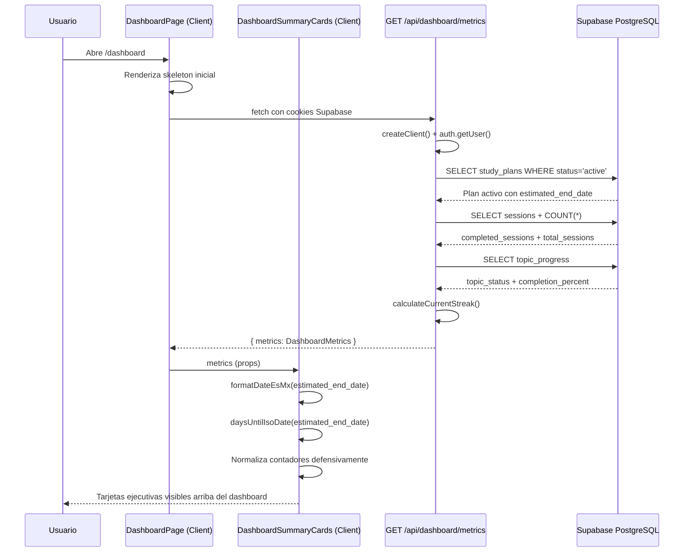

# DA-05 — UI: Fecha Estimada de Examen + Contadores Ejecutivos

> **Bloque:** 📊 BLOQUE F — Dashboard de Progreso  
> **Guía anterior:** [DA-04 — UI: Tiempo Real vs Estimado (`BarChart`)](file:///c:/Users/jsife/OneDrive/Desktop/Repositorios/practica-testing/docs/guides/fe/DA-04.md)  
> **Siguiente guía:** QA-01 — Configurar Cypress + `data-testid` en componentes clave  
> **Next.js instalado:** **16.2.9** según `frontend/package-lock.json` (`package.json` declara `^16.2.7`)  
> **Fecha:** 5 julio 2026

---

## Sección 1: 🎓 Introducción y Fundamentos Conceptuales

### ¿Dónde estamos?

Ya tienes el Bloque F casi completo. En **DA-01** construiste `GET /api/dashboard/metrics`, un Route Handler que autentica al usuario con Supabase, localiza su plan activo y retorna un DTO único llamado `DashboardMetrics`. En **DA-02** convertiste `metrics.scores_by_session` en una línea de progreso académico con Recharts. En **DA-03** convertiste `metrics.topic_progress` en un heatmap de dominio por tópico que muestra los 63 tópicos del ISTQB agrupados por sección FL-x.x. En **DA-04** agregaste `metrics.time_comparison` para comparar tiempo real vs tiempo estimado por sesión con un `BarChart` agrupado.

Ahora **DA-05** cierra el dashboard con una capa ejecutiva: **fecha estimada de examen + contadores de avance**. La idea es que el usuario pueda abrir `/dashboard` y entender en menos de 10 segundos:

- Cuándo terminará su plan.
- Cuántos días faltan para la fecha estimada.
- Qué porcentaje de tópicos domina.
- Cuántas sesiones completó contra el total.
- Si mantiene una racha de estudio.
- Si el plan está activo, completado o abandonado.

El endpoint de DA-01 ya entrega **todos** los datos necesarios. Los campos que consumiremos son:

```ts
estimated_end_date: string;     // Fecha ISO del plan
start_date: string;             // Fecha ISO de inicio
objective_days: number;         // Días objetivo (1-30)
plan_status: StudyPlanStatus;   // "active" | "completed" | "abandoned"
completion_percent: number;     // % de tópicos mastered (0-100)
total_sessions: number;         // Total de sesiones en el plan
completed_sessions: number;     // Sesiones con status = 'completed'
current_streak: number;         // Racha de días consecutivos estudiando
topic_status: TopicStatusCount; // Conteo: pending, in_progress, mastered, failed, total
```

Por eso esta guía **no modifica** `frontend/app/api/dashboard/metrics/route.ts`, **no agrega queries** y **no toca Supabase**. El trabajo es exclusivamente de **UI, composición de componentes, formato seguro de fechas y defensa contra payloads parciales**.

### Analogía profesional

Imagina una **torre de control aeroportuaria**. Los operadores no pueden revisar todos los sensores, radares, mapas y reportes técnicos antes de decidir si un vuelo va bien. Necesitan un panel superior con indicadores críticos: hora estimada de llegada, combustible restante, estado del vuelo, retraso acumulado y alertas activas. Ese panel no reemplaza los instrumentos detallados; los resume para tomar decisiones rápidas.

El dashboard ISTQB necesita exactamente esa capa superior. Las gráficas de DA-02, DA-03 y DA-04 son como los instrumentos especializados: rendimiento académico (`ScoreChart`), cobertura temática (`TopicHeatmap`) y gestión de tiempo (`TimeComparisonChart`). DA-05 crea el **panel ejecutivo** que le dice al estudiante si su preparación va encaminada hacia la fecha de examen. La fecha estimada no es solo un dato decorativo; funciona como un **compromiso visible** que convierte el plan en una meta concreta con un horizonte temporal definido.

Piensa también en un **director académico** que revisa el progreso de varios alumnos antes de un examen oficial. No empieza leyendo todas las respuestas incorrectas de cada quiz. Primero revisa contadores: porcentaje completado, sesiones realizadas, temas dominados y días restantes. Si esos números muestran riesgo, entonces baja a los detalles. DA-05 construye esa primera lectura: clara, visual y accionable. El estudiante que abre `/dashboard` no debería necesitar hacer scroll ni cálculos mentales para saber si va bien.

La clave profesional es separar la **señal del ruido**. Un dashboard útil no debe obligar al usuario a calcular mentalmente si 14 sesiones completadas de 28 es bueno, o si una fecha ISO como `2026-07-28` está cerca. El componente de DA-05 transforma datos técnicos en **lenguaje humano**: "50% del plan", "12 días restantes", "racha de 3 días" y "plan activo". Cada tarjeta del resumen tiene un significado inmediato que no requiere interpretación adicional.

### Conceptos React y Next.js relevantes

#### Container Component vs Presentation Component

`frontend/app/(dashboard)/dashboard/page.tsx` ya funciona como **Container Component**: hace el `fetch('/api/dashboard/metrics')`, maneja `loading`, `error`, `no plan` y conserva el estado principal. DA-05 no debe mover esa responsabilidad a otro archivo.

El nuevo componente será **Presentation Component**:

```text
DashboardPage (Container)
  ├─ hace fetch a /api/dashboard/metrics
  ├─ maneja estados loading / error / empty
  └─ pasa metrics a componentes de presentación:
     ├─ DashboardSummaryCards  ← NUEVO (DA-05)
     ├─ ScoreChart             ← DA-02
     ├─ TopicHeatmap           ← DA-03
     └─ TimeComparisonChart    ← DA-04
```

Esta separación mejora la mantenibilidad. Si mañana quieres cambiar el diseño del resumen superior, modificas `DashboardSummaryCards`. Si mañana quieres cambiar cómo se obtienen los datos, modificas `DashboardPage` o el Route Handler. Los componentes de presentación solo saben dibujar lo que reciben como props.

#### Client Components y fechas dinámicas

El cálculo de "días restantes" depende de la fecha actual del navegador. En React/Next.js, cualquier lógica que use `new Date()` para pintar UI puede provocar diferencias entre HTML servidor y cliente si se hace en un Server Component. Aquí el dashboard ya es Client Component por el `fetch` con `useEffect`, y el nuevo resumen también será Client Component:

```tsx
"use client";
```

Esto evita mezclar lógica temporal dinámica con renderizado estático del servidor. Además, usaremos una estrategia segura para fechas `YYYY-MM-DD` de PostgreSQL: parsear como UTC (`T00:00:00Z`) y formatear con `timeZone: "UTC"`. Así evitamos el bug clásico donde una fecha guardada como `2026-07-28` se muestra como `27 jul` en zonas horarias con offset negativo (como México CST).

#### DTO único: "un fetch, todo el dashboard"

DA-05 consume campos que **ya existen** en `DashboardMetrics` (definidos en `frontend/types/dashboard.ts`). No necesitas crear un endpoint nuevo como `/api/dashboard/summary`. La estrategia correcta sigue siendo la de DA-01: **un fetch, todo el dashboard**. Esto reduce latencia, simplifica estado y evita que distintas tarjetas rendericen datos desincronizados.

#### Límite importante: no proponer joins complejos

`frontend/types/database.ts` define `Relationships: []` para todas las tablas, por lo que no conviene sugerir queries con `table!inner(...)` en esta guía. El Route Handler ya obtiene `study_plans`, `sessions` y `topic_progress` con consultas separadas y DTOs explícitos. DA-05 trabaja únicamente sobre el contrato público del frontend.

---

## Sección 2: 📋 Prerequisitos y Verificación del Entorno

Ejecuta todos los comandos desde la raíz del workspace en PowerShell:

```powershell
node --version
```

Salida esperada:

```text
v20.9.0 o superior
```

```powershell
npm --version
```

Salida esperada:

```text
10.x.x o superior
```

```powershell
npm --prefix frontend list next
```

Salida esperada:

```text
frontend@0.1.0 C:\Users\jsife\OneDrive\Desktop\Repositorios\practica-testing\frontend
`-- next@16.2.9
```

```powershell
npm --prefix frontend list react
```

Salida esperada:

```text
frontend@0.1.0 C:\Users\jsife\OneDrive\Desktop\Repositorios\practica-testing\frontend
`-- react@19.2.4
```

### Verificar archivos previos de DA-01 a DA-04

```powershell
Test-Path "frontend/types/dashboard.ts"
```

Salida esperada:

```text
True
```

```powershell
Test-Path -LiteralPath "frontend/app/api/dashboard/metrics/route.ts"
```

Salida esperada:

```text
True
```

```powershell
Test-Path -LiteralPath "frontend/app/(dashboard)/dashboard/page.tsx"
```

Salida esperada:

```text
True
```

```powershell
Test-Path "frontend/components/dashboard/score-chart.tsx"
```

Salida esperada:

```text
True
```

```powershell
Test-Path "frontend/components/dashboard/topic-heatmap.tsx"
```

Salida esperada:

```text
True
```

```powershell
Test-Path "frontend/components/dashboard/time-comparison-chart.tsx"
```

Salida esperada:

```text
True
```

### Verificar contrato de datos para DA-05

Los campos que DA-05 consumirá deben existir en el tipo `DashboardMetrics`:

```powershell
Select-String -Path "frontend/types/dashboard.ts" -Pattern "estimated_end_date: string" -Quiet
```

Salida esperada:

```text
True
```

```powershell
Select-String -Path "frontend/types/dashboard.ts" -Pattern "current_streak: number" -Quiet
```

Salida esperada:

```text
True
```

```powershell
Select-String -Path "frontend/types/dashboard.ts" -Pattern "completion_percent: number" -Quiet
```

Salida esperada:

```text
True
```

Los campos deben estar mapeados en el Route Handler:

```powershell
Select-String -LiteralPath "frontend/app/api/dashboard/metrics/route.ts" -Pattern "estimated_end_date: plan.estimated_end_date" -Quiet
```

Salida esperada:

```text
True
```

```powershell
Select-String -LiteralPath "frontend/app/api/dashboard/metrics/route.ts" -Pattern "current_streak: currentStreak" -Quiet
```

Salida esperada:

```text
True
```

### Verificar variables de entorno sin imprimir secretos

**NUNCA imprimas el contenido completo de `.env.local`.** Solo verifica si las claves existen:

```powershell
Select-String -Path "frontend/.env.local" -Pattern "^NEXT_PUBLIC_SUPABASE_URL=" -Quiet
```

Salida esperada:

```text
True
```

```powershell
Select-String -Path "frontend/.env.local" -Pattern "^NEXT_PUBLIC_SUPABASE_ANON_KEY=" -Quiet
```

Salida esperada:

```text
True
```

Estas variables fueron preparadas en **DB-01** y conectadas al frontend en **FE-02**. DA-05 no agrega variables nuevas.

### Dependency Gate de DA-04

Antes de implementar DA-05, confirma que DA-04 está integrado:

```powershell
Select-String -LiteralPath "frontend/app/(dashboard)/dashboard/page.tsx" -Pattern "TimeComparisonChart" -Quiet
```

Salida esperada:

```text
True
```

```powershell
Select-String -Path "frontend/components/dashboard/time-comparison-chart.tsx" -Pattern "ResponsiveContainer" -Quiet
```

Salida esperada:

```text
True
```

```powershell
npx tsc --noEmit --project frontend/tsconfig.json
```

Salida esperada:

```text
# Sin salida: TypeScript compila correctamente.
```

---

## Sección 3: 📂 Estructura de Directorios del Proyecto

Árbol completo relevante al finalizar DA-05. Los archivos marcados como **NUEVO** o **MODIFICADO** son los que tocarás en esta guía:

```text
practica-testing/
├─ backend/                                      # Existente — FastAPI desplegado en BE-06
├─ docs/
│  ├─ guides/
│  │  ├─ be/                                    # Existente — BE-01..BE-06
│  │  ├─ db/                                    # Existente — DB-01..DB-05
│  │  └─ fe/
│  │     ├─ FE-01.md                            # Existente
│  │     ├─ FE-02.md                            # Existente
│  │     ├─ FE-03.md                            # Existente
│  │     ├─ FE-04.md                            # Existente
│  │     ├─ UP-01.md                            # Existente
│  │     ├─ UP-02.md                            # Existente
│  │     ├─ UP-03.md                            # Existente
│  │     ├─ UP-04.md                            # Existente
│  │     ├─ UP-05.md                            # Existente
│  │     ├─ UP-06.md                            # Existente
│  │     ├─ SE-01.md                            # Existente
│  │     ├─ SE-02.md                            # Existente
│  │     ├─ SE-03.md                            # Existente
│  │     ├─ SE-04.md                            # Existente
│  │     ├─ SE-05.md                            # Existente
│  │     ├─ SE-06.md                            # Existente
│  │     ├─ SE-07.md                            # Existente
│  │     ├─ SE-08.md                            # Existente
│  │     ├─ DA-01.md                            # Existente
│  │     ├─ DA-02.md                            # Existente
│  │     ├─ DA-03.md                            # Existente
│  │     ├─ DA-04.md                            # Existente
│  │     └─ DA-05.md                            # NUEVO — esta guía
│  └─ roadmap/
│     └─ ISTQB_Guias_Implementacion.md          # Existente — roadmap maestro
├─ frontend/
│  ├─ app/
│  │  ├─ (auth)/                                # Existente — login, register
│  │  ├─ (dashboard)/
│  │  │  ├─ _components/                        # Existente — user-menu, main-nav, mobile-nav
│  │  │  ├─ dashboard/
│  │  │  │  └─ page.tsx                         # MODIFICADO — importa DashboardSummaryCards
│  │  │  ├─ plan/
│  │  │  │  └─ page.tsx                         # Existente — UP-06
│  │  │  ├─ session/
│  │  │  │  └─ page.tsx                         # Existente — SE-01..SE-08
│  │  │  ├─ setup/
│  │  │  │  └─ page.tsx                         # Existente — UP-01
│  │  │  ├─ error.tsx                           # Existente — error boundary
│  │  │  ├─ layout.tsx                          # Existente — shell protegido
│  │  │  └─ loading.tsx                         # Existente — skeleton global
│  │  ├─ api/
│  │  │  ├─ dashboard/
│  │  │  │  └─ metrics/
│  │  │  │     └─ route.ts                      # Existente — DA-01, NO se modifica
│  │  │  ├─ extract/route.ts                    # Existente — UP-03
│  │  │  ├─ plan/
│  │  │  │  ├─ generate/route.ts                # Existente — UP-04
│  │  │  │  └─ save/route.ts                    # Existente — UP-05
│  │  │  ├─ sessions/
│  │  │  │  ├─ [id]/
│  │  │  │  │  ├─ adapt/route.ts                # Existente — SE-07
│  │  │  │  │  ├─ evaluate/route.ts             # Existente — SE-06
│  │  │  │  │  ├─ quiz/route.ts                 # Existente — SE-04
│  │  │  │  │  └─ theory/route.ts               # Existente — SE-02
│  │  │  │  └─ next/route.ts                    # Existente — SE-01
│  │  │  └─ upload/route.ts                     # Existente — UP-02
│  │  ├─ auth/callback/route.ts                 # Existente — FE-03
│  │  ├─ globals.css                            # Existente
│  │  ├─ layout.tsx                             # Existente — root layout
│  │  └─ page.tsx                               # Existente — landing
│  ├─ components/
│  │  ├─ dashboard/
│  │  │  ├─ dashboard-summary-cards.tsx         # NUEVO — componente DA-05
│  │  │  ├─ score-chart.tsx                     # Existente — DA-02
│  │  │  ├─ topic-heatmap.tsx                   # Existente — DA-03
│  │  │  └─ time-comparison-chart.tsx           # Existente — DA-04
│  │  ├─ session/                               # Existente — TheoryPanel, QuizCard, etc.
│  │  ├─ shared/                                # Existente
│  │  └─ ui/                                    # Existente — shadcn/ui components
│  ├─ lib/
│  │  ├─ supabase/
│  │  │  ├─ client.ts                           # Existente — FE-02
│  │  │  └─ server.ts                           # Existente — FE-02
│  │  ├─ prompts/                               # Existente — prompts de LLM
│  │  ├─ format.ts                              # Existente — utilidades de formato
│  │  ├─ openai.ts                              # Existente — cliente OpenAI
│  │  └─ utils.ts                               # Existente — helpers Tailwind/shadcn
│  ├─ types/
│  │  ├─ dashboard.ts                           # Existente — contrato DA-01..DA-05, NO se modifica
│  │  ├─ database.ts                            # Existente — tipos Supabase, NO se modifica
│  │  └─ index.ts                               # Existente — barrel exports
│  ├─ middleware.ts                              # Existente — FE-03
│  ├─ package.json                              # Existente
│  └─ tsconfig.json                             # Existente
└─ supabase/
   └─ migrations/                               # Existente — DB-02..DB-05
```

### Archivos que tocarás en DA-05

| Archivo | Acción | Descripción |
|---|---|---|
| `frontend/components/dashboard/dashboard-summary-cards.tsx` | **CREAR** | Componente de presentación: fecha estimada, días restantes, progreso, sesiones, racha y estado del plan |
| `frontend/app/(dashboard)/dashboard/page.tsx` | **MODIFICAR** | Importar `DashboardSummaryCards` y reemplazar las tarjetas inline actuales |

### Archivos que NO tocarás en DA-05

| Archivo | Razón |
|---|---|
| `frontend/app/api/dashboard/metrics/route.ts` | El contrato de datos ya expone todo lo necesario |
| `frontend/types/dashboard.ts` | Los tipos ya definen los campos consumidos |
| `frontend/types/database.ts` | Los tipos de Supabase no cambian |

Si terminas modificando alguno de estos archivos en DA-05, probablemente estás mezclando responsabilidades que pertenecen a DA-01 o a futuras mejoras.

---

## Sección 4: 🎨 Diagrama de Arquitectura de Componentes

```mermaid
flowchart TD
    A[Usuario abre /dashboard] --> B["DashboardPage<br/>Client Component"]
    B --> C["fetch('/api/dashboard/metrics')"]
    C --> D["Route Handler DA-01<br/>app/api/dashboard/metrics/route.ts"]
    D --> E[("Supabase PostgreSQL")]
    E --> D
    D --> F["DashboardMetrics (JSON)"]
    F --> B
    B --> G["DashboardSummaryCards<br/>NUEVO DA-05"]
    B --> H["ScoreChart<br/>DA-02"]
    B --> I["TopicHeatmap<br/>DA-03"]
    B --> J["TimeComparisonChart<br/>DA-04"]

    G --> G1["📅 Fecha estimada"]
    G --> G2["⏳ Días restantes"]
    G --> G3["📊 Progreso de tópicos"]
    G --> G4["🎯 Sesiones completadas"]
    G --> G5["🔥 Racha actual"]
    G --> G6["📋 Estado del plan"]

    style G fill:#1a3a2a,stroke:#22c55e,color:#fff
    style G1 fill:#1e293b,stroke:#8b5cf6
    style G2 fill:#1e293b,stroke:#8b5cf6
    style G3 fill:#1e293b,stroke:#22c55e
    style G4 fill:#1e293b,stroke:#38bdf8
    style G5 fill:#1e293b,stroke:#f59e0b
    style G6 fill:#1e293b,stroke:#22c55e
```



### Flujo Completo



### Responsabilidades por capa

| Capa | Archivo | Responsabilidad |
|---|---|---|
| API Route | `frontend/app/api/dashboard/metrics/route.ts` | Autenticar usuario, consultar Supabase y construir `DashboardMetrics`. No se modifica en DA-05. |
| Container | `frontend/app/(dashboard)/dashboard/page.tsx` | Obtener datos, manejar `loading/error/no plan`, componer componentes de presentación. |
| Presentación DA-05 | `frontend/components/dashboard/dashboard-summary-cards.tsx` | Pintar fecha estimada, días restantes, progreso y contadores con formato defensivo. |
| Presentación DA-02 | `frontend/components/dashboard/score-chart.tsx` | Pintar evolución de scores con LineChart. |
| Presentación DA-03 | `frontend/components/dashboard/topic-heatmap.tsx` | Pintar estado por tópico con grid de colores. |
| Presentación DA-04 | `frontend/components/dashboard/time-comparison-chart.tsx` | Pintar tiempo real vs estimado con BarChart. |

---

## Sección 5: 🛠️ Implementación Paso a Paso

### Paso A — Crear el componente `DashboardSummaryCards`

**Archivo exacto:**

```text
frontend/components/dashboard/dashboard-summary-cards.tsx
```

Este componente recibirá `metrics: DashboardMetrics` como prop y renderizará el resumen ejecutivo del plan. Será un Client Component porque calcula días restantes con la fecha actual del navegador.

**Código completo:**

```tsx
"use client";

// ============================================================
// components/dashboard/dashboard-summary-cards.tsx
// ============================================================
// TIPO: Client Component ('use client')
//
// RESPONSABILIDADES:
//   1. Recibir DashboardMetrics desde DashboardPage.
//   2. Formatear la fecha estimada del examen sin desfase horario.
//   3. Calcular días restantes desde la fecha actual del navegador.
//   4. Mostrar contadores ejecutivos: progreso, sesiones, racha y estado.
//   5. Normalizar valores parciales para que la UI no reviente.
//
// NO HACE:
//   - Fetch de datos (eso lo hace DashboardPage).
//   - Queries a Supabase.
//   - Mutaciones del plan.
//
// PATRON: Presentation Component
//   Solo sabe dibujar lo que recibe como props.
//   Toda la lógica de obtención de datos vive en DashboardPage.
// ============================================================

import type { DashboardMetrics } from "@/types/dashboard";

// ──────────────────────────────────────────────────────────────
// Props del componente
// ──────────────────────────────────────────────────────────────

interface DashboardSummaryCardsProps {
  metrics: DashboardMetrics;
}

// ──────────────────────────────────────────────────────────────
// Sistema de tonos semánticos
// ──────────────────────────────────────────────────────────────
// Cada tarjeta del dashboard usa un "tono" que comunica significado:
//   emerald → progreso saludable, plan activo
//   sky     → métricas informativas, sesiones
//   amber   → atención, racha o fecha próxima
//   rose    → riesgo, fecha pasada
//   violet  → fecha estimada con margen cómodo
//   slate   → estado neutro, sin datos

type Tone = "emerald" | "sky" | "amber" | "rose" | "violet" | "slate";

/** Props de una tarjeta individual de métrica */
interface StatCardProps {
  label: string;
  value: string;
  helper: string;
  tone: Tone;
}

// ──────────────────────────────────────────────────────────────
// Mapas de clases CSS por tono
// ──────────────────────────────────────────────────────────────
// ¿Por qué mapas estáticos y no strings dinámicos?
//   Tailwind CSS necesita ver las clases completas en el código fuente
//   para incluirlas en el bundle. Si construyes clases con template
//   literals (ej. `text-${tone}-300`), Tailwind no las detecta y
//   no las incluye en el CSS final.

/** Clases para el contenedor principal de la tarjeta de fecha */
const TONE_CLASSES: Record<Tone, string> = {
  emerald: "border-emerald-500/20 bg-emerald-500/10 text-emerald-300",
  sky: "border-sky-500/20 bg-sky-500/10 text-sky-300",
  amber: "border-amber-500/20 bg-amber-500/10 text-amber-300",
  rose: "border-rose-500/20 bg-rose-500/10 text-rose-300",
  violet: "border-violet-500/20 bg-violet-500/10 text-violet-300",
  slate: "border-slate-700 bg-slate-800/40 text-slate-300",
};

/** Clases para el valor numérico de las StatCards */
const TONE_TEXT_CLASSES: Record<Tone, string> = {
  emerald: "text-emerald-300",
  sky: "text-sky-300",
  amber: "text-amber-300",
  rose: "text-rose-300",
  violet: "text-violet-300",
  slate: "text-slate-300",
};

// ──────────────────────────────────────────────────────────────
// Labels del estado del plan
// ──────────────────────────────────────────────────────────────

const PLAN_STATUS_LABELS: Record<DashboardMetrics["plan_status"], string> = {
  active: "Activo",
  completed: "Completado",
  abandoned: "Abandonado",
};

// ──────────────────────────────────────────────────────────────
// Funciones auxiliares de normalización
// ──────────────────────────────────────────────────────────────

/**
 * Convierte un valor a número seguro.
 *
 * ¿Por qué es necesario?
 *   El payload del API puede llegar corrupto por un mock mal configurado
 *   o por un error de serialización. En lugar de que la UI reviente con
 *   "toFixed is not a function" o "NaN%", normalizamos a un fallback.
 */
function safeNumber(value: number | null | undefined, fallback = 0): number {
  if (typeof value !== "number" || Number.isNaN(value)) {
    return fallback;
  }

  return value;
}

/**
 * Limita un porcentaje entre 0 y 100.
 *
 * ¿Por qué?
 *   Si completion_percent llega como 103 por un bug de cálculo,
 *   la barra de progreso se saldría del contenedor visualmente.
 *   Si llega como -5, el width sería negativo y colapsaría.
 */
function clampPercent(value: number): number {
  return Math.min(100, Math.max(0, value));
}

// ──────────────────────────────────────────────────────────────
// Funciones auxiliares de fecha
// ──────────────────────────────────────────────────────────────

/**
 * Formatea un DATE de PostgreSQL (YYYY-MM-DD) sin desfase por zona horaria.
 *
 * ¿Por qué no usar solo new Date(isoDate).toLocaleDateString()?
 *   Porque PostgreSQL DATE llega como "2026-07-09". JavaScript lo interpreta
 *   como medianoche UTC y, dependiendo de la zona horaria local, puede
 *   mostrar el día anterior. Forzamos UTC para que el día visual coincida
 *   con lo que muestra el Supabase Table Editor.
 *
 * ¿Por qué "es-MX"?
 *   El usuario es hispanohablante. "es-MX" produce formatos como
 *   "28 jul 2026" que son naturales para lectura rápida.
 */
function formatDateEsMx(isoDate: string | null | undefined): string {
  if (!isoDate) {
    return "Sin fecha";
  }

  try {
    return new Intl.DateTimeFormat("es-MX", {
      day: "numeric",
      month: "short",
      year: "numeric",
      timeZone: "UTC",
    }).format(new Date(`${isoDate}T00:00:00Z`));
  } catch {
    // Si la fecha es inválida, retornar el string original
    // en lugar de reventar la UI
    return isoDate;
  }
}

/**
 * Calcula los días restantes entre hoy y una fecha ISO (YYYY-MM-DD).
 *
 * ESTRATEGIA:
 *   1. Parsear la fecha objetivo como UTC para evitar desfase
 *   2. Calcular "hoy" como fecha UTC (sin horas)
 *   3. Diferencia en milisegundos → dividir entre ms/día → Math.ceil
 *
 * @returns Días restantes (positivo = futuro, 0 = hoy, negativo = pasado)
 *          null si la fecha es inválida
 */
function daysUntilIsoDate(isoDate: string | null | undefined): number | null {
  if (!isoDate) {
    return null;
  }

  const targetMs = Date.parse(`${isoDate}T00:00:00Z`);

  if (Number.isNaN(targetMs)) {
    return null;
  }

  // Calcular "hoy" como fecha UTC sin horas para comparación justa
  const now = new Date();
  const todayUtcMs = Date.UTC(
    now.getUTCFullYear(),
    now.getUTCMonth(),
    now.getUTCDate(),
  );

  return Math.ceil((targetMs - todayUtcMs) / (1000 * 60 * 60 * 24));
}

/**
 * Genera el texto de cuenta regresiva según los días restantes.
 *
 * Cubre 4 escenarios:
 *   > 1 día  → "12 días restantes"
 *   = 1 día  → "1 día restante" (singular)
 *   = 0 días → "El examen estimado es hoy"
 *   < 0 días → "La fecha estimada ya pasó"
 *   null     → "Fecha estimada de examen" (fallback)
 */
function getCountdownCopy(daysRemaining: number | null): string {
  if (daysRemaining === null) {
    return "Fecha estimada de examen";
  }

  if (daysRemaining > 1) {
    return `${daysRemaining} días restantes`;
  }

  if (daysRemaining === 1) {
    return "1 día restante";
  }

  if (daysRemaining === 0) {
    return "El examen estimado es hoy";
  }

  return "La fecha estimada ya pasó";
}

/**
 * Determina el tono visual de la tarjeta de cuenta regresiva
 * según la urgencia temporal.
 */
function getCountdownTone(daysRemaining: number | null): Tone {
  if (daysRemaining === null) {
    return "slate";
  }

  if (daysRemaining < 0) {
    return "rose"; // Fecha pasada → riesgo
  }

  if (daysRemaining <= 3) {
    return "amber"; // Muy cerca → atención
  }

  return "violet"; // Margen cómodo
}

/**
 * Determina el tono visual de la tarjeta de progreso
 * según el porcentaje de tópicos dominados.
 */
function getProgressTone(percent: number): Tone {
  if (percent >= 70) {
    return "emerald"; // Avance saludable
  }

  if (percent >= 40) {
    return "sky"; // Progreso medio
  }

  return "amber"; // Progreso bajo → atención
}

// ──────────────────────────────────────────────────────────────
// Sub-componente: Tarjeta de métrica individual
// ──────────────────────────────────────────────────────────────

/**
 * Tarjeta compacta para una métrica individual.
 *
 * DISEÑO:
 *   - Fondo oscuro consistente con el dashboard (bg-slate-900/50)
 *   - Valor numérico grande y coloreado según el tono semántico
 *   - Texto helper pequeño que da contexto al número
 *   - Sombra sutil para separar visualmente de otros componentes
 */
function StatCard({ label, value, helper, tone }: StatCardProps) {
  return (
    <div className="rounded-xl border border-slate-800 bg-slate-900/50 p-5 shadow-xl shadow-black/10">
      {/* Label — pequeño y gris para no competir con el valor */}
      <p className="text-sm font-medium text-slate-400">{label}</p>

      {/* Valor — grande y coloreado según el tono semántico */}
      <p className={`mt-2 text-3xl font-bold ${TONE_TEXT_CLASSES[tone]}`}>
        {value}
      </p>

      {/* Helper — contexto adicional en texto pequeño */}
      <p className="mt-2 text-xs leading-relaxed text-slate-500">{helper}</p>
    </div>
  );
}

// ──────────────────────────────────────────────────────────────
// Componente principal exportado
// ──────────────────────────────────────────────────────────────

export function DashboardSummaryCards({ metrics }: DashboardSummaryCardsProps) {
  // ─── Normalización defensiva ──────────────────────────────
  // Cada valor se normaliza antes de usarlo en la UI.
  // Esto protege contra payloads parciales o datos corruptos.

  const completionPercent = clampPercent(
    safeNumber(metrics.completion_percent),
  );
  const totalTopics = Math.max(0, safeNumber(metrics.topic_status?.total));
  const masteredTopics = Math.min(
    Math.max(0, safeNumber(metrics.topic_status?.mastered)),
    totalTopics,
  );
  const totalSessions = Math.max(0, safeNumber(metrics.total_sessions));
  const completedSessions = Math.min(
    Math.max(0, safeNumber(metrics.completed_sessions)),
    // Si totalSessions es 0, no limitar completedSessions (edge case)
    totalSessions === 0
      ? safeNumber(metrics.completed_sessions)
      : totalSessions,
  );
  const sessionPercent =
    totalSessions === 0
      ? 0
      : Math.round((completedSessions / totalSessions) * 100);
  const currentStreak = Math.max(0, safeNumber(metrics.current_streak));
  const daysRemaining = daysUntilIsoDate(metrics.estimated_end_date);
  const countdownTone = getCountdownTone(daysRemaining);
  const progressTone = getProgressTone(completionPercent);
  const planStatusLabel =
    PLAN_STATUS_LABELS[metrics.plan_status] ?? "Desconocido";

  return (
    <section className="rounded-2xl border border-slate-800 bg-slate-950/40 p-5 shadow-2xl shadow-black/20">
      {/* ─── Grid principal: Fecha (izq) + Contadores (der) ─── */}
      {/* En mobile todo se apila. En desktop, la fecha ocupa ~35% */}
      <div className="grid gap-5 lg:grid-cols-[1.2fr_2fr]">
        {/* ═════════════════════════════════════════════════ */}
        {/* TARJETA DE FECHA ESTIMADA — Hero card               */}
        {/* ═════════════════════════════════════════════════ */}
        {/* Esta tarjeta es más grande y prominente porque la    */}
        {/* fecha de examen es la métrica más accionable: dice   */}
        {/* si el estudiante debe acelerar o puede relajarse.    */}
        <div
          className={`rounded-2xl border p-6 ${TONE_CLASSES[countdownTone]}`}
        >
          {/* Etiqueta superior con tracking amplio para aspecto premium */}
          <p className="text-sm font-semibold uppercase tracking-[0.2em] opacity-80">
            Fecha estimada de examen
          </p>

          {/* Fecha grande — el dato más importante del resumen */}
          <p className="mt-4 text-4xl font-black tracking-tight text-white">
            {formatDateEsMx(metrics.estimated_end_date)}
          </p>

          {/* Cuenta regresiva textual — da urgencia o tranquilidad */}
          <p className="mt-3 text-sm font-semibold">
            {getCountdownCopy(daysRemaining)}
          </p>

          {/* Detalles del plan dentro de un sub-panel oscuro */}
          <div className="mt-6 rounded-xl border border-white/10 bg-black/20 p-4">
            {/* Inicio del plan */}
            <div className="flex items-center justify-between gap-4 text-sm">
              <span className="text-slate-300">Inicio del plan</span>
              <span className="font-semibold text-white">
                {formatDateEsMx(metrics.start_date)}
              </span>
            </div>

            {/* Duración objetivo */}
            <div className="mt-3 flex items-center justify-between gap-4 text-sm">
              <span className="text-slate-300">Duración objetivo</span>
              <span className="font-semibold text-white">
                {safeNumber(metrics.objective_days)} días
              </span>
            </div>

            {/* Estado del plan */}
            <div className="mt-3 flex items-center justify-between gap-4 text-sm">
              <span className="text-slate-300">Estado</span>
              <span className="rounded-full border border-white/10 bg-white/10 px-3 py-1 text-xs font-bold text-white">
                {planStatusLabel}
              </span>
            </div>
          </div>
        </div>

        {/* ═════════════════════════════════════════════════ */}
        {/* GRID DE CONTADORES — 4 tarjetas compactas           */}
        {/* ═════════════════════════════════════════════════ */}
        {/* sm:grid-cols-2 → en pantallas ≥640px, 2 columnas    */}
        {/* En mobile, las tarjetas se apilan verticalmente      */}
        <div className="grid gap-4 sm:grid-cols-2">
          {/* Tarjeta 1: Progreso de tópicos */}
          <StatCard
            label="Progreso de tópicos"
            value={`${completionPercent.toFixed(1)}%`}
            helper={`${masteredTopics} de ${totalTopics} tópicos dominados`}
            tone={progressTone}
          />

          {/* Tarjeta 2: Sesiones completadas */}
          <StatCard
            label="Sesiones completadas"
            value={`${completedSessions}/${totalSessions}`}
            helper={`${sessionPercent}% del calendario ejecutado`}
            tone="sky"
          />

          {/* Tarjeta 3: Racha actual */}
          <StatCard
            label="Racha actual"
            value={`${currentStreak} ${currentStreak === 1 ? "día" : "días"}`}
            helper={
              currentStreak > 0
                ? "Hay consistencia reciente en el estudio."
                : "Completa una sesión hoy para activar la racha."
            }
            tone={currentStreak > 0 ? "amber" : "slate"}
          />

          {/* Tarjeta 4: Estado del plan */}
          <StatCard
            label="Plan"
            value={planStatusLabel}
            helper="Estado calculado desde study_plans.status"
            tone={metrics.plan_status === "active" ? "emerald" : "slate"}
          />
        </div>
      </div>

      {/* ═════════════════════════════════════════════════ */}
      {/* BARRA DE PROGRESO GENERAL                           */}
      {/* ═════════════════════════════════════════════════ */}
      {/* Barra horizontal degradada que da una lectura         */}
      {/* inmediata del avance general sin necesidad de leer    */}
      {/* los números de las tarjetas.                          */}
      <div className="mt-5 h-2 overflow-hidden rounded-full bg-slate-800">
        <div
          className="h-full rounded-full bg-gradient-to-r from-emerald-400 via-sky-400 to-violet-400 transition-[width] duration-700"
          style={{ width: `${completionPercent}%` }}
          aria-label={`Progreso general ${completionPercent.toFixed(1)} por ciento`}
        />
      </div>
    </section>
  );
}
```

#### Estrategia de estilos

La guía mantiene el lenguaje visual del dashboard existente:

- **Fondo oscuro** con `bg-slate-950`, `bg-slate-900/50` y bordes `border-slate-800` — consistente con el layout de `layout.tsx` (`bg-slate-950`).
- **Colores semánticos**: `emerald` para avance saludable, `sky` para métricas informativas, `amber` para atención y `rose` para riesgo.
- **Layout responsive** con `grid`, `sm:grid-cols-2` y `lg:grid-cols-[1.2fr_2fr]` — la tarjeta de fecha es prominente en desktop y se apila en mobile.
- **Barra de progreso horizontal** con gradiente (`emerald → sky → violet`) para dar una lectura inmediata del avance general.
- **Tokens separados** para contenedor (`TONE_CLASSES`) y texto (`TONE_TEXT_CLASSES`) — esto evita manipular strings de clases en runtime y cumple con el análisis estático de Tailwind.
- **Sombras premium**: `shadow-2xl shadow-black/20` para el contenedor y `shadow-xl shadow-black/10` para las tarjetas internas.

#### ¿Por qué un componente separado en lugar de inline?

El `page.tsx` actual ya tiene las tarjetas inline (líneas 298-365). Extraerlas en `DashboardSummaryCards` da tres beneficios:

1. **Responsabilidad única**: `page.tsx` se enfoca en fetch/estado, el componente en dibujo.
2. **Reusabilidad futura**: si se necesita un resumen similar en otra página (ej. `/plan`), se importa sin duplicar.
3. **Testabilidad**: se puede renderizar `DashboardSummaryCards` con datos mock sin montar toda la página.

**Entregable del Paso A:**

```text
frontend/components/dashboard/dashboard-summary-cards.tsx
```

---

### Paso B — Integrar el resumen en `DashboardPage`

**Archivo exacto:**

```text
frontend/app/(dashboard)/dashboard/page.tsx
```

#### B.1 — Agregar el import

Junto a los demás imports de componentes del dashboard, agrega:

```tsx
import { DashboardSummaryCards } from "@/components/dashboard/dashboard-summary-cards";
```

El bloque de imports debería quedar así:

```tsx
import { useState, useEffect, useCallback } from "react";
import Link from "next/link";
import type { DashboardMetrics } from "@/types/dashboard";
import { DashboardSummaryCards } from "@/components/dashboard/dashboard-summary-cards";
import { ScoreChart } from "@/components/dashboard/score-chart";
import { TimeComparisonChart } from "@/components/dashboard/time-comparison-chart";
import { TopicHeatmap } from "@/components/dashboard/topic-heatmap";
```

#### B.2 — Reemplazar las tarjetas inline

Busca este comentario existente en el render con datos:

```tsx
{/* ─── Tarjetas de métricas rápidas ─── */}
```

Reemplaza **todo el grid de tarjetas** (desde el comentario hasta el cierre del `</div>` del grid con `lg:grid-cols-4`) por:

```tsx
{/* ─── Resumen ejecutivo DA-05 ─── */}
<DashboardSummaryCards metrics={metrics} />
```

#### B.3 — Eliminar helpers duplicados

Las funciones `formatDateEsMx` y `daysUntilIsoDate` que existían en `page.tsx` (líneas 65-93 aproximadamente) ya no se usan porque ahora viven dentro de `dashboard-summary-cards.tsx`. **Elimínalas** para evitar duplicar lógica.

#### B.4 — Estructura final del render con datos

Después de las modificaciones, la sección de render con datos debería quedar así:

```tsx
const { metrics } = state;

return (
  <div className="flex flex-col gap-6">
    {/* ─── Encabezado ─── */}
    <div className="flex flex-col gap-2">
      <h1 className="text-3xl font-bold tracking-tight text-white">
        Tu Dashboard
      </h1>
      <p className="text-slate-400">
        Resumen de tu progreso en el plan de estudio ISTQB.
      </p>
    </div>

    {/* ─── Resumen ejecutivo DA-05 ─── */}
    <DashboardSummaryCards metrics={metrics} />

    {/* ─── Gráfica de scores (DA-02) ─── */}
    <ScoreChart data={metrics.scores_by_session} />

    {/* ─── Componentes de análisis ─── */}
    <div className="grid gap-4 md:grid-cols-2 min-w-0">
      {/* DA-03: Heatmap de tópicos por estado */}
      <div className="md:col-span-2">
        <TopicHeatmap topicProgress={metrics.topic_progress} />
      </div>

      {/* DA-04: Tiempo real vs estimado */}
      <div className="md:col-span-2">
        <TimeComparisonChart data={metrics.time_comparison} />
      </div>
    </div>
  </div>
);
```

**NOTA:** Los estados de `loading`, `error` y `sin plan` no cambian. Solo se modifica la sección que muestra datos reales.

**Entregable del Paso B:**

```text
frontend/app/(dashboard)/dashboard/page.tsx
```

---

### Paso C — Verificar que no cambiaste el contrato del API

DA-05 debe consumir el DTO existente, no ampliarlo. Confirma que estos archivos quedaron sin cambios manuales:

```text
frontend/app/api/dashboard/metrics/route.ts
frontend/types/dashboard.ts
frontend/types/database.ts
```

Si tu editor los muestra como modificados, revisa el diff:

```powershell
git diff -- frontend/app/api/dashboard/metrics/route.ts frontend/types/dashboard.ts frontend/types/database.ts
```

Salida esperada:

```text
# Sin salida: no hay cambios en el contrato ni en la capa de datos.
```

**Entregable del Paso C:**

```text
Sin archivos nuevos. Solo confirmación de que el contrato existente sigue intacto.
```

---

### Paso D — Revisión de estados visuales

Antes de dar por terminada la guía, prueba mentalmente estos escenarios y verifica que tu componente los maneja correctamente:

| Escenario | Resultado esperado |
|---|---|
| `estimated_end_date` válida y futura | Se muestra fecha formateada (ej. "28 jul 2026") y "N días restantes". Tono `violet`. |
| `estimated_end_date` es hoy | Se muestra "El examen estimado es hoy". Tono `amber`. |
| `estimated_end_date` pasada | Se muestra "La fecha estimada ya pasó". Tono `rose`. |
| `estimated_end_date` a 3 días o menos | Cuenta regresiva con tono `amber` para indicar urgencia. |
| `completion_percent` mayor a 100 por dato corrupto | Se limita visualmente a 100% con `clampPercent()`. |
| `completion_percent` negativo por dato corrupto | Se limita visualmente a 0% con `clampPercent()`. |
| `total_sessions` es 0 | No divide entre cero; muestra `0/0` y `0% del calendario ejecutado`. |
| `current_streak` es 0 | Muestra "0 días" con helper "Completa una sesión hoy..." y tono `slate`. |
| `current_streak` es 1 | Muestra "1 día" (singular) con tono `amber`. |
| `plan_status` es `active` | Muestra estado "Activo" con tono `emerald`. |
| `plan_status` es `completed` | Muestra estado "Completado" con tono `slate`. |
| `plan_status` es `abandoned` | Muestra estado "Abandonado" con tono `slate`. |

**Entregable del Paso D:**

```text
Validación visual y defensiva del nuevo componente.
```

---

## Sección 6: ✅ Checkpoints de Verificación

### Checkpoint 1 — Archivos creados e integrados

```powershell
Test-Path "frontend/components/dashboard/dashboard-summary-cards.tsx"
```

Salida esperada:

```text
True
```

```powershell
Select-String -LiteralPath "frontend/app/(dashboard)/dashboard/page.tsx" -Pattern "DashboardSummaryCards" -Quiet
```

Salida esperada:

```text
True
```

Verificar que los helpers duplicados fueron eliminados de `page.tsx`:

```powershell
Select-String -LiteralPath "frontend/app/(dashboard)/dashboard/page.tsx" -Pattern "formatDateEsMx" -Quiet
```

Salida esperada si eliminaste el helper correctamente:

```text
False
```

```powershell
Select-String -LiteralPath "frontend/app/(dashboard)/dashboard/page.tsx" -Pattern "daysUntilIsoDate" -Quiet
```

Salida esperada:

```text
False
```

### Checkpoint 2 — TypeScript limpio

```powershell
npx tsc --noEmit --project frontend/tsconfig.json
```

Salida esperada:

```text
# Sin salida: TypeScript compila correctamente.
```

### Checkpoint 3 — Build de producción

```powershell
npm --prefix frontend run build
```

Salida esperada resumida:

```text
> frontend@0.1.0 build
> next build

▲ Next.js 16.2.9 (Turbopack)
⚠ The "middleware" file convention is deprecated. Please use "proxy" instead.

✓ Compiled successfully
  Running TypeScript ...
  Collecting page data ...
✓ Generating static pages
```

El warning de `middleware` es conocido en Next.js 16 y no bloquea DA-05. Se puede resolver en una guía futura de producción o mantenimiento.

### Checkpoint 4 — Ejecutar en local

```powershell
npm --prefix frontend run dev
```

Salida esperada:

```text
> frontend@0.1.0 dev
> next dev

▲ Next.js 16.2.9
- Local:        http://localhost:3000
```

Abre:

```text
http://localhost:3000/dashboard
```

### Verificación visual exacta

Con un usuario autenticado y un plan activo, deberías ver arriba del dashboard:

- Un encabezado `Tu Dashboard` con el texto `Resumen de tu progreso en el plan de estudio ISTQB.`
- Una sección redondeada con fondo oscuro (`bg-slate-950/40`) que contiene el resumen ejecutivo.
- A la izquierda (desktop) o arriba (mobile): una **tarjeta grande de "Fecha estimada de examen"** con una fecha legible como `28 jul 2026`.
- Un texto de cuenta regresiva como `23 días restantes`, `1 día restante`, `El examen estimado es hoy` o `La fecha estimada ya pasó`.
- Dentro de la tarjeta de fecha, tres datos detallados: **Inicio del plan**, **Duración objetivo** y **Estado** (con badge pill).
- A la derecha (desktop) o debajo (mobile): **4 tarjetas compactas** — `Progreso de tópicos`, `Sesiones completadas`, `Racha actual` y `Plan`.
- Una **barra horizontal degradada** (emerald → sky → violet) que representa `completion_percent`.
- Debajo del resumen deben seguir apareciendo `ScoreChart`, `TopicHeatmap` y `TimeComparisonChart` sin cambios.

### Verificación responsive

**En móvil (360px a 430px):**

- La tarjeta de fecha aparece primero y ocupa todo el ancho.
- Los contadores se apilan verticalmente sin overflow horizontal.
- La fecha no se corta ni empuja el layout fuera de pantalla.

**En tablet (768px):**

- Los contadores se organizan en dos columnas (`sm:grid-cols-2`).
- La sección mantiene separación visual clara entre fecha y KPIs.

**En desktop (1024px+):**

- La fecha estimada aparece a la izquierda (`lg:grid-cols-[1.2fr_2fr]`).
- Los cuatro contadores aparecen a la derecha en una grilla 2×2.
- Las gráficas inferiores conservan su ancho completo.

### Verificación de estados del dashboard

**Si el usuario no tiene plan activo:**

- No debe renderizar `DashboardSummaryCards`.
- Debe mantenerse el estado vacío existente con CTA a `/setup`.

**Si el fetch falla:**

- No debe renderizar `DashboardSummaryCards`.
- Debe mantenerse el bloque rojo de error con botón `Reintentar`.

**Si el usuario está cargando:**

- No debe renderizar `DashboardSummaryCards`.
- Deben mostrarse los skeletons de carga.

### Checklist de entregables

- [x] `frontend/components/dashboard/dashboard-summary-cards.tsx` creado.
- [x] `frontend/app/(dashboard)/dashboard/page.tsx` importa `DashboardSummaryCards`.
- [x] Las tarjetas inline antiguas fueron reemplazadas por `<DashboardSummaryCards metrics={metrics} />`.
- [x] Los helpers de fecha duplicados (`formatDateEsMx`, `daysUntilIsoDate`) fueron eliminados de `page.tsx`.
- [x] `frontend/app/api/dashboard/metrics/route.ts` **no fue modificado**.
- [x] `frontend/types/dashboard.ts` **no fue modificado**.
- [x] `npx tsc --noEmit --project frontend/tsconfig.json` pasó limpio.
- [x] `npm --prefix frontend run build` pasó, ignorando solo el warning conocido de `middleware`.
- [x] `/dashboard` se ve correcto en móvil, tablet y desktop.

---

## Sección 7: 🚨 Troubleshooting — Problemas Comunes

| Problema | Causa Probable | Solución |
|---|---|---|
| `Error: Hydration failed` | Se calculó una fecha dinámica en un Server Component o se renderizó una fecha distinta entre servidor y cliente. | Mantén `DashboardSummaryCards` con `"use client"` y calcula `daysUntilIsoDate()` dentro del Client Component. No uses `Date.now()` para renderizar contenido directamente. |
| La fecha aparece un día antes (ej. `2026-07-28` se muestra como `27 jul`) | JavaScript interpretó `YYYY-MM-DD` como UTC y tu zona horaria local lo movió al día anterior. | Usa `new Date(`${isoDate}T00:00:00Z`)` y `timeZone: "UTC"` al formatear con `Intl.DateTimeFormat`. |
| `Cannot read properties of undefined (reading 'total')` | El payload llegó parcial o `topic_status` no existe durante una prueba manual. | Usa normalización defensiva: `metrics.topic_status?.total` y `safeNumber()`. |
| `Module not found: Can't resolve '@/components/dashboard/dashboard-summary-cards'` | El archivo no existe, el nombre tiene mayúsculas distintas o el import apunta a otra ruta. | Verifica `Test-Path "frontend/components/dashboard/dashboard-summary-cards.tsx"` y que el import use exactamente `@/components/dashboard/dashboard-summary-cards`. |
| `toFixed is not a function` | `completion_percent` llegó como string o `null` por un mock incorrecto. | Convierte con `safeNumber(metrics.completion_percent)` antes de llamar `toFixed()`. |
| La barra de progreso se sale del contenedor | `completion_percent` llegó mayor a 100 o menor a 0 por un bug de cálculo. | Usa `clampPercent()` para limitar el ancho entre 0 y 100 antes de asignar el `width`. |
| `Select-String` no encuentra `page.tsx` | PowerShell interpreta paréntesis de `(dashboard)` como caracteres especiales en rutas. | Usa `-LiteralPath "frontend/app/(dashboard)/dashboard/page.tsx"` en lugar de `-Path`. |
| El build muestra warning de `middleware` | Next.js 16 depreca la convención `middleware.ts` en favor de `proxy`. | No bloquea DA-05. Es un warning preexistente de FE-03. Regístralo para una guía futura de mantenimiento. |
| Los contadores se ven muy pegados en móvil | El grid no tiene breakpoints adecuados o falta `gap`. | Usa `grid gap-4 sm:grid-cols-2` para los contadores y deja la tarjeta de fecha en una columna completa. |
| La barra de progreso no anima al cargar | El `transition-[width]` requiere que el ancho cambie desde un valor previo, pero en la primera renderización ya tiene el valor final. | Esto es normal. La animación se nota cuando el usuario regresa al dashboard después de completar una sesión (el porcentaje sube). Para la primera carga, no hay estado previo desde el cual animar. |

---

## Sección 8: 📝 Resumen y Próximo Paso

1. Confirmaste que **DA-04** está completo y que `TimeComparisonChart` ya está integrado en el dashboard.
2. Verificaste que `DashboardMetrics` ya expone **todos los campos** necesarios: `estimated_end_date`, `start_date`, `objective_days`, `plan_status`, `completion_percent`, `total_sessions`, `completed_sessions`, `current_streak` y `topic_status`.
3. Creaste `frontend/components/dashboard/dashboard-summary-cards.tsx` como **componente de presentación** para la capa ejecutiva del dashboard.
4. Moviste el formato de fecha (`formatDateEsMx`) y el cálculo de días restantes (`daysUntilIsoDate`) desde `page.tsx` al nuevo componente para eliminar duplicación.
5. Reemplazaste las tarjetas inline por `<DashboardSummaryCards metrics={metrics} />`.
6. Implementaste defensa contra datos corruptos con `safeNumber()`, `clampPercent()` y normalización de contadores.
7. Mantuviste **intactos** el Route Handler, los tipos del dashboard y los tipos generados de Supabase.
8. Validaste TypeScript, build de producción y comportamiento visual responsive.

Con DA-05, el **BLOQUE F — Dashboard de Progreso** queda **completo**. El dashboard ahora tiene:

| Guía | Componente | Métrica |
|---|---|---|
| DA-01 | Route Handler | Endpoint único con todas las métricas |
| DA-02 | `ScoreChart` | Evolución de scores por sesión |
| DA-03 | `TopicHeatmap` | Estado de los 63 tópicos del ISTQB |
| DA-04 | `TimeComparisonChart` | Tiempo real vs estimado por sesión |
| **DA-05** | **`DashboardSummaryCards`** | **Fecha estimada, contadores y barra de progreso** |

Cuando termines la implementación, valida tu progreso con el validador de pasos:

```text
Valida mi progreso de la guía DA-05 sección 6
```

El siguiente bloque del roadmap es **QA-01 — Configurar Cypress + `data-testid` en componentes clave**. Ahí empezarás a convertir el flujo construido en pruebas E2E automatizadas: autenticación, navegación protegida, upload, generación de plan, sesiones de estudio y dashboard.
