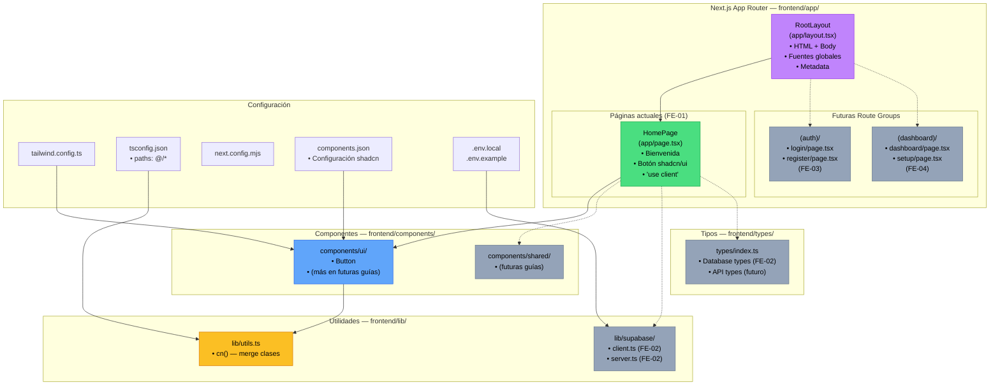

# FE-01 — Scaffold Next.js + TypeScript + Tailwind + shadcn/ui

**Guía:** FE-01  
**Bloque:** 🌐 C — Frontend Base (Next.js)  
**Objetivo:** Proyecto Next.js corriendo localmente con el stack base completo.  
**Dependencias:** [DB-01](../db/DB-01.md) (credenciales de Supabase en `.env.local`)  
**Fecha:** Junio 2026

---

## Tabla de Contenidos

1. [🎓 Introducción y Fundamentos Conceptuales](#1--introducción-y-fundamentos-conceptuales)
2. [📋 Prerequisitos y Verificación del Entorno](#2--prerequisitos-y-verificación-del-entorno)
3. [📂 Estructura de Directorios del Proyecto](#3--estructura-de-directorios-del-proyecto)
4. [🎨 Diagrama de Arquitectura de Componentes](#4--diagrama-de-arquitectura-de-componentes)
5. [🛠️ Implementación Paso a Paso](#5-️-implementación-paso-a-paso)
6. [✅ Checkpoints de Verificación](#6--checkpoints-de-verificación)
7. [🚨 Troubleshooting — Problemas Comunes](#7--troubleshooting--problemas-comunes)
8. [📝 Resumen y Próximo Paso](#8--resumen-y-próximo-paso)

---

## 1. 🎓 Introducción y Fundamentos Conceptuales

### Bienvenido al Frontend del ISTQB Study Agent

¡Felicidades! Has completado los bloques de **Base de Datos** (DB-01 a DB-04) y **Backend** (BE-01 a BE-06). Tu microservicio FastAPI ya extrae PDFs del ISTQB, tu base de datos Supabase tiene tablas con constraints sólidos, y tu API corre en DigitalOcean. Ahora llega el momento de construir la **cara visible** de tu aplicación: el frontend.

Esta es la **primera guía del Bloque C** y establece los cimientos sobre los que construirás toda la interfaz de usuario. Piensa en esta guía como los **planos y cimientos de un edificio**: sin una estructura sólida desde el inicio, todo lo que construyas encima será frágil.

### ¿Por qué Next.js 14+ con App Router?

Next.js es un framework de React creado por Vercel que resuelve problemas fundamentales del desarrollo frontend moderno. Para entender por qué lo elegimos, imagina esta analogía:

> **Analogía del Restaurante:** React puro es como tener una cocina con todos los ingredientes pero sin recetas, sin meseros y sin menú. Next.js es el restaurante completo: tiene la cocina (React), los meseros (routing), el menú (páginas), el sistema de pedidos (data fetching), la barra de tragos (API Routes) y hasta el servicio a domicilio (SSR/SSG).

#### Las 5 razones técnicas para elegir Next.js 14+ con App Router:

**1. React Server Components (RSC) — El cambio de paradigma**

React Server Components es la innovación más significativa de React en años. Tradicionalmente, TODO el código React se ejecutaba en el navegador del usuario. Con RSC, los componentes pueden ejecutarse **en el servidor** y enviar solo HTML resultante al cliente.

```
┌─────────────────────────────────────────────────────────────┐
│              MODELO TRADICIONAL (SPA puro)                  │
│                                                             │
│  Servidor → envía JavaScript gigante → Browser lo ejecuta   │
│             (toda la app viaja al cliente)                  │
│             ⚠️ Bundle grande, carga lenta                   │
└─────────────────────────────────────────────────────────────┘

┌─────────────────────────────────────────────────────────────┐
│              MODELO RSC (Next.js 14+ App Router)            │
│                                                             │
│  Servidor → ejecuta componentes → envía HTML renderizado    │
│             + solo el JS necesario para interactividad      │
│             ✅ Bundle pequeño, carga rápida                  │
└─────────────────────────────────────────────────────────────┘
```

**2. Streaming y Suspense Boundaries**

Next.js 14+ permite enviar partes de la página progresivamente usando `<Suspense>`. Imagina una página de dashboard: en lugar de esperar a que TODOS los datos carguen para mostrar algo, el servidor envía primero el header y la estructura, y luego va "llenando" cada sección a medida que los datos llegan. Esto se llama **streaming** y mejora drásticamente la percepción de velocidad.

```tsx
// Ejemplo conceptual de Streaming con Suspense
// (No lo vas a implementar ahora, pero así funciona internamente)

export default function DashboardPage() {
  return (
    <div>
      <Header />                              {/* Se envía inmediatamente */}
      <Suspense fallback={<LoadingSkeleton />}>
        <ScoreChart />                        {/* Se envía cuando los datos llegan */}
      </Suspense>
      <Suspense fallback={<LoadingSkeleton />}>
        <TopicHeatmap />                      {/* Se envía independientemente */}
      </Suspense>
    </div>
  );
}
```

**3. App Router — File-System Routing**

Con el App Router, la estructura de carpetas ES tu sistema de rutas:

```
frontend/app/
├── page.tsx              →  /
├── dashboard/page.tsx    →  /dashboard
├── session/[id]/
│   ├── theory/page.tsx   →  /session/abc123/theory
│   └── quiz/page.tsx     →  /session/abc123/quiz
└── api/
    └── upload/route.ts   →  POST /api/upload
```

No necesitas un router externo como React Router. Las carpetas y archivos SON las rutas.

**4. API Routes integradas**

Next.js te permite crear endpoints backend dentro del mismo proyecto. Esto es crucial para el ISTQB Study Agent porque las API Routes actuarán como **orquestador**: recibirán peticiones del frontend, llamarán a FastAPI, llamarán a OpenAI, y escribirán en Supabase. Todo sin exponer secrets al cliente.

**5. Optimización automática para producción**

Next.js optimiza automáticamente imágenes, fuentes, scripts, y genera builds estáticos donde es posible. Cuando hagas deploy en Vercel, todo esto viene "gratis".

### Server Components vs Client Components — La Distinción Fundamental

Esta es la decisión más importante que tomarás en CADA componente que crees. Entiéndela bien ahora:

```
┌─────────────────────────────────────────────────────────────────┐
│                    SERVER COMPONENT (por defecto)                │
│                                                                 │
│  ✅ Se ejecuta SOLO en el servidor                              │
│  ✅ Puede acceder a DB, file system, secrets                    │
│  ✅ No envía JavaScript al navegador                            │
│  ✅ Puede ser async (await directo en el componente)            │
│                                                                 │
│  ❌ NO puede usar useState, useEffect, useRef                   │
│  ❌ NO puede usar event handlers (onClick, onChange)             │
│  ❌ NO puede usar APIs del browser (window, document)           │
│  ❌ NO puede usar Context Providers directamente                │
├─────────────────────────────────────────────────────────────────┤
│                    CLIENT COMPONENT ('use client')               │
│                                                                 │
│  ✅ Se ejecuta en el navegador del usuario                      │
│  ✅ Puede usar useState, useEffect, useRef                      │
│  ✅ Puede usar event handlers (onClick, onChange, onSubmit)      │
│  ✅ Puede usar APIs del browser (window, localStorage)          │
│                                                                 │
│  ❌ NO puede acceder a DB directamente                          │
│  ❌ NO puede leer secrets del servidor                          │
│  ❌ El código JavaScript SÍ viaja al navegador del usuario      │
│  ❌ Solo puede acceder a variables NEXT_PUBLIC_*                 │
└─────────────────────────────────────────────────────────────────┘
```

> **Regla de Oro:** En Next.js 14+ con App Router, **todos los componentes son Server Components por defecto**. Solo agrega `'use client'` al tope del archivo cuando NECESITES interactividad (clicks, formularios, estado local, efectos).

### Hidratación — El Puente entre Servidor y Cliente

Cuando un Client Component se renderiza:
1. El servidor genera el HTML inicial (para SEO y velocidad de carga)
2. El HTML llega al navegador y se muestra inmediatamente
3. React "hidrata" el HTML: conecta los event handlers de JavaScript al HTML ya existente
4. A partir de ahí, el componente es interactivo

Si el HTML del servidor y lo que React espera en el cliente no coinciden, obtienes un **error de hidratación**. Esto es lo que pasa cuando usas `Date.now()` o `Math.random()` directamente en el render de un Server Component: el servidor genera un valor, el cliente genera otro diferente, y React se confunde.

### ¿Por qué Tailwind CSS + shadcn/ui?

**Tailwind CSS** es un framework de CSS utilitario (utility-first). En lugar de escribir clases CSS personalizadas como `.btn-primary { background: blue; padding: 8px; }`, escribes clases directamente en el HTML: `className="bg-blue-500 p-2"`. Esto parece extraño al inicio, pero tiene ventajas enormes:

- **Zero CSS muerto:** Solo se incluye el CSS que usas
- **Consistencia:** Todos los valores de espaciado, colores y tamaños vienen de un sistema de diseño predefinido
- **Velocidad:** No necesitas pensar en nombres de clases ni mantener archivos CSS separados
- **Responsive integrado:** `className="text-sm md:text-base lg:text-lg"` adapta el tamaño en 3 breakpoints

**shadcn/ui** NO es una librería de componentes tradicional como Material UI o Ant Design. Es una **colección de componentes** que se copian directamente a tu proyecto. Esto significa:

```
┌──────────────────────────────────────────────────────────┐
│  Material UI / Ant Design                                │
│  → npm install → import { Button } from '@mui/material' │
│  → El código vive en node_modules/                       │
│  → Personalizar es difícil (overrides, themes complejos) │
│  → Actualizar la librería puede romper tu diseño         │
├──────────────────────────────────────────────────────────┤
│  shadcn/ui                                               │
│  → npx shadcn@latest add button                         │
│  → El código se copia a tu components/ui/button.tsx      │
│  → TÚ eres dueño del código                             │
│  → Modificar es editar un archivo local                  │
│  → No hay dependencia de versión externa                 │
└──────────────────────────────────────────────────────────┘
```

> **Analogía:** Material UI es como alquilar un departamento amueblado: los muebles son bonitos pero si quieres cambiar algo necesitas pedir permiso al dueño. shadcn/ui es como comprar los muebles: los instalas en tu casa y puedes modificarlos, pintarlos o desarmarlos cuando quieras.

---

## 2. 📋 Prerequisitos y Verificación del Entorno

Antes de comenzar, verifica que tienes TODO lo necesario. Abre una terminal de **PowerShell** y ejecuta cada comando:

### 2.1 Node.js v18+

```powershell
node --version
```

**Salida esperada:**
```
v20.14.0
```

> Si la versión es menor a `v18.0.0`, descarga la versión LTS desde [nodejs.org](https://nodejs.org/). El instalador de Windows incluye npm automáticamente.

### 2.2 npm v9+

```powershell
npm --version
```

**Salida esperada:**
```
10.7.0
```

> npm viene incluido con Node.js. Si necesitas actualizarlo: `npm install -g npm@latest`

### 2.3 Git

```powershell
git --version
```

**Salida esperada:**
```
git version 2.45.1.windows.1
```

### 2.4 VS Code (recomendado)

```powershell
code --version
```

**Salida esperada:**
```
1.90.0
...
```

#### Extensiones recomendadas para este bloque:

| Extensión | ID | Propósito |
|---|---|---|
| ES7+ React/Redux/React-Native snippets | `dsznajder.es7-react-js-snippets` | Snippets rápidos de React/TS |
| Tailwind CSS IntelliSense | `bradlc.vscode-tailwindcss` | Autocompletado de clases Tailwind |
| ESLint | `dbaeumer.vscode-eslint` | Detección de errores de estilo/código |
| Pretty TypeScript Errors | `yoavbls.pretty-ts-errors` | Errores de TS legibles |
| PostCSS Language Support | `csstools.postcss` | Soporte para archivos CSS con Tailwind |

### 2.5 DB-01 completada — Credenciales de Supabase

Verifica que el archivo `.env.local` en la raíz del proyecto tiene las credenciales de Supabase creadas en **DB-01, Paso B**:

```powershell
# Desde la raíz del proyecto
Test-Path ".env.local"
```

**Salida esperada:**
```
True
```

Verifica que contiene las variables clave (sin mostrar los valores reales):

```powershell
Select-String -Path ".env.local" -Pattern "NEXT_PUBLIC_SUPABASE_URL"
Select-String -Path ".env.local" -Pattern "NEXT_PUBLIC_SUPABASE_ANON_KEY"
Select-String -Path ".env.local" -Pattern "SUPABASE_SERVICE_ROLE_KEY"
```

**Salida esperada (una línea por comando con la variable encontrada):**
```
.env.local:1:NEXT_PUBLIC_SUPABASE_URL=https://xxxxxxxxxx.supabase.co
.env.local:2:NEXT_PUBLIC_SUPABASE_ANON_KEY=eyJhbGciOiJI...
.env.local:3:SUPABASE_SERVICE_ROLE_KEY=eyJhbGciOiJI...
```

> ⚠️ **Si alguna variable no existe**, regresa a la guía [DB-01](../db/DB-01.md) y completa el Paso B antes de continuar.

### 2.6 Backend corriendo (referencia)

El backend FastAPI creado en **BE-01** corre en `http://localhost:8000`. No necesitas tenerlo corriendo para esta guía, pero confirma que tienes la URL para la variable de entorno:

```powershell
# Solo verificar que la carpeta del backend existe
Test-Path "backend/app/main.py"
```

**Salida esperada:**
```
True
```

### 2.7 Resumen de prerequisitos

| Prerequisito | Comando | Versión mínima | ¿Listo? |
|---|---|---|---|
| Node.js | `node --version` | v18.0.0 | ☐ |
| npm | `npm --version` | v9.0.0 | ☐ |
| Git | `git --version` | v2.30+ | ☐ |
| VS Code | `code --version` | Cualquiera | ☐ |
| `.env.local` con credenciales Supabase | `Test-Path ".env.local"` | N/A (DB-01) | ☐ |
| Carpeta `backend/` existente | `Test-Path "backend/app/main.py"` | N/A (BE-01) | ☐ |

---

## 3. 📂 Estructura de Directorios del Proyecto

### 3.1 Estado actual del proyecto (ANTES de esta guía)

```
practica-testing/                        # Raíz del monorepo
│
├── .env.example                         # ✅ Existente (DB-01)
├── .env.local                           # ✅ Existente (DB-01) — credenciales Supabase
├── .gitignore                           # ✅ Existente
│
├── backend/                             # ✅ Existente (BE-01 a BE-06)
│   ├── app/
│   │   ├── main.py
│   │   ├── routers/
│   │   ├── services/
│   │   ├── models/
│   │   └── core/
│   ├── tests/
│   ├── Dockerfile
│   ├── requirements.txt
│   └── .env.example
│
├── supabase/                            # ✅ Existente (DB-01 a DB-04)
│   └── migrations/
│
├── docs/                                # ✅ Existente
│   ├── architecture/
│   ├── guides/
│   │   ├── be/                          # ✅ BE-01 a BE-06
│   │   └── db/                          # ✅ DB-01 a DB-04
│   ├── roadmap/
│   └── production/
│
├── frontend/                            # ⚠️ Existe pero VACÍO (solo subdirs vacíos)
│   ├── app/                             #    (vacío)
│   ├── components/                      #    (vacío)
│   └── lib/                             #    (vacío)
│
└── dev-tools/                           # ✅ Existente
```

### 3.2 Estado DESPUÉS de completar esta guía

```
practica-testing/
│
├── .env.example                         # Sin cambios
├── .env.local                           # Sin cambios
├── .gitignore                           # 📝 MODIFICADO — agregar frontend/.env.local
│
├── backend/                             # Sin cambios
├── supabase/                            # Sin cambios
├── docs/
│   └── guides/
│       ├── be/
│       ├── db/
│       └── fe/
│           └── FE-01.md                 # 🆕 NUEVO — esta guía
│
├── frontend/                            # 🆕 RECREADO — scaffold completo de Next.js
│   ├── app/                             # 🆕 App Router — páginas y layouts
│   │   ├── layout.tsx                   # 🆕 Layout raíz con <html> y <body>
│   │   ├── page.tsx                     # 🆕 Página principal (/) — MODIFICADA con shadcn
│   │   ├── globals.css                  # 🆕 Estilos globales de Tailwind + shadcn
│   │   ├── favicon.ico                  # 🆕 Ícono del sitio (generado)
│   │   ├── (auth)/                      # 🆕 Route group para auth (futuro FE-03)
│   │   │   └── .gitkeep                 # 🆕 Mantener carpeta en Git
│   │   └── (dashboard)/                 # 🆕 Route group para dashboard (futuro FE-04)
│   │       └── .gitkeep                 # 🆕 Mantener carpeta en Git
│   │
│   ├── components/                      # 🆕 Componentes React
│   │   ├── ui/                          # 🆕 Componentes shadcn/ui
│   │   │   └── button.tsx               # 🆕 Primer componente shadcn
│   │   └── shared/                      # 🆕 Componentes compartidos del proyecto
│   │       └── .gitkeep                 # 🆕 Mantener carpeta en Git
│   │
│   ├── lib/                             # 🆕 Utilidades y configuración
│   │   ├── utils.ts                     # 🆕 Función cn() de shadcn/ui
│   │   └── supabase/                    # 🆕 Clientes de Supabase (futuro FE-02)
│   │       └── .gitkeep                 # 🆕 Mantener carpeta en Git
│   │
│   ├── types/                           # 🆕 Definiciones TypeScript
│   │   └── index.ts                     # 🆕 Barrel de tipos (placeholder)
│   │
│   ├── public/                          # 🆕 Archivos estáticos
│   │   ├── next.svg                     # 🆕 Logo Next.js (generado)
│   │   └── vercel.svg                   # 🆕 Logo Vercel (generado)
│   │
│   ├── .env.local                       # 🆕 Variables de entorno del frontend
│   ├── .env.example                     # 🆕 Template de variables (sin secrets)
│   ├── .eslintrc.json                   # 🆕 Configuración ESLint
│   ├── .gitignore                       # 🆕 Gitignore del frontend
│   ├── components.json                  # 🆕 Configuración de shadcn/ui
│   ├── next.config.mjs                  # 🆕 Configuración de Next.js
│   ├── next-env.d.ts                    # 🆕 Declaraciones de tipos Next.js
│   ├── package.json                     # 🆕 Dependencias y scripts npm
│   ├── package-lock.json                # 🆕 Lockfile de npm
│   ├── postcss.config.mjs               # 🆕 Configuración PostCSS (Tailwind)
│   ├── tailwind.config.ts               # 🆕 Configuración de Tailwind CSS
│   └── tsconfig.json                    # 🆕 Configuración TypeScript
│
└── dev-tools/                           # Sin cambios
```

> **Nota sobre Route Groups:** Las carpetas entre paréntesis como `(auth)` y `(dashboard)` son **Route Groups** de Next.js. Permiten agrupar rutas sin afectar la URL. La ruta `app/(auth)/login/page.tsx` genera la URL `/login`, NO `/auth/login`.

---

## 4. 🎨 Diagrama de Arquitectura de Componentes



**Leyenda de colores:**
- 🟢 **Verde:** Componentes creados/modificados en esta guía
- 🔵 **Azul:** Componentes de shadcn/ui (copiados al proyecto)
- 🟡 **Amarillo:** Utilidades
- 🟣 **Morado:** Layout raíz
- ⚪ **Gris:** Elementos futuros (placeholders)

---

## 5. 🛠️ Implementación Paso a Paso

---

### Paso A: Crear el proyecto Next.js

#### A.1 — Resolver el directorio `frontend/` existente

Actualmente existe un directorio `frontend/` con subcarpetas vacías (`app/`, `components/`, `lib/`). El comando `create-next-app` necesita crear su propia estructura, así que debemos eliminar la carpeta existente primero.

> **¿Por qué no usar `--force`?** El flag `--force` de create-next-app no está diseñado para trabajar sobre carpetas con subdirectorios existentes. Es más seguro y limpio eliminar primero y dejar que el scaffold genere todo desde cero.

Abre PowerShell en la **raíz del proyecto** (`practica-testing/`):

```powershell
# Eliminar la carpeta frontend/ vacía existente
Remove-Item -Recurse -Force frontend
```

**Salida esperada:**
```
(sin salida = éxito)
```

Verifica que se eliminó:

```powershell
Test-Path frontend
```

**Salida esperada:**
```
False
```

#### A.2 — Ejecutar create-next-app

Ahora ejecuta el scaffold desde la raíz del proyecto. Este comando creará la carpeta `frontend/` con toda la estructura de Next.js:

```powershell
npx create-next-app@latest frontend --typescript --tailwind --eslint --app --no-src-dir --import-alias "@/*" --use-npm
```

**Desglose de cada flag:**

| Flag | Significado |
|---|---|
| `frontend` | Nombre de la carpeta donde se crea el proyecto |
| `--typescript` | Habilitar TypeScript (archivos `.ts` y `.tsx`) |
| `--tailwind` | Preconfigurar Tailwind CSS |
| `--eslint` | Incluir ESLint para análisis estático de código |
| `--app` | Usar el App Router (no el antiguo Pages Router) |
| `--no-src-dir` | NO crear una carpeta `src/` intermedia (archivos directos en `frontend/`) |
| `--import-alias "@/*"` | Configurar `@/` como alias para importar desde la raíz del frontend |
| `--use-npm` | Usar npm como gestor de paquetes (no yarn ni pnpm) |

**Salida esperada (puede variar según la versión):**

```
Creating a new Next.js app in C:\Users\jsife\OneDrive\Desktop\Repositorios\practica-testing\frontend.

Using npm.

Initializing project with template: app-tw


Installing dependencies:
- react
- react-dom
- next

Installing devDependencies:
- typescript
- @types/node
- @types/react
- @types/react-dom
- @tailwindcss/postcss
- tailwindcss
- eslint
- eslint-config-next
- @eslint/eslintrc

npm warn deprecated inflight@1.0.6: This module is not supported...
npm warn deprecated glob@7.2.3: Glob versions prior to v9 are no longer supported

added 371 packages, and audited 372 packages in 42s

136 packages are looking for funding
  run `npm fund` for details

found 0 vulnerabilities
Initialized a git repository.

Success! Created frontend at C:\Users\jsife\OneDrive\Desktop\Repositorios\practica-testing\frontend
```

> ⚠️ Las advertencias de `npm warn deprecated` son normales y no afectan el funcionamiento. Son dependencias internas de ESLint que eventualmente se actualizarán.

#### A.3 — Verificar la estructura generada

```powershell
Get-ChildItem -Path frontend -Recurse -Depth 1 | Select-Object FullName
```

**Salida esperada:**
```
FullName
--------
...\frontend\.eslintrc.json
...\frontend\.gitignore
...\frontend\app
...\frontend\app\favicon.ico
...\frontend\app\globals.css
...\frontend\app\layout.tsx
...\frontend\app\page.tsx
...\frontend\next-env.d.ts
...\frontend\next.config.ts
...\frontend\node_modules
...\frontend\package-lock.json
...\frontend\package.json
...\frontend\postcss.config.mjs
...\frontend\public
...\frontend\public\file.svg
...\frontend\public\globe.svg
...\frontend\public\next.svg
...\frontend\public\vercel.svg
...\frontend\public\window.svg
...\frontend\README.md
...\frontend\tailwind.config.ts
...\frontend\tsconfig.json
```

**Entregables del Paso A:**
- ✅ Carpeta `frontend/` creada con scaffold completo de Next.js 14+
- ✅ TypeScript configurado (`tsconfig.json`)
- ✅ Tailwind CSS configurado (`tailwind.config.ts`, `postcss.config.mjs`)
- ✅ App Router habilitado (`app/` directory)
- ✅ ESLint configurado (`.eslintrc.json`)

---

### Paso B: Verificar el scaffold

#### B.1 — Iniciar el servidor de desarrollo

```powershell
Set-Location frontend
npm run dev
```

**Salida esperada:**
```
> frontend@0.1.0 dev
> next dev

  ▲ Next.js 15.3.3
  - Local:        http://localhost:3000
  - Environments: .env.local

 ✓ Starting...
 ✓ Ready in 3.2s
```

> **Nota:** La primera vez puede tardar unos segundos más mientras Next.js compila todo. Las siguientes veces será más rápido gracias al caché.

#### B.2 — Abrir en el navegador

Abre tu navegador en **http://localhost:3000**. Deberías ver la **página por defecto de Next.js**:

- Un fondo oscuro (casi negro)
- El logo de Next.js centrado
- Texto que dice "Get started by editing app/page.tsx"
- Enlaces a la documentación de Next.js, Learn, Examples, y Deploy
- El logo de Vercel en el footer

> Esta es la página de bienvenida generada automáticamente. La reemplazaremos en el **Paso G** con nuestra propia página.

#### B.3 — Detener el servidor

Presiona `Ctrl + C` en la terminal para detener el servidor de desarrollo.

```
Salida esperada:
^C  (el servidor se detiene)
```

**Entregables del Paso B:**
- ✅ `npm run dev` inicia sin errores
- ✅ La página por defecto de Next.js se ve en http://localhost:3000

---

### Paso C: Configurar variables de entorno

#### C.1 — Entender la seguridad de variables de entorno en Next.js

Este es un concepto de seguridad **CRÍTICO** que debes dominar antes de continuar:

```
┌──────────────────────────────────────────────────────────────────┐
│              REGLA DE SEGURIDAD DE NEXT.JS                       │
│                                                                  │
│  Variables SIN prefijo NEXT_PUBLIC_:                             │
│  ┌────────────────────────────────────────┐                     │
│  │  SUPABASE_SERVICE_ROLE_KEY=eyJ...      │                     │
│  │  OPENAI_API_KEY=sk-...                 │                     │
│  │                                        │                     │
│  │  ✅ Solo accesibles en el SERVIDOR     │                     │
│  │  ✅ API Routes, Server Components      │                     │
│  │  ❌ INVISIBLE para el navegador        │                     │
│  │  ❌ NO aparece en el bundle JS         │                     │
│  └────────────────────────────────────────┘                     │
│                                                                  │
│  Variables CON prefijo NEXT_PUBLIC_:                             │
│  ┌────────────────────────────────────────┐                     │
│  │  NEXT_PUBLIC_SUPABASE_URL=https://...  │                     │
│  │  NEXT_PUBLIC_SUPABASE_ANON_KEY=eyJ...  │                     │
│  │                                        │                     │
│  │  ✅ Accesibles en cliente Y servidor   │                     │
│  │  ⚠️ VISIBLES en el bundle JS          │                     │
│  │  ⚠️ Cualquier usuario puede verlas    │                     │
│  │  ✅ Seguras si son "públicas por diseño"│                     │
│  └────────────────────────────────────────┘                     │
│                                                                  │
│  ⚠️ NUNCA pongas NEXT_PUBLIC_ a una secret key                 │
│  ⚠️ El anon key de Supabase está DISEÑADO para ser público     │
│     (su seguridad depende de RLS, no del secreto)               │
└──────────────────────────────────────────────────────────────────┘
```

> **¿Por qué la anon key es pública y segura?** La anon key de Supabase tiene permisos **mínimos** y está controlada por Row Level Security (RLS). Es como la puerta de entrada a un edificio: cualquiera puede entrar al lobby, pero cada departamento (tabla) tiene su propia cerradura (política RLS). La `service_role` key, en cambio, es la llave maestra que abre TODAS las puertas. Por eso JAMÁS la exponemos al cliente.

#### C.2 — Crear `frontend/.env.local`

Asegúrate de estar en la carpeta `frontend/` y crea el archivo de variables de entorno:

```powershell
# Asegúrate de estar en frontend/
Set-Location C:\Users\jsife\OneDrive\Desktop\Repositorios\practica-testing\frontend
```

Crea el archivo `frontend/.env.local` con el siguiente contenido. **Reemplaza los valores placeholder** con tus credenciales reales de Supabase (obtenidas en **DB-01, Paso B**) y tu API key de OpenAI:

**Archivo: `frontend/.env.local`**
```env
# ============================================================
# Variables de entorno del frontend — ISTQB Study Agent
# ============================================================

# --- Variables PÚBLICAS (seguras para el cliente) ---
# Estas viajan al navegador del usuario. Solo poner aquí
# valores que estén DISEÑADOS para ser públicos.

# URL del proyecto Supabase (público por diseño)
NEXT_PUBLIC_SUPABASE_URL=https://tu-proyecto-id.supabase.co

# Anon Key de Supabase (público por diseño — seguridad via RLS)
NEXT_PUBLIC_SUPABASE_ANON_KEY=eyJhbGciOiJIUzI1NiIsInR5cCI6IkpXVCJ9...

# URL del backend FastAPI para llamadas desde el cliente (si aplica)
NEXT_PUBLIC_FASTAPI_URL=http://localhost:8000

# --- Variables PRIVADAS (solo servidor) ---
# ⚠️ NUNCA agregues NEXT_PUBLIC_ a estas variables.
# Solo son accesibles en API Routes y Server Components.

# Service Role Key de Supabase (llave maestra — NUNCA exponer)
SUPABASE_SERVICE_ROLE_KEY=eyJhbGciOiJIUzI1NiIsInR5cCI6IkpXVCJ9...

# API Key de OpenAI (secreto — NUNCA exponer)
OPENAI_API_KEY=sk-proj-xxxxxxxxxxxxxxxxxxxxxxxxxxxxxxxx

# Modelo de OpenAI a usar (configurable sin cambiar código)
OPENAI_MODEL=gpt-4o-mini
```

> **Importante:** Copia los valores REALES de `NEXT_PUBLIC_SUPABASE_URL` y `NEXT_PUBLIC_SUPABASE_ANON_KEY` desde el archivo `.env.local` de la raíz del proyecto (creado en DB-01). La `SUPABASE_SERVICE_ROLE_KEY` también viene de ahí. La `OPENAI_API_KEY` la obtienes desde [platform.openai.com/api-keys](https://platform.openai.com/api-keys).

#### C.3 — Verificar que `.env.local` está en `.gitignore`

El scaffold de Next.js ya incluye un `.gitignore` que ignora `.env*.local`. Verifícalo:

```powershell
Select-String -Path ".gitignore" -Pattern "env.*local"
```

**Salida esperada:**
```
.gitignore:27:.env*.local
```

> ✅ Perfecto. El archivo `.env.local` **nunca** se subirá a GitHub.

Adicionalmente, verifica que el `.gitignore` de la **raíz del proyecto** también ignora archivos `.env.local` (ya debería estar, lo vimos en la sección de prerrequisitos):

```powershell
Select-String -Path "../.gitignore" -Pattern "env.*local"
```

**Salida esperada:**
```
../.gitignore:1:.env*.local
```

#### C.4 — Crear `frontend/.env.example`

Este archivo es la **plantilla** de variables de entorno que SÍ se sube al repositorio. Contiene los nombres de las variables pero NUNCA valores reales:

**Archivo: `frontend/.env.example`**
```env
# ============================================================
# Variables de entorno del frontend — ISTQB Study Agent
# ============================================================
# Copia este archivo como .env.local y rellena con tus valores:
#   Copy-Item .env.example .env.local
# ============================================================

# --- Variables PÚBLICAS (seguras para el cliente) ---

# URL del proyecto Supabase (Settings → API → Project URL)
NEXT_PUBLIC_SUPABASE_URL=https://your-project-id.supabase.co

# Anon Key de Supabase (Settings → API → anon public)
NEXT_PUBLIC_SUPABASE_ANON_KEY=your-anon-key-here

# URL del backend FastAPI
NEXT_PUBLIC_FASTAPI_URL=http://localhost:8000

# --- Variables PRIVADAS (solo servidor) ---

# Service Role Key de Supabase (Settings → API → service_role)
# ⚠️ NUNCA usar prefijo NEXT_PUBLIC_ para esta variable
SUPABASE_SERVICE_ROLE_KEY=your-service-role-key-here

# API Key de OpenAI (https://platform.openai.com/api-keys)
# ⚠️ NUNCA usar prefijo NEXT_PUBLIC_ para esta variable
OPENAI_API_KEY=sk-your-openai-key-here

# Modelo de OpenAI (cambiar sin tocar código)
OPENAI_MODEL=gpt-4o-mini
```

#### C.5 — Verificar que la variable se lee correctamente

Inicia temporalmente el servidor y verifica que Next.js detecta el `.env.local`:

```powershell
npm run dev
```

**Salida esperada (fíjate en la línea de Environments):**
```
> frontend@0.1.0 dev
> next dev

  ▲ Next.js 15.3.3
  - Local:        http://localhost:3000
  - Environments: .env.local

 ✓ Starting...
 ✓ Ready in 2.8s
```

La línea `- Environments: .env.local` confirma que Next.js encontró y está leyendo tu archivo de variables.

Detén el servidor con `Ctrl + C`.

**Entregables del Paso C:**
- ✅ Archivo `frontend/.env.local` creado con todas las variables
- ✅ Archivo `frontend/.env.example` creado como plantilla (sin secrets)
- ✅ `.gitignore` ignora `.env.local`
- ✅ Next.js detecta el archivo de entorno correctamente

---

### Paso D: Instalar dependencias del proyecto

#### D.1 — Instalar dependencias de producción

Desde la carpeta `frontend/`, ejecuta:

```powershell
npm install @supabase/supabase-js @supabase/ssr openai recharts react-markdown
```

**Desglose de cada dependencia:**

| Paquete | Propósito en el ISTQB Study Agent |
|---|---|
| `@supabase/supabase-js` | Cliente oficial de Supabase. Permite hacer queries a la DB, auth, y storage |
| `@supabase/ssr` | Helpers para usar Supabase en entornos SSR (Server Side Rendering). Maneja cookies y sesiones en Server Components y middleware |
| `openai` | SDK oficial de OpenAI. Lo usaremos en API Routes para generar planes, teoría, quizzes y evaluaciones |
| `recharts` | Librería de gráficas para React basada en D3.js. Para el dashboard de progreso (LineChart, BarChart, etc.) |
| `react-markdown` | Renderiza contenido Markdown como componentes React. Para mostrar la teoría generada por OpenAI |

**Salida esperada:**
```
added 72 packages, and audited 444 packages in 18s

155 packages are looking for funding
  run `npm fund` for details

found 0 vulnerabilities
```

#### D.2 — Verificar instalación

```powershell
npm ls @supabase/supabase-js @supabase/ssr openai recharts react-markdown --depth=0
```

**Salida esperada:**
```
frontend@0.1.0 C:\Users\jsife\OneDrive\Desktop\Repositorios\practica-testing\frontend
├── @supabase/ssr@0.6.1
├── @supabase/supabase-js@2.49.4
├── openai@4.86.2
├── react-markdown@9.0.3
└── recharts@2.15.3
```

> Las versiones pueden variar. Lo importante es que estén instaladas sin errores.

#### D.3 — Verificar que no hay vulnerabilidades

```powershell
npm audit
```

**Salida esperada:**
```
found 0 vulnerabilities
```

> Si hay vulnerabilidades de severidad baja (low), puedes continuar. Si hay vulnerabilidades **altas o críticas**, ejecuta `npm audit fix`.

**Entregables del Paso D:**
- ✅ 5 dependencias de producción instaladas: `@supabase/supabase-js`, `@supabase/ssr`, `openai`, `recharts`, `react-markdown`
- ✅ `package.json` actualizado con las nuevas dependencias
- ✅ `package-lock.json` generado/actualizado

---

### Paso E: Inicializar shadcn/ui

#### E.1 — Entender la arquitectura de shadcn/ui

Antes de ejecutar el comando, entiende lo que va a pasar:

```
┌──────────────────────────────────────────────────────────────┐
│  ¿Qué hace `npx shadcn@latest init`?                       │
│                                                              │
│  1. Lee tu tsconfig.json para entender los alias (@/)        │
│  2. Lee tu tailwind.config.ts para integrar design tokens    │
│  3. Crea components.json — el "cerebro" de shadcn/ui         │
│  4. Actualiza globals.css con variables CSS de colores       │
│  5. Crea lib/utils.ts con la función cn()                   │
│  6. Instala dependencias: clsx, tailwind-merge,              │
│     class-variance-authority, lucide-react                   │
│                                                              │
│  Después, cada `npx shadcn@latest add <componente>`          │
│  COPIA el código fuente del componente a components/ui/      │
│  → Tú eres dueño del código y puedes modificarlo             │
└──────────────────────────────────────────────────────────────┘
```

#### E.2 — Ejecutar la inicialización

```powershell
npx shadcn@latest init
```

El wizard te hará preguntas. Responde así:

```
✔ Preflight checks.

◇ Which color would you like to use as the base color?
│  Neutral

◇ Would you like to use CSS variables for theming?
│  Yes

✔ Writing components.json.
✔ Checking registry.
✔ Updating tailwind.config.ts
✔ Updating app/globals.css
✔ Creating lib/utils.ts
✔ Installing dependencies.

 Success! Project initialization completed.
 You may now add components.
```

**Explicación de las elecciones:**

| Pregunta | Respuesta | Por qué |
|---|---|---|
| Base color | **Neutral** | Colores grises como base — profesional y limpio |
| CSS variables | **Yes** | Permite cambiar temas (dark/light) con variables CSS |

#### E.3 — Verificar los archivos creados/modificados

**Archivo creado: `frontend/components.json`**

Verifícalo:

```powershell
Get-Content components.json
```

**Salida esperada (puede variar ligeramente):**
```json
{
  "$schema": "https://ui.shadcn.com/schema.json",
  "style": "new-york",
  "rsc": true,
  "tsx": true,
  "tailwind": {
    "config": "tailwind.config.ts",
    "css": "app/globals.css",
    "baseColor": "neutral",
    "cssVariables": true,
    "prefix": ""
  },
  "aliases": {
    "components": "@/components",
    "utils": "@/lib/utils",
    "ui": "@/components/ui",
    "lib": "@/lib",
    "hooks": "@/hooks"
  }
}
```

**Archivo creado: `frontend/lib/utils.ts`**

```powershell
Get-Content lib/utils.ts
```

**Salida esperada:**
```typescript
import { clsx, type ClassValue } from "clsx"
import { twMerge } from "tailwind-merge"

export function cn(...inputs: ClassValue[]) {
  return twMerge(clsx(inputs))
}
```

> **¿Qué es `cn()`?** Es una función utilitaria que combina clases CSS de forma inteligente. `clsx` permite clases condicionales (`{"active": isActive}`) y `twMerge` resuelve conflictos de Tailwind (`"p-2 p-4"` → `"p-4"`).

#### E.4 — Agregar el primer componente: Button

```powershell
npx shadcn@latest add button
```

**Salida esperada:**
```
✔ Checking registry.
✔ Installing dependencies.
✔ Created 1 file:
  - components/ui/button.tsx
```

Verifica el archivo creado:

```powershell
Get-Content components/ui/button.tsx
```

**Salida esperada (versión resumida — el archivo real tiene ~50 líneas):**
```tsx
import * as React from "react"
import { Slot } from "@radix-ui/react-slot"
import { cva, type VariantProps } from "class-variance-authority"

import { cn } from "@/lib/utils"

const buttonVariants = cva(
  "inline-flex items-center justify-center gap-2 whitespace-nowrap rounded-md text-sm font-medium ...",
  {
    variants: {
      variant: {
        default: "bg-primary text-primary-foreground shadow-xs hover:bg-primary/90",
        destructive: "bg-destructive text-white shadow-xs hover:bg-destructive/90",
        outline: "border border-input bg-background shadow-xs hover:bg-accent ...",
        secondary: "bg-secondary text-secondary-foreground shadow-xs hover:bg-secondary/80",
        ghost: "hover:bg-accent hover:text-accent-foreground",
        link: "text-primary underline-offset-4 hover:underline",
      },
      size: {
        default: "h-9 px-4 py-2",
        sm: "h-8 rounded-md px-3 text-xs",
        lg: "h-10 rounded-md px-6",
        icon: "size-9",
      },
    },
    defaultVariants: {
      variant: "default",
      size: "default",
    },
  }
)

function Button({ className, variant, size, asChild = false, ...props }:
  React.ComponentProps<"button"> & VariantProps<typeof buttonVariants> & { asChild?: boolean }) {
  const Comp = asChild ? Slot : "button"
  return (
    <Comp
      data-slot="button"
      className={cn(buttonVariants({ variant, size, className }))}
      {...props}
    />
  )
}

export { Button, buttonVariants }
```

> **Observa:** El componente Button es código TypeScript normal que vive EN TU PROYECTO. No es una importación de `node_modules/`. Puedes abrir `components/ui/button.tsx` y modificar lo que quieras: colores, bordes, animaciones, tamaños. Eso es el poder de shadcn/ui.

#### E.5 — Verificar las dependencias que shadcn/ui instaló

```powershell
npm ls clsx tailwind-merge class-variance-authority @radix-ui/react-slot lucide-react --depth=0
```

**Salida esperada:**
```
frontend@0.1.0 C:\...\frontend
├── @radix-ui/react-slot@1.1.2
├── class-variance-authority@0.7.1
├── clsx@2.1.1
├── lucide-react@0.475.0
└── tailwind-merge@3.0.2
```

**Entregables del Paso E:**
- ✅ shadcn/ui inicializado (`components.json` creado)
- ✅ `globals.css` actualizado con variables CSS de temas
- ✅ `lib/utils.ts` creado con función `cn()`
- ✅ Componente Button copiado a `components/ui/button.tsx`
- ✅ Dependencias de shadcn instaladas (`clsx`, `tailwind-merge`, `class-variance-authority`, `@radix-ui/react-slot`, `lucide-react`)

---

### Paso F: Configurar la estructura de carpetas del proyecto

#### F.1 — Crear las carpetas organizadas

Vamos a crear la estructura que usaremos a lo largo del proyecto. Estas carpetas preparan la aplicación para las guías futuras:

```powershell
# Crear Route Groups para organizar páginas
New-Item -ItemType Directory -Path "app/(auth)" -Force
New-Item -ItemType Directory -Path "app/(dashboard)" -Force

# Crear carpeta de componentes compartidos
New-Item -ItemType Directory -Path "components/shared" -Force

# Crear carpeta de utilidades de Supabase
New-Item -ItemType Directory -Path "lib/supabase" -Force

# Crear carpeta de tipos TypeScript
New-Item -ItemType Directory -Path "types" -Force
```

**Salida esperada (una línea por cada directorio creado):**
```
    Directory: C:\...\frontend\app

Mode                 LastWriteTime         Length Name
----                 -------------         ------ ----
d----           6/7/2026  6:15 PM                (auth)
d----           6/7/2026  6:15 PM                (dashboard)

    Directory: C:\...\frontend\components

Mode                 LastWriteTime         Length Name
----                 -------------         ------ ----
d----           6/7/2026  6:15 PM                shared

    Directory: C:\...\frontend\lib

Mode                 LastWriteTime         Length Name
----                 -------------         ------ ----
d----           6/7/2026  6:15 PM                supabase

    Directory: C:\...\frontend

Mode                 LastWriteTime         Length Name
----                 -------------         ------ ----
d----           6/7/2026  6:15 PM                types
```

#### F.2 — Crear archivos `.gitkeep` para mantener carpetas vacías en Git

Git no rastrea carpetas vacías. Para que estas carpetas aparezcan en el repositorio, creamos archivos `.gitkeep`:

```powershell
# Crear .gitkeep en carpetas vacías
New-Item -ItemType File -Path "app/(auth)/.gitkeep" -Force
New-Item -ItemType File -Path "app/(dashboard)/.gitkeep" -Force
New-Item -ItemType File -Path "components/shared/.gitkeep" -Force
New-Item -ItemType File -Path "lib/supabase/.gitkeep" -Force
```

**Salida esperada:**
```
    Directory: C:\...\frontend\app\(auth)

Mode                 LastWriteTime         Length Name
----                 -------------         ------ ----
-a---           6/7/2026  6:16 PM              0 .gitkeep
...
```

#### F.3 — Crear `types/index.ts` — Barrel de tipos TypeScript

Este archivo será el punto central para exportar todos los tipos de la aplicación. Por ahora es un placeholder que llenaremos en FE-02:

**Archivo: `frontend/types/index.ts`**
```typescript
// ============================================================
// types/index.ts — Tipos centrales del ISTQB Study Agent
// ============================================================
// Este archivo actúa como "barrel" (punto de exportación central)
// para todos los tipos TypeScript del proyecto.
//
// Se llenará en FE-02 con los tipos de las tablas de Supabase:
// - Database (tipo generado por Supabase CLI)
// - UserProfile, Document, StudyPlan, Session, Answer, TopicProgress
//
// Uso futuro:
//   import type { UserProfile, Session } from "@/types";
// ============================================================

/**
 * Placeholder — Tipo base que representa un registro con ID y timestamps.
 * Los tipos reales de la base de datos se generarán en FE-02.
 */
export interface BaseRecord {
  id: string;
  created_at: string;
}
```

#### F.4 — Propósito de cada carpeta

| Carpeta | Propósito | Se llena en |
|---|---|---|
| `app/(auth)/` | Páginas de login y registro. El paréntesis crea un Route Group que NO afecta la URL | FE-03 |
| `app/(dashboard)/` | Páginas protegidas del dashboard | FE-04 |
| `components/ui/` | Componentes copiados de shadcn/ui (Button, Input, Card, etc.) | FE-01 ✅ y siguientes |
| `components/shared/` | Componentes compartidos entre páginas (Header, Footer, etc.) | FE-04 |
| `lib/supabase/` | Clientes de Supabase para server y client | FE-02 |
| `lib/utils.ts` | Función `cn()` y utilidades generales | FE-01 ✅ |
| `types/` | Tipos TypeScript compartidos (DB types, API response types) | FE-02 |

**Entregables del Paso F:**
- ✅ Route groups `(auth)/` y `(dashboard)/` creados
- ✅ Carpetas `components/shared/`, `lib/supabase/`, `types/` creadas
- ✅ Archivos `.gitkeep` en carpetas vacías
- ✅ `types/index.ts` creado con tipo placeholder

---

### Paso G: Crear la página de bienvenida con shadcn/ui Button

#### G.1 — Reemplazar la página por defecto

Abre `frontend/app/page.tsx` y reemplaza TODO su contenido con el siguiente código:

**Archivo: `frontend/app/page.tsx`**
```tsx
"use client";

// ============================================================
// app/page.tsx — Página de bienvenida del ISTQB Study Agent
// ============================================================
// 'use client' es necesario porque usamos:
// - useState: para manejar estado local del contador de clicks
// - onClick: event handler que solo funciona en el cliente
//
// Sin 'use client', esto sería un Server Component y React
// lanzaría un error al intentar usar hooks o event handlers.
// ============================================================

import { useState } from "react";
import { Button } from "@/components/ui/button";

export default function HomePage() {
  // Estado local para demostrar interactividad del Client Component
  const [clickCount, setClickCount] = useState(0);

  return (
    <main className="flex min-h-screen flex-col items-center justify-center bg-gradient-to-b from-slate-950 via-slate-900 to-slate-950 text-white">
      {/* Contenedor principal centrado */}
      <div className="mx-auto max-w-2xl px-6 text-center">
        {/* Badge de estado */}
        <div className="mb-8 inline-flex items-center rounded-full border border-slate-700 bg-slate-800/50 px-4 py-1.5 text-sm text-slate-300">
          <span className="mr-2 inline-block h-2 w-2 rounded-full bg-emerald-400 animate-pulse" />
          FE-01 Completado — Stack base listo
        </div>

        {/* Título principal */}
        <h1 className="mb-4 text-5xl font-bold tracking-tight sm:text-6xl">
          ISTQB{" "}
          <span className="bg-gradient-to-r from-blue-400 to-emerald-400 bg-clip-text text-transparent">
            Study Agent
          </span>
        </h1>

        {/* Subtítulo */}
        <p className="mb-8 text-lg leading-relaxed text-slate-400">
          Tu tutor inteligente para la certificación ISTQB® Foundation Level v4.0.
          Estudio adaptativo impulsado por IA con sesiones personalizadas de teoría y quiz.
        </p>

        {/* Stack tecnológico */}
        <div className="mb-10 flex flex-wrap items-center justify-center gap-3 text-sm text-slate-500">
          <span className="rounded-md border border-slate-700 px-3 py-1">Next.js 15</span>
          <span className="rounded-md border border-slate-700 px-3 py-1">TypeScript</span>
          <span className="rounded-md border border-slate-700 px-3 py-1">Tailwind CSS</span>
          <span className="rounded-md border border-slate-700 px-3 py-1">shadcn/ui</span>
          <span className="rounded-md border border-slate-700 px-3 py-1">Supabase</span>
          <span className="rounded-md border border-slate-700 px-3 py-1">OpenAI</span>
        </div>

        {/* Botones de shadcn/ui — demostración de variantes */}
        <div className="flex flex-col items-center gap-4 sm:flex-row sm:justify-center">
          {/* Botón principal con interactividad */}
          <Button
            size="lg"
            onClick={() => setClickCount((prev) => prev + 1)}
            className="min-w-[200px] bg-gradient-to-r from-blue-600 to-emerald-600 text-white hover:from-blue-500 hover:to-emerald-500"
          >
            {clickCount === 0
              ? "🚀 Comenzar a estudiar"
              : `✅ Clicks: ${clickCount}`}
          </Button>

          {/* Botón secundario — variante outline */}
          <Button variant="outline" size="lg" className="min-w-[200px] border-slate-700 text-slate-300 hover:bg-slate-800">
            📖 Ver documentación
          </Button>
        </div>

        {/* Mensaje interactivo */}
        {clickCount > 0 && (
          <p className="mt-6 text-sm text-emerald-400 animate-fade-in">
            ¡shadcn/ui Button funciona! El componente es interactivo. 🎉
            {clickCount >= 5 && " ¡Estás listo para construir la app!"}
          </p>
        )}

        {/* Footer con información del stack */}
        <div className="mt-16 border-t border-slate-800 pt-8 text-sm text-slate-600">
          <p>
            ISTQB Study Agent — Bloque C: Frontend Base
          </p>
          <p className="mt-1">
            Próximo paso: FE-02 — Conexión con Supabase
          </p>
        </div>
      </div>
    </main>
  );
}
```

**Explicación detallada de las decisiones de código:**

1. **`"use client"` en la primera línea:** Este componente usa `useState` y `onClick`, que son APIs del navegador. Sin esta directiva, Next.js intentaría ejecutarlo como Server Component y fallaría.

2. **`import { Button } from "@/components/ui/button"`:** Usamos el alias `@/` configurado en `tsconfig.json`. Esto equivale a un import relativo pero es más limpio y consistente. Nota las **barras diagonales normales** (`/`) en el import — Next.js las requiere así, incluso en Windows.

3. **`useState` para el contador:** Demuestra que el Client Component puede manejar estado interactivo. Cada click incrementa el contador y React re-renderiza solo el texto del botón.

4. **Variantes del Button de shadcn/ui:** Mostramos dos variantes (`default` con gradiente personalizado y `outline`) para demostrar la flexibilidad del componente.

5. **Clases de Tailwind CSS:** Cada clase hace exactamente lo que dice:
   - `min-h-screen` → altura mínima 100% del viewport
   - `bg-gradient-to-b from-slate-950 to-slate-950` → degradado oscuro
   - `text-5xl font-bold tracking-tight` → texto grande, bold, letras juntas
   - `sm:text-6xl` → en pantallas ≥640px, el texto es más grande

#### G.2 — Verificar la página

Inicia el servidor de desarrollo:

```powershell
npm run dev
```

**Salida esperada:**
```
> frontend@0.1.0 dev
> next dev

  ▲ Next.js 15.3.3
  - Local:        http://localhost:3000
  - Environments: .env.local

 ✓ Starting...
 ✓ Ready in 2.5s
 ○ Compiling / ...
 ✓ Compiled / in 3.1s
```

Abre **http://localhost:3000** en tu navegador. Deberías ver:

- Un **fondo degradado oscuro** (slate-950 a slate-900)
- Un **badge verde** parpadeante que dice "FE-01 Completado — Stack base listo"
- El título **"ISTQB Study Agent"** con "Study Agent" en degradado azul-a-verde
- Un **subtítulo** descriptivo del proyecto
- **6 badges de stack tecnológico** (Next.js 15, TypeScript, Tailwind CSS, shadcn/ui, Supabase, OpenAI)
- Un **botón principal** con degradado azul-verde que dice "🚀 Comenzar a estudiar"
- Un **botón secundario** outline que dice "📖 Ver documentación"
- Al hacer **click en el botón principal**, el texto cambia a "✅ Clicks: 1", "✅ Clicks: 2", etc.
- Después de 1+ clicks, aparece un **mensaje verde**: "¡shadcn/ui Button funciona! El componente es interactivo. 🎉"
- Después de 5+ clicks, el mensaje agrega: "¡Estás listo para construir la app!"

> Si ves todo esto, ¡felicidades! Tu stack frontend está completamente funcional. 🎉

Detén el servidor con `Ctrl + C`.

**Entregables del Paso G:**
- ✅ `app/page.tsx` modificado con página de bienvenida personalizada
- ✅ Componente Button de shadcn/ui renderiza correctamente
- ✅ Interactividad funcional (click counter con `useState`)
- ✅ Tailwind CSS aplicado con clases responsivas

---

### Paso H: Verificar seguridad del bundle

Este es un paso de seguridad **CRÍTICO**. Vamos a verificar que las variables privadas (`SUPABASE_SERVICE_ROLE_KEY` y `OPENAI_API_KEY`) NO están presentes en el bundle de JavaScript que se envía al navegador.

#### H.1 — Crear el build de producción

```powershell
npm run build
```

**Salida esperada:**
```
> frontend@0.1.0 build
> next build

  ▲ Next.js 15.3.3
  - Environments: .env.local

   Creating an optimized production build ...
 ✓ Compiled successfully
 ✓ Linting and checking validity of types
 ✓ Collecting page data
 ✓ Generating static pages (5/5)
 ✓ Collecting build traces
 ✓ Finalizing page optimization

Route (app)                              Size     First Load JS
┌ ○ /                                    5.24 kB        92.1 kB
└ ○ /_not-found                          977 B          87.8 kB
+ First Load JS shared by all            86.8 kB
  ├ chunks/framework-*.js                45.2 kB
  ├ chunks/main-app-*.js                 38.9 kB
  └ other shared chunks (total)          2.7 kB

○  (Static)  prerendered as static content
```

> El build fue exitoso. Ahora el bundle está en la carpeta `.next/`.

#### H.2 — Buscar secrets en el bundle

Usa PowerShell para buscar si las variables privadas aparecen en algún archivo del bundle:

```powershell
# Buscar SUPABASE_SERVICE_ROLE_KEY en el bundle
Get-ChildItem -Path ".next" -Recurse -Include "*.js" | Select-String -Pattern "SUPABASE_SERVICE_ROLE_KEY" -List
```

**Salida esperada:**
```
(sin salida = NO encontrado ✅)
```

```powershell
# Buscar OPENAI_API_KEY en el bundle
Get-ChildItem -Path ".next" -Recurse -Include "*.js" | Select-String -Pattern "OPENAI_API_KEY" -List
```

**Salida esperada:**
```
(sin salida = NO encontrado ✅)
```

```powershell
# Buscar el valor real del service_role key (primeros caracteres)
# Reemplaza "eyJhbGciOi" con los primeros 10 caracteres de tu service_role key real
Get-ChildItem -Path ".next" -Recurse -Include "*.js" | Select-String -Pattern "service_role" -List
```

**Salida esperada:**
```
(sin salida = NO encontrado ✅)
```

#### H.3 — Verificar que las variables PÚBLICAS SÍ están (es esperado)

```powershell
# Las variables NEXT_PUBLIC_ SÍ deben estar en el bundle (eso es correcto)
Get-ChildItem -Path ".next" -Recurse -Include "*.js" | Select-String -Pattern "NEXT_PUBLIC_SUPABASE_URL" -List
```

**Salida esperada:**
```
(puede o no aparecer dependiendo de si algún componente las usa activamente)
```

> **Esto es correcto.** Las variables `NEXT_PUBLIC_*` están **diseñadas** para ser visibles al cliente. Su seguridad depende de RLS (Row Level Security) en Supabase, no del secreto de la key.

#### H.4 — Resumen de seguridad

| Variable | ¿Aparece en el bundle? | ¿Es correcto? |
|---|---|---|
| `SUPABASE_SERVICE_ROLE_KEY` | ❌ NO | ✅ Correcto — secreto protegido |
| `OPENAI_API_KEY` | ❌ NO | ✅ Correcto — secreto protegido |
| `OPENAI_MODEL` | ❌ NO | ✅ Correcto — solo se usa en servidor |
| `NEXT_PUBLIC_SUPABASE_URL` | ✅ SÍ (cuando se use) | ✅ Correcto — público por diseño |
| `NEXT_PUBLIC_SUPABASE_ANON_KEY` | ✅ SÍ (cuando se use) | ✅ Correcto — público por diseño |
| `NEXT_PUBLIC_FASTAPI_URL` | ✅ SÍ (cuando se use) | ✅ Correcto — público por diseño |

**Entregables del Paso H:**
- ✅ Build de producción exitoso (`npm run build` sin errores)
- ✅ `SUPABASE_SERVICE_ROLE_KEY` NO aparece en el bundle
- ✅ `OPENAI_API_KEY` NO aparece en el bundle
- ✅ Verificación de seguridad del bundle completada

---

## 6. ✅ Checkpoints de Verificación

### Checkpoint 1: Servidor de desarrollo

```powershell
npm run dev
```

- [ ] El servidor inicia sin errores
- [ ] La terminal muestra `✓ Ready in X.Xs`
- [ ] La terminal muestra `Environments: .env.local`

### Checkpoint 2: Página de bienvenida

Abre **http://localhost:3000** en el navegador:

- [ ] Se muestra la página con fondo oscuro degradado
- [ ] El título "ISTQB Study Agent" está visible con gradiente azul-verde
- [ ] Se ven los 6 badges de stack tecnológico
- [ ] El botón "🚀 Comenzar a estudiar" está visible con estilo shadcn/ui
- [ ] El botón "📖 Ver documentación" con estilo outline está visible

### Checkpoint 3: Interactividad del Button

- [ ] Al hacer click en "🚀 Comenzar a estudiar", el texto cambia a "✅ Clicks: 1"
- [ ] Cada click subsiguiente incrementa el contador
- [ ] Aparece el mensaje verde "¡shadcn/ui Button funciona!"
- [ ] Después de 5+ clicks, el mensaje agrega "¡Estás listo para construir la app!"

### Checkpoint 4: Variables de entorno

```powershell
# Verificar que .env.local existe en frontend/
Test-Path "frontend/.env.local"
```
- [ ] Retorna `True`

```powershell
# Verificar las 6 variables
Select-String -Path "frontend/.env.local" -Pattern "NEXT_PUBLIC_SUPABASE_URL"
Select-String -Path "frontend/.env.local" -Pattern "NEXT_PUBLIC_SUPABASE_ANON_KEY"
Select-String -Path "frontend/.env.local" -Pattern "NEXT_PUBLIC_FASTAPI_URL"
Select-String -Path "frontend/.env.local" -Pattern "SUPABASE_SERVICE_ROLE_KEY"
Select-String -Path "frontend/.env.local" -Pattern "OPENAI_API_KEY"
Select-String -Path "frontend/.env.local" -Pattern "OPENAI_MODEL"
```
- [ ] Todas las 6 variables existen con valores reales

### Checkpoint 5: Template sin secrets

```powershell
Test-Path "frontend/.env.example"
```
- [ ] Retorna `True`
- [ ] El archivo contiene los nombres de las variables pero NO valores reales

### Checkpoint 6: Seguridad del bundle

```powershell
# Desde frontend/
npm run build
Get-ChildItem -Path ".next" -Recurse -Include "*.js" | Select-String -Pattern "SUPABASE_SERVICE_ROLE_KEY" -List
Get-ChildItem -Path ".next" -Recurse -Include "*.js" | Select-String -Pattern "OPENAI_API_KEY" -List
```
- [ ] El build completa sin errores
- [ ] NINGÚN resultado para `SUPABASE_SERVICE_ROLE_KEY`
- [ ] NINGÚN resultado para `OPENAI_API_KEY`

### Checkpoint 7: Archivos generados

```powershell
# Verificar archivos clave
Test-Path "frontend/components.json"          # shadcn config
Test-Path "frontend/components/ui/button.tsx"  # Primer componente
Test-Path "frontend/lib/utils.ts"             # Función cn()
Test-Path "frontend/types/index.ts"           # Barrel de tipos
Test-Path "frontend/tailwind.config.ts"       # Config Tailwind
Test-Path "frontend/tsconfig.json"            # Config TypeScript
```
- [ ] Todos retornan `True`

### Resumen de entregables completos

| # | Entregable | Paso | ¿Listo? |
|---|---|---|---|
| 1 | Proyecto Next.js scaffolded con TS + Tailwind + App Router | A | ☐ |
| 2 | `npm run dev` funciona sin errores | B | ☐ |
| 3 | `frontend/.env.local` con 6 variables configuradas | C | ☐ |
| 4 | `frontend/.env.example` como template sin secrets | C | ☐ |
| 5 | 5 dependencias instaladas (supabase-js, ssr, openai, recharts, react-markdown) | D | ☐ |
| 6 | shadcn/ui inicializado + Button component | E | ☐ |
| 7 | Estructura de carpetas organizada (Route Groups, types/, shared/) | F | ☐ |
| 8 | Página de bienvenida con shadcn/ui Button interactivo | G | ☐ |
| 9 | Bundle de producción NO filtra secrets | H | ☐ |

---

## 7. 🚨 Troubleshooting — Problemas Comunes

| # | Problema | Causa Probable | Solución |
|---|---|---|---|
| 1 | `Module not found: Can't resolve '@/components/ui/button'` | El alias `@/` no está configurado correctamente en `tsconfig.json` o la carpeta no existe | Verifica que `tsconfig.json` contiene `"paths": { "@/*": ["./*"] }` y que el archivo `components/ui/button.tsx` existe. Ejecuta `npx shadcn@latest add button` de nuevo si es necesario. |
| 2 | Las clases de Tailwind no aplican estilos (texto plano sin colores ni espaciado) | El archivo `globals.css` no tiene las directivas de Tailwind o no se está importando en `layout.tsx` | Verifica que `app/globals.css` contiene `@import "tailwindcss";` (o las directivas `@tailwind base/components/utilities` según la versión). Verifica que `app/layout.tsx` importa `"./globals.css"`. |
| 3 | `npx shadcn@latest init` falla con error de PostCSS o Tailwind | La versión de Tailwind CSS es incompatible con la versión de shadcn/ui | Asegúrate de estar usando la versión más reciente: `npx shadcn@latest init` (no `npx shadcn-ui@latest`). Si persiste, borra `node_modules` y `package-lock.json`, luego ejecuta `npm install` de nuevo. |
| 4 | Puerto 3000 ya está en uso: `Error: listen EADDRINUSE :::3000` | Otro proceso (otra instancia de Next.js, otro servidor) está usando el puerto 3000 | Opción 1: Cierra el otro proceso. En PowerShell: `Get-Process -Id (Get-NetTCPConnection -LocalPort 3000).OwningProcess \| Stop-Process`. Opción 2: Usa otro puerto: `npx next dev --port 3001`. |
| 5 | Error de TypeScript: `Cannot find module '@/...' or its corresponding type declarations` | El alias `@/` funciona para runtime pero TypeScript no lo reconoce | Verifica en `tsconfig.json` que tienes: `"baseUrl": "."` y `"paths": { "@/*": ["./*"] }`. Reinicia VS Code después de editar `tsconfig.json` (a veces el language server necesita recargarse). |
| 6 | `Error: Hydration failed because the server rendered HTML didn't match the client` | Un Server Component genera contenido diferente entre server y client (por ejemplo usando `Date.now()`, `Math.random()`, o extensiones del browser que inyectan HTML) | Mueve el código dinámico a un Client Component con `'use client'`. Si es causado por extensiones del browser (como ad blockers o Grammarly), prueba en modo incógnito. |
| 7 | Variables `NEXT_PUBLIC_*` devuelven `undefined` en el código | Olvidaste el prefijo `NEXT_PUBLIC_` o no reiniciaste el servidor de desarrollo después de crear/editar `.env.local` | 1) Verifica que la variable en `.env.local` tiene exactamente el prefijo `NEXT_PUBLIC_`. 2) **Detén** el servidor (`Ctrl+C`) y reinícialo (`npm run dev`). Next.js solo lee `.env.local` al arrancar. |
| 8 | `npm install` falla con errores de red o permisos | Firewall, proxy corporativo, o permisos de carpeta en Windows | Intenta: `npm cache clean --force` y luego `npm install` de nuevo. Si usas antivirus, agregar la carpeta del proyecto a las exclusiones. Si estás en red corporativa, configura el proxy: `npm config set proxy http://tu-proxy:puerto`. |
| 9 | El build falla con `Type error: ...` | Errores de tipos TypeScript que no aparecían en desarrollo (Next.js es más estricto en build) | Ejecuta `npx tsc --noEmit` para ver todos los errores de tipos. Corrígelos uno a uno. Los más comunes son props faltantes o tipos `any` implícitos. |
| 10 | `Error: EPERM: operation not permitted, unlink ...` al eliminar `frontend/` | Windows tiene el archivo abierto en otro proceso (VS Code, terminal, Explorer) | Cierra VS Code y cualquier terminal que tenga la carpeta `frontend/` abierta. Luego ejecuta el `Remove-Item` de nuevo. Si persiste, reinicia la terminal como administrador. |

---

## 8. 📝 Resumen y Próximo Paso

### Lo que lograste en esta guía

1. **Eliminaste** la carpeta `frontend/` vacía y la reconstruiste con `create-next-app` usando TypeScript, Tailwind CSS, ESLint y App Router.

2. **Verificaste** que el scaffold funciona ejecutando `npm run dev` y abriendo http://localhost:3000.

3. **Configuraste las variables de entorno** en `frontend/.env.local` con 3 variables públicas (`NEXT_PUBLIC_SUPABASE_URL`, `NEXT_PUBLIC_SUPABASE_ANON_KEY`, `NEXT_PUBLIC_FASTAPI_URL`) y 3 privadas (`SUPABASE_SERVICE_ROLE_KEY`, `OPENAI_API_KEY`, `OPENAI_MODEL`), aplicando las reglas de seguridad del prefijo `NEXT_PUBLIC_`.

4. **Creaste** `frontend/.env.example` como plantilla sin secrets reales para documentar las variables necesarias.

5. **Instalaste 5 dependencias clave** del proyecto: `@supabase/supabase-js`, `@supabase/ssr`, `openai`, `recharts` y `react-markdown`.

6. **Inicializaste shadcn/ui** con tema neutral y variables CSS, y agregaste el componente **Button** como primera pieza de la librería de UI.

7. **Organizaste la estructura de carpetas** con Route Groups (`(auth)`, `(dashboard)`), carpeta de componentes compartidos (`shared/`), utilidades de Supabase (`lib/supabase/`), y tipos centralizados (`types/`).

8. **Construiste una página de bienvenida** personalizada con un Button interactivo de shadcn/ui que demuestra que el stack completo funciona: Next.js renderiza la página, Tailwind aplica estilos, y React maneja la interactividad.

9. **Verificaste la seguridad del bundle** de producción confirmando que `SUPABASE_SERVICE_ROLE_KEY` y `OPENAI_API_KEY` NO aparecen en ningún archivo JavaScript del build.

### Validar tu progreso

Puedes validar que completaste correctamente esta guía usando el step validator:

> **Solicita al agente:** "Valida mi progreso de FE-01"

### Próximo paso: FE-02 — Conexión con Supabase (cliente + servidor)

En la siguiente guía conectarás tu frontend con la base de datos Supabase. Cubrirá:

- **`lib/supabase/client.ts`** — Cliente de Supabase para componentes Client (navegador)
- **`lib/supabase/server.ts`** — Cliente de Supabase para Server Components y API Routes
- **Tipos TypeScript** generados automáticamente desde el schema de tu base de datos (las tablas `user_profiles`, `documents`, `study_plans`, `sessions`, `answers`, `topic_progress` creadas en DB-02)
- **Prueba de lectura** de una tabla desde un Server Component
- **Prueba de lectura** desde un Client Component
- **Middleware de cookies** para manejar la sesión de Supabase en SSR

> **Dependencias de FE-02:** Esta guía (FE-01) ✅ + DB-02 (tablas creadas) ✅ + DB-04 (RLS configurado)

---

*Guía FE-01 — ISTQB Study Agent — Junio 2026*
