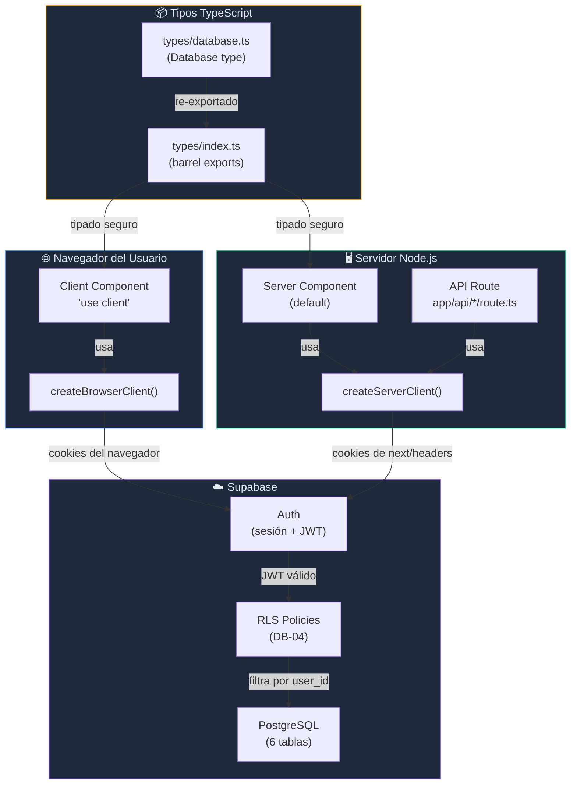
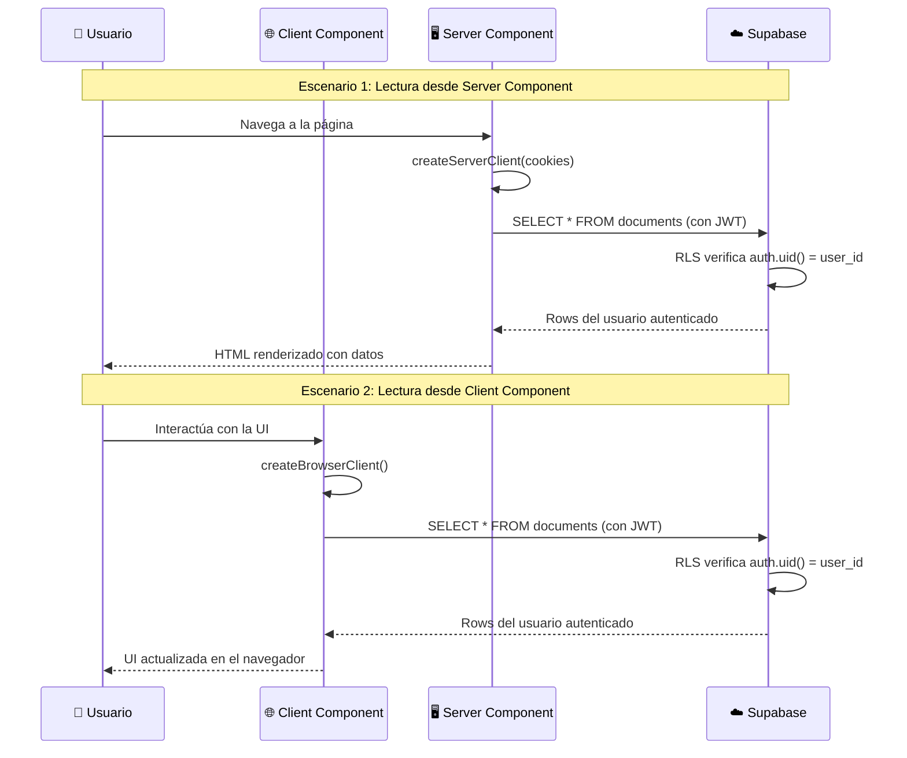

# FE-02 — Conexión con Supabase (Cliente + Servidor)

**Bloque:** 🌐 BLOQUE C — FRONTEND BASE (Next.js)  
**Guía anterior:** [FE-01 — Scaffold Next.js + TS + Tailwind + shadcn/ui](file:///c:/Users/jsife/OneDrive/Desktop/Repositorios/practica-testing/docs/guides/fe/FE-01.md)  
**Estado:** ⏳ Por implementar  
**Fecha:** Junio 2026

---

## Sección 1: 🎓 Introducción y Fundamentos Conceptuales

### ¿Dónde estamos?

En **FE-01** construimos los cimientos del frontend: Next.js 16 con App Router, TypeScript estricto, Tailwind CSS v4 y shadcn/ui. Tenemos una landing page funcional con un componente `Button` interactivo que demuestra que el stack base funciona. Sin embargo, nuestra app es **estática** — no se conecta a ninguna base de datos ni sabe quién es el usuario.

### ¿Qué vamos a lograr?

En esta guía vamos a **conectar Next.js con Supabase** para que nuestra app pueda leer y escribir datos reales. Piensa en esto como **instalar las tuberías** de un edificio: el edificio ya tiene estructura (FE-01), pero sin tuberías no hay agua. Después de esta guía, los datos fluirán entre tu base de datos y tu interfaz.

### ¿Por qué son DOS clientes de Supabase?

Esta es la pregunta más importante de esta guía, y la respuesta está en cómo funciona **Next.js App Router** internamente.

#### React Server Components (RSC) vs Client Components

Next.js App Router introduce un modelo de renderizado **híbrido**:

| Concepto | Server Component (RSC) | Client Component |
|---|---|---|
| **Dónde se ejecuta** | Solo en el servidor de Node.js | En el servidor (SSR) Y en el navegador |
| **Directiva** | Ninguna (es el default) | `'use client'` al inicio del archivo |
| **Puede usar hooks** | ❌ No (`useState`, `useEffect`, etc.) | ✅ Sí |
| **Puede acceder a cookies** | ✅ Sí (vía `next/headers`) | ❌ No directamente |
| **Puede acceder a `window`** | ❌ No existe en el servidor | ✅ Sí |
| **Tamaño del bundle** | 0 KB (no se envía al navegador) | Se incluye en el bundle JS |

Supabase necesita **autenticación basada en cookies** para saber quién es el usuario. El problema es que:

- En el **servidor**, las cookies se leen de los headers HTTP de la petición entrante usando `next/headers`.
- En el **navegador**, las cookies se leen del `document.cookie` del navegador.

Son **dos mecanismos completamente diferentes** para acceder a la misma información. Por eso necesitamos dos clientes:

```
┌─────────────────────────────────────────────────────────────┐
│                    Next.js App Router                        │
│                                                             │
│  ┌──────────────────────┐     ┌──────────────────────────┐  │
│  │  Server Component    │     │   Client Component       │  │
│  │  (se ejecuta en      │     │   (se ejecuta en el      │  │
│  │   Node.js)           │     │    navegador)            │  │
│  │                      │     │                          │  │
│  │  Usa: server.ts      │     │   Usa: client.ts         │  │
│  │  Lee cookies vía     │     │   Lee cookies vía        │  │
│  │  next/headers        │     │   document.cookie        │  │
│  └──────────┬───────────┘     └────────────┬─────────────┘  │
│             │                              │                │
│             └──────────┬───────────────────┘                │
│                        │                                    │
│                        ▼                                    │
│              ┌─────────────────┐                            │
│              │   Supabase DB   │                            │
│              │   (PostgreSQL)  │                            │
│              └─────────────────┘                            │
└─────────────────────────────────────────────────────────────┘
```

#### ¿Y la `service_role` key?

Recuerda de **DB-01**: la `SUPABASE_SERVICE_ROLE_KEY` **bypasea completamente RLS**. Esto significa que puede leer y escribir CUALQUIER dato de CUALQUIER usuario. Por eso:

- ✅ **Solo se usa en API Routes** (código del servidor que nunca llega al navegador)
- ❌ **NUNCA se usa en componentes** (ni Server ni Client)
- ❌ **NUNCA lleva prefijo** `NEXT_PUBLIC_`

En esta guía no usaremos la service_role key. Los dos clientes que crearemos usan la **anon key**, que respeta las políticas RLS que configuramos en **DB-04**.

### ¿Qué es `@supabase/ssr`?

El paquete `@supabase/ssr` es el adaptador oficial de Supabase para frameworks con Server-Side Rendering (SSR) como Next.js. Proporciona:

- `createBrowserClient()` → para componentes del navegador
- `createServerClient()` → para código del servidor, con manejo personalizado de cookies

Sin este paquete, Supabase no podría mantener la sesión del usuario sincronizada entre el servidor y el cliente.

---

## Sección 2: 📋 Prerequisitos y Verificación del Entorno

### Herramientas y Runtimes

Verifica cada uno ejecutando el comando en **PowerShell**:

| Prerequisito | Comando de verificación | Versión mínima |
|---|---|---|
| Node.js | `node --version` | v18.17+ |
| npm | `npm --version` | v9+ |
| TypeScript | `npx tsc --version` | v5+ |
| Git | `git --version` | v2.30+ |

### Dependencias npm (ya instaladas en FE-01)

Estos paquetes deben estar en tu `package.json`. Verifica con:

```powershell
cd c:\Users\jsife\OneDrive\Desktop\Repositorios\practica-testing\frontend
npm ls @supabase/supabase-js @supabase/ssr
```

**Salida esperada:**

```
frontend@0.1.0 c:\Users\jsife\OneDrive\Desktop\Repositorios\practica-testing\frontend
├── @supabase/ssr@0.12.x
└── @supabase/supabase-js@2.108.x
```

> [!IMPORTANT]
> Si alguno no aparece, instálalo antes de continuar:
> ```powershell
> npm install @supabase/supabase-js @supabase/ssr
> ```

### Entregables de guías anteriores que DEBEN existir

#### De FE-01 (Scaffold)

| Entregable | Ruta | Verificación |
|---|---|---|
| Proyecto Next.js funcional | `frontend/` | `npm run dev` sin errores |
| shadcn/ui configurado | `frontend/components.json` | Archivo existe con `"rsc": true` |
| Componente Button | `frontend/components/ui/button.tsx` | Archivo existe |
| Variables de entorno | `frontend/.env.local` | Contiene `NEXT_PUBLIC_SUPABASE_URL` |
| Alias `@/` configurado | `frontend/tsconfig.json` | `"@/*": ["./*"]` en `paths` |

#### De DB-01 (Credenciales)

| Entregable | Verificación |
|---|---|
| `NEXT_PUBLIC_SUPABASE_URL` en `.env.local` | Valor no vacío, empieza con `https://` |
| `NEXT_PUBLIC_SUPABASE_ANON_KEY` en `.env.local` | Valor no vacío, es un JWT |

#### De DB-02 (Schema)

| Entregable | Verificación |
|---|---|
| Tablas creadas en Supabase | Las 6 tablas visibles en Table Editor |
| Migración aplicada | `supabase/migrations/20260531183745_create_schema.sql` existe |

#### De DB-04 (RLS)

| Entregable | Verificación |
|---|---|
| RLS habilitado en todas las tablas | `supabase/migrations/20260601015125_create_rls_policies.sql` existe |
| Políticas CRUD creadas | Cada tabla tiene policies de SELECT, INSERT, UPDATE, DELETE |

### Verificación rápida de `.env.local`

Ejecuta en PowerShell desde la carpeta `frontend/`:

```powershell
Get-Content .env.local | Select-String "NEXT_PUBLIC_SUPABASE"
```

**Salida esperada (valores reales, no placeholders):**

```
NEXT_PUBLIC_SUPABASE_URL=https://czfmlczpzurrjfbwghmy.supabase.co
NEXT_PUBLIC_SUPABASE_ANON_KEY=eyJhbGciOiJIUzI1NiIs...
```

> [!CAUTION]
> Si ves `your-url-here` o `your-key-here`, reemplaza con los valores reales de tu proyecto Supabase (Dashboard → Settings → API).

---

## Sección 3: 📂 Estructura de Directorios del Proyecto

Después de completar esta guía, tu proyecto tendrá esta estructura. Los archivos marcados con `← NUEVO` son los que crearás en esta guía:

```
practica-testing/
│
├── 📁 backend/                          # (BE-01 a BE-06 — ya existe)
├── 📁 docs/
│   ├── 📁 guides/
│   │   ├── 📁 be/                       # Guías del backend
│   │   ├── 📁 db/                       # Guías de base de datos
│   │   │   ├── DB-01.md
│   │   │   ├── DB-02.md
│   │   │   ├── DB-03.md
│   │   │   └── DB-04.md
│   │   └── 📁 fe/                       # Guías del frontend
│   │       ├── FE-01.md
│   │       └── FE-02.md                 ← NUEVO (esta guía)
│   └── 📁 roadmap/
│       └── ISTQB_Guias_Implementacion.md
│
├── 📁 frontend/
│   ├── 📁 app/
│   │   ├── 📁 (auth)/                   # Grupo de rutas de auth (vacío, FE-03)
│   │   │   └── .gitkeep
│   │   ├── 📁 (dashboard)/              # Grupo de rutas del dashboard (vacío, FE-04)
│   │   │   └── .gitkeep
│   │   ├── favicon.ico
│   │   ├── globals.css                  # Tokens de diseño (FE-01)
│   │   ├── layout.tsx                   # Layout raíz (FE-01)
│   │   └── page.tsx                     # Landing page → SE MODIFICA
│   │
│   ├── 📁 components/
│   │   ├── 📁 shared/
│   │   │   └── .gitkeep
│   │   └── 📁 ui/
│   │       └── button.tsx               # shadcn/ui Button (FE-01)
│   │
│   ├── 📁 lib/
│   │   ├── 📁 supabase/
│   │   │   ├── client.ts                ← NUEVO — Cliente para el navegador
│   │   │   └── server.ts                ← NUEVO — Cliente para el servidor
│   │   └── utils.ts                     # Utilidad cn() de shadcn (FE-01)
│   │
│   ├── 📁 types/
│   │   ├── database.ts                  ← NUEVO — Tipos generados del schema
│   │   └── index.ts                     ← SE MODIFICA — Re-exporta tipos
│   │
│   ├── .env.local                       # Variables de entorno (DB-01)
│   ├── .env.example                     # Template sin secretos (FE-01)
│   ├── components.json                  # Config shadcn/ui (FE-01)
│   ├── next.config.ts                   # Config Next.js (FE-01)
│   ├── package.json                     # Dependencias (FE-01)
│   ├── postcss.config.mjs               # PostCSS (FE-01)
│   └── tsconfig.json                    # TypeScript config (FE-01)
│
└── 📁 supabase/
    ├── config.toml
    └── 📁 migrations/
        ├── 20260522183543_remote_schema.sql
        ├── 20260531183745_create_schema.sql    # Schema completo (DB-02)
        ├── 20260531221544_create_storage_bucket.sql  # Storage (DB-03)
        └── 20260601015125_create_rls_policies.sql    # RLS (DB-04)
```

### Resumen de cambios en esta guía

| Acción | Archivo |
|---|---|
| **CREAR** | `frontend/lib/supabase/client.ts` |
| **CREAR** | `frontend/lib/supabase/server.ts` |
| **CREAR** | `frontend/types/database.ts` |
| **MODIFICAR** | `frontend/types/index.ts` |
| **MODIFICAR** | `frontend/app/page.tsx` |

---

## Sección 4: 🎨 Diagrama de Arquitectura de Componentes

### Flujo de datos: Navegador ↔ Supabase



### Flujo de una petición autenticada



---

## Sección 5: 🛠️ Implementación Paso a Paso

---

### Paso A — Crear los tipos TypeScript del schema de la base de datos

**Archivo a crear:** `frontend/types/database.ts`  
**Ruta completa:** `c:\Users\jsife\OneDrive\Desktop\Repositorios\practica-testing\frontend\types\database.ts`

#### ¿Por qué tipos manuales y no generados automáticamente?

Supabase ofrece `supabase gen types typescript` para generar tipos automáticamente. Sin embargo, ese comando requiere:
1. Supabase CLI conectado al proyecto remoto
2. Que todas las migraciones estén sincronizadas

Para mantener el control pedagógico y entender exactamente qué tipo corresponde a cada columna, escribiremos los tipos manualmente basándonos en la migración `20260531183745_create_schema.sql` de **DB-02**. En un proyecto de producción, podrías usar el generador automático y revisar el output.

#### Código: `types/database.ts`

```typescript
// ============================================================
// types/database.ts — Tipos TypeScript del schema de Supabase
// ============================================================
// Estos tipos reflejan EXACTAMENTE las tablas creadas en DB-02.
// Cada tipo corresponde a una tabla de PostgreSQL, y cada
// propiedad corresponde a una columna.
//
// Convención de nombres:
//   - Row:    lo que recibes al hacer SELECT (lectura)
//   - Insert: lo que envías al hacer INSERT (crear)
//   - Update: lo que envías al hacer UPDATE (modificar)
//
// Los campos opcionales en Insert/Update usan "?" porque
// PostgreSQL les asigna un DEFAULT si no los envías.
// ============================================================

// ──────────────────────────────────────────────────────────────
// Tipos auxiliares (enums como union types)
// ──────────────────────────────────────────────────────────────

/** Estados válidos de un plan de estudio (CHECK constraint en DB) */
export type StudyPlanStatus = 'active' | 'completed' | 'abandoned';

/** Tipos de sesión válidos (CHECK constraint en DB) */
export type SessionType = 'morning' | 'night' | 'reinforcement' | 'mock_exam';

/** Métodos de enseñanza válidos (CHECK constraint en DB) */
export type MethodUsed = 'theory' | 'examples' | 'analogies';

/** Acciones del sistema adaptativo (CHECK constraint en DB) */
export type ActionTaken = 'advance' | 'reinforce' | 'restructure';

/** Estados de sesión válidos (CHECK constraint en DB) */
export type SessionStatus = 'pending' | 'active' | 'completed' | 'skipped';

/** Opciones de respuesta válidas (CHECK constraint en DB) */
export type AnswerOption = 'a' | 'b' | 'c' | 'd';

/** Niveles K del ISTQB (CHECK constraint en DB) */
export type LevelK = 'K1' | 'K2' | 'K3';

/** Estados de progreso de un tópico (CHECK constraint en DB) */
export type TopicProgressStatus = 'pending' | 'in_progress' | 'mastered' | 'failed';

// ──────────────────────────────────────────────────────────────
// TABLA 1: user_profiles
// Extiende auth.users con datos de perfil del negocio.
// Relación 1:1 con auth.users (el id ES el auth.users.id).
// ──────────────────────────────────────────────────────────────

export interface UserProfileRow {
  id: string;             // UUID — PK, referencia a auth.users(id)
  full_name: string | null;
  created_at: string;     // TIMESTAMPTZ como ISO string
}

export interface UserProfileInsert {
  id: string;             // Obligatorio: debe coincidir con auth.users(id)
  full_name?: string | null;
  created_at?: string;
}

export interface UserProfileUpdate {
  full_name?: string | null;
}

// ──────────────────────────────────────────────────────────────
// TABLA 2: documents
// Metadatos de PDFs subidos. El archivo físico está en Storage.
// ──────────────────────────────────────────────────────────────

/** Estructura esperada de topics_json (JSONB en PostgreSQL) */
export interface TopicEntry {
  text: string;
  level_k: LevelK;
  name?: string;
}

/** topics_json es un diccionario { "FL-1.1.1": TopicEntry, ... } */
export type TopicsJson = Record<string, TopicEntry>;

export interface DocumentRow {
  id: string;                       // UUID — PK, gen_random_uuid()
  user_id: string;                  // UUID — FK a auth.users(id)
  file_name: string;
  file_url: string;
  extracted_text: string | null;
  topics_json: TopicsJson | null;   // JSONB
  created_at: string;
}

export interface DocumentInsert {
  id?: string;                      // Opcional: PostgreSQL lo genera
  user_id: string;
  file_name: string;
  file_url: string;
  extracted_text?: string | null;
  topics_json?: TopicsJson | null;
  created_at?: string;
}

export interface DocumentUpdate {
  file_name?: string;
  file_url?: string;
  extracted_text?: string | null;
  topics_json?: TopicsJson | null;
}

// ──────────────────────────────────────────────────────────────
// TABLA 3: study_plans
// Plan de estudio adaptativo generado por la IA.
// ──────────────────────────────────────────────────────────────

export interface StudyPlanRow {
  id: string;
  user_id: string;
  document_id: string;              // FK a documents(id)
  objective_days: number;           // CHECK: 1-30
  start_date: string;               // DATE como ISO string
  estimated_end_date: string;
  actual_end_date: string | null;
  plan_json: Record<string, unknown>; // JSONB — estructura del plan
  status: StudyPlanStatus;
  created_at: string;
  updated_at: string;
}

export interface StudyPlanInsert {
  id?: string;
  user_id: string;
  document_id: string;
  objective_days?: number;
  start_date: string;
  estimated_end_date: string;
  actual_end_date?: string | null;
  plan_json: Record<string, unknown>;
  status?: StudyPlanStatus;
  created_at?: string;
  updated_at?: string;
}

export interface StudyPlanUpdate {
  objective_days?: number;
  estimated_end_date?: string;
  actual_end_date?: string | null;
  plan_json?: Record<string, unknown>;
  status?: StudyPlanStatus;
  updated_at?: string;
}

// ──────────────────────────────────────────────────────────────
// TABLA 4: sessions
// Sesiones individuales: mañana, noche, refuerzo o simulacro.
// ──────────────────────────────────────────────────────────────

export interface SessionRow {
  id: string;
  study_plan_id: string;            // FK a study_plans(id)
  user_id: string;
  topic_codes: string[];            // TEXT[] — Array nativo de PostgreSQL
  session_type: SessionType;
  day_number: number;
  scheduled_at: string | null;
  started_at: string | null;
  completed_at: string | null;
  duration_minutes: number;         // CHECK: > 0
  score_percent: number | null;     // CHECK: 0-100 o NULL
  attempt_number: number;
  method_used: MethodUsed;
  action_taken: ActionTaken | null; // NULL si no evaluada aún
  status: SessionStatus;
  theory_content: string | null;
  created_at: string;
}

export interface SessionInsert {
  id?: string;
  study_plan_id: string;
  user_id: string;
  topic_codes: string[];
  session_type: SessionType;
  day_number: number;
  scheduled_at?: string | null;
  started_at?: string | null;
  completed_at?: string | null;
  duration_minutes?: number;
  score_percent?: number | null;
  attempt_number?: number;
  method_used?: MethodUsed;
  action_taken?: ActionTaken | null;
  status?: SessionStatus;
  theory_content?: string | null;
  created_at?: string;
}

export interface SessionUpdate {
  topic_codes?: string[];
  scheduled_at?: string | null;
  started_at?: string | null;
  completed_at?: string | null;
  duration_minutes?: number;
  score_percent?: number | null;
  attempt_number?: number;
  method_used?: MethodUsed;
  action_taken?: ActionTaken | null;
  status?: SessionStatus;
  theory_content?: string | null;
}

// ──────────────────────────────────────────────────────────────
// TABLA 5: answers
// Respuestas individuales del quiz.
// ──────────────────────────────────────────────────────────────

/** Estructura del JSONB options_json: { a: "texto", b: "texto", ... } */
export type OptionsJson = Record<AnswerOption, string>;

export interface AnswerRow {
  id: string;
  session_id: string;               // FK a sessions(id)
  user_id: string;
  question_text: string;
  options_json: OptionsJson;        // JSONB
  correct_answer: AnswerOption;
  user_answer: AnswerOption;
  is_correct: boolean;
  topic_code: string;
  level_k: LevelK | null;
  explanation: string | null;
  created_at: string;
}

export interface AnswerInsert {
  id?: string;
  session_id: string;
  user_id: string;
  question_text: string;
  options_json: OptionsJson;
  correct_answer: AnswerOption;
  user_answer: AnswerOption;
  is_correct: boolean;
  topic_code: string;
  level_k?: LevelK | null;
  explanation?: string | null;
  created_at?: string;
}

export interface AnswerUpdate {
  explanation?: string | null;
}

// ──────────────────────────────────────────────────────────────
// TABLA 6: topic_progress
// Progreso individual por tópico ISTQB dentro de un plan.
// UNIQUE(user_id, study_plan_id, topic_code)
// ──────────────────────────────────────────────────────────────

export interface TopicProgressRow {
  id: string;
  user_id: string;
  study_plan_id: string;            // FK a study_plans(id)
  topic_code: string;               // Ej. "FL-1.1.1"
  topic_name: string | null;
  level_k: LevelK | null;
  attempts: number;
  best_score: number;               // CHECK: 0-100
  last_score: number;               // CHECK: 0-100
  status: TopicProgressStatus;
  mastered_at: string | null;
  updated_at: string;
}

export interface TopicProgressInsert {
  id?: string;
  user_id: string;
  study_plan_id: string;
  topic_code: string;
  topic_name?: string | null;
  level_k?: LevelK | null;
  attempts?: number;
  best_score?: number;
  last_score?: number;
  status?: TopicProgressStatus;
  mastered_at?: string | null;
  updated_at?: string;
}

export interface TopicProgressUpdate {
  topic_name?: string | null;
  level_k?: LevelK | null;
  attempts?: number;
  best_score?: number;
  last_score?: number;
  status?: TopicProgressStatus;
  mastered_at?: string | null;
  updated_at?: string;
}

// ──────────────────────────────────────────────────────────────
// Tipo maestro Database — compatible con supabase-js generics
// ──────────────────────────────────────────────────────────────
// Este tipo sigue la convención del generador oficial de Supabase.
// Se pasa como generic a createClient<Database>() para obtener
// autocompletado y validación de tipos en todas las queries.
// ──────────────────────────────────────────────────────────────

export interface Database {
  public: {
    Tables: {
      user_profiles: {
        Row: UserProfileRow;
        Insert: UserProfileInsert;
        Update: UserProfileUpdate;
      };
      documents: {
        Row: DocumentRow;
        Insert: DocumentInsert;
        Update: DocumentUpdate;
      };
      study_plans: {
        Row: StudyPlanRow;
        Insert: StudyPlanInsert;
        Update: StudyPlanUpdate;
      };
      sessions: {
        Row: SessionRow;
        Insert: SessionInsert;
        Update: SessionUpdate;
      };
      answers: {
        Row: AnswerRow;
        Insert: AnswerInsert;
        Update: AnswerUpdate;
      };
      topic_progress: {
        Row: TopicProgressRow;
        Insert: TopicProgressInsert;
        Update: TopicProgressUpdate;
      };
    };
  };
}
```

#### ¿Qué acabas de crear?

- **6 tipos `Row`**: representan lo que Supabase te devuelve al hacer SELECT
- **6 tipos `Insert`**: representan lo que envías al hacer INSERT (campos con `?` tienen DEFAULT en PostgreSQL)
- **6 tipos `Update`**: representan lo que envías al hacer UPDATE (todos opcionales porque puedes actualizar cualquier subconjunto)
- **1 tipo `Database`**: tipo maestro que engloba todo y se pasa como generic a `createClient<Database>()`
- **8 union types**: reflejan los CHECK constraints de la base de datos como tipos literales de TypeScript

**Entregable del Paso A:**
- [x] `frontend/types/database.ts` creado con todos los tipos

---

### Paso B — Actualizar el barrel de tipos

**Archivo a modificar:** `frontend/types/index.ts`  
**Ruta completa:** `c:\Users\jsife\OneDrive\Desktop\Repositorios\practica-testing\frontend\types\index.ts`

El archivo actual tiene un placeholder `BaseRecord`. Vamos a reemplazar su contenido para re-exportar todos los tipos de `database.ts`. El patrón "barrel" (barril) permite importar cualquier tipo desde `@/types` sin recordar el archivo exacto.

#### Código: `types/index.ts`

```typescript
// ============================================================
// types/index.ts — Barrel de exportaciones de tipos
// ============================================================
// Punto de entrada centralizado para TODOS los tipos TypeScript
// del proyecto. Cualquier componente o utilidad importa desde:
//
//   import type { UserProfileRow, DocumentRow } from "@/types";
//
// Ventajas del patrón barrel:
//   1. Los imports son más cortos y limpios
//   2. Si reorganizas archivos internos, solo cambias aquí
//   3. Un solo lugar para ver todos los tipos disponibles
// ============================================================

// Re-exportar TODOS los tipos de la base de datos
export type {
  // Union types (enums del negocio)
  StudyPlanStatus,
  SessionType,
  MethodUsed,
  ActionTaken,
  SessionStatus,
  AnswerOption,
  LevelK,
  TopicProgressStatus,

  // Tipos de JSON estructurado
  TopicEntry,
  TopicsJson,
  OptionsJson,

  // user_profiles
  UserProfileRow,
  UserProfileInsert,
  UserProfileUpdate,

  // documents
  DocumentRow,
  DocumentInsert,
  DocumentUpdate,

  // study_plans
  StudyPlanRow,
  StudyPlanInsert,
  StudyPlanUpdate,

  // sessions
  SessionRow,
  SessionInsert,
  SessionUpdate,

  // answers
  AnswerRow,
  AnswerInsert,
  AnswerUpdate,

  // topic_progress
  TopicProgressRow,
  TopicProgressInsert,
  TopicProgressUpdate,

  // Tipo maestro
  Database,
} from './database';
```

> [!NOTE]
> Usamos `export type` en vez de `export` porque son **solo tipos** — no generan código JavaScript. Esto es una best practice de TypeScript llamada **type-only exports** que ayuda al bundler a eliminarlos completamente del bundle de producción.

**Entregable del Paso B:**
- [x] `frontend/types/index.ts` modificado con re-exportaciones

---

### Paso C — Crear el cliente de Supabase para el navegador

**Archivo a crear:** `frontend/lib/supabase/client.ts`  
**Ruta completa:** `c:\Users\jsife\OneDrive\Desktop\Repositorios\practica-testing\frontend\lib\supabase\client.ts`

Este es el cliente que usarán los **Client Components** (archivos con `'use client'`). Utiliza `createBrowserClient` de `@supabase/ssr`, que internamente maneja las cookies del navegador (`document.cookie`) para mantener la sesión del usuario.

#### Código: `lib/supabase/client.ts`

```typescript
// ============================================================
// lib/supabase/client.ts — Cliente Supabase para el NAVEGADOR
// ============================================================
// Este cliente se usa EXCLUSIVAMENTE en Client Components
// (archivos marcados con 'use client').
//
// ¿Cómo maneja la sesión?
//   createBrowserClient() lee y escribe cookies directamente
//   en el navegador usando document.cookie. Supabase almacena
//   el access_token y refresh_token como cookies httpOnly
//   que se envían automáticamente en cada petición.
//
// ¿Por qué es una función y no una constante?
//   Porque cada componente que necesite Supabase debe llamar
//   a createClient() para obtener una instancia fresca.
//   @supabase/ssr implementa internamente un singleton para
//   evitar crear múltiples conexiones innecesarias.
//
// SEGURIDAD:
//   - Solo usa variables NEXT_PUBLIC_ (seguras para el navegador)
//   - NUNCA importar SUPABASE_SERVICE_ROLE_KEY aquí
//   - Las queries están protegidas por RLS (DB-04)
// ============================================================

import { createBrowserClient } from '@supabase/ssr';
import type { Database } from '@/types';

/**
 * Crea un cliente de Supabase para componentes del navegador.
 *
 * @example
 * ```tsx
 * 'use client';
 * import { createClient } from '@/lib/supabase/client';
 *
 * export default function MiComponente() {
 *   const supabase = createClient();
 *   // ... usar supabase.from('documents').select()
 * }
 * ```
 */
export function createClient() {
  // createBrowserClient<Database>() hace dos cosas:
  // 1. Crea la conexión con tu proyecto Supabase usando URL + anon key
  // 2. Pasa el tipo Database como generic para que TypeScript
  //    conozca las tablas y columnas al hacer queries
  return createBrowserClient<Database>(
    process.env.NEXT_PUBLIC_SUPABASE_URL!,
    process.env.NEXT_PUBLIC_SUPABASE_ANON_KEY!
  );
}
```

#### Detalle técnico: ¿Qué es el `!` después de `process.env`?

El operador `!` es el **non-null assertion** de TypeScript. Le dice al compilador: "yo sé que este valor NO es `undefined`". Lo usamos porque:

1. TypeScript tipa `process.env.X` como `string | undefined` (no sabe si la variable existe)
2. Nosotros **sabemos** que `.env.local` contiene estas variables (lo verificamos en los prerequisitos)
3. Sin el `!`, TypeScript se quejaría porque `createBrowserClient` requiere `string`, no `string | undefined`

> [!WARNING]
> Si olvidas agregar las variables a `.env.local`, la app compilará sin errores pero **fallará en runtime** con un error como `Invalid URL: undefined`. Siempre verifica tus variables de entorno.

**Entregable del Paso C:**
- [x] `frontend/lib/supabase/client.ts` creado
- [x] Archivo `.gitkeep` en `lib/supabase/` ya no es necesario (puedes borrarlo o dejarlo)

---

### Paso D — Crear el cliente de Supabase para el servidor

**Archivo a crear:** `frontend/lib/supabase/server.ts`  
**Ruta completa:** `c:\Users\jsife\OneDrive\Desktop\Repositorios\practica-testing\frontend\lib\supabase\server.ts`

Este es el cliente más complejo. Los **Server Components** y **API Routes** no tienen acceso a `document.cookie` (no hay navegador). En su lugar, acceden a las cookies a través de la API `cookies()` de `next/headers`.

#### Código: `lib/supabase/server.ts`

```typescript
// ============================================================
// lib/supabase/server.ts — Cliente Supabase para el SERVIDOR
// ============================================================
// Este cliente se usa en:
//   - Server Components (el default en App Router)
//   - API Routes (app/api/*/route.ts)
//   - Server Actions ('use server')
//
// ¿Cómo maneja la sesión?
//   createServerClient() recibe callbacks personalizados para
//   leer y escribir cookies usando la API de next/headers.
//   Esto es necesario porque en el servidor no existe
//   document.cookie — las cookies vienen en los HTTP headers.
//
// ¿Por qué es async?
//   Porque cookies() de next/headers es asíncrono en Next.js 15+.
//   Devuelve una Promise que resuelve al cookie store.
//
// SEGURIDAD:
//   - Solo usa variables NEXT_PUBLIC_ (anon key)
//   - RLS protege los datos (DB-04)
//   - Para operaciones admin, crear un cliente separado con
//     service_role key (se hará en UP-02)
// ============================================================

import { createServerClient } from '@supabase/ssr';
import { cookies } from 'next/headers';
import type { Database } from '@/types';

/**
 * Crea un cliente de Supabase para código del servidor.
 * DEBE llamarse con `await` porque accede a cookies asíncronas.
 *
 * @example
 * ```tsx
 * // En un Server Component (app/dashboard/page.tsx)
 * import { createClient } from '@/lib/supabase/server';
 *
 * export default async function DashboardPage() {
 *   const supabase = await createClient();
 *   const { data } = await supabase.from('documents').select();
 *   // ...
 * }
 * ```
 *
 * @example
 * ```typescript
 * // En una API Route (app/api/documents/route.ts)
 * import { createClient } from '@/lib/supabase/server';
 *
 * export async function GET() {
 *   const supabase = await createClient();
 *   const { data, error } = await supabase.from('documents').select();
 *   return Response.json({ data, error });
 * }
 * ```
 */
export async function createClient() {
  // 1. Obtener el cookie store de Next.js.
  //    En Next.js 15+, cookies() retorna una Promise.
  const cookieStore = await cookies();

  // 2. Crear el cliente Supabase con manejo personalizado de cookies.
  //    createServerClient necesita saber CÓMO leer y escribir cookies
  //    en el entorno del servidor, porque cada framework lo hace diferente.
  return createServerClient<Database>(
    process.env.NEXT_PUBLIC_SUPABASE_URL!,
    process.env.NEXT_PUBLIC_SUPABASE_ANON_KEY!,
    {
      cookies: {
        // ─── Leer todas las cookies ───
        // Supabase llama a getAll() para encontrar sus cookies de sesión
        // (sb-<ref>-auth-token, sb-<ref>-auth-token-code-verifier, etc.)
        getAll() {
          return cookieStore.getAll();
        },

        // ─── Escribir cookies ───
        // Supabase llama a setAll() cuando necesita:
        //   - Guardar un nuevo access_token después de un refresh
        //   - Establecer la sesión después de un login
        //   - Limpiar cookies después de un logout
        setAll(cookiesToSet) {
          try {
            cookiesToSet.forEach(({ name, value, options }) =>
              cookieStore.set(name, value, options)
            );
          } catch {
            // ─── ¿Por qué ignoramos el error? ───
            // En Server Components, las cookies son READ-ONLY.
            // Next.js lanza un error si intentas escribir cookies
            // desde un Server Component (solo se pueden escribir
            // desde API Routes, Server Actions o Middleware).
            //
            // Esto es ESPERADO y SEGURO: si Supabase necesita
            // refrescar el token durante un Server Component render,
            // el refresh se completará en la siguiente petición
            // que pase por el Middleware (FE-03).
            //
            // El catch vacío evita que la app crashee en estos
            // casos normales de operación.
          }
        },
      },
    }
  );
}
```

#### ¿Por qué el `catch` vacío no es un anti-patrón aquí?

Normalmente, ignorar errores es mala práctica. Pero este es un caso especial documentado por Supabase:

1. **Server Components** solo pueden **leer** cookies, no escribirlas
2. Supabase a veces intenta escribir cookies para refrescar tokens
3. Next.js lanza un error cuando detecta escritura de cookies en un Server Component
4. El error es **esperado** y no afecta la funcionalidad
5. El token se refrescará correctamente en la siguiente petición que pase por el **Middleware** (que crearemos en FE-03)

**Entregable del Paso D:**
- [x] `frontend/lib/supabase/server.ts` creado

---

### Paso E — Verificar que los clientes compilan correctamente

Antes de conectar los clientes a componentes, verifiquemos que TypeScript está contento con nuestro código.

**Ejecuta en PowerShell:**

```powershell
cd c:\Users\jsife\OneDrive\Desktop\Repositorios\practica-testing\frontend
npx tsc --noEmit
```

**Salida esperada:**

```
(sin output = sin errores)
```

Si ves errores, las causas más probables son:

| Error | Causa | Solución |
|---|---|---|
| `Cannot find module '@/types'` | Alias `@/` no configurado | Verificar `paths` en `tsconfig.json` |
| `Cannot find module '@supabase/ssr'` | Paquete no instalado | `npm install @supabase/ssr` |
| `Type 'Database' is not generic` | Importación incorrecta | Verificar que `Database` se exporta desde `types/database.ts` |

---

### Paso F — Modificar la página principal para probar la conexión del servidor

**Archivo a modificar:** `frontend/app/page.tsx`  
**Ruta completa:** `c:\Users\jsife\OneDrive\Desktop\Repositorios\practica-testing\frontend\app\page.tsx`

Vamos a convertir la landing page para que demuestre **ambos tipos de conexión**: Server Component leyendo datos, y un Client Component haciendo lo mismo desde el navegador.

La página principal será un **Server Component** (sin `'use client'`) que lee datos de Supabase en el servidor. Además, incluirá un Client Component embebido que lee datos desde el navegador.

#### Código: `app/page.tsx`

```tsx
// ============================================================
// app/page.tsx — Página principal con prueba de conexión Supabase
// ============================================================
// Esta página demuestra DOS formas de conectar con Supabase:
//
// 1. SERVER COMPONENT (este archivo):
//    - Se ejecuta en Node.js durante el render
//    - Usa createClient() de lib/supabase/server.ts
//    - Los datos llegan como HTML (sin JS en el bundle)
//
// 2. CLIENT COMPONENT (SupabaseClientTest embebido):
//    - Se ejecuta en el navegador del usuario
//    - Usa createClient() de lib/supabase/client.ts
//    - Los datos se cargan después de la hidratación
//
// NOTA: No hay 'use client' aquí → es Server Component por default.
// ============================================================

import { createClient } from '@/lib/supabase/server';
import { SupabaseClientTest } from './supabase-client-test';

export default async function HomePage() {
  // ─── Conexión desde Server Component ───
  // await es necesario porque createClient() del servidor es async
  const supabase = await createClient();

  // Intentar leer la tabla documents.
  // Si no hay usuario autenticado, RLS bloqueará la lectura
  // y data será un array vacío (no un error).
  const { data: documents, error } = await supabase
    .from('documents')
    .select('id, file_name, created_at')
    .limit(5);

  // También verificar si hay una sesión activa
  const { data: { user } } = await supabase.auth.getUser();

  return (
    <main className="flex min-h-screen flex-col items-center justify-center bg-gradient-to-b from-slate-950 via-slate-900 to-slate-950 text-white">
      <div className="mx-auto max-w-2xl px-6 text-center">
        {/* Badge de estado */}
        <div className="mb-8 inline-flex items-center rounded-full border border-slate-700 bg-slate-800/50 px-4 py-1.5 text-sm text-slate-300">
          <span className="mr-2 inline-block h-2 w-2 rounded-full bg-emerald-400 animate-pulse" />
          FE-02 Completado — Supabase conectado
        </div>

        {/* Título principal */}
        <h1 className="mb-4 text-5xl font-bold tracking-tight sm:text-6xl">
          ISTQB{" "}
          <span className="bg-gradient-to-r from-blue-400 to-emerald-400 bg-clip-text text-transparent">
            Study Agent
          </span>
        </h1>

        {/* Subtítulo */}
        <p className="mb-8 text-lg leading-relaxed text-slate-400">
          Tu tutor inteligente para la certificación ISTQB® Foundation Level
          v4.0. Estudio adaptativo impulsado por IA con sesiones personalizadas
          de teoría y quiz.
        </p>

        {/* Stack tecnológico */}
        <div className="mb-10 flex flex-wrap items-center justify-center gap-3 text-sm text-slate-500">
          <span className="rounded-md border border-slate-700 px-3 py-1">Next.js 16</span>
          <span className="rounded-md border border-slate-700 px-3 py-1">TypeScript</span>
          <span className="rounded-md border border-slate-700 px-3 py-1">Tailwind CSS</span>
          <span className="rounded-md border border-slate-700 px-3 py-1">shadcn/ui</span>
          <span className="rounded-md border border-emerald-700 bg-emerald-900/30 px-3 py-1 text-emerald-400">
            ✓ Supabase
          </span>
          <span className="rounded-md border border-slate-700 px-3 py-1">OpenAI</span>
        </div>

        {/* ════════════════════════════════════════════════════ */}
        {/* SECCIÓN 1: Resultado del Server Component           */}
        {/* ════════════════════════════════════════════════════ */}
        <div className="mb-8 rounded-xl border border-slate-700 bg-slate-800/50 p-6 text-left">
          <h2 className="mb-4 text-lg font-semibold text-blue-400">
            🖥️ Server Component — Conexión desde el servidor
          </h2>

          {/* Estado de autenticación */}
          <div className="mb-4 rounded-lg bg-slate-900/50 p-3">
            <p className="text-sm text-slate-400">
              <span className="font-medium text-slate-300">Sesión activa:</span>{' '}
              {user ? (
                <span className="text-emerald-400">{user.email}</span>
              ) : (
                <span className="text-amber-400">No autenticado (normal — auth se configura en FE-03)</span>
              )}
            </p>
          </div>

          {/* Resultado de la query */}
          {error ? (
            <div className="rounded-lg bg-red-900/30 border border-red-700 p-3">
              <p className="text-sm text-red-400">
                <span className="font-medium">Error:</span> {error.message}
              </p>
              <p className="mt-1 text-xs text-red-500">
                Código: {error.code} — Detalle: {error.details}
              </p>
            </div>
          ) : (
            <div className="rounded-lg bg-emerald-900/20 border border-emerald-800 p-3">
              <p className="text-sm text-emerald-400">
                ✅ Conexión exitosa al servidor de Supabase
              </p>
              <p className="mt-1 text-xs text-slate-500">
                Documentos encontrados: {documents?.length ?? 0}
                {documents?.length === 0 && ' (tabla vacía o sin sesión — esperado en esta etapa)'}
              </p>
            </div>
          )}

          <p className="mt-3 text-xs text-slate-600">
            Este bloque se renderizó en el servidor — cero JavaScript enviado al navegador para esta sección.
          </p>
        </div>

        {/* ════════════════════════════════════════════════════ */}
        {/* SECCIÓN 2: Resultado del Client Component           */}
        {/* ════════════════════════════════════════════════════ */}
        <SupabaseClientTest />

        {/* Footer */}
        <div className="mt-16 border-t border-slate-800 pt-8 text-sm text-slate-600">
          <p>ISTQB Study Agent — Bloque C: Frontend Base</p>
          <p className="mt-1">Próximo paso: FE-03 — Auth: registro, login, logout, middleware</p>
        </div>
      </div>
    </main>
  );
}
```

**Entregable del Paso F:**
- [x] `frontend/app/page.tsx` modificado (Server Component con conexión a Supabase)

---

### Paso G — Crear el componente Client de prueba

**Archivo a crear:** `frontend/app/supabase-client-test.tsx`  
**Ruta completa:** `c:\Users\jsife\OneDrive\Desktop\Repositorios\practica-testing\frontend\app\supabase-client-test.tsx`

Este es un **Client Component** temporal que demuestra la conexión desde el navegador. Lo eliminaremos o reemplazaremos en guías futuras.

#### Código: `app/supabase-client-test.tsx`

```tsx
'use client';

// ============================================================
// app/supabase-client-test.tsx — Prueba de Supabase desde el navegador
// ============================================================
// 'use client' es OBLIGATORIO aquí porque:
//   - Usamos useState para manejar el estado de la prueba
//   - Usamos useEffect para ejecutar la query al montar
//   - Usamos event handlers (onClick)
//
// Este componente se renderiza en el navegador y usa el cliente
// de lib/supabase/client.ts (que usa document.cookie).
// ============================================================

import { useEffect, useState } from 'react';
import { createClient } from '@/lib/supabase/client';
import { Button } from '@/components/ui/button';

// Definimos una interfaz para el estado del test
interface TestResult {
  status: 'idle' | 'loading' | 'success' | 'error';
  documentCount: number;
  userEmail: string | null;
  errorMessage: string | null;
}

export function SupabaseClientTest() {
  // Estado local del componente — controla qué se muestra en la UI
  const [result, setResult] = useState<TestResult>({
    status: 'idle',
    documentCount: 0,
    userEmail: null,
    errorMessage: null,
  });

  // ─── Función para ejecutar la prueba de conexión ───
  async function runConnectionTest() {
    setResult(prev => ({ ...prev, status: 'loading' }));

    try {
      // Crear una instancia del cliente Supabase para el navegador.
      // Internamente usa document.cookie para leer la sesión.
      const supabase = createClient();

      // 1. Verificar si hay sesión activa
      const { data: { user } } = await supabase.auth.getUser();

      // 2. Intentar leer la tabla documents
      // Si no hay sesión, RLS devuelve array vacío (no error)
      const { data: documents, error } = await supabase
        .from('documents')
        .select('id, file_name, created_at')
        .limit(5);

      if (error) {
        setResult({
          status: 'error',
          documentCount: 0,
          userEmail: null,
          errorMessage: `${error.message} (${error.code})`,
        });
        return;
      }

      setResult({
        status: 'success',
        documentCount: documents?.length ?? 0,
        userEmail: user?.email ?? null,
        errorMessage: null,
      });
    } catch (err) {
      // Error de red o configuración — no un error de Supabase
      setResult({
        status: 'error',
        documentCount: 0,
        userEmail: null,
        errorMessage: err instanceof Error ? err.message : 'Error desconocido',
      });
    }
  }

  // ─── Ejecutar la prueba automáticamente al montar ───
  // useEffect con [] se ejecuta UNA vez al montar el componente.
  // Es el equivalente de "cuando el componente aparece en pantalla".
  useEffect(() => {
    runConnectionTest();
  }, []);

  return (
    <div className="mb-8 rounded-xl border border-slate-700 bg-slate-800/50 p-6 text-left">
      <h2 className="mb-4 text-lg font-semibold text-purple-400">
        🌐 Client Component — Conexión desde el navegador
      </h2>

      {/* Estado de la prueba */}
      {result.status === 'loading' && (
        <div className="rounded-lg bg-slate-900/50 p-3">
          <p className="text-sm text-slate-400 animate-pulse">
            ⏳ Conectando con Supabase desde el navegador...
          </p>
        </div>
      )}

      {result.status === 'error' && (
        <div className="rounded-lg bg-red-900/30 border border-red-700 p-3">
          <p className="text-sm text-red-400">
            <span className="font-medium">Error:</span> {result.errorMessage}
          </p>
        </div>
      )}

      {result.status === 'success' && (
        <div className="space-y-3">
          {/* Estado de autenticación */}
          <div className="rounded-lg bg-slate-900/50 p-3">
            <p className="text-sm text-slate-400">
              <span className="font-medium text-slate-300">Sesión activa:</span>{' '}
              {result.userEmail ? (
                <span className="text-emerald-400">{result.userEmail}</span>
              ) : (
                <span className="text-amber-400">
                  No autenticado (normal — auth se configura en FE-03)
                </span>
              )}
            </p>
          </div>

          {/* Resultado de la query */}
          <div className="rounded-lg bg-emerald-900/20 border border-emerald-800 p-3">
            <p className="text-sm text-emerald-400">
              ✅ Conexión exitosa al navegador de Supabase
            </p>
            <p className="mt-1 text-xs text-slate-500">
              Documentos encontrados: {result.documentCount}
              {result.documentCount === 0 &&
                ' (tabla vacía o sin sesión — esperado en esta etapa)'}
            </p>
          </div>
        </div>
      )}

      {/* Botón para re-ejecutar la prueba */}
      <div className="mt-4 flex items-center gap-3">
        <Button
          variant="outline"
          size="sm"
          onClick={runConnectionTest}
          disabled={result.status === 'loading'}
          className="border-slate-700 text-slate-300 hover:bg-slate-700"
        >
          🔄 Re-ejecutar test
        </Button>
        <span className="text-xs text-slate-600">
          Este bloque se ejecuta en el navegador — usa JavaScript del bundle del cliente.
        </span>
      </div>
    </div>
  );
}
```

#### Diferencias clave vs la sección del Server Component

| Aspecto | Server (Paso F) | Client (Paso G) |
|---|---|---|
| Directiva | Ninguna (default) | `'use client'` |
| Import del cliente | `from '@/lib/supabase/server'` | `from '@/lib/supabase/client'` |
| Llamada al cliente | `await createClient()` (async) | `createClient()` (sync) |
| Cuándo se ejecuta | Durante el render en Node.js | Después de la hidratación en el navegador |
| Estado | No (Server Components no tienen estado) | Sí (`useState`) |
| Efectos | No | Sí (`useEffect`) |
| Bundle impact | 0 KB | Se incluye en el bundle JS |

**Entregable del Paso G:**
- [x] `frontend/app/supabase-client-test.tsx` creado

---

### Paso H — Eliminar el archivo `.gitkeep` de `lib/supabase/`

Ahora que la carpeta `lib/supabase/` tiene archivos reales, el `.gitkeep` ya no es necesario.

```powershell
cd c:\Users\jsife\OneDrive\Desktop\Repositorios\practica-testing\frontend
Remove-Item lib\supabase\.gitkeep
```

**Salida esperada:**

```
(sin output = archivo eliminado correctamente)
```

**Entregable del Paso H:**
- [x] `frontend/lib/supabase/.gitkeep` eliminado

---

## Sección 6: ✅ Checkpoints de Verificación

### Test 1: Compilación sin errores

```powershell
cd c:\Users\jsife\OneDrive\Desktop\Repositorios\practica-testing\frontend
npx tsc --noEmit
```

**Resultado esperado:** Sin output (0 errores).

### Test 2: Dev server funcional

```powershell
cd c:\Users\jsife\OneDrive\Desktop\Repositorios\practica-testing\frontend
npm run dev
```

**Resultado esperado:**

```
   ▲ Next.js 16.x.x
   - Local:        http://localhost:3000
   - Environments: .env.local

 ✓ Starting...
 ✓ Ready in X.Xs
```

### Test 3: Verificación visual en el navegador

Abre **http://localhost:3000** en tu navegador. Deberías ver:

1. **Badge de estado**: Un chip verde pulsante que dice "FE-02 Completado — Supabase conectado"
2. **Título**: "ISTQB Study Agent" con gradiente azul→verde
3. **Stack badges**: 6 chips, el de "Supabase" ahora tiene borde verde y check mark
4. **Bloque azul (Server Component)**:
   - Título: "🖥️ Server Component — Conexión desde el servidor"
   - Sesión: "No autenticado (normal — auth se configura en FE-03)" en amarillo
   - Resultado: "✅ Conexión exitosa al servidor de Supabase" en verde
   - Documentos: "0 (tabla vacía o sin sesión — esperado en esta etapa)"
5. **Bloque púrpura (Client Component)**:
   - Título: "🌐 Client Component — Conexión desde el navegador"
   - Mismo patrón de sesión y resultado que el bloque azul
   - Botón "🔄 Re-ejecutar test" funcional
6. **Footer**: "Próximo paso: FE-03 — Auth: registro, login, logout, middleware"

### Test 4: Verificar que NO hay errores en la consola del navegador

Abre **DevTools** (F12) → pestaña **Console**. No deberías ver errores rojos. Warnings de hidratación son aceptables en desarrollo.

### Test 5: Verificar el botón "Re-ejecutar test"

Haz click en el botón "🔄 Re-ejecutar test". Deberías ver:

1. El texto cambia brevemente a "⏳ Conectando..." con animación de pulso
2. Regresa a "✅ Conexión exitosa" después de unos milisegundos

### Test 6: Verificar que las variables de entorno NO se filtran al bundle

Abre **DevTools** → **Sources** → busca en los archivos del bundle cualquier referencia a `SUPABASE_SERVICE_ROLE_KEY` o `OPENAI_API_KEY`. **No deben aparecer**.

Las únicas variables que deben estar en el bundle son:
- `NEXT_PUBLIC_SUPABASE_URL`
- `NEXT_PUBLIC_SUPABASE_ANON_KEY`

### Test 7: Verificar autocompletado de TypeScript

En tu editor (VS Code), abre cualquier archivo y escribe:

```typescript
import { createClient } from '@/lib/supabase/client';

const supabase = createClient();
supabase.from('
```

Al llegar a la comilla dentro de `.from('')`, deberías ver el autocompletado mostrando las 6 tablas:
- `user_profiles`
- `documents`
- `study_plans`
- `sessions`
- `answers`
- `topic_progress`

Esto confirma que el tipo `Database` está funcionando correctamente con los generics de Supabase.

### Checklist de entregables completa

| # | Entregable | Estado |
|---|---|---|
| 1 | `frontend/types/database.ts` — Tipos de las 6 tablas | ☐ |
| 2 | `frontend/types/index.ts` — Barrel con re-exportaciones | ☐ |
| 3 | `frontend/lib/supabase/client.ts` — Cliente del navegador | ☐ |
| 4 | `frontend/lib/supabase/server.ts` — Cliente del servidor | ☐ |
| 5 | `frontend/app/page.tsx` — Página con test del servidor | ☐ |
| 6 | `frontend/app/supabase-client-test.tsx` — Componente test del cliente | ☐ |
| 7 | `lib/supabase/.gitkeep` eliminado | ☐ |
| 8 | `npx tsc --noEmit` sin errores | ☐ |
| 9 | `npm run dev` sin errores | ☐ |
| 10 | Ambos bloques muestran "✅ Conexión exitosa" en el navegador | ☐ |
| 11 | Autocompletado de tablas funciona en el editor | ☐ |
| 12 | Ningún secreto privado en el bundle del frontend | ☐ |

---

## Sección 7: 🚨 Troubleshooting — Problemas Comunes

| # | Problema | Causa Probable | Solución |
|---|---|---|---|
| 1 | `Error: Invalid URL: undefined` al cargar la página | Las variables `NEXT_PUBLIC_SUPABASE_URL` o `NEXT_PUBLIC_SUPABASE_ANON_KEY` no están definidas en `.env.local` | Verificar que `.env.local` existe en `frontend/` (no en la raíz del proyecto). Reiniciar `npm run dev` después de modificar `.env.local` — Next.js carga las variables de entorno al iniciar. |
| 2 | `Module not found: Can't resolve '@/types'` | El alias `@/` no está configurado en `tsconfig.json` | Abrir `frontend/tsconfig.json` y verificar que existe: `"paths": { "@/*": ["./*"] }` |
| 3 | `Module not found: Can't resolve '@supabase/ssr'` | El paquete `@supabase/ssr` no está instalado | Ejecutar: `npm install @supabase/ssr` en la carpeta `frontend/` |
| 4 | El Server Component muestra error de conexión pero el Client funciona | El servidor Next.js no puede resolver el DNS de Supabase | Verificar que `NEXT_PUBLIC_SUPABASE_URL` empieza con `https://` y no tiene espacios. Verificar la conexión a internet del servidor. |
| 5 | `TypeError: cookies is not a function` | Versión incorrecta de `@supabase/ssr` o Next.js | Verificar que usas `@supabase/ssr@0.12+` y `next@15+`. En Next.js 15+, `cookies()` es async y debe llevar `await`. |
| 6 | El autocompletado de tablas no aparece en VS Code | TypeScript Language Server no ha indexado los nuevos tipos | Ejecutar `Cmd+Shift+P` → "TypeScript: Restart TS Server". Si persiste, cerrar y reabrir VS Code. |
| 7 | `RLS policy violation` o datos vacíos inesperados | No hay usuario autenticado → RLS bloquea todo | **Esto es esperado en FE-02.** La autenticación se configura en FE-03. Sin sesión activa, RLS devuelve datos vacíos (no error). |
| 8 | `Property 'from' does not exist on type 'SupabaseClient'` | El generic `Database` no se está pasando correctamente al crear el cliente | Verificar que `createBrowserClient<Database>(...)` y `createServerClient<Database>(...)` incluyen `<Database>` como generic. |
| 9 | `Error: Hydration failed because the server rendered HTML didn't match the client` | Datos dinámicos diferentes entre servidor y cliente (ej. `Date.now()`) | No estamos usando datos dinámicos en este paso, pero si aparece, verifica que no haya código que genere valores diferentes en servidor vs cliente. |
| 10 | La página se queda en blanco sin errores visibles | Error silencioso en un Server Component | Abrir la terminal de `npm run dev` y revisar los logs del servidor. Los errores de Server Components aparecen ahí, no en el navegador. |

---

## Sección 8: 📝 Resumen y Próximo Paso

### Lo que lograste en esta guía

1. **Creaste `types/database.ts`** con los tipos TypeScript de las 6 tablas de Supabase, incluyendo 8 union types que reflejan los CHECK constraints de DB-02
2. **Actualizaste `types/index.ts`** como barrel de exportaciones para imports limpios desde `@/types`
3. **Creaste `lib/supabase/client.ts`** — el cliente para componentes del navegador que usa `createBrowserClient` de `@supabase/ssr`
4. **Creaste `lib/supabase/server.ts`** — el cliente para Server Components y API Routes que usa `createServerClient` con manejo personalizado de cookies
5. **Modificaste `app/page.tsx`** para demostrar la conexión desde un Server Component con datos reales de Supabase
6. **Creaste `app/supabase-client-test.tsx`** para demostrar la conexión desde un Client Component con `useState`, `useEffect` y event handlers
7. **Verificaste** que TypeScript compila sin errores, que ambos clientes se conectan exitosamente a Supabase, y que ningún secreto privado se filtra al bundle del frontend

### Conceptos clave que aprendiste

- La diferencia entre **Server Components** y **Client Components** en Next.js App Router
- Por qué Supabase necesita **dos clientes diferentes** (cookies del servidor vs del navegador)
- Cómo funciona `@supabase/ssr` para mantener la sesión sincronizada
- El patrón **barrel** para organizar exportaciones de tipos
- Cómo TypeScript **generics** (`createClient<Database>()`) proporcionan autocompletado

### Validar tu progreso

Puedes usar el validador de pasos para confirmar que todo está correcto:

> 💡 **Tip:** Usa el skill `istqb-step-validator` para validar tu progreso contra esta guía.

### Próximo paso: FE-03 — Auth: registro, login, logout, middleware

En la siguiente guía configuraremos el **sistema de autenticación completo**:

- **Página `/login`** con formulario de email + contraseña
- **Página `/register`** con formulario de registro
- **`middleware.ts`** que protege rutas privadas (`/dashboard`, `/setup`, `/session`)
- **Redirect automático**: sin sesión → `/login`, con sesión → `/dashboard`
- **Logout** desde el header

> [!IMPORTANT]
> **Dependencia de DB-05:** FE-03 requiere que **DB-05 (Supabase Auth Configuración)** esté completada. Verifica que el provider Email/Password esté habilitado en Supabase y que exista el trigger para crear `user_profiles` automáticamente. Si DB-05 no está lista, complétala antes de iniciar FE-03.

---

*Guía FE-02 — Junio 2026*  
*Usar junto con: [ISTQB_Guias_Implementacion.md](file:///c:/Users/jsife/OneDrive/Desktop/Repositorios/practica-testing/docs/roadmap/ISTQB_Guias_Implementacion.md)*
