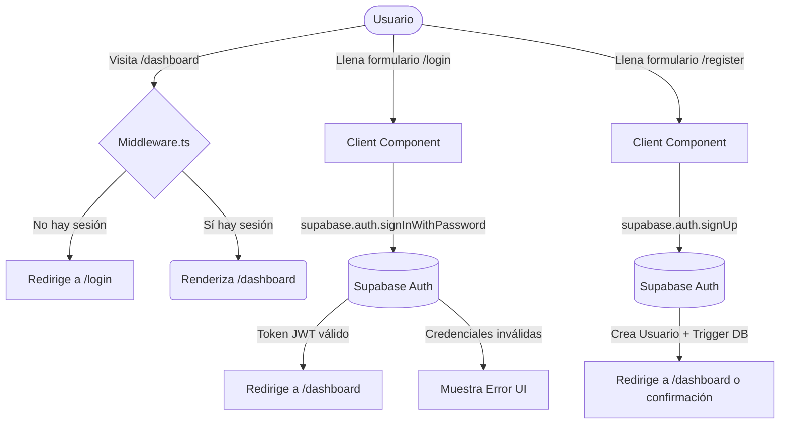

# FE-03 — Auth: Registro, Login, Logout y Middleware

**Bloque:** 🌐 BLOQUE C — FRONTEND BASE (Next.js)  
**Guía anterior:** [FE-02 — Conexión con Supabase](file:///c:/Users/jsife/OneDrive/Desktop/Repositorios/practica-testing/docs/guides/fe/FE-02.md)  
**Dependencias:** FE-01, FE-02, DB-05  
**Estado:** ⏳ Por implementar  
**Fecha:** Junio 2026

---

## Sección 1: 🎓 Introducción y Fundamentos Conceptuales

### ¿Dónde estamos?
En **FE-02** configuramos exitosamente los clientes de Supabase para el servidor y el cliente. En **DB-05**, configuraste Supabase Auth y el trigger para la creación de perfiles. Sin embargo, nuestra aplicación aún no tiene puertas. Cualquier persona puede entrar a cualquier lugar, y no tenemos forma de identificar a los usuarios.

### ¿Qué vamos a lograr?
En esta guía, vamos a construir el sistema de autenticación completo usando **Supabase Auth SSR** en Next.js. Crearemos las páginas de registro y login, implementaremos un servidor intermedio (Middleware) para proteger las rutas privadas, y manejaremos el flujo de sesión.

### Concepto Clave: El Middleware en Next.js
En el contexto de Next.js App Router, el **Middleware** es una función que se ejecuta **antes** de que una petición alcance tu página o API Route. Es el lugar perfecto para verificar la autenticación:
1. El usuario intenta acceder a `/dashboard`.
2. El Middleware intercepta la petición.
3. Lee la cookie de sesión de Supabase.
4. Si la sesión existe, deja pasar la petición. Si no existe, redirige instantáneamente a `/login`.

Además, el Middleware de Supabase SSR se encarga de **refrescar silenciosamente los tokens expirados**, actualizando las cookies antes de que lleguen a tus Server Components. ¡Es magia pura!

---

## Sección 2: 📋 Prerequisitos y Verificación del Entorno

Asegúrate de tener listos los entregables de las guías anteriores:

| Prerequisito | Verificación |
|---|---|
| **Clientes de Supabase** | `lib/supabase/client.ts` y `server.ts` existen. |
| **Trigger de Base de Datos** | La guía **DB-05** debe estar completada y aplicada (`supabase db push`). |
| **Componente Input (shadcn)** | Necesitamos el componente `Input` y `Label` para los formularios. |

### Instalación de componentes UI faltantes

Antes de empezar, instalaremos los componentes de shadcn/ui necesarios para construir formularios elegantes. Ejecuta en tu terminal PowerShell desde la carpeta `frontend`:

```powershell
cd c:\Users\jsife\OneDrive\Desktop\Repositorios\practica-testing\frontend
npx shadcn@latest add input label
```

**Salida esperada:**
```
✔ Checking registry.
✔ Installing dependencies.
✔ Created components/ui/input.tsx
✔ Created components/ui/label.tsx
```

---

## Sección 3: 📂 Estructura de Directorios del Proyecto

Al finalizar esta guía, la estructura de tu proyecto cambiará. Presta atención a la convención de carpetas entre paréntesis `(auth)` — en Next.js esto se llama **Route Group** y sirve para organizar rutas sin afectar la URL final (la ruta será `/login`, no `/auth/login`).

```text
practica-testing/
├── 📁 frontend/
│   ├── 📁 app/
│   │   ├── 📁 (auth)/                   ← Route Group para autenticación
│   │   │   ├── 📁 login/
│   │   │   │   └── page.tsx             ← NUEVO — Página de inicio de sesión
│   │   │   ├── 📁 register/
│   │   │   │   └── page.tsx             ← NUEVO — Página de registro
│   │   │   └── layout.tsx               ← NUEVO — Layout centrado para formularios
│   │   │
│   │   ├── 📁 auth/
│   │   │   └── 📁 callback/
│   │   │       └── route.ts             ← NUEVO — API Route para manejar sesiones de Supabase
│   │   │
│   │   ├── 📁 (dashboard)/
│   │   │   └── 📁 dashboard/
│   │   │       └── page.tsx             ← NUEVO — Placeholder protegido
│   │   │
│   │   └── page.tsx                     ← SE MODIFICA — Ajustes para logout
│   │
│   ├── middleware.ts                    ← NUEVO — Protección de rutas
│   │
│   └── 📁 components/ui/
│       ├── button.tsx
│       ├── input.tsx                    ← NUEVO (vía shadcn)
│       └── label.tsx                    ← NUEVO (vía shadcn)
```

---

## Sección 4: 🎨 Diagrama de Flujo de Autenticación



---

## Sección 5: 🛠️ Implementación Paso a Paso

### Paso A — Configurar el Middleware de Protección

El middleware es el guardián de nuestra aplicación.
Crea el archivo `middleware.ts` en la raíz de `frontend/` (al mismo nivel que `package.json`).

**Archivo a crear:** `frontend/middleware.ts`

```typescript
import { createServerClient } from '@supabase/ssr';
import { NextResponse, type NextRequest } from 'next/server';

export async function middleware(request: NextRequest) {
  // Inicializamos la respuesta que se modificará si los tokens se actualizan
  let supabaseResponse = NextResponse.next({
    request: {
      headers: request.headers,
    },
  });

  const supabase = createServerClient(
    process.env.NEXT_PUBLIC_SUPABASE_URL!,
    process.env.NEXT_PUBLIC_SUPABASE_ANON_KEY!,
    {
      cookies: {
        getAll() {
          return request.cookies.getAll();
        },
        setAll(cookiesToSet) {
          // Si Supabase necesita refrescar el token, actualizamos la request y la response
          cookiesToSet.forEach(({ name, value, options }) => request.cookies.set(name, value));
          supabaseResponse = NextResponse.next({
            request,
          });
          cookiesToSet.forEach(({ name, value, options }) =>
            supabaseResponse.cookies.set(name, value, options)
          );
        },
      },
    }
  );

  // Obtener la sesión actual. IMPORTANTE: Usar getUser() no getSession() por seguridad.
  const { data: { user } } = await supabase.auth.getUser();

  const isAuthRoute = request.nextUrl.pathname.startsWith('/login') || 
                      request.nextUrl.pathname.startsWith('/register');
  const isProtectedRoute = request.nextUrl.pathname.startsWith('/dashboard') || 
                           request.nextUrl.pathname.startsWith('/setup') || 
                           request.nextUrl.pathname.startsWith('/session');

  // Si no hay usuario y trata de ir a ruta protegida -> redirigir a login
  if (!user && isProtectedRoute) {
    const url = request.nextUrl.clone();
    url.pathname = '/login';
    return NextResponse.redirect(url);
  }

  // Si HAY usuario y trata de ir a login/register -> redirigir a dashboard
  if (user && isAuthRoute) {
    const url = request.nextUrl.clone();
    url.pathname = '/dashboard';
    return NextResponse.redirect(url);
  }

  return supabaseResponse;
}

// Configuración de en qué rutas debe correr el middleware
export const config = {
  matcher: [
    /*
     * Ignora rutas internas de Next.js, archivos estáticos y la ruta de callback de auth
     */
    '/((?!_next/static|_next/image|favicon.ico|.*\\.(?:svg|png|jpg|jpeg|gif|webp)$|auth/callback).*)',
  ],
};
```

### Paso B — Crear el Callback Route de Auth

Para los flujos donde Supabase envía un código por email (como recuperar contraseña o confirmar cuenta), necesitamos un endpoint que intercambie ese código por una sesión válida.

**Archivo a crear:** `frontend/app/auth/callback/route.ts`

```typescript
import { NextResponse } from 'next/server';
import { createClient } from '@/lib/supabase/server';

export async function GET(request: Request) {
  const { searchParams, origin } = new URL(request.url);
  const code = searchParams.get('code');
  // `next` se usa opcionalmente para saber a dónde redirigir después
  const next = searchParams.get('next') ?? '/dashboard';

  if (code) {
    const supabase = await createClient();
    const { error } = await supabase.auth.exchangeCodeForSession(code);
    if (!error) {
      return NextResponse.redirect(`${origin}${next}`);
    }
  }

  // En caso de error, enviar al login
  return NextResponse.redirect(`${origin}/login?error=auth_callback_failed`);
}
```

### Paso C — Layout de Autenticación

Crearemos un layout limpio y minimalista para que los formularios de login y registro estén perfectamente centrados.

**Archivo a crear:** `frontend/app/(auth)/layout.tsx`

```tsx
import { ReactNode } from 'react';
import Link from 'next/link';

export default function AuthLayout({ children }: { children: ReactNode }) {
  return (
    <div className="flex min-h-screen items-center justify-center bg-slate-950 p-4">
      {/* Círculos decorativos de fondo (Opcional, estética premium) */}
      <div className="absolute top-0 -z-10 h-full w-full bg-[radial-gradient(ellipse_80%_80%_at_50%_-20%,rgba(16,185,129,0.15),rgba(255,255,255,0))]"></div>
      
      <div className="w-full max-w-md">
        <div className="mb-8 text-center">
          <Link href="/" className="inline-block text-2xl font-bold tracking-tight text-white hover:opacity-80 transition-opacity">
            ISTQB <span className="text-emerald-400">Agent</span>
          </Link>
        </div>
        
        {/* El contenido específico de login o registro se renderiza aquí */}
        <div className="rounded-xl border border-slate-800 bg-slate-900/50 p-8 shadow-2xl backdrop-blur-sm">
          {children}
        </div>
      </div>
    </div>
  );
}
```

### Paso D — Página de Login

Implementaremos un formulario controlado usando React States. Si las credenciales fallan, mostraremos un mensaje claro.

**Archivo a crear:** `frontend/app/(auth)/login/page.tsx`

```tsx
'use client';

import { useState } from 'react';
import { useRouter } from 'next/navigation';
import Link from 'next/link';
import { createClient } from '@/lib/supabase/client';
import { Button } from '@/components/ui/button';
import { Input } from '@/components/ui/input';
import { Label } from '@/components/ui/label';

export default function LoginPage() {
  const [email, setEmail] = useState('');
  const [password, setPassword] = useState('');
  const [error, setError] = useState<string | null>(null);
  const [loading, setLoading] = useState(false);
  const router = useRouter();

  const handleLogin = async (e: React.FormEvent) => {
    e.preventDefault();
    setLoading(true);
    setError(null);

    const supabase = createClient();
    const { error } = await supabase.auth.signInWithPassword({
      email,
      password,
    });

    if (error) {
      setError(error.message);
      setLoading(false);
    } else {
      router.push('/dashboard');
      router.refresh(); // Fuerza al middleware a re-evaluar la ruta
    }
  };

  return (
    <>
      <h1 className="mb-2 text-2xl font-semibold text-white">Iniciar Sesión</h1>
      <p className="mb-6 text-sm text-slate-400">Ingresa tus credenciales para continuar con tu plan de estudio.</p>

      <form onSubmit={handleLogin} className="space-y-4">
        <div className="space-y-2">
          <Label htmlFor="email" className="text-slate-300">Correo Electrónico</Label>
          <Input 
            id="email" 
            type="email" 
            placeholder="tu@email.com" 
            value={email}
            onChange={(e) => setEmail(e.target.value)}
            required 
            className="bg-slate-950 border-slate-700 text-white placeholder:text-slate-500"
          />
        </div>

        <div className="space-y-2">
          <Label htmlFor="password" className="text-slate-300">Contraseña</Label>
          <Input 
            id="password" 
            type="password" 
            value={password}
            onChange={(e) => setPassword(e.target.value)}
            required 
            className="bg-slate-950 border-slate-700 text-white"
          />
        </div>

        {error && (
          <div className="rounded-md bg-red-900/30 p-3 border border-red-800 text-sm text-red-400">
            {error}
          </div>
        )}

        <Button 
          type="submit" 
          disabled={loading} 
          className="w-full bg-emerald-600 hover:bg-emerald-500 text-white"
        >
          {loading ? 'Verificando...' : 'Entrar'}
        </Button>
      </form>

      <div className="mt-6 text-center text-sm text-slate-400">
        ¿No tienes cuenta?{' '}
        <Link href="/register" className="text-emerald-400 hover:underline">
          Regístrate aquí
        </Link>
      </div>
    </>
  );
}
```

### Paso E — Página de Registro

Para el registro, añadiremos el campo `Nombre Completo`. Esto es fundamental: ¿recuerdas el trigger de base de datos que hicimos en **DB-05**? Ese trigger buscará el nombre en `options.data.full_name`. Aquí es donde se lo enviamos.

**Archivo a crear:** `frontend/app/(auth)/register/page.tsx`

```tsx
'use client';

import { useState } from 'react';
import { useRouter } from 'next/navigation';
import Link from 'next/link';
import { createClient } from '@/lib/supabase/client';
import { Button } from '@/components/ui/button';
import { Input } from '@/components/ui/input';
import { Label } from '@/components/ui/label';

export default function RegisterPage() {
  const [fullName, setFullName] = useState('');
  const [email, setEmail] = useState('');
  const [password, setPassword] = useState('');
  const [error, setError] = useState<string | null>(null);
  const [loading, setLoading] = useState(false);
  const router = useRouter();

  const handleRegister = async (e: React.FormEvent) => {
    e.preventDefault();
    setLoading(true);
    setError(null);

    const supabase = createClient();
    
    // Al registrar, pasamos data extra. Nuestro Trigger de Postgres tomará este full_name
    // para insertarlo en la tabla public.user_profiles
    const { error: signUpError } = await supabase.auth.signUp({
      email,
      password,
      options: {
        data: {
          full_name: fullName,
        }
      }
    });

    if (signUpError) {
      setError(signUpError.message);
      setLoading(false);
    } else {
      // Si en config.toml confirm_email está en false (desarrollo), inicia sesión directo
      router.push('/dashboard');
      router.refresh();
    }
  };

  return (
    <>
      <h1 className="mb-2 text-2xl font-semibold text-white">Crear Cuenta</h1>
      <p className="mb-6 text-sm text-slate-400">Comienza tu viaje hacia la certificación ISTQB.</p>

      <form onSubmit={handleRegister} className="space-y-4">
        <div className="space-y-2">
          <Label htmlFor="fullName" className="text-slate-300">Nombre Completo</Label>
          <Input 
            id="fullName" 
            type="text" 
            placeholder="Ej. Juan Pérez" 
            value={fullName}
            onChange={(e) => setFullName(e.target.value)}
            required 
            className="bg-slate-950 border-slate-700 text-white"
          />
        </div>

        <div className="space-y-2">
          <Label htmlFor="email" className="text-slate-300">Correo Electrónico</Label>
          <Input 
            id="email" 
            type="email" 
            placeholder="tu@email.com" 
            value={email}
            onChange={(e) => setEmail(e.target.value)}
            required 
            className="bg-slate-950 border-slate-700 text-white"
          />
        </div>

        <div className="space-y-2">
          <Label htmlFor="password" className="text-slate-300">Contraseña (Mín. 6 caracteres)</Label>
          <Input 
            id="password" 
            type="password" 
            value={password}
            onChange={(e) => setPassword(e.target.value)}
            required 
            className="bg-slate-950 border-slate-700 text-white"
          />
        </div>

        {error && (
          <div className="rounded-md bg-red-900/30 p-3 border border-red-800 text-sm text-red-400">
            {error}
          </div>
        )}

        <Button 
          type="submit" 
          disabled={loading} 
          className="w-full bg-blue-600 hover:bg-blue-500 text-white"
        >
          {loading ? 'Creando cuenta...' : 'Registrarse'}
        </Button>
      </form>

      <div className="mt-6 text-center text-sm text-slate-400">
        ¿Ya tienes cuenta?{' '}
        <Link href="/login" className="text-blue-400 hover:underline">
          Inicia sesión
        </Link>
      </div>
    </>
  );
}
```

### Paso F — Placeholder de Dashboard y Logout

Para probar que las redirecciones del middleware funcionan, crearemos una página temporal de dashboard (la página final se construirá en bloques futuros). También incluiremos la lógica de **Logout** aquí.

**Archivo a crear:** `frontend/app/(dashboard)/dashboard/page.tsx`

```tsx
'use client';

import { useRouter } from 'next/navigation';
import { createClient } from '@/lib/supabase/client';
import { Button } from '@/components/ui/button';

export default function DashboardPlaceholder() {
  const router = useRouter();
  const supabase = createClient();

  const handleLogout = async () => {
    await supabase.auth.signOut();
    router.push('/login');
    router.refresh();
  };

  return (
    <div className="flex min-h-screen flex-col items-center justify-center bg-slate-950 p-8 text-white">
      <h1 className="text-4xl font-bold text-emerald-400 mb-4">Dashboard Seguro</h1>
      <p className="text-slate-400 mb-8 max-w-md text-center">
        ¡Felicidades! Has pasado a través del middleware. Si estás viendo esto, significa que tienes una sesión válida.
      </p>
      
      <Button variant="destructive" onClick={handleLogout}>
        Cerrar Sesión
      </Button>
    </div>
  );
}
```

---

## Sección 6: ✅ Checkpoints de Verificación

Validemos que el sistema funciona perfectamente:

1. **Inicia tu servidor de desarrollo:**
   ```powershell
   npm run dev
   ```
2. **Prueba la protección de rutas:**
   Abre tu navegador e intenta ir directamente a `http://localhost:3000/dashboard`.
   👉 *El middleware debería interceptarte y cambiar la URL a `/login` instantáneamente.*
3. **Prueba el Registro:**
   Navega a `http://localhost:3000/register`. Llena el formulario con un nombre y contraseña válidos.
   👉 *Al enviar, deberías ser redirigido a `/dashboard`. Además, si revisas Supabase Studio, verás tu usuario en `auth.users` y tu perfil en `public.user_profiles` gracias al trigger de DB-05.*
4. **Prueba el Middleware Inverso:**
   Ahora que estás en el dashboard, intenta ir manualmente a `http://localhost:3000/login`.
   👉 *El middleware verá que ya tienes sesión y te rebotará de vuelta a `/dashboard`.*
5. **Prueba el Logout:**
   Haz clic en "Cerrar Sesión" en el Dashboard.
   👉 *Serás expulsado al login. Si intentas volver al dashboard, no podrás.*

**Checklist de entregables:**
```text
✅ Componentes `input` y `label` de shadcn instalados.
✅ `middleware.ts` en funcionamiento.
✅ Route handler de callback `app/auth/callback/route.ts` creado.
✅ Formularios visuales para Login y Register creados.
✅ Redirecciones comprobadas exitosamente.
```

---

## Sección 7: 🚨 Troubleshooting — Problemas Comunes

| Problema | Causa Probable | Solución |
|---|---|---|
| **Al registrarme, me dice "Email rate limit exceeded"** | Estás probando con el mismo correo y Supabase tiene un límite de pruebas. | Usa correos falsos diferentes (ej: test1@test.com, test2@test.com) o deshabilita el "Email Confirmations" en la configuración de Auth local de Supabase. |
| **No puedo acceder al dashboard tras loguearme, me devuelve al login.** | Las cookies no se están guardando, o el middleware no está reconociendo la sesión. | Revisa que en `middleware.ts` el patrón `matcher` del array `config` no tenga errores de sintaxis y asegúrate de que usas `supabase.auth.getUser()`, no `getSession()`. |
| **El usuario se crea, pero el campo 'full_name' no aparece en la tabla user_profiles.** | El objeto `options.data` en la llamada a `signUp` tiene un typo. | Revisa el archivo `register/page.tsx`. La propiedad se debe llamar exactamente `full_name` para que el Trigger SQL (DB-05) la pueda capturar y leer. |

---

## Sección 8: 📝 Resumen y Próximo Paso

¡Magnífico progreso! 

**Resumen:**
1. Instalaste los componentes básicos de UI para formularios.
2. Comprendiste e implementaste el poder de los Middlewares en Next.js.
3. Creaste las pasarelas de seguridad que validan la existencia de tokens JWT.
4. Conectaste la interfaz de usuario con tu potente backend de Supabase.

**Valida tu progreso:**
Puedes usar a tu compañero tester para validar esta guía: `"Valida mi progreso de la guía FE-03 en su sección 6"`.

**Próximo paso:**
En la guía **FE-04 — Layout base + navegación**, construiremos el esqueleto principal de la app (el menú superior de navegación, el contenedor principal) para tener una aplicación que ya parezca un producto real en producción, completamente responsiva para celular y escritorio.
