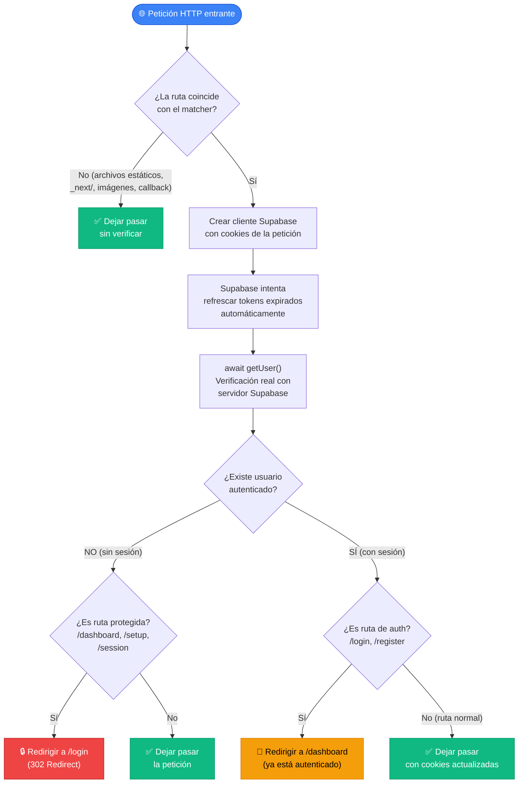
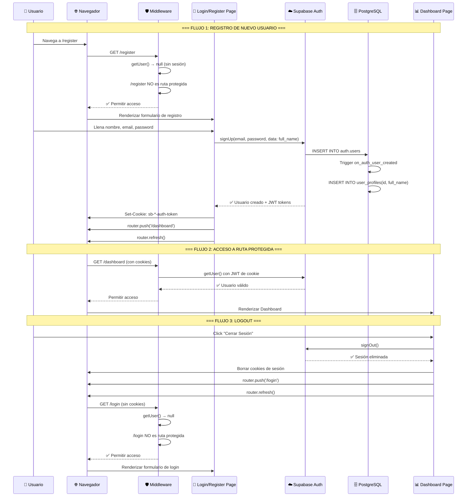

# FE-03 — Auth: Registro, Login, Logout y Middleware

**Guía:** FE-03  
**Bloque:** 🌐 BLOQUE C — FRONTEND BASE (Next.js)  
**Guía anterior:** [FE-02 — Conexión con Supabase](file:///c:/Users/jsife/OneDrive/Desktop/Repositorios/practica-testing/docs/guides/fe/FE-02.md)  
**Dependencias:** FE-01, FE-02, DB-05  
**Estado:** ✅ Completado  
**Fecha:** Junio 2026

---

## Tabla de Contenidos

1. [🎓 Introducción y Fundamentos Conceptuales](#1--introducción-y-fundamentos-conceptuales)
2. [📋 Prerequisitos y Verificación del Entorno](#2--prerequisitos-y-verificación-del-entorno)
3. [📂 Estructura de Directorios del Proyecto](#3--estructura-de-directorios-del-proyecto)
4. [🎨 Diagrama de Arquitectura de Componentes](#4--diagrama-de-arquitectura-de-componentes)
5. [🛠️ Implementación Paso a Paso](#5-️-implementación-paso-a-paso)
6. [✅ Checkpoints de Verificación](#6--checkpoints-de-verificación)
7. [🚨 Troubleshooting — Problemas Comunes](#7--troubleshooting--problemas-comunes)
8. [📝 Resumen y Próximo Paso](#8--resumen-y-próximo-paso)

---

## 1. 🎓 Introducción y Fundamentos Conceptuales

### ¿Dónde estamos?

En **FE-01** construimos los cimientos del frontend: Next.js con App Router, TypeScript estricto, Tailwind CSS y shadcn/ui. En **FE-02** conectamos las tuberías: creamos los dos clientes de Supabase (uno para el navegador y otro para el servidor), definimos los tipos TypeScript de todas las tablas y probamos la conexión leyendo datos desde ambos entornos. En **DB-05**, configuraste Supabase Auth y el trigger PL/pgSQL que sincroniza `auth.users` con `public.user_profiles`.

Sin embargo, nuestra aplicación todavía tiene un problema crítico: **no tiene puertas**. Cualquier persona puede escribir `http://localhost:3000/dashboard` en su navegador y acceder a cualquier página. No hay forma de saber quién es el usuario, qué datos puede ver, ni de proteger la información sensible. Es como un banco que tiene bóvedas (RLS) y cámaras de seguridad (triggers), pero dejó la puerta principal abierta de par en par.

### ¿Qué vamos a lograr?

En esta guía vamos a construir el **sistema de autenticación completo** del ISTQB Study Agent:

1. **Middleware de protección**: Un guardián invisible que intercepta TODAS las peticiones antes de que lleguen a tus páginas.
2. **Callback Route**: Un endpoint especial que Supabase usa para intercambiar códigos de autenticación por sesiones.
3. **Layout de autenticación**: Un diseño visual elegante y centrado para todos los formularios de auth.
4. **Página de Login**: Formulario controlado que autentica al usuario con email y contraseña.
5. **Página de Registro**: Formulario que crea un nuevo usuario y envía su nombre al trigger de DB-05.
6. **Placeholder de Dashboard**: Una página protegida temporal con funcionalidad de logout.

### Analogía: El Aeropuerto Internacional

> **Analogía del Aeropuerto:** Piensa en tu aplicación como un aeropuerto internacional. Sin esta guía, cualquier persona puede caminar directamente hasta la puerta de embarque sin pasar por ningún control. Después de esta guía, tu aplicación tendrá:
>
> - **El mostrador de check-in** (Página de Registro) → donde los nuevos viajeros se registran y obtienen su boleto.
> - **El control de pasaportes** (Página de Login) → donde los viajeros existentes se identifican.
> - **El arco de seguridad** (Middleware) → un punto de control OBLIGATORIO por el que TODAS las personas deben pasar antes de acceder a las zonas restringidas.
> - **La sala VIP** (Dashboard protegido) → solo accesible para quienes pasaron por seguridad.
> - **La puerta de salida** (Logout) → para abandonar la zona restringida y devolver tu pase de acceso.
>
> El Middleware es, sin duda, la pieza más importante. Es como el arco de seguridad del aeropuerto: no importa si eres piloto, pasajero o empleado — **todos** pasan por él. Y lo más poderoso es que funciona de forma invisible: el usuario ni siquiera se da cuenta de que fue verificado en milisegundos.

### Concepto Clave 1: JWT (JSON Web Tokens) y Cookies

Cuando un usuario inicia sesión en Supabase, el servidor de autenticación genera un **JWT** (JSON Web Token). Este token es un string codificado en Base64 que contiene tres partes:

```
┌─────────────────────────────────────────────────────────────┐
│                    ESTRUCTURA DE UN JWT                       │
│                                                             │
│  Header.Payload.Signature                                   │
│                                                             │
│  ┌──────────────┐                                           │
│  │   HEADER      │ → Algoritmo de firma (HS256)             │
│  │   (Base64)    │ → Tipo de token (JWT)                    │
│  └──────────────┘                                           │
│  ┌──────────────┐                                           │
│  │   PAYLOAD     │ → sub: UUID del usuario (auth.uid())     │
│  │   (Base64)    │ → email: correo del usuario              │
│  │               │ → role: "authenticated"                  │
│  │               │ → exp: fecha de expiración (UNIX)        │
│  │               │ → iat: fecha de emisión                  │
│  └──────────────┘                                           │
│  ┌──────────────┐                                           │
│  │  SIGNATURE    │ → HMAC-SHA256(header + payload, secret)  │
│  │               │ → Solo Supabase puede generar firmas     │
│  │               │   válidas con su JWT_SECRET              │
│  └──────────────┘                                           │
│                                                             │
│  El JWT se almacena como COOKIE en el navegador del usuario.│
│  Se envía automáticamente con cada petición HTTP.           │
│  Supabase lo lee para saber QUIÉN es el usuario (auth.uid())│
│  y las políticas RLS lo usan para filtrar datos.            │
└─────────────────────────────────────────────────────────────┘
```

Cuando dices `supabase.auth.signInWithPassword()`, Supabase:
1. Verifica las credenciales contra `auth.users`.
2. Genera un **access_token** (JWT de corta duración, por defecto 1 hora) y un **refresh_token** (de larga duración).
3. El paquete `@supabase/ssr` almacena ambos tokens como **cookies** en el navegador.
4. Cada vez que el navegador hace una petición, las cookies viajan automáticamente en los headers HTTP.

> [!NOTE]
> **¿Por qué cookies y no localStorage?** Las cookies se envían automáticamente con cada petición HTTP (incluyendo las del Server Component en Next.js). localStorage solo es accesible desde JavaScript en el navegador. Si usáramos localStorage, los Server Components no podrían leer la sesión, y perderíamos la ventaja del SSR.

### Concepto Clave 2: `getUser()` vs `getSession()` — Diferencia de Seguridad Crítica

Esta distinción es **fundamental** para la seguridad de tu aplicación:

```
┌─────────────────────────────────────────────────────────────┐
│        getSession() — ⚠️ NO SEGURO para validación          │
│                                                             │
│  • Lee el JWT de la cookie LOCAL del navegador              │
│  • Decodifica el payload SIN verificar la firma             │
│  • Es rápido pero NO verifica con el servidor               │
│  • Un atacante podría modificar la cookie manualmente        │
│  • Útil SOLO para leer datos no sensibles del JWT           │
│    (email, metadata) cuando ya confías en la sesión         │
├─────────────────────────────────────────────────────────────┤
│        getUser() — ✅ SEGURO para validación                 │
│                                                             │
│  • Hace una petición HTTP real al servidor de Supabase Auth │
│  • Supabase verifica la firma del JWT con su JWT_SECRET     │
│  • Confirma que el token no ha sido revocado                │
│  • Si el access_token expiró, intenta usar el refresh_token │
│  • Es la ÚNICA forma segura de confirmar la identidad       │
│  • Más lento (requiere red) pero IMPRESCINDIBLE en          │
│    middleware y decisiones de acceso                         │
└─────────────────────────────────────────────────────────────┘
```

> [!IMPORTANT]
> **Regla de seguridad absoluta:** En el Middleware y en cualquier lugar donde tomes decisiones de acceso (redirigir, mostrar/ocultar contenido protegido), usa SIEMPRE `getUser()`. Usa `getSession()` solo para leer datos no sensibles del JWT cuando la sesión ya fue validada previamente por el Middleware.

### Concepto Clave 3: Route Groups — Organización sin Impacto en URLs

En Next.js App Router, las **carpetas entre paréntesis** como `(auth)` y `(dashboard)` se llaman **Route Groups**. Son una herramienta de organización puramente arquitectónica:

```
┌─────────────────────────────────────────────────────────────┐
│               ROUTE GROUPS EN NEXT.JS                        │
│                                                             │
│  Estructura de carpetas:                                     │
│  app/                                                       │
│  ├── (auth)/                    ← Route Group               │
│  │   ├── layout.tsx             ← Layout SOLO para auth     │
│  │   ├── login/page.tsx         ← URL: /login  (NO /auth/)  │
│  │   └── register/page.tsx      ← URL: /register            │
│  │                                                          │
│  ├── (dashboard)/               ← Otro Route Group          │
│  │   ├── layout.tsx             ← Layout SOLO para dash     │
│  │   └── dashboard/page.tsx     ← URL: /dashboard           │
│  │                                                          │
│  └── layout.tsx                 ← Layout raíz (TODOS)       │
│                                                             │
│  Beneficios:                                                │
│  ✅ Layouts independientes: auth tiene centrado,             │
│     dashboard tiene sidebar                                 │
│  ✅ URLs limpias: /login, NO /auth/login                    │
│  ✅ Código organizado: fácil saber qué pertenece a qué     │
│  ✅ Carga optimizada: Next.js solo carga el layout          │
│     relevante para cada grupo                               │
└─────────────────────────────────────────────────────────────┘
```

### Concepto Clave 4: Middleware en Next.js — Edge Runtime

El Middleware en Next.js se ejecuta **antes** de que cualquier página o API Route se procese. Pero lo más fascinante es **dónde** se ejecuta:

```
┌─────────────────────────────────────────────────────────────┐
│              EDGE RUNTIME vs NODE.JS RUNTIME                 │
│                                                             │
│  ┌─────────────────────────────┐                            │
│  │      EDGE RUNTIME           │                            │
│  │   (donde vive middleware)   │                            │
│  │                             │                            │
│  │  • Se ejecuta en el "borde" │                            │
│  │    de la red (CDN)          │                            │
│  │  • Latencia ultra-baja      │                            │
│  │    (~1-5ms)                 │                            │
│  │  • No tiene acceso a        │                            │
│  │    Node.js APIs completas   │                            │
│  │  • No puede usar fs,        │                            │
│  │    child_process, etc.      │                            │
│  │  • Ideal para redireciones, │                            │
│  │    headers y auth checks    │                            │
│  └─────────────────────────────┘                            │
│                                                             │
│  FLUJO DE UNA PETICIÓN:                                     │
│                                                             │
│  Usuario → CDN/Edge → [MIDDLEWARE] → Node.js → Tu página   │
│                          ↓                                  │
│                    ¿Tiene sesión?                            │
│                     /       \                               │
│                   SÍ         NO                             │
│                   ↓           ↓                             │
│             Deja pasar    Redirige                           │
│             la petición   a /login                           │
└─────────────────────────────────────────────────────────────┘
```

El archivo `middleware.ts` DEBE estar en la **raíz** de tu carpeta `frontend/` (al mismo nivel que `package.json`), no dentro de `app/`. Esto es porque el middleware es un concepto de Next.js a nivel del servidor, no una página.

### Concepto Clave 5: `router.refresh()` — ¿Por qué es Necesario?

Cuando un usuario hace login exitosamente, las cookies se actualizan en el navegador. Sin embargo, Next.js cachea el resultado de los Server Components. Si solo haces `router.push('/dashboard')`, Next.js podría servir una versión cacheada del dashboard que fue renderizada **antes** del login (sin sesión). `router.refresh()` fuerza a Next.js a:

1. Invalidar el caché del Router
2. Re-ejecutar los Server Components con las cookies actualizadas
3. Pasar por el Middleware, que ahora encontrará una sesión válida

```
Sin router.refresh():
  Login ✅ → push('/dashboard') → Cache antiguo (sin sesión) → ❌ Redirect a /login

Con router.refresh():
  Login ✅ → push('/dashboard') → refresh() → Re-render con cookies nuevas → ✅ Dashboard
```

> [!TIP]
> Siempre llama a `router.refresh()` inmediatamente después de `router.push()` en operaciones que cambian el estado de autenticación (login, logout, registro). Este patrón garantiza que el middleware re-evalúe la sesión con los tokens más recientes.

### Conexión con DB-05: El Círculo se Cierra

¿Recuerdas el trigger `handle_new_user()` que creamos en **DB-05**? Ese trigger espera que el frontend envíe un campo `full_name` en los metadatos del registro:

```
Frontend (FE-03)                    →  Supabase Auth              →  PostgreSQL (DB-05)
──────────────────                     ──────────────                 ──────────────────
supabase.auth.signUp({                 Crea usuario en              Trigger ejecuta:
  email: "...",                        auth.users con               INSERT INTO user_profiles
  password: "...",                     raw_user_meta_data:          (id, full_name)
  options: {                           { "full_name": "Juan" }      VALUES (new.id,
    data: {                                                          new.raw_user_meta_data
      full_name: "Juan"               ───────────────────►           ->>'full_name');
    }
  }
});
```

En esta guía, cuando construyamos la página de registro, enviaremos `full_name` exactamente como el trigger lo espera. Es un ejemplo perfecto de cómo las capas de la aplicación se comunican: el frontend envía datos, Supabase Auth los almacena, y un trigger de PostgreSQL los sincroniza automáticamente a nuestra tabla pública.

---

## 2. 📋 Prerequisitos y Verificación del Entorno

Antes de comenzar, verifica que tienes TODO lo necesario. Abre una terminal de **PowerShell** y ejecuta cada comando.

### 2.1 Herramientas y Runtimes

| Prerequisito | Comando de verificación | Versión mínima | ¿Listo? |
|---|---|---|---|
| Node.js | `node --version` | v18.17+ | ☑ |
| npm | `npm --version` | v9+ | ☑ |
| TypeScript | `npx tsc --version` (desde `frontend/`) | v5+ | ☑ |
| Git | `git --version` | v2.30+ | ☑ |
| Supabase CLI | `supabase --version` | v1.x+ | ☑ |

### 2.2 Verificación de Node.js y npm

```powershell
node --version
```

**Salida esperada:**
```
v20.14.0
```

```powershell
npm --version
```

**Salida esperada:**
```
10.7.0
```

### 2.3 Dependencias npm (ya instaladas en FE-01)

Estos paquetes deben estar en tu `package.json`. Verifica desde la carpeta `frontend/`:

```powershell
cd c:\Users\jsife\OneDrive\Desktop\Repositorios\practica-testing\frontend
npm ls @supabase/supabase-js @supabase/ssr
```

**Salida esperada:**
```
frontend@0.1.0 c:\Users\jsife\OneDrive\Desktop\Repositorios\practica-testing\frontend
├── @supabase/ssr@0.12.x
└── @supabase/supabase-js@2.108.x
```

> [!IMPORTANT]
> Si alguno no aparece, instálalo antes de continuar:
> ```powershell
> npm install @supabase/supabase-js @supabase/ssr
> ```

### 2.4 Entregables de guías anteriores que DEBEN existir

#### De FE-01 (Scaffold)

| Entregable | Ruta | Verificación |
|---|---|---|
| Proyecto Next.js funcional | `frontend/` | `npm run dev` sin errores |
| shadcn/ui configurado | `frontend/components.json` | Archivo existe |
| Componente Button | `frontend/components/ui/button.tsx` | Archivo existe |
| Variables de entorno | `frontend/.env.local` | Contiene `NEXT_PUBLIC_SUPABASE_URL` |
| Alias `@/` configurado | `frontend/tsconfig.json` | `"@/*": ["./*"]` en `paths` |

#### De FE-02 (Conexión Supabase)

| Entregable | Ruta | Verificación |
|---|---|---|
| Cliente browser de Supabase | `frontend/lib/supabase/client.ts` | Archivo existe |
| Cliente servidor de Supabase | `frontend/lib/supabase/server.ts` | Archivo existe |
| Tipos de la base de datos | `frontend/types/database.ts` | Archivo existe |
| Barrel de tipos actualizado | `frontend/types/index.ts` | Exporta `Database` |

#### De DB-05 (Auth Trigger)

| Entregable | Verificación |
|---|---|
| Trigger `on_auth_user_created` creado | Migración `..._create_auth_trigger.sql` aplicada con `supabase db push` |
| Función `handle_new_user()` existente | Lee `raw_user_meta_data->>'full_name'` |
| `config.toml` con `enable_signup = true` | Auth configurado para desarrollo |

**Verificaciones rápidas desde PowerShell:**

```powershell
# Verificar que los clientes de Supabase existen
Test-Path "c:\Users\jsife\OneDrive\Desktop\Repositorios\practica-testing\frontend\lib\supabase\client.ts"
Test-Path "c:\Users\jsife\OneDrive\Desktop\Repositorios\practica-testing\frontend\lib\supabase\server.ts"
```

**Salida esperada (ambos):**
```
True
```

```powershell
# Verificar las variables de entorno
Select-String -Path "c:\Users\jsife\OneDrive\Desktop\Repositorios\practica-testing\frontend\.env.local" -Pattern "NEXT_PUBLIC_SUPABASE_URL"
Select-String -Path "c:\Users\jsife\OneDrive\Desktop\Repositorios\practica-testing\frontend\.env.local" -Pattern "NEXT_PUBLIC_SUPABASE_ANON_KEY"
```

**Salida esperada (una línea por comando con la variable encontrada):**
```
.env.local:1:NEXT_PUBLIC_SUPABASE_URL=https://xxxxxxxxxx.supabase.co
.env.local:2:NEXT_PUBLIC_SUPABASE_ANON_KEY=eyJhbGciOiJI...
```

> [!CAUTION]
> Si ves `your-url-here` o `your-key-here`, reemplaza con los valores reales de tu proyecto Supabase (Dashboard → Settings → API) antes de continuar.

### 2.5 Instalación de componentes UI faltantes

Necesitamos los componentes `Input` y `Label` de shadcn/ui para construir los formularios de login y registro. Ejecuta en PowerShell desde la carpeta `frontend/`:

```powershell
cd c:\Users\jsife\OneDrive\Desktop\Repositorios\practica-testing\frontend
npx shadcn@latest add input label
```

**Salida esperada:**
```
✔ Checking registry.
✔ Installing dependencies.
✔ Created 2 files:
  - components/ui/input.tsx
  - components/ui/label.tsx
```

Verifica que se crearon:

```powershell
Test-Path "components/ui/input.tsx"
Test-Path "components/ui/label.tsx"
```

**Salida esperada (ambos):**
```
True
```

> [!TIP]
> Si recibes un prompt preguntando sobre dependencias existentes, responde "Yes" para continuar. shadcn/ui detecta si alguna dependencia ya está instalada y te pregunta antes de sobrescribir.

### 2.6 Resumen de prerequisitos

| # | Prerequisito | Comando | ¿Listo? |
|---|---|---|---|
| 1 | Node.js v18+ | `node --version` | ☑ |
| 2 | npm v9+ | `npm --version` | ☑ |
| 3 | Git v2.30+ | `git --version` | ☑ |
| 4 | Supabase CLI | `supabase --version` | ☑ |
| 5 | `lib/supabase/client.ts` (FE-02) | `Test-Path` | ☑ |
| 6 | `lib/supabase/server.ts` (FE-02) | `Test-Path` | ☑ |
| 7 | `.env.local` con credenciales | `Select-String` | ☑ |
| 8 | Trigger de DB-05 aplicado | `supabase db push` previo | ☑ |
| 9 | shadcn Input + Label instalados | `npx shadcn@latest add` | ☑ |

---

## 3. 📂 Estructura de Directorios del Proyecto

### 3.1 Estado actual del proyecto (ANTES de esta guía)

```
practica-testing/                        # Raíz del monorepo
│
├── .env.example                         # ✅ Existente (DB-01)
├── .env.local                           # ✅ Existente (DB-01)
├── .gitignore                           # ✅ Existente
│
├── backend/                             # ✅ Existente (BE-01 a BE-06)
│   ├── app/
│   │   ├── main.py
│   │   ├── routers/
│   │   ├── services/
│   │   ├── models/
│   │   └── core/
│   ├── tests/
│   ├── Dockerfile
│   ├── requirements.txt
│   └── .env.example
│
├── supabase/                            # ✅ Existente (DB-01 a DB-05)
│   ├── config.toml                      # Modificado en DB-05 (Auth config)
│   └── migrations/
│       ├── 20260522183543_remote_schema.sql
│       ├── 20260531183745_create_schema.sql    # DB-02
│       ├── 20260531221544_create_storage_bucket.sql  # DB-03
│       ├── 20260601015125_create_rls_policies.sql    # DB-04
│       └── 20260621223000_create_auth_trigger.sql    # DB-05
│
├── docs/                                # ✅ Existente
│   └── guides/
│       ├── be/                          # BE-01 a BE-06
│       ├── db/                          # DB-01 a DB-05
│       └── fe/
│           ├── FE-01.md                 # Scaffold
│           └── FE-02.md                 # Conexión Supabase
│
├── frontend/                            # ✅ Existente (FE-01, FE-02)
│   ├── app/
│   │   ├── (auth)/                      # Route Group creado en FE-01 (vacío)
│   │   │   └── .gitkeep
│   │   ├── (dashboard)/                 # Route Group creado en FE-01 (vacío)
│   │   │   └── .gitkeep
│   │   ├── favicon.ico
│   │   ├── globals.css
│   │   ├── layout.tsx                   # Layout raíz
│   │   ├── page.tsx                     # Landing page (FE-02)
│   │   └── supabase-client-test.tsx     # Componente de prueba (FE-02)
│   │
│   ├── components/
│   │   ├── shared/
│   │   │   └── .gitkeep
│   │   └── ui/
│   │       └── button.tsx               # shadcn/ui Button (FE-01)
│   │
│   ├── lib/
│   │   ├── supabase/
│   │   │   ├── client.ts                # Cliente browser (FE-02)
│   │   │   └── server.ts                # Cliente servidor (FE-02)
│   │   └── utils.ts                     # cn() de shadcn (FE-01)
│   │
│   ├── types/
│   │   ├── database.ts                  # Tipos del schema (FE-02)
│   │   └── index.ts                     # Barrel exports (FE-02)
│   │
│   ├── .env.local                       # Variables de entorno
│   ├── .env.example
│   ├── components.json                  # Config shadcn/ui
│   ├── next.config.ts
│   ├── package.json
│   ├── postcss.config.mjs
│   ├── tailwind.config.ts
│   └── tsconfig.json
│
└── dev-tools/                           # ✅ Existente
```

### 3.2 Estado DESPUÉS de completar esta guía

```
practica-testing/
│
├── backend/                             # Sin cambios
├── supabase/                            # Sin cambios
├── docs/
│   └── guides/
│       ├── be/
│       ├── db/
│       └── fe/
│           ├── FE-01.md
│           ├── FE-02.md
│           └── FE-03.md                 # 🆕 NUEVO — esta guía
│
├── frontend/
│   ├── app/
│   │   ├── (auth)/                      # 📝 MODIFICADO — ya no está vacío
│   │   │   ├── layout.tsx               # 🆕 NUEVO — Layout centrado para auth
│   │   │   ├── login/
│   │   │   │   └── page.tsx             # 🆕 NUEVO — Página de inicio de sesión
│   │   │   └── register/
│   │   │       └── page.tsx             # 🆕 NUEVO — Página de registro
│   │   │
│   │   ├── auth/
│   │   │   └── callback/
│   │   │       └── route.ts             # 🆕 NUEVO — API Route para callback OAuth/email
│   │   │
│   │   ├── (dashboard)/                 # 📝 MODIFICADO — ya no está vacío
│   │   │   └── dashboard/
│   │   │       └── page.tsx             # 🆕 NUEVO — Placeholder protegido con logout
│   │   │
│   │   ├── favicon.ico                  # Sin cambios
│   │   ├── globals.css                  # Sin cambios
│   │   ├── layout.tsx                   # Sin cambios
│   │   ├── page.tsx                     # Sin cambios
│   │   └── supabase-client-test.tsx     # Sin cambios
│   │
│   ├── middleware.ts                    # 🆕 NUEVO — Protección de rutas (raíz de frontend/)
│   │
│   ├── components/
│   │   ├── shared/
│   │   │   └── .gitkeep
│   │   └── ui/
│   │       ├── button.tsx               # EXISTENTE (FE-01)
│   │       ├── input.tsx                # 🆕 NUEVO (vía shadcn — Prerequisitos)
│   │       └── label.tsx                # 🆕 NUEVO (vía shadcn — Prerequisitos)
│   │
│   ├── lib/
│   │   ├── supabase/
│   │   │   ├── client.ts                # EXISTENTE (FE-02)
│   │   │   └── server.ts                # EXISTENTE (FE-02)
│   │   └── utils.ts                     # EXISTENTE (FE-01)
│   │
│   ├── types/
│   │   ├── database.ts                  # EXISTENTE (FE-02)
│   │   └── index.ts                     # EXISTENTE (FE-02)
│   │
│   ├── .env.local                       # EXISTENTE
│   ├── components.json                  # EXISTENTE
│   ├── next.config.ts                   # EXISTENTE
│   ├── package.json                     # EXISTENTE
│   └── tsconfig.json                    # EXISTENTE
│
└── dev-tools/                           # Sin cambios
```

### 3.3 Resumen de cambios en esta guía

| Acción | Archivo | Descripción |
|---|---|---|
| **CREAR** | `frontend/middleware.ts` | Guardián que protege rutas y refresca tokens |
| **CREAR** | `frontend/app/auth/callback/route.ts` | Intercambia códigos OAuth/email por sesiones |
| **CREAR** | `frontend/app/(auth)/layout.tsx` | Layout visual centrado para formularios |
| **CREAR** | `frontend/app/(auth)/login/page.tsx` | Formulario de inicio de sesión |
| **CREAR** | `frontend/app/(auth)/register/page.tsx` | Formulario de registro con nombre |
| **CREAR** | `frontend/app/(dashboard)/dashboard/page.tsx` | Placeholder protegido con logout |
| **INSTALAR** | `frontend/components/ui/input.tsx` | Componente Input de shadcn (vía CLI) |
| **INSTALAR** | `frontend/components/ui/label.tsx` | Componente Label de shadcn (vía CLI) |

> [!NOTE]
> Los componentes `input.tsx` y `label.tsx` se instalan vía `npx shadcn@latest add`, no se escriben manualmente. shadcn/ui copia el código fuente directamente a tu proyecto, haciéndote dueño del componente.

---

## 4. 🎨 Diagrama de Arquitectura de Componentes

### Diagrama 1: Árbol de Decisiones del Middleware

Este diagrama muestra la lógica exacta que ejecuta el Middleware en cada petición:



**Leyenda:**
- 🔵 **Azul:** Punto de entrada (petición HTTP)
- 🟢 **Verde:** Petición permitida (pasa al siguiente handler)
- 🔴 **Rojo:** Acceso denegado (redireccionamiento forzado)
- 🟡 **Amarillo:** Redireccionamiento por sesión existente

### Diagrama 2: Flujo Completo de Autenticación (Secuencia)

Este diagrama muestra el ciclo de vida completo desde el registro hasta el acceso al dashboard:



---

## 5. 🛠️ Implementación Paso a Paso

---

### Paso A — Verificar Variables de Entorno

Antes de escribir código, asegurémonos de que tu archivo `.env.local` tiene las variables que necesitamos. Las variables `NEXT_PUBLIC_SUPABASE_URL` y `NEXT_PUBLIC_SUPABASE_ANON_KEY` son **fundamentales** para que el middleware y los formularios funcionen.

**Verificación desde PowerShell:**

```powershell
cd c:\Users\jsife\OneDrive\Desktop\Repositorios\practica-testing\frontend
Get-Content .env.local | Select-String "SUPABASE"
```

**Salida esperada:**
```
NEXT_PUBLIC_SUPABASE_URL=https://czfmlczpzurrjfbwghmy.supabase.co
NEXT_PUBLIC_SUPABASE_ANON_KEY=eyJhbGciOiJIUzI1NiIs...
SUPABASE_SERVICE_ROLE_KEY=eyJhbGciOiJIUzI1NiIs...
```

> [!IMPORTANT]
> Debes ver **tres** variables que contengan "SUPABASE" con valores reales (no placeholders). Las dos variables `NEXT_PUBLIC_*` son las que usaremos en esta guía. La `SERVICE_ROLE_KEY` no la usamos directamente pero debe existir para futuros bloques.

Verifica también que `npm run dev` arranca sin errores, para confirmar que el proyecto base está sano:

```powershell
npm run dev
```

**Salida esperada:**
```
> frontend@0.1.0 dev
> next dev

  ▲ Next.js 15.3.3
  - Local:        http://localhost:3000
  - Environments: .env.local

 ✓ Starting...
 ✓ Ready in 2.5s
```

Detén el servidor con `Ctrl + C`.

**🎯 Entregables del Paso A:**
- [x] `.env.local` contiene `NEXT_PUBLIC_SUPABASE_URL` con valor real
- [x] `.env.local` contiene `NEXT_PUBLIC_SUPABASE_ANON_KEY` con valor real
- [x] `npm run dev` arranca sin errores y detecta `.env.local`

---

### Paso B — Configurar el Middleware de Protección

El middleware es el **corazón de la seguridad** de nuestra aplicación. Es una función que Next.js ejecuta antes de que cualquier petición alcance tus páginas o API Routes. Crea el archivo `middleware.ts` en la **raíz** de `frontend/` (al mismo nivel que `package.json`, NO dentro de `app/`).

**Archivo a crear:** `frontend/middleware.ts`  
**Ruta completa:** `c:\Users\jsife\OneDrive\Desktop\Repositorios\practica-testing\frontend\middleware.ts`

```typescript
// ============================================================
// middleware.ts — Guardián de rutas del ISTQB Study Agent
// ============================================================
// Este archivo se ejecuta en el Edge Runtime de Next.js ANTES
// de que cualquier petición alcance una página o API Route.
//
// Responsabilidades:
//   1. Refrescar tokens JWT expirados automáticamente
//   2. Proteger rutas privadas (/dashboard, /setup, /session)
//   3. Redirigir usuarios autenticados lejos de /login y /register
//   4. Sincronizar cookies entre la petición y la respuesta
//
// UBICACIÓN CRÍTICA:
//   Este archivo DEBE estar en la RAÍZ de frontend/
//   (al mismo nivel que package.json y next.config.ts).
//   Si lo pones dentro de app/, Next.js NO lo detectará.
//
// EDGE RUNTIME:
//   El middleware se ejecuta en el Edge Runtime (no Node.js).
//   Esto significa que no puedes usar fs, child_process, etc.
//   Pero sí puedes usar fetch, Response, Request, cookies.
// ============================================================

import { createServerClient } from '@supabase/ssr';
import { NextResponse, type NextRequest } from 'next/server';

export async function middleware(request: NextRequest) {
  // ─── PASO 1: Crear la respuesta base ───
  // Inicializamos una respuesta "next()" que continúa con la petición.
  // Si Supabase necesita actualizar tokens, esta respuesta se
  // reemplazará con una nueva que incluya las cookies actualizadas.
  let supabaseResponse = NextResponse.next({
    request: {
      // Pasamos los headers originales para que las páginas downstream
      // puedan acceder a ellos (idioma, user-agent, etc.)
      headers: request.headers,
    },
  });

  // ─── PASO 2: Crear el cliente de Supabase para el middleware ───
  // Este cliente es especial: lee cookies de la petición entrante
  // y puede escribir cookies en la respuesta saliente.
  // Es el "puente" entre el navegador y Supabase Auth.
  const supabase = createServerClient(
    // Variables de entorno que el Edge Runtime puede acceder.
    // El ! (non-null assertion) le dice a TypeScript que sabemos
    // que estas variables existen en .env.local.
    process.env.NEXT_PUBLIC_SUPABASE_URL!,
    process.env.NEXT_PUBLIC_SUPABASE_ANON_KEY!,
    {
      cookies: {
        // ─── Leer cookies ───
        // Supabase necesita leer las cookies de sesión de la
        // petición entrante para saber si el usuario tiene
        // un token válido o si necesita refrescarlo.
        getAll() {
          return request.cookies.getAll();
        },

        // ─── Escribir cookies ───
        // Cuando Supabase refresca un token expirado, necesita
        // actualizar las cookies tanto en la petición (para que
        // las páginas downstream vean el token nuevo) como en
        // la respuesta (para que el navegador guarde el token nuevo).
        setAll(cookiesToSet) {
          // Primero: actualizar las cookies en la petición entrante.
          // Esto es necesario para que los Server Components que se
          // ejecutan DESPUÉS del middleware vean los tokens frescos.
          cookiesToSet.forEach(({ name, value }) =>
            request.cookies.set(name, value)
          );

          // Segundo: crear una nueva respuesta con la petición actualizada.
          // Esto "conecta" las cookies de la petición con las de la respuesta.
          supabaseResponse = NextResponse.next({
            request,
          });

          // Tercero: establecer las cookies en la respuesta saliente.
          // Esto asegura que el NAVEGADOR del usuario reciba los
          // tokens actualizados y los almacene para futuras peticiones.
          cookiesToSet.forEach(({ name, value, options }) =>
            supabaseResponse.cookies.set(name, value, options)
          );
        },
      },
    }
  );

  // ─── PASO 3: Verificar la identidad del usuario ───
  // CRÍTICO: Usamos getUser() y NO getSession().
  //
  // getUser() hace una llamada real al servidor de Supabase Auth
  // para verificar que el token JWT es válido y no ha sido revocado.
  //
  // getSession() solo lee el JWT de la cookie local sin verificar
  // su firma con el servidor. Un atacante podría modificar el JWT
  // en la cookie y getSession() lo aceptaría como válido.
  //
  // En el middleware, donde tomamos decisiones de seguridad
  // (permitir o denegar acceso), SIEMPRE usamos getUser().
  const {
    data: { user },
  } = await supabase.auth.getUser();

  // ─── PASO 4: Clasificar la ruta solicitada ───
  // Determinamos si la ruta actual es una ruta de autenticación
  // (login, register) o una ruta protegida (dashboard, etc.)
  const isAuthRoute =
    request.nextUrl.pathname.startsWith('/login') ||
    request.nextUrl.pathname.startsWith('/register');

  const isProtectedRoute =
    request.nextUrl.pathname.startsWith('/dashboard') ||
    request.nextUrl.pathname.startsWith('/setup') ||
    request.nextUrl.pathname.startsWith('/session');

  // ─── PASO 5: Aplicar reglas de acceso ───

  // REGLA 1: Si NO hay usuario y la ruta es protegida → redirigir a /login
  // Ejemplo: Un visitante anónimo intenta ir a /dashboard
  // El middleware lo "rebota" instantáneamente al formulario de login.
  if (!user && isProtectedRoute) {
    const url = request.nextUrl.clone();
    url.pathname = '/login';
    return NextResponse.redirect(url);
  }

  // REGLA 2: Si HAY usuario y la ruta es de auth → redirigir a /dashboard
  // Ejemplo: Un usuario ya logueado intenta ir a /login
  // No tiene sentido mostrar el formulario de login si ya tiene sesión.
  // Lo redirigimos directamente al dashboard.
  if (user && isAuthRoute) {
    const url = request.nextUrl.clone();
    url.pathname = '/dashboard';
    return NextResponse.redirect(url);
  }

  // ─── PASO 6: Si ninguna regla aplica, dejar pasar ───
  // Retornamos la respuesta que puede contener cookies actualizadas
  // por el refresh automático de Supabase.
  return supabaseResponse;
}

// ============================================================
// CONFIGURACIÓN DEL MATCHER — ¿En qué rutas corre el middleware?
// ============================================================
// El matcher es un patrón regex que le dice a Next.js en qué
// rutas debe ejecutar este middleware.
//
// SIN matcher: el middleware correría en TODAS las peticiones,
// incluyendo archivos CSS, imágenes, fuentes — desperdicio.
//
// CON matcher: solo corre en rutas que necesitan protección.
// ============================================================
export const config = {
  matcher: [
    // ─── Explicación del regex ───
    // '/(                    → Empieza desde la raíz
    //   (?!                  → Lookahead negativo: excluir si empieza con...
    //     _next/static|      → Archivos estáticos de Next.js (CSS, JS bundles)
    //     _next/image|       → Optimizador de imágenes de Next.js
    //     favicon.ico|       → Ícono del sitio
    //     .*\\.(?:svg|png|   → Cualquier archivo con extensión de imagen:
    //       jpg|jpeg|gif|    →   SVG, PNG, JPG, JPEG, GIF, WebP
    //       webp)$|          → (el $ ancla al final del string)
    //     auth/callback      → La ruta de callback de Supabase Auth
    //                        → (debe estar EXCLUIDA porque es un API Route
    //                        →  que maneja el intercambio de código→sesión
    //                        →  y no necesita verificación de sesión)
    //   )                    → Fin del lookahead negativo
    //   .*                   → Cualquier otra ruta: INCLUIR
    // )'
    '/((?!_next/static|_next/image|favicon.ico|.*\\.(?:svg|png|jpg|jpeg|gif|webp)$|auth/callback).*)',
  ],
};
```

> [!WARNING]
> **Ubicación del middleware:** El archivo `middleware.ts` DEBE estar en `frontend/middleware.ts` (raíz del frontend, al mismo nivel que `package.json`). Si lo colocas en `frontend/app/middleware.ts` o `frontend/src/middleware.ts`, Next.js **NO lo detectará** y tus rutas quedarán desprotegidas sin ningún error visible.

#### Verificación de la ubicación

```powershell
Test-Path "c:\Users\jsife\OneDrive\Desktop\Repositorios\practica-testing\frontend\middleware.ts"
```

**Salida esperada:**
```
True
```

> [!NOTE]
> **¿Por qué excluimos `auth/callback` del matcher?** La ruta `/auth/callback` es una API Route que recibe códigos de autenticación de Supabase (por ejemplo, cuando el usuario confirma su email). Si el middleware intentara verificar la sesión en esta ruta, fallaría porque el usuario todavía no tiene sesión — ¡está en proceso de crearla! Es un caso de "huevo o gallina" que resolvemos excluyéndola del middleware.

**🎯 Entregables del Paso B:**
- [x] Archivo `frontend/middleware.ts` creado en la raíz del frontend
- [x] El archivo NO está dentro de `app/`
- [x] El matcher excluye archivos estáticos, imágenes y `/auth/callback`
- [x] Se usa `getUser()` (no `getSession()`) para la verificación

---

### Paso C — Crear el Callback Route de Auth

Cuando Supabase envía un enlace de confirmación por email (para verificar cuenta, recuperar contraseña, o flujos OAuth), ese enlace contiene un **código temporal** que debe intercambiarse por una sesión real. Este endpoint es el responsable de esa conversión.

Piensa en él como el **mostrador de recogida de equipaje** del aeropuerto: el usuario llega con un ticket (el código), y el endpoint le entrega su maleta (la sesión).

**Archivo a crear:** `frontend/app/auth/callback/route.ts`  
**Ruta completa:** `c:\Users\jsife\OneDrive\Desktop\Repositorios\practica-testing\frontend\app\auth\callback\route.ts`

> [!IMPORTANT]
> Nota que esta ruta es `app/auth/callback/`, NO `app/(auth)/callback/`. La diferencia es crucial:
> - `app/auth/callback/` → URL final: `/auth/callback` (lo que Supabase espera)
> - `app/(auth)/callback/` → URL final: `/callback` (los paréntesis son Route Groups, no afectan la URL)
>
> Supabase está configurado para redirigir a `/auth/callback`, así que el archivo DEBE estar en la carpeta `auth/` SIN paréntesis.

```typescript
// ============================================================
// app/auth/callback/route.ts — Callback de autenticación
// ============================================================
// Este es un Route Handler de Next.js (equivalente a una API Route).
// Se ejecuta en el SERVIDOR, no en el navegador.
//
// ¿Cuándo se ejecuta?
//   Supabase redirige aquí al usuario después de:
//   1. Confirmar su email (click en el enlace de confirmación)
//   2. Completar un flujo OAuth (Google, GitHub, etc.)
//   3. Hacer click en un "magic link"
//   4. Restablecer su contraseña
//
// ¿Qué hace?
//   1. Lee el parámetro `code` de la URL (código temporal)
//   2. Intercambia el código por una sesión real con Supabase
//   3. Redirige al usuario a la página apropiada
//
// ¿Por qué es un Route Handler y no un Client Component?
//   Porque el intercambio de código por sesión DEBE hacerse
//   en el servidor para que las cookies se establezcan
//   correctamente antes de que el navegador renderice cualquier
//   página protegida.
// ============================================================

import { NextResponse } from 'next/server';
// Importamos el cliente de SERVIDOR (no el de browser).
// Este archivo se ejecuta en Node.js, no en el navegador.
import { createClient } from '@/lib/supabase/server';

/**
 * Maneja el GET a /auth/callback.
 * 
 * Supabase envía al usuario aquí con un parámetro `code` en la URL.
 * Ejemplo: /auth/callback?code=abc123&next=/dashboard
 * 
 * @param request - La petición HTTP entrante con los query params
 */
export async function GET(request: Request) {
  // Parseamos la URL para extraer los parámetros de búsqueda.
  // `searchParams` contiene los query params (?code=xxx&next=yyy)
  // `origin` contiene el protocolo + host (http://localhost:3000)
  const { searchParams, origin } = new URL(request.url);

  // El `code` es un código de autorización temporal generado por Supabase.
  // Es de un solo uso y expira en pocos minutos.
  const code = searchParams.get('code');

  // `next` es un parámetro opcional que indica a dónde redirigir
  // al usuario después de la autenticación exitosa.
  // Si no se proporciona, por defecto va al dashboard.
  const next = searchParams.get('next') ?? '/dashboard';

  if (code) {
    // Crear el cliente de Supabase para el servidor.
    // Necesitamos `await` porque createClient() es async en el servidor.
    const supabase = await createClient();

    // exchangeCodeForSession() hace lo siguiente:
    // 1. Envía el código a los servidores de Supabase Auth
    // 2. Supabase valida el código y genera tokens JWT
    // 3. Los tokens se guardan como cookies en la respuesta
    // 4. A partir de este momento, el usuario tiene sesión
    const { error } = await supabase.auth.exchangeCodeForSession(code);

    if (!error) {
      // ✅ Éxito: el código fue válido y la sesión se estableció.
      // Redirigimos al usuario a la página solicitada.
      return NextResponse.redirect(`${origin}${next}`);
    }
  }

  // ❌ Error: el código no existía, era inválido, o expiró.
  // Redirigimos al login con un parámetro de error para que
  // la UI pueda mostrar un mensaje apropiado.
  return NextResponse.redirect(`${origin}/login?error=auth_callback_failed`);
}
```

#### Verificación de que la ruta es correcta

La estructura de carpetas debe ser:

```
app/
├── auth/              ← SIN paréntesis (ruta REAL: /auth/callback)
│   └── callback/
│       └── route.ts
└── (auth)/            ← CON paréntesis (Route Group, no afecta URL)
    ├── layout.tsx
    ├── login/
    └── register/
```

```powershell
Test-Path "c:\Users\jsife\OneDrive\Desktop\Repositorios\practica-testing\frontend\app\auth\callback\route.ts"
```

**Salida esperada:**
```
True
```

**🎯 Entregables del Paso C:**
- [x] Archivo `frontend/app/auth/callback/route.ts` creado
- [x] La ruta es `app/auth/callback/` (sin paréntesis), no `app/(auth)/callback/`
- [x] El handler lee el parámetro `code` de la URL
- [x] Usa `exchangeCodeForSession()` para convertir código en sesión
- [x] Redirige al dashboard en éxito, al login en error

---

### Paso D — Crear el Layout de Autenticación

El **Route Group** `(auth)` necesita su propio layout. Este layout define la apariencia visual que comparten las páginas de login y registro: un diseño centrado, minimalista, con un fondo elegante y el nombre de la aplicación como header.

Piensa en este layout como el **vestíbulo del edificio**: es el espacio que ves antes de entrar a cualquier oficina específica. Tanto la oficina de "Login" como la de "Registro" comparten este mismo vestíbulo.

**Archivo a crear:** `frontend/app/(auth)/layout.tsx`  
**Ruta completa:** `c:\Users\jsife\OneDrive\Desktop\Repositorios\practica-testing\frontend\app\(auth)\layout.tsx`

> [!NOTE]
> Si existe un archivo `.gitkeep` dentro de `app/(auth)/`, puedes eliminarlo ahora que la carpeta tendrá archivos reales:
> ```powershell
> Remove-Item "c:\Users\jsife\OneDrive\Desktop\Repositorios\practica-testing\frontend\app\(auth)\.gitkeep" -ErrorAction SilentlyContinue
> ```

```tsx
// ============================================================
// app/(auth)/layout.tsx — Layout visual para páginas de auth
// ============================================================
// Este layout envuelve SOLO las páginas dentro del Route Group (auth):
//   - /login  (app/(auth)/login/page.tsx)
//   - /register  (app/(auth)/register/page.tsx)
//
// ¿Por qué un layout separado?
//   Las páginas de auth tienen una estética diferente al dashboard:
//   formularios centrados, sin sidebar, sin navegación compleja.
//   Al crear un layout dentro del Route Group, Next.js lo aplica
//   SOLO a las páginas de este grupo, sin afectar al resto.
//
// IMPORTANTE: Este es un SERVER Component (sin 'use client').
//   Los layouts en Next.js son Server Components por defecto,
//   lo que significa que este HTML se renderiza en el servidor
//   y se envía al navegador sin JavaScript adicional.
//   Los HIJOS (login, register) sí son Client Components
//   porque necesitan interactividad (formularios, useState).
// ============================================================

import { ReactNode } from 'react';
import Link from 'next/link';

/**
 * Layout centrado para las páginas de autenticación.
 * Provee:
 *   - Fondo oscuro con gradiente radial sutil
 *   - Logo/nombre de la app como header
 *   - Contenedor con bordes, sombra y blur para los formularios
 *   - Diseño responsive que funciona en móvil y escritorio
 * 
 * @param children - El contenido de la página (login o register)
 */
export default function AuthLayout({ children }: { children: ReactNode }) {
  return (
    <div className="flex min-h-screen items-center justify-center bg-slate-950 p-4">
      {/* ════════════════════════════════════════════════════════ */}
      {/* FONDO DECORATIVO — Gradiente radial sutil                */}
      {/* ════════════════════════════════════════════════════════ */}
      {/* Este div crea un efecto de "luz" sutil detrás del formulario.
          - absolute: posición absoluta respecto al contenedor padre
          - top-0: empieza desde arriba
          - -z-10: se coloca DETRÁS de todo el contenido (z-index negativo)
          - h-full w-full: ocupa todo el viewport
          - bg-[radial-gradient(...)]: gradiente radial personalizado
            - ellipse 80% 80%: forma elíptica que cubre 80% del viewport
            - at 50% -20%: centrado horizontalmente, desplazado arriba
            - rgba(16,185,129,0.15): color emerald con 15% de opacidad
            - rgba(255,255,255,0): se desvanece a transparente
      */}
      <div className="absolute top-0 -z-10 h-full w-full bg-[radial-gradient(ellipse_80%_80%_at_50%_-20%,rgba(16,185,129,0.15),rgba(255,255,255,0))]"></div>

      {/* ════════════════════════════════════════════════════════ */}
      {/* CONTENEDOR PRINCIPAL — Ancho máximo para formularios     */}
      {/* ════════════════════════════════════════════════════════ */}
      {/* max-w-md: ancho máximo de 448px (md = medium)
          Esto asegura que el formulario no se estire demasiado
          en pantallas grandes, manteniendo una lectura cómoda.
          w-full: en pantallas pequeñas, ocupa todo el ancho disponible.
      */}
      <div className="w-full max-w-md">
        {/* ──── Logo / Nombre de la App ──── */}
        {/* mb-8: margen inferior de 32px para separar del formulario
            text-center: centra el texto horizontalmente
        */}
        <div className="mb-8 text-center">
          {/* Link al home (/): si el usuario hace click en el nombre,
              vuelve a la landing page sin recargar la página completa.
              transition-opacity: animación suave al hacer hover.
          */}
          <Link
            href="/"
            className="inline-block text-2xl font-bold tracking-tight text-white hover:opacity-80 transition-opacity"
          >
            {/* El nombre de la app con "Agent" en color emerald
                para mantener consistencia con el branding de FE-01 */}
            ISTQB <span className="text-emerald-400">Agent</span>
          </Link>
        </div>

        {/* ──── Tarjeta del Formulario ──── */}
        {/* rounded-xl: bordes redondeados grandes (12px)
            border border-slate-800: borde sutil gris oscuro
            bg-slate-900/50: fondo gris oscuro con 50% de opacidad
            p-8: padding interno de 32px en todos los lados
            shadow-2xl: sombra grande para efecto de "flotar"
            backdrop-blur-sm: efecto de desenfoque en el fondo
              (funciona porque el bg tiene opacidad parcial)
        */}
        <div className="rounded-xl border border-slate-800 bg-slate-900/50 p-8 shadow-2xl backdrop-blur-sm">
          {/* {children} renderiza el contenido específico de la
              página actual: si estamos en /login, renderiza
              LoginPage; si estamos en /register, renderiza
              RegisterPage. Este es el patrón de composición
              de layouts de Next.js App Router. */}
          {children}
        </div>
      </div>
    </div>
  );
}
```

> [!TIP]
> **¿Por qué `bg-slate-900/50` y no `bg-slate-900`?** El `/50` después del color es una notación de Tailwind para opacidad. `bg-slate-900/50` significa "fondo slate-900 con 50% de opacidad". Combinado con `backdrop-blur-sm`, esto crea un efecto de "vidrio esmerilado" (glassmorphism) que es una tendencia de diseño moderna. El gradiente del fondo se ve sutilmente a través de la tarjeta.

**🎯 Entregables del Paso D:**
- [x] Archivo `frontend/app/(auth)/layout.tsx` creado
- [x] Es un Server Component (sin `'use client'`)
- [x] Incluye fondo decorativo con gradiente radial
- [x] El contenedor tiene `max-w-md` para formularios legibles
- [x] Incluye logo "ISTQB Agent" con link al home
- [x] La tarjeta del formulario tiene efecto glassmorphism

---

### Paso E — Crear la Página de Login

Ahora implementaremos el formulario de inicio de sesión. Este es un **Client Component** porque necesita interactividad: el usuario escribe en los campos, hace click en el botón, y React actualiza el estado y maneja la navegación.

**Archivo a crear:** `frontend/app/(auth)/login/page.tsx`  
**Ruta completa:** `c:\Users\jsife\OneDrive\Desktop\Repositorios\practica-testing\frontend\app\(auth)\login\page.tsx`

```tsx
'use client';

// ============================================================
// app/(auth)/login/page.tsx — Página de inicio de sesión
// ============================================================
// 'use client' es OBLIGATORIO aquí porque:
//   - useState: maneja el estado de los campos del formulario
//   - useRouter: para navegación programática después del login
//   - onChange/onSubmit: event handlers del formulario
//
// Flujo del login:
//   1. Usuario escribe email y password en los campos
//   2. Al hacer submit, se llama a signInWithPassword()
//   3. Supabase Auth valida las credenciales
//   4. Si es exitoso: redirige al dashboard + refresca el router
//   5. Si falla: muestra un mensaje de error en rojo
//
// URL final: /login (el (auth) del Route Group no afecta la URL)
// ============================================================

import { useState } from 'react';
import { useRouter } from 'next/navigation';
import Link from 'next/link';
// Importamos el cliente de Supabase para el NAVEGADOR.
// NO el de servidor — este componente se ejecuta en el browser.
import { createClient } from '@/lib/supabase/client';
// Componentes de shadcn/ui — viven en nuestro proyecto (components/ui/)
import { Button } from '@/components/ui/button';
import { Input } from '@/components/ui/input';
import { Label } from '@/components/ui/label';

export default function LoginPage() {
  // ─── Estado del formulario ───
  // Cada campo del formulario tiene su propio state.
  // Esto se llama "controlled components" en React:
  // React es la "fuente de verdad" del valor de cada campo.
  const [email, setEmail] = useState('');
  const [password, setPassword] = useState('');

  // ─── Estado de UI ───
  // `error` guarda el mensaje de error si el login falla.
  // `loading` desactiva el botón mientras se procesa la petición.
  const [error, setError] = useState<string | null>(null);
  const [loading, setLoading] = useState(false);

  // ─── Router de Next.js ───
  // useRouter() devuelve el router del App Router (no el de Pages Router).
  // Lo usamos para navegación programática (push) y para invalidar
  // el caché de Server Components (refresh).
  const router = useRouter();

  /**
   * Maneja el envío del formulario de login.
   * 
   * @param e - El evento del formulario (FormEvent)
   */
  const handleLogin = async (e: React.FormEvent) => {
    // preventDefault() evita que el navegador recargue la página
    // al hacer submit del formulario. En una SPA/SSR app, queremos
    // manejar el submit con JavaScript, no con una recarga.
    e.preventDefault();

    // Activar estado de carga y limpiar errores previos
    setLoading(true);
    setError(null);

    // Crear el cliente de Supabase para el navegador.
    // @supabase/ssr implementa un singleton interno, así que
    // llamar a createClient() múltiples veces es eficiente.
    const supabase = createClient();

    // ─── Intentar autenticar al usuario ───
    // signInWithPassword() envía las credenciales al servidor
    // de Supabase Auth. Si el email y password son correctos,
    // Supabase devuelve tokens JWT que se guardan como cookies.
    const { error } = await supabase.auth.signInWithPassword({
      email,
      password,
    });

    if (error) {
      // ❌ Las credenciales son incorrectas o hubo un error.
      // Mostramos el mensaje de error de Supabase al usuario.
      // Ejemplos de error.message:
      //   - "Invalid login credentials"
      //   - "Email not confirmed"
      //   - "Email rate limit exceeded"
      setError(error.message);
      setLoading(false);
    } else {
      // ✅ Login exitoso — los tokens JWT ya están en las cookies.

      // push('/dashboard'): navega al dashboard.
      // PERO: sin refresh(), Next.js podría servir una versión
      // cacheada del dashboard que fue renderizada SIN sesión,
      // causando que el middleware vuelva a redirigir a /login.
      router.push('/dashboard');

      // refresh(): fuerza a Next.js a:
      // 1. Invalidar el caché del Router Client-Side
      // 2. Re-ejecutar los Server Components con cookies frescas
      // 3. El middleware ve la sesión nueva y permite el acceso
      //
      // Sin esta línea, podrías quedar en un loop de redirecciones.
      router.refresh();
    }
  };

  return (
    <>
      {/* ──── Título y subtítulo ──── */}
      <h1 className="mb-2 text-2xl font-semibold text-white">
        Iniciar Sesión
      </h1>
      <p className="mb-6 text-sm text-slate-400">
        Ingresa tus credenciales para continuar con tu plan de estudio.
      </p>

      {/* ──── Formulario ──── */}
      {/* space-y-4: agrega 16px de espacio vertical entre cada hijo */}
      <form onSubmit={handleLogin} className="space-y-4">
        {/* Campo: Email */}
        <div className="space-y-2">
          {/* Label de shadcn/ui — asociado al input por htmlFor */}
          <Label htmlFor="email" className="text-slate-300">
            Correo Electrónico
          </Label>
          {/* Input de shadcn/ui — personalizado con clases de Tailwind.
              - bg-slate-950: fondo muy oscuro (más que el contenedor)
              - border-slate-700: borde gris medio
              - text-white: texto blanco para contraste
              - placeholder:text-slate-500: placeholder gris medio
              Estas clases SOBRESCRIBEN los estilos default de shadcn
              porque Tailwind tiene la misma especificidad y el orden
              de las clases importa.
          */}
          <Input
            id="email"
            type="email"
            placeholder="tu@email.com"
            value={email}
            onChange={(e) => setEmail(e.target.value)}
            required
            className="bg-slate-950 border-slate-700 text-white placeholder:text-slate-500"
          />
        </div>

        {/* Campo: Password */}
        <div className="space-y-2">
          <Label htmlFor="password" className="text-slate-300">
            Contraseña
          </Label>
          <Input
            id="password"
            type="password"
            value={password}
            onChange={(e) => setPassword(e.target.value)}
            required
            className="bg-slate-950 border-slate-700 text-white"
          />
        </div>

        {/* ──── Mensaje de error ──── */}
        {/* Renderizado condicional: solo se muestra si `error` no es null.
            - bg-red-900/30: fondo rojo con 30% de opacidad
            - border border-red-800: borde rojo sutil
            - text-red-400: texto rojo claro para legibilidad
        */}
        {error && (
          <div className="rounded-md bg-red-900/30 p-3 border border-red-800 text-sm text-red-400">
            {error}
          </div>
        )}

        {/* ──── Botón de submit ──── */}
        {/* disabled={loading}: desactiva el botón mientras se procesa.
            Esto previene doble-click y envíos múltiples.
            El texto cambia a "Verificando..." para dar feedback visual.
            
            Usamos bg-emerald-600 para mantener consistencia con el
            branding de la app (emerald = color primario del ISTQB Agent).
        */}
        <Button
          type="submit"
          disabled={loading}
          className="w-full bg-emerald-600 hover:bg-emerald-500 text-white"
        >
          {loading ? 'Verificando...' : 'Entrar'}
        </Button>
      </form>

      {/* ──── Link al registro ──── */}
      {/* mt-6: margen superior de 24px para separar del formulario
          Link de Next.js: navegación client-side sin recarga completa.
          text-emerald-400: color consistente con el branding.
      */}
      <div className="mt-6 text-center text-sm text-slate-400">
        ¿No tienes cuenta?{' '}
        <Link href="/register" className="text-emerald-400 hover:underline">
          Regístrate aquí
        </Link>
      </div>
    </>
  );
}
```

> [!NOTE]
> **¿Por qué el componente retorna `<>...</>` (Fragment) y no un `<div>`?** Porque el contenido se renderiza DENTRO de la tarjeta del layout (`AuthLayout`). Si envolviéramos en un `<div>`, crearíamos un contenedor extra innecesario. Los Fragments (`<>...</>`) permiten retornar múltiples elementos sin agregar nodos extra al DOM.

**🎯 Entregables del Paso E:**
- [x] Archivo `frontend/app/(auth)/login/page.tsx` creado
- [x] Es un Client Component (`'use client'` en la primera línea)
- [x] Usa `signInWithPassword()` de Supabase
- [x] Tiene manejo de errores con renderizado condicional
- [x] Tiene estado de `loading` que desactiva el botón
- [x] Llama a `router.push()` + `router.refresh()` en éxito
- [x] Incluye link de navegación a `/register`

---

### Paso F — Crear la Página de Registro

El formulario de registro es similar al de login, pero con un campo adicional: **Nombre Completo**. Este campo es crucial porque se envía como metadata al `signUp()` y el trigger de **DB-05** lo captura para insertarlo en `public.user_profiles`.

**Archivo a crear:** `frontend/app/(auth)/register/page.tsx`  
**Ruta completa:** `c:\Users\jsife\OneDrive\Desktop\Repositorios\practica-testing\frontend\app\(auth)\register\page.tsx`

```tsx
'use client';

// ============================================================
// app/(auth)/register/page.tsx — Página de registro de usuario
// ============================================================
// 'use client' es OBLIGATORIO por las mismas razones que login:
//   useState, useRouter, onChange, onSubmit.
//
// Diferencias clave con login:
//   1. Campo adicional: fullName (nombre completo)
//   2. Usa signUp() en vez de signInWithPassword()
//   3. Envía options.data.full_name que el trigger DB-05 lee
//
// Flujo del registro:
//   1. Usuario escribe nombre, email y password
//   2. signUp() envía los datos a Supabase Auth
//   3. Supabase crea el usuario en auth.users
//   4. El trigger on_auth_user_created se ejecuta automáticamente
//   5. El trigger inserta en user_profiles con el full_name
//   6. Si enable_confirmations=false (dev), el usuario queda
//      autenticado inmediatamente y se redirige al dashboard
//
// URL final: /register
// ============================================================

import { useState } from 'react';
import { useRouter } from 'next/navigation';
import Link from 'next/link';
import { createClient } from '@/lib/supabase/client';
import { Button } from '@/components/ui/button';
import { Input } from '@/components/ui/input';
import { Label } from '@/components/ui/label';

export default function RegisterPage() {
  // ─── Estado del formulario ───
  // Tres campos controlados para el registro
  const [fullName, setFullName] = useState('');
  const [email, setEmail] = useState('');
  const [password, setPassword] = useState('');

  // ─── Estado de UI ───
  const [error, setError] = useState<string | null>(null);
  const [loading, setLoading] = useState(false);

  const router = useRouter();

  /**
   * Maneja el envío del formulario de registro.
   * 
   * IMPORTANTE: El campo `full_name` se envía dentro de
   * `options.data`. Supabase lo almacena en la columna
   * `raw_user_meta_data` de auth.users como un JSONB.
   * 
   * El trigger de DB-05 lee este valor así:
   *   new.raw_user_meta_data->>'full_name'
   * 
   * Si cambias el nombre del campo aquí (por ejemplo a 'nombre'),
   * el trigger NO encontrará el valor y user_profiles.full_name
   * quedará como NULL.
   */
  const handleRegister = async (e: React.FormEvent) => {
    e.preventDefault();
    setLoading(true);
    setError(null);

    const supabase = createClient();

    // ─── Registrar al usuario ───
    // signUp() crea un nuevo usuario en auth.users.
    //
    // El objeto `options.data` es la clave de integración con DB-05:
    //   - Se almacena en auth.users.raw_user_meta_data (JSONB)
    //   - El trigger handle_new_user() lee:
    //     new.raw_user_meta_data->>'full_name'
    //   - Y lo inserta en public.user_profiles.full_name
    //
    // CUIDADO: La propiedad DEBE llamarse exactamente `full_name`
    // (con guión bajo), no `fullName` (camelCase) ni `nombre`.
    // El trigger de PostgreSQL busca literalmente 'full_name'.
    const { error: signUpError } = await supabase.auth.signUp({
      email,
      password,
      options: {
        data: {
          // ← Este es el campo que el trigger de DB-05 lee.
          // Si lo llamas diferente, user_profiles.full_name será NULL.
          full_name: fullName,
        },
      },
    });

    if (signUpError) {
      // ❌ Error en el registro. Causas comunes:
      //   - "User already registered" → el email ya existe
      //   - "Password should be at least 6 characters"
      //   - "Email rate limit exceeded" → demasiados intentos
      //   - "Signup requires a valid password" → password vacío
      setError(signUpError.message);
      setLoading(false);
    } else {
      // ✅ Registro exitoso.
      //
      // COMPORTAMIENTO según config.toml de DB-05:
      //   Si enable_confirmations = false (desarrollo):
      //     → El usuario queda autenticado inmediatamente
      //     → Las cookies JWT se establecen
      //     → Podemos redirigir al dashboard
      //
      //   Si enable_confirmations = true (producción):
      //     → Supabase envía un email de confirmación
      //     → El usuario debe hacer click en el enlace
      //     → El enlace lo trae a /auth/callback (Paso C)
      //     → Ahí se establece la sesión
      //
      // En desarrollo (enable_confirmations = false), el flujo
      // es directo: registro → dashboard.
      router.push('/dashboard');
      router.refresh();
    }
  };

  return (
    <>
      {/* ──── Título y subtítulo ──── */}
      <h1 className="mb-2 text-2xl font-semibold text-white">
        Crear Cuenta
      </h1>
      <p className="mb-6 text-sm text-slate-400">
        Comienza tu viaje hacia la certificación ISTQB.
      </p>

      {/* ──── Formulario ──── */}
      <form onSubmit={handleRegister} className="space-y-4">
        {/* Campo: Nombre Completo */}
        {/* Este es el campo EXTRA que login no tiene.
            Su valor se envía a Supabase como options.data.full_name
            y el trigger de DB-05 lo captura para user_profiles.
        */}
        <div className="space-y-2">
          <Label htmlFor="fullName" className="text-slate-300">
            Nombre Completo
          </Label>
          <Input
            id="fullName"
            type="text"
            placeholder="Ej. Juan Pérez"
            value={fullName}
            onChange={(e) => setFullName(e.target.value)}
            required
            className="bg-slate-950 border-slate-700 text-white"
          />
        </div>

        {/* Campo: Email */}
        <div className="space-y-2">
          <Label htmlFor="email" className="text-slate-300">
            Correo Electrónico
          </Label>
          <Input
            id="email"
            type="email"
            placeholder="tu@email.com"
            value={email}
            onChange={(e) => setEmail(e.target.value)}
            required
            className="bg-slate-950 border-slate-700 text-white"
          />
        </div>

        {/* Campo: Password */}
        {/* Nota: indicamos "(Mín. 6 caracteres)" en el label.
            Supabase tiene un mínimo de 6 caracteres por defecto.
            Si el usuario ingresa menos, recibirá el error:
            "Password should be at least 6 characters"
        */}
        <div className="space-y-2">
          <Label htmlFor="password" className="text-slate-300">
            Contraseña (Mín. 6 caracteres)
          </Label>
          <Input
            id="password"
            type="password"
            value={password}
            onChange={(e) => setPassword(e.target.value)}
            required
            className="bg-slate-950 border-slate-700 text-white"
          />
        </div>

        {/* ──── Mensaje de error ──── */}
        {error && (
          <div className="rounded-md bg-red-900/30 p-3 border border-red-800 text-sm text-red-400">
            {error}
          </div>
        )}

        {/* ──── Botón de submit ──── */}
        {/* Usamos bg-blue-600 para diferenciar visualmente del login
            (que usa emerald). Esto le da una señal visual al usuario
            de que está en una pantalla diferente al login.
        */}
        <Button
          type="submit"
          disabled={loading}
          className="w-full bg-blue-600 hover:bg-blue-500 text-white"
        >
          {loading ? 'Creando cuenta...' : 'Registrarse'}
        </Button>
      </form>

      {/* ──── Link al login ──── */}
      <div className="mt-6 text-center text-sm text-slate-400">
        ¿Ya tienes cuenta?{' '}
        <Link href="/login" className="text-blue-400 hover:underline">
          Inicia sesión
        </Link>
      </div>
    </>
  );
}
```

> [!WARNING]
> **Integración con DB-05 — Campo `full_name`:**  
> El nombre del campo en `options.data` DEBE ser exactamente `full_name` (con guión bajo). El trigger SQL de DB-05 busca literalmente `new.raw_user_meta_data->>'full_name'`. Si usas `fullName` (camelCase), `name`, o `nombre`, el trigger insertará `NULL` en `user_profiles.full_name` y el nombre del usuario se perderá silenciosamente.

**🎯 Entregables del Paso F:**
- [x] Archivo `frontend/app/(auth)/register/page.tsx` creado
- [x] Es un Client Component (`'use client'`)
- [x] Tiene campo adicional `Nombre Completo` con estado `fullName`
- [x] `signUp()` envía `options.data.full_name` (guión bajo, no camelCase)
- [x] Tiene manejo de errores y estado de loading
- [x] Incluye link de navegación a `/login`

---

### Paso G — Crear el Placeholder del Dashboard con Logout

Para verificar que todo el sistema funciona end-to-end, necesitamos una página protegida. Esta será una página temporal (la reemplazaremos en **FE-04** con el dashboard real), pero debe demostrar dos cosas:

1. **Solo accesible para usuarios autenticados** (el middleware la protege).
2. **Tiene funcionalidad de logout** (cerrar sesión y regresar al login).

**Archivo a crear:** `frontend/app/(dashboard)/dashboard/page.tsx`  
**Ruta completa:** `c:\Users\jsife\OneDrive\Desktop\Repositorios\practica-testing\frontend\app\(dashboard)\dashboard\page.tsx`

> [!NOTE]
> Si existe un archivo `.gitkeep` dentro de `app/(dashboard)/`, puedes eliminarlo:
> ```powershell
> Remove-Item "c:\Users\jsife\OneDrive\Desktop\Repositorios\practica-testing\frontend\app\(dashboard)\.gitkeep" -ErrorAction SilentlyContinue
> ```

```tsx
'use client';

// ============================================================
// app/(dashboard)/dashboard/page.tsx — Dashboard placeholder
// ============================================================
// Esta página demuestra que el sistema de auth funciona:
//   - Si puedes ver esta página, el middleware validó tu sesión ✅
//   - Si no puedes, fuiste redirigido a /login ✅
//
// Es un Client Component porque:
//   - Usa useRouter para la redirección post-logout
//   - Tiene un event handler (onClick) para el botón de logout
//
// NOTA: Esta página es TEMPORAL. Será reemplazada en FE-04
// por un dashboard completo con sidebar, charts y navegación.
//
// URL final: /dashboard
//   (la carpeta (dashboard) es un Route Group — no afecta la URL)
// ============================================================

import { useRouter } from 'next/navigation';
import { createClient } from '@/lib/supabase/client';
import { Button } from '@/components/ui/button';

export default function DashboardPlaceholder() {
  const router = useRouter();

  // Creamos el cliente de Supabase para el navegador.
  // Lo usamos para ejecutar signOut() cuando el usuario
  // quiera cerrar su sesión.
  const supabase = createClient();

  /**
   * Maneja el cierre de sesión del usuario.
   * 
   * Flujo:
   *   1. signOut() le dice a Supabase que invalide los tokens
   *   2. Las cookies de sesión se eliminan del navegador
   *   3. Redirigimos al usuario a /login
   *   4. refresh() invalida el caché para que el middleware
   *      detecte la ausencia de sesión inmediatamente
   * 
   * Sin router.refresh(), el usuario podría presionar "Atrás"
   * en el navegador y ver la versión cacheada del dashboard,
   * aunque ya no tenga sesión.
   */
  const handleLogout = async () => {
    // signOut() revoca la sesión actual en Supabase.
    // Las cookies sb-*-auth-token se eliminan del navegador.
    await supabase.auth.signOut();

    // Redirigir al login
    router.push('/login');

    // Forzar re-evaluación del middleware con las cookies vacías.
    // Esto asegura que cualquier intento de volver al dashboard
    // (por ejemplo con el botón "Atrás") sea interceptado
    // por el middleware y redirigido a /login.
    router.refresh();
  };

  return (
    <div className="flex min-h-screen flex-col items-center justify-center bg-slate-950 p-8 text-white">
      {/* ──── Título de bienvenida ──── */}
      {/* text-4xl: texto grande para impacto visual
          text-emerald-400: color de acento de la app
      */}
      <h1 className="text-4xl font-bold text-emerald-400 mb-4">
        Dashboard Seguro
      </h1>

      {/* ──── Mensaje de éxito ──── */}
      <p className="text-slate-400 mb-8 max-w-md text-center">
        ¡Felicidades! Has pasado a través del middleware. Si estás viendo
        esto, significa que tienes una sesión válida de Supabase Auth.
      </p>

      {/* ──── Indicadores de estado ──── */}
      <div className="mb-8 flex flex-wrap gap-3 justify-center">
        <span className="rounded-full bg-emerald-900/30 border border-emerald-700 px-4 py-1.5 text-sm text-emerald-400">
          ✅ Middleware: activo
        </span>
        <span className="rounded-full bg-emerald-900/30 border border-emerald-700 px-4 py-1.5 text-sm text-emerald-400">
          ✅ Sesión: válida
        </span>
        <span className="rounded-full bg-emerald-900/30 border border-emerald-700 px-4 py-1.5 text-sm text-emerald-400">
          ✅ Cookies: sincronizadas
        </span>
      </div>

      {/* ──── Botón de logout ──── */}
      {/* variant="destructive": estilo rojo de shadcn/ui
          que indica una acción "peligrosa" o irreversible.
          onClick: ejecuta handleLogout al hacer click.
      */}
      <Button variant="destructive" onClick={handleLogout}>
        Cerrar Sesión
      </Button>

      {/* ──── Información de la guía ──── */}
      <p className="mt-8 text-xs text-slate-600">
        Esta es una página placeholder de FE-03. El dashboard real se construirá en FE-04.
      </p>
    </div>
  );
}
```

> [!TIP]
> **¿Por qué `variant="destructive"` para el logout?** En diseño de interfaces, las acciones que cambian el estado del sistema de forma significativa (cerrar sesión, eliminar datos, cancelar suscripción) se marcan visualmente como "destructivas" con colores rojos o de advertencia. Esto le da al usuario una señal visual de que está a punto de hacer algo que no puede deshacerse fácilmente (tendrá que volver a escribir sus credenciales). shadcn/ui incluye esta variante por defecto en el componente Button.

**🎯 Entregables del Paso G:**
- [x] Archivo `frontend/app/(dashboard)/dashboard/page.tsx` creado
- [x] Es un Client Component (`'use client'`)
- [x] Muestra un mensaje de bienvenida al dashboard
- [x] Tiene indicadores de estado (middleware, sesión, cookies)
- [x] Implementa `handleLogout` con `signOut()` + `router.push()` + `router.refresh()`
- [x] Usa `variant="destructive"` en el botón de logout

---

### Paso H — Verificar Compilación TypeScript

Antes de probar en el navegador, verifiquemos que TypeScript está contento con todo el código que hemos escrito.

**Ejecuta en PowerShell:**

```powershell
cd c:\Users\jsife\OneDrive\Desktop\Repositorios\practica-testing\frontend
npx tsc --noEmit
```

**Salida esperada:**
```
(sin output = sin errores ✅)
```

> [!IMPORTANT]
> Si ves errores de TypeScript, aquí están las causas más comunes:
>
> | Error | Causa | Solución |
> |---|---|---|
> | `Cannot find module '@/lib/supabase/client'` | Alias `@/` no configurado | Verificar `paths` en `tsconfig.json` |
> | `Cannot find module '@/components/ui/input'` | shadcn components no instalados | `npx shadcn@latest add input label` |
> | `Type 'string \| undefined' not assignable to type 'string'` | Falta `!` en variables de entorno | Agregar `!` después de `process.env.VARIABLE!` |
> | `Property 'signInWithPassword' does not exist` | `@supabase/supabase-js` no instalado | `npm install @supabase/supabase-js @supabase/ssr` |

Verifica también que todos los archivos existen en las ubicaciones correctas:

```powershell
# Verificar TODOS los archivos creados en esta guía
Test-Path "middleware.ts"
Test-Path "app/auth/callback/route.ts"
Test-Path "app/(auth)/layout.tsx"
Test-Path "app/(auth)/login/page.tsx"
Test-Path "app/(auth)/register/page.tsx"
Test-Path "app/(dashboard)/dashboard/page.tsx"
```

**Salida esperada (todos):**
```
True
True
True
True
True
True
```

**🎯 Entregables del Paso H:**
- [x] `npx tsc --noEmit` se ejecuta sin errores
- [x] Los 6 archivos creados existen en las ubicaciones correctas
- [x] Los imports usan el alias `@/` correctamente

---

## 6. ✅ Checkpoints de Verificación

### Checkpoint 1: Servidor de desarrollo arranca sin errores

```powershell
cd c:\Users\jsife\OneDrive\Desktop\Repositorios\practica-testing\frontend
npm run dev
```

**Salida esperada:**
```
> frontend@0.1.0 dev
> next dev

  ▲ Next.js 15.3.3
  - Local:        http://localhost:3000
  - Environments: .env.local

 ✓ Starting...
 ✓ Ready in 2.5s
```

- [x] El servidor inicia sin errores
- [x] La terminal muestra `✓ Ready`
- [x] Detecta `.env.local`

### Checkpoint 2: Protección de rutas (middleware)

Con el servidor corriendo, abre tu navegador e intenta ir **directamente** a:

**URL:** `http://localhost:3000/dashboard`

**Resultado esperado:**
- [x] El middleware te intercepta **instantáneamente** (no ves la página de dashboard)
- [x] La URL en la barra de direcciones cambia automáticamente a `http://localhost:3000/login`
- [x] Ves el formulario de inicio de sesión centrado con el fondo oscuro
- [x] El logo "ISTQB Agent" está visible arriba del formulario

### Checkpoint 3: Página de Login

Navega a `http://localhost:3000/login`:

- [x] Ves el formulario centrado con el título "Iniciar Sesión"
- [x] Hay un campo "Correo Electrónico" con placeholder "tu@email.com"
- [x] Hay un campo "Contraseña" (tipo password, texto oculto)
- [x] Hay un botón verde "Entrar" de ancho completo
- [x] Debajo del formulario hay un link "¿No tienes cuenta? Regístrate aquí"
- [x] El fondo tiene un gradiente sutil verdoso
- [x] La tarjeta del formulario tiene efecto de vidrio (glassmorphism)

### Checkpoint 4: Página de Registro

Navega a `http://localhost:3000/register`:

- [x] Ves el formulario centrado con el título "Crear Cuenta"
- [x] Hay un campo extra: "Nombre Completo" con placeholder "Ej. Juan Pérez"
- [x] Hay un campo "Correo Electrónico"
- [x] Hay un campo "Contraseña (Mín. 6 caracteres)"
- [x] Hay un botón azul "Registrarse" de ancho completo
- [x] Debajo hay un link "¿Ya tienes cuenta? Inicia sesión"

### Checkpoint 5: Flujo de Registro completo

1. En `/register`, llena el formulario con datos de prueba:
   - Nombre: `Juan Test`
   - Email: `test1@test.com` (o un email válido si usas Supabase remoto)
   - Password: `password123` (mínimo 6 caracteres)

2. Haz click en "Registrarse"

**Resultado esperado:**
- [x] El botón cambia a "Creando cuenta..." temporalmente
- [x] Eres redirigido automáticamente a `http://localhost:3000/dashboard`
- [x] Ves la página "Dashboard Seguro" con el mensaje de felicitación
- [x] Los badges muestran "✅ Middleware: activo", "✅ Sesión: válida", "✅ Cookies: sincronizadas"

3. **Verificación en Supabase Studio** (opcional pero recomendado):
   - Abre Supabase Dashboard → **Authentication** → **Users**
   - [x] Ves el usuario `test1@test.com` creado
   - Navega a **Table Editor** → `user_profiles`
   - [x] Ves una fila con el mismo ID y `full_name = 'Juan Test'` (¡el trigger de DB-05 funcionó!)

### Checkpoint 6: Middleware inverso (usuarios autenticados)

Ahora que estás en el dashboard (con sesión activa):

1. Intenta ir manualmente a `http://localhost:3000/login`

**Resultado esperado:**
- [x] El middleware detecta que ya tienes sesión
- [x] Te redirige automáticamente de vuelta a `http://localhost:3000/dashboard`
- [x] No puedes acceder a `/login` ni a `/register` mientras tengas sesión

### Checkpoint 7: Logout

1. En el dashboard, haz click en el botón rojo "Cerrar Sesión"

**Resultado esperado:**
- [x] Eres redirigido a `http://localhost:3000/login`
- [x] Si intentas ir a `http://localhost:3000/dashboard`, eres redirigido a `/login`
- [x] El ciclo de protección se reinicia completamente

### Checkpoint 8: TypeScript check

```powershell
npx tsc --noEmit
```

- [x] Sin errores de TypeScript

### Checkpoint 9: Archivos creados

```powershell
# Verificar todos los archivos de esta guía
Test-Path "middleware.ts"
Test-Path "app/auth/callback/route.ts"
Test-Path "app/(auth)/layout.tsx"
Test-Path "app/(auth)/login/page.tsx"
Test-Path "app/(auth)/register/page.tsx"
Test-Path "app/(dashboard)/dashboard/page.tsx"
Test-Path "components/ui/input.tsx"
Test-Path "components/ui/label.tsx"
```

- [x] Todos retornan `True`

### Resumen de entregables completos

| # | Entregable | Paso | ¿Listo? |
|---|---|---|---|
| 1 | Variables de entorno verificadas | A | ☑ |
| 2 | `middleware.ts` con protección de rutas y refresh de tokens | B | ☑ |
| 3 | `app/auth/callback/route.ts` para intercambio de código→sesión | C | ☑ |
| 4 | `app/(auth)/layout.tsx` con diseño centrado glassmorphism | D | ☑ |
| 5 | `app/(auth)/login/page.tsx` con formulario controlado | E | ☑ |
| 6 | `app/(auth)/register/page.tsx` con campo full_name para DB-05 | F | ☑ |
| 7 | `app/(dashboard)/dashboard/page.tsx` con logout funcional | G | ☑ |
| 8 | `npx tsc --noEmit` sin errores | H | ☑ |
| 9 | Componentes `input` y `label` de shadcn instalados | Prereq | ☑ |
| 10 | Registro crea usuario + perfil via trigger DB-05 | E2E | ☑ |
| 11 | Middleware redirige usuarios no autenticados a /login | E2E | ☑ |
| 12 | Middleware redirige usuarios autenticados lejos de /login | E2E | ☑ |
| 13 | Logout destruye sesión y reactiva protección | E2E | ☑ |

---

## 7. 🚨 Troubleshooting — Problemas Comunes

| # | Problema | Causa Probable | Solución |
|---|---|---|---|
| 1 | **"Email rate limit exceeded"** al registrar | Supabase tiene un límite de emails por hora en el tier gratuito. Estás probando muchas veces con el mismo correo. | Usa correos falsos diferentes (ej: `test1@test.com`, `test2@test.com`). También puedes deshabilitar confirmación de email en `supabase/config.toml` con `enable_confirmations = false` bajo la sección `[auth.email]`. Si usas Supabase remoto, ve a **Authentication → Email Templates → Settings** y desactiva "Confirm email". |
| 2 | **No puedo acceder al dashboard tras loguearme** — el middleware me devuelve al login. | Las cookies de sesión no se están guardando correctamente, o el middleware no está reconociendo la sesión. Posiblemente `middleware.ts` tiene un error en el matcher regex. | 1) Verifica que usas `getUser()` y no `getSession()` en el middleware. 2) Verifica que el matcher regex no excluye accidentalmente las rutas del dashboard. 3) Abre DevTools → Application → Cookies y busca cookies que empiecen con `sb-`. Si no existen, el problema está en el `signInWithPassword()`. 4) Asegúrate de que `router.refresh()` se llama después de `router.push()`. |
| 3 | **El campo `full_name` no aparece en `user_profiles`** tras el registro. | El objeto `options.data` en la llamada a `signUp()` tiene un typo en el nombre del campo. El trigger SQL busca literalmente `'full_name'`. | Revisa `register/page.tsx`. La propiedad dentro de `options.data` debe ser exactamente `full_name` (con guión bajo). No uses `fullName`, `name`, ni `nombre`. El trigger PL/pgSQL de DB-05 ejecuta `new.raw_user_meta_data->>'full_name'` — es sensible a mayúsculas y al formato exacto del string. |
| 4 | **`middleware.ts` no se ejecuta** — las rutas protegidas son accesibles sin sesión. | El archivo `middleware.ts` está en la ubicación incorrecta (dentro de `app/` o en otra subcarpeta). | `middleware.ts` DEBE estar en la **raíz de `frontend/`**, al mismo nivel que `package.json` y `next.config.ts`. Next.js solo detecta el middleware si está en esta ubicación exacta. Ejecuta `Test-Path "c:\Users\jsife\OneDrive\Desktop\Repositorios\practica-testing\frontend\middleware.ts"` — debe retornar `True`. |
| 5 | **"Password should be at least 6 characters"** al registrar. | Supabase requiere un mínimo de 6 caracteres por defecto para contraseñas. El usuario ingresó menos de 6. | Esto no es un bug, es una validación de seguridad de Supabase. El label del campo ya indica "(Mín. 6 caracteres)". Si quieres cambiar el mínimo, ve a Supabase Dashboard → **Authentication → Providers → Email → Min password length**. No se recomienda bajarlo de 6. |
| 6 | **Error CORS** al hacer `signInWithPassword()` o `signUp()`. | Las variables de entorno `NEXT_PUBLIC_SUPABASE_URL` o `NEXT_PUBLIC_SUPABASE_ANON_KEY` son incorrectas, o el proyecto Supabase tiene restricciones de dominio configuradas. | 1) Verifica que `.env.local` tiene valores reales (no placeholders). 2) Si usas Supabase remoto, ve a **Settings → API → API URL** y confirma que coincide con tu `NEXT_PUBLIC_SUPABASE_URL`. 3) Verifica que no hay espacios ni comillas alrededor de los valores en `.env.local`. 4) Reinicia `npm run dev` después de cambiar variables de entorno. |
| 7 | **Error de hidratación** (Hydration failed) en los formularios de login o registro. | Una extensión del navegador (Grammarly, LastPass, ad blockers) inyecta HTML en los campos del formulario, causando desigualdad entre el HTML del servidor y el del cliente. | 1) Prueba en una ventana de incógnito (sin extensiones). 2) Si persiste, busca código que genera valores diferentes en servidor y cliente (como `Date.now()` o `Math.random()` en el render). 3) Las extensiones que autorellenan formularios son la causa más común — desactívalas temporalmente para confirmar. |
| 8 | **`router.refresh()` no funciona** — el dashboard muestra contenido stale. | El caché agresivo de Next.js en producción puede retener versiones antiguas de los Server Components. En desarrollo suele ser menos notorio. | 1) Asegúrate de llamar `router.refresh()` DESPUÉS de `router.push()`, no antes. 2) Si usas `npm run build` + `npm start` (modo producción), limpia la caché con `Remove-Item -Recurse -Force .next` y reconstruye. 3) Verifica que las cookies de Supabase (`sb-*`) están presentes en DevTools → Application → Cookies. |
| 9 | **Confusión entre `getSession()` y `getUser()`**: uso incorrecto en el middleware. | `getSession()` lee el JWT local sin verificar con el servidor. Un atacante podría crear un JWT falso y el middleware lo aceptaría. | En el middleware y cualquier punto de decisión de acceso, usa SIEMPRE `getUser()`. `getUser()` hace una petición real al servidor de Supabase Auth para verificar la firma del JWT con el `JWT_SECRET`. Reserva `getSession()` solo para leer datos no sensibles del token cuando la sesión ya fue validada por el middleware. |
| 10 | **Confusión sobre el flujo de confirmación de email**: el usuario se registra pero no puede entrar. | En producción o si `enable_confirmations = true` en `config.toml`, Supabase requiere que el usuario confirme su email antes de poder loguearse. | 1) Para desarrollo, asegúrate de que `supabase/config.toml` tiene `enable_confirmations = false` bajo `[auth.email]`. 2) Si estás en Supabase remoto, ve a **Authentication → Providers → Email** y desactiva "Confirm email". 3) Si necesitas confirmación, el usuario debe hacer click en el enlace del email, que lo enviará a `/auth/callback` (Paso C) donde se establece la sesión. |

---

## 8. 📝 Resumen y Próximo Paso

### Lo que lograste en esta guía

1. **Instalaste los componentes `Input` y `Label`** de shadcn/ui para construir formularios elegantes y accesibles con Tailwind CSS integrado.

2. **Comprendiste profundamente el sistema de JWT tokens**, cómo Supabase los genera, los almacena en cookies, y cómo el middleware los verifica con cada petición.

3. **Implementaste el Middleware de protección** (`middleware.ts`), el guardián invisible que intercepta todas las peticiones, refresca tokens expirados automáticamente, y aplica dos reglas de seguridad: proteger rutas privadas y redirigir usuarios autenticados lejos del login.

4. **Creaste el Callback Route** (`auth/callback/route.ts`), el endpoint que Supabase usa para intercambiar códigos de autenticación (de emails de confirmación, magic links u OAuth) por sesiones válidas.

5. **Construiste un Layout de autenticación** (`(auth)/layout.tsx`) con diseño glassmorphism centrado, gradiente decorativo y branding consistente, que envuelve tanto al login como al registro.

6. **Implementaste el formulario de Login** con manejo de errores, estado de carga, y la secuencia `router.push()` + `router.refresh()` para garantizar la sincronización entre cookies y caché.

7. **Implementaste el formulario de Registro** con el campo `full_name` que alimenta el trigger de DB-05, cerrando el círculo de integración frontend → Supabase Auth → PostgreSQL trigger → tabla `user_profiles`.

8. **Creaste un Dashboard placeholder** con funcionalidad de logout completa, demostrando que el ciclo de autenticación funciona end-to-end: registro → acceso protegido → logout → re-protección.

9. **Verificaste la compilación TypeScript** con `npx tsc --noEmit`, confirmando que todos los imports, tipos y módulos son correctos.

### Conceptos clave que aprendiste

| Concepto | Qué es | Por qué importa |
|---|---|---|
| **JWT Tokens** | Tokens codificados que contienen la identidad del usuario | Son la "credencial" que viaja en cada petición |
| **Cookies de sesión** | Almacenamiento automático de tokens en el navegador | Permiten que el SSR funcione con autenticación |
| **`getUser()` vs `getSession()`** | Verificación real vs lectura local del JWT | Seguridad: `getUser()` es la única forma confiable |
| **Middleware** | Función que se ejecuta antes de cada petición | Protege rutas sin duplicar lógica en cada página |
| **Route Groups** | Carpetas con paréntesis que no afectan la URL | Organizan el código y permiten layouts independientes |
| **`router.refresh()`** | Invalida el caché del Router de Next.js | Sincroniza Server Components con cookies frescas |
| **Edge Runtime** | Entorno de ejecución ligero en el CDN | El middleware corre aquí para latencia ultra-baja |

### Valida tu progreso

Puedes validar que completaste correctamente esta guía usando el step validator:

> **Solicita al agente:** "Valida mi progreso de FE-03"

### Próximo paso: FE-04 — Layout Base + Navegación

En la siguiente guía construiremos el **esqueleto principal** de la aplicación — la estructura visual que hará que tu app parezca un producto real de producción:

- **Layout del Dashboard** con sidebar colapsable para navegación
- **Header superior** con información del usuario y menú de opciones
- **Navegación responsiva** que funciona en móvil y escritorio
- **Integración con Supabase Auth** para mostrar el nombre del usuario en el header
- **Protección de ruta a nivel de layout** para reforzar la seguridad del middleware
- **Esqueletos de carga** (Suspense boundaries) para una experiencia premium

> **Dependencias de FE-04:** Esta guía (FE-03) ✅ + DB-05 (trigger de perfiles) ✅

---

*Guía FE-03 — ISTQB Study Agent — Junio 2026*
