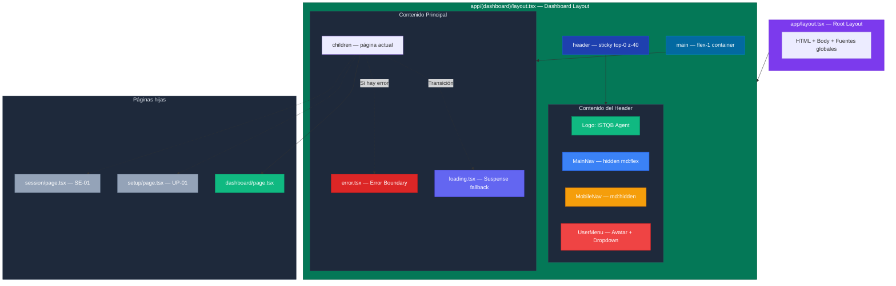
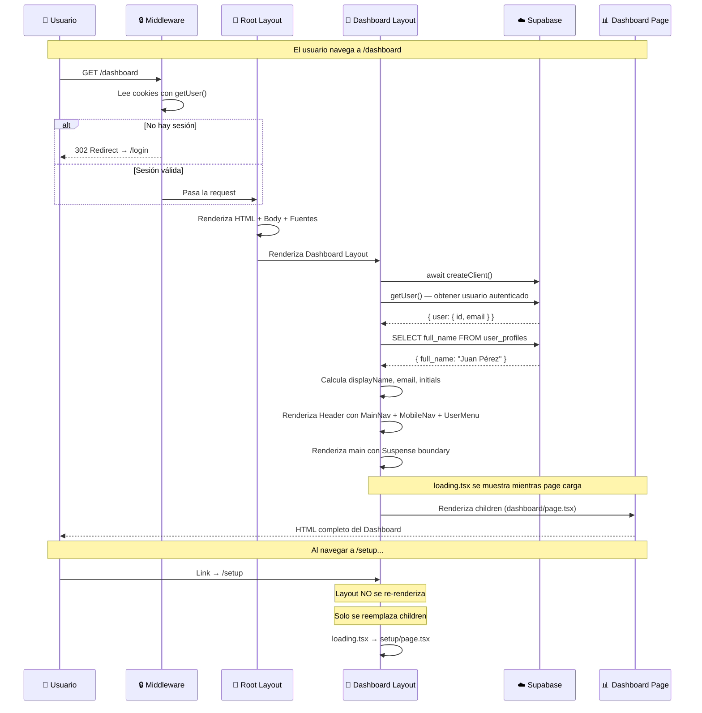

# FE-04 — Layout Base + Navegación Principal

**Guía:** FE-04  
**Bloque:** 🌐 C — Frontend Base (Next.js)  
**Objetivo:** Shell visual completo con header persistente, navegación desktop/móvil, estados de carga y error boundaries.  
**Dependencias:** [FE-01](./FE-01.md) (scaffold), [FE-03](./FE-03.md) (autenticación y middleware)  
**Estado:** ✅ Completado  
**Fecha:** Junio 2026

---

## Tabla de Contenidos

1. [🎓 Introducción y Fundamentos Conceptuales](#1--introducción-y-fundamentos-conceptuales)
2. [📋 Prerequisitos y Verificación del Entorno](#2--prerequisitos-y-verificación-del-entorno)
3. [📂 Estructura de Directorios del Proyecto](#3--estructura-de-directorios-del-proyecto)
4. [🎨 Diagrama de Arquitectura de Componentes](#4--diagrama-de-arquitectura-de-componentes)
5. [🛠️ Implementación Paso a Paso](#5-️-implementación-paso-a-paso)
6. [✅ Checkpoints de Verificación](#6--checkpoints-de-verificación)
7. [🚨 Troubleshooting — Problemas Comunes](#7--troubleshooting--problemas-comunes)
8. [📝 Resumen y Próximo Paso](#8--resumen-y-próximo-paso)

---

## 1. 🎓 Introducción y Fundamentos Conceptuales

### ¿Dónde estamos?

En **FE-03** construimos un sistema de autenticación robusto: el middleware intercepta cada petición y redirige a `/login` si no hay sesión, las páginas de registro y login usan formularios controlados con `useState`, y el callback de Supabase intercambia códigos por sesiones válidas. El usuario ya puede registrarse, iniciar sesión y ser redirigido al dashboard.

Sin embargo, una vez dentro del dashboard, la experiencia es… decepcionante. No hay menú de navegación, no hay indicador de quién eres, no hay forma elegante de cerrar sesión (tenemos un botón gigante centrado en la pantalla), y si la red es lenta, la pantalla se queda en blanco. Es como tener las llaves de un edificio nuevo pero entrar a un espacio vacío sin paredes, sin pasillos y sin señalización.

### ¿Qué vamos a construir?

En esta guía crearemos el **shell visual** (esqueleto) completo de la aplicación — la estructura persistente que envolverá todas las páginas protegidas. Cuando termines, tu app tendrá:

1. Un **Header global** con logotipo, navegación y menú de usuario
2. Una **Navegación desktop** con links activos estilizados
3. Una **Navegación móvil** con un menú hamburguesa que abre un panel lateral (Sheet)
4. Un **Loading UI** automático que muestra un spinner durante transiciones
5. Un **Error Boundary** que captura errores inesperados y ofrece un botón de reintento
6. Un **Dashboard placeholder** profesional con tarjetas métricas

> **Analogía del Edificio:** Si las guías FE-01 a FE-03 construyeron los cimientos, la estructura y las puertas de seguridad de un edificio, FE-04 es el momento en que instalas las **paredes divisorias, la señalización, los pasillos y el mostrador de recepción**. Los visitantes (usuarios) ya pueden entrar gracias a las puertas de seguridad (auth), pero necesitan saber dónde ir (navegación), quién son (perfil en el header) y qué hacer si algo falla (error boundaries). El contenido de cada oficina (las features de cada página) vendrá después, pero la estructura del edificio ya está completa.

### Concepto Clave: Layouts Anidados en Next.js App Router

Next.js App Router introduce un sistema de **layouts anidados** que es radicalmente diferente a cómo funcionaban las aplicaciones React tradicionales. Entender este concepto es fundamental para esta guía.

#### ¿Qué es un Layout?

Un layout es un componente que **envuelve** a sus hijos (páginas) y **persiste entre navegaciones**. A diferencia de una página normal que se destruye y recrea cada vez que cambias de URL, un layout se monta UNA vez y solo actualiza su prop `children`.

```
┌──────────────────────────────────────────────────────────────┐
│                    SIN LAYOUTS (SPA tradicional)               │
│                                                               │
│  Navegar de /dashboard a /setup:                              │
│  1. React desmonta TODO el DOM (header, sidebar, contenido)   │
│  2. React monta TODO de nuevo (header, sidebar, contenido)    │
│  3. El header "parpadea" → mala experiencia de usuario        │
│  4. Estado del header se pierde (menús abiertos, tooltips)    │
├───────────────────────────────────────────────────────────────┤
│                    CON LAYOUTS (Next.js App Router)            │
│                                                               │
│  Navegar de /dashboard a /setup:                              │
│  1. React MANTIENE el layout (header, sidebar intactos)       │
│  2. Solo reemplaza el contenido interno (children)            │
│  3. Transición suave, sin parpadeos                           │
│  4. Estado del layout se preserva (menús, scroll position)    │
│  5. ¡MEJOR rendimiento porque hay menos DOM que actualizar!   │
└───────────────────────────────────────────────────────────────┘
```

#### El Encadenamiento de Layouts

Next.js permite que los layouts se **aniden**. Cada carpeta puede tener su propio `layout.tsx`, y Next.js los encadena automáticamente:

```
app/layout.tsx                    ← Root Layout (HTML, Body, fuentes)
  └── app/(dashboard)/layout.tsx  ← Dashboard Layout (Header, Navegación)
        └── app/(dashboard)/dashboard/page.tsx  ← Contenido de la página
```

Cuando el usuario visita `/dashboard`, Next.js renderiza:

```tsx
// Conceptualmente, esto es lo que Next.js construye:
<RootLayout>           {/* HTML, Body, fuentes globales */}
  <DashboardLayout>    {/* Header + Navegación + Main area */}
    <DashboardPage />  {/* Contenido específico de /dashboard */}
  </DashboardLayout>
</RootLayout>
```

Si el usuario navega a `/setup`, Next.js **NO desmonta** `RootLayout` ni `DashboardLayout`. Solo reemplaza `<DashboardPage />` por `<SetupPage />`. El header y la navegación permanecen intactos.

> [!IMPORTANT]
> Los layouts son **Server Components por defecto** en Next.js App Router. Esto significa que pueden hacer operaciones del servidor (como leer cookies o consultar la base de datos) sin añadir JavaScript al bundle del navegador. Nuestro Dashboard Layout aprovechará esto para leer el perfil del usuario autenticado.

### Server Components vs Client Components: La Frontera en el Layout

En nuestro layout vamos a crear una **frontera** entre Server y Client Components que es muy importante entender:

```
┌─────────────────────────────────────────────────────────────┐
│  Dashboard Layout (layout.tsx) ← SERVER COMPONENT           │
│                                                              │
│  ✅ Puede hacer: await createClient() para leer la sesión    │
│  ✅ Puede hacer: query a user_profiles para obtener nombre   │
│  ✅ Puede hacer: redirect() si no hay sesión                 │
│  ❌ NO puede: manejar clicks, useState, useEffect            │
│                                                              │
│  Pasa datos como PROPS a sus hijos Client Components:        │
│                                                              │
│  ┌───────────────────────────────────────────────────────┐   │
│  │  UserMenu (user-menu.tsx) ← CLIENT COMPONENT          │   │
│  │                                                        │   │
│  │  Recibe: { email: string, name: string }               │   │
│  │  ✅ Puede: onClick, useState, useRouter                │   │
│  │  ✅ Puede: manejar el Dropdown Menu interactivo        │   │
│  │  ✅ Puede: llamar supabase.auth.signOut()              │   │
│  └───────────────────────────────────────────────────────┘   │
│                                                              │
│  ┌───────────────────────────────────────────────────────┐   │
│  │  MainNav (main-nav.tsx) ← CLIENT COMPONENT             │   │
│  │                                                        │   │
│  │  ✅ Puede: usePathname() para resaltar link activo     │   │
│  │  ✅ Puede: Links con navegación del lado del cliente   │   │
│  └───────────────────────────────────────────────────────┘   │
│                                                              │
│  ┌───────────────────────────────────────────────────────┐   │
│  │  MobileNav (mobile-nav.tsx) ← CLIENT COMPONENT         │   │
│  │                                                        │   │
│  │  ✅ Puede: useState para controlar apertura del Sheet  │   │
│  │  ✅ Puede: usePathname() para resaltar link activo     │   │
│  │  ✅ Puede: cerrar el Sheet al navegar                  │   │
│  └───────────────────────────────────────────────────────┘   │
└─────────────────────────────────────────────────────────────┘
```

Este patrón se llama **Server-to-Client composition** (composición de servidor a cliente): el Server Component obtiene los datos seguros y los pasa como props a los Client Components interactivos. Es la forma recomendada por el equipo de Next.js de combinar datos del servidor con interactividad del cliente.

### La Convención `_components` (Guión Bajo)

En Next.js App Router, **cada archivo** dentro de `app/` puede convertirse en una ruta pública si tiene el nombre correcto (`page.tsx`, `route.ts`, etc.). Para crear componentes auxiliares que NO sean rutas, usamos la convención del **guión bajo** (underscore):

```
app/(dashboard)/
├── _components/         ← Carpeta con guión bajo = Next.js la IGNORA como ruta
│   ├── user-menu.tsx    ← Componente auxiliar (NO es una ruta)
│   ├── main-nav.tsx     ← Componente auxiliar (NO es una ruta)
│   └── mobile-nav.tsx   ← Componente auxiliar (NO es una ruta)
├── layout.tsx           ← Layout del dashboard (SÍ es un archivo especial)
├── loading.tsx          ← Loading UI automático (SÍ es un archivo especial)
├── error.tsx            ← Error Boundary (SÍ es un archivo especial)
└── dashboard/
    └── page.tsx         ← Página /dashboard (SÍ es una ruta)
```

> [!NOTE]
> Alternativamente, podrías poner estos componentes en `components/shared/`. Sin embargo, la convención `_components` dentro del route group tiene una ventaja: **colocalización**. Los componentes que solo usa el dashboard viven junto al dashboard. Si algún día eliminas el dashboard, eliminas la carpeta y todo se va junto. Es el principio de "Feature Folders" (carpetas por feature) en arquitectura frontend.

### React Suspense y `loading.tsx`

Next.js App Router tiene soporte nativo para **React Suspense** a través de archivos especiales. Cuando creas un `loading.tsx` en una carpeta, Next.js automáticamente envuelve las páginas hijas en un `<Suspense>` boundary:

```tsx
// Lo que Next.js construye internamente cuando tienes loading.tsx:
<Suspense fallback={<Loading />}>
  <DashboardPage />
</Suspense>
```

Esto significa que:
1. Mientras `DashboardPage` está cargando datos (operaciones `await`), Next.js muestra el contenido de `loading.tsx`
2. Cuando los datos llegan, Next.js reemplaza el fallback con el contenido real
3. El **layout persiste** durante todo el proceso — solo el área de contenido muestra el spinner

> **Analogía:** Es como entrar a un restaurante. El edificio (layout) ya está ahí cuando llegas. El mesero (loading) te dice "un momento mientras preparo tu mesa". Cuando tu mesa está lista, el mesero desaparece y ves tu comida (page). En ningún momento el restaurante desaparece y reaparece.

### Error Boundaries con `error.tsx`

De manera similar, `error.tsx` actúa como un **React Error Boundary** automático. Si un componente hijo lanza un error no capturado, Next.js muestra el contenido de `error.tsx` en lugar de crashear toda la aplicación:

```tsx
// Lo que Next.js construye internamente cuando tienes error.tsx:
<ErrorBoundary fallback={<ErrorComponent />}>
  <Suspense fallback={<Loading />}>
    <DashboardPage />
  </Suspense>
</ErrorBoundary>
```

> [!IMPORTANT]
> `error.tsx` **DEBE ser un Client Component** (`'use client'`). Esto es un requisito de React: los Error Boundaries necesitan el método `componentDidCatch` del ciclo de vida, que solo existe en el cliente. Next.js pasa automáticamente las props `error` (el Error object) y `reset` (función para reintentar).

### CSS: Sticky Header, Backdrop Blur y Z-Index Stacking

El header que construiremos usa técnicas CSS modernas que vale la pena entender:

```
┌──────────────────────────────────────────────────────────────┐
│  TÉCNICA: sticky top-0                                        │
│                                                               │
│  position: sticky hace que el header "se pegue" al tope       │
│  del viewport cuando el usuario hace scroll.                  │
│                                                               │
│  A diferencia de position: fixed, sticky respeta el flujo     │
│  normal del documento — no necesitas padding-top extra.        │
│                                                               │
│  top-0 → se pega en la posición vertical 0 (tope del view)   │
├───────────────────────────────────────────────────────────────┤
│  TÉCNICA: backdrop-blur + transparencia                       │
│                                                               │
│  backdrop-blur aplica un blur al contenido que está DETRÁS     │
│  del elemento. Combinado con un fondo semi-transparente        │
│  (bg-slate-950/60 = 60% opacidad), crea el efecto "glass"     │
│  (vidrio esmerilado) popular en diseños modernos.              │
│                                                               │
│  supports-[backdrop-filter]:bg-slate-950/60 es un fallback:   │
│  solo aplica la transparencia si el navegador soporta          │
│  backdrop-filter. Navegadores sin soporte verán un fondo       │
│  100% sólido (bg-slate-950/80) que sigue funcionando.          │
├───────────────────────────────────────────────────────────────┤
│  TÉCNICA: z-40                                                │
│                                                               │
│  z-index controla el "apilamiento" de elementos. z-40 en      │
│  Tailwind equivale a z-index: 40. Esto asegura que el header  │
│  se renderice POR ENCIMA de los contenidos de la página        │
│  cuando el usuario hace scroll, y también por encima de        │
│  otros elementos con z-index menor.                            │
│                                                               │
│  Escala recomendada de z-index:                                │
│    z-10: Elementos elevados (cards con hover)                  │
│    z-20: Popovers, tooltips                                    │
│    z-30: Navegación secundaria                                 │
│    z-40: Header principal (NUESTRO CASO)                       │
│    z-50: Modales, overlays, sheets                             │
└───────────────────────────────────────────────────────────────┘
```

### Navegación Responsiva: La Estrategia Desktop + Mobile

En el diseño web profesional, la navegación cambia según el tamaño de pantalla:

- **Desktop (≥768px)**: Los links de navegación se muestran horizontalmente en el header como texto
- **Mobile (<768px)**: Los links se ocultan y aparece un **icono hamburguesa** (☰) que abre un panel lateral

Tailwind CSS hace esto extremadamente sencillo con sus utilidades responsivas:

```css
/* hidden        → oculto en TODAS las pantallas */
/* md:flex       → visible como flex en pantallas ≥768px */
/* Resultado: solo visible en desktop */
className="hidden md:flex"

/* md:hidden     → oculto en pantallas ≥768px */
/* Resultado: solo visible en mobile */
className="md:hidden"
```

Para el panel lateral en mobile usaremos el componente **Sheet** de shadcn/ui, que es un drawer/panel que se desliza desde un borde de la pantalla. Internamente usa Radix UI Dialog con animaciones CSS.

---

## 2. 📋 Prerequisitos y Verificación del Entorno

Antes de comenzar, verifica que tienes TODO lo necesario. Abre una terminal de **PowerShell** y ejecuta cada comando.

### 2.1 Herramientas y Runtimes

| Prerequisito | Comando de Verificación | Versión Mínima |
|---|---|---|
| Node.js | `node --version` | v18.17+ |
| npm | `npm --version` | v9+ |
| TypeScript | `npx tsc --version` | v5+ |
| Git | `git --version` | v2.30+ |

```powershell
node --version
```

**Salida esperada:**
```
v20.14.0
```

```powershell
npm --version
```

**Salida esperada:**
```
10.7.0
```

### 2.2 Entregables de FE-03 que DEBEN existir

| Entregable | Ruta | Verificación |
|---|---|---|
| Middleware de protección | `frontend/middleware.ts` | El archivo existe y protege `/dashboard` |
| Login funcional | `frontend/app/(auth)/login/page.tsx` | Puedes iniciar sesión con un usuario válido |
| Register funcional | `frontend/app/(auth)/register/page.tsx` | Puedes registrar un nuevo usuario |
| Callback route | `frontend/app/auth/callback/route.ts` | El archivo existe |
| Dashboard placeholder | `frontend/app/(dashboard)/dashboard/page.tsx` | Existe (lo modificaremos) |
| Cliente Supabase server | `frontend/lib/supabase/server.ts` | Existe y exporta `createClient` |
| Cliente Supabase browser | `frontend/lib/supabase/client.ts` | Existe y exporta `createClient` |

**Verificación rápida en PowerShell:**

```powershell
cd c:\Users\jsife\OneDrive\Desktop\Repositorios\practica-testing\frontend
Test-Path middleware.ts
Test-Path "app/(auth)/login/page.tsx"
Test-Path "app/(dashboard)/dashboard/page.tsx"
Test-Path "lib/supabase/server.ts"
Test-Path "lib/supabase/client.ts"
```

**Salida esperada (todas deben ser `True`):**
```
True
True
True
True
True
```

> [!WARNING]
> Si alguno retorna `False`, regresa a la guía correspondiente (FE-02 o FE-03) y complétala antes de continuar. Esta guía asume que el middleware y la autenticación están completamente funcionales.

### 2.3 Verificar que puedes iniciar sesión

Antes de construir el layout, asegúrate de que el flujo de autenticación funciona:

1. Ejecuta `npm run dev` desde `frontend/`
2. Navega a `http://localhost:3000/register` y crea un usuario de prueba
3. Verifica que eres redirigido a `/dashboard`
4. Si ya tienes un usuario, ve a `http://localhost:3000/login` e inicia sesión

> [!TIP]
> Si no recuerdas las credenciales de tu usuario de prueba, puedes crear uno nuevo rápidamente. El trigger de DB-05 creará automáticamente el perfil en `user_profiles`.

### 2.4 Instalación de componentes shadcn/ui faltantes

El header requiere componentes interactivos que aún no tenemos. Ejecuta en PowerShell desde la carpeta `frontend`:

```powershell
cd c:\Users\jsife\OneDrive\Desktop\Repositorios\practica-testing\frontend
npx shadcn@latest add dropdown-menu sheet avatar
```

**Salida esperada:**
```
✔ Checking registry.
✔ Installing dependencies.
✔ Created 3 files:
  - components/ui/dropdown-menu.tsx
  - components/ui/sheet.tsx
  - components/ui/avatar.tsx
```

**¿Qué hace cada componente?**

| Componente | Propósito en FE-04 | Componente base |
|---|---|---|
| `dropdown-menu` | Menú desplegable del avatar del usuario (nombre, email, logout) | Radix UI DropdownMenu |
| `sheet` | Panel lateral que se desliza para la navegación móvil (hamburguesa) | Radix UI Dialog |
| `avatar` | Círculo con las iniciales del usuario en el header | Radix UI Avatar |

**Verificación de la instalación:**

```powershell
Test-Path "components/ui/dropdown-menu.tsx"
Test-Path "components/ui/sheet.tsx"
Test-Path "components/ui/avatar.tsx"
```

**Salida esperada:**
```
True
True
True
```

### 2.5 Resumen de prerequisitos

| # | Prerequisito | Comando | ¿Listo? |
|---|---|---|---|
| 1 | Node.js v18+ | `node --version` | ☐ |
| 2 | npm v9+ | `npm --version` | ☐ |
| 3 | Middleware funcional (FE-03) | `Test-Path frontend/middleware.ts` | ☐ |
| 4 | Login/Register funcional (FE-03) | Puedes iniciar sesión | ☐ |
| 5 | Clientes Supabase (FE-02) | `Test-Path frontend/lib/supabase/server.ts` | ☐ |
| 6 | shadcn/ui: dropdown-menu | `Test-Path frontend/components/ui/dropdown-menu.tsx` | ☐ |
| 7 | shadcn/ui: sheet | `Test-Path frontend/components/ui/sheet.tsx` | ☐ |
| 8 | shadcn/ui: avatar | `Test-Path frontend/components/ui/avatar.tsx` | ☐ |

---

## 3. 📂 Estructura de Directorios del Proyecto

### 3.1 Estado ANTES de esta guía

```
practica-testing/
│
├── .env.local                           # ✅ EXISTENTE (DB-01)
├── .gitignore                           # ✅ EXISTENTE
│
├── backend/                             # ✅ EXISTENTE (BE-01 a BE-06)
│   ├── app/
│   │   ├── main.py
│   │   ├── routers/
│   │   ├── services/
│   │   ├── models/
│   │   └── core/
│   ├── tests/
│   ├── Dockerfile
│   └── requirements.txt
│
├── supabase/                            # ✅ EXISTENTE (DB-01 a DB-05)
│   ├── config.toml
│   └── migrations/
│
├── docs/                                # ✅ EXISTENTE
│   ├── guides/
│   │   ├── be/                          # BE-01 a BE-06
│   │   ├── db/                          # DB-01 a DB-05
│   │   └── fe/                          # FE-01 a FE-03
│   └── roadmap/
│       └── ISTQB_Guias_Implementacion.md
│
├── frontend/                            # ✅ EXISTENTE (FE-01 a FE-03)
│   ├── app/
│   │   ├── (auth)/                      # ✅ EXISTENTE (FE-03)
│   │   │   ├── layout.tsx               # Layout centrado para auth
│   │   │   ├── login/page.tsx           # Página de login
│   │   │   └── register/page.tsx        # Página de registro
│   │   ├── auth/
│   │   │   └── callback/route.ts        # ✅ EXISTENTE (FE-03)
│   │   ├── (dashboard)/                 # ✅ EXISTENTE (FE-03)
│   │   │   └── dashboard/
│   │   │       └── page.tsx             # Placeholder con botón logout
│   │   ├── globals.css                  # ✅ EXISTENTE (FE-01)
│   │   ├── layout.tsx                   # Root Layout (FE-01)
│   │   ├── page.tsx                     # Landing page (FE-02)
│   │   └── supabase-client-test.tsx     # ✅ EXISTENTE (FE-02)
│   │
│   ├── components/
│   │   ├── shared/                      # ✅ EXISTENTE (vacío)
│   │   └── ui/
│   │       ├── avatar.tsx               # ✅ EXISTENTE (Paso 2.4)
│   │       ├── button.tsx               # ✅ EXISTENTE (FE-01)
│   │       ├── dropdown-menu.tsx        # ✅ EXISTENTE (Paso 2.4)
│   │       ├── input.tsx                # ✅ EXISTENTE (FE-03)
│   │       ├── label.tsx                # ✅ EXISTENTE (FE-03)
│   │       └── sheet.tsx                # ✅ EXISTENTE (Paso 2.4)
│   │
│   ├── lib/
│   │   ├── supabase/
│   │   │   ├── client.ts               # ✅ EXISTENTE (FE-02)
│   │   │   └── server.ts               # ✅ EXISTENTE (FE-02)
│   │   └── utils.ts                     # ✅ EXISTENTE (FE-01)
│   │
│   ├── types/
│   │   ├── database.ts                  # ✅ EXISTENTE (FE-02)
│   │   └── index.ts                     # ✅ EXISTENTE (FE-02)
│   │
│   ├── middleware.ts                     # ✅ EXISTENTE (FE-03)
│   ├── .env.local                       # ✅ EXISTENTE (FE-01)
│   ├── components.json                  # ✅ EXISTENTE (FE-01)
│   ├── next.config.ts                   # ✅ EXISTENTE (FE-01)
│   ├── package.json                     # ✅ EXISTENTE (FE-01)
│   ├── postcss.config.mjs               # ✅ EXISTENTE (FE-01)
│   └── tsconfig.json                    # ✅ EXISTENTE (FE-01)
│
└── dev-tools/                           # ✅ EXISTENTE
```

### 3.2 Estado DESPUÉS de completar esta guía

```
practica-testing/
│
├── frontend/
│   ├── app/
│   │   ├── (auth)/                      # Sin cambios
│   │   │   ├── layout.tsx
│   │   │   ├── login/page.tsx
│   │   │   └── register/page.tsx
│   │   │
│   │   ├── auth/callback/route.ts       # Sin cambios
│   │   │
│   │   ├── (dashboard)/
│   │   │   ├── _components/             # 🆕 NUEVO — Carpeta de componentes del dashboard
│   │   │   │   ├── user-menu.tsx        # 🆕 NUEVO — Avatar + Dropdown de usuario
│   │   │   │   ├── main-nav.tsx         # 🆕 NUEVO — Links de navegación desktop
│   │   │   │   └── mobile-nav.tsx       # 🆕 NUEVO — Hamburguesa + Sheet para móvil
│   │   │   ├── layout.tsx               # 🆕 NUEVO — Dashboard Layout (header + contenido)
│   │   │   ├── loading.tsx              # 🆕 NUEVO — Spinner de carga automático
│   │   │   ├── error.tsx                # 🆕 NUEVO — Error Boundary con reintento
│   │   │   └── dashboard/
│   │   │       └── page.tsx             # 📝 SE MODIFICA — Dashboard mejorado
│   │   │
│   │   ├── globals.css                  # Sin cambios
│   │   ├── layout.tsx                   # Sin cambios (Root Layout)
│   │   ├── page.tsx                     # Sin cambios (Landing)
│   │   └── supabase-client-test.tsx     # Sin cambios
│   │
│   ├── components/ui/                   # Sin cambios (+ avatar, dropdown, sheet ya instalados)
│   ├── lib/supabase/                    # Sin cambios
│   ├── types/                           # Sin cambios
│   └── middleware.ts                     # Sin cambios
│
├── docs/guides/fe/
│   ├── FE-01.md
│   ├── FE-02.md
│   ├── FE-03.md
│   └── FE-04.md                         # 🆕 NUEVO — Esta guía
│
└── (resto del proyecto sin cambios)
```

### 3.3 Resumen de cambios en esta guía

| Acción | Archivo | Propósito |
|---|---|---|
| **CREAR** | `app/(dashboard)/_components/user-menu.tsx` | Menú de usuario con avatar y logout |
| **CREAR** | `app/(dashboard)/_components/main-nav.tsx` | Navegación desktop con links activos |
| **CREAR** | `app/(dashboard)/_components/mobile-nav.tsx` | Navegación móvil con Sheet (hamburguesa) |
| **CREAR** | `app/(dashboard)/layout.tsx` | Layout principal del dashboard |
| **CREAR** | `app/(dashboard)/loading.tsx` | Estado de carga automático |
| **CREAR** | `app/(dashboard)/error.tsx` | Error Boundary con botón de reintento |
| **MODIFICAR** | `app/(dashboard)/dashboard/page.tsx` | Dashboard profesional con tarjetas placeholder |

---

## 4. 🎨 Diagrama de Arquitectura de Componentes

### 4.1 Jerarquía de Layouts y Componentes



**Leyenda de colores:**
- 🟣 **Morado:** Root Layout (HTML/Body)
- 🟢 **Verde:** Dashboard Layout y elementos activos
- 🔵 **Azul:** Header y navegación desktop
- 🟡 **Amarillo:** Navegación mobile
- 🔴 **Rojo:** UserMenu y Error Boundary
- ⚪ **Gris:** Elementos futuros (páginas de UP-01, SE-01)

### 4.2 Flujo de una Petición a través de los Layouts



---

## 5. 🛠️ Implementación Paso a Paso

---

### Paso A: Crear la carpeta `_components` del Dashboard

Antes de crear los componentes, necesitamos la carpeta que los contendrá. El guión bajo (`_`) le indica a Next.js que esta carpeta **no es una ruta pública**.

**Ejecuta en PowerShell:**

```powershell
cd c:\Users\jsife\OneDrive\Desktop\Repositorios\practica-testing\frontend
New-Item -ItemType Directory -Path "app/(dashboard)/_components" -Force
```

**Salida esperada:**
```
    Directory: C:\Users\jsife\OneDrive\Desktop\Repositorios\practica-testing\frontend\app\(dashboard)

Mode                 LastWriteTime         Length Name
----                 -------------         ------ ----
d----           6/21/2026  6:00 PM                _components
```

**Verificación:**

```powershell
Test-Path "app/(dashboard)/_components"
```

**Salida esperada:**
```
True
```

> [!TIP]
> Si la carpeta `(dashboard)` no existe, créala primero: `New-Item -ItemType Directory -Path "app/(dashboard)" -Force`. En FE-01 la creamos como carpeta vacía con `.gitkeep`, y en FE-03 agregamos `dashboard/page.tsx`.

**🎯 Entregables del Paso A:**
- [ ] Carpeta `app/(dashboard)/_components/` creada
- [ ] Verificado que la carpeta existe con `Test-Path`

---

### Paso B: Componente de Navegación Principal (Desktop)

Este componente muestra los links de navegación en pantallas de escritorio. Es un **Client Component** porque usa `usePathname()` para detectar la ruta activa y estilizar el link correspondiente.

**Archivo a crear:** `frontend/app/(dashboard)/_components/main-nav.tsx`  
**Ruta completa:** `c:\Users\jsife\OneDrive\Desktop\Repositorios\practica-testing\frontend\app\(dashboard)\_components\main-nav.tsx`

```tsx
'use client';

// ============================================================
// _components/main-nav.tsx — Navegación Desktop
// ============================================================
// DIRECTIVA: 'use client' es OBLIGATORIO aquí porque:
//   - usePathname() es un hook de React → solo funciona en Client Components
//   - Los hooks acceden a APIs del navegador (la URL actual del browser)
//
// VISIBILIDAD: Este componente solo se muestra en pantallas ≥768px
// gracias a la clase "hidden md:flex". En móvil se oculta y se
// reemplaza por MobileNav (el componente con el menú hamburguesa).
//
// PATRÓN: Usa un array de rutas para generar los links dinámicamente.
// Esto facilita agregar nuevas rutas en el futuro sin tocar el JSX.
// ============================================================

import Link from 'next/link';
import { usePathname } from 'next/navigation';

// ─── Definición de rutas de la aplicación ───
// Cada objeto tiene un href (la ruta URL) y un label (texto visible).
// Estas rutas deben coincidir con las que el middleware protege en FE-03.
const routes = [
  { href: '/dashboard', label: 'Dashboard' },
  { href: '/setup', label: 'Mi Plan' },
  { href: '/session', label: 'Sesión Actual' },
];

export function MainNav() {
  // usePathname() retorna la ruta actual del navegador, por ejemplo "/dashboard".
  // Lo usamos para determinar cuál link está "activo" y estilizarlo diferente.
  const pathname = usePathname();

  return (
    // ─── Contenedor de navegación ───
    // hidden     → oculto por defecto (mobile first)
    // md:flex    → visible como flex en pantallas ≥768px (breakpoint "md" de Tailwind)
    // items-center → centra verticalmente los links dentro del nav
    // space-x-6   → 1.5rem (24px) de espacio horizontal entre cada link
    // text-sm     → tamaño de fuente 0.875rem (14px) — sutil pero legible
    // font-medium → peso de fuente 500 — ni thin ni bold, equilibrado
    <nav className="hidden md:flex items-center space-x-6 text-sm font-medium">
      {routes.map((route) => (
        <Link
          key={route.href}
          href={route.href}
          className={`
            transition-colors       
            hover:text-emerald-400  
            ${
              // ─── Lógica de "link activo" ───
              // pathname.startsWith() en lugar de pathname === porque:
              // - /dashboard/settings también debería resaltar "Dashboard"
              // - /session/abc123/theory también debería resaltar "Sesión Actual"
              // El link activo se muestra en verde esmeralda (emerald-400),
              // los inactivos en gris (slate-400).
              pathname.startsWith(route.href)
                ? 'text-emerald-400'   // ← Link activo: verde esmeralda
                : 'text-slate-400'     // ← Link inactivo: gris tenue
            }
          `}
        >
          {route.label}
        </Link>
      ))}
    </nav>
  );
}
```

**¿Por qué `pathname.startsWith()` y no `pathname === route.href`?**

Imagina que el usuario está en `/dashboard/settings` (una futura sub-página). Con `===`, ningún link se resaltaría porque `/dashboard/settings !== /dashboard`. Con `startsWith()`, el link "Dashboard" se resaltaría correctamente porque `/dashboard/settings`.startsWith(`/dashboard`) es `true`.

> [!NOTE]
> En el futuro, cuando agregues más páginas dentro de cada sección (por ejemplo `/setup/preview` o `/session/abc123/quiz`), el link correspondiente se resaltará automáticamente gracias a `startsWith()`. No necesitarás modificar este componente.

**🎯 Entregables del Paso B:**
- [ ] Archivo `app/(dashboard)/_components/main-nav.tsx` creado
- [ ] El componente tiene `'use client'` como primera línea
- [ ] Usa `usePathname()` para determinar el link activo
- [ ] Tiene la clase `hidden md:flex` (solo visible en desktop)

---

### Paso C: Componente de Navegación Móvil (Hamburguesa + Sheet)

Este es un componente **nuevo** que no existía en la versión anterior de FE-04. Resuelve el requisito del roadmap: *"En celular (375px) la navegación es usable"*.

En mobile, los links de texto del desktop se reemplazan por un **icono de hamburguesa** (☰) que, al tocarlo, abre un **Sheet** (panel lateral) con los links de navegación apilados verticalmente.

**Archivo a crear:** `frontend/app/(dashboard)/_components/mobile-nav.tsx`  
**Ruta completa:** `c:\Users\jsife\OneDrive\Desktop\Repositorios\practica-testing\frontend\app\(dashboard)\_components\mobile-nav.tsx`

```tsx
'use client';

// ============================================================
// _components/mobile-nav.tsx — Navegación Mobile (Hamburguesa)
// ============================================================
// DIRECTIVA: 'use client' porque:
//   - useState → controla si el Sheet está abierto o cerrado
//   - usePathname → detecta la ruta activa para estilizar links
//   - useEffect → cierra el Sheet automáticamente al navegar
//   - onClick handlers → en el botón hamburguesa y los links
//
// VISIBILIDAD: Solo se muestra en pantallas <768px (md:hidden).
// En desktop está completamente oculto y MainNav toma el control.
//
// COMPONENTE SHEET: shadcn/ui Sheet es un drawer/panel que se
// desliza desde un borde de la pantalla. Internamente usa
// Radix UI Dialog con animaciones CSS de transform.
// Configuramos side="left" para que se deslice desde la izquierda,
// que es la convención más común en apps mobile.
// ============================================================

import { useState, useEffect } from 'react';
import Link from 'next/link';
import { usePathname } from 'next/navigation';
import { Menu, X } from 'lucide-react';
import { Button } from '@/components/ui/button';
import {
  Sheet,
  SheetContent,
  SheetTrigger,
  SheetTitle,
  SheetClose,
} from '@/components/ui/sheet';

// ─── Rutas (mismas que MainNav para consistencia) ───
// IMPORTANTE: Si agregas rutas nuevas aquí, agrégalas también en main-nav.tsx.
// En un proyecto más grande, podrías extraer este array a un archivo compartido
// como lib/navigation.ts y importarlo en ambos componentes.
const routes = [
  { href: '/dashboard', label: 'Dashboard', emoji: '📊' },
  { href: '/setup', label: 'Mi Plan', emoji: '📋' },
  { href: '/session', label: 'Sesión Actual', emoji: '📖' },
];

export function MobileNav() {
  // ─── Estado del Sheet ───
  // open: controla si el panel lateral está visible
  // setOpen: función para cambiarlo
  const [open, setOpen] = useState(false);

  // ─── Ruta actual ───
  const pathname = usePathname();

  // ─── Cerrar Sheet automáticamente al navegar ───
  // useEffect con [pathname] se ejecuta cada vez que la URL cambia.
  // Esto asegura que cuando el usuario toca un link dentro del Sheet,
  // el panel se cierra automáticamente después de la navegación.
  // Sin esto, el Sheet permanecería abierto mostrando la página anterior.
  useEffect(() => {
    setOpen(false);
  }, [pathname]);

  return (
    // ─── Contenedor ───
    // md:hidden → OCULTO en pantallas ≥768px (solo visible en mobile)
    // Este div envuelve todo el componente del Sheet para que
    // desaparezca completamente en desktop.
    <div className="md:hidden">
      {/* ─── Sheet de shadcn/ui ───
          open y onOpenChange proporcionan "controlled state":
          el Sheet se abre/cierra basado en nuestro state,
          no en su estado interno. Esto nos permite cerrarlo
          programáticamente (por ejemplo, al navegar). */}
      <Sheet open={open} onOpenChange={setOpen}>

        {/* ─── Trigger: Botón Hamburguesa ───
            SheetTrigger renderiza el elemento que abre el Sheet.
            asChild le dice a Radix que use el Button hijo como
            trigger en lugar de crear un elemento wrapper adicional. */}
        <SheetTrigger asChild>
          <Button
            variant="ghost"
            size="icon"
            className="text-slate-400 hover:text-white hover:bg-slate-800"
            aria-label="Abrir menú de navegación"
          >
            {/* ─── Icono de hamburguesa ───
                Menu es un icono de lucide-react (3 líneas horizontales).
                h-5 w-5 = 20x20px, tamaño estándar para iconos de acción. */}
            <Menu className="h-5 w-5" />
          </Button>
        </SheetTrigger>

        {/* ─── Contenido del Panel Lateral ───
            side="left" → el panel se desliza desde la izquierda
            Las clases de estilo mantienen la coherencia visual con
            el esquema de colores oscuro del resto de la app.
            w-[280px] → ancho fijo de 280px, cómodo para texto y emojis. */}
        <SheetContent
          side="left"
          className="w-[280px] bg-slate-950 border-slate-800 text-slate-50"
        >
          {/* ─── Título del Sheet (accesibilidad) ───
              SheetTitle es requerido por Radix UI para accesibilidad.
              Los screen readers necesitan un título para identificar
              el panel. Si no lo incluyes, Radix lanza un warning. */}
          <SheetTitle className="text-lg font-bold text-white mb-2">
            ISTQB <span className="text-emerald-400">Agent</span>
          </SheetTitle>

          {/* ─── Separador visual ─── */}
          <div className="border-b border-slate-800 mb-4" />

          {/* ─── Links de navegación ─── */}
          <nav className="flex flex-col space-y-1">
            {routes.map((route) => (
              <SheetClose asChild key={route.href}>
                {/* SheetClose envuelve cada Link para que el Sheet
                    se cierre automáticamente al hacer click.
                    asChild evita renderizar un elemento DOM extra. */}
                <Link
                  href={route.href}
                  className={`
                    flex items-center gap-3 rounded-lg px-3 py-3
                    text-sm font-medium transition-colors
                    ${
                      pathname.startsWith(route.href)
                        ? // Link activo: fondo verde sutil + texto verde
                          'bg-emerald-950/50 text-emerald-400'
                        : // Link inactivo: sin fondo + texto gris
                          'text-slate-400 hover:bg-slate-800/50 hover:text-white'
                    }
                  `}
                >
                  {/* Emoji como identificador visual del link.
                      Los emojis son más intuitivos que iconos SVG
                      para usuarios que navegan rápido. */}
                  <span className="text-lg">{route.emoji}</span>
                  {route.label}
                </Link>
              </SheetClose>
            ))}
          </nav>

          {/* ─── Footer del Sheet ─── */}
          <div className="mt-auto pt-4 border-t border-slate-800">
            <p className="text-xs text-slate-600 text-center">
              ISTQB Study Agent v1.0
            </p>
          </div>
        </SheetContent>
      </Sheet>
    </div>
  );
}
```

**¿Por qué `useEffect(() => setOpen(false), [pathname])`?**

Sin este efecto, si el usuario toca "Mi Plan" en el Sheet, la navegación ocurriría pero el Sheet permanecería abierto, cubriendo la nueva página. El efecto detecta el cambio de `pathname` y cierra el Sheet automáticamente. Es un patrón estándar en aplicaciones React con paneles laterales.

> [!IMPORTANT]
> El componente `SheetTitle` es **obligatorio** para accesibilidad. Radix UI (la librería base de shadcn) requiere que todo Dialog/Sheet tenga un título para screen readers. Si lo omites, verás un warning en la consola: `"Missing SheetTitle or SheetDescription"`. Siempre inclúyelo, aunque sea visualmente sutil.

**🎯 Entregables del Paso C:**
- [ ] Archivo `app/(dashboard)/_components/mobile-nav.tsx` creado
- [ ] Usa el componente `Sheet` de shadcn/ui con `side="left"`
- [ ] Tiene un botón hamburguesa (`Menu` icon) visible solo en mobile
- [ ] Incluye `SheetTitle` para accesibilidad
- [ ] Se cierra automáticamente al navegar (`useEffect` con `pathname`)
- [ ] Tiene la clase `md:hidden` (solo visible en mobile)

---

### Paso D: Componente de Menú de Usuario (Avatar + Dropdown)

Este componente muestra el avatar del usuario (con sus iniciales) en la esquina superior derecha del header. Al hacer click, abre un menú desplegable con el nombre, email y la opción de cerrar sesión.

Es un **Client Component** porque necesita manejar el evento `onClick` del logout y usar `useRouter` para la navegación programática.

**Archivo a crear:** `frontend/app/(dashboard)/_components/user-menu.tsx`  
**Ruta completa:** `c:\Users\jsife\OneDrive\Desktop\Repositorios\practica-testing\frontend\app\(dashboard)\_components\user-menu.tsx`

```tsx
'use client';

// ============================================================
// _components/user-menu.tsx — Menú de Usuario (Avatar + Dropdown)
// ============================================================
// DIRECTIVA: 'use client' porque:
//   - onClick handlers → para el botón de logout
//   - useRouter → para navegación programática tras logout
//   - createClient (browser) → para llamar supabase.auth.signOut()
//
// PROPS: Recibe email y name desde el Dashboard Layout (Server Component).
// Este es el patrón "Server-to-Client composition":
//   - El Server Component obtiene datos seguros (sesión, perfil)
//   - Los pasa como props a este Client Component
//   - El Client Component se encarga de la interactividad
//
// SEGURIDAD: El logout usa el cliente del NAVEGADOR (client.ts),
// no el del servidor. Esto es correcto porque signOut() necesita
// invalidar las cookies del navegador, que solo son accesibles
// desde document.cookie (el entorno del browser).
// ============================================================

import { useRouter } from 'next/navigation';
import { createClient } from '@/lib/supabase/client';
import {
  DropdownMenu,
  DropdownMenuContent,
  DropdownMenuItem,
  DropdownMenuLabel,
  DropdownMenuSeparator,
  DropdownMenuTrigger,
} from '@/components/ui/dropdown-menu';
import { Avatar, AvatarFallback } from '@/components/ui/avatar';

// ─── Props del componente ───
// Usamos una interface separada para documentar claramente qué espera este componente.
// El Dashboard Layout (Server Component) es responsable de pasar estos valores.
interface UserMenuProps {
  /** Email del usuario autenticado (ej: "juan@email.com") */
  email: string;
  /** Nombre completo del usuario (ej: "Juan Pérez") o fallback al email local */
  name: string;
}

export function UserMenu({ email, name }: UserMenuProps) {
  // ─── Router para navegación programática ───
  // useRouter() solo funciona en Client Components.
  // Lo usamos para redirigir al login después del logout.
  const router = useRouter();

  // ─── Cliente Supabase del navegador ───
  // Usamos createClient() de lib/supabase/client.ts (no server.ts)
  // porque necesitamos invalidar las cookies del NAVEGADOR.
  const supabase = createClient();

  // ─── Handler de Logout ───
  const handleLogout = async () => {
    // 1. Llamar a Supabase para invalidar la sesión.
    //    signOut() elimina las cookies de sesión del navegador
    //    y revoca el refresh token en el servidor de Supabase.
    await supabase.auth.signOut();

    // 2. Redirigir al login.
    //    router.push() hace una navegación del lado del cliente.
    router.push('/login');

    // 3. Forzar un refresh del Router Cache de Next.js.
    //    router.refresh() invalida el cache del servidor para que
    //    el middleware re-evalúe la sesión. Sin esto, el usuario
    //    podría usar el botón "Atrás" del navegador y ver la página
    //    cacheada del dashboard (aunque ya no tenga sesión).
    router.refresh();
  };

  // ─── Calcular iniciales para el avatar ───
  // "Juan Pérez" → "JP", "Ana" → "A", "maria.garcia@email.com" → "MA"
  // Tomamos las primeras letras de cada palabra, las unimos,
  // las convertimos a mayúsculas y limitamos a 2 caracteres.
  const initials = name
    .split(' ')               // "Juan Pérez" → ["Juan", "Pérez"]
    .map((n) => n[0])         // → ["J", "P"]
    .join('')                 // → "JP"
    .toUpperCase()            // → "JP" (ya estaba, pero por seguridad)
    .substring(0, 2);         // Máximo 2 caracteres (ej: si hay 3+ palabras)

  return (
    // ─── DropdownMenu de shadcn/ui ───
    // Este componente usa Radix UI DropdownMenu internamente.
    // Se compone de: Trigger (el elemento que abre el menú),
    // Content (el menú en sí) y Items (las opciones).
    <DropdownMenu>
      {/* ─── Trigger: Avatar del usuario ───
          Al hacer click en este avatar, se abre el menú.
          focus:outline-none evita el anillo de focus azul por defecto
          del browser, ya que Radix maneja su propio estilo de focus. */}
      <DropdownMenuTrigger className="focus:outline-none">
        <Avatar
          className="
            h-9 w-9              
            border border-slate-700
            bg-slate-800         
            transition-opacity   
            hover:opacity-80     
            cursor-pointer       
          "
        >
          {/* AvatarFallback muestra las iniciales.
              En el futuro, podrías agregar AvatarImage para
              mostrar una foto de perfil si el usuario sube una. */}
          <AvatarFallback className="bg-slate-800 text-slate-300 text-xs font-medium">
            {initials}
          </AvatarFallback>
        </Avatar>
      </DropdownMenuTrigger>

      {/* ─── Contenido del Dropdown ───
          align="end" → el menú se alinea al borde derecho del trigger
          w-56 → ancho fijo de 224px (suficiente para emails largos)
          Las clases de fondo y borde mantienen la coherencia visual. */}
      <DropdownMenuContent
        align="end"
        className="w-56 bg-slate-900 border-slate-800 text-slate-300"
      >
        {/* ─── Sección de información del usuario ─── */}
        <DropdownMenuLabel className="font-normal">
          <div className="flex flex-col space-y-1">
            {/* Nombre en blanco (más prominente) */}
            <p className="text-sm font-medium leading-none text-white">
              {name}
            </p>
            {/* Email en gris (secundario) */}
            <p className="text-xs leading-none text-slate-500">
              {email}
            </p>
          </div>
        </DropdownMenuLabel>

        {/* ─── Separador visual ─── */}
        <DropdownMenuSeparator className="bg-slate-800" />

        {/* ─── Opción de Cerrar Sesión ───
            El color rojo (red-400) indica una acción destructiva.
            focus:bg-red-950/50 → fondo rojo sutil al hacer hover/focus.
            cursor-pointer → indica que es clickeable. */}
        <DropdownMenuItem
          onClick={handleLogout}
          className="text-red-400 focus:bg-red-950/50 focus:text-red-300 cursor-pointer"
        >
          Cerrar Sesión
        </DropdownMenuItem>
      </DropdownMenuContent>
    </DropdownMenu>
  );
}
```

> [!TIP]
> **¿Por qué `router.push()` seguido de `router.refresh()`?** `router.push('/login')` navega al login, pero Next.js tiene un **Router Cache** que guarda las páginas visitadas recientemente. Sin `router.refresh()`, si el usuario presiona el botón "Atrás" del navegador, vería la versión cacheada del dashboard (aunque su sesión ya no existe). `router.refresh()` invalida ese cache y fuerza al middleware a re-evaluar la sesión.

**🎯 Entregables del Paso D:**
- [ ] Archivo `app/(dashboard)/_components/user-menu.tsx` creado
- [ ] Recibe `email` y `name` como props
- [ ] Calcula iniciales del nombre para el avatar
- [ ] Implementa logout con `signOut()` + `router.push()` + `router.refresh()`
- [ ] Usa componentes `DropdownMenu` y `Avatar` de shadcn/ui

---

### Paso E: Dashboard Layout (el Shell Principal)

Este es el archivo más importante de esta guía. El Dashboard Layout es un **Server Component** que envuelve todas las páginas protegidas con el header, la navegación y el área de contenido principal.

Al ser un Server Component, puede hacer operaciones del servidor como:
- Leer la sesión del usuario desde las cookies
- Consultar la tabla `user_profiles` para obtener el nombre completo
- Redirigir al login si no hay sesión (protección redundante al middleware)

**Archivo a crear:** `frontend/app/(dashboard)/layout.tsx`  
**Ruta completa:** `c:\Users\jsife\OneDrive\Desktop\Repositorios\practica-testing\frontend\app\(dashboard)\layout.tsx`

```tsx
// ============================================================
// app/(dashboard)/layout.tsx — Dashboard Layout (Shell Principal)
// ============================================================
// TIPO: Server Component (NO tiene 'use client')
//
// RESPONSABILIDADES:
//   1. Obtener la sesión del usuario autenticado
//   2. Consultar el perfil (full_name) desde user_profiles
//   3. Renderizar el header con navegación y menú de usuario
//   4. Renderizar el área de contenido (children)
//   5. Redirigir a /login si la sesión es inválida
//
// ¿POR QUÉ SERVER COMPONENT?
//   - Necesita acceder a cookies del servidor (createClient de server.ts)
//   - Necesita hacer queries a Supabase (await supabase.from(...))
//   - NO necesita interactividad (los componentes hijos se encargan)
//   - 0 KB de JavaScript enviado al navegador por este archivo
//
// PERSISTENCIA:
//   Next.js App Router MANTIENE este layout montado cuando el usuario
//   navega entre /dashboard, /setup, /session, etc.
//   Solo el contenido de {children} cambia. Esto significa que:
//   - El header nunca "parpadea" al cambiar de página
//   - Los Dropdown menus abiertos no se cierran inesperadamente
//   - El rendimiento es mejor porque hay menos DOM que re-renderizar
//
// PROTECCIÓN REDUNDANTE:
//   El middleware (FE-03) ya protege estas rutas. La verificación
//   de sesión aquí es una capa de seguridad adicional (defense in depth).
//   Si por alguna razón el middleware falla, este layout redirige.
// ============================================================

import { ReactNode } from 'react';
import Link from 'next/link';
import { redirect } from 'next/navigation';
import { createClient } from '@/lib/supabase/server';

// Importar los Client Components que renderizará este layout.
// Un Server Component PUEDE importar Client Components y renderizarlos.
// Los datos se pasan de Server → Client vía props.
import { UserMenu } from './_components/user-menu';
import { MainNav } from './_components/main-nav';
import { MobileNav } from './_components/mobile-nav';

export default async function DashboardLayout({
  children,
}: {
  children: ReactNode;
}) {
  // ═══════════════════════════════════════════════════════════
  // PASO 1: Instanciar el cliente de Supabase para el servidor
  // ═══════════════════════════════════════════════════════════
  // createClient() es async porque necesita leer las cookies
  // de next/headers. Retorna un cliente tipado con Database.
  const supabase = await createClient();

  // ═══════════════════════════════════════════════════════════
  // PASO 2: Obtener el usuario autenticado
  // ═══════════════════════════════════════════════════════════
  // getUser() valida el JWT contra el servidor de Supabase.
  // Es más seguro que getSession() porque getSession() solo
  // lee el JWT localmente sin verificar si fue revocado.
  //
  // Esta verificación es REDUNDANTE con el middleware, pero
  // implementa el principio de "defense in depth" (defensa
  // en profundidad): si el middleware falla por alguna razón,
  // este layout también protege las páginas hijas.
  const {
    data: { user },
    error,
  } = await supabase.auth.getUser();

  // Si no hay sesión válida, redirigir al login.
  // redirect() de next/navigation lanza una excepción especial
  // que Next.js captura para hacer la redirección del servidor.
  // NO USES router.push() aquí — eso es para Client Components.
  if (error || !user) {
    redirect('/login');
  }

  // ═══════════════════════════════════════════════════════════
  // PASO 3: Obtener el perfil del usuario (nombre completo)
  // ═══════════════════════════════════════════════════════════
  // La tabla user_profiles fue creada en DB-02 y se llena
  // automáticamente con el trigger de DB-05 al registrarse.
  //
  // NOTA: Usamos .maybeSingle() en lugar de .single() para
  // manejar el caso donde el perfil aún no existe (por ejemplo,
  // si el trigger de DB-05 falló o si es un usuario creado
  // directamente en el panel de Supabase sin pasar por el trigger).
  // .maybeSingle() retorna null en lugar de lanzar un error
  // cuando no hay resultados.
  const { data: profile } = await supabase
    .from('user_profiles')
    .select('full_name')
    .eq('id', user.id)
    .maybeSingle();

  // ─── Calcular valores de display ───
  // Prioridad del nombre mostrado:
  // 1. full_name de user_profiles (lo ideal, viene del registro)
  // 2. Parte local del email (antes del @) como fallback
  // 3. "Usuario" como último recurso
  const displayName =
    profile?.full_name || user.email?.split('@')[0] || 'Usuario';

  // Email para mostrar en el menú de usuario.
  // Siempre debería existir, pero TypeScript requiere el fallback.
  const email = user.email || '';

  // ═══════════════════════════════════════════════════════════
  // PASO 4: Renderizar el Shell visual
  // ═══════════════════════════════════════════════════════════
  return (
    // ─── Contenedor raíz del dashboard ───
    // flex min-h-screen → el contenedor ocupa al menos 100vh
    // flex-col → los hijos (header y main) se apilan verticalmente
    // bg-slate-950 → fondo oscuro casi negro (#020617)
    // text-slate-50 → texto claro por defecto (#f8fafc)
    <div className="flex min-h-screen flex-col bg-slate-950 text-slate-50">

      {/* ════════════════════════════════════════════════════ */}
      {/* HEADER SUPERIOR — Persistente en todas las páginas   */}
      {/* ════════════════════════════════════════════════════ */}
      <header
        className="
          sticky top-0           
          z-40                   
          w-full                 
          border-b border-slate-800
          bg-slate-950/80        
          backdrop-blur          
          supports-[backdrop-filter]:bg-slate-950/60
        "
      >
        {/* sticky top-0 → el header se "pega" al tope al hacer scroll.
            No desaparece cuando el usuario scrollea hacia abajo.

            z-40 → z-index: 40. Asegura que el header se renderice
            POR ENCIMA del contenido de la página al hacer scroll.
            Los modales y sheets usan z-50 para estar encima del header.

            w-full → ocupa el 100% del ancho del viewport.

            border-b border-slate-800 → línea gris sutil en el borde inferior
            que separa visualmente el header del contenido.

            bg-slate-950/80 → fondo oscuro con 80% de opacidad.
            El 20% de transparencia permite ver una silueta del contenido
            detrás del header al hacer scroll.

            backdrop-blur → aplica un efecto blur (desenfoque) al contenido
            que está DETRÁS del header. Combinado con la transparencia,
            crea el efecto "glass" (vidrio esmerilado) moderno.

            supports-[backdrop-filter]:bg-slate-950/60 → esta es una
            PROGRESSIVE ENHANCEMENT. Si el navegador soporta backdrop-filter
            (la mayoría modernos lo hacen), reduce la opacidad a 60% para
            que el efecto blur sea más visible. Si no lo soporta, mantiene
            el 80% de opacidad que sigue viéndose bien. */}

        {/* ─── Contenedor interior con ancho máximo ─── */}
        <div className="container mx-auto flex h-16 items-center justify-between px-4">
          {/* container → ancho máximo responsivo (por defecto max-width por breakpoint)
              mx-auto → centra el container horizontalmente
              flex → los hijos se disponen en fila horizontal
              h-16 → altura fija de 64px para el header (estándar de diseño)
              items-center → centra verticalmente los elementos
              justify-between → distribuye el espacio: logo+nav a la izquierda, avatar a la derecha
              px-4 → padding horizontal de 16px en cada lado */}

          {/* ─── LADO IZQUIERDO: Logo + Navegación ─── */}
          <div className="flex items-center gap-6 md:gap-10">
            {/* gap-6 → espacio de 24px entre logo y nav en mobile
                md:gap-10 → espacio de 40px en desktop (más holgado) */}

            {/* ─── Hamburguesa (solo mobile) ─── */}
            <MobileNav />

            {/* ─── Logotipo ─── */}
            <Link
              href="/dashboard"
              className="flex items-center space-x-2"
            >
              <span className="inline-block font-bold text-xl tracking-tight">
                ISTQB{' '}
                <span className="text-emerald-400">Agent</span>
              </span>
              {/* tracking-tight → reduce el espacio entre letras (letter-spacing)
                  para que el logotipo se vea más compacto y profesional.
                  text-emerald-400 → el verde esmeralda es el color acento
                  de nuestra marca, consistente con el login y la landing. */}
            </Link>

            {/* ─── Navegación Desktop ─── */}
            <MainNav />
          </div>

          {/* ─── LADO DERECHO: Menú de Usuario ─── */}
          {/* Le pasamos las props calculadas en el servidor.
              El UserMenu es un Client Component que recibe estos datos
              como props estáticas — no necesita hacer queries propias. */}
          <UserMenu email={email} name={displayName} />
        </div>
      </header>

      {/* ════════════════════════════════════════════════════ */}
      {/* CONTENIDO PRINCIPAL — Cambia según la página         */}
      {/* ════════════════════════════════════════════════════ */}
      <main className="flex-1 container mx-auto px-4 py-8">
        {/* flex-1 → el main ocupa todo el espacio vertical restante
            después del header. Esto empuja el contenido a llenar
            la pantalla completa incluso cuando hay poco contenido.

            container mx-auto → ancho máximo centrado (responsive)
            px-4 → padding horizontal de 16px
            py-8 → padding vertical de 32px

            {children} es donde Next.js inyecta la página actual.
            Al navegar entre /dashboard, /setup, /session, etc.,
            solo este {children} cambia. El header y su contenido
            permanecen intactos (no se re-renderizan). */}
        {children}
      </main>
    </div>
  );
}
```

> [!IMPORTANT]
> **¿Por qué `.maybeSingle()` en lugar de `.single()`?** El método `.single()` de Supabase lanza un error si la query retorna 0 o más de 1 resultado. Si el trigger de DB-05 no se ejecutó correctamente (o si el usuario se creó directamente desde el panel de Supabase), la tabla `user_profiles` podría no tener un registro para ese usuario. `.maybeSingle()` retorna `null` en lugar de lanzar un error, lo que permite que el fallback `user.email?.split('@')[0]` funcione correctamente.

> [!NOTE]
> **Sobre `redirect()` vs `router.push()`:** En Server Components, usa `redirect()` de `next/navigation`. Este método lanza una excepción especial (`NEXT_REDIRECT`) que Next.js intercepta para ejecutar la redirección en el servidor ANTES de enviar HTML al cliente. `router.push()` es para Client Components y hace una navegación del lado del cliente (JavaScript en el navegador). Usar `router.push()` en un Server Component causaría un error porque `useRouter()` es un hook que solo existe en el cliente.

**🎯 Entregables del Paso E:**
- [ ] Archivo `app/(dashboard)/layout.tsx` creado
- [ ] Es un Server Component (NO tiene `'use client'`)
- [ ] Usa `createClient` de `@/lib/supabase/server`
- [ ] Obtiene el usuario con `getUser()` y redirige si no hay sesión
- [ ] Consulta `user_profiles` con `.maybeSingle()` para obtener `full_name`
- [ ] Renderiza `MobileNav`, `MainNav` y `UserMenu` como hijos
- [ ] Pasa `email` y `displayName` como props a `UserMenu`
- [ ] El header tiene clases `sticky top-0 z-40 backdrop-blur`

---

### Paso F: Estado de Carga Global (loading.tsx)

Next.js App Router permite definir un UI de carga automático para cada segmento de ruta. Al crear `loading.tsx` dentro de `(dashboard)/`, cada página hija (/dashboard, /setup, /session) mostrará este spinner mientras carga.

**Archivo a crear:** `frontend/app/(dashboard)/loading.tsx`  
**Ruta completa:** `c:\Users\jsife\OneDrive\Desktop\Repositorios\practica-testing\frontend\app\(dashboard)\loading.tsx`

```tsx
// ============================================================
// app/(dashboard)/loading.tsx — Estado de Carga Automático
// ============================================================
// TIPO: Server Component (por defecto, no necesita 'use client')
//
// ¿CÓMO FUNCIONA?
//   Next.js App Router envuelve automáticamente cada página
//   hija en un <Suspense> boundary. Este archivo es el fallback:
//
//   <Suspense fallback={<DashboardLoading />}>
//     <DashboardPage />  ← o SetupPage, SessionPage, etc.
//   </Suspense>
//
// ¿CUÁNDO SE MUESTRA?
//   1. Durante la navegación entre páginas (client-side navigation)
//   2. Mientras un Server Component está haciendo await (data fetching)
//   3. Durante la primera carga de una página que tiene operaciones async
//
// ¿POR QUÉ ES IMPORTANTE?
//   Sin loading.tsx, la pantalla se quedaría en blanco o "congelada"
//   mientras los datos cargan. Con loading.tsx, el usuario ve feedback
//   inmediato ("algo está pasando") que mejora drásticamente la
//   percepción de velocidad (UX).
//
// NOTA: El layout (header, navegación) PERSISTE mientras este
// loading se muestra. Solo el área de contenido (main) muestra
// el spinner. El usuario puede seguir interactuando con el header.
// ============================================================

export default function DashboardLoading() {
  return (
    // ─── Contenedor centrado ───
    // min-h-[50vh] → altura mínima del 50% del viewport
    // Esto centra el spinner visualmente en el área de contenido,
    // no en toda la pantalla (porque el header sigue visible arriba).
    <div className="flex min-h-[50vh] items-center justify-center">
      <div className="flex flex-col items-center gap-4">

        {/* ─── Spinner CSS puro (sin JavaScript) ───
            h-8 w-8 → 32x32px (tamaño visible pero no invasivo)
            animate-spin → animación de rotación infinita de Tailwind
            rounded-full → hace el div circular
            border-4 → borde de 4px de grosor
            border-emerald-500 → color del borde: verde esmeralda
            border-t-transparent → el borde superior es transparente
            Resultado: un círculo que rota con un "hueco" arriba,
            creando el efecto clásico de spinner de carga. */}
        <div
          className="
            h-8 w-8
            animate-spin
            rounded-full
            border-4
            border-emerald-500
            border-t-transparent
          "
        />

        {/* ─── Texto descriptivo ───
            Mensaje sutil que informa al usuario qué está pasando.
            text-sm → fuente pequeña para no competir con el spinner.
            text-slate-400 → gris claro, discreto. */}
        <p className="text-sm text-slate-400">
          Cargando aplicación...
        </p>
      </div>
    </div>
  );
}
```

> [!TIP]
> **Spinner CSS vs librería de animación:** Usamos CSS puro (`animate-spin` + `border-t-transparent`) en lugar de una librería como `react-spinners` o Lottie. ¿Por qué? Porque este componente se renderiza en el SERVER como HTML estático. No necesita JavaScript para funcionar — la animación es 100% CSS. Si usáramos una librería que requiere `'use client'`, estaríamos enviando JavaScript innecesario al navegador solo para mostrar un spinner.

**🎯 Entregables del Paso F:**
- [ ] Archivo `app/(dashboard)/loading.tsx` creado
- [ ] Es un Server Component (sin `'use client'`)
- [ ] Muestra un spinner CSS puro con `animate-spin`
- [ ] Incluye un mensaje de texto "Cargando aplicación..."

---

### Paso G: Error Boundary Global (error.tsx)

Si una página hija lanza un error no capturado (un bug, una query que falla, una API que no responde), Next.js muestra este componente en lugar de crashear toda la aplicación. El usuario ve un mensaje amigable y tiene la opción de reintentar.

**Archivo a crear:** `frontend/app/(dashboard)/error.tsx`  
**Ruta completa:** `c:\Users\jsife\OneDrive\Desktop\Repositorios\practica-testing\frontend\app\(dashboard)\error.tsx`

```tsx
'use client';

// ============================================================
// app/(dashboard)/error.tsx — Error Boundary del Dashboard
// ============================================================
// DIRECTIVA: 'use client' es OBLIGATORIO para error.tsx.
//
// ¿POR QUÉ?
//   React Error Boundaries requieren el método componentDidCatch
//   del ciclo de vida de componentes de clase. Este método solo
//   existe en el entorno del CLIENTE (navegador). Next.js necesita
//   que error.tsx sea un Client Component para poder montar el
//   Error Boundary correctamente.
//
// PROPS AUTOMÁTICAS (Next.js las inyecta):
//   - error: El objeto Error que causó el crash
//     - error.message: Descripción del error
//     - error.digest: Hash corto generado por Next.js para tracking
//   - reset: Función que Next.js proporciona para RE-RENDERIZAR
//     el segmento de ruta que falló. Llama a esta función cuando
//     el usuario quiere "intentar de nuevo".
//
// ALCANCE:
//   Este error boundary captura errores de TODAS las páginas dentro
//   de (dashboard)/: /dashboard, /setup, /session, etc.
//   NO captura errores del layout.tsx (para eso necesitarías
//   un error.tsx en el nivel superior).
//
// LOGGING:
//   En producción, aquí podrías enviar el error a un servicio
//   de monitoreo como Sentry, DataDog o LogRocket.
// ============================================================

import { useEffect } from 'react';
import { Button } from '@/components/ui/button';

export default function DashboardError({
  error,
  reset,
}: {
  error: Error & { digest?: string };
  reset: () => void;
}) {
  // ─── Logging del error ───
  // useEffect con [error] se ejecuta cada vez que hay un nuevo error.
  // En desarrollo, esto imprime el error en la consola del navegador.
  // En producción, reemplazarías este console.error con una llamada
  // a un servicio de monitoreo (ej: Sentry.captureException(error)).
  useEffect(() => {
    console.error('Unhandled dashboard error:', error);
  }, [error]);

  return (
    // ─── UI de error centrada ───
    // min-h-[50vh] → altura mínima del 50% del viewport
    // (igual que loading.tsx para consistencia visual)
    <div className="flex min-h-[50vh] flex-col items-center justify-center gap-6 text-center">

      {/* ─── Mensaje de error ─── */}
      <div>
        {/* Título rojo que indica error claramente */}
        <h2 className="text-2xl font-bold text-red-400 mb-2">
          ¡Ups! Algo salió mal.
        </h2>

        {/* Descripción genérica (no mostramos error.message al usuario
            porque podría contener información técnica confusa o sensible) */}
        <p className="text-slate-400 max-w-md">
          Ha ocurrido un error inesperado al cargar esta página de la
          aplicación. Puedes intentar recargarla.
        </p>

        {/* ─── Digest (solo en desarrollo) ───
            error.digest es un hash corto que Next.js genera para
            correlacionar errores del servidor con los del cliente.
            Útil para debugging pero no para el usuario final. */}
        {error.digest && (
          <p className="mt-2 text-xs text-slate-600">
            Referencia: {error.digest}
          </p>
        )}
      </div>

      {/* ─── Botón de reintento ───
          reset() es una función que Next.js inyecta automáticamente.
          Al llamarla, Next.js RE-RENDERIZA el segmento de ruta que
          falló, intentando ejecutar la página de nuevo.
          Es como hacer "refresh" pero solo del contenido, no de toda
          la app (el layout y el header permanecen intactos). */}
      <Button
        onClick={() => reset()}
        className="bg-slate-800 text-white hover:bg-slate-700"
      >
        Intentar de nuevo
      </Button>
    </div>
  );
}
```

> [!WARNING]
> **Nunca muestres `error.message` directamente al usuario final.** Los mensajes de error de JavaScript pueden contener información técnica (stack traces, nombres de tablas, queries SQL) que no es útil para el usuario y podría ser un riesgo de seguridad. En su lugar, muestra un mensaje genérico y usa el `error.digest` para correlacionar en tus logs.

**🎯 Entregables del Paso G:**
- [ ] Archivo `app/(dashboard)/error.tsx` creado
- [ ] Tiene `'use client'` como primera línea (obligatorio para error boundaries)
- [ ] Recibe `error` y `reset` como props
- [ ] Usa `useEffect` para loguear el error
- [ ] Muestra un botón "Intentar de nuevo" que llama a `reset()`
- [ ] Muestra `error.digest` si existe

---

### Paso H: Actualizar el Dashboard Page (Placeholder Profesional)

Ahora que tenemos el layout con header y navegación, el dashboard placeholder de FE-03 (con el botón gigante de logout centrado) ya no tiene sentido. El logout ahora vive elegantemente en el menú de usuario (avatar → dropdown → Cerrar Sesión).

Reemplazaremos el contenido por un dashboard profesional con tarjetas métricas placeholder que se llenarán con datos reales en guías futuras (Bloque F: Dashboard Analytics).

**Archivo a MODIFICAR:** `frontend/app/(dashboard)/dashboard/page.tsx`  
**Ruta completa:** `c:\Users\jsife\OneDrive\Desktop\Repositorios\practica-testing\frontend\app\(dashboard)\dashboard\page.tsx`

```tsx
// ============================================================
// app/(dashboard)/dashboard/page.tsx — Página Principal del Dashboard
// ============================================================
// TIPO: Server Component (NO tiene 'use client')
//
// ¿POR QUÉ SERVER COMPONENT?
//   Esta página no necesita interactividad. Solo muestra contenido
//   estático (tarjetas placeholder). En guías futuras (Bloque F),
//   agregaremos data fetching aquí, que se beneficiará de ser
//   Server Component (0 KB de JS al cliente, datos seguros).
//
// LAYOUT PADRE:
//   Esta página se renderiza DENTRO de app/(dashboard)/layout.tsx.
//   El header, la navegación y el menú de usuario ya están renderizados
//   por el layout padre. Este componente solo define el CONTENIDO
//   del área principal (lo que aparece debajo del header).
//
// PLACEHOLDER:
//   Las tarjetas muestran datos simulados ("--%" , "0 / 40") que
//   se reemplazarán con datos reales de Supabase en las guías
//   del Bloque F (DA-01 a DA-03: Dashboard Analytics).
// ============================================================

export default function DashboardPage() {
  return (
    // ─── Contenedor principal ───
    // flex flex-col → apila los hijos verticalmente
    // gap-6 → 24px de espacio entre cada sección
    <div className="flex flex-col gap-6">

      {/* ─── Encabezado de la página ─── */}
      <div className="flex flex-col gap-2">
        {/* Título principal — text-3xl en desktop, grande y bold */}
        <h1 className="text-3xl font-bold tracking-tight text-white">
          Tu Dashboard
        </h1>
        {/* Subtítulo — descripción de lo que encontrará el usuario aquí */}
        <p className="text-slate-400">
          Bienvenido al centro de control. Aquí verás tus métricas de
          estudio cuando completes el Bloque F.
        </p>
      </div>

      {/* ─── Grid de tarjetas métricas ───
          grid → CSS Grid para disposición de tarjetas
          gap-4 → 16px entre tarjetas
          md:grid-cols-2 → 2 columnas en pantallas ≥768px
          lg:grid-cols-3 → 3 columnas en pantallas ≥1024px
          En mobile (<768px), las tarjetas se apilan verticalmente
          (grid-cols-1 es el default). */}
      <div className="grid gap-4 md:grid-cols-2 lg:grid-cols-3">

        {/* ─── Tarjeta 1: Nivel de Conocimiento ─── */}
        <div
          className="
            rounded-xl           
            border border-slate-800
            bg-slate-900/50      
            p-6                  
          "
        >
          {/* rounded-xl → bordes redondeados (12px)
              border border-slate-800 → borde gris sutil
              bg-slate-900/50 → fondo semi-transparente
              p-6 → padding de 24px en todos los lados */}
          <h3 className="font-semibold text-slate-200">
            Nivel de Conocimiento
          </h3>
          {/* Dato placeholder — se reemplazará con data real en Bloque F */}
          <p className="text-3xl font-bold text-emerald-400 mt-2">
            --%
          </p>
          <p className="text-xs text-slate-500 mt-1">
            Calculado en base a tus quizzes
          </p>
        </div>

        {/* ─── Tarjeta 2: Tópicos Estudiados ─── */}
        <div className="rounded-xl border border-slate-800 bg-slate-900/50 p-6">
          <h3 className="font-semibold text-slate-200">
            Tópicos Estudiados
          </h3>
          <p className="text-3xl font-bold text-blue-400 mt-2">
            0 / 40
          </p>
          <p className="text-xs text-slate-500 mt-1">
            Del syllabus ISTQB FL v4.0
          </p>
        </div>

        {/* ─── Tarjeta 3: Próxima Sesión ─── */}
        <div className="rounded-xl border border-slate-800 bg-slate-900/50 p-6">
          <h3 className="font-semibold text-slate-200">
            Próxima Sesión
          </h3>
          <p className="text-lg font-medium text-amber-400 mt-2">
            Sin plan configurado
          </p>
          <p className="text-xs text-slate-500 mt-1">
            Configura tu plan en &quot;Mi Plan&quot;
          </p>
        </div>
      </div>

      {/* ─── Sección de bienvenida ─── */}
      <div className="rounded-xl border border-slate-800 bg-slate-900/50 p-6">
        <h2 className="text-lg font-semibold text-white mb-3">
          🎯 Próximos pasos
        </h2>
        <ul className="space-y-2 text-sm text-slate-400">
          <li className="flex items-start gap-2">
            <span className="text-emerald-400 mt-0.5">1.</span>
            <span>
              Ve a <strong className="text-slate-200">&quot;Mi Plan&quot;</strong> en
              la navegación para subir tu PDF del syllabus ISTQB.
            </span>
          </li>
          <li className="flex items-start gap-2">
            <span className="text-emerald-400 mt-0.5">2.</span>
            <span>
              Configura cuántos días tienes para estudiar y genera tu plan personalizado.
            </span>
          </li>
          <li className="flex items-start gap-2">
            <span className="text-emerald-400 mt-0.5">3.</span>
            <span>
              La IA creará sesiones de teoría y quiz adaptadas a tu ritmo.
            </span>
          </li>
        </ul>
      </div>
    </div>
  );
}
```

> [!NOTE]
> **¿Por qué `&quot;` en lugar de `"`?** En JSX, las comillas dobles dentro del texto deben escaparse como `&quot;` (entidad HTML) o usar comillas simples. Si usas comillas dobles directamente, JSX puede confundirse con el cierre de un atributo. Tailwind y React no tienen problema con `&quot;`, es estándar HTML.

**🎯 Entregables del Paso H:**
- [ ] Archivo `app/(dashboard)/dashboard/page.tsx` modificado
- [ ] Ya NO es un Client Component (removido `'use client'`)
- [ ] Ya NO tiene el botón de logout (movido al UserMenu)
- [ ] Tiene 3 tarjetas métricas placeholder en un grid responsivo
- [ ] Tiene una sección de "Próximos pasos" con instrucciones claras

---

### Paso I: Verificación Responsiva y Testing Visual

Este paso no crea archivos nuevos, pero es crucial para verificar que todo funciona correctamente tanto en desktop como en mobile.

#### I.1 — Iniciar el servidor de desarrollo

```powershell
cd c:\Users\jsife\OneDrive\Desktop\Repositorios\practica-testing\frontend
npm run dev
```

**Salida esperada:**
```
> frontend@0.1.0 dev
> next dev

  ▲ Next.js 15.3.3
  - Local:        http://localhost:3000
  - Environments: .env.local

 ✓ Starting...
 ✓ Ready in 2.8s
```

#### I.2 — Verificar TypeScript

En otra terminal (sin detener el servidor):

```powershell
cd c:\Users\jsife\OneDrive\Desktop\Repositorios\practica-testing\frontend
npx tsc --noEmit
```

**Salida esperada:**
```
(sin output = sin errores de tipos)
```

> [!WARNING]
> Si ves errores de TypeScript, las causas más comunes son:
> - Import incorrecto de `@/lib/supabase/server` vs `@/lib/supabase/client`
> - Falta de `'use client'` en componentes que usan hooks
> - Props faltantes al usar componentes de shadcn/ui
> Revisa los errores uno a uno antes de continuar.

#### I.3 — Testing en Desktop (≥768px)

1. Abre `http://localhost:3000/login` en el navegador
2. Inicia sesión con tu usuario de prueba
3. Verifica que eres redirigido a `/dashboard`

**Lo que debes ver en desktop:**
- Header fijo con efecto glass (blur) en la parte superior
- Logo "ISTQB Agent" a la izquierda
- Links de navegación: "Dashboard" (verde), "Mi Plan" (gris), "Sesión Actual" (gris)
- Avatar con tus iniciales a la derecha
- 3 tarjetas métricas en el contenido principal
- Sección de "Próximos pasos"

#### I.4 — Testing en Mobile (375px)

Usa las DevTools del navegador para simular un dispositivo móvil:

1. Presiona **F12** para abrir DevTools
2. Click en el icono de **dispositivo** (📱) o presiona `Ctrl+Shift+M`
3. Selecciona **iPhone SE** o establece el ancho a **375px**
4. Recarga la página (`F5`)

**Lo que debes ver en mobile (375px):**
- El **botón hamburguesa** (☰) aparece a la izquierda del logo
- Los links de texto ("Dashboard", "Mi Plan", "Sesión Actual") **NO aparecen**
- El avatar sigue visible a la derecha
- Al tocar el **hamburguesa**, se abre un **panel lateral** desde la izquierda
- El panel muestra los links con emojis y el link activo resaltado en verde
- Al tocar un link, el panel se cierra automáticamente
- Las tarjetas se apilan verticalmente (una por fila)

#### I.5 — Testing del Dropdown Menu

1. Haz click en el **avatar** (tus iniciales) en la esquina superior derecha
2. Verifica que se abre un dropdown con:
   - Tu **nombre completo** en blanco
   - Tu **email** en gris
   - Un separador
   - La opción **"Cerrar Sesión"** en rojo
3. Haz click en "Cerrar Sesión"
4. Verifica que eres redirigido a `/login`

#### I.6 — Testing del Loading State

Para forzar la visualización del loading state, puedes simular una conexión lenta:

1. Abre **DevTools** → pestaña **Network**
2. En el selector de throttling, cambia de "No throttling" a **"Slow 3G"**
3. Navega entre páginas (haz click en "Mi Plan" en la navegación)
4. Deberías ver el spinner de carga brevemente antes de que la página cargue

> Recuerda restaurar la velocidad de red a "No throttling" después de probar.

**🎯 Entregables del Paso I:**
- [x] `npm run dev` inicia sin errores
- [x] `npx tsc --noEmit` compila sin errores de tipos
- [x] En desktop: header con logo, navegación y avatar visible
- [x] En mobile (375px): hamburguesa visible, Sheet abre desde la izquierda
- [x] Dropdown del avatar funciona con nombre, email y logout
- [x] Logout redirige a `/login` correctamente
- [x] Loading spinner se muestra durante transiciones lentas
- [x] Tarjetas se adaptan responsivamente (1 columna → 2 → 3)

---

## 6. ✅ Checkpoints de Verificación

### Test 1: Compilación TypeScript sin errores

```powershell
cd c:\Users\jsife\OneDrive\Desktop\Repositorios\practica-testing\frontend
npx tsc --noEmit
```

**Resultado esperado:** Sin output (0 errores).

### Test 2: Servidor de desarrollo funcional

```powershell
npm run dev
```

**Resultado esperado:**
```
  ▲ Next.js 15.3.3
  - Local:        http://localhost:3000
  - Environments: .env.local

 ✓ Starting...
 ✓ Ready in X.Xs
```

### Test 3: Header con efecto Glass

Navega a `http://localhost:3000/dashboard` (después de iniciar sesión).

- [x] El header está fijo en la parte superior al hacer scroll
- [x] El header tiene un efecto de blur (vidrio esmerilado)
- [x] El logo "ISTQB Agent" es visible con "Agent" en verde
- [x] Hay una línea gris sutil separando el header del contenido

### Test 4: Navegación Desktop (ancho ≥768px)

- [x] Los links "Dashboard", "Mi Plan" y "Sesión Actual" son visibles
- [x] "Dashboard" está resaltado en verde (es la ruta activa)
- [x] "Mi Plan" y "Sesión Actual" están en gris
- [x] Al hacer hover sobre un link gris, cambia a verde

### Test 5: Navegación Mobile (ancho 375px)

Usa DevTools (F12 → icono de dispositivo → iPhone SE o 375px):

- [x] Los links de texto **NO** son visibles
- [x] Un botón hamburguesa (☰) aparece a la izquierda del logo
- [x] Al tocar el hamburguesa, un panel se desliza desde la izquierda
- [x] El panel muestra los 3 links con emojis
- [x] El link activo tiene fondo verde sutil
- [x] Al tocar un link, el panel se cierra
- [x] El título del Sheet dice "ISTQB Agent"

### Test 6: Menú de Usuario (Avatar + Dropdown)

- [x] El avatar muestra las iniciales del usuario (ej: "JP" para Juan Pérez)
- [x] Al hacer click en el avatar, se abre un dropdown
- [x] El dropdown muestra el nombre completo y el email
- [x] La opción "Cerrar Sesión" está en rojo
- [x] Al hacer click en "Cerrar Sesión", eres redirigido a `/login`
- [x] Después del logout, intentar ir a `/dashboard` redirige a `/login`

### Test 7: Loading State

Simula red lenta (DevTools → Network → Slow 3G) y navega entre páginas:

- [x] Un spinner verde animado aparece en el centro del área de contenido
- [x] El texto "Cargando aplicación..." se muestra debajo del spinner
- [x] El header permanece visible durante la carga
- [x] El spinner desaparece cuando la página termina de cargar

### Test 8: Error Boundary

Para probar el error boundary, puedes agregar temporalmente un `throw new Error('test')` al inicio de `dashboard/page.tsx`:

```tsx
export default function DashboardPage() {
  throw new Error('test'); // ← Agrega esto temporalmente
  // ... resto del código
}
```

- [x] Se muestra "¡Ups! Algo salió mal." en rojo
- [x] Hay un botón "Intentar de nuevo"
- [x] Al hacer click en "Intentar de nuevo", la página intenta recargar
- [x] El header permanece visible durante el error

**⚠️ IMPORTANTE: Quita el `throw new Error('test')` después de probar.**

### Test 9: Verificación de archivos

```powershell
cd c:\Users\jsife\OneDrive\Desktop\Repositorios\practica-testing\frontend

# Verificar todos los archivos creados
Test-Path "app/(dashboard)/layout.tsx"
Test-Path "app/(dashboard)/loading.tsx"
Test-Path "app/(dashboard)/error.tsx"
Test-Path "app/(dashboard)/_components/main-nav.tsx"
Test-Path "app/(dashboard)/_components/mobile-nav.tsx"
Test-Path "app/(dashboard)/_components/user-menu.tsx"
Test-Path "app/(dashboard)/dashboard/page.tsx"
```

**Salida esperada (7 líneas, todas True):**
```
True
True
True
True
True
True
True
```

### Checklist de entregables completa

| # | Entregable | Paso | ¿Listo? |
|---|---|---|---|---|
| 1 | Carpeta `_components/` creada | A | ✅ |
| 2 | `main-nav.tsx` — Navegación desktop con links activos | B | ✅ |
| 3 | `mobile-nav.tsx` — Navegación móvil con Sheet/hamburguesa | C | ✅ |
| 4 | `user-menu.tsx` — Avatar + Dropdown + Logout | D | ✅ |
| 5 | `layout.tsx` — Dashboard Layout con header persistente | E | ✅ |
| 6 | `loading.tsx` — Spinner de carga automático | F | ✅ |
| 7 | `error.tsx` — Error Boundary con botón de reintento | G | ✅ |
| 8 | `dashboard/page.tsx` — Dashboard profesional con tarjetas | H | ✅ |
| 9 | `npx tsc --noEmit` compila sin errores | I | ✅ |
| 10 | `npm run dev` arranca sin errores | I | ✅ |
| 11 | Header con efecto glass y navegación funcional | I | ✅ |
| 12 | Navegación mobile funcional en 375px | I | ✅ |
| 13 | Dropdown de usuario funcional con logout | I | ✅ |
| 14 | Loading state visible durante transiciones | I | ✅ |
| 15 | Error boundary captura errores correctamente | I | ✅ |

---

## 7. 🚨 Troubleshooting — Problemas Comunes

| # | Problema | Causa Probable | Solución |
|---|---|---|---|
| 1 | **Error `relation "user_profiles" does not exist`** al renderizar el layout | La tabla `user_profiles` no existe en la base de datos. Probablemente no se ejecutó la migración de DB-02 o no se hizo `supabase db push`. | Ejecuta `supabase db push` desde la raíz del proyecto para aplicar las migraciones. Verifica en Supabase Studio (Table Editor) que la tabla `user_profiles` existe. Si el error persiste, revisa que la migración `create_schema.sql` incluye `CREATE TABLE user_profiles`. |
| 2 | **El Dropdown (Avatar) no responde a clicks** — se ve el avatar pero no abre el menú | Falta la directiva `'use client'` en `user-menu.tsx`. Sin ella, Next.js trata el componente como Server Component y los event handlers (`onClick`, `DropdownMenuTrigger`) no funcionan. | Verifica que `app/(dashboard)/_components/user-menu.tsx` tiene `'use client';` como **primera línea** del archivo (antes de cualquier import o comentario). |
| 3 | **Error: `React.useState is not a function` o `Hooks can only be called inside a function component`** | Un Server Component está intentando usar hooks de React (`useState`, `useEffect`, `useRouter`, `usePathname`). | Revisa que `main-nav.tsx`, `mobile-nav.tsx` y `user-menu.tsx` tienen `'use client';` en la primera línea. El Dashboard Layout (`layout.tsx`) NO debe tener `'use client'` porque es un Server Component, pero puede **importar** Client Components sin problema. |
| 4 | **Error: `Module not found: Can't resolve './_components/user-menu'`** | La carpeta `_components` no existe, el nombre del archivo tiene un typo, o la ruta del import es incorrecta. | Verifica: 1) La carpeta se llama `_components` (con guión bajo). 2) Los archivos tienen los nombres exactos: `user-menu.tsx`, `main-nav.tsx`, `mobile-nav.tsx`. 3) Los imports en `layout.tsx` usan `'./_components/user-menu'` (con punto y barra al inicio, indicando ruta relativa). |
| 5 | **Confusión `redirect()` vs `router.push()`**: error `useRouter() can only be used in a Client Component` | Estás usando `useRouter()` o `router.push()` en un Server Component (como `layout.tsx`). En Server Components, debes usar `redirect()` de `next/navigation`. | En `layout.tsx` (Server Component): usa `redirect('/login')` de `next/navigation`. En `user-menu.tsx` (Client Component): usa `const router = useRouter(); router.push('/login')`. Nunca mezcles. |
| 6 | **El header sticky no funciona** — se scrollea con el contenido en lugar de quedarse fijo | Falta la clase `sticky` o `top-0` en el `<header>`. O hay un contenedor padre con `overflow: hidden` que bloquea el comportamiento sticky. | Verifica que el `<header>` tiene las clases `sticky top-0`. Verifica que NINGÚN contenedor padre tiene `overflow-hidden` o `overflow-auto` (excepto el `<body>` o el viewport). El contenedor raíz (`<div className="flex min-h-screen flex-col">`) debe usar `flex` sin overflow. |
| 7 | **El menú hamburguesa no aparece en mobile** — la pantalla está en 375px pero no hay icono de hamburguesa | El componente `MobileNav` no está importado en `layout.tsx`, o la clase `md:hidden` no está funcionando porque el viewport no es realmente menor a 768px. | 1) Verifica que `layout.tsx` importa y renderiza `<MobileNav />`. 2) En DevTools, verifica que el viewport es realmente <768px (Device Toolbar → iPhone SE). 3) Verifica que `mobile-nav.tsx` tiene `className="md:hidden"` en su contenedor raíz. |
| 8 | **Error de Hidratación: `Hydration failed because the server rendered HTML didn't match the client`** | El HTML generado en el servidor no coincide con el HTML que React espera en el cliente. Causas comunes: extensiones del browser que inyectan HTML (Grammarly, ad blockers), o uso de `Date.now()` / `Math.random()` en el render. | 1) Prueba en una ventana de incógnito (sin extensiones). 2) Si usas `Date.now()` o `Math.random()`, muévelos a un `useEffect` dentro de un Client Component. 3) Verifica que no tienes contenido condicional basado en `typeof window !== 'undefined'` en Server Components. |
| 9 | **Las tarjetas no se ven correctamente** — están todas en una columna incluso en desktop | El grid responsivo (`md:grid-cols-2 lg:grid-cols-3`) no está aplicando o el ancho del contenedor es menor al breakpoint. | Verifica que el `<div>` de las tarjetas tiene las clases `grid gap-4 md:grid-cols-2 lg:grid-cols-3`. Verifica que el viewport de tu navegador es ≥768px para 2 columnas o ≥1024px para 3 columnas. Si usas DevTools con responsive mode, desactívalo y maximiza la ventana. |
| 10 | **El query de perfil retorna `null`** — el nombre muestra el email local en lugar del nombre completo | La tabla `user_profiles` no tiene un registro para este usuario. Esto pasa si: el trigger de DB-05 falló, el usuario se creó directamente en Supabase, o el campo `full_name` es `null`. | 1) Ve a Supabase Studio → Table Editor → `user_profiles` y verifica que existe un registro con el `id` de tu usuario. 2) Si no existe, crea uno manualmente: `INSERT INTO user_profiles (id, full_name) VALUES ('tu-user-id', 'Tu Nombre')`. 3) Verifica que el trigger de DB-05 está activo. El layout usa `.maybeSingle()` y tiene fallbacks, así que no crasheará — simplemente mostrará el email en lugar del nombre. |

---

## 8. 📝 Resumen y Próximo Paso

### Lo que lograste en esta guía

1. **Creaste el Dashboard Layout** (`layout.tsx`) — un Server Component que obtiene la sesión y el perfil del usuario, renderiza el header persistente y envuelve todas las páginas protegidas.

2. **Implementaste la navegación Desktop** (`main-nav.tsx`) — links horizontales con detección de ruta activa usando `usePathname()` y estilización condicional.

3. **Implementaste la navegación Mobile** (`mobile-nav.tsx`) — un botón hamburguesa que abre un Sheet (panel lateral) con los links de navegación, emojis y cierre automático al navegar.

4. **Creaste el menú de usuario** (`user-menu.tsx`) — un avatar con iniciales que abre un Dropdown Menu con información del usuario y la opción de cerrar sesión.

5. **Configuraste el Loading UI** (`loading.tsx`) — un spinner CSS puro que se muestra automáticamente durante las transiciones entre páginas gracias al sistema Suspense de Next.js.

6. **Configuraste el Error Boundary** (`error.tsx`) — una pantalla de error amigable con botón de reintento que captura errores no manejados en cualquier página hija.

7. **Actualizaste el Dashboard** (`page.tsx`) — eliminando el botón de logout temporal y reemplazándolo con tarjetas métricas profesionales y una sección de próximos pasos.

8. **Verificaste la experiencia responsiva** — confirmando que la navegación funciona tanto en desktop (links de texto) como en mobile a 375px (hamburguesa + Sheet).

9. **Dominaste el patrón Server-to-Client composition** — donde el Server Component obtiene datos seguros y los pasa como props a los Client Components interactivos.

### Conceptos clave que aprendiste

- **Layouts anidados en Next.js App Router**: cómo los layouts persisten entre navegaciones y solo el contenido (`children`) cambia, mejorando el rendimiento y la experiencia de usuario.

- **Server-to-Client composition**: el patrón de pasar datos del servidor a componentes del cliente vía props, manteniendo la seguridad de los datos y la interactividad de la UI.

- **La convención `_components`**: cómo usar el guión bajo para crear carpetas de componentes auxiliares que Next.js ignora como rutas públicas.

- **React Suspense con `loading.tsx`**: cómo Next.js usa archivos especiales para crear boundaries de Suspense automáticos que muestran UI de carga.

- **Error Boundaries con `error.tsx`**: cómo capturar errores no manejados y ofrecer una experiencia de recuperación al usuario.

- **CSS moderno**: `sticky` para headers fijos, `backdrop-blur` para efectos glass, `z-index` para control de apilamiento, y grid responsivo con breakpoints de Tailwind.

- **Navegación responsiva**: la estrategia de mostrar links de texto en desktop (`hidden md:flex`) y un menú hamburguesa con Sheet en mobile (`md:hidden`).

- **Diferencia entre `redirect()` y `router.push()`**: cuándo usar cada uno según el contexto (Server Component vs Client Component).

### Validar tu progreso

Puedes validar que completaste correctamente esta guía usando el step validator:

> 💡 **Solicita al agente:** "Valida mi progreso de la guía FE-04 en su sección 6"

### Próximo paso: UP-01 — UI: página de setup (Bloque D)

¡Has completado oficialmente el **Bloque C: Frontend Base**! 🎉 Las 4 guías (FE-01 a FE-04) construyeron los cimientos, la conexión con Supabase, la autenticación y el shell visual de tu aplicación.

Lo que sigue es el **Bloque D: Flujo de Upload y Plan**, donde crearemos la funcionalidad central de la plataforma:

- **UP-01**: UI de la página `/setup` — drag & drop de PDF, inputs de configuración, botón "Generar mi plan"
- **UP-02**: API Route `/api/upload` — el PDF llega a Supabase Storage y se registra en la DB
- **UP-03**: Extracción de tópicos del PDF usando FastAPI
- **UP-04**: Generación del plan de estudio con OpenAI
- **UP-05**: Visualización del plan generado
- **UP-06**: Estado de "plan activo" y redirección

> [!IMPORTANT]
> **Dependencia:** UP-01 depende DIRECTAMENTE de FE-04 (esta guía). El layout que construiste aquí será el contenedor visual donde la página `/setup` se renderizará. La navegación que creaste ya incluye el link "Mi Plan" que apuntará a `/setup`.

Cuando estés listo, solicita generar la guía **UP-01**.

---

*Guía FE-04 — ISTQB Study Agent — Junio 2026*  
*Usar junto con: [ISTQB_Guias_Implementacion.md](file:///c:/Users/jsife/OneDrive/Desktop/Repositorios/practica-testing/docs/roadmap/ISTQB_Guias_Implementacion.md)*
