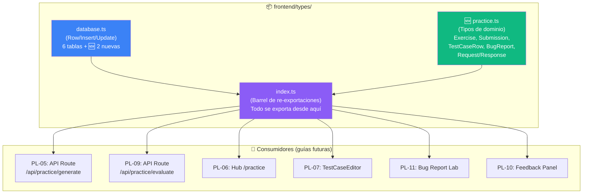
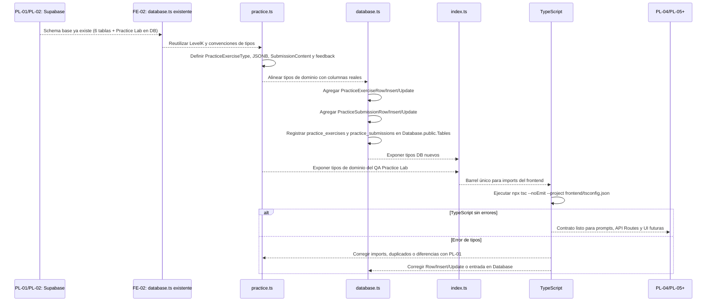
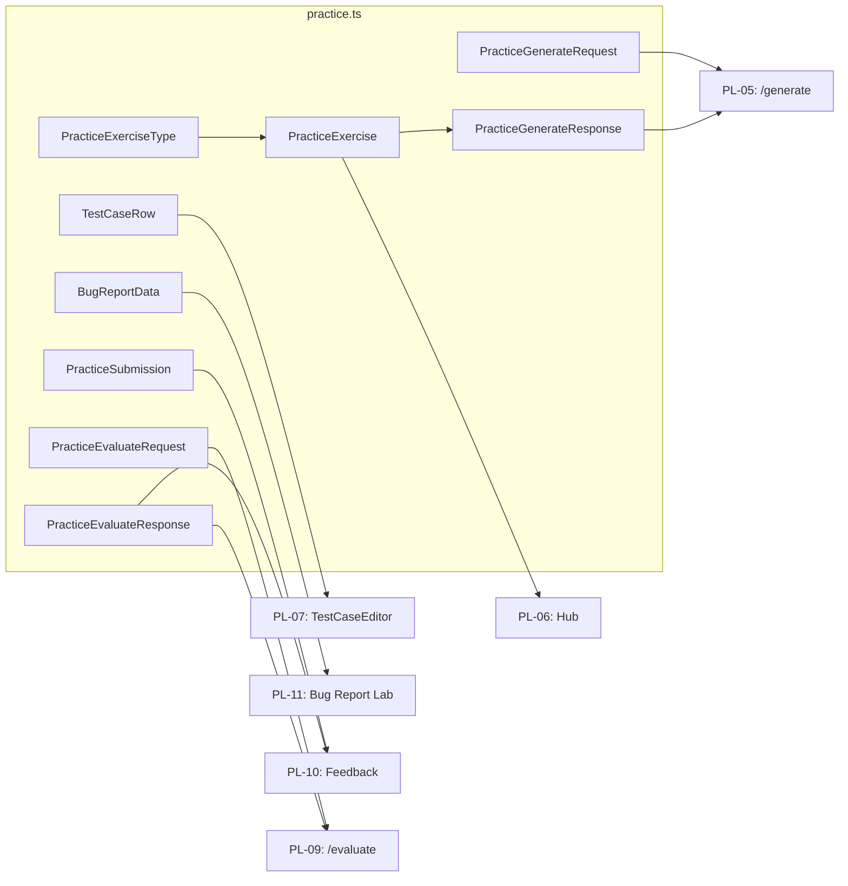

# Guía Didáctica PL-03: Tipos TypeScript del QA Practice Lab

---

## Sección 1: 🎓 Introducción y Fundamentos Conceptuales

### Recapitulación: ¿Dónde estamos?

En las guías **PL-01** y **PL-02** construiste la infraestructura de base de datos del QA Practice Lab:

- **PL-01:** 2 tablas nuevas (`practice_exercises` con 11 columnas + `practice_submissions` con 7 columnas), 4 CHECK constraints, UNIQUE + FK compuesta, y 5 índices.
- **PL-02:** 7 RLS policies que aíslan datos por usuario, incluyendo validación de ownership cruzado de `document_id` y `exercise_id` con subqueries EXISTS.

La base de datos está lista y segura. Ahora necesitamos que el **frontend sepa hablar el mismo idioma** que PostgreSQL. Eso es exactamente lo que hacen los tipos TypeScript: son el **contrato** entre lo que la DB almacena y lo que React renderiza.

### ¿Por qué un archivo de tipos dedicado?

En FE-02, creaste `frontend/types/database.ts` con los tipos de las 6 tablas originales. Ese archivo sigue la convención `Row / Insert / Update` del generador de Supabase. Para el Practice Lab, vamos a crear **dos cosas**:

1. **`frontend/types/practice.ts`** — Tipos específicos del módulo de práctica: tipos de ejercicio, estructuras de JSONB, filas de test cases, datos de bug reports, y request/response para las API Routes.
2. **Actualizar `frontend/types/database.ts`** — Agregar las tablas `practice_exercises` y `practice_submissions` al tipo maestro `Database` para que `supabase-js` las reconozca.

```
┌────────────────────────────────────────────────────────────────┐
│  ¿POR QUÉ DOS ARCHIVOS EN VEZ DE UNO?                         │
├────────────────────────────────────────────────────────────────┤
│                                                                │
│  database.ts  → Contrato con Supabase (Row/Insert/Update).    │
│                 Lo lee el SDK de Supabase para autocompletado. │
│                 Refleja EXACTAMENTE las columnas de la DB.     │
│                                                                │
│  practice.ts  → Contrato con la UI y las API Routes.          │
│                 Define estructuras de JSONB, formularios,      │
│                 payloads de request/response, y UI helpers.    │
│                 Es más rico y detallado que los Row types.     │
│                                                                │
│  Separación = cada archivo tiene UNA responsabilidad.          │
└────────────────────────────────────────────────────────────────┘
```

### Analogía profesional

Imagina que eres el **director de documentación técnica** de un laboratorio farmacéutico. El laboratorio (PostgreSQL) produce resultados de análisis en un formato crudo: columnas, números, códigos. Pero los distintos departamentos necesitan esos datos en formatos diferentes:

- El **departamento legal** necesita reportes con campos obligatorios específicos (título, fecha, firma). Eso es `database.ts` — refleja exactamente lo que hay en la base de datos, ni más ni menos. Si legal pregunta "¿qué columnas tiene la tabla?", abres este archivo y lo sabes.

- El **departamento de UI/UX** necesita mockups interactivos: tablas editables de test cases, formularios de bug reports con dropdowns de severidad, pantallas de feedback con barras de progreso. Eso es `practice.ts` — define las **formas** que adoptan los datos cuando llegan al navegador del usuario.

- El **departamento de comunicaciones** necesita saber qué formatos van y vienen entre departamentos. Eso son los tipos `PracticeGenerateRequest` y `PracticeEvaluateResponse` — el **contrato de comunicación** entre el frontend y las API Routes.

Sin esta documentación tipada, cada desarrollador inventaría su propio formato, y al conectar los módulos todo se rompería. TypeScript previene eso **en tiempo de compilación**, antes de que el bug llegue a producción.

Otra forma de verlo: los tipos son como los **planos de una pieza industrial**. Si el plano dice que el diámetro es 10mm ± 0.1mm, cualquier pieza que no cumpla se rechaza en fábrica (error de TypeScript). Sin planos, las piezas llegan "a ojo" y el ensamblaje falla en campo (runtime errors en producción).

---

## Sección 2: 📋 Prerequisitos y Verificación del Entorno

### Herramientas requeridas

| Herramienta | Comando de verificación | Versión mínima |
|:---|:---|:---|
| Node.js | `node --version` | v18.0.0+ |
| TypeScript | `npx tsc --version` | 5.0+ |
| Next.js | Verificar en `frontend/package.json` y `package-lock.json` | 16.x (`package.json` declara `^16.2.7`; lock local puede resolver 16.2.9) |

### Verificaciones en PowerShell

```powershell
# 1. Node.js
node --version
# Esperado: v18.x.x o superior

# 2. TypeScript compilador
npx tsc --version
# Esperado: Version 5.x.x

# 3. Verificar que el proyecto compila actualmente
npx tsc --noEmit --project frontend/tsconfig.json
# Esperado: sin errores (0 exit code)
```

### Entregables de guías anteriores que DEBEN existir

| Guía | Entregable | Verificación |
|:---|:---|:---|
| **FE-02** | `frontend/types/database.ts` con 6 tablas | El archivo existe y tiene `Database` interface |
| **FE-02** | `frontend/types/index.ts` barrel de re-exportaciones | El archivo existe y re-exporta tipos de DB |
| **PL-01** | Schema de `practice_exercises` (11 cols) y `practice_submissions` (7 cols) | Tablas visibles en Supabase Table Editor |
| **PL-02** | RLS policies activas | 7 policies en Authentication → Policies |

### Verificación de archivos existentes

```powershell
# Verificar que los archivos de tipos existen
Test-Path -LiteralPath "frontend\types\database.ts"
# Esperado: True

Test-Path -LiteralPath "frontend\types\index.ts"
# Esperado: True
```

---

## Sección 3: 📂 Estructura de Directorios del Proyecto

```
practica-testing/
├── frontend/
│   ├── app/
│   │   ├── (auth)/
│   │   ├── (dashboard)/
│   │   │   ├── dashboard/
│   │   │   ├── plan/
│   │   │   ├── session/
│   │   │   └── setup/
│   │   └── api/
│   ├── components/
│   │   └── ui/
│   ├── lib/
│   │   ├── supabase/
│   │   └── prompts/
│   ├── types/
│   │   ├── adapt.ts                    ← (existente)
│   │   ├── dashboard.ts               ← (existente)
│   │   ├── database.ts                ← (existente — SE MODIFICA EN ESTA GUÍA)
│   │   ├── evaluate.ts                ← (existente)
│   │   ├── index.ts                   ← (existente — SE MODIFICA EN ESTA GUÍA)
│   │   ├── practice.ts                ← 🆕 NUEVO EN ESTA GUÍA
│   │   ├── quiz.ts                    ← (existente)
│   │   ├── sessions.ts               ← (existente)
│   │   └── theory.ts                  ← (existente)
│   ├── package.json
│   └── tsconfig.json
│
├── supabase/
│   └── migrations/
│       └── ... (7 archivos)
│
└── docs/
    └── guides/
        ├── db/
        │   ├── DB-01.md ... DB-05.md
        │   ├── PL-01.md
        │   └── PL-02.md
        └── fe/
            ├── FE-01.md ... FE-04.md
            ├── ... (26 guías existentes)
            └── PL-03.md                ← 🆕 ESTA GUÍA
```

---

## Sección 4: 🎨 Diagrama de Arquitectura de Componentes



### Flujo completo de tipado (PL-01 + FE-02 + PL-03)



### Mapa de tipos → Consumidores



---

## Sección 5: 🛠️ Implementación Paso a Paso

### Paso A: Crear `frontend/types/practice.ts`

Este es el archivo principal de tipos del Practice Lab. Contiene todos los tipos de dominio que las API Routes y componentes UI consumirán.

**Archivo:** `frontend/types/practice.ts`

```typescript
// ============================================================
// types/practice.ts — Tipos TypeScript del QA Practice Lab
// ============================================================
// Estos tipos definen el contrato entre:
//   - Las tablas de PostgreSQL (practice_exercises, practice_submissions)
//   - Las API Routes (/api/practice/generate, /api/practice/evaluate)
//   - Los componentes UI (TestCaseEditor, BugReportLab, FeedbackPanel)
//
// Convención:
//   - Los tipos de DB (Row/Insert/Update) están en database.ts
//   - Los tipos de dominio (formas del JSONB, request/response) están aquí
//   - Los tipos aquí son MÁS ricos que los Row types porque
//     descomponen los campos JSONB en interfaces tipadas
// ============================================================

import type { LevelK } from "./database";

// ──────────────────────────────────────────────────────────────
// 1. UNION TYPES (Enums del Practice Lab)
// ──────────────────────────────────────────────────────────────

/**
 * Tipos de ejercicio práctico — coincide EXACTAMENTE con el
 * CHECK constraint practice_exercises_type_chk de PL-01.
 *
 * Cada tipo tiene su propia UI y criterios de evaluación:
 *   - test_cases:    tabla editable de casos de prueba (PL-07)
 *   - bug_report:    formulario de reporte de defecto (PL-11)
 *   - api_testing:   checklist de validaciones API (PL-12)
 *   - exploratory:   sesión guiada de testing exploratorio
 */
export type PracticeExerciseType =
  | "test_cases"
  | "bug_report"
  | "api_testing"
  | "exploratory";

/**
 * Severidad de un bug report — estándar de la industria QA.
 * Usado por BugReportData y el formulario de PL-11.
 */
export type BugSeverity = "critical" | "high" | "medium" | "low";

/**
 * Prioridad de corrección — estándar de la industria QA.
 * Independiente de la severidad (un bug critical puede ser
 * low priority si afecta a pocos usuarios).
 */
export type BugPriority = "urgent" | "high" | "medium" | "low";

/**
 * Tipo de caso de prueba — clasificación estándar.
 * Usado por TestCaseRow para categorizar cada test case.
 */
export type TestCaseType = "positive" | "negative" | "boundary";

// ──────────────────────────────────────────────────────────────
// 2. ESTRUCTURAS JSONB — Escenario y Solución del Ejercicio
// ──────────────────────────────────────────────────────────────

/**
 * Estructura del campo scenario_json en practice_exercises.
 * Generado por la IA (Gemini) y almacenado como JSONB.
 *
 * Ejemplo real:
 *   {
 *     scenario: "Una app de registro acepta edades entre 18 y 65.",
 *     task_description: "Define particiones válidas e inválidas.",
 *     constraints: ["Mínimo 5 test cases", "Incluir valores límite"],
 *     evaluation_criteria: ["Cobertura de particiones", "Valores límite"]
 *   }
 */
export interface ExerciseScenario {
  /** Descripción del sistema bajo prueba */
  scenario: string;
  /** Instrucciones específicas de lo que el usuario debe hacer */
  task_description: string;
  /** Restricciones o requerimientos adicionales */
  constraints: string[];
  /** Criterios que la IA usará para evaluar la respuesta */
  evaluation_criteria: string[];
}

/**
 * Estructura del campo solution_json en practice_exercises.
 * Generado por la IA y mostrado DESPUÉS de la evaluación.
 * NULL si aún no se ha generado.
 */
export interface ExerciseSolution {
  /** Test cases o respuestas modelo de la IA */
  model_answer: Record<string, unknown>;
  /** Explicación paso a paso de la solución */
  explanation: string;
  /** Puntos clave que el usuario debería haber identificado */
  key_points: string[];
}

// ──────────────────────────────────────────────────────────────
// 3. TIPOS DE FILAS — Datos que escribe el usuario
// ──────────────────────────────────────────────────────────────

/**
 * Una fila en la tabla de test cases del TestCaseEditor (PL-07).
 * Representa un caso de prueba individual dentro de la submission.
 *
 * Ejemplo:
 *   { id: "TC-001", scenario: "Edad mínima válida",
 *     test_data: "18", expected_result: "Registro OK", type: "boundary" }
 */
export interface TestCaseRow {
  /** Identificador secuencial del test case (ej. "TC-001") */
  id: string;
  /** Descripción del escenario que se prueba */
  scenario: string;
  /** Dato de entrada para la prueba */
  test_data: string;
  /** Resultado esperado del sistema */
  expected_result: string;
  /** Clasificación del test case */
  type: TestCaseType;
}

/**
 * Datos completos de un bug report (PL-11).
 * Estructura clásica de reporte de defecto en QA.
 */
export interface BugReportData {
  /** Título descriptivo del bug */
  title: string;
  /** Condiciones previas necesarias para reproducir */
  preconditions: string;
  /** Pasos de reproducción numerados */
  steps: string[];
  /** Lo que realmente ocurre (el bug) */
  actual_result: string;
  /** Lo que debería ocurrir (comportamiento correcto) */
  expected_result: string;
  /** Impacto del bug en el sistema */
  severity: BugSeverity;
  /** Urgencia de corrección */
  priority: BugPriority;
}

/**
 * Un ítem individual en un checklist de API testing (PL-12).
 */
export interface ApiChecklistItem {
  /** Identificador del ítem (ej. "API-001") */
  id: string;
  /** Descripción de la validación a realizar */
  validation: string;
  /** ¿El usuario verificó este punto? */
  checked: boolean;
  /** Observaciones del usuario */
  notes: string;
}

// ──────────────────────────────────────────────────────────────
// 4. TIPOS DE SUBMISSION — Lo que el usuario envía
// ──────────────────────────────────────────────────────────────

/**
 * Contenido del submission_json según el tipo de ejercicio.
 * Cada tipo de ejercicio tiene una estructura de respuesta diferente.
 *
 * El tipo discriminado (tagged union) permite que TypeScript
 * infiera automáticamente la estructura correcta cuando
 * haces `if (submission.type === 'test_cases') { ... }`.
 */
export type SubmissionContent =
  | { type: "test_cases"; test_cases: TestCaseRow[] }
  | { type: "bug_report"; bug_report: BugReportData }
  | { type: "api_testing"; checklist: ApiChecklistItem[] }
  | { type: "exploratory"; notes: string; findings: string[] };

// ──────────────────────────────────────────────────────────────
// 5. TIPOS DE FEEDBACK — Lo que la IA devuelve
// ──────────────────────────────────────────────────────────────

/**
 * Resultado de evaluación de un criterio individual.
 * Parte del feedback_json de practice_submissions.
 */
export interface CriterionResult {
  /** Nombre del criterio evaluado */
  criterion: string;
  /** ¿Se cumplió el criterio? */
  passed: boolean;
  /** Detalle de la evaluación */
  detail: string;
}

/**
 * Estructura completa del campo feedback_json
 * en practice_submissions. Generado por la IA (PL-09).
 */
export interface PracticeFeedback {
  /** Resumen general del desempeño */
  feedback_summary: string;
  /** Evaluación detallada por criterio */
  criteria_results: CriterionResult[];
  /** Casos que el usuario no incluyó pero debería */
  missing_cases: string[];
  /** Lo que el usuario hizo bien */
  strengths: string[];
  /** Áreas de mejora específicas */
  improvements: string[];
}

// ──────────────────────────────────────────────────────────────
// 6. TIPOS COMPUESTOS — Ejercicio y Submission "enriquecidos"
// ──────────────────────────────────────────────────────────────

/**
 * Un ejercicio práctico con JSONB tipado.
 * Equivale a PracticeExerciseRow pero con scenario_json
 * y solution_json descompuestos en interfaces tipadas.
 *
 * Usado por los componentes UI para renderizar el ejercicio.
 */
export interface PracticeExercise {
  id: string;
  user_id: string;
  document_id: string;
  study_plan_id: string | null;
  topic_code: string;
  level_k: LevelK;
  exercise_type: PracticeExerciseType;
  attempt_number: number;
  scenario: ExerciseScenario;
  solution: ExerciseSolution | null;
  created_at: string;
}

/**
 * Una submission con JSONB tipado.
 * Equivale a PracticeSubmissionRow pero con submission_json
 * y feedback_json descompuestos en interfaces tipadas.
 *
 * Usado por el FeedbackPanel (PL-10) para mostrar resultados.
 */
export interface PracticeSubmission {
  id: string;
  user_id: string;
  exercise_id: string;
  content: SubmissionContent;
  score_percent: number | null;
  feedback: PracticeFeedback | null;
  submitted_at: string;
}

// ──────────────────────────────────────────────────────────────
// 7. TIPOS DE REQUEST/RESPONSE — Contrato con las API Routes
// ──────────────────────────────────────────────────────────────

/**
 * Request body para POST /api/practice/generate (PL-05).
 * El frontend envía esto para pedir un nuevo ejercicio.
 */
export interface PracticeGenerateRequest {
  /** ID del documento de donde se toman los tópicos */
  document_id: string;
  /** Código del tópico ISTQB (ej. "FL-4.2.1") */
  topic_code: string;
  /** Nivel cognitivo — determina la complejidad */
  level_k: LevelK;
  /** Tipo de ejercicio deseado */
  exercise_type: PracticeExerciseType;
  /** ID del plan de estudio activo (opcional) */
  study_plan_id?: string | null;
}

/**
 * Response body de POST /api/practice/generate (PL-05).
 * La API Route devuelve esto con el ejercicio generado.
 */
export interface PracticeGenerateResponse {
  /** El ejercicio completo con escenario tipado */
  exercise: PracticeExercise;
}

/**
 * Request body para POST /api/practice/evaluate (PL-09).
 * El frontend envía la respuesta del usuario para evaluación.
 */
export interface PracticeEvaluateRequest {
  /** ID del ejercicio que se está respondiendo */
  exercise_id: string;
  /** Contenido de la respuesta del usuario (tagged union) */
  submission: SubmissionContent;
}

/**
 * Response body de POST /api/practice/evaluate (PL-09).
 * La API Route devuelve esto con el score y feedback.
 */
export interface PracticeEvaluateResponse {
  /** La submission guardada con score y feedback */
  submission: PracticeSubmission;
  /** La solución de referencia del ejercicio (revelada después de evaluar) */
  solution: ExerciseSolution;
}

// ──────────────────────────────────────────────────────────────
// 8. TIPOS HELPER — Utilidades para la UI
// ──────────────────────────────────────────────────────────────

/**
 * Metadata de un tipo de ejercicio para el Hub de prácticas (PL-06).
 * Usado para renderizar las tarjetas de selección de tipo.
 */
export interface ExerciseTypeInfo {
  /** Tipo de ejercicio */
  type: PracticeExerciseType;
  /** Nombre para mostrar en la UI */
  label: string;
  /** Descripción corta del tipo */
  description: string;
  /** Emoji o ícono representativo */
  icon: string;
  /** Color de la tarjeta (Tailwind class) */
  colorClass: string;
}

/**
 * Resumen de práctica por tópico — para el Hub (PL-06).
 * Agrega información de múltiples ejercicios y submissions.
 */
export interface TopicPracticeSummary {
  /** Código del tópico ISTQB */
  topic_code: string;
  /** Nombre descriptivo del tópico */
  topic_name: string;
  /** Nivel K del tópico */
  level_k: LevelK;
  /** Total de ejercicios generados para este tópico */
  total_exercises: number;
  /** Total de submissions enviadas */
  total_submissions: number;
  /** Score promedio de todas las submissions evaluadas */
  average_score: number | null;
  /** Mejor score obtenido */
  best_score: number | null;
}
```

**Entregable del Paso A:**
- ✅ Archivo `frontend/types/practice.ts` creado con 8 secciones de tipos: union types, estructuras JSONB, filas de datos, submissions, feedback, tipos compuestos, request/response, y helpers UI.

---

### Paso B: Actualizar `frontend/types/database.ts`

Agrega las tablas `practice_exercises` y `practice_submissions` al tipo maestro `Database`. Esto permite que `supabase-js` reconozca las tablas nuevas y ofrezca autocompletado.

**Archivo:** `frontend/types/database.ts`

**1. Agregar los union types nuevos** (después de la línea que define `TopicProgressStatus`):

```typescript
/** Tipos de ejercicio práctico (CHECK constraint en DB) */
export type PracticeExerciseTypeDB =
  | "test_cases"
  | "bug_report"
  | "api_testing"
  | "exploratory";
```

> **¿Por qué `PracticeExerciseTypeDB` y no `PracticeExerciseType`?**
> Porque `PracticeExerciseType` ya existe en `practice.ts`. El sufijo `DB` indica que este es el union type "crudo" para el Row/Insert type de `database.ts`, mientras que el de `practice.ts` es para el dominio de la UI. En la práctica son idénticos, pero la separación evita imports circulares.

**2. Agregar los Row/Insert/Update types** (después de `TopicProgressUpdate`, antes del tipo maestro `Database`):

```typescript
// ──────────────────────────────────────────────────────────────
// TABLA 7: practice_exercises
// Ejercicios prácticos generados por IA para el QA Practice Lab.
// Vinculados a tópicos ISTQB por topic_code y a documentos por document_id.
// ──────────────────────────────────────────────────────────────

export interface PracticeExerciseRow {
  id: string;                              // UUID — PK
  user_id: string;                         // UUID — FK a auth.users(id)
  document_id: string;                     // UUID — FK a documents(id)
  study_plan_id: string | null;            // UUID — FK opcional a study_plans(id)
  topic_code: string;                      // Ej. "FL-4.2.1"
  level_k: LevelK;                        // K1, K2, K3
  exercise_type: PracticeExerciseTypeDB;   // test_cases, bug_report, etc.
  attempt_number: number;                  // CHECK: >= 1
  scenario_json: Record<string, unknown>;  // JSONB — escenario generado por IA
  solution_json: Record<string, unknown> | null; // JSONB — solución de referencia
  created_at: string;                      // TIMESTAMPTZ como ISO string
  [key: string]: unknown;
}

export interface PracticeExerciseInsert {
  id?: string;                             // Opcional: PostgreSQL lo genera
  user_id: string;
  document_id: string;
  study_plan_id?: string | null;
  topic_code: string;
  level_k: LevelK;
  exercise_type: PracticeExerciseTypeDB;
  attempt_number?: number;                 // Default: 1
  scenario_json: Record<string, unknown>;
  solution_json?: Record<string, unknown> | null;
  created_at?: string;
  [key: string]: unknown;
}

export interface PracticeExerciseUpdate {
  solution_json?: Record<string, unknown> | null;
  [key: string]: unknown;
}

// ──────────────────────────────────────────────────────────────
// TABLA 8: practice_submissions
// Respuestas del usuario a ejercicios prácticos.
// FK compuesta (exercise_id, user_id) → practice_exercises(id, user_id).
// ──────────────────────────────────────────────────────────────

export interface PracticeSubmissionRow {
  id: string;                              // UUID — PK
  user_id: string;                         // UUID — FK a auth.users(id)
  exercise_id: string;                     // UUID — FK compuesta
  submission_json: Record<string, unknown>; // JSONB — respuesta del usuario
  score_percent: number | null;            // CHECK: 0-100 o NULL
  feedback_json: Record<string, unknown> | null; // JSONB — feedback de la IA
  submitted_at: string;                    // TIMESTAMPTZ como ISO string
  [key: string]: unknown;
}

export interface PracticeSubmissionInsert {
  id?: string;
  user_id: string;
  exercise_id: string;
  submission_json: Record<string, unknown>;
  score_percent?: number | null;
  feedback_json?: Record<string, unknown> | null;
  submitted_at?: string;
  [key: string]: unknown;
}

export interface PracticeSubmissionUpdate {
  score_percent?: number | null;
  feedback_json?: Record<string, unknown> | null;
  [key: string]: unknown;
}
```

**3. Agregar las tablas al tipo maestro `Database`** (dentro de `public.Tables`, después de `topic_progress`):

```typescript
      // 🆕 PL-03: Tablas del Practice Lab
      practice_exercises: {
        Row: PracticeExerciseRow;
        Insert: PracticeExerciseInsert;
        Update: PracticeExerciseUpdate;
        Relationships: [];
      };
      practice_submissions: {
        Row: PracticeSubmissionRow;
        Insert: PracticeSubmissionInsert;
        Update: PracticeSubmissionUpdate;
        Relationships: [];
      };
```

**Entregable del Paso B:**
- ✅ `frontend/types/database.ts` actualizado con `PracticeExerciseTypeDB`, `PracticeExerciseRow/Insert/Update`, `PracticeSubmissionRow/Insert/Update`, y ambas tablas agregadas al tipo `Database`.

---

### Paso C: Actualizar `frontend/types/index.ts`

Agrega las re-exportaciones del nuevo archivo `practice.ts` al barrel.

**Archivo:** `frontend/types/index.ts`

Agrega al final del archivo:

```typescript
// 🆕 PL-03: Re-exportar tipos del QA Practice Lab
export type {
  // Union types
  PracticeExerciseType,
  BugSeverity,
  BugPriority,
  TestCaseType,

  // Estructuras JSONB
  ExerciseScenario,
  ExerciseSolution,

  // Tipos de datos del usuario
  TestCaseRow,
  BugReportData,
  ApiChecklistItem,
  SubmissionContent,

  // Feedback de la IA
  CriterionResult,
  PracticeFeedback,

  // Tipos compuestos (ejercicio y submission enriquecidos)
  PracticeExercise,
  PracticeSubmission,

  // Request/Response de API Routes
  PracticeGenerateRequest,
  PracticeGenerateResponse,
  PracticeEvaluateRequest,
  PracticeEvaluateResponse,

  // Helpers UI
  ExerciseTypeInfo,
  TopicPracticeSummary,
} from "./practice";
```

También agrega las re-exportaciones de los nuevos tipos de `database.ts` (en la sección existente de re-export de `./database`):

```typescript
  // 🆕 PL-03: Tipos de DB del Practice Lab
  PracticeExerciseTypeDB,
  PracticeExerciseRow,
  PracticeExerciseInsert,
  PracticeExerciseUpdate,
  PracticeSubmissionRow,
  PracticeSubmissionInsert,
  PracticeSubmissionUpdate,
```

**Entregable del Paso C:**
- ✅ `frontend/types/index.ts` actualizado con re-exportaciones de `practice.ts` y los nuevos tipos de `database.ts`.

---

## Sección 6: ✅ Checkpoints de Verificación

### Checkpoint 1: Verificar que TypeScript compila sin errores

```powershell
npx tsc --noEmit --project frontend/tsconfig.json
```

Resultado esperado:
```
(sin output = sin errores)
```

> **Si ves errores**, lee el mensaje de error cuidadosamente. Los errores más comunes son imports incorrectos o propiedades duplicadas. Revisa la sección de Troubleshooting.

### Checkpoint 2: Verificar que el archivo practice.ts existe

```powershell
Test-Path -LiteralPath "frontend\types\practice.ts"
# Esperado: True
```

### Checkpoint 3: Verificar consistencia con el schema de PL-01

Abre `frontend/types/practice.ts` y verifica que:

| Campo en PL-01 (PostgreSQL) | Tipo en practice.ts (TypeScript) | ¿Consistente? |
|:---|:---|:---|
| `exercise_type IN ('test_cases', 'bug_report', 'api_testing', 'exploratory')` | `PracticeExerciseType` union type | ✅ Debe coincidir |
| `level_k IN ('K1', 'K2', 'K3')` | Reutiliza `LevelK` de database.ts | ✅ Ya existente |
| `scenario_json JSONB` | `ExerciseScenario` interface | ✅ Tipado fuerte |
| `solution_json JSONB` | `ExerciseSolution \| null` interface | ✅ Nullable |
| `submission_json JSONB` | `SubmissionContent` tagged union | ✅ Discriminado por type |
| `feedback_json JSONB` | `PracticeFeedback \| null` interface | ✅ Nullable |
| `score_percent NUMERIC(5,2)` | `number \| null` | ✅ Nullable |
| `attempt_number INTEGER DEFAULT 1` | `number` | ✅ |
| `document_id UUID NOT NULL` | `string` | ✅ |
| `study_plan_id UUID` | `string \| null` | ✅ Nullable |

### Checkpoint 4: Verificar que database.ts tiene las tablas nuevas

Abre `frontend/types/database.ts` y busca:
- `practice_exercises` en el tipo `Database` → debe existir con `Row`, `Insert`, `Update`
- `practice_submissions` en el tipo `Database` → debe existir con `Row`, `Insert`, `Update`

### Checkpoint 5: Verificar las re-exportaciones en index.ts

```powershell
Select-String -Path "frontend\types\index.ts" -Pattern "practice"
```

Resultado esperado: varias líneas mencionando `PracticeExerciseType`, `PracticeExercise`, `PracticeSubmission`, etc.

### Checkpoint 6: Build de producción (opcional pero recomendado)

```powershell
npm --prefix frontend run build
```

Resultado esperado:
```
✓ Compiled successfully
...
```

### Checklist de entregables PL-03

```
✅ Archivo frontend/types/practice.ts creado con 8 secciones de tipos
✅ PracticeExerciseType coincide con CHECK constraint de PL-01
✅ ExerciseScenario y ExerciseSolution tipan los campos JSONB
✅ TestCaseRow y BugReportData definen las estructuras de respuesta del usuario
✅ SubmissionContent es un tagged union discriminado por type
✅ PracticeFeedback con CriterionResult tipan el feedback de la IA
✅ PracticeGenerateRequest/Response cubren POST /api/practice/generate
✅ PracticeEvaluateRequest/Response cubren POST /api/practice/evaluate
✅ database.ts actualizado con PracticeExerciseRow/Insert/Update
✅ database.ts actualizado con PracticeSubmissionRow/Insert/Update
✅ Database type incluye practice_exercises y practice_submissions
✅ index.ts re-exporta todos los tipos nuevos
✅ npx tsc --noEmit sin errores
```

---

## Sección 7: 🚨 Troubleshooting — Problemas Comunes

| Problema | Causa Probable | Solución |
|:---|:---|:---|
| `TS2307: Cannot find module './database'` en practice.ts | El import de `LevelK` no encuentra database.ts | Verifica que el archivo `frontend/types/database.ts` existe y que el import usa `"./database"` (sin extensión `.ts`). |
| `TS2614: Module '"./practice"' has no exported member 'PracticeExerciseType'` en index.ts | El tipo no fue exportado en practice.ts | Verifica que todos los tipos en practice.ts tienen `export` antes de `type` o `interface`. |
| `TS2300: Duplicate identifier 'PracticeExerciseType'` | Importaste el tipo del mismo nombre desde dos archivos | En database.ts usamos `PracticeExerciseTypeDB` (con sufijo DB) para evitar conflicto. Verifica que no hay duplicados. |
| `TS2739: Type '...' is missing properties from type 'PracticeExerciseRow'` | Olvidaste agregar `document_id` o `attempt_number` al Row type | Verifica que `PracticeExerciseRow` tiene las 11 propiedades que coinciden con las 11 columnas de PL-01. |
| El autocompletado de Supabase no muestra `practice_exercises` | La tabla no fue agregada al tipo `Database` | Verifica que dentro de `Database.public.Tables` existe la entrada `practice_exercises` con `Row`, `Insert`, `Update`. |
| `TS2554: Expected 0 arguments, but got 1` en tagged union | Error al discriminar SubmissionContent | Usa `if (content.type === 'test_cases')` para que TypeScript infiera el tipo correcto dentro del `if`. |
| Build falla con `Type error` pero tsc --noEmit pasa | Next.js usa su propio tsconfig con `strict: true` | Ejecuta `npm --prefix frontend run build` para detectar errores que `tsc --noEmit` podría no detectar. |

---

## Sección 8: 📝 Resumen y Próximo Paso

### Lo que lograste en esta guía

1. Creaste **`frontend/types/practice.ts`** con 8 secciones de tipos que cubren todo el dominio del QA Practice Lab.
2. Definiste **4 union types** (`PracticeExerciseType`, `BugSeverity`, `BugPriority`, `TestCaseType`) que coinciden con los CHECK constraints de PL-01.
3. Tipaste los campos **JSONB** (`ExerciseScenario`, `ExerciseSolution`, `PracticeFeedback`) para que TypeScript valide la estructura en compilación.
4. Creaste **`TestCaseRow`** y **`BugReportData`** como los tipos de datos que el usuario escribirá en los formularios interactivos.
5. Implementaste **`SubmissionContent`** como un **tagged union** discriminado por `type`, permitiendo que TypeScript infiera automáticamente la estructura correcta.
6. Definiste **4 tipos de request/response** (`PracticeGenerateRequest/Response`, `PracticeEvaluateRequest/Response`) como contrato con las API Routes futuras.
7. Actualizaste **`database.ts`** con `PracticeExerciseRow/Insert/Update` y `PracticeSubmissionRow/Insert/Update`, y los agregaste al tipo maestro `Database`.
8. Actualizaste **`index.ts`** con todas las re-exportaciones nuevas.
9. Verificaste que **`tsc --noEmit` pasa sin errores** — los tipos son coherentes con el schema de PL-01.

### Valida tu progreso

Cuando termines de implementar todo, puedes validar tu progreso diciéndome:

> *"Valida mi progreso de la guía PL-03 en su sección 6"*

### Próximo paso: PL-04 — Prompt: generar ejercicio por tópico + nivel K

En la guía **PL-04** diseñarás el **prompt de Gemini** que genera ejercicios prácticos personalizados. El prompt usará los tipos que acabas de definir (`PracticeExerciseType`, `ExerciseScenario`, `LevelK`) para producir escenarios relevantes según el tópico ISTQB y su nivel cognitivo.

> **Recordatorio:** Para generar la guía PL-04, usa:
> `/istqb-fe-guide-generator` → *"Genera la guía PL-04"*

---

## Addendum Correctivo Obligatorio: Contrato de Solución para `test_cases`

**Por qué existe este addendum:** PL-10 compara cada caso de prueba enviado por el estudiante con la solución modelo. El contrato original de `ExerciseSolution` permitía cualquier objeto en `model_answer`, pero no hacía explícita la estructura de filas que necesita esa comparación. Este ajuste tipa la forma esperada sin cambiar tablas, migraciones ni datos relacionales.

> [!IMPORTANT]
> Aplica este addendum, el de PL-04 y el de PL-05 **antes** de empezar PL-10. Los ejercicios `test_cases` creados antes de la corrección pueden tener `description/items` en vez de `test_cases`; genera ejercicios nuevos para validarlos. No intentes convertir silenciosamente JSON histórico en el cliente.

### Paso A - Agregar el tipo de respuesta modelo

En `frontend/types/practice.ts`, inmediatamente después de la interfaz `TestCaseRow`, agrega:

```ts
/**
 * Forma de la solución modelo para ejercicios de diseño de test cases.
 * El LLM la genera en PL-04 y PL-05 la valida antes de persistirla.
 */
export interface TestCaseReferenceAnswer {
  test_cases: TestCaseRow[];
}
```

### Paso B - Hacer genérica la solución de referencia

En el mismo archivo, reemplaza la interfaz actual `ExerciseSolution` por esta versión. El parámetro genérico conserva compatibilidad con soluciones futuras de `bug_report`, `api_testing` y `exploratory`, cuyo artefacto modelo todavía no se representa con una interfaz específica.

```ts
export interface ExerciseSolution<TModelAnswer = Record<string, unknown>> {
  /** Artefacto modelo, con forma dependiente de exercise_type. */
  model_answer: TModelAnswer;
  /** Explicación paso a paso de la solución. */
  explanation: string;
  /** Puntos clave que el estudiante debería haber identificado. */
  key_points: string[];
}
```

`ExerciseSolution` sin parámetro sigue siendo válido en los contratos compartidos actuales. PL-10 comprueba la forma de `model_answer` en runtime antes de renderizar la tabla.

### Paso C - Reexportar el nuevo tipo

En `frontend/types/index.ts`, dentro del bloque `// 🆕 PL-03: Re-exportar tipos del QA Practice Lab`, agrega `TestCaseReferenceAnswer` debajo de `ExerciseSolution`:

```ts
  ExerciseScenario,
  ExerciseSolution,
  TestCaseReferenceAnswer,
```

### Paso D - Verificar el contrato

```powershell
Select-String -LiteralPath "frontend\types\practice.ts" -Pattern "TestCaseReferenceAnswer|interface ExerciseSolution<TModelAnswer"
Select-String -LiteralPath "frontend\types\index.ts" -Pattern "TestCaseReferenceAnswer"
npx tsc --noEmit --project frontend/tsconfig.json
```

Salida esperada:

```text
Los dos primeros comandos muestran el tipo y su reexportación.
El compilador no muestra errores.
```

**Entregable correctivo PL-03:** `TestCaseReferenceAnswer` existe, se reexporta desde el barrel y `ExerciseSolution` conserva su uso genérico. No hay cambios en `supabase/migrations/`.

---

## Addendum Correctivo Obligatorio: Contrato Tipado de `bug_report`

**Causa raiz:** el contrato original anunciaba PL-11, pero `BugReportData` no preservaba evidencia y `ExerciseScenario` no representaba `user_story`, `business_rule` y `observed_bug`. Un formulario que inventara esas claves en el cliente perderia datos al evaluar o mostraria un escenario ambiguo.

Antes de PL-11 agrega `evidence?: string` a `BugReportData`, crea `BugReportScenario extends ExerciseScenario` con las tres claves no vacias y crea `BugReportReferenceAnswer = BugReportData`. Reexporta los tres tipos desde `frontend/types/index.ts`. No cambies JSONB, migraciones ni `types/database.ts`.

Los ejercicios `bug_report` generados antes de este addendum no cumplen el escenario estructurado. No los adaptes desde la UI: genera ejercicios nuevos despues de aplicar PL-04 y PL-05.

Verificacion:

```powershell
Select-String -LiteralPath "frontend\types\practice.ts" -Pattern "BugReportScenario|BugReportReferenceAnswer|evidence\?"
Select-String -LiteralPath "frontend\types\index.ts" -Pattern "BugReportScenario|BugReportReferenceAnswer"
npx tsc --noEmit --project frontend/tsconfig.json
```

**Gate de salida:** los tipos existen, se reexportan y TypeScript termina sin errores antes de escribir cualquier UI de PL-11.
