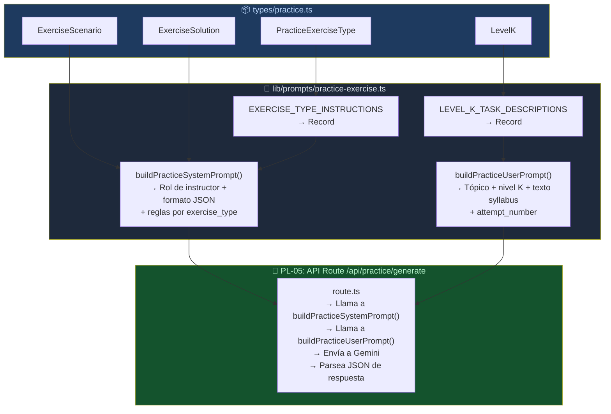
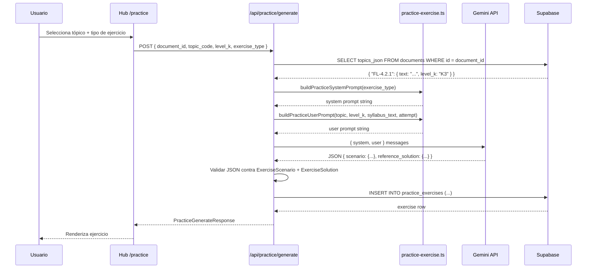

# Guía Didáctica PL-04: Prompt — Generar Ejercicio por Tópico + Nivel K

> **Estado actual:** Implementado y verificado. El prompt es la especificación semántica; el schema estructurado ejecutable pertenece a PL-05.

---

## Sección 1: 🎓 Introducción y Fundamentos Conceptuales

### Recapitulación: ¿Dónde estamos?

En las guías anteriores del Bloque H construiste:

- **PL-01:** Las tablas `practice_exercises` y `practice_submissions` con constraints y FK compuesta.
- **PL-02:** 7 RLS policies con validación de ownership cruzado.
- **PL-03:** Tipos TypeScript completos: `PracticeExerciseType`, `ExerciseScenario`, `ExerciseSolution`, `TestCaseRow`, `BugReportData`, `PracticeGenerateRequest/Response`, y más.

Las tablas están protegidas, los tipos están definidos. Pero falta el **cerebro** del Practice Lab: el **prompt** que le dice a la IA (Gemini) *qué ejercicio generar* según el tópico ISTQB y su nivel cognitivo.

### ¿Qué es un Prompt Builder?

Un Prompt Builder es una función TypeScript que construye las instrucciones que se envían al LLM. En tu proyecto ya existen tres:

| Archivo | System Prompt | User Prompt | ¿Qué genera? |
|:---|:---|:---|:---|
| `lib/prompts/theory.ts` | Rol de profesor ISTQB + método (theory/examples/analogies) | Tópicos con texto del syllabus | Contenido teórico educativo |
| `lib/prompts/quiz.ts` | Rol de examinador ISTQB + reglas de preguntas | Tópicos con distribución de preguntas | 10-12 preguntas de opción múltiple |
| `lib/prompts/evaluate.ts` | Rol de evaluador pedagógico + formato de feedback | Respuestas del estudiante + score | Patrones de error + feedback |
| **`lib/prompts/practice-exercise.ts`** | 🆕 Rol de instructor de laboratorio + tipo de ejercicio | Tópico + nivel K + attempt_number | **Escenario + solución de referencia** |

El nuevo prompt es fundamentalmente diferente a los anteriores: en vez de generar **contenido de lectura** (teoría) o **preguntas cerradas** (quiz), genera **tareas abiertas** donde el usuario debe *producir artefactos de testing* (test cases, bug reports, checklists).

### Analogía profesional

Imagina que eres el **director de una academia de pilotos de aviación**. Tus instructores (los prompts) diseñan los ejercicios para los cadetes, pero cada tipo de vuelo requiere un instructor diferente:

- El **instructor de teoría** (`theory.ts`) da clases en el aula: explica los principios de aerodinámica, los instrumentos de navegación, las regulaciones. Es como un libro de texto interactivo.

- El **instructor de exámenes** (`quiz.ts`) prepara pruebas escritas: "¿Cuál es la velocidad de despegue correcta para un Cessna 172?". Son preguntas cerradas con una sola respuesta correcta.

- El **instructor de simulador** (`practice-exercise.ts`) — el que construiremos hoy — es radicalmente diferente. No hace preguntas con opciones: pone al cadete en un **escenario realista** y le dice *"aterrizá con viento cruzado de 15 nudos desde el noroeste, con lluvia moderada y la pista mojada"*. El cadete debe **producir una solución completa** (checklist de aproximación, cálculos de corrección, decisión de go-around).

La gran diferencia es que el instructor de simulador debe:
1. **Generar escenarios variados** — no puede repetir el mismo escenario cada vez que el cadete practica.
2. **Adaptar la complejidad** al nivel del cadete (K1 = instruir conceptos, K2 = identificar errores, K3 = crear desde cero).
3. **Tener una solución de referencia** para comparar después con la respuesta del cadete.
4. **Definir criterios de evaluación** claros y medibles.

Exactamente eso es lo que tu prompt `practice-exercise.ts` hará para ejercicios de testing ISTQB.

### ¿Cómo funciona el mapeo Nivel K → Tipo de tarea?

El roadmap define tres niveles cognitivos con tareas diferentes:

```
┌──────────────┬─────────────────────────────────────────────────┐
│ Nivel K      │ Tipo de tarea práctica                          │
├──────────────┼─────────────────────────────────────────────────┤
│ K1 (Recordar)│ Identificar y clasificar conceptos guiados.      │
│              │ Ej: "Clasifica estas actividades como estáticas  │
│              │      o dinámicas y justifica brevemente."        │
│              │ → No es quiz A/B/C/D; eso sigue en SE-04.        │
├──────────────┼─────────────────────────────────────────────────┤
│ K2 (Entender)│ Identificar errores en un escenario dado.       │
│              │ Ej: "Este plan de pruebas tiene 3 errores.      │
│              │      Identifícalos y explica por qué."          │
│              │ → Produce: lista de errores + justificación.    │
├──────────────┼─────────────────────────────────────────────────┤
│ K3 (Aplicar) │ Crear artefactos de testing desde cero.         │
│              │ Ej: "Dado este sistema, diseña test cases con   │
│              │      Boundary Value Analysis."                  │
│              │ → Produce: tabla de test cases, bug report, etc.│
└──────────────┴─────────────────────────────────────────────────┘
```

---

## Sección 2: 📋 Prerequisitos y Verificación del Entorno

### Herramientas requeridas

| Herramienta | Comando de verificación | Versión mínima |
|:---|:---|:---|
| Node.js | `node --version` | v18.0.0+ |
| TypeScript | `npx tsc --version` | 5.0+ |
| Next.js | Verificar en `frontend/package.json` | 16.x (`package.json` declara `^16.2.7`) |

### Entregables de guías anteriores que DEBEN existir

| Guía | Entregable | Verificación |
|:---|:---|:---|
| **PL-03** | `frontend/types/practice.ts` | `Test-Path -LiteralPath "frontend\types\practice.ts"` → True |
| **PL-03** | Tipos `PracticeExerciseType`, `ExerciseScenario`, `ExerciseSolution`, `LevelK` | Exportados en `index.ts` |
| **SE-02** | `frontend/lib/prompts/theory.ts` | Existe y establece el patrón `buildXxxSystemPrompt/UserPrompt` |
| **SE-04** | `frontend/lib/prompts/quiz.ts` | Existe con constantes `LEVEL_K_INSTRUCTIONS` como referencia |
| **SE-06** | `frontend/lib/prompts/evaluate.ts` | Existe con patrón de JSON puro y feedback del LLM |

### Verificación en PowerShell

```powershell
# 1. Verificar que los prompts existentes compilan
npx tsc --noEmit --project frontend/tsconfig.json
# Esperado: sin errores

# 2. Verificar los prompts existentes
Get-ChildItem -Path "frontend\lib\prompts" -Name
# Esperado: evaluate.ts, quiz.ts, theory.ts
```

---

## Sección 3: 📂 Estructura de Directorios del Proyecto

```
practica-testing/
├── frontend/
│   ├── lib/
│   │   ├── prompts/
│   │   │   ├── evaluate.ts                ← (existente — SE-06)
│   │   │   ├── practice-exercise.ts       ← 🆕 NUEVO EN ESTA GUÍA
│   │   │   ├── quiz.ts                    ← (existente — SE-04)
│   │   │   └── theory.ts                  ← (existente — SE-02)
│   │   └── supabase/
│   │       ├── client.ts
│   │       ├── middleware.ts
│   │       └── server.ts
│   ├── types/
│   │   ├── practice.ts                    ← (PL-03 — tipos que consume este prompt)
│   │   ├── database.ts
│   │   └── index.ts
│   └── package.json
│
└── docs/
    └── guides/
        └── fe/
            ├── PL-03.md
            └── PL-04.md                   ← 🆕 ESTA GUÍA
```

### Alcance de archivos de PL-04

| Acción | Archivo | Motivo |
|:---|:---|:---|
| Crear | `frontend/lib/prompts/practice-exercise.ts` | Nuevo Prompt Builder para escenarios prácticos del QA Practice Lab. |
| Modificar | Ninguno | Esta guía solo agrega un builder aislado; no conecta todavía la API ni la UI. |
| No tocar | `frontend/lib/prompts/theory.ts`, `quiz.ts`, `evaluate.ts` | Son prompts ya validados por SE-02, SE-04 y SE-06. Solo se usan como referencia. |
| No tocar | `frontend/types/practice.ts`, `database.ts`, `index.ts` | PL-04 consume los tipos de PL-03; no debe redefinirlos ni duplicarlos. |
| No tocar | `frontend/app/api/practice/generate/route.ts` | La API Route pertenece a PL-05. |
| No tocar | `supabase/migrations/*` | El schema y RLS ya quedaron definidos en PL-01 y PL-02. |

---

## Sección 4: 🎨 Diagrama de Arquitectura de Componentes



### Flujo de Generación Completo

Aunque esta guía solo crea `practice-exercise.ts`, el flujo completo muestra por qué existe el Prompt Builder y cómo lo consumirá PL-05. Las partes de UI, API Route, Gemini y Supabase aparecen como contexto de integración futura; no se implementan todavía en PL-04.



---

## Sección 5: 🛠️ Implementación Paso a Paso

### Paso A: Crear el archivo `practice-exercise.ts`

**Archivo:** `frontend/lib/prompts/practice-exercise.ts`

```typescript
// ============================================================
// lib/prompts/practice-exercise.ts — Prompt Builder para
// generación de ejercicios prácticos del QA Practice Lab
// ============================================================
//
// Construye los prompts (system + user) para generar ejercicios
// prácticos personalizados según el tópico ISTQB y su nivel K.
//
// DIFERENCIAS con los otros Prompt Builders:
//   - theory.ts  → Genera contenido de LECTURA
//   - quiz.ts    → Genera preguntas CERRADAS (4 opciones)
//   - Este       → Genera tareas ABIERTAS donde el usuario
//                   debe PRODUCIR artefactos de testing
//
// MAPEO NIVEL K → TIPO DE TAREA:
//   K1 → Quiz de conceptos y definiciones
//   K2 → Identificar errores en escenarios dados
//   K3 → Crear artefactos de testing desde cero
//
// VARIEDAD: El prompt usa attempt_number para instruir al LLM
// a generar escenarios DIFERENTES en cada invocación.
//
// REGLA: Los prompts están en ESPAÑOL porque el usuario estudia
// en español y el contenido se renderiza tal cual.
// ============================================================

import type { PracticeExerciseType } from "@/types/practice";
import type { LevelK } from "@/types";

// ──────────────────────────────────────────────────────────────
// Constantes
// ──────────────────────────────────────────────────────────────

/** Número máximo de caracteres del texto del syllabus */
const MAX_SYLLABUS_TEXT_CHARS = 2000;

/**
 * Instrucciones específicas por tipo de ejercicio.
 * Cada tipo produce artefactos de testing diferentes.
 *
 * ¿Por qué un Record y no un switch?
 *   - TypeScript nos fuerza a cubrir TODOS los tipos
 *   - Si en el futuro agregas un 5to tipo, TypeScript marca error
 *   - Más legible que un switch con 4 cases largos
 */
const EXERCISE_TYPE_INSTRUCTIONS: Record<PracticeExerciseType, string> = {
  test_cases: `TIPO DE EJERCICIO: DISEÑO DE CASOS DE PRUEBA

El escenario debe describir un SISTEMA o FUNCIONALIDAD con:
- Reglas de negocio claras (rangos numéricos, estados válidos, transiciones)
- Suficiente detalle para aplicar técnicas de diseño de pruebas
- Al menos 2-3 variables o condiciones que interactúen

La tarea debe pedir al estudiante que DISEÑE CASOS DE PRUEBA usando
la técnica apropiada (Equivalence Partitioning, Boundary Value Analysis,
Decision Tables, State Transition, etc.).

Los constraints deben especificar:
- Número mínimo de test cases esperados
- Técnica(s) de diseño a aplicar
- Si debe incluir casos positivos Y negativos

La solución de referencia debe contener:
- Una tabla con: ID, escenario, dato de prueba, resultado esperado, tipo (positive/negative/boundary)
- Explicación de por qué se eligieron esos test cases
- Puntos clave que un tester profesional no debería olvidar`,

  bug_report: `TIPO DE EJERCICIO: REPORTE DE DEFECTO

El escenario debe describir un SISTEMA CON UN BUG VISIBLE:
- Descripción del comportamiento esperado
- Descripción del comportamiento real (el bug)
- Contexto suficiente para que el estudiante pueda reportarlo

La tarea debe pedir al estudiante que ESCRIBA UN BUG REPORT
siguiendo el estándar de la industria QA.

Los constraints deben especificar:
- El bug report debe incluir: título, precondiciones, pasos de reproducción,
  resultado actual, resultado esperado, severidad, y prioridad
- Todos los pasos deben ser reproducibles

La solución de referencia debe contener:
- Un bug report completo de ejemplo
- Justificación de la severidad y prioridad asignadas
- Errores comunes al reportar bugs (títulos vagos, pasos incompletos)`,

  api_testing: `TIPO DE EJERCICIO: TESTING DE API

El escenario debe describir un ENDPOINT DE API REST con:
- URL, método HTTP, parámetros/body esperados
- Reglas de validación (campos requeridos, formatos, rangos)
- Posibles respuestas (200, 400, 401, 404, 500)

La tarea debe pedir al estudiante que DISEÑE UN CHECKLIST
de validaciones para el endpoint.

Los constraints deben especificar:
- Categorías del checklist: validación de input, autenticación,
  códigos de respuesta, edge cases
- Número mínimo de validaciones esperadas

La solución de referencia debe contener:
- Un checklist completo con categorías
- Ejemplos de requests con datos válidos e inválidos
- Validaciones que un tester junior suele olvidar`,

  exploratory: `TIPO DE EJERCICIO: TESTING EXPLORATORIO

El escenario debe describir un SISTEMA o MÓDULO para explorar:
- Descripción general de la funcionalidad
- Restricciones del negocio que limitan el alcance
- Áreas de riesgo conocidas

La tarea debe pedir al estudiante que DISEÑE UNA SESIÓN
de testing exploratorio usando charters (SBTM).

Los constraints deben especificar:
- Duración de la sesión (ej. 30 min)
- Charter format: "Explore [target] with [resources] to discover [information]"
- Debe identificar heurísticas aplicables

La solución de referencia debe contener:
- 2-3 charters bien escritos
- Heurísticas y oráculos aplicables
- Áreas de riesgo que el estudiante debería priorizar`,
};

/**
 * Descripciones de la tarea según el nivel K.
 * Complementan las instrucciones del tipo de ejercicio.
 *
 * K1 → El foco está en reconocer e identificar
 * K2 → El foco está en analizar y encontrar errores
 * K3 → El foco está en crear artefactos desde cero
 */
const LEVEL_K_TASK_DESCRIPTIONS: Record<LevelK, string> = {
  K1: `NIVEL K1 (RECORDAR):
- El ejercicio debe enfocarse en IDENTIFICAR y RECONOCER conceptos
- El escenario puede listar opciones y pedir clasificación
- La tarea es más guiada: el estudiante reconoce qué técnica se aplica
- La dificultad es BAJA: conceptos fundamentales, no aplicación compleja
- Ejemplo: "De los siguientes escenarios, ¿cuál requiere Boundary Value Analysis?"`,

  K2: `NIVEL K2 (ENTENDER):
- El ejercicio debe enfocarse en ANALIZAR e IDENTIFICAR ERRORES
- El escenario presenta un artefacto con errores intencionales
- La tarea es encontrar los errores y EXPLICAR por qué están mal
- La dificultad es MEDIA: requiere comprensión profunda del concepto
- Ejemplo: "Este plan de pruebas tiene 3 errores. Identifícalos y justifica."`,

  K3: `NIVEL K3 (APLICAR):
- El ejercicio debe requerir CREAR artefactos de testing DESDE CERO
- El escenario describe un sistema real con reglas de negocio
- La tarea es PRODUCIR una solución completa (test cases, bug report, etc.)
- La dificultad es ALTA: requiere aplicar técnicas en un contexto nuevo
- Ejemplo: "Diseña los test cases para el siguiente formulario de registro."`,
};

// ──────────────────────────────────────────────────────────────
// System Prompt
// ──────────────────────────────────────────────────────────────

/**
 * Construye el system prompt para la generación de ejercicios prácticos.
 *
 * El system prompt define:
 *   1. Rol del asistente (instructor de laboratorio de QA)
 *   2. Instrucciones específicas según el exercise_type
 *   3. Schema JSON exacto de la salida esperada
 *   4. Restricciones de formato y contenido
 *
 * @param exerciseType - Tipo de ejercicio a generar
 */
export function buildPracticeSystemPrompt(
  exerciseType: PracticeExerciseType,
): string {
  return `Eres un instructor experto en QA y testing de software, certificado ISTQB Foundation Level (CTFL v4.0).
Tu tarea es generar un EJERCICIO PRÁCTICO para un laboratorio de testing.

Todo el contenido DEBE estar en **español**.

## TU ROL

No eres un profesor que explica teoría — eres un INSTRUCTOR DE LABORATORIO.
Diseñas ejercicios donde el estudiante debe PRODUCIR artefactos de testing:
- Tablas de test cases
- Bug reports profesionales
- Checklists de validación de API
- Sesiones de testing exploratorio

Cada ejercicio debe ser REALISTA y basado en un ESCENARIO CONCRETO.

## ${EXERCISE_TYPE_INSTRUCTIONS[exerciseType]}

## FORMATO DE SALIDA

Responde ÚNICAMENTE con un objeto JSON válido con esta estructura EXACTA:

{
  "scenario": {
    "scenario": "Descripción detallada del sistema bajo prueba (2-4 párrafos). Incluye reglas de negocio, restricciones, y contexto suficiente para resolver el ejercicio.",
    "task_description": "Instrucciones claras de lo que el estudiante debe hacer. Empieza con un verbo de acción: Diseña, Identifica, Analiza, Crea.",
    "constraints": ["Restricción o requisito 1", "Restricción o requisito 2", "Restricción o requisito 3"],
    "evaluation_criteria": ["Criterio de evaluación 1", "Criterio de evaluación 2", "Criterio de evaluación 3"]
  },
  "reference_solution": {
    "model_answer": {
      "description": "Descripción de la respuesta modelo de alta calidad",
      "items": ["Elemento 1 de la solución", "Elemento 2", "..."]
    },
    "explanation": "Explicación paso a paso de cómo se llegó a la solución. ¿Por qué estos test cases? ¿Por qué esa severidad?",
    "key_points": ["Punto clave 1 que el estudiante no debería olvidar", "Punto clave 2", "Punto clave 3"]
  }
}

## RESTRICCIONES CRÍTICAS

1. **JSON puro**: NO incluyas texto antes ni después del JSON. NO uses bloques de código markdown.
2. **Español**: TODO el contenido debe estar en español.
3. **Escenario realista**: El escenario debe ser de un sistema de software REAL, no abstracto.
   Ejemplos buenos: "Una app de e-commerce", "Un cajero automático", "Un formulario de registro médico".
   Ejemplos malos: "Un sistema genérico", "Un programa", "Una aplicación".
4. **Complejidad apropiada**: El escenario debe tener suficiente detalle para generar al menos 5-8 test cases o equivalente.
5. **Solución completa**: reference_solution debe ser lo suficientemente detallada para servir como RÚBRICA de evaluación.
6. **evaluation_criteria medibles**: Cada criterio debe ser verificable (ej: "Incluye al menos 3 valores límite" en vez de "Buenos test cases").
7. **constraints accionables**: Cada constraint debe ser específico (ej: "Mínimo 6 test cases" en vez de "Suficientes test cases").`;
}

// ──────────────────────────────────────────────────────────────
// User Prompt
// ──────────────────────────────────────────────────────────────

/**
 * Parámetros de entrada para construir el user prompt.
 *
 * ¿Por qué un objeto en vez de parámetros posicionales?
 *   - Más legible en el call site
 *   - No importa el orden de los campos
 *   - Fácil de extender sin romper call sites existentes
 */
export interface PracticePromptInput {
  /** Código del tópico ISTQB (ej. "FL-4.2.1") */
  topicCode: string;
  /** Nombre descriptivo del tópico */
  topicName: string;
  /** Nivel cognitivo del tópico */
  levelK: LevelK;
  /** Texto del syllabus para este tópico (puede ser largo) */
  syllabusText: string;
  /** Tipo de ejercicio a generar */
  exerciseType: PracticeExerciseType;
  /** Número de intento (1 = primero). Indica al LLM que varíe el escenario. */
  attemptNumber: number;
}

/**
 * Construye el user prompt con los datos específicos del ejercicio.
 *
 * @param input - Datos del tópico, nivel K y configuración del ejercicio
 */
export function buildPracticeUserPrompt(input: PracticePromptInput): string {
  const {
    topicCode,
    topicName,
    levelK,
    syllabusText,
    exerciseType,
    attemptNumber,
  } = input;

  // ─── Truncar texto del syllabus para no exceder el contexto ──
  const syllabusPreview = syllabusText
    ? syllabusText.slice(0, MAX_SYLLABUS_TEXT_CHARS)
    : "(sin texto del syllabus disponible)";

  // ─── Instrucciones de nivel K ────────────────────────────────
  const levelKInstructions = LEVEL_K_TASK_DESCRIPTIONS[levelK];

  // ─── Contexto de variedad (cuando attempt > 1) ──────────────
  // Esto instruye al LLM a generar un escenario DIFERENTE
  // al que generó en intentos anteriores.
  const varietyContext =
    attemptNumber > 1
      ? `\n\n## ⚠️ VARIEDAD OBLIGATORIA
Este es el intento #${attemptNumber} del estudiante para este mismo tópico y tipo de ejercicio.
DEBES generar un escenario COMPLETAMENTE DIFERENTE a los anteriores:
- Usa un DOMINIO diferente (si antes fue e-commerce, ahora usa salud, banca, educación, etc.)
- Cambia las reglas de negocio y restricciones
- Varía la complejidad dentro del nivel K
- NO repitas el mismo tipo de sistema bajo prueba
- Si es K3, cambia la técnica principal que se evalúa\n`
      : "";

  return `## TÓPICO DEL EJERCICIO

- **Código:** ${topicCode}
- **Nombre:** ${topicName}
- **Nivel K:** ${levelK}
- **Tipo de ejercicio:** ${exerciseType}
- **Intento número:** ${attemptNumber}

## NIVEL COGNITIVO

${levelKInstructions}

## TEXTO DEL SYLLABUS ISTQB

${syllabusPreview}
${varietyContext}
## INSTRUCCIÓN

Genera UN ejercicio práctico de tipo "${exerciseType}" para el tópico "${topicCode}" (${topicName}) a nivel ${levelK}.
El escenario debe ser realista, específico, y con suficiente detalle para que el estudiante produzca una solución completa.
La solución de referencia debe servir como rúbrica de evaluación.
Responde SOLO con el JSON.`;
}
```

**Entregable del Paso A:**
- ✅ Archivo `frontend/lib/prompts/practice-exercise.ts` creado con:
  - Constante `EXERCISE_TYPE_INSTRUCTIONS` (Record de 4 tipos)
  - Constante `LEVEL_K_TASK_DESCRIPTIONS` (Record de 3 niveles)
  - `buildPracticeSystemPrompt(exerciseType)` — system prompt
  - Interface `PracticePromptInput` — parámetros del user prompt
  - `buildPracticeUserPrompt(input)` — user prompt con variedad

---

### Paso B: Verificar la consistencia de tipos

Después de crear el archivo, verifica que los imports resuelven correctamente:

```powershell
npx tsc --noEmit --project frontend/tsconfig.json
```

Si hay errores de import, verifica que:
1. `@/types/practice` exporta `PracticeExerciseType`
2. `@/types` exporta `LevelK`
3. El alias `@/` está configurado en `tsconfig.json`

**Entregable del Paso B:**
- ✅ TypeScript compila sin errores.

---

### Paso C: Comprender las decisiones de diseño

Este paso no tiene código — es para que entiendas el **por qué** de cada decisión:

#### C.1 — ¿Por qué `Record<>` en vez de `switch`?

```typescript
// ❌ Switch — TypeScript NO nos avisa si olvidamos un case
switch(exerciseType) {
  case 'test_cases': return "...";
  case 'bug_report': return "...";
  // ¿Olvidamos api_testing y exploratory? TypeScript no dice nada.
}

// ✅ Record — TypeScript FUERZA a cubrir todos los tipos
const INSTRUCTIONS: Record<PracticeExerciseType, string> = {
  test_cases: "...",
  bug_report: "...",
  // Error TS2741: Property 'api_testing' is missing
};
```

#### C.2 — ¿Por qué un objeto `PracticePromptInput` en vez de parámetros?

```typescript
// ❌ 6 parámetros posicionales — ¿cuál es cuál?
buildPracticeUserPrompt("FL-4.2.1", "Equivalence Partitioning", "K3", "texto...", "test_cases", 1);

// ✅ Un objeto — cada campo es explícito
buildPracticeUserPrompt({
  topicCode: "FL-4.2.1",
  topicName: "Equivalence Partitioning",
  levelK: "K3",
  syllabusText: "texto...",
  exerciseType: "test_cases",
  attemptNumber: 1,
});
```

#### C.3 — ¿Por qué `attemptNumber` varía el escenario?

Si el usuario genera un ejercicio para `FL-4.2.1` (K3, test_cases) tres veces:

| Intento | Escenario esperado | ¿Por qué? |
|:---|:---|:---|
| 1 | App de e-commerce: validar precios de descuento | Primer escenario |
| 2 | Cajero automático: validar montos de retiro | Dominio DIFERENTE |
| 3 | Formulario médico: validar rangos de edad y peso | Otro dominio DIFERENTE |

Sin el contexto de variedad, el LLM tendría alta probabilidad de generar escenarios similares.

#### C.4 — ¿Por qué el JSON de salida tiene `scenario` y `reference_solution` separados?

Porque se almacenan en columnas DIFERENTES de la base de datos:

```
practice_exercises.scenario_json   ← scenario (visible inmediatamente)
practice_exercises.solution_json   ← reference_solution (visible DESPUÉS de evaluar)
```

Esto permite mostrar el escenario al usuario sin revelar la solución.

**Entregable del Paso C:**
- ✅ Comprensión de las 4 decisiones de diseño clave.

---

## Sección 6: ✅ Checkpoints de Verificación

### Checkpoint 1: El archivo existe y compila

```powershell
# Verificar que el archivo fue creado
Test-Path -LiteralPath "frontend\lib\prompts\practice-exercise.ts"
# Esperado: True

# Verificar que compila sin errores
npx tsc --noEmit --project frontend/tsconfig.json
# Esperado: sin output (0 errores)
```

### Checkpoint 2: Los prompts existentes siguen compilando

```powershell
# Los 3 prompts anteriores NO deben romperse
# El build general cubre esto:
npm --prefix frontend run build
# Esperado: ✓ Compiled successfully
```

### Checkpoint 3: Verificar que las funciones son exportables

```powershell
Select-String -Path "frontend\lib\prompts\practice-exercise.ts" -Pattern "export function buildPracticeSystemPrompt|export function buildPracticeUserPrompt|export interface PracticePromptInput"
```

Resultado esperado: 3 coincidencias, una por cada export público del Prompt Builder.

### Checkpoint 4: Verificar consistencia del JSON con ExerciseScenario

El JSON que produce el LLM debe ser parseable a `ExerciseScenario`:

| Campo del JSON | Propiedad de ExerciseScenario | ¿Coincide? |
|:---|:---|:---|
| `scenario.scenario` | `scenario` | ✅ |
| `scenario.task_description` | `task_description` | ✅ |
| `scenario.constraints` | `constraints: string[]` | ✅ |
| `scenario.evaluation_criteria` | `evaluation_criteria: string[]` | ✅ |

Y con `ExerciseSolution`:

| Campo del JSON | Propiedad de ExerciseSolution | ¿Coincide? |
|:---|:---|:---|
| `reference_solution.model_answer` | `model_answer: Record<string, unknown>` | ✅ |
| `reference_solution.explanation` | `explanation: string` | ✅ |
| `reference_solution.key_points` | `key_points: string[]` | ✅ |

### Checkpoint 5: Verificar cobertura de los 4 tipos de ejercicio

```powershell
Select-String -Path "frontend\lib\prompts\practice-exercise.ts" -Pattern "test_cases:|bug_report:|api_testing:|exploratory:"
```

Resultado esperado: 4 líneas, una por cada tipo de ejercicio en `EXERCISE_TYPE_INSTRUCTIONS`.

### Checklist de entregables PL-04

```
✅ Archivo frontend/lib/prompts/practice-exercise.ts creado
✅ EXERCISE_TYPE_INSTRUCTIONS cubre los 4 tipos (test_cases, bug_report, api_testing, exploratory)
✅ LEVEL_K_TASK_DESCRIPTIONS cubre los 3 niveles (K1, K2, K3)
✅ buildPracticeSystemPrompt() recibe exerciseType y retorna string
✅ buildPracticeUserPrompt() recibe PracticePromptInput y retorna string
✅ Variedad garantizada: attemptNumber > 1 agrega contexto de variedad
✅ JSON de salida es consistente con ExerciseScenario y ExerciseSolution (PL-03)
✅ Imports resuelven: PracticeExerciseType de practice.ts, LevelK desde el barrel @/types
✅ npx tsc --noEmit sin errores
✅ npm --prefix frontend run build exitoso
✅ Patrón consistente con theory.ts, quiz.ts y evaluate.ts
```

---

## Sección 7: 🚨 Troubleshooting — Problemas Comunes

| Problema | Causa Probable | Solución |
|:---|:---|:---|
| `TS2307: Cannot find module '@/types/practice'` | El alias `@/` no incluye `types/practice.ts` o el archivo no existe | Verifica que `frontend/types/practice.ts` fue creado en PL-03 y que `frontend/tsconfig.json` mantiene `"@/*": ["./*"]`. |
| `TS2339: Property 'test_cases' does not exist on type 'string'` | Usaste `string` en vez de `PracticeExerciseType` como tipo del Record | Verifica que `EXERCISE_TYPE_INSTRUCTIONS` es `Record<PracticeExerciseType, string>` no `Record<string, string>`. |
| El LLM no responde JSON válido | El system prompt no es lo suficientemente estricto | Asegúrate de que la restricción #1 dice "JSON puro: NO incluyas texto antes ni después del JSON. NO uses bloques de código markdown." |
| El LLM genera el mismo escenario en cada intento | El `attemptNumber` no se pasa correctamente al user prompt | Verifica que `attemptNumber` se incluye en `PracticePromptInput` y que el bloque de variedad se agrega cuando `attemptNumber > 1`. |
| `TS2345: Argument of type '"unknown_type"' is not assignable to parameter of type 'PracticeExerciseType'` | Se está pasando un string que no es uno de los 4 tipos válidos | Valida el input antes de llamar a `buildPracticeSystemPrompt()`. En la API Route (PL-05), agrega un guard: `if (!['test_cases', 'bug_report', 'api_testing', 'exploratory'].includes(type))`. |

---

## Sección 8: 📝 Resumen y Próximo Paso

### Lo que lograste en esta guía

1. Creaste **`frontend/lib/prompts/practice-exercise.ts`** — el 4to Prompt Builder de tu proyecto.
2. Definiste **`EXERCISE_TYPE_INSTRUCTIONS`** como un `Record<PracticeExerciseType, string>` con instrucciones detalladas para los 4 tipos de ejercicio (test_cases, bug_report, api_testing, exploratory).
3. Definiste **`LEVEL_K_TASK_DESCRIPTIONS`** como un `Record<LevelK, string>` con descripciones de tarea para los 3 niveles cognitivos.
4. Implementaste **`buildPracticeSystemPrompt()`** que genera el system prompt con el rol de instructor de laboratorio, las instrucciones del tipo de ejercicio, y el schema JSON exacto de salida.
5. Implementaste **`buildPracticeUserPrompt()`** con un objeto `PracticePromptInput` tipado que incluye tópico, nivel K, texto del syllabus, tipo de ejercicio, y attempt_number.
6. Garantizaste **variedad de escenarios** instruyendo al LLM a cambiar de dominio cuando `attemptNumber > 1`.
7. Verificaste que el JSON de salida del LLM es **consistente** con `ExerciseScenario` y `ExerciseSolution` definidos en PL-03.
8. Mantuviste el **patrón establecido** por `theory.ts`, `quiz.ts` y `evaluate.ts`: exports named, constantes como Record, restricciones de JSON puro.

### Valida tu progreso

Cuando termines de implementar todo, puedes validar tu progreso diciéndome:

> *"Valida mi progreso de la guía PL-04 en su sección 6"*

### Próximo paso: PL-05 — API Route /api/practice/generate

En la guía **PL-05** conectarás el prompt que acabas de crear con una **API Route de Next.js** que:
1. Recibe `{ document_id, topic_code, level_k, exercise_type }` del frontend.
2. Verifica autenticación y ownership del documento.
3. Obtiene el texto del syllabus desde `documents.topics_json`.
4. Llama a Gemini con `buildPracticeSystemPrompt()` + `buildPracticeUserPrompt()`.
5. Parsea y valida el JSON de respuesta.
6. Guarda el ejercicio en `practice_exercises` (Supabase).
7. Retorna `PracticeGenerateResponse` al frontend.

> **Recordatorio:** Para generar la guía PL-05, usa:
> `/istqb-fe-guide-generator` → *"Genera la guía PL-05"*

---

## Addendum Correctivo Obligatorio: Schema por Tipo de Ejercicio

**Por qué existe este addendum:** la solución modelo debe tener la misma forma que el artefacto que PL-10 compara. Para `test_cases`, `model_answer` necesita un array `test_cases` con filas completas; un esquema genérico de `description/items` no permite una comparación fila a fila.

> [!IMPORTANT]
> Completa primero el addendum de PL-03. Este cambio sólo modifica el prompt; PL-05 validará el resultado antes de guardarlo.

### Paso A - Declarar formatos de solución por tipo

En `frontend/lib/prompts/practice-exercise.ts`, debajo de `EXERCISE_TYPE_INSTRUCTIONS`, agrega esta constante:

```ts
const REFERENCE_SOLUTION_FORMATS: Record<PracticeExerciseType, string> = {
  test_cases: `"model_answer": {
      "test_cases": [
        {
          "id": "TC-001",
          "scenario": "Condición concreta que se valida",
          "test_data": "Datos de entrada específicos",
          "expected_result": "Resultado observable esperado",
          "type": "positive"
        }
      ]
    },`,
  bug_report: `"model_answer": {
      "title": "Título conciso del defecto",
      "preconditions": "Condiciones previas",
      "steps": ["Paso 1", "Paso 2"],
      "actual_result": "Resultado actual",
      "expected_result": "Resultado esperado",
      "severity": "medium",
      "priority": "medium"
    },`,
  api_testing: `"model_answer": {
      "checklist": [
        { "id": "API-001", "validation": "Validación concreta", "checked": true, "notes": "Justificación" }
      ]
    },`,
  exploratory: `"model_answer": {
      "notes": "Notas estructuradas de la sesión",
      "findings": ["Hallazgo o riesgo identificado"]
    },`,
};
```

### Paso B - Usar el formato seleccionado dentro del JSON

En `buildPracticeSystemPrompt(exerciseType)`, localiza el bloque de `reference_solution` que contiene `description` e `items`. Reemplaza únicamente su contenido por la interpolación del formato dependiente del tipo:

```ts
  "reference_solution": {
    ${REFERENCE_SOLUTION_FORMATS[exerciseType]}
    "explanation": "Explicación paso a paso de cómo se llegó a la solución. ¿Por qué estos test cases? ¿Por qué esa severidad?",
    "key_points": ["Punto clave 1 que el estudiante no debería olvidar", "Punto clave 2", "Punto clave 3"]
  }
```

El resultado para `test_cases` debe contener explícitamente `reference_solution.model_answer.test_cases`. Mantén las instrucciones narrativas de `EXERCISE_TYPE_INSTRUCTIONS`; complementan el schema, no lo sustituyen.

### Paso C - Verificar sin llamar al LLM

```powershell
node -e "const fs=require('fs'); const source=fs.readFileSync('frontend/lib/prompts/practice-exercise.ts','utf8'); if (!source.includes('REFERENCE_SOLUTION_FORMATS') || !source.includes('test_cases')) process.exit(1)"
npx tsc --noEmit --project frontend/tsconfig.json
```

Salida esperada:

```text
El primer comando no muestra salida y termina con código 0.
El segundo no muestra errores.
```

**Entregable correctivo PL-04:** el prompt exige un artefacto modelo coherente con cada `exercise_type`, en particular filas `TestCaseRow` para `test_cases`.

---

## Addendum Correctivo Obligatorio: Escenario Estructurado para `bug_report`

**Causa raiz:** el prompt para `bug_report` describe narrativamente historia, regla y defecto, pero su schema JSON solo exige `scenario` generico. PL-11 no puede rotular tres hechos profesionales si el productor no los entrega como claves independientes.

En `buildPracticeSystemPrompt(exerciseType)`, cuando el tipo sea `bug_report`, exige dentro de `scenario` las claves string no vacias `user_story`, `business_rule` y `observed_bug`, ademas de las cuatro claves base. En `REFERENCE_SOLUTION_FORMATS.bug_report`, usa exactamente las claves de `BugReportReferenceAnswer` e incluye `evidence` solo como string opcional de referencia. No cambies los formatos de `test_cases`, `api_testing` ni `exploratory`.

El schema debe dejar claro que `observed_bug` describe el comportamiento real, no una hipotesis de causa. La solucion modelo debe contener `title`, `preconditions`, `steps`, `actual_result`, `expected_result`, `severity`, `priority` y, opcionalmente, `evidence`.

Verificacion sin LLM:

```powershell
Select-String -LiteralPath "frontend\lib\prompts\practice-exercise.ts" -Pattern "user_story|business_rule|observed_bug|evidence"
npx tsc --noEmit --project frontend/tsconfig.json
```

**Gate de salida:** las cuatro formas de prompt siguen presentes y `bug_report` declara su contrato estructurado antes de PL-05/PL-11.

---

## Addendum Correctivo Obligatorio: Una sola autoridad para el contrato JSON

PL-04 define **qué significa** cada ejercicio y qué contenido debe producir el modelo. No debe duplicar ni mantener una segunda copia del JSON Schema ejecutable.

La autoridad de forma en runtime es `frontend/lib/ai/practice-response-format.ts`, documentada en PL-05. Si cambia una clave o enum:

1. actualiza primero los tipos y guards compartidos;
2. sincroniza el texto del prompt de PL-04;
3. actualiza el schema estricto de PL-05;
4. valida productor, persistencia y consumidor end-to-end.

**Gate de salida:** prompt, schema, validators y UI usan los mismos nombres; ninguna guía presenta un schema alternativo como fuente de verdad.
