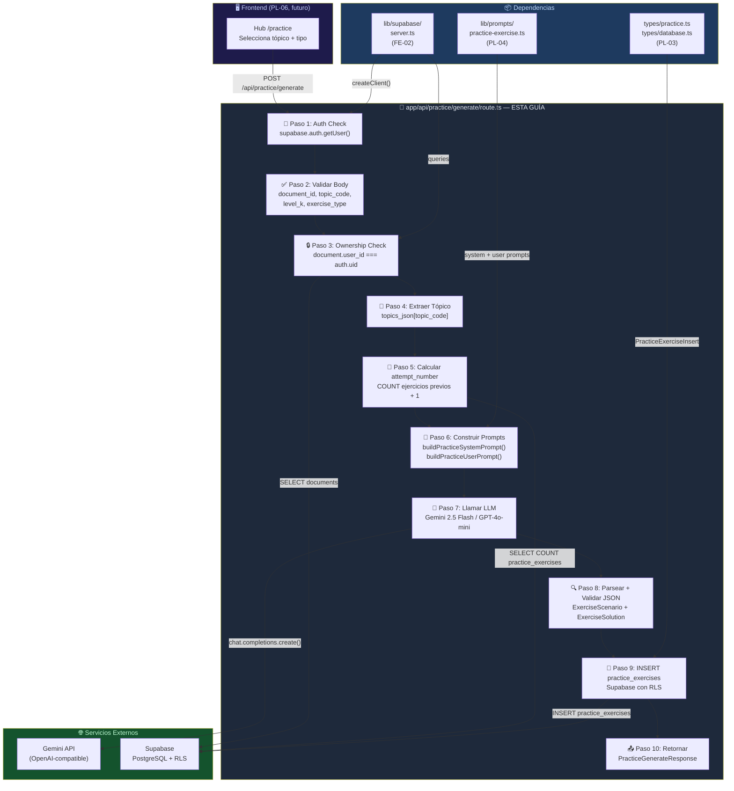
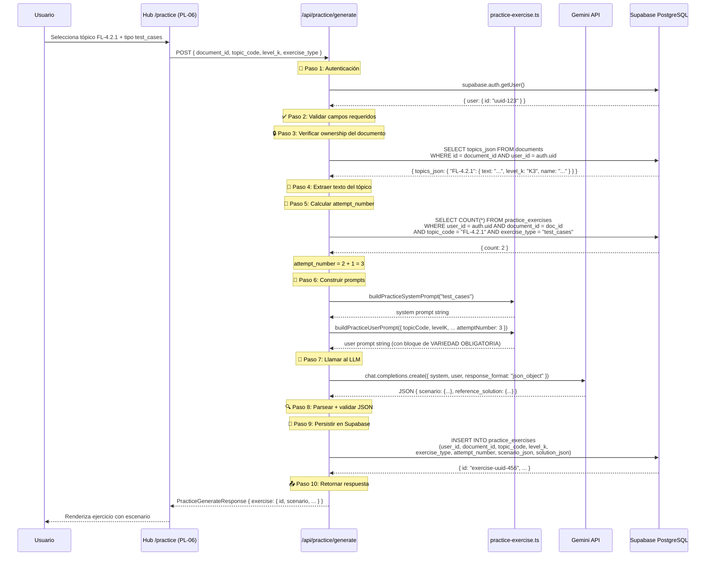
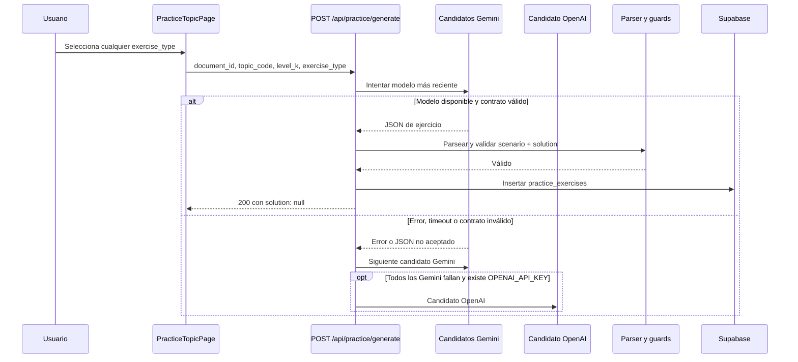

# Guía Didáctica PL-05: API Route `/api/practice/generate`

> **Estado actual:** Implementado y verificado (12/07/2026). El contrato estructurado, el parser balanceado, la cascada y la persistencia segura fueron comprobados con un flujo autenticado real.

---

## Sección 1: 🎓 Introducción y Fundamentos Conceptuales

### Recapitulación: ¿Dónde estamos?

En las guías anteriores del Bloque H construiste:

- **PL-01:** Las tablas `practice_exercises` y `practice_submissions` con constraints, FK compuesta y ownership cruzado.
- **PL-02:** 7 RLS policies con validación de ownership cruzado y aislamiento entre usuarios.
- **PL-03:** Tipos TypeScript completos: `PracticeExercise`, `ExerciseScenario`, `ExerciseSolution`, `PracticeGenerateRequest/Response`, y más.
- **PL-04:** El Prompt Builder `practice-exercise.ts` con `buildPracticeSystemPrompt()` y `buildPracticeUserPrompt()`, instrucciones por tipo de ejercicio y nivel K, y variedad garantizada con `attemptNumber`.

Hasta ahora tienes la **base de datos lista** (tablas + RLS), los **tipos TypeScript definidos** y el **prompt diseñado**. Pero no hay nada que conecte todo: necesitas una **API Route** que:

1. Reciba la petición del frontend.
2. Verifique que el usuario está autenticado.
3. Valide que el documento pertenece al usuario.
4. Extraiga el texto del tópico del `topics_json`.
5. Construya los prompts con el builder de PL-04.
6. Llame a Gemini (o OpenAI como fallback).
7. Parsee y valide el JSON de respuesta.
8. Persista el ejercicio en `practice_exercises`.
9. Retorne el ejercicio completo al frontend.

Este es el flujo completo que implementarás en esta guía.

### ¿Qué es un Route Handler en Next.js 16?

Un Route Handler es un archivo `route.ts` dentro de `app/api/` que exporta funciones nombradas por método HTTP (`GET`, `POST`, `PUT`, `DELETE`). A diferencia de los Page Components, los Route Handlers:

- **Siempre corren en el servidor** — nunca se envían al navegador.
- **No renderizan UI** — retornan `Response` o `NextResponse`.
- **Tienen acceso a variables server-only** — por ejemplo `GEMINI_API_KEY` u `OPENAI_API_KEY`, siempre que NO tengan prefijo `NEXT_PUBLIC_`.
- **Reciben `Request` como primer argumento** — el estándar Web API, no un objeto propietario de Next.js.

> **Next.js 16 (detectado en tu `package.json`):** Los `params` de rutas dinámicas son **Promises** y deben resolverse con `await`. Este patrón ya lo usas en `sessions/[id]/theory/route.ts` (SE-02).

### Analogía profesional

Imagina que trabajas como **gerente de operaciones de un laboratorio farmacéutico**. Cada día, los investigadores solicitan que se prepare un experimento específico: necesitan un compuesto X, bajo las condiciones Y, con los controles Z.

Tu API Route `/api/practice/generate` es ese gerente de operaciones. Cuando un investigador (el frontend) envía una solicitud, el gerente no solo prepara el experimento — hace una serie de verificaciones críticas antes de proceder:

1. **¿Quién está solicitando esto?** Verifica la credencial del investigador (autenticación con Supabase Auth). No cualquiera puede usar los recursos del laboratorio.

2. **¿Tiene acceso a este proyecto?** El laboratorio maneja múltiples proyectos de investigación. El gerente confirma que el investigador tiene acceso al proyecto específico (ownership del `document_id`). No puedes experimentar con las muestras de otro equipo.

3. **¿El compuesto solicitado existe?** Busca en el inventario (el `topics_json` del documento) si el compuesto específico (`topic_code`) está disponible. Si alguien pide "FL-99.99.99", el gerente responde: "Ese compuesto no existe en nuestro inventario".

4. **¿Cuántas veces ha hecho este experimento antes?** Consulta el historial (`attempt_number`) para ajustar las condiciones — si es el tercer intento, varía los parámetros para que el investigador explore desde ángulos diferentes.

5. **Encarga la preparación al equipo especializado** (el LLM / Gemini). Le pasa las instrucciones detalladas (system prompt + user prompt construidos por PL-04) y espera los resultados.

6. **Control de calidad del resultado.** Antes de entregar el experimento al investigador, verifica que el resultado cumple con los estándares: el JSON es válido, tiene todos los campos requeridos, los datos son coherentes. Si algo falla, no entrega resultados incorrectos — reporta el error.

7. **Registra todo en el libro de laboratorio.** Cada experimento preparado se documenta (INSERT en `practice_exercises`), creando un historial auditable.

8. **Entrega el resultado listo para usar.** El investigador recibe el experimento completo, tipado y validado, listo para trabajar.

Esta secuencia — autenticar → autorizar → buscar datos → generar → validar → persistir → responder — es el patrón estándar de cualquier API Route que integre un LLM con una base de datos. Ya lo implementaste en SE-02 (teoría) y SE-04 (quiz). Ahora lo harás una tercera vez, esta vez para ejercicios prácticos.

---

## Sección 2: 📋 Prerequisitos y Verificación del Entorno

### Herramientas requeridas

| Herramienta | Comando de verificación | Versión mínima |
|:---|:---|:---|
| Node.js | `node --version` | v18.0.0+ |
| TypeScript | `npx tsc --version` | 5.0+ |
| Next.js | Verificar en `frontend/package.json` | 16.x (`package.json` declara `^16.2.7`) |

### Variables de entorno requeridas

La API Route necesita acceso a una API key server-only del LLM. Verifica que al menos una esté configurada sin imprimir valores:

```powershell
# Verificar que .env.local existe
$envPath = "frontend\.env.local"
Test-Path -LiteralPath $envPath
# Esperado: True

# Verificar que al menos una key LLM existe, sin mostrar su valor
$hasGemini = Select-String -LiteralPath $envPath -Pattern "^GEMINI_API_KEY=" -Quiet
$hasOpenAI = Select-String -LiteralPath $envPath -Pattern "^OPENAI_API_KEY=" -Quiet
"LLM key present: $($hasGemini -or $hasOpenAI)"
# Esperado: LLM key present: True

# Verificar que Supabase público está configurado, sin mostrar valores
$hasSupabaseUrl = Select-String -LiteralPath $envPath -Pattern "^NEXT_PUBLIC_SUPABASE_URL=" -Quiet
$hasSupabaseAnon = Select-String -LiteralPath $envPath -Pattern "^NEXT_PUBLIC_SUPABASE_ANON_KEY=" -Quiet
"Supabase public env present: $($hasSupabaseUrl -and $hasSupabaseAnon)"
# Esperado: Supabase public env present: True
```

> ⚠️ **NUNCA** imprimas el valor completo de `GEMINI_API_KEY`, `OPENAI_API_KEY` ni `SUPABASE_SERVICE_ROLE_KEY` en la terminal. Solo verifica que la clave **existe**.

### Entregables de guías anteriores que DEBEN existir

| Guía | Entregable | Verificación |
|:---|:---|:---|
| **PL-01** | Tabla `practice_exercises` en Supabase | Visible en Table Editor |
| **PL-02** | RLS policies activas en `practice_exercises` | Aislamiento verificado |
| **PL-03** | `frontend/types/practice.ts` | `Test-Path -LiteralPath "frontend\types\practice.ts"` → True |
| **PL-03** | `frontend/types/database.ts` con `PracticeExerciseRow` y `PracticeExerciseInsert` | Exportados en `index.ts` |
| **PL-04** | `frontend/lib/prompts/practice-exercise.ts` | `Test-Path -LiteralPath "frontend\lib\prompts\practice-exercise.ts"` → True |
| **PL-04** | Funciones `buildPracticeSystemPrompt()` y `buildPracticeUserPrompt()` | Exportadas |
| **FE-02** | `frontend/lib/supabase/server.ts` con `createClient()` | Patrón de auth SSR |
| **SE-02** | `frontend/app/api/sessions/[id]/theory/route.ts` | Patrón de referencia (multi-provider LLM) |

> **Puerta de dependencia:** si `frontend\lib\prompts\practice-exercise.ts` todavía no existe, detente y completa PL-04 antes de implementar esta guía. PL-05 puede estar generada como documento, pero su implementación depende del Prompt Builder de PL-04.

### Verificación en PowerShell

```powershell
# 1. Verificar que todos los archivos prerequisito existen
Test-Path -LiteralPath "frontend\types\practice.ts"
Test-Path -LiteralPath "frontend\types\database.ts"
Test-Path -LiteralPath "frontend\lib\prompts\practice-exercise.ts"
Test-Path -LiteralPath "frontend\lib\supabase\server.ts"
# Todas deben ser True

# 2. Verificar que el proyecto compila
npx tsc --noEmit --project frontend/tsconfig.json
# Esperado: sin errores

# 3. Verificar que NO existe aún la API Route (la crearemos)
Test-Path -LiteralPath "frontend\app\api\practice\generate\route.ts"
# Esperado: False (la crearemos en esta guía)
```

---

## Sección 3: 📂 Estructura de Directorios del Proyecto

```
practica-testing/
├── frontend/
│   ├── app/
│   │   ├── api/
│   │   │   ├── dashboard/
│   │   │   │   └── metrics/route.ts           ← (existente — DA-01)
│   │   │   ├── extract/route.ts               ← (existente — UP-03)
│   │   │   ├── plan/
│   │   │   │   └── generate/route.ts          ← (existente — UP-04)
│   │   │   ├── practice/                      ← 🆕 NUEVO directorio
│   │   │   │   └── generate/                  ← 🆕 NUEVO directorio
│   │   │   │       └── route.ts               ← 🆕 NUEVO EN ESTA GUÍA
│   │   │   ├── sessions/
│   │   │   │   ├── [id]/
│   │   │   │   │   ├── adapt/route.ts         ← (existente — SE-07)
│   │   │   │   │   ├── evaluate/route.ts      ← (existente — SE-06)
│   │   │   │   │   ├── quiz/route.ts          ← (existente — SE-04)
│   │   │   │   │   ├── route.ts               ← (existente — SE-01)
│   │   │   │   │   └── theory/route.ts        ← (existente — SE-02, PATRÓN DE REFERENCIA)
│   │   │   │   └── next/route.ts              ← (existente — SE-01)
│   │   │   └── upload/route.ts                ← (existente — UP-02)
│   │   ├── (auth)/                            ← (existente — FE-03)
│   │   ├── (dashboard)/                       ← (existente — FE-04)
│   │   ├── globals.css
│   │   ├── layout.tsx
│   │   └── page.tsx
│   ├── lib/
│   │   ├── prompts/
│   │   │   ├── evaluate.ts                    ← (existente — SE-06)
│   │   │   ├── practice-exercise.ts           ← (PL-04 — DEBE EXISTIR antes de implementar PL-05)
│   │   │   ├── quiz.ts                        ← (existente — SE-04)
│   │   │   └── theory.ts                      ← (existente — SE-02)
│   │   ├── supabase/
│   │   │   ├── client.ts
│   │   │   ├── middleware.ts
│   │   │   └── server.ts                      ← (existente — FE-02, usado para auth)
│   │   ├── openai.ts                          ← (existente — UP-04, NO se usa directamente aquí)
│   │   └── format.ts
│   ├── types/
│   │   ├── practice.ts                        ← (existente — PL-03, tipos consumidos)
│   │   ├── database.ts                        ← (existente — PL-03, PracticeExerciseInsert)
│   │   └── index.ts                           ← (existente — barrel de exportaciones)
│   └── package.json
│
└── docs/
    └── guides/
        └── fe/
            ├── PL-03.md
            ├── PL-04.md
            └── PL-05.md                        ← 🆕 ESTA GUÍA
```

### Alcance de archivos de PL-05

| Acción | Archivo | Motivo |
|:---|:---|:---|
| **Crear** | `frontend/app/api/practice/generate/route.ts` | Nueva API Route para generación de ejercicios prácticos. |
| No tocar | `frontend/lib/prompts/practice-exercise.ts` | Prompt Builder creado en PL-04 — se usa como dependencia, no se modifica. |
| No tocar | `frontend/types/practice.ts`, `database.ts`, `index.ts` | Tipos definidos en PL-03 — se consumen, no se modifican. |
| No tocar | `frontend/lib/supabase/server.ts` | Cliente Supabase para servidor — se importa directamente. |
| No tocar | `frontend/lib/openai.ts` | Cliente OpenAI singleton — **NO** se usa directamente. Se crea un cliente inline como en SE-02 para soportar multi-provider. |
| No tocar | `frontend/app/api/sessions/[id]/theory/route.ts` | Patrón de referencia — se usa como modelo de implementación. |

---

## Sección 4: 🎨 Diagrama de Arquitectura de Componentes



### Flujo de Generación Completo



---

## Sección 5: 🛠️ Implementación Paso a Paso

### Paso A: Crear el directorio y archivo de la API Route

**Directorio a crear:** `frontend/app/api/practice/generate/`
**Archivo:** `frontend/app/api/practice/generate/route.ts`

```powershell
# Verificar que el directorio no existe aún
Test-Path -LiteralPath "frontend\app\api\practice\generate"
# Esperado: False

# Crear el directorio (solo verificación — el archivo se crea manualmente)
New-Item -ItemType Directory -Path "frontend\app\api\practice\generate" -Force
```

Ahora crea el archivo `route.ts` con el siguiente contenido completo:

```typescript
// ─────────────────────────────────────────────────────────────────
// app/api/practice/generate/route.ts
// Route Handler: genera un ejercicio práctico para un tópico ISTQB.
//
// Método: POST
// Auth: Requiere sesión válida (cookie JWT de Supabase)
// Body:
//   {
//     document_id: string,     // UUID del documento con topics_json
//     topic_code: string,      // Ej. "FL-4.2.1"
//     level_k: "K1" | "K2" | "K3",
//     exercise_type: "test_cases" | "bug_report" | "api_testing" | "exploratory",
//     study_plan_id?: string   // UUID opcional del plan activo
//   }
//
// Response (200): PracticeGenerateResponse { exercise: PracticeExercise }
// Response (400): { error: "Descripción del problema" }
// Response (401): { error: "No autenticado" }
// Response (404): { error: "Documento o tópico no encontrado" }
// Response (500): { error: "Error interno del servidor" }
// Response (502): { error: "Error en la generación del ejercicio" }
// Response (504): { error: "Timeout del LLM" }
//
// SEGURIDAD:
//   - Valida sesión con supabase.auth.getUser()
//   - Verifica ownership de document_id (user_id === auth.uid)
//   - GEMINI_API_KEY nunca se expone al cliente ni a logs
//   - RLS en practice_exercises garantiza aislamiento
//
// PATRÓN: Sigue la misma estructura que SE-02 (theory/route.ts):
//   Multi-provider LLM → Parser defensivo → Validación → Persistencia
// ─────────────────────────────────────────────────────────────────

import { NextResponse } from "next/server";
import OpenAI from "openai";
import { createClient } from "@/lib/supabase/server";
import {
  buildPracticeSystemPrompt,
  buildPracticeUserPrompt,
} from "@/lib/prompts/practice-exercise";
import type { PracticeExerciseType, ExerciseScenario, ExerciseSolution } from "@/types/practice";
import type { LevelK, TopicsJson, DocumentRow, PracticeExerciseInsert } from "@/types";

// ─── Forzar Node.js runtime ─────────────────────────────────────
// Edge Runtime no soporta el SDK de OpenAI ni operaciones de
// Supabase que dependen de cookies de Node.js.
export const runtime = "nodejs";

// ─── Constantes ──────────────────────────────────────────────────

/** Base URL del endpoint OpenAI-compatible de Gemini */
const GEMINI_OPENAI_BASE_URL =
  "https://generativelanguage.googleapis.com/v1beta/openai";

/** Regex para validar UUIDs */
const UUID_REGEX =
  /^[0-9a-f]{8}-[0-9a-f]{4}-[0-9a-f]{4}-[0-9a-f]{4}-[0-9a-f]{12}$/i;

/** Tipos de ejercicio válidos — espejo del CHECK constraint de PL-01 */
const VALID_EXERCISE_TYPES: readonly PracticeExerciseType[] = [
  "test_cases",
  "bug_report",
  "api_testing",
  "exploratory",
] as const;

/** Niveles K válidos — espejo del CHECK constraint de DB-02 */
const VALID_LEVEL_K: readonly LevelK[] = ["K1", "K2", "K3"] as const;

/**
 * Timeout para generación de ejercicios.
 * Los ejercicios prácticos generan ~2-4K tokens de output
 * (escenario + solución de referencia), similar a la teoría.
 */
const PRACTICE_TIMEOUT_MS = 90_000; // 90 segundos
const PRACTICE_TIMEOUT_BUFFER_MS = 15_000; // Buffer para el SDK

// ──────────────────────────────────────────────────────────────
// Multi-Provider LLM (mismo patrón que SE-02)
// ──────────────────────────────────────────────────────────────

/**
 * Runtime del modelo LLM para generación de ejercicios.
 * Encapsula proveedor, modelo, cliente y timeout.
 */
interface PracticeModelRuntime {
  provider: string;
  model: string;
  client: OpenAI;
  timeoutMs: number;
}

/**
 * Crea el runtime del modelo LLM para generación de ejercicios.
 *
 * Prioridad:
 *   1. GEMINI_API_KEY → Gemini 2.5 Flash (default, rápido y barato)
 *   2. OPENAI_API_KEY → gpt-4o-mini (fallback)
 *
 * Mismo patrón que createTheoryModelRuntime() en SE-02.
 * La generación de ejercicios es automática (no elegible por el usuario),
 * así que usamos el proveedor más eficiente disponible.
 *
 * @throws {Error} Si no hay ninguna API key configurada
 */
function createPracticeModelRuntime(): PracticeModelRuntime {
  // ─── Intentar Gemini primero ─────────────────────────────
  const geminiKey = process.env.GEMINI_API_KEY;
  if (geminiKey) {
    return {
      provider: "gemini",
      model: "gemini-2.5-flash",
      timeoutMs: PRACTICE_TIMEOUT_MS,
      client: new OpenAI({
        apiKey: geminiKey,
        baseURL: process.env.GEMINI_OPENAI_BASE_URL || GEMINI_OPENAI_BASE_URL,
        timeout: PRACTICE_TIMEOUT_MS + PRACTICE_TIMEOUT_BUFFER_MS,
        maxRetries: 2,
      }),
    };
  }

  // ─── Fallback a OpenAI ───────────────────────────────────
  const openaiKey = process.env.OPENAI_API_KEY;
  if (openaiKey) {
    return {
      provider: "openai",
      model: "gpt-4o-mini",
      timeoutMs: PRACTICE_TIMEOUT_MS,
      client: new OpenAI({
        apiKey: openaiKey,
        timeout: PRACTICE_TIMEOUT_MS + PRACTICE_TIMEOUT_BUFFER_MS,
        maxRetries: 2,
      }),
    };
  }

  throw new Error(
    "No hay API key de LLM configurada. " +
      "Define GEMINI_API_KEY o OPENAI_API_KEY en frontend/.env.local",
  );
}

// ──────────────────────────────────────────────────────────────
// Parser defensivo del response del LLM
// ──────────────────────────────────────────────────────────────

/**
 * Estructura cruda del JSON que retorna el LLM.
 * Corresponde al schema especificado en el system prompt de PL-04.
 */
interface LlmPracticeResponse {
  scenario: ExerciseScenario;
  reference_solution: ExerciseSolution;
}

/**
 * Extrae y parsea el JSON del response del LLM.
 *
 * Los LLMs a veces retornan el JSON envuelto en:
 *   - Texto introductorio ("Aquí tienes el ejercicio:")
 *   - Bloques de código markdown (```json ... ```)
 *   - Texto final ("Espero que sea útil")
 *
 * Esta función maneja todos esos casos, siguiendo el mismo
 * patrón defensivo de parseTheoryResponse() en SE-02.
 *
 * @param rawText - Texto crudo del LLM
 * @returns Objeto parseado o null si el JSON es inválido
 */
function parsePracticeResponse(rawText: string): LlmPracticeResponse | null {
  let text = rawText.trim();

  // ─── Intentar extraer de bloque markdown ────────────────
  const markdownMatch = text.match(/```(?:json)?\s*\n?([\s\S]*?)\n?```/);
  if (markdownMatch) {
    text = markdownMatch[1].trim();
  }

  // ─── Intentar encontrar el JSON delimitado por {} ───────
  const firstBrace = text.indexOf("{");
  const lastBrace = text.lastIndexOf("}");
  if (firstBrace !== -1 && lastBrace > firstBrace) {
    text = text.slice(firstBrace, lastBrace + 1);
  }

  try {
    const parsed = JSON.parse(text) as Record<string, unknown>;

    // Verificar que tiene la estructura esperada
    if (!parsed.scenario || typeof parsed.scenario !== "object") {
      console.error(
        "[practice/generate] JSON parseado pero sin campo 'scenario':",
        Object.keys(parsed),
      );
      return null;
    }

    if (!parsed.reference_solution || typeof parsed.reference_solution !== "object") {
      console.error(
        "[practice/generate] JSON parseado pero sin campo 'reference_solution':",
        Object.keys(parsed),
      );
      return null;
    }

    return parsed as unknown as LlmPracticeResponse;
  } catch (error) {
    console.error("[practice/generate] Error al parsear JSON:", error);
    console.error(
      "[practice/generate] Texto recibido (primeros 500 chars):",
      text.slice(0, 500),
    );
    return null;
  }
}

/**
 * Valida que el escenario generado tiene la estructura mínima
 * requerida por ExerciseScenario.
 *
 * @returns Array de errores (vacío si todo es válido)
 */
function validateScenario(scenario: Record<string, unknown>): string[] {
  const errors: string[] = [];

  if (!scenario.scenario || typeof scenario.scenario !== "string") {
    errors.push("Falta el campo 'scenario' (descripción del sistema).");
  } else if ((scenario.scenario as string).length < 50) {
    errors.push("El campo 'scenario' es demasiado corto (mín. 50 caracteres).");
  }

  if (!scenario.task_description || typeof scenario.task_description !== "string") {
    errors.push("Falta el campo 'task_description'.");
  } else if ((scenario.task_description as string).length < 20) {
    errors.push("El campo 'task_description' es demasiado corto.");
  }

  if (!Array.isArray(scenario.constraints) || scenario.constraints.length === 0) {
    errors.push("Falta o está vacío el campo 'constraints' (debe ser un array no vacío).");
  }

  if (!Array.isArray(scenario.evaluation_criteria) || scenario.evaluation_criteria.length === 0) {
    errors.push("Falta o está vacío el campo 'evaluation_criteria' (debe ser un array no vacío).");
  }

  return errors;
}

/**
 * Valida que la solución de referencia tiene la estructura mínima
 * requerida por ExerciseSolution.
 *
 * @returns Array de errores (vacío si todo es válido)
 */
function validateSolution(solution: Record<string, unknown>): string[] {
  const errors: string[] = [];

  if (!solution.model_answer || typeof solution.model_answer !== "object") {
    errors.push("Falta el campo 'model_answer' en reference_solution.");
  }

  if (!solution.explanation || typeof solution.explanation !== "string") {
    errors.push("Falta el campo 'explanation' en reference_solution.");
  } else if ((solution.explanation as string).length < 30) {
    errors.push("El campo 'explanation' es demasiado corto.");
  }

  if (!Array.isArray(solution.key_points) || solution.key_points.length === 0) {
    errors.push("Falta o está vacío el campo 'key_points' en reference_solution.");
  }

  return errors;
}

// ──────────────────────────────────────────────────────────────
// Route Handler: POST
// ──────────────────────────────────────────────────────────────

export async function POST(request: Request) {
  try {
    // ═══════════════════════════════════════════════════════════
    // PASO 1: Parsear y validar el request body
    // ═══════════════════════════════════════════════════════════

    let body: Record<string, unknown>;
    try {
      body = (await request.json()) as Record<string, unknown>;
    } catch {
      return NextResponse.json(
        { error: "El body de la petición debe ser JSON válido." },
        { status: 400 },
      );
    }

    const {
      document_id,
      topic_code,
      level_k,
      exercise_type,
      study_plan_id,
    } = body as {
      document_id: unknown;
      topic_code: unknown;
      level_k: unknown;
      exercise_type: unknown;
      study_plan_id: unknown;
    };

    // ─── Validar document_id ────────────────────────────────
    if (!document_id || typeof document_id !== "string" || !UUID_REGEX.test(document_id)) {
      return NextResponse.json(
        { error: "document_id debe ser un UUID válido." },
        { status: 400 },
      );
    }

    // ─── Validar topic_code ─────────────────────────────────
    if (!topic_code || typeof topic_code !== "string" || topic_code.trim().length === 0) {
      return NextResponse.json(
        { error: "topic_code es requerido (ej. 'FL-4.2.1')." },
        { status: 400 },
      );
    }

    // ─── Validar level_k ────────────────────────────────────
    if (
      !level_k ||
      typeof level_k !== "string" ||
      !VALID_LEVEL_K.includes(level_k as LevelK)
    ) {
      return NextResponse.json(
        { error: `level_k debe ser uno de: ${VALID_LEVEL_K.join(", ")}.` },
        { status: 400 },
      );
    }

    // ─── Validar exercise_type ──────────────────────────────
    if (
      !exercise_type ||
      typeof exercise_type !== "string" ||
      !VALID_EXERCISE_TYPES.includes(exercise_type as PracticeExerciseType)
    ) {
      return NextResponse.json(
        { error: `exercise_type debe ser uno de: ${VALID_EXERCISE_TYPES.join(", ")}.` },
        { status: 400 },
      );
    }

    // ─── Validar study_plan_id (opcional) ────────────────────
    if (
      study_plan_id !== undefined &&
      study_plan_id !== null &&
      (typeof study_plan_id !== "string" || !UUID_REGEX.test(study_plan_id))
    ) {
      return NextResponse.json(
        { error: "study_plan_id, si se proporciona, debe ser un UUID válido." },
        { status: 400 },
      );
    }

    // Castear a tipos seguros después de validar
    const validatedDocumentId = document_id as string;
    const validatedTopicCode = (topic_code as string).trim();
    const validatedLevelK = level_k as LevelK;
    const validatedExerciseType = exercise_type as PracticeExerciseType;
    const validatedStudyPlanId = (study_plan_id as string | null) ?? null;

    // ═══════════════════════════════════════════════════════════
    // PASO 2: Autenticación
    // ═══════════════════════════════════════════════════════════
    const supabase = await createClient();

    const {
      data: { user },
      error: authError,
    } = await supabase.auth.getUser();

    if (authError || !user) {
      return NextResponse.json(
        { error: "No autenticado. Inicia sesión para generar ejercicios." },
        { status: 401 },
      );
    }

    // ═══════════════════════════════════════════════════════════
    // PASO 3: Verificar ownership del documento + obtener tópico
    // ═══════════════════════════════════════════════════════════
    // Combinamos ownership check + extracción de topics_json en
    // una sola query. El filtro user_id = auth.uid (via RLS)
    // garantiza que solo el dueño accede al documento.

    const { data: doc, error: docError } = await supabase
      .from("documents")
      .select("id, topics_json")
      .eq("id", validatedDocumentId)
      .eq("user_id", user.id)
      .maybeSingle<Pick<DocumentRow, "id" | "topics_json">>();

    if (docError) {
      console.error("[practice/generate] Error al buscar documento:", docError);
      return NextResponse.json(
        { error: "Error al verificar el documento." },
        { status: 500 },
      );
    }

    if (!doc) {
      return NextResponse.json(
        {
          error:
            "Documento no encontrado. Verifica que el document_id es correcto " +
            "y que pertenece a tu cuenta.",
        },
        { status: 404 },
      );
    }

    // ═══════════════════════════════════════════════════════════
    // PASO 4: Extraer texto del tópico desde topics_json
    // ═══════════════════════════════════════════════════════════
    const topicsJson: TopicsJson = doc.topics_json || {};
    const topicData = topicsJson[validatedTopicCode];

    if (!topicData) {
      // El topic_code no existe en el documento — posible typo del frontend
      const availableCodes = Object.keys(topicsJson).slice(0, 10).join(", ");
      return NextResponse.json(
        {
          error:
            `El tópico "${validatedTopicCode}" no existe en el documento. ` +
            `Tópicos disponibles (primeros 10): ${availableCodes || "(ninguno)"}`,
        },
        { status: 404 },
      );
    }

    const syllabusText = topicData.text || "";
    const topicName = topicData.name || validatedTopicCode;

    // ═══════════════════════════════════════════════════════════
    // PASO 5: Calcular attempt_number
    // ═══════════════════════════════════════════════════════════
    // Contamos cuántos ejercicios previos tiene el usuario para
    // este mismo tópico + tipo de ejercicio + documento.
    // Esto permite que el prompt de PL-04 genere escenarios variados.

    const { count: previousAttempts, error: countError } = await supabase
      .from("practice_exercises")
      .select("id", { count: "exact", head: true })
      .eq("user_id", user.id)
      .eq("document_id", validatedDocumentId)
      .eq("topic_code", validatedTopicCode)
      .eq("exercise_type", validatedExerciseType);

    if (countError) {
      console.error("[practice/generate] Error al contar intentos previos:", countError);
      // No es crítico — podemos continuar con attempt_number = 1
    }

    const attemptNumber = (previousAttempts ?? 0) + 1;

    // ═══════════════════════════════════════════════════════════
    // PASO 6: Construir prompts con el builder de PL-04
    // ═══════════════════════════════════════════════════════════
    const systemPrompt = buildPracticeSystemPrompt(validatedExerciseType);
    const userPrompt = buildPracticeUserPrompt({
      topicCode: validatedTopicCode,
      topicName,
      levelK: validatedLevelK,
      syllabusText,
      exerciseType: validatedExerciseType,
      attemptNumber,
    });

    // ═══════════════════════════════════════════════════════════
    // PASO 7: Llamar al LLM
    // ═══════════════════════════════════════════════════════════
    const modelRuntime = createPracticeModelRuntime();

    console.log(
      `[practice/generate] Generando ejercicio para ${validatedTopicCode} ` +
        `(${validatedExerciseType}, ${validatedLevelK}, intento #${attemptNumber}, ` +
        `modelo=${modelRuntime.model})`,
    );

    const startTime = Date.now();
    const controller = new AbortController();
    const timeoutId = setTimeout(
      () => controller.abort(),
      modelRuntime.timeoutMs,
    );

    let completion: OpenAI.Chat.Completions.ChatCompletion;

    try {
      completion = await modelRuntime.client.chat.completions.create(
        {
          model: modelRuntime.model,
          messages: [
            { role: "system", content: systemPrompt },
            { role: "user", content: userPrompt },
          ],
          // JSON mode — reduce respuestas con markdown o texto extra.
          // El prompt de PL-04 ya menciona JSON explícitamente.
          response_format: { type: "json_object" },
          // Temperatura 0.8 — ligeramente más alta que teoría (0.7)
          // para fomentar variedad en los escenarios generados.
          temperature: 0.8,
        },
        { signal: controller.signal },
      );
    } catch (llmError) {
      if (llmError instanceof Error && llmError.name === "AbortError") {
        return NextResponse.json(
          {
            error:
              `${modelRuntime.model} no respondió en ` +
              `${modelRuntime.timeoutMs / 1000} segundos. Intenta de nuevo.`,
          },
          { status: 504 },
        );
      }

      throw llmError; // Re-throw para que el catch global lo maneje
    } finally {
      clearTimeout(timeoutId);
    }

    const elapsed = Date.now() - startTime;
    const rawResponse = completion.choices[0]?.message?.content || "";
    const tokensUsed = completion.usage?.total_tokens || 0;

    console.log(
      `[practice/generate] LLM respondió en ${elapsed}ms, ` +
        `${tokensUsed} tokens, ${rawResponse.length} chars`,
    );

    // ═══════════════════════════════════════════════════════════
    // PASO 8: Parsear y validar el response del LLM
    // ═══════════════════════════════════════════════════════════
    const parsed = parsePracticeResponse(rawResponse);

    if (!parsed) {
      console.error("[practice/generate] No se pudo parsear el response del LLM");
      return NextResponse.json(
        {
          error:
            "El modelo de IA retornó un formato inválido. Intenta de nuevo.",
        },
        { status: 502 },
      );
    }

    // Validar estructura del escenario
    const scenarioErrors = validateScenario(
      parsed.scenario as unknown as Record<string, unknown>,
    );
    if (scenarioErrors.length > 0) {
      console.error(
        "[practice/generate] Errores en scenario:",
        scenarioErrors.join("; "),
      );
      return NextResponse.json(
        {
          error:
            "El modelo generó un escenario incompleto. " +
            scenarioErrors.join("; "),
        },
        { status: 502 },
      );
    }

    // Validar estructura de la solución
    const solutionErrors = validateSolution(
      parsed.reference_solution as unknown as Record<string, unknown>,
    );
    if (solutionErrors.length > 0) {
      console.error(
        "[practice/generate] Errores en reference_solution:",
        solutionErrors.join("; "),
      );
      return NextResponse.json(
        {
          error:
            "El modelo generó una solución incompleta. " +
            solutionErrors.join("; "),
        },
        { status: 502 },
      );
    }

    // ═══════════════════════════════════════════════════════════
    // PASO 9: Persistir en Supabase
    // ═══════════════════════════════════════════════════════════
    // Construimos el INSERT usando PracticeExerciseInsert de PL-03.
    // RLS garantiza que solo el dueño puede insertar ejercicios
    // con su user_id (policy de PL-02).

    const insertData: PracticeExerciseInsert = {
      user_id: user.id,
      document_id: validatedDocumentId,
      study_plan_id: validatedStudyPlanId,
      topic_code: validatedTopicCode,
      level_k: validatedLevelK,
      exercise_type: validatedExerciseType,
      attempt_number: attemptNumber,
      scenario_json: parsed.scenario as unknown as Record<string, unknown>,
      solution_json: parsed.reference_solution as unknown as Record<string, unknown>,
    };

    const { data: insertedExercise, error: insertError } = await supabase
      .from("practice_exercises")
      .insert(insertData)
      .select("*")
      .single();

    if (insertError) {
      console.error(
        "[practice/generate] Error al insertar ejercicio:",
        insertError,
      );

      // Distinguir errores de constraint
      if (insertError.code === "23503") {
        // Foreign key violation
        return NextResponse.json(
          {
            error:
              "Error de referencia: verifica que document_id y study_plan_id " +
              "son válidos y pertenecen a tu cuenta.",
          },
          { status: 400 },
        );
      }

      if (insertError.code === "23514") {
        // Check constraint violation
        return NextResponse.json(
          {
            error:
              "Error de validación en la base de datos. " +
              "Verifica que exercise_type y level_k son valores válidos.",
          },
          { status: 400 },
        );
      }

      return NextResponse.json(
        {
          error:
            "El ejercicio fue generado, pero no se pudo guardar. " +
            "Intenta de nuevo.",
        },
        { status: 500 },
      );
    }

    // ═══════════════════════════════════════════════════════════
    // PASO 10: Construir y retornar PracticeGenerateResponse
    // ═══════════════════════════════════════════════════════════
    // Transformamos la fila de DB (con JSONB genérico) en un
    // PracticeExercise tipado con interfaces de PL-03.

    return NextResponse.json({
      exercise: {
        id: insertedExercise.id,
        user_id: insertedExercise.user_id,
        document_id: insertedExercise.document_id,
        study_plan_id: insertedExercise.study_plan_id,
        topic_code: insertedExercise.topic_code,
        level_k: insertedExercise.level_k,
        exercise_type: insertedExercise.exercise_type,
        attempt_number: insertedExercise.attempt_number,
        scenario: parsed.scenario,
        solution: null, // ⚠️ NO revelar la solución al frontend
        created_at: insertedExercise.created_at,
      },
    });
  } catch (error) {
    // ═══════════════════════════════════════════════════════════
    // Error handler global — mismo patrón que SE-02
    // ═══════════════════════════════════════════════════════════
    console.error("[practice/generate] Error inesperado:", error);

    // Distinguir errores del LLM de otros errores
    if (error instanceof OpenAI.APIError) {
      const statusCode = error.status || 502;
      return NextResponse.json(
        {
          error: `Error del proveedor de IA (${statusCode}): ${error.message}`,
        },
        { status: 502 },
      );
    }

    if (error instanceof OpenAI.APIConnectionError) {
      return NextResponse.json(
        {
          error:
            "No se pudo conectar con el proveedor de IA. " +
            "Verifica tu conexión a internet.",
        },
        { status: 502 },
      );
    }

    return NextResponse.json(
      { error: "Error interno del servidor." },
      { status: 500 },
    );
  }
}
```

**Entregable del Paso A:**
- ✅ Archivo `frontend/app/api/practice/generate/route.ts` creado con 10 pasos bien documentados.

---

### Paso B: Verificar que TypeScript compila sin errores

```powershell
npx tsc --noEmit --project frontend/tsconfig.json
```

**Salida esperada:** Sin errores. Si aparecen errores de import, revisa:

1. `@/lib/prompts/practice-exercise` exporta `buildPracticeSystemPrompt` y `buildPracticeUserPrompt`
2. `@/types/practice` exporta `PracticeExerciseType`, `ExerciseScenario`, `ExerciseSolution`
3. `@/types` exporta `LevelK`, `TopicsJson`, `DocumentRow`, `PracticeExerciseInsert`
4. `@/lib/supabase/server` exporta `createClient`
5. El alias `@/` está configurado como `"./*"` en `frontend/tsconfig.json`

**Entregable del Paso B:**
- ✅ `npx tsc --noEmit` sin errores.

---

### Paso C: Verificar el build completo

```powershell
npm --prefix frontend run build
```

**Salida esperada:** `✓ Compiled successfully` o `✓ Creating an optimized production build`.

El build verifica que:
- Todos los imports se resuelven correctamente.
- No hay errores de TypeScript.
- La API Route se compila como un Route Handler (no como una página).

**Entregable del Paso C:**
- ✅ `npm --prefix frontend run build` exitoso.

---

### Paso D: Probar la API Route localmente

Inicia el servidor de desarrollo:

```powershell
npm --prefix frontend run dev
```

#### D.1 — Test sin autenticación (debe fallar con 401)

Abre una nueva terminal y ejecuta:

```powershell
try {
  Invoke-WebRequest -Uri "http://localhost:3000/api/practice/generate" `
    -Method POST `
    -ContentType "application/json" `
    -Body '{"document_id":"00000000-0000-0000-0000-000000000000","topic_code":"FL-1.1.1","level_k":"K1","exercise_type":"test_cases"}' `
    -ErrorAction Stop
} catch {
  $_.Exception.Response.StatusCode.value__
}
# Esperado: 401
```

**Respuesta esperada:** HTTP 401 con body `{ "error": "No autenticado. Inicia sesión para generar ejercicios." }`

#### D.2 — Test con autenticación (login primero vía browser)

Para hacer una prueba completa con autenticación:

1. Abre `http://localhost:3000/login` en el navegador.
2. Inicia sesión con tu usuario de prueba.
3. Abre las DevTools del navegador (F12 → Console).
4. Ejecuta el siguiente `fetch` en la consola del navegador:

```javascript
// ⚠️ Sustituye document_id por un UUID real de tu tabla documents
const res = await fetch('/api/practice/generate', {
  method: 'POST',
  headers: { 'Content-Type': 'application/json' },
  body: JSON.stringify({
    document_id: 'TU-DOCUMENT-ID-AQUI', // UUID real de tu tabla documents
    topic_code: 'FL-4.2.1',
    level_k: 'K3',
    exercise_type: 'test_cases'
  })
});
const data = await res.json();
console.log('Status:', res.status);
console.log('Response:', JSON.stringify(data, null, 2));
```

**Respuesta esperada (200):**
```json
{
  "exercise": {
    "id": "uuid-generado",
    "user_id": "tu-user-id",
    "document_id": "tu-document-id",
    "study_plan_id": null,
    "topic_code": "FL-4.2.1",
    "level_k": "K3",
    "exercise_type": "test_cases",
    "attempt_number": 1,
    "scenario": {
      "scenario": "Una plataforma de registro de pacientes...",
      "task_description": "Diseña los test cases usando...",
      "constraints": ["Mínimo 6 test cases", "..."],
      "evaluation_criteria": ["Cobertura de particiones", "..."]
    },
    "solution": null,
    "created_at": "2026-07-06T..."
  }
}
```

> **Nota importante:** El campo `solution` es `null` en la respuesta — la solución de referencia se guarda en la base de datos (`solution_json`) pero NO se expone al frontend hasta que el usuario envía su respuesta (PL-09/PL-10). Esto es intencional para no revelar la respuesta antes de la evaluación.

#### D.3 — Verificar persistencia en Supabase

Abre el Supabase Table Editor y verifica:
1. En la tabla `practice_exercises` debe haber una nueva fila con los datos del ejercicio generado.
2. Los campos `scenario_json` y `solution_json` deben contener JSON válido.
3. `attempt_number` debe ser `1` (primera vez para este tópico + tipo).

#### D.4 — Probar attempt_number (variedad)

Ejecuta el mismo `fetch` de D.2 otra vez. La segunda ejecución debería generar un escenario DIFERENTE porque:
- `attempt_number` ahora es `2`.
- El prompt incluye el bloque de `VARIEDAD OBLIGATORIA`.

Verifica en la tabla `practice_exercises` que hay 2 filas con `attempt_number` 1 y 2.

#### D.5 — Test con topic_code inválido

```javascript
const res = await fetch('/api/practice/generate', {
  method: 'POST',
  headers: { 'Content-Type': 'application/json' },
  body: JSON.stringify({
    document_id: 'TU-DOCUMENT-ID-AQUI',
    topic_code: 'FL-99.99.99',
    level_k: 'K1',
    exercise_type: 'test_cases'
  })
});
const data = await res.json();
console.log('Status:', res.status); // Esperado: 404
console.log('Response:', data); // Esperado: error con tópicos disponibles
```

**Respuesta esperada (404):**
```json
{
  "error": "El tópico \"FL-99.99.99\" no existe en el documento. Tópicos disponibles (primeros 10): FL-1.1.1, FL-1.2.1, ..."
}
```

**Entregable del Paso D:**
- ✅ API Route responde 401 sin autenticación.
- ✅ API Route genera ejercicio válido con autenticación.
- ✅ Ejercicio persistido en `practice_exercises`.
- ✅ `attempt_number` se incrementa correctamente.
- ✅ Topic code inválido retorna 404 con lista de disponibles.

---

### Paso E: Comprender las decisiones de diseño clave

Este paso no tiene código — es para que entiendas el **por qué** de cada decisión:

#### E.1 — ¿Por qué `solution: null` en la respuesta?

```typescript
// ✅ Correcto — NO revelar la solución al frontend
return NextResponse.json({
  exercise: {
    ...ejercicio,
    solution: null, // La solución se guarda en DB pero no se envía
  },
});

// ❌ Incorrecto — revelaría la respuesta antes de evaluar
return NextResponse.json({
  exercise: {
    ...ejercicio,
    solution: parsed.reference_solution, // ¡El usuario vería la solución!
  },
});
```

La solución de referencia se revelará DESPUÉS de que el usuario envíe su respuesta, en PL-09/PL-10. Guardarla en la base de datos ahora permite que la evaluación futura compare la respuesta del usuario contra la solución sin necesidad de generar la solución de nuevo.

#### E.2 — ¿Por qué calculamos `attempt_number` en el servidor?

```typescript
// ✅ Server-side — fuente de verdad es la DB
const { count } = await supabase
  .from("practice_exercises")
  .select("id", { count: "exact", head: true })
  .eq("user_id", user.id)
  .eq("document_id", validatedDocumentId)
  .eq("topic_code", validatedTopicCode)
  .eq("exercise_type", validatedExerciseType);

const attemptNumber = (count ?? 0) + 1;

// ❌ Client-side — manipulable y propenso a errores
// Si el frontend enviara attempt_number, un usuario malicioso
// podría enviar siempre "1" para evitar el contexto de variedad
```

El `attempt_number` se calcula en el servidor porque:
1. La **fuente de verdad** es la base de datos.
2. El frontend **no debería poder manipularlo** (seguridad).
3. Es **consistente** incluso si el usuario tiene múltiples pestañas abiertas.

#### E.3 — ¿Por qué multi-provider inline y no usar `lib/openai.ts`?

El archivo `lib/openai.ts` crea un singleton con la API key de OpenAI. Pero esta API Route necesita soportar Gemini como proveedor principal y OpenAI como fallback. El patrón inline (como en SE-02) permite:

1. **Priorizar Gemini** — más barato y rápido para esta tarea.
2. **Fallback automático** — si no hay Gemini, usa OpenAI.
3. **Logging del proveedor** — registrar qué modelo se usó.

#### E.4 — ¿Por qué `temperature: 0.8` en vez de `0.7`?

| Route | Temperature | Razón |
|:---|:---|:---|
| theory/route.ts | 0.7 | Contenido educativo — debe ser preciso y consistente |
| quiz/route.ts | 0.7 | Preguntas de examen — distractores plausibles pero controlados |
| **practice/generate** | **0.8** | **Escenarios prácticos — mayor variedad es deseable** |

Los ejercicios prácticos se benefician de más creatividad en los escenarios. Un Boundary Value Analysis puede aplicarse a un sistema bancario, una app de delivery, un formulario médico... la variedad hace el aprendizaje más rico.

**Entregable del Paso E:**
- ✅ Comprensión de las 4 decisiones de diseño clave.

---

## Sección 6: ✅ Checkpoints de Verificación

### Checkpoint 1: El archivo existe y compila

```powershell
# Verificar que el archivo fue creado
Test-Path -LiteralPath "frontend\app\api\practice\generate\route.ts"
# Esperado: True

# Verificar que compila sin errores
npx tsc --noEmit --project frontend/tsconfig.json
# Esperado: sin output (0 errores)
```

### Checkpoint 2: El build completo pasa

```powershell
npm --prefix frontend run build
# Esperado: ✓ Compiled successfully
```

### Checkpoint 3: La API Route rechaza peticiones sin autenticación

```powershell
try {
  Invoke-WebRequest -Uri "http://localhost:3000/api/practice/generate" `
    -Method POST `
    -ContentType "application/json" `
    -Body '{"document_id":"00000000-0000-0000-0000-000000000000","topic_code":"FL-1.1.1","level_k":"K1","exercise_type":"test_cases"}' `
    -ErrorAction Stop
} catch {
  $_.Exception.Response.StatusCode.value__
}
# Esperado: 401
```

### Checkpoint 4: La API Route genera un ejercicio válido (con autenticación)

Desde la consola del navegador (logueado):

> **Importante:** reemplaza `TU-DOCUMENT-ID-AQUI` por un UUID real de la tabla `documents` que pertenezca al usuario autenticado y cuyo `topics_json` incluya `FL-4.2.1`. Si usas el placeholder literal, la API debe responder `400` porque no es un UUID válido.

```javascript
const res = await fetch('/api/practice/generate', {
  method: 'POST',
  headers: { 'Content-Type': 'application/json' },
  body: JSON.stringify({
    document_id: 'TU-DOCUMENT-ID-AQUI',
    topic_code: 'FL-4.2.1',
    level_k: 'K3',
    exercise_type: 'test_cases'
  })
});
console.log('Status:', res.status); // Esperado: 200
const data = await res.json();
console.log('Tiene scenario:', !!data.exercise?.scenario); // true
console.log('solution es null:', data.exercise?.solution === null); // true
console.log('attempt_number:', data.exercise?.attempt_number); // >= 1
```

### Checkpoint 5: El ejercicio se persiste en Supabase

Verificar en el Table Editor de Supabase:
1. Tabla `practice_exercises` tiene una nueva fila.
2. `scenario_json` contiene un JSON con campos `scenario`, `task_description`, `constraints`, `evaluation_criteria`.
3. `solution_json` contiene un JSON con campos `model_answer`, `explanation`, `key_points`.
4. `user_id` coincide con tu usuario autenticado.
5. `document_id` coincide con el UUID enviado.

### Checkpoint 6: No permite documentos de otro usuario

Si cambias el `document_id` por uno que no te pertenece:
```javascript
const res = await fetch('/api/practice/generate', {
  method: 'POST',
  headers: { 'Content-Type': 'application/json' },
  body: JSON.stringify({
    document_id: '00000000-0000-0000-0000-000000000000', // UUID falso
    topic_code: 'FL-1.1.1',
    level_k: 'K1',
    exercise_type: 'test_cases'
  })
});
console.log('Status:', res.status); // Esperado: 404
```

### Checkpoint 7: Error claro si topic_code no existe

```javascript
const res = await fetch('/api/practice/generate', {
  method: 'POST',
  headers: { 'Content-Type': 'application/json' },
  body: JSON.stringify({
    document_id: 'TU-DOCUMENT-ID-AQUI',
    topic_code: 'FL-99.99.99',
    level_k: 'K1',
    exercise_type: 'test_cases'
  })
});
const data = await res.json();
console.log('Status:', res.status); // Esperado: 404
console.log('Error incluye tópicos disponibles:', data.error.includes('FL-'));
// Esperado: true
```

### Checkpoint 8: Ninguna API key aparece en response ni bundle

```powershell
# Verificar que la API key NO aparece en el bundle estático del frontend
Get-ChildItem -LiteralPath "frontend\.next\static" -Recurse -File -Include *.js |
  Select-String -Pattern "GEMINI_API_KEY|OPENAI_API_KEY|AIza"
# Esperado: 0 resultados (ninguna coincidencia)
```

### Checklist de entregables PL-05

```
✅ Directorio frontend/app/api/practice/generate/ creado
✅ Archivo frontend/app/api/practice/generate/route.ts creado
✅ export const runtime = "nodejs" declarado
✅ Auth check con supabase.auth.getUser()
✅ Validación completa del body: document_id, topic_code, level_k, exercise_type
✅ Ownership check: document.user_id === auth.uid (via RLS + filtro explícito)
✅ Extracción del tópico desde documents.topics_json
✅ Cálculo server-side de attempt_number
✅ Prompts construidos con buildPracticeSystemPrompt() y buildPracticeUserPrompt() de PL-04
✅ Multi-provider LLM: Gemini (primary) + OpenAI (fallback)
✅ Parser defensivo con soporte para markdown wrapping
✅ Validación de scenario (4 campos) y reference_solution (3 campos)
✅ INSERT en practice_exercises con PracticeExerciseInsert
✅ solution: null en la respuesta (no revelar antes de evaluar)
✅ Manejo de errores: 400, 401, 404, 500, 502, 504
✅ Manejo de errores de constraint (23503 FK, 23514 CHECK)
✅ npx tsc --noEmit sin errores
✅ npm --prefix frontend run build exitoso
✅ Ninguna API key expuesta en response, logs ni bundle
✅ Patrón consistente con SE-02 (theory/route.ts)
```

### Estado de validación local (2026-07-07)

| Check | Estado | Evidencia |
|:---|:---:|:---|
| Archivo `frontend/app/api/practice/generate/route.ts` | ✅ | Existe en `frontend/app/api/practice/generate/route.ts`. |
| TypeScript | ✅ | `npx tsc --noEmit --project frontend/tsconfig.json` sin errores. |
| Build | ✅ | `npm --prefix frontend run build` exitoso; lista `ƒ /api/practice/generate`. |
| Sin autenticación | ✅ | `POST /api/practice/generate` devuelve `401`. |
| `document_id` no UUID | ✅ | Placeholder literal devuelve `400` con validación de UUID. |
| Bundle sin keys LLM | ✅ | Chequeo sobre `frontend/.next/static/**/*.js` sin `GEMINI_API_KEY`, `OPENAI_API_KEY` ni prefijo `AIza`. |
| POST autenticado `200` | 🔄 | Pendiente ejecutar desde navegador con documento real del usuario actual. |
| Persistencia en `practice_exercises` | 🔄 | Pendiente confirmar después del `200`. |

No marques PL-05 como completada hasta cerrar los dos checks pendientes: respuesta `200` autenticada y fila nueva persistida en Supabase.

---

## Sección 7: 🚨 Troubleshooting — Problemas Comunes

| Problema | Causa Probable | Solución |
|:---|:---|:---|
| `Error: No hay API key de LLM configurada` | Ni `GEMINI_API_KEY` ni `OPENAI_API_KEY` están en `.env.local` | Verifica sin imprimir valores: `$envPath = "frontend\.env.local"; $hasGemini = Select-String -LiteralPath $envPath -Pattern "^GEMINI_API_KEY=" -Quiet; $hasOpenAI = Select-String -LiteralPath $envPath -Pattern "^OPENAI_API_KEY=" -Quiet; $hasGemini -or $hasOpenAI`. Debe retornar `True`. |
| HTTP 401 `No autenticado` incluso estando logueado | Las cookies de Supabase no se están enviando con `fetch` | Asegúrate de que el `fetch` se ejecuta desde la misma página (same origin). Si usas `Invoke-WebRequest` desde PowerShell, necesitas incluir las cookies de sesión — es más fácil probar desde la consola del browser. |
| HTTP 404 `Documento no encontrado` con un document_id válido | El filtro `user_id = auth.uid` no coincide — el documento pertenece a otro usuario | Verifica en Supabase Table Editor que el `user_id` del documento coincide con tu usuario logueado. RLS impide ver documentos de otros usuarios. |
| HTTP 502 `El modelo de IA retornó un formato inválido` | El LLM respondió con texto antes o después del JSON, o con un esquema diferente | Revisa los logs del servidor (`console.error` muestra los primeros 500 chars de la respuesta). Si persiste, puede ser un problema temporal del proveedor — intenta de nuevo. |
| HTTP 504 `no respondió en 90 segundos` | Gemini o OpenAI tardó demasiado en responder | Puede ser sobrecarga del servicio. Intenta de nuevo en unos minutos. Si es frecuente, considera aumentar `PRACTICE_TIMEOUT_MS`. |
| `TS2307: Cannot find module '@/lib/prompts/practice-exercise'` | El archivo de PL-04 no existe o el alias `@/` no está configurado | Verifica `Test-Path -LiteralPath "frontend\lib\prompts\practice-exercise.ts"` y que `tsconfig.json` tiene `"@/*": ["./*"]`. |
| `TS2322: Type 'string' is not assignable to type 'LevelK'` | El body se parseó como `string` genérico pero se asignó a `LevelK` sin validar | Asegúrate de validar con `VALID_LEVEL_K.includes(level_k as LevelK)` ANTES de asignar a una variable tipada. |
| Error 23503 (FK violation) al insertar | El `document_id` o `study_plan_id` no existe o no pertenece al usuario | La API Route ya maneja este error con un mensaje descriptivo (Paso 9). Verifica que los UUIDs son correctos. |
| El `attempt_number` siempre es 1 | Error en la query de conteo (countError no null) | El código ya maneja este caso con fallback a 0. Revisa los logs para ver si hay un error de Supabase y corrige la query. |

---

## Sección 8: 📝 Resumen y Próximo Paso

### Lo que lograste en esta guía

1. Creaste **`frontend/app/api/practice/generate/route.ts`** — la API Route que conecta el Prompt Builder de PL-04 con Supabase y el LLM.
2. Implementaste **autenticación con Supabase Auth SSR** usando `createClient()` de FE-02.
3. Implementaste **validación exhaustiva del request body** con mensajes de error descriptivos para cada campo (`document_id`, `topic_code`, `level_k`, `exercise_type`, `study_plan_id`).
4. Implementaste **ownership check del documento** combinando filtro explícito con RLS para defensa en profundidad.
5. Implementaste **extracción del tópico** desde `documents.topics_json` con error claro si el `topic_code` no existe.
6. Implementaste **cálculo server-side de `attempt_number`** para garantizar variedad en escenarios sucesivos.
7. Conectaste el **Prompt Builder de PL-04** (`buildPracticeSystemPrompt()` + `buildPracticeUserPrompt()`) con el LLM.
8. Implementaste **multi-provider LLM** (Gemini primero, OpenAI como fallback) con el mismo patrón de SE-02.
9. Implementaste **parser defensivo** para extraer JSON del response del LLM, manejando wrappers de markdown y texto extra.
10. Implementaste **validación estricta** del `scenario` (4 campos) y `reference_solution` (3 campos) antes de persistir.
11. Implementaste **persistencia en `practice_exercises`** con manejo de errores de FK y CHECK constraints.
12. Implementaste **seguridad**: `solution: null` en la respuesta para no revelar la solución antes de evaluar, y ninguna API key expuesta.

### Valida tu progreso

Cuando termines de implementar todo, puedes validar tu progreso diciéndome:

> *"Valida mi progreso de la guía PL-05 en su sección 6"*

### Próximo paso: PL-06 — UI: Hub de prácticas (`/practice`)

En la guía **PL-06** crearás la **interfaz de usuario del Practice Lab** que:
1. Muestra una lista de tópicos ISTQB disponibles para practicar.
2. Permite seleccionar un tópico y un tipo de ejercicio.
3. Llama a `POST /api/practice/generate` (la API Route que acabas de crear).
4. Renderiza el escenario del ejercicio generado.
5. Permite al usuario resolver el ejercicio y enviar su respuesta (futura conexión con PL-09).

> **Recordatorio:** Para generar la guía PL-06, usa:
> `/istqb-fe-guide-generator` → *"Genera la guía PL-06"*

---

## Addendum Correctivo Obligatorio: Validar Filas de la Solución Modelo

**Por qué existe este addendum:** PL-04 ahora exige `reference_solution.model_answer.test_cases` para ejercicios `test_cases`. La validación original de PL-05 sólo comprobaba que `model_answer` fuera un objeto, por lo que podía persistir una solución que la UI de PL-10 no pudiera comparar.

> [!IMPORTANT]
> Completa los addenda de PL-03 y PL-04 antes de este. No se requiere una migración: `solution_json` ya es JSONB. Los ejercicios históricos con el formato anterior deben reemplazarse generando ejercicios nuevos.

### Paso A - Importar tipos y declarar valores válidos

En `frontend/app/api/practice/generate/route.ts`, amplía el import desde `@/types/practice` para incluir `TestCaseRow` y `TestCaseType`. Debajo de `VALID_LEVEL_K`, agrega:

```ts
const VALID_TEST_CASE_TYPES: readonly TestCaseType[] = [
  "positive",
  "negative",
  "boundary",
] as const;
```

### Paso B - Agregar guards para las filas modelo

Antes de `validateSolution`, agrega:

```ts
function isRecord(value: unknown): value is Record<string, unknown> {
  return typeof value === "object" && value !== null && !Array.isArray(value);
}

function isTestCaseRow(value: unknown): value is TestCaseRow {
  return (
    isRecord(value) &&
    typeof value.id === "string" &&
    value.id.trim().length > 0 &&
    typeof value.scenario === "string" &&
    value.scenario.trim().length > 0 &&
    typeof value.test_data === "string" &&
    value.test_data.trim().length > 0 &&
    typeof value.expected_result === "string" &&
    value.expected_result.trim().length > 0 &&
    typeof value.type === "string" &&
    VALID_TEST_CASE_TYPES.includes(value.type as TestCaseType)
  );
}

function validateTestCaseReferenceAnswer(modelAnswer: unknown): string[] {
  if (!isRecord(modelAnswer) || !Array.isArray(modelAnswer.test_cases)) {
    return ["model_answer.test_cases debe ser un array."];
  }

  if (modelAnswer.test_cases.length === 0) {
    return ["model_answer.test_cases debe tener al menos una fila."];
  }

  return modelAnswer.test_cases.every(isTestCaseRow)
    ? []
    : ["Cada fila de model_answer.test_cases requiere id, scenario, test_data, expected_result y type válido."];
}
```

### Paso C - Hacer la validación dependiente de `exercise_type`

Reemplaza `validateSolution(solution)` por `validateSolution(solution, exerciseType)` y añade la validación específica antes del `return errors`:

```ts
function validateSolution(
  solution: Record<string, unknown>,
  exerciseType: PracticeExerciseType,
): string[] {
  const errors: string[] = [];

  if (!isRecord(solution.model_answer)) {
    errors.push("Falta el campo 'model_answer' en reference_solution.");
  } else if (exerciseType === "test_cases") {
    errors.push(...validateTestCaseReferenceAnswer(solution.model_answer));
  }

  if (!solution.explanation || typeof solution.explanation !== "string") {
    errors.push("Falta el campo 'explanation' en reference_solution.");
  } else if (solution.explanation.length < 30) {
    errors.push("El campo 'explanation' es demasiado corto.");
  }

  if (
    !Array.isArray(solution.key_points) ||
    solution.key_points.length === 0 ||
    !solution.key_points.every(
      (item) => typeof item === "string" && item.trim().length > 0,
    )
  ) {
    errors.push("key_points debe ser un array no vacío de strings.");
  }

  return errors;
}
```

Finalmente, en el paso de parseo, cambia la llamada por:

```ts
const solutionErrors = validateSolution(
  parsed.reference_solution as Record<string, unknown>,
  validatedExerciseType,
);
```

### Paso D - Verificar el gate antes de PL-10

```powershell
Select-String -LiteralPath "frontend\app\api\practice\generate\route.ts" -Pattern "validateTestCaseReferenceAnswer|model_answer.test_cases|validateSolution\("
npx tsc --noEmit --project frontend/tsconfig.json
npm --prefix frontend run build
```

Salida esperada:

```text
El primer comando muestra los guards y la llamada con validatedExerciseType.
TypeScript y el build terminan sin errores.
```

Prueba autenticada obligatoria: genera un ejercicio nuevo de tipo `test_cases` y verifica en la respuesta de `POST /api/practice/generate` que `exercise.solution` siga siendo `null`. Después de evaluarlo en PL-10, confirma en DevTools que la respuesta de `POST /api/practice/evaluate` contiene `solution.model_answer.test_cases` con filas completas.

**Entregable correctivo PL-05:** el servidor rechaza una solución modelo de `test_cases` incompleta antes de persistirla.

---

## Addendum Correctivo Obligatorio: Cascada de Modelos y Contrato Resiliente

**Motivo:** el modelo puede devolver JSON válido pero una solución que no cumple el contrato de `reference_solution`. Antes, `POST /api/practice/generate` intentaba únicamente `gemini-2.5-flash` y devolvía un `502` en el primer fallo. Eso bloqueaba el Practice Lab aunque la misma clave tuviera acceso a un modelo más reciente o a un candidato de respaldo.

Este addendum aplica a los cuatro valores de `exercise_type`:

| UI | Valor enviado a la API | Validación adicional |
|---|---|---|
| Casos de Prueba | `test_cases` | Cada fila de `model_answer.test_cases` debe tener `id`, `scenario`, `test_data`, `expected_result` y `type`. |
| Bug Report | `bug_report` | `model_answer`, `explanation` y `key_points` deben ser válidos. |
| API Testing | `api_testing` | `model_answer`, `explanation` y `key_points` deben ser válidos. |
| Exploratorio | `exploratory` | `model_answer`, `explanation` y `key_points` deben ser válidos. |

> [!IMPORTANT]
> No crees una petición de salud que gaste una llamada extra de IA. La generación real es la prueba de acceso: sólo un candidato que responda y supere los guards puede persistir un ejercicio.

### Arquitectura de la cascada



### Paso A - Crear la lista de candidatos server-only

**Archivo:** `frontend/app/api/practice/generate/route.ts`

Reemplaza el runtime único `createPracticeModelRuntime()` por `createPracticeModelRuntimes()`. El orden de Gemini va de la opción más reciente a la más compatible. `GEMINI_PRACTICE_MODEL` y `OPENAI_PRACTICE_MODEL` son overrides opcionales server-only; no requieren prefijo `NEXT_PUBLIC_` y nunca se devuelven al navegador.

```ts
interface PracticeModelRuntime {
  provider: "gemini" | "openai";
  model: string;
  client: OpenAI;
  timeoutMs: number;
}

function createPracticeModelRuntimes(): PracticeModelRuntime[] {
  const runtimes: PracticeModelRuntime[] = [];
  const geminiKey = process.env.GEMINI_API_KEY;

  if (geminiKey) {
    const client = new OpenAI({
      apiKey: geminiKey,
      baseURL: process.env.GEMINI_OPENAI_BASE_URL || GEMINI_OPENAI_BASE_URL,
      timeout: PRACTICE_TIMEOUT_MS + PRACTICE_TIMEOUT_BUFFER_MS,
      maxRetries: 1,
    });
    const models = [
      process.env.GEMINI_PRACTICE_MODEL,
      "gemini-3.1-pro-preview",
      "gemini-3-pro-preview",
      "gemini-3.5-flash",
      "gemini-3.1-flash-lite-preview",
      "gemini-flash-latest",
      "gemini-2.5-pro",
      "gemini-2.5-flash",
    ];

    for (const model of new Set(models.filter((value): value is string => Boolean(value)))) {
      runtimes.push({ provider: "gemini", model, client, timeoutMs: PRACTICE_TIMEOUT_MS });
    }
  }

  const openaiKey = process.env.OPENAI_API_KEY;
  if (openaiKey) {
    const client = new OpenAI({
      apiKey: openaiKey,
      timeout: PRACTICE_TIMEOUT_MS + PRACTICE_TIMEOUT_BUFFER_MS,
      maxRetries: 1,
    });
    const models = [process.env.OPENAI_PRACTICE_MODEL, "gpt-4o-mini"];

    for (const model of new Set(models.filter((value): value is string => Boolean(value)))) {
      runtimes.push({ provider: "openai", model, client, timeoutMs: PRACTICE_TIMEOUT_MS });
    }
  }

  if (runtimes.length === 0) {
    throw new Error("No hay API key de LLM configurada.");
  }

  return runtimes;
}
```

**Entregable del Paso A:** la ruta tiene una lista ordenada de candidatos sin exponer claves ni depender de un proveedor único.

### Paso B - Intentar, validar y degradar antes de persistir

En los pasos de llamada LLM y validación, itera los runtimes. Para cada respuesta ejecuta el parser, `validateScenario()` y `validateSolution()` antes de asignarla a `parsed`. Ante error del proveedor, timeout, JSON inválido, escenario incompleto o solución incompleta, usa `continue` para probar el siguiente candidato. Ejecuta el `insert` sólo después de que `parsed` tenga un valor válido.

Reglas obligatorias:

1. Mantén `response_format: { type: "json_object" }` para todos los proveedores compatibles.
2. Usa `temperature: 0.3`: la variedad se obtiene mediante `attemptNumber`; la estructura JSON debe ser determinista.
3. Cuenta timeouts. Si todos agotan el tiempo, devuelve `504`; para cualquier otro fallo total devuelve `502`.
4. No persistas resultados parciales ni hagas fallback en el cliente.
5. No reveles `reference_solution` al generar: la respuesta exitosa sigue teniendo `solution: null`.

**Entregable del Paso B:** un modelo sólo es aceptado cuando su respuesta supera todos los guards del tipo de ejercicio seleccionado.

### Paso C - Reforzar el contrato de `test_cases`

**Archivo:** `frontend/lib/prompts/practice-exercise.ts`

En `EXERCISE_TYPE_INSTRUCTIONS.test_cases`, agrega una sección de contrato que exija exactamente seis filas y estas claves sin traducir:

```text
"id", "scenario", "test_data", "expected_result", "type"
```

`type` debe limitarse a `positive`, `negative` o `boundary`. No aceptes alias como `tipo`, `dato_prueba` o `resultado_esperado`.

En `frontend/app/api/practice/generate/route.ts`, sustituye el guard booleano `isTestCaseRow()` por `validateTestCaseRow(value, index)`. Debe informar el número de fila y el campo faltante, por ejemplo:

```text
Fila 2 de model_answer.test_cases requiere 'test_data' como string no vacío.
```

Esta precisión se registra únicamente en servidor y permite que la cascada descarte esa respuesta sin guardar datos incompatibles con `SolutionCompare` de PL-10.

**Entregable del Paso C:** los casos de prueba incompletos generan un diagnóstico estructural y se intenta otro candidato antes de responder con error.

### Paso D - Mantener logs seguros

No registres el texto crudo del LLM ni `error.message` del proveedor. El escenario puede contener datos del syllabus y un mensaje externo podría incluir información sensible. Registra exclusivamente datos operativos:

```text
[practice/generate] gemini-2.5-flash respondió en 24000ms, 6500 tokens, 9700 chars
[practice/generate] gemini-3-pro-preview no está disponible o rechazó la solicitud (status=404).
[practice/generate] gemini-2.5-flash devolvió una solución inválida: Fila 2 ...
```

Nunca muestres ni imprimas valores de `GEMINI_API_KEY`, `OPENAI_API_KEY`, cookies de Supabase ni el cuerpo completo de respuestas LLM.

**Entregable del Paso D:** troubleshooting útil sin filtrar secretos o contenido generado.

### Paso E - Verificar el cambio

Desde la raíz del workspace:

```powershell
Select-String -LiteralPath "frontend\app\api\practice\generate\route.ts" -Pattern "createPracticeModelRuntimes|gemini-3.1-pro-preview|Ningún modelo disponible|temperature: 0.3"
Select-String -LiteralPath "frontend\lib\prompts\practice-exercise.ts" -Pattern "CONTRATO OBLIGATORIO|exactamente 6 objetos|dato_prueba"
npx tsc --noEmit --project frontend/tsconfig.json
npm --prefix frontend run build
```

Salida esperada:

```text
Los dos Select-String muestran la cascada y el contrato reforzado.
TypeScript termina sin output.
next build termina con "Compiled successfully".
```

Prueba manualmente los cuatro botones del Practice Lab con un tópico válido. En cada respuesta `200`, verifica en DevTools que `exercise.solution` es `null`. Para `test_cases`, completa y evalúa un ejercicio nuevo; en la respuesta de evaluación confirma que `solution.model_answer.test_cases` contiene filas completas.

| Fixture / escenario | Resultado esperado |
|---|---|
| Respuesta válida de cualquier tipo | Se inserta una fila y se devuelve `200`. |
| JSON con `reference_solution` ausente | Se descarta el candidato y se prueba el siguiente. |
| `test_cases` con `type: "tipo"` | Se descarta por enum inválido. |
| `test_cases` con `test_data` ausente | Se descarta indicando la fila y campo. |
| `test_cases: []` | Se descarta por array vacío. |
| Candidato no disponible, cuota o timeout | No se persiste nada; se intenta el siguiente. |
| Todos los candidatos hacen timeout | La ruta responde `504` sin revelar detalles internos. |

### Criterio de salida actualizado

PL-05 no está completa si la ruta sólo funciona con un modelo fijo. Está completa cuando los cuatro tipos de ejercicio usan la misma cascada server-only, cada candidato atraviesa parser y validators antes de persistir, las soluciones de prueba cumplen el contrato de PL-10 y el build termina correctamente.

### Límite de UI de PL-07 hasta PL-12

`POST /api/practice/generate` mantiene los cuatro valores de `exercise_type`. No se debe reducir su validación a `test_cases`: PL-11 reutilizará `bug_report` desde `/practice/bug-lab` y PL-12 hará lo mismo para `api_testing` desde su ruta dedicada. Hasta que esas UIs existan, `frontend/app/(dashboard)/practice/[topicCode]/page.tsx` usa únicamente `test_cases` para K1, K2 y K3; el prompt adapta la actividad mediante el `level_k` recibido.

### Reconciliación: helper de cascada compartido

La lista de candidatos ya no se mantiene dentro de esta ruta. `createPracticeModelRuntimes()` delega a `frontend/lib/ai/model-cascade.ts`, usando `GEMINI_PRACTICE_MODEL` y `OPENAI_PRACTICE_MODEL` sólo como overrides server-only. Así Practice comparte orden, timeout del SDK y exclusión de duplicados con las demás rutas LLM.

### Resultado runtime registrado (12 julio 2026)

`POST /api/practice/generate` fue probado autenticado para `FL-1.1.1` (K1, `test_cases`). Los dos candidatos Gemini más recientes devolvieron `429`; la ruta continuó con `gemini-3.5-flash`, que devolvió un ejercicio válido y respondió `200`. No se persistió ningún resultado de los candidatos fallidos.

---

## Addendum Correctivo Obligatorio: Validar Contrato de Bug Report Antes de Persistir

**Causa raiz:** `validateScenario()` solo valida el minimo generico y `validateSolution()` solo aplica validacion profunda a `test_cases`. Por ello un candidato `bug_report` sin defecto identificable o con una solucion incompleta podia persistirse y bloquear la UI de PL-11.

Importa desde `frontend/lib/practice/bug-report-contract.ts` los guards `isBugReportScenario` e `isBugReportReferenceAnswer`. Despues de la validacion base, si `validatedExerciseType === "bug_report"`, agrega errores si el escenario no tiene `user_story`, `business_rule` y `observed_bug`, o si `reference_solution.model_answer` no es un `BugReportReferenceAnswer`. Si hay errores, conserva la conducta actual: log sanitizado, siguiente candidato de cascada y cero INSERT.

No modifiques `runtime = "nodejs"`, timeout, cascada, auth, RLS, ni el ocultamiento de `solution` en la respuesta de generacion.

Verificacion:

```powershell
Select-String -LiteralPath "frontend\app\api\practice\generate\route.ts" -Pattern "isBugReportScenario|isBugReportReferenceAnswer|bug_report"
npx tsc --noEmit --project frontend/tsconfig.json
npm --prefix frontend run build
```

**Gate de salida:** un candidato bug report legacy se descarta antes de DB; un candidato valido retorna `200` con `exercise.solution: null`.

---

## Addendum Correctivo Obligatorio: Structured Outputs, parser balanceado y cascada vigente

Este addendum reemplaza como autoridad operativa cualquier lista de modelos, `response_format` o parser descrito antes en la guía.

### Contrato actual

- `frontend/lib/ai/practice-response-format.ts` construye un JSON Schema estricto por `exercise_type` con `additionalProperties: false`.
- `frontend/app/api/practice/generate/route.ts` envía ese schema mediante `response_format`.
- Gemini usa `reasoning_effort: "low"` y conserva su temperatura predeterminada; OpenAI usa `temperature: 0.3`.
- `frontend/lib/ai/json-object.ts` intenta primero `JSON.parse()` y luego extrae el primer objeto JSON balanceado, respetando strings y escapes. Esto recupera un objeto válido si el proveedor agrega texto u otro fragmento al final, sin aceptar JSON truncado.
- Los validators de dominio siguen ejecutándose después del schema y antes del INSERT.
- El INSERT selecciona únicamente columnas públicas y la respuesta mantiene `exercise.solution = null`.

### Cascada actual compartida

`frontend/lib/ai/model-cascade.ts` es la única autoridad de orden y deduplicación:

```text
Gemini: gemini-3.5-flash → gemini-3.1-flash-lite → gemini-3.1-pro-preview → gemini-2.5-flash → gemini-2.5-pro
OpenAI: gpt-4o-mini
```

Los overrides server-only se anteponen sin duplicar candidatos. No restaures `gemini-3-pro-preview`, `gemini-3.1-flash-lite-preview` ni aliases mutables eliminados del helper.

### Verificación obligatoria

```powershell
npx tsc --noEmit --project frontend/tsconfig.json
npm --prefix frontend run build
```

Después, ejecuta un POST autenticado real para `bug_report` y confirma:

- respuesta `200`;
- persistencia de `scenario_json` y `solution_json`;
- respuesta pública sin solución;
- ningún INSERT si todos los candidatos fallan schema o validators;
- el caso histórico “objeto válido + caracteres finales” ya no provoca fallback innecesario.

### Resultado verificado (12/07/2026)

- La UI autenticada generó un `bug_report` válido con `attempt_number = 1` y renderizó los campos estructurados del escenario.
- La base persistió `scenario_json` y `solution_json`, mientras la respuesta pública mantuvo `exercise.solution = null`.
- Un cliente `authenticated` pudo leer las columnas públicas del ejercicio y recibió `permission denied` al intentar seleccionar `solution_json`.
- La generación no dejó fixtures: el usuario, documento, ejercicio y submission temporales se eliminaron al terminar la prueba.

**Gate de salida:** satisfecho. PL-05 queda `Implementado y verificado`.
