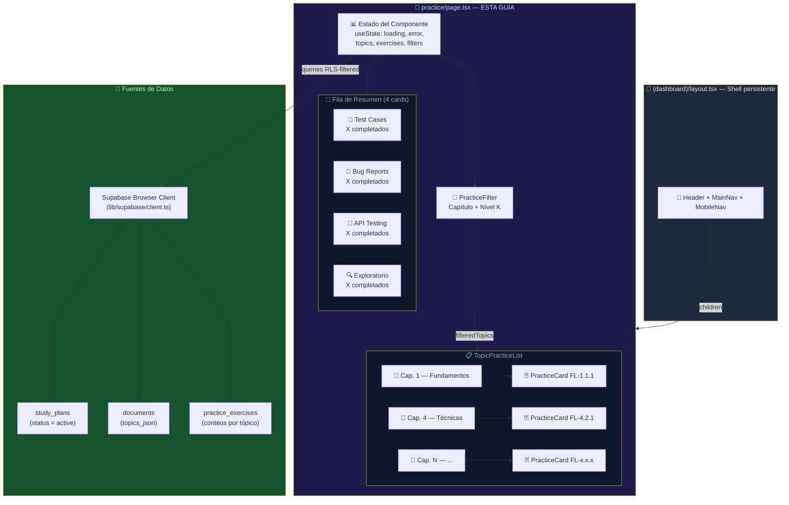
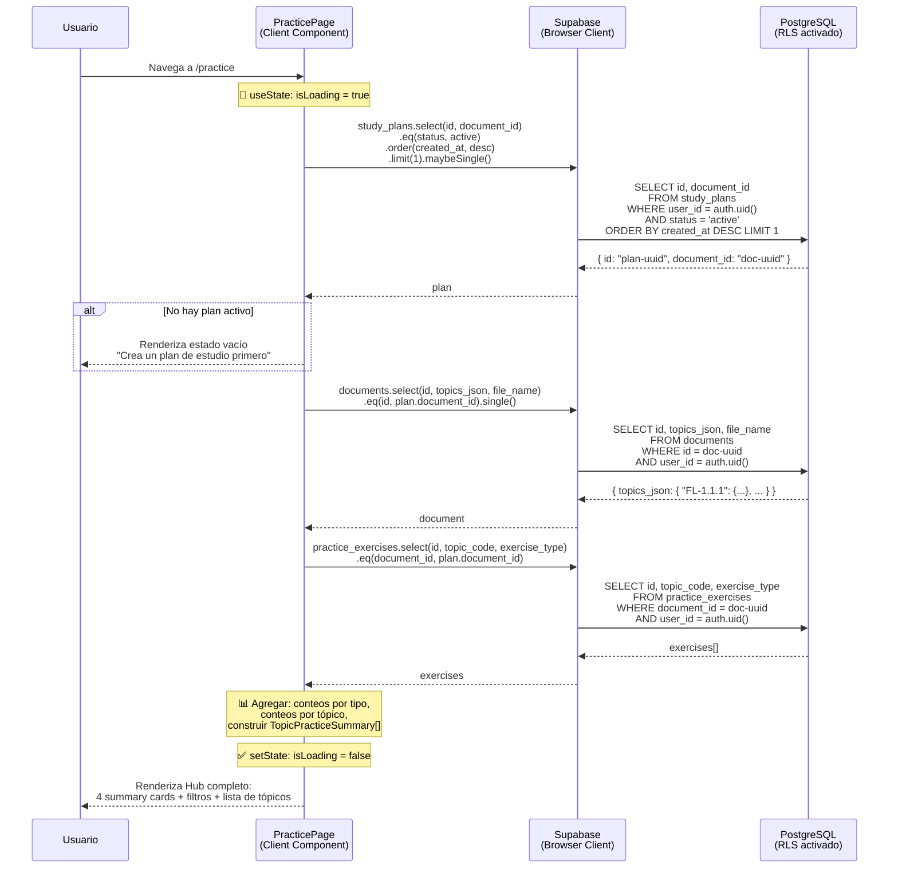

# Guía Didáctica PL-06: UI — Hub de Prácticas (`/practice`)

---

## Sección 1: 🎓 Introducción y Fundamentos Conceptuales

### Recapitulación: ¿Dónde estamos?

En las guías anteriores del Bloque H construiste la **infraestructura base** del QA Practice Lab:

- **PL-01:** Tablas `practice_exercises` y `practice_submissions` con constraints, FK compuesta y ownership cruzado.
- **PL-02:** 7 RLS policies con validación de ownership cruzado y aislamiento entre usuarios.
- **PL-03:** Tipos TypeScript completos: `PracticeExercise`, `ExerciseScenario`, `ExerciseSolution`, `TopicPracticeSummary`, `ExerciseTypeInfo`, y más.
- **PL-04:** El Prompt Builder `practice-exercise.ts` con `buildPracticeSystemPrompt()` y `buildPracticeUserPrompt()`.
- **PL-05:** La API Route `POST /api/practice/generate` — el endpoint que genera ejercicios prácticos.

Hasta ahora tienes la **base de datos lista**, los **tipos definidos**, el **prompt diseñado** y la **API Route implementada**. Antes de implementar esta guía, PL-05 debe estar cerrada con una prueba autenticada `200` y persistencia confirmada en `practice_exercises`; si PL-05 sigue en validación, puedes leer PL-06, pero no marcarla como implementada. Una vez cerrado ese gate, necesitas una **interfaz de usuario** que:

1. Muestre al usuario todos los tópicos ISTQB disponibles para practicar.
2. Organice los tópicos por capítulo (FL-1, FL-2, FL-3...).
3. Muestre un resumen de actividad por tipo de ejercicio (Test Cases, Bug Reports, etc.).
4. Permita filtrar tópicos por capítulo y nivel cognitivo (K1, K2, K3).
5. Ofrezca un botón principal de acción para navegar al ejercicio de cada tópico.

Esta página será el **punto de entrada principal** del QA Practice Lab — el equivalente a la página `/dashboard` pero para el módulo de prácticas.

### Analogía profesional

Imagina que eres el **director de un centro de entrenamiento de pilotos de aerolínea**. Tu centro tiene múltiples simuladores: uno para despegues y aterrizajes, otro para emergencias eléctricas, otro para condiciones meteorológicas extremas, y otro para procedimientos de cabina.

Cuando un piloto en formación llega al centro, lo primero que ve es el **tablero de control central** — una pantalla grande en la recepción que muestra:

1. **Resumen por simulador**: cuántas sesiones se han completado en cada tipo de simulador, cuántas quedan pendientes, y el score promedio de las evaluaciones.
2. **Lista de módulos de entrenamiento**: cada módulo del programa de formación (navegación, comunicaciones, procedimientos de emergencia...) aparece organizado por fase de entrenamiento. El piloto puede ver de un vistazo cuáles ya practicó, cuáles tiene pendientes, y en cuáles le fue mejor o peor.
3. **Filtros inteligentes**: el tablero permite filtrar por fase ("Quiero ver solo los módulos de la Fase 3"), por dificultad ("Solo los ejercicios avanzados"), o por estado ("Solo los que no he practicado").
4. **Acceso directo al simulador**: cada módulo tiene un botón que lanza el simulador correspondiente — el piloto selecciona su módulo y entra directo a practicar.

Tu página `/practice` es exactamente ese tablero de control. Los "simuladores" son los 4 tipos de ejercicio (Test Cases, Bug Reports, API Testing, Exploratory). Los "módulos de entrenamiento" son los tópicos ISTQB (FL-1.1.1, FL-4.2.1, etc.). Los "filtros" permiten al usuario enfocarse en lo que necesita. Y los botones de acción lanzan la experiencia de práctica.

Esta analogía ilustra un principio fundamental de diseño de UI: **antes de poder practicar, el usuario necesita un mapa completo de qué puede practicar, dónde está, y qué ya hizo**. Sin este mapa, el usuario se pierde. Con este mapa, el usuario tiene control y dirección.

### Conceptos de React/Next.js relevantes para esta guía

#### Client Component vs Server Component para una página con filtros

Esta página `/practice` será un **Client Component** (`'use client'`). ¿Por qué? Porque necesita:

1. **`useState`** para manejar el estado de los filtros (capítulo seleccionado, niveles K activos).
2. **`useEffect`** para hacer fetch de datos al montar el componente.
3. **`useCallback`** para memoizar funciones de fetch (patrón del dashboard).
4. **Interactividad dinámica** — al cambiar un filtro, la lista se actualiza inmediatamente sin recargar la página.

Un Server Component no puede hacer nada de esto. Los Server Components son ideales para páginas que solo renderizan datos estáticos. Las páginas con filtros, búsqueda, o estado interactivo necesitan ser Client Components.

#### Patrón Container + Presentational

Seguiremos el mismo patrón que `dashboard/page.tsx`:

- **Container Component** (`page.tsx`): obtiene los datos, gestiona el estado de filtros, y pasa datos como props a los hijos.
- **Presentational Components** (`practice-card.tsx`, `topic-practice-list.tsx`, `practice-filter.tsx`): reciben props, renderizan UI, y emiten eventos al padre via callbacks.

Este patrón separa **qué datos obtener** (container) de **cómo mostrarlos** (presentational). Facilita testing, refactoring, y reutilización.

#### Consultas Supabase desde Client Components

A diferencia del dashboard (que usa `fetch('/api/dashboard/metrics')`), esta página usará el **cliente de Supabase para el navegador** directamente. ¿Por qué?

1. Las queries son simples (SELECT + COUNT), no necesitan lógica de servidor compleja.
2. RLS ya protege los datos — el usuario solo ve sus documentos y ejercicios.
3. No necesitamos crear una API Route adicional (fuera del alcance de PL-06).
4. Es un patrón válido y recomendado por Supabase para lecturas simples.

El cliente de navegador se crea con `createClient()` de `@/lib/supabase/client` y envía automáticamente las cookies de autenticación.

---

## Sección 2: 📋 Prerequisitos y Verificación del Entorno

### Herramientas requeridas

| Herramienta | Comando de verificación | Versión mínima |
|:---|:---|:---|
| Node.js | `node --version` | v18.0.0+ |
| TypeScript | `npx tsc --version` | 5.0+ |
| Next.js | Verificar en `frontend/package.json` | 16.x (`package.json` declara `^16.2.7`) |

### Entregables de guías anteriores que DEBEN existir

| Guía | Entregable | Verificación |
|:---|:---|:---|
| **FE-02** | `frontend/lib/supabase/client.ts` con `createClient()` | `Test-Path -LiteralPath "frontend\lib\supabase\client.ts"` → True |
| **FE-04** | Dashboard layout con navegación | `/dashboard` renderiza correctamente |
| **UP-03** | Al menos 1 documento con `topics_json` en la tabla `documents` | Visible en Supabase Table Editor |
| **UP-05** | Al menos 1 `study_plan` con `status = 'active'` | Visible en Supabase Table Editor |
| **PL-03** | `frontend/types/practice.ts` con `ExerciseTypeInfo` y `TopicPracticeSummary` | `Test-Path -LiteralPath "frontend\types\practice.ts"` → True |
| **PL-05** | `frontend/app/api/practice/generate/route.ts` | `Test-Path -LiteralPath "frontend\app\api\practice\generate\route.ts"` → True |
| **PL-05** | Validación funcional cerrada | `POST /api/practice/generate` autenticado retorna `200` y crea fila en `practice_exercises` |

### Verificación en PowerShell

```powershell
# 1. Verificar que todos los archivos prerequisito existen
Test-Path -LiteralPath "frontend\lib\supabase\client.ts"
Test-Path -LiteralPath "frontend\types\practice.ts"
Test-Path -LiteralPath "frontend\app\api\practice\generate\route.ts"
# Todas deben ser True

# 2. Verificar que el proyecto compila sin errores
npx tsc --noEmit --project frontend/tsconfig.json
# Esperado: sin errores

# 3. Verificar que NO existe aún la página de practice (la crearemos)
Test-Path -LiteralPath "frontend\app\(dashboard)\practice"
# Esperado: False (la crearemos en esta guía)
```

> **Puerta de dependencia:** PL-06 depende de PL-05 cerrada, no solo de que exista el archivo `route.ts`. Si PL-05 todavía no tiene `200` autenticado + fila persistida, termina esa validación antes de implementar el Hub. Además, si no tienes al menos un `study_plan` activo con un `document_id` válido que tenga `topics_json` poblado, la página mostrará un estado vacío. Asegúrate de haber completado el flujo de upload (UP-01 a UP-05) al menos una vez.

---

## Sección 3: 📂 Estructura de Directorios del Proyecto

```
practica-testing/
├── frontend/
│   ├── app/
│   │   ├── api/
│   │   │   ├── dashboard/metrics/route.ts        ← (existente — DA-01)
│   │   │   ├── extract/route.ts                  ← (existente — UP-03)
│   │   │   ├── plan/generate/route.ts            ← (existente — UP-04)
│   │   │   ├── practice/generate/route.ts        ← (existente — PL-05)
│   │   │   ├── sessions/[id]/...                 ← (existente — SE-01 a SE-07)
│   │   │   └── upload/route.ts                   ← (existente — UP-02)
│   │   ├── (auth)/                               ← (existente — FE-03)
│   │   ├── (dashboard)/
│   │   │   ├── layout.tsx                        ← (existente — FE-04, dashboard shell)
│   │   │   ├── _components/                      ← (existente — main-nav, mobile-nav, user-menu)
│   │   │   ├── dashboard/page.tsx                ← (existente — DA-02 a DA-05)
│   │   │   ├── plan/...                          ← (existente — UP-06)
│   │   │   ├── session/...                       ← (existente — SE-01 a SE-08)
│   │   │   ├── setup/...                         ← (existente — UP-01)
│   │   │   └── practice/                         ← 🆕 NUEVO directorio
│   │   │       ├── page.tsx                      ← 🆕 NUEVO EN ESTA GUÍA
│   │   │       └── _components/                  ← 🆕 NUEVO directorio
│   │   │           ├── practice-filter.tsx        ← 🆕 NUEVO EN ESTA GUÍA
│   │   │           ├── practice-card.tsx          ← 🆕 NUEVO EN ESTA GUÍA
│   │   │           └── topic-practice-list.tsx    ← 🆕 NUEVO EN ESTA GUÍA
│   │   ├── globals.css
│   │   ├── layout.tsx
│   │   └── page.tsx
│   ├── components/
│   │   ├── dashboard/...                         ← (existente — DA-02 a DA-05)
│   │   ├── session/...                           ← (existente — SE-03 a SE-08)
│   │   └── ui/                                   ← (existente — shadcn: Button, Card, Badge, etc.)
│   ├── lib/
│   │   ├── prompts/practice-exercise.ts          ← (existente — PL-04)
│   │   ├── supabase/
│   │   │   ├── client.ts                         ← (existente — FE-02, USADO EN ESTA GUÍA)
│   │   │   └── server.ts                         ← (existente — FE-02)
│   │   └── utils.ts                              ← (existente — cn())
│   ├── types/
│   │   ├── practice.ts                           ← (existente — PL-03, TIPOS CONSUMIDOS)
│   │   ├── database.ts                           ← (existente — PL-03, TopicsJson, LevelK)
│   │   └── index.ts                              ← (existente — barrel exports)
│   └── package.json
│
└── docs/
    └── guides/
        └── fe/
            ├── PL-05.md                           ← (existente — guía anterior)
            └── PL-06.md                           ← 🆕 ESTA GUÍA
```

### Alcance de archivos de PL-06

| Acción | Archivo | Motivo |
|:---|:---|:---|
| **Crear** | `frontend/app/(dashboard)/practice/page.tsx` | Página principal del Practice Hub. |
| **Crear** | `frontend/app/(dashboard)/practice/_components/practice-filter.tsx` | Componente de filtros por capítulo y nivel K. |
| **Crear** | `frontend/app/(dashboard)/practice/_components/practice-card.tsx` | Tarjeta individual de tópico con estadísticas y acciones. |
| **Crear** | `frontend/app/(dashboard)/practice/_components/topic-practice-list.tsx` | Lista de tópicos agrupada por capítulo ISTQB. |
| No tocar | `frontend/types/practice.ts` | Tipos `ExerciseTypeInfo`, `TopicPracticeSummary` — se consumen, no se modifican. |
| No tocar | `frontend/lib/supabase/client.ts` | Cliente Supabase para navegador — se importa directamente. |
| No tocar | `frontend/app/api/practice/generate/route.ts` | API Route de PL-05 — será invocada desde PL-07, no desde PL-06. |
| No tocar | `frontend/app/(dashboard)/_components/main-nav.tsx` | La navegación principal se actualiza en PL-14, no en PL-06. |
| No tocar | `frontend/app/(dashboard)/_components/mobile-nav.tsx` | El enlace móvil de Practice Lab también pertenece a PL-14. |

> **Aclaración de alcance MVP:** El roadmap original menciona contadores tipo `completados/total` y botones `[Ver teoría] [Practicar] [Crear TC]`. En PL-06 todavía no existe la evaluación de prácticas (`PL-09`) ni la integración avanzada de métricas (`PL-13`), así que esta guía implementa un Hub mínimo viable: conteos de ejercicios generados, agrupación de tópicos, filtros y botón principal `Practicar`. Las métricas de completado y acciones especializadas se completan en guías posteriores.

---

## Sección 4: 🎨 Diagrama de Arquitectura de Componentes



### Flujo de Carga de Datos Completo



---

## Sección 5: 🛠️ Implementación Paso a Paso

### Paso A: Crear el directorio y el componente `practice-filter.tsx`

**Directorio a crear:** `frontend/app/(dashboard)/practice/_components/`

```powershell
# Crear el directorio de componentes (se creará practice/ automáticamente)
New-Item -ItemType Directory -Path "frontend\app\(dashboard)\practice\_components" -Force
```

**Archivo:** `frontend/app/(dashboard)/practice/_components/practice-filter.tsx`

```typescript
"use client";

// ─────────────────────────────────────────────────────────────────
// practice/_components/practice-filter.tsx
// Componente de filtros para el Hub de Prácticas.
//
// TIPO: Client Component (interactivo — maneja clicks en filtros).
// PATRÓN: Presentational — recibe estado via props,
//         emite cambios via callbacks (onFilterChange).
//
// FILTROS DISPONIBLES:
//   1. Por capítulo ISTQB (FL-1 a FL-6)
//   2. Por nivel cognitivo (K1, K2, K3)
//
// DISEÑO: Horizontal pills/badges que se activan/desactivan al click.
//         Consistente con el estilo oscuro del dashboard.
// ─────────────────────────────────────────────────────────────────

import { X, Filter } from "lucide-react";
import type { LevelK } from "@/types/database";

// ─── Props ────────────────────────────────────────────────────

export interface PracticeFilterProps {
  /** Lista de capítulos disponibles (e.g., ["1", "2", "3", ...]) */
  availableChapters: string[];
  /** Capítulo actualmente seleccionado (null = todos) */
  selectedChapter: string | null;
  /** Niveles K actualmente activos (array vacío = todos) */
  selectedLevels: LevelK[];
  /** Callback cuando cambia cualquier filtro */
  onChapterChange: (chapter: string | null) => void;
  /** Callback cuando cambia la selección de niveles K */
  onLevelChange: (levels: LevelK[]) => void;
}

// ─── Constantes de diseño ─────────────────────────────────────

/** Nombres descriptivos de los capítulos ISTQB FL */
const CHAPTER_NAMES: Record<string, string> = {
  "1": "Fundamentos del Testing",
  "2": "Testing en el SDLC",
  "3": "Testing Estático",
  "4": "Técnicas de Testing",
  "5": "Gestión del Testing",
  "6": "Herramientas de Testing",
};

/** Todos los niveles K posibles */
const ALL_LEVELS: LevelK[] = ["K1", "K2", "K3"];

/** Colores por nivel K — consistentes con los badges del proyecto */
const LEVEL_COLORS: Record<LevelK, { active: string; inactive: string }> = {
  K1: {
    active: "bg-sky-500/30 text-sky-300 border-sky-500/50",
    inactive:
      "bg-slate-800/50 text-slate-400 border-slate-700 hover:bg-sky-500/10 hover:text-sky-400 hover:border-sky-500/30",
  },
  K2: {
    active: "bg-amber-500/30 text-amber-300 border-amber-500/50",
    inactive:
      "bg-slate-800/50 text-slate-400 border-slate-700 hover:bg-amber-500/10 hover:text-amber-400 hover:border-amber-500/30",
  },
  K3: {
    active: "bg-rose-500/30 text-rose-300 border-rose-500/50",
    inactive:
      "bg-slate-800/50 text-slate-400 border-slate-700 hover:bg-rose-500/10 hover:text-rose-400 hover:border-rose-500/30",
  },
};

// ─── Componente ───────────────────────────────────────────────

export function PracticeFilter({
  availableChapters,
  selectedChapter,
  selectedLevels,
  onChapterChange,
  onLevelChange,
}: PracticeFilterProps) {
  // ─── Handler para toggle de nivel K ─────────────────────
  // Si el nivel ya está activo, lo quitamos del array.
  // Si no está activo, lo agregamos.
  // Si el array resultante incluye los 3 niveles, volvemos
  // a array vacío (= "todos seleccionados").
  function handleLevelToggle(level: LevelK) {
    let updated: LevelK[];
    if (selectedLevels.includes(level)) {
      // Quitar este nivel
      updated = selectedLevels.filter((l) => l !== level);
    } else {
      // Agregar este nivel
      updated = [...selectedLevels, level];
    }
    // Si seleccionaron los 3, equivale a "todos" → resetear
    if (updated.length === ALL_LEVELS.length) {
      updated = [];
    }
    onLevelChange(updated);
  }

  // ─── ¿Hay algún filtro activo? ──────────────────────────
  const hasActiveFilters =
    selectedChapter !== null || selectedLevels.length > 0;

  // ─── Handler para limpiar todos los filtros ─────────────
  function handleClearAll() {
    onChapterChange(null);
    onLevelChange([]);
  }

  return (
    <div className="rounded-xl border border-slate-800 bg-slate-900/50 p-4">
      {/* ─── Encabezado ─── */}
      <div className="flex items-center justify-between mb-3">
        <div className="flex items-center gap-2 text-sm font-medium text-slate-300">
          <Filter className="size-4" />
          <span>Filtros</span>
        </div>
        {hasActiveFilters && (
          <button
            onClick={handleClearAll}
            className="
              flex items-center gap-1 text-xs text-slate-500
              hover:text-slate-300 transition-colors cursor-pointer
            "
          >
            <X className="size-3" />
            Limpiar
          </button>
        )}
      </div>

      {/* ─── Filtro por capítulo ─── */}
      <div className="mb-3">
        <p className="text-xs text-slate-500 mb-2">Capítulo</p>
        <div className="flex flex-wrap gap-2">
          {/* Pill "Todos" */}
          <button
            onClick={() => onChapterChange(null)}
            className={`
              px-3 py-1.5 text-xs font-medium rounded-lg border
              transition-colors cursor-pointer
              ${
                selectedChapter === null
                  ? "bg-emerald-500/20 text-emerald-300 border-emerald-500/50"
                  : "bg-slate-800/50 text-slate-400 border-slate-700 hover:bg-slate-700/50 hover:text-slate-300"
              }
            `}
          >
            Todos
          </button>

          {/* Pills por capítulo */}
          {availableChapters.map((ch) => (
            <button
              key={ch}
              onClick={() =>
                onChapterChange(selectedChapter === ch ? null : ch)
              }
              title={CHAPTER_NAMES[ch] ?? `Capítulo ${ch}`}
              className={`
                px-3 py-1.5 text-xs font-medium rounded-lg border
                transition-colors cursor-pointer
                ${
                  selectedChapter === ch
                    ? "bg-emerald-500/20 text-emerald-300 border-emerald-500/50"
                    : "bg-slate-800/50 text-slate-400 border-slate-700 hover:bg-slate-700/50 hover:text-slate-300"
                }
              `}
            >
              Cap. {ch}
            </button>
          ))}
        </div>
      </div>

      {/* ─── Filtro por nivel K ─── */}
      <div>
        <p className="text-xs text-slate-500 mb-2">Nivel Cognitivo</p>
        <div className="flex gap-2">
          {ALL_LEVELS.map((level) => {
            const isActive =
              selectedLevels.length === 0 || selectedLevels.includes(level);
            const colors = LEVEL_COLORS[level];
            return (
              <button
                key={level}
                onClick={() => handleLevelToggle(level)}
                className={`
                  px-3 py-1.5 text-xs font-semibold rounded-lg border
                  transition-colors cursor-pointer
                  ${isActive ? colors.active : colors.inactive}
                `}
              >
                {level}
              </button>
            );
          })}
        </div>
      </div>
    </div>
  );
}
```

**Entregable del Paso A:**
- ✅ Directorio `frontend/app/(dashboard)/practice/_components/` creado.
- ✅ Archivo `frontend/app/(dashboard)/practice/_components/practice-filter.tsx` creado.

---

### Paso B: Crear el componente `practice-card.tsx`

**Archivo:** `frontend/app/(dashboard)/practice/_components/practice-card.tsx`

```typescript
"use client";

// ─────────────────────────────────────────────────────────────────
// practice/_components/practice-card.tsx
// Tarjeta individual de un tópico ISTQB en el Hub de Prácticas.
//
// TIPO: Client Component (interactivo — botones de navegación).
// PATRÓN: Presentational — recibe datos via props, no hace queries.
//
// MUESTRA:
//   - Código del tópico (FL-x.x.x) como badge
//   - Nombre descriptivo del tópico
//   - Badge de nivel K con color semántico
//   - Contador de ejercicios generados para este tópico
//   - Botón "Practicar" que navega a /practice/[topicCode]
//
// DISEÑO:
//   - Fondo oscuro con borde sutil (consistente con dashboard cards)
//   - Hover effect con elevación y brillo del borde
//   - Responsive: 1 col en mobile, 2+ col en desktop (manejado por parent)
// ─────────────────────────────────────────────────────────────────

import Link from "next/link";
import { Beaker, ChevronRight } from "lucide-react";
import type { LevelK } from "@/types/database";

// ─── Props ────────────────────────────────────────────────────

export interface PracticeCardProps {
  /** Código del tópico ISTQB (e.g., "FL-4.2.1") */
  topicCode: string;
  /** Nombre descriptivo del tópico */
  topicName: string;
  /** Nivel cognitivo del tópico */
  levelK: LevelK;
  /** Total de ejercicios generados para este tópico */
  exerciseCount: number;
  /** ID del documento (para pasar como query param) */
  documentId: string;
}

// ─── Estilos por nivel K ──────────────────────────────────────

const LEVEL_K_STYLES: Record<LevelK, string> = {
  K1: "bg-sky-500/20 text-sky-400 border-sky-500/30",
  K2: "bg-amber-500/20 text-amber-400 border-amber-500/30",
  K3: "bg-rose-500/20 text-rose-400 border-rose-500/30",
};

/** Descripción corta de cada nivel para tooltip */
const LEVEL_K_LABELS: Record<LevelK, string> = {
  K1: "Recordar",
  K2: "Comprender",
  K3: "Aplicar",
};

// ─── Componente ───────────────────────────────────────────────

export function PracticeCard({
  topicCode,
  topicName,
  levelK,
  exerciseCount,
  documentId,
}: PracticeCardProps) {
  // La URL destino incluye el topicCode como segmento dinámico
  // y el document_id como query param para que PL-07 sepa
  // de qué documento obtener los datos.
  const practiceUrl = `/practice/${encodeURIComponent(topicCode)}?document_id=${documentId}`;

  return (
    <div
      className="
        group relative rounded-xl border border-slate-800
        bg-slate-900/50 p-4
        transition-all duration-200
        hover:border-slate-700 hover:bg-slate-900/80
        hover:shadow-lg hover:shadow-emerald-500/5
      "
    >
      <div className="flex items-start justify-between gap-3">
        {/* ─── Lado izquierdo: código + nombre + nivel K ─── */}
        <div className="flex-1 min-w-0">
          {/* Fila superior: código del tópico + badge nivel K */}
          <div className="flex items-center gap-2 mb-1.5">
            {/* Badge del código del tópico */}
            <span
              className="
                inline-flex items-center px-2 py-0.5
                text-xs font-mono font-semibold
                rounded-md bg-slate-800 text-slate-300
                border border-slate-700
              "
            >
              {topicCode}
            </span>

            {/* Badge del nivel K con color semántico */}
            <span
              title={LEVEL_K_LABELS[levelK]}
              className={`
                inline-flex items-center px-2 py-0.5
                text-xs font-semibold rounded-md border
                ${LEVEL_K_STYLES[levelK]}
              `}
            >
              {levelK}
            </span>
          </div>

          {/* Nombre del tópico — truncado si es muy largo */}
          <p
            className="text-sm text-slate-200 leading-snug line-clamp-2"
            title={topicName}
          >
            {topicName}
          </p>

          {/* Contador de ejercicios */}
          <div className="flex items-center gap-1.5 mt-2 text-xs text-slate-500">
            <Beaker className="size-3.5" />
            <span>
              {exerciseCount === 0
                ? "Sin ejercicios"
                : exerciseCount === 1
                  ? "1 ejercicio"
                  : `${exerciseCount} ejercicios`}
            </span>
          </div>
        </div>

        {/* ─── Lado derecho: botón de acción ─── */}
        <Link
          href={practiceUrl}
          className="
            flex items-center gap-1 shrink-0
            px-3 py-2 text-xs font-semibold rounded-lg
            bg-emerald-500/10 text-emerald-400 border border-emerald-500/20
            hover:bg-emerald-500/20 hover:border-emerald-500/40
            transition-colors
          "
        >
          Practicar
          <ChevronRight className="size-3.5 transition-transform group-hover:translate-x-0.5" />
        </Link>
      </div>
    </div>
  );
}
```

**Entregable del Paso B:**
- ✅ Archivo `frontend/app/(dashboard)/practice/_components/practice-card.tsx` creado.

---

### Paso C: Crear el componente `topic-practice-list.tsx`

**Archivo:** `frontend/app/(dashboard)/practice/_components/topic-practice-list.tsx`

```typescript
"use client";

// ─────────────────────────────────────────────────────────────────
// practice/_components/topic-practice-list.tsx
// Lista de tópicos ISTQB agrupada por capítulo.
//
// TIPO: Client Component (usa el PracticeCard interactivo).
// PATRÓN: Presentational — recibe la lista filtrada, la agrupa
//         por capítulo y renderiza secciones con PracticeCards.
//
// AGRUPACIÓN:
//   Los tópicos ISTQB siguen el patrón FL-{capítulo}.{sección}.{subsección}.
//   Este componente extrae el número de capítulo del código del tópico
//   y agrupa los tópicos bajo headers descriptivos:
//     - Cap. 1: Fundamentos del Testing
//     - Cap. 2: Testing en el SDLC
//     - Cap. 3: Testing Estático
//     - Cap. 4: Técnicas de Testing
//     - Cap. 5: Gestión del Testing
//     - Cap. 6: Herramientas de Testing
//
// DISEÑO:
//   - Headers de capítulo con estilo de sección colapsable
//   - Grid responsivo de PracticeCards dentro de cada sección
//   - Animación sutil al cargar la lista
// ─────────────────────────────────────────────────────────────────

import { BookOpen } from "lucide-react";
import { PracticeCard } from "./practice-card";
import type { LevelK } from "@/types/database";

// ─── Tipos ────────────────────────────────────────────────────

/** Datos de un tópico listos para renderizar en el Hub */
export interface TopicForDisplay {
  topicCode: string;
  topicName: string;
  levelK: LevelK;
  exerciseCount: number;
}

export interface TopicPracticeListProps {
  /** Lista de tópicos (ya filtrada por el padre) */
  topics: TopicForDisplay[];
  /** ID del documento para pasar a los PracticeCards */
  documentId: string;
}

// ─── Constantes ───────────────────────────────────────────────

/** Nombres descriptivos de los capítulos ISTQB Foundation Level */
const CHAPTER_NAMES: Record<string, string> = {
  "1": "Fundamentos del Testing",
  "2": "Testing a lo Largo del SDLC",
  "3": "Testing Estático",
  "4": "Técnicas de Testing",
  "5": "Gestión del Testing",
  "6": "Herramientas de Testing",
};

// ─── Helpers ──────────────────────────────────────────────────

/**
 * Extrae el número de capítulo del código de tópico ISTQB.
 *
 * Ejemplos:
 *   "FL-1.1.1" → "1"
 *   "FL-4.2.1" → "4"
 *   "FL-6.1.2" → "6"
 *   "UNKNOWN"  → "0" (fallback)
 */
function getChapterNumber(topicCode: string): string {
  const match = topicCode.match(/^FL-(\d+)/);
  return match ? match[1] : "0";
}

/**
 * Agrupa un array de tópicos por capítulo.
 * Retorna un Map ordenado por número de capítulo.
 */
function groupByChapter(
  topics: TopicForDisplay[],
): Map<string, TopicForDisplay[]> {
  const groups = new Map<string, TopicForDisplay[]>();

  for (const topic of topics) {
    const chapter = getChapterNumber(topic.topicCode);
    const existing = groups.get(chapter) ?? [];
    existing.push(topic);
    groups.set(chapter, existing);
  }

  // Ordenar por número de capítulo
  return new Map(
    [...groups.entries()].sort(
      ([a], [b]) => Number(a) - Number(b),
    ),
  );
}

// ─── Componente ───────────────────────────────────────────────

export function TopicPracticeList({
  topics,
  documentId,
}: TopicPracticeListProps) {
  // ─── Estado vacío ───────────────────────────────────────
  if (topics.length === 0) {
    return (
      <div className="rounded-xl border border-slate-800 bg-slate-900/50 p-8 text-center">
        <div className="text-4xl mb-3">🔍</div>
        <h3 className="text-base font-semibold text-slate-300 mb-1">
          No se encontraron tópicos
        </h3>
        <p className="text-sm text-slate-500">
          Prueba ajustando los filtros o verifica que tu documento tiene tópicos
          ISTQB extraídos correctamente.
        </p>
      </div>
    );
  }

  // ─── Agrupar por capítulo ───────────────────────────────
  const chapters = groupByChapter(topics);

  return (
    <div className="space-y-6">
      {[...chapters.entries()].map(([chapterNum, chapterTopics]) => (
        <section key={chapterNum}>
          {/* ─── Header del capítulo ─── */}
          <div className="flex items-center gap-2 mb-3">
            <BookOpen className="size-4 text-emerald-400" />
            <h3 className="text-sm font-semibold text-slate-200">
              Capítulo {chapterNum}
              <span className="text-slate-500 font-normal ml-1">
                — {CHAPTER_NAMES[chapterNum] ?? `Capítulo ${chapterNum}`}
              </span>
            </h3>
            <span className="text-xs text-slate-600 ml-auto">
              {chapterTopics.length}{" "}
              {chapterTopics.length === 1 ? "tópico" : "tópicos"}
            </span>
          </div>

          {/* ─── Grid de tarjetas ─── */}
          <div className="grid gap-3 sm:grid-cols-2 lg:grid-cols-3">
            {chapterTopics.map((topic) => (
              <PracticeCard
                key={topic.topicCode}
                topicCode={topic.topicCode}
                topicName={topic.topicName}
                levelK={topic.levelK}
                exerciseCount={topic.exerciseCount}
                documentId={documentId}
              />
            ))}
          </div>
        </section>
      ))}
    </div>
  );
}
```

**Entregable del Paso C:**
- ✅ Archivo `frontend/app/(dashboard)/practice/_components/topic-practice-list.tsx` creado.

---

### Paso D: Crear la página principal `page.tsx`

**Archivo:** `frontend/app/(dashboard)/practice/page.tsx`

Este es el **Container Component** que orquesta toda la página del Practice Hub. Es el archivo más importante de esta guía.

```typescript
"use client";

// ============================================================
// app/(dashboard)/practice/page.tsx — Hub de Prácticas
// ============================================================
// TIPO: Client Component ('use client')
//
// RESPONSABILIDADES:
//   1. Obtener el plan de estudio activo del usuario.
//   2. Cargar el documento asociado con sus tópicos (topics_json).
//   3. Cargar los ejercicios de práctica existentes (para conteos).
//   4. Renderizar las 4 cards de resumen por tipo de ejercicio.
//   5. Renderizar los filtros y la lista de tópicos por capítulo.
//   6. Manejar estados de loading, error y vacío.
//
// ¿POR QUÉ CLIENT COMPONENT?
//   1. Necesita useState para filtros interactivos
//   2. Necesita useEffect para fetch de datos al montar
//   3. Necesita useCallback para memoizar funciones
//   Los filtros cambian la lista en tiempo real sin recargar.
//
// PATRÓN: Container Component (mismo que dashboard/page.tsx)
//   Esta página obtiene los datos y los pasa a componentes
//   presentacionales (PracticeFilter, TopicPracticeList) via props.
//
// FUENTE DE DATOS:
//   Supabase Browser Client (createClient de lib/supabase/client).
//   RLS filtra automáticamente por user_id = auth.uid().
//   No necesitamos una API Route adicional para lecturas simples.
// ============================================================

import { useState, useEffect, useCallback, useMemo } from "react";
import Link from "next/link";
import { createClient } from "@/lib/supabase/client";
import type { LevelK } from "@/types/database";
import type {
  PracticeExerciseType,
  ExerciseTypeInfo,
} from "@/types/practice";
import { PracticeFilter } from "./_components/practice-filter";
import {
  TopicPracticeList,
  type TopicForDisplay,
} from "./_components/topic-practice-list";

// ──────────────────────────────────────────────────────────────
// Constantes
// ──────────────────────────────────────────────────────────────

/**
 * Metadata de los 4 tipos de ejercicio para las cards de resumen.
 * Usa el tipo ExerciseTypeInfo definido en PL-03.
 *
 * Cada card muestra un ícono, nombre, descripción y color.
 * Los contadores se calculan dinámicamente desde las queries.
 */
const EXERCISE_TYPES: ExerciseTypeInfo[] = [
  {
    type: "test_cases",
    label: "Test Cases",
    description: "Diseña casos de prueba con particiones y valores límite",
    icon: "🧪",
    colorClass: "from-emerald-500/20 to-emerald-900/5 border-emerald-500/20",
  },
  {
    type: "bug_report",
    label: "Bug Reports",
    description: "Redacta reportes de defecto profesionales",
    icon: "🐛",
    colorClass: "from-amber-500/20 to-amber-900/5 border-amber-500/20",
  },
  {
    type: "api_testing",
    label: "API Testing",
    description: "Valida endpoints con checklists estructurados",
    icon: "🔌",
    colorClass: "from-blue-500/20 to-blue-900/5 border-blue-500/20",
  },
  {
    type: "exploratory",
    label: "Exploratorio",
    description: "Sesiones guiadas de testing exploratorio",
    icon: "🔍",
    colorClass: "from-purple-500/20 to-purple-900/5 border-purple-500/20",
  },
];

// ──────────────────────────────────────────────────────────────
// Tipos internos
// ──────────────────────────────────────────────────────────────

/** Estructura de un tópico extraído de topics_json */
interface TopicEntry {
  text: string;
  level_k: string;
  name: string;
}

/** Estado global de la página */
interface PracticeHubState {
  /** true mientras se cargan los datos iniciales */
  isLoading: boolean;
  /** Mensaje de error (null si no hay error) */
  error: string | null;
  /** ID del documento asociado al plan activo */
  documentId: string | null;
  /** Nombre del archivo PDF subido */
  fileName: string | null;
  /** Tópicos del documento, parseados a TopicForDisplay[] */
  topics: TopicForDisplay[];
  /** Conteos de ejercicios por tipo */
  exerciseCountsByType: Record<PracticeExerciseType, number>;
  /** Total de ejercicios generados (todos los tipos) */
  totalExercises: number;
}

// ──────────────────────────────────────────────────────────────
// Helpers
// ──────────────────────────────────────────────────────────────

/**
 * Extrae el número de capítulo del código de tópico ISTQB.
 * "FL-4.2.1" → "4"
 */
function getChapterFromCode(code: string): string {
  const match = code.match(/^FL-(\d+)/);
  return match ? match[1] : "0";
}

// ──────────────────────────────────────────────────────────────
// Componente Principal
// ──────────────────────────────────────────────────────────────

export default function PracticePage() {
  // ═══════════════════════════════════════════════════════════
  // ESTADO
  // ═══════════════════════════════════════════════════════════

  // Estado principal de datos (cargados desde Supabase)
  const [state, setState] = useState<PracticeHubState>({
    isLoading: true,
    error: null,
    documentId: null,
    fileName: null,
    topics: [],
    exerciseCountsByType: {
      test_cases: 0,
      bug_report: 0,
      api_testing: 0,
      exploratory: 0,
    },
    totalExercises: 0,
  });

  // Estado de filtros (interactivo, cambia sin refetch)
  const [selectedChapter, setSelectedChapter] = useState<string | null>(null);
  const [selectedLevels, setSelectedLevels] = useState<LevelK[]>([]);

  // ═══════════════════════════════════════════════════════════
  // FETCH DE DATOS
  // ═══════════════════════════════════════════════════════════

  const fetchPracticeData = useCallback(async () => {
    setState((prev) => ({ ...prev, isLoading: true, error: null }));

    try {
      const supabase = createClient();

      // ─── 1. Obtener el plan de estudio activo ────────────
      // Buscamos el plan más reciente con status = 'active'.
      // RLS filtra automáticamente por user_id = auth.uid().
      const { data: plan, error: planError } = await supabase
        .from("study_plans")
        .select("id, document_id")
        .eq("status", "active")
        .order("created_at", { ascending: false })
        .limit(1)
        .maybeSingle();

      if (planError) {
        console.error("[practice] Error al buscar plan activo:", planError);
        throw new Error("Error al buscar tu plan de estudio.");
      }

      // Si no hay plan activo, mostrar estado vacío.
      if (!plan) {
        setState({
          isLoading: false,
          error: null,
          documentId: null,
          fileName: null,
          topics: [],
          exerciseCountsByType: {
            test_cases: 0,
            bug_report: 0,
            api_testing: 0,
            exploratory: 0,
          },
          totalExercises: 0,
        });
        return;
      }

      // ─── 2. Obtener el documento con topics_json ─────────
      const { data: doc, error: docError } = await supabase
        .from("documents")
        .select("id, topics_json, file_name")
        .eq("id", plan.document_id)
        .single();

      if (docError || !doc) {
        console.error("[practice] Error al obtener documento:", docError);
        throw new Error("No se pudo cargar el documento de tu plan.");
      }

      // ─── 3. Obtener ejercicios existentes ────────────────
      // Hacemos SELECT de todos los ejercicios del documento
      // para calcular conteos por tópico y por tipo.
      const { data: exercises, error: exError } = await supabase
        .from("practice_exercises")
        .select("id, topic_code, exercise_type")
        .eq("document_id", plan.document_id);

      if (exError) {
        console.error("[practice] Error al obtener ejercicios:", exError);
        // No es crítico — continuamos con conteos en 0
      }

      // ─── 4. Procesar datos ───────────────────────────────

      // 4a. Parsear topics_json a TopicForDisplay[]
      const topicsJson =
        (doc.topics_json as Record<string, TopicEntry> | null) ?? {};
      const exerciseList = exercises ?? [];

      // 4b. Contar ejercicios por tópico (para el progreso)
      const exercisesByTopic = new Map<string, number>();
      for (const ex of exerciseList) {
        const current = exercisesByTopic.get(ex.topic_code) ?? 0;
        exercisesByTopic.set(ex.topic_code, current + 1);
      }

      // 4c. Contar ejercicios por tipo (para las summary cards)
      const countsByType: Record<PracticeExerciseType, number> = {
        test_cases: 0,
        bug_report: 0,
        api_testing: 0,
        exploratory: 0,
      };
      for (const ex of exerciseList) {
        const exType = ex.exercise_type as PracticeExerciseType;
        if (exType in countsByType) {
          countsByType[exType]++;
        }
      }

      // 4d. Construir array de tópicos para display
      const topicEntries: TopicForDisplay[] = Object.entries(topicsJson)
        .map(([code, data]) => ({
          topicCode: code,
          topicName: data.name || code,
          levelK: (data.level_k || "K1") as LevelK,
          exerciseCount: exercisesByTopic.get(code) ?? 0,
        }))
        // Ordenar por código de tópico (FL-1.1.1 < FL-1.2.1 < FL-2.1.1)
        .sort((a, b) => a.topicCode.localeCompare(b.topicCode));

      // ─── 5. Actualizar estado ────────────────────────────
      setState({
        isLoading: false,
        error: null,
        documentId: doc.id as string,
        fileName: (doc.file_name as string) ?? null,
        topics: topicEntries,
        exerciseCountsByType: countsByType,
        totalExercises: exerciseList.length,
      });
    } catch (err) {
      const errorMessage =
        err instanceof Error ? err.message : "Error al cargar los datos.";
      setState((prev) => ({
        ...prev,
        isLoading: false,
        error: errorMessage,
      }));
    }
  }, []);

  // ─── Fetch al montar ────────────────────────────────────
  useEffect(() => {
    fetchPracticeData();
  }, [fetchPracticeData]);

  // ═══════════════════════════════════════════════════════════
  // FILTROS (Computed)
  // ═══════════════════════════════════════════════════════════

  // Lista de capítulos disponibles (derivada de los tópicos)
  const availableChapters = useMemo(() => {
    const chapterSet = new Set<string>();
    for (const topic of state.topics) {
      chapterSet.add(getChapterFromCode(topic.topicCode));
    }
    return [...chapterSet].sort((a, b) => Number(a) - Number(b));
  }, [state.topics]);

  // Tópicos filtrados (derivados del estado + filtros)
  const filteredTopics = useMemo(() => {
    return state.topics.filter((topic) => {
      // Filtro por capítulo
      if (selectedChapter !== null) {
        const chapter = getChapterFromCode(topic.topicCode);
        if (chapter !== selectedChapter) return false;
      }
      // Filtro por nivel K (array vacío = todos)
      if (selectedLevels.length > 0) {
        if (!selectedLevels.includes(topic.levelK)) return false;
      }
      return true;
    });
  }, [state.topics, selectedChapter, selectedLevels]);

  // ═══════════════════════════════════════════════════════════
  // RENDER: Estado de carga
  // ═══════════════════════════════════════════════════════════

  if (state.isLoading) {
    return (
      <div className="flex flex-col gap-6">
        {/* Encabezado */}
        <div className="flex flex-col gap-2">
          <h1 className="text-3xl font-bold tracking-tight text-white">
            🔬 Practice Lab
          </h1>
          <p className="text-slate-400">Cargando tus tópicos de práctica...</p>
        </div>

        {/* Skeleton de summary cards */}
        <div className="grid gap-4 sm:grid-cols-2 lg:grid-cols-4">
          {[1, 2, 3, 4].map((i) => (
            <div
              key={i}
              className="rounded-xl border border-slate-800 bg-slate-900/50 p-5"
            >
              <div className="h-10 w-10 bg-slate-800 rounded-lg animate-pulse mb-3" />
              <div className="h-4 w-20 bg-slate-800 rounded animate-pulse mb-2" />
              <div className="h-6 w-12 bg-slate-800 rounded animate-pulse" />
            </div>
          ))}
        </div>

        {/* Skeleton del filtro */}
        <div className="rounded-xl border border-slate-800 bg-slate-900/50 p-4">
          <div className="h-4 w-24 bg-slate-800 rounded animate-pulse mb-3" />
          <div className="flex gap-2">
            {[1, 2, 3, 4, 5].map((i) => (
              <div
                key={i}
                className="h-8 w-16 bg-slate-800 rounded-lg animate-pulse"
              />
            ))}
          </div>
        </div>

        {/* Skeleton de la lista de tópicos */}
        <div className="space-y-4">
          {[1, 2, 3].map((section) => (
            <div key={section}>
              <div className="h-4 w-48 bg-slate-800 rounded animate-pulse mb-3" />
              <div className="grid gap-3 sm:grid-cols-2 lg:grid-cols-3">
                {[1, 2, 3].map((card) => (
                  <div
                    key={card}
                    className="rounded-xl border border-slate-800 bg-slate-900/50 p-4"
                  >
                    <div className="flex gap-2 mb-2">
                      <div className="h-5 w-16 bg-slate-800 rounded animate-pulse" />
                      <div className="h-5 w-8 bg-slate-800 rounded animate-pulse" />
                    </div>
                    <div className="h-4 w-full bg-slate-800 rounded animate-pulse mb-1" />
                    <div className="h-4 w-2/3 bg-slate-800 rounded animate-pulse" />
                  </div>
                ))}
              </div>
            </div>
          ))}
        </div>
      </div>
    );
  }

  // ═══════════════════════════════════════════════════════════
  // RENDER: Estado de error
  // ═══════════════════════════════════════════════════════════

  if (state.error) {
    return (
      <div className="flex flex-col gap-6">
        <div className="flex flex-col gap-2">
          <h1 className="text-3xl font-bold tracking-tight text-white">
            🔬 Practice Lab
          </h1>
        </div>

        <div className="rounded-xl border border-red-900/50 bg-red-950/30 p-6">
          <h3 className="text-lg font-semibold text-red-400 mb-2">
            ⚠️ Error al cargar los datos
          </h3>
          <p className="text-sm text-red-300/80 mb-4">{state.error}</p>
          <button
            onClick={fetchPracticeData}
            className="
              px-4 py-2 text-sm font-medium rounded-lg
              bg-red-500/20 text-red-400
              hover:bg-red-500/30 transition-colors
              cursor-pointer
            "
          >
            Reintentar
          </button>
        </div>
      </div>
    );
  }

  // ═══════════════════════════════════════════════════════════
  // RENDER: Sin plan activo (estado vacío)
  // ═══════════════════════════════════════════════════════════

  if (!state.documentId) {
    return (
      <div className="flex flex-col gap-6">
        <div className="flex flex-col gap-2">
          <h1 className="text-3xl font-bold tracking-tight text-white">
            🔬 Practice Lab
          </h1>
          <p className="text-slate-400">
            Practica con ejercicios de QA generados por IA.
          </p>
        </div>

        <div className="rounded-xl border border-slate-800 bg-slate-900/50 p-8 text-center">
          <div className="text-5xl mb-4">📚</div>
          <h2 className="text-xl font-semibold text-white mb-2">
            Necesitas un plan de estudio activo
          </h2>
          <p className="text-slate-400 text-sm max-w-md mx-auto mb-6">
            El Practice Lab usa los tópicos de tu syllabus ISTQB para generar
            ejercicios personalizados. Sube tu PDF y crea un plan de estudio
            primero.
          </p>
          <Link
            href="/setup"
            className="
              inline-flex items-center gap-2 px-6 py-3
              rounded-lg font-semibold text-sm
              bg-emerald-600 text-white
              hover:bg-emerald-500 transition-colors
            "
          >
            Crear mi plan de estudio →
          </Link>
        </div>
      </div>
    );
  }

  // ═══════════════════════════════════════════════════════════
  // RENDER: Hub completo con datos
  // ═══════════════════════════════════════════════════════════

  return (
    <div className="flex flex-col gap-6">
      {/* ─── Encabezado ─── */}
      <div className="flex flex-col gap-2">
        <h1 className="text-3xl font-bold tracking-tight text-white">
          🔬 Practice Lab
        </h1>
        <p className="text-slate-400">
          Practica con ejercicios de QA generados por IA.
          {state.fileName && (
            <span className="text-slate-500">
              {" "}
              · Basado en{" "}
              <span className="text-slate-400 font-medium">
                {state.fileName}
              </span>
            </span>
          )}
        </p>
      </div>

      {/* ─── Summary Cards (4 tipos de ejercicio) ─── */}
      <div className="grid gap-4 sm:grid-cols-2 lg:grid-cols-4">
        {EXERCISE_TYPES.map((exType) => {
          const count = state.exerciseCountsByType[exType.type];
          return (
            <div
              key={exType.type}
              className={`
                rounded-xl border bg-gradient-to-br p-5
                ${exType.colorClass}
              `}
            >
              {/* Ícono grande */}
              <div className="text-3xl mb-3">{exType.icon}</div>

              {/* Label */}
              <h3 className="text-sm font-semibold text-slate-200 mb-0.5">
                {exType.label}
              </h3>

              {/* Descripción */}
              <p className="text-xs text-slate-400 mb-3 leading-relaxed">
                {exType.description}
              </p>

              {/* Contador */}
              <div className="flex items-baseline gap-1">
                <span className="text-2xl font-bold text-white">{count}</span>
                <span className="text-xs text-slate-500">
                  {count === 1 ? "ejercicio" : "ejercicios"}
                </span>
              </div>
            </div>
          );
        })}
      </div>

      {/* ─── Barra de estadísticas ─── */}
      <div className="flex items-center gap-4 text-sm text-slate-400">
        <span>
          <span className="text-white font-semibold">{state.topics.length}</span>{" "}
          tópicos disponibles
        </span>
        <span className="text-slate-700">·</span>
        <span>
          <span className="text-white font-semibold">
            {state.totalExercises}
          </span>{" "}
          ejercicios generados
        </span>
        {selectedChapter !== null || selectedLevels.length > 0 ? (
          <>
            <span className="text-slate-700">·</span>
            <span className="text-emerald-400">
              {filteredTopics.length} mostrados
            </span>
          </>
        ) : null}
      </div>

      {/* ─── Filtros ─── */}
      <PracticeFilter
        availableChapters={availableChapters}
        selectedChapter={selectedChapter}
        selectedLevels={selectedLevels}
        onChapterChange={setSelectedChapter}
        onLevelChange={setSelectedLevels}
      />

      {/* ─── Lista de tópicos por capítulo ─── */}
      <TopicPracticeList
        topics={filteredTopics}
        documentId={state.documentId}
      />
    </div>
  );
}
```

**Entregable del Paso D:**
- ✅ Archivo `frontend/app/(dashboard)/practice/page.tsx` creado.

---

### Paso E: Verificar que TypeScript compila sin errores

```powershell
npx tsc --noEmit --project frontend/tsconfig.json
```

**Salida esperada:** Sin errores.

Si aparecen errores de import, revisa los siguientes puntos:

1. `@/lib/supabase/client` exporta una función `createClient` que retorna un cliente de Supabase para navegador.
2. `@/types/database` exporta `LevelK` como `"K1" | "K2" | "K3"`.
3. `@/types/practice` exporta `PracticeExerciseType` y `ExerciseTypeInfo`.
4. El alias `@/` está configurado como `"./*"` en `frontend/tsconfig.json`.
5. Lucide React está instalado (`lucide-react` en `package.json`).

#### Errores comunes de importación y solución

| Error | Causa | Solución |
|:---|:---|:---|
| `Cannot find module '@/lib/supabase/client'` | El archivo no existe o la exportación no coincide | Verifica con `Test-Path -LiteralPath "frontend\lib\supabase\client.ts"` y que exporta `createClient` |
| `Cannot find module '@/types/practice'` | El archivo no existe | Verifica con `Test-Path -LiteralPath "frontend\types\practice.ts"` — debe existir desde PL-03 |
| `Cannot find module 'lucide-react'` | Lucide React no está instalado | Ejecuta `npm --prefix frontend install lucide-react` |
| `Type 'string' is not assignable to type 'LevelK'` | Falta el cast a `LevelK` al parsear `topics_json` | Verifica que la línea dice `(data.level_k || "K1") as LevelK` |

**Entregable del Paso E:**
- ✅ `npx tsc --noEmit` sin errores.

---

### Paso F: Verificar el build completo

```powershell
npm --prefix frontend run build
```

**Salida esperada:** `✓ Compiled successfully` o `✓ Creating an optimized production build`.

El build verifica que:
- Todos los imports se resuelven correctamente.
- No hay errores de TypeScript.
- La página se compila como un Client Component (bundle incluido en el chunk del cliente).
- No hay referencias a variables `server-only` en el código cliente.

**Entregable del Paso F:**
- ✅ `npm --prefix frontend run build` exitoso.

---

### Paso G: Probar la página localmente

Inicia el servidor de desarrollo:

```powershell
npm --prefix frontend run dev
```

#### G.1 — Navegar a `/practice`

1. Abre `http://localhost:3000/practice` en el navegador.
2. Asegúrate de estar logueado. Aunque el middleware todavía no liste `/practice` explícitamente, la ruta vive dentro de `(dashboard)` y `layout.tsx` valida la sesión en servidor; si no hay usuario, redirige a `/login`.

> **Nota:** PL-06 no agrega el enlace "Práctica" al header ni al menú móvil. Esa integración de navegación se hace en PL-14. Para probar esta guía, entra escribiendo `/practice` directamente en la barra del navegador.

#### G.2 — Verificar estado de carga

Al navegar a `/practice`, deberías ver brevemente el **loading skeleton**: 4 cards placeholder, una barra de filtro placeholder, y 3 secciones de tópicos placeholder, todos con animación `animate-pulse`.

#### G.3 — Verificar las 4 summary cards

Deberías ver 4 tarjetas en una fila horizontal (o 2×2 en tablet, 1 col en mobile):

| Card | Ícono | Color de gradiente |
|:---|:---|:---|
| Test Cases | 🧪 | Verde esmeralda |
| Bug Reports | 🐛 | Ámbar/dorado |
| API Testing | 🔌 | Azul |
| Exploratorio | 🔍 | Púrpura |

Si no has generado ningún ejercicio aún (PL-05 aún no validado completamente), los contadores mostrarán **0 ejercicios** para cada tipo.

#### G.4 — Verificar la lista de tópicos

Debajo de los filtros, deberías ver los tópicos de tu syllabus ISTQB agrupados por capítulo:

- **Capítulo 1 — Fundamentos del Testing** con sus tópicos FL-1.x.x
- **Capítulo 2 — Testing a lo Largo del SDLC** con FL-2.x.x
- **Capítulo 3 — Testing Estático** con FL-3.x.x
- **Capítulo 4 — Técnicas de Testing** con FL-4.x.x
- **Capítulo 5 — Gestión del Testing** con FL-5.x.x
- **Capítulo 6 — Herramientas de Testing** con FL-6.x.x

Cada tarjeta de tópico muestra:
- **Badge** con el código FL-x.x.x (fondo gris oscuro, fuente monoespaciada)
- **Badge** con el nivel K coloreado (azul K1, ámbar K2, rosa K3)
- **Nombre** del tópico
- **Contador** de ejercicios ("Sin ejercicios" si es 0)
- **Botón** "Practicar" (color esmeralda, consistente con el acento actual del proyecto)

#### G.5 — Verificar los filtros

1. Haz click en **"Cap. 4"** → solo deberían verse los tópicos del capítulo 4.
2. Haz click en **"K3"** → solo deberían verse los tópicos de nivel K3.
3. Combina ambos → solo tópicos K3 del capítulo 4.
4. Haz click en **"Limpiar"** → vuelven todos los tópicos.
5. Verifica que el contador "X mostrados" aparece cuando hay filtros activos.

#### G.6 — Verificar el botón "Practicar"

1. Haz click en el botón **"Practicar"** de cualquier tópico.
2. Debería intentar navegar a `/practice/FL-x.x.x?document_id=UUID`.
3. Si la página `/practice/[topicCode]` aún no existe (será PL-07), Next.js mostrará un error 404. Esto es esperado.

#### G.7 — Verificar estado vacío (sin plan activo)

Para probar el estado vacío:
1. En Supabase Table Editor, cambia el `status` de tu `study_plan` activo a `'completed'` temporalmente.
2. Recarga `/practice`.
3. Deberías ver: un mensaje centrado con el ícono 📚 y el texto "Necesitas un plan de estudio activo" con un botón "Crear mi plan de estudio →".
4. **IMPORTANTE:** Restaura el `status` a `'active'` cuando termines.

#### G.8 — Verificar responsive

1. Abre las DevTools (F12) y activa el modo de dispositivo.
2. En **mobile (375px)**:
   - Las 4 summary cards se apilan en 1 columna.
   - Los filtros se envuelven (wrap) en múltiples líneas.
   - Las tarjetas de tópicos se muestran en 1 columna.
3. En **tablet (768px)**:
   - Summary cards en 2×2 grid.
   - Tarjetas de tópicos en 2 columnas.
4. En **desktop (1024px+)**:
   - Summary cards en 4 columnas.
   - Tarjetas de tópicos en 3 columnas.

**Entregable del Paso G:**
- ✅ La página `/practice` renderiza correctamente.
- ✅ Los 4 summary cards se muestran con contadores.
- ✅ Los tópicos se agrupan por capítulo.
- ✅ Los filtros por capítulo y nivel K funcionan.
- ✅ El estado vacío se muestra cuando no hay plan activo.
- ✅ El diseño es responsive.

---

## Sección 6: ✅ Checkpoints de Verificación

### Checkpoint 1: Los archivos existen

```powershell
# Verificar los 4 archivos creados
Test-Path -LiteralPath "frontend\app\(dashboard)\practice\page.tsx"
Test-Path -LiteralPath "frontend\app\(dashboard)\practice\_components\practice-filter.tsx"
Test-Path -LiteralPath "frontend\app\(dashboard)\practice\_components\practice-card.tsx"
Test-Path -LiteralPath "frontend\app\(dashboard)\practice\_components\topic-practice-list.tsx"
# Las 4 deben retornar True
```

### Checkpoint 2: TypeScript compila sin errores

```powershell
npx tsc --noEmit --project frontend/tsconfig.json
# Esperado: sin output (0 errores)
```

### Checkpoint 3: El build completo pasa

```powershell
npm --prefix frontend run build
# Esperado: ✓ Compiled successfully
```

### Checkpoint 4: La página carga con datos reales

1. `npm --prefix frontend run dev`
2. Navegar a `http://localhost:3000/practice` (estando logueado)
3. Deberías ver:
   - Título "🔬 Practice Lab"
   - 4 summary cards con contadores
   - Barra de estadísticas ("X tópicos disponibles · Y ejercicios generados")
   - Panel de filtros con botones por capítulo y nivel K
   - Lista de tópicos agrupados por capítulo

> Si no aparece ningún tópico, primero confirma que existe un `study_plan` activo y que su `document_id` apunta a un documento con `topics_json` poblado. Esto no es un fallo de UI; es falta de datos base.

### Checkpoint 5: Los filtros funcionan correctamente

1. Click en **"Cap. 1"** → solo tópicos FL-1.x.x visibles
2. Click en **"K2"** → solo tópicos K2 visibles
3. Combinar ambos → solo K2 del capítulo 1
4. Click en **"Limpiar"** → todos los tópicos visibles
5. El texto "X mostrados" aparece cuando hay filtros activos

### Checkpoint 6: El botón "Practicar" tiene la URL correcta

1. Inspeccionar el botón "Practicar" de cualquier tópico (click derecho → Inspeccionar)
2. El `href` debe ser: `/practice/FL-x.x.x?document_id=UUID-del-documento`
3. El UUID debe coincidir con el `document_id` de tu plan activo

### Checkpoint 7: Estado vacío funciona

1. Cambiar temporalmente `study_plans.status` a `'completed'` en Supabase
2. Recargar `/practice`
3. Ver mensaje: "Necesitas un plan de estudio activo" con botón a `/setup`
4. Restaurar status a `'active'`

### Checkpoint 8: Responsive verificado

| Viewport | Summary Cards | Topic Cards | Filtros |
|:---|:---|:---|:---|
| Mobile (375px) | 1 columna | 1 columna | Wrap multilínea |
| Tablet (768px) | 2×2 grid | 2 columnas | 1 línea |
| Desktop (1024px+) | 4 columnas | 3 columnas | 1 línea |

### Checklist de entregables PL-06

```
✅ Directorio frontend/app/(dashboard)/practice/ creado
✅ Directorio frontend/app/(dashboard)/practice/_components/ creado
✅ Archivo practice/_components/practice-filter.tsx creado
✅ Archivo practice/_components/practice-card.tsx creado
✅ Archivo practice/_components/topic-practice-list.tsx creado
✅ Archivo practice/page.tsx creado (Client Component con Container pattern)
✅ Supabase Browser Client para queries (RLS-filtered)
✅ 4 summary cards por tipo de ejercicio (Test Cases, Bug Reports, API Testing, Exploratory)
✅ Contadores dinámicos de ejercicios por tipo
✅ Tópicos agrupados por capítulo ISTQB (FL-1 a FL-6)
✅ Cada tarjeta muestra: código, nombre, nivel K badge, contador de ejercicios
✅ Filtro por capítulo con pills interactivos
✅ Filtro por nivel K (K1/K2/K3) con badges coloreados
✅ Botón "Limpiar" filtros
✅ Contador de tópicos filtrados visible
✅ Loading skeleton con animación pulse
✅ Estado de error con botón "Reintentar"
✅ Estado vacío con CTA a /setup
✅ Responsive: mobile (1 col) → tablet (2 col) → desktop (3-4 col)
✅ npx tsc --noEmit sin errores
✅ npm --prefix frontend run build exitoso
✅ No se modifica navegación global; MainNav/MobileNav quedan para PL-14
```

---

## Sección 7: 🚨 Troubleshooting — Problemas Comunes

| Problema | Causa Probable | Solución |
|:---|:---|:---|
| La página `/practice` muestra "Necesitas un plan de estudio activo" pero sí tengo uno | El plan tiene `status` diferente de `'active'` (ej. `'completed'` o `'abandoned'`) | Verificar en Supabase Table Editor que `study_plans.status = 'active'` para tu usuario. |
| Los tópicos no aparecen pero sí hay plan activo | El documento asociado al plan no tiene `topics_json` poblado, o tiene `topics_json = null` | Verificar en Supabase que `documents.topics_json` del `document_id` del plan contiene el JSON de tópicos con entradas tipo `FL-x.x.x`. Completa UP-03 si está vacío. |
| `Error: Cannot find module '@/lib/supabase/client'` | El cliente de Supabase para navegador no existe | Verificar: `Test-Path -LiteralPath "frontend\lib\supabase\client.ts"`. Debe existir desde FE-02. Si no, revisa la guía FE-02. |
| Los summary cards muestran 0 ejercicios para todo | No se han generado ejercicios aún (PL-05 en validación) | Esto es esperado si aún no completaste PL-05. Los contadores se actualizarán cuando generes ejercicios. |
| `TypeError: Cannot read properties of null (reading 'document_id')` | La query de `study_plans` falló o retornó null sin ser manejado | Verifica que estás logueado. El `maybeSingle()` puede retornar null si no hay plan — la página maneja este caso con estado vacío. |
| Los filtros no funcionan (la lista no cambia) | El `selectedChapter` o `selectedLevels` no se propagan correctamente | Verifica que `PracticeFilter` recibe los callbacks `onChapterChange` y `onLevelChange` y que llama a `setSelectedChapter` / `setSelectedLevels` del padre. |
| El botón "Practicar" da 404 | La página `/practice/[topicCode]` no existe aún | Esto es esperado — PL-07 creará esa página. El 404 es temporal. |
| `TS2304: Cannot find name 'Beaker'` | La importación de Lucide React falla | Verifica que `lucide-react` está en `dependencies` de `package.json`. Si no: `npm --prefix frontend install lucide-react`. |
| Los tópicos no se agrupan correctamente | Los códigos de tópico no siguen el patrón `FL-{N}.x.x` | La función `getChapterFromCode()` usa regex `/^FL-(\d+)/`. Si tus tópicos usan otro formato, ajusta el regex. |
| Error de RLS: "new row violates RLS policy" al hacer SELECT | Problema de configuración de RLS en `study_plans` o `documents` | Verifica que las policies de SELECT están activas con `user_id = auth.uid()` para ambas tablas (DB-04). |

---

## Sección 8: 📝 Resumen y Próximo Paso

### Lo que lograste en esta guía

1. Creaste **`practice/page.tsx`** — la página principal del Practice Hub como Container Component que:
   - Obtiene el plan activo del usuario vía Supabase Browser Client.
   - Carga los tópicos del documento asociado (`topics_json`).
   - Carga los ejercicios existentes para calcular contadores.
   - Maneja estados de loading, error y vacío (sin plan activo).
   - Pasa datos filtrados a componentes presentacionales.

2. Creaste **`_components/practice-filter.tsx`** — componente de filtros interactivos:
   - Pills por capítulo ISTQB (Cap. 1 a Cap. 6).
   - Badges por nivel cognitivo (K1, K2, K3) con colores semánticos.
   - Botón "Limpiar" para resetear todos los filtros.
   - Emite cambios via callbacks (patrón Presentational).

3. Creaste **`_components/practice-card.tsx`** — tarjeta individual de tópico:
   - Badge del código FL-x.x.x con fuente monoespaciada.
   - Badge de nivel K con color semántico (sky/amber/rose).
   - Nombre del tópico con truncado de líneas.
   - Contador de ejercicios generados.
   - Botón "Practicar" con navegación a `/practice/[topicCode]`.

4. Creaste **`_components/topic-practice-list.tsx`** — lista agrupada por capítulo:
   - Agrupa tópicos automáticamente por número de capítulo.
   - Headers descriptivos (ej. "Capítulo 4 — Técnicas de Testing").
   - Grid responsivo de PracticeCards (1→2→3 columnas).
   - Estado vacío cuando los filtros no retornan resultados.

5. Aplicaste los siguientes patrones del proyecto:
   - **Container + Presentational** — separación de datos y UI.
   - **Supabase Browser Client** — queries RLS-filtered sin API Route.
   - **Loading skeleton** — animación pulse consistente con dashboard.
   - **Estado de error con reintentar** — patrón del dashboard.
   - **Colocación de componentes** — `_components/` dentro de la ruta.
   - **Responsive design** — grid adaptativo mobile → tablet → desktop.

### Valida tu progreso

Cuando termines de implementar todo, puedes validar tu progreso diciéndome:

> *"Valida mi progreso de la guía PL-06 en su sección 6"*

### Próximo paso: PL-07 — UI: TestCaseEditor (tabla editable interactiva)

Antes de pasar a PL-07, valida que PL-06 tenga `tsc` y build limpios, que `/practice` cargue tópicos reales, y que PL-05 ya esté cerrada con generación `200` + persistencia.

En la guía **PL-07** crearás la **página de práctica individual** que:

1. Recibe un `topicCode` como parámetro dinámico de la URL (`/practice/[topicCode]`).
2. Muestra un breve resumen de la teoría del tópico.
3. Llama a `POST /api/practice/generate` (PL-05) para generar un ejercicio.
4. Renderiza el escenario del ejercicio con sus restricciones y criterios.
5. Presenta un **TestCaseEditor** — una tabla editable donde el usuario crea sus casos de prueba.
6. Permite agregar y eliminar filas dinámicamente.
7. Valida que se cumpla el mínimo de filas requeridas por el ejercicio.
8. Botón "Enviar respuesta" que preparará los datos para PL-09 (evaluación).

Esta página es donde el usuario realmente **practica** — transforma el escenario generado por la IA en casos de prueba concretos, aplicando técnicas como Boundary Value Analysis, Equivalence Partitioning, y Decision Tables.

> **Recordatorio:** Para generar la guía PL-07, usa:
> `/istqb-fe-guide-generator` → *"Genera la guía PL-07"*
