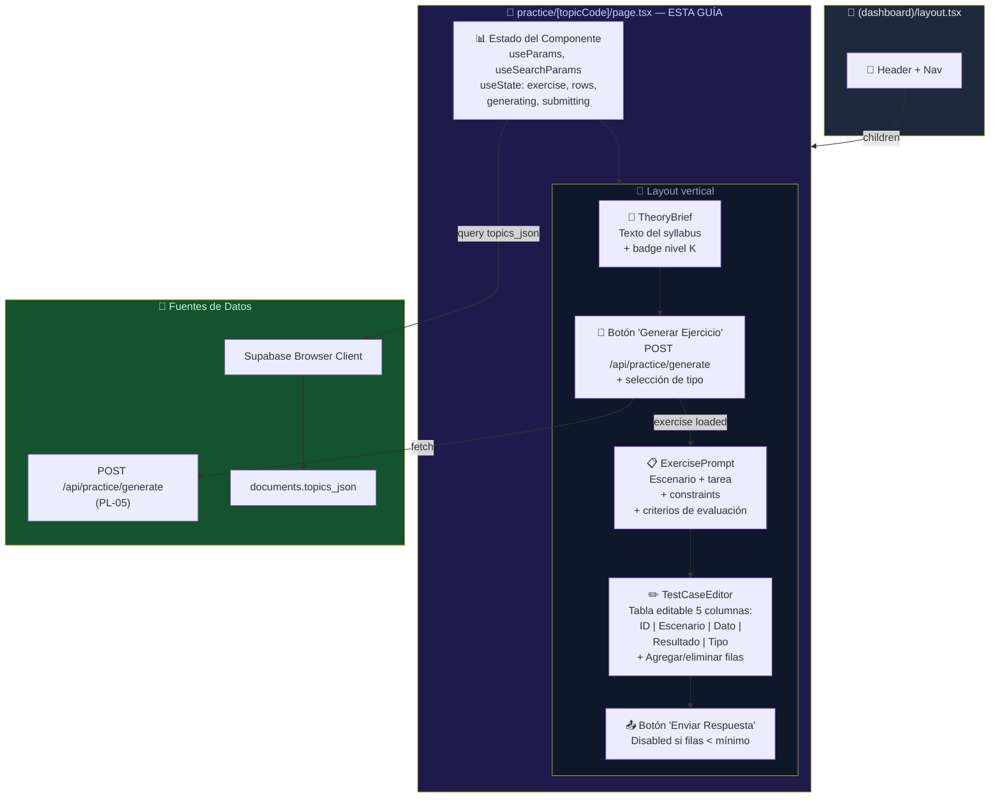
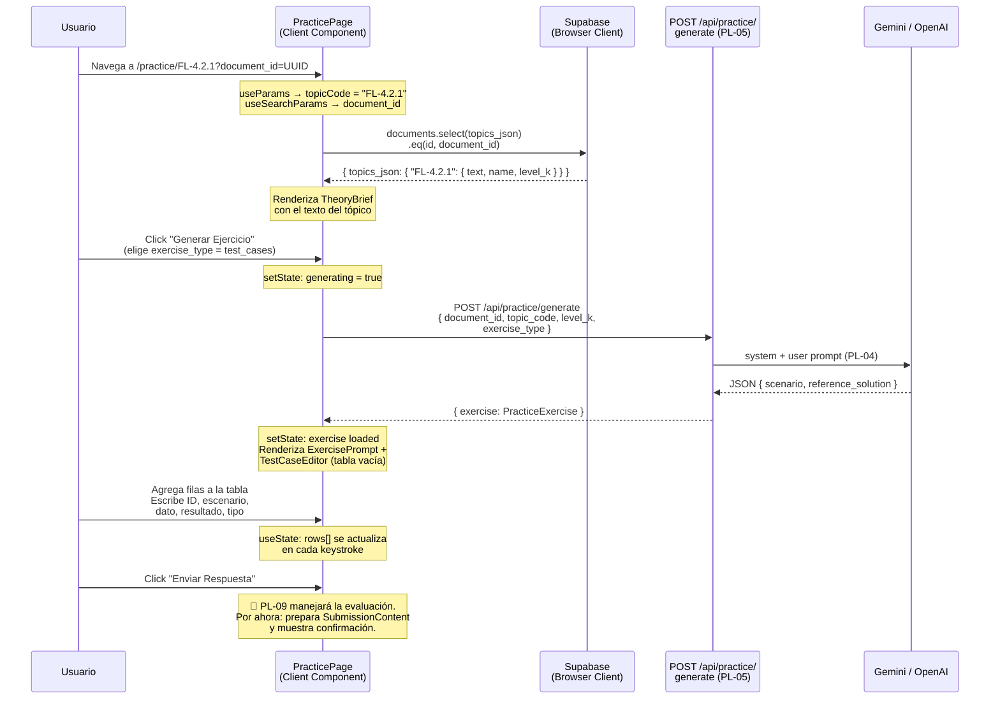
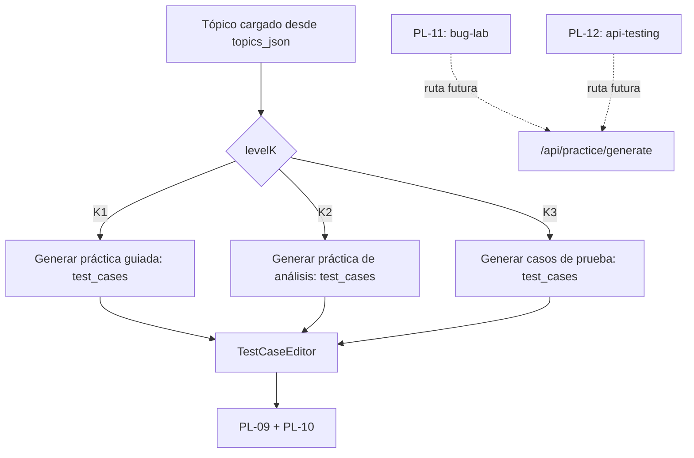

# Guía Didáctica PL-07: UI — TestCaseEditor (tabla editable interactiva)

---

## Sección 1: 🎓 Introducción y Fundamentos Conceptuales

### Recapitulación: ¿Dónde estamos?

En **PL-06** construiste el **Hub de Prácticas** (`/practice`) — la página principal del QA Practice Lab donde el usuario ve todos los tópicos ISTQB organizados por capítulo, con 4 summary cards, filtros interactivos, y un botón "Practicar" en cada tarjeta de tópico.

Ese botón "Practicar" navega a una URL como `/practice/FL-4.2.1?document_id=UUID`, pero esa ruta **no existía**. Ahora vamos a crearla.

### ¿Qué construiremos?

En esta guía crearemos la **página de práctica individual** — la experiencia completa donde el usuario:

1. **Ve un resumen de la teoría** del tópico seleccionado (qué dice el syllabus).
2. **Recibe un ejercicio generado por IA** al hacer click en "Generar Ejercicio" (llama a `POST /api/practice/generate` de PL-05).
3. **Escribe sus casos de prueba** en una tabla editable interactiva (el **TestCaseEditor**).
4. **Envía su respuesta** para evaluación futura (el botón envía los datos; la evaluación real será PL-09).

Esta página transforma al usuario de **lector pasivo** (teoría, quiz) en **productor activo** (crea artefactos de testing). Es un cambio fundamental en la pedagogía del sistema.

### Analogía profesional

Imagina que eres el **jefe de cocina de un restaurante con estrella Michelin** y estás formando a un nuevo sous-chef. Hasta ahora, el aprendiz ha leído los manuales de recetas (teoría), ha respondido preguntas sobre ingredientes y técnicas (quizzes), y ha visto cómo cocinas (observación). Pero nunca ha cocinado un plato completo por su cuenta.

Hoy es su primer día en la **estación de producción**. Le entregas una ficha de pedido — un plato que un cliente acaba de ordenar. La ficha describe los ingredientes disponibles, las restricciones dietéticas del comensal, y los estándares de presentación del restaurante.

El aprendiz no recibe una receta paso a paso. Recibe un **brief** y debe **producir** el plato desde cero: elegir las técnicas de cocción, determinar los tiempos, combinar los ingredientes, y presentar el resultado. Tiene frente a él un **mise en place** — una estación organizada con todos los utensilios y contenedores vacíos esperando ser llenados.

Eso es exactamente lo que tu página `/practice/[topicCode]` representa:

- La **ficha de pedido** es el escenario generado por la IA: describe un sistema de software, sus reglas de negocio, y las restricciones del ejercicio.
- Los **contenedores vacíos del mise en place** son las filas de la tabla editable: columnas para ID, Escenario, Dato de prueba, Resultado esperado, y Tipo.
- El **plato terminado** es la colección de casos de prueba que el aprendiz produce — su artefacto profesional.
- El **jefe de cocina que evalúa** es la IA (PL-09) que comparará la respuesta con una solución de referencia.

La estación de producción no te da la respuesta — te da las **herramientas** para construirla. El aprendiz tiene que pensar, aplicar técnicas, y crear algo nuevo. Y eso es precisamente lo que distingue al nivel K3 (Aplicar) del K1 (Recordar) en la taxonomía de Bloom.

Esta analogía resalta un principio crucial de diseño UX para herramientas educativas: **la interfaz de producción debe ser mínima pero completa**. Demasiados campos confunden; muy pocos impiden expresar la respuesta. La tabla editable con 5 columnas es el equilibrio perfecto — cada columna corresponde a un elemento esencial de un caso de prueba según el estándar IEEE 829.

### Conceptos de React/Next.js relevantes para esta guía

#### Rutas dinámicas con parámetros en Next.js 15+

En Next.js 15+ (y 16+, que es nuestra versión), las rutas dinámicas usan carpetas con `[nombre]`. Para esta guía:

```
app/(dashboard)/practice/[topicCode]/page.tsx
```

La carpeta `[topicCode]` captura el segmento dinámico de la URL. Si el usuario navega a `/practice/FL-4.2.1`, entonces `topicCode = "FL-4.2.1"`.

**Importante para Next.js 16:** El parámetro `params` en los page components es una **Promise**. Esto cambió a partir de Next.js 15 y es **obligatorio** tratarlo con `await`:

```typescript
// ✅ Next.js 16 — params es Promise
type PageProps = {
  params: Promise<{ topicCode: string }>;
  searchParams: Promise<{ document_id?: string }>;
};

export default async function Page({ params, searchParams }: PageProps) {
  const { topicCode } = await params;
  const { document_id } = await searchParams;
}
```

Sin embargo, nuestra página será un **Client Component** (`'use client'`), y en Client Components de Next.js 16, `params` sigue siendo un **objeto síncrono** que puedes usar directamente con `React.use()` o el hook `useParams()`. Usaremos `useParams()` para simplicidad.

#### Estado local con `useState` para tablas editables

El TestCaseEditor mantiene todo su estado en `useState` — las filas de la tabla, el contenido de cada celda, la validación. No necesitamos un formulario con `react-hook-form` porque:

1. El estado es una lista de objetos (`TestCaseRow[]`), no un formulario plano.
2. Necesitamos control granular para agregar/eliminar filas.
3. La validación es simple (mínimo N filas con campos no vacíos).
4. No hay validación async ni efectos secundarios complejos.

#### Fetch-on-demand vs Fetch-on-mount

A diferencia del Hub (`page.tsx` de PL-06 que hace fetch al montar), esta página usa **fetch-on-demand**: el ejercicio se genera solo cuando el usuario hace click en "Generar Ejercicio". Esto es porque:

1. La generación de ejercicios es **costosa** (llamada al LLM, ~5-15 segundos).
2. El usuario debe poder **leer la teoría primero** antes de generar.
3. El usuario puede querer elegir un tipo de ejercicio antes de generar.

---

## Sección 2: 📋 Prerequisitos y Verificación del Entorno

### Herramientas requeridas

| Herramienta | Comando de verificación | Versión mínima |
|:---|:---|:---|
| Node.js | `node --version` | v18.0.0+ |
| TypeScript | `npx tsc --version` | 5.0+ |
| Next.js | Verificar en `frontend/package.json` | 16.x (`package.json` declara `^16.2.7`) |

### Entregables de guías anteriores que DEBEN existir

| Guía | Entregable | Verificación |
|:---|:---|:---|
| **PL-03** | `frontend/types/practice.ts` con `TestCaseRow`, `TestCaseType`, `SubmissionContent`, `PracticeExercise`, `ExerciseScenario` | `Test-Path -LiteralPath "frontend\types\practice.ts"` → True |
| **PL-05** | `frontend/app/api/practice/generate/route.ts` | `Test-Path -LiteralPath "frontend\app\api\practice\generate\route.ts"` → True |
| **PL-06** | `frontend/app/(dashboard)/practice/page.tsx` (Hub de Prácticas) | `Test-Path -LiteralPath "frontend\app\(dashboard)\practice\page.tsx"` → True |
| **FE-02** | `frontend/lib/supabase/client.ts` con `createClient()` | `Test-Path -LiteralPath "frontend\lib\supabase\client.ts"` → True |
| **UP-03** | Al menos 1 documento con `topics_json` en la tabla `documents` | Visible en Supabase Table Editor |

### Verificación en PowerShell

```powershell
# 1. Verificar que los archivos prerequisito existen
Test-Path -LiteralPath "frontend\types\practice.ts"
Test-Path -LiteralPath "frontend\app\api\practice\generate\route.ts"
Test-Path -LiteralPath "frontend\app\(dashboard)\practice\page.tsx"
# Todas deben ser True

# 2. Verificar que el proyecto compila sin errores
npx tsc --noEmit --project frontend/tsconfig.json
# Esperado: sin errores

# 3. Verificar que NO existe la ruta dinámica (la crearemos)
Test-Path -LiteralPath "frontend\app\(dashboard)\practice\[topicCode]"
# Esperado: False (la crearemos en esta guía)
```

> **Puerta de dependencia:** Esta guía requiere que `POST /api/practice/generate` funcione correctamente (PL-05). Si no tienes una `GEMINI_API_KEY` o `OPENAI_API_KEY` en `frontend/.env.local`, la generación de ejercicios fallará y verás un error controlado en la UI.

---

## Sección 3: 📂 Estructura de Directorios del Proyecto

```
practica-testing/
├── frontend/
│   ├── app/
│   │   ├── api/
│   │   │   ├── practice/generate/route.ts        ← (existente — PL-05)
│   │   │   └── ...                               ← (otros API routes existentes)
│   │   ├── (dashboard)/
│   │   │   ├── layout.tsx                        ← (existente — FE-04)
│   │   │   ├── _components/                      ← (existente — nav, user-menu)
│   │   │   ├── dashboard/page.tsx                ← (existente — DA-02+)
│   │   │   ├── plan/...                          ← (existente — UP-06)
│   │   │   ├── session/...                       ← (existente — SE-01+)
│   │   │   ├── setup/...                         ← (existente — UP-01)
│   │   │   └── practice/
│   │   │       ├── page.tsx                      ← (existente — PL-06, Hub)
│   │   │       ├── _components/                  ← (existente — PL-06)
│   │   │       │   ├── practice-filter.tsx        ← (existente — PL-06)
│   │   │       │   ├── practice-card.tsx          ← (existente — PL-06)
│   │   │       │   └── topic-practice-list.tsx    ← (existente — PL-06)
│   │   │       └── [topicCode]/                  ← 🆕 NUEVO directorio
│   │   │           ├── page.tsx                  ← 🆕 NUEVO EN ESTA GUÍA
│   │   │           └── _components/              ← 🆕 NUEVO directorio
│   │   │               ├── theory-brief.tsx      ← 🆕 NUEVO EN ESTA GUÍA
│   │   │               ├── exercise-prompt.tsx   ← 🆕 NUEVO EN ESTA GUÍA
│   │   │               └── test-case-editor.tsx  ← 🆕 NUEVO EN ESTA GUÍA
│   │   ├── globals.css
│   │   ├── layout.tsx
│   │   └── page.tsx
│   ├── components/ui/                            ← (existente — shadcn)
│   ├── lib/
│   │   ├── prompts/practice-exercise.ts          ← (existente — PL-04)
│   │   ├── supabase/client.ts                    ← (existente — FE-02, USADO)
│   │   └── utils.ts                              ← (existente — cn())
│   ├── types/
│   │   ├── practice.ts                           ← (existente — PL-03, CONSUMIDO)
│   │   ├── database.ts                           ← (existente — PL-03)
│   │   └── index.ts                              ← (existente — barrel)
│   └── package.json
│
└── docs/
    └── guides/
        └── fe/
            ├── PL-06.md                           ← (existente — guía anterior)
            └── PL-07.md                           ← 🆕 ESTA GUÍA
```

### Alcance de archivos de PL-07

| Acción | Archivo | Motivo |
|:---|:---|:---|
| **Crear** | `frontend/app/(dashboard)/practice/[topicCode]/page.tsx` | Página de práctica individual con fetch de datos y orquestación. |
| **Crear** | `frontend/app/(dashboard)/practice/[topicCode]/_components/theory-brief.tsx` | Resumen de la teoría del tópico (texto del syllabus). |
| **Crear** | `frontend/app/(dashboard)/practice/[topicCode]/_components/exercise-prompt.tsx` | Escenario del ejercicio generado con restricciones y criterios. |
| **Crear** | `frontend/app/(dashboard)/practice/[topicCode]/_components/test-case-editor.tsx` | Tabla editable para crear casos de prueba. |
| No tocar | `frontend/types/practice.ts` | Tipos `TestCaseRow`, `TestCaseType`, `SubmissionContent`, `PracticeExercise` — se consumen. |
| No tocar | `frontend/app/api/practice/generate/route.ts` | API Route de PL-05 — se invoca, no se modifica. |

---

## Sección 4: 🎨 Diagrama de Arquitectura de Componentes



### Flujo Completo de Generación y Edición



---

## Sección 5: 🛠️ Implementación Paso a Paso

### Paso A: Crear el directorio y el componente `theory-brief.tsx`

**Directorio a crear:** `frontend/app/(dashboard)/practice/[topicCode]/_components/`

```powershell
# Crear el directorio (PowerShell crea intermedios con -Force)
New-Item -ItemType Directory -Path "frontend\app\(dashboard)\practice\[topicCode]\_components" -Force
```

**Archivo:** `frontend/app/(dashboard)/practice/[topicCode]/_components/theory-brief.tsx`

```typescript
"use client";

// ─────────────────────────────────────────────────────────────────
// [topicCode]/_components/theory-brief.tsx
// Resumen breve de la teoría del tópico ISTQB seleccionado.
//
// TIPO: Client Component (presentational — solo props, sin queries).
//
// MUESTRA:
//   - Badge con código del tópico (FL-x.x.x) y nivel K
//   - Nombre del tópico como título
//   - Texto del syllabus (truncado si es muy largo)
//   - Colapsable si excede cierta longitud
//
// PROPÓSITO:
//   Dar al usuario CONTEXTO antes de generar un ejercicio.
//   Debe recordarle de qué trata el tópico sin reemplazar
//   el estudio de la teoría completa (eso fue SE-02/SE-03).
// ─────────────────────────────────────────────────────────────────

import { useState } from "react";
import { BookOpen, ChevronDown, ChevronUp } from "lucide-react";
import type { LevelK } from "@/types/database";

// ─── Props ────────────────────────────────────────────────────

export interface TheoryBriefProps {
  /** Código del tópico (e.g., "FL-4.2.1") */
  topicCode: string;
  /** Nombre descriptivo del tópico */
  topicName: string;
  /** Nivel cognitivo del tópico */
  levelK: LevelK;
  /** Texto del syllabus (puede ser largo) */
  syllabusText: string;
}

// ─── Constantes ───────────────────────────────────────────────

/** Máximo de caracteres antes de colapsar */
const MAX_PREVIEW_LENGTH = 400;

const LEVEL_K_STYLES: Record<LevelK, string> = {
  K1: "bg-sky-500/20 text-sky-400 border-sky-500/30",
  K2: "bg-amber-500/20 text-amber-400 border-amber-500/30",
  K3: "bg-rose-500/20 text-rose-400 border-rose-500/30",
};

const LEVEL_K_LABELS: Record<LevelK, string> = {
  K1: "K1 — Recordar",
  K2: "K2 — Comprender",
  K3: "K3 — Aplicar",
};

// ─── Componente ───────────────────────────────────────────────

export function TheoryBrief({
  topicCode,
  topicName,
  levelK,
  syllabusText,
}: TheoryBriefProps) {
  const [expanded, setExpanded] = useState(false);
  const isLong = syllabusText.length > MAX_PREVIEW_LENGTH;
  const displayText =
    isLong && !expanded
      ? syllabusText.slice(0, MAX_PREVIEW_LENGTH) + "…"
      : syllabusText;

  return (
    <div className="rounded-xl border border-slate-800 bg-slate-900/50 p-5">
      {/* Header con ícono */}
      <div className="flex items-center gap-2 mb-3">
        <BookOpen className="size-4 text-emerald-400" />
        <h2 className="text-sm font-semibold text-slate-300">
          Contexto Teórico
        </h2>
      </div>

      {/* Badges: código del tópico + nivel K */}
      <div className="flex items-center gap-2 mb-2">
        <span
          className="
            inline-flex items-center px-2.5 py-0.5
            text-xs font-mono font-semibold
            rounded-md bg-slate-800 text-slate-300
            border border-slate-700
          "
        >
          {topicCode}
        </span>
        <span
          className={`
            inline-flex items-center px-2.5 py-0.5
            text-xs font-semibold rounded-md border
            ${LEVEL_K_STYLES[levelK]}
          `}
        >
          {LEVEL_K_LABELS[levelK]}
        </span>
      </div>

      {/* Nombre del tópico */}
      <h3 className="text-base font-semibold text-white mb-2">{topicName}</h3>

      {/* Texto del syllabus */}
      {syllabusText ? (
        <>
          <p className="text-sm text-slate-400 leading-relaxed whitespace-pre-line">
            {displayText}
          </p>
          {isLong && (
            <button
              onClick={() => setExpanded(!expanded)}
              className="
                flex items-center gap-1 mt-2 text-xs text-brand-400
                hover:text-brand-300 transition-colors cursor-pointer
              "
            >
              {expanded ? (
                <>
                  <ChevronUp className="size-3" /> Ver menos
                </>
              ) : (
                <>
                  <ChevronDown className="size-3" /> Ver más
                </>
              )}
            </button>
          )}
        </>
      ) : (
        <p className="text-sm text-slate-500 italic">
          No hay texto del syllabus disponible para este tópico.
        </p>
      )}
    </div>
  );
}
```

**Entregable del Paso A:**
- ✅ Directorio `frontend/app/(dashboard)/practice/[topicCode]/_components/` creado.
- ✅ Archivo `theory-brief.tsx` creado.

---

### Paso B: Crear el componente `exercise-prompt.tsx`

**Archivo:** `frontend/app/(dashboard)/practice/[topicCode]/_components/exercise-prompt.tsx`

```typescript
"use client";

// ─────────────────────────────────────────────────────────────────
// [topicCode]/_components/exercise-prompt.tsx
// Muestra el escenario del ejercicio generado por la IA.
//
// TIPO: Client Component (presentational).
//
// MUESTRA:
//   - Escenario: descripción del sistema bajo prueba
//   - Tarea: qué debe hacer el estudiante
//   - Restricciones: lista numerada de constraints
//   - Criterios de evaluación: lista de criterios
//
// RECIBE: El objeto ExerciseScenario generado por PL-05.
// ─────────────────────────────────────────────────────────────────

import { Target, ListChecks, AlertCircle, ClipboardList } from "lucide-react";
import type { ExerciseScenario } from "@/types/practice";

// ─── Props ────────────────────────────────────────────────────

export interface ExercisePromptProps {
  /** Escenario completo del ejercicio (viene de PracticeExercise.scenario) */
  scenario: ExerciseScenario;
}

// ─── Componente ───────────────────────────────────────────────

export function ExercisePrompt({ scenario }: ExercisePromptProps) {
  return (
    <div className="rounded-xl border border-brand-500/20 bg-brand-950/20 p-5 space-y-4">
      {/* ─── Header ─── */}
      <div className="flex items-center gap-2">
        <Target className="size-5 text-brand-400" />
        <h2 className="text-base font-semibold text-white">
          Ejercicio Práctico
        </h2>
      </div>

      {/* ─── Escenario (sistema bajo prueba) ─── */}
      <div>
        <h3 className="text-xs font-semibold text-slate-400 uppercase tracking-wider mb-1.5">
          Escenario
        </h3>
        <p className="text-sm text-slate-200 leading-relaxed whitespace-pre-line">
          {scenario.scenario}
        </p>
      </div>

      {/* ─── Tarea (qué debe hacer el estudiante) ─── */}
      <div className="rounded-lg bg-brand-500/10 border border-brand-500/20 p-4">
        <div className="flex items-center gap-2 mb-1.5">
          <ClipboardList className="size-4 text-brand-400" />
          <h3 className="text-xs font-semibold text-brand-300 uppercase tracking-wider">
            Tu Tarea
          </h3>
        </div>
        <p className="text-sm text-slate-200 leading-relaxed">
          {scenario.task_description}
        </p>
      </div>

      {/* ─── Restricciones ─── */}
      {scenario.constraints.length > 0 && (
        <div>
          <div className="flex items-center gap-2 mb-2">
            <AlertCircle className="size-4 text-amber-400" />
            <h3 className="text-xs font-semibold text-amber-400 uppercase tracking-wider">
              Restricciones
            </h3>
          </div>
          <ul className="space-y-1.5">
            {scenario.constraints.map((constraint, index) => (
              <li
                key={index}
                className="flex items-start gap-2 text-sm text-slate-300"
              >
                <span className="text-amber-500 font-mono text-xs mt-0.5 shrink-0">
                  {index + 1}.
                </span>
                {constraint}
              </li>
            ))}
          </ul>
        </div>
      )}

      {/* ─── Criterios de evaluación ─── */}
      {scenario.evaluation_criteria.length > 0 && (
        <div>
          <div className="flex items-center gap-2 mb-2">
            <ListChecks className="size-4 text-emerald-400" />
            <h3 className="text-xs font-semibold text-emerald-400 uppercase tracking-wider">
              Criterios de Evaluación
            </h3>
          </div>
          <ul className="space-y-1.5">
            {scenario.evaluation_criteria.map((criterion, index) => (
              <li
                key={index}
                className="flex items-start gap-2 text-sm text-slate-300"
              >
                <span className="text-emerald-500 mt-1 shrink-0">•</span>
                {criterion}
              </li>
            ))}
          </ul>
        </div>
      )}
    </div>
  );
}
```

**Entregable del Paso B:**
- ✅ Archivo `exercise-prompt.tsx` creado.

---

### Paso C: Crear el componente `test-case-editor.tsx`

Este es el componente más complejo de la guía — una **tabla editable interactiva** donde el usuario crea sus casos de prueba.

**Archivo:** `frontend/app/(dashboard)/practice/[topicCode]/_components/test-case-editor.tsx`

```typescript
"use client";

// ─────────────────────────────────────────────────────────────────
// [topicCode]/_components/test-case-editor.tsx
// Tabla editable interactiva para diseñar casos de prueba.
//
// TIPO: Client Component (altamente interactivo — inputs, state).
//
// COLUMNAS:
//   ID | Escenario | Dato de prueba | Resultado esperado | Tipo
//
// FUNCIONALIDADES:
//   1. Agregar filas con botón "+" (genera ID secuencial TC-001, TC-002...)
//   2. Eliminar filas con botón "×" por fila
//   3. Editar cada celda inline (inputs controlados)
//   4. Seleccionar tipo (positive/negative/boundary) con dropdown
//   5. Validación: mínimo de filas requeridas según constraints
//   6. Los datos se mantienen al navegar entre campos (tab/click)
//
// ESTADO:
//   Controlado por el padre (page.tsx) via props rows + onRowsChange.
//   Esto es un "Controlled Component" — el padre es la fuente de verdad.
//   Esto facilita el envío de datos y la integración con PL-09.
//
// DISEÑO:
//   - Fondo oscuro con bordes sutiles (consistente con dashboard)
//   - Inputs inline con estilo minimal
//   - Dropdown para tipo con colores semánticos
//   - Hover effects en filas
//   - Responsive: tabla con scroll horizontal en mobile
// ─────────────────────────────────────────────────────────────────

import { Plus, Trash2, Pencil } from "lucide-react";
import type { TestCaseRow, TestCaseType } from "@/types/practice";

// ─── Props ────────────────────────────────────────────────────

export interface TestCaseEditorProps {
  /** Array de filas actuales (controlado por el padre) */
  rows: TestCaseRow[];
  /** Callback cuando cambian las filas */
  onRowsChange: (rows: TestCaseRow[]) => void;
  /** Mínimo de filas requeridas (extraído de constraints del ejercicio) */
  minRows: number;
  /** Si el editor está deshabilitado (ej. durante envío) */
  disabled?: boolean;
}

// ─── Constantes ───────────────────────────────────────────────

/** Opciones de tipo de test case con labels y colores */
const TYPE_OPTIONS: { value: TestCaseType; label: string; color: string }[] = [
  {
    value: "positive",
    label: "Positivo",
    color: "text-emerald-400 bg-emerald-500/10",
  },
  {
    value: "negative",
    label: "Negativo",
    color: "text-rose-400 bg-rose-500/10",
  },
  {
    value: "boundary",
    label: "Límite",
    color: "text-amber-400 bg-amber-500/10",
  },
];

// ─── Helpers ──────────────────────────────────────────────────

/**
 * Genera el siguiente ID secuencial de test case.
 * Formato: TC-001, TC-002, ..., TC-099, TC-100
 */
function generateNextId(rows: TestCaseRow[]): string {
  if (rows.length === 0) return "TC-001";

  // Extraer el mayor número existente
  let maxNum = 0;
  for (const row of rows) {
    const match = row.id.match(/^TC-(\d+)$/);
    if (match) {
      const num = parseInt(match[1], 10);
      if (num > maxNum) maxNum = num;
    }
  }
  return `TC-${String(maxNum + 1).padStart(3, "0")}`;
}

/**
 * Crea una fila vacía con el ID generado automáticamente.
 */
function createEmptyRow(rows: TestCaseRow[]): TestCaseRow {
  return {
    id: generateNextId(rows),
    scenario: "",
    test_data: "",
    expected_result: "",
    type: "positive",
  };
}

// ─── Componente ───────────────────────────────────────────────

export function TestCaseEditor({
  rows,
  onRowsChange,
  minRows,
  disabled = false,
}: TestCaseEditorProps) {
  // ─── Handlers ───────────────────────────────────────────

  /** Agregar una nueva fila al final */
  function handleAddRow() {
    const newRow = createEmptyRow(rows);
    onRowsChange([...rows, newRow]);
  }

  /** Eliminar una fila por índice */
  function handleRemoveRow(index: number) {
    const updated = rows.filter((_, i) => i !== index);
    onRowsChange(updated);
  }

  /** Actualizar un campo de una fila específica */
  function handleCellChange(
    index: number,
    field: keyof TestCaseRow,
    value: string,
  ) {
    const updated = rows.map((row, i) =>
      i === index ? { ...row, [field]: value } : row,
    );
    onRowsChange(updated);
  }

  // ─── Validación visual ──────────────────────────────────
  const currentCount = rows.length;
  const isValid = currentCount >= minRows;
  // Contar filas con al menos escenario y resultado rellenos
  const completedCount = rows.filter(
    (r) => r.scenario.trim() !== "" && r.expected_result.trim() !== "",
  ).length;

  return (
    <div className="rounded-xl border border-slate-800 bg-slate-900/50 overflow-hidden">
      {/* ─── Header ─── */}
      <div className="flex items-center justify-between p-4 border-b border-slate-800">
        <div className="flex items-center gap-2">
          <Pencil className="size-4 text-brand-400" />
          <h2 className="text-sm font-semibold text-white">
            Tus Casos de Prueba
          </h2>
        </div>

        <div className="flex items-center gap-3">
          {/* Contador de filas */}
          <span
            className={`text-xs font-medium ${isValid ? "text-emerald-400" : "text-amber-400"}`}
          >
            {completedCount}/{minRows} mínimo
          </span>

          {/* Botón agregar fila */}
          <button
            onClick={handleAddRow}
            disabled={disabled}
            className="
              flex items-center gap-1 px-3 py-1.5
              text-xs font-semibold rounded-lg
              bg-brand-500/10 text-brand-400 border border-brand-500/20
              hover:bg-brand-500/20 hover:border-brand-500/40
              disabled:opacity-50 disabled:cursor-not-allowed
              transition-colors cursor-pointer
            "
          >
            <Plus className="size-3.5" />
            Agregar fila
          </button>
        </div>
      </div>

      {/* ─── Tabla ─── */}
      <div className="overflow-x-auto">
        <table className="w-full text-sm">
          {/* Encabezado */}
          <thead>
            <tr className="border-b border-slate-800 bg-slate-900/80">
              <th className="px-3 py-2.5 text-left text-xs font-semibold text-slate-400 uppercase tracking-wider w-20">
                ID
              </th>
              <th className="px-3 py-2.5 text-left text-xs font-semibold text-slate-400 uppercase tracking-wider">
                Escenario
              </th>
              <th className="px-3 py-2.5 text-left text-xs font-semibold text-slate-400 uppercase tracking-wider">
                Dato de Prueba
              </th>
              <th className="px-3 py-2.5 text-left text-xs font-semibold text-slate-400 uppercase tracking-wider">
                Resultado Esperado
              </th>
              <th className="px-3 py-2.5 text-left text-xs font-semibold text-slate-400 uppercase tracking-wider w-28">
                Tipo
              </th>
              <th className="px-3 py-2.5 text-center text-xs font-semibold text-slate-400 uppercase tracking-wider w-12">
                {/* Columna para botón eliminar */}
              </th>
            </tr>
          </thead>

          {/* Cuerpo de la tabla */}
          <tbody>
            {rows.length === 0 ? (
              <tr>
                <td
                  colSpan={6}
                  className="px-3 py-8 text-center text-sm text-slate-500"
                >
                  No hay filas. Haz click en{" "}
                  <span className="text-brand-400 font-medium">
                    &quot;Agregar fila&quot;
                  </span>{" "}
                  para comenzar.
                </td>
              </tr>
            ) : (
              rows.map((row, index) => (
                <tr
                  key={row.id + "-" + index}
                  className="
                    border-b border-slate-800/50
                    hover:bg-slate-800/30 transition-colors
                    group
                  "
                >
                  {/* ID (solo lectura) */}
                  <td className="px-3 py-1.5">
                    <span className="text-xs font-mono text-slate-500">
                      {row.id}
                    </span>
                  </td>

                  {/* Escenario (editable) */}
                  <td className="px-3 py-1.5">
                    <input
                      type="text"
                      value={row.scenario}
                      onChange={(e) =>
                        handleCellChange(index, "scenario", e.target.value)
                      }
                      disabled={disabled}
                      placeholder="Descripción del escenario..."
                      className="
                        w-full bg-transparent border-0 outline-none
                        text-sm text-slate-200 placeholder-slate-600
                        focus:ring-1 focus:ring-brand-500/50 rounded px-1.5 py-1
                        disabled:opacity-50
                      "
                    />
                  </td>

                  {/* Dato de prueba (editable) */}
                  <td className="px-3 py-1.5">
                    <input
                      type="text"
                      value={row.test_data}
                      onChange={(e) =>
                        handleCellChange(index, "test_data", e.target.value)
                      }
                      disabled={disabled}
                      placeholder="Valor de entrada..."
                      className="
                        w-full bg-transparent border-0 outline-none
                        text-sm text-slate-200 placeholder-slate-600
                        focus:ring-1 focus:ring-brand-500/50 rounded px-1.5 py-1
                        disabled:opacity-50
                      "
                    />
                  </td>

                  {/* Resultado esperado (editable) */}
                  <td className="px-3 py-1.5">
                    <input
                      type="text"
                      value={row.expected_result}
                      onChange={(e) =>
                        handleCellChange(
                          index,
                          "expected_result",
                          e.target.value,
                        )
                      }
                      disabled={disabled}
                      placeholder="Resultado esperado..."
                      className="
                        w-full bg-transparent border-0 outline-none
                        text-sm text-slate-200 placeholder-slate-600
                        focus:ring-1 focus:ring-brand-500/50 rounded px-1.5 py-1
                        disabled:opacity-50
                      "
                    />
                  </td>

                  {/* Tipo (dropdown) */}
                  <td className="px-3 py-1.5">
                    <select
                      value={row.type}
                      onChange={(e) =>
                        handleCellChange(
                          index,
                          "type",
                          e.target.value as TestCaseType,
                        )
                      }
                      disabled={disabled}
                      className={`
                        w-full bg-slate-800 border border-slate-700
                        rounded px-2 py-1 text-xs font-medium
                        outline-none focus:ring-1 focus:ring-brand-500/50
                        disabled:opacity-50 cursor-pointer
                        ${TYPE_OPTIONS.find((o) => o.value === row.type)?.color ?? "text-slate-400"}
                      `}
                    >
                      {TYPE_OPTIONS.map((option) => (
                        <option key={option.value} value={option.value}>
                          {option.label}
                        </option>
                      ))}
                    </select>
                  </td>

                  {/* Botón eliminar */}
                  <td className="px-3 py-1.5 text-center">
                    <button
                      onClick={() => handleRemoveRow(index)}
                      disabled={disabled}
                      title="Eliminar fila"
                      className="
                        opacity-0 group-hover:opacity-100
                        p-1 rounded text-slate-600
                        hover:text-red-400 hover:bg-red-500/10
                        disabled:opacity-50 disabled:cursor-not-allowed
                        transition-all cursor-pointer
                      "
                    >
                      <Trash2 className="size-3.5" />
                    </button>
                  </td>
                </tr>
              ))
            )}
          </tbody>
        </table>
      </div>

      {/* ─── Footer con validación ─── */}
      {rows.length > 0 && !isValid && (
        <div className="px-4 py-2.5 border-t border-slate-800 bg-amber-950/20">
          <p className="text-xs text-amber-400">
            ⚠️ Necesitas al menos {minRows} filas con escenario y resultado
            completados. Actualmente tienes {completedCount}.
          </p>
        </div>
      )}
    </div>
  );
}
```

**Entregable del Paso C:**
- ✅ Archivo `test-case-editor.tsx` creado.

---

### Paso D: Crear la página principal `page.tsx`

**Archivo:** `frontend/app/(dashboard)/practice/[topicCode]/page.tsx`

Este es el **Container Component** que orquesta toda la página de práctica individual.

```typescript
"use client";

// ============================================================
// app/(dashboard)/practice/[topicCode]/page.tsx
// Página de práctica individual por tópico ISTQB
// ============================================================
// TIPO: Client Component ('use client')
//
// RESPONSABILIDADES:
//   1. Leer topicCode de la URL (useParams)
//   2. Leer document_id de searchParams (useSearchParams)
//   3. Cargar el tópico del documento (topics_json de Supabase)
//   4. Generar ejercicio bajo demanda (POST /api/practice/generate)
//   5. Renderizar la secuencia: teoría → ejercicio → editor
//   6. Gestionar el estado del TestCaseEditor (filas de test cases)
//   7. Preparar la submission para envío (PL-09)
//
// URL: /practice/FL-4.2.1?document_id=UUID
//
// NEXT.JS 16:
//   En Client Components, useParams() retorna un objeto síncrono
//   con los parámetros de la ruta. Para searchParams usamos
//   useSearchParams() del hook de Next.js.
//
// PATRÓN: Container + fetch-on-demand
//   Los datos del tópico se cargan al montar (useEffect).
//   El ejercicio se genera solo al click (no al montar).
// ============================================================

import { useState, useEffect, useCallback } from "react";
import { useParams, useSearchParams, useRouter } from "next/navigation";
import Link from "next/link";
import {
  ArrowLeft,
  Sparkles,
  Send,
  Loader2,
  CheckCircle2,
} from "lucide-react";
import { createClient } from "@/lib/supabase/client";
import type { LevelK } from "@/types/database";
import type {
  PracticeExercise,
  PracticeExerciseType,
  TestCaseRow,
  SubmissionContent,
} from "@/types/practice";
import { TheoryBrief } from "./_components/theory-brief";
import { ExercisePrompt } from "./_components/exercise-prompt";
import { TestCaseEditor } from "./_components/test-case-editor";

// ──────────────────────────────────────────────────────────────
// Tipos internos
// ──────────────────────────────────────────────────────────────

interface TopicEntry {
  text: string;
  level_k: string;
  name: string;
}

interface TopicData {
  topicCode: string;
  topicName: string;
  levelK: LevelK;
  syllabusText: string;
  documentId: string;
}

interface PageState {
  isLoadingTopic: boolean;
  topicError: string | null;
  topic: TopicData | null;
  isGenerating: boolean;
  generateError: string | null;
  exercise: PracticeExercise | null;
  testCaseRows: TestCaseRow[];
  isSubmitting: boolean;
  submitted: boolean;
}

// ──────────────────────────────────────────────────────────────
// Constantes
// ──────────────────────────────────────────────────────────────

/** Tipos de ejercicio disponibles para generación */
const EXERCISE_TYPE_OPTIONS: {
  value: PracticeExerciseType;
  label: string;
  icon: string;
}[] = [
  { value: "test_cases", label: "Casos de Prueba", icon: "🧪" },
  { value: "bug_report", label: "Bug Report", icon: "🐛" },
  { value: "api_testing", label: "API Testing", icon: "🔌" },
  { value: "exploratory", label: "Exploratorio", icon: "🔍" },
];

/**
 * Extrae el número mínimo de filas del array de constraints.
 * Busca patrones como "Mínimo 6 test cases" o "Al menos 5 casos".
 */
function extractMinRows(constraints: string[]): number {
  for (const c of constraints) {
    const match = c.match(/(?:mínimo|al menos|minimum)\s*(\d+)/i);
    if (match) return parseInt(match[1], 10);
  }
  return 3; // Default razonable
}

// ──────────────────────────────────────────────────────────────
// Componente Principal
// ──────────────────────────────────────────────────────────────

export default function PracticeTopicPage() {
  const params = useParams<{ topicCode: string }>();
  const searchParams = useSearchParams();
  const router = useRouter();

  // ─── Extraer parámetros de la URL ─────────────────────
  const topicCode = decodeURIComponent(params.topicCode ?? "");
  const documentId = searchParams.get("document_id") ?? "";

  // ─── Estado de la página ──────────────────────────────
  const [state, setState] = useState<PageState>({
    isLoadingTopic: true,
    topicError: null,
    topic: null,
    isGenerating: false,
    generateError: null,
    exercise: null,
    testCaseRows: [],
    isSubmitting: false,
    submitted: false,
  });

  // ─── Tipo de ejercicio seleccionado ───────────────────
  const [selectedType, setSelectedType] =
    useState<PracticeExerciseType>("test_cases");

  // ═══════════════════════════════════════════════════════════
  // FETCH: Cargar datos del tópico al montar
  // ═══════════════════════════════════════════════════════════

  const loadTopicData = useCallback(async () => {
    if (!topicCode || !documentId) {
      setState((prev) => ({
        ...prev,
        isLoadingTopic: false,
        topicError: "Faltan parámetros: topicCode o document_id en la URL.",
      }));
      return;
    }

    setState((prev) => ({ ...prev, isLoadingTopic: true, topicError: null }));

    try {
      const supabase = createClient();

      const { data: doc, error: docError } = await supabase
        .from("documents")
        .select("id, topics_json")
        .eq("id", documentId)
        .single();

      if (docError || !doc) {
        throw new Error("No se pudo cargar el documento.");
      }

      const topicsJson =
        (doc.topics_json as Record<string, TopicEntry> | null) ?? {};
      const topicEntry = topicsJson[topicCode];

      if (!topicEntry) {
        throw new Error(
          `El tópico "${topicCode}" no existe en el documento. Verifica la URL.`,
        );
      }

      setState((prev) => ({
        ...prev,
        isLoadingTopic: false,
        topicError: null,
        topic: {
          topicCode,
          topicName: topicEntry.name || topicCode,
          levelK: (topicEntry.level_k || "K1") as LevelK,
          syllabusText: topicEntry.text || "",
          documentId: doc.id as string,
        },
      }));
    } catch (err) {
      setState((prev) => ({
        ...prev,
        isLoadingTopic: false,
        topicError:
          err instanceof Error ? err.message : "Error al cargar el tópico.",
      }));
    }
  }, [topicCode, documentId]);

  useEffect(() => {
    loadTopicData();
  }, [loadTopicData]);

  // ═══════════════════════════════════════════════════════════
  // FETCH: Generar ejercicio (on-demand)
  // ═══════════════════════════════════════════════════════════

  async function handleGenerateExercise() {
    if (!state.topic) return;

    setState((prev) => ({
      ...prev,
      isGenerating: true,
      generateError: null,
      exercise: null,
      testCaseRows: [],
      submitted: false,
    }));

    try {
      const response = await fetch("/api/practice/generate", {
        method: "POST",
        headers: { "Content-Type": "application/json" },
        body: JSON.stringify({
          document_id: state.topic.documentId,
          topic_code: state.topic.topicCode,
          level_k: state.topic.levelK,
          exercise_type: selectedType,
        }),
      });

      if (!response.ok) {
        const errorData = await response
          .json()
          .catch(() => ({ error: "Error desconocido" }));
        throw new Error(
          errorData.error ?? `Error ${response.status}: ${response.statusText}`,
        );
      }

      const data = await response.json();
      const exercise = data.exercise as PracticeExercise;

      // Si el tipo es test_cases, inicializar con una fila vacía
      const initialRows: TestCaseRow[] =
        selectedType === "test_cases"
          ? [
              {
                id: "TC-001",
                scenario: "",
                test_data: "",
                expected_result: "",
                type: "positive",
              },
            ]
          : [];

      setState((prev) => ({
        ...prev,
        isGenerating: false,
        generateError: null,
        exercise,
        testCaseRows: initialRows,
      }));
    } catch (err) {
      setState((prev) => ({
        ...prev,
        isGenerating: false,
        generateError:
          err instanceof Error ? err.message : "Error al generar ejercicio.",
      }));
    }
  }

  // ═══════════════════════════════════════════════════════════
  // HANDLER: Enviar respuesta (placeholder para PL-09)
  // ═══════════════════════════════════════════════════════════

  async function handleSubmit() {
    if (!state.exercise || state.testCaseRows.length === 0) return;

    setState((prev) => ({ ...prev, isSubmitting: true }));

    // Construir el SubmissionContent según el tipo (tagged union de PL-03)
    const submissionContent: SubmissionContent = {
      type: "test_cases",
      test_cases: state.testCaseRows,
    };

    // 🔮 PL-09 enviará esto a POST /api/practice/evaluate.
    // Por ahora, solo confirmamos que los datos se prepararon correctamente.
    console.log(
      "[practice/submit] Submission preparada:",
      JSON.stringify(submissionContent, null, 2),
    );
    console.log(
      "[practice/submit] Exercise ID:",
      state.exercise.id,
    );

    // Simular un delay para UX
    await new Promise((resolve) => setTimeout(resolve, 500));

    setState((prev) => ({
      ...prev,
      isSubmitting: false,
      submitted: true,
    }));
  }

  // ═══════════════════════════════════════════════════════════
  // COMPUTED
  // ═══════════════════════════════════════════════════════════

  const minRows = state.exercise
    ? extractMinRows(state.exercise.scenario.constraints)
    : 3;

  const completedRows = state.testCaseRows.filter(
    (r) => r.scenario.trim() !== "" && r.expected_result.trim() !== "",
  ).length;

  const canSubmit =
    !state.isSubmitting &&
    !state.submitted &&
    state.exercise !== null &&
    completedRows >= minRows;

  // ═══════════════════════════════════════════════════════════
  // RENDER: Cargando tópico
  // ═══════════════════════════════════════════════════════════

  if (state.isLoadingTopic) {
    return (
      <div className="flex flex-col gap-6">
        <div className="flex items-center gap-3">
          <Link
            href="/practice"
            className="text-slate-400 hover:text-white transition-colors"
          >
            <ArrowLeft className="size-5" />
          </Link>
          <div>
            <div className="h-6 w-48 bg-slate-800 rounded animate-pulse mb-1" />
            <div className="h-4 w-32 bg-slate-800 rounded animate-pulse" />
          </div>
        </div>
        <div className="rounded-xl border border-slate-800 bg-slate-900/50 p-6">
          <div className="h-4 w-full bg-slate-800 rounded animate-pulse mb-3" />
          <div className="h-4 w-3/4 bg-slate-800 rounded animate-pulse mb-3" />
          <div className="h-4 w-1/2 bg-slate-800 rounded animate-pulse" />
        </div>
      </div>
    );
  }

  // ═══════════════════════════════════════════════════════════
  // RENDER: Error al cargar tópico
  // ═══════════════════════════════════════════════════════════

  if (state.topicError || !state.topic) {
    return (
      <div className="flex flex-col gap-6">
        <div className="flex items-center gap-3">
          <Link
            href="/practice"
            className="text-slate-400 hover:text-white transition-colors"
          >
            <ArrowLeft className="size-5" />
          </Link>
          <h1 className="text-2xl font-bold text-white">Práctica</h1>
        </div>

        <div className="rounded-xl border border-red-900/50 bg-red-950/30 p-6">
          <h3 className="text-lg font-semibold text-red-400 mb-2">
            ⚠️ Error al cargar el tópico
          </h3>
          <p className="text-sm text-red-300/80 mb-4">
            {state.topicError ?? "No se encontró el tópico."}
          </p>
          <Link
            href="/practice"
            className="
              inline-flex items-center gap-2 px-4 py-2
              text-sm font-medium rounded-lg
              bg-red-500/20 text-red-400
              hover:bg-red-500/30 transition-colors
            "
          >
            <ArrowLeft className="size-4" />
            Volver al Hub
          </Link>
        </div>
      </div>
    );
  }

  // ═══════════════════════════════════════════════════════════
  // RENDER: Página completa
  // ═══════════════════════════════════════════════════════════

  const { topic } = state;

  return (
    <div className="flex flex-col gap-6">
      {/* ─── Header con navegación ─── */}
      <div className="flex items-center gap-3">
        <Link
          href="/practice"
          className="text-slate-400 hover:text-white transition-colors"
        >
          <ArrowLeft className="size-5" />
        </Link>
        <div>
          <h1 className="text-2xl font-bold text-white">
            Práctica: {topic.topicCode}
          </h1>
          <p className="text-sm text-slate-400">{topic.topicName}</p>
        </div>
      </div>

      {/* ─── Sección 1: Resumen de la teoría ─── */}
      <TheoryBrief
        topicCode={topic.topicCode}
        topicName={topic.topicName}
        levelK={topic.levelK}
        syllabusText={topic.syllabusText}
      />

      {/* ─── Sección 2: Generar ejercicio ─── */}
      {!state.exercise && (
        <div className="rounded-xl border border-slate-800 bg-slate-900/50 p-5">
          <h2 className="text-sm font-semibold text-slate-300 mb-3">
            Selecciona el tipo de ejercicio
          </h2>

          {/* Selector de tipo */}
          <div className="flex flex-wrap gap-2 mb-4">
            {EXERCISE_TYPE_OPTIONS.map((opt) => (
              <button
                key={opt.value}
                onClick={() => setSelectedType(opt.value)}
                disabled={state.isGenerating}
                className={`
                  px-3 py-2 text-sm font-medium rounded-lg border
                  transition-colors cursor-pointer
                  disabled:opacity-50 disabled:cursor-not-allowed
                  ${
                    selectedType === opt.value
                      ? "bg-brand-500/20 text-brand-300 border-brand-500/50"
                      : "bg-slate-800/50 text-slate-400 border-slate-700 hover:bg-slate-700/50"
                  }
                `}
              >
                <span className="mr-1.5">{opt.icon}</span>
                {opt.label}
              </button>
            ))}
          </div>

          {/* Botón generar */}
          <button
            onClick={handleGenerateExercise}
            disabled={state.isGenerating}
            className="
              flex items-center gap-2 px-5 py-2.5
              text-sm font-semibold rounded-lg
              bg-emerald-600 text-white
              hover:bg-emerald-500
              disabled:opacity-50 disabled:cursor-not-allowed
              transition-colors cursor-pointer
            "
          >
            {state.isGenerating ? (
              <>
                <Loader2 className="size-4 animate-spin" />
                Generando ejercicio...
              </>
            ) : (
              <>
                <Sparkles className="size-4" />
                Generar Ejercicio
              </>
            )}
          </button>

          {/* Error de generación */}
          {state.generateError && (
            <div className="mt-3 rounded-lg bg-red-950/30 border border-red-900/50 p-3">
              <p className="text-xs text-red-400">{state.generateError}</p>
            </div>
          )}
        </div>
      )}

      {/* ─── Sección 3: Ejercicio generado ─── */}
      {state.exercise && (
        <>
          <ExercisePrompt scenario={state.exercise.scenario} />

          {/* ─── Sección 4: TestCaseEditor (solo para test_cases) ─── */}
          {state.exercise.exercise_type === "test_cases" && (
            <>
              <TestCaseEditor
                rows={state.testCaseRows}
                onRowsChange={(rows) =>
                  setState((prev) => ({ ...prev, testCaseRows: rows }))
                }
                minRows={minRows}
                disabled={state.isSubmitting || state.submitted}
              />

              {/* ─── Botones de acción ─── */}
              <div className="flex items-center justify-between">
                {/* Botón generar otro */}
                <button
                  onClick={handleGenerateExercise}
                  disabled={state.isGenerating || state.isSubmitting}
                  className="
                    flex items-center gap-2 px-4 py-2
                    text-xs font-medium rounded-lg
                    bg-slate-800 text-slate-400
                    hover:bg-slate-700 hover:text-slate-300
                    disabled:opacity-50 disabled:cursor-not-allowed
                    transition-colors cursor-pointer
                  "
                >
                  <Sparkles className="size-3.5" />
                  Generar otro ejercicio
                </button>

                {/* Botón enviar */}
                {state.submitted ? (
                  <div className="flex items-center gap-2 px-5 py-2.5 text-sm font-semibold text-emerald-400">
                    <CheckCircle2 className="size-4" />
                    Respuesta preparada
                  </div>
                ) : (
                  <button
                    onClick={handleSubmit}
                    disabled={!canSubmit}
                    className="
                      flex items-center gap-2 px-5 py-2.5
                      text-sm font-semibold rounded-lg
                      bg-brand-600 text-white
                      hover:bg-brand-500
                      disabled:opacity-50 disabled:cursor-not-allowed
                      transition-colors cursor-pointer
                    "
                  >
                    {state.isSubmitting ? (
                      <>
                        <Loader2 className="size-4 animate-spin" />
                        Enviando...
                      </>
                    ) : (
                      <>
                        <Send className="size-4" />
                        Enviar Respuesta
                      </>
                    )}
                  </button>
                )}
              </div>

              {/* Nota sobre PL-09 */}
              {state.submitted && (
                <div className="rounded-lg bg-emerald-950/30 border border-emerald-900/50 p-4 text-center">
                  <p className="text-sm text-emerald-400 mb-1">
                    ✅ Tu respuesta ha sido preparada correctamente.
                  </p>
                  <p className="text-xs text-slate-500">
                    La evaluación automática con IA (comparación con la solución
                    de referencia) se implementará en PL-09. Revisa la consola
                    del navegador (F12) para ver el contenido de tu submission.
                  </p>
                </div>
              )}
            </>
          )}

          {/* ─── Para otros tipos de ejercicio (placeholder) ─── */}
          {state.exercise.exercise_type !== "test_cases" && (
            <div className="rounded-xl border border-slate-800 bg-slate-900/50 p-6 text-center">
              <div className="text-4xl mb-3">🚧</div>
              <h3 className="text-base font-semibold text-slate-300 mb-1">
                Editor para &quot;{state.exercise.exercise_type}&quot; en
                construcción
              </h3>
              <p className="text-sm text-slate-500 max-w-md mx-auto">
                El editor para este tipo de ejercicio se implementará en guías
                futuras (PL-11 para Bug Reports, PL-12 para API Testing).
              </p>
            </div>
          )}
        </>
      )}
    </div>
  );
}
```

**Entregable del Paso D:**
- ✅ Archivo `frontend/app/(dashboard)/practice/[topicCode]/page.tsx` creado.

---

### Paso E: Verificar que TypeScript compila sin errores

```powershell
npx tsc --noEmit --project frontend/tsconfig.json
```

**Salida esperada:** Sin errores.

#### Errores comunes de importación y solución

| Error | Causa | Solución |
|:---|:---|:---|
| `Cannot find module './_components/theory-brief'` | El archivo no existe o tiene un nombre diferente | Verificar con `Test-Path -LiteralPath "frontend\app\(dashboard)\practice\[topicCode]\_components\theory-brief.tsx"` |
| `Type '{}' is not assignable to type 'TestCaseRow'` | Falta inicializar todos los campos de TestCaseRow | Cada fila necesita: `id`, `scenario`, `test_data`, `expected_result`, `type` |
| `Cannot find name 'useParams'` | Falta importar de `next/navigation` | Agregar `import { useParams } from "next/navigation"` |
| `Property 'topicCode' does not exist on type` | useParams sin tipo genérico | Usar `useParams<{ topicCode: string }>()` |

**Entregable del Paso E:**
- ✅ `npx tsc --noEmit` sin errores.

---

### Paso F: Verificar el build completo

```powershell
npm --prefix frontend run build
```

**Salida esperada:** `✓ Compiled successfully`.

**Entregable del Paso F:**
- ✅ `npm --prefix frontend run build` exitoso.

---

### Paso G: Probar la página localmente

```powershell
npm --prefix frontend run dev
```

#### G.1 — Navegar desde el Hub

1. Ve a `http://localhost:3000/practice` (estando logueado).
2. Haz click en el botón **"Practicar"** de cualquier tópico (ej. FL-4.2.1).
3. Deberías ser navegado a `/practice/FL-4.2.1?document_id=UUID`.

#### G.2 — Verificar TheoryBrief

Deberías ver un panel con:
- Ícono de libro 📖 y "Contexto Teórico"
- Badge con el código del tópico (ej. `FL-4.2.1`)
- Badge con el nivel K coloreado (ej. `K3 — Aplicar` en rosa)
- El nombre completo del tópico
- El texto del syllabus (colapsable si es largo)

#### G.3 — Verificar selector de tipo de ejercicio

Debajo de la teoría, deberías ver:
- 4 botones de tipo: 🧪 Casos de Prueba, 🐛 Bug Report, 🔌 API Testing, 🔍 Exploratorio
- El tipo **"Casos de Prueba"** debe estar seleccionado por defecto (estilo highlight)
- Un botón verde **"✨ Generar Ejercicio"**

#### G.4 — Generar un ejercicio

1. Haz click en **"Generar Ejercicio"**.
2. El botón debería cambiar a "Generando ejercicio..." con spinner.
3. Después de 5-15 segundos (llamada al LLM), deberías ver:
   - **ExercisePrompt**: el escenario del sistema bajo prueba, la tarea, restricciones y criterios.
   - **TestCaseEditor**: una tabla vacía con 1 fila inicial y columnas ID|Escenario|Dato|Resultado|Tipo.
4. Si no tienes API key configurada, verás un error controlado en rojo.

#### G.5 — Verificar la tabla editable

1. Haz click en **"Agregar fila"** — debería agregarse una fila TC-002.
2. Escribe en cada celda — el texto debería aparecer en tiempo real.
3. Cambia el tipo (dropdown) — debería cambiar entre Positivo/Negativo/Límite.
4. Navega con Tab entre celdas — los datos se mantienen.
5. Hover sobre una fila → aparece el ícono de basura 🗑️ para eliminar.
6. Elimina una fila → debería desaparecer sin afectar las demás.

#### G.6 — Verificar validación

1. El contador muestra `X/N mínimo` (donde N viene de las constraints).
2. Si tienes menos filas completadas que el mínimo, aparece una barra amarilla.
3. El botón **"Enviar Respuesta"** está deshabilitado mientras no alcanzas el mínimo.

#### G.7 — Verificar envío

1. Completa el mínimo de filas requeridas (escenario + resultado en cada una).
2. Haz click en **"Enviar Respuesta"**.
3. El botón debería cambiar a "Enviando..." con spinner.
4. Después de ~500ms, debería cambiar a ✅ "Respuesta preparada".
5. Abre la consola (F12) → deberías ver el JSON de la submission.
6. El editor queda deshabilitado (inputs grises, no editables).

#### G.8 — Verificar "Generar otro"

1. Después de enviar, haz click en **"Generar otro ejercicio"**.
2. Debería resetear la tabla y generar un nuevo escenario.
3. El nuevo ejercicio debería tener un escenario diferente (variedad del prompt PL-04).

#### G.9 — Verificar responsive

| Viewport | Tabla | Botones |
|:---|:---|:---|
| Mobile (375px) | Scroll horizontal, inputs más estrechos | Apilados verticalmente |
| Tablet (768px) | Tabla completa visible | En línea |
| Desktop (1024px+) | Tabla cómoda con espacio | En línea |

**Entregable del Paso G:**
- ✅ La página carga correctamente desde el Hub.
- ✅ TheoryBrief muestra la teoría del tópico.
- ✅ Se puede generar un ejercicio con el LLM.
- ✅ La tabla editable funciona: agregar, editar, eliminar filas.
- ✅ La validación de mínimo de filas funciona.
- ✅ El envío prepara la submission correctamente.

---

## Sección 6: ✅ Checkpoints de Verificación

### Checkpoint 1: Los archivos existen

```powershell
Test-Path -LiteralPath "frontend\app\(dashboard)\practice\[topicCode]\page.tsx"
Test-Path -LiteralPath "frontend\app\(dashboard)\practice\[topicCode]\_components\theory-brief.tsx"
Test-Path -LiteralPath "frontend\app\(dashboard)\practice\[topicCode]\_components\exercise-prompt.tsx"
Test-Path -LiteralPath "frontend\app\(dashboard)\practice\[topicCode]\_components\test-case-editor.tsx"
# Las 4 deben retornar True
```

### Checkpoint 2: TypeScript compila sin errores

```powershell
npx tsc --noEmit --project frontend/tsconfig.json
# Esperado: sin output (0 errores)
```

### Checkpoint 3: El build completo pasa

```powershell
npm --prefix frontend run build
# Esperado: ✓ Compiled successfully
```

### Checkpoint 4: La tabla renderiza con filas editables

1. Navega a `/practice/[topicCode]` (cualquier tópico).
2. Genera un ejercicio de tipo "Casos de Prueba".
3. La tabla debe tener 1 fila inicial con inputs editables.
4. Cada input acepta texto sin errores.

### Checkpoint 5: Se pueden agregar y eliminar filas

1. Click en "Agregar fila" → nueva fila TC-002 aparece.
2. Agregar varias filas → IDs secuenciales (TC-003, TC-004...).
3. Hover sobre una fila → botón eliminar visible.
4. Eliminar una fila → desaparece sin afectar otras.

### Checkpoint 6: Los datos se mantienen al navegar entre campos

1. Escribe texto en la celda "Escenario" de TC-001.
2. Presiona Tab para ir a "Dato de prueba".
3. El texto de "Escenario" debe mantenerse.
4. Cambiar el tipo con el dropdown no borra otros campos.

### Checkpoint 7: El botón enviar funciona

1. Completa el mínimo de filas (escenario + resultado no vacíos).
2. El botón "Enviar Respuesta" se habilita.
3. Click → spinner → "Respuesta preparada".
4. Consola (F12) muestra el JSON con `type: "test_cases"` y el array de filas.

### Checklist de entregables PL-07

```
✅ Directorio frontend/app/(dashboard)/practice/[topicCode]/ creado
✅ Directorio frontend/app/(dashboard)/practice/[topicCode]/_components/ creado
✅ Archivo [topicCode]/_components/theory-brief.tsx creado
✅ Archivo [topicCode]/_components/exercise-prompt.tsx creado
✅ Archivo [topicCode]/_components/test-case-editor.tsx creado
✅ Archivo [topicCode]/page.tsx creado (Client Component)
✅ TheoryBrief muestra: código, nombre, nivel K, texto del syllabus
✅ ExercisePrompt muestra: escenario, tarea, restricciones, criterios
✅ TestCaseEditor: tabla con 5 columnas (ID, Escenario, Dato, Resultado, Tipo)
✅ Agregar filas con IDs secuenciales (TC-001, TC-002, ...)
✅ Eliminar filas individual con botón hover
✅ Inputs inline editables que mantienen estado
✅ Dropdown para tipo (Positivo/Negativo/Límite)
✅ Validación: mínimo de filas basado en constraints del ejercicio
✅ Botón "Enviar Respuesta" deshabilitado hasta alcanzar mínimo
✅ Submission preparada como SubmissionContent (tagged union)
✅ Selector de tipo de ejercicio (4 opciones)
✅ Botón "Generar otro ejercicio" para reiniciar
✅ Loading skeleton mientras carga el tópico
✅ Estado de error con link de regreso al Hub
✅ Placeholder para tipos de ejercicio no-test_cases
✅ npx tsc --noEmit sin errores
✅ npm --prefix frontend run build exitoso
```

---

## Sección 7: 🚨 Troubleshooting — Problemas Comunes

| Problema | Causa Probable | Solución |
|:---|:---|:---|
| `Error 401: No autenticado` al generar ejercicio | La sesión de Supabase expiró o no se están enviando cookies | Vuelve a loguearte en `/login`. Las cookies de Supabase se envían automáticamente con `fetch()` en Client Components. |
| `Error 502: El modelo de IA retornó un formato inválido` | El LLM no generó JSON válido | Intenta de nuevo — la generación tiene variabilidad. Si persiste, verifica que `GEMINI_API_KEY` o `OPENAI_API_KEY` en `frontend/.env.local` sean válidas. |
| `Error 404: El tópico "FL-x.x.x" no existe en el documento` | El `topicCode` en la URL no coincide con las keys de `topics_json` | Verifica en Supabase Table Editor que `documents.topics_json` contiene el código exacto. Los códigos son case-sensitive. |
| La tabla no se renderiza (pantalla en blanco) | Error de JavaScript no capturado | Abre la consola (F12) y busca el error. Común: `TypeError: Cannot read properties of null` si `state.exercise` es null cuando no debería. |
| Los inputs de la tabla pierden foco al escribir | El `key` de las filas cambia en cada render | Verifica que el `key` en el `rows.map()` usa `row.id + "-" + index` y no cambia arbitrariamente. |
| El dropdown de tipo no cambia el color | La clase CSS condicional no se aplica | Verifica que `TYPE_OPTIONS.find((o) => o.value === row.type)?.color` retorna el string correcto. |
| `Error: Cannot resolve module 'next/navigation'` | Versión incorrecta de Next.js | Verifica con `npm --prefix frontend list next` que es `^16.2.7`. |
| El botón "Enviar" nunca se habilita | Las filas no cumplen la validación: escenario Y resultado no vacíos | Verifica que tanto la celda "Escenario" como "Resultado Esperado" tengan texto (no solo espacios). |
| `params.topicCode` contiene caracteres codificados (`FL-4%2E2%2E1`) | El navegador codifica los puntos en la URL | La página usa `decodeURIComponent(params.topicCode)` para decodificar. Verifica que esa línea existe. |
| Error de RLS al consultar `documents` | El usuario no es dueño del documento con ese `document_id` | Verifica en Supabase que el `document_id` pertenece al usuario autenticado. |

---

## Sección 8: 📝 Resumen y Próximo Paso

### Lo que lograste en esta guía

1. Creaste **`[topicCode]/page.tsx`** — Container Component que:
   - Lee `topicCode` de la URL dinámica con `useParams()`.
   - Lee `document_id` de los query params con `useSearchParams()`.
   - Carga el tópico del documento via Supabase Browser Client.
   - Genera ejercicios on-demand via `POST /api/practice/generate` (PL-05).
   - Gestiona el estado del TestCaseEditor.
   - Prepara la `SubmissionContent` (tagged union) para PL-09.

2. Creaste **`_components/theory-brief.tsx`** — panel de contexto:
   - Badge con código del tópico y nivel K coloreado.
   - Texto del syllabus colapsable si es largo.
   - Da contexto al usuario antes de practicar.

3. Creaste **`_components/exercise-prompt.tsx`** — escenario del ejercicio:
   - Muestra el escenario generado por la IA.
   - Destaca la tarea, restricciones y criterios de evaluación.
   - Diseño visual con íconos y colores semánticos.

4. Creaste **`_components/test-case-editor.tsx`** — tabla editable:
   - 5 columnas: ID | Escenario | Dato | Resultado | Tipo.
   - IDs secuenciales automáticos (TC-001, TC-002...).
   - Agregar/eliminar filas dinámicamente.
   - Inputs inline controlados por useState.
   - Dropdown para tipo (Positivo/Negativo/Límite).
   - Validación de mínimo de filas requeridas.
   - Estado disabled durante envío.

5. Patrones aplicados:
   - **Controlled Components** — el padre controla las filas del editor.
   - **Fetch-on-demand** — el ejercicio se genera solo al click.
   - **Tagged union** — la submission usa `SubmissionContent` con discriminador `type`.
   - **Progressive disclosure** — teoría → generar → editar → enviar.
   - **Responsive table** — scroll horizontal en mobile.

### Valida tu progreso

Cuando termines de implementar todo, puedes validar tu progreso diciéndome:

> *"Valida mi progreso de la guía PL-07 en su sección 6"*

### Próximo paso: PL-08 — Prompt: evaluar respuesta del usuario

En la guía **PL-08** diseñarás el **prompt de evaluación** que:

1. Recibe la submission del usuario (los test cases que escribió).
2. Recibe la solución de referencia generada por la IA.
3. Compara ambas y genera un score + feedback detallado.
4. Evalúa criterios como: cobertura de particiones, valores límite, tipos positivos/negativos, claridad.
5. Identifica casos faltantes que el usuario no incluyó.
6. Produce un `PracticeFeedback` tipado con `criteria_results[]`, `strengths[]`, `improvements[]`.

Este prompt es el "chef jefe que evalúa el plato" — transforma la respuesta del usuario en feedback educativo constructivo.

> **Recordatorio:** Para generar la guía PL-08, usa:
> `/istqb-fe-guide-generator` → *"Genera la guía PL-08"*

---

## Addendum Correctivo Obligatorio: Alcance Pedagógico por Nivel K

**Motivo:** `PracticeExerciseType` define cuatro artefactos posibles, pero al completar PL-10 sólo existe un editor funcional en esta ruta: `TestCaseEditor`. El selector original mostraba `test_cases`, `bug_report`, `api_testing` y `exploratory` para cualquier tópico, incluso para K1/K2. Eso permitía generar ejercicios sin una UI compatible y mezclaba actividades que pertenecen a futuros laboratorios.

### Regla vigente hasta completar las siguientes guías

| Nivel K | Estado en `/practice/[topicCode]` | Comportamiento del prompt |
|---|---|---|
| K1 | Laboratorio `test_cases` con descripción adaptada | `LEVEL_K_TASK_DESCRIPTIONS.K1`: identificación y clasificación guiada de conceptos. |
| K2 | Laboratorio `test_cases` con descripción adaptada | `LEVEL_K_TASK_DESCRIPTIONS.K2`: análisis de escenarios y detección de errores. |
| K3 | Laboratorio `test_cases` con descripción adaptada | `LEVEL_K_TASK_DESCRIPTIONS.K3`: creación de artefactos de prueba desde cero. |

Los tres niveles usan `exercise_type: "test_cases"`, `TestCaseEditor` y el mismo flujo `generate → evaluate → feedback`. La **adaptación pedagógica** ocurre en el prompt (`practice-exercise.ts`), no en un editor por nivel. K1/K2 no están bloqueados: el sistema ya produce ejercicios coherentes con su nivel cognitivo y la UI lo informa.



### Paso A - Eliminar el selector adelantado

**Archivo:** `frontend/app/(dashboard)/practice/[topicCode]/page.tsx`

Elimina `EXERCISE_TYPE_OPTIONS`, el estado `selectedType` y su `useState<PracticeExerciseType>`. También elimina `useRouter` si no tiene otro uso. La unión `PracticeExerciseType` sigue siendo necesaria en los contratos compartidos, pero no en esta página.

**Entregable:** el usuario no puede seleccionar un artefacto cuyo editor no ha sido implementado.

### Paso B - Mantener la generación para los tres niveles

En `handleGenerateExercise()`, protege el handler antes de cambiar estado:

```ts
if (!state.topic) return;
```

Envía siempre `exercise_type: "test_cases"` y crea la fila inicial de `TestCaseEditor` sin condicionar por un tipo elegido por el usuario.

**Entregable:** una llamada creada desde la UI mantiene `exercise_type: "test_cases"` y envía el `level_k` real del tópico para que PL-04 adapte la actividad.

### Paso C - Renderizar disponibilidad contextual

Deriva textos estáticos por nivel después de comprobar que existe `topic`:

```ts
const kLevelPracticeAction: Record<LevelK, string> = {
  K1: "Generar practica guiada",
  K2: "Generar practica de analisis",
  K3: "Generar casos de prueba",
};
```

En la sección que antes mostraba el selector:

1. Para K1, muestra `Laboratorio K1: Identificación de conceptos` y el botón `Generar practica guiada`.
2. Para K2, muestra `Laboratorio K2: Análisis de escenarios` y el botón `Generar practica de analisis`.
3. Para K3, muestra `Laboratorio K3: Diseño de casos de prueba` y el botón `Generar casos de prueba`.
4. Mantén `exercise_type: "test_cases"` en los tres casos: el prompt usa `level_k` para adaptar el objetivo cognitivo.
5. Menciona que Bug Report y API Testing tendrán rutas propias en PL-11 y PL-12, sin mostrar botones inoperativos.

### Checkpoint correctivo

```powershell
Select-String -LiteralPath "frontend\app\(dashboard)\practice\[topicCode]\page.tsx" -Pattern "Laboratorio K1|Laboratorio K2|Laboratorio K3|exercise_type: \"test_cases\"|Generar practica guiada"
npx tsc --noEmit --project frontend/tsconfig.json
npm --prefix frontend run build
```

Salida esperada:

```text
El primer comando muestra los tres laboratorios y el tipo técnico único.
TypeScript termina sin output.
next build termina con "Compiled successfully".
```

| Verificación visual | Resultado esperado |
|---|---|
| Abrir un tópico K1 | Aparece `Generar practica guiada` y el prompt genera una actividad de identificación. |
| Abrir un tópico K2 | Aparece `Generar practica de analisis` y el prompt genera un escenario de análisis. |
| Abrir un tópico K3 | Aparece `Generar casos de prueba`. |
| Generar y evaluar cualquier nivel K | Se conserva el flujo PL-07 a PL-10. |
| DevTools | Esta página sólo envía `exercise_type: "test_cases"`. |

**Criterio de salida actualizado:** PL-07 debe habilitar los tres niveles K mediante el editor implementado, cambiando el objetivo pedagógico en el prompt. No debe mostrar opciones de artefactos futuros como Bug Report o API Testing en esta ruta.
