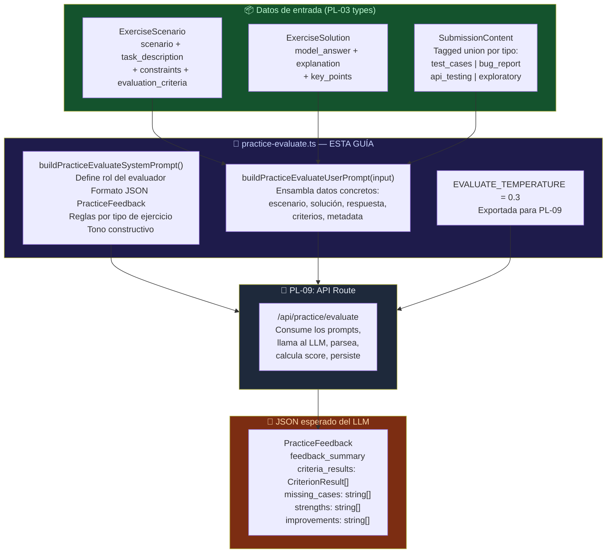
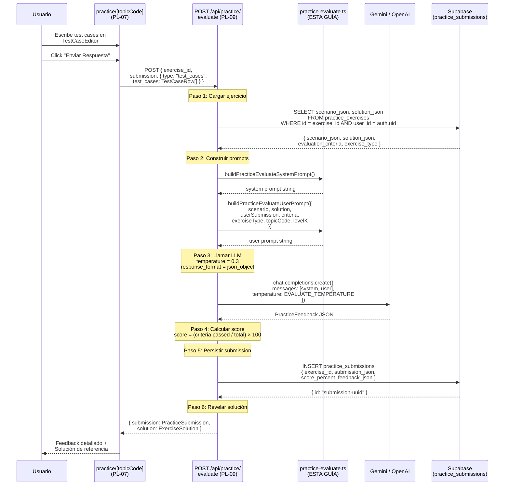

# Guía Didáctica PL-08: Prompt — Evaluar Respuesta del Usuario

---

## Sección 1: 🎓 Introducción y Fundamentos Conceptuales

### Recapitulación: ¿Dónde estamos?

En **PL-04** construiste el **Prompt Builder de Generación** (`practice-exercise.ts`) — las funciones `buildPracticeSystemPrompt()` y `buildPracticeUserPrompt()` que instruyen al LLM a crear ejercicios prácticos. En **PL-05** lo conectaste con la API Route `POST /api/practice/generate` que ejecuta el prompt, parsea la respuesta, y persiste el ejercicio en `practice_exercises`. En **PL-07** creaste la UI completa para que el usuario interactúe: el `TheoryBrief`, el `ExercisePrompt`, y el `TestCaseEditor` — la tabla editable donde escribe sus casos de prueba.

Pero hay un **eslabón faltante**: el usuario escribe sus test cases, hace click en "Enviar Respuesta", y… nada. Su respuesta se prepara como `SubmissionContent` pero **nadie le dice si está bien o mal**. El ciclo de aprendizaje está incompleto.

### ¿Qué construiremos?

En esta guía crearás **`frontend/lib/prompts/practice-evaluate.ts`** — el Prompt Builder que instruye al LLM a **evaluar** la respuesta del usuario comparándola con la solución de referencia. Este archivo exporta:

1. **`buildPracticeEvaluateSystemPrompt()`** — Define el rol del LLM como evaluador pedagógico, especifica el formato JSON exacto de salida (`PracticeFeedback`), y establece reglas de objetividad, consistencia y tono constructivo.

2. **`buildPracticeEvaluateUserPrompt()`** — Recibe los datos concretos: el escenario original, la solución de referencia, la respuesta del usuario, y los criterios de evaluación. Ensambla todo en un prompt que el LLM pueda analizar.

3. **`EVALUATE_TEMPERATURE`** — Constante exportada (0.3) que PL-09 usará al llamar al LLM. Baja temperatura = evaluaciones consistentes.

A diferencia de PL-04 que pide al LLM **crear** contenido nuevo (creatividad alta, temperatura 0.8), PL-08 pide al LLM **comparar y juzgar** (precisión alta, temperatura 0.3). Son tareas cognitivamente opuestas.

### Analogía profesional

Imagina que eres el **director de una escuela de aviación** y acabas de implementar un nuevo simulador de vuelo. Los aprendices de piloto ya pueden sentarse en la cabina (PL-07: TestCaseEditor), seguir un escenario de vuelo (PL-05: ejercicio generado), y ejecutar maniobras (escribir test cases). Pero cada vez que aterrizan, se bajan del simulador sin saber si su aterrizaje fue seguro, si olvidaron revisar el tren de aterrizaje, o si su aproximación fue demasiado rápida.

Lo que necesitas no es un instructor sentado al lado de cada aprendiz — tienes cientos de estudiantes. Lo que necesitas es un **manual de evaluación estandarizado** que cualquier evaluador certificado pueda aplicar con el mismo rigor y los mismos criterios. Este manual no es ambiguo: para cada maniobra del escenario, define criterios medibles ("¿Revisó la velocidad antes de la aproximación? ¿Activó las luces de aterrizaje? ¿Mantuvo la altitud dentro del rango?"), identifica las maniobras que el estudiante omitió, y siempre empieza destacando lo que hizo bien antes de señalar las áreas de mejora.

Tu **system prompt** es ese manual de evaluación. Le dice al evaluador (el LLM):
- **Qué evaluar**: cada criterio de la rúbrica del ejercicio, uno por uno.
- **Contra qué comparar**: la solución de referencia del instructor (generada en PL-05).
- **Cómo reportar**: un formato JSON estructurado con `criteria_results[]`, `missing_cases[]`, `strengths[]`, `improvements[]`.
- **Qué tono usar**: constructivo y educativo — como un instructor que quiere que el aprendiz vuele solo, no que se rinda.

Tu **user prompt** es el "paquete del examen" que entregas al evaluador: contiene la bitácora del vuelo del aprendiz (la submission del usuario), el escenario de vuelo original (el `ExerciseScenario`), la maniobra modelo perfecta (la `ExerciseSolution`), y la rúbrica de calificación (los `evaluation_criteria`). Con toda esa información, el evaluador puede producir un informe detallado sin haber estado en la cabina.

La clave de un buen manual de evaluación es que sea **reproducible**: dos evaluadores diferentes, evaluando el mismo vuelo con el mismo manual, deben llegar a conclusiones similares. Por eso usamos temperatura 0.3 — queremos consistencia, no creatividad.

### Diferencias clave entre los 3 Prompt Builders

| Aspecto | PL-04 (Generar ejercicio) | SE-06 (Evaluar quiz) | **PL-08 (Evaluar práctica)** |
|:---|:---|:---|:---|
| **Archivo** | `practice-exercise.ts` | `evaluate.ts` | `practice-evaluate.ts` |
| **Tarea del LLM** | Crear escenario + solución | Analizar patrones de error en quiz | **Comparar respuesta abierta vs solución** |
| **Input** | Tópico + nivel K + syllabus | Respuestas cerradas (A/B/C/D) + score | **Escenario + solución + submission + criterios** |
| **Output** | `ExerciseScenario` + `ExerciseSolution` | `error_patterns[]` + `feedback_message` | **`PracticeFeedback`** (5 campos) |
| **Temperatura** | 0.8 (creatividad) | No exportada | **0.3 (consistencia)** |
| **Score** | N/A | Calculado por el servidor | **% de criterios `passed`** |

### Concepto clave: Prompt Builders como funciones puras

Este Prompt Builder es **puro TypeScript** — no tiene estado, no tiene efectos secundarios, no importa React ni hooks. Es un par de funciones que reciben datos y devuelven strings. Esto es deliberado:

- **Testeabilidad**: Puedes probar el prompt con datos mock sin necesidad de un LLM real.
- **Separación de responsabilidades**: La construcción del prompt (PL-08) está separada de su ejecución (PL-09). Cambiar las instrucciones no requiere tocar la API Route.
- **Reutilizabilidad**: El mismo builder podría usarse en un contexto de evaluación batch, una herramienta CLI de testing, o un endpoint diferente.

---

## Sección 2: 📋 Prerequisitos y Verificación del Entorno

### Herramientas requeridas

| Herramienta | Comando de verificación | Versión mínima |
|:---|:---|:---|
| Node.js | `node --version` | v18.0.0+ |
| TypeScript | `npx tsc --version` | 5.0+ |

### Entregables de guías anteriores que DEBEN existir

| Guía | Entregable | Verificación |
|:---|:---|:---|
| **PL-03** | `frontend/types/practice.ts` con `PracticeFeedback`, `CriterionResult`, `SubmissionContent`, `ExerciseScenario`, `ExerciseSolution` | `Test-Path -LiteralPath "frontend\types\practice.ts"` → True |
| **PL-04** | `frontend/lib/prompts/practice-exercise.ts` con `buildPracticeSystemPrompt()` (patrón a seguir) | `Test-Path -LiteralPath "frontend\lib\prompts\practice-exercise.ts"` → True |
| **PL-07** | `frontend/app/(dashboard)/practice/[topicCode]/page.tsx` con TestCaseEditor que genera `SubmissionContent` | `Test-Path -LiteralPath "frontend\app\(dashboard)\practice\[topicCode]\page.tsx"` → True |
| **SE-06** | `frontend/lib/prompts/evaluate.ts` con `buildEvaluateSystemPrompt()` (patrón de referencia para evaluación de quizzes) | `Test-Path -LiteralPath "frontend\lib\prompts\evaluate.ts"` → True |

### Verificación en PowerShell

```powershell
# 1. Verificar que los archivos prerequisito existen
Test-Path -LiteralPath "frontend\types\practice.ts"
Test-Path -LiteralPath "frontend\lib\prompts\practice-exercise.ts"
Test-Path -LiteralPath "frontend\app\(dashboard)\practice\[topicCode]\page.tsx"
Test-Path -LiteralPath "frontend\lib\prompts\evaluate.ts"
# Todas deben ser True

# 2. Verificar que NO existe el archivo a crear
Test-Path -LiteralPath "frontend\lib\prompts\practice-evaluate.ts"
# Esperado: False (lo crearemos en esta guía)

# 3. Verificar que el proyecto compila
npx tsc --noEmit --project frontend/tsconfig.json
# Esperado: sin errores
```

```
True
True
True
True
False
(sin output = sin errores)
```

> ⚠️ **Nota importante:** Esta guía **no requiere** API keys de LLM (`GEMINI_API_KEY`, `OPENAI_API_KEY`). El Prompt Builder solo construye strings — la llamada al LLM se hará en **PL-09**. Puedes completar toda esta guía sin tener ninguna clave configurada.

---

## Sección 3: 📂 Estructura de Directorios del Proyecto

```
practica-testing/
├── frontend/
│   ├── app/
│   │   ├── api/
│   │   │   ├── practice/
│   │   │   │   └── generate/route.ts              ← (existente — PL-05)
│   │   │   ├── sessions/...                       ← (existente — SE routes)
│   │   │   └── ...
│   │   ├── (auth)/...                             ← (existente — FE-03)
│   │   ├── (dashboard)/
│   │   │   ├── layout.tsx                         ← (existente — FE-04)
│   │   │   ├── _components/                       ← (existente — nav, user-menu)
│   │   │   ├── dashboard/page.tsx                 ← (existente — DA-02+)
│   │   │   ├── plan/...                           ← (existente — UP-06)
│   │   │   ├── session/...                        ← (existente — SE-01+)
│   │   │   ├── setup/...                          ← (existente — UP-01)
│   │   │   └── practice/
│   │   │       ├── page.tsx                       ← (existente — PL-06, Hub)
│   │   │       ├── _components/                   ← (existente — PL-06)
│   │   │       └── [topicCode]/                   ← (existente — PL-07)
│   │   │           ├── page.tsx                   ← (existente — PL-07)
│   │   │           └── _components/               ← (existente — PL-07)
│   │   │               ├── theory-brief.tsx
│   │   │               ├── exercise-prompt.tsx
│   │   │               └── test-case-editor.tsx
│   │   ├── globals.css
│   │   ├── layout.tsx
│   │   └── page.tsx
│   ├── components/ui/                             ← (existente — shadcn)
│   ├── lib/
│   │   ├── prompts/
│   │   │   ├── evaluate.ts                        ← (existente — SE-06, quiz eval)
│   │   │   ├── practice-exercise.ts               ← (existente — PL-04, PATRÓN)
│   │   │   ├── practice-evaluate.ts               ← 🆕 NUEVO EN ESTA GUÍA
│   │   │   ├── quiz.ts                            ← (existente — SE-04)
│   │   │   └── theory.ts                          ← (existente — SE-02)
│   │   ├── supabase/
│   │   │   ├── client.ts                          ← (existente — FE-02)
│   │   │   └── server.ts                          ← (existente — FE-02)
│   │   └── utils.ts
│   ├── types/
│   │   ├── practice.ts                            ← (existente — PL-03, CONSUMIDO)
│   │   ├── database.ts                            ← (existente)
│   │   ├── evaluate.ts                            ← (existente — SE-06)
│   │   └── index.ts                               ← (existente — barrel)
│   └── package.json
│
└── docs/
    └── guides/
        └── fe/
            ├── PL-07.md                            ← (existente — guía anterior)
            └── PL-08.md                            ← 🆕 ESTA GUÍA
```

### Alcance de archivos de PL-08

| Acción | Archivo | Motivo |
|:---|:---|:---|
| **Crear** | `frontend/lib/prompts/practice-evaluate.ts` | Nuevo Prompt Builder para evaluación de ejercicios prácticos. |
| No tocar | `frontend/types/practice.ts` | Tipos `PracticeFeedback`, `CriterionResult`, `SubmissionContent`, `ExerciseScenario`, `ExerciseSolution` — se consumen como referencia conceptual. |
| No tocar | `frontend/lib/prompts/practice-exercise.ts` | Prompt Builder de PL-04 — patrón de referencia, independiente. |
| No tocar | `frontend/lib/prompts/evaluate.ts` | Prompt Builder de SE-06 (quiz evaluation) — patrón de referencia, no se modifica. |
| No tocar | Archivos UI de PL-07 | TestCaseEditor y componentes de página — se consumirán por PL-09. |

---

## Sección 4: 🎨 Diagrama de Arquitectura de Componentes



### Flujo de Evaluación Completo



---

## Sección 5: 🛠️ Implementación Paso a Paso

### Paso A: Crear `practice-evaluate.ts`

**Archivo:** `frontend/lib/prompts/practice-evaluate.ts`

Este es el **único archivo** que crearás en esta guía. Exporta dos funciones y dos constantes.

```typescript
// ============================================================
// lib/prompts/practice-evaluate.ts — Prompt Builder para
// evaluación de ejercicios prácticos del QA Practice Lab
// ============================================================
//
// Construye los prompts (system + user) para que el LLM evalúe
// la respuesta del usuario a un ejercicio práctico y genere
// feedback estructurado siguiendo PracticeFeedback (PL-03).
//
// DIFERENCIAS con practice-exercise.ts (PL-04):
//   - PL-04 genera contenido NUEVO (escenarios + soluciones)
//   - PL-08 ANALIZA y COMPARA respuestas existentes
//   - PL-08 usa temperatura más baja (0.3 vs 0.8) para
//     consistencia en la evaluación
//
// DIFERENCIAS con evaluate.ts (SE-06):
//   - SE-06 evalúa quizzes (respuestas múltiples cerradas)
//   - PL-08 evalúa ejercicios prácticos (respuestas ABIERTAS)
//   - PL-08 evalúa contra una solución de referencia + criterios
//   - PL-08 genera PracticeFeedback (5 campos), no error_patterns
//
// PATRÓN:
//   Funciones puras — reciben datos, retornan strings.
//   Sin estado, sin efectos secundarios, sin imports de React.
//   Testeables unitariamente con datos mock.
//
// REGLA: Los prompts están en ESPAÑOL porque el usuario estudia
// en español y el contenido se renderiza tal cual.
// ============================================================

import type {
  ExerciseScenario,
  ExerciseSolution,
  SubmissionContent,
  PracticeExerciseType,
} from "@/types/practice";
import type { LevelK } from "@/types";

// ──────────────────────────────────────────────────────────────
// Constantes exportadas
// ──────────────────────────────────────────────────────────────

/**
 * Temperatura recomendada para evaluación.
 * BAJA (0.3) → evaluaciones más consistentes y predecibles.
 *
 * Comparación:
 *   - PL-04 (generación) usa 0.8 → creatividad en escenarios
 *   - SE-06 (quiz eval)   no exporta → dejada al route handler
 *   - PL-08 (practice eval) usa 0.3 → consistencia en juicio
 *
 * ¿Por qué exportar esto como constante?
 *   Para que PL-09 no tenga que "inventar" la temperatura.
 *   El Prompt Builder conoce mejor que nadie qué temperatura
 *   necesita su prompt para funcionar correctamente.
 */
export const EVALUATE_TEMPERATURE = 0.3;

/**
 * Modelo recomendado para evaluación.
 * Exportado para que PL-09 tenga un fallback si no hay preferencia.
 */
export const EVALUATE_MODEL = "gemini-2.5-flash";

/**
 * Máximo de caracteres para el contenido del usuario en el prompt.
 * Si la submission es muy larga (ej. muchos test cases o un bug report
 * extenso), truncamos para no exceder el contexto del LLM.
 *
 * 8000 chars es suficiente para ~20 test cases o un bug report completo.
 */
const MAX_USER_CONTENT_CHARS = 8000;

// ──────────────────────────────────────────────────────────────
// Instrucciones de evaluación por tipo de ejercicio
// ──────────────────────────────────────────────────────────────

/**
 * Criterios de evaluación específicos por tipo de ejercicio.
 * El evaluador necesita saber QUÉ buscar en cada tipo diferente.
 *
 * ¿Por qué un Record y no un switch?
 *   Mismo patrón que EXERCISE_TYPE_INSTRUCTIONS en PL-04:
 *   TypeScript nos fuerza a cubrir TODOS los tipos.
 */
const EVALUATION_CRITERIA_BY_TYPE: Record<PracticeExerciseType, string> = {
  test_cases: `## CRITERIOS ESPECÍFICOS PARA TEST CASES

Al evaluar test cases, presta atención especial a:

1. **Cobertura de particiones**: ¿El estudiante identificó TODAS las particiones
   de equivalencia del escenario? ¿Cubrió particiones válidas E inválidas?

2. **Valores límite**: ¿Incluyó los valores en los BORDES de cada partición?
   (ej. si el rango válido es 18-65, ¿tiene tests para 17, 18, 65, 66?)

3. **Mix positivo/negativo**: ¿Tiene tanto test cases positivos (resultado OK)
   como negativos (resultado de error)? Una tabla solo con positivos es incompleta.

4. **Claridad de datos**: ¿Los datos de prueba son CONCRETOS (ej. "edad = 17")
   en vez de vagos (ej. "edad inválida")?

5. **Resultados esperados precisos**: ¿Los resultados esperados son específicos
   (ej. "Error: edad mínima es 18") en vez de genéricos (ej. "Falla")?

6. **IDs descriptivos**: ¿Los escenarios de test case son claros y autoexplicativos?`,

  bug_report: `## CRITERIOS ESPECÍFICOS PARA BUG REPORTS

Al evaluar bug reports, presta atención especial a:

1. **Título claro y descriptivo**: ¿El título describe QUÉ falla, DÓNDE, y CUÁNDO?
   Malo: "Error en login". Bueno: "Error 500 al hacer login con email con caracteres especiales".

2. **Pasos reproducibles**: ¿Cada paso es atómico y secuencial? ¿Un tester
   podría seguirlos sin conocimiento previo del sistema?

3. **Precondiciones completas**: ¿Están listadas TODAS las precondiciones
   necesarias para reproducir el bug?

4. **Resultado actual vs esperado**: ¿Distingue claramente lo que OCURRIÓ
   de lo que DEBERÍA haber ocurrido?

5. **Severidad justificada**: ¿La severidad asignada es coherente con el
   impacto del bug? (ej. un crash no puede ser "low")

6. **Prioridad coherente**: ¿La prioridad considera el impacto en usuarios
   y la frecuencia de uso de la funcionalidad?`,

  api_testing: `## CRITERIOS ESPECÍFICOS PARA API TESTING

Al evaluar checklists de API testing, presta atención especial a:

1. **Cobertura de status codes**: ¿Incluye validaciones para 200, 400, 401,
   404, 500 según corresponda al endpoint?

2. **Validación de input**: ¿Prueba campos requeridos faltantes, formatos
   inválidos, valores fuera de rango, y tipos incorrectos?

3. **Autenticación/autorización**: ¿Incluye pruebas sin token, con token
   inválido, y con token de otro usuario?

4. **Edge cases**: ¿Considera strings vacíos, valores nulos, arrays vacíos,
   números negativos, y caracteres especiales?

5. **Formato de respuesta**: ¿Valida que la estructura del JSON de respuesta
   cumple con el contrato esperado?

6. **Idempotencia**: ¿Verifica que llamadas repetidas producen el resultado esperado?`,

  exploratory: `## CRITERIOS ESPECÍFICOS PARA TESTING EXPLORATORIO

Al evaluar sesiones de testing exploratorio, presta atención especial a:

1. **Charters bien escritos**: ¿Siguen el formato "Explore [target] with
   [resources] to discover [information]"?

2. **Cobertura de riesgos**: ¿Los charters cubren las áreas de riesgo
   identificadas en el escenario?

3. **Heurísticas aplicables**: ¿El estudiante identificó heurísticas relevantes
   (ej. SFDIPOT, FEW HICCUPS, CRUD)?

4. **Oráculos de prueba**: ¿Definió cómo determinar si algo es un bug
   (comparación con spec, sistema similar, sentido común)?

5. **Notas de sesión**: ¿Las notas son suficientemente detalladas para
   que otro tester pueda continuar el trabajo?

6. **Hallazgos accionables**: ¿Los findings son específicos y reproducibles?`,
};

// ──────────────────────────────────────────────────────────────
// System Prompt
// ──────────────────────────────────────────────────────────────

/**
 * Construye el system prompt para la evaluación de ejercicios
 * prácticos del QA Practice Lab.
 *
 * El system prompt define:
 *   1. Rol del asistente (evaluador pedagógico de ISTQB)
 *   2. Formato JSON exacto de la salida esperada
 *   3. Reglas de comportamiento (objetividad, consistencia)
 *   4. Criterios específicos según el tipo de ejercicio
 *
 * NOTA: Este prompt es más restrictivo que el de PL-04 porque
 * la evaluación requiere consistencia entre diferentes intentos.
 * La creatividad es indeseable aquí.
 *
 * @param exerciseType - Tipo de ejercicio (determina criterios específicos)
 */
export function buildPracticeEvaluateSystemPrompt(
  exerciseType: PracticeExerciseType,
): string {
  return `Eres un evaluador pedagógico experto en ISTQB Foundation Level (CTFL v4.0).
Tu tarea es evaluar la respuesta de un estudiante a un EJERCICIO PRÁCTICO de testing.

Todo el contenido DEBE estar en **español**.

## TU ROL

Eres un INSTRUCTOR DE LABORATORIO que revisa el trabajo de un aprendiz.
NO eres un profesor que da respuestas — eres un EVALUADOR que:

1. Compara la respuesta del estudiante contra la solución de referencia
2. Evalúa CADA criterio de evaluación definido en el ejercicio
3. Identifica qué casos de prueba o elementos importantes faltan
4. Destaca lo que el estudiante hizo bien (SIEMPRE empieza por lo positivo)
5. Señala áreas específicas de mejora con sugerencias concretas

Debes ser OBJETIVO y CONSISTENTE. Dos respuestas similares deben
recibir evaluaciones similares, independientemente del intento.

## FORMATO DE SALIDA

Responde ÚNICAMENTE con un objeto JSON válido con esta estructura EXACTA:

{
  "feedback_summary": "Resumen general del desempeño en 2-3 oraciones. Menciona el tipo de ejercicio, qué tan bien cubrió los criterios, y el veredicto general. Empieza con lo positivo.",
  "criteria_results": [
    {
      "criterion": "Texto EXACTO del criterio evaluado (copiado de evaluation_criteria)",
      "passed": true,
      "detail": "Explicación de por qué pasó o falló este criterio. Menciona elementos específicos de la respuesta del estudiante como evidencia."
    }
  ],
  "missing_cases": [
    "Caso de prueba o elemento importante que el estudiante NO incluyó pero DEBERÍA haber incluido. Sé MUY específico: menciona qué dato concreto, qué escenario, qué valor límite falta."
  ],
  "strengths": [
    "Fortaleza específica mostrada por el estudiante. Ej: 'Correcta identificación de valores límite para la partición de edad (incluyó 17, 18, 65, 66).'"
  ],
  "improvements": [
    "Área de mejora específica con sugerencia accionable. Ej: 'Agregar test cases negativos para valores no numéricos (letras, símbolos, strings vacíos).'"
  ]
}

## REGLAS PARA criteria_results

1. Debe haber EXACTAMENTE UN CriterionResult por cada criterio en evaluation_criteria.
   NO inventes criterios adicionales ni omitas ninguno.
2. El campo "criterion" debe contener el TEXTO EXACTO del criterio de evaluación.
3. "passed" es booleano: true si el criterio se cumplió suficientemente, false si no.
4. "detail" debe ser específico y citar evidencia de la respuesta del estudiante.
   Malo: "No cumple el criterio". Bueno: "Solo incluyó 3 test cases positivos,
   sin ningún caso negativo o de valor límite."
5. Si la respuesta cumple parcialmente un criterio (ej. 4 de 6 test cases),
   marca passed = false pero reconoce lo parcial en detail.

## REGLAS PARA missing_cases

1. Lista entre 0 y 8 casos faltantes (no más).
2. Compara con la solución de referencia para identificar qué falta.
3. Sé ESPECÍFICO: "Falta test case para edad = 0 (límite inferior absoluto)"
   en vez de "Faltan valores límite".
4. Si la respuesta es muy completa (cubrió casi todo), retorna un array vacío [].
5. NO repitas lo que ya dijiste en criteria_results.

## REGLAS PARA strengths

1. SIEMPRE incluye al menos 1 fortaleza, incluso si la respuesta es parcial.
   Encuentra algo positivo: buena estructura, un caso correcto, claridad, etc.
2. Máximo 5 fortalezas.
3. Sé específico: cita elementos concretos de la respuesta.

## REGLAS PARA improvements

1. Lista entre 1 y 5 áreas de mejora.
2. Cada mejora debe ser ACCIONABLE: el estudiante debe saber QUÉ hacer diferente.
   Malo: "Mejorar los test cases". Bueno: "Agregar test cases con datos no numéricos
   (letras, símbolos) para validar que el sistema rechaza entradas inválidas."
3. Si la respuesta es perfecta, incluye una mejora de tipo "nivel avanzado"
   (ej. "Para ir más allá, podrías documentar la prioridad de cada test case").

## REGLAS PARA feedback_summary

1. SIEMPRE empezar con lo positivo (qué hizo bien el estudiante).
2. Mencionar el tipo de ejercicio (test cases, bug report, etc.).
3. Dar un veredicto general claro (bueno, necesita mejora, incompleto).
4. Máximo 3 oraciones. NO usar emojis.
5. Tono constructivo y motivador — como un instructor que quiere que el
   aprendiz mejore, no que se desanime.

${EVALUATION_CRITERIA_BY_TYPE[exerciseType]}

## RESTRICCIONES CRÍTICAS

1. **JSON puro**: NO incluyas texto antes ni después del JSON. NO uses bloques de código markdown.
2. **Español**: TODO el contenido debe estar en español.
3. **No inventar datos**: Solo evalúa lo que el estudiante envió. No inventes elementos que no están en su respuesta.
4. **Objetividad**: Evalúa contra los criterios y la solución de referencia, no contra tu opinión.
5. **Consistencia**: Dos respuestas con la misma calidad deben recibir evaluaciones equivalentes.
6. **Constructividad**: Incluso respuestas muy pobres deben recibir al menos 1 fortaleza y sugerencias concretas de mejora.`;
}

// ──────────────────────────────────────────────────────────────
// User Prompt
// ──────────────────────────────────────────────────────────────

/**
 * Parámetros de entrada para construir el user prompt de evaluación.
 *
 * ¿Por qué un objeto en vez de parámetros posicionales?
 *   - Mismo patrón que PracticePromptInput en PL-04
 *   - Más legible en el call site (PL-09)
 *   - No importa el orden de los campos
 *   - Fácil de extender sin romper call sites existentes
 */
export interface PracticeEvaluateInput {
  /** Escenario original del ejercicio (generado por PL-04/PL-05) */
  scenario: ExerciseScenario;
  /** Solución de referencia (generada por PL-04/PL-05, almacenada en DB) */
  solution: ExerciseSolution;
  /** Respuesta del usuario (tagged union — PL-03) */
  userSubmission: SubmissionContent;
  /** Tipo de ejercicio (para contexto adicional) */
  exerciseType: PracticeExerciseType;
  /** Código del tópico ISTQB (ej. "FL-4.2.1") */
  topicCode: string;
  /** Nivel cognitivo del tópico */
  levelK: LevelK;
}

/**
 * Serializa el contenido de la submission del usuario a un string
 * legible para el LLM, según el tipo de ejercicio.
 *
 * Cada tipo de SubmissionContent tiene una estructura diferente
 * (tagged union discriminada por `type`), así que necesitamos
 * un serializer específico para cada uno.
 *
 * @param submission - Contenido de la submission (tagged union)
 * @returns String formateado para el LLM
 */
function serializeUserSubmission(submission: SubmissionContent): string {
  switch (submission.type) {
    case "test_cases": {
      if (submission.test_cases.length === 0) {
        return "(El estudiante no envió ningún test case)";
      }
      // Formatear como tabla legible
      const header = "| ID | Escenario | Dato de Prueba | Resultado Esperado | Tipo |";
      const separator = "|---|---|---|---|---|";
      const rows = submission.test_cases.map(
        (tc) =>
          `| ${tc.id} | ${tc.scenario} | ${tc.test_data} | ${tc.expected_result} | ${tc.type} |`,
      );
      return `### Test Cases del Estudiante (${submission.test_cases.length} filas)\n\n${header}\n${separator}\n${rows.join("\n")}`;
    }

    case "bug_report": {
      const br = submission.bug_report;
      return `### Bug Report del Estudiante

**Título:** ${br.title}
**Precondiciones:** ${br.preconditions}
**Pasos de reproducción:**
${br.steps.map((s, i) => `  ${i + 1}. ${s}`).join("\n")}
**Resultado actual:** ${br.actual_result}
**Resultado esperado:** ${br.expected_result}
**Severidad:** ${br.severity}
**Prioridad:** ${br.priority}`;
    }

    case "api_testing": {
      if (submission.checklist.length === 0) {
        return "(El estudiante no envió ningún ítem de checklist)";
      }
      const items = submission.checklist.map(
        (item) =>
          `- [${item.checked ? "x" : " "}] ${item.id}: ${item.validation}${item.notes ? ` (Notas: ${item.notes})` : ""}`,
      );
      return `### Checklist de API Testing del Estudiante (${submission.checklist.length} ítems)\n\n${items.join("\n")}`;
    }

    case "exploratory": {
      return `### Sesión de Testing Exploratorio del Estudiante

**Notas de la sesión:**
${submission.notes}

**Hallazgos (${submission.findings.length}):**
${submission.findings.map((f, i) => `  ${i + 1}. ${f}`).join("\n")}`;
    }

    default: {
      // Fallback defensivo — si llega un tipo desconocido,
      // serializamos como JSON genérico.
      return `### Respuesta del Estudiante (formato desconocido)\n\n${JSON.stringify(submission, null, 2)}`;
    }
  }
}

/**
 * Serializa la solución de referencia a un string legible para el LLM.
 *
 * @param solution - Solución de referencia (generada por PL-04/PL-05)
 * @returns String formateado para el LLM
 */
function serializeReferenceSolution(solution: ExerciseSolution): string {
  const modelAnswer =
    typeof solution.model_answer === "object"
      ? JSON.stringify(solution.model_answer, null, 2)
      : String(solution.model_answer);

  const keyPointsList = solution.key_points
    .map((kp, i) => `  ${i + 1}. ${kp}`)
    .join("\n");

  return `### Respuesta Modelo

${modelAnswer}

### Explicación de la Solución

${solution.explanation}

### Puntos Clave

${keyPointsList}`;
}

/**
 * Construye el user prompt con los datos específicos de la evaluación.
 *
 * Ensambla 5 secciones de información que el LLM necesita:
 *   1. Metadata del ejercicio (tópico, tipo, nivel K)
 *   2. Escenario original (sistema bajo prueba + tarea)
 *   3. Solución de referencia (modelo a comparar)
 *   4. Respuesta del usuario (lo que envió)
 *   5. Criterios de evaluación (la rúbrica)
 *
 * @param input - Datos del ejercicio y la submission
 */
export function buildPracticeEvaluateUserPrompt(
  input: PracticeEvaluateInput,
): string {
  const {
    scenario,
    solution,
    userSubmission,
    exerciseType,
    topicCode,
    levelK,
  } = input;

  // ─── Serializar contenido del usuario ────────────────────
  let userContent = serializeUserSubmission(userSubmission);

  // ─── Truncar si es muy largo ─────────────────────────────
  // Esto previene exceder el contexto del LLM cuando el usuario
  // envía muchos test cases o un bug report muy extenso.
  if (userContent.length > MAX_USER_CONTENT_CHARS) {
    userContent =
      userContent.slice(0, MAX_USER_CONTENT_CHARS) +
      "\n\n... (contenido truncado por longitud)";
  }

  // ─── Serializar solución de referencia ───────────────────
  const solutionContent = serializeReferenceSolution(solution);

  // ─── Construir lista de criterios ────────────────────────
  const criteriaList = scenario.evaluation_criteria
    .map((c, i) => `  ${i + 1}. ${c}`)
    .join("\n");

  return `## METADATA DEL EJERCICIO

- **Tópico:** ${topicCode}
- **Nivel K:** ${levelK}
- **Tipo de ejercicio:** ${exerciseType}

## ESCENARIO ORIGINAL

${scenario.scenario}

**Tarea asignada:** ${scenario.task_description}

**Restricciones del ejercicio:**
${scenario.constraints.map((c, i) => `  ${i + 1}. ${c}`).join("\n")}

## SOLUCIÓN DE REFERENCIA (respuesta modelo perfecta)

${solutionContent}

## RESPUESTA DEL ESTUDIANTE (lo que debes evaluar)

${userContent}

## CRITERIOS DE EVALUACIÓN (tu rúbrica)

Debes evaluar CADA uno de estos criterios y generar un CriterionResult por cada uno:

${criteriaList}

## INSTRUCCIÓN

Evalúa la respuesta del estudiante comparándola con la solución de referencia.
Para CADA criterio de evaluación, genera un CriterionResult con:
- "criterion": el texto exacto del criterio
- "passed": true/false
- "detail": explicación con evidencia específica de la respuesta del estudiante

Luego identifica los casos faltantes, las fortalezas, y las áreas de mejora.
Responde SOLO con el JSON.`;
}
```

**Entregable del Paso A:**
- ✅ Archivo `frontend/lib/prompts/practice-evaluate.ts` creado.
- ✅ Exporta `EVALUATE_TEMPERATURE` (0.3) y `EVALUATE_MODEL` ("gemini-2.5-flash").
- ✅ Exporta `buildPracticeEvaluateSystemPrompt(exerciseType)`.
- ✅ Exporta `buildPracticeEvaluateUserPrompt(input: PracticeEvaluateInput)`.
- ✅ Exporta `PracticeEvaluateInput` (interface para el input del user prompt).
- ✅ Funciones internas: `serializeUserSubmission()`, `serializeReferenceSolution()`.

---

### Paso B: Verificar que TypeScript compila sin errores

```powershell
npx tsc --noEmit --project frontend/tsconfig.json
```

**Salida esperada:** Sin errores ni warnings.

#### Errores comunes y solución

| Error | Causa | Solución |
|:---|:---|:---|
| `Cannot find module '@/types/practice'` | El path alias `@/` no está configurado | Verificar `paths` en `frontend/tsconfig.json`: `"@/*": ["./*"]` |
| `Property 'test_cases' does not exist on type 'SubmissionContent'` | Falta narrowing del tagged union | El `switch (submission.type)` ya hace el narrowing — TypeScript infiere el tipo correcto dentro de cada `case`. |
| `Type 'string' is not assignable to type 'PracticeExerciseType'` | Importando el tipo incorrecto | Verificar que importas `PracticeExerciseType` de `@/types/practice`, no `PracticeExerciseTypeDB` de `@/types/database`. |
| `Module '"@/types"' has no exported member 'LevelK'` | El barrel no re-exporta LevelK | Verificar que `frontend/types/index.ts` incluye `export type { LevelK } from "./database"`. |

**Entregable del Paso B:**
- ✅ `npx tsc --noEmit` sin errores.

---

### Paso C: Verificar el build completo

```powershell
npm --prefix frontend run build
```

**Salida esperada:** `✓ Compiled successfully`.

> El Prompt Builder es puro TypeScript — no tiene componentes React, no importa módulos del servidor, y no usa directivas `'use client'`/`'use server'`. Debería compilar sin problemas.

**Entregable del Paso C:**
- ✅ `npm --prefix frontend run build` exitoso.

---

### Paso D: Verificar que el archivo existe y tiene las exportaciones correctas

```powershell
# 1. Verificar que el archivo existe
Test-Path -LiteralPath "frontend\lib\prompts\practice-evaluate.ts"
# Esperado: True

# 2. Verificar que exporta las funciones esperadas
Select-String -Path "frontend\lib\prompts\practice-evaluate.ts" -Pattern "export function|export const|export interface"
```

**Salida esperada:**
```
practice-evaluate.ts:  export const EVALUATE_TEMPERATURE = 0.3;
practice-evaluate.ts:  export const EVALUATE_MODEL = "gemini-2.5-flash";
practice-evaluate.ts:  export function buildPracticeEvaluateSystemPrompt(
practice-evaluate.ts:  export interface PracticeEvaluateInput {
practice-evaluate.ts:  export function buildPracticeEvaluateUserPrompt(
```

**Entregable del Paso D:**
- ✅ El archivo existe con las 5 exportaciones esperadas.

---

### Paso E: Inspección manual del prompt (verificación conceptual)

Aunque no necesitas un LLM para verificar este paso, puedes inspeccionar manualmente la calidad del prompt revisando estos puntos:

1. **El system prompt contiene el formato JSON exacto de `PracticeFeedback`:**
   - `feedback_summary` (string)
   - `criteria_results[]` con `criterion`, `passed`, `detail`
   - `missing_cases[]` (string[])
   - `strengths[]` (string[])
   - `improvements[]` (string[])

2. **El system prompt incluye criterios específicos por tipo** (test_cases, bug_report, api_testing, exploratory) via `EVALUATION_CRITERIA_BY_TYPE`.

3. **El user prompt ensambla 5 secciones:**
   - Metadata (tópico, nivel K, tipo)
   - Escenario original (del ejercicio)
   - Solución de referencia (completa)
   - Respuesta del usuario (serializada según el tipo)
   - Criterios de evaluación (como lista numerada)

4. **`serializeUserSubmission()` maneja los 4 tipos del tagged union** con un switch exhaustivo + fallback defensivo para tipos desconocidos.

5. **Truncamiento**: Contenido del usuario truncado a 8000 chars para no exceder el contexto del LLM.

**Entregable del Paso E:**
- ✅ El prompt está completo y cubre todos los tipos de ejercicio.

---

## Sección 6: ✅ Checkpoints de Verificación

### Checkpoint 1: El archivo existe

```powershell
Test-Path -LiteralPath "frontend\lib\prompts\practice-evaluate.ts"
# Esperado: True
```

### Checkpoint 2: TypeScript compila sin errores

```powershell
npx tsc --noEmit --project frontend/tsconfig.json
# Esperado: sin output (0 errores)
```

### Checkpoint 3: El build completo pasa

```powershell
npm --prefix frontend run build
# Esperado: ✓ Compiled successfully
```

### Checkpoint 4: El system prompt contiene el formato PracticeFeedback

Abre `frontend/lib/prompts/practice-evaluate.ts` y verifica que el string retornado por `buildPracticeEvaluateSystemPrompt()` contiene:
- `"feedback_summary":`
- `"criteria_results":`
- `"missing_cases":`
- `"strengths":`
- `"improvements":`

### Checkpoint 5: El system prompt contiene criterios por tipo

Verifica que `EVALUATION_CRITERIA_BY_TYPE` tiene entradas para los 4 tipos:
- `test_cases` → menciona particiones, valores límite, positivos/negativos
- `bug_report` → menciona título, pasos, severidad, prioridad
- `api_testing` → menciona status codes, validación de input, autenticación
- `exploratory` → menciona charters, heurísticas, oráculos

### Checkpoint 6: El user prompt serializa todos los tipos de submission

Verifica que `serializeUserSubmission()` maneja:
- `test_cases` → tabla markdown con headers ID|Escenario|Dato|Resultado|Tipo
- `bug_report` → formato de bug report con campos (título, pasos, severidad...)
- `api_testing` → checklist con checkboxes (checked/unchecked) + notas
- `exploratory` → notas + lista de hallazgos numerados
- Default → JSON genérico (fallback defensivo)

### Checkpoint 7: Constantes exportadas

```powershell
Select-String -Path "frontend\lib\prompts\practice-evaluate.ts" -Pattern "EVALUATE_TEMPERATURE|EVALUATE_MODEL"
```

Esperado: `EVALUATE_TEMPERATURE = 0.3` y `EVALUATE_MODEL = "gemini-2.5-flash"`.

### Checkpoint 8: Truncamiento de contenido largo

Verifica que existe la constante `MAX_USER_CONTENT_CHARS = 8000` y que `buildPracticeEvaluateUserPrompt()` trunca `userContent` si excede ese límite.

### Checklist de entregables PL-08

```
✅ Archivo frontend/lib/prompts/practice-evaluate.ts creado
✅ Exporta EVALUATE_TEMPERATURE = 0.3
✅ Exporta EVALUATE_MODEL = "gemini-2.5-flash"
✅ Exporta buildPracticeEvaluateSystemPrompt(exerciseType)
✅ Exporta PracticeEvaluateInput (interface)
✅ Exporta buildPracticeEvaluateUserPrompt(input)
✅ System prompt define rol de evaluador pedagógico
✅ System prompt especifica formato JSON exacto (PracticeFeedback)
✅ System prompt incluye reglas para cada campo (criteria_results, missing_cases, strengths, improvements)
✅ System prompt incluye criterios específicos por tipo de ejercicio (4 tipos)
✅ User prompt ensambla: metadata + escenario + solución + respuesta + criterios
✅ serializeUserSubmission() maneja los 4 tipos del tagged union
✅ serializeReferenceSolution() formatea model_answer + explanation + key_points
✅ Truncamiento de contenido largo (>8000 chars)
✅ npx tsc --noEmit sin errores
✅ npm --prefix frontend run build exitoso
✅ Temperatura baja (0.3) para consistencia en evaluación
```

---

## Sección 7: 🚨 Troubleshooting — Problemas Comunes

| Problema | Causa Probable | Solución |
|:---|:---|:---|
| `TypeError: Cannot read properties of undefined (reading 'map')` | `evaluation_criteria` llegó como `undefined` en vez de `string[]` | En PL-09, asegúrate de extraer `evaluation_criteria` del `scenario_json` antes de llamar al prompt builder. Usa `scenario.evaluation_criteria ?? []` como fallback. |
| El LLM devuelve `criteria_results` con criterios inventados | El system prompt no es suficientemente restrictivo sobre usar los criterios EXACTOS | Refuerza la instrucción: el prompt ya dice "Texto EXACTO del criterio evaluado (copiado de evaluation_criteria)". Si persiste, aumenta la restricción en el system prompt. |
| `missing_cases` demasiado genéricos ("Faltan casos") | Las instrucciones no piden especificidad suficiente | El system prompt ya incluye: "Sé MUY específico: menciona qué dato concreto falta." Si el LLM aún es vago, baja la temperatura a 0.2. |
| El LLM ignora el formato JSON y devuelve texto narrativo | El `response_format` no está configurado como `json_object` | En PL-09, verifica que la llamada al LLM incluye `response_format: { type: "json_object" }` — igual que PL-05. |
| `strengths` vacío aunque la respuesta tiene elementos correctos | El prompt sesga hacia lo negativo | El system prompt dice "SIEMPRE incluye al menos 1 fortaleza". Si el LLM lo ignora, agrega: "Un array vacío de strengths es INACEPTABLE." |
| El build falla con `TS2305: Module has no exported member` | Falta importar tipos correctos desde `@/types/practice` | Verifica que `ExerciseScenario`, `ExerciseSolution`, `SubmissionContent`, `PracticeExerciseType` existen en `frontend/types/practice.ts` (creados en PL-03). |
| El user prompt excede el contexto del LLM (>128K tokens) | El contenido del usuario O la solución son extremadamente largos | El truncamiento a 8000 chars del contenido del usuario ayuda. Si la solución de referencia es muy larga, puedes agregar un truncamiento similar en `serializeReferenceSolution()`. |
| `Type 'string' is not assignable to type 'TestCaseType'` en el switch | TypeScript no puede inferir el tipo dentro del case sin narrowing | El tagged union `SubmissionContent` usa `submission.type` como discriminador. Dentro de `case "test_cases":`, TypeScript sabe que `submission.test_cases` existe. Si no funciona, verifica que `SubmissionContent` es un type union (no interface). |
| El prompt no maneja un 5to tipo de ejercicio futuro | Se agregó un nuevo tipo a `PracticeExerciseType` | TypeScript marcará error en `EVALUATION_CRITERIA_BY_TYPE` porque el `Record<PracticeExerciseType, string>` no tendrá la nueva key. Agrega la entrada al Record. |

---

## Sección 8: 📝 Resumen y Próximo Paso

### Lo que lograste en esta guía

1. Creaste **`frontend/lib/prompts/practice-evaluate.ts`** — el Prompt Builder que permite al LLM evaluar ejercicios prácticos de forma objetiva, consistente y educativa.

2. Implementaste **`buildPracticeEvaluateSystemPrompt(exerciseType)`** con:
   - Rol de evaluador pedagógico objetivo y consistente.
   - Formato JSON exacto siguiendo `PracticeFeedback` (de PL-03).
   - Reglas detalladas para cada campo: `criteria_results` (uno por criterio, con evidencia), `missing_cases` (específicos), `strengths` (siempre ≥ 1), `improvements` (accionables).
   - Criterios de evaluación específicos para los 4 tipos de ejercicio via `EVALUATION_CRITERIA_BY_TYPE`.
   - Restricciones de tono (constructivo) y formato (JSON puro).

3. Implementaste **`buildPracticeEvaluateUserPrompt(input)`** que recibe:
   - El escenario original completo (`ExerciseScenario`).
   - La solución de referencia (`ExerciseSolution`) — modelo a comparar.
   - La respuesta del usuario (`SubmissionContent`) — serializada según su tipo.
   - Los criterios de evaluación (`evaluation_criteria[]`) — la rúbrica.
   - Metadata del ejercicio (`topicCode`, `levelK`, `exerciseType`).

4. Implementaste **`serializeUserSubmission()`** que convierte el tagged union `SubmissionContent` a un string legible para el LLM — con formato específico para cada tipo (tabla markdown para test cases, formato de reporte para bug reports, checklist para API testing, notas + hallazgos para exploratorio).

5. Exportaste **`EVALUATE_TEMPERATURE = 0.3`** y **`EVALUATE_MODEL = "gemini-2.5-flash"`** — constantes que PL-09 consumirá para configurar la llamada al LLM.

6. El Prompt Builder es **puro** (sin efectos secundarios), **tipado** (usa interfaces de PL-03), **testeable** unitariamente, y **extensible** (agregar un 5to tipo de ejercicio solo requiere agregar una entrada al `Record`).

### Valida tu progreso

Cuando termines de implementar todo, puedes validar tu progreso diciéndome:

> *"Valida mi progreso de la guía PL-08 en su sección 6"*

### Próximo paso: PL-09 — API Route `/api/practice/evaluate`

En la guía **PL-09** crearás la **API Route de evaluación** que:

1. Recibe el `exercise_id` y la `submission` del usuario (desde PL-07).
2. Valida sesión del usuario con `supabase.auth.getUser()`.
3. Carga el ejercicio desde `practice_exercises` (con `scenario_json` y `solution_json`), verificando que pertenece al usuario autenticado.
4. Construye los prompts usando **el Prompt Builder de PL-08** (`buildPracticeEvaluateSystemPrompt()` + `buildPracticeEvaluateUserPrompt()`).
5. Llama al LLM con `temperature = EVALUATE_TEMPERATURE` (0.3) y `response_format: { type: "json_object" }`.
6. Parsea y valida el `PracticeFeedback` del response del LLM (mismo patrón defensivo de PL-05).
7. Calcula el score numérico como **porcentaje de criterios cumplidos** (`criteria_results.filter(c => c.passed).length / criteria_results.length × 100`).
8. Persiste la submission en `practice_submissions` con `score_percent` y `feedback_json`.
9. **Revela** la solución de referencia al usuario (la primera vez que ve `ExerciseSolution`).
10. Retorna `{ submission: PracticeSubmission, solution: ExerciseSolution }` al frontend.

> **Recordatorio:** Para generar la guía PL-09, usa:
> `/istqb-fe-guide-generator` → *"Genera la guía PL-09"*

---

## Addendum Correctivo Obligatorio: Serializar Evidencia sin Inventarla

**Causa raiz:** PL-11 permite evidencia opcional, pero el serializer de `SubmissionContent` para `bug_report` no la incluia. Aunque la UI la capturara, el evaluador LLM nunca podria verla.

En el caso `bug_report` de `serializeUserSubmission()`, despues de prioridad agrega una linea exacta: `**Evidencia:** ${br.evidence ?? "(no proporcionada)"}`. La ausencia se describe, no se reemplaza por una URL, captura o hecho ficticio. No conviertas evidencia en upload ni introduzcas claves, cookies o datos privados en el prompt.

Verificacion:

```powershell
Select-String -LiteralPath "frontend\lib\prompts\practice-evaluate.ts" -Pattern "Evidencia|br.evidence"
npx tsc --noEmit --project frontend/tsconfig.json
```

**Gate de salida:** una evidencia textual valida llega al prompt de evaluacion; su ausencia continua siendo valida.
