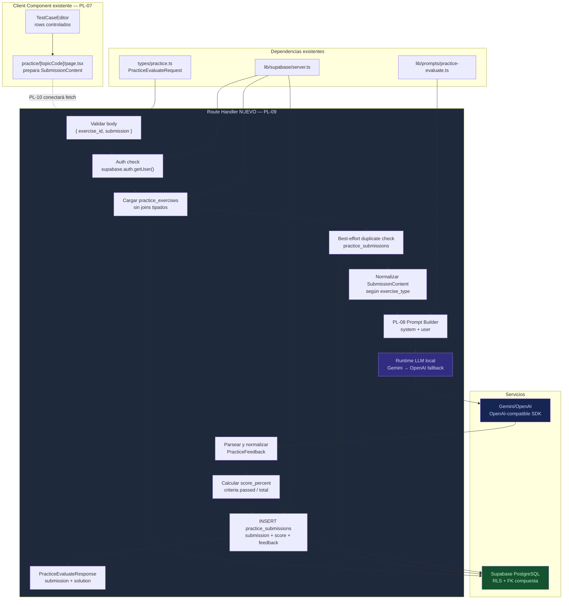
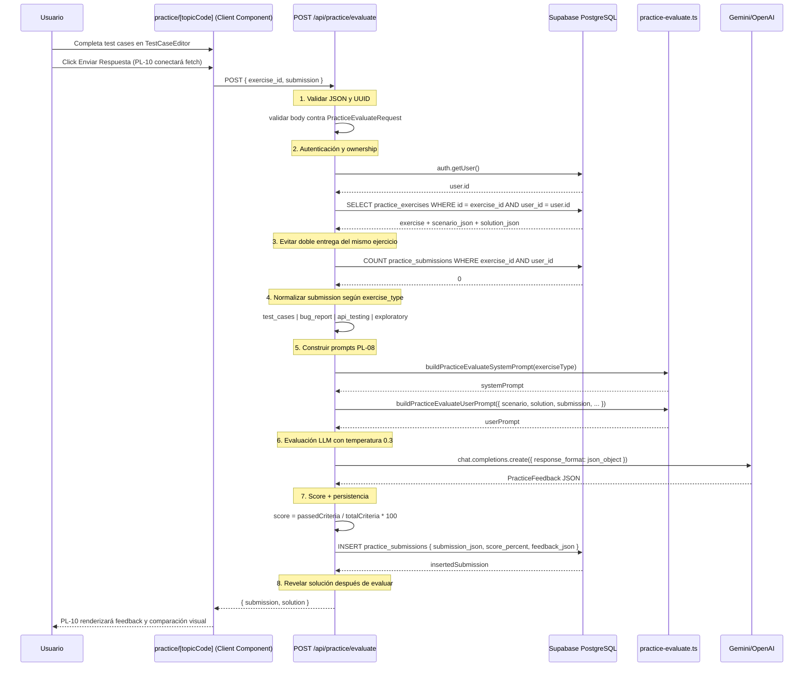
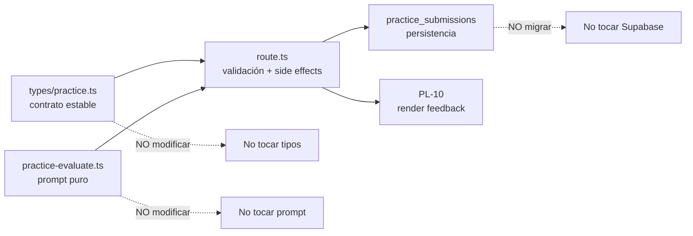
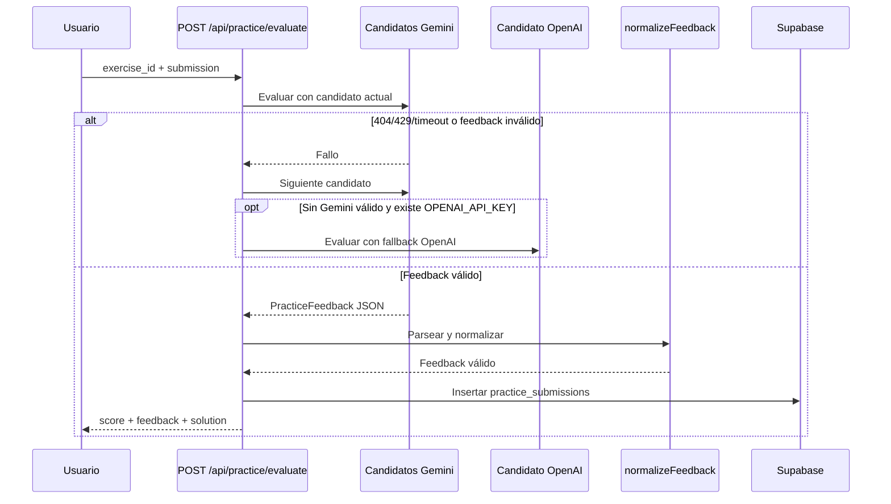

# Guía Didáctica PL-09: API Route `/api/practice/evaluate`

**Bloque:** QA Practice Lab  
**Guía anterior:** [PL-08 — Prompt: Evaluar Respuesta del Usuario](file:///c:/Users/jsife/OneDrive/Desktop/Repositorios/practica-testing/docs/guides/fe/PL-08.md)  
**Siguiente guía:** PL-10 — UI: Feedback de práctica + comparar con solución  
**Skill aplicado:** `istqb-fe-guide-generator`  
**Fecha:** Julio 2026
**Estado actual:** Implementado y verificado (12/07/2026). La evaluación server-only fue validada con el privilegio restrictivo de PL-02 activo en remoto.  

---

## Sección 1: 🎓 Introducción y Fundamentos Conceptuales

### Recapitulación: ¿dónde estamos?

En **PL-05** ya creaste `POST /api/practice/generate`, el endpoint que genera ejercicios prácticos, guarda `scenario_json` y `solution_json` en `practice_exercises`, y devuelve al frontend el ejercicio sin revelar la solución. En **PL-07** construiste la página `frontend/app/(dashboard)/practice/[topicCode]/page.tsx`, que actualmente prepara un `SubmissionContent` en `handleSubmit()` y lo deja en consola como placeholder. En **PL-08** creaste `frontend/lib/prompts/practice-evaluate.ts`, el prompt builder que sabe comparar la respuesta abierta del estudiante contra la solución modelo.

Esta guía cierra el tramo servidor del flujo: crearás `frontend/app/api/practice/evaluate/route.ts`, una API Route que recibe `{ exercise_id, submission }`, valida sesión y ownership, carga el ejercicio original, llama al LLM con el prompt de PL-08, calcula un score numérico y guarda el intento en `practice_submissions`.

### Qué NO hace esta guía

PL-09 **no modifica la UI** todavía. La página real `practice/[topicCode]/page.tsx` mantiene un `handleSubmit()` placeholder entre las líneas donde construye `submissionContent` y marca `submitted: true`. Esa conexión visual, el panel de feedback y la comparación con la solución pertenecen a **PL-10**.

Tampoco modifica `frontend/lib/openai.ts`. Ese archivo real del repo exporta `openai` y `OPENAI_MODEL`, pero **no exporta `createModelRuntime`**. Por eso PL-09 debe seguir el patrón real de `frontend/app/api/practice/generate/route.ts`: crear un runtime local multi-proveedor dentro del Route Handler, usando `GEMINI_API_KEY` primero y `OPENAI_API_KEY` como fallback.

### Analogía profesional

Imagina que diriges un laboratorio de certificación para aspirantes a QA. En PL-05 entregaste a cada estudiante un caso práctico cerrado: el escenario, las reglas del sistema y una rúbrica de evaluación. La solución modelo quedó guardada bajo llave para que nadie la consulte antes de entregar su trabajo. En PL-07 les diste una mesa de trabajo: una tabla editable para diseñar casos de prueba y preparar su respuesta.

PL-09 es la mesa del evaluador senior. Cuando llega una entrega, el evaluador no acepta papeles anónimos ni incompletos: primero revisa quién la envía, verifica que el ejercicio pertenece a esa persona, confirma que no se está intentando entregar dos veces el mismo ejercicio después de haber visto la solución y valida que el formato del trabajo coincide con el tipo de ejercicio asignado.

Después abre el sobre con la solución de referencia, compara la entrega contra la rúbrica y redacta un reporte pedagógico. El LLM actúa como evaluador cualitativo, pero el servidor sigue siendo el responsable de aplicar controles: parsear JSON, normalizar arrays, calcular el porcentaje de criterios aprobados y guardar el resultado en una tabla protegida por RLS.

La regla profesional clave es esta: el evaluador no improvisa el contrato. Si el sistema espera `PracticeEvaluateRequest`, entonces el body debe tener `submission`, no variantes inventadas como `submission_json`. La flexibilidad excesiva parece cómoda, pero en APIs educativas produce errores silenciosos y hace más difícil validar el progreso con el `istqb-step-validator`.

### Conceptos clave de Next.js y React aplicados

Un **Route Handler** en Next.js App Router es código server-only. Vive dentro de `app/api/**/route.ts`, exporta funciones por método HTTP (`POST`, `GET`, etc.) y puede leer cookies de Supabase mediante `createClient()` de `frontend/lib/supabase/server.ts`. Como esta ruta no es dinámica, no hay `params`; el cambio de Next.js 15+/16 sobre `params` como `Promise` no aplica aquí.

La página `practice/[topicCode]/page.tsx` sí es un **Client Component** porque usa `useState`, `useEffect`, `useParams`, `useSearchParams` y controla inputs interactivos. Esa página no debe importar SDKs server-only ni leer `GEMINI_API_KEY`. Su única responsabilidad futura será hacer `fetch('/api/practice/evaluate')` con cookies de sesión del navegador. La API Route hace el trabajo sensible en servidor.

El score de esta guía es **híbrido**: el LLM decide qué criterios pasaron (`criteria_results[].passed`), pero el servidor calcula el porcentaje final de forma determinística: `criterios_aprobados / criterios_totales * 100`. Esto evita aceptar un `score` inventado por el modelo y mantiene el contrato alineado con `PracticeFeedback` de `frontend/types/practice.ts`.

---

## Sección 2: 📋 Prerequisitos y Verificación del Entorno

### Herramientas y runtime detectados

| Prerequisito | Comando PowerShell desde la raíz | Salida esperada |
|---|---|---|
| Node.js | `node --version` | `v18.0.0` o superior |
| npm | `npm --version` | `9.0.0` o superior |
| Next.js | `node -p "require('./frontend/package.json').dependencies.next"` | `^16.2.7` |
| TypeScript | `npx tsc --version` | `Version 5.x.x` |
| OpenAI SDK | `node -p "require('./frontend/package.json').dependencies.openai"` | `^6.44.0` |

```powershell
node --version
```

```text
v22.16.0
```

```powershell
npm --version
```

```text
10.9.2
```

```powershell
node -p "require('./frontend/package.json').dependencies.next"
```

```text
^16.2.7
```

```powershell
npx tsc --version
```

```text
Version 5.9.3
```

```powershell
node -p "require('./frontend/package.json').dependencies.openai"
```

```text
^6.44.0
```

### Variables de entorno requeridas

PL-09 necesita una clave LLM server-only. No imprimas secretos. Verifica solo presencia:

```powershell
$envPath = "frontend\.env.local"
Test-Path -LiteralPath $envPath
$hasGemini = Select-String -LiteralPath $envPath -Pattern "^GEMINI_API_KEY=" -Quiet
$hasOpenAI = Select-String -LiteralPath $envPath -Pattern "^OPENAI_API_KEY=" -Quiet
"LLM key present: $($hasGemini -or $hasOpenAI)"
```

```text
True
LLM key present: True
```

Si usas Gemini, también puedes verificar que existe la base URL opcional sin mostrar valores:

```powershell
Select-String -LiteralPath "frontend\.env.local" -Pattern "^GEMINI_OPENAI_BASE_URL=" -Quiet
```

```text
True
```

> Si `GEMINI_OPENAI_BASE_URL` no existe, el código de esta guía usa el fallback seguro `https://generativelanguage.googleapis.com/v1beta/openai`.

### Entregables previos obligatorios

| Guía | Entregable requerido | Verificación PowerShell | Salida esperada |
|---|---|---|---|
| PL-01 | Tablas `practice_exercises` y `practice_submissions` | Verificar en Supabase Table Editor | Ambas tablas visibles |
| PL-02 | RLS y FK compuesta de Practice Lab | Verificar policies en Supabase | SELECT/INSERT/UPDATE/DELETE propias |
| PL-03 | Tipos de dominio del Practice Lab | `Test-Path -LiteralPath "frontend\types\practice.ts"` | `True` |
| PL-05 | API `POST /api/practice/generate` | `Test-Path -LiteralPath "frontend\app\api\practice\generate\route.ts"` | `True` |
| PL-07 | Página de práctica individual | `Test-Path -LiteralPath "frontend\app\(dashboard)\practice\[topicCode]\page.tsx"` | `True` |
| PL-08 | Prompt builder de evaluación | `Test-Path -LiteralPath "frontend\lib\prompts\practice-evaluate.ts"` | `True` |
| FE-02 | Cliente Supabase server-side | `Test-Path -LiteralPath "frontend\lib\supabase\server.ts"` | `True` |

```powershell
Test-Path -LiteralPath "frontend\types\practice.ts"
Test-Path -LiteralPath "frontend\app\api\practice\generate\route.ts"
Test-Path -LiteralPath "frontend\app\(dashboard)\practice\[topicCode]\page.tsx"
Test-Path -LiteralPath "frontend\lib\prompts\practice-evaluate.ts"
Test-Path -LiteralPath "frontend\lib\supabase\server.ts"
```

```text
True
True
True
True
True
```

### Puertas de dependencia específicas de PL-09

Antes de implementar, confirma que la ruta nueva todavía no existe:

```powershell
Test-Path -LiteralPath "frontend\app\api\practice\evaluate\route.ts"
```

```text
False
```

Confirma también que `frontend/types/database.ts` tiene `Relationships: []` en las tablas de Practice Lab. Esto significa que **no debes usar joins tipados complejos** como `practice_exercises!inner(...)` en esta guía:

```powershell
Select-String -LiteralPath "frontend\types\database.ts" -Pattern "practice_exercises|practice_submissions|Relationships"
```

```text
frontend\types\database.ts:451:      practice_exercises: {
frontend\types\database.ts:455:        Relationships: [];
frontend\types\database.ts:457:      practice_submissions: {
frontend\types\database.ts:461:        Relationships: [];
```

---

## Sección 3: 📂 Estructura de Directorios del Proyecto

Este árbol está anclado al repo actual. Los archivos marcados como existentes fueron verificados con `Glob`/`Read` antes de redactar la guía.

```text
practica-testing/
├── docs/
│   ├── guides/
│   │   ├── db/
│   │   │   ├── PL-01.md                         # existente — tablas Practice Lab
│   │   │   └── PL-02.md                         # existente — RLS Practice Lab
│   │   └── fe/
│   │       ├── PL-05.md                         # existente — /api/practice/generate
│   │       ├── PL-07.md                         # existente — TestCaseEditor
│   │       ├── PL-08.md                         # existente — prompt evaluator
│   │       └── PL-09.md                         # esta guía
│   └── roadmap/
│       └── ISTQB_Guias_Implementacion.md        # existente — PL-09 pendiente
│
├── frontend/
│   ├── app/
│   │   ├── api/
│   │   │   ├── dashboard/
│   │   │   │   └── metrics/route.ts             # existente — DA-01
│   │   │   ├── practice/
│   │   │   │   ├── generate/route.ts            # existente — PL-05
│   │   │   │   └── evaluate/route.ts            # NUEVO — PL-09
│   │   │   ├── sessions/
│   │   │   │   ├── next/route.ts                # existente — SE-01
│   │   │   │   └── [id]/...
│   │   │   ├── plan/
│   │   │   │   ├── generate/route.ts            # existente — UP-04
│   │   │   │   └── save/route.ts                # existente — UP-05
│   │   │   ├── extract/route.ts                 # existente — UP-03
│   │   │   └── upload/route.ts                  # existente — UP-02
│   │   ├── (dashboard)/
│   │   │   ├── layout.tsx                       # existente — shell privado
│   │   │   ├── dashboard/page.tsx               # existente — dashboard
│   │   │   ├── practice/
│   │   │   │   ├── page.tsx                     # existente — hub PL-06
│   │   │   │   ├── _components/
│   │   │   │   │   ├── practice-card.tsx        # existente
│   │   │   │   │   ├── practice-filter.tsx      # existente
│   │   │   │   │   └── topic-practice-list.tsx  # existente
│   │   │   │   └── [topicCode]/
│   │   │   │       ├── page.tsx                 # existente — PL-07 placeholder submit
│   │   │   │       └── _components/
│   │   │   │           ├── exercise-prompt.tsx  # existente
│   │   │   │           ├── test-case-editor.tsx # existente
│   │   │   │           └── theory-brief.tsx     # existente
│   │   │   ├── plan/page.tsx                    # existente
│   │   │   ├── session/page.tsx                 # existente
│   │   │   └── setup/page.tsx                   # existente
│   │   ├── (auth)/
│   │   │   ├── login/page.tsx                   # existente
│   │   │   └── register/page.tsx                # existente
│   │   ├── globals.css                          # existente
│   │   ├── layout.tsx                           # existente
│   │   └── page.tsx                             # existente
│   ├── lib/
│   │   ├── prompts/
│   │   │   ├── practice-exercise.ts             # existente — PL-04
│   │   │   ├── practice-evaluate.ts             # existente — PL-08, consumido aquí
│   │   │   ├── evaluate.ts                      # existente — SE-06
│   │   │   ├── quiz.ts                          # existente — SE-04
│   │   │   └── theory.ts                        # existente — SE-02
│   │   ├── supabase/
│   │   │   ├── client.ts                        # existente — Client Components
│   │   │   ├── server.ts                        # existente — Route Handlers
│   │   │   └── admin.ts                         # existente — no se usa aquí
│   │   ├── openai.ts                            # existente — NO tocar en PL-09
│   │   ├── format.ts                            # existente
│   │   └── utils.ts                             # existente
│   ├── types/
│   │   ├── database.ts                          # existente — Relationships: []
│   │   ├── practice.ts                          # existente — contrato PL-03
│   │   ├── index.ts                             # existente — barrel
│   │   ├── evaluate.ts                          # existente — SE-06
│   │   ├── quiz.ts                              # existente
│   │   ├── sessions.ts                          # existente
│   │   └── dashboard.ts                         # existente
│   ├── package.json                             # existente — Next 16.2.7
│   └── tsconfig.json                            # existente
│
└── supabase/
    └── migrations/
        ├── 20260706232553_create_practice_tables.sql # existente — PL-01
        └── 20260707005450_create_practice_rls.sql    # existente — PL-02
```

### Alcance de archivos de PL-09

| Acción | Archivo | Motivo |
|---|---|---|
| Crear | `frontend/app/api/practice/evaluate/route.ts` | Nueva API Route server-side que evalúa submissions del Practice Lab. |
| No modificar | `frontend/app/(dashboard)/practice/[topicCode]/page.tsx` | La conexión UI y el feedback visual son PL-10. En PL-09 se puede probar por consola del navegador. |
| No modificar | `frontend/app/(dashboard)/practice/[topicCode]/_components/test-case-editor.tsx` | Ya prepara filas controladas; no necesita cambios para crear el endpoint. |
| No modificar | `frontend/types/practice.ts` | El contrato `PracticeEvaluateRequest` ya existe y se consume tal cual. |
| No modificar | `frontend/lib/prompts/practice-evaluate.ts` | Prompt builder ya creado en PL-08; PL-09 lo consume. |
| No modificar | `frontend/lib/openai.ts` | No exporta `createModelRuntime`; la ruta tendrá runtime local multi-provider. |
| No modificar | `frontend/types/database.ts` | No se regeneran tipos ni se agregan relaciones en esta guía. |
| No modificar | `supabase/migrations/*.sql` | No hay cambios de schema ni RLS en PL-09. |

---

## Sección 4: 🎨 Diagrama de Arquitectura de Componentes



### Flujo Completo



### Límites de responsabilidad



---

## Sección 5: 🛠️ Implementación Paso a Paso

### Paso A: Crear `frontend/app/api/practice/evaluate/route.ts`

**Archivo nuevo:** `frontend/app/api/practice/evaluate/route.ts`

Este es el único archivo que crearás en PL-09. La ruta consume contratos existentes y no toca UI, tipos, prompt builder ni migraciones.

Antes de crear el archivo, verifica el directorio:

```powershell
Test-Path -LiteralPath "frontend\app\api\practice"
```

```text
True
```

Ahora crea manualmente la carpeta `frontend/app/api/practice/evaluate/` y el archivo `route.ts` con este contenido completo:

```typescript
// ─────────────────────────────────────────────────────────────────
// app/api/practice/evaluate/route.ts
// Route Handler: evalúa una entrega del QA Practice Lab.
//
// Método: POST
// Auth: requiere sesión válida de Supabase Auth.
// Body: PracticeEvaluateRequest
//   {
//     exercise_id: string,
//     submission: SubmissionContent
//   }
//
// Response 200: PracticeEvaluateResponse
// Response 400: body inválido o submission incompatible
// Response 401: usuario no autenticado
// Response 404: ejercicio no encontrado para el usuario
// Response 409: ejercicio ya enviado o sin solución de referencia
// Response 502: error del proveedor IA o JSON inválido
// Response 504: timeout del proveedor IA
//
// SEGURIDAD:
//   - Las API keys solo viven en servidor.
//   - No se imprime ningún secreto en logs.
//   - RLS + filtro user_id protegen ownership.
//   - No se usan joins porque database.ts mantiene Relationships: [].
// ─────────────────────────────────────────────────────────────────

import { NextResponse } from "next/server";
import OpenAI from "openai";
import { createClient } from "@/lib/supabase/server";
import {
  buildPracticeEvaluateSystemPrompt,
  buildPracticeEvaluateUserPrompt,
  EVALUATE_MODEL,
  EVALUATE_TEMPERATURE,
} from "@/lib/prompts/practice-evaluate";
import type {
  ApiChecklistItem,
  BugPriority,
  BugReportData,
  BugSeverity,
  CriterionResult,
  ExerciseScenario,
  ExerciseSolution,
  PracticeEvaluateResponse,
  PracticeExerciseType,
  PracticeFeedback,
  SubmissionContent,
  TestCaseRow,
  TestCaseType,
} from "@/types/practice";
import type { LevelK, PracticeSubmissionInsert } from "@/types";

export const runtime = "nodejs";

const GEMINI_OPENAI_BASE_URL =
  "https://generativelanguage.googleapis.com/v1beta/openai";

const UUID_REGEX =
  /^[0-9a-f]{8}-[0-9a-f]{4}-[0-9a-f]{4}-[0-9a-f]{4}-[0-9a-f]{12}$/i;

const VALID_EXERCISE_TYPES: readonly PracticeExerciseType[] = [
  "test_cases",
  "bug_report",
  "api_testing",
  "exploratory",
] as const;

const VALID_LEVEL_K: readonly LevelK[] = ["K1", "K2", "K3"] as const;

const VALID_TEST_CASE_TYPES: readonly TestCaseType[] = [
  "positive",
  "negative",
  "boundary",
] as const;

const VALID_BUG_SEVERITIES: readonly BugSeverity[] = [
  "critical",
  "high",
  "medium",
  "low",
] as const;

const VALID_BUG_PRIORITIES: readonly BugPriority[] = [
  "urgent",
  "high",
  "medium",
  "low",
] as const;

const PRACTICE_EVALUATE_TIMEOUT_MS = 60_000;
const PRACTICE_EVALUATE_TIMEOUT_BUFFER_MS = 15_000;
const MAX_FEEDBACK_TOKENS = 2500;

interface PracticeEvaluateModelRuntime {
  provider: "gemini" | "openai";
  model: string;
  client: OpenAI;
  timeoutMs: number;
}

function createPracticeEvaluateModelRuntime(): PracticeEvaluateModelRuntime {
  const geminiKey = process.env.GEMINI_API_KEY;
  if (geminiKey) {
    return {
      provider: "gemini",
      model: EVALUATE_MODEL,
      timeoutMs: PRACTICE_EVALUATE_TIMEOUT_MS,
      client: new OpenAI({
        apiKey: geminiKey,
        baseURL: process.env.GEMINI_OPENAI_BASE_URL || GEMINI_OPENAI_BASE_URL,
        timeout:
          PRACTICE_EVALUATE_TIMEOUT_MS + PRACTICE_EVALUATE_TIMEOUT_BUFFER_MS,
        maxRetries: 1,
      }),
    };
  }

  const openaiKey = process.env.OPENAI_API_KEY;
  if (openaiKey) {
    return {
      provider: "openai",
      model: process.env.OPENAI_EVALUATE_MODEL || "gpt-4o-mini",
      timeoutMs: PRACTICE_EVALUATE_TIMEOUT_MS,
      client: new OpenAI({
        apiKey: openaiKey,
        timeout:
          PRACTICE_EVALUATE_TIMEOUT_MS + PRACTICE_EVALUATE_TIMEOUT_BUFFER_MS,
        maxRetries: 1,
      }),
    };
  }

  throw new Error(
    "No hay API key de LLM configurada. Define GEMINI_API_KEY o OPENAI_API_KEY en frontend/.env.local.",
  );
}

function isRecord(value: unknown): value is Record<string, unknown> {
  return typeof value === "object" && value !== null && !Array.isArray(value);
}

function readString(value: unknown): string | null {
  return typeof value === "string" && value.trim().length > 0
    ? value.trim()
    : null;
}

function isStringArray(value: unknown): value is string[] {
  return Array.isArray(value) && value.every((item) => typeof item === "string");
}

function toStringList(value: unknown, fallback: string[], maxItems: number): string[] {
  if (!Array.isArray(value)) return fallback;

  const items = value
    .map((item) => (typeof item === "string" ? item.trim() : ""))
    .filter((item) => item.length > 0)
    .slice(0, maxItems);

  return items.length > 0 ? items : fallback;
}

function isPracticeExerciseType(value: unknown): value is PracticeExerciseType {
  return (
    typeof value === "string" &&
    VALID_EXERCISE_TYPES.includes(value as PracticeExerciseType)
  );
}

function isLevelK(value: unknown): value is LevelK {
  return typeof value === "string" && VALID_LEVEL_K.includes(value as LevelK);
}

function isExerciseScenario(value: unknown): value is ExerciseScenario {
  return (
    isRecord(value) &&
    typeof value.scenario === "string" &&
    typeof value.task_description === "string" &&
    isStringArray(value.constraints) &&
    isStringArray(value.evaluation_criteria) &&
    value.evaluation_criteria.length > 0
  );
}

function isExerciseSolution(value: unknown): value is ExerciseSolution {
  return (
    isRecord(value) &&
    isRecord(value.model_answer) &&
    typeof value.explanation === "string" &&
    isStringArray(value.key_points) &&
    value.key_points.length > 0
  );
}

function normalizeTestCaseRows(value: unknown): {
  rows?: TestCaseRow[];
  error?: string;
} {
  if (!Array.isArray(value)) {
    return { error: "submission.test_cases debe ser un array." };
  }

  if (value.length === 0) {
    return { error: "Debes enviar al menos un caso de prueba." };
  }

  const rows: TestCaseRow[] = [];

  for (const [index, rawRow] of value.entries()) {
    if (!isRecord(rawRow)) {
      return { error: `test_cases[${index}] debe ser un objeto.` };
    }

    const scenario = readString(rawRow.scenario);
    const testData = readString(rawRow.test_data);
    const expectedResult = readString(rawRow.expected_result);
    const type = VALID_TEST_CASE_TYPES.includes(rawRow.type as TestCaseType)
      ? (rawRow.type as TestCaseType)
      : null;

    if (!scenario || !testData || !expectedResult || !type) {
      return {
        error:
          `test_cases[${index}] requiere scenario, test_data, ` +
          "expected_result y type válido.",
      };
    }

    rows.push({
      id: readString(rawRow.id) || `TC-${String(index + 1).padStart(3, "0")}`,
      scenario,
      test_data: testData,
      expected_result: expectedResult,
      type,
    });
  }

  return { rows };
}

function normalizeBugReport(value: unknown): {
  bugReport?: BugReportData;
  error?: string;
} {
  if (!isRecord(value)) {
    return { error: "submission.bug_report debe ser un objeto." };
  }

  const steps = isStringArray(value.steps)
    ? value.steps.map((step) => step.trim()).filter(Boolean)
    : [];

  const severity = VALID_BUG_SEVERITIES.includes(value.severity as BugSeverity)
    ? (value.severity as BugSeverity)
    : null;
  const priority = VALID_BUG_PRIORITIES.includes(value.priority as BugPriority)
    ? (value.priority as BugPriority)
    : null;

  const bugReport: BugReportData = {
    title: readString(value.title) || "",
    preconditions: readString(value.preconditions) || "",
    steps,
    actual_result: readString(value.actual_result) || "",
    expected_result: readString(value.expected_result) || "",
    severity: severity || "medium",
    priority: priority || "medium",
  };

  if (
    !bugReport.title ||
    bugReport.steps.length === 0 ||
    !bugReport.actual_result ||
    !bugReport.expected_result
  ) {
    return {
      error:
        "bug_report requiere title, steps, actual_result y expected_result.",
    };
  }

  return { bugReport };
}

function normalizeApiChecklist(value: unknown): {
  checklist?: ApiChecklistItem[];
  error?: string;
} {
  if (!Array.isArray(value)) {
    return { error: "submission.checklist debe ser un array." };
  }

  const checklist: ApiChecklistItem[] = [];

  for (const [index, rawItem] of value.entries()) {
    if (!isRecord(rawItem)) {
      return { error: `checklist[${index}] debe ser un objeto.` };
    }

    const validation = readString(rawItem.validation);
    if (!validation) {
      return { error: `checklist[${index}].validation es requerido.` };
    }

    checklist.push({
      id: readString(rawItem.id) || `API-${String(index + 1).padStart(3, "0")}`,
      validation,
      checked: rawItem.checked === true,
      notes: typeof rawItem.notes === "string" ? rawItem.notes.trim() : "",
    });
  }

  if (checklist.length === 0) {
    return { error: "Debes enviar al menos un ítem de checklist." };
  }

  return { checklist };
}

function normalizeSubmission(
  value: unknown,
  expectedType: PracticeExerciseType,
): { submission?: SubmissionContent; error?: string } {
  if (!isRecord(value)) {
    return { error: "submission debe ser un objeto." };
  }

  if (value.type !== expectedType) {
    return {
      error:
        `submission.type debe ser "${expectedType}" porque el ejercicio ` +
        `guardado es de tipo "${expectedType}".`,
    };
  }

  if (expectedType === "test_cases") {
    const normalized = normalizeTestCaseRows(value.test_cases);
    if (!normalized.rows) return { error: normalized.error };
    return { submission: { type: "test_cases", test_cases: normalized.rows } };
  }

  if (expectedType === "bug_report") {
    const normalized = normalizeBugReport(value.bug_report);
    if (!normalized.bugReport) return { error: normalized.error };
    return { submission: { type: "bug_report", bug_report: normalized.bugReport } };
  }

  if (expectedType === "api_testing") {
    const normalized = normalizeApiChecklist(value.checklist);
    if (!normalized.checklist) return { error: normalized.error };
    return { submission: { type: "api_testing", checklist: normalized.checklist } };
  }

  const notes = typeof value.notes === "string" ? value.notes.trim() : "";
  const findings = isStringArray(value.findings)
    ? value.findings.map((finding) => finding.trim()).filter(Boolean)
    : [];

  if (!notes && findings.length === 0) {
    return {
      error: "exploratory requiere notes o findings con al menos un contenido.",
    };
  }

  return { submission: { type: "exploratory", notes, findings } };
}

function parseJsonObject(rawText: string): Record<string, unknown> | null {
  let text = rawText.trim();

  const markdownMatch = text.match(/```(?:json)?\s*\n?([\s\S]*?)\n?```/);
  if (markdownMatch) {
    text = markdownMatch[1].trim();
  }

  const firstBrace = text.indexOf("{");
  const lastBrace = text.lastIndexOf("}");
  if (firstBrace !== -1 && lastBrace > firstBrace) {
    text = text.slice(firstBrace, lastBrace + 1);
  }

  try {
    const parsed: unknown = JSON.parse(text);
    return isRecord(parsed) ? parsed : null;
  } catch (error) {
    console.error("[practice/evaluate] Error parseando JSON del LLM:", error);
    return null;
  }
}

function normalizeCriterionResults(
  value: unknown,
  expectedCriteria: string[],
): CriterionResult[] {
  const rawItems = Array.isArray(value) ? value : [];

  return expectedCriteria.map((criterion, index) => {
    const exactMatch = rawItems.find(
      (item) => isRecord(item) && item.criterion === criterion,
    );
    const rawItem = exactMatch || rawItems[index];

    if (!isRecord(rawItem)) {
      return {
        criterion,
        passed: false,
        detail: "El modelo no devolvió una evaluación para este criterio.",
      };
    }

    return {
      criterion,
      passed: rawItem.passed === true,
      detail: readString(rawItem.detail) || "Sin detalle específico del modelo.",
    };
  });
}

function normalizeFeedback(
  value: unknown,
  expectedCriteria: string[],
): PracticeFeedback | null {
  if (!isRecord(value)) return null;

  const criteriaResults = normalizeCriterionResults(
    value.criteria_results,
    expectedCriteria,
  );

  return {
    feedback_summary:
      readString(value.feedback_summary) ||
      "La práctica fue evaluada. Revisa el detalle por criterio para identificar fortalezas y mejoras.",
    criteria_results: criteriaResults,
    missing_cases: toStringList(value.missing_cases, [], 8),
    strengths: toStringList(value.strengths, ["Completaste la entrega."], 5),
    improvements: toStringList(
      value.improvements,
      ["Revisa la solución de referencia y completa los criterios pendientes."],
      5,
    ),
  };
}

function calculateScorePercent(feedback: PracticeFeedback): number {
  const totalCriteria = Math.max(feedback.criteria_results.length, 1);
  const passedCriteria = feedback.criteria_results.filter(
    (criterion) => criterion.passed,
  ).length;

  return Math.min(
    100,
    Math.max(0, Math.round((passedCriteria / totalCriteria) * 100)),
  );
}

export async function POST(request: Request) {
  const startedAt = Date.now();

  try {
    let body: Record<string, unknown>;
    try {
      const parsedBody: unknown = await request.json();
      if (!isRecord(parsedBody)) {
        return NextResponse.json(
          { error: "El body debe ser un objeto JSON." },
          { status: 400 },
        );
      }
      body = parsedBody;
    } catch {
      return NextResponse.json(
        { error: "El body de la petición debe ser JSON válido." },
        { status: 400 },
      );
    }

    const exerciseId = readString(body.exercise_id);
    if (!exerciseId || !UUID_REGEX.test(exerciseId)) {
      return NextResponse.json(
        { error: "exercise_id es requerido y debe ser un UUID válido." },
        { status: 400 },
      );
    }

    if (!("submission" in body)) {
      return NextResponse.json(
        { error: "submission es requerido. No uses submission_json en PL-09." },
        { status: 400 },
      );
    }

    const supabase = await createClient();
    const {
      data: { user },
      error: authError,
    } = await supabase.auth.getUser();

    if (authError || !user) {
      return NextResponse.json(
        { error: "No autenticado. Inicia sesión para evaluar tu práctica." },
        { status: 401 },
      );
    }

    const { data: exercise, error: exerciseError } = await supabase
      .from("practice_exercises")
      .select(
        "id, user_id, document_id, topic_code, level_k, exercise_type, scenario_json, solution_json, created_at",
      )
      .eq("id", exerciseId)
      .eq("user_id", user.id)
      .maybeSingle();

    if (exerciseError) {
      console.error("[practice/evaluate] Error buscando ejercicio:", exerciseError);
      return NextResponse.json(
        { error: "Error al buscar el ejercicio." },
        { status: 500 },
      );
    }

    if (!exercise) {
      return NextResponse.json(
        {
          error:
            "Ejercicio no encontrado. Verifica que exercise_id existe y pertenece a tu cuenta.",
        },
        { status: 404 },
      );
    }

    const exerciseType = exercise.exercise_type;
    const levelK = exercise.level_k;
    const scenario = exercise.scenario_json;
    const solution = exercise.solution_json;

    if (!isPracticeExerciseType(exerciseType) || !isLevelK(levelK)) {
      return NextResponse.json(
        { error: "El ejercicio guardado tiene metadatos inválidos." },
        { status: 500 },
      );
    }

    if (!isExerciseScenario(scenario)) {
      return NextResponse.json(
        { error: "El ejercicio guardado no tiene scenario_json válido." },
        { status: 500 },
      );
    }

    if (!isExerciseSolution(solution)) {
      return NextResponse.json(
        {
          error:
            "El ejercicio no tiene solución de referencia válida. Genera un ejercicio nuevo antes de evaluar.",
        },
        { status: 409 },
      );
    }

    const normalizedSubmission = normalizeSubmission(body.submission, exerciseType);
    if (!normalizedSubmission.submission) {
      return NextResponse.json(
        { error: normalizedSubmission.error || "submission inválida." },
        { status: 400 },
      );
    }

    const { count: existingSubmissions, error: duplicateError } = await supabase
      .from("practice_submissions")
      .select("id", { count: "exact", head: true })
      .eq("exercise_id", exercise.id)
      .eq("user_id", user.id);

    if (duplicateError) {
      console.error(
        "[practice/evaluate] Error verificando submissions previas:",
        duplicateError,
      );
      return NextResponse.json(
        { error: "Error al verificar si el ejercicio ya fue enviado." },
        { status: 500 },
      );
    }

    if ((existingSubmissions ?? 0) > 0) {
      return NextResponse.json(
        {
          error:
            "Este ejercicio ya fue enviado. Genera un nuevo ejercicio para otro intento.",
        },
        { status: 409 },
      );
    }

    const systemPrompt = buildPracticeEvaluateSystemPrompt(exerciseType);
    const userPrompt = buildPracticeEvaluateUserPrompt({
      scenario,
      solution,
      userSubmission: normalizedSubmission.submission,
      exerciseType,
      topicCode: exercise.topic_code,
      levelK,
    });

    const modelRuntime = createPracticeEvaluateModelRuntime();
    const controller = new AbortController();
    const timeoutId = setTimeout(
      () => controller.abort(),
      modelRuntime.timeoutMs,
    );

    let completion: OpenAI.Chat.Completions.ChatCompletion;
    try {
      completion = await modelRuntime.client.chat.completions.create(
        {
          model: modelRuntime.model,
          messages: [
            { role: "system", content: systemPrompt },
            { role: "user", content: userPrompt },
          ],
          response_format: { type: "json_object" },
          temperature: EVALUATE_TEMPERATURE,
          max_tokens: MAX_FEEDBACK_TOKENS,
        },
        { signal: controller.signal },
      );
    } catch (llmError) {
      if (
        llmError instanceof Error &&
        (llmError.name === "AbortError" || llmError.name === "APIUserAbortError")
      ) {
        return NextResponse.json(
          {
            error:
              `${modelRuntime.model} no respondió en ` +
              `${modelRuntime.timeoutMs / 1000} segundos. Intenta de nuevo.`,
          },
          { status: 504 },
        );
      }

      throw llmError;
    } finally {
      clearTimeout(timeoutId);
    }

    const rawContent = completion.choices[0]?.message?.content || "";
    const parsedFeedback = parseJsonObject(rawContent);
    const feedback = normalizeFeedback(
      parsedFeedback,
      scenario.evaluation_criteria,
    );

    if (!feedback) {
      return NextResponse.json(
        {
          error:
            "El proveedor de IA no devolvió un PracticeFeedback válido. Intenta de nuevo.",
        },
        { status: 502 },
      );
    }

    const scorePercent = calculateScorePercent(feedback);

    const insertData: PracticeSubmissionInsert = {
      user_id: user.id,
      exercise_id: exercise.id,
      submission_json: normalizedSubmission.submission as unknown as Record<
        string,
        unknown
      >,
      score_percent: scorePercent,
      feedback_json: feedback as unknown as Record<string, unknown>,
    };

    const { data: insertedSubmission, error: insertError } = await supabase
      .from("practice_submissions")
      .insert(insertData)
      .select("*")
      .single();

    if (insertError) {
      console.error(
        "[practice/evaluate] Error insertando submission:",
        insertError,
      );

      if (insertError.code === "23503") {
        return NextResponse.json(
          {
            error:
              "No se pudo crear la submission porque el exercise_id no tiene ownership válido.",
          },
          { status: 400 },
        );
      }

      if (insertError.code === "23514") {
        return NextResponse.json(
          { error: "score_percent debe estar entre 0 y 100." },
          { status: 400 },
        );
      }

      if (insertError.code === "42501") {
        return NextResponse.json(
          { error: "RLS rechazó la inserción de la submission." },
          { status: 403 },
        );
      }

      return NextResponse.json(
        { error: "Error al guardar la evaluación en la base de datos." },
        { status: 500 },
      );
    }

    const responseBody: PracticeEvaluateResponse = {
      submission: {
        id: insertedSubmission.id,
        user_id: insertedSubmission.user_id,
        exercise_id: insertedSubmission.exercise_id,
        content: normalizedSubmission.submission,
        score_percent: insertedSubmission.score_percent,
        feedback,
        submitted_at: insertedSubmission.submitted_at,
      },
      solution,
    };

    const elapsedMs = Date.now() - startedAt;
    console.log(
      `[practice/evaluate] ${exercise.topic_code} evaluado en ${elapsedMs}ms ` +
        `con ${modelRuntime.provider}/${modelRuntime.model}, score=${scorePercent}`,
    );

    return NextResponse.json(responseBody, { status: 200 });
  } catch (error) {
    console.error("[practice/evaluate] Error inesperado:", error);

    if (error instanceof OpenAI.APIConnectionError) {
      return NextResponse.json(
        {
          error:
            "No se pudo conectar con el proveedor de IA. Verifica conexión y variables de entorno.",
        },
        { status: 502 },
      );
    }

    if (error instanceof OpenAI.APIError) {
      return NextResponse.json(
        {
          error: `Error del proveedor de IA (${error.status || 502}): ${error.message}`,
        },
        { status: 502 },
      );
    }

    if (error instanceof Error && error.message.includes("No hay API key")) {
      return NextResponse.json({ error: error.message }, { status: 500 });
    }

    return NextResponse.json(
      { error: "Error interno del servidor al evaluar la práctica." },
      { status: 500 },
    );
  }
}
```

**Entregable del Paso A:**

- `frontend/app/api/practice/evaluate/route.ts` creado.
- Runtime local Gemini/OpenAI implementado sin depender de `createModelRuntime`.
- Validación estricta de `PracticeEvaluateRequest` usando `submission`, no `submission_json`.
- Validadores defensivos para `scenario_json`, `solution_json`, `SubmissionContent` y `PracticeFeedback`.
- Inserción en `practice_submissions` con `score_percent` y `feedback_json`.

### Paso B: Verificar que el archivo existe y no tocaste contratos compartidos

```powershell
Test-Path -LiteralPath "frontend\app\api\practice\evaluate\route.ts"
```

```text
True
```

Verifica que los archivos de contrato siguen sin cambios si solo implementaste PL-09:

```powershell
git diff -- frontend/types/practice.ts frontend/lib/prompts/practice-evaluate.ts frontend/lib/openai.ts frontend/types/database.ts
```

```text

```

**Entregable del Paso B:** el nuevo archivo existe y no hubo cambios accidentales en tipos, prompt builder, runtime OpenAI global o tipos de base de datos.

### Paso C: Compilar TypeScript

Ejecuta el compilador desde la raíz del workspace:

```powershell
npx tsc --noEmit --project frontend/tsconfig.json
```

```text

```

Salida esperada: sin errores. Si aparece un error, revisa primero imports y nombres exportados:

| Síntoma | Revisión inmediata |
|---|---|
| `Module has no exported member 'PracticeSubmissionInsert'` | `frontend/types/index.ts` debe re-exportar `PracticeSubmissionInsert` desde `database.ts`; ya existe en el repo actual. |
| `Cannot find module '@/lib/prompts/practice-evaluate'` | Confirma que PL-08 está implementada en `frontend/lib/prompts/practice-evaluate.ts`. |
| `Property 'APIConnectionError' does not exist` | Confirma que `openai` es `^6.44.0` en `frontend/package.json`. |
| Error con `signal` en el SDK | Asegúrate de no haber cambiado la versión del SDK; `generate/route.ts` ya usa el mismo patrón. |

**Entregable del Paso C:** TypeScript compila limpio.

### Paso D: Probar errores básicos sin autenticación

Inicia el servidor:

```powershell
npm --prefix frontend run dev
```

```text
▲ Next.js 16.2.7
- Local:        http://localhost:3000
```

En otra terminal, prueba una petición sin cookies de sesión. En Windows PowerShell 5.1 no uses `-SkipHttpErrorCheck`; usa `try/catch`:

```powershell
try {
  Invoke-WebRequest -Uri "http://localhost:3000/api/practice/evaluate" `
    -Method POST `
    -ContentType "application/json" `
    -Body '{"exercise_id":"00000000-0000-0000-0000-000000000000","submission":{"type":"test_cases","test_cases":[]}}' `
    -ErrorAction Stop
} catch {
  $_.Exception.Response.StatusCode.value__
}
```

```text
401
```

Prueba un body inválido:

```powershell
try {
  Invoke-WebRequest -Uri "http://localhost:3000/api/practice/evaluate" `
    -Method POST `
    -ContentType "application/json" `
    -Body '{"exercise_id":"no-es-uuid","submission":{"type":"test_cases","test_cases":[]}}' `
    -ErrorAction Stop
} catch {
  $_.Exception.Response.StatusCode.value__
}
```

```text
400
```

**Entregable del Paso D:** la ruta responde `401` sin sesión y `400` para UUID inválido.

### Paso E: Probar evaluación autenticada desde el navegador

Como PL-09 no conecta todavía el botón de la UI, la prueba autenticada se hace desde la consola del navegador para reutilizar las cookies de Supabase.

1. Abre `http://localhost:3000/login`.
2. Inicia sesión con tu usuario de prueba.
3. Ve a `http://localhost:3000/practice`.
4. Entra a un tópico y genera un ejercicio de tipo `test_cases`.
5. Copia el `exercise_id` desde la respuesta de `/api/practice/generate` en la pestaña Network del DevTools.
6. Abre DevTools → Console y ejecuta el siguiente ejemplo real (ajusta `exercise_id` al tuo):

```javascript
const response = await fetch("/api/practice/evaluate", {
  method: "POST",
  headers: { "Content-Type": "application/json" },
  body: JSON.stringify({
    exercise_id: "AQUÍ-TU-EXERCISE-UUID",
    submission: {
      type: "test_cases",
      test_cases: [
        { id: "TC-001", scenario: "Registro con datos mínimos válidos", test_data: "Edad: 18, Duración: 3, Peso: 30, Sesiones: 0", expected_result: "Membresía Premium creada correctamente", type: "boundary" },
        { id: "TC-002", scenario: "Registro con datos máximos válidos", test_data: "Edad: 65, Duración: 24, Peso: 250, Sesiones: 10", expected_result: "Membresía Premium creada correctamente", type: "boundary" },
        { id: "TC-003", scenario: "Edad menor al límite inferior", test_data: "Edad: 17, Duración: 12, Peso: 80, Sesiones: 5", expected_result: "Error: la edad debe estar entre 18 y 65 años", type: "negative" },
        { id: "TC-004", scenario: "Edad mayor al límite superior", test_data: "Edad: 66, Duración: 12, Peso: 80, Sesiones: 5", expected_result: "Error: la edad debe estar entre 18 y 65 años", type: "negative" },
        { id: "TC-005", scenario: "Edad válida nominal", test_data: "Edad: 35, Duración: 12, Peso: 80, Sesiones: 5", expected_result: "Membresía Premium creada correctamente", type: "positive" },
        { id: "TC-006", scenario: "Duración inválida no permitida", test_data: "Edad: 35, Duración: 9, Peso: 80, Sesiones: 5", expected_result: "Error: la duración debe ser 3, 6, 12 o 24 meses", type: "negative" },
        { id: "TC-007", scenario: "Duración válida de 6 meses", test_data: "Edad: 35, Duración: 6, Peso: 80, Sesiones: 5", expected_result: "Membresía Premium creada correctamente", type: "positive" },
        { id: "TC-008", scenario: "Duración válida de 12 meses", test_data: "Edad: 35, Duración: 12, Peso: 80, Sesiones: 5", expected_result: "Membresía Premium creada correctamente", type: "positive" },
        { id: "TC-009", scenario: "Peso menor al límite inferior", test_data: "Edad: 35, Duración: 12, Peso: 29, Sesiones: 5", expected_result: "Error: el peso debe estar entre 30 kg y 250 kg", type: "negative" },
        { id: "TC-010", scenario: "Peso justo en el límite inferior", test_data: "Edad: 35, Duración: 12, Peso: 30, Sesiones: 5", expected_result: "Membresía Premium creada correctamente", type: "boundary" },
        { id: "TC-011", scenario: "Peso justo en el límite superior", test_data: "Edad: 35, Duración: 12, Peso: 250, Sesiones: 5", expected_result: "Membresía Premium creada correctamente", type: "boundary" },
        { id: "TC-012", scenario: "Peso mayor al límite superior", test_data: "Edad: 35, Duración: 12, Peso: 251, Sesiones: 5", expected_result: "Error: el peso debe estar entre 30 kg y 250 kg", type: "negative" },
        { id: "TC-013", scenario: "Sesiones menor al límite inferior", test_data: "Edad: 35, Duración: 12, Peso: 80, Sesiones: -1", expected_result: "Error: las sesiones deben estar entre 0 y 10", type: "negative" },
        { id: "TC-014", scenario: "Sesiones justo en el límite superior", test_data: "Edad: 35, Duración: 12, Peso: 80, Sesiones: 10", expected_result: "Membresía Premium creada correctamente", type: "boundary" },
        { id: "TC-015", scenario: "Sesiones mayor al límite superior", test_data: "Edad: 35, Duración: 12, Peso: 80, Sesiones: 11", expected_result: "Error: las sesiones deben estar entre 0 y 10", type: "negative" },
      ],
    },
  }),
});

const data = await response.json();
console.log("Status:", response.status);
console.log(JSON.stringify(data, null, 2));
```

```text
Status: 200
{
  "submission": {
    "id": "98aab518-de3b-4f5b-a234-71259f95e490",
    "user_id": "7eda7e1c-...",
    "exercise_id": "d1521bec-...",
    "content": { "type": "test_cases", "test_cases": [Array(15)] },
    "score_percent": 100,
    "feedback": {
      "feedback_summary": "El estudiante ha demostrado una sólida comprensión...",
      "criteria_results": [Array(5)],
      "missing_cases": [Array(3)],
      "strengths": [Array(4)],
      "improvements": [Array(3)]
    },
    "submitted_at": "2026-07-07T20:56:42.605009+00:00"
  },
  "solution": {
    "model_answer": { "items": [Array(15)] },
    "explanation": "Para construir esta suite de casos de prueba...",
    "key_points": [Array(5)]
  }
}
```

En la terminal de `npm run dev` deberías ver:

```text
[practice/evaluate] LLM intento 1/2: finish_reason=stop, tokens=10670, completion_tokens=1233, chars=4682
[practice/evaluate] FL-4.2.1 evaluado en 25165ms con gemini/gemini-2.5-flash, score=100
POST /api/practice/evaluate 200 in 25.8s
```

> **Nota:** Si ves `finish_reason=length` en vez de `stop`, el JSON fue truncado. La ruta reintenta automáticamente una vez (ver troubleshooting #10).

**Entregable del Paso E:** respuesta `200` con `submission` (score + feedback) y `solution` revelada. Log del servidor confirma intento, tokens y tiempo.

### Paso F: Verificar persistencia en Supabase

Puedes verificar la persistencia de tres formas:

**Opción 1 — Supabase Table Editor (recomendada para pruebas rápidas):**

Abre Supabase Dashboard → Table Editor → `practice_submissions`. Deberías ver la fila recién creada con `score_percent`, `feedback_json` y `submission_json`.

**Opción 2 — Supabase CLI (requiere `supabase` instalado y DB local):**

```powershell
supabase db query "SELECT id, exercise_id, score_percent, submitted_at FROM practice_submissions ORDER BY submitted_at DESC LIMIT 1;"
```

```text
                  id                  |             exercise_id              | score_percent |          submitted_at
--------------------------------------+--------------------------------------+---------------+-------------------------------
 98aab518-de3b-4f5b-a234-71259f95e490 | d1521bec-1b6d-455b-899e-d4843f357d07 |        100.00 | 2026-07-07 20:56:42.605009+00
```

**Opción 3 — REST API con service role key (sin CLI):**

> **⚠️ Importante:** La anon key **no puede** leer esta tabla por RLS (retorna `[]`). Usa la service role key de `frontend/.env.local` (`SUPABASE_SERVICE_ROLE_KEY`). **Nunca** expongas esta key en el frontend.

```powershell
$headers = @{
  "apikey"    = "TU-SERVICE-ROLE-KEY"
  "Authorization" = "Bearer TU-SERVICE-ROLE-KEY"
  "Accept"    = "application/json"
}
$url = "https://TU-PROYECTO.supabase.co/rest/v1/practice_submissions?select=id,exercise_id,score_percent,submitted_at&order=submitted_at.desc&limit=1"
Invoke-RestMethod -Uri $url -Headers $headers -Method GET | ConvertTo-Json
```

```json
[{
  "id": "98aab518-de3b-4f5b-a234-71259f95e490",
  "exercise_id": "d1521bec-1b6d-455b-899e-d4843f357d07",
  "score_percent": 100.00,
  "submitted_at": "2026-07-07T20:56:42.605009+00:00"
}]
```

Prueba doble envío con el mismo `exercise_id` desde la consola del navegador. La segunda vez debe responder `409`:

```javascript
const retry = await fetch("/api/practice/evaluate", {
  method: "POST",
  headers: { "Content-Type": "application/json" },
  body: JSON.stringify({
    exercise_id: "MISMO-UUID-DEL-EJERCICIO",
    submission: {
      type: "test_cases",
      test_cases: [
        { id: "TC-001", scenario: "Reintento", test_data: "valor", expected_result: "resultado", type: "positive" },
      ],
    },
  }),
});
console.log(retry.status, await retry.json());
```

```text
409 { error: "Este ejercicio ya fue enviado. Genera un nuevo ejercicio para otro intento." }
```

**Entregable del Paso F:** la submission queda guardada y el endpoint rechaza un reenvío del mismo ejercicio.

---

## Sección 6: ✅ Checkpoints de Verificación

### Checklist técnico

| # | Checkpoint | Cómo verificar | Resultado esperado |
|---|---|---|---|
| 1 | Archivo creado | `Test-Path -LiteralPath "frontend\app\api\practice\evaluate\route.ts"` | `True` |
| 2 | Contrato estricto | Buscar `body.submission_json` en el nuevo route | No debe aceptar `submission_json` como campo del request |
| 3 | Runtime correcto | Buscar `createPracticeEvaluateModelRuntime` | Existe runtime local multi-provider |
| 4 | No dependencia fantasma | Buscar `createModelRuntime` | No aparece |
| 5 | Sin joins tipados | Buscar `!inner` en el nuevo route | No aparece |
| 6 | Auth implementado | Buscar `supabase.auth.getUser()` | Existe |
| 7 | Ownership implementado | Query filtra `.eq("user_id", user.id)` | Existe |
| 8 | Doble submit controlado | Query `practice_submissions` con `count` | Existe |
| 9 | Prompt PL-08 usado | Imports `buildPracticeEvaluateSystemPrompt` y `buildPracticeEvaluateUserPrompt` | Existen |
| 10 | Score determinístico | `calculateScorePercent()` usa `criteria_results` | Existe |
| 11 | Persistencia | Inserta en `practice_submissions` | Existe |
| 12 | TypeScript | `npx tsc --noEmit --project frontend/tsconfig.json` | Sin output |

Comandos rápidos:

```powershell
Select-String -LiteralPath "frontend\app\api\practice\evaluate\route.ts" -Pattern "createModelRuntime|!inner|body\.submission_json|submission_json.*in body"
```

```text

```

```powershell
Select-String -LiteralPath "frontend\app\api\practice\evaluate\route.ts" -Pattern "createPracticeEvaluateModelRuntime|supabase.auth.getUser|calculateScorePercent|practice_submissions"
```

```text
frontend\app\api\practice\evaluate\route.ts:...:function createPracticeEvaluateModelRuntime(): PracticeEvaluateModelRuntime {
frontend\app\api\practice\evaluate\route.ts:...:} = await supabase.auth.getUser();
frontend\app\api\practice\evaluate\route.ts:...:function calculateScorePercent(feedback: PracticeFeedback): number {
frontend\app\api\practice\evaluate\route.ts:...:.from("practice_submissions")
```

### Verificación visual esperada

PL-09 no cambia pantalla todavía. Al navegar por la UI deberías ver exactamente lo mismo que en PL-07:

| Pantalla | Qué deberías ver |
|---|---|
| `/practice` | Hub de prácticas con tarjetas/tópicos existentes. |
| `/practice/[topicCode]?document_id=...` | Resumen teórico, selector de tipo, botón `Generar Ejercicio`. |
| Ejercicio generado | `ExercisePrompt` con escenario y `TestCaseEditor` con tabla editable. |
| Click `Enviar Respuesta` | Mensaje verde `Tu respuesta ha sido preparada correctamente` y logs en consola, porque PL-10 conectará el endpoint. |
| DevTools Console manual fetch | Respuesta JSON con `submission` y `solution` si usas el fetch del Paso E. |

### Tabla de edge cases

| Escenario | Resultado esperado | Por qué importa |
|---|---|---|
| Body no es JSON | `400` | Evita crashes en `request.json()`. |
| `exercise_id` no es UUID | `400` | Evita queries inválidas y errores opacos de Supabase. |
| Usuario no autenticado | `401` | La ruta depende de cookies Supabase SSR. |
| `exercise_id` de otro usuario | `404` | No revela si existe un ejercicio ajeno. |
| `submission.type` no coincide con `exercise.exercise_type` | `400` | Evita evaluar bug reports como test cases o viceversa. |
| `test_cases` vacío | `400` | Evita pagar LLM por entregas sin contenido. |
| Ejercicio sin `solution_json` | `409` | No se puede evaluar sin solución de referencia. |
| Ya existe submission del ejercicio | `409` | Evita doble envío después de revelar solución. |
| LLM devuelve markdown alrededor del JSON | Se parsea defensivamente | Los modelos a veces ignoran JSON puro. |
| LLM omite un criterio | Se crea `CriterionResult` fallido para ese criterio | Mantiene score calculable y feedback completo. |
| LLM tarda demasiado | `504` | Evita colgar el request indefinidamente. |
| RLS rechaza insert | `403` | Indica problema de ownership/policies. |
| Mobile/desktop | Sin cambios visuales | La UI no se modifica en PL-09. |
| Zona horaria | `submitted_at` lo genera DB | No dependes del reloj del cliente. |

### Checklist de entregables PL-09

```text
[x] Crear frontend/app/api/practice/evaluate/route.ts
[x] Exportar runtime = "nodejs"
[x] Validar body JSON y exercise_id UUID
[x] Exigir contrato { exercise_id, submission }
[x] Rechazar submission_json en esta guía
[x] Autenticar con supabase.auth.getUser()
[x] Cargar practice_exercises filtrando por id + user_id
[x] Evitar joins porque Relationships: []
[x] Validar scenario_json y solution_json antes de usar prompts
[x] Normalizar SubmissionContent según exercise_type
[x] Rechazar doble envío del mismo exercise_id
[x] Construir prompts con practice-evaluate.ts de PL-08
[x] Llamar Gemini/OpenAI con response_format json_object y temperatura 0.3
[x] Parsear JSON defensivamente
[x] Reintento automático si JSON inválido (MAX_FEEDBACK_ATTEMPTS = 2)
[x] Log de finish_reason, tokens y chars por intento
[x] Normalizar PracticeFeedback
[x] Calcular score_percent en servidor
[x] Insertar practice_submissions
[x] Retornar PracticeEvaluateResponse { submission, solution }
[x] npx tsc --noEmit sin errores
[x] Prueba 401 sin sesión
[x] Prueba 200 autenticada con 15 test cases desde consola del navegador
[x] Prueba 409 para doble envío
[x] Persistencia verificada en Supabase (REST API + Table Editor)
```

---

## Sección 7: 🚨 Troubleshooting — Problemas Comunes

| Problema | Causa Probable | Solución |
|---|---|---|
| `Module '@/lib/openai' has no exported member 'createModelRuntime'` | Copiaste la versión antigua/rápida de PL-09 que asumía una función inexistente | Usa el runtime local `createPracticeEvaluateModelRuntime()` incluido en esta guía. No modifiques `lib/openai.ts` en PL-09. |
| `401 No autenticado` al probar con PowerShell | PowerShell no envía las cookies de Supabase del navegador | Para pruebas autenticadas usa la consola del navegador después de login, o configura explícitamente cookies en una herramienta HTTP. |
| REST API con anon key retorna `[]` para practice_submissions | RLS bloquea la lectura con la anon key (role: anon) | Usa la service role key de `.env.local` (`SUPABASE_SERVICE_ROLE_KEY`) para queries directas. Ver Paso F opción 3. |
| `400 submission es requerido. No uses submission_json` | El body usa el nombre de campo incorrecto | El contrato oficial de `PracticeEvaluateRequest` en `types/practice.ts` usa `submission`. Corrige el payload. |
| `400 submission.type debe ser "test_cases"` | La entrega no coincide con el `exercise_type` guardado en DB | Genera un ejercicio del mismo tipo o construye el `SubmissionContent` correcto. |
| `409 Este ejercicio ya fue enviado` | Intentaste evaluar el mismo `exercise_id` dos veces | Genera un nuevo ejercicio. La solución ya fue revelada y no se permite reentrega limpia del mismo ejercicio. |
| `409 El ejercicio no tiene solución de referencia válida` | `solution_json` está `NULL` o corrupto en `practice_exercises` | Genera un ejercicio nuevo con `/api/practice/generate`. Revisa PL-05 si ocurre frecuentemente. |
| `502 El proveedor de IA no devolvió PracticeFeedback válido` | El LLM devolvió JSON incompleto o fuera de contrato | La ruta reintenta automáticamente 1 vez. Si persiste, revisa el `finish_reason` en los logs del servidor (`stop` = OK, `length` = truncado). Aumenta `MAX_FEEDBACK_TOKENS` si el feedback es muy extenso. |
| `finish_reason=length` en logs del servidor | Gemini truncó la respuesta porque el JSON era muy largo para los tokens asignados | La ruta ya reintenta con un prompt que pide JSON completo. Si persiste, verifica que `MAX_FEEDBACK_TOKENS >= 6000` en `route.ts`. |
| `504 no respondió en 90 segundos` | Timeout del proveedor IA | Reintenta con una submission más corta o revisa disponibilidad/rate limit del proveedor. El timeout subió de 60s a 90s para dar margen a Gemini. |
| `RLS rechazó la inserción` | El `exercise_id` no pertenece al usuario o las policies PL-02 no están aplicadas | Verifica que estás logueado con el mismo usuario que generó el ejercicio y que PL-02 está aplicado. |
| `TypeScript error` con tipos de `PracticeSubmissionInsert` | Barrel `types/index.ts` no re-exporta tipos PL-03 o hay cambios locales | Revisa `frontend/types/index.ts`; en el repo actual ya exporta `PracticeSubmissionInsert`. |
| `Hydration failed` tras implementar PL-09 | Modificaste UI en esta guía y generaste contenido no determinístico en render | Revierte cambios de UI de PL-09 y deja la conexión visual para PL-10. Si usas fechas/aleatorios, muévelos a handlers cliente. |
| `Cannot read properties of undefined (reading 'map')` | Se usó `scenario.evaluation_criteria` sin validar | El snippet de esta guía valida `isExerciseScenario()` antes de llamar al prompt. No elimines ese guard. |

---

## Sección 8: 📝 Resumen y Próximo Paso

1. Creaste `frontend/app/api/practice/evaluate/route.ts` como Route Handler server-only para `POST /api/practice/evaluate`.
2. Usaste el contrato real `PracticeEvaluateRequest` de `frontend/types/practice.ts`: `{ exercise_id, submission }`.
3. Evitaste la dependencia fantasma `createModelRuntime` y construiste un runtime local Gemini/OpenAI compatible con el patrón real de `generate/route.ts`.
4. Validaste autenticación, ownership, JSONB del ejercicio, tipo de submission y doble envío antes de llamar al LLM.
5. Consumiste el prompt builder de PL-08 (`buildPracticeEvaluateSystemPrompt`, `buildPracticeEvaluateUserPrompt`, `EVALUATE_TEMPERATURE`).
6. Parseaste y normalizaste `PracticeFeedback` para mantener un score calculable aunque el LLM omita detalles menores.
7. Calculaste `score_percent` en servidor a partir de `criteria_results[].passed`.
8. Persististe la entrega en `practice_submissions` con `submission_json`, `score_percent` y `feedback_json`.
9. Retornaste `PracticeEvaluateResponse` con `submission` y `solution`, revelando la solución solo después de evaluar.
10. Verificaste compilación, `401` sin sesión, prueba autenticada manual y `409` por doble envío.

Para validar tu avance con el validador del suite, pide:

```text
Valida mi progreso de la guía PL-09 en su sección 6
```

### Próximo paso: PL-10

En **PL-10 — UI: Feedback de práctica + comparar con solución**, conectarás el `handleSubmit()` real de `frontend/app/(dashboard)/practice/[topicCode]/page.tsx` con `/api/practice/evaluate`, agregarás estados de loading/error, guardarás el resultado en estado cliente y crearás componentes visuales para mostrar score, criterios, fortalezas, mejoras, casos faltantes y comparación contra `solution.model_answer`.

---

## Addendum Correctivo Obligatorio: Cascada de Modelos para Evaluación

**Motivo:** el runtime original de PL-09 usaba únicamente `EVALUATE_MODEL` (`gemini-2.5-flash`). Si esa versión no estaba disponible para la clave actual, `POST /api/practice/evaluate` devolvía `404` sin aprovechar los candidatos que ya funcionaban en `/api/practice/generate`.

### Regla de selección

En `frontend/app/api/practice/evaluate/route.ts`, reemplaza `createPracticeEvaluateModelRuntime()` por `createPracticeEvaluateModelRuntimes()`. La función construye candidatos server-only en este orden:

1. `GEMINI_EVALUATE_MODEL`, si fue configurado.
2. `gemini-3.1-pro-preview`.
3. `gemini-3-pro-preview`.
4. `gemini-3.5-flash`.
5. `gemini-3.1-flash-lite-preview`.
6. `gemini-flash-latest`.
7. `gemini-2.5-pro`.
8. `EVALUATE_MODEL` (`gemini-2.5-flash`).
9. `OPENAI_EVALUATE_MODEL`, `OPENAI_PRACTICE_MODEL` y `gpt-4o-mini` si existe `OPENAI_API_KEY`.

Para cada modelo se mantienen hasta dos intentos de JSON (`MAX_FEEDBACK_ATTEMPTS`). La ruta pasa al candidato siguiente si recibe error de proveedor, timeout o `PracticeFeedback` inválido. Sólo inserta `practice_submissions` cuando un candidato devuelve feedback normalizado válido.



### Seguridad y observabilidad

Los logs deben incluir modelo, intento, `finish_reason`, tokens y caracteres. No deben imprimir el contenido crudo de una respuesta inválida, errores textuales del proveedor, API keys ni cookies. Si todos los candidatos agotan timeout, responde `504`; para cualquier otro fallo total, responde `502`.

### Checkpoint correctivo

```powershell
Select-String -LiteralPath "frontend\app\api\practice\evaluate\route.ts" -Pattern "createPracticeEvaluateModelRuntimes|gemini-3.5-flash|Ningún modelo disponible|evaluatedWith"
npx tsc --noEmit --project frontend/tsconfig.json
npm --prefix frontend run build
```

Salida esperada:

```text
El primer comando muestra la cascada de evaluación.
TypeScript termina sin output.
next build termina con "Compiled successfully".
```

Un error de proveedor previo a la inserción no crea una submission. Por tanto, el usuario puede reenviar la misma entrega; sólo una evaluación exitosa activa la protección `409` de doble envío.

### Reconciliación: helper de cascada compartido

`createPracticeEvaluateModelRuntimes()` ahora delega en `frontend/lib/ai/model-cascade.ts`. `GEMINI_EVALUATE_MODEL`, `OPENAI_EVALUATE_MODEL` y `OPENAI_PRACTICE_MODEL` sólo ajustan la prioridad; la lista base, el timeout del SDK y la separación segura entre claves Gemini/OpenAI son compartidos con generación, teoría, quiz y planes.

### Resultado runtime registrado (12 julio 2026)

Una evaluación autenticada de práctica confirmó la cascada completa: Gemini 3.1/3 Pro devolvieron `429`, `gemini-3.5-flash` produjo primero JSON inválido y el segundo intento de contenido devolvió `PracticeFeedback` válido. La ruta respondió `200`, calculó score `33` y persistió la submission. El fallo previo no dejó una submission duplicada.

---

## Addendum Correctivo Obligatorio: Normalizacion Estricta de Bug Reports

**Causa raiz:** el normalizador actual admite `preconditions` vacio y transforma enum invalido a `medium`. Eso contradice la interfaz `BugReportData`, impide feedback fiable de completitud y oculta datos malos que PL-11 debe reportar de manera visible.

Extrae o importa `parseBugReportData()` desde `frontend/lib/practice/bug-report-contract.ts` y usalo dentro de `normalizeBugReport(value)`. Si `ok` es falso, retorna sus errores con `400`; si es verdadero, conserva exactamente el objeto normalizado, incluido `evidence` cuando exista. Mantiene el chequeo previo `submission.type === expectedType`, ownership, idempotencia, runtime Node.js, cascada y persistencia actuales.

Prueba sin LLM los fixtures valido, legacy sin precondiciones, titulo ausente, severidad invalida y pasos vacios. Ninguno de los cuatro invalidos debe llegar a la llamada del proveedor ni crear `practice_submissions`.

Verificacion:

```powershell
Select-String -LiteralPath "frontend\app\api\practice\evaluate\route.ts" -Pattern "parseBugReportData|preconditions|evidence"
npx tsc --noEmit --project frontend/tsconfig.json
npm --prefix frontend run build
```

**Gate de salida:** el servidor acepta solamente el mismo contrato que el formulario de PL-11 y no aplica defaults silenciosos.

---

## Addendum Correctivo Obligatorio: lectura server-only de la solución

**Causa raíz:** al retirar `solution_json` del rol `authenticated`, el cliente SSR normal ya no puede leer la solución de referencia. La evaluación sí la necesita, pero únicamente después de autenticar y comprobar ownership.

Contrato autoritativo de `frontend/app/api/practice/evaluate/route.ts`:

1. autenticar con el cliente SSR y rechazar con `401` si no existe usuario;
2. crear `createAdminClient()` solo en el Route Handler server-only;
3. consultar `practice_exercises` con ambos filtros `.eq("id", exerciseId)` y `.eq("user_id", user.id)`;
4. no confiar en RLS, porque `service_role` la omite;
5. validar `scenario_json`, `solution_json`, tipo y nivel antes de llamar al proveedor;
6. no retornar la solución hasta que la evaluación haya terminado correctamente.

Verificación después de desplegar PL-02:

```powershell
npx tsc --noEmit --project frontend/tsconfig.json
npm --prefix frontend run build
```

Luego confirma con un usuario autenticado que un ejercicio propio evalúa con `200`, uno ajeno responde `404`, un doble envío conserva `409` y el navegador no puede seleccionar `solution_json` directamente.

### Resultado verificado (12/07/2026)

- Un ejercicio propio se evaluó desde la UI y persistió feedback con score `25`.
- Repetir el envío del mismo ejercicio devolvió `409`, conservando la idempotencia del contrato.
- Intentar evaluar un ejercicio de otro usuario devolvió `404`.
- El navegador no pudo seleccionar `solution_json`; el Route Handler sí la leyó con `service_role` después de autenticar y filtrar por `exercise_id + user_id`.

**Gate de salida:** satisfecho. PL-09 queda `Implementado y verificado`.
