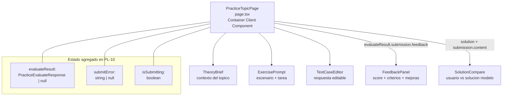
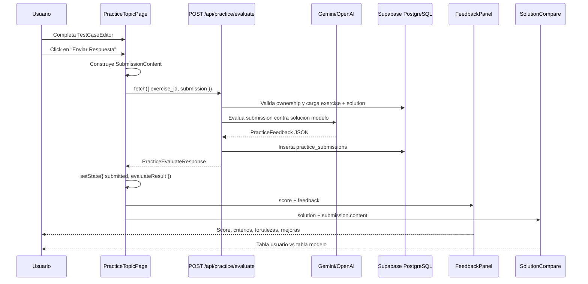

# Guía Didáctica PL-10: UI de Feedback de Práctica y Comparación con Solución

**Bloque:** QA Practice Lab  
**Guía anterior:** [PL-09 - API Route `/api/practice/evaluate`](file:///c:/Users/jsife/OneDrive/Desktop/Repositorios/practica-testing/docs/guides/fe/PL-09.md)  
**Siguiente guía:** PL-11 - Bug Report Lab: formulario y editor  
**Skill aplicado:** `istqb-fe-guide-generator`  
**Fecha:** Julio 2026

---

## Sección 1: 🎓 Introducción y Fundamentos Conceptuales

### Recapitulacion: donde estamos

En **PL-05** creaste `POST /api/practice/generate`, la API Route que genera un ejercicio practico, guarda `scenario_json` y `solution_json`, y devuelve al frontend solo el escenario que el estudiante debe resolver. En **PL-07** construiste `frontend/app/(dashboard)/practice/[topicCode]/page.tsx`, una pagina interactiva que carga el topico, genera un ejercicio y permite escribir casos de prueba en `TestCaseEditor`. En **PL-08** creaste el prompt builder `frontend/lib/prompts/practice-evaluate.ts`, responsable de pedir al LLM un `PracticeFeedback` estructurado. En **PL-09** conectaste ese prompt con `frontend/app/api/practice/evaluate/route.ts`, que valida la sesion, evalua la entrega, guarda `practice_submissions` y devuelve `PracticeEvaluateResponse`.

El ultimo eslabon del ciclo esta en la UI. El archivo real `frontend/app/(dashboard)/practice/[topicCode]/page.tsx` todavia tiene un `handleSubmit()` placeholder que construye un `SubmissionContent`, lo imprime en consola, espera 500 ms y marca `submitted: true`. Eso era correcto antes de PL-09, pero ahora ya existe una API real para evaluar.

En **PL-10** conectaras esa UI con `POST /api/practice/evaluate` y crearas dos componentes locales del Practice Lab:

| Componente | Responsabilidad |
|---|---|
| `FeedbackPanel` | Mostrar score, resumen, criterios aprobados/fallidos, fortalezas, mejoras y casos faltantes. |
| `SolutionCompare` | Comparar la respuesta del usuario contra la solucion modelo devuelta por la API. |

### Analogía profesional

Imagina que eres QA Lead en una empresa que esta formando testers junior. En PL-07 les diste una mesa de trabajo: un ejercicio realista, una tabla editable y una forma de preparar sus test cases. En PL-09 construiste la sala del evaluador senior: recibe la entrega, valida que pertenezca al estudiante correcto, compara contra la solucion de referencia y produce una revision estructurada.

Pero si el estudiante entrega su trabajo y nadie le devuelve el reporte, el proceso formativo queda roto. Es como un laboratorio de calidad donde los tecnicos ejecutan pruebas, los resultados se guardan en una base de datos, pero el panel de control nunca muestra si el lote paso o fallo. La informacion existe, pero no se convierte en aprendizaje.

`FeedbackPanel` es el informe del QA Lead: resume el desempeno, separa criterios cumplidos de criterios pendientes y convierte la evaluacion en acciones concretas. No basta con decir "70%"; el estudiante necesita saber que hizo bien, que omitio y que deberia practicar despues.

`SolutionCompare` es la revision sobre la mesa: a la izquierda esta la respuesta del estudiante y a la derecha la solucion modelo. La comparacion visual permite detectar huecos rapidamente: casos limite ausentes, datos demasiado vagos, resultados esperados poco especificos o falta de pruebas negativas. En una sesion de mentoring real, este momento es donde mas aprendizaje ocurre.

### Conceptos React y Next.js aplicados

La pagina `practice/[topicCode]/page.tsx` es un **Client Component** porque usa `useState`, `useEffect`, `useParams`, `useSearchParams` y controla inputs. PL-10 mantiene ese patron: el componente de pagina actua como **Container Component**, hace el `fetch('/api/practice/evaluate')`, guarda el resultado en estado y decide que se muestra.

Los componentes nuevos son **Presentational Components**. No consultan Supabase, no leen cookies, no llaman al LLM y no conocen rutas API. Reciben props tipadas (`PracticeFeedback`, `ExerciseSolution`, `SubmissionContent`) y renderizan UI. Esta separacion mantiene el flujo facil de testear y reutilizar para PL-11 y PL-12.

Tambien aplicaras una regla importante de seguridad frontend: las claves `GEMINI_API_KEY` y `OPENAI_API_KEY` nunca aparecen en el cliente. La pagina solo llama a una API Route interna con cookies de sesion. Todo lo sensible se mantiene en `frontend/app/api/practice/evaluate/route.ts`, que corre en servidor.

---

## Sección 2: 📋 Prerequisitos y Verificación del Entorno

Ejecuta los comandos desde la raiz del workspace en PowerShell:

```powershell
node --version
```

Salida esperada:

```text
v20.9.0 o superior
```

```powershell
npm --version
```

Salida esperada:

```text
9.0.0 o superior
```

```powershell
node -p "require('./frontend/package.json').dependencies.next"
```

Salida esperada:

```text
^16.2.7
```

```powershell
node -p "require('./frontend/package.json').dependencies.react"
```

Salida esperada:

```text
19.2.4
```

```powershell
node -p "require('./frontend/package.json').dependencies['lucide-react']"
```

Salida esperada:

```text
^1.21.0
```

### Entregables previos obligatorios

| Guia | Entregable requerido | Verificacion PowerShell | Salida esperada |
|---|---|---|---|
| PL-03 | Tipos de dominio del Practice Lab | `Test-Path -LiteralPath "frontend\types\practice.ts"` | `True` |
| PL-05 | API de generacion de ejercicios | `Test-Path -LiteralPath "frontend\app\api\practice\generate\route.ts"` | `True` |
| PL-07 | Pagina individual de practica | `Test-Path -LiteralPath "frontend\app\(dashboard)\practice\[topicCode]\page.tsx"` | `True` |
| PL-08 | Prompt builder de evaluacion | `Test-Path -LiteralPath "frontend\lib\prompts\practice-evaluate.ts"` | `True` |
| PL-09 | API de evaluacion | `Test-Path -LiteralPath "frontend\app\api\practice\evaluate\route.ts"` | `True` |

```powershell
Test-Path -LiteralPath "frontend\types\practice.ts"
Test-Path -LiteralPath "frontend\app\api\practice\generate\route.ts"
Test-Path -LiteralPath "frontend\app\(dashboard)\practice\[topicCode]\page.tsx"
Test-Path -LiteralPath "frontend\lib\prompts\practice-evaluate.ts"
Test-Path -LiteralPath "frontend\app\api\practice\evaluate\route.ts"
```

Salida esperada:

```text
True
True
True
True
True
```

### Verificacion de variables sin imprimir secretos

PL-10 no usa API keys en el cliente, pero `POST /api/practice/evaluate` necesita al menos una clave server-only configurada para que el flujo completo funcione. Verifica presencia sin mostrar valores:

```powershell
$envPath = "frontend\.env.local"
Test-Path -LiteralPath $envPath
$hasGemini = Select-String -LiteralPath $envPath -Pattern "^GEMINI_API_KEY=" -Quiet
$hasOpenAI = Select-String -LiteralPath $envPath -Pattern "^OPENAI_API_KEY=" -Quiet
"LLM key present: $($hasGemini -or $hasOpenAI)"
```

Salida esperada:

```text
True
LLM key present: True
```

### Dependency gate especifico de PL-10

Antes de empezar, confirma que `page.tsx` aun tiene el placeholder que PL-10 reemplazara:

```powershell
Select-String -LiteralPath "frontend\app\(dashboard)\practice\[topicCode]\page.tsx" -Pattern "Submission preparada|api/practice/evaluate|evaluateResult"
```

Salida esperada antes de implementar PL-10:

```text
frontend\app\(dashboard)\practice\[topicCode]\page.tsx:288:      "[practice/submit] Submission preparada:",
```

Si ya aparece `api/practice/evaluate` o `evaluateResult`, revisa si PL-10 fue implementada parcialmente antes de aplicar esta guia.

---

## Sección 3: 📂 Estructura de Directorios del Proyecto

Este arbol esta anclado al estado real del repo. Los archivos marcados como **NUEVO** son los que crearas en PL-10.

```text
practica-testing/
├── docs/
│   ├── guides/
│   │   ├── db/
│   │   │   ├── PL-01.md                         # existente - tablas Practice Lab
│   │   │   └── PL-02.md                         # existente - RLS Practice Lab
│   │   └── fe/
│   │       ├── PL-07.md                         # existente - pagina de practica
│   │       ├── PL-08.md                         # existente - prompt de evaluacion
│   │       ├── PL-09.md                         # existente - API evaluate
│   │       └── PL-10.md                         # esta guia
│   └── roadmap/
│       └── ISTQB_Guias_Implementacion.md        # existente
│
├── frontend/
│   ├── app/
│   │   ├── api/
│   │   │   ├── practice/
│   │   │   │   ├── generate/route.ts            # existente - PL-05
│   │   │   │   └── evaluate/route.ts            # existente - PL-09, NO tocar
│   │   │   ├── dashboard/metrics/route.ts       # existente - dashboard
│   │   │   ├── sessions/[id]/...                # existente - sesiones
│   │   │   ├── plan/...                         # existente - plan
│   │   │   ├── extract/route.ts                 # existente
│   │   │   └── upload/route.ts                  # existente
│   │   ├── (auth)/
│   │   │   ├── login/page.tsx                   # existente
│   │   │   └── register/page.tsx                # existente
│   │   ├── (dashboard)/
│   │   │   ├── layout.tsx                       # existente
│   │   │   ├── dashboard/page.tsx               # existente
│   │   │   ├── practice/
│   │   │   │   ├── page.tsx                     # existente - hub PL-06
│   │   │   │   ├── _components/
│   │   │   │   │   ├── practice-card.tsx        # existente
│   │   │   │   │   ├── practice-filter.tsx      # existente
│   │   │   │   │   └── topic-practice-list.tsx  # existente
│   │   │   │   └── [topicCode]/
│   │   │   │       ├── page.tsx                 # MODIFICAR - container de PL-10
│   │   │   │       └── _components/
│   │   │   │           ├── theory-brief.tsx     # existente - PL-07
│   │   │   │           ├── exercise-prompt.tsx  # existente - PL-07
│   │   │   │           ├── test-case-editor.tsx # existente - PL-07
│   │   │   │           ├── feedback-panel.tsx   # NUEVO - PL-10
│   │   │   │           └── solution-compare.tsx # NUEVO - PL-10
│   │   │   ├── plan/...                         # existente
│   │   │   ├── session/page.tsx                 # existente
│   │   │   ├── loading.tsx                      # existente
│   │   │   └── error.tsx                        # existente
│   │   ├── auth/callback/route.ts               # existente
│   │   ├── globals.css                          # existente
│   │   ├── layout.tsx                           # existente
│   │   └── page.tsx                             # existente
│   ├── components/
│   │   ├── dashboard/                           # existente - DA-02..DA-05
│   │   ├── session/                             # existente - SE-xx
│   │   │   └── feedback-panel.tsx               # existente - NO tocar, es de sesiones
│   │   └── ui/                                  # existente - shadcn/radix
│   ├── lib/
│   │   ├── prompts/
│   │   │   ├── practice-exercise.ts             # existente - PL-04
│   │   │   └── practice-evaluate.ts             # existente - PL-08
│   │   └── supabase/
│   │       ├── client.ts                        # existente
│   │       └── server.ts                        # existente
│   ├── types/
│   │   ├── practice.ts                          # existente - contrato PL
│   │   ├── database.ts                          # existente
│   │   └── index.ts                             # existente
│   └── package.json                             # existente
└── supabase/                                    # existente - migraciones DB
```

| Accion | Archivo | Motivo |
|---|---|---|
| Crear | `frontend/app/(dashboard)/practice/[topicCode]/_components/feedback-panel.tsx` | Panel visual de score y feedback estructurado. |
| Crear | `frontend/app/(dashboard)/practice/[topicCode]/_components/solution-compare.tsx` | Comparacion entre respuesta del usuario y solucion modelo. |
| Modificar | `frontend/app/(dashboard)/practice/[topicCode]/page.tsx` | Conectar `handleSubmit()` con `POST /api/practice/evaluate` y renderizar feedback. |

| Archivo que NO tocaras | Por que queda estable en PL-10 |
|---|---|
| `frontend/app/api/practice/evaluate/route.ts` | Ya fue implementado en PL-09; PL-10 solo lo consume. |
| `frontend/lib/prompts/practice-evaluate.ts` | Ya fue implementado en PL-08; no se cambia el prompt. |
| `frontend/types/practice.ts` | El contrato ya contiene `PracticeEvaluateRequest` y `PracticeEvaluateResponse`. |
| `frontend/types/database.ts` | No se requieren cambios de DB ni relaciones. |
| `components/session/feedback-panel.tsx` | Es un componente distinto del bloque de sesiones; no lo reutilices para Practice Lab. |
| `supabase/**` | No hay migraciones nuevas en PL-10. |

---

## Sección 4: 🎨 Diagrama de Arquitectura de Componentes



### Flujo Completo



### Responsabilidades por capa

| Capa | Archivo | Responsabilidad |
|---|---|---|
| UI Container | `page.tsx` | Estado, fetch, errores, render condicional. |
| UI Presentacional | `feedback-panel.tsx` | Dibujar feedback sin efectos secundarios. |
| UI Presentacional | `solution-compare.tsx` | Dibujar respuesta del usuario y solucion modelo. |
| API Route | `app/api/practice/evaluate/route.ts` | Auth, validacion, llamada LLM, persistencia. |
| Prompt | `lib/prompts/practice-evaluate.ts` | Construccion del prompt de evaluacion. |
| Tipos | `types/practice.ts` | Contratos compartidos entre UI y API. |

---

## Sección 5: 🛠️ Implementación Paso a Paso

### Paso A - Crear `FeedbackPanel`

**Archivo completo a crear:** `frontend/app/(dashboard)/practice/[topicCode]/_components/feedback-panel.tsx`

Este componente recibe `score` y `feedback`. No llama APIs, no usa estado y no importa nada server-only. Su unica responsabilidad es transformar `PracticeFeedback` en una lectura visual clara.

```tsx
"use client";

import type { ReactNode } from "react";
import {
  AlertTriangle,
  CheckCircle2,
  Lightbulb,
  ListChecks,
  TrendingUp,
  XCircle,
} from "lucide-react";
import type { PracticeFeedback } from "@/types/practice";

interface FeedbackPanelProps {
  score: number;
  feedback: PracticeFeedback;
}

type ScoreTone = "strong" | "medium" | "low";

const SCORE_TONE_STYLES: Record<ScoreTone, string> = {
  strong: "border-emerald-500/50 bg-emerald-950/40 text-emerald-300",
  medium: "border-amber-500/50 bg-amber-950/40 text-amber-300",
  low: "border-rose-500/50 bg-rose-950/40 text-rose-300",
};

function getScoreTone(score: number): ScoreTone {
  if (score >= 80) return "strong";
  if (score >= 60) return "medium";
  return "low";
}

function normalizeScore(score: number): number {
  if (!Number.isFinite(score)) return 0;
  return Math.min(100, Math.max(0, Math.round(score)));
}

function ScoreBadge({ score }: { score: number }) {
  const safeScore = normalizeScore(score);
  const tone = getScoreTone(safeScore);

  return (
    <div
      className={`inline-flex items-baseline gap-1 rounded-xl border px-4 py-2 ${SCORE_TONE_STYLES[tone]}`}
    >
      <span className="text-3xl font-black tracking-tight">{safeScore}</span>
      <span className="text-sm font-bold">%</span>
    </div>
  );
}

export function FeedbackPanel({ score, feedback }: FeedbackPanelProps) {
  const criteriaResults = feedback.criteria_results ?? [];
  const strengths = feedback.strengths ?? [];
  const improvements = feedback.improvements ?? [];
  const missingCases = feedback.missing_cases ?? [];
  const passed = criteriaResults.filter((criterion) => criterion.passed).length;
  const total = criteriaResults.length;

  return (
    <section className="rounded-xl border border-slate-800 bg-slate-900/60 p-5 shadow-lg shadow-black/10">
      <div className="flex flex-col gap-4 sm:flex-row sm:items-start sm:justify-between">
        <div>
          <div className="mb-2 flex items-center gap-2">
            <ListChecks className="size-4 text-brand-400" />
            <h2 className="text-base font-semibold text-white">
              Resultado de la evaluacion
            </h2>
          </div>
          <p className="max-w-3xl text-sm leading-relaxed text-slate-300">
            {feedback.feedback_summary ||
              "La evaluacion no incluyo un resumen textual."}
          </p>
        </div>
        <ScoreBadge score={score} />
      </div>

      <div className="mt-5 rounded-lg border border-slate-800 bg-slate-950/40 p-4">
        <h3 className="mb-3 text-xs font-semibold uppercase tracking-wider text-slate-400">
          Criterios evaluados ({passed}/{total})
        </h3>

        {criteriaResults.length > 0 ? (
          <ul className="flex flex-col gap-2">
            {criteriaResults.map((criterion, index) => (
              <li
                key={`${criterion.criterion}-${index}`}
                className={`flex items-start gap-3 rounded-lg border p-3 text-sm ${
                  criterion.passed
                    ? "border-emerald-900/40 bg-emerald-950/20"
                    : "border-rose-900/40 bg-rose-950/20"
                }`}
              >
                {criterion.passed ? (
                  <CheckCircle2 className="mt-0.5 size-4 shrink-0 text-emerald-400" />
                ) : (
                  <XCircle className="mt-0.5 size-4 shrink-0 text-rose-400" />
                )}
                <div>
                  <p
                    className={`font-medium ${
                      criterion.passed ? "text-emerald-300" : "text-rose-300"
                    }`}
                  >
                    {criterion.criterion}
                  </p>
                  <p className="mt-1 leading-relaxed text-slate-400">
                    {criterion.detail}
                  </p>
                </div>
              </li>
            ))}
          </ul>
        ) : (
          <p className="text-sm text-slate-500">
            La API no devolvio criterios individuales. Revisa la respuesta en
            DevTools antes de ajustar el prompt.
          </p>
        )}
      </div>

      <div className="mt-5 grid gap-4 lg:grid-cols-3">
        <FeedbackList
          icon={<TrendingUp className="size-4 text-emerald-400" />}
          title="Fortalezas"
          emptyText="No se registraron fortalezas especificas."
          items={strengths}
          markerClassName="text-emerald-400"
        />
        <FeedbackList
          icon={<Lightbulb className="size-4 text-amber-400" />}
          title="Areas de mejora"
          emptyText="No se registraron mejoras especificas."
          items={improvements}
          markerClassName="text-amber-400"
        />
        <FeedbackList
          icon={<AlertTriangle className="size-4 text-rose-400" />}
          title="Casos faltantes"
          emptyText="No se reportaron casos faltantes."
          items={missingCases}
          markerClassName="text-rose-400"
        />
      </div>
    </section>
  );
}

interface FeedbackListProps {
  icon: ReactNode;
  title: string;
  emptyText: string;
  items: string[];
  markerClassName: string;
}

function FeedbackList({
  icon,
  title,
  emptyText,
  items,
  markerClassName,
}: FeedbackListProps) {
  return (
    <div className="rounded-lg border border-slate-800 bg-slate-950/30 p-4">
      <div className="mb-3 flex items-center gap-2">
        {icon}
        <h3 className="text-xs font-semibold uppercase tracking-wider text-slate-300">
          {title}
        </h3>
      </div>

      {items.length > 0 ? (
        <ul className="flex flex-col gap-2">
          {items.map((item, index) => (
            <li key={`${title}-${index}`} className="flex items-start gap-2 text-sm text-slate-300">
              <span className={`mt-1 ${markerClassName}`}>•</span>
              <span className="leading-relaxed">{item}</span>
            </li>
          ))}
        </ul>
      ) : (
        <p className="text-sm text-slate-500">{emptyText}</p>
      )}
    </div>
  );
}
```

**Estrategia de estilos:** el color del score se decide con `SCORE_TONE_STYLES`, un mapa de clases estaticas. Esto evita clases dinamicas tipo `text-${color}-400`, que Tailwind no puede detectar sin safelist.

**Entregable del Paso A:** `frontend/app/(dashboard)/practice/[topicCode]/_components/feedback-panel.tsx` creado.

---

### Paso B - Crear `SolutionCompare`

**Archivo completo a crear:** `frontend/app/(dashboard)/practice/[topicCode]/_components/solution-compare.tsx`

Este componente si compara de verdad. Recibe la `solution` devuelta por la API y tambien la `submission` guardada. Para `test_cases`, renderiza dos tablas: la respuesta del usuario y la solucion modelo.

```tsx
"use client";

import type { ReactNode } from "react";
import { BookOpen, ClipboardCheck, UserRoundCheck } from "lucide-react";
import type { ExerciseSolution, SubmissionContent, TestCaseRow } from "@/types/practice";

interface SolutionCompareProps {
  solution: ExerciseSolution;
  submission: SubmissionContent;
}

type TableTone = "user" | "model";

const TEST_CASE_TYPES = ["positive", "negative", "boundary"] as const;

const TYPE_STYLES: Record<TestCaseRow["type"], string> = {
  positive: "bg-emerald-950/50 text-emerald-300 border-emerald-900/50",
  negative: "bg-rose-950/50 text-rose-300 border-rose-900/50",
  boundary: "bg-amber-950/50 text-amber-300 border-amber-900/50",
};

const TABLE_TONE_STYLES: Record<TableTone, string> = {
  user: "border-slate-800 bg-slate-950/30",
  model: "border-brand-800/50 bg-brand-950/20",
};

function isRecord(value: unknown): value is Record<string, unknown> {
  return typeof value === "object" && value !== null && !Array.isArray(value);
}

function isTestCaseType(value: unknown): value is TestCaseRow["type"] {
  return (
    typeof value === "string" &&
    TEST_CASE_TYPES.includes(value as TestCaseRow["type"])
  );
}

function isTestCaseRow(value: unknown): value is TestCaseRow {
  return (
    isRecord(value) &&
    typeof value.id === "string" &&
    typeof value.scenario === "string" &&
    typeof value.test_data === "string" &&
    typeof value.expected_result === "string" &&
    isTestCaseType(value.type)
  );
}

function isTestCaseArray(value: unknown): value is TestCaseRow[] {
  return Array.isArray(value) && value.every(isTestCaseRow);
}

function getModelTestCases(solution: ExerciseSolution): TestCaseRow[] {
  const candidate = solution.model_answer.test_cases;
  return isTestCaseArray(candidate) ? candidate : [];
}

function getUserTestCases(submission: SubmissionContent): TestCaseRow[] {
  return submission.type === "test_cases" ? submission.test_cases : [];
}

export function SolutionCompare({ solution, submission }: SolutionCompareProps) {
  const userTestCases = getUserTestCases(submission);
  const modelTestCases = getModelTestCases(solution);

  return (
    <section className="rounded-xl border border-brand-800/50 bg-brand-950/20 p-5 shadow-lg shadow-black/10">
      <div className="mb-4 flex items-start gap-3">
        <BookOpen className="mt-0.5 size-5 text-brand-400" />
        <div>
          <h2 className="text-base font-semibold text-white">
            Comparacion con la solucion modelo
          </h2>
          <p className="mt-1 text-sm leading-relaxed text-slate-300">
            {solution.explanation ||
              "La API no devolvio una explicacion textual de la solucion."}
          </p>
        </div>
      </div>

      <div className="grid gap-4 xl:grid-cols-2">
        <TestCaseTable
          icon={<UserRoundCheck className="size-4 text-slate-300" />}
          title="Tu respuesta"
          rows={userTestCases}
          emptyText="No hay test cases del usuario para comparar."
          tone="user"
        />
        <TestCaseTable
          icon={<ClipboardCheck className="size-4 text-brand-300" />}
          title="Solucion modelo"
          rows={modelTestCases}
          emptyText="La solucion modelo no incluyo una tabla de test cases."
          tone="model"
        />
      </div>

      {solution.key_points.length > 0 && (
        <div className="mt-5 rounded-lg border border-slate-800 bg-slate-950/30 p-4">
          <h3 className="mb-3 text-xs font-semibold uppercase tracking-wider text-slate-300">
            Puntos clave que debias identificar
          </h3>
          <ul className="grid gap-2 md:grid-cols-2">
            {solution.key_points.map((point, index) => (
              <li key={`${point}-${index}`} className="flex items-start gap-2 text-sm text-slate-300">
                <span className="mt-1 text-brand-400">•</span>
                <span className="leading-relaxed">{point}</span>
              </li>
            ))}
          </ul>
        </div>
      )}
    </section>
  );
}

interface TestCaseTableProps {
  icon: ReactNode;
  title: string;
  rows: TestCaseRow[];
  emptyText: string;
  tone: TableTone;
}

function TestCaseTable({ icon, title, rows, emptyText, tone }: TestCaseTableProps) {
  return (
    <div className={`rounded-lg border p-4 ${TABLE_TONE_STYLES[tone]}`}>
      <div className="mb-3 flex items-center justify-between gap-2">
        <div className="flex items-center gap-2">
          {icon}
          <h3 className="text-sm font-semibold text-white">{title}</h3>
        </div>
        <span className="rounded-full bg-slate-800 px-2 py-0.5 text-xs font-medium text-slate-400">
          {rows.length} casos
        </span>
      </div>

      {rows.length > 0 ? (
        <div className="overflow-x-auto rounded-lg border border-slate-800">
          <table className="w-full min-w-[720px] text-xs">
            <thead>
              <tr className="border-b border-slate-800 bg-slate-900/80">
                <th className="w-20 px-3 py-2 text-left font-medium text-slate-400">ID</th>
                <th className="px-3 py-2 text-left font-medium text-slate-400">Escenario</th>
                <th className="px-3 py-2 text-left font-medium text-slate-400">Dato</th>
                <th className="px-3 py-2 text-left font-medium text-slate-400">Resultado esperado</th>
                <th className="w-24 px-3 py-2 text-left font-medium text-slate-400">Tipo</th>
              </tr>
            </thead>
            <tbody>
              {rows.map((row, index) => (
                <tr
                  key={`${row.id}-${index}`}
                  className="border-b border-slate-800/50 last:border-0 hover:bg-slate-800/30"
                >
                  <td className="px-3 py-2 font-mono text-slate-500">{row.id}</td>
                  <td className="px-3 py-2 text-slate-300">{row.scenario}</td>
                  <td className="px-3 py-2 text-slate-400">{row.test_data}</td>
                  <td className="px-3 py-2 text-slate-300">{row.expected_result}</td>
                  <td className="px-3 py-2">
                    <span className={`rounded border px-1.5 py-0.5 text-[10px] font-medium ${TYPE_STYLES[row.type]}`}>
                      {row.type}
                    </span>
                  </td>
                </tr>
              ))}
            </tbody>
          </table>
        </div>
      ) : (
        <p className="rounded-lg border border-slate-800 bg-slate-950/40 p-4 text-sm text-slate-500">
          {emptyText}
        </p>
      )}
    </div>
  );
}
```

**Por que este componente recibe `submission`:** si solo recibe `solution`, no puede comparar. PL-10 necesita mostrar lo que el usuario envio (`PracticeEvaluateResponse.submission.content`) junto a lo que la IA considera solucion modelo (`PracticeEvaluateResponse.solution`).

**Entregable del Paso B:** `frontend/app/(dashboard)/practice/[topicCode]/_components/solution-compare.tsx` creado.

---

### Paso C - Modificar imports y estado en `page.tsx`

**Archivo a modificar:** `frontend/app/(dashboard)/practice/[topicCode]/page.tsx`

Busca el bloque de imports actual. Hoy existe este import de iconos:

```tsx
import { ArrowLeft, Sparkles, Send, Loader2, CheckCircle2 } from "lucide-react";
```

Reemplazalo por:

```tsx
import {
  AlertCircle,
  ArrowLeft,
  CheckCircle2,
  Loader2,
  Send,
  Sparkles,
} from "lucide-react";
```

Busca el import actual de tipos de `@/types/practice` y agrega `PracticeEvaluateRequest` y `PracticeEvaluateResponse`:

```tsx
import type {
  PracticeEvaluateRequest,
  PracticeEvaluateResponse,
  PracticeExercise,
  PracticeExerciseType,
  SubmissionContent,
  TestCaseRow,
} from "@/types/practice";
```

Debajo de los imports existentes de componentes locales agrega:

```tsx
import { FeedbackPanel } from "./_components/feedback-panel";
import { SolutionCompare } from "./_components/solution-compare";
```

Busca `interface PageState` y agregale `submitError` y `evaluateResult`:

```tsx
interface PageState {
  isLoadingTopic: boolean;
  topicError: string | null;
  topic: TopicData | null;
  isGenerating: boolean;
  generateError: string | null;
  exercise: PracticeExercise | null;
  testCaseRows: TestCaseRow[];
  isSubmitting: boolean;
  submitted: boolean;
  submitError: string | null;
  evaluateResult: PracticeEvaluateResponse | null;
}
```

En el `useState<PageState>` inicial, agrega los valores nuevos:

```tsx
const [state, setState] = useState<PageState>({
  isLoadingTopic: true,
  topicError: null,
  topic: null,
  isGenerating: false,
  generateError: null,
  exercise: null,
  testCaseRows: [],
  isSubmitting: false,
  submitted: false,
  submitError: null,
  evaluateResult: null,
});
```

**Entregable del Paso C:** `page.tsx` ya compila con los tipos nuevos, aunque todavia no uses los componentes.

---

### Paso D - Limpiar evaluacion previa al generar otro ejercicio

En `handleGenerateExercise()`, busca este bloque real:

```tsx
setState((prev) => ({
  ...prev,
  isGenerating: true,
  generateError: null,
  exercise: null,
  testCaseRows: [],
  submitted: false,
}));
```

Reemplazalo por:

```tsx
setState((prev) => ({
  ...prev,
  isGenerating: true,
  generateError: null,
  submitError: null,
  exercise: null,
  testCaseRows: [],
  submitted: false,
  evaluateResult: null,
}));
```

**Por que:** si el usuario evalua un ejercicio y luego genera otro, no debe quedar visible el feedback anterior. El reset mantiene la UI coherente.

**Entregable del Paso D:** al generar un nuevo ejercicio, se limpia `submitError` y `evaluateResult`.

---

### Paso E - Reemplazar `handleSubmit()` placeholder

En `page.tsx`, busca el comentario real:

```tsx
// HANDLER: Enviar respuesta (placeholder para PL-09)
```

Actualiza el comentario para que refleje PL-10:

```tsx
// HANDLER: Enviar respuesta a la API de evaluacion
```

Luego reemplaza la funcion `handleSubmit()` completa por esta version:

```tsx
async function handleSubmit() {
  if (!state.exercise || state.testCaseRows.length === 0) return;

  setState((prev) => ({
    ...prev,
    isSubmitting: true,
    submitError: null,
  }));

  const submissionContent: SubmissionContent = {
    type: "test_cases",
    test_cases: state.testCaseRows,
  };

  const requestBody: PracticeEvaluateRequest = {
    exercise_id: state.exercise.id,
    submission: submissionContent,
  };

  try {
    const response = await fetch("/api/practice/evaluate", {
      method: "POST",
      headers: { "Content-Type": "application/json" },
      body: JSON.stringify(requestBody),
    });

    if (!response.ok) {
      const errorData = await response
        .json()
        .catch(() => ({ error: "Error desconocido al evaluar." }));

      throw new Error(
        typeof errorData.error === "string"
          ? errorData.error
          : `Error ${response.status}: ${response.statusText}`,
      );
    }

    const data = (await response.json()) as PracticeEvaluateResponse;

    if (!data.submission.feedback) {
      throw new Error(
        "La API devolvio una evaluacion sin feedback. Revisa PL-09.",
      );
    }

    setState((prev) => ({
      ...prev,
      isSubmitting: false,
      submitted: true,
      submitError: null,
      evaluateResult: data,
    }));
  } catch (err) {
    const message =
      err instanceof Error ? err.message : "Error al evaluar la respuesta.";

    setState((prev) => ({
      ...prev,
      isSubmitting: false,
      submitted: false,
      submitError: message,
    }));

    console.error("[practice/evaluate] Error:", err);
  }
}
```

**Detalles importantes:**

| Decision | Motivo |
|---|---|
| `requestBody: PracticeEvaluateRequest` | Fuerza que el body coincida con el contrato de PL-09. |
| `submitError` | Permite reintentar sin recargar la pagina. |
| `!data.submission.feedback` | Evita renderizar `feedback!` si el backend devolvio un payload incompleto. |
| `submitted: true` solo en exito | Previene bloquear el boton si la API falla. |

**Entregable del Paso E:** `handleSubmit()` ya consume `POST /api/practice/evaluate`.

---

### Paso F - Mostrar error, feedback y comparacion

Primero, dentro del bloque de botones, busca el texto actual:

```tsx
Respuesta preparada
```

Cambialo por:

```tsx
Respuesta evaluada
```

Luego busca el bloque real que empieza con:

```tsx
{/* Nota sobre PL-09 */}
{state.submitted && (
```

Ese bloque completo muestra el mensaje placeholder de que la evaluacion se implementara despues. Reemplazalo por:

```tsx
{/* Error de evaluacion */}
{state.submitError && (
  <div className="rounded-lg border border-red-900/50 bg-red-950/30 p-4">
    <div className="flex items-start gap-2">
      <AlertCircle className="mt-0.5 size-4 shrink-0 text-red-400" />
      <div>
        <p className="text-sm font-medium text-red-300">
          No se pudo evaluar tu respuesta
        </p>
        <p className="mt-1 text-xs leading-relaxed text-red-200/80">
          {state.submitError}
        </p>
      </div>
    </div>
  </div>
)}

{/* Feedback post-evaluacion */}
{state.evaluateResult?.submission.feedback && (
  <>
    <FeedbackPanel
      score={state.evaluateResult.submission.score_percent ?? 0}
      feedback={state.evaluateResult.submission.feedback}
    />
    <SolutionCompare
      solution={state.evaluateResult.solution}
      submission={state.evaluateResult.submission.content}
    />

    <div className="flex justify-center pt-2">
      <button
        onClick={handleGenerateExercise}
        disabled={state.isGenerating || state.isSubmitting}
        className="
          flex items-center gap-2 rounded-lg px-5 py-2.5
          bg-slate-800 text-sm font-semibold text-slate-300
          transition-colors hover:bg-slate-700 hover:text-white
          disabled:cursor-not-allowed disabled:opacity-50
          cursor-pointer
        "
      >
        <Sparkles className="size-4" />
        Practicar de nuevo
      </button>
    </div>
  </>
)}
```

**Entregable del Paso F:** la pagina muestra error recuperable, feedback estructurado y comparacion real despues de evaluar.

---

### Paso G - Verificar que no cambiaste contratos compartidos

PL-10 es UI. No debe modificar API Routes, prompts ni tipos compartidos.

```powershell
git diff -- frontend/app/api/practice/evaluate/route.ts frontend/lib/prompts/practice-evaluate.ts frontend/types/practice.ts frontend/types/database.ts
```

Salida esperada:

```text

```

Una salida vacia significa que esos contratos quedaron intactos.

**Entregable del Paso G:** solo hay cambios en `page.tsx` y en los dos componentes locales nuevos.

---

## Sección 6: ✅ Checkpoints de Verificación

### Checkpoint 1 - Archivos nuevos existen

```powershell
Test-Path -LiteralPath "frontend\app\(dashboard)\practice\[topicCode]\_components\feedback-panel.tsx"
Test-Path -LiteralPath "frontend\app\(dashboard)\practice\[topicCode]\_components\solution-compare.tsx"
```

Salida esperada:

```text
True
True
```

### Checkpoint 2 - Los componentes exportan los nombres esperados

```powershell
Select-String -LiteralPath "frontend\app\(dashboard)\practice\[topicCode]\_components\feedback-panel.tsx" -Pattern "export function FeedbackPanel"
Select-String -LiteralPath "frontend\app\(dashboard)\practice\[topicCode]\_components\solution-compare.tsx" -Pattern "export function SolutionCompare"
```

Salida esperada:

```text
frontend\app\(dashboard)\practice\[topicCode]\_components\feedback-panel.tsx:...:export function FeedbackPanel({ score, feedback }: FeedbackPanelProps) {
frontend\app\(dashboard)\practice\[topicCode]\_components\solution-compare.tsx:...:export function SolutionCompare({ solution, submission }: SolutionCompareProps) {
```

### Checkpoint 3 - `page.tsx` consume la API real

```powershell
Select-String -LiteralPath "frontend\app\(dashboard)\practice\[topicCode]\page.tsx" -Pattern "api/practice/evaluate|evaluateResult|submitError|FeedbackPanel|SolutionCompare"
```

Salida esperada:

```text
Debe mostrar multiples lineas: imports, estado, fetch, render de FeedbackPanel y render de SolutionCompare.
```

### Checkpoint 4 - TypeScript compila

```powershell
npx tsc --noEmit --project frontend/tsconfig.json
```

Salida esperada:

```text
(sin output = sin errores de TypeScript)
```

### Checkpoint 5 - Build de Next.js

```powershell
npm --prefix frontend run build
```

Salida esperada:

```text
> frontend@0.1.0 build
> next build

✓ Compiled successfully
```

Si aparece un warning conocido de middleware o telemetria de Next.js pero el build termina exitosamente, no bloquea PL-10. Si aparece `Failed to compile`, corrige el archivo y linea indicados.

### Checkpoint 6 - Ejecutar en local

```powershell
npm --prefix frontend run dev
```

Salida esperada:

```text
> frontend@0.1.0 dev
> next dev

Local:        http://localhost:3000
```

Abre una ruta de practica con `document_id`, por ejemplo:

```text
http://localhost:3000/practice/FL-4.2.1?document_id=UUID_DEL_DOCUMENTO
```

### Verificacion visual exacta

| Accion | Lo que deberias ver |
|---|---|
| Entrar a la pagina | Header `Practica: FL-x.x.x`, `TheoryBrief` y laboratorio contextual K1/K2/K3 para `test_cases`. |
| Generar ejercicio `test_cases` | `ExercisePrompt`, `TestCaseEditor`, boton `Generar otro ejercicio` y boton `Enviar Respuesta`. |
| Completar filas minimas | El boton `Enviar Respuesta` se habilita. |
| Click en enviar | El boton muestra spinner `Enviando...` y queda deshabilitado. |
| Evaluacion exitosa | Aparece `Resultado de la evaluacion` con score, criterios, fortalezas, mejoras y casos faltantes. |
| Comparacion | Aparece `Comparacion con la solucion modelo` con tabla `Tu respuesta` y tabla `Solucion modelo`. |
| Reintentar | Boton `Practicar de nuevo` genera otro ejercicio y limpia el feedback anterior. |

### Verificacion responsive

| Breakpoint | Comportamiento esperado |
|---|---|
| Mobile menor a 640px | Header y score se apilan; tablas tienen scroll horizontal. |
| Tablet 768px | Listas de feedback mantienen buena separacion vertical. |
| Desktop 1280px | `SolutionCompare` muestra las dos tablas en dos columnas. |

### Edge cases obligatorios

| Escenario | Resultado esperado |
|---|---|
| API retorna 401 | `submitError` muestra mensaje recuperable; el boton permite reintentar tras corregir sesion. |
| API retorna 409 por submission duplicada | Se muestra error y el usuario puede generar otro ejercicio. |
| API retorna 502/504 por LLM | Se muestra error sin marcar `submitted: true`. |
| `feedback.criteria_results` vacio | `FeedbackPanel` no crashea y muestra mensaje de diagnostico. |
| `solution.model_answer.test_cases` ausente | `SolutionCompare` muestra explicacion/key points y tabla modelo vacia. |
| Pantalla mobile | No se rompe layout; tablas usan `overflow-x-auto`. |

### Checklist de entregables

- [x] `feedback-panel.tsx` creado con `FeedbackPanel` exportado.
- [x] `solution-compare.tsx` creado con `SolutionCompare` exportado.
- [x] `page.tsx` importa `PracticeEvaluateRequest` y `PracticeEvaluateResponse`.
- [x] `PageState` incluye `submitError` y `evaluateResult`.
- [x] `handleGenerateExercise()` limpia resultados anteriores.
- [x] `handleSubmit()` llama `POST /api/practice/evaluate`.
- [x] La UI muestra errores de evaluacion sin bloquear reintentos.
- [x] La UI muestra feedback y comparacion despues de evaluar.
- [x] `npx tsc --noEmit --project frontend/tsconfig.json` pasa.
- [x] `npm --prefix frontend run build` pasa.

### Resultados de Validacion Ejecutada (12 julio 2026)

| Prueba | Resultado real |
|---|---|
| Tópico K1 `FL-1.1.1` | ✅ Se mostró `Laboratorio K1: Identificación de conceptos` y se envió `level_k: "K1"` con `exercise_type: "test_cases"`. |
| Generación autenticada | ✅ `POST /api/practice/generate` respondió `200`. Los candidatos Gemini 3.1/3 Pro recibieron `429` y `gemini-3.5-flash` generó un ejercicio válido. |
| Evaluación autenticada | ✅ `POST /api/practice/evaluate` respondió `200` con score `33`. |
| Reintento de contenido | ✅ El primer JSON de `gemini-3.5-flash` fue inválido; el segundo intento del mismo candidato devolvió feedback válido. |
| Build y tipos | ✅ `tsc --noEmit` y `next build` terminaron correctamente. |

La comprobación responsive de mobile, tablet y desktop queda como verificación visual manual no bloqueante antes de producción.

---

## Sección 7: 🚨 Troubleshooting — Problemas Comunes

| Problema | Causa probable | Solucion |
|---|---|---|
| `Module not found: Can't resolve './_components/feedback-panel'` | El archivo fue creado en otra carpeta o con nombre distinto. | Verifica `Test-Path -LiteralPath "frontend\app\(dashboard)\practice\[topicCode]\_components\feedback-panel.tsx"`. |
| `Property 'feedback' is possibly 'null'` | `PracticeSubmission.feedback` es nullable en `types/practice.ts`. | Renderiza `FeedbackPanel` solo con `state.evaluateResult?.submission.feedback` como guard. |
| `Type '{ solution: ExerciseSolution; }' is missing property 'submission'` | `SolutionCompare` ahora necesita comparar usuario vs modelo. | Pasa tambien `submission={state.evaluateResult.submission.content}`. |
| `Este ejercicio ya fue enviado` | PL-09 evita submissions duplicadas para el mismo ejercicio. | Usa `Practicar de nuevo` para generar otro ejercicio y crear otro intento. |
| `No hay API key de LLM configurada` | Falta `GEMINI_API_KEY` u `OPENAI_API_KEY` en `frontend/.env.local`. | Configura una clave server-only. No uses `NEXT_PUBLIC_` para estas keys. |
| `Hydration failed` | Se renderizo logica no deterministica durante el render inicial. | No uses `Date.now()` ni `Math.random()` en los componentes de PL-10; estos snippets no los usan. |
| La tabla modelo aparece vacia | `solution.model_answer` no contiene `test_cases` con forma `TestCaseRow[]`. | Revisa DevTools > Network > `/api/practice/evaluate` y confirma el JSON devuelto por PL-09. |
| El boton queda deshabilitado tras error | `submitted` se puso en `true` dentro del `catch`. | En el `catch`, manten `submitted: false` e `isSubmitting: false`. |

---

## Sección 8: 📝 Resumen y Próximo Paso

En PL-10 completaste el ciclo completo del Practice Lab para `test_cases`:

1. Creaste `FeedbackPanel` para transformar `PracticeFeedback` en feedback visual accionable.
2. Creaste `SolutionCompare` para mostrar respuesta del usuario vs solucion modelo.
3. Reemplazaste el placeholder de `handleSubmit()` por un `fetch` real a `POST /api/practice/evaluate`.
4. Agregaste `submitError` y `evaluateResult` al estado de la pagina.
5. Evitaste exponer claves LLM en el cliente.
6. Consumiste el contrato corregido de `types/practice.ts`, `practice-exercise.ts` y `generate/route.ts` sin volver a modificarlo en PL-10.
7. Validaste TypeScript, build y comportamiento visual.

Estado despues de PL-10:

```text
Generar ejercicio
  -> Completar TestCaseEditor
  -> Enviar respuesta
  -> POST /api/practice/evaluate
  -> Guardar submission
  -> Mostrar feedback
  -> Comparar con solucion modelo
```

Para validar tu progreso con el agente, usa:

```text
Valida mi progreso de la guia PL-10 en su seccion 6
```

La siguiente guia, **PL-11**, reutilizara este patron para construir el **Bug Report Lab**: formulario estructurado de defectos, validacion de campos y feedback con el mismo ciclo de evaluacion.

---

## Addendum Correctivo Obligatorio: Gate de Contrato Antes de Implementar

PL-10 es la primera guía que muestra la solución modelo en pantalla. Antes de crear `SolutionCompare`, aplica los addenda correctivos de **PL-03**, **PL-04** y **PL-05**. Esta guía no vuelve a modificar esos contratos; sólo los consume.

### Paso A - Confirmar el contrato fuente

```powershell
Select-String -LiteralPath "frontend\types\practice.ts" -Pattern "TestCaseReferenceAnswer|interface ExerciseSolution<TModelAnswer"
Select-String -LiteralPath "frontend\lib\prompts\practice-exercise.ts" -Pattern "REFERENCE_SOLUTION_FORMATS|test_cases"
Select-String -LiteralPath "frontend\app\api\practice\generate\route.ts" -Pattern "validateTestCaseReferenceAnswer|model_answer.test_cases"
```

Salida esperada:

```text
Los tres comandos devuelven coincidencias. Si uno no las devuelve, detente y completa el addendum correspondiente antes de PL-10.
```

### Paso B - Usar sólo ejercicios nuevos para validar la comparación

Los ejercicios `test_cases` creados antes de este addendum pueden tener `model_answer.description/items`. No son compatibles con la tabla de `SolutionCompare` y no se deben adaptar desde el navegador.

1. Genera un ejercicio nuevo de tipo `test_cases` después de aplicar el addendum PL-05.
2. Completa y evalúa la entrega con el flujo de esta guía.
3. En DevTools, confirma que `POST /api/practice/evaluate` devuelve `solution.model_answer.test_cases`.
4. Confirma visualmente que la tabla **Solución modelo** tiene una o más filas, no el mensaje de estado vacío.

### Criterio de salida actualizado

No des por completada PL-10 si la evaluación funciona pero la tabla modelo está vacía. Ese síntoma indica que el ejercicio fue creado con el contrato anterior o que PL-05 no aplicó su validación correctiva.

---

## Addendum Correctivo Obligatorio: Inicio de Práctica Adaptado a K1, K2 y K3

La verificación visual original de PL-10 menciona un selector de tipo de ejercicio. Ese selector pertenecía al estado adelantado de PL-07 y no debe seguir visible: `bug_report` y `api_testing` aún no tienen editores en esta ruta.

El comportamiento correcto hasta PL-10 es:

| Nivel K | Título visible | Acción visible | Tipo técnico enviado |
|---|---|---|---|
| K1 | `Laboratorio K1: Identificación de conceptos` | `Generar practica guiada` | `test_cases` |
| K2 | `Laboratorio K2: Análisis de escenarios` | `Generar practica de analisis` | `test_cases` |
| K3 | `Laboratorio K3: Diseño de casos de prueba` | `Generar casos de prueba` | `test_cases` |

`level_k` llega a `POST /api/practice/generate` junto con `exercise_type: "test_cases"`. El prompt de PL-04, mediante `LEVEL_K_TASK_DESCRIPTIONS`, adapta el objetivo de reconocimiento (K1), análisis (K2) o creación (K3). El flujo de PL-09 y PL-10 se conserva para los tres niveles.

### Verificación visual actualizada

1. Abre un tópico K1 como `FL-1.1.1`: debe aparecer `Generar practica guiada`, no un mensaje de bloqueo.
2. Abre un tópico K2: debe aparecer `Generar practica de analisis`.
3. Abre un tópico K3 como `FL-4.2.1`: debe aparecer `Generar casos de prueba`.
4. En los tres casos, DevTools debe mostrar `exercise_type: "test_cases"` y el `level_k` propio del tópico.
5. Después de evaluar, deben aparecer `FeedbackPanel` y `SolutionCompare` sin importar el nivel K.

No habilites botones de Bug Report, API Testing o Exploratorio en `/practice/[topicCode]` hasta que sus rutas y editores dedicados se implementen en PL-11 y PL-12.
