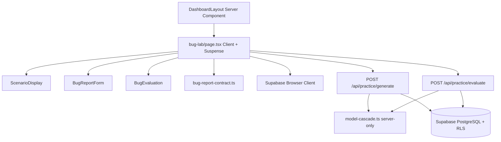
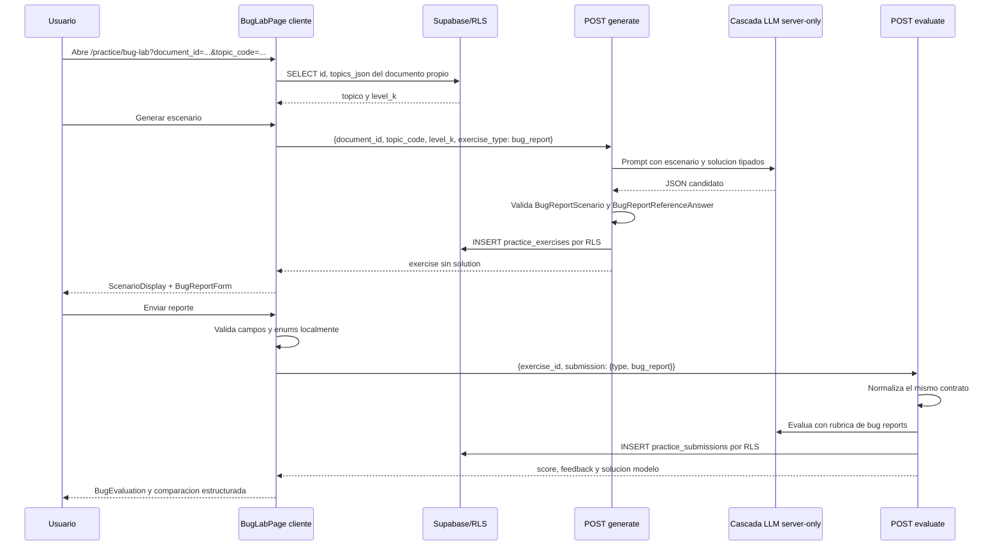

# Guia Didactica PL-11: Bug Report Lab

**Bloque:** H - QA Practice Lab  
**Objetivo:** construir `/practice/bug-lab`, donde el estudiante redacta y evalua un bug report profesional a partir de un escenario generado.  
**Dependencias:** PL-03, PL-04, PL-05, PL-06, PL-08, PL-09 y PL-10.  
**Estado:** Implementado y verificado (12/07/2026). La rehidratación correctiva fue comprobada antes y después de enviar el ejercicio.

---

## Sección 1: 🎓 Introducción y Fundamentos Conceptuales

PL-10 cerro el ciclo de `test_cases`: generar, redactar, evaluar y comparar con una solucion modelo. PL-11 reutiliza las mismas rutas protegidas (`/api/practice/generate` y `/api/practice/evaluate`), pero cambia el artefacto que produce el estudiante: ahora debe comunicar un defecto de forma accionable para desarrollo, producto y soporte.

Un bug report no es una opinion como "el login falla". Es evidencia reproducible: contexto, precondiciones, pasos atomicos, resultado actual, resultado esperado e impacto. La UI debe conservar esa estructura desde el formulario hasta el JSONB persistido, sin sustituir campos faltantes por valores inventados.

### Analogía profesional

Un bug report se parece a la ficha de incidencia que recibe una brigada de mantenimiento de aviacion. Decir "el avion tuvo un problema" no permite que nadie lo repare. La ficha debe indicar la aeronave, condiciones previas, secuencia exacta, comportamiento observado y comportamiento esperado. De lo contrario, el equipo no puede reproducir el fallo ni priorizarlo con seguridad.

El formulario de PL-11 es esa ficha de mantenimiento. Cada control obliga a separar hechos observables de interpretaciones: los pasos describen acciones, el resultado actual describe lo ocurrido y el esperado define la regla que se incumplio. Severidad y prioridad no son adornos; permiten comunicar impacto tecnico y urgencia de negocio de manera independiente.

La ruta de generacion es el instructor que prepara un caso de averia, y la ruta de evaluacion es el revisor que contrasta la ficha del estudiante con una rubrica. La interfaz no debe intentar corregir silenciosamente una ficha incompleta: debe explicitar el problema antes de enviarla, mientras que el servidor vuelve a validarla antes de persistirla.

Por ultimo, una solucion modelo es como el informe de cierre de mantenimiento. Solo se revela despues de evaluar la entrega. Asi el estudiante practica primero su criterio profesional y luego puede comparar su reporte con una referencia validada.

### Contrato que se debe reconciliar antes de la UI

El contrato actual admite `bug_report`, pero tiene tres huecos que bloquearian una interfaz fiel al roadmap:

| Salto | Estado actual | Correccion obligatoria |
|---|---|---|
| Prompt -> escenario | Solo pide `scenario` generico. | Exigir `user_story`, `business_rule` y `observed_bug` para `bug_report`. |
| Formulario -> submission | `BugReportData` no contiene evidencia. | Agregar `evidence?: string` y preservarla en la normalizacion. |
| Evaluacion -> UI | La solucion modelo de bug no se valida de forma estricta. | Validar escenario y `model_answer` antes de persistir; rechazar legacy o enum invalido. |

Los addenda de PL-03, PL-04, PL-05, PL-08 y PL-09 al final de esta entrega documentan esa reconciliacion. No avances a los componentes visuales hasta implementarla y verificarla.

---

## Sección 2: 📋 Prerequisitos y Verificación del Entorno

### Herramientas requeridas

| Herramienta | Comando PowerShell | Resultado esperado |
|---|---|---|
| Node.js | `node --version` | `v20.9.0` o superior. Next.js 16.2.9 declara `>=20.9.0`. |
| npm | `npm --version` | Una version instalada, sin error. |
| TypeScript | `npx tsc --noEmit --project frontend/tsconfig.json` | Sin diagnosticos. |
| Next.js | `npm --prefix frontend run build` | `Compiled successfully` y salida de rutas. |
| Guias DB | `Test-Path -LiteralPath "docs\guides\db\PL-01.md"` y `Test-Path -LiteralPath "docs\guides\db\PL-02.md"` | Ambos comandos devuelven `True`. |

No ejecutes comandos que impriman `.env.local`. Las claves LLM siguen siendo exclusivas de las rutas server-side existentes; PL-11 no crea variables `NEXT_PUBLIC_*` ni lee claves en componentes cliente.

### Entregables previos que deben existir

1. `frontend/types/practice.ts` contiene el tagged union `SubmissionContent` con `{ type: "bug_report"; bug_report: BugReportData }`.
2. `POST /api/practice/generate` acepta `exercise_type: "bug_report"`, autentica al usuario y persiste por RLS.
3. `POST /api/practice/evaluate` comprueba que el tipo enviado coincide con el ejercicio almacenado.
4. PL-10 deja `FeedbackPanel` y `SolutionCompare` funcionando para `test_cases`; PL-11 no los modifica porque el reporte requiere una presentacion distinta.
5. La sesion de Supabase se protege desde `app/(dashboard)/layout.tsx`. No agregues auth duplicada al cliente.

---

## Sección 3: 📂 Estructura de Directorios del Proyecto

Arbol auditado antes de PL-11. Las entradas marcadas `NUEVO` son propuestas de esta guia; las restantes existen en el workspace.

```text
frontend/
├── app/
│   ├── (auth)/
│   │   ├── layout.tsx
│   │   ├── login/page.tsx
│   │   └── register/page.tsx
│   ├── (dashboard)/
│   │   ├── _components/{main-nav,mobile-nav,user-menu}.tsx
│   │   ├── dashboard/page.tsx
│   │   ├── plan/
│   │   │   ├── page.tsx
│   │   │   └── _components/{day-card,exam-countdown,plan-calendar,plan-header,plan-preview,plan-stats,session-card}.tsx
│   │   ├── practice/
│   │   │   ├── page.tsx
│   │   │   ├── _components/{practice-card,practice-filter,topic-practice-list}.tsx
│   │   │   ├── [topicCode]/
│   │   │   │   ├── page.tsx
│   │   │   │   └── _components/{exercise-prompt,feedback-panel,solution-compare,test-case-editor,theory-brief}.tsx
│   │   │   └── bug-lab/                                      # NUEVO
│   │   │       ├── page.tsx                                  # NUEVO
│   │   │       └── _components/
│   │   │           ├── scenario-display.tsx                  # NUEVO
│   │   │           ├── bug-report-form.tsx                   # NUEVO
│   │   │           └── bug-evaluation.tsx                    # NUEVO
│   │   ├── session/page.tsx
│   │   ├── setup/{page.tsx,_components/{file-preview,pdf-dropzone,study-config}.tsx}
│   │   ├── layout.tsx
│   │   ├── loading.tsx
│   │   └── error.tsx
│   ├── api/
│   │   ├── dashboard/metrics/route.ts
│   │   ├── plan/{generate,save}/route.ts
│   │   ├── practice/{generate,evaluate}/route.ts
│   │   ├── sessions/{next,\[id\],\[id\]/theory,\[id\]/quiz,\[id\]/evaluate,\[id\]/adapt}/route.ts
│   │   ├── upload/route.ts
│   │   └── extract/route.ts
│   ├── auth/callback/route.ts
│   ├── globals.css
│   ├── layout.tsx
│   └── page.tsx
├── components/
│   ├── dashboard/{dashboard-summary-cards,score-chart,time-comparison-chart,topic-heatmap}.tsx
│   ├── session/{collapsible-section,feedback-panel,quiz-card,quiz-navigation,quiz-question-view,quiz-summary,session-timer,theory-panel,theory-topic-view}.tsx
│   └── ui/{avatar,badge,button,card,dropdown-menu,input,label,separator,sheet}.tsx
├── lib/
│   ├── ai/model-cascade.ts
│   ├── practice/bug-report-contract.ts                       # NUEVO
│   ├── prompts/{evaluate,practice-evaluate,practice-exercise,quiz,theory}.ts
│   ├── supabase/{admin,client,server}.ts
│   ├── format.ts
│   ├── openai.ts
│   └── utils.ts
├── types/{adapt,dashboard,database,evaluate,index,practice,quiz,sessions,theory}.ts
├── AGENTS.md
├── package.json
└── tsconfig.json
```

| Accion | Archivos |
|---|---|
| Crear | `bug-lab/page.tsx`, sus tres componentes y `lib/practice/bug-report-contract.ts`. |
| Modificar por reconciliacion | `types/practice.ts`, `types/index.ts`, `prompts/practice-exercise.ts`, `prompts/practice-evaluate.ts`, `api/practice/generate/route.ts`, `api/practice/evaluate/route.ts`. |
| No tocar | Migraciones SQL, RLS, `types/database.ts`, `lib/ai/model-cascade.ts`, `/practice/[topicCode]/page.tsx`, `test-case-editor.tsx`, `feedback-panel.tsx`, `solution-compare.tsx`, `.env.local`. |

`database.ts` mantiene `Relationships: []`; por ello no introduzcas joins tipados ni `!inner(...)`. PL-11 hace una consulta simple de `documents` y deja ownership definitivo a las API Routes y RLS.

---

## Sección 4: 🎨 Diagrama de Arquitectura de Componentes



### Flujo Completo



El `page.tsx` es cliente porque usa estado, eventos, `useEffect` y `useSearchParams`. Se envuelve el contenido que invoca `useSearchParams` en `Suspense`: Next.js 16 exige ese limite si la ruta se prerenderiza. Las claves y el LLM nunca cruzan esa frontera; solo las rutas Node.js ya existentes los usan.

---

## Sección 5: 🛠️ Implementación Paso a Paso

### Paso A - Corregir el contrato compartido antes de crear UI

**Modificar:** `frontend/types/practice.ts` y `frontend/types/index.ts`.

Debajo de `ExerciseScenario`, agrega solamente la extension para el escenario. Localiza la unica interfaz `BugReportData` que ya existe mas abajo, debajo de `TestCaseReferenceAnswer`, y agregale `evidence?: string`; no declares una segunda interfaz con el mismo nombre. La evidencia es texto, URL o identificador de captura; esta guia no implementa uploads ni almacena binarios.

```ts
export interface BugReportScenario extends ExerciseScenario {
  user_story: string;
  business_rule: string;
  observed_bug: string;
}

```

En la interfaz `BugReportData` existente, agrega la propiedad despues de `priority`:

```ts
  /** Texto, URL o identificador de evidencia; nunca un secreto. */
  evidence?: string;
```

Despues de esa misma interfaz, agrega el tipo de solucion modelo:

```ts
export type BugReportReferenceAnswer = BugReportData;
```

Despues de la interfaz `PracticeExercise` (no antes), agrega:

```ts
export type BugReportExercise = Omit<
  PracticeExercise,
  "exercise_type" | "scenario"
> & {
  exercise_type: "bug_report";
  scenario: BugReportScenario;
};
```

> [!IMPORTANT]
> Si ya agregaste una segunda `interface BugReportData` cerca de `ExerciseScenario`, elimina esa duplicada. Conserva la interfaz original enriquecida con `evidence?: string`, `BugReportReferenceAnswer` y `BugReportExercise` en los puntos indicados.

En el bloque de reexportaciones de `types/index.ts`, junto a `ExerciseScenario` y `BugReportData`, agrega `BugReportScenario`, `BugReportReferenceAnswer` y `BugReportExercise`.

**Entregable:** los tipos describen los campos que realmente viajan de prompt a UI; no hay cast que convierta un escenario generico en uno de bug report.

### Paso B - Crear un unico validador portable y sus fixtures offline

**Crear:** `frontend/lib/practice/bug-report-contract.ts`.

Este modulo no lleva `'use client'`, no usa Node ni secretos. Por eso puede importarse desde la ruta server-side y desde los componentes. Su objetivo es evitar dos definiciones distintas de "bug report valido".

```ts
import type {
  BugPriority,
  BugReportData,
  BugReportExercise,
  BugReportReferenceAnswer,
  BugReportScenario,
  BugSeverity,
  ExerciseScenario,
  ExerciseSolution,
  PracticeFeedback,
  PracticeSubmission,
} from "@/types/practice";

const SEVERITIES: readonly BugSeverity[] = ["critical", "high", "medium", "low"];
const PRIORITIES: readonly BugPriority[] = ["urgent", "high", "medium", "low"];

type ContractResult =
  | { ok: true; value: BugReportData }
  | { ok: false; issues: string[] };

function isRecord(value: unknown): value is Record<string, unknown> {
  return typeof value === "object" && value !== null && !Array.isArray(value);
}

function requiredString(value: unknown): string | null {
  return typeof value === "string" && value.trim() ? value.trim() : null;
}

function stringArray(value: unknown): string[] | null {
  if (!Array.isArray(value)) return null;
  const items = value.map(requiredString).filter((item): item is string => item !== null);
  return items.length === value.length ? items : null;
}

export function isBugReportScenario(value: unknown): value is BugReportScenario {
  if (!isRecord(value)) return false;

  const base: ExerciseScenario = {
    scenario: requiredString(value.scenario) ?? "",
    task_description: requiredString(value.task_description) ?? "",
    constraints: stringArray(value.constraints) ?? [],
    evaluation_criteria: stringArray(value.evaluation_criteria) ?? [],
  };

  return Boolean(
    base.scenario &&
      base.task_description &&
      base.constraints.length > 0 &&
      base.evaluation_criteria.length > 0 &&
      requiredString(value.user_story) &&
      requiredString(value.business_rule) &&
      requiredString(value.observed_bug),
  );
}

export function parseBugReportData(value: unknown): ContractResult {
  if (!isRecord(value)) return { ok: false, issues: ["El reporte debe ser un objeto."] };

  const title = requiredString(value.title);
  const preconditions = requiredString(value.preconditions);
  const steps = stringArray(value.steps);
  const actualResult = requiredString(value.actual_result);
  const expectedResult = requiredString(value.expected_result);
  const severity = value.severity;
  const priority = value.priority;
  const evidence = requiredString(value.evidence);
  const issues: string[] = [];

  if (!title) issues.push("El titulo es obligatorio.");
  if (!preconditions) issues.push("Las precondiciones son obligatorias.");
  if (!steps || steps.length === 0) issues.push("Agrega al menos un paso reproducible.");
  if (!actualResult) issues.push("El resultado actual es obligatorio.");
  if (!expectedResult) issues.push("El resultado esperado es obligatorio.");
  if (!SEVERITIES.includes(severity as BugSeverity)) issues.push("La severidad no es valida.");
  if (!PRIORITIES.includes(priority as BugPriority)) issues.push("La prioridad no es valida.");
  if (issues.length > 0) return { ok: false, issues };

  return {
    ok: true,
    value: {
      title,
      preconditions,
      steps,
      actual_result: actualResult,
      expected_result: expectedResult,
      severity: severity as BugSeverity,
      priority: priority as BugPriority,
      ...(evidence ? { evidence } : {}),
    },
  };
}

export function isBugReportReferenceAnswer(
  value: unknown,
): value is BugReportReferenceAnswer {
  return parseBugReportData(value).ok;
}

export type BugReportEvaluateResponse = {
  submission: Omit<PracticeSubmission, "content" | "feedback"> & {
    content: { type: "bug_report"; bug_report: BugReportData };
    feedback: PracticeFeedback;
  };
  solution: ExerciseSolution<BugReportReferenceAnswer>;
};

function isPracticeFeedback(value: unknown): value is PracticeFeedback {
  if (!isRecord(value) || !Array.isArray(value.criteria_results)) return false;
  return (
    typeof value.feedback_summary === "string" &&
    value.criteria_results.every(
      (item) => isRecord(item) && typeof item.criterion === "string" && typeof item.passed === "boolean" && typeof item.detail === "string",
    ) &&
    [value.missing_cases, value.strengths, value.improvements].every(
      (items) => stringArray(items) !== null,
    )
  );
}

export function isBugReportExercise(value: unknown): value is BugReportExercise {
  return (
    isRecord(value) &&
    value.exercise_type === "bug_report" &&
    typeof value.id === "string" &&
    typeof value.user_id === "string" &&
    typeof value.document_id === "string" &&
    typeof value.topic_code === "string" &&
    ["K1", "K2", "K3"].includes(value.level_k as string) &&
    typeof value.attempt_number === "number" &&
    typeof value.created_at === "string" &&
    (typeof value.study_plan_id === "string" || value.study_plan_id === null) &&
    value.solution === null &&
    isBugReportScenario(value.scenario)
  );
}

export function isBugReportEvaluateResponse(
  value: unknown,
): value is BugReportEvaluateResponse {
  if (!isRecord(value) || !isRecord(value.submission) || !isRecord(value.solution)) return false;
  const content = value.submission.content;
  return (
    isRecord(content) &&
    content.type === "bug_report" &&
    typeof value.submission.id === "string" &&
    typeof value.submission.user_id === "string" &&
    typeof value.submission.exercise_id === "string" &&
    typeof value.submission.submitted_at === "string" &&
    parseBugReportData(content.bug_report).ok &&
    isPracticeFeedback(value.submission.feedback) &&
    (typeof value.submission.score_percent === "number" || value.submission.score_percent === null) &&
    isBugReportReferenceAnswer(value.solution.model_answer) &&
    typeof value.solution.explanation === "string" &&
    stringArray(value.solution.key_points) !== null
  );
}

const validReport = {
  title: "Checkout acepta una tarjeta vencida",
  preconditions: "Usuario autenticado con un producto en carrito.",
  steps: ["Abrir checkout", "Ingresar una tarjeta vencida", "Confirmar pago"],
  actual_result: "El pedido queda confirmado.",
  expected_result: "Se rechaza el pago y se informa que la tarjeta vencio.",
  severity: "high",
  priority: "urgent",
  evidence: "captura-checkout-01",
};

export const BUG_REPORT_CONTRACT_FIXTURES = [
  { name: "valido", value: validReport, expected: true },
  { name: "legacy sin precondiciones", value: { ...validReport, preconditions: "" }, expected: false },
  { name: "campo requerido ausente", value: { ...validReport, title: "" }, expected: false },
  { name: "enum invalido", value: { ...validReport, severity: "blocker" }, expected: false },
  { name: "pasos vacios", value: { ...validReport, steps: [] }, expected: false },
] as const;

export function assertBugReportContractFixtures(): void {
  const failed = BUG_REPORT_CONTRACT_FIXTURES.filter(
    (fixture) => parseBugReportData(fixture.value).ok !== fixture.expected,
  );
  if (failed.length > 0) {
    throw new Error(`Fixtures de bug report fallaron: ${failed.map((item) => item.name).join(", ")}`);
  }
}
```

Las fixtures prueban, sin llamar al LLM, payload valido, forma legacy/mismatch, campo requerido ausente, enum invalido y array vacio. En desarrollo, importalas desde `bug-lab/page.tsx` y ejecuta `assertBugReportContractFixtures()` una vez fuera del componente, protegido por `if (process.env.NODE_ENV === "development")`.

**Entregable:** un contrato runtime comun que rechaza datos incompatibles antes de renderizar o persistir.

### Paso C - Aplicar la reconciliacion en prompts y API Routes

**Modificar:** `frontend/lib/prompts/practice-exercise.ts`, `frontend/app/api/practice/generate/route.ts`, `frontend/lib/prompts/practice-evaluate.ts` y `frontend/app/api/practice/evaluate/route.ts`.

#### C.1 Prompt de generacion

**Modificar:** `frontend/lib/prompts/practice-exercise.ts`.

En `REFERENCE_SOLUTION_FORMATS.bug_report`, reemplaza solo ese valor por:

```ts
  bug_report: `"model_answer": {
      "title": "Titulo conciso del defecto",
      "preconditions": "Condiciones previas verificables",
      "steps": ["Paso 1", "Paso 2"],
      "actual_result": "Resultado actual observable",
      "expected_result": "Resultado esperado segun la regla",
      "severity": "medium",
      "priority": "medium",
      "evidence": "captura-login-01 o URL de evidencia opcional"
    },`,
```

Justo antes de `const REFERENCE_SOLUTION_FORMATS`, agrega este fragmento de schema. La coma final ya esta incluida para que el campo siguiente sea `task_description`:

```ts
const BUG_REPORT_SCENARIO_FIELDS = `
    "user_story": "Como [rol], quiero [objetivo] para [beneficio]",
    "business_rule": "Regla de negocio concreta que debe cumplirse",
    "observed_bug": "Comportamiento real, visible y reproducible que incumple la regla",`;
```

En `buildPracticeSystemPrompt()`, dentro del objeto `"scenario"`, deja `scenario` como esta y agrega la interpolacion antes de `task_description`:

```ts
  "scenario": {
    "scenario": "Descripcion detallada del sistema bajo prueba (2-4 parrafos). Incluye reglas de negocio, restricciones y contexto suficiente.",
    ${exerciseType === "bug_report" ? BUG_REPORT_SCENARIO_FIELDS : ""}
    "task_description": "Instrucciones claras de lo que el estudiante debe hacer. Empieza con un verbo de accion.",
    "constraints": ["Restriccion o requisito 1", "Restriccion o requisito 2", "Restriccion o requisito 3"],
    "evaluation_criteria": ["Criterio de evaluacion 1", "Criterio de evaluacion 2", "Criterio de evaluacion 3"]
  },
```

Finalmente, dentro de `EXERCISE_TYPE_INSTRUCTIONS.bug_report`, agrega que `user_story`, `business_rule` y `observed_bug` son claves JSON obligatorias y separadas, y que evidencia es opcional. No reemplaces los cuatro campos base de `ExerciseScenario`.

#### C.2 Validar antes de persistir

**Modificar:** `frontend/app/api/practice/generate/route.ts`.

Junto a los imports de prompts, agrega el import de contrato:

```ts
import {
  isBugReportReferenceAnswer,
  isBugReportScenario,
} from "@/lib/practice/bug-report-contract";
```

En `validateSolution()`, reemplaza el bloque que hoy solo contempla `test_cases` por este. Mantiene intacta la validacion de `explanation` y `key_points` que viene despues:

```ts
  if (!isRecord(solution.model_answer)) {
    errors.push("Falta el campo 'model_answer' en reference_solution.");
  } else if (exerciseType === "test_cases") {
    errors.push(...validateTestCaseReferenceAnswer(solution.model_answer));
  } else if (
    exerciseType === "bug_report" &&
    !isBugReportReferenceAnswer(solution.model_answer)
  ) {
    errors.push(
      "model_answer de bug_report debe contener title, preconditions, steps, actual_result, expected_result, severity y priority validos.",
    );
  }
```

En el bucle de candidatos, reemplaza la declaracion actual de `scenarioErrors` por este array. No cambies el `if (scenarioErrors.length > 0)` ni el `continue` que ya existen debajo:

```ts
      const scenarioErrors = [
        ...validateScenario(
          candidate.scenario as unknown as Record<string, unknown>,
        ),
        ...(validatedExerciseType === "bug_report" &&
        !isBugReportScenario(candidate.scenario)
          ? [
              "scenario de bug_report requiere user_story, business_rule y observed_bug como strings no vacios.",
            ]
          : []),
      ];
```

Con ese `continue`, ningun candidato invalido llega a `insertData`. No modifiques `runtime`, timeout, cascada, autenticacion, RLS ni el ocultamiento de `solution` en la respuesta `200`.

#### C.3 Serializar evidencia para la rubrica

**Modificar:** `frontend/lib/prompts/practice-evaluate.ts`.

En el `case "bug_report"` de `serializeUserSubmission()`, reemplaza el final del template literal para que la prioridad tenga coma de contenido y evidencia quede dentro del mismo reporte:

```ts
**Resultado esperado:** ${br.expected_result}
**Severidad:** ${br.severity}
**Prioridad:** ${br.priority}
**Evidencia:** ${br.evidence ?? "(no proporcionada)"}`;
```

La ausencia se comunica al LLM, pero no se inventa una URL ni se penaliza por si misma.

#### C.4 Normalizar y rechazar submissions incompatibles

**Modificar:** `frontend/app/api/practice/evaluate/route.ts`.

Agrega este import junto a los imports de prompts y elimina del import de tipos `BugPriority` y `BugSeverity`. Tambien elimina las constantes locales `VALID_BUG_SEVERITIES` y `VALID_BUG_PRIORITIES`: ya no deben competir con el contrato compartido.

```ts
import {
  isBugReportReferenceAnswer,
  isBugReportScenario,
  parseBugReportData,
} from "@/lib/practice/bug-report-contract";
```

Reemplaza la funcion completa `normalizeBugReport(value)` por:

```ts
function normalizeBugReport(value: unknown): {
  bugReport?: BugReportData;
  error?: string;
} {
  const parsed = parseBugReportData(value);

  if (!parsed.ok) {
    return { error: parsed.issues.join(" ") };
  }

  return { bugReport: parsed.value };
}
```

Conserva sin cambios el guard existente `if (value.type !== expectedType)` dentro de `normalizeSubmission()`. Ese guard protege que un cliente no envie un `bug_report` para un ejercicio de otro tipo; el nuevo parser protege los campos internos del reporte.

Despues del guard actual `if (!isExerciseScenario(scenario))`, agrega el rechazo explicito de ejercicios bug report legacy:

```ts
    if (exerciseType === "bug_report" && !isBugReportScenario(scenario)) {
      return NextResponse.json(
        {
          error:
            "El ejercicio de bug report fue creado con un escenario incompatible. Genera uno nuevo antes de evaluar.",
        },
        { status: 409 },
      );
    }
```

Despues del guard actual `if (!isExerciseSolution(solution))`, agrega la comprobacion de solucion modelo especifica:

```ts
    if (
      exerciseType === "bug_report" &&
      !isBugReportReferenceAnswer(solution.model_answer)
    ) {
      return NextResponse.json(
        {
          error:
            "El ejercicio de bug report tiene una solucion modelo incompatible. Genera uno nuevo antes de evaluar.",
        },
        { status: 409 },
      );
    }
```

`normalizeSubmission()` ya convierte el error del normalizador en respuesta `400`; por tanto, los mensajes de `issues` llegan al cliente sin llamada al LLM ni insercion en `practice_submissions`.

#### C.5 Verificar el cambio completo

```powershell
Select-String -LiteralPath "frontend\lib\prompts\practice-exercise.ts" -Pattern "BUG_REPORT_SCENARIO_FIELDS|user_story|observed_bug|evidence"
Select-String -LiteralPath "frontend\app\api\practice\generate\route.ts" -Pattern "isBugReportScenario|isBugReportReferenceAnswer"
Select-String -LiteralPath "frontend\lib\prompts\practice-evaluate.ts" -Pattern "br.evidence"
Select-String -LiteralPath "frontend\app\api\practice\evaluate\route.ts" -Pattern "parseBugReportData|isBugReportScenario|isBugReportReferenceAnswer"
npx tsc --noEmit --project frontend/tsconfig.json
npm --prefix frontend run build
```

Salida esperada:

```text
Los cuatro primeros comandos muestran las referencias nuevas.
TypeScript termina sin errores.
next build termina con "Compiled successfully".
```

**Entregable:** prompt, normalizador, persistencia y evaluator usan una unica forma de `BugReportData`; datos legacy o enum invalidos no se persisten ni llegan al LLM.

### Paso D - Crear `ScenarioDisplay`

**Crear:** `frontend/app/(dashboard)/practice/bug-lab/_components/scenario-display.tsx`.

Este componente es presentacional: recibe exclusivamente `BugReportScenario` ya validado. No debe aceptar `unknown`, consultar Supabase ni intentar recuperar un campo legacy.

```tsx
import type { ReactNode } from "react";
import { Bug, ClipboardList, ShieldAlert } from "lucide-react";
import type { BugReportScenario } from "@/types/practice";

export function ScenarioDisplay({ scenario }: { scenario: BugReportScenario }) {
  return (
    <section className="rounded-xl border border-amber-500/30 bg-amber-950/20 p-5">
      <div className="flex items-start gap-3">
        <Bug className="mt-0.5 size-5 shrink-0 text-amber-400" />
        <div>
          <h1 className="text-xl font-bold text-white">Bug Report Lab</h1>
          <p className="mt-1 text-sm text-slate-300">{scenario.scenario}</p>
        </div>
      </div>

      <div className="mt-5 grid gap-3 lg:grid-cols-3">
        <InfoCard icon={<ClipboardList className="size-4 text-sky-400" />} title="Historia de usuario" text={scenario.user_story} />
        <InfoCard icon={<ShieldAlert className="size-4 text-violet-400" />} title="Regla de negocio" text={scenario.business_rule} />
        <InfoCard icon={<Bug className="size-4 text-rose-400" />} title="Bug observado" text={scenario.observed_bug} />
      </div>

      <div className="mt-5 rounded-lg border border-slate-800 bg-slate-950/30 p-4">
        <h2 className="text-sm font-semibold text-white">Tu tarea</h2>
        <p className="mt-1 text-sm text-slate-300">{scenario.task_description}</p>
      </div>
    </section>
  );
}

function InfoCard({ icon, title, text }: { icon: ReactNode; title: string; text: string }) {
  return (
    <article className="rounded-lg border border-slate-800 bg-slate-950/30 p-4">
      <div className="flex items-center gap-2">{icon}<h2 className="text-xs font-semibold uppercase tracking-wide text-slate-300">{title}</h2></div>
      <p className="mt-2 text-sm leading-relaxed text-slate-400">{text}</p>
    </article>
  );
}
```

**Entregable:** tres datos del escenario distinguibles visualmente; no se simulan valores faltantes.

### Paso E - Crear el formulario controlado

**Crear:** `frontend/app/(dashboard)/practice/bug-lab/_components/bug-report-form.tsx`.

Usa estado local para el borrador y emite solo un `BugReportData` que paso la validacion compartida. Los estilos usan mapas o clases estaticas; no construyas clases Tailwind con interpolacion de colores.

```tsx
"use client";

import { useState, type FormEvent } from "react";
import { Plus, Send, Trash2 } from "lucide-react";
import { parseBugReportData } from "@/lib/practice/bug-report-contract";
import type { BugPriority, BugReportData, BugSeverity } from "@/types/practice";

const SEVERITIES: BugSeverity[] = ["critical", "high", "medium", "low"];
const PRIORITIES: BugPriority[] = ["urgent", "high", "medium", "low"];

interface Draft extends Omit<BugReportData, "evidence"> { evidence: string }

const INITIAL_DRAFT: Draft = {
  title: "", preconditions: "", steps: [""], actual_result: "", expected_result: "",
  severity: "medium", priority: "medium", evidence: "",
};

export function BugReportForm({ disabled, onSubmit }: { disabled: boolean; onSubmit: (report: BugReportData) => Promise<void> }) {
  const [draft, setDraft] = useState<Draft>(INITIAL_DRAFT);
  const [formError, setFormError] = useState<string | null>(null);

  function updateField<K extends keyof Draft>(field: K, value: Draft[K]) {
    setDraft((current) => ({ ...current, [field]: value }));
  }

  function updateStep(index: number, value: string) {
    setDraft((current) => ({ ...current, steps: current.steps.map((step, i) => i === index ? value : step) }));
  }

  async function handleSubmit(event: FormEvent<HTMLFormElement>) {
    event.preventDefault();
    const parsed = parseBugReportData(draft);
    if (!parsed.ok) { setFormError(parsed.issues.join(" ")); return; }
    setFormError(null);
    await onSubmit(parsed.value);
  }

  return (
    <form onSubmit={handleSubmit} className="rounded-xl border border-slate-800 bg-slate-900/60 p-5">
      <h2 className="text-base font-semibold text-white">Redacta el reporte de defecto</h2>
      <p className="mt-1 text-sm text-slate-400">Describe hechos reproducibles. La evidencia textual es opcional.</p>
      <div className="mt-5 grid gap-4 md:grid-cols-2">
        <Field label="Titulo" value={draft.title} onChange={(value) => updateField("title", value)} disabled={disabled} />
        <Field label="Precondiciones" value={draft.preconditions} onChange={(value) => updateField("preconditions", value)} disabled={disabled} />
        <Field label="Resultado actual" value={draft.actual_result} onChange={(value) => updateField("actual_result", value)} disabled={disabled} multiline />
        <Field label="Resultado esperado" value={draft.expected_result} onChange={(value) => updateField("expected_result", value)} disabled={disabled} multiline />
        <SelectField label="Severidad" value={draft.severity} values={SEVERITIES} onChange={(value) => updateField("severity", value as BugSeverity)} disabled={disabled} />
        <SelectField label="Prioridad" value={draft.priority} values={PRIORITIES} onChange={(value) => updateField("priority", value as BugPriority)} disabled={disabled} />
      </div>
      <Field label="Evidencia opcional" value={draft.evidence} onChange={(value) => updateField("evidence", value)} disabled={disabled} multiline />
      <fieldset className="mt-5"><legend className="text-sm font-medium text-slate-200">Pasos para reproducir</legend>
        <div className="mt-3 space-y-2">{draft.steps.map((step, index) => <div key={index} className="flex gap-2"><input value={step} disabled={disabled} onChange={(event) => updateStep(index, event.target.value)} className="min-w-0 flex-1 rounded-lg border border-slate-700 bg-slate-950 px-3 py-2 text-sm text-white" placeholder={`Paso ${index + 1}`} /><button type="button" disabled={disabled || draft.steps.length === 1} onClick={() => setDraft((current) => ({ ...current, steps: current.steps.filter((_, i) => i !== index) }))} className="rounded-lg border border-slate-700 px-3 text-slate-400 disabled:opacity-40"><Trash2 className="size-4" /></button></div>)}</div>
        <button type="button" disabled={disabled} onClick={() => setDraft((current) => ({ ...current, steps: [...current.steps, ""] }))} className="mt-3 inline-flex items-center gap-2 text-sm font-medium text-amber-300"><Plus className="size-4" />Agregar paso</button>
      </fieldset>
      {formError && <p role="alert" className="mt-4 rounded-lg border border-rose-900/50 bg-rose-950/30 p-3 text-sm text-rose-300">{formError}</p>}
      <button disabled={disabled} className="mt-5 inline-flex items-center gap-2 rounded-lg bg-amber-500 px-5 py-2.5 text-sm font-semibold text-slate-950 disabled:cursor-not-allowed disabled:opacity-50"><Send className="size-4" />Enviar para evaluar</button>
    </form>
  );
}

function Field({ label, value, onChange, disabled, multiline = false }: { label: string; value: string; onChange: (value: string) => void; disabled: boolean; multiline?: boolean }) {
  const className = "mt-1 w-full rounded-lg border border-slate-700 bg-slate-950 px-3 py-2 text-sm text-white";
  return <label className="block text-sm font-medium text-slate-200">{label}{multiline ? <textarea value={value} disabled={disabled} onChange={(event) => onChange(event.target.value)} className={`${className} min-h-24`} /> : <input value={value} disabled={disabled} onChange={(event) => onChange(event.target.value)} className={className} />}</label>;
}

function SelectField({ label, value, values, onChange, disabled }: { label: string; value: string; values: readonly string[]; onChange: (value: string) => void; disabled: boolean }) {
  return <label className="block text-sm font-medium text-slate-200">{label}<select value={value} disabled={disabled} onChange={(event) => onChange(event.target.value)} className="mt-1 w-full rounded-lg border border-slate-700 bg-slate-950 px-3 py-2 text-sm text-white">{values.map((item) => <option key={item} value={item}>{item}</option>)}</select></label>;
}
```

**Entregable:** formulario accesible, controlado, sin doble envio y con validacion previa visible. Si el endpoint devuelve error, el padre vuelve a habilitar el formulario.

### Paso F - Crear `BugEvaluation`

**Crear:** `frontend/app/(dashboard)/practice/bug-lab/_components/bug-evaluation.tsx`.

Renderiza los criterios que el LLM ya produce: completitud, claridad, reproducibilidad, resultado actual/esperado, severidad y prioridad. No reutilices `SolutionCompare`: sus tablas son exclusivas de `TestCaseRow`.

```tsx
import { CheckCircle2, CircleX, FileSearch } from "lucide-react";
import { isBugReportReferenceAnswer } from "@/lib/practice/bug-report-contract";
import type { BugReportData, ExerciseSolution, PracticeFeedback } from "@/types/practice";

export function BugEvaluation({ score, feedback, submission, solution }: { score: number; feedback: PracticeFeedback; submission: BugReportData; solution: ExerciseSolution }) {
  const model = isBugReportReferenceAnswer(solution.model_answer) ? solution.model_answer : null;
  return <section className="rounded-xl border border-amber-500/30 bg-amber-950/20 p-5">
    <div className="flex items-start justify-between gap-4"><div><h2 className="text-base font-semibold text-white">Evaluacion del bug report</h2><p className="mt-1 text-sm text-slate-300">{feedback.feedback_summary}</p></div><strong className="rounded-xl border border-amber-500/40 px-4 py-2 text-2xl text-amber-300">{Math.round(score)}%</strong></div>
    <ul className="mt-5 space-y-2">{feedback.criteria_results.map((criterion, index) => <li key={`${criterion.criterion}-${index}`} className="flex gap-3 rounded-lg border border-slate-800 bg-slate-950/30 p-3 text-sm"><span>{criterion.passed ? <CheckCircle2 className="size-4 text-emerald-400" /> : <CircleX className="size-4 text-rose-400" />}</span><div><p className="font-medium text-slate-200">{criterion.criterion}</p><p className="mt-1 text-slate-400">{criterion.detail}</p></div></li>)}</ul>
    {model ? <Comparison user={submission} model={model} explanation={solution.explanation} /> : <p role="alert" className="mt-5 rounded-lg border border-rose-900/50 bg-rose-950/30 p-4 text-sm text-rose-300">La solucion modelo no cumple el contrato de bug report. No la interpretes en el cliente: genera un ejercicio nuevo despues de aplicar el addendum de PL-05.</p>}
  </section>;
}

function Comparison({ user, model, explanation }: { user: BugReportData; model: BugReportData; explanation: string }) {
  return <div className="mt-5"><div className="flex items-center gap-2"><FileSearch className="size-4 text-amber-300" /><h3 className="font-semibold text-white">Comparacion con solucion modelo</h3></div><p className="mt-1 text-sm text-slate-400">{explanation}</p><div className="mt-3 grid gap-3 lg:grid-cols-2"><Report title="Tu reporte" report={user} /><Report title="Solucion modelo" report={model} /></div></div>;
}

function Report({ title, report }: { title: string; report: BugReportData }) {
  return <article className="rounded-lg border border-slate-800 bg-slate-950/30 p-4 text-sm"><h4 className="font-semibold text-white">{title}</h4><dl className="mt-3 space-y-2 text-slate-300"><div><dt className="text-xs uppercase text-slate-500">Titulo</dt><dd>{report.title}</dd></div><div><dt className="text-xs uppercase text-slate-500">Pasos</dt><dd><ol className="list-decimal pl-5">{report.steps.map((step, index) => <li key={index}>{step}</li>)}</ol></dd></div><div><dt className="text-xs uppercase text-slate-500">Actual / esperado</dt><dd>{report.actual_result} / {report.expected_result}</dd></div><div><dt className="text-xs uppercase text-slate-500">Severidad / prioridad</dt><dd>{report.severity} / {report.priority}</dd></div></dl></article>;
}
```

**Entregable:** feedback especializado y comparacion de dos reportes; un modelo incompatible muestra diagnostico en vez de una tarjeta vacia.

### Paso G - Orquestar pagina, carga de topico y llamadas HTTP

**Crear:** `frontend/app/(dashboard)/practice/bug-lab/page.tsx`.

La URL publica es:

```text
/practice/bug-lab?document_id=UUID_DEL_DOCUMENTO&topic_code=FL-4.2.1
```

No aceptes `level_k` desde la URL: carga el topico del `topics_json` del documento y usa su nivel real al generar. El contenido que lee `useSearchParams` debe estar dentro de `Suspense`.

```tsx
"use client";

import { Suspense, useEffect, useState } from "react";
import { AlertCircle, ArrowLeft, Loader2, Sparkles } from "lucide-react";
import Link from "next/link";
import { useSearchParams } from "next/navigation";
import { ScenarioDisplay } from "./_components/scenario-display";
import { BugReportForm } from "./_components/bug-report-form";
import { BugEvaluation } from "./_components/bug-evaluation";
import {
  assertBugReportContractFixtures,
  isBugReportEvaluateResponse,
  isBugReportExercise,
  type BugReportEvaluateResponse,
} from "@/lib/practice/bug-report-contract";
import { createClient } from "@/lib/supabase/client";
import type { BugReportData, BugReportExercise } from "@/types/practice";
import type { LevelK } from "@/types/database";

if (process.env.NODE_ENV === "development") assertBugReportContractFixtures();

interface TopicEntry { text: string; level_k: string; name: string }
interface TopicData { documentId: string; code: string; name: string; levelK: LevelK }
interface State { loading: boolean; error: string | null; topic: TopicData | null; exercise: BugReportExercise | null; generating: boolean; submitting: boolean; submitError: string | null; result: BugReportEvaluateResponse | null }

export default function BugLabPage() {
  return <Suspense fallback={<div className="h-40 animate-pulse rounded-xl bg-slate-900" />}><BugLabContent /></Suspense>;
}

function BugLabContent() {
  const searchParams = useSearchParams();
  const documentId = searchParams.get("document_id") ?? "";
  const topicCode = searchParams.get("topic_code") ?? "";
  const [state, setState] = useState<State>({ loading: true, error: null, topic: null, exercise: null, generating: false, submitting: false, submitError: null, result: null });

  useEffect(() => {
    async function loadTopic() {
      if (!documentId || !topicCode) { setState((previous) => ({ ...previous, loading: false, error: "Faltan document_id o topic_code en la URL." })); return; }
      const supabase = createClient();
      const { data, error } = await supabase.from("documents").select("id, topics_json").eq("id", documentId).single();
      const topics = (data?.topics_json as Record<string, TopicEntry> | null) ?? {};
      const topic = topics[topicCode];
      if (error || !topic || !["K1", "K2", "K3"].includes(topic.level_k)) { setState((previous) => ({ ...previous, loading: false, error: "No se pudo cargar un topico valido del documento." })); return; }
      setState((previous) => ({ ...previous, loading: false, topic: { documentId, code: topicCode, name: topic.name || topicCode, levelK: topic.level_k as LevelK } }));
    }
    void loadTopic();
  }, [documentId, topicCode]);

  async function generate() {
    if (!state.topic) return;
    setState((previous) => ({ ...previous, generating: true, error: null, exercise: null, result: null, submitError: null }));
    try {
      const response = await fetch("/api/practice/generate", { method: "POST", headers: { "Content-Type": "application/json" }, body: JSON.stringify({ document_id: state.topic.documentId, topic_code: state.topic.code, level_k: state.topic.levelK, exercise_type: "bug_report" }) });
      const payload: unknown = await response.json();
      const exercise = typeof payload === "object" && payload !== null && "exercise" in payload ? payload.exercise : null;
      if (!response.ok || !isBugReportExercise(exercise)) throw new Error("La API no devolvio un escenario de bug report compatible.");
      setState((previous) => ({ ...previous, generating: false, exercise }));
    } catch (error) { setState((previous) => ({ ...previous, generating: false, error: error instanceof Error ? error.message : "No se pudo generar el escenario." })); }
  }

  async function submit(report: BugReportData) {
    if (!state.exercise || state.submitting) return;
    setState((previous) => ({ ...previous, submitting: true, submitError: null }));
    try {
      const response = await fetch("/api/practice/evaluate", { method: "POST", headers: { "Content-Type": "application/json" }, body: JSON.stringify({ exercise_id: state.exercise.id, submission: { type: "bug_report", bug_report: report } }) });
      const payload: unknown = await response.json();
      if (!response.ok || !isBugReportEvaluateResponse(payload)) throw new Error("La evaluacion no devolvio el contrato esperado.");
      setState((previous) => ({ ...previous, submitting: false, result: payload }));
    } catch (error) { setState((previous) => ({ ...previous, submitting: false, submitError: error instanceof Error ? error.message : "No se pudo evaluar el reporte." })); }
  }

  if (state.loading) return <div className="h-48 animate-pulse rounded-xl bg-slate-900" />;
  if (state.error && !state.topic) return <ErrorState message={state.error} />;
  const scenario = state.exercise?.scenario;
  return <div className="flex flex-col gap-6"><Link href="/practice" className="inline-flex items-center gap-2 text-sm text-slate-400 hover:text-white"><ArrowLeft className="size-4" />Volver al hub</Link><div><p className="text-sm text-amber-300">{state.topic?.code} - {state.topic?.name}</p><h1 className="text-2xl font-bold text-white">Bug Report Lab</h1></div>{!state.exercise && <button onClick={generate} disabled={state.generating} className="inline-flex w-fit items-center gap-2 rounded-lg bg-amber-500 px-5 py-2.5 text-sm font-semibold text-slate-950 disabled:opacity-50">{state.generating ? <Loader2 className="size-4 animate-spin" /> : <Sparkles className="size-4" />}{state.generating ? "Generando escenario..." : "Generar escenario"}</button>}{state.error && <p role="alert" className="rounded-lg border border-rose-900/50 bg-rose-950/30 p-3 text-sm text-rose-300">{state.error}</p>}{scenario && <><ScenarioDisplay scenario={scenario} /><BugReportForm disabled={state.submitting || state.result !== null} onSubmit={submit} />{state.submitError && <p role="alert" className="rounded-lg border border-rose-900/50 bg-rose-950/30 p-3 text-sm text-rose-300">{state.submitError}</p>}{state.result && <><BugEvaluation score={state.result.submission.score_percent ?? 0} feedback={state.result.submission.feedback} submission={state.result.submission.content.bug_report} solution={state.result.solution} /><button onClick={generate} disabled={state.generating} className="w-fit rounded-lg border border-amber-500/40 px-4 py-2 text-sm font-semibold text-amber-300 disabled:opacity-50">Practicar con otro escenario</button></>}</>}</div>;
}

function ErrorState({ message }: { message: string }) { return <div className="rounded-xl border border-rose-900/50 bg-rose-950/30 p-6"><AlertCircle className="size-5 text-rose-400" /><p className="mt-2 text-sm text-rose-200">{message}</p></div>; }
```

Los guards `isBugReportExercise()` e `isBugReportEvaluateResponse()` validan `exercise_type`, escenario, submission, feedback y solucion modelo antes de actualizar estado. No sustituyas estas validaciones por casts.

**Entregable:** ruta protegida y responsive que genera un escenario, impide doble envio y consume ambos endpoints existentes.

---

## Sección 6: ✅ Checkpoints de Verificación

### Verificacion tecnica

```powershell
npx tsc --noEmit --project frontend/tsconfig.json
npm --prefix frontend run build
npm --prefix frontend run dev
```

Salida esperada:

```text
TypeScript termina sin errores.
next build muestra "Compiled successfully".
El servidor de desarrollo informa Local: http://localhost:3000.
```

Abre una URL real con un documento propio y un topico existente:

```text
http://localhost:3000/practice/bug-lab?document_id=UUID_DEL_DOCUMENTO&topic_code=FL-4.2.1
```

### Verificacion visual exacta

| Accion | Lo que debes ver |
|---|---|
| Abrir la ruta | Header `Bug Report Lab`, codigo/nombre del topico y boton ambar `Generar escenario`. |
| Generar | Tres tarjetas: Historia de usuario, Regla de negocio y Bug observado. |
| Formulario | Campos de titulo, precondiciones, pasos, actual, esperado, severidad, prioridad y evidencia opcional. |
| Enviar incompleto | Mensaje recuperable; no hay request `POST /evaluate`. |
| Enviar valido | Boton deshabilitado durante la llamada; luego score, criterios, fortalezas/mejoras y dos reportes comparados. |
| Generar otro | Nuevo escenario del mismo topico con intento incrementado y formulario limpio. |

### Casos limite y fixtures

| Escenario | Resultado esperado |
|---|---|
| Fixture valido | `parseBugReportData(...).ok === true`. |
| Forma legacy sin precondiciones | Rechazada localmente y por `/evaluate`; no persiste submission. |
| Titulo ausente | Rechazado antes de hacer fetch. |
| Severidad `blocker` | Rechazada; no se convierte a `medium`. |
| `steps: []` | Rechazado; se exige al menos un paso. |
| Escenario LLM sin `observed_bug` | `generate` descarta candidato y prueba otro; no persiste ejercicio. |
| Solucion modelo incompatible | `BugEvaluation` muestra diagnostico visible, nunca una comparacion vacia. |
| 401 / 409 / 502 / 504 | Mensaje recuperable; formulario vuelve a estar disponible salvo evaluacion exitosa. |
| Mobile menor de 640px | Campos a una columna, botones tocables y pasos sin overflow. |
| Desktop mayor de 1024px | Tarjetas de escenario y comparacion en tres/dos columnas. |

### Checklist de entregables

- [x] Addenda PL-03, PL-04, PL-05, PL-08 y PL-09 aplicados antes de generar un bug report.
- [x] `BugReportData` conserva `evidence?: string` sin exponer archivos o secretos.
- [x] Prompt exige `user_story`, `business_rule`, `observed_bug` y solucion modelo valida.
- [x] `bug-report-contract.ts` es compartido por cliente y servidor y sus cinco fixtures pasan en desarrollo.
- [x] `ScenarioDisplay` recibe solo `BugReportScenario` validado.
- [x] `BugReportForm` bloquea doble envio y valida todos los campos requeridos.
- [x] `BugEvaluation` muestra criterios y solucion modelo sin reutilizar la tabla de test cases.
- [x] `page.tsx` usa `Suspense` con `useSearchParams` y no confia en `level_k` de la URL.
- [x] `tsc` y `next build` pasan.

---

## Sección 7: 🚨 Troubleshooting — Problemas Comunes

| Problema | Causa Probable | Solucion |
|---|---|---|
| `Missing Suspense boundary with useSearchParams` en build | `useSearchParams()` se uso fuera de `Suspense`. | Conserva `BugLabPage` como wrapper y llama el hook solo en `BugLabContent`. |
| `La API no devolvio un escenario de bug report compatible` | El prompt o validator de PL-05 sigue con el contrato generico. | Aplica addenda PL-04 y PL-05; genera un ejercicio nuevo, no reutilices uno legacy. |
| `submission.type debe ser "bug_report"` | El formulario envio un objeto sin el discriminante. | Envia exactamente `{ type: "bug_report", bug_report: report }`. |
| El servidor acepta `blocker` o precondiciones vacias | Sigue activo el normalizador que aplica defaults. | Sustituye `normalizeBugReport()` por `parseBugReportData()` y retorna `400` cuando `ok` es falso. |
| La solucion modelo no aparece | `model_answer` no cumple `BugReportData` o la respuesta no paso guard. | Revisa el validator de referencia en generate; no renderices ni adaptes JSON incompatible. |
| `Module not found` para el contrato | La carpeta `frontend/lib/practice/` no existe o el alias es incorrecto. | Crea la carpeta y usa `@/lib/practice/bug-report-contract`; `tsconfig.json` ya define `@/*`. |
| El formulario queda bloqueado tras 502 | El `catch` mantiene `submitting: true`. | En el `catch` actualiza `submitting: false` y conserva el borrador para reintentar. |
| Un usuario intenta otro documento | El browser query puede fallar o la API devuelve 404. | Muestra error recuperable; nunca elimines los filtros de ownership/RLS de las rutas. |

---

## Sección 8: 📝 Resumen y Próximo Paso

1. Reconciliaras el contrato de bug report desde prompt hasta evaluacion, incluyendo evidencia opcional y los tres campos de escenario.
2. Crearás un validador runtime comun con fixtures deterministas, sin llamadas LLM.
3. Construirás `ScenarioDisplay`, `BugReportForm` y `BugEvaluation` con responsabilidades separadas.
4. Crearás `/practice/bug-lab` dentro del dashboard protegido, usando las rutas LLM existentes sin exponer claves.
5. Validarás formulario incompleto, enums invalidos, escenarios legacy, flujo exitoso, reintento y responsive.

Cuando termines, valida el avance con:

```text
Valida mi progreso de la guia PL-11 en su seccion 6
```

La siguiente guia es **PL-12 - UI: API Testing Checklist**. Reutilizara la misma disciplina de contratos para `api_testing`, pero construira un checklist de endpoints en vez de un formulario de defectos.

---

## Addendum Correctivo Obligatorio: Rehidratar el ejercicio pendiente al recargar

**Causa raíz:** el escenario generado vive en estado React; al recargar, ese estado se pierde aunque `practice_exercises` ya contenga el ejercicio. Generar otro escenario oculta el registro pendiente y consume una llamada LLM adicional.

`frontend/app/(dashboard)/practice/bug-lab/page.tsx` incorpora `findUnsubmittedExercise()` con este contrato:

1. filtrar `practice_exercises` por `document_id`, `topic_code` y `exercise_type = 'bug_report'`;
2. ordenar por `created_at DESC` y tomar solo el más reciente;
3. seleccionar únicamente columnas públicas, nunca `solution_json`;
4. mapear `scenario_json` al contrato público `scenario` y fijar `solution: null`;
5. validar el objeto con `isBugReportExercise()`;
6. contar `practice_submissions` para ese `exercise_id`;
7. rehidratar solo cuando el conteo es `0`;
8. si la consulta falla, mostrar un error recuperable en vez de generar silenciosamente otro escenario.

“Practicar con otro escenario” conserva la conducta existente: limpia el estado visible y solicita una nueva generación. Un ejercicio ya enviado no se rehidrata.

### Verificación manual obligatoria

1. Genera un bug report y no lo envíes.
2. Recarga la misma URL con `document_id` y `topic_code`.
3. Confirma que reaparece el mismo `exercise.id` sin un nuevo POST a `/api/practice/generate`.
4. Envía el ejercicio, recarga y confirma que no se rehidrata como pendiente.
5. Fuerza un error de lectura y confirma que la página informa el fallo.

### Resultado verificado (12/07/2026)

- Antes de recargar existía exactamente un ejercicio pendiente; después de recargar siguió existiendo uno y reapareció el mismo escenario, sin un nuevo POST a `/api/practice/generate`.
- El formulario se rehidrató y permitió completar y enviar el reporte.
- Después de persistir la submission, una nueva recarga mostró `Generar escenario` y no rehidrató el ejercicio ya enviado.
- El acceso anónimo a la página protegida redirigió a `/login`, y el POST anónimo a generación devolvió `401` JSON.
- Todos los fixtures temporales de la prueba quedaron eliminados.

**Gate de salida:** satisfecho. PL-11 queda `Implementado y verificado`.
