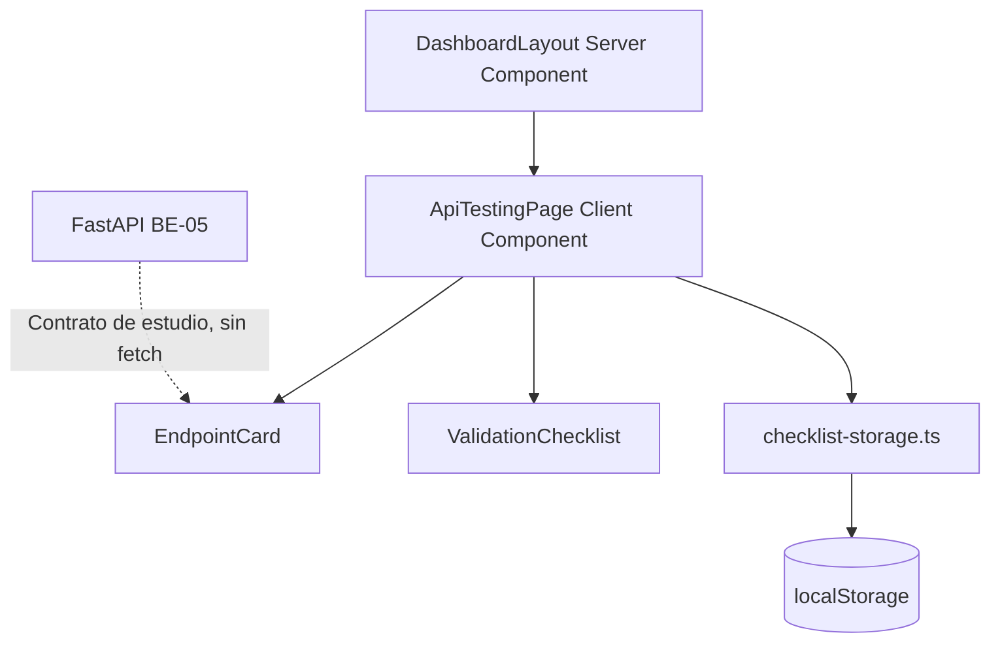
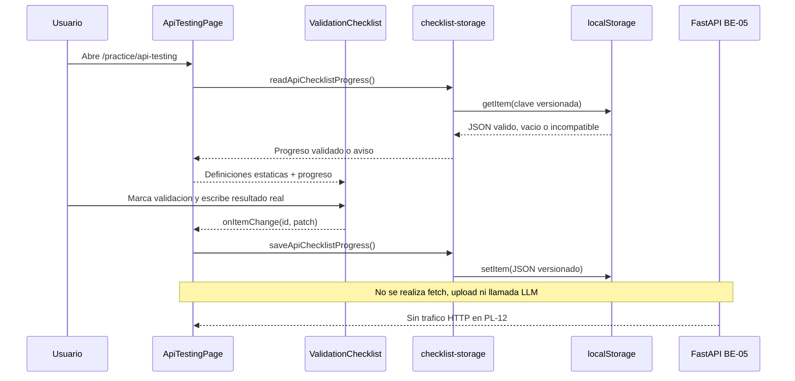

# Guia Didactica PL-12: API Testing Checklist

**Bloque:** H - QA Practice Lab  
**Objetivo:** crear `/practice/api-testing`, un laboratorio educativo que documenta validaciones de `POST /extract-pdf-full` sin enviar archivos ni peticiones al backend.  
**Dependencias verificadas:** PL-06, PL-11 y BE-05.  
**Estado:** Implementada y verificada (19/07/2026, 7/7).

---

## Sección 1: 🎓 Introducción y Fundamentos Conceptuales

PL-11 entreno la redaccion de defectos a partir de escenarios generados. PL-12 cambia de artefacto: ahora el estudiante aprende a leer un contrato HTTP real y registra que debe validar antes de ejecutar pruebas en Postman, Swagger o una suite automatizada.

El caso de estudio viene de **BE-05**: `POST /extract-pdf-full`. Recibe un campo multipart llamado `file`, procesa un PDF y devuelve `FullExtractionResponse`. Los errores controlados usan el contrato plano `ErrorResponse`. PL-12 no llama al endpoint. Una casilla marcada significa "comprendi o ejecute manualmente esta comprobacion", nunca que la UI confirmo un `200`.

### Analogía profesional

Una checklist de API es como la lista previa al despegue de una aeronave. Leer "combustible verificado" no hace que el avion despegue; permite que la tripulacion registre una comprobacion critica y su resultado. La lista evita omisiones cuando el proceso es conocido o se repite bajo presion.

En este laboratorio, el endpoint es la aeronave y cada item verifica una condicion concreta: tipo de archivo, cuerpo vacio, PDF sin texto, estructura de error o estructura exitosa. El resultado real es el registro de cabina: evidencia observable anotada por el estudiante, no una inferencia de la aplicacion.

El progreso local es una libreta temporal, no una fuente de verdad del backend. Se guarda en `localStorage`, se valida antes de restaurar y se informa cuando esta corrupto o corresponde a otra version de la checklist. No se guardan PDFs, tokens, cookies, claves ni respuestas del servidor.

### Limite de alcance

| Esta guia SI hace | Esta guia NO hace |
|---|---|
| Enseña el contrato de BE-05 y guarda anotaciones locales. | Enviar un PDF a FastAPI o llamar `/api/extract`. |
| Permite marcar validaciones y escribir resultado observado. | Convertir una casilla marcada en una prueba automatizada. |
| Usa `localStorage` despues de hidratar un Client Component. | Guardar secretos, archivos o datos de Supabase. |
| Reutiliza el vocabulario de `ApiChecklistItem` para un futuro evaluador. | Modificar prompts, rutas LLM, RLS, migraciones o `types/practice.ts`. |

---

## Sección 2: 📋 Prerequisitos y Verificación del Entorno

| Requisito | Comando PowerShell | Resultado esperado |
|---|---|---|
| Node.js | `node --version` | `^20.19.0` o `>=22.12.0`; satisface Next.js 16.2.9 y Vitest/Vite instalados. |
| Dependencias | `Test-Path -LiteralPath "frontend\node_modules\next\package.json"` | `True`. |
| BE-05 | `Select-String -LiteralPath "backend\app\routers\pdf.py" -Pattern '"/extract-pdf-full"'` | Coincidencia con `POST /extract-pdf-full`. |
| Schemas | `Select-String -LiteralPath "backend\app\models\schemas.py" -Pattern "class FullExtractionResponse|class ErrorResponse"` | Dos coincidencias. |
| PL-11 | `Test-Path -LiteralPath "frontend\app\(dashboard)\practice\bug-lab\page.tsx"` | `True`. |

Para usar la interfaz educativa no necesitas iniciar FastAPI ni configurar
variables. El checkpoint técnico de la sección 6 sí levanta una imagen Docker
con una credencial efímera; nunca lee ni muestra `.env.local`.

### Contrato runtime verificado de BE-05

| Elemento | Valor real |
|---|---|
| Metodo y ruta | `POST /extract-pdf-full` |
| Request | `multipart/form-data` con campo requerido `file`. |
| Exito | `200` con `FullExtractionResponse`. |
| Archivo invalido | `400` con `ErrorResponse`. |
| Credencial ausente o invalida | `401` con `ErrorResponse`. |
| Archivo demasiado grande | `413` con `ErrorResponse`. |
| PDF sin texto/topicos | `422` con `ErrorResponse`. |
| Limite temporal excedido | `429`, `Retry-After` y `ErrorResponse`. |
| Error inesperado | `500` con `ErrorResponse`. |
| Servicio sin credencial configurada | `503` con `ErrorResponse`; falla cerrado. |
| Error estructurado | JSON plano con `detail: string` y `error_code: string`. |
| Validación multipart | Sin campo `file`, el exception handler devuelve `422 MISSING_FILE` plano. |
| Validación de tipo | Usa MIME y magic bytes `%PDF-`; no valida la extensión del nombre por sí sola. |
| Mapeo BFF | `/api/extract` preserva `400/401/413/422/429/500/503`, valida el JSON y conserva `Retry-After`. |
| Error interno | Expone un mensaje público estable; no devuelve stack, secreto ni texto crudo de la excepción. |

> **Frontera de seguridad:** el navegador llama al BFF autenticado de Next.js;
> solo el BFF envía `Authorization: Bearer <BFF_SHARED_SECRET>` a FastAPI. La
> clave es server-only, debe tener al menos 32 caracteres y nunca se muestra en
> la checklist, logs, OpenAPI examples ni variables `NEXT_PUBLIC_*`.

---

## Sección 3: 📂 Estructura de Directorios del Proyecto

Arbol auditado. `UI PL-12` identifica los entregables educativos originales;
`gate HTTP` identifica los archivos incorporados o corregidos al reabrir el hito.

```text
frontend/
├── app/
│   ├── (auth)/{layout.tsx,login/page.tsx,register/page.tsx}
│   ├── (dashboard)/
│   │   ├── _components/{main-nav,mobile-nav,user-menu}.tsx
│   │   ├── dashboard/page.tsx
│   │   ├── plan/{page.tsx,_components/{day-card,exam-countdown,plan-calendar,plan-header,plan-preview,plan-stats,session-card}.tsx}
│   │   ├── practice/
│   │   │   ├── page.tsx
│   │   │   ├── _components/{practice-card,practice-filter,topic-practice-list}.tsx
│   │   │   ├── [topicCode]/{page.tsx,_components/{exercise-prompt,feedback-panel,solution-compare,test-case-editor,theory-brief}.tsx}
│   │   │   ├── bug-lab/{page.tsx,_components/{bug-evaluation,bug-report-form,scenario-display}.tsx}
│   │   │   └── api-testing/                                  # UI PL-12
│   │   │       ├── page.tsx                                  # UI PL-12
│   │   │       └── _components/
│   │   │           ├── checklist-storage.ts                  # UI PL-12
│   │   │           ├── endpoint-card.tsx                     # UI PL-12
│   │   │           └── validation-checklist.tsx              # UI PL-12
│   │   ├── session/page.tsx
│   │   ├── setup/{page.tsx,_components/{file-preview,pdf-dropzone,study-config}.tsx}
│   │   ├── layout.tsx
│   │   ├── loading.tsx
│   │   └── error.tsx
│   ├── api/{dashboard,extract,plan,practice,sessions,upload}/ # extract: gate HTTP
│   ├── auth/callback/route.ts
│   ├── globals.css
│   ├── layout.tsx
│   └── page.tsx
├── components/{dashboard,session,ui}/
├── lib/{ai,api,practice,prompts,supabase}/                    # api: gate HTTP
├── tests/                                                     # regresiones PL-12
├── types/{adapt,dashboard,database,evaluate,index,practice,quiz,sessions,theory}.ts
├── AGENTS.md
├── .env.example                                             # contrato gate HTTP
├── .gitignore                                               # permite .env.example
├── package.json
├── package-lock.json                                        # versiones reproducibles
├── vitest.config.mts                                        # regresiones PL-12
└── tsconfig.json

backend/
├── app/core/{config,errors,request_guard}.py                  # gate HTTP
├── app/{main.py,models/schemas.py,routers/pdf.py}             # gate HTTP
├── tests/{conftest.py,test_pdf_api.py}                        # regresiones PL-12
├── {.dockerignore,.env.example,Dockerfile,pytest.ini}         # infraestructura
├── requirements-dev.txt                                      # pytest + transporte
└── requirements.txt
```

| Accion | Archivos |
|---|---|
| Crear UI | `api-testing/page.tsx`, `checklist-storage.ts`, `endpoint-card.tsx`, `validation-checklist.tsx`. |
| Corregir gate HTTP | Guard y errores FastAPI, OpenAPI, BFF `/api/extract`, contrato TS y pruebas HTTP/storage. |
| No tocar | Prompts, rutas Practice LLM, tablas, RLS, `.env.local`, secrets reales, MainNav y MobileNav. |

La navegacion global corresponde a PL-14. Abre la ruta manualmente durante este hito.

---

## Sección 4: 🎨 Diagrama de Arquitectura de Componentes



### Flujo Completo



La pagina es Client Component porque usa estado, eventos, `useEffect` y `localStorage`. `EndpointCard` es presentacional. Las funciones de storage se invocan solo desde efectos o handlers, nunca durante el render inicial.

---

## Sección 5: 🛠️ Implementación Paso a Paso

### Paso A - Crear la fuente de verdad y parser de storage

**Crear:** `frontend/app/(dashboard)/practice/api-testing/_components/checklist-storage.ts`.

No uses `ApiChecklistItem` como formato de cache: en el dominio Practice, `notes` se reserva para una futura evaluacion; aqui se necesitan `expectedResult` estatico y `actualResult` local separados.

```ts
export type ApiChecklistCategory =
  | "request"
  | "validation"
  | "error"
  | "response";

export interface ApiChecklistDefinition {
  id: string;
  category: ApiChecklistCategory;
  description: string;
  expectedResult: string;
  documentation: string;
}

export interface EndpointDefinition {
  id: "extract-pdf-full";
  method: "POST";
  path: "/extract-pdf-full";
  contentType: "multipart/form-data";
  requestField: "file";
  authentication: "Bearer BFF-to-backend";
  successShape: "FullExtractionResponse";
  errorShape: "ErrorResponse";
}

export interface ChecklistProgressItem {
  checked: boolean;
  actualResult: string;
}

export type ApiChecklistProgress = Record<string, ChecklistProgressItem>;

interface StoredApiChecklistProgress {
  version: 1;
  endpointId: EndpointDefinition["id"];
  progress: ApiChecklistProgress;
}

export const API_CHECKLIST_STORAGE_KEY =
  "istqb:api-testing:extract-pdf-full:v1";

export const EXTRACT_PDF_FULL_ENDPOINT: EndpointDefinition = {
  id: "extract-pdf-full",
  method: "POST",
  path: "/extract-pdf-full",
  contentType: "multipart/form-data",
  requestField: "file",
  authentication: "Bearer BFF-to-backend",
  successShape: "FullExtractionResponse",
  errorShape: "ErrorResponse",
};

export const EXTRACT_PDF_FULL_CHECKLIST: readonly ApiChecklistDefinition[] = [
  { id: "valid-pdf-200", category: "request", description: "Enviar un PDF valido con texto seleccionable en el campo multipart file.", expectedResult: "200 y FullExtractionResponse con topics, total_topics, warnings e is_complete.", documentation: "Valida flujo principal y respuesta completa." },
  { id: "empty-file-400", category: "validation", description: "Enviar un archivo PDF vacio o sin bytes utiles.", expectedResult: "400 y ErrorResponse con detail y error_code.", documentation: "Rechazo de entrada invalida antes de extraer texto." },
  { id: "wrong-extension-400", category: "validation", description: "Enviar bytes no PDF o content type incompatible.", expectedResult: "400 y ErrorResponse; no se ejecuta el pipeline.", documentation: "El id es legacy; el oráculo real comprueba MIME y magic bytes, no la extensión sola." },
  { id: "scanned-pdf-422", category: "validation", description: "Enviar PDF escaneado sin texto seleccionable o sin topicos detectables.", expectedResult: "422 y ErrorResponse con detalle de extraccion.", documentation: "Distingue PDF valido de contenido no extraible." },
  { id: "controlled-error-shape", category: "error", description: "Inspeccionar una respuesta de error controlado.", expectedResult: "400/401/413/422/429/500/503 preservado; JSON plano con detail y error_code.", documentation: "Sin shape anidado, stack trace, secreto ni texto crudo." },
  { id: "success-response-shape", category: "response", description: "Inspeccionar la estructura de respuesta exitosa.", expectedResult: "filename, total_pages, extraction_method, topics, level_distribution, estimated_study_hours, warnings e is_complete.", documentation: "Contrato FullExtractionResponse que consume UP-03." },
];

function isRecord(value: unknown): value is Record<string, unknown> {
  return typeof value === "object" && value !== null && !Array.isArray(value);
}

function isProgressItem(value: unknown): value is ChecklistProgressItem {
  return isRecord(value) && typeof value.checked === "boolean" && typeof value.actualResult === "string";
}

export function createInitialApiChecklistProgress(): ApiChecklistProgress {
  return Object.fromEntries(EXTRACT_PDF_FULL_CHECKLIST.map((item) => [item.id, { checked: false, actualResult: "" }]));
}

export function parseApiChecklistProgress(value: unknown): ApiChecklistProgress | null {
  if (!isRecord(value) || value.version !== 1) return null;
  if (value.endpointId !== EXTRACT_PDF_FULL_ENDPOINT.id || !isRecord(value.progress)) return null;
  const ids = EXTRACT_PDF_FULL_CHECKLIST.map((item) => item.id);
  if (Object.keys(value.progress).length !== ids.length) return null;

  const progress: ApiChecklistProgress = {};
  for (const id of ids) {
    const item = value.progress[id];
    if (!isProgressItem(item)) return null;
    progress[id] = { checked: item.checked, actualResult: item.actualResult };
  }
  return progress;
}

export function readApiChecklistProgress():
  | { kind: "empty" }
  | { kind: "valid"; progress: ApiChecklistProgress }
  | { kind: "invalid" }
  | { kind: "unavailable" } {
  let raw: string | null;
  try {
    raw = window.localStorage.getItem(API_CHECKLIST_STORAGE_KEY);
  } catch {
    return { kind: "unavailable" };
  }
  if (raw === null) return { kind: "empty" };
  try {
    const progress = parseApiChecklistProgress(JSON.parse(raw));
    return progress ? { kind: "valid", progress } : { kind: "invalid" };
  } catch {
    return { kind: "invalid" };
  }
}

export function saveApiChecklistProgress(progress: ApiChecklistProgress): boolean {
  const value: StoredApiChecklistProgress = { version: 1, endpointId: "extract-pdf-full", progress };
  try {
    window.localStorage.setItem(API_CHECKLIST_STORAGE_KEY, JSON.stringify(value));
    return true;
  } catch {
    return false;
  }
}

export function clearApiChecklistProgress(): boolean {
  try {
    window.localStorage.removeItem(API_CHECKLIST_STORAGE_KEY);
    return true;
  } catch {
    return false;
  }
}

const validFixture: StoredApiChecklistProgress = { version: 1, endpointId: "extract-pdf-full", progress: createInitialApiChecklistProgress() };
export const API_CHECKLIST_STORAGE_FIXTURES = [
  { name: "valido", value: validFixture, expected: true },
  { name: "legacy array", value: [], expected: false },
  { name: "campo requerido ausente", value: { version: 1, endpointId: "extract-pdf-full" }, expected: false },
  { name: "endpoint invalido", value: { ...validFixture, endpointId: "extract-pdf" }, expected: false },
  { name: "progreso vacio", value: { ...validFixture, progress: {} }, expected: false },
] as const;

export function assertApiChecklistStorageFixtures(): void {
  const failed = API_CHECKLIST_STORAGE_FIXTURES.filter(
    (fixture) => (parseApiChecklistProgress(fixture.value) !== null) !== fixture.expected,
  );
  if (failed.length > 0) throw new Error(`Fixtures API checklist fallaron: ${failed.map((item) => item.name).join(", ")}`);
}
```

**Entregable:** seis definiciones estaticas, estado local versionado y fixtures para payload valido, legacy, campo ausente, discriminante invalido y progreso vacio.

### Paso B - Presentar el endpoint sin invocarlo

**Crear:** `frontend/app/(dashboard)/practice/api-testing/_components/endpoint-card.tsx`.

```tsx
import type { ReactNode } from "react";
import { Braces, FileUp, Server } from "lucide-react";
import type { EndpointDefinition } from "./checklist-storage";

export function EndpointCard({ endpoint }: { endpoint: EndpointDefinition }) {
  return <section className="rounded-xl border border-blue-500/30 bg-blue-950/20 p-5"><div className="flex items-start gap-3"><Server className="mt-0.5 size-5 text-blue-300" /><div><p className="text-xs font-semibold uppercase tracking-wider text-blue-300">Caso de estudio BE-05</p><h1 className="mt-1 text-xl font-bold text-white"><span className="mr-2 rounded bg-emerald-500/20 px-2 py-1 font-mono text-sm text-emerald-300">{endpoint.method}</span><code>{endpoint.path}</code></h1><p className="mt-2 text-sm text-slate-300">Checklist educativa: no enviara archivos ni hara llamadas HTTP.</p></div></div><div className="mt-5 grid gap-3 md:grid-cols-2 xl:grid-cols-4"><ContractItem icon={<FileUp className="size-4 text-sky-300" />} label="Request" value={`${endpoint.contentType}; campo ${endpoint.requestField}`} /><ContractItem icon={<Server className="size-4 text-amber-300" />} label="Autenticación" value={endpoint.authentication} /><ContractItem icon={<Braces className="size-4 text-emerald-300" />} label="200" value={endpoint.successShape} /><ContractItem icon={<Braces className="size-4 text-rose-300" />} label="400 / 401 / 413 / 422 / 429 / 500 / 503" value={endpoint.errorShape} /></div></section>;
}

function ContractItem({ icon, label, value }: { icon: ReactNode; label: string; value: string }) {
  return <div className="rounded-lg border border-slate-800 bg-slate-950/30 p-4"><div className="flex items-center gap-2">{icon}<p className="text-xs font-semibold uppercase tracking-wide text-slate-400">{label}</p></div><p className="mt-2 break-words font-mono text-xs text-slate-200">{value}</p></div>;
}
```

**Entregable:** tarjeta del contrato BE-05 sin botones que ejecuten el endpoint.

### Paso C - Crear checklist controlada

**Crear:** `frontend/app/(dashboard)/practice/api-testing/_components/validation-checklist.tsx`.

La pagina posee estado y persistencia. Este componente recibe datos tipados y emite cambios puntuales.

```tsx
"use client";

import { CheckCircle2, Circle, ClipboardCheck } from "lucide-react";
import type { ApiChecklistCategory, ApiChecklistDefinition, ApiChecklistProgress, ChecklistProgressItem } from "./checklist-storage";

const CATEGORY_STYLES: Record<ApiChecklistCategory, string> = {
  request: "border-sky-500/30 bg-sky-950/20 text-sky-300",
  validation: "border-amber-500/30 bg-amber-950/20 text-amber-300",
  error: "border-rose-500/30 bg-rose-950/20 text-rose-300",
  response: "border-emerald-500/30 bg-emerald-950/20 text-emerald-300",
};

export function ValidationChecklist({ items, progress, disabled, onItemChange }: { items: readonly ApiChecklistDefinition[]; progress: ApiChecklistProgress; disabled: boolean; onItemChange: (id: string, patch: Partial<ChecklistProgressItem>) => void }) {
  return <section className="rounded-xl border border-slate-800 bg-slate-900/60 p-5"><div className="flex items-center gap-2"><ClipboardCheck className="size-5 text-blue-300" /><div><h2 className="text-base font-semibold text-white">Checklist de validaciones</h2><p className="text-sm text-slate-400">Registra pruebas manuales; esta UI no contacta FastAPI.</p></div></div><div className="mt-5 space-y-4">{items.map((item) => { const entry = progress[item.id]; if (!entry) return <p key={item.id} role="alert" className="rounded-lg border border-rose-900/50 p-3 text-sm text-rose-300">Progreso incompatible para {item.id}. Restablece la checklist.</p>; return <article key={item.id} className="rounded-lg border border-slate-800 bg-slate-950/30 p-4"><div className="flex gap-3"><button type="button" aria-label={`Marcar ${item.description}`} aria-pressed={entry.checked} disabled={disabled} onClick={() => onItemChange(item.id, { checked: !entry.checked })} className="mt-0.5 text-slate-400 disabled:opacity-50">{entry.checked ? <CheckCircle2 className="size-5 text-emerald-400" /> : <Circle className="size-5" />}</button><div className="min-w-0 flex-1"><div className="flex flex-wrap items-center gap-2"><span className={`rounded border px-2 py-0.5 text-[10px] font-semibold uppercase tracking-wide ${CATEGORY_STYLES[item.category]}`}>{item.category}</span><h3 className="text-sm font-medium text-white">{item.description}</h3></div><p className="mt-2 text-sm text-slate-300"><strong>Esperado:</strong> {item.expectedResult}</p><p className="mt-1 text-xs text-slate-500">{item.documentation}</p><label className="mt-3 block text-xs font-medium uppercase tracking-wide text-slate-400">Resultado real observado<textarea value={entry.actualResult} disabled={disabled} onChange={(event) => onItemChange(item.id, { actualResult: event.target.value })} placeholder="Ej.: 422, error_code=NO_TEXT_EXTRACTED" className="mt-1 min-h-20 w-full rounded-lg border border-slate-700 bg-slate-950 px-3 py-2 text-sm normal-case tracking-normal text-white" /></label></div></div></article>; })}</div></section>;
}
```

**Entregable:** seis filas accesibles con descripcion, resultado esperado, anotacion real y marcado controlado.

### Paso D - Orquestar hidratacion y persistencia

**Crear:** `frontend/app/(dashboard)/practice/api-testing/page.tsx`.

```tsx
"use client";

import { useEffect, useState } from "react";
import { AlertCircle, ArrowLeft, RotateCcw } from "lucide-react";
import Link from "next/link";
import { EndpointCard } from "./_components/endpoint-card";
import { ValidationChecklist } from "./_components/validation-checklist";
import {
  assertApiChecklistStorageFixtures,
  clearApiChecklistProgress,
  createInitialApiChecklistProgress,
  EXTRACT_PDF_FULL_CHECKLIST,
  EXTRACT_PDF_FULL_ENDPOINT,
  readApiChecklistProgress,
  saveApiChecklistProgress,
  type ApiChecklistProgress,
  type ChecklistProgressItem,
} from "./_components/checklist-storage";

if (process.env.NODE_ENV === "development") assertApiChecklistStorageFixtures();

export default function ApiTestingPage() {
  const [progress, setProgress] = useState<ApiChecklistProgress>(createInitialApiChecklistProgress);
  const [hydrated, setHydrated] = useState(false);
  const [storageNotice, setStorageNotice] = useState<string | null>(null);

  useEffect(() => {
    const timeoutId = window.setTimeout(() => {
      const stored = readApiChecklistProgress();
      if (stored.kind === "valid") setProgress(stored.progress);
      if (stored.kind === "invalid") setStorageNotice("El progreso local era incompatible y se reinicio de forma segura.");
      if (stored.kind === "unavailable") setStorageNotice("El almacenamiento local esta bloqueado; puedes usar la checklist sin persistencia.");
      setHydrated(true);
    }, 0);
    return () => window.clearTimeout(timeoutId);
  }, []);

  function updateItem(id: string, patch: Partial<ChecklistProgressItem>) {
    const nextProgress = { ...progress, [id]: { ...progress[id], ...patch } };
    setProgress(nextProgress);
    if (!saveApiChecklistProgress(nextProgress)) setStorageNotice("No fue posible guardar el progreso en este navegador.");
  }

  function resetProgress() {
    const cleared = clearApiChecklistProgress();
    const initialProgress = createInitialApiChecklistProgress();
    const saved = saveApiChecklistProgress(initialProgress);
    setProgress(initialProgress);
    setStorageNotice(cleared && saved ? "Checklist restablecida. El nuevo progreso se guardara localmente." : "Checklist restablecida en pantalla, pero el almacenamiento local esta bloqueado.");
  }

  const completed = EXTRACT_PDF_FULL_CHECKLIST.filter((item) => progress[item.id]?.checked).length;
  return <div className="flex flex-col gap-6"><Link href="/practice" className="inline-flex w-fit items-center gap-2 text-sm text-slate-400 hover:text-white"><ArrowLeft className="size-4" />Volver al Practice Lab</Link><div className="flex flex-col gap-3 sm:flex-row sm:items-end sm:justify-between"><div><p className="text-sm text-blue-300">Laboratorio educativo de contrato HTTP</p><h1 className="text-2xl font-bold text-white">API Testing Checklist</h1><p className="mt-1 text-sm text-slate-400">{completed}/{EXTRACT_PDF_FULL_CHECKLIST.length} validaciones marcadas</p></div><button type="button" onClick={resetProgress} className="inline-flex w-fit items-center gap-2 rounded-lg border border-slate-700 px-4 py-2 text-sm text-slate-300 hover:bg-slate-800"><RotateCcw className="size-4" />Restablecer progreso</button></div>{storageNotice && <p role="status" className="flex gap-2 rounded-lg border border-amber-900/50 bg-amber-950/30 p-3 text-sm text-amber-200"><AlertCircle className="mt-0.5 size-4 shrink-0" />{storageNotice}</p>}<EndpointCard endpoint={EXTRACT_PDF_FULL_ENDPOINT} />{hydrated ? <ValidationChecklist items={EXTRACT_PDF_FULL_CHECKLIST} progress={progress} disabled={false} onItemChange={updateItem} /> : <div className="h-96 animate-pulse rounded-xl bg-slate-900" />}</div>;
}
```

La `useEffect` hidrata despues del primer render y evita divergencias SSR. Los handlers persisten el estado actualizado y convierten fallos de lectura, escritura o borrado en avisos recuperables. No agregues `fetch`, `FormData`, `NEXT_PUBLIC_FASTAPI_URL` ni archivos adjuntos.

**Entregable:** pagina responsive, sin red, que restaura progreso valido, informa storage incompatible y permite restablecer.

### Paso E - Reconciliar el contrato HTTP del caso de estudio

La reapertura de PL-12 agrego un gate transversal. La UI sigue sin red, pero el
contrato que enseña debe coincidir con productor, OpenAPI y BFF.

| Capa | Archivo | Regla verificable |
|---|---|---|
| Configuración | `backend/app/core/config.py` | `BFF_SHARED_SECRET` server-only, máximo de upload, overhead, rate y allowlist CORS. |
| Frontera ASGI | `backend/app/core/request_guard.py` | Auth antes del body; rechazo por `Content-Length`; prelectura acotada que también devuelve 413 sin longitud declarada; 429 con `Retry-After`. |
| Errores | `backend/app/core/errors.py` | Todos los fallos públicos usan `{ detail, error_code }`; multipart sin `file` produce `422 MISSING_FILE`. |
| OpenAPI | `backend/app/routers/pdf.py` | `BFFBearer` y respuestas `200/400/401/413/422/429/500/503`. |
| BFF | `frontend/app/api/extract/route.ts` | Envía el bearer privado, limita Storage, valida cache/upstream y preserva status más `Retry-After`. |
| Parser | `frontend/lib/api/fastapi-contract.ts` | Rechaza errores anidados, éxitos vacíos y metadatos cacheados incompatibles. |
| Regresión | `backend/tests/test_pdf_api.py`, `frontend/tests/*extract*`, `api-checklist-storage.test.ts` | Cubre auth, límites declarados/chunked, MIME, magic bytes, errores, OpenAPI, cache y storage bloqueado. |
| Infraestructura | `backend/.dockerignore`, `Dockerfile`, ambos requirements, `pytest.ini`, ambos `.env.example`, `frontend/.gitignore`, `package.json`, `package-lock.json` y `vitest.config.mts` | Reproduce Python 3.12, TypeScript/Vitest fijados y nombres de variables sin valores reales. |

El guard no lanza una excepción desde `receive()` mientras Starlette parsea el
multipart. Prelee mensajes ASGI hasta completar el body o superar el máximo y,
si son válidos, los reproduce al router. Así un upload chunked excesivo conserva
`413 PAYLOAD_TOO_LARGE` en vez de degradarse a `400 HTTP_ERROR`.

**Entregable:** un único contrato comprobable entre FastAPI, OpenAPI, Next.js y
la checklist, sin convertir la UI educativa en un cliente HTTP.

---

## Sección 6: ✅ Checkpoints de Verificación

```powershell
npm --prefix frontend run typecheck
npm --prefix frontend run test:extract
npm --prefix frontend run test:plan
npm --prefix frontend run lint -- "app/api/extract/route.ts" `
  "lib/api/fastapi-contract.ts" "types/database.ts" `
  "app/(dashboard)/practice/api-testing/**/*.ts" `
  "app/(dashboard)/practice/api-testing/**/*.tsx" "tests/*.test.ts"
npm --prefix frontend run build
docker build --target test -t istqb-backend:test backend
docker run --rm istqb-backend:test
docker run --rm istqb-backend:test python -m tests.test_topic_detector
docker run --rm istqb-backend:test python -m tests.test_extractor
docker build -t istqb-backend:pl12 backend
```

Salida esperada:

```text
TypeScript termina sin errores.
Vitest de extracción pasa 29/29, plan pasa 8/8 y pytest pasa 15/15.
Lint dirigido termina sin salida; módulos offline pasan 8/8 y 9/9.
next build finaliza sin warnings observados y lista `/api/extract` y `/practice/api-testing`.
La imagen productiva construye; el smoke efímero documentado abajo comprueba health 200 y acceso directo 401 plano.
```

Smoke local sin reutilizar secrets reales:

```powershell
$Bytes = New-Object byte[] 32
$Rng = [Security.Cryptography.RandomNumberGenerator]::Create()
$Rng.GetBytes($Bytes)
$TestSecret = [Convert]::ToBase64String($Bytes)
$Rng.Dispose()
$ContainerName = "istqb-pl12-$PID"

docker run -d --rm --name $ContainerName -p 18080:8000 `
  -e BFF_SHARED_SECRET="$TestSecret" istqb-backend:pl12 | Out-Null
if ($LASTEXITCODE -ne 0) { throw "No se pudo iniciar el contenedor PL-12." }

try {
  $Ready = $false
  for ($Attempt = 0; $Attempt -lt 30; $Attempt++) {
    try {
      $Health = Invoke-RestMethod -Uri "http://127.0.0.1:18080/health"
      if ($Health.status -eq "ok") { $Ready = $true; break }
    } catch {}
    Start-Sleep -Milliseconds 500
  }
  if (-not $Ready) { throw "FastAPI no quedo listo para el smoke." }

  $Unauthorized = $false
  try {
    Invoke-WebRequest -UseBasicParsing -Method Post `
      -Uri "http://127.0.0.1:18080/extract-pdf-full" | Out-Null
  } catch {
    if ($_.Exception.Response -and [int]$_.Exception.Response.StatusCode -eq 401) {
      $Body = $_.ErrorDetails.Message | ConvertFrom-Json
      $Unauthorized = $Body.error_code -eq "UNAUTHORIZED"
    }
  }
  if (-not $Unauthorized) { throw "El smoke no devolvio 401 UNAUTHORIZED plano." }
} finally {
  docker stop $ContainerName | Out-Null
}
Remove-Variable TestSecret, Bytes, Rng, ContainerName
```

Para la comprobación visual, inicia en otra terminal
`npm --prefix frontend run dev`, abre la ruta indicada y detén el servidor con
`Ctrl+C` al terminar.

Abre `http://localhost:3000/practice/api-testing` con sesion iniciada.

| Accion | Resultado visible |
|---|---|
| Abrir | `API Testing Checklist`, progreso `0/6` y contrato `POST /extract-pdf-full`. |
| Marcar | El icono cambia a check verde y sube el contador. |
| Escribir resultado | El textarea conserva el texto despues de recargar. |
| Restablecer | Se vacian casillas y anotaciones. |
| DevTools Network | No hay peticiones a FastAPI, `/api/extract` ni rutas Practice. |

| Fixture o edge case | Resultado esperado |
|---|---|
| Storage valido | Restaura el progreso exacto. |
| Legacy array | Parser devuelve `null`; aviso y estado limpio. |
| Campo `progress` ausente | No hay crash ni acceso a `undefined`. |
| `endpointId: "extract-pdf"` | Rechazado por discriminante invalido. |
| `progress: {}` | Rechazado porque faltan los seis ids. |
| JSON corrupto | `try/catch` evita crash y muestra reinicio seguro. |
| Storage bloqueado | UI sigue usable y comunica que no pudo guardar. |
| Mobile menor a 640px | Controles y textarea a una columna, sin overflow. |

### Checklist de entregables

**Estado verificado el 19/07/2026: 7/7.** Las revisiones adversariales encontraron
cache BFF inconsistente, OpenAPI sin security scheme, storage bloqueado no
controlado, overflow chunked degradado a 400 y campos de tópico descartados por
TypeScript. Todas las regresiones quedaron cubiertas antes del cierre. Las
casillas del estudiante empiezan desmarcadas por diseño.

- [x] `checklist-storage.ts` contiene contrato versionado, parser y cinco fixtures sin HTTP.
- [x] `EndpointCard`, OpenAPI, FastAPI y el BFF describen el mismo contrato HTTP.
- [x] `ValidationChecklist` muestra resultado esperado, real y marcado accesible.
- [x] La pagina lee storage tras hidratar y captura lectura/escritura/borrado bloqueados.
- [x] Cache incompatible es visible, no se interpreta como exito.
- [x] La correccion se limita al contrato FastAPI/BFF/UI; no toca prompts, tablas, RLS ni secretos reales.
- [x] `test:extract` 29/29, `test:plan` 8/8, pytest 15/15, módulos offline 8/8 y 9/9, `tsc`, lint dirigido, build e imagen pasan.

---

## Sección 7: 🚨 Troubleshooting — Problemas Comunes

| Problema | Causa probable | Solucion |
|---|---|---|
| `localStorage is not defined` | Storage se leyo durante render o fuera de Client Component. | Conserva `"use client"` y llama `readApiChecklistProgress()` solo desde `useEffect`. |
| `Hydration failed` | El primer render uso un valor local distinto al HTML inicial. | Empieza con `createInitialApiChecklistProgress()` y renderiza checklist tras `hydrated`. |
| Notas perdidas | `saveApiChecklistProgress()` no recibe estado actualizado o browser bloquea storage. | Verifica que el handler persiste `nextProgress` y muestra el aviso de escritura fallida. |
| La pagina hace una llamada HTTP | Se reutilizo codigo de UP-03 o `/api/extract`. | Elimina `fetch`, `FormData` y URL de FastAPI; PL-12 es solo educativa. |
| FastAPI devuelve 401 desde el navegador | El endpoint solo acepta la credencial server-only del BFF. | Llama `/api/extract` con sesión; nunca expongas `BFF_SHARED_SECRET` al cliente. |
| Modulo no encontrado | El helper se creo fuera de `_components`. | Verifica `Test-Path -LiteralPath "frontend\app\(dashboard)\practice\api-testing\_components\checklist-storage.ts"`. |

---

## Sección 8: 📝 Resumen y Próximo Paso

1. La UI local ya permite estudiar el contrato HTTP de FastAPI sin invocarlo.
2. Las definiciones estaticas, el progreso versionado y los componentes visuales quedaron separados.
3. La persistencia conserva solo anotaciones locales, sin backend, LLM ni secretos.
4. Los errores de cache o persistencia son visibles y no simulan exito.
5. El contrato HTTP quedó reconciliado y el milestone cierra en 7/7.

Para revisar el checkpoint actual:

```text
Valida mi progreso de la guia PL-12 en su seccion 6
```

**PL-13 y PL-14 ya están implementadas.** El siguiente trabajo vigente no es
otra guía Practice Lab: continúa con la integridad cross-tenant del gate pre-QA
del roadmap v2.16.
