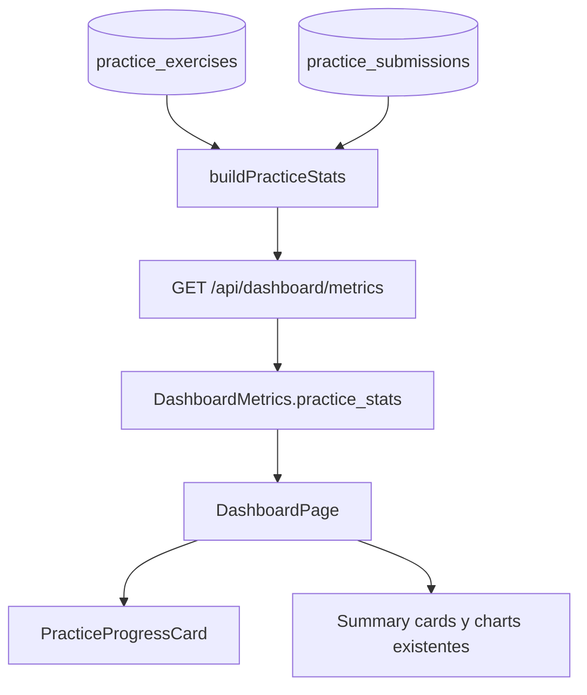
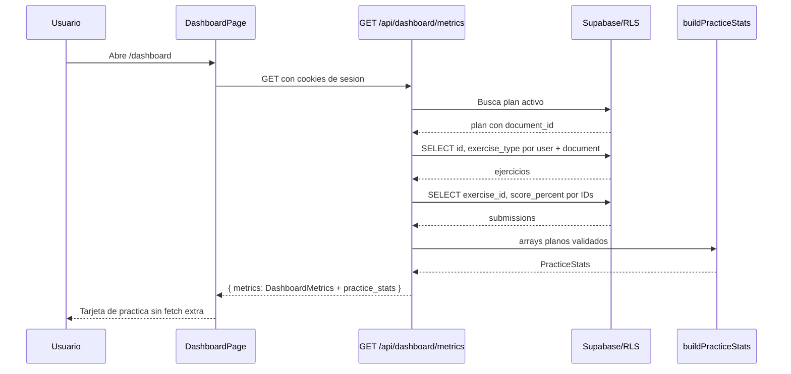

# Guia Didactica PL-13: Metricas de Practica en Dashboard

**Bloque:** H - QA Practice Lab  
**Objetivo:** agregar `practice_stats` al DTO existente de dashboard y mostrar `PracticeProgressCard` en `/dashboard`.  
**Dependencias verificadas:** DA-01, PL-09 y PL-12.  
**Estado:** implementada y validada (12 julio 2026).

---

## Sección 1: 🎓 Introducción y Fundamentos Conceptuales

PL-12 agrego una checklist educativa local. PL-13 mide la actividad persistida del Practice Lab: ejercicios generados, ejercicios evaluados, score promedio y tipo mas practicado. La fuente de verdad es Supabase: `practice_exercises` representa el inventario de ejercicios y `practice_submissions` representa las entregas evaluadas.

No se crea otro endpoint ni otro fetch. DA-01 ya concentra las metricas de dashboard en `GET /api/dashboard/metrics`; extender ese DTO mantiene un roundtrip, una politica de autenticacion y una fuente de verdad para todos los componentes.

### Analogía profesional

El dashboard es el tablero de un centro de operaciones. Las sesiones de estudio muestran la ruta principal, mientras que Practice Lab registra los simulacros. Ambos datos deben llegar al mismo tablero con las mismas reglas de conteo; de otra forma el estudiante tomaria decisiones usando instrumentos que no coinciden.

Un ejercicio generado es como un simulacro preparado. Una submission es el informe de que el simulacro fue realizado. Contar submissions directamente puede inflar la actividad si existen reintentos; por eso `completed_exercises` cuenta IDs de ejercicio unicos, mientras que el promedio usa todos los scores disponibles de esas entregas.

La tarjeta visual no calcula ni consulta datos. Es el indicador del tablero: recibe `PracticeStats` ya agregado por el servidor. Esta separacion permite que la misma metrica sirva a una futura app movil sin duplicar queries ni reglas de negocio.

### Valores canónicos obligatorios

El valor persistido es `bug_report`, no `bug_reports`. El DTO debe conservar todos los tipos del CHECK de base de datos:

```ts
"test_cases" | "bug_report" | "api_testing" | "exploratory"
```

`Bug Reports` puede ser un label visual, pero nunca una clave de `by_type`.

---

## Sección 2: 📋 Prerequisitos y Verificación del Entorno

| Requisito | Comando PowerShell | Resultado esperado |
|---|---|---|
| Node.js | `node --version` | `v20.9.0` o superior. |
| DTO actual | `Test-Path -LiteralPath "frontend\types\dashboard.ts"` | `True`. |
| Ruta DA-01 | `Test-Path -LiteralPath "frontend\app\api\dashboard\metrics\route.ts"` | `True`. |
| Dashboard | `Test-Path -LiteralPath "frontend\app\(dashboard)\dashboard\page.tsx"` | `True`. |
| Tablas Practice | `Select-String -LiteralPath "frontend\types\database.ts" -Pattern "PracticeExerciseRow|PracticeSubmissionRow"` | Dos coincidencias. |
| PL-12 | `Test-Path -LiteralPath "frontend\app\(dashboard)\practice\api-testing\page.tsx"` | `True`. |

`frontend/types/database.ts` contiene `Relationships: []`. La guia usa consultas planas: ejercicios filtrados por `user_id` y `document_id` del plan activo, seguidos de submissions filtradas por los IDs resultantes. No uses joins `!inner(...)`.

---

## Sección 3: 📂 Estructura de Directorios del Proyecto

```text
frontend/
├── app/
│   ├── (auth)/{layout.tsx,login/page.tsx,register/page.tsx}
│   ├── (dashboard)/
│   │   ├── _components/{main-nav,mobile-nav,user-menu}.tsx
│   │   ├── dashboard/page.tsx                              # MODIFICAR
│   │   ├── plan/{page.tsx,_components/...}
│   │   ├── practice/
│   │   │   ├── page.tsx
│   │   │   ├── [topicCode]/{page.tsx,_components/...}
│   │   │   ├── bug-lab/{page.tsx,_components/...}
│   │   │   └── api-testing/{page.tsx,_components/...}
│   │   ├── session/page.tsx
│   │   ├── setup/{page.tsx,_components/...}
│   │   ├── layout.tsx
│   │   ├── loading.tsx
│   │   └── error.tsx
│   ├── api/dashboard/metrics/route.ts                      # MODIFICAR
│   ├── api/{extract,plan,practice,sessions,upload}/
│   ├── auth/callback/route.ts
│   ├── globals.css
│   ├── layout.tsx
│   └── page.tsx
├── components/dashboard/
│   ├── dashboard-summary-cards.tsx
│   ├── practice-progress-card.tsx                          # NUEVO
│   ├── score-chart.tsx
│   ├── time-comparison-chart.tsx
│   └── topic-heatmap.tsx
├── lib/
│   ├── dashboard/practice-stats.ts                          # NUEVO
│   ├── ai/, practice/, prompts/, supabase/
├── types/
│   ├── dashboard.ts                                         # MODIFICAR
│   ├── index.ts                                             # MODIFICAR
│   ├── database.ts
│   └── practice.ts
├── AGENTS.md
├── package.json
└── tsconfig.json
```

| Accion | Archivos |
|---|---|
| Crear | `lib/dashboard/practice-stats.ts`, `components/dashboard/practice-progress-card.tsx`. |
| Modificar | `types/dashboard.ts`, `types/index.ts`, `api/dashboard/metrics/route.ts`, `(dashboard)/dashboard/page.tsx`. |
| No tocar | Rutas Practice, prompts, tablas/migraciones, RLS, `types/database.ts`, charts existentes, `.env.local`, navegacion global. |

---

## Sección 4: 🎨 Diagrama de Arquitectura de Componentes



### Flujo Completo



`DashboardPage` ya es Client Component por su fetch y charts. La nueva tarjeta es presentacional. La API mantiene `runtime = "nodejs"`, `revalidate = 0`, autenticacion `getUser()` y el wrapper `{ metrics }`.

---

## Sección 5: 🛠️ Implementación Paso a Paso

### Paso A - Extender el DTO canónico

**Modificar:** `frontend/types/dashboard.ts` y `frontend/types/index.ts`.

Junto a los imports de `./database`, agrega:

```ts
import type { PracticeExerciseType } from "./practice";
```

Antes de `DashboardMetrics`, agrega:

```ts
export interface PracticeStats {
  total_exercises: number;
  completed_exercises: number;
  avg_score: number | null;
  by_type: Record<PracticeExerciseType, number>;
  most_practiced_type: PracticeExerciseType | null;
}
```

Dentro de `DashboardMetrics`, debajo de `topic_status`, agrega:

```ts
  /** Metricas Practice del documento asociado al plan activo. */
  practice_stats: PracticeStats;
```

En `types/index.ts`, dentro del bloque `DA-01/DA-03`, reexporta `PracticeStats` despues de `TimeComparison`.

**Entregable:** el contrato API tiene total, completados, promedio nullable, cuatro conteos y tipo dominante.

### Paso B - Crear agregador puro y fixtures offline

**Crear:** `frontend/lib/dashboard/practice-stats.ts`.

```ts
import type { PracticeExerciseType } from "@/types/practice";
import type { PracticeStats } from "@/types/dashboard";

export interface PracticeExerciseMetric {
  id: string;
  exercise_type: PracticeExerciseType;
}

export interface PracticeSubmissionMetric {
  exercise_id: string;
  score_percent: number | null;
}

const PRACTICE_TYPES: readonly PracticeExerciseType[] = [
  "test_cases",
  "bug_report",
  "api_testing",
  "exploratory",
];

function isRecord(value: unknown): value is Record<string, unknown> {
  return typeof value === "object" && value !== null && !Array.isArray(value);
}

export function isPracticeExerciseMetric(value: unknown): value is PracticeExerciseMetric {
  return isRecord(value) && typeof value.id === "string" && PRACTICE_TYPES.includes(value.exercise_type as PracticeExerciseType);
}

export function isPracticeSubmissionMetric(value: unknown): value is PracticeSubmissionMetric {
  return isRecord(value) && typeof value.exercise_id === "string" && (typeof value.score_percent === "number" || value.score_percent === null);
}

function emptyByType(): Record<PracticeExerciseType, number> {
  return { test_cases: 0, bug_report: 0, api_testing: 0, exploratory: 0 };
}

export function buildPracticeStats(exercises: readonly PracticeExerciseMetric[], submissions: readonly PracticeSubmissionMetric[]): PracticeStats {
  const byType = emptyByType();
  for (const exercise of exercises) byType[exercise.exercise_type]++;

  const completedIds = new Set(submissions.map((submission) => submission.exercise_id));
  const scores = submissions.map((submission) => submission.score_percent).filter((score): score is number => typeof score === "number" && Number.isFinite(score));
  const avgScore = scores.length === 0 ? null : Math.round((scores.reduce((sum, score) => sum + score, 0) / scores.length) * 100) / 100;

  let mostPracticedType: PracticeExerciseType | null = null;
  let largestCount = 0;
  for (const type of PRACTICE_TYPES) {
    if (byType[type] > largestCount) {
      mostPracticedType = type;
      largestCount = byType[type];
    }
  }

  return { total_exercises: exercises.length, completed_exercises: completedIds.size, avg_score: avgScore, by_type: byType, most_practiced_type: mostPracticedType };
}

export function assertPracticeStatsFixtures(): void {
  const valid = buildPracticeStats(
    [{ id: "exercise-1", exercise_type: "test_cases" }, { id: "exercise-2", exercise_type: "bug_report" }],
    [{ exercise_id: "exercise-1", score_percent: 80 }, { exercise_id: "exercise-2", score_percent: 60 }],
  );
  const empty = buildPracticeStats([], []);
  if (valid.total_exercises !== 2 || valid.completed_exercises !== 2 || valid.avg_score !== 70) throw new Error("Fixture valido de PracticeStats fallo.");
  if (isPracticeExerciseMetric({ id: "old", exercise_type: "bug_reports" }) || isPracticeExerciseMetric({ exercise_type: "test_cases" }) || isPracticeExerciseMetric({ id: "bad", exercise_type: "manual" })) throw new Error("Fixture invalido de PracticeStats fue aceptado.");
  if (empty.total_exercises !== 0 || empty.most_practiced_type !== null || empty.avg_score !== null) throw new Error("Fixture vacio de PracticeStats fallo.");
}
```

Las fixtures cubren payload valido, `bug_reports` legacy, campo `id` ausente, enum invalido y arrays vacios. Los submissions repetidos no inflan `completed_exercises` porque se usan IDs unicos.

**Entregable:** calculo reutilizable, determinista y comprobable sin LLM.

### Paso C - Extender DA-01 sin joins

**Modificar:** `frontend/app/api/dashboard/metrics/route.ts`.

Junto a los imports de dashboard, agrega:

```ts
import {
  assertPracticeStatsFixtures,
  buildPracticeStats,
  isPracticeExerciseMetric,
  isPracticeSubmissionMetric,
  type PracticeSubmissionMetric,
} from "@/lib/dashboard/practice-stats";
```

Debajo de `export const revalidate = 0`, agrega:

```ts
if (process.env.NODE_ENV === "development") {
  assertPracticeStatsFixtures();
}
```

Despues de la query actual de `topic_progress` y su `if (topicError)`, agrega:

```ts
    const { data: practiceExercisesData, error: practiceExercisesError } =
      await supabase
        .from("practice_exercises")
        .select("id, exercise_type")
        .eq("user_id", user.id)
        .eq("document_id", plan.document_id);

    if (practiceExercisesError) {
      console.error("[PL-13] Error obteniendo ejercicios:", practiceExercisesError.message);
      return NextResponse.json({ error: "Error al obtener ejercicios de práctica" }, { status: 500 });
    }

    const rawExercises = practiceExercisesData ?? [];
    const practiceExercises = rawExercises.filter(isPracticeExerciseMetric);
    if (practiceExercises.length !== rawExercises.length) {
      return NextResponse.json({ error: "Los ejercicios almacenados tienen un contrato inválido" }, { status: 500 });
    }

    const exerciseIds = practiceExercises.map((exercise) => exercise.id);
    let practiceSubmissions: PracticeSubmissionMetric[] = [];

    if (exerciseIds.length > 0) {
      const { data: practiceSubmissionsData, error: practiceSubmissionsError } =
        await supabase
          .from("practice_submissions")
          .select("exercise_id, score_percent")
          .eq("user_id", user.id)
          .in("exercise_id", exerciseIds);

      if (practiceSubmissionsError) {
        console.error("[PL-13] Error obteniendo submissions:", practiceSubmissionsError.message);
        return NextResponse.json({ error: "Error al obtener entregas de práctica" }, { status: 500 });
      }

      const rawSubmissions = practiceSubmissionsData ?? [];
      practiceSubmissions = rawSubmissions.filter(isPracticeSubmissionMetric);
      if (practiceSubmissions.length !== rawSubmissions.length) {
        return NextResponse.json({ error: "Las entregas almacenadas tienen un contrato inválido" }, { status: 500 });
      }
    }
```

En el bloque actual `// 5d. Calcular métricas derivadas`, antes de ensamblar `metrics`, agrega:

```ts
    const practiceStats = buildPracticeStats(practiceExercises, practiceSubmissions);
```

En `const metrics: DashboardMetrics`, despues de `topic_status`, agrega:

```ts
      practice_stats: practiceStats,
```

Filtrar por `plan.document_id` incluye ejercicios generados desde Practice aunque su `study_plan_id` sea `null`. No modifiques runtime, cache, auth, RLS ni el wrapper `{ metrics }`.

**Entregable:** una respuesta dashboard contiene `practice_stats` aun cuando no haya ejercicios, con promedio `null` y conteos cero.

### Paso D - Crear tarjeta presentacional

**Crear:** `frontend/components/dashboard/practice-progress-card.tsx`.

```tsx
import type { ReactNode } from "react";
import Link from "next/link";
import { BarChart3, ClipboardCheck, FlaskConical, Trophy } from "lucide-react";
import type { PracticeExerciseType } from "@/types/practice";
import type { PracticeStats } from "@/types/dashboard";

const TYPE_META: Record<PracticeExerciseType, { label: string; icon: string; className: string }> = {
  test_cases: { label: "Test Cases", icon: "🧪", className: "border-emerald-500/30 bg-emerald-950/20 text-emerald-300" },
  bug_report: { label: "Bug Reports", icon: "🐛", className: "border-amber-500/30 bg-amber-950/20 text-amber-300" },
  api_testing: { label: "API Testing", icon: "🔌", className: "border-sky-500/30 bg-sky-950/20 text-sky-300" },
  exploratory: { label: "Exploratorio", icon: "🔍", className: "border-violet-500/30 bg-violet-950/20 text-violet-300" },
};

function scoreLabel(score: number | null): string {
  return score === null || !Number.isFinite(score) ? "Sin evaluaciones" : `${Math.round(Math.min(100, Math.max(0, score)))}%`;
}

export function PracticeProgressCard({ stats }: { stats: PracticeStats }) {
  const most = stats.most_practiced_type ? TYPE_META[stats.most_practiced_type] : null;
  const completion = stats.total_exercises === 0 ? 0 : Math.round((stats.completed_exercises / stats.total_exercises) * 100);
  return <section className="rounded-2xl border border-blue-500/20 bg-gradient-to-br from-blue-950/35 via-slate-950/60 to-slate-900/50 p-5 shadow-xl shadow-black/10"><div className="flex flex-col gap-4 sm:flex-row sm:items-start sm:justify-between"><div><div className="flex items-center gap-2"><FlaskConical className="size-5 text-blue-300" /><h2 className="text-lg font-semibold text-white">Practice Lab</h2></div><p className="mt-1 text-sm text-slate-400">Actividad práctica del documento de tu plan activo.</p></div><Link href="/practice" className="rounded-lg border border-blue-500/30 px-3 py-2 text-sm font-medium text-blue-200 hover:bg-blue-500/10">Ir a práctica</Link></div>{stats.total_exercises === 0 ? <div className="mt-5 rounded-xl border border-dashed border-slate-700 bg-slate-950/30 p-5 text-sm text-slate-400">Aún no generaste ejercicios prácticos para este syllabus.</div> : <><div className="mt-5 grid gap-3 sm:grid-cols-3"><Metric icon={<FlaskConical className="size-4 text-blue-300" />} label="Generados" value={String(stats.total_exercises)} /><Metric icon={<ClipboardCheck className="size-4 text-emerald-300" />} label="Evaluados" value={`${stats.completed_exercises}/${stats.total_exercises}`} /><Metric icon={<Trophy className="size-4 text-amber-300" />} label="Score promedio" value={scoreLabel(stats.avg_score)} /></div><div className="mt-5 h-2 overflow-hidden rounded-full bg-slate-800"><div className="h-full rounded-full bg-gradient-to-r from-blue-400 to-emerald-400 transition-[width] duration-700" style={{ width: `${completion}%` }} aria-label={`${completion}% de ejercicios evaluados`} /></div><div className="mt-4 flex flex-wrap gap-2">{(Object.keys(TYPE_META) as PracticeExerciseType[]).map((type) => <span key={type} className={`rounded-full border px-3 py-1 text-xs font-semibold ${TYPE_META[type].className}`}>{TYPE_META[type].icon} {TYPE_META[type].label}: {stats.by_type[type]}</span>)}</div>{most && <p className="mt-4 flex items-center gap-2 text-sm text-slate-300"><BarChart3 className="size-4 text-blue-300" />Tipo más practicado: <span className="font-semibold text-white">{most.icon} {most.label}</span></p>}</>}</section>;
}

function Metric({ icon, label, value }: { icon: ReactNode; label: string; value: string }) {
  return <div className="rounded-xl border border-slate-800 bg-slate-950/35 p-4"><div className="flex items-center gap-2 text-slate-400">{icon}<span className="text-xs font-semibold uppercase tracking-wide">{label}</span></div><p className="mt-2 text-2xl font-bold text-white">{value}</p></div>;
}
```

El mapa de tonos usa clases completas y estaticas. La tarjeta no hace fetch, no consulta Supabase y no modifica el resumen DA-05.

### Paso E - Integrar sin otro fetch

**Modificar:** `frontend/app/(dashboard)/dashboard/page.tsx`.

En las importaciones dashboard, agrega:

```ts
import { PracticeProgressCard } from "@/components/dashboard/practice-progress-card";
```

Localiza el JSX actual:

```tsx
<DashboardSummaryCards metrics={metrics} />
```

Justo debajo, agrega:

```tsx
<PracticeProgressCard stats={metrics.practice_stats} />
```

No agregues `useEffect`, estado, callbacks ni un segundo `fetch`. La pagina ya consume el DTO DA-01 y solo compone la tarjeta nueva.

---

## Sección 6: ✅ Checkpoints de Verificación

```powershell
npx tsc --noEmit --project frontend/tsconfig.json
npm --prefix frontend run build
npm --prefix frontend run dev
```

Salida esperada:

```text
TypeScript termina sin errores.
next build muestra "Compiled successfully".
El servidor informa Local: http://localhost:3000.
```

Con sesion iniciada, recarga `/dashboard` y revisa DevTools > Network. `/api/dashboard/metrics` debe incluir `metrics.practice_stats` con:

```json
{
  "total_exercises": 3,
  "completed_exercises": 2,
  "avg_score": 72.5,
  "by_type": {
    "test_cases": 2,
    "bug_report": 1,
    "api_testing": 0,
    "exploratory": 0
  },
  "most_practiced_type": "test_cases"
}
```

| Escenario | Resultado esperado |
|---|---|
| Sin ejercicios | Card con CTA `Ir a práctica`, sin score falso. |
| Ejercicios sin submissions | `0/N` evaluados y `Sin evaluaciones`. |
| Con submissions | Score, barra y chips de cuatro tipos. |
| Submission repetida | No infla ejercicios completados. |
| Score null | No entra al promedio. |
| Legacy `bug_reports` | Fixture lo rechaza. |
| Array vacio | Total 0, promedio y tipo dominante `null`. |
| Mobile menor a 640px | Metricas a una columna y chips con wrap. |

### Checklist de entregables

- [x] `PracticeStats` usa cuatro tipos canonicos y se reexporta.
- [x] `practice-stats.ts` tiene agregador puro y fixtures offline.
- [x] DA-01 consulta ejercicios por usuario/documento y submissions por IDs, sin joins.
- [x] Ruta conserva auth, RLS, runtime, cache y wrapper existentes.
- [x] `PracticeProgressCard` es presentacional y no hace fetch.
- [x] Dashboard integra la tarjeta con el fetch existente.
- [x] `tsc` y build pasan.

---

## Sección 7: 🚨 Troubleshooting — Problemas Comunes

| Problema | Causa probable | Solucion |
|---|---|---|
| `practice_stats` no existe | Tipo y ruta no se actualizaron juntos. | Completa Paso A antes de Paso C y E. |
| Supabase falla con join | `Relationships: []` no permite join tipado. | Usa las dos queries planas indicadas. |
| Conteo es cero | Se filtro por `study_plan_id` y ejercicios previos tienen null. | Filtra por `user_id` y `plan.document_id`. |
| Promedio 0 sin entregas | Se reemplazo null por cero. | Conserva `avg_score: null` y muestra `Sin evaluaciones`. |
| `bug_reports` no compila | El valor DB es singular. | Usa `bug_report`; plural es solo label. |
| Dos requests dashboard | Se agrego fetch en la tarjeta. | Elimina el fetch; pasa `metrics.practice_stats` por props. |

---

## Sección 8: 📝 Resumen y Próximo Paso

1. Extenderás el DTO unico del dashboard con `practice_stats`.
2. Agregarás metricas desde ejercicios y submissions mediante queries planas compatibles con `Relationships: []`.
3. Mantendrás los cuatro valores de `PracticeExerciseType` sin aliases.
4. Crearás una tarjeta presentacional sin fetch adicional.
5. Verificarás fixtures, respuesta API, estados vacios y responsive.

Al terminar, valida el progreso con:

```text
Valida mi progreso de la guia PL-13 en su seccion 6
```

La siguiente guia es **PL-14 - Navegacion de Practice Lab**, que agregará el acceso visible a `/practice` en desktop y mobile.
