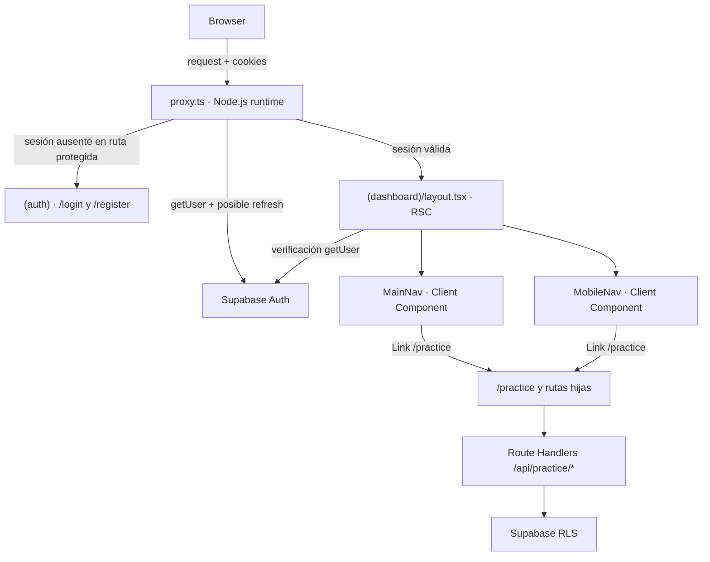
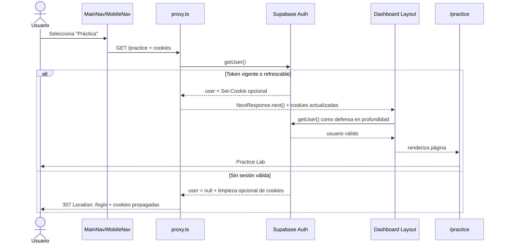

# PL-14 — Navegación y protección del Practice Lab con Proxy de Next.js 16

> **Estado:** Implementado y verificado (12/07/2026).
> **Fecha de auditoría del repositorio:** 12/07/2026.  
> **Alcance:** esta guía enseña a modificar el frontend, pero su generación no modifica `frontend/`.

## Sección 1: 🎓 Introducción y Fundamentos Conceptuales

PL-06 creó el hub `/practice`, PL-07 a PL-12 completaron sus experiencias y PL-13 integró sus métricas en el dashboard. Sin embargo, el producto todavía tiene dos brechas de integración: la navegación principal no muestra “Práctica” y el guard global conserva la convención `middleware.ts`, deprecada desde Next.js 16.

PL-14 cierra el Bloque H sin cambiar páginas, APIs ni contratos de datos. El delta se limita a:

1. exponer `/practice` en la navegación desktop y mobile;
2. migrar `frontend/middleware.ts` a `frontend/proxy.ts`;
3. conservar el refresco de cookies y las redirecciones de Supabase Auth;
4. proteger tanto `/practice` como `/plan`, que existe en el área autenticada pero quedó omitida en el guard histórico.

### Analogía profesional

Imagina un edificio de capacitación. Los carteles del vestíbulo son la navegación: permiten encontrar el laboratorio, pero no impiden que alguien sin credencial intente entrar. El control de acceso de la puerta es Proxy: inspecciona la petición antes de que llegue a la sala, refresca la credencial cuando corresponde y redirige al login si no hay una sesión válida.

Dentro del edificio hay un segundo control. El layout de `(dashboard)` vuelve a verificar al usuario con `getUser()`, las Route Handlers validan sus propias operaciones y Supabase aplica RLS cerca de los datos. Esta defensa en profundidad importa porque Proxy es un filtro y coordinador de sesión, no la única autorización del sistema.

La migración de `middleware.ts` a `proxy.ts` se parece a cambiar el nombre y la plataforma de una garita sin perder su protocolo. No basta con renombrar el archivo: el export debe llamarse `proxy`, los comentarios ya no deben afirmar que corre en Edge y las cookies emitidas durante un refresh deben sobrevivir incluso cuando la respuesta final es una redirección.

`MainNav` y `MobileNav` son Client Components porque usan `usePathname()` y, en mobile, estado y efectos. Next.js genera HTML inicial y React hidrata esas islas interactivas; al navegar, `usePathname()` cambia y vuelve a calcular qué enlace está activo. El layout sigue siendo un React Server Component: obtiene la identidad en el servidor y compone ambas navegaciones sin enviar esa lógica sensible al navegador.

### Contrato de seguridad de PL-14

| Capa | Responsabilidad | No sustituye |
|---|---|---|
| `proxy.ts` | Refrescar cookies, filtrar rutas y redirigir antes del render | Autorización de datos |
| `app/(dashboard)/layout.tsx` | Verificar al usuario antes de renderizar el grupo protegido | Auth propia de APIs |
| Route Handlers | Autorizar cada operación y devolver errores JSON apropiados | RLS |
| Supabase RLS | Restringir filas por usuario cerca de la persistencia | Navegación o UX |
| `MainNav` / `MobileNav` | Descubrimiento de rutas y estado activo | Seguridad |

> [!IMPORTANT]
> Next.js `16.2.9` ejecuta Proxy en runtime Node.js por defecto. No agregues `export const runtime = "edge"`: esa configuración no está disponible en archivos Proxy.

---

## Sección 2: 📋 Prerequisitos y Verificación del Entorno

Ejecuta todos los comandos desde:

```powershell
Set-Location "C:\Users\jsife\OneDrive\Desktop\Repositorios\practica-testing"
```

### 2.1 Runtime instalado

La versión instalada de `next` es `16.2.9` y su `engines.node` exige `>=20.9.0`. La auditoría encontró:

```powershell
node --version
npm --version
node -p "require('./frontend/node_modules/next/package.json').version"
node -p "require('./frontend/node_modules/next/package.json').engines.node"
```

Salida reproducida el 12/07/2026:

```text
v24.16.0
11.6.2
16.2.9
>=20.9.0
```

### 2.2 Dependencias funcionales

```powershell
$requiredGuides = @(
  "docs\guides\db\PL-01.md",
  "docs\guides\db\PL-02.md",
  "docs\guides\fe\FE-03.md",
  "docs\guides\fe\FE-04.md",
  "docs\guides\fe\PL-06.md",
  "docs\guides\fe\PL-13.md"
)

foreach ($path in $requiredGuides) {
  if (-not (Test-Path -LiteralPath $path)) {
    throw "Falta la dependencia: $path"
  }

  "OK: $path"
}
```

Salida esperada:

```text
OK: docs\guides\db\PL-01.md
OK: docs\guides\db\PL-02.md
OK: docs\guides\fe\FE-03.md
OK: docs\guides\fe\FE-04.md
OK: docs\guides\fe\PL-06.md
OK: docs\guides\fe\PL-13.md
```

Evidencia ya reconciliada:

- PL-01 y PL-02 tienen migraciones aplicadas para `practice_exercises`, `practice_submissions` y sus políticas RLS.
- FE-03, **Paso B**, creó el guard histórico de autenticación.
- FE-04, **Pasos B y C**, creó `MainNav` y `MobileNav`.
- PL-06 creó `/practice` y dejó explícitamente la navegación para PL-14.
- PL-13 registró `tsc` y build exitosos el 12/07/2026.

### 2.3 Archivos y rutas reales

```powershell
$paths = @(
  "frontend\middleware.ts",
  "frontend\app\(dashboard)\_components\main-nav.tsx",
  "frontend\app\(dashboard)\_components\mobile-nav.tsx",
  "frontend\app\(dashboard)\layout.tsx",
  "frontend\app\(dashboard)\plan\page.tsx",
  "frontend\app\(dashboard)\practice\page.tsx",
  "frontend\app\(dashboard)\practice\[topicCode]\page.tsx",
  "frontend\app\(dashboard)\practice\api-testing\page.tsx",
  "frontend\app\(dashboard)\practice\bug-lab\page.tsx"
)

foreach ($path in $paths) {
  "$(Test-Path -LiteralPath $path)  $path"
}

Test-Path -LiteralPath "frontend\proxy.ts"
```

Antes de implementar, las nueve rutas existentes deben devolver `True` y `frontend\proxy.ts` debe devolver `False`.

### 2.4 Configuración de Supabase sin revelar valores

Las variables fueron introducidas en FE-02, **Pasos C y D**, y consumidas por el guard de FE-03, **Paso B**. Verifica únicamente su presencia:

```powershell
$envText = Get-Content -Raw -LiteralPath "frontend\.env.local"
$requiredNames = @(
  "NEXT_PUBLIC_SUPABASE_URL",
  "NEXT_PUBLIC_SUPABASE_ANON_KEY"
)

foreach ($name in $requiredNames) {
  $pattern = "(?m)^" + [regex]::Escape($name) + "=.+$"

  if ($envText -notmatch $pattern) {
    throw "Falta la variable requerida: $name"
  }

  "CONFIGURADA: $name"
}
```

No uses `Get-Content frontend/.env.local` sin filtrado y no copies valores a terminales, capturas, Markdown o logs.

### 2.5 Línea base ejecutada antes de redactar

```powershell
npx tsc --noEmit --project frontend/tsconfig.json
npm --prefix frontend run build
```

Resultado real del 12/07/2026:

```text
TypeScript: código 0, sin errores.
Next.js 16.2.9: compilación correcta y 21 páginas generadas.
Warning no bloqueante actual:
The "middleware" file convention is deprecated. Please use "proxy" instead.
```

Ese warning es precisamente el gate de PL-14: debe desaparecer después de la implementación.

---

## Sección 3: 📂 Estructura de Directorios del Proyecto

Árbol pertinente verificado antes de implementar:

```text
frontend/
├── app/
│   ├── (dashboard)/
│   │   ├── _components/
│   │   │   ├── main-nav.tsx             MODIFICAR
│   │   │   ├── mobile-nav.tsx           MODIFICAR
│   │   │   └── user-menu.tsx            NO TOCAR
│   │   ├── dashboard/page.tsx            NO TOCAR
│   │   ├── layout.tsx                    NO TOCAR
│   │   ├── plan/page.tsx                 NO TOCAR
│   │   ├── practice/
│   │   │   ├── [topicCode]/page.tsx      NO TOCAR
│   │   │   ├── api-testing/page.tsx      NO TOCAR
│   │   │   ├── bug-lab/page.tsx          NO TOCAR
│   │   │   └── page.tsx                  NO TOCAR
│   │   ├── session/page.tsx              NO TOCAR
│   │   └── setup/page.tsx                NO TOCAR
│   └── auth/callback/route.ts             NO TOCAR
├── lib/supabase/server.ts                 NO TOCAR
├── middleware.ts                          ELIMINAR MEDIANTE RENOMBRE
├── proxy.ts                               NUEVO
├── package.json                           NO TOCAR
└── next.config.ts                         NO TOCAR
```

| Acción | Archivo | Motivo |
|---|---|---|
| Crear mediante renombre | `frontend/proxy.ts` | Adoptar la convención de Next.js 16 y conservar el guard |
| Eliminar mediante renombre | `frontend/middleware.ts` | Evitar mantener dos convenciones o el warning deprecado |
| Modificar | `frontend/app/(dashboard)/_components/main-nav.tsx` | Agregar “Práctica” en desktop y marcar rutas hijas como activas |
| Modificar | `frontend/app/(dashboard)/_components/mobile-nav.tsx` | Agregar “Práctica” con emoji 🔬 en mobile |
| No tocar | `frontend/app/(dashboard)/layout.tsx` | Ya aporta la segunda verificación con `getUser()` |
| No tocar | `frontend/app/api/practice/*` | Conservan autenticación propia y respuestas JSON; Proxy no debe convertir errores API en HTML |
| No tocar | `frontend/app/(dashboard)/practice/*` | El Practice Lab ya está implementado |
| No tocar | `frontend/lib/supabase/server.ts` | El cliente de Server Components conserva su contrato |
| No tocar | `frontend/.env.local` | Solo se verifica presencia; nunca se muestran valores |

> [!NOTE]
> “Agregar Práctica al layout” significa actualizar los dos componentes de navegación que el layout ya renderiza. No es necesario modificar `layout.tsx`.

---

## Sección 4: 🎨 Diagrama de Arquitectura de Componentes



### Separación de rutas

| Categoría | Rutas | Comportamiento de Proxy |
|---|---|---|
| Auth pública | `/login`, `/register` | Usuario autenticado → `/dashboard` |
| UI protegida | `/dashboard`, `/plan`, `/practice`, `/session`, `/setup` y sus hijas | Sin usuario → `/login` |
| Callback | `/auth/callback` | Excluido por el matcher para intercambiar código por sesión |
| APIs | `/api/*` | El matcher conserva refresh; cada handler autoriza y responde por sí mismo |
| Assets | `/_next/static`, `/_next/image`, favicon e imágenes | Excluidos del matcher |

### Flujo Completo



Al retornar una redirección nueva, las cookies de `supabaseResponse` deben copiarse a esa respuesta. De lo contrario, un refresh o una limpieza de sesión realizados por Supabase podrían perderse justo durante el redirect.

---

## Sección 5: 🛠️ Implementación Paso a Paso

### Paso A — Agregar “Práctica” a la navegación desktop

**Ruta:** `frontend/app/(dashboard)/_components/main-nav.tsx`  
**Acción:** modificar.  
**Anchor real:** `const routes = [`, actualmente debajo de los imports.

Reemplaza el archivo completo por:

```tsx
"use client";

import Link from "next/link";
import { usePathname } from "next/navigation";

const routes = [
  { href: "/dashboard", label: "Dashboard" },
  { href: "/plan", label: "Mi Plan" },
  { href: "/session", label: "Sesión Actual" },
  { href: "/practice", label: "Práctica" },
] as const;

function isActivePath(pathname: string, href: string): boolean {
  return pathname === href || pathname.startsWith(`${href}/`);
}

export function MainNav() {
  const pathname = usePathname();

  return (
    <nav className="hidden items-center space-x-6 text-sm font-medium md:flex">
      {routes.map((route) => {
        const isActive = isActivePath(pathname, route.href);

        return (
          <Link
            key={route.href}
            href={route.href}
            aria-current={isActive ? "page" : undefined}
            className={
              isActive
                ? "text-emerald-400 transition-colors hover:text-emerald-300"
                : "text-slate-400 transition-colors hover:text-emerald-400"
            }
          >
            {route.label}
          </Link>
        );
      })}
    </nav>
  );
}
```

`isActivePath` diferencia `/practice` y sus hijas de un prefijo accidental como `/practice-old`. Las clases Tailwind son completas y estáticas en cada rama, por lo que Tailwind 4 puede detectarlas sin safelist.

**Entregable del Paso A:**

- [ ] “Práctica” aparece en desktop.
- [ ] `/practice`, `/practice/bug-lab` y `/practice/api-testing` resaltan el mismo enlace.
- [ ] El enlace activo expone `aria-current="page"`.
- [ ] El archivo conserva `"use client"` porque `usePathname()` requiere un Client Component.

### Paso B — Agregar “Práctica” a la navegación mobile

**Ruta:** `frontend/app/(dashboard)/_components/mobile-nav.tsx`  
**Acción:** modificar.  
**Anchor real:** `const routes = [`, actualmente después de los imports de Sheet.

Reemplaza el archivo completo por:

```tsx
"use client";

import { useEffect, useState } from "react";
import Link from "next/link";
import { usePathname } from "next/navigation";
import { Menu } from "lucide-react";

import { Button } from "@/components/ui/button";
import {
  Sheet,
  SheetClose,
  SheetContent,
  SheetTitle,
  SheetTrigger,
} from "@/components/ui/sheet";

const routes = [
  { href: "/dashboard", label: "Dashboard", emoji: "📊" },
  { href: "/plan", label: "Mi Plan", emoji: "📋" },
  { href: "/session", label: "Sesión Actual", emoji: "📖" },
  { href: "/practice", label: "Práctica", emoji: "🔬" },
] as const;

function isActivePath(pathname: string, href: string): boolean {
  return pathname === href || pathname.startsWith(`${href}/`);
}

export function MobileNav() {
  const [open, setOpen] = useState(false);
  const pathname = usePathname();

  useEffect(() => {
    setOpen(false);
  }, [pathname]);

  return (
    <div className="md:hidden">
      <Sheet open={open} onOpenChange={setOpen}>
        <SheetTrigger asChild>
          <Button
            variant="ghost"
            size="icon"
            className="text-slate-400 hover:bg-slate-800 hover:text-white"
            aria-label="Abrir menú de navegación"
          >
            <Menu className="h-5 w-5" />
          </Button>
        </SheetTrigger>

        <SheetContent
          side="left"
          className="flex w-[280px] flex-col border-slate-800 bg-slate-950 p-6 text-slate-50"
        >
          <SheetTitle className="mb-2 text-lg font-bold text-white">
            ISTQB <span className="text-emerald-400">Agent</span>
          </SheetTitle>

          <div className="mb-4 border-b border-slate-800" />

          <nav className="flex flex-col space-y-1">
            {routes.map((route) => {
              const isActive = isActivePath(pathname, route.href);

              return (
                <SheetClose asChild key={route.href}>
                  <Link
                    href={route.href}
                    aria-current={isActive ? "page" : undefined}
                    className={
                      isActive
                        ? "flex items-center gap-3 rounded-lg bg-emerald-950/50 px-3 py-3 text-sm font-medium text-emerald-400 transition-colors"
                        : "flex items-center gap-3 rounded-lg px-3 py-3 text-sm font-medium text-slate-400 transition-colors hover:bg-slate-800/50 hover:text-white"
                    }
                  >
                    <span className="text-lg" aria-hidden="true">
                      {route.emoji}
                    </span>
                    {route.label}
                  </Link>
                </SheetClose>
              );
            })}
          </nav>

          <div className="mt-auto border-t border-slate-800 pt-4">
            <p className="text-center text-xs text-slate-600">
              ISTQB Study Agent v1.0
            </p>
          </div>
        </SheetContent>
      </Sheet>
    </div>
  );
}
```

`SheetClose` cierra el panel al activar un enlace y el efecto sobre `pathname` cubre cambios de ruta producidos por otros controles. `aria-hidden` evita que el lector de pantalla anuncie el emoji como información duplicada.

**Entregable del Paso B:**

- [ ] “🔬 Práctica” aparece en el Sheet.
- [ ] El enlace activo se resalta también en rutas hijas.
- [ ] El enlace activo expone `aria-current="page"`.
- [ ] El Sheet se cierra después de navegar.
- [ ] El botón mantiene un nombre accesible.

### Paso C — Renombrar la convención a `proxy.ts`

**Ruta origen existente:** `frontend/middleware.ts`  
**Ruta destino nueva:** `frontend/proxy.ts`  
**Acción:** renombrar; no conservar ambos archivos.  
**Anchors reales:** `export async function middleware(request: NextRequest)` y `export const config`.

Haz primero un movimiento controlado para que Git pueda reconocer el rename:

```powershell
if (-not (Test-Path -LiteralPath "frontend\middleware.ts")) {
  throw "No existe frontend\middleware.ts"
}

if (Test-Path -LiteralPath "frontend\proxy.ts") {
  throw "frontend\proxy.ts ya existe; revisa antes de sobrescribir"
}

Move-Item `
  -LiteralPath "frontend\middleware.ts" `
  -Destination "frontend\proxy.ts"
```

La documentación local de Next.js también ofrece el codemod `middleware-to-proxy`, pero no es el paso principal aquí: PL-14 necesita reconciliar `/plan`, agregar `/practice` y conservar cookies en redirects, cambios específicos que el rename automático no resuelve.

**Entregable del Paso C:**

- [ ] `frontend/proxy.ts` existe.
- [ ] `frontend/middleware.ts` ya no existe.
- [ ] No se instaló ninguna dependencia nueva.

### Paso D — Reemplazar Proxy con el contrato completo

**Ruta:** `frontend/proxy.ts`  
**Acción:** reemplazar el contenido completo.  
**Anchor posterior al rename:** `export async function middleware(request: NextRequest)`.

Usa este archivo completo:

```ts
import { createServerClient } from "@supabase/ssr";
import { NextResponse, type NextRequest } from "next/server";

import type { Database } from "@/types";

const AUTH_ROUTE_PREFIXES = ["/login", "/register"] as const;

const PROTECTED_ROUTE_PREFIXES = [
  "/dashboard",
  "/plan",
  "/practice",
  "/session",
  "/setup",
] as const;

function isPathOrChild(pathname: string, prefix: string): boolean {
  return pathname === prefix || pathname.startsWith(`${prefix}/`);
}

function redirectWithCookies(
  request: NextRequest,
  pathname: string,
  sourceResponse: NextResponse,
): NextResponse {
  const redirectResponse = NextResponse.redirect(
    new URL(pathname, request.url),
  );

  for (const cookie of sourceResponse.cookies.getAll()) {
    redirectResponse.cookies.set(cookie);
  }

  return redirectResponse;
}

export async function proxy(request: NextRequest) {
  const supabaseUrl = process.env.NEXT_PUBLIC_SUPABASE_URL;
  const supabaseAnonKey = process.env.NEXT_PUBLIC_SUPABASE_ANON_KEY;

  if (!supabaseUrl || !supabaseAnonKey) {
    throw new Error("Falta la configuración pública de Supabase.");
  }

  let supabaseResponse = NextResponse.next({
    request: {
      headers: request.headers,
    },
  });

  const supabase = createServerClient<Database>(
    supabaseUrl,
    supabaseAnonKey,
    {
      cookies: {
        getAll() {
          return request.cookies.getAll();
        },
        setAll(cookiesToSet) {
          for (const { name, value } of cookiesToSet) {
            request.cookies.set(name, value);
          }

          supabaseResponse = NextResponse.next({
            request,
          });

          for (const { name, value, options } of cookiesToSet) {
            supabaseResponse.cookies.set(name, value, options);
          }
        },
      },
    },
  );

  const {
    data: { user },
  } = await supabase.auth.getUser();

  const pathname = request.nextUrl.pathname;
  const isAuthRoute = AUTH_ROUTE_PREFIXES.some((prefix) =>
    isPathOrChild(pathname, prefix),
  );
  const isProtectedRoute = PROTECTED_ROUTE_PREFIXES.some((prefix) =>
    isPathOrChild(pathname, prefix),
  );

  if (!user && isProtectedRoute) {
    return redirectWithCookies(request, "/login", supabaseResponse);
  }

  if (user && isAuthRoute) {
    return redirectWithCookies(request, "/dashboard", supabaseResponse);
  }

  return supabaseResponse;
}

export const config = {
  matcher: [
    "/((?!_next/static|_next/image|favicon.ico|.*\\.(?:svg|png|jpg|jpeg|gif|webp)$|auth/callback).*)",
  ],
};
```

Decisiones importantes:

- El export se llama `proxy`, como requiere Next.js 16.
- No se declara runtime: Proxy usa Node.js por defecto.
- `/plan` se agrega porque la ruta real existe dentro de `(dashboard)` y el guard histórico solo conservaba `/setup`.
- `/practice` protege automáticamente `/practice/[topicCode]`, `/practice/bug-lab` y `/practice/api-testing`.
- La comparación respeta segmentos; `/practice-old` no se considera hija de `/practice`.
- El matcher amplio se conserva para mantener refresh de sesión y redirects de auth. No se agrega `/api/practice` a la lista de redirects protegidos.
- `redirectWithCookies` propaga cualquier `Set-Cookie` producido por Supabase antes de redirigir.
- El error por configuración ausente es sanitizado y nunca imprime valores.

> [!WARNING]
> No sustituyas `getUser()` por `getSession()` en este milestone. El proyecto conserva el contrato seguro de FE-03 y la verificación redundante del layout. Tampoco retires auth de Route Handlers ni RLS.

**Entregable del Paso D:**

- [ ] `proxy.ts` exporta una única función `proxy` y `config`.
- [ ] El matcher conserva assets y `auth/callback` fuera del guard.
- [ ] Las cinco rutas UI reales están protegidas.
- [ ] Los redirects conservan cookies de refresh o limpieza.
- [ ] No existe `runtime = "edge"`.

### Paso E — Revisión del delta antes de compilar

```powershell
Test-Path -LiteralPath "frontend\proxy.ts"
Test-Path -LiteralPath "frontend\middleware.ts"

git status --short

Get-Content -Raw -LiteralPath "frontend\proxy.ts"

git diff -- `
  "frontend/proxy.ts" `
  "frontend/middleware.ts" `
  "frontend/app/(dashboard)/_components/main-nav.tsx" `
  "frontend/app/(dashboard)/_components/mobile-nav.tsx"
```

> [!NOTE]
> Antes de preparar cambios, Git no incluye un archivo nuevo no trackeado en `git diff`. Revisa `frontend/proxy.ts` completo en el editor y usa `git status --short` para confirmar el par borrado/nuevo; este paso no requiere hacer staging.

Salida estructural esperada:

```text
True
False
```

Revisa el diff como un único patch:

- `git status --short` puede mostrar ` D frontend/middleware.ts` y `?? frontend/proxy.ts` hasta que decidas preparar los cambios; juntos representan el rename intencional;
- el export cambió de `middleware` a `proxy`;
- `/plan` y `/practice` están en `PROTECTED_ROUTE_PREFIXES`;
- ambos menús incluyen exactamente el mismo href y label;
- no hay secretos, archivos de práctica ni endpoints modificados.

**Entregable del Paso E:**

- [ ] El delta coincide con los cuatro archivos funcionales declarados.
- [ ] No hay dos guards globales.
- [ ] No hay cambios fuera del alcance.

---

## Sección 6: ✅ Checkpoints de Verificación

### Checkpoint 1 — Estado de archivos

```powershell
Test-Path -LiteralPath "frontend\proxy.ts"
Test-Path -LiteralPath "frontend\middleware.ts"
```

Salida obligatoria:

```text
True
False
```

### Checkpoint 2 — TypeScript estricto

```powershell
npx tsc --noEmit --project frontend/tsconfig.json
```

Salida esperada: ninguna; código de salida `0`.

### Checkpoint 3 — Build de producción y gate de deprecación

```powershell
npm --prefix frontend run build
```

Salida esperada resumida:

```text
▲ Next.js 16.2.9
✓ Compiled successfully
✓ Generating static pages (.../21)
ƒ Proxy (Middleware)
```

El rótulo interno `Proxy (Middleware)` puede aparecer en la tabla de Next.js. Lo que **no** debe aparecer es:

```text
The "middleware" file convention is deprecated.
```

Si aparece el warning, `frontend/middleware.ts` todavía existe o la migración no quedó aplicada.

### Checkpoint 4 — Arranque local

```powershell
npm --prefix frontend run dev
```

Salida esperada:

```text
▲ Next.js 16.2.9
- Local: http://localhost:3000
✓ Ready
```

Mantén esta terminal abierta para los checks HTTP y visuales.

### Checkpoint 5 — Rutas anónimas protegidas

Desde otra terminal, sin reutilizar cookies:

```powershell
curl.exe -sS -o NUL -D - "http://localhost:3000/practice"
curl.exe -sS -o NUL -D - "http://localhost:3000/practice/FL-1.1.1"
curl.exe -sS -o NUL -D - "http://localhost:3000/practice/bug-lab"
curl.exe -sS -o NUL -D - "http://localhost:3000/practice/api-testing"
curl.exe -sS -o NUL -D - "http://localhost:3000/plan"
```

Cada respuesta debe tener status `307` y un header `Location` absoluto que termine en `/login`, normalmente `http://localhost:3000/login`. No aceptes `200` anónimo, `308` ni un error `500`.

### Checkpoint 6 — Callback y assets no bloqueados

```powershell
curl.exe -sS -o NUL -D - "http://localhost:3000/favicon.ico"
curl.exe -sS -o NUL -D - "http://localhost:3000/auth/callback"
```

`favicon.ico` debe responder como asset. El callback puede redirigir a `/login?error=auth_callback_failed` por no recibir `code`; no debe ser interceptado como ruta protegida.

### Checkpoint 7 — Las APIs conservan `401` JSON

`/api/practice/generate` debe seguir autorizando dentro del Route Handler. Envía un body sintácticamente válido, pero sin cookies:

```powershell
$body = '{"document_id":"00000000-0000-4000-8000-000000000001","topic_code":"FL-1.1.1","level_k":"K1","exercise_type":"test_cases"}'

$body | curl.exe -sS -i `
  -H "Content-Type: application/json" `
  --data-binary "@-" `
  "http://localhost:3000/api/practice/generate"
```

Salida esperada:

```text
HTTP/1.1 401 Unauthorized
content-type: application/json

{"error":"No autenticado. Inicia sesión para generar ejercicios."}
```

Un `307`, un `Location: /login` o HTML en este checkpoint indica que Proxy invadió el contrato de la API.

### Checkpoint 8 — Navegación autenticada desktop

1. Inicia sesión con una cuenta de prueba ya existente; no copies sus credenciales a la guía.
2. Abre `http://localhost:3000/dashboard` con un viewport de `1280px`.
3. Confirma los enlaces: Dashboard, Mi Plan, Sesión Actual y Práctica.
4. Abre `/practice` y luego `/practice/bug-lab`.
5. “Práctica” debe permanecer en color esmeralda en ambas URLs.
6. Recarga `/practice`: no debe regresar a `/login` si la sesión es válida.

### Checkpoint 9 — Navegación autenticada mobile

1. Usa DevTools con viewport de `375px`.
2. Abre el menú hamburguesa.
3. Verifica “🔬 Práctica”.
4. Toca el enlace.
5. Confirma que navega a `/practice`, el Sheet se cierra y el enlace queda activo al reabrirlo.
6. Repite en `/practice/api-testing`.

### Checkpoint 10 — Redirecciones de auth y cookies

Con sesión válida, visita `/login` y `/register`: ambas deben redirigir a `/dashboard`. En DevTools → Network confirma que la navegación no entra en loop. Si Supabase renueva o limpia cookies, verifica solo que existan headers `Set-Cookie`; no copies ni muestres sus valores.

### Checkpoint 11 — Higiene del patch

```powershell
git diff --check
git status --short

$trailingWhitespace = Select-String `
  -LiteralPath "frontend\proxy.ts" `
  -Pattern "[ \x09]+$"

if ($trailingWhitespace) {
  $trailingWhitespace
  throw "proxy.ts contiene espacios finales"
}
```

`git diff --check` debe terminar sin errores. Como el archivo nuevo puede seguir untracked, el segundo check cubre sus espacios finales de manera explícita. Identifica en el status el rename del guard y los dos menús de PL-14 sin borrar ni mezclar otros cambios previos del workspace.

### Checklist completa

- [x] `frontend/proxy.ts` existe y `frontend/middleware.ts` no.
- [x] El export global se llama `proxy`.
- [x] No se configuro Edge runtime.
- [x] `/practice` y todas sus rutas hijas redirigen al login sin sesion.
- [x] `/plan` quedo reconciliada como ruta protegida.
- [x] `/auth/callback` sigue excluida del matcher.
- [x] Los endpoints conservan auth propia y respuestas JSON.
- [x] `POST /api/practice/generate` anonimo devuelve `401 application/json`.
- [x] "Practica" aparece en desktop.
- [x] "🔬 Practica" aparece en mobile.
- [x] El estado activo funciona en rutas hijas.
- [x] El Sheet se cierra al navegar.
- [x] Un usuario autenticado puede recargar `/practice`.
- [x] `/login` y `/register` redirigen al dashboard con sesion.
- [x] TypeScript termina con codigo `0`.
- [x] El build genera las 21 paginas.
- [x] El warning de convencion `middleware` desaparece.
- [x] No se imprimieron secretos ni cookies.

### Matriz de edge cases

| Caso | Entrada/estado | Resultado esperado |
|---|---|---|
| Visitante en hub | `GET /practice` sin cookies | Redirect a `/login` |
| Visitante en ruta dinámica | `GET /practice/FL-1.1.1` | Redirect a `/login` |
| Visitante en laboratorio | `GET /practice/bug-lab` | Redirect a `/login` |
| Visitante en plan | `GET /plan` | Redirect a `/login` |
| Sesión válida | `GET /practice` | Render del hub |
| Access token refrescable | Cookies con refresh válido | Continúa y propaga cookies nuevas |
| Sesión inválida | Cookies expiradas/no válidas | Redirect y limpieza de cookies propagada |
| Usuario autenticado en auth | `GET /login` | Redirect a `/dashboard` |
| Callback sin código | `GET /auth/callback` | Lo maneja su Route Handler; no Proxy |
| Asset | `GET /favicon.ico` | Respuesta del asset |
| API anónima | `POST /api/practice/generate` con body válido | `401` JSON, nunca redirect ni HTML |
| Prefijo parecido | `/practice-old` | No se clasifica como hija de `/practice` |
| Ruta hija activa | `/practice/api-testing` | Enlace “Práctica” activo |
| Mobile | 375px, navegación a Practice | Sheet cierra y URL cambia |
| Desktop | 1280px | Cuatro enlaces visibles |

---

## Sección 7: 🚨 Troubleshooting — Problemas Comunes

| Problema | Causa probable | Solución |
|---|---|---|
| El build aún muestra el warning de `middleware` | El archivo original sigue presente | Confirma `Test-Path -LiteralPath "frontend\middleware.ts"` → `False` |
| Next.js no reconoce el guard | Se renombró el archivo pero el export sigue llamándose `middleware` | Usa `export async function proxy(request: NextRequest)` |
| Error al declarar runtime | Se copió `runtime = "edge"` desde una guía antigua | Elimina esa exportación; Proxy usa Node.js por defecto en Next 16 |
| `/practice` funciona, pero `/plan` queda fuera del guard | Se copió la lista histórica sin reconciliar rutas reales | Incluye `/plan` y `/practice` en `PROTECTED_ROUTE_PREFIXES` |
| Un usuario con token refrescable entra en loop | La redirección nueva descartó las cookies de `supabaseResponse` | Conserva `redirectWithCookies` y copia cada cookie al redirect |
| Login o APIs devuelven resultados inesperados | Se redujo el matcher o se convirtió `/api/*` en redirect HTML | Conserva el matcher auditado y deja auth/respuestas en cada Route Handler |
| “Práctica” aparece en desktop pero no en mobile | Solo se actualizó uno de los arrays de rutas | Agrega el mismo `href` y label a ambos componentes; mobile lleva emoji 🔬 |
| El enlace no queda activo en una ruta hija | Se usó igualdad estricta solamente | Reutiliza el helper `isActivePath` completo del Paso A |
| Error `Falta la configuración pública de Supabase` | Falta una variable en `frontend/.env.local` | Revisa FE-02 Pasos C/D; valida presencia sin imprimir valores y reinicia dev |
| `auth/callback` no completa el flujo | Se retiró su exclusión del matcher | Restaura `auth/callback` dentro del lookahead negativo |
| El build falla por tipos de cookies | Se reconstruyó manualmente un tipo incompatible | Usa `redirectResponse.cookies.set(cookie)`; `getAll()` ya retorna `ResponseCookie` compatible |

---

## Sección 8: 📝 Resumen y Próximo Paso

Con PL-14 implementarás un único delta coherente:

1. agregarás “Práctica” a las navegaciones desktop y mobile;
2. mantendrás el enlace activo en todo `/practice/*`;
3. migrarás `middleware.ts` a `proxy.ts` según Next.js `16.2.9`;
4. corregirás la brecha histórica de `/plan` y protegerás `/practice`;
5. preservarás cookies durante respuestas normales y redirects;
6. mantendrás el layout, Route Handlers y RLS como defensa en profundidad;
7. eliminarás el warning de convención deprecada con `tsc` y build verificables.

La implementación **no está completada por la existencia de esta guía**. Después de aplicar los pasos, solicita:

```text
Valida mi progreso de la guía PL-14 en su sección 6
```

El siguiente milestone secuencial del roadmap es **AI-01 — Schema: preferencias IA + tracking de uso/tokens**. Los gates correctivos de PL-02, PL-05, PL-09 y PL-11 quedaron cerrados el 12/07/2026, por lo que AI-01 está lista para implementación manual. La rehidratación de Bug Lab pertenece exclusivamente al addendum de PL-11; PL-14 conserva su alcance de navegación y Proxy.

`PL-15` existe únicamente en el Backlog Post-MVP y no desplaza a AI-01 ni se convierte automáticamente en la siguiente guía.

---

*Guía PL-14 — ISTQB Study Agent — Julio 2026*  
*Usar junto con `docs/roadmap/ISTQB_Guias_Implementacion.md` y `frontend/node_modules/next/dist/docs/01-app/03-api-reference/03-file-conventions/proxy.md`.*
