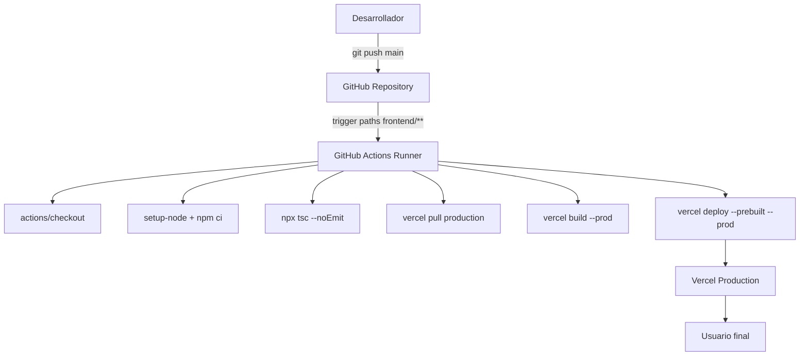
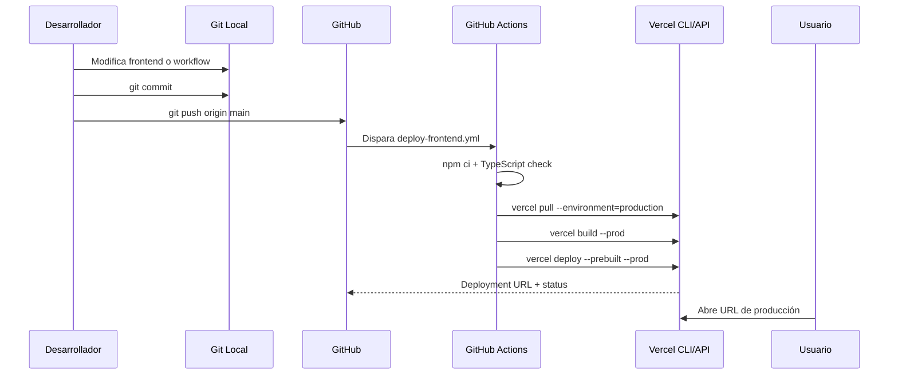

# PR-01 — GitHub Actions: CI/CD frontend → Vercel

> **Bloque:** 🚀 BLOQUE G — Producción  
> **Guía anterior:** [DA-05 — UI: Fecha Estimada de Examen + Contadores Ejecutivos](file:///c:/Users/jsife/OneDrive/Desktop/Repositorios/practica-testing/docs/guides/fe/DA-05.md)  
> **Siguiente guía:** [PR-02 — GitHub Actions: CI/CD backend → DigitalOcean](file:///c:/Users/jsife/OneDrive/Desktop/Repositorios/practica-testing/docs/guides/fe/PR-02.md)  
> **Next.js instalado:** **16.2.9** según `frontend/package-lock.json` (`package.json` declara `^16.2.7`)  
> **Fecha:** 5 julio 2026

---

## Sección 1: 🎓 Introducción y Fundamentos Conceptuales

### ¿Dónde estamos?

Completaste el **Bloque F — Dashboard de Progreso**. El frontend ya tiene autenticación, upload, generación de plan, sesión adaptativa, evaluación, feedback y dashboard con métricas visuales. Ahora el objetivo deja de ser construir pantallas y pasa a ser **operar el producto como software publicable**.

**PR-01** crea un pipeline real de **GitHub Actions** para desplegar el frontend de Next.js a **Vercel**. A diferencia de la integración nativa de Vercel con GitHub, aquí queremos que el repositorio tenga un workflow explícito en `.github/workflows/deploy-frontend.yml`. Esto hace visible el proceso profesional: checkout, instalación, validación TypeScript, pull de configuración de Vercel, build de producción y deploy.

También hay un bloqueo real en el repositorio actual: `.gitignore` contiene `frontend/`, por lo que gran parte del código fuente del frontend no queda trackeado salvo cuando se fuerza con `git add -f`. Antes de desplegar a Vercel, el código fuente debe vivir en GitHub. Vercel no puede compilar lo que no está en el repositorio remoto.

### Analogía profesional

Imagina una **planta embotelladora de bebidas**. Ya tienes la receta perfecta: ingredientes, proporciones, etiqueta y diseño de botella. Pero si cada lote se envasa manualmente por una persona distinta, cada entrega puede salir diferente: una botella con poca tapa, otra sin etiqueta, otra con fecha incorrecta. El producto existe, pero no hay garantía de repetibilidad.

Un pipeline de CI/CD funciona como la línea automatizada de embotellado. Cada vez que entra una nueva receta aprobada, la máquina verifica insumos, limpia botellas, llena, tapa, etiqueta, empaqueta y publica el lote bajo las mismas reglas. Si algo falla, el lote se detiene antes de llegar al cliente.

En este proyecto, GitHub Actions será esa línea automatizada y Vercel será la red de distribución. El desarrollador hace `git push`, GitHub ejecuta el workflow, Vercel construye la versión final del frontend y publica la app. Ya no dependes de que tu laptop tenga el estado correcto; dependes de un proceso declarativo y repetible.

### Conceptos React y Next.js relevantes

#### Monorepo y Root Directory

El repositorio contiene `frontend/` y `backend/`. Para Vercel, el proyecto Next.js vive dentro de `frontend/`, no en la raíz. El workflow debe ejecutar comandos con `working-directory: frontend` y la configuración de Vercel debe estar enlazada al proyecto correcto mediante `VERCEL_ORG_ID` y `VERCEL_PROJECT_ID`.

#### Vercel CLI dentro de GitHub Actions

El workflow usará `vercel pull`, `vercel build` y `vercel deploy --prebuilt`. Esta estrategia evita clicks manuales y deja el deploy como código revisable. Los secretos viven en GitHub Secrets y las variables de aplicación viven en Vercel Environment Variables.

#### Variables públicas y privadas

Las variables con prefijo `NEXT_PUBLIC_` pueden llegar al navegador. Las privadas (`SUPABASE_SERVICE_ROLE_KEY`, `OPENAI_API_KEY`, `GEMINI_API_KEY`) solo deben usarse en Route Handlers o código servidor. En Vercel deben configurarse como Environment Variables, nunca imprimirse en logs.

---

## Sección 2: 📋 Prerequisitos y Verificación del Entorno

Ejecuta desde la raíz del workspace en PowerShell.

```powershell
node --version
```

Salida esperada:

```text
v20.9.0 o superior
```

```powershell
npm --prefix frontend list next
```

Salida esperada:

```text
frontend@0.1.0 C:\Users\jsife\OneDrive\Desktop\Repositorios\practica-testing\frontend
`-- next@16.2.9
```

```powershell
npm --prefix frontend run build
```

Salida esperada resumida:

```text
✓ Compiled successfully
```

Verifica el problema actual de tracking:

```powershell
git check-ignore -v "frontend/package.json"
```

Salida actual esperada antes de corregir `.gitignore`:

```text
.gitignore:7:frontend/ frontend/package.json
```

Credenciales que necesitarás crear fuera del repo:

| Secreto / Variable | Dónde se configura | Uso |
|---|---|---|
| `VERCEL_TOKEN` | GitHub Secrets | Permite a GitHub Actions ejecutar Vercel CLI. |
| `VERCEL_ORG_ID` | GitHub Secrets | Identifica tu equipo/cuenta de Vercel. |
| `VERCEL_PROJECT_ID` | GitHub Secrets | Identifica el proyecto frontend en Vercel. |
| `NEXT_PUBLIC_SUPABASE_URL` | Vercel Environment Variables | URL pública de Supabase. |
| `NEXT_PUBLIC_SUPABASE_ANON_KEY` | Vercel Environment Variables | Llave pública anon de Supabase. |
| `NEXT_PUBLIC_FASTAPI_URL` | Vercel Environment Variables | URL pública del backend DigitalOcean. |
| `SUPABASE_SERVICE_ROLE_KEY` | Vercel Environment Variables | Solo servidor, nunca cliente. |
| `OPENAI_API_KEY` / `GEMINI_API_KEY` | Vercel Environment Variables | LLM en Route Handlers. |
| `GEMINI_OPENAI_BASE_URL` | Vercel Environment Variables | Endpoint compatible OpenAI para Gemini. |

No ejecutes comandos que impriman `.env.local` completo. Verifica solo presencia de claves con `Select-String -Quiet` si lo necesitas.

---

## Sección 3: 📂 Estructura de Directorios del Proyecto

Árbol relevante al finalizar PR-01:

```text
practica-testing/
├─ .github/
│  └─ workflows/
│     └─ deploy-frontend.yml                    # NUEVO — deploy frontend a Vercel
├─ .gitignore                                   # MODIFICADO — ya no ignora frontend/
├─ backend/                                     # Existente — no se modifica en PR-01
├─ docs/
│  └─ guides/
│     └─ fe/
│        ├─ DA-05.md                            # Existente
│        ├─ PR-01.md                            # Esta guía
│        └─ PR-02.md                            # Siguiente guía
├─ frontend/                                    # Código fuente ahora trackeable por Git
│  ├─ app/                                      # Existente — App Router
│  ├─ components/                               # Existente — UI y dashboard
│  ├─ lib/                                      # Existente — Supabase/OpenAI/utils
│  ├─ types/                                    # Existente — contratos TS
│  ├─ package.json                              # Existente
│  ├─ package-lock.json                         # Existente
│  └─ tsconfig.json                             # Existente
└─ supabase/                                    # Existente — no se modifica
```

| Archivo | Acción | Motivo |
|---|---|---|
| `.gitignore` | Modificar | Permitir que Git trackee el código fuente de `frontend/`. |
| `.github/workflows/deploy-frontend.yml` | Crear | Pipeline real de GitHub Actions hacia Vercel. |
| `frontend/**` | Trackear | Vercel necesita el código en GitHub para compilar. |

Archivos que **NO** tocarás en PR-01:

| Archivo | Motivo |
|---|---|
| `frontend/.env.local` | Contiene secretos locales. Nunca se sube. |
| `backend/**` | Backend se despliega en PR-02. |
| `frontend/app/**` | PR-01 no cambia lógica de app. Solo deploy. |
| `frontend/types/**` | No hay cambios de contrato. |

---

## Sección 4: 🎨 Diagrama de Arquitectura de Componentes



### Flujo Completo



---

## Sección 5: 🛠️ Implementación Paso a Paso

### Paso A — Corregir `.gitignore`

Archivo exacto:

```text
.gitignore
```

Reemplaza la regla agresiva `frontend/` por ignores específicos. Contenido recomendado:

```text
# Variables de entorno secretas (locales)
.env
.env.local
.env*.local
backend/.env

# Dependencias de Node.js
node_modules/
**/node_modules/

# Compilación de Next.js
.next/
**/.next/
out/
build/

# Vercel local metadata
.vercel/

# Logs de sistema y archivos temporales
npm-debug.log*
yarn-debug.log*
yarn-error.log*
.pnpm-debug.log*
.docusaurus/
.DS_Store
Thumbs.db

# Python virtual environment
venv/
backend/venv/
.venv/
**/.venv/

# Python bytecode
__pycache__/
*.py[cod]
*$py.class

# Docker local
docker-compose.override.yml
```

Entregable del Paso A:

```text
.gitignore modificado, sin la regla frontend/
```

### Paso B — Crear el proyecto en Vercel y configurar Environment Variables

En Vercel:

1. Crea/importa el proyecto desde GitHub.
2. Configura **Root Directory** como `frontend`.
3. En **Environment Variables**, agrega las variables de Supabase, FastAPI y LLM necesarias.
4. Obtén `VERCEL_ORG_ID` y `VERCEL_PROJECT_ID` desde Vercel Project Settings o con `vercel link` local.
5. Crea un token en **Account Settings → Tokens**.
6. En GitHub, configura repository secrets: `VERCEL_TOKEN`, `VERCEL_ORG_ID`, `VERCEL_PROJECT_ID`.

No guardes esos valores en archivos del repo.

### Paso C — Crear workflow `deploy-frontend.yml`

Archivo exacto:

```text
.github/workflows/deploy-frontend.yml
```

Contenido completo:

```yaml
name: Deploy Frontend to Vercel

on:
  push:
    branches: [main]
    paths:
      - "frontend/**"
      - ".github/workflows/deploy-frontend.yml"
  workflow_dispatch:

concurrency:
  group: deploy-frontend-${{ github.ref }}
  cancel-in-progress: true

jobs:
  deploy:
    name: Build and Deploy Frontend
    runs-on: ubuntu-latest
    env:
      VERCEL_ORG_ID: ${{ secrets.VERCEL_ORG_ID }}
      VERCEL_PROJECT_ID: ${{ secrets.VERCEL_PROJECT_ID }}

    defaults:
      run:
        working-directory: frontend

    steps:
      - name: Checkout repository
        uses: actions/checkout@v4

      - name: Setup Node.js
        uses: actions/setup-node@v4
        with:
          node-version: "20"
          cache: "npm"
          cache-dependency-path: frontend/package-lock.json

      - name: Install dependencies
        run: npm ci

      - name: TypeScript check
        run: npx tsc --noEmit --project tsconfig.json

      - name: Install Vercel CLI
        run: npm install --global vercel@latest

      - name: Pull Vercel production environment
        run: vercel pull --yes --environment=production --token=${{ secrets.VERCEL_TOKEN }}

      - name: Build production bundle
        run: vercel build --prod --token=${{ secrets.VERCEL_TOKEN }}

      - name: Deploy prebuilt bundle
        run: vercel deploy --prebuilt --prod --token=${{ secrets.VERCEL_TOKEN }}
```

Entregable del Paso C:

```text
.github/workflows/deploy-frontend.yml creado
```

### Paso D — Stage seguro y commit

No uses `git add .` en este repo. Usa paths explícitos:

```powershell
git add ".gitignore" ".github/workflows/deploy-frontend.yml" "frontend/"
```

Salida esperada:

```text
# Sin salida si el comando fue correcto.
```

Revisa antes de commitear:

```powershell
git status --short
```

Salida esperada resumida:

```text
M  .gitignore
A  .github/workflows/deploy-frontend.yml
A  frontend/...
```

Commit:

```powershell
git commit -m "ci(PR-01): deploy frontend a Vercel con GitHub Actions"
```

---

## Sección 6: ✅ Checkpoints de Verificación

```powershell
git check-ignore -v "frontend/package.json"
```

Salida esperada después de corregir `.gitignore`:

```text
# Sin salida: frontend/package.json ya no está ignorado.
```

```powershell
Test-Path ".github/workflows/deploy-frontend.yml"
```

Salida esperada:

```text
True
```

```powershell
npx tsc --noEmit --project frontend/tsconfig.json
```

Salida esperada:

```text
# Sin salida: TypeScript compila correctamente.
```

En GitHub Actions deberías ver:

```text
Deploy Frontend to Vercel ✅
```

Verificación visual:

- La URL de producción de Vercel carga la landing.
- Login/register funcionan.
- `/dashboard` carga sin errores de variables faltantes.
- Si el backend aún no acepta CORS del dominio Vercel, las llamadas al extractor pueden fallar hasta completar PR-02.

Tabla de edge cases:

| Escenario | Resultado esperado |
|---|---|
| Falta `VERCEL_TOKEN` | GitHub Actions falla en `vercel pull` sin imprimir secretos. |
| `frontend/` sigue ignorado | `git check-ignore` muestra `.gitignore:... frontend/`; no implementar hasta corregir. |
| Root Directory incorrecto | Vercel build falla por no encontrar `package.json`. |
| Variable `NEXT_PUBLIC_FASTAPI_URL` apunta a localhost | Producción carga UI, pero falla al llamar backend. |

Checklist:

- [ ] `.gitignore` ya no contiene `frontend/`.
- [ ] `.github/workflows/deploy-frontend.yml` creado.
- [ ] `frontend/package.json` ya no está ignorado.
- [ ] Secrets `VERCEL_TOKEN`, `VERCEL_ORG_ID`, `VERCEL_PROJECT_ID` configurados en GitHub.
- [ ] Variables de entorno de app configuradas en Vercel.
- [ ] GitHub Actions despliega a Vercel correctamente.

---

## Sección 7: 🚨 Troubleshooting — Problemas Comunes

| Problema | Causa Probable | Solución |
|---|---|---|
| `No package.json found` | Root Directory no apunta a `frontend`. | Configura Vercel project root en `frontend` y asegúrate de ejecutar Actions con `working-directory: frontend`. |
| `vercel pull` falla con 401 | `VERCEL_TOKEN` incorrecto o expirado. | Regenera token y actualiza GitHub Secret. |
| `VERCEL_PROJECT_ID` faltante | Proyecto no enlazado correctamente. | Obtén el Project ID desde Vercel Settings y guárdalo como secret. |
| Frontend no aparece en GitHub | `.gitignore` aún contiene `frontend/`. | Elimina esa regla y verifica con `git check-ignore -v`. |
| API falla por CORS | Backend no permite el dominio de Vercel. | Completa PR-02 y configura `FRONTEND_ORIGIN`. |
| Se imprimen secretos en logs | Se usó `echo` o comandos que muestran `.env`. | Nunca imprimir valores; verificar solo nombres o presencia. |

---

## Sección 8: 📝 Resumen y Próximo Paso

1. Corregiste `.gitignore` para que el frontend pueda entrar a Git.
2. Creaste un workflow real de GitHub Actions para Vercel.
3. Configuraste los secretos `VERCEL_*` en GitHub.
4. Dejaste las variables de aplicación en Vercel Environment Variables.
5. Validaste TypeScript antes del deploy.
6. Publicaste el frontend desde CI/CD.

Cuando termines, valida tu progreso con:

```text
Valida mi progreso de la guía PR-01 sección 6
```

El siguiente paso es **PR-02 — GitHub Actions: CI/CD backend → DigitalOcean**.
