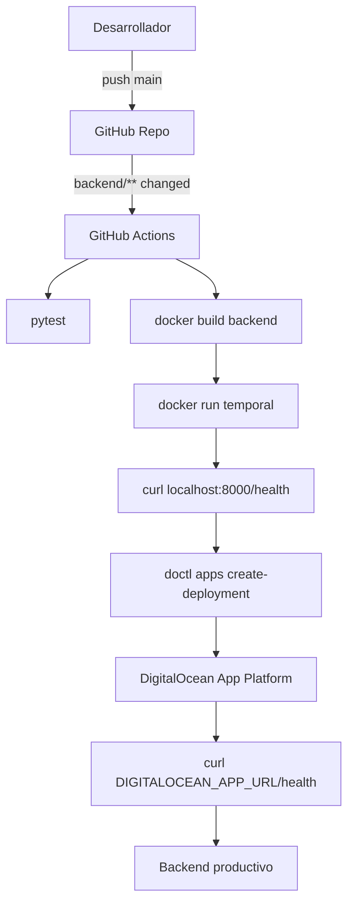
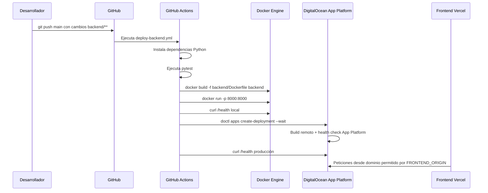

# PR-02 — GitHub Actions: CI/CD backend → DigitalOcean

> **Bloque:** 🚀 BLOQUE G — Producción  
> **Guía anterior:** [PR-01 — GitHub Actions: CI/CD frontend → Vercel](file:///c:/Users/jsife/OneDrive/Desktop/Repositorios/practica-testing/docs/guides/fe/PR-01.md)  
> **Siguiente guía:** [PR-03 — Variables de Entorno en Producción](file:///c:/Users/jsife/OneDrive/Desktop/Repositorios/practica-testing/docs/guides/fe/PR-03.md)  
> **Python version:** **3.12** según `backend/Dockerfile`  
> **Fecha:** 5 julio 2026

---

## Sección 1: 🎓 Introducción y Fundamentos Conceptuales

### ¿Dónde estamos?

En **PR-01** dejaste el frontend listo para producción con GitHub Actions y Vercel. Ahora toca el backend: el microservicio FastAPI que extrae texto de PDFs y detecta tópicos ISTQB. Este backend ya tiene `backend/Dockerfile`, `.do/app.yaml` y endpoint público `/health`.

**PR-02** crea un workflow real de **GitHub Actions** para validar y desplegar el backend a **DigitalOcean App Platform**. El pipeline hará cuatro cosas profesionales: ejecutar tests, construir la imagen Docker localmente, levantar un contenedor temporal y verificar `/health`, y finalmente disparar un deployment en DigitalOcean usando `doctl`.

No migraremos la App Platform a DigitalOcean Container Registry en esta guía. La razón es pragmática: `.do/app.yaml` ya está configurado para desplegar desde GitHub con `dockerfile_path: backend/Dockerfile` y `source_dir: backend`. Cambiar a DOCR implicaría reescribir la spec de App Platform. En PR-02 buscamos CI/CD seguro usando la infraestructura que ya funciona.

### Analogía profesional

Imagina la **cocina de un restaurante de alta cocina**. Antes de servir un plato nuevo a los clientes, el chef no solo mira que la receta exista. Primero prueba los ingredientes, luego cocina un plato de muestra, verifica temperatura, presentación y sabor, y solo después autoriza que la cocina lo sirva al comedor.

El workflow de backend hace lo mismo. Los tests son la revisión de ingredientes. El `docker build` es cocinar el plato completo en un entorno limpio. El health check local es probar que el plato está servido y listo. DigitalOcean App Platform es el comedor: solo debe recibir el nuevo backend si pasó todos los controles previos.

Esta separación protege al usuario. Si el código Python no compila, si Docker falla o si `/health` no responde, GitHub Actions detiene el despliegue antes de afectar producción.

### Conceptos React y Next.js relevantes

Aunque esta guía toca backend, sigue siendo parte del frontend productivo: el frontend de Vercel llamará al backend de DigitalOcean mediante `NEXT_PUBLIC_FASTAPI_URL`. Por eso debemos cuidar **CORS**. El backend debe aceptar el dominio exacto del frontend de producción, idealmente mediante una variable de entorno como `FRONTEND_ORIGIN`, no hardcodeando URLs en código.

#### GitHub Actions como compuerta de calidad

El workflow vive en `.github/workflows/deploy-backend.yml`. Se dispara cuando cambian archivos de `backend/**`, `.do/app.yaml` o el propio workflow. Así evitamos desplegar el backend cuando solo se cambian documentos o componentes del frontend.

#### Docker build local antes del deploy remoto

DigitalOcean también construirá Docker durante el deploy, pero construir la imagen en GitHub Actions primero detecta errores más rápido y con logs más accesibles. Si el Dockerfile falla en CI, no vale la pena iniciar un deploy remoto.

---

## Sección 2: 📋 Prerequisitos y Verificación del Entorno

Ejecuta desde la raíz del workspace en PowerShell.

```powershell
Test-Path "backend/Dockerfile"
```

Salida esperada:

```text
True
```

```powershell
Test-Path ".do/app.yaml"
```

Salida esperada:

```text
True
```

```powershell
Test-Path "backend/app/routers/health.py"
```

Salida esperada:

```text
True
```

```powershell
Select-String -Path "backend/Dockerfile" -Pattern "app.main:app" -Quiet
```

Salida esperada:

```text
True
```

```powershell
Select-String -Path ".do/app.yaml" -Pattern "deploy_on_push: true" -Quiet
```

Salida esperada:

```text
True
```

Secrets que debes configurar en GitHub:

| Secret | Uso |
|---|---|
| `DIGITALOCEAN_ACCESS_TOKEN` | Permite a `doctl` crear deployments. |
| `DIGITALOCEAN_APP_ID` | ID de la App Platform existente. |
| `DIGITALOCEAN_APP_URL` | URL pública del backend para validar `/health` después del deploy. |

Variables que debes configurar en DigitalOcean App Platform:

| Variable | Tipo | Uso |
|---|---|---|
| `SUPABASE_URL` | SECRET | Conexión backend a Supabase. |
| `SUPABASE_SERVICE_ROLE_KEY` | SECRET | Operaciones servidor con permisos elevados. |
| `FRONTEND_ORIGIN` | texto plano | Dominio exacto de Vercel, por ejemplo `https://tu-app.vercel.app`. |

---

## Sección 3: 📂 Estructura de Directorios del Proyecto

Árbol relevante al finalizar PR-02:

```text
practica-testing/
├─ .do/
│  └─ app.yaml                                  # Existente — spec App Platform
├─ .github/
│  └─ workflows/
│     ├─ deploy-frontend.yml                   # Existente — PR-01
│     └─ deploy-backend.yml                    # NUEVO — PR-02
├─ backend/
│  ├─ app/
│  │  ├─ core/
│  │  │  └─ config.py                          # MODIFICADO — FRONTEND_ORIGIN opcional
│  │  ├─ routers/
│  │  │  ├─ health.py                          # Existente — GET /health
│  │  │  └─ pdf.py                             # Existente
│  │  └─ main.py                               # MODIFICADO — CORS dinámico
│  ├─ tests/                                   # Existente — pytest
│  ├─ Dockerfile                               # Existente — build producción
│  └─ requirements.txt                         # Existente
└─ docs/
   └─ guides/fe/PR-02.md                       # Esta guía
```

| Archivo | Acción | Motivo |
|---|---|---|
| `backend/app/core/config.py` | Modificar | Añadir `FRONTEND_ORIGIN`. |
| `backend/app/main.py` | Modificar | Usar CORS dinámico según ambiente. |
| `.github/workflows/deploy-backend.yml` | Crear | CI/CD real hacia DigitalOcean. |

Archivos que **NO** tocarás en PR-02:

| Archivo | Motivo |
|---|---|
| `backend/.env` | Contiene secretos locales. No se sube. |
| `backend/Dockerfile` | Ya funciona; solo se valida con Docker build. |
| `.do/app.yaml` | Ya tiene Git deploy + Dockerfile; solo configura env vars en DO dashboard. |
| `frontend/**` | Frontend ya se trató en PR-01. |

---

## Sección 4: 🎨 Diagrama de Arquitectura de Componentes



### Flujo Completo



---

## Sección 5: 🛠️ Implementación Paso a Paso

### Paso A — Añadir `FRONTEND_ORIGIN` a configuración

Archivo exacto:

```text
backend/app/core/config.py
```

Dentro de `class Settings`, agrega:

```python
    FRONTEND_ORIGIN: str | None = None
```

Debe quedar cerca de las variables de servidor o Supabase. Esta variable se configurará en DigitalOcean como el dominio real de Vercel.

Entregable:

```text
backend/app/core/config.py modificado con FRONTEND_ORIGIN
```

### Paso B — Configurar CORS dinámico

Archivo exacto:

```text
backend/app/main.py
```

Antes de `app.add_middleware`, define los orígenes permitidos:

```python
allowed_origins = [
    "http://localhost:3000",
    "http://127.0.0.1:3000",
]

if settings.FRONTEND_ORIGIN:
    allowed_origins.append(settings.FRONTEND_ORIGIN)
```

Luego cambia el middleware para usar la lista:

```python
app.add_middleware(
    CORSMiddleware,
    allow_origins=allowed_origins,
    allow_credentials=True,
    allow_methods=["*"],
    allow_headers=["*"],
)
```

No hardcodees la URL de Vercel en código. Usa `FRONTEND_ORIGIN` en DigitalOcean.

### Paso C — Crear workflow `deploy-backend.yml`

Archivo exacto:

```text
.github/workflows/deploy-backend.yml
```

Contenido completo:

```yaml
name: Deploy Backend to DigitalOcean

on:
  push:
    branches: [main]
    paths:
      - "backend/**"
      - ".do/app.yaml"
      - ".github/workflows/deploy-backend.yml"
  workflow_dispatch:

concurrency:
  group: deploy-backend-${{ github.ref }}
  cancel-in-progress: true

jobs:
  deploy:
    name: Test, Build and Deploy Backend
    runs-on: ubuntu-latest

    steps:
      - name: Checkout repository
        uses: actions/checkout@v4

      - name: Setup Python
        uses: actions/setup-python@v5
        with:
          python-version: "3.12"

      - name: Install backend dependencies
        working-directory: backend
        run: |
          python -m pip install --upgrade pip
          pip install -r requirements.txt
          pip install pytest

      - name: Run backend tests
        working-directory: backend
        run: python -m pytest tests --maxfail=1

      - name: Build Docker image
        run: docker build -f backend/Dockerfile -t istqb-backend:${{ github.sha }} backend

      - name: Run container for local health check
        run: docker run -d --name istqb-backend-test -p 8000:8000 istqb-backend:${{ github.sha }}

      - name: Verify local health endpoint
        run: |
          for i in {1..30}; do
            if curl -fsS http://localhost:8000/health; then
              echo "Backend health check OK"
              exit 0
            fi
            echo "Waiting for backend... attempt $i"
            sleep 2
          done
          docker logs istqb-backend-test
          exit 1

      - name: Cleanup local container
        if: always()
        run: docker rm -f istqb-backend-test || true

      - name: Install doctl
        uses: digitalocean/action-doctl@v2
        with:
          token: ${{ secrets.DIGITALOCEAN_ACCESS_TOKEN }}

      - name: Trigger DigitalOcean App Platform deployment
        run: doctl apps create-deployment ${{ secrets.DIGITALOCEAN_APP_ID }} --wait

      - name: Verify production health endpoint
        run: curl -fsS "${{ secrets.DIGITALOCEAN_APP_URL }}/health"
```

Este workflow no enmascara fallos: si `pytest`, Docker o `/health` fallan, el pipeline falla.

### Paso D — Configurar variables en DigitalOcean

En DigitalOcean App Platform, configura:

```text
FRONTEND_ORIGIN=https://tu-app.vercel.app
SUPABASE_URL=...
SUPABASE_SERVICE_ROLE_KEY=...
```

No subas estos valores a Git.

### Paso E — Stage seguro y commit

No uses `git add .`. Usa paths explícitos:

```powershell
git add "backend/app/core/config.py" "backend/app/main.py" ".github/workflows/deploy-backend.yml"
```

Salida esperada:

```text
# Sin salida si el comando fue correcto.
```

Commit:

```powershell
git commit -m "ci(PR-02): deploy backend a DigitalOcean con GitHub Actions"
```

---

## Sección 6: ✅ Checkpoints de Verificación

```powershell
Test-Path ".github/workflows/deploy-backend.yml"
```

Salida esperada:

```text
True
```

```powershell
Select-String -Path "backend/app/core/config.py" -Pattern "FRONTEND_ORIGIN" -Quiet
```

Salida esperada:

```text
True
```

```powershell
Select-String -Path "backend/app/main.py" -Pattern "allowed_origins" -Quiet
```

Salida esperada:

```text
True
```

```powershell
docker build -f backend/Dockerfile -t istqb-backend:test backend
```

Salida esperada resumida:

```text
Successfully built ...
```

En GitHub Actions deberías ver:

```text
Deploy Backend to DigitalOcean ✅
```

Verificación manual de producción:

```powershell
curl https://tu-api.ondigitalocean.app/health
```

Salida esperada:

```text
{"status":"ok","version":"0.1.0"}
```

Tabla de edge cases:

| Escenario | Resultado esperado |
|---|---|
| `DIGITALOCEAN_ACCESS_TOKEN` falta | Workflow falla en `Install doctl`. |
| Tests fallan | Workflow se detiene antes de Docker/deploy. |
| Docker no construye | Workflow se detiene antes de DigitalOcean. |
| `/health` local no responde | No se dispara deployment remoto. |
| `FRONTEND_ORIGIN` no coincide con Vercel | Backend despliega, pero frontend falla por CORS. |

Checklist:

- [ ] `FRONTEND_ORIGIN` agregado a `Settings`.
- [ ] `backend/app/main.py` usa `allowed_origins` dinámico.
- [ ] `.github/workflows/deploy-backend.yml` creado.
- [ ] Secrets `DIGITALOCEAN_ACCESS_TOKEN`, `DIGITALOCEAN_APP_ID`, `DIGITALOCEAN_APP_URL` configurados en GitHub.
- [ ] Variables `SUPABASE_*` y `FRONTEND_ORIGIN` configuradas en DigitalOcean.
- [ ] GitHub Actions valida tests, Docker y health check antes de desplegar.

---

## Sección 7: 🚨 Troubleshooting — Problemas Comunes

| Problema | Causa Probable | Solución |
|---|---|---|
| `pytest` no encuentra módulos `app.*` | Se ejecutó desde la raíz incorrecta. | Usa `working-directory: backend` en el step de tests. |
| Docker build falla por `requirements.txt not found` | Contexto Docker incorrecto. | Usa `docker build -f backend/Dockerfile ... backend`. |
| Health check local falla | Contenedor no levantó o puerto incorrecto. | Revisa `docker logs istqb-backend-test` y que el CMD use puerto 8000. |
| `doctl` falla con 401 | Token inválido. | Regenera `DIGITALOCEAN_ACCESS_TOKEN` y actualiza GitHub Secret. |
| CORS bloquea frontend | `FRONTEND_ORIGIN` ausente o con slash final. | Configura exactamente `https://tu-app.vercel.app` sin `/` final. |
| App Platform despliega pero falla por Supabase | Faltan `SUPABASE_URL` o `SUPABASE_SERVICE_ROLE_KEY`. | Configura secrets en DigitalOcean App Settings. |

---

## Sección 8: 📝 Resumen y Próximo Paso

1. Agregaste `FRONTEND_ORIGIN` para CORS dinámico.
2. Evitaste hardcodear dominios de Vercel en el backend.
3. Creaste un workflow real de GitHub Actions para backend.
4. El pipeline ejecuta tests, Docker build y health check local antes de desplegar.
5. El deploy remoto se dispara con `doctl apps create-deployment --wait`.
6. Validaste `/health` en producción después del deploy.

Cuando termines, valida tu progreso con:

```text
Valida mi progreso de la guía PR-02 sección 6
```

El siguiente paso es **PR-03 — Variables de Entorno en Producción**.
