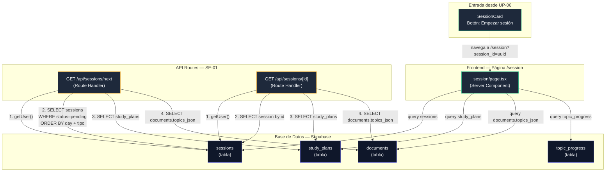
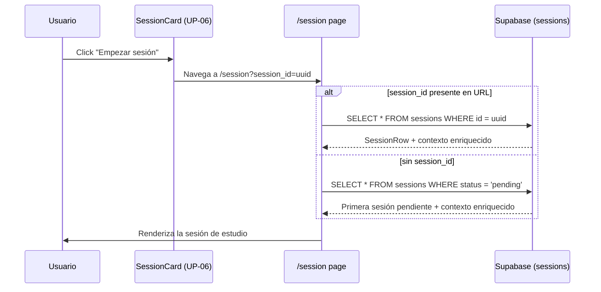

# SE-01 — API Routes de Sesión y Página `/session`

> **Bloque:** 📚 Sesión de Estudio
> **Guía anterior:** [UP-06 — UI: Visualización del Plan como Calendario](file:///c:/Users/jsife/OneDrive/Desktop/Repositorios/practica-testing/docs/guides/fe/UP-06.md)
> **Guía siguiente:** SE-02 — Prompt de Teoría + API Route `/api/sessions/[id]/theory`
> **Fecha:** Junio 2026

---

## Sección 1: 🎓 Introducción y Fundamentos Conceptuales

### ¿Dónde estamos?

En **UP-06** completamos el **BLOQUE D** (Upload y Plan) con una victoria visual espectacular: transformamos la lista plana de sesiones en un **calendario dinámico** con componentes descompuestos (`PlanHeader`, `PlanStats`, `ExamCountdown`, `PlanCalendar`, `DayCard`, `SessionCard`). El botón **"Empezar sesión"** del `SessionCard` ya navega a `/session?session_id=<uuid>`, pero esa ruta muestra un placeholder que dice *"Sesión de estudio en construcción — Próximamente en SE-01"*.

**Ahora comienza BLOQUE E — Sesión de Estudio**, el corazón de la aplicación. Aquí es donde el usuario realmente estudia, responde preguntas, y el sistema adaptativo evalúa su progreso.

### ¿Qué construiremos en SE-01?

SE-01 crea la primera capa funcional que alimentará la sesión de estudio: API Routes para obtener sesiones y una página `/session` que deja de ser placeholder. Específicamente:

1. **API Route `GET /api/sessions/next`** — Retorna la próxima sesión que el usuario debe completar.
2. **API Route `GET /api/sessions/[id]`** — Retorna los datos completos de una sesión específica (por su UUID).
3. **Tipos TypeScript compartidos** — Interfaces para el response de la API que serán reutilizados en SE-02 a SE-08.
4. **Página `/session` funcional** — Reemplaza el placeholder de UP-06 por una vista que muestra la sesión cargada, sus tópicos y el progreso del plan.

La analogía profesional: piensa en un **director de escuela** que cada mañana revisa el plan de estudio del alumno y le dice *"hoy te toca FL-1.1.1 con método 'theory', aquí tienes los materiales"*. La API Route `/api/sessions/next` ES ese director: consulta la base de datos, aplica reglas de prioridad, y retorna exactamente lo que el frontend necesita para iniciar la sesión.

### Reglas de prioridad de sesiones

El roadmap define una política clara de qué sesión es "la siguiente":

| Prioridad | Regla | Ejemplo |
|---|---|---|
| 🥇 **1ª** | Sesiones de **refuerzo** (`reinforcement`) pendientes | El usuario sacó 55% en FL-1.1.1 → se creó una sesión de refuerzo de 15 min |
| 🥈 **2ª** | Sesiones **regulares** (`morning`/`night`) pendientes, ordenadas por `day_number` ASC | Día 1 mañana antes que Día 1 noche, antes que Día 2 mañana |
| 🏁 **3ª** | Si no hay sesiones pendientes → `null` (plan completado) |

Esta lógica es crucial porque en SE-07 (sistema adaptativo) se crearán sesiones de refuerzo dinámicamente. La API de SE-01 debe estar preparada para priorizarlas desde el inicio.

### Conceptos clave de Next.js en esta guía

#### 1. Route Handlers con segmentos dinámicos (`[id]`)

En el App Router, un archivo en `app/api/sessions/[id]/route.ts` captura cualquier URL como `/api/sessions/abc123`. El parámetro `id` llega como parte del segundo argumento:

```typescript
// app/api/sessions/[id]/route.ts
export async function GET(
  request: Request,
  { params }: { params: Promise<{ id: string }> }
) {
  const { id } = await params; // "abc123"
  // ...
}
```

> **⚠️ Next.js 15+:** `params` es una `Promise`. Debes hacer `await params` antes de acceder a `id`. Si olvidas el `await`, TypeScript no te dará error pero `id` será `undefined` en runtime.

#### 2. Patrón de seguridad: Autenticación + Ownership

Toda API Route protegida sigue un flujo de dos pasos que hemos usado desde UP-02:

```
1. ¿El usuario está autenticado? → getUser() con el Supabase server client
2. ¿El recurso le pertenece?     → WHERE user_id = auth.uid() (RLS lo fuerza)
```

En SE-01, la tabla `sessions` tiene una columna `user_id` protegida por RLS (DB-04). Cuando hacemos `supabase.from('sessions').select(...)`, Supabase **automáticamente** filtra por el `user_id` del token JWT del usuario. No necesitamos agregar `.eq('user_id', user.id)` manualmente, pero lo haremos como **defensa en profundidad**.

#### 3. Diferencia entre `/api/sessions/next` y `/api/sessions/[id]`

| Endpoint | Propósito | ¿Quién lo usa en SE-01? |
|---|---|---|
| `GET /api/sessions/next` | "Dame la siguiente sesión que debo estudiar" | Pruebas manuales y futuros clientes JSON; la página `/session` aplica la misma regla con Supabase directo |
| `GET /api/sessions/[id]` | "Dame los datos completos de la sesión `X`" | Pruebas manuales y futuros clientes JSON; la página `/session` usa `session_id` para hacer la query server-side |

Ambos endpoints retornan la **misma estructura de datos** (`SessionWithContext`), lo que facilita el trabajo del frontend en SE-03.

---

## Sección 2: 📋 Prerequisitos y Verificación del Entorno

### Herramientas y runtime

| Herramienta | Verificación | Versión esperada |
|---|---|---|
| Node.js | `node --version` | v18+ |
| npm | `npm --version` | 9+ |
| Next.js | `npx next --version` | 16.x |
| TypeScript | `npx tsc --version` | 5.x |

### Dependencias del proyecto

No se requieren nuevas dependencias npm para SE-01. Todas las librerías necesarias ya están instaladas:

```powershell
# Verificar que estás en el directorio correcto
cd c:\Users\jsife\OneDrive\Desktop\Repositorios\practica-testing\frontend

# Verificar dependencias clave para SE-01 (ya instaladas desde FE-01/FE-02)
npm ls @supabase/ssr @supabase/supabase-js next
```

Salida esperada (versiones pueden variar ligeramente):

```
frontend@0.1.0
├── @supabase/ssr@0.12.x
├── @supabase/supabase-js@2.108.x
└── next@16.2.x
```

### Deliverables de guías anteriores (obligatorios)

Antes de iniciar SE-01, verifica que **todos** estos entregables existen:

| Guía | Entregable | Verificación |
|---|---|---|
| **DB-02** | Tabla `sessions` con columnas `id`, `study_plan_id`, `user_id`, `topic_codes`, `session_type`, `day_number`, `status`, `method_used`, etc. | Visible en Supabase Table Editor |
| **DB-02** | Tabla `topic_progress` con `topic_code`, `level_k`, `status` | Visible en Supabase Table Editor |
| **DB-02** | Tabla `documents` con `topics_json` (JSONB) | Visible en Supabase Table Editor |
| **DB-04** | RLS habilitado en `sessions` con policy `user_id = auth.uid()` | Verificar en Supabase → Authentication → Policies |
| **FE-02** | `frontend/lib/supabase/server.ts` — Cliente Supabase para servidor | `Test-Path frontend/lib/supabase/server.ts` → `True` |
| **UP-05** | Al menos 1 plan activo con sesiones en la tabla `sessions` | `SELECT count(*) FROM sessions;` → > 0 |
| **UP-06** | Placeholder en `frontend/app/(dashboard)/session/page.tsx` | `Test-Path -LiteralPath "frontend/app/(dashboard)/session/page.tsx"` → `True` |
| **UP-06** | `SessionCard` navega a `/session?session_id=<uuid>` | Verificar en `frontend/app/(dashboard)/plan/_components/session-card.tsx` que el `href` sea `/session?session_id=${sessionId}` |

### Variables de entorno

Las variables necesarias ya deben existir en `.env.local` (creadas en **DB-01** y **FE-01**):

```env
# Solo necesitamos las variables PÚBLICAS para el Supabase anon client
NEXT_PUBLIC_SUPABASE_URL=https://tu-proyecto.supabase.co
NEXT_PUBLIC_SUPABASE_ANON_KEY=eyJ...
```

> **Nota:** SE-01 no necesita `OPENAI_API_KEY` ni `GEMINI_API_KEY`. Esas se usarán a partir de SE-02 (generación de teoría).

---

## Sección 3: 📂 Estructura de Directorios del Proyecto

```
frontend/
├── app/
│   ├── (auth)/                         # [FE-03] Rutas de autenticación
│   │   ├── login/page.tsx
│   │   └── register/page.tsx
│   ├── (dashboard)/                    # [FE-04] Shell del dashboard
│   │   ├── _components/
│   │   │   ├── main-nav.tsx
│   │   │   ├── mobile-nav.tsx
│   │   │   └── user-menu.tsx
│   │   ├── dashboard/page.tsx
│   │   ├── plan/
│   │   │   ├── _components/            # [UP-06] Calendario visual
│   │   │   │   ├── day-card.tsx
│   │   │   │   ├── exam-countdown.tsx
│   │   │   │   ├── plan-calendar.tsx
│   │   │   │   ├── plan-header.tsx
│   │   │   │   ├── plan-preview.tsx
│   │   │   │   ├── plan-stats.tsx
│   │   │   │   └── session-card.tsx
│   │   │   └── page.tsx
│   │   ├── session/
│   │   │   └── page.tsx                # [UP-06] Placeholder → SE-01 lo reemplaza
│   │   ├── setup/                      # [UP-01] Página de configuración
│   │   ├── error.tsx
│   │   ├── layout.tsx
│   │   └── loading.tsx
│   ├── api/
│   │   ├── extract/                    # [UP-03]
│   │   ├── plan/
│   │   │   ├── generate/route.ts       # [UP-04]
│   │   │   └── save/route.ts           # [UP-05]
│   │   ├── sessions/                   # 🆕 SE-01 — NUEVO
│   │   │   ├── next/                   # 🆕 SE-01 — NUEVO
│   │   │   │   └── route.ts            # 🆕 GET /api/sessions/next
│   │   │   └── [id]/                   # 🆕 SE-01 — NUEVO
│   │   │       └── route.ts            # 🆕 GET /api/sessions/[id]
│   │   └── upload/                     # [UP-02]
│   ├── auth/callback/route.ts          # [FE-03]
│   ├── globals.css
│   ├── layout.tsx
│   └── page.tsx
│
├── components/
│   ├── shared/
│   └── ui/                             # [FE-01] shadcn/ui components
│       ├── avatar.tsx
│       ├── badge.tsx
│       ├── button.tsx
│       ├── card.tsx
│       ├── dropdown-menu.tsx
│       ├── input.tsx
│       ├── label.tsx
│       ├── separator.tsx
│       └── sheet.tsx
│
├── lib/
│   ├── openai.ts                       # [UP-04] Cliente OpenAI
│   ├── supabase/
│   │   ├── admin.ts                    # [UP-02] Cliente admin
│   │   ├── client.ts                   # [FE-02] Cliente browser
│   │   └── server.ts                   # [FE-02] Cliente servidor
│   ├── format.ts
│   └── utils.ts
│
├── types/
│   ├── database.ts                     # [FE-02] Tipos de tablas
│   ├── index.ts                        # [FE-02] Barrel exports
│   └── sessions.ts                     # 🆕 SE-01 — NUEVO (tipos de sesión enriquecidos)
│
├── middleware.ts                       # [FE-03] Auth middleware
├── package.json
├── tsconfig.json
└── .env.local
```

**Archivos tocados en esta guía (5):**

| # | Archivo | Propósito |
|---|---|---|
| 1 | `types/sessions.ts` | Nuevo: tipos compartidos para el response de sesiones |
| 2 | `types/index.ts` | Modificado: barrel export de los nuevos tipos |
| 3 | `app/api/sessions/next/route.ts` | Nuevo: API Route de próxima sesión pendiente |
| 4 | `app/api/sessions/[id]/route.ts` | Nuevo: API Route de sesión por ID |
| 5 | `app/(dashboard)/session/page.tsx` | Modificado: reemplaza el placeholder de UP-06 |

---

## Sección 4: 🎨 Diagrama de Arquitectura de Componentes



### Flujo de datos detallado



> [!NOTE]
> Las API Routes `/api/sessions/next` y `/api/sessions/[id]` exponen el mismo contrato para pruebas manuales y consumo JSON. La página `/session` de SE-01 consulta Supabase directamente desde el Server Component para evitar un roundtrip HTTP interno.

---

## Sección 5: 🛠️ Implementación Paso a Paso

### Paso A: Crear el tipo `SessionWithContext`

**Archivo:** `frontend/types/sessions.ts` *(NUEVO)*

Este archivo define la interfaz de datos enriquecida que los API Routes de sesión retornan. No es solo la fila cruda de la tabla `sessions`, sino una versión **enriquecida** con contexto del plan, del documento, y metadatos calculados que el frontend necesita para renderizar la sesión completa.

```typescript
// ============================================================
// types/sessions.ts — Tipos para la API de sesiones de estudio
// ============================================================
// Estos tipos definen la respuesta ENRIQUECIDA que los Route
// Handlers /api/sessions/next y /api/sessions/[id] retornan.
//
// ¿Por qué no usamos SessionRow directamente?
//   SessionRow es la fila CRUDA de la tabla sessions.
//   Pero el frontend necesita CONTEXTO adicional:
//     - El nombre y nivel K de cada tópico (viene de documents.topics_json)
//     - El nombre del plan (viene de study_plans)
//     - La posición de la sesión en el plan (calculado)
//     - El progreso actual del tópico (viene de topic_progress)
//
//   Enviar todo esto en una sola respuesta evita que el frontend
//   haga múltiples roundtrips al servidor.
// ============================================================

import type {
  SessionType,
  SessionStatus,
  MethodUsed,
  ActionTaken,
  LevelK,
  TopicProgressStatus,
} from "./database";

// ──────────────────────────────────────────────────────────────
// Información enriquecida de un tópico dentro de una sesión
// ──────────────────────────────────────────────────────────────

/** Tópico con contexto extraído de documents.topics_json y topic_progress */
export interface SessionTopic {
  /** Código del tópico, ej. "FL-1.1.1" */
  code: string;
  /** Nombre descriptivo del tópico (del topics_json) */
  name: string;
  /** Nivel K del ISTQB: K1, K2, o K3 */
  level_k: LevelK;
  /** Texto del syllabus para este tópico (del topics_json) */
  syllabus_text: string;
  /** Estado actual del progreso del estudiante en este tópico */
  progress_status: TopicProgressStatus;
  /** Número de intentos previos en este tópico */
  attempts: number;
  /** Mejor score obtenido (0-100) */
  best_score: number;
}

// ──────────────────────────────────────────────────────────────
// Contexto del plan de estudio
// ──────────────────────────────────────────────────────────────

/** Metadatos del plan necesarios para mostrar contexto en la sesión */
export interface PlanContext {
  /** ID del plan de estudio */
  plan_id: string;
  /** Número total de días del plan */
  objective_days: number;
  /** Fecha de inicio del plan (ISO date) */
  start_date: string;
  /** Fecha estimada de finalización (ISO date) */
  estimated_end_date: string;
  /** Total de sesiones en el plan */
  total_sessions: number;
  /** Número de sesiones completadas hasta ahora */
  completed_sessions: number;
}

// ──────────────────────────────────────────────────────────────
// Respuesta principal: Sesión con todo su contexto
// ──────────────────────────────────────────────────────────────

/** Respuesta completa de GET /api/sessions/next y GET /api/sessions/[id] */
export interface SessionWithContext {
  // ─── Datos de la sesión (de la tabla sessions) ─────────────
  /** UUID de la sesión */
  id: string;
  /** Tipo de sesión: morning, night, reinforcement, mock_exam */
  session_type: SessionType;
  /** Número de día en el plan (1-based) */
  day_number: number;
  /** Duración en minutos (default 90) */
  duration_minutes: number;
  /** Método de enseñanza: theory, examples, analogies */
  method_used: MethodUsed;
  /** Estado actual: pending, active, completed, skipped */
  status: SessionStatus;
  /** Número de intento (1 = primer intento) */
  attempt_number: number;
  /** Hora programada (ISO string o null) */
  scheduled_at: string | null;
  /** Hora de inicio real (ISO string o null) */
  started_at: string | null;
  /** Hora de finalización (ISO string o null) */
  completed_at: string | null;
  /** Score del quiz (0-100 o null si no evaluada) */
  score_percent: number | null;
  /** Acción tomada por el sistema adaptativo (null si no evaluada) */
  action_taken: ActionTaken | null;
  /** Contenido teórico generado (null hasta SE-02) */
  theory_content: string | null;

  // ─── Datos enriquecidos (calculados por la API) ────────────
  /** Tópicos con contexto completo (nombre, nivel K, texto, progreso) */
  topics: SessionTopic[];
  /** Contexto del plan de estudio */
  plan_context: PlanContext;
  /** Posición ordinal de esta sesión (ej. "Sesión 3 de 14") */
  session_number: number;
}

// ──────────────────────────────────────────────────────────────
// Respuesta de la API cuando no hay sesiones pendientes
// ──────────────────────────────────────────────────────────────

/** GET /api/sessions/next cuando el plan está completado */
export interface NoSessionResponse {
  /** null indica que no hay más sesiones pendientes */
  session: null;
  /** Mensaje descriptivo para el frontend */
  message: string;
  /** Indica si el plan está completado */
  plan_completed: boolean;
}

// ──────────────────────────────────────────────────────────────
// Union type para el response de la API
// ──────────────────────────────────────────────────────────────

/** Response exitoso de GET /api/sessions/next */
export type NextSessionResponse =
  | { session: SessionWithContext }
  | NoSessionResponse;

/** Response exitoso de GET /api/sessions/[id] */
export type SessionByIdResponse = { session: SessionWithContext };
```

**Entregable del Paso A:**
- [x] Archivo `frontend/types/sessions.ts` creado con 4 interfaces y 2 type aliases.

---

### Paso B: Actualizar el barrel de exportaciones de tipos

**Archivo:** `frontend/types/index.ts` *(MODIFICAR)*

Agrega las exportaciones de los nuevos tipos de sesión al barrel existente.

```typescript
// ============================================================
// types/index.ts — Barrel de exportaciones de tipos
// ============================================================
// Punto de entrada centralizado para TODOS los tipos TypeScript
// del proyecto. Cualquier componente o utilidad importa desde:
//
//   import type { UserProfileRow, DocumentRow } from "@/types";
//
// Ventajas del patrón barrel:
//   1. Los imports son más cortos y limpios
//   2. Si reorganizas archivos internos, solo cambias aquí
//   3. Un solo lugar para ver todos los tipos disponibles
// ============================================================

// Re-exportar TODOS los tipos de la base de datos
export type {
  // Union types (enums del negocio)
  StudyPlanStatus,
  SessionType,
  MethodUsed,
  ActionTaken,
  SessionStatus,
  AnswerOption,
  LevelK,
  TopicProgressStatus,

  // Tipos de JSON estructurado
  TopicEntry,
  TopicsJson,
  OptionsJson,

  // user_profiles
  UserProfileRow,
  UserProfileInsert,
  UserProfileUpdate,

  // documents
  DocumentRow,
  DocumentInsert,
  DocumentUpdate,

  // study_plans
  StudyPlanRow,
  StudyPlanInsert,
  StudyPlanUpdate,

  // sessions
  SessionRow,
  SessionInsert,
  SessionUpdate,

  // answers
  AnswerRow,
  AnswerInsert,
  AnswerUpdate,

  // topic_progress
  TopicProgressRow,
  TopicProgressInsert,
  TopicProgressUpdate,

  // Tipo maestro
  Database,
} from "./database";

// 🆕 SE-01: Re-exportar tipos de sesión enriquecidos
export type {
  SessionTopic,
  PlanContext,
  SessionWithContext,
  NoSessionResponse,
  NextSessionResponse,
  SessionByIdResponse,
} from "./sessions";
```

**Entregable del Paso B:**
- [x] Archivo `frontend/types/index.ts` actualizado con 6 nuevos tipos exportados desde `./sessions`.

---

### Paso C: Crear la API Route `GET /api/sessions/next`

**Archivo:** `frontend/app/api/sessions/next/route.ts` *(NUEVO)*

Esta es la API Route principal de SE-01. Implementa la lógica de "dame la siguiente sesión pendiente" con la prioridad definida en el roadmap.

```typescript
// ─────────────────────────────────────────────────────────────────
// app/api/sessions/next/route.ts
// Route Handler: retorna la PRÓXIMA sesión de estudio que el usuario
// debe completar, según las reglas de prioridad del sistema adaptativo.
//
// Método: GET
// Auth: Requiere sesión válida (cookie JWT de Supabase)
//
// Response (200): { session: SessionWithContext }
//   → Cuando hay una sesión pendiente
//
// Response (200): { session: null, message: "...", plan_completed: true }
//   → Cuando no hay sesiones pendientes (plan completado)
//
// Response (401): { error: "No autenticado" }
// Response (404): { error: "No tienes un plan de estudio activo" }
// Response (500): { error: "Error interno del servidor" }
//
// Reglas de prioridad:
//   1. Sesiones de REFUERZO (reinforcement) pendientes → primero
//   2. Sesiones regulares pendientes → por day_number ASC
//   3. Dentro del mismo día: morning antes que night
//   4. Si no hay pendientes → plan completado
// ─────────────────────────────────────────────────────────────────

import { NextResponse } from "next/server";
import { createClient } from "@/lib/supabase/server";
import type {
  SessionRow,
  StudyPlanRow,
  TopicsJson,
  TopicProgressRow,
} from "@/types";
import type {
  SessionWithContext,
  SessionTopic,
  PlanContext,
} from "@/types/sessions";

// ─── Forzar Node.js runtime ─────────────────────────────────────
// Los Route Handlers de sesiones acceden a cookies y Supabase.
// Edge Runtime podría funcionar, pero Node.js es más predecible
// para operaciones con múltiples queries a Supabase.
export const runtime = "nodejs";

// ─── Orden de sesión dentro de un mismo día ──────────────────────
// Regla validada:
//   1. Las sesiones reinforcement pendientes van primero globalmente.
//   2. Las sesiones regulares se ordenan por day_number ASC.
//   3. Dentro del mismo día: morning antes que night, mock_exam al final.
//
// Importante: NO ordenamos todas las morning antes que todas las night,
// porque eso saltaría Día 1 noche y pasaría incorrectamente a Día 2 mañana.
type SortableSession = Pick<SessionRow, "id" | "day_number" | "session_type">;

const SAME_DAY_SESSION_ORDER: Record<string, number> = {
  morning: 1,
  night: 2,
  mock_exam: 3,
  reinforcement: 4,
};

function compareSessionsForStudyOrder(
  a: SortableSession,
  b: SortableSession
): number {
  const aIsReinforcement = a.session_type === "reinforcement";
  const bIsReinforcement = b.session_type === "reinforcement";

  if (aIsReinforcement !== bIsReinforcement) {
    return aIsReinforcement ? -1 : 1;
  }

  if (a.day_number !== b.day_number) {
    return a.day_number - b.day_number;
  }

  return (
    (SAME_DAY_SESSION_ORDER[a.session_type] ?? 99) -
    (SAME_DAY_SESSION_ORDER[b.session_type] ?? 99)
  );
}

export async function GET() {
  try {
    // ═══════════════════════════════════════════════════════════
    // PASO 1: Autenticación
    // ═══════════════════════════════════════════════════════════
    const supabase = await createClient();

    const {
      data: { user },
      error: authError,
    } = await supabase.auth.getUser();

    if (authError || !user) {
      return NextResponse.json(
        { error: "No autenticado" },
        { status: 401 }
      );
    }

    // ═══════════════════════════════════════════════════════════
    // PASO 2: Obtener el plan activo del usuario
    // ═══════════════════════════════════════════════════════════
    // Un usuario puede tener múltiples planes (si genera uno nuevo),
    // pero solo uno debería estar en status 'active'.
    // Tomamos el más reciente por si hay algún caso edge.
    const { data: activePlan, error: planError } = await supabase
      .from("study_plans")
      .select("id, document_id, objective_days, start_date, estimated_end_date, status")
      .eq("user_id", user.id)
      .eq("status", "active")
      .order("created_at", { ascending: false })
      .limit(1)
      .maybeSingle<
        Pick<
          StudyPlanRow,
          "id" | "document_id" | "objective_days" | "start_date" | "estimated_end_date" | "status"
        >
      >();

    if (planError) {
      console.error("[sessions/next] Error al buscar plan activo:", planError);
      return NextResponse.json(
        { error: "Error al buscar plan de estudio" },
        { status: 500 }
      );
    }

    if (!activePlan) {
      return NextResponse.json(
        { error: "No tienes un plan de estudio activo. Ve a /setup para crear uno." },
        { status: 404 }
      );
    }

    // ═══════════════════════════════════════════════════════════
    // PASO 3: Buscar sesiones pendientes con prioridad
    // ═══════════════════════════════════════════════════════════
    // Traemos TODAS las sesiones pendientes del plan y las
    // ordenamos en la aplicación para aplicar la regla correcta:
    // reinforcement primero; luego día ascendente; luego mañana/noche.
    //
    // ¿Por qué no ORDER BY en la query?
    // Porque el orden de prioridad por session_type (reinforcement
    // antes que morning) no es un ordenamiento natural de la
    // columna. Necesitaríamos un CASE WHEN en SQL, que Supabase
    // client no soporta directamente. Es más claro y mantenible
    // hacerlo en TypeScript.
    const { data: pendingSessions, error: sessionsError } = await supabase
      .from("sessions")
      .select("*")
      .eq("study_plan_id", activePlan.id)
      .eq("user_id", user.id)
      .eq("status", "pending")
      .order("day_number", { ascending: true });

    if (sessionsError) {
      console.error("[sessions/next] Error al buscar sesiones:", sessionsError);
      return NextResponse.json(
        { error: "Error al buscar sesiones pendientes" },
        { status: 500 }
      );
    }

    // ─── Caso: plan completado ────────────────────────────────
    if (!pendingSessions || pendingSessions.length === 0) {
      return NextResponse.json({
        session: null,
        message: "¡Felicidades! Has completado todas las sesiones de tu plan de estudio.",
        plan_completed: true,
      });
    }

    // ─── Aplicar prioridad ────────────────────────────────────
    // Ordenar por:
    //   1. reinforcement antes que todo
    //   2. day_number ASC
    //   3. morning antes que night dentro del mismo día
    const sortedSessions = [...pendingSessions].sort(compareSessionsForStudyOrder);

    const nextSession = sortedSessions[0] as SessionRow;

    // ═══════════════════════════════════════════════════════════
    // PASO 4: Enriquecer la sesión con contexto
    // ═══════════════════════════════════════════════════════════
    const enrichedSession = await enrichSession(
      supabase,
      nextSession,
      activePlan,
      user.id
    );

    return NextResponse.json({ session: enrichedSession });
  } catch (error) {
    console.error("[sessions/next] Error inesperado:", error);
    return NextResponse.json(
      { error: "Error interno del servidor" },
      { status: 500 }
    );
  }
}

// ─────────────────────────────────────────────────────────────────
// FUNCIÓN AUXILIAR: Enriquecer sesión con contexto
// ─────────────────────────────────────────────────────────────────
// Esta función se reutiliza tanto en /api/sessions/next como en
// /api/sessions/[id]. Transforma una SessionRow cruda en una
// SessionWithContext con toda la información que el frontend necesita.
// ─────────────────────────────────────────────────────────────────

export async function enrichSession(
  // eslint-disable-next-line @typescript-eslint/no-explicit-any
  supabase: any,
  session: SessionRow,
  plan: Pick<
    StudyPlanRow,
    "id" | "document_id" | "objective_days" | "start_date" | "estimated_end_date"
  >,
  userId: string
): Promise<SessionWithContext> {
  // ─── 4a. Obtener topics_json del documento ──────────────────
  // Los tópicos del syllabus están almacenados como JSONB en la
  // tabla documents. Necesitamos el nombre, nivel K, y texto de
  // cada tópico para mostrar en la UI de la sesión.
  //
  // ⚠️ No uses maybeSingle<{...}>() aquí: enrichSession recibe
  // supabase: any (untyped), y TS rechaza argumentos de tipo
  // genérico sobre funciones untyped. La inferencia de tipos
  // sigue funcionando sin el genérico.
  const { data: document } = await supabase
    .from("documents")
    .select("topics_json")
    .eq("id", plan.document_id)
    .eq("user_id", userId)
    .maybeSingle();

  const topicsJson: TopicsJson = document?.topics_json || {};

  // ─── 4b. Obtener progreso de los tópicos de esta sesión ─────
  // Consultamos topic_progress para saber el estado actual de
  // cada tópico: ¿ya fue estudiado? ¿cuántos intentos? ¿mejor score?
  const { data: progressRows } = await supabase
    .from("topic_progress")
    .select("topic_code, status, attempts, best_score, level_k")
    .eq("study_plan_id", plan.id)
    .eq("user_id", userId)
    .in("topic_code", session.topic_codes || []);

  // Indexar por topic_code para lookup O(1)
  const progressMap = new Map<
    string,
    Pick<TopicProgressRow, "status" | "attempts" | "best_score" | "level_k">
  >();
  if (progressRows) {
    for (const row of progressRows) {
      progressMap.set(row.topic_code, row);
    }
  }

  // ─── 4c. Construir el array de SessionTopic ─────────────────
  const topics: SessionTopic[] = (session.topic_codes || []).map(
    (code: string) => {
      const topicData = topicsJson[code];
      const progress = progressMap.get(code);

      return {
        code,
        name: topicData?.name || code, // Fallback al código si no hay nombre
        level_k: topicData?.level_k || progress?.level_k || "K1",
        syllabus_text: topicData?.text || "",
        progress_status: progress?.status || "pending",
        attempts: progress?.attempts || 0,
        best_score: progress?.best_score || 0,
      };
    }
  );

  // ─── 4d. Calcular estadísticas del plan ─────────────────────
  // Contamos las sesiones totales y completadas para mostrar
  // progreso como "Sesión 3 de 14".
  const { count: totalSessions } = await supabase
    .from("sessions")
    .select("id", { count: "exact", head: true })
    .eq("study_plan_id", plan.id);

  const { count: completedSessions } = await supabase
    .from("sessions")
    .select("id", { count: "exact", head: true })
    .eq("study_plan_id", plan.id)
    .eq("status", "completed");

  // ─── 4e. Calcular session_number (posición ordinal real) ─────
  // No usamos "sesiones completadas + 1" porque /api/sessions/[id]
  // puede pedir una sesión específica que no sea la próxima pendiente.
  // Calculamos la posición real dentro del plan ordenado.
  const { data: planSessionsForOrder } = await supabase
    .from("sessions")
    .select("id, day_number, session_type")
    .eq("study_plan_id", plan.id)
    .eq("user_id", userId);

  const orderedSessions = ((planSessionsForOrder || []) as SortableSession[])
    .sort(compareSessionsForStudyOrder);

  const sessionIndex = orderedSessions.findIndex((item) => item.id === session.id);
  const sessionNumber = sessionIndex >= 0 ? sessionIndex + 1 : 1;

  // ─── 4f. Construir el PlanContext ───────────────────────────
  const planContext: PlanContext = {
    plan_id: plan.id,
    objective_days: plan.objective_days,
    start_date: plan.start_date,
    estimated_end_date: plan.estimated_end_date,
    total_sessions: totalSessions || 0,
    completed_sessions: completedSessions || 0,
  };

  // ─── 4g. Retornar la sesión enriquecida ─────────────────────
  return {
    // Datos de la tabla sessions
    id: session.id,
    session_type: session.session_type,
    day_number: session.day_number,
    duration_minutes: session.duration_minutes,
    method_used: session.method_used,
    status: session.status,
    attempt_number: session.attempt_number,
    scheduled_at: session.scheduled_at,
    started_at: session.started_at,
    completed_at: session.completed_at,
    score_percent: session.score_percent,
    action_taken: session.action_taken,
    theory_content: session.theory_content,

    // Datos enriquecidos
    topics,
    plan_context: planContext,
    session_number: sessionNumber,
  };
}
```

**Entregable del Paso C:**
- [x] Archivo `frontend/app/api/sessions/next/route.ts` creado.
- [x] Función `GET` exportada.
- [x] Función `enrichSession` exportada (reutilizable por `/api/sessions/[id]`).

---

### Paso D: Crear la API Route `GET /api/sessions/[id]`

**Archivo:** `frontend/app/api/sessions/[id]/route.ts` *(NUEVO)*

Este endpoint recibe el UUID de una sesión específica y retorna sus datos completos con contexto. En SE-01 lo probaremos directamente desde el navegador; la página `/session?session_id=<uuid>` usará la misma lógica de datos desde un Server Component.

> [!WARNING]
> En esta guía reutilizamos `enrichSession` importándolo desde `../next/route` para mantener SE-01 corta. Si Next.js o ESLint se quejan por importar lógica desde otro Route Handler, mueve `enrichSession`, `SortableSession` y `compareSessionsForStudyOrder` a `frontend/lib/sessions/enrich-session.ts` y haz que ambos Route Handlers importen desde `@/lib/sessions/enrich-session`. Ese refactor no cambia el contrato de la API.

```typescript
// ─────────────────────────────────────────────────────────────────
// app/api/sessions/[id]/route.ts
// Route Handler: retorna los datos completos de UNA sesión específica,
// enriquecida con contexto del plan y tópicos.
//
// Método: GET
// Auth: Requiere sesión válida (cookie JWT de Supabase)
// Params: id — UUID de la sesión
//
// Response (200): { session: SessionWithContext }
// Response (401): { error: "No autenticado" }
// Response (400): { error: "session_id es requerido" }
// Response (404): { error: "Sesión no encontrada" }
// Response (500): { error: "Error interno del servidor" }
//
// SEGURIDAD:
//   - RLS en la tabla sessions filtra por user_id automáticamente
//   - Verificación adicional con getUser() como defensa en profundidad
//   - El usuario solo puede ver sus propias sesiones
// ─────────────────────────────────────────────────────────────────

import { NextResponse } from "next/server";
import { createClient } from "@/lib/supabase/server";
import type { SessionRow, StudyPlanRow } from "@/types";
import { enrichSession } from "../next/route";

// Forzar Node.js runtime (mismo razonamiento que /api/sessions/next)
export const runtime = "nodejs";

// ─── Validación de UUID ──────────────────────────────────────────
// Regex para validar formato UUID v4. Previene inyección de
// valores malformados en la query a Supabase.
const UUID_REGEX =
  /^[0-9a-f]{8}-[0-9a-f]{4}-[0-9a-f]{4}-[0-9a-f]{4}-[0-9a-f]{12}$/i;

export async function GET(
  _request: Request,
  { params }: { params: Promise<{ id: string }> }
) {
  try {
    // ═══════════════════════════════════════════════════════════
    // PASO 1: Extraer y validar el parámetro id
    // ═══════════════════════════════════════════════════════════
    // En Next.js 15+, params es una Promise que debemos awaitar.
    const { id: sessionId } = await params;

    if (!sessionId) {
      return NextResponse.json(
        { error: "session_id es requerido" },
        { status: 400 }
      );
    }

    // Validar formato UUID para prevenir queries con valores basura
    if (!UUID_REGEX.test(sessionId)) {
      return NextResponse.json(
        { error: "session_id debe ser un UUID válido" },
        { status: 400 }
      );
    }

    // ═══════════════════════════════════════════════════════════
    // PASO 2: Autenticación
    // ═══════════════════════════════════════════════════════════
    const supabase = await createClient();

    const {
      data: { user },
      error: authError,
    } = await supabase.auth.getUser();

    if (authError || !user) {
      return NextResponse.json(
        { error: "No autenticado" },
        { status: 401 }
      );
    }

    // ═══════════════════════════════════════════════════════════
    // PASO 3: Buscar la sesión por ID
    // ═══════════════════════════════════════════════════════════
    // RLS filtra automáticamente por user_id, así que si la sesión
    // pertenece a otro usuario, Supabase retornará null.
    const { data: session, error: sessionError } = await supabase
      .from("sessions")
      .select("*")
      .eq("id", sessionId)
      .eq("user_id", user.id)
      .maybeSingle<SessionRow>();

    if (sessionError) {
      console.error("[sessions/[id]] Error al buscar sesión:", sessionError);
      return NextResponse.json(
        { error: "Error al buscar la sesión" },
        { status: 500 }
      );
    }

    if (!session) {
      return NextResponse.json(
        {
          error:
            "Sesión no encontrada. Verifica el ID o vuelve a /plan para seleccionar una sesión.",
        },
        { status: 404 }
      );
    }

    // ═══════════════════════════════════════════════════════════
    // PASO 4: Obtener el plan de estudio asociado
    // ═══════════════════════════════════════════════════════════
    // Necesitamos los datos del plan para construir el PlanContext
    // y para obtener el document_id (topics_json).
    const { data: plan, error: planError } = await supabase
      .from("study_plans")
      .select("id, document_id, objective_days, start_date, estimated_end_date")
      .eq("id", session.study_plan_id)
      .eq("user_id", user.id)
      .maybeSingle<
        Pick<
          StudyPlanRow,
          "id" | "document_id" | "objective_days" | "start_date" | "estimated_end_date"
        >
      >();

    if (planError || !plan) {
      console.error("[sessions/[id]] Error al buscar plan:", planError);
      return NextResponse.json(
        { error: "No se encontró el plan de estudio asociado a esta sesión" },
        { status: 404 }
      );
    }

    // ═══════════════════════════════════════════════════════════
    // PASO 5: Enriquecer y retornar
    // ═══════════════════════════════════════════════════════════
    // Reutilizamos enrichSession de /api/sessions/next.
    // DRY: una sola función para enriquecer sesiones, usada
    // por ambos endpoints.
    const enrichedSession = await enrichSession(
      supabase,
      session,
      plan,
      user.id
    );

    return NextResponse.json({ session: enrichedSession });
  } catch (error) {
    console.error("[sessions/[id]] Error inesperado:", error);
    return NextResponse.json(
      { error: "Error interno del servidor" },
      { status: 500 }
    );
  }
}
```

**Entregable del Paso D:**
- [x] Archivo `frontend/app/api/sessions/[id]/route.ts` creado.
- [x] Función `GET` exportada con validación UUID, autenticación, y enriquecimiento.
- [x] Reutiliza `enrichSession` de `../next/route` (DRY).

---

### Paso E: Actualizar la página `/session` para mostrar la sesión cargada

**Archivo:** `frontend/app/(dashboard)/session/page.tsx` *(MODIFICAR — reemplazar placeholder)*

Ahora la página de sesión deja de ser un placeholder y se convierte en un **Server Component** que carga la sesión desde Supabase y muestra los datos básicos. Las API Routes creadas en los pasos C y D quedan disponibles para pruebas directas y para consumo futuro; la página usa queries server-side para evitar un fetch HTTP interno contra la misma aplicación. En SE-02/SE-03 construiremos la UI completa de teoría y quiz; por ahora, mostramos una vista de "sesión cargada" que demuestra que el contrato de datos funciona.

```typescript
// ============================================================
// app/(dashboard)/session/page.tsx — Página de Sesión de Estudio
// ============================================================
// TIPO: Server Component (hace fetch en el servidor)
//
// FLUJO:
//   1. Lee session_id del query param (viene de SessionCard)
//   2. Si hay session_id → busca esa sesión en Supabase
//   3. Si no hay session_id → busca la próxima sesión pendiente
//   4. Renderiza los datos de la sesión o un mensaje de error
//
// NOTA: En SE-03 esta página se expandirá con TheoryPanel,
// timer, y controles interactivos. Por ahora, muestra una
// vista funcional con los datos enriquecidos de la API.
// ============================================================

import Link from "next/link";
import {
  BookOpen,
  ArrowLeft,
  Sun,
  Moon,
  RefreshCw,
  FileCheck,
  Clock,
  Trophy,
  CheckCircle2,
  AlertTriangle,
} from "lucide-react";
import { Badge } from "@/components/ui/badge";
import { createClient } from "@/lib/supabase/server";
import { redirect } from "next/navigation";
import type { SessionWithContext, SessionTopic } from "@/types/sessions";

type SessionPageProps = {
  searchParams: Promise<{
    session_id?: string | string[];
  }>;
};

// ─── Mapeo de session_type a ícono y label ────────────────────
function getSessionTypeDisplay(type: string) {
  const map: Record<string, { icon: typeof Sun; label: string; color: string }> = {
    morning: { icon: Sun, label: "Sesión Matutina", color: "text-amber-300" },
    night: { icon: Moon, label: "Sesión Nocturna", color: "text-indigo-300" },
    reinforcement: {
      icon: RefreshCw,
      label: "Sesión de Refuerzo",
      color: "text-orange-300",
    },
    mock_exam: {
      icon: FileCheck,
      label: "Simulacro de Examen",
      color: "text-purple-300",
    },
  };
  return map[type] || map.morning;
}

// ─── Mapeo de method_used a label ──────────────────────────────
function getMethodLabel(method: string): string {
  const map: Record<string, string> = {
    theory: "Teoría formal",
    examples: "Ejemplos prácticos",
    analogies: "Analogías y metáforas",
  };
  return map[method] || method;
}

// ─── Mapeo de level_k a badge ──────────────────────────────────
function getLevelBadgeColor(level: string): string {
  const map: Record<string, string> = {
    K1: "border-sky-700 bg-sky-950/40 text-sky-300",
    K2: "border-amber-700 bg-amber-950/40 text-amber-300",
    K3: "border-rose-700 bg-rose-950/40 text-rose-300",
  };
  return map[level] || "border-slate-700 bg-slate-800 text-slate-300";
}

// ─── Orden correcto de sesiones ────────────────────────────────
// Refuerzos primero; luego día ascendente; dentro del día: mañana/noche.
type SessionSortInput = {
  day_number: number;
  session_type: string;
};

const SAME_DAY_SESSION_ORDER: Record<string, number> = {
  morning: 1,
  night: 2,
  mock_exam: 3,
  reinforcement: 4,
};

function compareSessionsForStudyOrder(
  a: SessionSortInput,
  b: SessionSortInput
): number {
  const aIsReinforcement = a.session_type === "reinforcement";
  const bIsReinforcement = b.session_type === "reinforcement";

  if (aIsReinforcement !== bIsReinforcement) {
    return aIsReinforcement ? -1 : 1;
  }

  if (a.day_number !== b.day_number) {
    return a.day_number - b.day_number;
  }

  return (
    (SAME_DAY_SESSION_ORDER[a.session_type] ?? 99) -
    (SAME_DAY_SESSION_ORDER[b.session_type] ?? 99)
  );
}

export default async function SessionPage({ searchParams }: SessionPageProps) {
  // ─── Autenticación ──────────────────────────────────────────
  const supabase = await createClient();
  const {
    data: { user },
  } = await supabase.auth.getUser();

  if (!user) {
    redirect("/login");
  }

  // ─── Extraer session_id del query param ─────────────────────
  const params = await searchParams;
  const rawSessionId = params.session_id;
  const sessionId = Array.isArray(rawSessionId)
    ? rawSessionId[0]
    : rawSessionId || null;

  // ─── Carga de la sesión ─────────────────────────────────────
  // En Server Components preferimos consultar Supabase directamente
  // en vez de hacer un fetch HTTP interno a nuestra propia API.
  // Las API Routes quedan disponibles para clientes externos, tests
  // manuales en navegador, y futuras pantallas que necesiten JSON.
  let sessionData: SessionWithContext | null = null;
  let errorMessage: string | null = null;
  let planCompleted = false;

  try {
    if (sessionId) {
      // ── Buscar sesión por ID ──────────────────────────────
      const { data: session, error: sessionError } = await supabase
        .from("sessions")
        .select("*")
        .eq("id", sessionId)
        .eq("user_id", user.id)
        .maybeSingle();

      if (sessionError || !session) {
        errorMessage = "Sesión no encontrada. Verifica el ID o vuelve a /plan.";
      } else {
        // Obtener plan asociado
        const { data: plan } = await supabase
          .from("study_plans")
          .select("id, document_id, objective_days, start_date, estimated_end_date")
          .eq("id", session.study_plan_id)
          .eq("user_id", user.id)
          .maybeSingle();

        if (plan) {
          // Obtener topics_json del documento
          const { data: doc } = await supabase
            .from("documents")
            .select("topics_json")
            .eq("id", plan.document_id)
            .eq("user_id", user.id)
            .maybeSingle();

          const topicsJson = doc?.topics_json || {};

          // Obtener progreso de tópicos
          const { data: progressRows } = await supabase
            .from("topic_progress")
            .select("topic_code, status, attempts, best_score, level_k")
            .eq("study_plan_id", plan.id)
            .eq("user_id", user.id)
            .in("topic_code", session.topic_codes || []);

          const progressMap = new Map();
          if (progressRows) {
            for (const row of progressRows) {
              progressMap.set(row.topic_code, row);
            }
          }

          const topics: SessionTopic[] = (session.topic_codes || []).map(
            (code: string) => {
              const topicData = topicsJson[code];
              const progress = progressMap.get(code);
              return {
                code,
                name: topicData?.name || code,
                level_k: topicData?.level_k || progress?.level_k || "K1",
                syllabus_text: topicData?.text || "",
                progress_status: progress?.status || "pending",
                attempts: progress?.attempts || 0,
                best_score: progress?.best_score || 0,
              };
            }
          );

          // Conteos
          const { count: totalSessions } = await supabase
            .from("sessions")
            .select("id", { count: "exact", head: true })
            .eq("study_plan_id", plan.id);

          const { count: completedSessions } = await supabase
            .from("sessions")
            .select("id", { count: "exact", head: true })
            .eq("study_plan_id", plan.id)
            .eq("status", "completed");

          sessionData = {
            id: session.id,
            session_type: session.session_type,
            day_number: session.day_number,
            duration_minutes: session.duration_minutes,
            method_used: session.method_used,
            status: session.status,
            attempt_number: session.attempt_number,
            scheduled_at: session.scheduled_at,
            started_at: session.started_at,
            completed_at: session.completed_at,
            score_percent: session.score_percent,
            action_taken: session.action_taken,
            theory_content: session.theory_content,
            topics,
            plan_context: {
              plan_id: plan.id,
              objective_days: plan.objective_days,
              start_date: plan.start_date,
              estimated_end_date: plan.estimated_end_date,
              total_sessions: totalSessions || 0,
              completed_sessions: completedSessions || 0,
            },
            session_number: (completedSessions || 0) + 1,
          };
        } else {
          errorMessage = "No se encontró el plan asociado a esta sesión.";
        }
      }
    } else {
      // ── Buscar próxima sesión pendiente ────────────────────
      const { data: activePlan } = await supabase
        .from("study_plans")
        .select("id, document_id, objective_days, start_date, estimated_end_date")
        .eq("user_id", user.id)
        .eq("status", "active")
        .order("created_at", { ascending: false })
        .limit(1)
        .maybeSingle();

      if (!activePlan) {
        errorMessage = "No tienes un plan de estudio activo. Ve a /setup para crear uno.";
      } else {
        const { data: pendingSessions } = await supabase
          .from("sessions")
          .select("*")
          .eq("study_plan_id", activePlan.id)
          .eq("user_id", user.id)
          .eq("status", "pending")
          .order("day_number", { ascending: true });

        if (!pendingSessions || pendingSessions.length === 0) {
          planCompleted = true;
          errorMessage = "¡Felicidades! Has completado todas las sesiones de tu plan.";
        } else {
          const sorted = [...pendingSessions].sort(compareSessionsForStudyOrder);

          const nextSession = sorted[0];

          // Enriquecer
          const { data: doc } = await supabase
            .from("documents")
            .select("topics_json")
            .eq("id", activePlan.document_id)
            .eq("user_id", user.id)
            .maybeSingle();

          const topicsJson = doc?.topics_json || {};

          const { data: progressRows } = await supabase
            .from("topic_progress")
            .select("topic_code, status, attempts, best_score, level_k")
            .eq("study_plan_id", activePlan.id)
            .eq("user_id", user.id)
            .in("topic_code", nextSession.topic_codes || []);

          const progressMap = new Map();
          if (progressRows) {
            for (const row of progressRows) {
              progressMap.set(row.topic_code, row);
            }
          }

          const topics: SessionTopic[] = (nextSession.topic_codes || []).map(
            (code: string) => {
              const topicData = topicsJson[code];
              const progress = progressMap.get(code);
              return {
                code,
                name: topicData?.name || code,
                level_k: topicData?.level_k || progress?.level_k || "K1",
                syllabus_text: topicData?.text || "",
                progress_status: progress?.status || "pending",
                attempts: progress?.attempts || 0,
                best_score: progress?.best_score || 0,
              };
            }
          );

          const { count: totalSessions } = await supabase
            .from("sessions")
            .select("id", { count: "exact", head: true })
            .eq("study_plan_id", activePlan.id);

          const { count: completedSessions } = await supabase
            .from("sessions")
            .select("id", { count: "exact", head: true })
            .eq("study_plan_id", activePlan.id)
            .eq("status", "completed");

          sessionData = {
            id: nextSession.id,
            session_type: nextSession.session_type,
            day_number: nextSession.day_number,
            duration_minutes: nextSession.duration_minutes,
            method_used: nextSession.method_used,
            status: nextSession.status,
            attempt_number: nextSession.attempt_number,
            scheduled_at: nextSession.scheduled_at,
            started_at: nextSession.started_at,
            completed_at: nextSession.completed_at,
            score_percent: nextSession.score_percent,
            action_taken: nextSession.action_taken,
            theory_content: nextSession.theory_content,
            topics,
            plan_context: {
              plan_id: activePlan.id,
              objective_days: activePlan.objective_days,
              start_date: activePlan.start_date,
              estimated_end_date: activePlan.estimated_end_date,
              total_sessions: totalSessions || 0,
              completed_sessions: completedSessions || 0,
            },
            session_number: (completedSessions || 0) + 1,
          };
        }
      }
    }
  } catch (error) {
    console.error("[session/page] Error al cargar sesión:", error);
    errorMessage = "Error inesperado al cargar la sesión.";
  }

  // ═══════════════════════════════════════════════════════════
  // RENDER: Estado de error o plan completado
  // ═══════════════════════════════════════════════════════════
  if (planCompleted) {
    return (
      <div className="mx-auto flex max-w-2xl flex-col gap-6">
        <section className="rounded-2xl border border-emerald-500/30 bg-emerald-950/20 p-6">
          <div className="flex items-center gap-3">
            <div className="flex h-12 w-12 items-center justify-center rounded-full bg-emerald-500/20">
              <Trophy className="h-6 w-6 text-emerald-300" />
            </div>
            <div>
              <p className="text-sm font-medium uppercase tracking-wide text-emerald-300">
                ¡Plan completado!
              </p>
              <h1 className="text-2xl font-bold tracking-tight text-white">
                Todas las sesiones finalizadas
              </h1>
            </div>
          </div>
          <p className="mt-4 text-sm leading-6 text-slate-300">
            {errorMessage}
          </p>
          <div className="mt-6 flex flex-col gap-3 sm:flex-row">
            <Link
              href="/dashboard"
              className="inline-flex h-10 items-center justify-center gap-2 rounded-lg bg-emerald-500 px-4 text-sm font-semibold text-slate-950 transition-colors hover:bg-emerald-400"
            >
              <Trophy className="h-4 w-4" />
              Ver mi progreso
            </Link>
          </div>
        </section>
      </div>
    );
  }

  if (errorMessage || !sessionData) {
    return (
      <div className="mx-auto flex max-w-2xl flex-col gap-6">
        <section className="rounded-2xl border border-amber-500/30 bg-amber-950/20 p-6">
          <div className="flex items-center gap-3">
            <div className="flex h-12 w-12 items-center justify-center rounded-full bg-amber-500/20">
              <AlertTriangle className="h-6 w-6 text-amber-300" />
            </div>
            <div>
              <p className="text-sm font-medium uppercase tracking-wide text-amber-300">
                No se pudo cargar la sesión
              </p>
              <h1 className="text-2xl font-bold tracking-tight text-white">
                Sesión no disponible
              </h1>
            </div>
          </div>
          <p className="mt-4 text-sm leading-6 text-slate-300">
            {errorMessage || "No se encontraron datos de sesión."}
          </p>
          <div className="mt-6 flex flex-col gap-3 sm:flex-row">
            <Link
              href="/plan"
              className="inline-flex h-10 items-center justify-center gap-2 rounded-lg border border-slate-700 px-4 text-sm font-medium text-slate-200 transition-colors hover:bg-slate-800"
            >
              <ArrowLeft className="h-4 w-4" />
              Volver al plan
            </Link>
            <Link
              href="/setup"
              className="inline-flex h-10 items-center justify-center gap-2 rounded-lg bg-emerald-500 px-4 text-sm font-semibold text-slate-950 transition-colors hover:bg-emerald-400"
            >
              <BookOpen className="h-4 w-4" />
              Generar un plan
            </Link>
          </div>
        </section>
      </div>
    );
  }

  // ═══════════════════════════════════════════════════════════
  // RENDER: Sesión cargada exitosamente
  // ═══════════════════════════════════════════════════════════
  const typeDisplay = getSessionTypeDisplay(sessionData.session_type);
  const TypeIcon = typeDisplay.icon;

  return (
    <div className="mx-auto flex max-w-3xl flex-col gap-6">
      {/* ── Header de la sesión ────────────────────────────────── */}
      <section className="rounded-2xl border border-slate-800 bg-slate-900/60 p-6">
        <div className="flex items-center justify-between">
          <div className="flex items-center gap-3">
            <div
              className={`flex h-12 w-12 items-center justify-center rounded-full bg-slate-800`}
            >
              <TypeIcon className={`h-6 w-6 ${typeDisplay.color}`} />
            </div>
            <div>
              <p
                className={`text-sm font-medium uppercase tracking-wide ${typeDisplay.color}`}
              >
                Día {sessionData.day_number} — {typeDisplay.label}
              </p>
              <h1 className="text-2xl font-bold tracking-tight text-white">
                Sesión {sessionData.session_number} de{" "}
                {sessionData.plan_context.total_sessions}
              </h1>
            </div>
          </div>

          <div className="flex items-center gap-2">
            <Badge
              variant="outline"
              className="border-slate-700 bg-slate-800/50 text-slate-300"
            >
              <Clock className="mr-1 h-3 w-3" />
              {sessionData.duration_minutes} min
            </Badge>
          </div>
        </div>

        {/* ── Progreso del plan ──────────────────────────────── */}
        <div className="mt-4">
          <div className="flex items-center justify-between text-xs text-slate-400">
            <span>Progreso del plan</span>
            <span>
              {sessionData.plan_context.completed_sessions} /{" "}
              {sessionData.plan_context.total_sessions} sesiones
            </span>
          </div>
          <div className="mt-1.5 h-2 w-full overflow-hidden rounded-full bg-slate-800">
            <div
              className="h-full rounded-full bg-emerald-500 transition-all duration-500"
              style={{
                width: `${
                  sessionData.plan_context.total_sessions > 0
                    ? (sessionData.plan_context.completed_sessions /
                        sessionData.plan_context.total_sessions) *
                      100
                    : 0
                }%`,
              }}
            />
          </div>
        </div>

        {/* ── Método de enseñanza ─────────────────────────────── */}
        <div className="mt-4 flex items-center gap-2 text-sm text-slate-400">
          <BookOpen className="h-4 w-4" />
          <span>Método: {getMethodLabel(sessionData.method_used)}</span>
          {sessionData.attempt_number > 1 && (
            <Badge
              variant="outline"
              className="ml-2 border-orange-700 bg-orange-950/40 text-orange-300"
            >
              Intento #{sessionData.attempt_number}
            </Badge>
          )}
        </div>
      </section>

      {/* ── Tópicos de la sesión ───────────────────────────────── */}
      <section className="rounded-2xl border border-slate-800 bg-slate-900/60 p-6">
        <h2 className="text-lg font-semibold text-white">
          Tópicos a estudiar ({sessionData.topics.length})
        </h2>
        <div className="mt-4 space-y-3">
          {sessionData.topics.map((topic: SessionTopic) => (
            <div
              key={topic.code}
              className="flex items-start gap-3 rounded-lg border border-slate-800 bg-slate-950/40 p-4"
            >
              <Badge
                variant="outline"
                className={`shrink-0 ${getLevelBadgeColor(topic.level_k)}`}
              >
                {topic.level_k}
              </Badge>
              <div className="flex-1 min-w-0">
                <div className="flex items-center gap-2">
                  <span className="font-mono text-xs text-emerald-400">
                    {topic.code}
                  </span>
                  {topic.progress_status === "mastered" && (
                    <CheckCircle2 className="h-3.5 w-3.5 text-emerald-400" />
                  )}
                </div>
                <p className="mt-0.5 text-sm font-medium text-white">
                  {topic.name}
                </p>
                {topic.syllabus_text && (
                  <p className="mt-1 line-clamp-2 text-xs leading-5 text-slate-400">
                    {topic.syllabus_text.slice(0, 200)}
                    {topic.syllabus_text.length > 200 ? "..." : ""}
                  </p>
                )}
                {topic.attempts > 0 && (
                  <p className="mt-1 text-xs text-slate-500">
                    {topic.attempts} intento{topic.attempts > 1 ? "s" : ""} ·
                    Mejor score: {topic.best_score}%
                  </p>
                )}
              </div>
            </div>
          ))}
        </div>
      </section>

      {/* ── Acciones ──────────────────────────────────────────── */}
      <section className="rounded-2xl border border-slate-800 bg-slate-900/60 p-6">
        <div className="flex flex-col gap-4 text-center">
          <p className="text-sm text-slate-400">
            En <strong className="text-slate-200">SE-02</strong> se generará
            el contenido teórico. En <strong className="text-slate-200">SE-03</strong>
            {" "}se implementará el panel interactivo con timer de{" "}
            {sessionData.duration_minutes} minutos.
          </p>
          <div className="flex flex-col gap-3 sm:flex-row sm:justify-center">
            <Link
              href="/plan"
              className="inline-flex h-10 items-center justify-center gap-2 rounded-lg border border-slate-700 px-6 text-sm font-medium text-slate-200 transition-colors hover:bg-slate-800"
            >
              <ArrowLeft className="h-4 w-4" />
              Volver al plan
            </Link>
          </div>
        </div>
      </section>
    </div>
  );
}
```

**Entregable del Paso E:**
- [x] Archivo `frontend/app/(dashboard)/session/page.tsx` actualizado (placeholder reemplazado).
- [x] Consume datos de Supabase directamente como Server Component.
- [x] Muestra header con tipo de sesión, progreso del plan, tópicos enriquecidos.
- [x] Placeholder informativo para SE-02/SE-03.

---

## Sección 6: ✅ Checkpoints de Verificación

### 6.1 Verificar que los archivos existen

```powershell
cd c:\Users\jsife\OneDrive\Desktop\Repositorios\practica-testing\frontend

# Verificar archivos nuevos
Test-Path -LiteralPath "types/sessions.ts"
# Esperado: True

Test-Path -LiteralPath "app/api/sessions/next/route.ts"
# Esperado: True

Test-Path -LiteralPath "app/api/sessions/[id]/route.ts"
# Esperado: True

# Verificar archivo modificado
Test-Path -LiteralPath "app/(dashboard)/session/page.tsx"
# Esperado: True
```

### 6.2 Verificar que compila sin errores

```powershell
cd c:\Users\jsife\OneDrive\Desktop\Repositorios\practica-testing\frontend

npx tsc --noEmit
```

Salida esperada: sin errores (o solo warnings no relacionados).

### 6.3 Iniciar el servidor de desarrollo

```powershell
npm run dev
```

Salida esperada:

```
  ▲ Next.js 16.2.x
  - Local:        http://localhost:3000
  - Network:      http://192.168.x.x:3000

 ✓ Starting...
 ✓ Ready in Xs
```

### 6.4 Probar la API `/api/sessions/next`

1. Abre tu navegador y navega a `http://localhost:3000/login`.
2. Inicia sesión con tu usuario de prueba.
3. Abre una nueva pestaña y navega a `http://localhost:3000/api/sessions/next`.

**Lo que deberías ver** (JSON formateado):

```json
{
  "session": {
    "id": "xxxxxxxx-xxxx-xxxx-xxxx-xxxxxxxxxxxx",
    "session_type": "morning",
    "day_number": 1,
    "duration_minutes": 90,
    "method_used": "theory",
    "status": "pending",
    "attempt_number": 1,
    "topics": [
      {
        "code": "FL-1.1.1",
        "name": "Why Testing is Necessary",
        "level_k": "K2",
        "syllabus_text": "An FL can recall...",
        "progress_status": "pending",
        "attempts": 0,
        "best_score": 0
      }
    ],
    "plan_context": {
      "plan_id": "xxxxxxxx-xxxx-xxxx-xxxx-xxxxxxxxxxxx",
      "objective_days": 7,
      "total_sessions": 14,
      "completed_sessions": 0
    },
    "session_number": 1
  }
}
```

### 6.5 Probar la API `/api/sessions/[id]`

1. Copia el `id` de la sesión que obtuviste en 6.4.
2. Navega a `http://localhost:3000/api/sessions/<ese-uuid>`.
3. Deberías ver el mismo JSON con la sesión enriquecida.

### 6.6 Probar la página `/session`

1. Navega a `http://localhost:3000/plan`.
2. Haz click en el botón **"Empezar sesión"** de la primera sesión pendiente.
3. Deberías ver la página `/session?session_id=<uuid>` con:
   - Header: **"Día 1 — Sesión Matutina"** (o el tipo que corresponda)
   - Barra de progreso: **"0 / 14 sesiones"** (o el total de tu plan)
   - Método: **"Teoría formal"** (o el método de la primera sesión)
   - Lista de tópicos con código, nombre, nivel K, y preview del texto
   - Botón **"Volver al plan"**

### 6.7 Probar sin session_id

1. Navega directamente a `http://localhost:3000/session` (sin query params).
2. Deberías ver la **misma sesión** que `/api/sessions/next` retorna (la primera pendiente).

### 6.8 Probar sin plan activo

1. Si quieres probar el caso edge: cambia el status de tu plan a `'completed'` en Supabase Table Editor.
2. Navega a `http://localhost:3000/session`.
3. Deberías ver el mensaje: **"No tienes un plan de estudio activo. Ve a /setup para crear uno."**
4. **Recuerda** cambiar el status de vuelta a `'active'` para seguir con SE-02.

### Checklist de entregables

| # | Entregable | Estado |
|---|---|---|
| 1 | `types/sessions.ts` — 4 interfaces + 2 type aliases | ⬜ |
| 2 | `types/index.ts` — 6 tipos re-exportados | ⬜ |
| 3 | `app/api/sessions/next/route.ts` — GET + enrichSession | ⬜ |
| 4 | `app/api/sessions/[id]/route.ts` — GET con validación UUID | ⬜ |
| 5 | `app/(dashboard)/session/page.tsx` — Reemplaza placeholder | ⬜ |
| 6 | API `/api/sessions/next` retorna la primera sesión pendiente según orden validado | ⬜ |
| 7 | API `/api/sessions/[id]` retorna sesión por UUID | ⬜ |
| 8 | Página `/session` renderiza datos enriquecidos | ⬜ |
| 9 | Sin plan activo → muestra error descriptivo | ⬜ |
| 10 | Sin sesiones pendientes → muestra "plan completado" | ⬜ |

---

## Sección 7: 🚨 Troubleshooting — Problemas Comunes

| Problema | Causa Probable | Solución |
|---|---|---|
| `Error: Cannot find module '@/types/sessions'` | El archivo `types/sessions.ts` no existe o el path alias `@/` no está configurado | Verificar que `types/sessions.ts` existe. Verificar `tsconfig.json` → `paths`: `"@/*": ["./src/*"]` o `"@/*": ["./*"]` según tu configuración |
| API retorna `401 No autenticado` pero estás logueado | Las cookies de sesión no se envían en el fetch | En el navegador, navega directamente a la URL de la API (no uses `fetch` desde la consola sin `credentials: 'include'`). El Server Component comparte cookies automáticamente |
| API retorna `404 No tienes un plan activo` | No hay ningún plan con `status = 'active'` para tu usuario | Ve a Supabase Table Editor → `study_plans` → verifica que existe un registro con `status = 'active'` y tu `user_id` |
| API retorna `{ session: null, plan_completed: true }` pero hay sesiones pendientes | Las sesiones tienen un status diferente a `'pending'` (ej. `'active'` o `'skipped'`) | Ve a Supabase Table Editor → `sessions` → verifica la columna `status`. Si alguna está en `'active'`, cámbiala a `'pending'` o `'completed'` |
| Los tópicos no muestran nombre ni texto | `topics_json` es `null` en la tabla `documents` | Verifica en Supabase → `documents` → que la columna `topics_json` tiene datos. Si está vacía, re-ejecuta el flujo de upload (UP-03) |
| Error `params.id is undefined` en `/api/sessions/[id]` | Olvidaste hacer `await params` en Next.js 15+ | Asegúrate de que la línea dice `const { id } = await params;` con el `await` |
| La barra de progreso siempre muestra 0% | No hay sesiones con `status = 'completed'` | Esto es correcto si aún no has completado ninguna sesión. La barra se llenará a medida que SE-06 y SE-07 marquen sesiones como completadas |
| `/api/sessions/next` salta de Día 1 mañana a Día 2 mañana | Ordenaste por `session_type` antes que por `day_number` | Usa `compareSessionsForStudyOrder`: refuerzo primero, luego `day_number`, y solo dentro del mismo día `morning` antes que `night` |
| PowerShell no encuentra `app/(dashboard)/session/page.tsx` o `app/api/sessions/[id]/route.ts` | Paréntesis y corchetes se interpretan como sintaxis/wildcards | Usa siempre `Test-Path -LiteralPath "app/(dashboard)/session/page.tsx"` y `Test-Path -LiteralPath "app/api/sessions/[id]/route.ts"` |
| Build error por export auxiliar en `route.ts` | Next.js puede rechazar exports que no sean métodos HTTP/config en Route Handlers | Mueve `enrichSession`, `SortableSession` y `compareSessionsForStudyOrder` a `frontend/lib/sessions/enrich-session.ts`; importa ese helper desde ambos Route Handlers |

---

## Sección 8: 📝 Resumen y Próximo Paso

### Lo que has construido en SE-01

1. **`types/sessions.ts`** — Definiste 4 interfaces (`SessionTopic`, `PlanContext`, `SessionWithContext`, `NoSessionResponse`) y 2 type aliases (`NextSessionResponse`, `SessionByIdResponse`) que serán el contrato de datos para todo el BLOQUE E.

2. **`types/index.ts`** — Actualizaste el barrel de exportaciones para incluir los nuevos tipos, manteniendo la convención de imports limpios con `@/types`.

3. **`app/api/sessions/next/route.ts`** — Creaste el Route Handler que implementa la lógica de prioridad validada (reinforcement primero; luego day_number; dentro del día morning → night), enriquece la sesión con contexto del plan y tópicos, y retorna una respuesta completa para el frontend. Si Next.js rechaza exports auxiliares desde `route.ts`, extrae `enrichSession` a `frontend/lib/sessions/enrich-session.ts` como se indica en el warning del Paso D.

4. **`app/api/sessions/[id]/route.ts`** — Creaste el Route Handler para obtener una sesión específica por UUID, con validación de formato, autenticación, y la misma lógica de enriquecimiento.

5. **`app/(dashboard)/session/page.tsx`** — Reemplazaste el placeholder de UP-06 con un Server Component que carga datos de sesión (por ID o la siguiente pendiente) y los renderiza con un diseño visual informativo.

### Validar tu progreso

Puedes pedirle a Gemini que valide tus archivos usando el comando:
```
/istqb-step-validator SE-01
```

### Próximo paso: SE-02

En **SE-02 — Prompt de Teoría + API Route `/api/sessions/[id]/theory`**, construiremos:

- El **prompt de generación de teoría** que envía el tópico y su texto del syllabus al LLM (Gemini/GPT-5).
- La **API Route** `POST /api/sessions/[id]/theory` que genera contenido teórico adaptado al método de enseñanza (`theory`, `examples`, `analogies`).
- El **almacenamiento** del contenido teórico generado en `sessions.theory_content`.
- La **estructura JSON** del response: `{ introduction, key_concepts[], examples[], connections[], summary }`.

SE-02 es donde la IA realmente comienza a enseñar. 🎓
