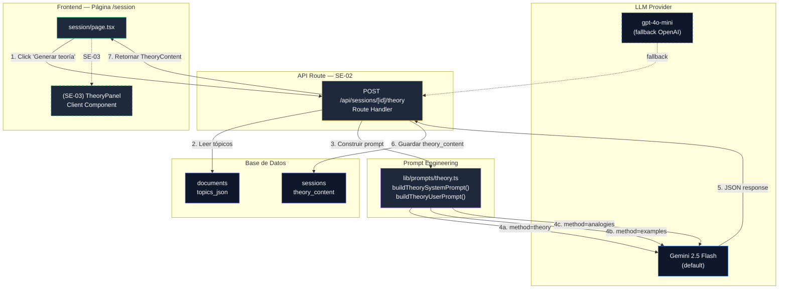
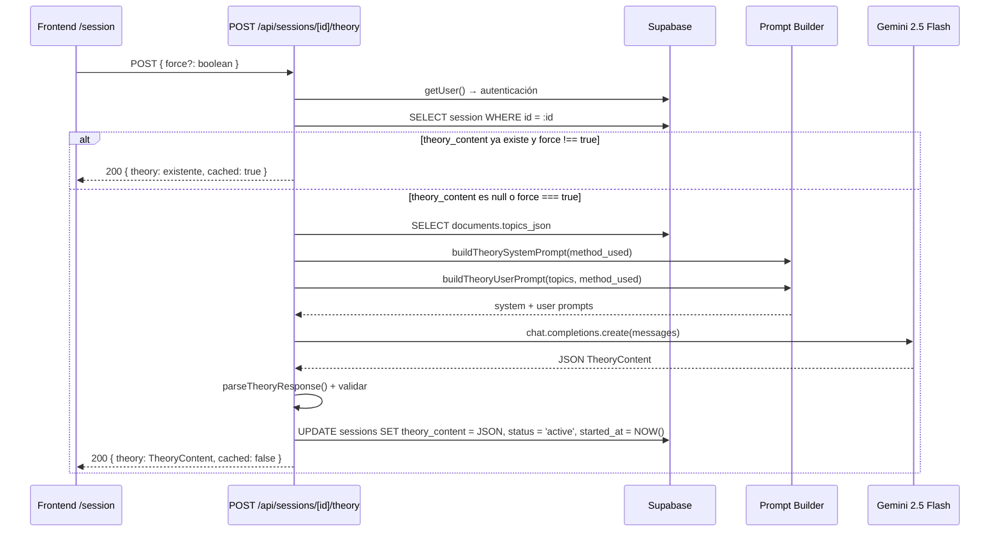

# SE-02 — Prompt de Teoría + API Route `/api/sessions/[id]/theory`

> **Bloque:** 📚 Sesión de Estudio
> **Guía anterior:** [SE-01 — API Routes de sesión + página `/session`](file:///c:/Users/jsife/OneDrive/Desktop/Repositorios/practica-testing/docs/guides/fe/SE-01.md)
> **Guía siguiente:** SE-03 — UI: TheoryPanel (45 min, markdown, timer)
> **Fecha:** Junio 2026

---

## Sección 1: 🎓 Introducción y Fundamentos Conceptuales

### ¿Dónde estamos?

En **SE-01** construimos los cimientos del BLOQUE E: dos API Routes (`GET /api/sessions/next` y `GET /api/sessions/[id]`) que retornan sesiones enriquecidas con contexto del plan y tópicos, y actualizamos la página `/session` para renderizar esos datos. Ahora el usuario puede navegar desde el calendario del plan hasta la página de sesión y ver exactamente qué tópicos le toca estudiar, con qué método, y su progreso hasta el momento.

Pero hay un vacío enorme: **no hay contenido teórico**. La columna `theory_content` en la tabla `sessions` está en `null`. El usuario ve los tópicos listados pero no tiene material de estudio.

### ¿Qué construiremos en SE-02?

SE-02 construye la **máquina de generación de teoría** — el componente que convierte un tópico ISTQB crudo en contenido educativo estructurado, adaptado al método de enseñanza asignado. Específicamente:

1. **Tipos TypeScript para el contenido teórico** — Interfaz `TheoryContent` con las secciones definidas en el roadmap.
2. **API Route `POST /api/sessions/[id]/theory`** — Recibe el `session_id`, lee los tópicos de la sesión, construye el prompt adaptado al `method_used`, llama al LLM (Gemini 2.5 Flash por defecto o `gpt-4o-mini` como fallback OpenAI), parsea el JSON, lo guarda en `sessions.theory_content`, y lo retorna al frontend.
3. **Prompt de generación de teoría** — Un prompt engineering sofisticado que produce contenido distinto según el método:
   - **`theory`** → definiciones formales, principios, estándares IEEE/ISO
   - **`examples`** → casos reales del mundo del testing de software
   - **`analogies`** → metáforas cotidianas y comparaciones comprensibles

La analogía profesional: si SE-01 fue el "director de escuela" que asigna materias, SE-02 es el **profesor** que prepara la clase. Según el método asignado, el mismo tema se explica de forma radicalmente diferente. Un profesor de teoría cita definiciones del ISTQB Glossary; un profesor de ejemplos cuenta cómo un bug en producción le costó millones a una empresa; un profesor de analogías compara el testing con un control de calidad en una fábrica de coches.

### Conceptos clave en esta guía

#### 1. Prompt Engineering con JSON Estructurado

El LLM debe retornar un JSON con una estructura **exacta**. Esto no es trivial — los LLMs tienden a:
- Agregar texto antes o después del JSON ("Aquí tienes el resultado:")
- Usar bloques de código markdown (```json ... ```)
- Inventar campos que no pedimos
- Omitir campos obligatorios

Para mitigar esto, aplicamos tres técnicas:

| Técnica | Implementación |
|---|---|
| **System prompt estricto** | "Responde ÚNICAMENTE con JSON puro. NO incluyas texto ni markdown." |
| **JSON Schema en el prompt** | Mostramos la estructura exacta que esperamos con campos y tipos |
| **Parser defensivo** | Extraemos el JSON del response incluso si viene envuelto en texto o markdown |

#### 2. Multi-Provider LLM (reutilización del patrón UP-04)

En UP-04 creamos la función `createPlanModelRuntime()` que configura el cliente OpenAI-compatible para Gemini 2.5 Flash o GPT-5 según el proveedor seleccionado. En SE-02, **creamos una función análoga** (`createTheoryModelRuntime()`) que reutiliza el mismo patrón pero con timeouts y configuración optimizada para la generación de teoría. Para teoría usaremos Gemini como default y `gpt-4o-mini` como fallback OpenAI porque soporta JSON mode y `temperature` de forma estable.

```
UP-04: createPlanModelRuntime() → genera plan de estudio (JSON grande, ~15K tokens)
SE-02: createTheoryModelRuntime() → genera teoría (JSON mediano, ~3-5K tokens)
```

La diferencia principal es el **timeout**: la teoría se genera más rápido que un plan completo porque el output es más pequeño.

#### 3. Segmentos de ruta anidados en Next.js

SE-02 introduce un **Route Handler anidado** dentro de un segmento dinámico:

```
app/api/sessions/[id]/route.ts       ← SE-01 (GET /api/sessions/:id)
app/api/sessions/[id]/theory/route.ts ← SE-02 (POST /api/sessions/:id/theory)
```

Next.js permite anidar carpetas dentro de un segmento dinámico. La URL resultante es `/api/sessions/abc123/theory`. El parámetro `id` sigue llegando a través de `params`, igual que en SE-01. Lo importante es que `route.ts` y `theory/route.ts` son Route Handlers **separados** — cada uno puede exportar sus propios métodos HTTP sin conflicto.

#### 4. Idempotencia: ¿qué pasa si el usuario pide la teoría dos veces?

Si `theory_content` ya existe para la sesión, la API retorna el contenido existente sin llamar al LLM de nuevo. Esto:
- **Ahorra dinero** (cada llamada al LLM cuesta tokens)
- **Ahorra tiempo** (no esperar 10-20s de generación)
- **Garantiza consistencia** (el usuario siempre ve la misma teoría)

Si el usuario quiere **regenerar** la teoría (ej. cambió de opinión sobre el método), puede enviar `force: true` en el body de la petición.

---

## Sección 2: 📋 Prerequisitos y Verificación del Entorno

### Herramientas y runtime

| Herramienta | Verificación | Versión esperada |
|---|---|---|
| Node.js | `node --version` | v18+ |
| npm | `npm --version` | 9+ |
| Next.js | `npx next --version` | 16.x |
| TypeScript | `npx tsc --version` | 5.x |

### Dependencias del proyecto

No se requieren nuevas dependencias npm para SE-02. El paquete `openai` (v6.44+) ya está instalado desde FE-01 y se usó en UP-04 para la generación de planes.

```powershell
cd c:\Users\jsife\OneDrive\Desktop\Repositorios\practica-testing\frontend

# Verificar que openai está instalado (necesario para el LLM)
npm ls openai
```

Salida esperada:

```
frontend@0.1.0
└── openai@6.44.x
```

### Variables de entorno (necesarias para SE-02)

SE-02 **sí requiere** una API key de LLM, a diferencia de SE-01. Verifica que al menos una de estas variables existe en `frontend/.env.local`:

```powershell
# Verificar que hay al menos una API key configurada sin imprimir secretos.
# Ejecuta esto desde la carpeta frontend/.
$keys = Select-String -Path ".env.local" -Pattern "^(GEMINI_API_KEY|OPENAI_API_KEY)="
if ($keys) {
  $keys | ForEach-Object { $_.Line -replace "=.*$", "=***configurada***" }
} else {
  "No se encontró GEMINI_API_KEY ni OPENAI_API_KEY en .env.local"
}
```

Salida esperada (al menos una línea):

```
GEMINI_API_KEY=***configurada***
OPENAI_API_KEY=***configurada***
```

Si no ves ninguna, vuelve a las credenciales de **UP-04** y configúralas:

```env
# En frontend/.env.local
GEMINI_API_KEY=tu-clave-de-gemini
GEMINI_OPENAI_BASE_URL=https://generativelanguage.googleapis.com/v1beta/openai

# O como fallback OpenAI:
OPENAI_API_KEY=sk-proj-tu-clave-openai
```

### Deliverables de guías anteriores (obligatorios)

| Guía | Entregable | Verificación |
|---|---|---|
| **SE-01** | `app/api/sessions/[id]/route.ts` con GET funcional | `Test-Path -LiteralPath "app/api/sessions/[id]/route.ts"` → `True` |
| **SE-01** | `app/api/sessions/next/route.ts` con `enrichSession` exportada | `Test-Path -LiteralPath "app/api/sessions/next/route.ts"` → `True` |
| **SE-01** | `types/sessions.ts` con `SessionWithContext`, `SessionTopic` | `Test-Path -LiteralPath "types/sessions.ts"` → `True` |
| **SE-01** | Página `/session` renderiza datos de sesión | Navega a `/session` y ve datos reales |
| **UP-04** | `lib/openai.ts` con cliente OpenAI singleton | `Test-Path -LiteralPath "lib/openai.ts"` → `True` |
| **UP-04** | Patrón `createPlanModelRuntime()` en `plan/generate/route.ts` | Abrir archivo y verificar que la función existe |
| **DB-02** | Tabla `sessions` con columna `theory_content` (TEXT, nullable) | Verificar en Supabase Table Editor |

---

## Sección 3: 📂 Estructura de Directorios del Proyecto

```
frontend/
├── app/
│   ├── (auth)/                         # [FE-03]
│   ├── (dashboard)/                    # [FE-04]
│   │   ├── _components/
│   │   ├── dashboard/page.tsx
│   │   ├── plan/
│   │   │   ├── _components/            # [UP-06]
│   │   │   └── page.tsx
│   │   ├── session/
│   │   │   └── page.tsx                # [SE-01] Página funcional
│   │   ├── setup/                      # [UP-01]
│   │   ├── error.tsx
│   │   ├── layout.tsx
│   │   └── loading.tsx
│   ├── api/
│   │   ├── extract/                    # [UP-03]
│   │   ├── plan/
│   │   │   ├── generate/route.ts       # [UP-04]
│   │   │   └── save/route.ts           # [UP-05]
│   │   ├── sessions/
│   │   │   ├── next/route.ts           # [SE-01] GET /api/sessions/next
│   │   │   └── [id]/
│   │   │       ├── route.ts            # [SE-01] GET /api/sessions/[id]
│   │   │       └── theory/             # 🆕 SE-02 — NUEVO directorio
│   │   │           └── route.ts        # 🆕 POST /api/sessions/[id]/theory
│   │   └── upload/                     # [UP-02]
│   ├── auth/callback/route.ts
│   ├── globals.css
│   ├── layout.tsx
│   └── page.tsx
│
├── lib/
│   ├── openai.ts                       # [UP-04] Cliente OpenAI singleton
│   ├── prompts/                        # 🆕 SE-02 — NUEVO directorio
│   │   └── theory.ts                   # 🆕 Prompt builder para teoría
│   ├── supabase/
│   │   ├── admin.ts
│   │   ├── client.ts
│   │   └── server.ts
│   ├── format.ts
│   └── utils.ts
│
├── types/
│   ├── database.ts
│   ├── index.ts                        # Se actualiza con nuevos tipos
│   ├── sessions.ts                     # [SE-01]
│   └── theory.ts                       # 🆕 SE-02 — NUEVO
│
├── middleware.ts
├── package.json
├── tsconfig.json
└── .env.local
```

**Archivos nuevos en esta guía (3):**

| # | Archivo | Propósito |
|---|---|---|
| 1 | `types/theory.ts` | Interfaces para el contenido teórico generado por el LLM |
| 2 | `lib/prompts/theory.ts` | Prompt builder: system prompt + user prompt para teoría |
| 3 | `app/api/sessions/[id]/theory/route.ts` | API Route POST que orquesta la generación |

**Archivo modificado (1):**

| # | Archivo | Cambio |
|---|---|---|
| 1 | `types/index.ts` | Re-exportar tipos de `theory.ts` |

---

## Sección 4: 🎨 Diagrama de Arquitectura de Componentes



### Flujo de datos detallado



---

## Sección 5: 🛠️ Implementación Paso a Paso

### Paso A: Crear el tipo `TheoryContent`

**Archivo:** `frontend/types/theory.ts` *(NUEVO)*

Este archivo define la estructura exacta del contenido teórico que el LLM genera. Cada campo corresponde a una sección visible en la UI de SE-03.

```typescript
// ============================================================
// types/theory.ts — Tipos para el contenido teórico generado
// ============================================================
// Estos tipos definen la estructura del JSON que el LLM retorna
// cuando genera contenido teórico para una sesión de estudio.
//
// La estructura está diseñada para ser directamente renderizable
// en el TheoryPanel (SE-03), donde cada campo corresponde a una
// sección colapsable de la interfaz.
//
// ¿Por qué un tipo separado de sessions.ts?
//   - sessions.ts define la SESIÓN con todo su contexto
//   - theory.ts define el CONTENIDO TEÓRICO generado
//   - La sesión CONTIENE el contenido teórico en theory_content
//   - Separar los tipos mantiene cada archivo enfocado
// ============================================================

import type { LevelK, MethodUsed } from "./database";

// ──────────────────────────────────────────────────────────────
// Concepto clave individual
// ──────────────────────────────────────────────────────────────

/**
 * Un concepto clave explicado por el LLM.
 *
 * Cada concepto tiene un término, su definición, y opcionalmente
 * un ejemplo breve para concretizarlo.
 */
export interface KeyConcept {
  /** Término o concepto (ej. "Defecto (Bug)") */
  term: string;
  /** Definición clara y concisa del término */
  definition: string;
  /** Ejemplo breve que ilustra el concepto (opcional) */
  example?: string;
}

// ──────────────────────────────────────────────────────────────
// Ejemplo práctico
// ──────────────────────────────────────────────────────────────

/**
 * Ejemplo práctico del mundo real del testing.
 *
 * Cuando el método es "examples", el LLM genera más ejemplos
 * y más detallados. Con "theory", genera 1-2 ejemplos breves.
 */
export interface TheoryExample {
  /** Título del ejemplo (ej. "Bug del Therac-25") */
  title: string;
  /** Descripción del escenario */
  description: string;
  /** Lección o moraleja que el ejemplo enseña */
  lesson: string;
}

// ──────────────────────────────────────────────────────────────
// Conexión con otros tópicos
// ──────────────────────────────────────────────────────────────

/**
 * Conexión entre el tópico actual y otro tópico del ISTQB.
 *
 * Estas conexiones ayudan al estudiante a ver el "big picture"
 * y entender cómo los tópicos se relacionan entre sí.
 */
export interface TopicConnection {
  /** Código del tópico relacionado (ej. "FL-2.1.1") */
  related_topic_code: string;
  /** Descripción breve de cómo se relacionan */
  relationship: string;
}

// ──────────────────────────────────────────────────────────────
// Contenido teórico completo de un tópico
// ──────────────────────────────────────────────────────────────

/**
 * Contenido teórico generado para UN tópico de la sesión.
 *
 * Cada sesión puede tener múltiples tópicos (ej. FL-1.1.1, FL-1.1.2).
 * Para cada tópico, el LLM genera un TheoryTopicContent completo.
 */
export interface TheoryTopicContent {
  /** Código del tópico (ej. "FL-1.1.1") */
  topic_code: string;
  /** Nombre del tópico */
  topic_name: string;
  /** Nivel K: K1, K2, o K3 */
  level_k: LevelK;

  /** Introducción al tópico (2-3 párrafos) */
  introduction: string;
  /** Conceptos clave del tópico (3-7 items) */
  key_concepts: KeyConcept[];
  /** Ejemplos prácticos (1-5 items, más si method=examples) */
  examples: TheoryExample[];
  /** Conexiones con otros tópicos del ISTQB (1-3 items) */
  connections: TopicConnection[];
  /** Resumen ejecutivo del tópico (1-2 párrafos) */
  summary: string;
}

// ──────────────────────────────────────────────────────────────
// Contenido teórico completo de la sesión
// ──────────────────────────────────────────────────────────────

/**
 * Contenido teórico COMPLETO de una sesión de estudio.
 *
 * Este es el tipo que se almacena como JSON stringificado en
 * sessions.theory_content y que SE-03 renderiza en la UI.
 */
export interface TheoryContent {
  /** Array de contenido teórico, uno por tópico de la sesión */
  topics: TheoryTopicContent[];
  /** Método de enseñanza usado para generar este contenido */
  method_used: MethodUsed;
  /** Timestamp ISO de cuándo se generó */
  generated_at: string;
  /** Proveedor LLM que generó el contenido */
  model_provider: string;
  /** Modelo específico usado */
  model_name: string;
}

// ──────────────────────────────────────────────────────────────
// Tipos de la API Response
// ──────────────────────────────────────────────────────────────

/** Response exitoso de POST /api/sessions/[id]/theory */
export interface TheoryResponse {
  /** Contenido teórico generado */
  theory: TheoryContent;
  /** true si se retornó contenido previamente generado */
  cached: boolean;
}
```

**Entregable del Paso A:**
- [x] Archivo `frontend/types/theory.ts` creado con 6 interfaces.

---

### Paso B: Actualizar el barrel de exportaciones de tipos

**Archivo:** `frontend/types/index.ts` *(MODIFICAR)*

Agrega las exportaciones de los nuevos tipos de teoría al barrel existente. Añade el siguiente bloque al final del archivo, después de las exportaciones de `./sessions`:

```typescript
// 🆕 SE-02: Re-exportar tipos de contenido teórico
export type {
  KeyConcept,
  TheoryExample,
  TopicConnection,
  TheoryTopicContent,
  TheoryContent,
  TheoryResponse,
} from "./theory";
```

El archivo `types/index.ts` completo después de la modificación:

```typescript
// ============================================================
// types/index.ts — Barrel de exportaciones de tipos
// ============================================================

// Re-exportar TODOS los tipos de la base de datos
export type {
  // Union types (enums del negocio)
  StudyPlanStatus,
  SessionType,
  MethodUsed,
  ActionTaken,
  SessionStatus,
  AnswerOption,
  LevelK,
  TopicProgressStatus,

  // Tipos de JSON estructurado
  TopicEntry,
  TopicsJson,
  OptionsJson,

  // user_profiles
  UserProfileRow,
  UserProfileInsert,
  UserProfileUpdate,

  // documents
  DocumentRow,
  DocumentInsert,
  DocumentUpdate,

  // study_plans
  StudyPlanRow,
  StudyPlanInsert,
  StudyPlanUpdate,

  // sessions
  SessionRow,
  SessionInsert,
  SessionUpdate,

  // answers
  AnswerRow,
  AnswerInsert,
  AnswerUpdate,

  // topic_progress
  TopicProgressRow,
  TopicProgressInsert,
  TopicProgressUpdate,

  // Tipo maestro
  Database,
} from "./database";

// 🆕 SE-01: Re-exportar tipos de sesión enriquecidos
export type {
  SessionTopic,
  PlanContext,
  SessionWithContext,
  NoSessionResponse,
  NextSessionResponse,
  SessionByIdResponse,
} from "./sessions";

// 🆕 SE-02: Re-exportar tipos de contenido teórico
export type {
  KeyConcept,
  TheoryExample,
  TopicConnection,
  TheoryTopicContent,
  TheoryContent,
  TheoryResponse,
} from "./theory";
```

**Entregable del Paso B:**
- [x] Archivo `frontend/types/index.ts` actualizado con 6 tipos de `./theory`.

---

### Paso C: Crear el Prompt Builder para teoría

**Archivo:** `frontend/lib/prompts/theory.ts` *(NUEVO)*

Este archivo encapsula toda la lógica de construction de prompts. Separar los prompts del Route Handler tiene ventajas:
- **Testabilidad**: Puedes verificar el prompt generado sin levantar el servidor
- **Reutilización**: Si necesitas generar teoría desde otro lugar (ej. una Server Action)
- **Legibilidad**: El Route Handler se enfoca en la orquestación, no en el texto del prompt

```typescript
// ============================================================
// lib/prompts/theory.ts — Prompt Builder para contenido teórico
// ============================================================
// Construye los prompts (system + user) para la generación de
// contenido teórico ISTQB adaptado al método de enseñanza.
//
// Tres métodos, tres estilos radicalmente diferentes:
//   - theory    → Definiciones formales, estándares, principios
//   - examples  → Casos reales, bugs famosos, escenarios prácticos
//   - analogies → Metáforas cotidianas, comparaciones simples
//
// REGLA: Los prompts SIEMPRE están en español porque el usuario
// estudia en español y el contenido se renderiza tal cual.
// ============================================================

import type { SessionTopic } from "@/types/sessions";
import type { MethodUsed } from "@/types";

// ──────────────────────────────────────────────────────────────
// Constantes
// ──────────────────────────────────────────────────────────────

/** Número máximo de caracteres del texto del syllabus por tópico */
const MAX_SYLLABUS_TEXT_CHARS = 1500;

/** Descripciones del método para inyectar en el prompt */
const METHOD_DESCRIPTIONS: Record<MethodUsed, string> = {
  theory: `MÉTODO: TEORÍA FORMAL
- Usa definiciones precisas del ISTQB Glossary v4.0
- Referencia estándares relevantes (IEEE 829, ISO 25010, ISO 29119)
- Explica principios fundamentales con rigor académico
- Usa lenguaje técnico apropiado, explicando cada término la primera vez
- Los key_concepts deben tener definiciones formales y completas
- Los examples deben ser breves y formales (1-2 por tópico)
- El tono es profesoral y preciso, como un libro de texto de ingeniería de software`,

  examples: `MÉTODO: EJEMPLOS PRÁCTICOS
- Usa casos REALES y conocidos del mundo del testing de software
- Incluye bugs famosos cuando sea relevante (Therac-25, Ariane 5, Knight Capital, etc.)
- Describe escenarios de proyectos reales donde el concepto aplica
- Los key_concepts deben incluir un ejemplo concreto junto a cada definición
- Genera 3-5 examples detallados por tópico con escenarios completos
- Incluye qué herramientas o técnicas se usarían en cada escenario
- El tono es práctico y orientado a la acción, como un mentor senior en una empresa de software`,

  analogies: `MÉTODO: ANALOGÍAS Y METÁFORAS
- Usa comparaciones con la vida cotidiana (cocinar, construir una casa, ir al médico, etc.)
- Cada concepto debe tener al menos UNA analogía memorable
- Los key_concepts deben comenzar con "Es como..." o una comparación directa
- Los examples pueden ser analogías extendidas (ej. "El testing es como un control de calidad en una fábrica de coches...")
- Conecta cada concepto abstracto con algo que el estudiante ya conoce
- Usa humor y creatividad cuando sea apropiado
- El tono es conversacional y accesible, como un amigo que te explica algo complejo`,
};

/** Instrucciones específicas de cantidad según el método */
const METHOD_QUANTITY_HINTS: Record<MethodUsed, string> = {
  theory: `- key_concepts: 4-7 conceptos con definiciones formales completas
- examples: 1-2 ejemplos breves y formales
- connections: 2-3 conexiones con otros tópicos`,

  examples: `- key_concepts: 3-5 conceptos, cada uno con un ejemplo práctico en el campo 'example'
- examples: 3-5 casos reales detallados con escenarios completos
- connections: 1-2 conexiones con otros tópicos`,

  analogies: `- key_concepts: 3-5 conceptos, cada uno explicado con una analogía en la definición
- examples: 2-4 analogías extendidas (escenarios comparativos)
- connections: 1-2 conexiones explicadas con analogías`,
};

// ──────────────────────────────────────────────────────────────
// System Prompt
// ──────────────────────────────────────────────────────────────

/**
 * Construye el system prompt para la generación de teoría.
 *
 * El system prompt define:
 *   1. Rol del asistente (profesor ISTQB)
 *   2. Método de enseñanza (theory/examples/analogies)
 *   3. Schema JSON exacto de la salida esperada
 *   4. Restricciones de formato y contenido
 *
 * @param method - Método de enseñanza: "theory", "examples", o "analogies"
 */
export function buildTheorySystemPrompt(method: MethodUsed): string {
  return `Eres un profesor experto en la certificación ISTQB Foundation Level (CTFL v4.0).
Tu tarea es generar contenido teórico educativo de alta calidad para una sesión de estudio.

Todo el contenido DEBE estar en **español**.

## ${METHOD_DESCRIPTIONS[method]}

## CANTIDADES ESPERADAS POR TÓPICO

${METHOD_QUANTITY_HINTS[method]}

## FORMATO DE SALIDA

Responde ÚNICAMENTE con un objeto JSON válido con esta estructura EXACTA:

{
  "topics": [
    {
      "topic_code": "FL-x.x.x",
      "topic_name": "Nombre del tópico en español",
      "level_k": "K1" | "K2" | "K3",
      "introduction": "Introducción de 2-3 párrafos explicando el contexto y la importancia del tópico. Usa saltos de línea (\\n\\n) entre párrafos.",
      "key_concepts": [
        {
          "term": "Nombre del concepto",
          "definition": "Definición clara y completa",
          "example": "Ejemplo breve (opcional pero recomendado)"
        }
      ],
      "examples": [
        {
          "title": "Título del ejemplo",
          "description": "Descripción del escenario o caso",
          "lesson": "Lección o moraleja que se aprende"
        }
      ],
      "connections": [
        {
          "related_topic_code": "FL-x.x.x",
          "relationship": "Cómo se relaciona con el tópico actual"
        }
      ],
      "summary": "Resumen ejecutivo de 1-2 párrafos con los puntos clave a recordar."
    }
  ]
}

## RESTRICCIONES CRÍTICAS

1. **JSON puro**: NO incluyas texto antes ni después del JSON. NO uses bloques de código markdown.
2. **Español**: TODO el contenido debe estar en español. Los nombres de tópicos y conceptos se traducen.
3. **topic_code exacto**: Usa exactamente los topic_codes que se proporcionan. NO inventes códigos.
4. **Profundidad por nivel K**:
   - K1 (Recordar): Enfócate en definiciones y listas de términos
   - K2 (Entender): Explica el "por qué" y las diferencias entre conceptos
   - K3 (Aplicar): Incluye escenarios donde el estudiante debe tomar decisiones
5. **Longitud**: Cada introducción debe tener al menos 150 palabras. Cada summary al menos 80 palabras.
6. **Calidad ISTQB**: El contenido debe ser correcto según el syllabus ISTQB CTFL v4.0.`;
}

// ──────────────────────────────────────────────────────────────
// User Prompt
// ──────────────────────────────────────────────────────────────

/**
 * Construye el user prompt con los datos específicos de la sesión.
 *
 * @param topics - Array de tópicos de la sesión con texto del syllabus
 * @param method - Método de enseñanza
 * @param dayNumber - Número de día en el plan
 * @param sessionType - Tipo de sesión (morning/night/reinforcement)
 * @param attemptNumber - Número de intento (1 = primer intento)
 */
export function buildTheoryUserPrompt(
  topics: SessionTopic[],
  method: MethodUsed,
  dayNumber: number,
  sessionType: string,
  attemptNumber: number,
): string {
  // ─── Construir la lista de tópicos con texto del syllabus ───
  const topicsList = topics
    .map((t) => {
      const syllabusPreview = t.syllabus_text
        ? t.syllabus_text.slice(0, MAX_SYLLABUS_TEXT_CHARS)
        : "(sin texto del syllabus disponible)";

      return `### ${t.code} — ${t.name} [${t.level_k}]
Estado del estudiante: ${t.progress_status} | Intentos previos: ${t.attempts} | Mejor score: ${t.best_score}%

Texto del syllabus:
${syllabusPreview}`;
    })
    .join("\n\n---\n\n");

  // ─── Contexto de refuerzo (si es un re-intento) ──────────
  const reinforcementContext =
    attemptNumber > 1
      ? `\n\n## ⚠️ CONTEXTO DE REFUERZO
Este es el intento #${attemptNumber} del estudiante. Los intentos previos no fueron suficientes.
- Explica los conceptos de forma MÁS DETALLADA que antes
- Usa ejemplos DIFERENTES a los que se habrían usado en intentos anteriores
- Enfatiza los aspectos que suelen causar confusión
- Si el método es "analogies", usa analogías DIFERENTES y más simples\n`
      : "";

  return `## CONTEXTO DE LA SESIÓN

- **Día del plan:** ${dayNumber}
- **Tipo de sesión:** ${sessionType}
- **Método de enseñanza:** ${method}
- **Número de intento:** ${attemptNumber}
- **Total de tópicos en esta sesión:** ${topics.length}
${reinforcementContext}
## TÓPICOS A EXPLICAR

${topicsList}

## INSTRUCCIÓN

Genera el contenido teórico para los ${topics.length} tópico(s) listados arriba usando el método "${method}".
Cada tópico debe tener: introduction, key_concepts, examples, connections, y summary.
Adapta la profundidad al nivel K de cada tópico.
Responde SOLO con el JSON.`;
}
```

**Entregable del Paso C:**
- [x] Archivo `frontend/lib/prompts/theory.ts` creado.
- [x] Funciones `buildTheorySystemPrompt()` y `buildTheoryUserPrompt()` exportadas.
- [x] Tres variantes de método documentadas con instrucciones de cantidad.

---

### Paso D: Crear la API Route `POST /api/sessions/[id]/theory`

**Archivo:** `frontend/app/api/sessions/[id]/theory/route.ts` *(NUEVO)*

Este es el Route Handler principal de SE-02. Orquesta todo el flujo: autenticación → lectura de sesión → verificación de caché → construcción de prompt → llamada al LLM → parsing del JSON → persistencia → response.

```typescript
// ─────────────────────────────────────────────────────────────────
// app/api/sessions/[id]/theory/route.ts
// Route Handler: genera contenido teórico para una sesión de estudio.
//
// Método: POST
// Auth: Requiere sesión válida (cookie JWT de Supabase)
// Params: id — UUID de la sesión
// Body (opcional):
//   {
//     force?: boolean  // true = regenerar aunque ya exista
//   }
//
// Response (200): { theory: TheoryContent, cached: boolean }
// Response (401): { error: "No autenticado" }
// Response (400): { error: "Descripción del problema" }
// Response (404): { error: "Sesión no encontrada" }
// Response (500): { error: "Error interno del servidor" }
// Response (502): { error: "Error en la generación de teoría" }
//
// IDEMPOTENCIA:
//   Si theory_content ya existe y force !== true, retorna el
//   contenido existente sin llamar al LLM.
//
// SIDE EFFECTS:
//   - Guarda theory_content en la tabla sessions
//   - Cambia status de 'pending' a 'active'
//   - Establece started_at si es la primera vez
// ─────────────────────────────────────────────────────────────────

import { NextResponse } from "next/server";
import OpenAI from "openai";
import { createClient } from "@/lib/supabase/server";
import { buildTheorySystemPrompt, buildTheoryUserPrompt } from "@/lib/prompts/theory";
import type { SessionRow, StudyPlanRow, TopicsJson, MethodUsed } from "@/types";
import type { SessionTopic } from "@/types/sessions";
import type { TheoryContent, TheoryTopicContent } from "@/types/theory";

// ─── Forzar Node.js runtime ─────────────────────────────────────
export const runtime = "nodejs";

// ─── Constantes ──────────────────────────────────────────────────
const GEMINI_OPENAI_BASE_URL =
  "https://generativelanguage.googleapis.com/v1beta/openai";

const UUID_REGEX =
  /^[0-9a-f]{8}-[0-9a-f]{4}-[0-9a-f]{4}-[0-9a-f]{4}-[0-9a-f]{12}$/i;

// Timeout para la generación de teoría (más corto que el plan)
// La teoría genera ~3-5K tokens vs ~15K tokens del plan
const THEORY_TIMEOUT_MS = 60_000; // 60 segundos
const THEORY_TIMEOUT_BUFFER_MS = 15_000; // Buffer para el SDK

// ──────────────────────────────────────────────────────────────
// Multi-Provider LLM (mismo patrón de UP-04)
// ──────────────────────────────────────────────────────────────

interface TheoryModelRuntime {
  provider: string;
  model: string;
  client: OpenAI;
  timeoutMs: number;
}

/**
 * Crea el runtime del modelo LLM para generación de teoría.
 *
 * Prioridad:
 *   1. GEMINI_API_KEY → Gemini 2.5 Flash (default, más rápido y barato)
 *   2. OPENAI_API_KEY → gpt-4o-mini (fallback si no hay Gemini)
 *
 * A diferencia de UP-04 donde el usuario elige el modelo,
 * aquí usamos siempre el proveedor disponible más eficiente.
 * La razón: la teoría se genera automáticamente, no es una
 * decisión del usuario qué modelo usar para esto.
 */
function createTheoryModelRuntime(): TheoryModelRuntime {
  // ─── Intentar Gemini primero ─────────────────────────────
  const geminiKey = process.env.GEMINI_API_KEY;
  if (geminiKey) {
    return {
      provider: "gemini",
      model: "gemini-2.5-flash",
      timeoutMs: THEORY_TIMEOUT_MS,
      client: new OpenAI({
        apiKey: geminiKey,
        baseURL: process.env.GEMINI_OPENAI_BASE_URL || GEMINI_OPENAI_BASE_URL,
        timeout: THEORY_TIMEOUT_MS + THEORY_TIMEOUT_BUFFER_MS,
        maxRetries: 2,
      }),
    };
  }

  // ─── Fallback a OpenAI ───────────────────────────────────
  const openaiKey = process.env.OPENAI_API_KEY;
  if (openaiKey) {
    return {
      provider: "openai",
      model: "gpt-4o-mini",
      timeoutMs: THEORY_TIMEOUT_MS,
      client: new OpenAI({
        apiKey: openaiKey,
        timeout: THEORY_TIMEOUT_MS + THEORY_TIMEOUT_BUFFER_MS,
        maxRetries: 2,
      }),
    };
  }

  throw new Error(
    "No hay API key de LLM configurada. " +
      "Define GEMINI_API_KEY o OPENAI_API_KEY en frontend/.env.local",
  );
}

// ──────────────────────────────────────────────────────────────
// Parser defensivo del response del LLM
// ──────────────────────────────────────────────────────────────

/**
 * Extrae y parsea el JSON del response del LLM.
 *
 * Los LLMs a veces retornan el JSON envuelto en:
 *   - Texto introductorio ("Aquí tienes el contenido:")
 *   - Bloques de código markdown (```json ... ```)
 *   - Texto final ("Espero que esto sea útil")
 *
 * Esta función maneja todos esos casos.
 */
function parseTheoryResponse(rawText: string): TheoryContent["topics"] | null {
  let text = rawText.trim();

  // ─── Intentar extraer de bloque markdown ────────────────
  const markdownMatch = text.match(/```(?:json)?\s*\n?([\s\S]*?)\n?```/);
  if (markdownMatch) {
    text = markdownMatch[1].trim();
  }

  // ─── Intentar encontrar el JSON delimitado por {} ───────
  const firstBrace = text.indexOf("{");
  const lastBrace = text.lastIndexOf("}");
  if (firstBrace !== -1 && lastBrace > firstBrace) {
    text = text.slice(firstBrace, lastBrace + 1);
  }

  try {
    const parsed = JSON.parse(text);

    // Verificar que tiene la estructura esperada
    if (!parsed.topics || !Array.isArray(parsed.topics)) {
      console.error("[theory] JSON parseado pero sin campo 'topics':", Object.keys(parsed));
      return null;
    }

    return parsed.topics as TheoryTopicContent[];
  } catch (error) {
    console.error("[theory] Error al parsear JSON:", error);
    console.error("[theory] Texto recibido (primeros 500 chars):", text.slice(0, 500));
    return null;
  }
}

/**
 * Valida que los tópicos generados tienen la estructura mínima.
 */
function validateTheoryTopics(
  topics: TheoryTopicContent[],
  expectedCodes: string[],
): string[] {
  const errors: string[] = [];
  const generatedCodes = new Set(topics.map((t) => t.topic_code));

  // Verificar que cada tópico esperado fue generado
  for (const code of expectedCodes) {
    if (!generatedCodes.has(code)) {
      errors.push(`Tópico ${code} no fue generado por el LLM.`);
    }
  }

  // Verificar estructura mínima de cada tópico generado
  for (const topic of topics) {
    if (!topic.introduction || topic.introduction.length < 50) {
      errors.push(`${topic.topic_code}: introduction es demasiado corta o falta.`);
    }
    if (!topic.key_concepts || topic.key_concepts.length === 0) {
      errors.push(`${topic.topic_code}: key_concepts está vacío o falta.`);
    }
    if (!topic.summary || topic.summary.length < 30) {
      errors.push(`${topic.topic_code}: summary es demasiado corto o falta.`);
    }
  }

  return errors;
}

// ──────────────────────────────────────────────────────────────
// Route Handler: POST
// ──────────────────────────────────────────────────────────────

export async function POST(
  request: Request,
  { params }: { params: Promise<{ id: string }> },
) {
  try {
    // ═══════════════════════════════════════════════════════════
    // PASO 1: Extraer y validar parámetros
    // ═══════════════════════════════════════════════════════════
    const { id: sessionId } = await params;

    if (!sessionId || !UUID_REGEX.test(sessionId)) {
      return NextResponse.json(
        { error: "session_id debe ser un UUID válido" },
        { status: 400 },
      );
    }

    // Leer body (opcional — solo para el flag 'force')
    let force = false;
    try {
      const body = await request.json();
      if (body && typeof body.force === "boolean") {
        force = body.force;
      }
    } catch {
      // Body vacío o no-JSON es aceptable — force queda en false
    }

    // ═══════════════════════════════════════════════════════════
    // PASO 2: Autenticación
    // ═══════════════════════════════════════════════════════════
    const supabase = await createClient();

    const {
      data: { user },
      error: authError,
    } = await supabase.auth.getUser();

    if (authError || !user) {
      return NextResponse.json(
        { error: "No autenticado" },
        { status: 401 },
      );
    }

    // ═══════════════════════════════════════════════════════════
    // PASO 3: Buscar la sesión
    // ═══════════════════════════════════════════════════════════
    const { data: session, error: sessionError } = await supabase
      .from("sessions")
      .select("*")
      .eq("id", sessionId)
      .eq("user_id", user.id)
      .maybeSingle<SessionRow>();

    if (sessionError) {
      console.error("[theory] Error al buscar sesión:", sessionError);
      return NextResponse.json(
        { error: "Error al buscar la sesión" },
        { status: 500 },
      );
    }

    if (!session) {
      return NextResponse.json(
        { error: "Sesión no encontrada." },
        { status: 404 },
      );
    }

    // ═══════════════════════════════════════════════════════════
    // PASO 4: Verificar caché (idempotencia)
    // ═══════════════════════════════════════════════════════════
    if (session.theory_content && !force) {
      // El contenido ya fue generado — retornar sin llamar al LLM
      let cachedTheory: TheoryContent;
      try {
        cachedTheory =
          typeof session.theory_content === "string"
            ? JSON.parse(session.theory_content)
            : session.theory_content;
      } catch {
        // Si el JSON almacenado está corrupto, regenerar
        console.warn("[theory] theory_content corrupto, regenerando...");
        // Continuar al paso 5 (no retornar)
        cachedTheory = null as unknown as TheoryContent;
      }

      if (cachedTheory) {
        return NextResponse.json({
          theory: cachedTheory,
          cached: true,
        });
      }
    }

    // ═══════════════════════════════════════════════════════════
    // PASO 5: Obtener datos del plan y tópicos
    // ═══════════════════════════════════════════════════════════
    const { data: plan } = await supabase
      .from("study_plans")
      .select("id, document_id, objective_days, start_date, estimated_end_date")
      .eq("id", session.study_plan_id)
      .eq("user_id", user.id)
      .maybeSingle<
        Pick<
          StudyPlanRow,
          "id" | "document_id" | "objective_days" | "start_date" | "estimated_end_date"
        >
      >();

    if (!plan) {
      return NextResponse.json(
        { error: "No se encontró el plan asociado a esta sesión." },
        { status: 404 },
      );
    }

    // Obtener topics_json del documento
    const { data: doc } = await supabase
      .from("documents")
      .select("topics_json")
      .eq("id", plan.document_id)
      .eq("user_id", user.id)
      .maybeSingle();

    const topicsJson: TopicsJson = doc?.topics_json || {};

    // Obtener progreso de los tópicos de esta sesión
    const { data: progressRows } = await supabase
      .from("topic_progress")
      .select("topic_code, status, attempts, best_score, level_k")
      .eq("study_plan_id", plan.id)
      .eq("user_id", user.id)
      .in("topic_code", session.topic_codes || []);

    const progressMap = new Map();
    if (progressRows) {
      for (const row of progressRows) {
        progressMap.set(row.topic_code, row);
      }
    }

    // Construir array de SessionTopic para el prompt builder
    const sessionTopics: SessionTopic[] = (session.topic_codes || []).map(
      (code: string) => {
        const topicData = topicsJson[code];
        const progress = progressMap.get(code);
        return {
          code,
          name: topicData?.name || code,
          level_k: topicData?.level_k || progress?.level_k || "K1",
          syllabus_text: topicData?.text || "",
          progress_status: progress?.status || "pending",
          attempts: progress?.attempts || 0,
          best_score: progress?.best_score || 0,
        };
      },
    );

    if (sessionTopics.length === 0) {
      return NextResponse.json(
        { error: "La sesión no tiene tópicos asignados." },
        { status: 400 },
      );
    }

    // ═══════════════════════════════════════════════════════════
    // PASO 6: Construir prompts
    // ═══════════════════════════════════════════════════════════
    const method = session.method_used as MethodUsed;
    const systemPrompt = buildTheorySystemPrompt(method);
    const userPrompt = buildTheoryUserPrompt(
      sessionTopics,
      method,
      session.day_number,
      session.session_type,
      session.attempt_number,
    );

    // ═══════════════════════════════════════════════════════════
    // PASO 7: Llamar al LLM
    // ═══════════════════════════════════════════════════════════
    const modelRuntime = createTheoryModelRuntime();

    console.log(
      `[theory] Generando teoría para sesión ${sessionId} ` +
        `(${sessionTopics.length} tópicos, método=${method}, ` +
        `modelo=${modelRuntime.model})`,
    );

    const startTime = Date.now();
    const controller = new AbortController();
    const timeoutId = setTimeout(() => controller.abort(), modelRuntime.timeoutMs);

    let completion;

    try {
      completion = await modelRuntime.client.chat.completions.create(
        {
          model: modelRuntime.model,
          messages: [
            { role: "system", content: systemPrompt },
            { role: "user", content: userPrompt },
          ],
          // JSON mode reduce respuestas con markdown o texto extra.
          // El prompt ya menciona JSON explícitamente, requisito de OpenAI.
          response_format: { type: "json_object" },
          // Gemini 2.5 Flash y gpt-4o-mini aceptan temperature.
          // No usamos GPT-5 en SE-02 para evitar rechazos por parámetros.
          temperature: 0.7,
        },
        { signal: controller.signal },
      );
    } catch (llmError) {
      if (llmError instanceof Error && llmError.name === "AbortError") {
        return NextResponse.json(
          {
            error: `${modelRuntime.model} no respondió en ${modelRuntime.timeoutMs / 1000} segundos. Intenta de nuevo.`,
          },
          { status: 504 },
        );
      }

      throw llmError;
    } finally {
      clearTimeout(timeoutId);
    }

    const elapsed = Date.now() - startTime;
    const rawResponse = completion.choices[0]?.message?.content || "";
    const tokensUsed = completion.usage?.total_tokens || 0;

    console.log(
      `[theory] LLM respondió en ${elapsed}ms, ` +
        `${tokensUsed} tokens, ${rawResponse.length} chars`,
    );

    // ═══════════════════════════════════════════════════════════
    // PASO 8: Parsear y validar el response
    // ═══════════════════════════════════════════════════════════
    const parsedTopics = parseTheoryResponse(rawResponse);

    if (!parsedTopics) {
      console.error("[theory] No se pudo parsear el response del LLM");
      return NextResponse.json(
        {
          error:
            "El modelo de IA retornó un formato inválido. Intenta de nuevo.",
        },
        { status: 502 },
      );
    }

    // Validar la estructura
    const expectedCodes = session.topic_codes || [];
    const validationErrors = validateTheoryTopics(parsedTopics, expectedCodes);

    if (validationErrors.length > 0) {
      console.error(
        "[theory] Errores de validación:",
        validationErrors.join("; "),
      );
      return NextResponse.json(
        {
          error:
            "El modelo generó teoría incompleta o inválida. " +
            validationErrors.join("; "),
        },
        { status: 502 },
      );
    }

    // ═══════════════════════════════════════════════════════════
    // PASO 9: Construir el TheoryContent completo
    // ═══════════════════════════════════════════════════════════
    const theoryContent: TheoryContent = {
      topics: parsedTopics,
      method_used: method,
      generated_at: new Date().toISOString(),
      model_provider: modelRuntime.provider,
      model_name: modelRuntime.model,
    };

    // ═══════════════════════════════════════════════════════════
    // PASO 10: Guardar en Supabase + actualizar estado
    // ═══════════════════════════════════════════════════════════
    const now = new Date().toISOString();

    const updateData: Record<string, unknown> = {
      theory_content: JSON.stringify(theoryContent),
    };

    // Si la sesión estaba en 'pending', marcarla como 'active'
    // y registrar la hora de inicio.
    if (session.status === "pending") {
      updateData.status = "active";
      updateData.started_at = now;
    }

    const { error: updateError } = await supabase
      .from("sessions")
      .update(updateData)
      .eq("id", sessionId)
      .eq("user_id", user.id);

    if (updateError) {
      console.error("[theory] Error al guardar theory_content:", updateError);
      return NextResponse.json(
        {
          error:
            "La teoría fue generada, pero no se pudo guardar en Supabase. " +
            "Intenta de nuevo antes de continuar.",
        },
        { status: 500 },
      );
    }

    // ═══════════════════════════════════════════════════════════
    // PASO 11: Retornar el contenido teórico
    // ═══════════════════════════════════════════════════════════
    return NextResponse.json({
      theory: theoryContent,
      cached: false,
    });
  } catch (error) {
    console.error("[theory] Error inesperado:", error);

    // Distinguir errores del LLM de otros errores
    if (error instanceof OpenAI.APIError) {
      const statusCode = error.status || 502;
      return NextResponse.json(
        {
          error: `Error del proveedor de IA (${statusCode}): ${error.message}`,
        },
        { status: 502 },
      );
    }

    if (error instanceof OpenAI.APIConnectionError) {
      return NextResponse.json(
        {
          error:
            "No se pudo conectar con el proveedor de IA. Verifica tu conexión a internet.",
        },
        { status: 502 },
      );
    }

    return NextResponse.json(
      { error: "Error interno del servidor" },
      { status: 500 },
    );
  }
}
```

**Entregable del Paso D:**
- [x] Archivo `frontend/app/api/sessions/[id]/theory/route.ts` creado.
- [x] Función `POST` exportada con autenticación, caché, generación LLM, y persistencia.
- [x] Multi-provider: Gemini 2.5 Flash (default) con fallback a GPT-4o-mini.
- [x] Parser defensivo que maneja JSON envuelto en markdown o texto.
- [x] Validación del contenido generado.
- [x] Side effects: actualiza `theory_content`, `status`, y `started_at`.

---

## Sección 6: ✅ Checkpoints de Verificación

### 6.1 Verificar que los archivos existen

```powershell
cd c:\Users\jsife\OneDrive\Desktop\Repositorios\practica-testing\frontend

# Verificar archivos nuevos
Test-Path -LiteralPath "types/theory.ts"
# Esperado: True

Test-Path -LiteralPath "lib/prompts/theory.ts"
# Esperado: True

Test-Path -LiteralPath "app/api/sessions/[id]/theory/route.ts"
# Esperado: True
```

### 6.2 Verificar que compila sin errores

```powershell
npx tsc --noEmit
```

Salida esperada: sin errores de tipos.

### 6.3 Iniciar el servidor de desarrollo

```powershell
npm run dev
```

Salida esperada:

```
  ▲ Next.js 16.2.x
  - Local:        http://localhost:3000

 ✓ Ready in Xs
```

### 6.4 Probar la API `/api/sessions/[id]/theory` con Gemini

1. Abre tu navegador y navega a `http://localhost:3000/login`. Inicia sesión.
2. Navega a `http://localhost:3000/api/sessions/next` para obtener el `id` de la primera sesión pendiente. Copia el UUID.
3. Abre DevTools → Console en el mismo navegador donde estás logueado.
4. Envía una petición POST usando `fetch`. Esto reutiliza automáticamente las cookies de Supabase del navegador:

```javascript
const sessionId = "<SESSION_UUID>";

fetch(`/api/sessions/${sessionId}/theory`, {
  method: "POST",
  headers: { "Content-Type": "application/json" },
  body: "{}",
})
  .then((response) => response.json())
  .then(console.log);
```

> [!WARNING]
> No uses `Invoke-RestMethod` desde PowerShell para esta prueba a menos que configures manualmente las cookies de autenticación. La API está protegida por Supabase Auth; sin las cookies del navegador retornará `401 No autenticado`.

**Lo que deberías ver** (JSON con contenido teórico):

```json
{
  "theory": {
    "topics": [
      {
        "topic_code": "FL-1.1.1",
        "topic_name": "¿Por qué es Necesario el Testing?",
        "level_k": "K2",
        "introduction": "El testing de software es una actividad fundamental...",
        "key_concepts": [
          {
            "term": "Defecto (Bug)",
            "definition": "Un defecto es una imperfección en un componente...",
            "example": "Un campo de fecha que acepta el 31 de febrero..."
          }
        ],
        "examples": [
          {
            "title": "Caso Therac-25",
            "description": "En los años 80, una máquina de radioterapia...",
            "lesson": "El testing exhaustivo puede salvar vidas..."
          }
        ],
        "connections": [
          {
            "related_topic_code": "FL-1.2.1",
            "relationship": "Los objetivos del testing se derivan de..."
          }
        ],
        "summary": "El testing es necesario porque los humanos cometen errores..."
      }
    ],
    "method_used": "theory",
    "generated_at": "2026-06-29T...",
    "model_provider": "gemini",
    "model_name": "gemini-2.5-flash"
  },
  "cached": false
}
```

### 6.5 Verificar idempotencia (segunda llamada = cached)

Repite la misma petición POST:

```javascript
fetch(`/api/sessions/${sessionId}/theory`, {
  method: "POST",
  headers: { "Content-Type": "application/json" },
  body: "{}",
})
  .then((response) => response.json())
  .then(console.log);
```

**Lo que deberías ver:** El mismo contenido pero con `"cached": true` — la segunda llamada NO contacta al LLM.

### 6.6 Verificar regeneración forzada

```javascript
fetch(`/api/sessions/${sessionId}/theory`, {
  method: "POST",
  headers: { "Content-Type": "application/json" },
  body: JSON.stringify({ force: true }),
})
  .then((response) => response.json())
  .then(console.log);
```

**Lo que deberías ver:** Contenido nuevo (puede ser ligeramente diferente) con `"cached": false`.

### 6.7 Verificar que se guardó en Supabase

1. Abre Supabase Table Editor → tabla `sessions`.
2. Busca la sesión por su UUID.
3. Verifica:
   - `theory_content` contiene un JSON grande con los tópicos generados.
   - `status` cambió de `'pending'` a `'active'`.
   - `started_at` tiene un timestamp (ya no es `null`).

### 6.8 Probar con método "examples" (si hay otra sesión)

Si tu plan tiene una sesión con `method_used = 'examples'`, repite el proceso con su UUID. El contenido generado debería tener **más ejemplos** y un estilo más práctico.

> **Tip:** Si todas tus sesiones tienen `method_used = 'theory'`, puedes cambiar temporalmente una sesión en Supabase Table Editor para probar los otros métodos.

### Checklist de entregables

| # | Entregable | Estado |
|---|---|---|
| 1 | `types/theory.ts` — 6 interfaces (KeyConcept, TheoryExample, etc.) | ⬜ |
| 2 | `types/index.ts` — 6 tipos re-exportados de `./theory` | ⬜ |
| 3 | `lib/prompts/theory.ts` — 2 funciones de prompt builder | ⬜ |
| 4 | `app/api/sessions/[id]/theory/route.ts` — POST completo | ⬜ |
| 5 | POST con Gemini genera contenido teórico correcto | ⬜ |
| 6 | Segunda llamada retorna `cached: true` sin llamar al LLM | ⬜ |
| 7 | `force: true` regenera el contenido | ⬜ |
| 8 | `theory_content` persistido en tabla `sessions` | ⬜ |
| 9 | `status` cambia de `pending` a `active` | ⬜ |
| 10 | `started_at` se establece en la primera generación | ⬜ |

---

## Sección 7: 🚨 Troubleshooting — Problemas Comunes

| Problema | Causa Probable | Solución |
|---|---|---|
| `Error del proveedor de IA (401)` | API key inválida o expirada | Verifica que `GEMINI_API_KEY` o `OPENAI_API_KEY` en `.env.local` es correcta. Regenera la key si es necesario |
| `Error del proveedor de IA (429)` | Rate limit excedido (demasiadas peticiones) | Espera 30-60 segundos y reintenta. El SDK tiene reintentos automáticos (2x) |
| `Error del proveedor de IA (500)` | Error interno del proveedor LLM | Reintenta. Si persiste, cambia de proveedor (Gemini ↔ OpenAI) |
| `No se pudo conectar con el proveedor de IA` | Sin internet o firewall bloqueando | Verifica tu conexión. Si estás en una red corporativa, verifica que no haya proxy/firewall |
| `El modelo de IA retornó un formato inválido` | El LLM no generó JSON válido | Reintenta con `force: true`. Si persiste, revisa los logs del servidor (`console.error`) para ver el response raw |
| `504` por timeout del LLM | Gemini/OpenAI tardó más que `THEORY_TIMEOUT_MS` | Reintenta. Si ocurre frecuentemente, sube `THEORY_TIMEOUT_MS` a 90_000 o reduce la cantidad de tópicos por sesión |
| `session_id debe ser un UUID válido` | UUID malformado en la URL | Verifica que el UUID tiene el formato `xxxxxxxx-xxxx-xxxx-xxxx-xxxxxxxxxxxx` |
| `Sesión no encontrada` | La sesión no existe o pertenece a otro usuario | Verifica el UUID en Supabase Table Editor. Verifica que estás logueado con el usuario correcto |
| `theory_content se guarda pero status no cambia` | La sesión ya estaba en status `'active'` o `'completed'` | El status solo cambia si era `'pending'`. Esto es correcto — una sesión ya activa no se "re-activa" |
| `Error: Cannot find module '@/lib/prompts/theory'` | El directorio `lib/prompts/` no existe | Crea el directorio: `New-Item -ItemType Directory -Path lib/prompts -Force` |
| `401 No autenticado` al probar desde PowerShell | PowerShell no tiene las cookies de Supabase del navegador | Prueba el POST desde DevTools Console después de iniciar sesión, o configura manualmente cookies en tu cliente HTTP |
| Error del proveedor por `response_format` | El proveedor OpenAI-compatible no soporta JSON mode en ese modelo | Quita temporalmente `response_format` y confía en el parser defensivo, o cambia a Gemini/OpenAI compatible que soporte JSON object mode |

---

## Sección 8: 📝 Resumen y Próximo Paso

### Lo que has construido en SE-02

1. **`types/theory.ts`** — Definiste 6 interfaces que modelan el contenido teórico generado por el LLM, desde conceptos individuales (`KeyConcept`) hasta el contenido completo de la sesión (`TheoryContent`).

2. **`lib/prompts/theory.ts`** — Creaste un prompt builder sofisticado que genera prompts radicalmente diferentes según el método de enseñanza. Un prompt de `theory` pide definiciones formales del ISTQB Glossary; un prompt de `examples` pide casos como Therac-25 y Knight Capital; un prompt de `analogies` pide metáforas cotidianas.

3. **`app/api/sessions/[id]/theory/route.ts`** — Construiste el Route Handler que orquesta todo el flujo de generación de teoría: autenticación → caché → enriquecimiento de tópicos → prompt building → llamada LLM → parsing defensivo → validación → persistencia → response. Con idempotencia (caché automática) y regeneración forzada (`force: true`).

4. **`types/index.ts`** — Actualizaste el barrel con los nuevos tipos de teoría.

### Validar tu progreso

Puedes pedirle a Gemini que valide tus archivos usando el comando:
```
/istqb-step-validator SE-02
```

### Próximo paso: SE-03

En **SE-03 — UI: TheoryPanel (45 min, markdown, timer)**, construiremos:

- El **componente `TheoryPanel`** como Client Component con `'use client'` para manejar estado interactivo.
- Un **timer de cuenta regresiva de 45 minutos** usando `useEffect` y `setInterval`.
- **Renderizado de markdown** del contenido teórico usando `react-markdown` (ya instalada desde FE-01).
- **Secciones colapsables**: Introducción, Conceptos Clave, Ejemplos, Conexiones, Resumen.
- **Indicador del tópico actual** con navegación entre tópicos si la sesión tiene más de uno.
- **Barra de progreso** del plan (Sesión X de N).
- **Botón "Listo, ir al quiz"** que navega a la pantalla de quiz (SE-05).
- **Integración con SE-02**: al montar el componente, se llama a `POST /api/sessions/[id]/theory` para generar o cargar la teoría.

SE-03 es donde el usuario realmente comienza a **estudiar**. 📖
