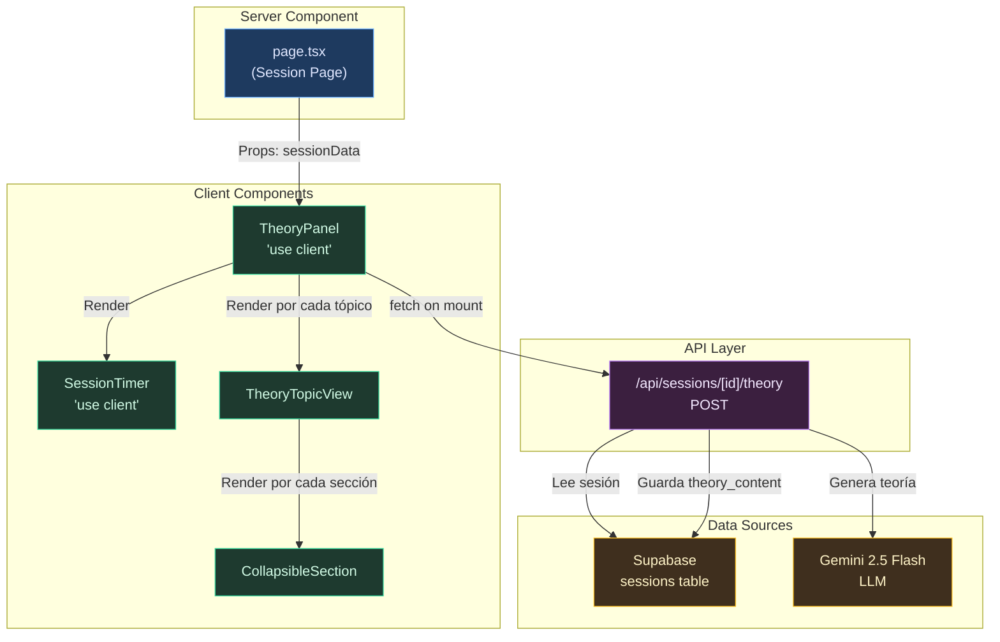
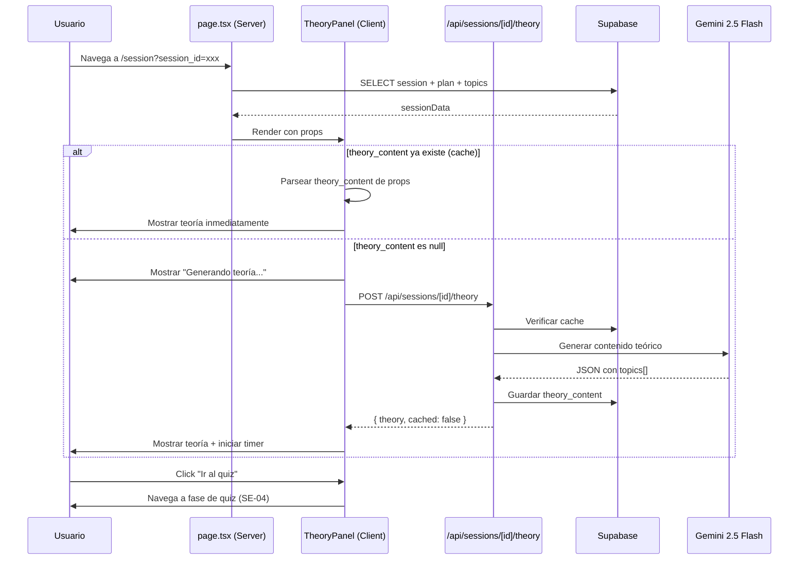

# SE-03 — UI: TheoryPanel (Lectura de Teoría con Timer Interactivo)

> **Guía:** SE-03
> **Bloque:** 📚 BLOQUE E — Sesión de Estudio
> **Fecha:** 29 junio 2026
> **Prerequisito directo:** SE-02 (Prompt de teoría + API Route `/api/sessions/[id]/theory`)

---

## Sección 1: 🎓 Introducción y Fundamentos Conceptuales

### ¿Dónde estamos?

En **SE-02** construimos la maquinaria *invisible* del sistema de estudio: un Route Handler que toma los tópicos de una sesión, los envía a Gemini 2.5 Flash, y recibe un JSON estructurado con `introduction`, `key_concepts`, `examples`, `connections` y `summary` para cada tópico. También implementamos **idempotencia** (la segunda llamada retorna caché) y **persistencia** (el contenido se guarda en `sessions.theory_content`).

El contenido teórico *ya existe* en la base de datos. Lo que **no existe todavía** es una interfaz donde el estudiante pueda **leerlo, explorar las secciones, y gestionar su tiempo** antes de pasar al quiz.

### ¿Qué construiremos en SE-03?

Vamos a reemplazar la página estática `/session` (que actualmente muestra una lista plana de tópicos y un mensaje "En SE-03 se implementará el panel interactivo") por una **experiencia de estudio inmersiva** con:

| Elemento | Propósito |
|---|---|
| **Timer de 45 minutos** | Cuenta regresiva visual que ayuda al estudiante a administrar su tiempo de lectura |
| **Renderizado de teoría** | Cada tópico se muestra con sus 5 secciones (introducción, conceptos, ejemplos, conexiones, resumen) |
| **Secciones colapsables** | El estudiante puede expandir/colapsar secciones para enfocarse en lo que necesita |
| **Barra de progreso** | Sesión X de N — cuánto avance lleva en el plan completo |
| **Navegación de tópicos** | Tabs o selector para alternar entre los tópicos de la sesión |
| **Botón "Ir al quiz"** | Siempre disponible, sin bloquear al estudiante |

### Conceptos clave de React/Next.js que usaremos

#### Server Components vs. Client Components en esta guía

La página actual `session/page.tsx` es un **Server Component** que carga los datos de la sesión desde Supabase. Sin embargo, ahora necesitamos **interactividad**:

- Un timer que actualiza cada segundo → necesita `useState` + `useEffect`
- Secciones colapsables → necesitan estado local (`useState`)
- Llamada a la API de teoría al cargar → necesita `useEffect` + `fetch`

**Solución arquitectónica:** La página `page.tsx` seguirá siendo un Server Component que carga los datos iniciales. Pero delegará el renderizado interactivo a un nuevo **Client Component** llamado `<TheoryPanel>`.

```
Server Component (page.tsx)
  └── Carga session data desde Supabase
        └── Pasa datos como props
              └── Client Component (TheoryPanel)
                    ├── Timer (useState + useEffect)
                    ├── Fetch de teoría (/api/sessions/[id]/theory)
                    ├── Secciones colapsables (useState)
                    └── Botón "Ir al quiz"
```

#### ¿Qué es la "hidratación" y por qué importa aquí?

Cuando un Server Component renderiza un Client Component, Next.js:

1. Renderiza el HTML en el servidor (SSR) — el usuario ve contenido inmediatamente
2. Envía el JavaScript del Client Component al navegador
3. React "hidrata" el HTML estático, conectando los event listeners

**Implicación práctica:** El timer NO debe empezar a correr hasta que el componente esté hidratado en el cliente. Si usamos `Date.now()` en el render inicial del servidor, obtendremos un error de hidratación porque el servidor y el cliente tienen tiempos diferentes.

**Solución:** Inicializar el timer en un `useEffect` (que solo corre en el cliente) y NO en el cuerpo del componente.

#### El patrón "Fetch on Mount" para la teoría

Cuando el TheoryPanel se monta, necesita:
1. Verificar si `theory_content` ya existe (pasado como prop desde el server)
2. Si no existe → hacer `fetch` a `/api/sessions/[id]/theory` para generarla
3. Mostrar un loading state mientras se genera

Este patrón se llama **"Fetch on Mount"** y usa `useEffect` con dependencias estables (`sessionData.id` y `sessionData.theory_content`) para no repetir llamadas innecesarias.

---

## Sección 2: 📋 Prerequisitos y Verificación del Entorno

Antes de comenzar, verifica que **todo** lo siguiente está en orden:

### Herramientas y versiones

| Herramienta | Verificación | Versión mínima |
|---|---|---|
| Node.js | `node --version` | v18+ |
| npm | `npm --version` | v9+ |
| Next.js | Revisar `frontend/package.json` | ^16.2.7 |
| lucide-react | Revisar `frontend/package.json` | ^1.21.0 |

```powershell
node --version
# → v20.x.x o v22.x.x ✅

npm --version
# → 10.x.x ✅
```

### Dependencias de guías anteriores

| Guía | Entregable requerido | Verificación |
|---|---|---|
| **SE-02** | API Route `/api/sessions/[id]/theory` funcional | Archivo `frontend/app/api/sessions/[id]/theory/route.ts` existe |
| **SE-02** | Tipos `TheoryContent`, `TheoryTopicContent` | Archivo `frontend/types/theory.ts` existe |
| **SE-01** | Tipos `SessionWithContext`, `SessionTopic` | Archivo `frontend/types/sessions.ts` existe |
| **SE-01** | Página `session/page.tsx` funcional | Archivo `frontend/app/(dashboard)/session/page.tsx` existe |
| **FE-04** | Dashboard layout con header y navegación | Archivo `frontend/app/(dashboard)/layout.tsx` existe |
| **DB-01** | Variables de Supabase en `.env.local` | Archivo `frontend/.env.local` contiene `NEXT_PUBLIC_SUPABASE_URL` |

### Verificación rápida

```powershell
# Verificar que los archivos clave de SE-02 existen
Test-Path -LiteralPath "frontend/app/api/sessions/[id]/theory/route.ts"
# → True ✅

Test-Path -LiteralPath "frontend/types/theory.ts"
# → True ✅

# Verificar que lucide-react ya está instalado (FE-01)
npm list lucide-react --prefix frontend
# → frontend@0.1.0 C:\...\frontend
# → └── lucide-react@1.21.0 ✅
```

> **Nota importante:** aunque `react-markdown` existe en `package.json`, en SE-03 **no lo usaremos**. SE-02 genera un JSON estructurado (`TheoryContent.topics[]`), no markdown plano. Renderizaremos cada campo con JSX tipado para evitar parseos innecesarios.

### Variables de entorno necesarias

Verifica que `frontend/.env.local` contiene (creadas en guías anteriores):

```env
NEXT_PUBLIC_SUPABASE_URL=https://tu-proyecto.supabase.co
NEXT_PUBLIC_SUPABASE_ANON_KEY=eyJ...
SUPABASE_SERVICE_ROLE_KEY=eyJ...
GEMINI_API_KEY=AIza...
```

> **⚠️ IMPORTANTE:** Si no tienes `GEMINI_API_KEY`, la generación de teoría fallará. Esta variable se configuró en **UP-04**.

---

## Sección 3: 📂 Estructura de Directorios del Proyecto

```
practica-testing/
├── backend/                          # (BE-01 a BE-06, sin cambios)
├── docs/
│   ├── guides/
│   │   ├── be/                       # Guías del backend
│   │   ├── db/                       # Guías de base de datos
│   │   └── fe/
│   │       ├── FE-01.md a FE-04.md
│   │       ├── UP-01.md a UP-06.md
│   │       ├── SE-01.md
│   │       ├── SE-02.md
│   │       └── SE-03.md              # ← 🆕 ESTA GUÍA
│   └── roadmap/
│       └── ISTQB_Guias_Implementacion.md
├── frontend/
│   ├── app/
│   │   ├── (auth)/                   # Login, Register (FE-03)
│   │   ├── (dashboard)/
│   │   │   ├── _components/
│   │   │   │   ├── main-nav.tsx      # (FE-04)
│   │   │   │   ├── mobile-nav.tsx    # (FE-04)
│   │   │   │   └── user-menu.tsx     # (FE-04)
│   │   │   ├── dashboard/
│   │   │   │   └── page.tsx          # (FE-04)
│   │   │   ├── plan/
│   │   │   │   └── page.tsx          # (UP-06)
│   │   │   ├── session/
│   │   │   │   └── page.tsx          # (SE-01) ← SE MODIFICA EN SE-03
│   │   │   ├── setup/
│   │   │   │   └── page.tsx          # (UP-01)
│   │   │   ├── layout.tsx            # (FE-04)
│   │   │   ├── loading.tsx           # (FE-04)
│   │   │   └── error.tsx             # (FE-04)
│   │   ├── api/
│   │   │   ├── extract/              # (UP-03)
│   │   │   ├── plan/                 # (UP-04)
│   │   │   ├── sessions/
│   │   │   │   ├── next/
│   │   │   │   │   └── route.ts      # (SE-01)
│   │   │   │   └── [id]/
│   │   │   │       ├── route.ts      # (SE-01)
│   │   │   │       └── theory/
│   │   │   │           └── route.ts  # (SE-02)
│   │   │   └── upload/               # (UP-02)
│   │   ├── globals.css
│   │   ├── layout.tsx
│   │   └── page.tsx                  # Landing
│   ├── components/
│   │   ├── session/                  # ← 🆕 DIRECTORIO NUEVO
│   │   │   ├── theory-panel.tsx      # ← 🆕 Client Component principal
│   │   │   ├── theory-topic-view.tsx # ← 🆕 Vista de un tópico individual
│   │   │   ├── session-timer.tsx     # ← 🆕 Timer de cuenta regresiva
│   │   │   └── collapsible-section.tsx # ← 🆕 Sección colapsable reutilizable
│   │   ├── shared/
│   │   │   └── .gitkeep
│   │   └── ui/                       # shadcn/ui (FE-01)
│   │       ├── avatar.tsx
│   │       ├── badge.tsx
│   │       ├── button.tsx
│   │       ├── card.tsx
│   │       └── ...
│   ├── lib/
│   │   ├── format.ts                 # (UP-06)
│   │   ├── openai.ts                 # (UP-04)
│   │   ├── prompts/
│   │   │   └── theory.ts             # (SE-02)
│   │   ├── supabase/
│   │   │   ├── client.ts             # (FE-02)
│   │   │   └── server.ts             # (FE-02)
│   │   └── utils.ts
│   ├── types/
│   │   ├── database.ts               # (FE-02)
│   │   ├── index.ts                  # (FE-02, SE-01, SE-02)
│   │   ├── sessions.ts               # (SE-01)
│   │   └── theory.ts                 # (SE-02)
│   ├── middleware.ts                  # (FE-03)
│   ├── package.json
│   └── tsconfig.json
├── supabase/                         # (DB-01 a DB-05)
├── .env.local
└── .gitignore
```

**Archivos NUEVOS en esta guía:**
- `components/session/theory-panel.tsx` — componente principal del panel de teoría
- `components/session/theory-topic-view.tsx` — renderizado de un tópico con secciones colapsables
- `components/session/session-timer.tsx` — timer de cuenta regresiva
- `components/session/collapsible-section.tsx` — sección colapsable reutilizable

**Archivos MODIFICADOS en esta guía:**
- `app/(dashboard)/session/page.tsx` — refactorizado para usar TheoryPanel

---

## Sección 4: 🎨 Diagrama de Arquitectura de Componentes



### Flujo de datos



---

## Sección 5: 🛠️ Implementación Paso a Paso

---

### Paso A: Crear el componente `CollapsibleSection`

**Archivo:** `frontend/components/session/collapsible-section.tsx`

Este componente es una sección con título clicable que se expande/colapsa con una animación suave. Lo usaremos para las secciones de teoría: Introducción, Conceptos clave, Ejemplos, Conexiones, Resumen.

```tsx
// ============================================================
// components/session/collapsible-section.tsx
// Sección colapsable reutilizable con animación
// ============================================================
// TIPO: Client Component (necesita useState para el toggle)
//
// PROPS:
//   - title: string — Título de la sección
//   - icon: LucideIcon — Ícono que acompaña al título
//   - defaultOpen?: boolean — Si la sección inicia abierta
//   - children: ReactNode — Contenido de la sección
//   - badge?: string — Badge opcional junto al título
//
// DISEÑO:
//   El header es un <button> semántico para accesibilidad.
//   La animación usa grid-rows de 0fr → 1fr (truco CSS moderno)
//   que anima la altura de manera suave sin JavaScript.
// ============================================================

"use client";

import { useState, type ReactNode } from "react";
import { ChevronDown, type LucideIcon } from "lucide-react";

interface CollapsibleSectionProps {
  title: string;
  icon: LucideIcon;
  defaultOpen?: boolean;
  children: ReactNode;
  badge?: string;
}

export function CollapsibleSection({
  title,
  icon: Icon,
  defaultOpen = false,
  children,
  badge,
}: CollapsibleSectionProps) {
  // ─── Estado: abierto o cerrado ────────────────────────────
  // defaultOpen determina el estado inicial. Las secciones
  // de "Introducción" y "Conceptos clave" se abren por defecto
  // para que el estudiante vea contenido al cargar la página.
  const [isOpen, setIsOpen] = useState(defaultOpen);

  return (
    <div className="rounded-xl border border-slate-800 bg-slate-900/40 overflow-hidden">
      {/* ── Header clicable ──────────────────────────────────── */}
      <button
        type="button"
        onClick={() => setIsOpen(!isOpen)}
        className="flex w-full items-center justify-between px-4 py-3 text-left transition-colors hover:bg-slate-800/50"
        // aria-expanded es importante para lectores de pantalla.
        // Indica si la sección está expandida o colapsada.
        aria-expanded={isOpen}
      >
        <div className="flex items-center gap-2.5">
          <Icon className="h-4 w-4 text-emerald-400 shrink-0" />
          <span className="text-sm font-semibold text-slate-100">{title}</span>
          {badge && (
            <span className="rounded-full bg-slate-800 px-2 py-0.5 text-xs text-slate-400">
              {badge}
            </span>
          )}
        </div>
        {/* ── Chevron con rotación animada ─────────────────── */}
        <ChevronDown
          className={`h-4 w-4 text-slate-500 transition-transform duration-200 ${
            isOpen ? "rotate-180" : "rotate-0"
          }`}
        />
      </button>

      {/* ── Contenido colapsable ─────────────────────────────── */}
      {/* Truco CSS: grid con grid-template-rows animado.
          - Cerrado: grid-rows: 0fr → el contenido tiene height: 0
          - Abierto: grid-rows: 1fr → el contenido tiene su height natural
          - overflow: hidden oculta el contenido cuando está colapsado
          - transition en grid-template-rows da la animación suave */}
      <div
        className={`grid transition-[grid-template-rows] duration-300 ease-in-out ${
          isOpen ? "grid-rows-[1fr]" : "grid-rows-[0fr]"
        }`}
      >
        <div className="overflow-hidden">
          <div className="px-4 pb-4 pt-1">{children}</div>
        </div>
      </div>
    </div>
  );
}
```

**Entregable del Paso A:**
- ✅ Archivo `frontend/components/session/collapsible-section.tsx` creado

---

### Paso B: Crear el componente `SessionTimer`

**Archivo:** `frontend/components/session/session-timer.tsx`

Este componente muestra un timer de cuenta regresiva. Cuando llega a 0, muestra un mensaje de "Tiempo agotado" pero **NO bloquea** al estudiante — puede seguir leyendo o ir al quiz.

```tsx
// ============================================================
// components/session/session-timer.tsx
// Timer de cuenta regresiva para la sesión de estudio
// ============================================================
// TIPO: Client Component (necesita useState + useEffect + setInterval)
//
// PROPS:
//   - durationMinutes: number — Duración total en minutos (default 45)
//   - onTimeUp?: () => void — Callback cuando el tiempo se agota
//   - autoStart?: boolean — Si el timer empieza automáticamente
//
// COMPORTAMIENTO:
//   - Muestra MM:SS en formato grande
//   - Cambia de color cuando quedan < 5 minutos (amarillo)
//   - Cambia de color cuando quedan < 1 minuto (rojo)
//   - Al llegar a 0:00, muestra "Tiempo agotado" pero NO bloquea
//   - El timer se puede pausar/reanudar con un click
//
// ¿POR QUÉ NO USAR Date.now() EN EL RENDER INICIAL?
//   Porque este componente se renderiza primero en el servidor (SSR).
//   Si usamos Date.now() en el cuerpo del componente, el servidor
//   genera un timestamp diferente al del cliente, causando un
//   "hydration mismatch" error de React.
//
//   Solución: inicializar el timer en useEffect (solo corre en cliente)
//   y usar un estado "isReady" para evitar el mismatch.
// ============================================================

"use client";

import { useState, useEffect, useRef } from "react";
import { Clock, Pause, Play, AlertTriangle } from "lucide-react";

interface SessionTimerProps {
  durationMinutes?: number;
  onTimeUp?: () => void;
  autoStart?: boolean;
}

export function SessionTimer({
  durationMinutes = 45,
  onTimeUp,
  autoStart = true,
}: SessionTimerProps) {
  // ─── Estado ───────────────────────────────────────────────
  // secondsLeft: tiempo restante en segundos
  // isRunning: si el timer está corriendo
  // isReady: si el componente ya se hidratió (evita mismatch)
  // hasFinished: si el timer llegó a 0
  const [secondsLeft, setSecondsLeft] = useState(durationMinutes * 60);
  const [isRunning, setIsRunning] = useState(false);
  const [isReady, setIsReady] = useState(false);
  const [hasFinished, setHasFinished] = useState(false);

  // useRef para el callback de onTimeUp — evita recrear el interval
  // cada vez que onTimeUp cambia (patrón "latest ref")
  const onTimeUpRef = useRef(onTimeUp);
  onTimeUpRef.current = onTimeUp;

  // ─── Efecto: inicialización post-hidratación ──────────────
  // Este efecto solo corre en el CLIENTE, después de la hidratación.
  // Evita el error de hydration mismatch al no usar Date.now()
  // durante el render del servidor.
  useEffect(() => {
    setIsReady(true);
    if (autoStart) {
      setIsRunning(true);
    }
  }, [autoStart]);

  // ─── Efecto: countdown ────────────────────────────────────
  // setInterval que decrementa secondsLeft cada segundo.
  // Se limpia automáticamente cuando el componente se desmonta
  // o cuando isRunning cambia a false.
  useEffect(() => {
    if (!isRunning || hasFinished) return;

    const intervalId = setInterval(() => {
      setSecondsLeft((prev) => {
        if (prev <= 1) {
          clearInterval(intervalId);
          setIsRunning(false);
          setHasFinished(true);
          // Llamar al callback en el siguiente tick para evitar
          // actualizar estado dentro de un setState
          setTimeout(() => onTimeUpRef.current?.(), 0);
          return 0;
        }
        return prev - 1;
      });
    }, 1000);

    // Cleanup: limpiar el interval cuando el efecto se re-ejecuta
    // o el componente se desmonta. Sin esto, tendríamos memory leaks
    // y el timer correría el doble de rápido.
    return () => clearInterval(intervalId);
  }, [isRunning, hasFinished]);

  // ─── Toggle play/pause ────────────────────────────────────
  function toggleTimer() {
    if (!hasFinished) {
      setIsRunning((prev) => !prev);
    }
  }

  // ─── Formatear tiempo ─────────────────────────────────────
  const minutes = Math.floor(secondsLeft / 60);
  const seconds = secondsLeft % 60;
  const formattedTime = `${String(minutes).padStart(2, "0")}:${String(seconds).padStart(2, "0")}`;

  // ─── Calcular progreso para la barra ──────────────────────
  const totalSeconds = durationMinutes * 60;
  const progressPercent = ((totalSeconds - secondsLeft) / totalSeconds) * 100;

  // ─── Determinar color según tiempo restante ───────────────
  // Verde → Amarillo (< 5 min) → Rojo (< 1 min) → Gris (terminado)
  let colorClass = "text-emerald-400";
  let barColor = "bg-emerald-500";
  let bgGlow = "";

  if (hasFinished) {
    colorClass = "text-slate-500";
    barColor = "bg-slate-600";
  } else if (secondsLeft < 60) {
    colorClass = "text-red-400";
    barColor = "bg-red-500";
    bgGlow = "shadow-[0_0_15px_rgba(239,68,68,0.2)]";
  } else if (secondsLeft < 300) {
    colorClass = "text-amber-400";
    barColor = "bg-amber-500";
  }

  // ─── Render previo a hidratación ──────────────────────────
  // Mostrar el tiempo inicial estático para evitar hydration mismatch.
  // El timer real empieza solo después de useEffect.
  if (!isReady) {
    return (
      <div className="flex items-center gap-3 rounded-xl border border-slate-800 bg-slate-900/60 px-4 py-3">
        <Clock className="h-5 w-5 text-emerald-400" />
        <span className="font-mono text-2xl font-bold text-emerald-400 tabular-nums">
          {String(durationMinutes).padStart(2, "0")}:00
        </span>
      </div>
    );
  }

  return (
    <div className={`rounded-xl border border-slate-800 bg-slate-900/60 px-4 py-3 transition-shadow duration-500 ${bgGlow}`}>
      <div className="flex items-center gap-3">
        {/* ── Ícono de estado ──────────────────────────────── */}
        {hasFinished ? (
          <AlertTriangle className="h-5 w-5 text-slate-500 shrink-0" />
        ) : (
          <Clock className={`h-5 w-5 ${colorClass} shrink-0`} />
        )}

        {/* ── Tiempo ──────────────────────────────────────── */}
        <span
          className={`font-mono text-2xl font-bold tabular-nums ${colorClass}`}
        >
          {hasFinished ? "00:00" : formattedTime}
        </span>

        {/* ── Botón pause/play ────────────────────────────── */}
        {!hasFinished && (
          <button
            type="button"
            onClick={toggleTimer}
            className="ml-auto flex h-8 w-8 items-center justify-center rounded-lg border border-slate-700 bg-slate-800 text-slate-300 transition-colors hover:bg-slate-700 hover:text-white"
            aria-label={isRunning ? "Pausar timer" : "Reanudar timer"}
          >
            {isRunning ? (
              <Pause className="h-3.5 w-3.5" />
            ) : (
              <Play className="h-3.5 w-3.5" />
            )}
          </button>
        )}

        {/* ── Label de estado ─────────────────────────────── */}
        {hasFinished && (
          <span className="ml-auto text-xs text-slate-500">
            Tiempo agotado — puedes seguir leyendo
          </span>
        )}
      </div>

      {/* ── Barra de progreso ─────────────────────────────── */}
      <div className="mt-2 h-1 w-full overflow-hidden rounded-full bg-slate-800">
        <div
          className={`h-full rounded-full ${barColor} transition-all duration-1000 ease-linear`}
          style={{ width: `${progressPercent}%` }}
        />
      </div>
    </div>
  );
}
```

**Entregable del Paso B:**
- ✅ Archivo `frontend/components/session/session-timer.tsx` creado

---

### Paso C: Crear el componente `TheoryTopicView`

**Archivo:** `frontend/components/session/theory-topic-view.tsx`

Este componente renderiza el contenido teórico de **un solo tópico** con sus 5 secciones colapsables: Introducción, Conceptos Clave, Ejemplos, Conexiones, y Resumen.

```tsx
// ============================================================
// components/session/theory-topic-view.tsx
// Vista de contenido teórico de un tópico individual
// ============================================================
// TIPO: Client Component (importa CollapsibleSection que usa estado)
//
// PROPS:
//   - topic: TheoryTopicContent — El contenido teórico del tópico
//
// DISEÑO:
//   Cada sección del contenido teórico se renderiza como un
//   CollapsibleSection con su ícono y contenido formateado.
//   Las secciones de Introducción y Conceptos Clave se abren
//   por defecto para que el estudiante vea contenido al cargar.
//
// ¿POR QUÉ NO USAR react-markdown AQUÍ?
//   El contenido teórico del LLM viene como JSON estructurado
//   (no como markdown crudo). Cada campo (introduction, summary)
//   es texto plano, y key_concepts es un array de objetos.
//   Renderizamos directamente el JSX en vez de parsear markdown.
//
//   Si en el futuro el LLM envía markdown dentro de introduction
//   o summary, podemos envolver esos campos con <ReactMarkdown>.
// ============================================================

"use client";

import {
  BookOpen,
  Lightbulb,
  Beaker,
  Link2,
  FileText,
} from "lucide-react";
import { Badge } from "@/components/ui/badge";
import { CollapsibleSection } from "./collapsible-section";
import type { TheoryTopicContent } from "@/types/theory";

interface TheoryTopicViewProps {
  topic: TheoryTopicContent;
}

// ─── Mapeo de level_k a colores de badge ────────────────────
function getLevelBadgeStyle(level: string): string {
  const map: Record<string, string> = {
    K1: "border-sky-700 bg-sky-950/40 text-sky-300",
    K2: "border-amber-700 bg-amber-950/40 text-amber-300",
    K3: "border-rose-700 bg-rose-950/40 text-rose-300",
  };
  return map[level] || "border-slate-700 bg-slate-800 text-slate-300";
}

export function TheoryTopicView({ topic }: TheoryTopicViewProps) {
  return (
    <div className="space-y-3">
      {/* ── Header del tópico ─────────────────────────────── */}
      <div className="flex items-center gap-3 px-1">
        <span className="font-mono text-sm font-semibold text-emerald-400">
          {topic.topic_code}
        </span>
        <Badge
          variant="outline"
          className={getLevelBadgeStyle(topic.level_k)}
        >
          {topic.level_k}
        </Badge>
        <span className="text-sm text-slate-300 truncate">
          {topic.topic_name}
        </span>
      </div>

      {/* ── Sección 1: Introducción ───────────────────────── */}
      <CollapsibleSection
        title="Introducción"
        icon={BookOpen}
        defaultOpen={true}
      >
        <div className="prose-sm text-sm leading-relaxed text-slate-300 whitespace-pre-line">
          {topic.introduction}
        </div>
      </CollapsibleSection>

      {/* ── Sección 2: Conceptos Clave ────────────────────── */}
      <CollapsibleSection
        title="Conceptos Clave"
        icon={Lightbulb}
        defaultOpen={true}
        badge={`${topic.key_concepts.length} conceptos`}
      >
        <div className="space-y-4">
          {topic.key_concepts.map((concept, index) => (
            <div
              key={`concept-${index}`}
              className="rounded-lg border border-slate-800/60 bg-slate-950/30 p-3"
            >
              {/* Término en negrita + color acento */}
              <h4 className="text-sm font-semibold text-emerald-300">
                {concept.term}
              </h4>
              {/* Definición */}
              <p className="mt-1 text-sm leading-relaxed text-slate-300">
                {concept.definition}
              </p>
              {/* Ejemplo del concepto (si existe) */}
              {concept.example && (
                <p className="mt-2 border-l-2 border-emerald-800 pl-3 text-xs leading-5 text-slate-400 italic">
                  💡 {concept.example}
                </p>
              )}
            </div>
          ))}
        </div>
      </CollapsibleSection>

      {/* ── Sección 3: Ejemplos Prácticos ─────────────────── */}
      {topic.examples && topic.examples.length > 0 && (
        <CollapsibleSection
          title="Ejemplos Prácticos"
          icon={Beaker}
          badge={`${topic.examples.length} ejemplos`}
        >
          <div className="space-y-4">
            {topic.examples.map((example, index) => (
              <div
                key={`example-${index}`}
                className="rounded-lg border border-slate-800/60 bg-slate-950/30 p-3"
              >
                <h4 className="text-sm font-semibold text-sky-300">
                  {example.title}
                </h4>
                <p className="mt-1 text-sm leading-relaxed text-slate-300">
                  {example.description}
                </p>
                <p className="mt-2 flex items-start gap-1.5 text-xs text-amber-400/80">
                  <span className="shrink-0 mt-0.5">📌</span>
                  <span className="leading-5">{example.lesson}</span>
                </p>
              </div>
            ))}
          </div>
        </CollapsibleSection>
      )}

      {/* ── Sección 4: Conexiones ─────────────────────────── */}
      {topic.connections && topic.connections.length > 0 && (
        <CollapsibleSection
          title="Conexiones con otros tópicos"
          icon={Link2}
          badge={`${topic.connections.length}`}
        >
          <div className="space-y-2">
            {topic.connections.map((conn, index) => (
              <div
                key={`conn-${index}`}
                className="flex items-start gap-2 text-sm"
              >
                <span className="shrink-0 font-mono text-xs text-purple-400 mt-0.5">
                  {conn.related_topic_code}
                </span>
                <span className="text-slate-400 leading-relaxed">
                  {conn.relationship}
                </span>
              </div>
            ))}
          </div>
        </CollapsibleSection>
      )}

      {/* ── Sección 5: Resumen ────────────────────────────── */}
      <CollapsibleSection title="Resumen" icon={FileText}>
        <div className="rounded-lg border border-emerald-900/30 bg-emerald-950/10 p-3">
          <p className="text-sm leading-relaxed text-slate-300 whitespace-pre-line">
            {topic.summary}
          </p>
        </div>
      </CollapsibleSection>
    </div>
  );
}
```

**Entregable del Paso C:**
- ✅ Archivo `frontend/components/session/theory-topic-view.tsx` creado

---

### Paso D: Crear el componente principal `TheoryPanel`

**Archivo:** `frontend/components/session/theory-panel.tsx`

Este es el componente **orquestador** que une todo: timer, navegación de tópicos, contenido teórico, y botón "Ir al quiz".

```tsx
// ============================================================
// components/session/theory-panel.tsx
// Panel principal de lectura de teoría para una sesión de estudio
// ============================================================
// TIPO: Client Component (orquesta Timer, fetch, y estado de UI)
//
// RESPONSABILIDADES:
//   1. Recibir sessionData como props (del Server Component)
//   2. Verificar si theory_content ya existe
//   3. Si no existe → hacer fetch a /api/sessions/[id]/theory
//   4. Renderizar timer + navegación de tópicos + contenido
//   5. Botón "Ir al quiz" siempre disponible
//
// PROPS:
//   - sessionData: SessionWithContext — Datos de la sesión
//
// ESTADOS:
//   - loading: boolean — Está generando la teoría
//   - error: string | null — Error al generar teoría
//   - theoryContent: TheoryContent | null — Contenido teórico
//   - activeTopicIndex: number — Tópico actualmente visible
//   - timerStarted: boolean — Si el timer ya inició
// ============================================================

"use client";

import { useState, useEffect } from "react";
import { useRouter } from "next/navigation";
import {
  BookOpen,
  Sun,
  Moon,
  RefreshCw,
  FileCheck,
  ArrowLeft,
  ArrowRight,
  Sparkles,
  Loader2,
  AlertTriangle,
  RotateCcw,
} from "lucide-react";
import { Badge } from "@/components/ui/badge";
import { SessionTimer } from "./session-timer";
import { TheoryTopicView } from "./theory-topic-view";
import type { SessionWithContext } from "@/types/sessions";
import type { TheoryContent } from "@/types/theory";

interface TheoryPanelProps {
  sessionData: SessionWithContext;
}

// ─── Mapeo de session_type a ícono ──────────────────────────
function getSessionIcon(type: string) {
  const map: Record<string, typeof Sun> = {
    morning: Sun,
    night: Moon,
    reinforcement: RefreshCw,
    mock_exam: FileCheck,
  };
  return map[type] || Sun;
}

function getSessionTypeLabel(type: string): string {
  const map: Record<string, string> = {
    morning: "Sesión Matutina",
    night: "Sesión Nocturna",
    reinforcement: "Sesión de Refuerzo",
    mock_exam: "Simulacro de Examen",
  };
  return map[type] || type;
}

function getSessionTypeColor(type: string): string {
  const map: Record<string, string> = {
    morning: "text-amber-300",
    night: "text-indigo-300",
    reinforcement: "text-orange-300",
    mock_exam: "text-purple-300",
  };
  return map[type] || "text-slate-300";
}

function getMethodLabel(method: string): string {
  const map: Record<string, string> = {
    theory: "Teoría formal",
    examples: "Ejemplos prácticos",
    analogies: "Analogías y metáforas",
  };
  return map[method] || method;
}

export function TheoryPanel({ sessionData }: TheoryPanelProps) {
  const router = useRouter();

  // ═══════════════════════════════════════════════════════════
  // ESTADO
  // ═══════════════════════════════════════════════════════════
  const [loading, setLoading] = useState(false);
  const [error, setError] = useState<string | null>(null);
  const [theoryContent, setTheoryContent] = useState<TheoryContent | null>(
    null,
  );
  const [activeTopicIndex, setActiveTopicIndex] = useState(0);
  const [timerActive, setTimerActive] = useState(false);

  // ═══════════════════════════════════════════════════════════
  // EFECTO: Cargar teoría al montar
  // ═══════════════════════════════════════════════════════════
  // Este efecto implementa el patrón "Fetch on Mount":
  //   1. Si theory_content ya existe en sessionData → parsear y usar
  //   2. Si no existe → hacer POST a la API para generarla
  //   3. En ambos casos, activar el timer al finalizar
  useEffect(() => {
    let cancelled = false;

    async function loadTheory() {
      // ── Caso 1: Teoría ya existe (cache de SE-02) ──────────
      if (sessionData.theory_content) {
        try {
          const parsed: TheoryContent =
            typeof sessionData.theory_content === "string"
              ? JSON.parse(sessionData.theory_content)
              : sessionData.theory_content;

          if (!cancelled) {
            setTheoryContent(parsed);
            setActiveTopicIndex(0);
            setLoading(false);
            setError(null);
            setTimerActive(true);
          }
          return;
        } catch {
          // Si el JSON está corrupto, continuar con la regeneración
          console.warn(
            "[TheoryPanel] theory_content corrupto, regenerando...",
          );
        }
      }

      // ── Caso 2: Generar teoría via API ─────────────────────
      if (!cancelled) {
        setLoading(true);
        setError(null);
      }

      try {
        const response = await fetch(
          `/api/sessions/${sessionData.id}/theory`,
          {
            method: "POST",
            headers: { "Content-Type": "application/json" },
            body: JSON.stringify({ force: false }),
          },
        );

        if (!response.ok) {
          const data = await response.json().catch(() => ({}));
          throw new Error(
            data.error || `Error ${response.status} al generar teoría`,
          );
        }

        const data = await response.json();

        if (!cancelled) {
          setTheoryContent(data.theory);
          setActiveTopicIndex(0);
          setTimerActive(true);
        }
      } catch (err) {
        if (!cancelled) {
          setError(
            err instanceof Error
              ? err.message
              : "Error desconocido al generar teoría",
          );
        }
      } finally {
        if (!cancelled) {
          setLoading(false);
        }
      }
    }

    loadTheory();

    // Cleanup: si el componente se desmonta antes de que el
    // fetch termine, el flag cancelled evita actualizar estado
    // de un componente desmontado (React warning).
    return () => {
      cancelled = true;
    };
  }, [sessionData.id, sessionData.theory_content]);

  // ═══════════════════════════════════════════════════════════
  // HANDLERS
  // ═══════════════════════════════════════════════════════════

  // Regenerar teoría con force=true
  async function handleRetry() {
    setLoading(true);
    setError(null);
    setTheoryContent(null);

    try {
      const response = await fetch(
        `/api/sessions/${sessionData.id}/theory`,
        {
          method: "POST",
          headers: { "Content-Type": "application/json" },
          body: JSON.stringify({ force: true }),
        },
      );

      if (!response.ok) {
        const data = await response.json().catch(() => ({}));
        throw new Error(
          data.error || `Error ${response.status} al regenerar teoría`,
        );
      }

      const data = await response.json();
      setTheoryContent(data.theory);
      setActiveTopicIndex(0);
      setTimerActive(true);
    } catch (err) {
      setError(
        err instanceof Error
          ? err.message
          : "Error desconocido al regenerar teoría",
      );
    } finally {
      setLoading(false);
    }
  }

  // Navegar al quiz (SE-04, por ahora placeholder)
  function handleGoToQuiz() {
    // En SE-04 se implementará la navegación real al quiz.
    // Por ahora, mostramos un alert o navegamos a la misma
    // página con un parámetro indicando la fase de quiz.
    router.push(`/session?session_id=${sessionData.id}&phase=quiz`);
  }

  // ═══════════════════════════════════════════════════════════
  // VARIABLES DERIVADAS
  // ═══════════════════════════════════════════════════════════
  const SessionIcon = getSessionIcon(sessionData.session_type);
  const sessionColor = getSessionTypeColor(sessionData.session_type);
  const totalTopics = theoryContent?.topics?.length || 0;
  const activeTopic = theoryContent?.topics?.[activeTopicIndex];

  // Progreso del plan
  const progressPercent =
    sessionData.plan_context.total_sessions > 0
      ? (sessionData.plan_context.completed_sessions /
          sessionData.plan_context.total_sessions) *
        100
      : 0;

  // ═══════════════════════════════════════════════════════════
  // RENDER
  // ═══════════════════════════════════════════════════════════
  return (
    <div className="mx-auto flex max-w-3xl flex-col gap-5">
      {/* ═══════════════════════════════════════════════════════ */}
      {/* HEADER: Info de la sesión + Timer                      */}
      {/* ═══════════════════════════════════════════════════════ */}
      <section className="rounded-2xl border border-slate-800 bg-slate-900/60 p-5">
        {/* ── Fila superior: tipo + número + timer ──────────── */}
        <div className="flex flex-col gap-4 sm:flex-row sm:items-start sm:justify-between">
          {/* Info de la sesión */}
          <div className="flex items-center gap-3">
            <div className="flex h-11 w-11 items-center justify-center rounded-full bg-slate-800">
              <SessionIcon className={`h-5 w-5 ${sessionColor}`} />
            </div>
            <div>
              <p className={`text-xs font-medium uppercase tracking-wide ${sessionColor}`}>
                Día {sessionData.day_number} — {getSessionTypeLabel(sessionData.session_type)}
              </p>
              <h1 className="text-xl font-bold tracking-tight text-white">
                Sesión {sessionData.session_number} de{" "}
                {sessionData.plan_context.total_sessions}
              </h1>
            </div>
          </div>

          {/* Timer */}
          {timerActive && (
            <div className="sm:w-64">
              <SessionTimer
                durationMinutes={Math.floor(sessionData.duration_minutes / 2)}
                autoStart={true}
              />
            </div>
          )}
        </div>

        {/* ── Barra de progreso del plan ───────────────────── */}
        <div className="mt-4">
          <div className="flex items-center justify-between text-xs text-slate-400">
            <span>Progreso del plan</span>
            <span>
              {sessionData.plan_context.completed_sessions} /{" "}
              {sessionData.plan_context.total_sessions} sesiones
            </span>
          </div>
          <div className="mt-1.5 h-1.5 w-full overflow-hidden rounded-full bg-slate-800">
            <div
              className="h-full rounded-full bg-emerald-500 transition-all duration-500"
              style={{ width: `${progressPercent}%` }}
            />
          </div>
        </div>

        {/* ── Método de enseñanza ──────────────────────────── */}
        <div className="mt-3 flex flex-wrap items-center gap-2 text-xs text-slate-400">
          <BookOpen className="h-3.5 w-3.5" />
          <span>Método: {getMethodLabel(sessionData.method_used)}</span>
          {sessionData.attempt_number > 1 && (
            <Badge
              variant="outline"
              className="border-orange-700 bg-orange-950/40 text-orange-300 text-xs"
            >
              Intento #{sessionData.attempt_number}
            </Badge>
          )}
        </div>
      </section>

      {/* ═══════════════════════════════════════════════════════ */}
      {/* ESTADO: Loading / Error                                */}
      {/* ═══════════════════════════════════════════════════════ */}
      {loading && (
        <section className="rounded-2xl border border-slate-800 bg-slate-900/60 p-8">
          <div className="flex flex-col items-center gap-4 text-center">
            <div className="relative">
              <div className="h-16 w-16 rounded-full border-2 border-slate-700 border-t-emerald-400 animate-spin" />
              <Sparkles className="absolute top-1/2 left-1/2 h-6 w-6 -translate-x-1/2 -translate-y-1/2 text-emerald-400" />
            </div>
            <div>
              <p className="text-lg font-semibold text-white">
                Generando contenido teórico...
              </p>
              <p className="mt-1 text-sm text-slate-400">
                Gemini está preparando la teoría para{" "}
                {sessionData.topics.length} tópico{sessionData.topics.length > 1 ? "s" : ""}.
                Esto puede tomar 15-30 segundos.
              </p>
            </div>
          </div>
        </section>
      )}

      {error && (
        <section className="rounded-2xl border border-red-500/30 bg-red-950/10 p-6">
          <div className="flex items-start gap-3">
            <AlertTriangle className="h-5 w-5 text-red-400 shrink-0 mt-0.5" />
            <div className="flex-1">
              <p className="text-sm font-semibold text-red-300">
                Error al generar la teoría
              </p>
              <p className="mt-1 text-sm text-red-300/70">{error}</p>
              <button
                type="button"
                onClick={handleRetry}
                disabled={loading}
                className="mt-3 inline-flex items-center gap-2 rounded-lg border border-red-700 bg-red-950/50 px-4 py-2 text-sm font-medium text-red-300 transition-colors hover:bg-red-900/50 disabled:opacity-50"
              >
                <RotateCcw className="h-3.5 w-3.5" />
                Reintentar
              </button>
            </div>
          </div>
        </section>
      )}

      {/* ═══════════════════════════════════════════════════════ */}
      {/* CONTENIDO TEÓRICO                                      */}
      {/* ═══════════════════════════════════════════════════════ */}
      {theoryContent && totalTopics > 0 && (
        <>
          {/* ── Navegación de tópicos (tabs) ──────────────── */}
          {totalTopics > 1 && (
            <section className="rounded-2xl border border-slate-800 bg-slate-900/60 p-3">
              <div className="flex flex-wrap gap-2">
                {theoryContent.topics.map((topic, index) => (
                  <button
                    key={topic.topic_code}
                    type="button"
                    onClick={() => setActiveTopicIndex(index)}
                    className={`inline-flex items-center gap-1.5 rounded-lg px-3 py-1.5 text-xs font-medium transition-all ${
                      index === activeTopicIndex
                        ? "bg-emerald-500/20 text-emerald-300 border border-emerald-500/30 shadow-sm"
                        : "text-slate-400 hover:text-slate-200 hover:bg-slate-800 border border-transparent"
                    }`}
                  >
                    <span className="font-mono">{topic.topic_code}</span>
                    <span className="hidden sm:inline">·</span>
                    <span className="hidden sm:inline truncate max-w-[140px]">
                      {topic.topic_name}
                    </span>
                  </button>
                ))}
              </div>
            </section>
          )}

          {/* ── Vista del tópico activo ───────────────────── */}
          <section className="rounded-2xl border border-slate-800 bg-slate-900/60 p-5">
            {activeTopic && <TheoryTopicView topic={activeTopic} />}
          </section>

          {/* ── Navegación anterior/siguiente ─────────────── */}
          {totalTopics > 1 && (
            <div className="flex items-center justify-between">
              <button
                type="button"
                onClick={() =>
                  setActiveTopicIndex((prev) => Math.max(0, prev - 1))
                }
                disabled={activeTopicIndex === 0}
                className="inline-flex items-center gap-2 rounded-lg border border-slate-700 px-4 py-2 text-sm font-medium text-slate-300 transition-colors hover:bg-slate-800 disabled:opacity-30 disabled:cursor-not-allowed"
              >
                <ArrowLeft className="h-4 w-4" />
                Tópico anterior
              </button>
              <span className="text-xs text-slate-500">
                {activeTopicIndex + 1} / {totalTopics}
              </span>
              <button
                type="button"
                onClick={() =>
                  setActiveTopicIndex((prev) =>
                    Math.min(totalTopics - 1, prev + 1),
                  )
                }
                disabled={activeTopicIndex === totalTopics - 1}
                className="inline-flex items-center gap-2 rounded-lg border border-slate-700 px-4 py-2 text-sm font-medium text-slate-300 transition-colors hover:bg-slate-800 disabled:opacity-30 disabled:cursor-not-allowed"
              >
                Siguiente tópico
                <ArrowRight className="h-4 w-4" />
              </button>
            </div>
          )}
        </>
      )}

      {/* ═══════════════════════════════════════════════════════ */}
      {/* ACCIONES: Ir al quiz + Volver al plan                  */}
      {/* ═══════════════════════════════════════════════════════ */}
      <section className="rounded-2xl border border-slate-800 bg-slate-900/60 p-5">
        <div className="flex flex-col gap-4 sm:flex-row sm:items-center sm:justify-between">
          <div className="text-sm text-slate-400">
            {theoryContent ? (
              <p>
                ¿Listo para evaluar tu comprensión? El quiz tendrá preguntas
                estilo ISTQB sobre los tópicos que acabas de estudiar.
              </p>
            ) : loading ? (
              <p>
                Espera a que se genere la teoría o ve directamente al quiz.
              </p>
            ) : (
              <p>
                Cuando estés listo, pasa al quiz para evaluar tu comprensión.
              </p>
            )}
          </div>
          <div className="flex gap-3 shrink-0">
            <button
              type="button"
              onClick={() => router.push("/plan")}
              className="inline-flex h-10 items-center justify-center gap-2 rounded-lg border border-slate-700 px-5 text-sm font-medium text-slate-200 transition-colors hover:bg-slate-800"
            >
              <ArrowLeft className="h-4 w-4" />
              Plan
            </button>
            <button
              type="button"
              onClick={handleGoToQuiz}
              className="inline-flex h-10 items-center justify-center gap-2 rounded-lg bg-emerald-500 px-5 text-sm font-semibold text-slate-950 transition-colors hover:bg-emerald-400"
            >
              <Sparkles className="h-4 w-4" />
              Ir al quiz
            </button>
          </div>
        </div>
      </section>

      {/* ── Metadatos de la generación (solo si hay contenido) ── */}
      {theoryContent && (
        <p className="text-center text-xs text-slate-600">
          Generado por {theoryContent.model_name} ({theoryContent.model_provider})
          · {new Date(theoryContent.generated_at).toLocaleDateString("es-MX", {
            day: "numeric",
            month: "short",
            year: "numeric",
            hour: "2-digit",
            minute: "2-digit",
          })}
        </p>
      )}
    </div>
  );
}
```

**Entregable del Paso D:**
- ✅ Archivo `frontend/components/session/theory-panel.tsx` creado

---

### Paso E: Refactorizar `session/page.tsx` para usar `TheoryPanel`

**Archivo:** `frontend/app/(dashboard)/session/page.tsx`

Ahora vamos a **refactorizar** la página de sesión para que:
1. Mantenga toda la lógica del Server Component (autenticación, carga de datos)
2. Delegue el renderizado interactivo al nuevo `<TheoryPanel>`
3. Elimine el mensaje "En SE-03 se implementará el panel interactivo"

```tsx
// ============================================================
// app/(dashboard)/session/page.tsx — Página de Sesión de Estudio
// ============================================================
// TIPO: Server Component (hace fetch en el servidor)
//
// FLUJO:
//   1. Lee session_id del query param (viene de SessionCard)
//   2. Si hay session_id → busca esa sesión en Supabase
//   3. Si no hay session_id → reabre la sesión active o busca la próxima pending
//   4. Pasa los datos al TheoryPanel (Client Component)
//
// CAMBIOS EN SE-03:
//   - Reemplazado el render estático por <TheoryPanel>
//   - El TheoryPanel se encarga de: timer, fetch de teoría,
//     secciones colapsables, y navegación a quiz
//   - Mantenida toda la lógica de carga de datos del servidor
// ============================================================

import Link from "next/link";
import {
  BookOpen,
  ArrowLeft,
  Trophy,
  AlertTriangle,
} from "lucide-react";
import { createClient } from "@/lib/supabase/server";
import { redirect } from "next/navigation";
import type { SessionWithContext, SessionTopic } from "@/types/sessions";
import { TheoryPanel } from "@/components/session/theory-panel";

type SessionPageProps = {
  searchParams: Promise<{
    session_id?: string | string[];
  }>;
};

type SupabaseServerClient = Awaited<ReturnType<typeof createClient>>;

// ─── Orden correcto de sesiones ────────────────────────────────
// Refuerzos primero; luego día ascendente; dentro del día: mañana/noche.
type SessionSortInput = {
  id?: string;
  day_number: number;
  session_type: string;
  status?: string | null;
};

const SAME_DAY_SESSION_ORDER: Record<string, number> = {
  morning: 1,
  night: 2,
  mock_exam: 3,
  reinforcement: 4,
};

function compareSessionsForStudyOrder(
  a: SessionSortInput,
  b: SessionSortInput,
): number {
  const aIsReinforcement = a.session_type === "reinforcement";
  const bIsReinforcement = b.session_type === "reinforcement";

  if (aIsReinforcement !== bIsReinforcement) {
    return aIsReinforcement ? -1 : 1;
  }

  if (a.day_number !== b.day_number) {
    return a.day_number - b.day_number;
  }

  return (
    (SAME_DAY_SESSION_ORDER[a.session_type] ?? 99) -
    (SAME_DAY_SESSION_ORDER[b.session_type] ?? 99)
  );
}

function compareSessionsForCurrentPick(
  a: SessionSortInput,
  b: SessionSortInput,
): number {
  // Si SE-02 ya generó teoría, la sesión queda en status "active".
  // /session sin session_id debe reabrir esa sesión antes de saltar
  // accidentalmente a la siguiente pending.
  const aIsActive = a.status === "active";
  const bIsActive = b.status === "active";

  if (aIsActive !== bIsActive) {
    return aIsActive ? -1 : 1;
  }

  return compareSessionsForStudyOrder(a, b);
}

async function getSessionNumber(
  supabase: SupabaseServerClient,
  planId: string,
  userId: string,
  sessionId: string,
): Promise<number> {
  // Calcular la posición real evita mostrar siempre "completadas + 1"
  // cuando el usuario abre una sesión específica por URL.
  const { data: planSessionsForOrder } = await supabase
    .from("sessions")
    .select("id, day_number, session_type")
    .eq("study_plan_id", planId)
    .eq("user_id", userId);

  const orderedSessions = [...(planSessionsForOrder || [])].sort(
    compareSessionsForStudyOrder,
  );

  const sessionIndex = orderedSessions.findIndex(
    (item) => item.id === sessionId,
  );

  return sessionIndex >= 0 ? sessionIndex + 1 : 1;
}

export default async function SessionPage({ searchParams }: SessionPageProps) {
  // ─── Autenticación ──────────────────────────────────────────
  const supabase = await createClient();
  const {
    data: { user },
  } = await supabase.auth.getUser();

  if (!user) {
    redirect("/login");
  }

  // ─── Extraer session_id del query param ─────────────────────
  const params = await searchParams;
  const rawSessionId = params.session_id;
  const sessionId = Array.isArray(rawSessionId)
    ? rawSessionId[0]
    : rawSessionId || null;

  // ─── Carga de la sesión ─────────────────────────────────────
  // En Server Components preferimos consultar Supabase directamente
  // en vez de hacer un fetch HTTP interno a nuestra propia API.
  // Las API Routes quedan disponibles para clientes externos, tests
  // manuales en navegador, y futuras pantallas que necesiten JSON.
  let sessionData: SessionWithContext | null = null;
  let errorMessage: string | null = null;
  let planCompleted = false;

  try {
    if (sessionId) {
      // ── Buscar sesión por ID ──────────────────────────────
      const { data: session, error: sessionError } = await supabase
        .from("sessions")
        .select("*")
        .eq("id", sessionId)
        .eq("user_id", user.id)
        .maybeSingle();

      if (sessionError || !session) {
        errorMessage = "Sesión no encontrada. Verifica el ID o vuelve a /plan.";
      } else {
        // Obtener plan asociado
        const { data: plan } = await supabase
          .from("study_plans")
          .select(
            "id, document_id, objective_days, start_date, estimated_end_date",
          )
          .eq("id", session.study_plan_id)
          .eq("user_id", user.id)
          .maybeSingle();

        if (plan) {
          // Obtener topics_json del documento
          const { data: doc } = await supabase
            .from("documents")
            .select("topics_json")
            .eq("id", plan.document_id)
            .eq("user_id", user.id)
            .maybeSingle();

          const topicsJson = doc?.topics_json || {};

          // Obtener progreso de tópicos
          const { data: progressRows } = await supabase
            .from("topic_progress")
            .select("topic_code, status, attempts, best_score, level_k")
            .eq("study_plan_id", plan.id)
            .eq("user_id", user.id)
            .in("topic_code", session.topic_codes || []);

          const progressMap = new Map();
          if (progressRows) {
            for (const row of progressRows) {
              progressMap.set(row.topic_code, row);
            }
          }

          const topics: SessionTopic[] = (session.topic_codes || []).map(
            (code: string) => {
              const topicData = topicsJson[code];
              const progress = progressMap.get(code);
              return {
                code,
                name: topicData?.name || code,
                level_k: topicData?.level_k || progress?.level_k || "K1",
                syllabus_text: topicData?.text || "",
                progress_status: progress?.status || "pending",
                attempts: progress?.attempts || 0,
                best_score: progress?.best_score || 0,
              };
            },
          );

          // Conteos
          const { count: totalSessions } = await supabase
            .from("sessions")
            .select("id", { count: "exact", head: true })
            .eq("study_plan_id", plan.id);

          const { count: completedSessions } = await supabase
            .from("sessions")
            .select("id", { count: "exact", head: true })
            .eq("study_plan_id", plan.id)
            .eq("status", "completed");

          const sessionNumber = await getSessionNumber(
            supabase,
            plan.id,
            user.id,
            session.id,
          );

          sessionData = {
            id: session.id,
            session_type: session.session_type,
            day_number: session.day_number,
            duration_minutes: session.duration_minutes,
            method_used: session.method_used,
            status: session.status,
            attempt_number: session.attempt_number,
            scheduled_at: session.scheduled_at,
            started_at: session.started_at,
            completed_at: session.completed_at,
            score_percent: session.score_percent,
            action_taken: session.action_taken,
            theory_content: session.theory_content,
            topics,
            plan_context: {
              plan_id: plan.id,
              objective_days: plan.objective_days,
              start_date: plan.start_date,
              estimated_end_date: plan.estimated_end_date,
              total_sessions: totalSessions || 0,
              completed_sessions: completedSessions || 0,
            },
            session_number: sessionNumber,
          };
        } else {
          errorMessage = "No se encontró el plan asociado a esta sesión.";
        }
      }
    } else {
      // ── Reabrir sesión active o buscar próxima pending ─────
      const { data: activePlan } = await supabase
        .from("study_plans")
        .select(
          "id, document_id, objective_days, start_date, estimated_end_date",
        )
        .eq("user_id", user.id)
        .eq("status", "active")
        .order("created_at", { ascending: false })
        .limit(1)
        .maybeSingle();

      if (!activePlan) {
        errorMessage =
          "No tienes un plan de estudio activo. Ve a /setup para crear uno.";
      } else {
        const { data: candidateSessions } = await supabase
          .from("sessions")
          .select("*")
          .eq("study_plan_id", activePlan.id)
          .eq("user_id", user.id)
          .in("status", ["active", "pending"])
          .order("day_number", { ascending: true });

        if (!candidateSessions || candidateSessions.length === 0) {
          planCompleted = true;
          errorMessage =
            "¡Felicidades! Has completado todas las sesiones de tu plan.";
        } else {
          const sorted = [...candidateSessions].sort(
            compareSessionsForCurrentPick,
          );

          const nextSession = sorted[0];

          // Enriquecer
          const { data: doc } = await supabase
            .from("documents")
            .select("topics_json")
            .eq("id", activePlan.document_id)
            .eq("user_id", user.id)
            .maybeSingle();

          const topicsJson = doc?.topics_json || {};

          const { data: progressRows } = await supabase
            .from("topic_progress")
            .select("topic_code, status, attempts, best_score, level_k")
            .eq("study_plan_id", activePlan.id)
            .eq("user_id", user.id)
            .in("topic_code", nextSession.topic_codes || []);

          const progressMap = new Map();
          if (progressRows) {
            for (const row of progressRows) {
              progressMap.set(row.topic_code, row);
            }
          }

          const topics: SessionTopic[] = (nextSession.topic_codes || []).map(
            (code: string) => {
              const topicData = topicsJson[code];
              const progress = progressMap.get(code);
              return {
                code,
                name: topicData?.name || code,
                level_k: topicData?.level_k || progress?.level_k || "K1",
                syllabus_text: topicData?.text || "",
                progress_status: progress?.status || "pending",
                attempts: progress?.attempts || 0,
                best_score: progress?.best_score || 0,
              };
            },
          );

          const { count: totalSessions } = await supabase
            .from("sessions")
            .select("id", { count: "exact", head: true })
            .eq("study_plan_id", activePlan.id);

          const { count: completedSessions } = await supabase
            .from("sessions")
            .select("id", { count: "exact", head: true })
            .eq("study_plan_id", activePlan.id)
            .eq("status", "completed");

          const sessionNumber = await getSessionNumber(
            supabase,
            activePlan.id,
            user.id,
            nextSession.id,
          );

          sessionData = {
            id: nextSession.id,
            session_type: nextSession.session_type,
            day_number: nextSession.day_number,
            duration_minutes: nextSession.duration_minutes,
            method_used: nextSession.method_used,
            status: nextSession.status,
            attempt_number: nextSession.attempt_number,
            scheduled_at: nextSession.scheduled_at,
            started_at: nextSession.started_at,
            completed_at: nextSession.completed_at,
            score_percent: nextSession.score_percent,
            action_taken: nextSession.action_taken,
            theory_content: nextSession.theory_content,
            topics,
            plan_context: {
              plan_id: activePlan.id,
              objective_days: activePlan.objective_days,
              start_date: activePlan.start_date,
              estimated_end_date: activePlan.estimated_end_date,
              total_sessions: totalSessions || 0,
              completed_sessions: completedSessions || 0,
            },
            session_number: sessionNumber,
          };
        }
      }
    }
  } catch (error) {
    console.error("[session/page] Error al cargar sesión:", error);
    errorMessage = "Error inesperado al cargar la sesión.";
  }

  // ═══════════════════════════════════════════════════════════
  // RENDER: Estado de plan completado
  // ═══════════════════════════════════════════════════════════
  if (planCompleted) {
    return (
      <div className="mx-auto flex max-w-2xl flex-col gap-6">
        <section className="rounded-2xl border border-emerald-500/30 bg-emerald-950/20 p-6">
          <div className="flex items-center gap-3">
            <div className="flex h-12 w-12 items-center justify-center rounded-full bg-emerald-500/20">
              <Trophy className="h-6 w-6 text-emerald-300" />
            </div>
            <div>
              <p className="text-sm font-medium uppercase tracking-wide text-emerald-300">
                ¡Plan completado!
              </p>
              <h1 className="text-2xl font-bold tracking-tight text-white">
                Todas las sesiones finalizadas
              </h1>
            </div>
          </div>
          <p className="mt-4 text-sm leading-6 text-slate-300">
            {errorMessage}
          </p>
          <div className="mt-6 flex flex-col gap-3 sm:flex-row">
            <Link
              href="/dashboard"
              className="inline-flex h-10 items-center justify-center gap-2 rounded-lg bg-emerald-500 px-4 text-sm font-semibold text-slate-950 transition-colors hover:bg-emerald-400"
            >
              <Trophy className="h-4 w-4" />
              Ver mi progreso
            </Link>
          </div>
        </section>
      </div>
    );
  }

  // ═══════════════════════════════════════════════════════════
  // RENDER: Estado de error
  // ═══════════════════════════════════════════════════════════
  if (errorMessage || !sessionData) {
    return (
      <div className="mx-auto flex max-w-2xl flex-col gap-6">
        <section className="rounded-2xl border border-amber-500/30 bg-amber-950/20 p-6">
          <div className="flex items-center gap-3">
            <div className="flex h-12 w-12 items-center justify-center rounded-full bg-amber-500/20">
              <AlertTriangle className="h-6 w-6 text-amber-300" />
            </div>
            <div>
              <p className="text-sm font-medium uppercase tracking-wide text-amber-300">
                No se pudo cargar la sesión
              </p>
              <h1 className="text-2xl font-bold tracking-tight text-white">
                Sesión no disponible
              </h1>
            </div>
          </div>
          <p className="mt-4 text-sm leading-6 text-slate-300">
            {errorMessage || "No se encontraron datos de sesión."}
          </p>
          <div className="mt-6 flex flex-col gap-3 sm:flex-row">
            <Link
              href="/plan"
              className="inline-flex h-10 items-center justify-center gap-2 rounded-lg border border-slate-700 px-4 text-sm font-medium text-slate-200 transition-colors hover:bg-slate-800"
            >
              <ArrowLeft className="h-4 w-4" />
              Volver al plan
            </Link>
            <Link
              href="/setup"
              className="inline-flex h-10 items-center justify-center gap-2 rounded-lg bg-emerald-500 px-4 text-sm font-semibold text-slate-950 transition-colors hover:bg-emerald-400"
            >
              <BookOpen className="h-4 w-4" />
              Generar un plan
            </Link>
          </div>
        </section>
      </div>
    );
  }

  // ═══════════════════════════════════════════════════════════
  // RENDER: Sesión cargada → delegar al TheoryPanel
  // ═══════════════════════════════════════════════════════════
  return <TheoryPanel sessionData={sessionData} />;
}
```

**Entregable del Paso E:**
- ✅ Archivo `frontend/app/(dashboard)/session/page.tsx` modificado
- ✅ El render estático fue reemplazado por `<TheoryPanel sessionData={sessionData} />`
- ✅ `/session` sin `session_id` prioriza una sesión `active` antes de avanzar a la siguiente `pending`
- ✅ `session_number` se calcula por posición real en el plan, no por `completed_sessions + 1`
- ✅ Los imports de íconos no utilizados (`Sun`, `Moon`, `RefreshCw`, `FileCheck`, `Clock`, `CheckCircle2`, `Badge`) fueron eliminados
- ✅ El import de `TheoryPanel` fue agregado
- ✅ Las funciones helper `getSessionTypeDisplay`, `getMethodLabel`, `getLevelBadgeColor` fueron eliminadas (ahora viven en TheoryPanel)

---

## Sección 6: ✅ Checkpoints de Verificación

### Verificación rápida de archivos

```powershell
# Verificar que los 4 archivos nuevos existen
Test-Path -LiteralPath "frontend/components/session/collapsible-section.tsx"
# → True ✅

Test-Path -LiteralPath "frontend/components/session/session-timer.tsx"
# → True ✅

Test-Path -LiteralPath "frontend/components/session/theory-topic-view.tsx"
# → True ✅

Test-Path -LiteralPath "frontend/components/session/theory-panel.tsx"
# → True ✅

Test-Path -LiteralPath "frontend/app/(dashboard)/session/page.tsx"
# → True ✅
```

### Verificación del servidor de desarrollo

```powershell
npm run dev --prefix frontend
# → > frontend@0.1.0 dev
# → > next dev
# → ▲ Next.js 16.x.x
# → - Local: http://localhost:3000
# → ✓ Ready in ~2s
```

### Verificación visual en el navegador

1. **Navega a** `http://localhost:3000/session` (sin session_id)

   **Deberías ver:**
   - Si tienes una sesión `active` o `pending`: El TheoryPanel se carga
   - Un spinner con "Generando contenido teórico..." (si la teoría no está cacheada)
   - Después de 15-30 segundos: El contenido teórico aparece con secciones colapsables
   - El timer de cuenta regresiva empieza a correr automáticamente
   - Si no hay sesiones `active` ni `pending`: El mensaje de "plan completado" o "no hay plan activo"

2. **Navega a** `http://localhost:3000/session?session_id=<UUID_DE_UNA_SESION>`

   **Deberías ver:**
   - Header con "Día X — Sesión Matutina/Nocturna"
   - Barra de progreso del plan
   - Timer de cuenta regresiva (mitad de la duración de la sesión)
   - Secciones colapsables para cada tópico:
     - 📖 Introducción (abierta por defecto)
     - 💡 Conceptos Clave (abierta por defecto, muestra badge con cantidad)
     - 🔬 Ejemplos Prácticos (colapsada, muestra badge con cantidad)
     - 🔗 Conexiones con otros tópicos (colapsada)
     - 📝 Resumen (colapsado)
   - Botón "Ir al quiz" verde en la parte inferior
   - Botón "Plan" para volver al calendario

3. **Interacciones que verificar:**
   - ✅ Click en una sección colapsada → se expande con animación suave
   - ✅ Click en una sección expandida → se colapsa con animación suave
   - ✅ El timer corre en cuenta regresiva (actualiza cada segundo)
   - ✅ Click en pause → el timer se detiene
   - ✅ Click en play → el timer se reanuda
   - ✅ Si hay múltiples tópicos → las tabs permiten alternar entre ellos
   - ✅ Botones "Tópico anterior" / "Siguiente tópico" funcionan
   - ✅ Botón "Ir al quiz" → actualiza la URL a `/session?session_id=xxx&phase=quiz` como placeholder para SE-04/SE-05
   - ✅ Botón "Plan" → navega a `/plan`

4. **Responsive (375px):**
   - ✅ El timer se muestra debajo del header (no al lado)
   - ✅ Las tabs de tópicos se envuelven (flex-wrap)
   - ✅ Las secciones colapsables ocupan todo el ancho
   - ✅ Los botones de acción se apilan verticalmente

### Checklist de entregables completo

| # | Entregable | Estado |
|---|---|---|
| 1 | `components/session/collapsible-section.tsx` | ✅ |
| 2 | `components/session/session-timer.tsx` | ✅ |
| 3 | `components/session/theory-topic-view.tsx` | ✅ |
| 4 | `components/session/theory-panel.tsx` | ✅ |
| 5 | `app/(dashboard)/session/page.tsx` modificado | ✅ |
| 6 | Timer corre correctamente con pause/play | ✅ |
| 7 | Secciones colapsables con animación | ✅ |
| 8 | Teoría se genera o se carga de cache | ✅ |
| 9 | Botón "Ir al quiz" navega correctamente | ✅ |
| 10 | Responsive: funciona en 375px | ✅ |
| 11 | `/session` reabre sesión `active` antes de tomar la siguiente `pending` | ✅ |

---

## Sección 7: 🚨 Troubleshooting — Problemas Comunes

| Problema | Causa Probable | Solución |
|---|---|---|
| `Error: Hydration failed because the server rendered HTML didn't match the client` | Uso de `Date.now()` o `new Date()` en el cuerpo del componente (fuera de useEffect). El servidor y el cliente generan timestamps diferentes. | Mover la lógica dependiente del tiempo a un `useEffect`. El `SessionTimer` usa el patrón `isReady` para evitar esto: renderiza un placeholder estático en SSR y activa el timer real en el cliente. |
| `Module not found: Can't resolve '@/components/session/theory-panel'` | El alias `@/` no está configurado en `tsconfig.json`, o el archivo no existe en la ruta esperada. | Verificar que `tsconfig.json` tiene `"paths": { "@/*": ["./src/*"] }` o `"@/*": ["./*"]`. Verificar que el archivo existe en `frontend/components/session/theory-panel.tsx`. |
| El timer no arranca después de que la teoría se carga | El estado `timerActive` no se está estableciendo a `true` después del fetch. | Verificar que en `TheoryPanel`, después de `setTheoryContent(data.theory)`, se llama a `setTimerActive(true)`. |
| `TypeError: Cannot read properties of null (reading 'topics')` al renderizar la teoría | `theoryContent` es `null` pero el JSX intenta acceder a `theoryContent.topics`. | Asegurar que el bloque de renderizado del contenido está envuelto en `{theoryContent && totalTopics > 0 && (...)}`. El guard `&&` previene el acceso a propiedades de null. |
| La animación de colapso/expansión no es suave | El navegador no soporta `grid-template-rows` animado (navegadores muy antiguos). | Alternativa: usar `max-height` con overflow hidden. Reemplazar `grid-rows-[0fr]` → `max-h-0 overflow-hidden` y `grid-rows-[1fr]` → `max-h-[2000px]`. La animación será ligeramente menos precisa pero compatible. |
| El contenido teórico aparece corrupto o vacío | El JSON almacenado en `sessions.theory_content` está corrupto o tiene un formato inesperado. | El `TheoryPanel` maneja esto: si el `JSON.parse` falla, cae al caso de regeneración automática. También puedes forzar la regeneración haciendo click en "Reintentar" o pasando `force: true` al endpoint. |
| `Error 502: El modelo de IA retornó un formato inválido` | Gemini ocasionalmente retorna texto envuelto en markdown en lugar de JSON puro. | La API de SE-02 ya tiene un parser defensivo que extrae JSON de bloques markdown. Si persiste, intenta de nuevo — los LLMs no son determinísticos. |
| `/session` abre la siguiente sesión en vez de la que ya estaba estudiando | SE-02 cambió la sesión actual a `active`, pero la query de la página todavía busca solo `pending`. | En el Paso E, la query usa `.in("status", ["active", "pending"])` y `compareSessionsForCurrentPick` prioriza `active`. Verifica que copiaste esa parte del snippet. |

---

## Sección 8: 📝 Resumen y Próximo Paso

### Lo que hicimos en SE-03

1. **Creamos `CollapsibleSection`** — componente reutilizable con animación CSS (grid-rows) que no requiere JavaScript para la transición
2. **Creamos `SessionTimer`** — timer de cuenta regresiva con pause/play, cambio de color progresivo, y manejo seguro de hidratación SSR
3. **Creamos `TheoryTopicView`** — renderizado completo de un tópico con sus 5 secciones (Introducción, Conceptos Clave, Ejemplos, Conexiones, Resumen)
4. **Creamos `TheoryPanel`** — componente orquestador que integra timer, fetch de teoría, navegación de tópicos, y acciones (ir al quiz / volver al plan)
5. **Refactorizamos `session/page.tsx`** — el Server Component mantiene la carga de datos y delega el render interactivo al `TheoryPanel`

### Validación de progreso

Puedes validar tu implementación usando el skill **istqb-step-validator**. Invoca al agente con:

```
/istqb-step-validator — Validar SE-03 completo
```

### Próxima guía: SE-04

En **SE-04** implementaremos:

- **Prompt de generación de quiz** — diseñaremos el prompt que le pide a Gemini generar 10-12 preguntas estilo ISTQB con 4 opciones (A/B/C/D), distractores plausibles, y la respuesta correcta variando entre opciones
- **API Route `/api/sessions/[id]/quiz`** — endpoint que recibe el session_id, construye el prompt con los tópicos del plan, llama al LLM, y retorna un array de preguntas validadas
- **Tipos TypeScript** — `QuizQuestion`, `QuizContent`, `QuizResponse`
- **Validación estricta** — verificar que el LLM no inventa tópicos, que cada pregunta tiene exactamente 4 opciones, y que `correct` es una de `a|b|c|d`

El botón "Ir al quiz" que creamos en SE-03 será el punto de entrada a la pantalla de quiz de SE-05.
