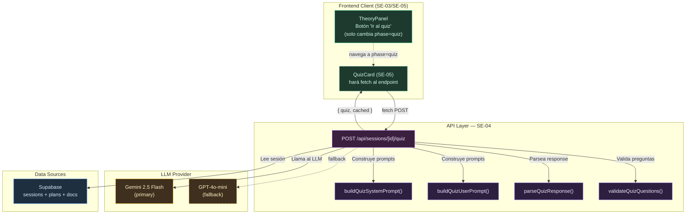
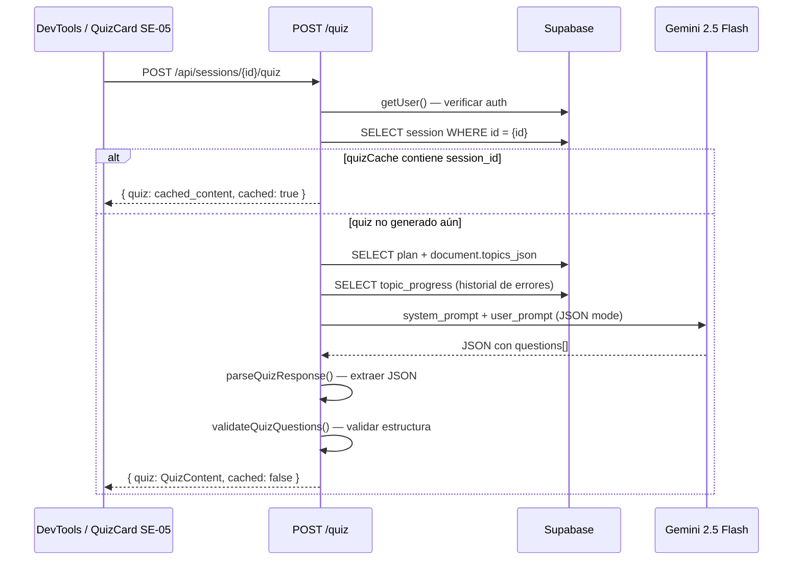

# SE-04 — Prompt de Quiz + API Route `/api/sessions/[id]/quiz`

> **Guía:** SE-04
> **Bloque:** 📚 BLOQUE E — Sesión de Estudio
> **Fecha:** 29 junio 2026
> **Prerequisito directo:** SE-02 (Prompt de teoría + API Route + multi-provider LLM)

---

## Sección 1: 🎓 Introducción y Fundamentos Conceptuales

### Recapitulación: ¿Dónde estamos en el flujo de sesión?

El ciclo de estudio del ISTQB Study Agent tiene **tres fases** por sesión:

```
[1] TEORÍA (SE-02 + SE-03)  →  [2] QUIZ (SE-04 + SE-05)  →  [3] EVALUACIÓN (SE-06 + SE-07 + SE-08)
      ✅ Completado                    👈 AQUÍ ESTAMOS                    ⏳ Pendiente
```

En **SE-02** construimos la maquinaria del LLM para generar contenido teórico: un prompt builder (`lib/prompts/theory.ts`), un parser defensivo del JSON, validación estricta, y persistencia idempotente en `sessions.theory_content`. En **SE-03** construimos el `TheoryPanel` interactivo con timer, secciones colapsables, y un botón "Ir al quiz" que navega a `/session?session_id=xxx&phase=quiz`.

Ahora vamos a construir la **segunda fase**: la generación de preguntas de quiz estilo ISTQB real.

### ¿Qué construiremos en SE-04?

| Componente | Propósito |
|---|---|
| **`types/quiz.ts`** | Tipos TypeScript para las preguntas del quiz (`QuizQuestion`, `QuizContent`, `QuizResponse`) |
| **`lib/prompts/quiz.ts`** | Prompt builder para la generación de quiz con instrucciones detalladas del estilo ISTQB |
| **`app/api/sessions/[id]/quiz/route.ts`** | Route Handler POST que genera quiz via Gemini, parsea, valida y cachea en memoria |
| **`types/index.ts`** | Actualizado con re-exportaciones de los nuevos tipos |

### ¿Por qué separar teoría y quiz en dos API Routes?

Hay tres razones fundamentales:

1. **Responsabilidad única (SRP):** Cada Route Handler hace UNA cosa bien. `theory/route.ts` genera teoría. `quiz/route.ts` genera preguntas. Si mañana necesitas cambiar el prompt del quiz, no tocas el archivo de teoría.

2. **Tiempos diferentes:** La teoría se genera cuando el usuario empieza a estudiar (principio de la sesión). El quiz se genera cuando el usuario termina de leer la teoría. Son momentos distintos en el flujo.

3. **Idempotencia independiente:** La teoría y el quiz tienen caches independientes. La teoría usa `sessions.theory_content` como cache persistente; el quiz usa `quizCache` en memoria como cache temporal. Si la teoría ya se generó pero el quiz no, solo se llama al LLM para el quiz.

### Anatomía de una pregunta ISTQB real

Las preguntas del examen ISTQB Foundation Level siguen un patrón muy específico:

| Nivel K | Tipo de pregunta | Ejemplo de stem |
|---|---|---|
| **K1 (Recordar)** | Identificar una definición | "¿Cuál de las siguientes es la definición correcta de un defecto?" |
| **K2 (Entender)** | Distinguir entre conceptos | "¿Cuál es la diferencia PRINCIPAL entre testing estático y testing dinámico?" |
| **K3 (Aplicar)** | Resolver un escenario | "Un equipo está probando una calculadora. El requisito dice: 'Aceptar números de 1 a 100'. ¿Cuáles son los valores de frontera que DEBEN probarse?" |

**Características críticas de un buen distractor ISTQB:**
- Suena plausible para alguien que no estudió bien
- Usa terminología del ISTQB correcta pero en un contexto equivocado
- No es evidentemente absurdo (no vale poner "La respuesta es 42")
- Solo hay UNA respuesta correcta (no es ambiguo)

### Conceptos de Next.js relevantes

#### ¿Por qué usamos la misma estructura que la theory route?

Vamos a seguir **exactamente** el mismo patrón arquitectónico de SE-02:

```
Route Handler POST
  │
  ├── 1. Validar UUID del session_id
  ├── 2. Autenticar usuario (Supabase cookies)
  ├── 3. Verificar caché (idempotencia)
  ├── 4. Obtener datos del plan + tópicos
  ├── 5. Construir prompts (system + user)
  ├── 6. Llamar al LLM (Gemini → OpenAI fallback)
  ├── 7. Parsear JSON defensivamente
  ├── 8. Validar estructura y contenido
  └── 9. Retornar quiz (sin persistir en DB; SE-05 lo mantendrá en estado local)
```

La diferencia clave con SE-02: **no persistimos las preguntas en la DB** en esta etapa. Las preguntas son efímeras — el frontend las mantiene en estado local (`useState`) durante el quiz. Solo las **respuestas del usuario** se guardarán en la tabla `answers` cuando SE-06 las evalúe.

#### El patrón `response_format: { type: "json_object" }`

Igual que en SE-02, usamos el JSON mode de OpenAI/Gemini para forzar al LLM a retornar JSON válido. Esto reduce drásticamente los errores de parseo. Sin embargo, el LLM ocasionalmente:

- Incluye campos extra que no pedimos → **lo ignoramos** (parser permisivo)
- Omite campos opcionales → **validamos** y rechazamos si faltan campos críticos
- Inventa topic_codes que no existen → **validamos** contra la lista de topic_codes de la sesión
- Pone siempre la misma respuesta correcta (ej. "c") → **validamos** distribución

---

## Sección 2: 📋 Prerequisitos y Verificación del Entorno

### Herramientas y versiones

| Herramienta | Verificación | Versión mínima |
|---|---|---|
| Node.js | `node --version` | v18+ |
| npm | `npm --version` | v9+ |
| Next.js | Revisar `frontend/package.json` | ^16.2.7 |
| openai (SDK) | Revisar `frontend/package.json` | ^6.44.0 |

```powershell
node --version
# → v20.x.x o v22.x.x ✅

npm --version
# → 10.x.x ✅
```

### Dependencias de guías anteriores

| Guía | Entregable requerido | Verificación |
|---|---|---|
| **SE-02** | API Route `/api/sessions/[id]/theory/route.ts` | `Test-Path -LiteralPath "frontend/app/api/sessions/[id]/theory/route.ts"` → True |
| **SE-02** | Prompt builder `lib/prompts/theory.ts` | `Test-Path -LiteralPath "frontend/lib/prompts/theory.ts"` → True |
| **SE-02** | Tipos `TheoryContent` en `types/theory.ts` | `Test-Path -LiteralPath "frontend/types/theory.ts"` → True |
| **SE-01** | Tipos `SessionWithContext` en `types/sessions.ts` | `Test-Path -LiteralPath "frontend/types/sessions.ts"` → True |
| **SE-03** | TheoryPanel con botón "Ir al quiz" | `Test-Path -LiteralPath "frontend/components/session/theory-panel.tsx"` → True |
| **FE-02** | `lib/supabase/server.ts` | `Test-Path -LiteralPath "frontend/lib/supabase/server.ts"` → True |
| **DB-02** | Tabla `answers` con columnas correctas | Verificado en `types/database.ts` |

### Variables de entorno necesarias

```powershell
# Verificar que .env.local existe sin imprimir secretos
Test-Path -LiteralPath "frontend/.env.local"
# → True ✅

# Verificar que hay al menos una API key de LLM sin mostrar su valor
$hasGemini = Select-String -Path "frontend/.env.local" -Pattern "^GEMINI_API_KEY=" -Quiet
$hasOpenAI = Select-String -Path "frontend/.env.local" -Pattern "^OPENAI_API_KEY=" -Quiet
$hasGemini -or $hasOpenAI
# → True ✅
```

> **⚠️ IMPORTANTE:** El quiz usa el mismo patrón multi-provider de SE-02. Si solo tienes `GEMINI_API_KEY`, se usará Gemini 2.5 Flash. Si solo tienes `OPENAI_API_KEY`, se usará GPT-4o-mini. No necesitas ambas.

---

## Sección 3: 📂 Estructura de Directorios del Proyecto

```
practica-testing/
├── backend/                          # (BE-01 a BE-06, sin cambios)
├── docs/
│   ├── guides/
│   │   ├── be/                       # Guías del backend
│   │   ├── db/                       # Guías de base de datos
│   │   └── fe/
│   │       ├── FE-01.md a FE-04.md
│   │       ├── UP-01.md a UP-06.md
│   │       ├── SE-01.md a SE-03.md
│   │       └── SE-04.md              # ← 🆕 ESTA GUÍA
│   └── roadmap/
│       └── ISTQB_Guias_Implementacion.md
├── frontend/
│   ├── app/
│   │   ├── (auth)/                   # Login, Register (FE-03)
│   │   ├── (dashboard)/
│   │   │   ├── _components/          # main-nav, mobile-nav, user-menu (FE-04)
│   │   │   ├── dashboard/page.tsx    # (FE-04)
│   │   │   ├── plan/page.tsx         # (UP-06)
│   │   │   ├── session/page.tsx      # (SE-01, SE-03)
│   │   │   ├── setup/page.tsx        # (UP-01)
│   │   │   ├── layout.tsx            # (FE-04)
│   │   │   ├── loading.tsx           # (FE-04)
│   │   │   └── error.tsx             # (FE-04)
│   │   ├── api/
│   │   │   ├── extract/              # (UP-03)
│   │   │   ├── plan/                 # (UP-04)
│   │   │   ├── sessions/
│   │   │   │   ├── next/
│   │   │   │   │   └── route.ts      # (SE-01)
│   │   │   │   └── [id]/
│   │   │   │       ├── route.ts      # (SE-01)
│   │   │   │       ├── theory/
│   │   │   │       │   └── route.ts  # (SE-02)
│   │   │   │       └── quiz/
│   │   │   │           └── route.ts  # ← 🆕 NUEVO EN SE-04
│   │   │   └── upload/               # (UP-02)
│   │   ├── globals.css
│   │   ├── layout.tsx
│   │   └── page.tsx
│   ├── components/
│   │   ├── session/                  # (SE-03)
│   │   │   ├── theory-panel.tsx
│   │   │   ├── theory-topic-view.tsx
│   │   │   ├── session-timer.tsx
│   │   │   └── collapsible-section.tsx
│   │   ├── shared/
│   │   └── ui/                       # shadcn/ui (FE-01)
│   ├── lib/
│   │   ├── format.ts                 # (UP-06)
│   │   ├── openai.ts                 # (UP-04)
│   │   ├── prompts/
│   │   │   ├── theory.ts             # (SE-02)
│   │   │   └── quiz.ts               # ← 🆕 NUEVO EN SE-04
│   │   ├── supabase/
│   │   │   ├── client.ts             # (FE-02)
│   │   │   └── server.ts             # (FE-02)
│   │   └── utils.ts
│   ├── types/
│   │   ├── database.ts               # (FE-02)
│   │   ├── index.ts                  # (FE-02, SE-01, SE-02) ← SE MODIFICA EN SE-04
│   │   ├── sessions.ts               # (SE-01)
│   │   ├── theory.ts                 # (SE-02)
│   │   └── quiz.ts                   # ← 🆕 NUEVO EN SE-04
│   ├── middleware.ts                  # (FE-03)
│   ├── package.json
│   └── tsconfig.json
├── supabase/                         # (DB-01 a DB-05)
├── .env.local
└── .gitignore
```

**Archivos NUEVOS en esta guía (3):**
- `types/quiz.ts` — Tipos para preguntas y respuestas del quiz
- `lib/prompts/quiz.ts` — Prompt builder para generación de quiz ISTQB
- `app/api/sessions/[id]/quiz/route.ts` — Route Handler POST

**Archivos MODIFICADOS en esta guía (1):**
- `types/index.ts` — Agregar re-exportaciones de los tipos de quiz

---

## Sección 4: 🎨 Diagrama de Arquitectura de Componentes



### Flujo de generación del quiz



---

## Sección 5: 🛠️ Implementación Paso a Paso

---

### Paso A: Crear los tipos TypeScript para el quiz

**Archivo:** `frontend/types/quiz.ts`

Este archivo define la estructura **exacta** del JSON que el LLM debe retornar y que el frontend consumirá en SE-05 para renderizar las preguntas.

```tsx
// ============================================================
// types/quiz.ts — Tipos para el quiz generado por IA
// ============================================================
// Estos tipos definen la estructura del JSON que el LLM retorna
// cuando genera preguntas de quiz estilo ISTQB.
//
// DISEÑO:
//   - Cada pregunta tiene exactamente 4 opciones (a, b, c, d)
//   - Solo una respuesta es correcta
//   - Cada pregunta lleva una explicación (para el FeedbackPanel de SE-08)
//   - Cada pregunta está ligada a un topic_code y level_k
//
// RELACIÓN CON database.ts:
//   - AnswerOption ("a" | "b" | "c" | "d") ya existe en database.ts
//   - OptionsJson (Record<AnswerOption, string>) ya existe en database.ts
//   - Reutilizamos esos tipos para mantener consistencia con la DB
// ============================================================

import type { AnswerOption, OptionsJson, LevelK } from "./database";

// ──────────────────────────────────────────────────────────────
// Pregunta individual del quiz
// ──────────────────────────────────────────────────────────────

/**
 * Una pregunta de quiz generada por el LLM.
 *
 * El formato sigue el estilo del examen ISTQB Foundation Level:
 *   - Un "stem" (enunciado) que puede incluir un escenario (K3)
 *   - Exactamente 4 opciones (a, b, c, d)
 *   - Una sola respuesta correcta
 *   - Una explicación de por qué la respuesta es correcta
 *
 * La explicación NO se muestra durante el quiz (SE-05).
 * Solo se muestra en el FeedbackPanel (SE-08) después de la evaluación.
 */
export interface QuizQuestion {
  /** Identificador único dentro del quiz (0-indexed, generado por la API) */
  question_id: number;
  /** Enunciado de la pregunta (puede incluir un escenario para K3) */
  question: string;
  /** Las 4 opciones de respuesta: { a: "...", b: "...", c: "...", d: "..." } */
  options: OptionsJson;
  /** La respuesta correcta: "a", "b", "c", o "d" */
  correct: AnswerOption;
  /** Explicación de por qué la respuesta correcta es correcta */
  explanation: string;
  /** Código del tópico ISTQB al que pertenece esta pregunta (ej. "FL-1.1.1") */
  topic_code: string;
  /** Nivel K de la pregunta: K1, K2, o K3 */
  level_k: LevelK;
}

// ──────────────────────────────────────────────────────────────
// Contenido completo del quiz
// ──────────────────────────────────────────────────────────────

/**
 * Quiz completo generado para una sesión de estudio.
 *
 * Contiene las preguntas + metadatos de generación.
 * Este tipo se almacena temporalmente en el estado del cliente (SE-05)
 * y NO se persiste como `quiz_content` en la DB. En SE-06 se guardará
 * un snapshot de cada pregunta junto con la respuesta del usuario en `answers`.
 */
export interface QuizContent {
  /** Array de preguntas del quiz (10-12 preguntas típicamente) */
  questions: QuizQuestion[];
  /** Total de preguntas generadas */
  total_questions: number;
  /** Timestamp ISO de cuándo se generó el quiz */
  generated_at: string;
  /** Proveedor LLM que generó el quiz */
  model_provider: string;
  /** Modelo específico usado */
  model_name: string;
}

// ──────────────────────────────────────────────────────────────
// Tipos de la API Response
// ──────────────────────────────────────────────────────────────

/** Response exitoso de POST /api/sessions/[id]/quiz */
export interface QuizResponse {
  /** Contenido del quiz generado */
  quiz: QuizContent;
  /** true si se retornó quiz previamente generado (cache) */
  cached: boolean;
}
```

**Entregable del Paso A:**
- ✅ Archivo `frontend/types/quiz.ts` creado

---

### Paso B: Actualizar el barrel de tipos `types/index.ts`

**Archivo:** `frontend/types/index.ts`

Agregar las re-exportaciones de los nuevos tipos de quiz al final del archivo.

```tsx
// ============================================================
// types/index.ts — Barrel de exportaciones de tipos
// ============================================================

// Re-exportar TODOS los tipos de la base de datos
export type {
  // Union types (enums del negocio)
  StudyPlanStatus,
  SessionType,
  MethodUsed,
  ActionTaken,
  SessionStatus,
  AnswerOption,
  LevelK,
  TopicProgressStatus,

  // Tipos de JSON estructurado
  TopicEntry,
  TopicsJson,
  OptionsJson,

  // user_profiles
  UserProfileRow,
  UserProfileInsert,
  UserProfileUpdate,

  // documents
  DocumentRow,
  DocumentInsert,
  DocumentUpdate,

  // study_plans
  StudyPlanRow,
  StudyPlanInsert,
  StudyPlanUpdate,

  // sessions
  SessionRow,
  SessionInsert,
  SessionUpdate,

  // answers
  AnswerRow,
  AnswerInsert,
  AnswerUpdate,

  // topic_progress
  TopicProgressRow,
  TopicProgressInsert,
  TopicProgressUpdate,

  // Tipo maestro
  Database,
} from "./database";

// 🆕 SE-01: Re-exportar tipos de sesión enriquecidos
export type {
  SessionTopic,
  PlanContext,
  SessionWithContext,
  NoSessionResponse,
  NextSessionResponse,
  SessionByIdResponse,
} from "./sessions";

// 🆕 SE-02: Re-exportar tipos de contenido teórico
export type {
  KeyConcept,
  TheoryExample,
  TopicConnection,
  TheoryTopicContent,
  TheoryContent,
  TheoryResponse,
} from "./theory";

// 🆕 SE-04: Re-exportar tipos de quiz
export type {
  QuizQuestion,
  QuizContent,
  QuizResponse,
} from "./quiz";
```

**Entregable del Paso B:**
- ✅ Archivo `frontend/types/index.ts` modificado — se agregó bloque de re-exportación de `./quiz`

---

### Paso C: Crear el prompt builder para quiz

**Archivo:** `frontend/lib/prompts/quiz.ts`

Este archivo sigue el mismo patrón que `theory.ts`: una función para el system prompt y otra para el user prompt. La diferencia es que el prompt de quiz incluye instrucciones mucho más detalladas sobre el formato de las preguntas ISTQB.

```tsx
// ============================================================
// lib/prompts/quiz.ts — Prompt Builder para generación de quiz
// ============================================================
// Construye los prompts (system + user) para la generación de
// preguntas de quiz estilo ISTQB Foundation Level.
//
// FORMATO DEL EXAMEN ISTQB:
//   - 40 preguntas en el examen real (nosotros generamos 10-12)
//   - 4 opciones (A/B/C/D), una sola correcta
//   - K1: recordar definiciones y listas
//   - K2: entender y distinguir conceptos
//   - K3: aplicar conocimientos en escenarios
//
// REGLA: Los prompts están en ESPAÑOL porque el usuario
// estudia en español y las preguntas se renderizan tal cual.
// ============================================================

import type { SessionTopic } from "@/types/sessions";
import type { LevelK } from "@/types";

// ──────────────────────────────────────────────────────────────
// Constantes
// ──────────────────────────────────────────────────────────────

/** Número máximo de caracteres del texto del syllabus por tópico */
const MAX_SYLLABUS_TEXT_CHARS = 1500;

/** Instrucciones por nivel K */
const LEVEL_K_INSTRUCTIONS: Record<LevelK, string> = {
  K1: `PREGUNTAS K1 (Recordar):
- Preguntar por definiciones exactas del ISTQB Glossary
- "¿Cuál de las siguientes es la definición correcta de...?"
- "¿Cuál de los siguientes términos describe...?"
- Los distractores deben ser definiciones de OTROS términos del ISTQB que suenan similares
- NO preguntar por escenarios de aplicación — eso es K3`,

  K2: `PREGUNTAS K2 (Entender):
- Preguntar por la diferencia entre dos conceptos relacionados
- "¿Cuál es la diferencia PRINCIPAL entre X e Y?"
- "¿Por qué es importante hacer X antes que Y?"
- "¿Cuál de las siguientes afirmaciones sobre X es CORRECTA?"
- Los distractores deben ser afirmaciones que confunden dos conceptos o invierten causa-efecto
- Los distractores NO deben ser obviamente falsos`,

  K3: `PREGUNTAS K3 (Aplicar):
- SIEMPRE incluir un escenario de 2-4 oraciones antes de la pregunta
- "Dado el siguiente escenario: [escenario]. ¿Qué técnica de testing es más apropiada?"
- "Un equipo está probando [descripción]. ¿Cuáles son los valores de frontera correctos?"
- El escenario debe ser realista y específico (no genérico)
- Los distractores deben ser técnicas o valores que un estudiante mal preparado elegiría`,
};

/**
 * Distribuye 10-12 preguntas totales entre los tópicos de la sesión.
 *
 * Ejemplos:
 *   - 1 tópico  → 10 preguntas
 *   - 3 tópicos → 4 + 3 + 3 = 10 preguntas
 *   - 5 tópicos → 2 por tópico = 10 preguntas
 *   - 7 tópicos → algunos con 2 y otros con 1 = 12 preguntas
 */
function calculateQuestionDistribution(
  topics: SessionTopic[],
  questionsPerTopic?: number,
): Map<string, number> {
  if (questionsPerTopic) {
    return new Map(topics.map((topic) => [topic.code, questionsPerTopic]));
  }

  const totalTopics = Math.max(1, topics.length);
  const targetTotal = Math.min(12, Math.max(10, totalTopics * 2));
  const baseCount = Math.floor(targetTotal / totalTopics);
  const remainder = targetTotal % totalTopics;

  return new Map(
    topics.map((topic, index) => [
      topic.code,
      baseCount + (index < remainder ? 1 : 0),
    ]),
  );
}

// ──────────────────────────────────────────────────────────────
// System Prompt
// ──────────────────────────────────────────────────────────────

/**
 * Construye el system prompt para la generación de quiz.
 *
 * El system prompt define:
 *   1. Rol del asistente (examinador ISTQB)
 *   2. Reglas estrictas del formato de preguntas
 *   3. Schema JSON exacto de la salida esperada
 *   4. Instrucciones para crear distractores plausibles
 */
export function buildQuizSystemPrompt(): string {
  return `Eres un examinador certificado del ISTQB Foundation Level (CTFL v4.0).
Tu tarea es generar preguntas de examen de práctica de alta calidad.

Todo el contenido DEBE estar en **español**.

## FORMATO DEL EXAMEN ISTQB

Cada pregunta tiene:
- Un **stem** (enunciado): claro, preciso, sin ambigüedades
- Exactamente **4 opciones** (a, b, c, d): solo UNA es correcta
- Una **explicación**: por qué la correcta es correcta Y por qué las demás están mal

## REGLAS PARA CREAR PREGUNTAS DE CALIDAD

1. **Una sola respuesta correcta**: NUNCA debe haber ambigüedad. Si un experto ISTQB leyera la pregunta, debería marcar la misma respuesta sin dudar.

2. **Distractores plausibles**: Los distractores (opciones incorrectas) deben ser:
   - Términos REALES del ISTQB, pero aplicados en el contexto equivocado
   - Afirmaciones que son "casi correctas" pero tienen un detalle mal
   - Respuestas que un estudiante que NO estudió bien elegiría
   - NUNCA opciones absurdas o que no tengan relación con el tema

3. **Variación de la respuesta correcta**: La respuesta correcta DEBE variar entre a, b, c, y d.
   - NO pongas la correcta siempre en "c" ni en la misma posición
   - Distribución ideal: ~25% en cada opción

4. **Longitud de opciones**: Las 4 opciones deben tener longitud SIMILAR.
   - Si la correcta es larga, haz los distractores también largos
   - Evita que la correcta sea notoriamente más detallada que las demás

5. **Sin pistas gramaticales**: El stem no debe dar pistas sobre la respuesta.
   - No uses "un/una" que solo concuerde con una opción
   - No uses "siempre" o "nunca" en los distractores (red flag de examen)

## FORMATO DE SALIDA

Responde ÚNICAMENTE con un objeto JSON válido con esta estructura EXACTA:

{
  "questions": [
    {
      "question": "Texto del enunciado de la pregunta",
      "options": {
        "a": "Primera opción",
        "b": "Segunda opción",
        "c": "Tercera opción",
        "d": "Cuarta opción"
      },
      "correct": "b",
      "explanation": "La opción b es correcta porque [razón]. La opción a es incorrecta porque [razón]. La opción c confunde X con Y. La opción d describe Z, no W.",
      "topic_code": "FL-1.1.1",
      "level_k": "K2"
    }
  ]
}

## RESTRICCIONES CRÍTICAS

1. **JSON puro**: NO incluyas texto antes ni después del JSON. NO uses bloques de código markdown.
2. **Español**: TODO el contenido debe estar en español.
3. **topic_code exacto**: Usa ÚNICAMENTE los topic_codes que se proporcionan. NO inventes códigos.
4. **level_k exacto**: Cada pregunta debe tener el level_k correcto del tópico al que pertenece.
5. **correct válido**: SOLO los valores "a", "b", "c", o "d" son válidos para el campo correct.
6. **4 opciones exactas**: Cada pregunta DEBE tener exactamente 4 opciones: a, b, c, y d.
7. **Explicación completa**: La explicación debe decir por qué CADA opción es correcta o incorrecta.`;
}

// ──────────────────────────────────────────────────────────────
// User Prompt
// ──────────────────────────────────────────────────────────────

/**
 * Construye el user prompt con los datos específicos de la sesión.
 *
 * @param topics - Array de tópicos de la sesión con texto del syllabus
 * @param dayNumber - Número de día en el plan
 * @param sessionType - Tipo de sesión (morning/night/reinforcement)
 * @param attemptNumber - Número de intento (1 = primer intento)
 * @param questionsPerTopic - Cantidad de preguntas por tópico (default varía por cantidad de tópicos)
 */
export function buildQuizUserPrompt(
  topics: SessionTopic[],
  dayNumber: number,
  sessionType: string,
  attemptNumber: number,
  questionsPerTopic?: number,
): string {
  // ─── Calcular distribución de preguntas ────────────────────
  // Objetivo: generar 10-12 preguntas totales, no 10-12 por tópico.
  // Esto evita que una sesión con 5 tópicos genere 15+ preguntas.
  const totalTopics = topics.length;
  const questionDistribution = calculateQuestionDistribution(
    topics,
    questionsPerTopic,
  );
  const totalQuestions = Array.from(questionDistribution.values()).reduce(
    (sum, count) => sum + count,
    0,
  );

  // ─── Construir la lista de tópicos ────────────────────────
  const topicsList = topics
    .map((t) => {
      const questionCount = questionDistribution.get(t.code) || 1;
      const syllabusPreview = t.syllabus_text
        ? t.syllabus_text.slice(0, MAX_SYLLABUS_TEXT_CHARS)
        : "(sin texto del syllabus disponible)";

      // Instrucciones específicas del nivel K
      const kInstructions = LEVEL_K_INSTRUCTIONS[t.level_k as LevelK] || "";

      return `### ${t.code} — ${t.name} [${t.level_k}]
Generar **${questionCount} pregunta${questionCount > 1 ? "s" : ""}** para este tópico.

${kInstructions}

Estado del estudiante: ${t.progress_status} | Intentos previos: ${t.attempts} | Mejor score: ${t.best_score}%

Texto del syllabus:
${syllabusPreview}`;
    })
    .join("\n\n---\n\n");

  // ─── Contexto de refuerzo (si es un re-intento) ──────────
  const reinforcementContext =
    attemptNumber > 1
      ? `\n\n## ⚠️ CONTEXTO DE REFUERZO
Este es el intento #${attemptNumber} del estudiante en estos tópicos.
- Genera preguntas DIFERENTES a las que se habrían generado antes
- Enfócate en los aspectos que suelen causar más confusión
- Aumenta ligeramente la dificultad de los distractores
- Para K3, usa escenarios DIFERENTES a los anteriores\n`
      : "";

  return `## CONTEXTO DE LA SESIÓN

- **Día del plan:** ${dayNumber}
- **Tipo de sesión:** ${sessionType}
- **Número de intento:** ${attemptNumber}
- **Total de tópicos:** ${totalTopics}
- **Total de preguntas esperadas:** ${totalQuestions}
${reinforcementContext}
## TÓPICOS PARA EL QUIZ

${topicsList}

## INSTRUCCIÓN

Genera exactamente **${totalQuestions} preguntas** siguiendo la cantidad indicada en cada tópico.
Asegúrate de que la respuesta correcta varíe entre a, b, c y d.
Responde SOLO con el JSON.`;
}
```

**Entregable del Paso C:**
- ✅ Archivo `frontend/lib/prompts/quiz.ts` creado

---

### Paso D: Crear el Route Handler `POST /api/sessions/[id]/quiz`

**Archivo:** `frontend/app/api/sessions/[id]/quiz/route.ts`

Este es el archivo principal de SE-04. Sigue el mismo patrón probado de `theory/route.ts` pero adaptado para la generación de quiz.

```tsx
// ─────────────────────────────────────────────────────────────────
// app/api/sessions/[id]/quiz/route.ts
// Route Handler: genera preguntas de quiz ISTQB para una sesión.
//
// Método: POST
// Auth: Requiere sesión válida (cookie JWT de Supabase)
// Params: id — UUID de la sesión
// Body (opcional):
//   {
//     force?: boolean  // true = regenerar aunque ya exista en cache
//   }
//
// Response (200): { quiz: QuizContent, cached: boolean }
// Response (401): { error: "No autenticado" }
// Response (400): { error: "Descripción del problema" }
// Response (404): { error: "Sesión no encontrada" }
// Response (500): { error: "Error interno del servidor" }
// Response (502): { error: "Error en la generación del quiz" }
//
// IDEMPOTENCIA:
//   El quiz se almacena en un Map en memoria durante el lifetime
//   del servidor Next.js. No existe columna quiz_content en DB.
//   El cache se pierde al reiniciar, hacer HMR o redeployar.
//
// NOTA: A diferencia de theory_content, el quiz NO se persiste
// en la tabla sessions. Las preguntas son efímeras; solo las
// RESPUESTAS del usuario se guardarán en la tabla answers (SE-06).
// ─────────────────────────────────────────────────────────────────

import { NextResponse } from "next/server";
import OpenAI from "openai";
import { createClient } from "@/lib/supabase/server";
import {
  buildQuizSystemPrompt,
  buildQuizUserPrompt,
} from "@/lib/prompts/quiz";
import type {
  SessionRow,
  StudyPlanRow,
  TopicsJson,
  AnswerOption,
} from "@/types";
import type { SessionTopic } from "@/types/sessions";
import type { QuizQuestion, QuizContent } from "@/types/quiz";

// ─── Forzar Node.js runtime ─────────────────────────────────────
// Edge runtime no soporta el SDK de OpenAI ni las cookies de
// Supabase SSR. Forzamos Node.js para tener acceso completo.
export const runtime = "nodejs";

// ─── Constantes ──────────────────────────────────────────────────
const GEMINI_OPENAI_BASE_URL =
  "https://generativelanguage.googleapis.com/v1beta/openai";

const UUID_REGEX =
  /^[0-9a-f]{8}-[0-9a-f]{4}-[0-9a-f]{4}-[0-9a-f]{4}-[0-9a-f]{12}$/i;

// El quiz genera menos tokens que la teoría (~3K vs ~5K)
// pero el prompt es más largo por las instrucciones detalladas
const QUIZ_TIMEOUT_MS = 60_000; // 60 segundos
const QUIZ_TIMEOUT_BUFFER_MS = 15_000; // Buffer para el SDK

// Opciones válidas de respuesta
const VALID_OPTIONS: AnswerOption[] = ["a", "b", "c", "d"];

// ─── Cache en memoria ────────────────────────────────────────────
// Map de session_id → QuizContent para evitar regenerar el quiz
// si el usuario recarga la página durante el quiz.
// Este cache vive mientras el servidor Next.js esté corriendo.
// Se pierde al reiniciar — esto es aceptable porque el quiz
// no se evalúa hasta que el usuario lo envía (SE-06).
const quizCache = new Map<string, QuizContent>();

// ──────────────────────────────────────────────────────────────
// Multi-Provider LLM (mismo patrón de SE-02)
// ──────────────────────────────────────────────────────────────

interface QuizModelRuntime {
  provider: string;
  model: string;
  client: OpenAI;
  timeoutMs: number;
}

/**
 * Crea el runtime del modelo LLM para generación de quiz.
 *
 * Mismo patrón de SE-02 (theory):
 *   1. GEMINI_API_KEY → Gemini 2.5 Flash (default)
 *   2. OPENAI_API_KEY → gpt-4o-mini (fallback)
 */
function createQuizModelRuntime(): QuizModelRuntime {
  const geminiKey = process.env.GEMINI_API_KEY;
  if (geminiKey) {
    return {
      provider: "gemini",
      model: "gemini-2.5-flash",
      timeoutMs: QUIZ_TIMEOUT_MS,
      client: new OpenAI({
        apiKey: geminiKey,
        baseURL: process.env.GEMINI_OPENAI_BASE_URL || GEMINI_OPENAI_BASE_URL,
        timeout: QUIZ_TIMEOUT_MS + QUIZ_TIMEOUT_BUFFER_MS,
        maxRetries: 2,
      }),
    };
  }

  const openaiKey = process.env.OPENAI_API_KEY;
  if (openaiKey) {
    return {
      provider: "openai",
      model: "gpt-4o-mini",
      timeoutMs: QUIZ_TIMEOUT_MS,
      client: new OpenAI({
        apiKey: openaiKey,
        timeout: QUIZ_TIMEOUT_MS + QUIZ_TIMEOUT_BUFFER_MS,
        maxRetries: 2,
      }),
    };
  }

  throw new Error(
    "No hay API key de LLM configurada. " +
      "Define GEMINI_API_KEY o OPENAI_API_KEY en frontend/.env.local",
  );
}

// ──────────────────────────────────────────────────────────────
// Parser defensivo del response del LLM
// ──────────────────────────────────────────────────────────────

/**
 * Extrae y parsea el JSON del response del LLM.
 *
 * Maneja los mismos casos edge que el parser de SE-02:
 *   - Texto introductorio antes del JSON
 *   - Bloques de código markdown (```json ... ```)
 *   - Texto final después del JSON
 */
function parseQuizResponse(rawText: string): QuizQuestion[] | null {
  let text = rawText.trim();

  // ─── Intentar extraer de bloque markdown ────────────────
  const markdownMatch = text.match(/```(?:json)?\s*\n?([\s\S]*?)\n?```/);
  if (markdownMatch) {
    text = markdownMatch[1].trim();
  }

  // ─── Intentar encontrar el JSON delimitado por {} ───────
  const firstBrace = text.indexOf("{");
  const lastBrace = text.lastIndexOf("}");
  if (firstBrace !== -1 && lastBrace > firstBrace) {
    text = text.slice(firstBrace, lastBrace + 1);
  }

  try {
    const parsed = JSON.parse(text);

    // Verificar que tiene la estructura esperada
    if (!parsed.questions || !Array.isArray(parsed.questions)) {
      console.error(
        "[quiz] JSON parseado pero sin campo 'questions':",
        Object.keys(parsed),
      );
      return null;
    }

    return parsed.questions as QuizQuestion[];
  } catch (error) {
    console.error("[quiz] Error al parsear JSON:", error);
    console.error(
      "[quiz] Texto recibido (primeros 500 chars):",
      text.slice(0, 500),
    );
    return null;
  }
}

// ──────────────────────────────────────────────────────────────
// Validación estricta de las preguntas
// ──────────────────────────────────────────────────────────────

/**
 * Valida que las preguntas del quiz cumplen con el formato esperado.
 *
 * Verifica:
 *   1. Cada pregunta tiene question, options, correct, explanation
 *   2. options tiene exactamente 4 claves: a, b, c, d
 *   3. correct es uno de: "a", "b", "c", "d"
 *   4. topic_code es uno de los esperados
 *   5. level_k es uno de: "K1", "K2", "K3"
 *   6. La cantidad total está entre 10 y 12 preguntas
 *   7. La distribución de correct no está sesgada
 *
 * @returns Array de errores (vacío si todo está bien)
 */
function validateQuizQuestions(
  questions: QuizQuestion[],
  expectedTopicCodes: string[],
): string[] {
  const errors: string[] = [];
  const expectedCodesSet = new Set(expectedTopicCodes);
  const correctDistribution: Record<string, number> = {
    a: 0,
    b: 0,
    c: 0,
    d: 0,
  };

  if (questions.length === 0) {
    errors.push("El LLM no generó ninguna pregunta.");
    return errors;
  }

  if (questions.length < 10 || questions.length > 12) {
    errors.push(
      `La cantidad de preguntas (${questions.length}) no es válida. ` +
        `Debe estar entre 10 y 12.`,
    );
  }

  for (let i = 0; i < questions.length; i++) {
    const q = questions[i];
    const prefix = `Pregunta ${i + 1}`;

    // Verificar campos obligatorios
    if (
      !q.question ||
      typeof q.question !== "string" ||
      q.question.length < 10
    ) {
      errors.push(`${prefix}: enunciado falta o es demasiado corto.`);
    }

    if (
      !q.explanation ||
      typeof q.explanation !== "string" ||
      q.explanation.length < 20
    ) {
      errors.push(`${prefix}: explicación falta o es demasiado corta.`);
    }

    // Verificar options
    if (!q.options || typeof q.options !== "object") {
      errors.push(`${prefix}: opciones faltan o no son un objeto.`);
    } else {
      for (const opt of VALID_OPTIONS) {
        if (
          !q.options[opt] ||
          typeof q.options[opt] !== "string" ||
          q.options[opt].length < 3
        ) {
          errors.push(
            `${prefix}: opción "${opt}" falta o es demasiado corta.`,
          );
        }
      }
    }

    // Verificar correct
    if (!q.correct || !VALID_OPTIONS.includes(q.correct as AnswerOption)) {
      errors.push(
        `${prefix}: correct="${q.correct}" no es válido. Debe ser a, b, c, o d.`,
      );
    } else {
      correctDistribution[q.correct]++;
    }

    // Verificar topic_code
    if (!q.topic_code || !expectedCodesSet.has(q.topic_code)) {
      errors.push(
        `${prefix}: topic_code="${q.topic_code}" no es uno de los tópicos de la sesión.`,
      );
    }

    // Verificar level_k
    if (!q.level_k || !["K1", "K2", "K3"].includes(q.level_k)) {
      errors.push(
        `${prefix}: level_k="${q.level_k}" no es válido. Debe ser K1, K2, o K3.`,
      );
    }
  }

  // Verificar distribución de respuestas correctas
  // Si todas las correctas son la misma letra, hay un problema
  const usedOptions = Object.entries(correctDistribution)
    .filter(([, count]) => count > 0)
    .map(([opt]) => opt);

  if (usedOptions.length === 1 && questions.length >= 4) {
    errors.push(
      `Todas las respuestas correctas son "${usedOptions[0]}". ` +
        `Deben variar entre a, b, c, y d.`,
    );
  }

  return errors;
}

// ──────────────────────────────────────────────────────────────
// Route Handler: POST
// ──────────────────────────────────────────────────────────────

export async function POST(
  request: Request,
  { params }: { params: Promise<{ id: string }> },
) {
  try {
    // ═══════════════════════════════════════════════════════════
    // PASO 1: Extraer y validar parámetros
    // ═══════════════════════════════════════════════════════════
    const { id: sessionId } = await params;

    if (!sessionId || !UUID_REGEX.test(sessionId)) {
      return NextResponse.json(
        { error: "session_id debe ser un UUID válido" },
        { status: 400 },
      );
    }

    // Leer body (opcional — solo para el flag 'force')
    let force = false;
    try {
      const body = await request.json();
      if (body && typeof body.force === "boolean") {
        force = body.force;
      }
    } catch {
      // Body vacío o no-JSON es aceptable — force queda en false
    }

    // ═══════════════════════════════════════════════════════════
    // PASO 2: Autenticación
    // ═══════════════════════════════════════════════════════════
    const supabase = await createClient();

    const {
      data: { user },
      error: authError,
    } = await supabase.auth.getUser();

    if (authError || !user) {
      return NextResponse.json({ error: "No autenticado" }, { status: 401 });
    }

    // ═══════════════════════════════════════════════════════════
    // PASO 3: Buscar la sesión
    // ═══════════════════════════════════════════════════════════
    const { data: session, error: sessionError } = await supabase
      .from("sessions")
      .select("*")
      .eq("id", sessionId)
      .eq("user_id", user.id)
      .maybeSingle<SessionRow>();

    if (sessionError) {
      console.error("[quiz] Error al buscar sesión:", sessionError);
      return NextResponse.json(
        { error: "Error al buscar la sesión" },
        { status: 500 },
      );
    }

    if (!session) {
      return NextResponse.json(
        { error: "Sesión no encontrada." },
        { status: 404 },
      );
    }

    // ═══════════════════════════════════════════════════════════
    // PASO 4: Verificar caché en memoria (idempotencia)
    // ═══════════════════════════════════════════════════════════
    if (!force) {
      const cached = quizCache.get(sessionId);
      if (cached) {
        console.log(`[quiz] Retornando quiz cacheado para sesión ${sessionId}`);
        return NextResponse.json({
          quiz: cached,
          cached: true,
        });
      }
    }

    // ═══════════════════════════════════════════════════════════
    // PASO 5: Obtener datos del plan y tópicos
    // ═══════════════════════════════════════════════════════════
    const { data: plan } = await supabase
      .from("study_plans")
      .select("id, document_id, objective_days, start_date, estimated_end_date")
      .eq("id", session.study_plan_id)
      .eq("user_id", user.id)
      .maybeSingle<
        Pick<
          StudyPlanRow,
          | "id"
          | "document_id"
          | "objective_days"
          | "start_date"
          | "estimated_end_date"
        >
      >();

    if (!plan) {
      return NextResponse.json(
        { error: "No se encontró el plan asociado a esta sesión." },
        { status: 404 },
      );
    }

    // Obtener topics_json del documento
    const { data: doc } = await supabase
      .from("documents")
      .select("topics_json")
      .eq("id", plan.document_id)
      .eq("user_id", user.id)
      .maybeSingle();

    const topicsJson: TopicsJson = doc?.topics_json || {};

    // Obtener progreso de los tópicos (para saber historial de errores)
    const { data: progressRows } = await supabase
      .from("topic_progress")
      .select("topic_code, status, attempts, best_score, level_k")
      .eq("study_plan_id", plan.id)
      .eq("user_id", user.id)
      .in("topic_code", session.topic_codes || []);

    const progressMap = new Map();
    if (progressRows) {
      for (const row of progressRows) {
        progressMap.set(row.topic_code, row);
      }
    }

    // Construir array de SessionTopic para el prompt builder
    const sessionTopics: SessionTopic[] = (session.topic_codes || []).map(
      (code: string) => {
        const topicData = topicsJson[code];
        const progress = progressMap.get(code);
        return {
          code,
          name: topicData?.name || code,
          level_k: topicData?.level_k || progress?.level_k || "K1",
          syllabus_text: topicData?.text || "",
          progress_status: progress?.status || "pending",
          attempts: progress?.attempts || 0,
          best_score: progress?.best_score || 0,
        };
      },
    );

    if (sessionTopics.length === 0) {
      return NextResponse.json(
        { error: "La sesión no tiene tópicos asignados." },
        { status: 400 },
      );
    }

    // ═══════════════════════════════════════════════════════════
    // PASO 6: Construir prompts
    // ═══════════════════════════════════════════════════════════
    const systemPrompt = buildQuizSystemPrompt();
    const userPrompt = buildQuizUserPrompt(
      sessionTopics,
      session.day_number,
      session.session_type,
      session.attempt_number,
    );

    // ═══════════════════════════════════════════════════════════
    // PASO 7: Llamar al LLM
    // ═══════════════════════════════════════════════════════════
    const modelRuntime = createQuizModelRuntime();

    console.log(
      `[quiz] Generando quiz para sesión ${sessionId} ` +
        `(${sessionTopics.length} tópicos, ` +
        `modelo=${modelRuntime.model})`,
    );

    const startTime = Date.now();
    const controller = new AbortController();
    const timeoutId = setTimeout(
      () => controller.abort(),
      modelRuntime.timeoutMs,
    );

    let completion;

    try {
      completion = await modelRuntime.client.chat.completions.create(
        {
          model: modelRuntime.model,
          messages: [
            { role: "system", content: systemPrompt },
            { role: "user", content: userPrompt },
          ],
          response_format: { type: "json_object" },
          temperature: 0.8,
          // Temperature 0.8 (vs 0.7 para teoría):
          // Queremos más variedad en las preguntas. Un temperature más
          // alto genera distractores más creativos y preguntas menos
          // predecibles. Si siempre usamos 0.7, el quiz de hoy sería
          // muy similar al quiz de ayer para el mismo tópico.
        },
        { signal: controller.signal },
      );
    } catch (llmError) {
      if (llmError instanceof Error && llmError.name === "AbortError") {
        return NextResponse.json(
          {
            error: `${modelRuntime.model} no respondió en ${modelRuntime.timeoutMs / 1000} segundos. Intenta de nuevo.`,
          },
          { status: 504 },
        );
      }

      throw llmError;
    } finally {
      clearTimeout(timeoutId);
    }

    const elapsed = Date.now() - startTime;
    const rawResponse = completion.choices[0]?.message?.content || "";
    const tokensUsed = completion.usage?.total_tokens || 0;

    console.log(
      `[quiz] LLM respondió en ${elapsed}ms, ` +
        `${tokensUsed} tokens, ${rawResponse.length} chars`,
    );

    // ═══════════════════════════════════════════════════════════
    // PASO 8: Parsear y validar el response
    // ═══════════════════════════════════════════════════════════
    const parsedQuestions = parseQuizResponse(rawResponse);

    if (!parsedQuestions) {
      console.error("[quiz] No se pudo parsear el response del LLM");
      return NextResponse.json(
        {
          error:
            "El modelo de IA retornó un formato inválido. Intenta de nuevo.",
        },
        { status: 502 },
      );
    }

    // Asignar question_id secuencial si el LLM no lo hizo
    const questionsWithIds: QuizQuestion[] = parsedQuestions.map(
      (q, index) => ({
        ...q,
        question_id: index,
        // Normalizar correct a minúsculas por si el LLM retorna "A" en vez de "a"
        correct: q.correct?.toLowerCase() as AnswerOption,
      }),
    );

    // Validar estructura y contenido
    const expectedCodes = session.topic_codes || [];
    const validationErrors = validateQuizQuestions(
      questionsWithIds,
      expectedCodes,
    );

    if (validationErrors.length > 0) {
      console.error(
        "[quiz] Errores de validación:",
        validationErrors.join("; "),
      );
      // Si hay errores menores (ej. distribución sesgada), los logeamos
      // pero no rechazamos el quiz completo. Solo rechazamos si hay
      // errores estructurales graves.
      const criticalErrors = validationErrors.filter(
        (e) =>
          e.includes("falta") ||
          e.includes("no es válido") ||
          e.includes("no es válida") ||
          e.includes("no es uno de") ||
          e.includes("ninguna pregunta"),
      );

      if (criticalErrors.length > 0) {
        return NextResponse.json(
          {
            error:
              "El modelo generó quiz inválido. " +
              criticalErrors.join("; "),
          },
          { status: 502 },
        );
      }

      // Errores no-críticos: loguear pero continuar
      console.warn(
        "[quiz] Advertencias (no-críticas):",
        validationErrors.join("; "),
      );
    }

    // ═══════════════════════════════════════════════════════════
    // PASO 9: Construir QuizContent y cachear
    // ═══════════════════════════════════════════════════════════
    const quizContent: QuizContent = {
      questions: questionsWithIds,
      total_questions: questionsWithIds.length,
      generated_at: new Date().toISOString(),
      model_provider: modelRuntime.provider,
      model_name: modelRuntime.model,
    };

    // Guardar en cache en memoria
    quizCache.set(sessionId, quizContent);

    console.log(
      `[quiz] Quiz generado: ${questionsWithIds.length} preguntas, ` +
        `${elapsed}ms, ${tokensUsed} tokens, cacheado en memoria`,
    );

    // ═══════════════════════════════════════════════════════════
    // PASO 10: Retornar el quiz
    // ═══════════════════════════════════════════════════════════
    return NextResponse.json({
      quiz: quizContent,
      cached: false,
    });
  } catch (error) {
    console.error("[quiz] Error inesperado:", error);

    // Distinguir errores del LLM de otros errores
    if (error instanceof OpenAI.APIError) {
      const statusCode = error.status || 502;
      return NextResponse.json(
        {
          error: `Error del proveedor de IA (${statusCode}): ${error.message}`,
        },
        { status: 502 },
      );
    }

    if (error instanceof OpenAI.APIConnectionError) {
      return NextResponse.json(
        {
          error:
            "No se pudo conectar con el proveedor de IA. Verifica tu conexión a internet.",
        },
        { status: 502 },
      );
    }

    return NextResponse.json(
      { error: "Error interno del servidor" },
      { status: 500 },
    );
  }
}
```

**Entregable del Paso D:**
- ✅ Archivo `frontend/app/api/sessions/[id]/quiz/route.ts` creado

---

## Sección 6: ✅ Checkpoints de Verificación

### Verificación de archivos

```powershell
# Verificar que los 3 archivos nuevos existen
Test-Path -LiteralPath "frontend/types/quiz.ts"
# → True ✅

Test-Path -LiteralPath "frontend/lib/prompts/quiz.ts"
# → True ✅

Test-Path -LiteralPath "frontend/app/api/sessions/[id]/quiz/route.ts"
# → True ✅
```

### Verificación de compilación

```powershell
npx tsc --noEmit --project frontend/tsconfig.json
# → Sin errores ✅
```

Si hay errores de tipo, verifica:
- Que `types/index.ts` tiene los re-exports de `./quiz`
- Que los imports en `quiz/route.ts` usan `@/types` y `@/types/quiz` correctamente

### Verificación funcional con el servidor de desarrollo

```powershell
npm run dev --prefix frontend
# → > frontend@0.1.0 dev
# → > next dev
# → ▲ Next.js 16.x.x
# → - Local: http://localhost:3000
# → ✓ Ready in ~2s
```

### Test manual del endpoint

Para probar el endpoint necesitas:
1. Un usuario autenticado (sesión activa de Supabase)
2. Un `session_id` de una sesión pendiente o activa

**Opción A: Probar desde el navegador** (requiere estar logueado):

Navega a `/session?session_id=<UUID>` y abre las DevTools del navegador (F12 → Network). Cuando se implemente el QuizCard en SE-05, se hará el fetch automáticamente. Por ahora, puedes hacer el fetch manualmente desde la consola del navegador:

```javascript
// Copiar y pegar en la consola del navegador (F12 → Console)
// Reemplazar <SESSION_ID> con un UUID real de tu base de datos
const response = await fetch('/api/sessions/<SESSION_ID>/quiz', {
  method: 'POST',
  headers: { 'Content-Type': 'application/json' },
  body: JSON.stringify({ force: false })
});
const data = await response.json();
console.log('Status:', response.status);
console.log('Quiz:', data);
```

**Lo que deberías ver en la respuesta (ejemplo):**

```json
{
  "quiz": {
    "questions": [
      {
        "question_id": 0,
        "question": "¿Cuál de las siguientes es la definición correcta de un defecto según el ISTQB?",
        "options": {
          "a": "Un error en el código fuente que causa un comportamiento inesperado",
          "b": "Una imperfección o deficiencia en un producto de trabajo que no cumple sus requisitos",
          "c": "Un fallo del sistema que impide al usuario completar una tarea",
          "d": "Una desviación entre el resultado esperado y el resultado obtenido durante la ejecución de una prueba"
        },
        "correct": "b",
        "explanation": "La opción b es correcta porque según el ISTQB Glossary, un defecto es 'una imperfección o deficiencia en un producto de trabajo donde no cumple sus requisitos o especificaciones'. La opción a describe un error. La opción c describe un fallo. La opción d describe una discrepancia en los resultados del testing.",
        "topic_code": "FL-1.1.1",
        "level_k": "K1"
      }
    ],
    "total_questions": 10,
    "generated_at": "2026-06-29T21:30:00.000Z",
    "model_provider": "gemini",
    "model_name": "gemini-2.5-flash"
  },
  "cached": false
}
```

### Verificaciones clave del response

| Verificación | Qué revisar | Esperado |
|---|---|---|
| **Cantidad de preguntas** | `quiz.total_questions` | 10-12 preguntas |
| **4 opciones por pregunta** | Cada `options` tiene claves a, b, c, d | Siempre 4 |
| **Respuesta válida** | Cada `correct` es "a", "b", "c", o "d" | ✅ |
| **Distribución de correct** | No todas son la misma letra | Al menos 2 letras distintas |
| **topic_code válido** | Cada `topic_code` pertenece a la sesión | ✅ |
| **level_k válido** | Cada `level_k` es "K1", "K2", o "K3" | ✅ |
| **K3 tiene escenario** | Las preguntas K3 empiezan con un escenario | ✅ |
| **Explicación completa** | Cada `explanation` explica correctas e incorrectas | ✅ |
| **Idempotencia** | Segunda llamada sin `force` retorna `cached: true` | ✅ |
| **Force regenera** | Llamada con `force: true` retorna `cached: false` | ✅ |

### Checklist de entregables

| # | Entregable | Estado |
|---|---|---|
| 1 | `types/quiz.ts` creado con `QuizQuestion`, `QuizContent`, `QuizResponse` | ✅ |
| 2 | `types/index.ts` actualizado con re-exports de quiz | ✅ |
| 3 | `lib/prompts/quiz.ts` creado con `buildQuizSystemPrompt` y `buildQuizUserPrompt` | ✅ |
| 4 | `app/api/sessions/[id]/quiz/route.ts` creado | ✅ |
| 5 | `npx tsc --noEmit --project frontend/tsconfig.json` sin errores | ✅ |
| 6 | POST al endpoint genera 10-12 preguntas | ✅ |
| 7 | Cada pregunta tiene 4 opciones (a, b, c, d) | ✅ |
| 8 | La respuesta correcta varía entre opciones | ✅ |
| 9 | Las preguntas K3 incluyen escenarios | ✅ |
| 10 | Segunda llamada retorna `cached: true` | ✅ |

---

## Sección 7: 🚨 Troubleshooting — Problemas Comunes

| Problema | Causa Probable | Solución |
|---|---|---|
| `Error 502: El modelo de IA retornó un formato inválido` | Gemini retornó texto envuelto en markdown en lugar de JSON puro, o el JSON tiene sintaxis incorrecta. | El parser defensivo intenta extraer JSON de bloques markdown. Si persiste, intenta de nuevo con `force: true`. Los LLMs no son determinísticos — el segundo intento suele funcionar. |
| `Todas las respuestas correctas son "c"` | Gemini tiene un sesgo conocido hacia la opción "c" cuando no se le instruye explícitamente. El prompt ya incluye instrucciones de variación. | El validador detecta este caso y emite un warning (no rechaza). Si es un problema frecuente, considera aumentar el `temperature` a 0.9 o agregar una instrucción más fuerte en el prompt. |
| `Error: topic_code "FL-9.9.9" no es uno de los tópicos de la sesión` | El LLM inventó un topic_code que no existe en los datos de la sesión. El prompt le dice que NO invente, pero a veces lo hace. | El validador rechaza estas preguntas con un error 502. El frontend puede reintentar automáticamente con `force: true`. |
| `Error 504: gemini-2.5-flash no respondió en 60 segundos` | La generación del quiz tomó más de 60 segundos. Puede pasar si hay muchos tópicos (>5) o si Gemini está bajo carga. | Intenta de nuevo. Si persiste, verifica tu conexión a internet. También puedes aumentar `QUIZ_TIMEOUT_MS` a 90000. |
| `POST /api/sessions/[id]/quiz retorna 404: "Sesión no encontrada"` | El UUID es incorrecto, la sesión pertenece a otro usuario, o el RLS de Supabase está bloqueando el acceso. | Verificar el session_id en Supabase Table Editor. Asegurarse de que el `user_id` de la sesión coincide con el usuario autenticado. |
| `TypeError: Cannot read properties of undefined (reading 'quiz')` en el frontend | El frontend intenta acceder a `data.quiz` pero la respuesta es un error 4xx/5xx que retorna `{ error: "..." }`. | Siempre verificar `response.ok` antes de acceder al body: `if (!response.ok) { throw new Error(data.error); }`. El TheoryPanel de SE-03 ya sigue este patrón. |
| Cache en memoria no funciona al reiniciar | El `quizCache` (Map) se pierde cuando el servidor Next.js se reinicia con HMR o al redeployar. | Esto es por diseño en SE-04. El quiz no necesita persistir todavía; si el usuario recarga, se regenera. Si en producción se necesita cache permanente, crear una migración futura con una columna nueva `quiz_content`, sin reutilizar `theory_content`. |

---

## Sección 8: 📝 Resumen y Próximo Paso

### Lo que hicimos en SE-04

1. **Creamos `types/quiz.ts`** — Tipos TypeScript (`QuizQuestion`, `QuizContent`, `QuizResponse`) que definen la estructura exacta de una pregunta ISTQB con 4 opciones, respuesta correcta, explicación, topic_code, y level_k.

2. **Actualizamos `types/index.ts`** — Agregamos re-exportaciones de los nuevos tipos de quiz al barrel de tipos.

3. **Creamos `lib/prompts/quiz.ts`** — Prompt builder con instrucciones detalladas del estilo ISTQB: reglas para distractores plausibles, instrucciones por nivel K (K1=definiciones, K2=diferencias, K3=escenarios), y restricciones de distribución de respuestas correctas.

4. **Creamos `app/api/sessions/[id]/quiz/route.ts`** — Route Handler POST que sigue el mismo patrón probado de la theory route (SE-02): autenticación, cache en memoria, multi-provider LLM (Gemini/OpenAI), parser defensivo, validación estricta, y respuesta tipada.

### Validación de progreso

Puedes validar tu implementación usando el skill **istqb-step-validator**:

```
/istqb-step-validator — Validar SE-04 completo
```

### Próxima guía: SE-05

En **SE-05** implementaremos la **interfaz del quiz** — el componente `QuizCard` que:

- Muestra **una pregunta a la vez** con navegación anterior/siguiente
- Presenta las opciones **A/B/C/D como botones seleccionables** (toggle visual)
- **NO muestra feedback** de correcto/incorrecto durante el quiz
- Incluye un **timer de 45 minutos** (cuenta regresiva)
- Muestra un **indicador de progreso** (pregunta X de 12)
- Presenta un **resumen antes de enviar** con preguntas respondidas vs. pendientes
- Habilita el botón **"Enviar todas las respuestas"** solo cuando TODO está respondido

El quiz se integrará en el flujo de la página `/session` después de la fase de teoría (TheoryPanel → QuizCard).
