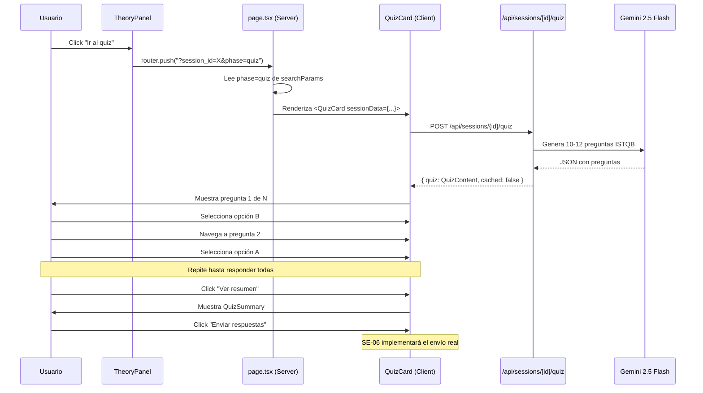
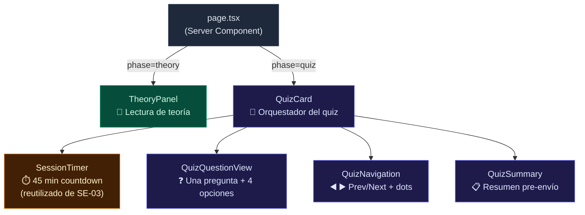
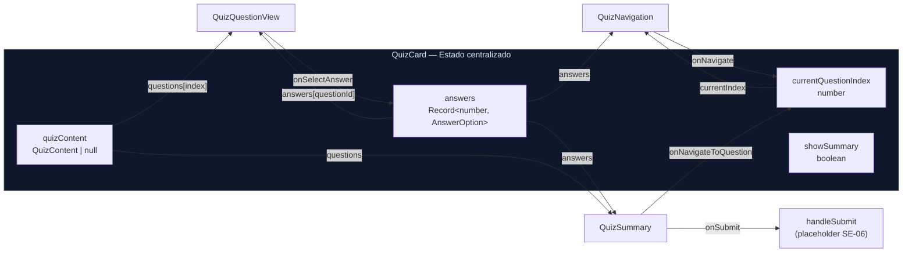

# SE-05 — UI: QuizCard (Opciones A/B/C/D, sin feedback inmediato)

> **Bloque:** 📚 BLOQUE E — Sesión de Estudio
> **Dependencias:** SE-04 ✅, FE-04 ✅
> **Entregables:** 4 archivos nuevos + 1 archivo modificado
> **Tiempo estimado:** 60-90 minutos

---

## Sección 1: 🎓 Introducción y Fundamentos Conceptuales

### ¿Dónde estamos?

En **SE-04** construimos el motor de generación de quiz: un prompt cuidadosamente diseñado que instruye a Gemini para crear 10-12 preguntas estilo ISTQB, y un Route Handler (`POST /api/sessions/[id]/quiz`) que orquesta la generación, validación y caché del quiz. Ahora tenemos un endpoint funcional que retorna un JSON con preguntas, opciones, respuestas correctas y explicaciones.

Pero un JSON no es una experiencia de aprendizaje. **SE-05 convierte ese JSON en una interfaz interactiva** que simula la experiencia real del examen ISTQB Foundation Level.

### ¿Qué construiremos?

Un componente `QuizCard` que:

1. **Muestra una pregunta a la vez** — como en un examen real, el estudiante se enfoca en una sola pregunta
2. **Presenta opciones A/B/C/D como botones seleccionables** — toggle visual sin revelar la respuesta correcta
3. **NO muestra feedback inmediato** — ni ✅ ni ❌ durante el quiz; el feedback vendrá en SE-08 (FeedbackPanel)
4. **Timer de 45 minutos** — reutilizando el `SessionTimer` de SE-03
5. **Navegación libre** — el estudiante puede ir y volver entre preguntas
6. **Resumen pre-envío** — antes de enviar, muestra qué preguntas están respondidas y cuáles faltan
7. **Botón "Enviar"** — solo se habilita cuando TODAS las preguntas están respondidas

### Analogía: El examen real del ISTQB

Imagina que estás sentado en el salón del examen ISTQB. Te dan un cuadernillo con 40 preguntas y una hoja de respuestas. Puedes:
- Leer una pregunta y marcar tu respuesta
- Saltarte una pregunta difícil y volver a ella después
- Cambiar tu respuesta cuantas veces quieras antes de entregar
- **NO** puedes ver si tu respuesta es correcta hasta que el examen termine

Esa es exactamente la experiencia que `QuizCard` reproduce. Es un "simulacro digital" del examen, pero con solo 10-12 preguntas por sesión en lugar de las 40 del examen real.

### Conceptos clave de React en este componente

#### 1. Estado local vs. Estado global

Las respuestas del quiz se almacenan en estado **local** del componente (`useState`), no en un estado global (Context, Redux, Zustand). ¿Por qué?

- El quiz vive solo dentro de la sesión actual
- No necesitamos que otros componentes accedan a las respuestas durante el quiz
- Al desmontar el componente, las respuestas se pierden (es intencional: en SE-06 se enviarán al servidor)

```
Estado local (useState)           vs.    Estado global (Context/Store)
──────────────────────                   ──────────────────────────
✅ Simplicidad                           ❌ Complejidad innecesaria aquí
✅ Garbage collected al desmontar        ✅ Persiste entre navegaciones
✅ No re-renders innecesarios            ❌ Re-renders en todo el árbol
```

#### 2. Record vs. Map para almacenar respuestas

Usaremos `Record<number, AnswerOption>` para almacenar las respuestas del usuario:

```typescript
// La clave es question_id (number, 0-indexed)
// El valor es la opción seleccionada: "a" | "b" | "c" | "d"
const answers: Record<number, AnswerOption> = {
  0: "b",   // Pregunta 0 → respondió B
  2: "a",   // Pregunta 2 → respondió A
  // Pregunta 1 no respondida (no existe en el Record)
};
```

¿Por qué `Record` en vez de `Map`?
- `Record` se integra mejor con `useState` (es un objeto plano, serializable)
- `Map` requiere una copia manual para trigger re-renders: `new Map(prev)`
- Para nuestro caso (10-12 entries máximo), `Record` es más limpio

#### 3. El patrón "Phase" en la página de sesión

La página `/session` maneja dos fases:

```
        ┌─────────────────┐
        │  URL: /session   │
        │  ?session_id=X   │
        └────────┬────────┘
                 │
      ┌──────────┴──────────┐
      │    ¿phase=quiz?     │
      └──────────┬──────────┘
           │           │
     NO (default)    YES
           │           │
    ┌──────┴──────┐  ┌──┴───────┐
    │ TheoryPanel │  │ QuizCard │
    └─────────────┘  └──────────┘
```

Actualmente, `page.tsx` siempre renderiza `<TheoryPanel>`. En esta guía lo modificaremos para detectar `phase=quiz` en los query params y renderizar `<QuizCard>` cuando corresponda.

---

## Sección 2: 📋 Prerequisitos y Verificación del Entorno

### Herramientas y versiones requeridas

| Herramienta | Versión mínima | Comando de verificación |
|---|---|---|
| Node.js | v18+ | `node --version` |
| npm | v9+ | `npm --version` |
| TypeScript | v5+ | `npx tsc --version` |
| Next.js | v16.x actual | Verificar en `frontend/package.json` |

### Entregables previos que DEBEN existir

Estos archivos se crearon en guías anteriores y son **requisito** para SE-05:

| Archivo | Guía de origen | Verificación |
|---|---|---|
| `frontend/app/(dashboard)/session/page.tsx` | SE-01, SE-03 | Server Component que carga `SessionWithContext` |
| `frontend/components/session/theory-panel.tsx` | SE-03 | Botón "Ir al quiz" que navega con `?phase=quiz` |
| `frontend/components/session/session-timer.tsx` | SE-03 | Timer de 45 min reutilizable |
| `frontend/app/api/sessions/[id]/quiz/route.ts` | SE-04 | `POST` retorna `{ quiz: QuizContent, cached: boolean }` |
| `frontend/types/quiz.ts` | SE-04 | Tipos `QuizQuestion`, `QuizContent`, `QuizResponse` |
| `frontend/types/database.ts` | FE-02 | Tipos `AnswerOption`, `OptionsJson`, `LevelK` |
| `frontend/types/sessions.ts` | SE-01 | Tipo `SessionWithContext` |

### Verificación rápida

Ejecuta estos comandos en PowerShell desde la raíz del repo (`practica-testing/`):

```powershell
# 1. Verificar que el proyecto compila
npx tsc --noEmit --project frontend/tsconfig.json
```

**Salida esperada:** Sin errores (0 errores).

```powershell
# 2. Verificar que el quiz endpoint existe
Test-Path -LiteralPath "frontend/app/api/sessions/[id]/quiz/route.ts"
```

**Salida esperada:** `True`.

```powershell
# 3. Verificar que los tipos de quiz existen
Select-String -Path "frontend/types/quiz.ts" -Pattern "export interface QuizQuestion" -SimpleMatch
```

**Salida esperada:** Línea con `export interface QuizQuestion {`.

```powershell
# 4. Verificar que el dev server funciona
npm --prefix frontend run dev
```

**Salida esperada:** `▲ Next.js 16.x.x` corriendo en `http://localhost:3000`.

---

## Sección 3: 📂 Estructura de Directorios del Proyecto

```
practica-testing/
├── backend/                        # ⚙️ FastAPI (BE-01 a BE-06)
├── supabase/                       # 🗄️ Migraciones (DB-01 a DB-05)
├── docs/
│   ├── roadmap/
│   │   └── ISTQB_Guias_Implementacion.md
│   └── guides/
│       ├── db/                     # Guías de base de datos
│       ├── be/                     # Guías de backend
│       └── fe/
│           ├── FE-01.md a FE-04.md
│           ├── UP-01.md a UP-06.md
│           ├── SE-01.md a SE-04.md
│           └── SE-05.md            # 🆕 ESTA GUÍA
├── frontend/
│   ├── app/
│   │   ├── (auth)/
│   │   │   ├── login/page.tsx
│   │   │   └── register/page.tsx
│   │   ├── (dashboard)/
│   │   │   ├── layout.tsx
│   │   │   ├── dashboard/page.tsx
│   │   │   ├── setup/page.tsx
│   │   │   ├── plan/page.tsx
│   │   │   └── session/
│   │   │       └── page.tsx        # 📝 MODIFICADO en SE-05 (agregar phase=quiz)
│   │   ├── api/
│   │   │   ├── upload/route.ts
│   │   │   ├── plan/generate/route.ts
│   │   │   └── sessions/
│   │   │       ├── next/route.ts
│   │   │       └── [id]/
│   │   │           ├── route.ts
│   │   │           ├── theory/route.ts
│   │   │           └── quiz/route.ts     # (creado en SE-04)
│   │   ├── layout.tsx
│   │   └── globals.css
│   ├── components/
│   │   ├── ui/                           # shadcn/ui base
│   │   │   ├── badge.tsx
│   │   │   ├── button.tsx
│   │   │   ├── card.tsx
│   │   │   └── ... (avatar, input, etc.)
│   │   ├── session/
│   │   │   ├── session-timer.tsx          # (SE-03) — reutilizado en SE-05
│   │   │   ├── theory-panel.tsx           # (SE-03) — ya existente
│   │   │   ├── theory-topic-view.tsx      # (SE-03) — ya existente
│   │   │   ├── collapsible-section.tsx    # (SE-03) — ya existente
│   │   │   ├── quiz-card.tsx             # 🆕 SE-05: Orquestador del quiz
│   │   │   ├── quiz-question-view.tsx    # 🆕 SE-05: Vista de una pregunta
│   │   │   ├── quiz-navigation.tsx       # 🆕 SE-05: Navegación entre preguntas
│   │   │   └── quiz-summary.tsx          # 🆕 SE-05: Resumen pre-envío
│   │   ├── setup/
│   │   │   ├── study-config.tsx
│   │   │   └── plan-calendar.tsx
│   │   ├── shared/
│   │   └── header.tsx
│   ├── lib/
│   │   ├── supabase/
│   │   │   ├── client.ts
│   │   │   └── server.ts
│   │   └── prompts/
│   │       ├── theory.ts                 # (SE-02)
│   │       └── quiz.ts                   # (SE-04)
│   ├── types/
│   │   ├── database.ts                   # AnswerOption, OptionsJson, LevelK
│   │   ├── sessions.ts                   # SessionWithContext, SessionTopic
│   │   ├── theory.ts                     # TheoryContent
│   │   ├── quiz.ts                       # QuizQuestion, QuizContent
│   │   └── index.ts                      # Barrel de re-exports
│   ├── middleware.ts
│   ├── package.json
│   └── tsconfig.json
└── .env.local
```

> **Archivos con 🆕 son NUEVOS en esta guía. El archivo 📝 será MODIFICADO.**

---

## Sección 4: 🎨 Diagrama de Arquitectura de Componentes

### Flujo completo de la fase de quiz



### Jerarquía de componentes



### Flujo de datos (estado)



---

## Sección 5: 🛠️ Implementación Paso a Paso

---

### Paso A: Crear `quiz-question-view.tsx` — Vista de una pregunta individual

**Archivo:** `frontend/components/session/quiz-question-view.tsx`

Este componente renderiza **una sola pregunta** con sus 4 opciones A/B/C/D como botones seleccionables. Es el corazón visual del quiz.

**Principio de diseño:** Cada opción es un botón que actúa como **toggle**. Al hacer clic, se selecciona esa opción y se deselecciona la anterior. NO se muestra si es correcta o incorrecta — eso vendrá en SE-08.

```typescript
// ============================================================
// components/session/quiz-question-view.tsx
// Vista de una pregunta individual del quiz
// ============================================================
// TIPO: Client Component (necesita interactividad: onClick)
//
// RESPONSABILIDADES:
//   1. Mostrar el enunciado de la pregunta
//   2. Renderizar las 4 opciones (A, B, C, D) como botones
//   3. Resaltar la opción seleccionada (sin revelar la correcta)
//   4. Mostrar metadatos: número de pregunta, topic_code, level_k
//
// PROPS:
//   - question: QuizQuestion — La pregunta a mostrar
//   - selectedAnswer: AnswerOption | null — Respuesta seleccionada
//   - onSelectAnswer: (answer: AnswerOption) => void — Callback
//   - questionNumber: number — Número de pregunta (1-based)
//   - totalQuestions: number — Total de preguntas en el quiz
//
// REGLA CRÍTICA:
//   NUNCA mostrar `question.correct` ni `question.explanation`
//   en este componente. Esos datos solo se usan en SE-08.
// ============================================================

"use client";

import { Badge } from "@/components/ui/badge";
import type { QuizQuestion } from "@/types/quiz";
import type { AnswerOption } from "@/types/database";

// ─── Props del componente ───────────────────────────────────
interface QuizQuestionViewProps {
  /** La pregunta actual del quiz */
  question: QuizQuestion;
  /** La respuesta seleccionada por el usuario (null si no ha respondido) */
  selectedAnswer: AnswerOption | null;
  /** Callback cuando el usuario selecciona/cambia una opción */
  onSelectAnswer: (answer: AnswerOption) => void;
  /** Número de la pregunta (1-based, para mostrar "Pregunta 3 de 10") */
  questionNumber: number;
  /** Total de preguntas en el quiz */
  totalQuestions: number;
}

// ─── Constantes ─────────────────────────────────────────────
// Mapeo de clave interna ("a","b","c","d") a letra mayúscula
// para mostrar en la UI
const OPTION_LABELS: Record<AnswerOption, string> = {
  a: "A",
  b: "B",
  c: "C",
  d: "D",
};

// Colores por nivel K — misma paleta que TheoryPanel para consistencia
function getLevelKBadgeClass(levelK: string): string {
  const colorMap: Record<string, string> = {
    K1: "border-sky-700 bg-sky-950/40 text-sky-300",
    K2: "border-violet-700 bg-violet-950/40 text-violet-300",
    K3: "border-rose-700 bg-rose-950/40 text-rose-300",
  };
  return colorMap[levelK] || colorMap.K1;
}

// ─── Componente ─────────────────────────────────────────────
export function QuizQuestionView({
  question,
  selectedAnswer,
  onSelectAnswer,
  questionNumber,
  totalQuestions,
}: QuizQuestionViewProps) {
  // Convertimos options (Record) en array para iterar
  // El orden siempre será a, b, c, d gracias a OPTION_LABELS
  const optionKeys: AnswerOption[] = ["a", "b", "c", "d"];

  return (
    <div className="space-y-6">
      {/* ── Header: número + tópico + nivel K ──────────────── */}
      <div className="flex items-center justify-between flex-wrap gap-2">
        <span className="text-xs font-medium text-slate-400">
          Pregunta {questionNumber} de {totalQuestions}
        </span>
        <div className="flex items-center gap-2">
          <Badge
            variant="outline"
            className="border-slate-700 text-slate-400 text-xs"
          >
            {question.topic_code}
          </Badge>
          <Badge
            variant="outline"
            className={`text-xs ${getLevelKBadgeClass(question.level_k)}`}
          >
            {question.level_k}
          </Badge>
        </div>
      </div>

      {/* ── Enunciado de la pregunta ───────────────────────── */}
      {/* whitespace-pre-line preserva saltos de línea del LLM  */}
      {/* (útil en preguntas K3 con escenarios multilínea)       */}
      <p className="text-base font-medium leading-relaxed text-white whitespace-pre-line">
        {question.question}
      </p>

      {/* ── Opciones A/B/C/D ──────────────────────────────── */}
      {/* Cada opción es un botón con toggle visual.            */}
      {/* Al hacer clic → onSelectAnswer(key) actualiza el      */}
      {/* estado en el componente padre (QuizCard).             */}
      <div className="grid gap-3">
        {optionKeys.map((key) => {
          const text = question.options[key];
          const isSelected = selectedAnswer === key;

          return (
            <button
              key={key}
              type="button"
              onClick={() => onSelectAnswer(key)}
              className={`group flex items-start gap-3 rounded-xl border p-4 text-left transition-all duration-200 ${
                isSelected
                  ? "border-emerald-500/50 bg-emerald-500/10 shadow-lg shadow-emerald-500/5"
                  : "border-slate-700/50 bg-slate-800/30 hover:border-slate-600 hover:bg-slate-800/60"
              }`}
            >
              {/* Círculo con la letra de la opción */}
              <span
                className={`flex h-8 w-8 shrink-0 items-center justify-center rounded-lg text-sm font-bold transition-colors duration-200 ${
                  isSelected
                    ? "bg-emerald-500 text-slate-950"
                    : "bg-slate-700/50 text-slate-300 group-hover:bg-slate-700 group-hover:text-white"
                }`}
              >
                {OPTION_LABELS[key]}
              </span>

              {/* Texto de la opción */}
              <span
                className={`text-sm leading-relaxed pt-1 transition-colors duration-200 ${
                  isSelected
                    ? "text-emerald-100"
                    : "text-slate-300 group-hover:text-slate-200"
                }`}
              >
                {text}
              </span>
            </button>
          );
        })}
      </div>
    </div>
  );
}
```

**Entregable del Paso A:**
- ✅ Archivo creado: `frontend/components/session/quiz-question-view.tsx`

---

### Paso B: Crear `quiz-navigation.tsx` — Navegación entre preguntas

**Archivo:** `frontend/components/session/quiz-navigation.tsx`

Este componente proporciona dos formas de navegación:

1. **Dots grid:** Una grilla de botones numerados (1-12) donde el usuario puede saltar a cualquier pregunta. Los dots muestran visualmente cuáles están respondidas y cuál es la actual.
2. **Botones Anterior/Siguiente:** Navegación secuencial clásica.

```typescript
// ============================================================
// components/session/quiz-navigation.tsx
// Navegación entre preguntas del quiz
// ============================================================
// TIPO: Client Component (necesita interactividad: onClick)
//
// RESPONSABILIDADES:
//   1. Mostrar dots numerados para cada pregunta (salto directo)
//   2. Indicar visualmente: current (anillo), answered (verde), pending (gris)
//   3. Botones Previous/Next para navegación secuencial
//   4. Contador textual "X / N"
//
// PROPS:
//   - currentIndex: number — Índice de la pregunta actual (0-based)
//   - totalQuestions: number — Total de preguntas
//   - answers: Record<number, AnswerOption> — Respuestas actuales
//   - onNavigate: (index: number) => void — Saltar a pregunta
//
// NOTA SOBRE question_id vs. array index:
//   En nuestro quiz, question_id === array index (ambos 0-indexed).
//   La API asigna question_id secuencialmente: 0, 1, 2, ..., n-1.
//   Por eso usamos el array index como clave en el Record de answers.
// ============================================================

"use client";

import { ArrowLeft, ArrowRight } from "lucide-react";
import type { AnswerOption } from "@/types/database";

interface QuizNavigationProps {
  /** Índice de la pregunta actual (0-based) */
  currentIndex: number;
  /** Total de preguntas en el quiz */
  totalQuestions: number;
  /** Mapa de respuestas: { question_id: answer } */
  answers: Record<number, AnswerOption>;
  /** Callback para saltar a una pregunta específica */
  onNavigate: (index: number) => void;
}

export function QuizNavigation({
  currentIndex,
  totalQuestions,
  answers,
  onNavigate,
}: QuizNavigationProps) {
  return (
    <div className="space-y-4">
      {/* ── Dots grid: salto directo a cualquier pregunta ──── */}
      {/* Cada dot es un botón cuadrado con el número de la     */}
      {/* pregunta. El estilo visual indica 3 estados:           */}
      {/*   • Current: emerald sólido + ring                    */}
      {/*   • Answered: emerald transparente + borde            */}
      {/*   • Pending: gris oscuro                              */}
      <div className="flex flex-wrap justify-center gap-2">
        {Array.from({ length: totalQuestions }, (_, i) => {
          const isAnswered = answers[i] !== undefined;
          const isCurrent = i === currentIndex;

          return (
            <button
              key={i}
              type="button"
              onClick={() => onNavigate(i)}
              aria-label={`Ir a pregunta ${i + 1}${isAnswered ? " (respondida)" : ""}`}
              className={`flex h-8 w-8 items-center justify-center rounded-lg text-xs font-bold transition-all duration-200 ${
                isCurrent
                  ? // Estado: pregunta actual
                    "bg-emerald-500 text-slate-950 ring-2 ring-emerald-400/50 ring-offset-2 ring-offset-slate-900"
                  : isAnswered
                    ? // Estado: respondida (pero no la actual)
                      "bg-emerald-500/20 text-emerald-300 border border-emerald-500/30 hover:bg-emerald-500/30"
                    : // Estado: pendiente
                      "bg-slate-800 text-slate-400 border border-slate-700 hover:border-slate-600 hover:text-slate-300"
              }`}
            >
              {i + 1}
            </button>
          );
        })}
      </div>

      {/* ── Previous / Next + contador ────────────────────── */}
      <div className="flex items-center justify-between">
        <button
          type="button"
          onClick={() => onNavigate(currentIndex - 1)}
          disabled={currentIndex === 0}
          className="inline-flex items-center gap-2 rounded-lg border border-slate-700 px-4 py-2 text-sm font-medium text-slate-300 transition-colors hover:bg-slate-800 disabled:opacity-30 disabled:cursor-not-allowed"
        >
          <ArrowLeft className="h-4 w-4" />
          Anterior
        </button>

        <span className="text-xs text-slate-500">
          {currentIndex + 1} / {totalQuestions}
        </span>

        <button
          type="button"
          onClick={() => onNavigate(currentIndex + 1)}
          disabled={currentIndex === totalQuestions - 1}
          className="inline-flex items-center gap-2 rounded-lg border border-slate-700 px-4 py-2 text-sm font-medium text-slate-300 transition-colors hover:bg-slate-800 disabled:opacity-30 disabled:cursor-not-allowed"
        >
          Siguiente
          <ArrowRight className="h-4 w-4" />
        </button>
      </div>
    </div>
  );
}
```

**Entregable del Paso B:**
- ✅ Archivo creado: `frontend/components/session/quiz-navigation.tsx`

---

### Paso C: Crear `quiz-summary.tsx` — Resumen pre-envío

**Archivo:** `frontend/components/session/quiz-summary.tsx`

Este componente se muestra antes de enviar las respuestas. Permite al usuario:
- Ver cuántas preguntas respondió y cuántas faltan
- Revisar rápidamente su selección por cada pregunta
- Hacer clic en cualquier pregunta para volver a ella y cambiar su respuesta
- Enviar solo si TODAS están respondidas

```typescript
// ============================================================
// components/session/quiz-summary.tsx
// Resumen pre-envío del quiz
// ============================================================
// TIPO: Client Component (necesita onClick para navegación)
//
// RESPONSABILIDADES:
//   1. Mostrar contadores: respondidas vs. pendientes
//   2. Listar TODAS las preguntas con su estado
//   3. Permitir click en cualquier pregunta para volver a ella
//   4. Habilitar botón "Enviar" solo si TODAS respondidas
//   5. Mostrar advertencia visual si hay preguntas sin responder
//
// PROPS:
//   - questions: QuizQuestion[] — Todas las preguntas del quiz
//   - answers: Record<number, AnswerOption> — Respuestas del usuario
//   - onNavigateToQuestion: (index: number) => void — Ir a pregunta
//   - onSubmit: () => void — Enviar todas las respuestas
//   - onBack: () => void — Volver al quiz (cerrar resumen)
//   - submitting: boolean — Si el envío está en progreso
// ============================================================

"use client";

import {
  CheckCircle2,
  Circle,
  AlertCircle,
  Send,
  ArrowLeft,
} from "lucide-react";
import type { QuizQuestion } from "@/types/quiz";
import type { AnswerOption } from "@/types/database";

interface QuizSummaryProps {
  questions: QuizQuestion[];
  answers: Record<number, AnswerOption>;
  onNavigateToQuestion: (index: number) => void;
  onSubmit: () => void;
  onBack: () => void;
  submitting: boolean;
}

// ─── Etiquetas de opciones para mostrar la selección ────────
const OPTION_LABELS: Record<AnswerOption, string> = {
  a: "A",
  b: "B",
  c: "C",
  d: "D",
};

export function QuizSummary({
  questions,
  answers,
  onNavigateToQuestion,
  onSubmit,
  onBack,
  submitting,
}: QuizSummaryProps) {
  // ── Contadores derivados ──────────────────────────────────
  const totalQuestions = questions.length;
  const answeredCount = Object.keys(answers).length;
  const unansweredCount = totalQuestions - answeredCount;
  const allAnswered = unansweredCount === 0;

  return (
    <div className="space-y-6">
      {/* ── Título ────────────────────────────────────────── */}
      <div className="text-center">
        <h2 className="text-xl font-bold text-white">Resumen del Quiz</h2>
        <p className="mt-1 text-sm text-slate-400">
          Revisa tus respuestas antes de enviar
        </p>
      </div>

      {/* ── Contadores: respondidas / pendientes ─────────── */}
      <div className="grid grid-cols-2 gap-4">
        <div className="rounded-xl border border-emerald-500/20 bg-emerald-950/20 p-4 text-center">
          <p className="text-2xl font-bold text-emerald-400">{answeredCount}</p>
          <p className="text-xs text-emerald-300/70">Respondidas</p>
        </div>
        <div
          className={`rounded-xl border p-4 text-center ${
            unansweredCount > 0
              ? "border-amber-500/20 bg-amber-950/20"
              : "border-slate-700 bg-slate-800/30"
          }`}
        >
          <p
            className={`text-2xl font-bold ${
              unansweredCount > 0 ? "text-amber-400" : "text-slate-500"
            }`}
          >
            {unansweredCount}
          </p>
          <p
            className={`text-xs ${
              unansweredCount > 0 ? "text-amber-300/70" : "text-slate-500"
            }`}
          >
            Pendientes
          </p>
        </div>
      </div>

      {/* ── Lista de preguntas con estado ─────────────────── */}
      {/* max-h con scroll para quizzes de 10-12 preguntas     */}
      <div className="space-y-2 max-h-72 overflow-y-auto pr-1">
        {questions.map((q, index) => {
          const answer = answers[q.question_id];
          const isAnswered = answer !== undefined;

          return (
            <button
              key={q.question_id}
              type="button"
              onClick={() => onNavigateToQuestion(index)}
              className={`flex w-full items-center gap-3 rounded-lg border p-3 text-left transition-colors ${
                isAnswered
                  ? "border-slate-700/50 bg-slate-800/20 hover:bg-slate-800/40"
                  : "border-amber-500/30 bg-amber-950/10 hover:bg-amber-950/20"
              }`}
            >
              {/* Ícono de estado: ✓ respondida / ○ pendiente */}
              {isAnswered ? (
                <CheckCircle2 className="h-4 w-4 shrink-0 text-emerald-400" />
              ) : (
                <Circle className="h-4 w-4 shrink-0 text-amber-400" />
              )}

              {/* Texto truncado de la pregunta */}
              <span className="flex-1 truncate text-sm text-slate-300">
                {index + 1}. {q.question.length > 80
                  ? q.question.slice(0, 80) + "..."
                  : q.question}
              </span>

              {/* Badge con la opción seleccionada */}
              {isAnswered && (
                <span className="shrink-0 flex h-6 w-6 items-center justify-center rounded bg-emerald-500/20 text-xs font-bold text-emerald-300">
                  {OPTION_LABELS[answer]}
                </span>
              )}
            </button>
          );
        })}
      </div>

      {/* ── Warning si faltan preguntas ───────────────────── */}
      {!allAnswered && (
        <div className="flex items-start gap-2 rounded-lg border border-amber-500/30 bg-amber-950/10 p-3">
          <AlertCircle className="h-4 w-4 shrink-0 mt-0.5 text-amber-400" />
          <p className="text-sm text-amber-300">
            Debes responder <strong>todas</strong> las preguntas antes de enviar.
            Haz clic en cualquier pregunta pendiente para ir a ella.
          </p>
        </div>
      )}

      {/* ── Botones de acción ─────────────────────────────── */}
      <div className="flex gap-3">
        <button
          type="button"
          onClick={onBack}
          className="flex-1 inline-flex h-11 items-center justify-center gap-2 rounded-lg border border-slate-700 text-sm font-medium text-slate-300 transition-colors hover:bg-slate-800"
        >
          <ArrowLeft className="h-4 w-4" />
          Volver al quiz
        </button>
        <button
          type="button"
          onClick={onSubmit}
          disabled={!allAnswered || submitting}
          className="flex-1 inline-flex h-11 items-center justify-center gap-2 rounded-lg bg-emerald-500 text-sm font-semibold text-slate-950 transition-colors hover:bg-emerald-400 disabled:opacity-40 disabled:cursor-not-allowed"
        >
          <Send className="h-4 w-4" />
          {submitting ? "Enviando..." : "Enviar respuestas"}
        </button>
      </div>
    </div>
  );
}
```

**Entregable del Paso C:**
- ✅ Archivo creado: `frontend/components/session/quiz-summary.tsx`

---

### Paso D: Crear `quiz-card.tsx` — Componente orquestador principal

**Archivo:** `frontend/components/session/quiz-card.tsx`

Este es el componente principal del quiz. Orquesta:
- El fetch del quiz al montar
- La gestión del estado de respuestas
- La navegación entre preguntas
- La transición a la vista de resumen
- La acción de envío (placeholder para SE-06)

**Patrón de diseño:** `QuizCard` sigue el mismo patrón que `TheoryPanel`:
- Recibe `sessionData: SessionWithContext` como prop
- Hace fetch a la API al montar
- Maneja estados de loading, error, y contenido
- Reutiliza `SessionTimer` para el countdown de 45 minutos

```typescript
// ============================================================
// components/session/quiz-card.tsx
// Orquestador principal del quiz de la sesión de estudio
// ============================================================
// TIPO: Client Component (orquesta estado, fetches, y sub-componentes)
//
// RESPONSABILIDADES:
//   1. Hacer fetch a POST /api/sessions/[id]/quiz al montar
//   2. Gestionar el estado de respuestas en Record<number, AnswerOption>
//   3. Renderizar QuizQuestionView + QuizNavigation + QuizSummary
//   4. Reutilizar SessionTimer con 45 minutos (mitad de duration_minutes)
//   5. Proporcionar botón "Enviar" (placeholder hasta SE-06)
//   6. Permitir volver a la fase de teoría
//
// PROPS:
//   - sessionData: SessionWithContext — Datos completos de la sesión
//
// ESTADOS:
//   - loading: boolean — Fetch del quiz en progreso
//   - error: string | null — Error al generar quiz
//   - quizContent: QuizContent | null — Quiz generado
//   - currentQuestionIndex: number — Pregunta visible (0-based)
//   - answers: Record<number, AnswerOption> — Respuestas del usuario
//   - showSummary: boolean — Si mostrar el resumen pre-envío
//   - submitting: boolean — Si el envío está en progreso
//   - timerActive: boolean — Si el timer debe correr
//
// PATRÓN "FETCH ON MOUNT":
//   Al montar, el componente hace POST a la API de quiz.
//   Si el quiz ya fue generado, la API retorna el cache
//   (cached: true). Si no, genera uno nuevo con Gemini.
//   Igual que TheoryPanel hace con la teoría en SE-03.
// ============================================================

"use client";

import { useState, useEffect } from "react";
import { useRouter } from "next/navigation";
import {
  Sun,
  Moon,
  RefreshCw,
  FileCheck,
  Sparkles,
  AlertTriangle,
  RotateCcw,
  ClipboardList,
  BookOpen,
} from "lucide-react";
import { Badge } from "@/components/ui/badge";
import { SessionTimer } from "./session-timer";
import { QuizQuestionView } from "./quiz-question-view";
import { QuizNavigation } from "./quiz-navigation";
import { QuizSummary } from "./quiz-summary";
import type { SessionWithContext } from "@/types/sessions";
import type { QuizContent } from "@/types/quiz";
import type { AnswerOption } from "@/types/database";

// ─── Props del componente ───────────────────────────────────
interface QuizCardProps {
  sessionData: SessionWithContext;
}

// ─── Helpers reutilizados de TheoryPanel ─────────────────────
// Mismas funciones para mantener consistencia visual entre
// la fase de teoría y la fase de quiz.

function getSessionIcon(type: string) {
  const map: Record<string, typeof Sun> = {
    morning: Sun,
    night: Moon,
    reinforcement: RefreshCw,
    mock_exam: FileCheck,
  };
  return map[type] || Sun;
}

function getSessionTypeLabel(type: string): string {
  const map: Record<string, string> = {
    morning: "Sesión Matutina",
    night: "Sesión Nocturna",
    reinforcement: "Sesión de Refuerzo",
    mock_exam: "Simulacro de Examen",
  };
  return map[type] || type;
}

function getSessionTypeColor(type: string): string {
  const map: Record<string, string> = {
    morning: "text-amber-300",
    night: "text-indigo-300",
    reinforcement: "text-orange-300",
    mock_exam: "text-purple-300",
  };
  return map[type] || "text-slate-300";
}

// ─── Componente principal ───────────────────────────────────
export function QuizCard({ sessionData }: QuizCardProps) {
  const router = useRouter();

  // ═══════════════════════════════════════════════════════════
  // ESTADO
  // ═══════════════════════════════════════════════════════════
  const [loading, setLoading] = useState(true);
  const [error, setError] = useState<string | null>(null);
  const [quizContent, setQuizContent] = useState<QuizContent | null>(null);
  const [currentQuestionIndex, setCurrentQuestionIndex] = useState(0);
  const [answers, setAnswers] = useState<Record<number, AnswerOption>>({});
  const [showSummary, setShowSummary] = useState(false);
  const [submitting, setSubmitting] = useState(false);
  const [timerActive, setTimerActive] = useState(false);

  // ═══════════════════════════════════════════════════════════
  // EFECTO: Cargar quiz al montar
  // ═══════════════════════════════════════════════════════════
  // Mismo patrón que TheoryPanel: fetch on mount con cleanup.
  // El flag `cancelled` previene actualizaciones de estado
  // si el componente se desmonta antes de que el fetch termine.
  useEffect(() => {
    let cancelled = false;

    async function loadQuiz() {
      setLoading(true);
      setError(null);
      setQuizContent(null);
      setAnswers({});
      setCurrentQuestionIndex(0);
      setShowSummary(false);
      setSubmitting(false);
      setTimerActive(false);

      try {
        const response = await fetch(
          `/api/sessions/${sessionData.id}/quiz`,
          {
            method: "POST",
            headers: { "Content-Type": "application/json" },
            body: JSON.stringify({ force: false }),
          },
        );

        if (!response.ok) {
          const data = await response.json().catch(() => ({}));
          throw new Error(
            data.error || `Error ${response.status} al generar quiz`,
          );
        }

        const data = await response.json();

        if (!cancelled) {
          setQuizContent(data.quiz);
          setTimerActive(true);
        }
      } catch (err) {
        if (!cancelled) {
          setError(
            err instanceof Error
              ? err.message
              : "Error desconocido al generar quiz",
          );
        }
      } finally {
        if (!cancelled) {
          setLoading(false);
        }
      }
    }

    loadQuiz();

    return () => {
      cancelled = true;
    };
  }, [sessionData.id]);

  // ═══════════════════════════════════════════════════════════
  // HANDLERS
  // ═══════════════════════════════════════════════════════════

  // ── Seleccionar respuesta ─────────────────────────────────
  function handleSelectAnswer(answer: AnswerOption) {
    if (!quizContent) return;

    // Obtener el question_id de la pregunta actual.
    // Si el índice quedó fuera de rango por algún cambio inesperado,
    // salimos sin romper la UI.
    const visibleQuestion = quizContent.questions[currentQuestionIndex];
    if (!visibleQuestion) return;

    // Actualizar el Record de respuestas con spread operator
    // (patrón inmutable para que React detecte el cambio)
    setAnswers((prev) => ({
      ...prev,
      [visibleQuestion.question_id]: answer,
    }));
  }

  // ── Navegar a una pregunta específica ─────────────────────
  function handleNavigate(index: number) {
    if (!quizContent) return;

    // Clamp al rango válido [0, totalQuestions - 1]
    const clamped = Math.max(
      0,
      Math.min(quizContent.questions.length - 1, index),
    );

    setCurrentQuestionIndex(clamped);
    // Si estábamos en el resumen, volver al quiz
    setShowSummary(false);
  }

  // ── Enviar respuestas (placeholder para SE-06) ────────────
  // En SE-06 esto hará POST a /api/sessions/[id]/evaluate
  // con el array de UserAnswer. Por ahora, mostramos un
  // mensaje informativo.
  function handleSubmit() {
    const total = quizContent?.questions.length || 0;
    const answered = Object.keys(answers).length;

    if (!quizContent || total === 0 || answered !== total || submitting) {
      return;
    }

    setSubmitting(true);

    // Simular un breve delay para UX
    setTimeout(() => {
      setSubmitting(false);
      alert(
        "✅ Respuestas registradas correctamente.\n\n" +
          "La evaluación con IA se implementará en la guía SE-06.\n" +
          "Tus respuestas están listas para ser enviadas.",
      );
    }, 500);
  }

  // ── Reintentar generación de quiz ─────────────────────────
  async function handleRetry() {
    setLoading(true);
    setError(null);
    setQuizContent(null);
    setAnswers({});
    setCurrentQuestionIndex(0);
    setShowSummary(false);
    setSubmitting(false);
    setTimerActive(false);

    try {
      const response = await fetch(
        `/api/sessions/${sessionData.id}/quiz`,
        {
          method: "POST",
          headers: { "Content-Type": "application/json" },
          body: JSON.stringify({ force: true }),
        },
      );

      if (!response.ok) {
        const data = await response.json().catch(() => ({}));
        throw new Error(
          data.error || `Error ${response.status} al regenerar quiz`,
        );
      }

      const data = await response.json();
      setQuizContent(data.quiz);
      setTimerActive(true);
    } catch (err) {
      setError(
        err instanceof Error
          ? err.message
          : "Error desconocido al regenerar quiz",
      );
    } finally {
      setLoading(false);
    }
  }

  // ═══════════════════════════════════════════════════════════
  // VARIABLES DERIVADAS
  // ═══════════════════════════════════════════════════════════
  const SessionIcon = getSessionIcon(sessionData.session_type);
  const sessionColor = getSessionTypeColor(sessionData.session_type);

  // Progreso del plan (barra superior)
  const progressPercent =
    sessionData.plan_context.total_sessions > 0
      ? (sessionData.plan_context.completed_sessions /
          sessionData.plan_context.total_sessions) *
        100
      : 0;

  // Datos del quiz
  const currentQuestion =
    quizContent?.questions[currentQuestionIndex] ?? null;
  const totalQuestions = quizContent?.questions.length || 0;
  const answeredCount = Object.keys(answers).length;
  const allAnswered = totalQuestions > 0 && answeredCount === totalQuestions;

  // ═══════════════════════════════════════════════════════════
  // RENDER
  // ═══════════════════════════════════════════════════════════
  return (
    <div className="mx-auto flex max-w-3xl flex-col gap-5">
      {/* ═══════════════════════════════════════════════════════ */}
      {/* HEADER: Info de la sesión + Timer                      */}
      {/* ═══════════════════════════════════════════════════════ */}
      <section className="rounded-2xl border border-slate-800 bg-slate-900/60 p-5">
        {/* ── Fila superior: tipo + número + timer ──────────── */}
        <div className="flex flex-col gap-4 sm:flex-row sm:items-start sm:justify-between">
          {/* Info de la sesión */}
          <div className="flex items-center gap-3">
            <div className="flex h-11 w-11 items-center justify-center rounded-full bg-slate-800">
              <SessionIcon className={`h-5 w-5 ${sessionColor}`} />
            </div>
            <div>
              <p
                className={`text-xs font-medium uppercase tracking-wide ${sessionColor}`}
              >
                Día {sessionData.day_number} —{" "}
                {getSessionTypeLabel(sessionData.session_type)}
              </p>
              <h1 className="text-xl font-bold tracking-tight text-white">
                📝 Quiz — Sesión {sessionData.session_number} de{" "}
                {sessionData.plan_context.total_sessions}
              </h1>
            </div>
          </div>

          {/* Timer de 45 min (mitad de duration_minutes) */}
          {timerActive && (
            <div className="sm:w-64">
              <SessionTimer
                durationMinutes={Math.floor(
                  sessionData.duration_minutes / 2,
                )}
                autoStart={true}
              />
            </div>
          )}
        </div>

        {/* ── Barra de progreso del plan ───────────────────── */}
        <div className="mt-4">
          <div className="flex items-center justify-between text-xs text-slate-400">
            <span>Progreso del plan</span>
            <span>
              {sessionData.plan_context.completed_sessions} /{" "}
              {sessionData.plan_context.total_sessions} sesiones
            </span>
          </div>
          <div className="mt-1.5 h-1.5 w-full overflow-hidden rounded-full bg-slate-800">
            <div
              className="h-full rounded-full bg-emerald-500 transition-all duration-500"
              style={{ width: `${progressPercent}%` }}
            />
          </div>
        </div>

        {/* ── Indicador de progreso del quiz ───────────────── */}
        {quizContent && (
          <div className="mt-3 flex flex-wrap items-center gap-2 text-xs text-slate-400">
            <ClipboardList className="h-3.5 w-3.5" />
            <span>
              {answeredCount} de {totalQuestions} respondidas
            </span>
            {allAnswered && (
              <Badge
                variant="outline"
                className="border-emerald-700 bg-emerald-950/40 text-emerald-300 text-xs"
              >
                ✓ Completo
              </Badge>
            )}
          </div>
        )}
      </section>

      {/* ═══════════════════════════════════════════════════════ */}
      {/* ESTADO: Loading                                        */}
      {/* ═══════════════════════════════════════════════════════ */}
      {loading && (
        <section className="rounded-2xl border border-slate-800 bg-slate-900/60 p-8">
          <div className="flex flex-col items-center gap-4 text-center">
            <div className="relative">
              <div className="h-16 w-16 rounded-full border-2 border-slate-700 border-t-emerald-400 animate-spin" />
              <Sparkles className="absolute top-1/2 left-1/2 h-6 w-6 -translate-x-1/2 -translate-y-1/2 text-emerald-400" />
            </div>
            <div>
              <p className="text-lg font-semibold text-white">
                Generando quiz...
              </p>
              <p className="mt-1 text-sm text-slate-400">
                Gemini está creando preguntas estilo ISTQB para{" "}
                {sessionData.topics.length} tópico
                {sessionData.topics.length > 1 ? "s" : ""}. Esto puede
                tomar 15-30 segundos.
              </p>
            </div>
          </div>
        </section>
      )}

      {/* ═══════════════════════════════════════════════════════ */}
      {/* ESTADO: Error                                          */}
      {/* ═══════════════════════════════════════════════════════ */}
      {error && (
        <section className="rounded-2xl border border-red-500/30 bg-red-950/10 p-6">
          <div className="flex items-start gap-3">
            <AlertTriangle className="h-5 w-5 text-red-400 shrink-0 mt-0.5" />
            <div className="flex-1">
              <p className="text-sm font-semibold text-red-300">
                Error al generar el quiz
              </p>
              <p className="mt-1 text-sm text-red-300/70">{error}</p>
              <button
                type="button"
                onClick={handleRetry}
                disabled={loading}
                className="mt-3 inline-flex items-center gap-2 rounded-lg border border-red-700 bg-red-950/50 px-4 py-2 text-sm font-medium text-red-300 transition-colors hover:bg-red-900/50 disabled:opacity-50"
              >
                <RotateCcw className="h-3.5 w-3.5" />
                Reintentar
              </button>
            </div>
          </div>
        </section>
      )}

      {/* ═══════════════════════════════════════════════════════ */}
      {/* CONTENIDO: Pregunta actual                             */}
      {/* ═══════════════════════════════════════════════════════ */}
      {quizContent && !showSummary && currentQuestion && (
        <>
          {/* ── Vista de la pregunta ─────────────────────────── */}
          <section className="rounded-2xl border border-slate-800 bg-slate-900/60 p-5">
            <QuizQuestionView
              question={currentQuestion}
              selectedAnswer={
                answers[currentQuestion.question_id] ?? null
              }
              onSelectAnswer={handleSelectAnswer}
              questionNumber={currentQuestionIndex + 1}
              totalQuestions={totalQuestions}
            />
          </section>

          {/* ── Navegación entre preguntas ───────────────────── */}
          <section className="rounded-2xl border border-slate-800 bg-slate-900/60 p-4">
            <QuizNavigation
              currentIndex={currentQuestionIndex}
              totalQuestions={totalQuestions}
              answers={answers}
              onNavigate={handleNavigate}
            />
          </section>
        </>
      )}

      {/* ═══════════════════════════════════════════════════════ */}
      {/* CONTENIDO: Resumen pre-envío                           */}
      {/* ═══════════════════════════════════════════════════════ */}
      {quizContent && showSummary && (
        <section className="rounded-2xl border border-slate-800 bg-slate-900/60 p-5">
          <QuizSummary
            questions={quizContent.questions}
            answers={answers}
            onNavigateToQuestion={handleNavigate}
            onSubmit={handleSubmit}
            onBack={() => setShowSummary(false)}
            submitting={submitting}
          />
        </section>
      )}

      {/* ═══════════════════════════════════════════════════════ */}
      {/* ACCIONES: Ver resumen + Volver a teoría                */}
      {/* ═══════════════════════════════════════════════════════ */}
      {quizContent && !showSummary && (
        <section className="rounded-2xl border border-slate-800 bg-slate-900/60 p-5">
          <div className="flex flex-col gap-4 sm:flex-row sm:items-center sm:justify-between">
            <p className="text-sm text-slate-400">
              {allAnswered
                ? "¡Has respondido todas las preguntas! Revisa el resumen antes de enviar."
                : `Faltan ${totalQuestions - answeredCount} pregunta${
                    totalQuestions - answeredCount > 1 ? "s" : ""
                  } por responder.`}
            </p>
            <div className="flex gap-3 shrink-0">
              {/* Volver a la teoría (navega sin phase=quiz) */}
              <button
                type="button"
                onClick={() =>
                  router.push(
                    `/session?session_id=${sessionData.id}`,
                  )
                }
                className="inline-flex h-10 items-center justify-center gap-2 rounded-lg border border-slate-700 px-5 text-sm font-medium text-slate-200 transition-colors hover:bg-slate-800"
              >
                <BookOpen className="h-4 w-4" />
                Teoría
              </button>

              {/* Ver resumen pre-envío */}
              <button
                type="button"
                onClick={() => setShowSummary(true)}
                className="inline-flex h-10 items-center justify-center gap-2 rounded-lg bg-emerald-500 px-5 text-sm font-semibold text-slate-950 transition-colors hover:bg-emerald-400"
              >
                <ClipboardList className="h-4 w-4" />
                Ver resumen
              </button>
            </div>
          </div>
        </section>
      )}

      {/* ── Metadatos de generación ──────────────────────────── */}
      {quizContent && (
        <p className="text-center text-xs text-slate-600">
          Generado por {quizContent.model_name} (
          {quizContent.model_provider}) ·{" "}
          {new Date(quizContent.generated_at).toLocaleDateString("es-MX", {
            day: "numeric",
            month: "short",
            year: "numeric",
            hour: "2-digit",
            minute: "2-digit",
          })}
        </p>
      )}
    </div>
  );
}
```

**Entregable del Paso D:**
- ✅ Archivo creado: `frontend/components/session/quiz-card.tsx`

---

### Paso E: Modificar `page.tsx` — Agregar soporte para `phase=quiz`

**Archivo:** `frontend/app/(dashboard)/session/page.tsx`

Actualmente, la página de sesión **siempre** renderiza `<TheoryPanel>`, sin importar si el query param `phase=quiz` está presente. Necesitamos:

1. Agregar `phase` al tipo de `searchParams`
2. Leer el valor de `phase` de los query params
3. Importar `QuizCard`
4. Renderizar condicionalmente: `TheoryPanel` o `QuizCard`

**Cambios necesarios (4 zonas del archivo):**

#### Cambio 1: Actualizar el tipo `SessionPageProps` (línea ~27-30)

**Antes:**
```typescript
type SessionPageProps = {
  searchParams: Promise<{
    session_id?: string | string[];
  }>;
};
```

**Después:**
```typescript
type SessionPageProps = {
  searchParams: Promise<{
    session_id?: string | string[];
    phase?: string | string[];         // SE-05: "theory" | "quiz"
  }>;
};
```

#### Cambio 2: Agregar import del QuizCard (línea ~24, después del import de TheoryPanel)

**Agregar esta línea:**
```typescript
import { QuizCard } from "@/components/session/quiz-card";
```

#### Cambio 3: Leer el phase de los params (línea ~127, después de leer session_id)

**Agregar después de la línea `const sessionId = ...;`:**
```typescript
  // SE-05: Leer la fase del quiz desde los query params
  // Si no hay phase o es inválido, default a "theory"
  const rawPhase = params.phase;
  const requestedPhase = Array.isArray(rawPhase) ? rawPhase[0] : rawPhase;
  const phase = requestedPhase === "quiz" ? "quiz" : "theory";
```

#### Cambio 4: Renderizar condicionalmente (línea ~464, al final del archivo)

**Antes:**
```typescript
  return <TheoryPanel sessionData={sessionData} />;
```

**Después:**
```typescript
  // ═══════════════════════════════════════════════════════════
  // RENDER: Sesión cargada → delegar a TheoryPanel o QuizCard
  // ═══════════════════════════════════════════════════════════
  // SE-05: Si phase=quiz, renderizar el QuizCard.
  // Si phase=theory (o ausente), renderizar TheoryPanel.
  if (phase === "quiz") {
    return <QuizCard sessionData={sessionData} />;
  }

  return <TheoryPanel sessionData={sessionData} />;
```

#### Resumen visual del diff completo

```diff
 import Link from "next/link";
 import { BookOpen, ArrowLeft, Trophy, AlertTriangle } from "lucide-react";
 import { createClient } from "@/lib/supabase/server";
 import { redirect } from "next/navigation";
 import type { SessionWithContext, SessionTopic } from "@/types/sessions";
 import { TheoryPanel } from "@/components/session/theory-panel";
+import { QuizCard } from "@/components/session/quiz-card";

 type SessionPageProps = {
   searchParams: Promise<{
     session_id?: string | string[];
+    phase?: string | string[];
   }>;
 };

   // ─── Extraer session_id del query param ─────────────────────
   const params = await searchParams;
   const rawSessionId = params.session_id;
   const sessionId = Array.isArray(rawSessionId)
     ? rawSessionId[0]
    : rawSessionId || null;

+  // SE-05: Leer la fase del quiz desde los query params
+  const rawPhase = params.phase;
+  const requestedPhase = Array.isArray(rawPhase) ? rawPhase[0] : rawPhase;
+  const phase = requestedPhase === "quiz" ? "quiz" : "theory";

   // ... (todo el código de carga de sesión permanece igual) ...

   // ═══════════════════════════════════════════════════════════
-  // RENDER: Sesión cargada → delegar al TheoryPanel
+  // RENDER: Sesión cargada → delegar a TheoryPanel o QuizCard
   // ═══════════════════════════════════════════════════════════
-  return <TheoryPanel sessionData={sessionData} />;
+  if (phase === "quiz") {
+    return <QuizCard sessionData={sessionData} />;
+  }
+
+  return <TheoryPanel sessionData={sessionData} />;
```

**Entregable del Paso E:**
- ✅ Archivo modificado: `frontend/app/(dashboard)/session/page.tsx`
  - Import de `QuizCard` agregado
  - Type `SessionPageProps` actualizado con `phase`
  - Variable `phase` leída de `searchParams`
  - Render condicional basado en `phase`

---

## Sección 6: ✅ Checkpoints de Verificación

### Verificación 1: TypeScript compila sin errores

```powershell
npx tsc --noEmit --project frontend/tsconfig.json
```

**Salida esperada:** Sin errores. Todos los tipos (`QuizQuestion`, `QuizContent`, `AnswerOption`, `SessionWithContext`) resuelven correctamente.

### Verificación 2: La teoría sigue funcionando

1. Ejecuta `npm --prefix frontend run dev` desde la raíz del repo
2. Navega a `http://localhost:3000/session` (o con un `session_id` válido)
3. **Deberías ver:** El TheoryPanel funciona exactamente igual que antes — lectura de teoría, timer, secciones colapsables

### Verificación 3: Transición teoría → quiz

1. En el TheoryPanel, haz clic en **"Ir al quiz"**
2. **Deberías ver:** La URL cambia a `?session_id=XXX&phase=quiz`
3. **Deberías ver:** Un spinner "Generando quiz..." con el ícono ✨ animado
4. **Deberías ver:** Después de 15-30 segundos, la primera pregunta del quiz aparece

### Verificación 4: Pregunta renderiza correctamente

1. La pregunta muestra: número (ej. "Pregunta 1 de 10"), badges de `topic_code` y `level_k`
2. El enunciado se muestra completo (preguntas K3 con escenario multilínea)
3. Las 4 opciones A, B, C, D se muestran como botones con letra + texto
4. Ninguna opción está pre-seleccionada

### Verificación 5: Selección de respuestas

1. Haz clic en la opción **B** → Se resalta con borde verde y fondo verde transparente, la letra B cambia a fondo sólido verde
2. Haz clic en la opción **D** → La B se deselecciona, la D se resalta
3. **NO deberías ver:** Ninguna indicación de ✅ correcto o ❌ incorrecto

### Verificación 6: Navegación libre entre preguntas

1. Haz clic en **"Siguiente"** → Va a la pregunta 2
2. Selecciona una opción en la pregunta 2
3. Haz clic en **"Anterior"** → Vuelve a la pregunta 1
4. **La respuesta de la pregunta 1 sigue seleccionada** (persistencia en estado local)
5. Haz clic en el **dot 5** en la grilla de navegación → Salta directamente a la pregunta 5
6. Los dots respondidos aparecen en verde; los pendientes en gris; el actual tiene anillo

### Verificación 7: Resumen pre-envío

1. Responde al menos 5 preguntas y deja las demás sin responder
2. Haz clic en **"Ver resumen"**
3. **Deberías ver:**
   - Título "Resumen del Quiz"
   - Contador: "5 Respondidas" (verde) y "5 Pendientes" (amarillo)
   - Lista de preguntas: las respondidas con ✓ verde y badge de opción; las pendientes con ○ amarillo
   - Advertencia: "Debes responder todas las preguntas antes de enviar"
   - Botón "Enviar respuestas" **deshabilitado** (gris, no clickeable)

### Verificación 8: Click en pregunta pendiente desde resumen

1. En el resumen, haz clic en una **pregunta pendiente**
2. **Deberías ver:** Vuelves al quiz en esa pregunta exacta, listo para responderla

### Verificación 9: Envío habilitado con todas respondidas

1. Responde **TODAS** las preguntas
2. Ve al resumen
3. **Deberías ver:** El botón "Enviar respuestas" está **habilitado** (verde sólido)
4. Haz clic en "Enviar respuestas"
5. **Deberías ver:** Un alert con "✅ Respuestas registradas correctamente." y mensaje sobre SE-06

### Verificación 10: Volver a la teoría

1. En la barra de acciones del quiz, haz clic en **"Teoría"**
2. **Deberías ver:** La URL pierde `phase=quiz` y vuelves al TheoryPanel con la teoría intacta

### Verificación 11: Timer del quiz

1. Al entrar al quiz, el timer de 45 minutos comienza automáticamente
2. Puedes pausar/reanudar el timer con el botón ⏸/▶
3. Al llegar a 0:00, muestra "Tiempo agotado" pero **NO bloquea** las interacciones (puedes seguir respondiendo)

### ✅ Checklist de entregables

| # | Archivo | Tipo | Estado |
|---|---|---|---|
| 1 | `components/session/quiz-question-view.tsx` | 🆕 Nuevo | ☑ |
| 2 | `components/session/quiz-navigation.tsx` | 🆕 Nuevo | ☑ |
| 3 | `components/session/quiz-summary.tsx` | 🆕 Nuevo | ☑ |
| 4 | `components/session/quiz-card.tsx` | 🆕 Nuevo | ☑ |
| 5 | `app/(dashboard)/session/page.tsx` | 📝 Modificado | ☑ |

---

## Sección 7: 🚨 Troubleshooting — Problemas Comunes

| Problema | Causa Probable | Solución |
|---|---|---|
| `Error: Cannot find module '@/components/session/quiz-card'` | Archivo `quiz-card.tsx` no existe o está en ruta incorrecta | Verifica que el archivo está en `frontend/components/session/quiz-card.tsx` (no en `components/quiz/`) |
| `Error: Cannot find module '@/types/quiz'` | Los tipos de quiz no se crearon en SE-04 | Ejecuta el paso previo: verifica que `frontend/types/quiz.ts` existe con los tipos `QuizQuestion`, `QuizContent` |
| La página siempre muestra TheoryPanel aunque la URL tiene `phase=quiz` | El `searchParams.phase` no se lee correctamente en `page.tsx` | Verifica que agregaste `phase?: string \| string[]` al tipo `SessionPageProps` y que lees `params.phase` después de `await searchParams` |
| `Error: Hydration failed because the initial UI does not match what was rendered on the server` | `QuizCard` o `SessionTimer` usa `Date.now()` o `Math.random()` en el render inicial | `SessionTimer` ya maneja esto con el flag `isReady`. No uses valores dinámicos fuera de `useEffect` en componentes Client |
| El quiz muestra "Error al generar el quiz" | El endpoint `/api/sessions/[id]/quiz` falla, la sesión no está en status `active`, o Gemini tiene un error | 1. Verifica que primero generaste la teoría (la sesión debe estar en status `active`). 2. Revisa la consola del servidor por errores. 3. Haz clic en "Reintentar" |
| Las respuestas se pierden al navegar entre preguntas | El estado `answers` no se actualiza con la clave correcta | Verifica que usas `question_id` (number, 0-indexed) como clave del Record, no el `currentQuestionIndex` |
| El botón "Enviar" nunca se habilita aunque respondí todo | `Object.keys(answers).length` no coincide con `totalQuestions` | Puede ser un tema de tipos: `Object.keys()` retorna `string[]`, pero `question_id` es `number`. La comparación `answers[i]` funciona porque JavaScript convierte la clave numérica a string en objetos. Verifica que `question_id` sea `0, 1, 2, ..., n-1` sin huecos |
| `TypeError: Cannot read properties of null (reading 'questions')` | `quizContent` es null cuando intentas acceder a `.questions` | Verifica que usas optional chaining: `quizContent?.questions` y que los renders condicionales verifican `quizContent && ...` antes de renderizar |
| El spinner de carga nunca desaparece | El fetch a `/api/sessions/[id]/quiz` se queda colgado | Verifica que el backend de Gemini está respondiendo. Revisa la pestaña Network en DevTools. El timeout de Gemini puede ser largo (30-60s). Si persiste, verifica las API keys de Gemini en `.env.local` |
| Los dots de navegación no reflejan las respuestas | La grilla de dots usa `answers[i]` pero `i` no coincide con `question_id` | En nuestro diseño, `question_id === array index` (ambos 0-indexed). Si esto no se cumple, necesitarías mapear: `answers[questions[i].question_id]` |

---

## Sección 8: 📝 Resumen y Próximo Paso

### Lo que hiciste en esta guía

1. **Creaste `quiz-question-view.tsx`** — Componente que renderiza una pregunta con 4 opciones A/B/C/D como botones toggle, sin revelar la respuesta correcta
2. **Creaste `quiz-navigation.tsx`** — Grilla de dots numerados + botones Anterior/Siguiente para navegación libre entre preguntas
3. **Creaste `quiz-summary.tsx`** — Resumen pre-envío que muestra respondidas vs pendientes, con click para volver a preguntas específicas
4. **Creaste `quiz-card.tsx`** — Orquestador principal que hace fetch del quiz, gestiona el estado de respuestas, y coordina los sub-componentes
5. **Modificaste `page.tsx`** — Agregaste soporte para `phase=quiz` en los query params, renderizando `QuizCard` en lugar de `TheoryPanel` cuando corresponde

### Validación de progreso

Para verificar que completaste SE-05 correctamente, puedes usar el validador de pasos:

```
Valida mi progreso de la guía SE-05 completa.
```

### Próximo paso: SE-06 — Envío en conjunto + API Route `/evaluate`

En SE-06 implementarás la **evaluación real** de las respuestas:

- **API Route:** `POST /api/sessions/[id]/evaluate` que recibe el array completo de respuestas
- **Prompt de evaluación:** Gemini analizará las respuestas y determinará: score, failed_topics, error_patterns
- **Decisión adaptativa:** Basado en el score, el sistema decidirá `advance` (≥80%), `reinforce` (50-79%), o `restructure` (<50%)
- **Persistencia:** Guardar cada respuesta en la tabla `answers` y actualizar `sessions.score_percent` y `sessions.action_taken`
- **Modificación de `QuizCard`:** Reemplazar el `handleSubmit` placeholder de SE-05 con la llamada real al endpoint de evaluación

El botón "Enviar respuestas" que creaste en SE-05 se convertirá en el trigger real de la evaluación. Toda la infraestructura de estado (answers Record, QuizSummary) ya está lista — SE-06 solo necesita conectar la pipe al servidor.
