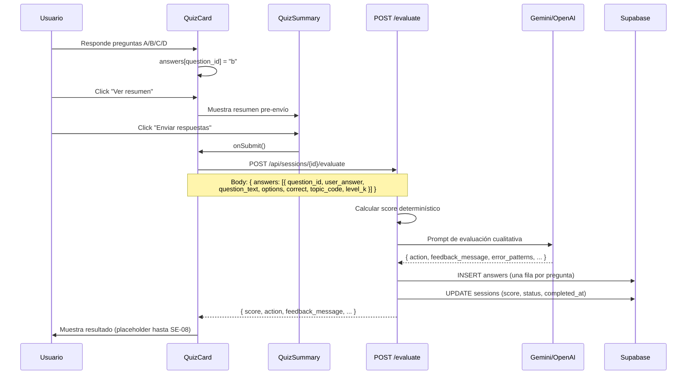
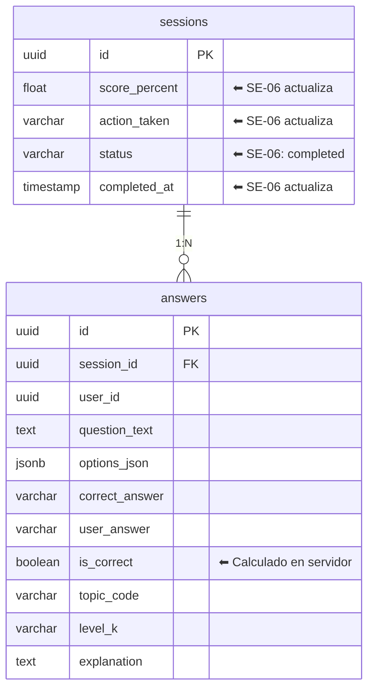

# SE-06 — Envío en conjunto + API Route `/evaluate`

> **Bloque:** 📚 BLOQUE E — Sesión de Estudio
> **Guía anterior:** [SE-05 — UI: QuizCard](file:///c:/Users/jsife/OneDrive/Desktop/Repositorios/practica-testing/docs/guides/fe/SE-05.md)
> **Siguiente guía:** SE-07 — Lógica adaptativa: advance | reinforce | restructure
> **Fecha:** 29 junio 2026

---

## Sección 1: 🎓 Introducción y Fundamentos Conceptuales

### ¿Dónde estamos?

En SE-05 completamos la **interfaz de quiz** — el usuario puede navegar entre preguntas, seleccionar respuestas A/B/C/D, ver un resumen pre-envío y hacer clic en "Enviar respuestas". Pero al hacer clic, solo aparece un `alert()` de placeholder: **las respuestas no van a ningún lado**.

SE-06 cierra ese circuito. Cuando el usuario presiona "Enviar", sus respuestas viajan al servidor, se evalúan, se persisten en la base de datos y el sistema decide qué hacer a continuación.

### La analogía del examen real

Piensa en un examen presencial del ISTQB:

1. **Contestas** todas las preguntas en una hoja de respuestas (SE-05 ✅)
2. **Entregas** la hoja al evaluador (SE-06 — **esta guía**)
3. El evaluador **califica** tu hoja, anota los errores y decide si aprobaste
4. Recibes un **reporte** con tu score y retroalimentación (SE-08)
5. Si no aprobaste, te dan un **plan de refuerzo** (SE-07)

SE-06 construye el paso 2 y la primera parte del paso 3: la infraestructura que recibe las respuestas, calcula el score determinísticamente, pide al LLM un análisis cualitativo, y persiste todo en Supabase.

### Conceptos clave de esta guía

#### 1. Evaluación Híbrida: Determinística + IA

El score numérico (70%) se calcula en el servidor con una simple comparación `user_answer === correct_answer`. **No dependemos del LLM para el número.** Sin embargo, el LLM aporta valor cualitativo:

- **Patrones de error:** "El estudiante confunde consistentemente pruebas estáticas con dinámicas"
- **Acción recomendada:** `advance`, `reinforce` o `restructure`
- **Mensaje de feedback:** Texto natural personalizado para el estudiante
- **Método recomendado:** Sugerir cambiar a `examples` o `analogies` si `theory` no funcionó

#### 2. Route Handler POST con Side Effects

A diferencia de los GET endpoints que solo leen, este POST:
1. **Lee** la sesión y valida que es del usuario autenticado
2. **Calcula** el score
3. **Llama al LLM** para análisis cualitativo
4. **Inserta** filas en la tabla `answers` (una por pregunta)
5. **Actualiza** la tabla `sessions` (score, status, completed_at)

Es una operación transaccional: si falla a mitad del camino, podríamos tener datos inconsistentes. Usaremos un enfoque de **best-effort con logging**, ya que Supabase no soporta transacciones multi-tabla desde el cliente REST.

#### 3. Idempotencia por Estado

Si el usuario de alguna forma envía dos veces, la segunda llamada verificará que `sessions.status === 'completed'` y retornará un error claro. No se puede evaluar una sesión que ya fue evaluada.

---

## Sección 2: 📋 Prerequisitos y Verificación del Entorno

### Herramientas y runtime

| Prerequisito | Comando de verificación | Versión mínima |
|---|---|---|
| Node.js | `node --version` | v18+ |
| npm | `npm --version` | v9+ |
| Next.js corriendo | `npm --prefix frontend run dev` desde la raíz | 16.x actual |
| TypeScript | `npx tsc --version` | 5+ |

### Guías anteriores completadas

| Guía | Entregable requerido | Verificación |
|---|---|---|
| **DB-02** | Tabla `answers` creada en Supabase | Visible en Table Editor |
| **DB-02** | Tabla `sessions` con columnas `score_percent`, `action_taken`, `completed_at` | Visible en Table Editor |
| **SE-04** | API Route `/api/sessions/[id]/quiz` funcional | `POST` retorna quiz con 10-12 preguntas |
| **SE-05** | QuizCard con placeholder `handleSubmit()` | Líneas 216-235 de `quiz-card.tsx` contienen `alert()` |

### Variables de entorno

Verificar que `frontend/.env.local` existe y tiene al menos **una** key de LLM configurada. No imprimas el contenido del archivo porque contiene secretos:

```powershell
# Desde la raíz del repo
Test-Path -LiteralPath "frontend/.env.local"
Select-String -Path "frontend/.env.local" -Pattern "^GEMINI_API_KEY=" -Quiet
Select-String -Path "frontend/.env.local" -Pattern "^OPENAI_API_KEY=" -Quiet
```

**Salida esperada:** el primer comando debe retornar `True` y al menos uno de los dos `Select-String -Quiet` debe retornar `True`.

```
True
True
False
```

> **⚠️ Si no tienes ninguna key de LLM:** La evaluación numérica (score) funcionará, pero el análisis cualitativo (patrones de error, acción recomendada) fallará. El endpoint retornará un fallback sin el análisis del LLM.

---

## Sección 3: 📂 Estructura de Directorios del Proyecto

```
frontend/
├── app/
│   ├── (auth)/
│   │   ├── login/page.tsx
│   │   └── register/page.tsx
│   ├── (dashboard)/
│   │   ├── dashboard/page.tsx
│   │   ├── plan/page.tsx
│   │   ├── session/page.tsx              ← (sin cambios en SE-06)
│   │   ├── setup/page.tsx
│   │   └── layout.tsx
│   ├── api/
│   │   ├── extract/route.ts
│   │   ├── plan/
│   │   │   ├── generate/route.ts
│   │   │   └── save/route.ts
│   │   ├── sessions/
│   │   │   ├── next/route.ts
│   │   │   └── [id]/
│   │   │       ├── route.ts
│   │   │       ├── theory/route.ts
│   │   │       ├── quiz/route.ts
│   │   │       └── evaluate/             ← 🆕 NUEVO en SE-06
│   │   │           └── route.ts          ← 🆕 NUEVO — POST /api/sessions/[id]/evaluate
│   │   ├── upload/route.ts
│   │   └── auth/callback/route.ts
│   ├── globals.css
│   ├── layout.tsx
│   └── page.tsx
├── components/
│   ├── session/
│   │   ├── collapsible-section.tsx
│   │   ├── quiz-card.tsx                 ← ✏️ MODIFICADO en SE-06 (handleSubmit real)
│   │   ├── quiz-navigation.tsx
│   │   ├── quiz-question-view.tsx
│   │   ├── quiz-summary.tsx
│   │   ├── session-timer.tsx
│   │   ├── theory-panel.tsx
│   │   └── theory-topic-view.tsx
│   ├── shared/
│   └── ui/
├── lib/
│   ├── prompts/
│   │   ├── evaluate.ts                   ← 🆕 NUEVO en SE-06
│   │   ├── quiz.ts
│   │   └── theory.ts
│   ├── supabase/
│   │   ├── client.ts
│   │   └── server.ts
│   └── utils.ts
├── types/
│   ├── database.ts
│   ├── evaluate.ts                       ← 🆕 NUEVO en SE-06
│   ├── index.ts                          ← ✏️ MODIFICADO en SE-06
│   ├── quiz.ts
│   ├── sessions.ts
│   └── theory.ts
├── middleware.ts
├── package.json
└── tsconfig.json
```

**Resumen de archivos:**
- 🆕 **3 archivos nuevos:** `types/evaluate.ts`, `lib/prompts/evaluate.ts`, `app/api/sessions/[id]/evaluate/route.ts`
- ✏️ **2 archivos modificados:** `types/index.ts`, `components/session/quiz-card.tsx`

---

## Sección 4: 🎨 Diagrama de Arquitectura de Componentes

### Flujo de Evaluación Completo



### Estructura de Datos



---

## Sección 5: 🛠️ Implementación Paso a Paso

---

### Paso A: Crear tipos de evaluación (`types/evaluate.ts`)

**Archivo:** `frontend/types/evaluate.ts` — 🆕 NUEVO

Estos tipos definen el contrato entre el frontend y el endpoint `/evaluate`.

```typescript
// ============================================================
// types/evaluate.ts — Tipos para la evaluación del quiz
// ============================================================
// Define el contrato entre QuizCard y POST /api/sessions/[id]/evaluate.
//
// FLUJO DE DATOS:
//   QuizCard construye EvaluateRequest con los datos del quiz.
//   El Route Handler responde con EvaluateResponse.
//
// SCORE: Se calcula determinísticamente en el servidor.
//   score = (respuestas_correctas / total) × 100
//   NO depende del LLM — el LLM solo aporta análisis cualitativo.
//
// ACCIÓN: La decide el servidor basándose en el score:
//   score >= 70% → "advance"
//   score 50-69% → "reinforce"
//   score < 50%  → "restructure"
// ============================================================

import type { AnswerOption, LevelK, ActionTaken, OptionsJson } from "./database";

// ──────────────────────────────────────────────────────────────
// Request: Lo que el frontend envía al POST /evaluate
// ──────────────────────────────────────────────────────────────

/**
 * Una respuesta individual del usuario.
 *
 * Contiene tanto los datos de la pregunta (para persistir en `answers`)
 * como la respuesta del usuario. Esto evita que el servidor tenga que
 * re-generar o buscar el quiz — el cliente envía todo lo necesario.
 */
export interface UserAnswer {
  /** Índice de la pregunta en el quiz (0-based) */
  question_id: number;
  /** Respuesta seleccionada por el usuario: "a", "b", "c", o "d" */
  user_answer: AnswerOption;
  /** Texto completo del enunciado de la pregunta */
  question_text: string;
  /** Las 4 opciones de respuesta */
  options: OptionsJson;
  /** La respuesta correcta según el LLM que generó el quiz */
  correct: AnswerOption;
  /** Explicación de por qué la correcta es correcta */
  explanation: string;
  /** Código del tópico ISTQB (ej. "FL-1.1.1") */
  topic_code: string;
  /** Nivel K de la pregunta */
  level_k: LevelK;
}

/**
 * Body del POST /api/sessions/[id]/evaluate.
 *
 * El frontend envía TODAS las respuestas de una sola vez.
 * No se permite envío parcial — esto se valida en el servidor.
 */
export interface EvaluateRequest {
  /** Array completo de respuestas del usuario (una por pregunta) */
  answers: UserAnswer[];
}

// ──────────────────────────────────────────────────────────────
// Response: Lo que el servidor retorna después de evaluar
// ──────────────────────────────────────────────────────────────

/** Tópico que el estudiante falló en el quiz */
export interface FailedTopic {
  /** Código del tópico (ej. "FL-1.1.1") */
  topic_code: string;
  /** Nombre descriptivo del tópico */
  topic_name: string;
  /** Preguntas falladas en este tópico */
  questions_failed: number;
  /** Total de preguntas de este tópico en el quiz */
  questions_total: number;
}

/** Patrón de error identificado por el LLM */
export interface ErrorPattern {
  /** Descripción del patrón (ej. "Confusión entre pruebas estáticas y dinámicas") */
  pattern: string;
  /** Frecuencia estimada: "alta", "media", "baja" */
  frequency: "alta" | "media" | "baja";
  /** Sugerencia de corrección */
  suggestion: string;
}

/**
 * Respuesta completa de la evaluación.
 *
 * Combina datos determinísticos (score, correct_count) con
 * análisis cualitativo del LLM (feedback, error_patterns).
 */
export interface EvaluateResponse {
  // ─── Datos determinísticos (calculados en servidor) ────────
  /** Score como porcentaje entero (0-100) */
  score: number;
  /** Cantidad de respuestas correctas */
  correct_count: number;
  /** Total de preguntas evaluadas */
  total_questions: number;
  /** Acción del sistema adaptativo: advance | reinforce | restructure */
  action: ActionTaken;

  // ─── Análisis cualitativo (generado por LLM) ──────────────
  /** Tópicos donde el estudiante falló */
  failed_topics: FailedTopic[];
  /** Patrones de error identificados por el LLM */
  error_patterns: ErrorPattern[];
  /** Mensaje de feedback personalizado del LLM (texto natural) */
  feedback_message: string;
  /** Método recomendado para la próxima sesión */
  next_method: "theory" | "examples" | "analogies";
  /** Minutos de refuerzo recomendados (0 si advance) */
  reinforcement_minutes: number;

  // ─── Metadatos ────────────────────────────────────────────
  /** Timestamp ISO de la evaluación */
  evaluated_at: string;
}
```

**Entregable:** Archivo `frontend/types/evaluate.ts` creado con `UserAnswer`, `EvaluateRequest`, `EvaluateResponse`, `FailedTopic` y `ErrorPattern`.

---

### Paso B: Actualizar barrel de tipos (`types/index.ts`)

**Archivo:** `frontend/types/index.ts` — ✏️ MODIFICAR

Agregar la re-exportación de los nuevos tipos de evaluación **al final del archivo**, manteniendo todo lo existente:

```typescript
// 🆕 SE-06: Re-exportar tipos de evaluación
export type {
  UserAnswer,
  EvaluateRequest,
  EvaluateResponse,
  FailedTopic,
  ErrorPattern,
} from "./evaluate";
```

> **Importante:** NO borres ninguna exportación existente. Solo agrega estas líneas después de la línea que re-exporta los tipos de quiz.

**Entregable:** `frontend/types/index.ts` modificado con las re-exportaciones de `evaluate.ts`.

---

### Paso C: Crear el prompt de evaluación (`lib/prompts/evaluate.ts`)

**Archivo:** `frontend/lib/prompts/evaluate.ts` — 🆕 NUEVO

Este archivo sigue el mismo patrón de `lib/prompts/quiz.ts`: exporta funciones `buildXxxSystemPrompt()` y `buildXxxUserPrompt()` que construyen los prompts para el LLM.

```typescript
// ============================================================
// lib/prompts/evaluate.ts — Prompt Builder para evaluación
// ============================================================
// Construye los prompts (system + user) para que el LLM analice
// las respuestas del estudiante y genere feedback cualitativo.
//
// IMPORTANTE: El score numérico NO lo calcula el LLM.
// El LLM solo analiza patrones de error y genera feedback.
//
// ¿POR QUÉ USAR UN LLM PARA EVALUAR?
//   El score es determinístico (comparación directa), pero el
//   valor pedagógico está en el análisis:
//     - ¿Qué conceptos confunde el estudiante?
//     - ¿Hay un patrón en los errores?
//     - ¿Qué método de estudio funcionaría mejor?
//   Estas preguntas requieren comprensión de lenguaje natural.
// ============================================================

import type { UserAnswer } from "@/types/evaluate";
import type { MethodUsed } from "@/types";

// ──────────────────────────────────────────────────────────────
// System Prompt
// ──────────────────────────────────────────────────────────────

/**
 * Construye el system prompt para la evaluación del quiz.
 *
 * Define el rol del LLM como evaluador pedagógico y especifica
 * el formato JSON exacto de la respuesta esperada.
 */
export function buildEvaluateSystemPrompt(): string {
  return `Eres un evaluador pedagógico experto en el ISTQB Foundation Level (CTFL v4.0).
Tu tarea es analizar las respuestas de un estudiante a un quiz de práctica y proporcionar retroalimentación educativa.

Todo el contenido DEBE estar en **español**.

## TU ROL

NO calculas el score — eso ya lo hace el servidor.
Tu trabajo es:
1. Identificar PATRONES de error (no listar cada error individual)
2. Determinar la ACCIÓN recomendada basada en el score que te proporcionan
3. Escribir un mensaje de FEEDBACK motivador y constructivo
4. Recomendar el MÉTODO de estudio más efectivo para el siguiente intento

## FORMATO DE SALIDA

Responde ÚNICAMENTE con un objeto JSON válido con esta estructura EXACTA:

{
  "error_patterns": [
    {
      "pattern": "Descripción del patrón de error",
      "frequency": "alta",
      "suggestion": "Sugerencia específica para corregirlo"
    }
  ],
  "feedback_message": "Mensaje motivador y constructivo para el estudiante (2-4 oraciones)",
  "next_method": "theory",
  "reinforcement_minutes": 15
}

## REGLAS PARA error_patterns

1. Identifica entre 1 y 5 patrones de error (NO uno por pregunta fallada)
2. Agrupa errores similares en un solo patrón
3. "frequency" puede ser: "alta" (3+ errores del mismo tipo), "media" (2 errores), "baja" (1 error)
4. La "suggestion" debe ser accionable y específica — no genérica
5. Si el estudiante NO tuvo errores (score 100%), retorna un array vacío []

## REGLAS PARA feedback_message

1. SIEMPRE empezar con el resultado positivo (qué hizo bien)
2. Si score >= 70%: tono celebratorio, mencionar que avanza al siguiente tópico
3. Si score 50-69%: tono de apoyo, mencionar que con un refuerzo corto lo logrará
4. Si score < 50%: tono constructivo sin ser condescendiente, enfocarse en oportunidades de mejora
5. Máximo 4 oraciones. NO usar emojis.

## REGLAS PARA next_method

Recomendar basado en el método actual y los patrones de error:
- Si el método actual fue "theory" y falló → sugerir "examples" (casos prácticos pueden ayudar)
- Si el método actual fue "examples" y falló → sugerir "analogies" (diferentes perspectivas)
- Si el método actual fue "analogies" y falló → sugerir "theory" (volver a los fundamentos)
- Si aprobó (score >= 70%) → mantener el método actual

## REGLAS PARA reinforcement_minutes

- score >= 70% → 0 (no necesita refuerzo)
- score 50-69% → 15 (refuerzo ligero)
- score < 50% → 30 (refuerzo intensivo)

## RESTRICCIONES CRÍTICAS

1. **JSON puro**: NO incluyas texto antes ni después del JSON. NO uses bloques de código markdown.
2. **Español**: TODO el contenido debe estar en español.
3. **No inventar datos**: Solo analiza las respuestas que se te proporcionan.
4. **Consistencia con el score**: Tu feedback_message debe reflejar el score real.`;
}

// ──────────────────────────────────────────────────────────────
// User Prompt
// ──────────────────────────────────────────────────────────────

/**
 * Construye el user prompt con los datos específicos de la evaluación.
 *
 * @param answers - Array de respuestas del usuario con datos de las preguntas
 * @param score - Score calculado determinísticamente (0-100)
 * @param correctCount - Cantidad de respuestas correctas
 * @param totalQuestions - Total de preguntas
 * @param currentMethod - Método de enseñanza usado en esta sesión
 * @param attemptNumber - Número de intento (1 = primer intento)
 */
export function buildEvaluateUserPrompt(
  answers: UserAnswer[],
  score: number,
  correctCount: number,
  totalQuestions: number,
  currentMethod: MethodUsed,
  attemptNumber: number,
): string {
  // ─── Construir resumen de respuestas ──────────────────────
  const answersDetail = answers
    .map((a, i) => {
      const isCorrect = a.user_answer === a.correct;
      const mark = isCorrect ? "✅ CORRECTA" : "❌ INCORRECTA";

      // Solo incluir detalle completo para las incorrectas
      // (las correctas no necesitan análisis)
      if (isCorrect) {
        return `${i + 1}. [${mark}] ${a.topic_code} (${a.level_k}) — Pregunta respondida correctamente`;
      }

      return `${i + 1}. [${mark}] ${a.topic_code} (${a.level_k})
   Pregunta: ${a.question_text.slice(0, 200)}...
   Respondió: "${a.user_answer}" — ${a.options[a.user_answer]}
   Correcta: "${a.correct}" — ${a.options[a.correct]}
   Explicación: ${a.explanation}`;
    })
    .join("\n\n");

  return `## RESULTADO DEL QUIZ

- **Score:** ${score}% (${correctCount} de ${totalQuestions} correctas)
- **Método de estudio actual:** ${currentMethod}
- **Número de intento:** ${attemptNumber}

## DETALLE DE RESPUESTAS

${answersDetail}

## INSTRUCCIÓN

Analiza las respuestas incorrectas, identifica patrones de error, y genera el JSON de feedback.
Si todas las respuestas son correctas, retorna un feedback celebratorio con error_patterns vacío.`;
}
```

**Entregable:** Archivo `frontend/lib/prompts/evaluate.ts` creado con `buildEvaluateSystemPrompt()` y `buildEvaluateUserPrompt()`.

---

### Paso D: Crear el Route Handler (`app/api/sessions/[id]/evaluate/route.ts`)

**Archivo:** `frontend/app/api/sessions/[id]/evaluate/route.ts` — 🆕 NUEVO

Este es el archivo más largo y complejo de la guía. Lee cada sección con atención.

```typescript
// ─────────────────────────────────────────────────────────────────
// app/api/sessions/[id]/evaluate/route.ts
// Route Handler: evalúa las respuestas del quiz de una sesión.
//
// Método: POST
// Auth: Requiere sesión válida (cookie JWT de Supabase)
// Params: id — UUID de la sesión
// Body: { answers: UserAnswer[] }
//
// Response (200): EvaluateResponse
// Response (401): { error: "No autenticado" }
// Response (400): { error: "Descripción del problema" }
// Response (404): { error: "Sesión no encontrada" }
// Response (409): { error: "Sesión ya evaluada" }
// Response (500): { error: "Error interno del servidor" }
//
// FLUJO:
//   1. Autenticar usuario
//   2. Validar UUID y estado de la sesión (no completada)
//   3. Validar body (array de respuestas completo)
//   4. Calcular score determinísticamente
//   5. Llamar al LLM para análisis cualitativo (best-effort)
//   6. Insertar respuestas en tabla answers
//   7. Actualizar sesión: score, status, completed_at, action_taken
//   8. Retornar EvaluateResponse
//
// IDEMPOTENCIA:
//   Si la sesión ya tiene status = 'completed', se rechaza con 409.
//   Esto previene doble evaluación accidental.
// ─────────────────────────────────────────────────────────────────

import { NextResponse } from "next/server";
import OpenAI from "openai";
import { createClient } from "@/lib/supabase/server";
import {
  buildEvaluateSystemPrompt,
  buildEvaluateUserPrompt,
} from "@/lib/prompts/evaluate";
import type { AnswerOption, LevelK, ActionTaken, MethodUsed } from "@/types";
import type {
  UserAnswer,
  EvaluateResponse,
  FailedTopic,
  ErrorPattern,
} from "@/types/evaluate";

// ─── Forzar Node.js runtime ─────────────────────────────────────
export const runtime = "nodejs";

// ─── Constantes ──────────────────────────────────────────────────
const GEMINI_OPENAI_BASE_URL =
  "https://generativelanguage.googleapis.com/v1beta/openai";

const UUID_REGEX =
  /^[0-9a-f]{8}-[0-9a-f]{4}-[0-9a-f]{4}-[0-9a-f]{4}-[0-9a-f]{12}$/i;

const EVALUATE_TIMEOUT_MS = 45_000; // 45 segundos (menos que quiz)
const EVALUATE_TIMEOUT_BUFFER_MS = 15_000;

const VALID_OPTIONS: AnswerOption[] = ["a", "b", "c", "d"];
const VALID_LEVELS: LevelK[] = ["K1", "K2", "K3"];

// ─── Umbrales del sistema adaptativo ─────────────────────────────
// Estos valores definen las acciones del sistema.
// Se centralizan aquí para que SE-07 pueda importarlos si es necesario.
const ADVANCE_THRESHOLD = 70; // score >= 70% → advance
const REINFORCE_THRESHOLD = 50; // score 50-69% → reinforce
// score < 50% → restructure

// ──────────────────────────────────────────────────────────────
// Multi-Provider LLM (mismo patrón de SE-02/SE-04)
// ──────────────────────────────────────────────────────────────

interface EvaluateModelRuntime {
  provider: string;
  model: string;
  client: OpenAI;
  timeoutMs: number;
}

/**
 * Crea el runtime del modelo LLM para evaluación.
 *
 * Mismo patrón de SE-02 (theory) y SE-04 (quiz):
 *   1. GEMINI_API_KEY → Gemini 2.5 Flash (default)
 *   2. OPENAI_API_KEY → gpt-4o-mini (fallback)
 *   3. Si ninguna key → retorna null (evaluación sin LLM)
 */
function createEvaluateModelRuntime(): EvaluateModelRuntime | null {
  const geminiKey = process.env.GEMINI_API_KEY;
  if (geminiKey) {
    return {
      provider: "gemini",
      model: "gemini-2.5-flash",
      timeoutMs: EVALUATE_TIMEOUT_MS,
      client: new OpenAI({
        apiKey: geminiKey,
        baseURL:
          process.env.GEMINI_OPENAI_BASE_URL || GEMINI_OPENAI_BASE_URL,
        timeout: EVALUATE_TIMEOUT_MS + EVALUATE_TIMEOUT_BUFFER_MS,
        maxRetries: 1, // Menos reintentos — la evaluación no es crítica
      }),
    };
  }

  const openaiKey = process.env.OPENAI_API_KEY;
  if (openaiKey) {
    return {
      provider: "openai",
      model: "gpt-4o-mini",
      timeoutMs: EVALUATE_TIMEOUT_MS,
      client: new OpenAI({
        apiKey: openaiKey,
        timeout: EVALUATE_TIMEOUT_MS + EVALUATE_TIMEOUT_BUFFER_MS,
        maxRetries: 1,
      }),
    };
  }

  // No hay LLM configurado — la evaluación funcionará sin análisis
  // cualitativo. El score y la acción se calculan determinísticamente.
  return null;
}

// ──────────────────────────────────────────────────────────────
// Helpers
// ──────────────────────────────────────────────────────────────

/**
 * Determina la acción del sistema adaptativo basándose en el score.
 */
function determineAction(score: number): ActionTaken {
  if (score >= ADVANCE_THRESHOLD) return "advance";
  if (score >= REINFORCE_THRESHOLD) return "reinforce";
  return "restructure";
}

/**
 * Calcula los tópicos fallidos agrupados por topic_code.
 */
function calculateFailedTopics(
  answers: UserAnswer[],
  topicNames: Map<string, string>,
): FailedTopic[] {
  // Agrupar por topic_code
  const topicStats = new Map<
    string,
    { failed: number; total: number }
  >();

  for (const answer of answers) {
    const stats = topicStats.get(answer.topic_code) || {
      failed: 0,
      total: 0,
    };
    stats.total++;
    if (answer.user_answer !== answer.correct) {
      stats.failed++;
    }
    topicStats.set(answer.topic_code, stats);
  }

  // Solo retornar tópicos con al menos 1 fallo
  const failedTopics: FailedTopic[] = [];
  for (const [code, stats] of topicStats) {
    if (stats.failed > 0) {
      failedTopics.push({
        topic_code: code,
        topic_name: topicNames.get(code) || code,
        questions_failed: stats.failed,
        questions_total: stats.total,
      });
    }
  }

  return failedTopics;
}

/**
 * Parsea la respuesta del LLM de evaluación.
 * Maneja JSON envuelto en bloques de código markdown.
 */
function parseEvaluateResponse(rawContent: string): {
  error_patterns: ErrorPattern[];
  feedback_message: string;
  next_method: MethodUsed;
  reinforcement_minutes: number;
} | null {
  try {
    // Intentar parsear directamente
    let content = rawContent.trim();

    // Remover bloques de código markdown si el LLM los incluyó
    if (content.startsWith("```")) {
      const lines = content.split("\n");
      // Remover primera línea (```json) y última (```)
      const startIndex = lines[0].includes("json") ? 1 : 1;
      const endIndex = lines[lines.length - 1] === "```"
        ? lines.length - 1
        : lines.length;
      content = lines.slice(startIndex, endIndex).join("\n");
    }

    const parsed = JSON.parse(content);

    // Validar campos obligatorios
    if (!parsed.feedback_message || typeof parsed.feedback_message !== "string") {
      console.error("[evaluate] feedback_message faltante o inválido");
      return null;
    }

    // Validar error_patterns
    const errorPatterns: ErrorPattern[] = [];
    if (Array.isArray(parsed.error_patterns)) {
      for (const ep of parsed.error_patterns) {
        if (ep.pattern && ep.frequency && ep.suggestion) {
          errorPatterns.push({
            pattern: String(ep.pattern),
            frequency: ["alta", "media", "baja"].includes(ep.frequency)
              ? ep.frequency
              : "media",
            suggestion: String(ep.suggestion),
          });
        }
      }
    }

    // Validar next_method
    const validMethods: MethodUsed[] = ["theory", "examples", "analogies"];
    const nextMethod = validMethods.includes(parsed.next_method)
      ? parsed.next_method
      : "theory";

    // Validar reinforcement_minutes
    const reinforcementMinutes =
      typeof parsed.reinforcement_minutes === "number" &&
      parsed.reinforcement_minutes >= 0
        ? Math.round(parsed.reinforcement_minutes)
        : 0;

    return {
      error_patterns: errorPatterns,
      feedback_message: parsed.feedback_message,
      next_method: nextMethod,
      reinforcement_minutes: reinforcementMinutes,
    };
  } catch (err) {
    console.error("[evaluate] Error parseando respuesta del LLM:", err);
    return null;
  }
}

// ──────────────────────────────────────────────────────────────
// POST /api/sessions/[id]/evaluate
// ──────────────────────────────────────────────────────────────

export async function POST(
  request: Request,
  { params }: { params: Promise<{ id: string }> },
) {
  const startTime = Date.now();

  try {
    // ═════════════════════════════════════════════════════════
    // 1. AUTENTICACIÓN
    // ═════════════════════════════════════════════════════════
    const supabase = await createClient();
    const {
      data: { user },
    } = await supabase.auth.getUser();

    if (!user) {
      return NextResponse.json({ error: "No autenticado" }, { status: 401 });
    }

    // ═════════════════════════════════════════════════════════
    // 2. VALIDAR UUID
    // ═════════════════════════════════════════════════════════
    const { id: sessionId } = await params;

    if (!sessionId || !UUID_REGEX.test(sessionId)) {
      return NextResponse.json(
        { error: "ID de sesión inválido. Debe ser un UUID válido." },
        { status: 400 },
      );
    }

    // ═════════════════════════════════════════════════════════
    // 3. CARGAR Y VALIDAR SESIÓN
    // ═════════════════════════════════════════════════════════
    const { data: session, error: sessionError } = await supabase
      .from("sessions")
      .select("*")
      .eq("id", sessionId)
      .eq("user_id", user.id)
      .maybeSingle();

    if (sessionError || !session) {
      return NextResponse.json(
        { error: "Sesión no encontrada o no pertenece al usuario." },
        { status: 404 },
      );
    }

    // Validar que la sesión NO esté ya completada (idempotencia)
    if (session.status === "completed") {
      return NextResponse.json(
        {
          error:
            "Esta sesión ya fue evaluada. No se puede evaluar dos veces.",
        },
        { status: 409 },
      );
    }

    // Cargar el plan en una query separada. Esto evita depender de
    // inferencia de relaciones en los tipos generados de Supabase.
    const { data: plan } = await supabase
      .from("study_plans")
      .select("id, document_id")
      .eq("id", session.study_plan_id)
      .eq("user_id", user.id)
      .maybeSingle();

    if (!plan) {
      return NextResponse.json(
        { error: "No se encontró el plan asociado a esta sesión." },
        { status: 404 },
      );
    }

    // Defensa adicional contra duplicados: si por un fallo parcial
    // quedaron respuestas guardadas pero la sesión no quedó completed,
    // no insertamos otra tanda de answers.
    const { count: existingAnswersCount } = await supabase
      .from("answers")
      .select("id", { count: "exact", head: true })
      .eq("session_id", sessionId)
      .eq("user_id", user.id);

    if ((existingAnswersCount || 0) > 0) {
      return NextResponse.json(
        {
          error:
            "Esta sesión ya tiene respuestas guardadas. No se puede evaluar dos veces.",
        },
        { status: 409 },
      );
    }

    // ═════════════════════════════════════════════════════════
    // 4. VALIDAR BODY
    // ═════════════════════════════════════════════════════════
    let body: { answers?: unknown };
    try {
      body = await request.json();
    } catch {
      return NextResponse.json(
        { error: "Body inválido. Se esperaba JSON." },
        { status: 400 },
      );
    }

    if (!body.answers || !Array.isArray(body.answers)) {
      return NextResponse.json(
        { error: "Campo 'answers' requerido como array." },
        { status: 400 },
      );
    }

    const userAnswers = body.answers as UserAnswer[];

    // Validar cantidad esperada. SE-04 genera 10-12 preguntas;
    // aceptar menos permitiría envíos parciales por bypass de UI.
    if (userAnswers.length < 10 || userAnswers.length > 12) {
      return NextResponse.json(
        { error: "El quiz debe enviar entre 10 y 12 respuestas completas." },
        { status: 400 },
      );
    }

    const seenQuestionIds = new Set<number>();

    // Validar cada respuesta individualmente
    for (let i = 0; i < userAnswers.length; i++) {
      const a = userAnswers[i];

      if (typeof a.question_id !== "number" || a.question_id < 0) {
        return NextResponse.json(
          { error: `Respuesta ${i}: question_id debe ser un número válido.` },
          { status: 400 },
        );
      }

      if (seenQuestionIds.has(a.question_id)) {
        return NextResponse.json(
          { error: `Respuesta ${i}: question_id duplicado (${a.question_id}).` },
          { status: 400 },
        );
      }
      seenQuestionIds.add(a.question_id);

      if (!a.question_text || typeof a.question_text !== "string") {
        return NextResponse.json(
          { error: `Respuesta ${i}: question_text es requerido.` },
          { status: 400 },
        );
      }

      if (!a.options || typeof a.options !== "object") {
        return NextResponse.json(
          { error: `Respuesta ${i}: options es requerido.` },
          { status: 400 },
        );
      }

      for (const option of VALID_OPTIONS) {
        if (!a.options[option] || typeof a.options[option] !== "string") {
          return NextResponse.json(
            { error: `Respuesta ${i}: opción "${option}" falta o es inválida.` },
            { status: 400 },
          );
        }
      }

      if (!VALID_OPTIONS.includes(a.user_answer)) {
        return NextResponse.json(
          {
            error: `Respuesta ${i}: user_answer debe ser "a", "b", "c" o "d". Recibido: "${a.user_answer}"`,
          },
          { status: 400 },
        );
      }

      if (!VALID_OPTIONS.includes(a.correct)) {
        return NextResponse.json(
          {
            error: `Respuesta ${i}: correct debe ser "a", "b", "c" o "d". Recibido: "${a.correct}"`,
          },
          { status: 400 },
        );
      }

      if (!VALID_LEVELS.includes(a.level_k)) {
        return NextResponse.json(
          {
            error: `Respuesta ${i}: level_k debe ser K1, K2 o K3. Recibido: "${a.level_k}"`,
          },
          { status: 400 },
        );
      }

      if (!a.topic_code || typeof a.topic_code !== "string") {
        return NextResponse.json(
          { error: `Respuesta ${i}: topic_code es requerido.` },
          { status: 400 },
        );
      }
    }

    // ═════════════════════════════════════════════════════════
    // 5. CALCULAR SCORE (DETERMINÍSTICO)
    // ═════════════════════════════════════════════════════════
    // El score es una simple proporción. NO depende del LLM.
    let correctCount = 0;
    for (const answer of userAnswers) {
      if (answer.user_answer === answer.correct) {
        correctCount++;
      }
    }

    const totalQuestions = userAnswers.length;
    // Math.round para evitar decimales (70.5 → 71, no 70.500...)
    const score = Math.round((correctCount / totalQuestions) * 100);
    const action = determineAction(score);

    console.log(
      `[evaluate] Sesión ${sessionId}: ${correctCount}/${totalQuestions} = ${score}% → ${action}`,
    );

    // ═════════════════════════════════════════════════════════
    // 6. OBTENER NOMBRES DE TÓPICOS (para failed_topics)
    // ═════════════════════════════════════════════════════════
    // Necesitamos los nombres legibles de los tópicos para el response.
    // Los obtenemos de documents.topics_json.
    const topicNames = new Map<string, string>();

    const { data: doc } = await supabase
      .from("documents")
      .select("topics_json")
      .eq("id", plan.document_id)
      .eq("user_id", user.id)
      .maybeSingle();

    if (doc?.topics_json) {
      const topicsJson = doc.topics_json as Record<
        string,
        { name?: string; text?: string; level_k?: string }
      >;
      for (const [code, entry] of Object.entries(topicsJson)) {
        topicNames.set(code, entry.name || code);
      }
    }

    const failedTopics = calculateFailedTopics(userAnswers, topicNames);

    // ═════════════════════════════════════════════════════════
    // 7. ANÁLISIS CUALITATIVO CON LLM (BEST-EFFORT)
    // ═════════════════════════════════════════════════════════
    // Si el LLM falla o no hay key configurada, usamos fallbacks.
    let errorPatterns: ErrorPattern[] = [];
    let feedbackMessage = "";
    let nextMethod: MethodUsed = session.method_used as MethodUsed;
    let reinforcementMinutes = 0;

    const llm = createEvaluateModelRuntime();

    if (llm) {
      try {
        console.log(
          `[evaluate] Llamando a ${llm.provider}/${llm.model} para análisis cualitativo...`,
        );

        const systemPrompt = buildEvaluateSystemPrompt();
        const userPrompt = buildEvaluateUserPrompt(
          userAnswers,
          score,
          correctCount,
          totalQuestions,
          session.method_used as MethodUsed,
          session.attempt_number || 1,
        );

        const completion = await llm.client.chat.completions.create({
          model: llm.model,
          messages: [
            { role: "system", content: systemPrompt },
            { role: "user", content: userPrompt },
          ],
          response_format: { type: "json_object" },
          temperature: 0.4, // Baja — queremos análisis consistente, no creativo
          max_tokens: 2000,
        });

        const rawContent = completion.choices?.[0]?.message?.content;

        if (rawContent) {
          const parsed = parseEvaluateResponse(rawContent);

          if (parsed) {
            errorPatterns = parsed.error_patterns;
            feedbackMessage = parsed.feedback_message;
            nextMethod = parsed.next_method;
            reinforcementMinutes = parsed.reinforcement_minutes;
            console.log(
              `[evaluate] LLM retornó: ${errorPatterns.length} patrones, método=${nextMethod}, refuerzo=${reinforcementMinutes}min`,
            );
          } else {
            console.warn(
              "[evaluate] No se pudo parsear la respuesta del LLM. Usando fallback.",
            );
          }
        }
      } catch (llmError) {
        // El LLM falló — no es crítico, seguimos con fallbacks
        console.error("[evaluate] Error del LLM (no crítico):", llmError);
      }
    } else {
      console.log(
        "[evaluate] Sin LLM configurado. Usando evaluación determinística pura.",
      );
    }

    // ─── Fallback si el LLM no generó feedback ──────────────
    if (!feedbackMessage) {
      if (score >= ADVANCE_THRESHOLD) {
        feedbackMessage = `Obtuviste ${score}% (${correctCount} de ${totalQuestions} correctas). Has demostrado un buen dominio de los conceptos evaluados. Continúa con el siguiente tópico de tu plan de estudio.`;
      } else if (score >= REINFORCE_THRESHOLD) {
        feedbackMessage = `Obtuviste ${score}% (${correctCount} de ${totalQuestions} correctas). Estás cerca del umbral de aprobación. Una sesión de refuerzo corta te ayudará a consolidar los conceptos que necesitan más trabajo.`;
      } else {
        feedbackMessage = `Obtuviste ${score}% (${correctCount} de ${totalQuestions} correctas). Algunos conceptos necesitan más trabajo. Te recomendamos revisar los tópicos con un enfoque diferente para fortalecer tu comprensión.`;
      }
    }

    // Fallback reinforcement_minutes basado en score
    if (reinforcementMinutes === 0 && score < ADVANCE_THRESHOLD) {
      reinforcementMinutes = score >= REINFORCE_THRESHOLD ? 15 : 30;
    }

    // ═════════════════════════════════════════════════════════
    // 8. PERSISTIR EN SUPABASE
    // ═════════════════════════════════════════════════════════

    // ─── 8a. Insertar respuestas en tabla answers ───────────
    // Construimos el array de inserts siguiendo el tipo AnswerInsert
    // de database.ts. Cada pregunta → una fila en answers.
    const answerInserts = userAnswers.map((a) => ({
      session_id: sessionId,
      user_id: user.id,
      question_text: a.question_text,
      options_json: a.options,
      correct_answer: a.correct,
      user_answer: a.user_answer,
      is_correct: a.user_answer === a.correct,
      topic_code: a.topic_code,
      level_k: a.level_k || null,
      explanation: a.explanation || null,
    }));

    const { error: insertError } = await supabase
      .from("answers")
      .insert(answerInserts);

    if (insertError) {
      console.error("[evaluate] Error insertando answers:", insertError);
      return NextResponse.json(
        {
          error:
            "Error al guardar las respuestas. Intenta de nuevo.",
        },
        { status: 500 },
      );
    }

    console.log(
      `[evaluate] ${answerInserts.length} respuestas insertadas en answers`,
    );

    // ─── 8b. Actualizar sesión ──────────────────────────────
    const { error: updateError } = await supabase
      .from("sessions")
      .update({
        score_percent: score,
        action_taken: action,
        status: "completed" as const,
        completed_at: new Date().toISOString(),
      })
      .eq("id", sessionId)
      .eq("user_id", user.id);

    if (updateError) {
      console.error("[evaluate] Error actualizando sesión:", updateError);
      // Las respuestas YA se guardaron. El error de update es menos
      // grave — el usuario puede reintentar o un admin puede corregir.
      // Logueamos pero no fallamos por completo.
      console.warn(
        "[evaluate] ADVERTENCIA: Respuestas guardadas pero sesión no actualizada.",
      );
    } else {
      console.log(
        `[evaluate] Sesión ${sessionId} actualizada: status=completed, score=${score}%, action=${action}`,
      );
    }

    // ═════════════════════════════════════════════════════════
    // 9. CONSTRUIR Y RETORNAR RESPONSE
    // ═════════════════════════════════════════════════════════
    const response: EvaluateResponse = {
      score,
      correct_count: correctCount,
      total_questions: totalQuestions,
      action,
      failed_topics: failedTopics,
      error_patterns: errorPatterns,
      feedback_message: feedbackMessage,
      next_method: nextMethod,
      reinforcement_minutes: reinforcementMinutes,
      evaluated_at: new Date().toISOString(),
    };

    const elapsed = Date.now() - startTime;
    console.log(`[evaluate] Completado en ${elapsed}ms`);

    return NextResponse.json(response, { status: 200 });
  } catch (error) {
    console.error("[evaluate] Error inesperado:", error);
    return NextResponse.json(
      { error: "Error interno del servidor." },
      { status: 500 },
    );
  }
}
```

**Entregable:** Archivo `frontend/app/api/sessions/[id]/evaluate/route.ts` creado con el Route Handler POST completo.

---

### Paso E: Modificar QuizCard (`components/session/quiz-card.tsx`)

**Archivo:** `frontend/components/session/quiz-card.tsx` — ✏️ MODIFICAR

Reemplazar la función `handleSubmit()` (placeholder con `alert()`) por la implementación real que:
1. Construye el array de `UserAnswer[]`
2. Hace POST a `/api/sessions/[id]/evaluate`
3. Maneja la respuesta (por ahora con `alert()` informativo — el `FeedbackPanel` se crea en SE-08)

#### E.1: Agregar import del tipo `UserAnswer`

En la sección de imports (línea ~57), agrega:

```typescript
import type { UserAnswer, EvaluateResponse } from "@/types/evaluate";
```

#### E.2: Agregar estado para la respuesta de evaluación

Después del estado `timerActive` (línea 112), agrega un nuevo estado:

```typescript
  const [evaluationResult, setEvaluationResult] = useState<EvaluateResponse | null>(null);
```

También resetea este estado en los dos lugares donde SE-05 ya resetea el quiz:

```typescript
// Dentro de loadQuiz(), junto a setTimerActive(false)
setEvaluationResult(null);

// Dentro de handleRetry(), junto a setTimerActive(false)
setEvaluationResult(null);
```

#### E.3: Reemplazar `handleSubmit()`

Localiza la función `handleSubmit()` (líneas 216-235 aproximadamente). Reemplaza **toda la función** por esta implementación:

```typescript
  // ── Enviar respuestas a /api/sessions/[id]/evaluate ───────
  // Construye el array de UserAnswer combinando las respuestas
  // del usuario (answers) con los datos de cada pregunta
  // (quizContent.questions). Luego hace POST al endpoint.
  async function handleSubmit() {
    const total = quizContent?.questions.length || 0;
    const answered = Object.keys(answers).length;

    if (!quizContent || total === 0 || answered !== total || submitting) {
      return;
    }

    setSubmitting(true);

    try {
      // ── Paso 1: Construir UserAnswer[] ──────────────────────
      // Combinamos los datos de cada pregunta con la respuesta
      // seleccionada por el usuario.
      const userAnswers: UserAnswer[] = quizContent.questions.map((q) => {
        const selectedAnswer = answers[q.question_id];

        if (!selectedAnswer) {
          throw new Error(`Falta respuesta para la pregunta ${q.question_id + 1}`);
        }

        return {
          question_id: q.question_id,
          user_answer: selectedAnswer,
          question_text: q.question,
          options: q.options,
          correct: q.correct,
          explanation: q.explanation,
          topic_code: q.topic_code,
          level_k: q.level_k,
        };
      });

      // ── Paso 2: POST a /api/sessions/[id]/evaluate ──────────
      const response = await fetch(
        `/api/sessions/${sessionData.id}/evaluate`,
        {
          method: "POST",
          headers: { "Content-Type": "application/json" },
          body: JSON.stringify({ answers: userAnswers }),
        },
      );

      if (!response.ok) {
        const data = await response.json().catch(() => ({}));
        throw new Error(
          data.error || `Error ${response.status} al evaluar quiz`,
        );
      }

      const result: EvaluateResponse = await response.json();

      // ── Paso 3: Guardar resultado ───────────────────────────
      setEvaluationResult(result);
      setTimerActive(false);
      setShowSummary(false);

      // TODO SE-08: Reemplazar este alert por <FeedbackPanel>
      // Por ahora mostramos un resumen en alert para verificar
      // que el endpoint funciona correctamente.
      const actionLabels: Record<string, string> = {
        advance: "✅ Avanzas al siguiente tópico",
        reinforce: "⚠️ Sesión de refuerzo recomendada",
        restructure: "🔄 Reestructuración del plan necesaria",
      };

      alert(
        `📊 Resultado de la evaluación\n\n` +
          `Score: ${result.score}% (${result.correct_count}/${result.total_questions})\n` +
          `Decisión: ${actionLabels[result.action] || result.action}\n\n` +
          `${result.feedback_message}\n\n` +
          `El FeedbackPanel visual se implementará en SE-08.`,
      );
    } catch (err) {
      alert(
        `❌ Error al evaluar: ${err instanceof Error ? err.message : "Error desconocido"}`,
      );
    } finally {
      setSubmitting(false);
    }
  }
```

#### E.4: Ocultar el quiz después de evaluar

Para prevenir que el usuario siga interactuando con el quiz después de evaluar, actualiza las condiciones de render para que `QuizQuestionView`, `QuizNavigation`, `QuizSummary` y la barra de acciones solo aparezcan cuando `!evaluationResult`.

**Antes:**

```typescript
      {quizContent && !showSummary && currentQuestion && (

      {quizContent && showSummary && (

      {quizContent && !showSummary && (
```

**Después:**

```typescript
      {quizContent && !evaluationResult && !showSummary && currentQuestion && (

      {quizContent && !evaluationResult && showSummary && (

      {quizContent && !evaluationResult && !showSummary && (
```

Después de actualizar esas condiciones, agrega este bloque condicional debajo del bloque de `QuizSummary`:

```typescript
      {/* ═══════════════════════════════════════════════════════ */}
      {/* ESTADO: Evaluación completada (placeholder hasta SE-08) */}
      {/* ═══════════════════════════════════════════════════════ */}
      {evaluationResult && (
        <section className="rounded-2xl border border-emerald-500/30 bg-emerald-950/20 p-6">
          <div className="flex flex-col items-center gap-4 text-center">
            <div className="flex h-16 w-16 items-center justify-center rounded-full bg-emerald-500/20">
              <span className="text-2xl">
                {evaluationResult.action === "advance"
                  ? "✅"
                  : evaluationResult.action === "reinforce"
                    ? "⚠️"
                    : "🔄"}
              </span>
            </div>
            <div>
              <p className="text-3xl font-bold text-white">
                {evaluationResult.score}%
              </p>
              <p className="mt-1 text-sm text-slate-400">
                {evaluationResult.correct_count} de{" "}
                {evaluationResult.total_questions} correctas
              </p>
            </div>
            <p className="max-w-md text-sm leading-6 text-slate-300">
              {evaluationResult.feedback_message}
            </p>
            <div className="flex gap-3 mt-2">
              <button
                type="button"
                onClick={() => router.push("/plan")}
                className="inline-flex h-10 items-center justify-center gap-2 rounded-lg border border-slate-700 px-5 text-sm font-medium text-slate-200 transition-colors hover:bg-slate-800"
              >
                Ver mi plan
              </button>
              <button
                type="button"
                onClick={() => router.push("/session")}
                className="inline-flex h-10 items-center justify-center gap-2 rounded-lg bg-emerald-500 px-5 text-sm font-semibold text-slate-950 transition-colors hover:bg-emerald-400"
              >
                Siguiente sesión
              </button>
            </div>
          </div>
        </section>
      )}
```

> **Nota:** Este bloque es un placeholder visual básico. En SE-08 será reemplazado por el componente `<FeedbackPanel>` completo con detalles de preguntas falladas, patrones de error, y preview de la próxima sesión.

**Entregable:** `frontend/components/session/quiz-card.tsx` modificado con:
- Import de `UserAnswer` y `EvaluateResponse`
- Estado `evaluationResult`
- `handleSubmit()` real (POST a `/evaluate`)
- Bloque de resultado post-evaluación

---

## Sección 6: ✅ Checkpoints de Verificación

### Verificación 1: TypeScript compila sin errores

```powershell
npx tsc --noEmit --project frontend/tsconfig.json
```

**Resultado esperado:**
```
(sin output = sin errores)
```

### Verificación 2: El servidor inicia

```powershell
npm --prefix frontend run dev
```

**Resultado esperado:**
```
  ▲ Next.js 16.x.x
  - Local:    http://localhost:3000
  ✓ Ready in Xs
```

### Verificación 3: Sesión de prueba completa

1. Navega a `http://localhost:3000/session` (inicia sesión si es necesario)
2. Espera a que la teoría se cargue
3. Haz clic en **"Ir al quiz"** (o navega con `?phase=quiz`)
4. Responde todas las preguntas
5. Haz clic en **"Ver resumen"**
6. Haz clic en **"Enviar respuestas"**

**Resultado esperado:**
- Aparece un `alert()` con tu score real (ej. `70% (7/10)`)
- El alert muestra la decisión (advance/reinforce/restructure)
- El alert incluye un mensaje de feedback

### Verificación 4: Datos persistidos en Supabase

Abre el **Table Editor** de Supabase y verifica:

#### Tabla `answers`:
- Hay **una fila por cada pregunta** del quiz (10-12 filas)
- Cada fila tiene: `session_id`, `user_id`, `question_text`, `options_json`, `correct_answer`, `user_answer`, `is_correct`
- El campo `is_correct` es `true` solo donde `user_answer = correct_answer`

#### Tabla `sessions`:
- La sesión evaluada tiene:
  - `status` = `completed`
  - `score_percent` = tu score (ej. `70`)
  - `action_taken` = `advance`, `reinforce`, o `restructure`
  - `completed_at` = timestamp reciente

### Verificación 5: Idempotencia

Intenta enviar las respuestas de nuevo (recarga la página de sesión con el mismo `session_id` y repite el proceso).

**Resultado esperado:**
- La API retorna error `409 Conflict`: "Esta sesión ya fue evaluada"

### Verificación 6: Build de producción

```powershell
npm --prefix frontend run build
```

**Resultado esperado:**
```
✓ Compiled successfully
✓ Linting and checking validity of types
✓ Collecting page data
✓ Generating static pages
```

### Checklist de entregables

| # | Entregable | Verificación |
|---|---|---|
| 1 | `types/evaluate.ts` — Tipos de evaluación | `npx tsc --noEmit --project frontend/tsconfig.json` sin errores |
| 2 | `types/index.ts` — Re-exportaciones de evaluate | Importar `UserAnswer` desde `@/types` funciona |
| 3 | `lib/prompts/evaluate.ts` — Prompt builder | Importar `buildEvaluateSystemPrompt` funciona |
| 4 | `app/api/sessions/[id]/evaluate/route.ts` — Route Handler | POST retorna JSON con score |
| 5 | `components/session/quiz-card.tsx` — handleSubmit real | Enviar quiz → alert con score real |
| 6 | Tabla `answers` poblada | 10-12 filas después de evaluar |
| 7 | Tabla `sessions` actualizada | status=completed, score_percent, action_taken |

---

## Sección 7: 🚨 Troubleshooting — Problemas Comunes

| Problema | Causa Probable | Solución |
|---|---|---|
| `Error 409: "Esta sesión ya fue evaluada"` | Ya evaluaste esta sesión antes. El sistema previene doble evaluación. | Usa una sesión diferente. Si estás probando, crea un nuevo plan o cambia `sessions.status` manualmente en Supabase de `completed` a `active`. |
| `Error 400: "Campo 'answers' requerido como array"` | El body del POST no tiene la estructura correcta o está vacío. | Verifica que `handleSubmit()` construye correctamente el `UserAnswer[]` y lo envía como `{ answers: [...] }`. |
| `Error 404: "Sesión no encontrada"` | El `sessionId` en la URL no existe o no pertenece al usuario autenticado. | Verifica que el `sessionData.id` que llega a `QuizCard` es correcto. Revisa en Supabase Table Editor. |
| `Error 404: "No se encontró el plan asociado"` | La sesión tiene un `study_plan_id` inválido o el plan no pertenece al usuario autenticado. | Verifica que `sessions.study_plan_id` apunta a un registro existente en `study_plans` para el mismo `user_id`. |
| El LLM no retorna feedback (solo score) | No hay `GEMINI_API_KEY` ni `OPENAI_API_KEY` en `.env.local`, o la key expiró. | Verifica sin imprimir secretos: `Select-String -Path "frontend/.env.local" -Pattern "^GEMINI_API_KEY=" -Quiet` y `Select-String -Path "frontend/.env.local" -Pattern "^OPENAI_API_KEY=" -Quiet`. El endpoint sigue funcionando sin LLM pero sin análisis cualitativo. |
| `Error: Hydration failed` | Estás usando `Date.now()` o `new Date()` en render de Server Component. | Toda la lógica de fechas (`completed_at`, `evaluated_at`) se genera en el Route Handler (servidor), no en componentes. |
| Score siempre 0% | `answers` Record está vacío cuando se construye `UserAnswer[]`. | Revisa que `handleSelectAnswer` actualiza correctamente el estado y que `quizContent.questions[x].question_id` coincide con las keys de `answers`. |
| El quiz se recarga al navegar de vuelta después de evaluar | El Server Component `session/page.tsx` re-renderiza al navegar. | El estado de `evaluationResult` vive en `QuizCard` (client). Mientras no recargues la página completa, se mantiene. Para persistir entre navegaciones, SE-08 usará la DB. |
| `npm --prefix frontend run build` falla con errores de tipo | Posible conflicto entre los tipos nuevos y los existentes. | Ejecuta `npx tsc --noEmit --project frontend/tsconfig.json` para ver los errores exactos. Los más comunes son imports circulares o types mal re-exportados en `index.ts`. |

---

## Sección 8: 📝 Resumen y Próximo Paso

### Lo que hiciste en SE-06

1. **Creaste** `types/evaluate.ts` con los interfaces `UserAnswer`, `EvaluateRequest`, `EvaluateResponse`, `FailedTopic` y `ErrorPattern`
2. **Actualizaste** `types/index.ts` con las re-exportaciones de los nuevos tipos
3. **Creaste** `lib/prompts/evaluate.ts` con los prompt builders para el análisis cualitativo del LLM
4. **Creaste** `app/api/sessions/[id]/evaluate/route.ts` — el Route Handler POST que:
   - Autentica al usuario
   - Valida la sesión y las respuestas
   - Calcula el score determinísticamente
   - Llama al LLM para análisis cualitativo (best-effort)
   - Inserta filas en la tabla `answers`
   - Actualiza la sesión (`score_percent`, `action_taken`, `status=completed`, `completed_at`)
5. **Modificaste** `components/session/quiz-card.tsx`:
   - Reemplazaste el placeholder `handleSubmit()` por POST real a `/evaluate`
   - Agregaste estado `evaluationResult` y bloque de resultado post-evaluación

### Validación

- [x] `npx tsc --noEmit --project frontend/tsconfig.json` sin errores
- [x] `npm --prefix frontend run build` exitoso
- [x] Enviar quiz → alert muestra score real
- [x] Tabla `answers` tiene filas después de evaluar
- [x] Tabla `sessions` actualizada con `status=completed`
- [x] Segunda evaluación de la misma sesión → error 409

### Próxima guía: SE-07 — Lógica adaptativa

SE-07 implementará lo que sucede **después** de la evaluación basándose en la `action_taken`:

- **`advance`** (score ≥ 70%): Marcar tópicos como `mastered` en `topic_progress`
- **`reinforce`** (score 50-69%): Crear una sesión de refuerzo adicional en la DB
- **`restructure`** (score < 50%): Cambiar el método de estudio, extender el plan, crear múltiples sesiones de refuerzo

SE-06 ya calcula la acción y la guarda en `sessions.action_taken`. SE-07 actuará sobre ese dato para modificar el plan de estudio dinámicamente.

> **Para validar tu progreso**, usa el comando de validación del agente indicando que completaste SE-06.
