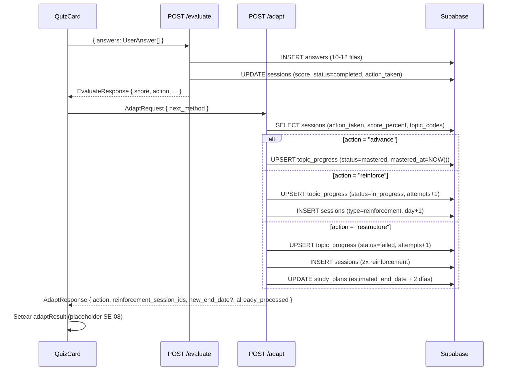
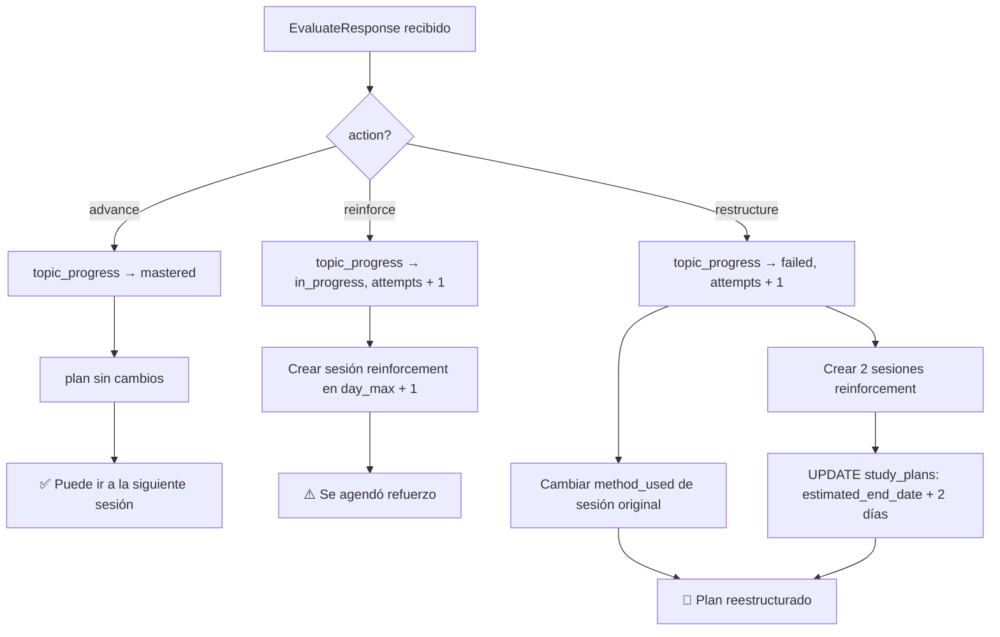

# SE-07 — Lógica adaptativa: `advance` | `reinforce` | `restructure`

> **Bloque:** 📚 BLOQUE E — Sesión de Estudio  
> **Guía anterior:** [SE-06 — Envío + API Route `/evaluate`](file:///c:/Users/jsife/OneDrive/Desktop/Repositorios/practica-testing/docs/guides/fe/SE-06.md)  
> **Siguiente guía:** SE-08 — UI: FeedbackPanel  
> **Next.js:** **16.2.9** — `params` siempre `await`ed  
> **Fecha:** 29 junio 2026  

---

## Sección 1: 🎓 Introducción y Fundamentos Conceptuales

### ¿Dónde estamos?

En SE-06 construiste el evaluador: el sistema ya sabe **cuántas respuestas acertó el usuario** y tomó una decisión (`advance`, `reinforce`, o `restructure`) que guardó en `sessions.action_taken`. La sesión quedó con `status = 'completed'`.

Pero esa decisión hoy no tiene consecuencias: los datos en `topic_progress` no cambian, no se crean sesiones de refuerzo, el plan no se extiende. SE-07 da vida a esa decisión.

### La analogía del sistema de calificaciones universitario

Imagina un profesor que califica un parcial y tiene tres protocolos según el resultado:

- **Aprobó con distinción (≥ 70%)** → El sistema marca el tema como dominado, el estudiante pasa al siguiente capítulo. El calendario no cambia.
- **Aprobó marginalmente (50-69%)** → El sistema agenda una tutoría de refuerzo el día siguiente antes de pasar al nuevo tema. El calendario se corre un día.
- **Reprobó (< 50%)** → El sistema cambia el método de enseñanza, agenda múltiples tutorías, y recalcula la fecha de examen.

SE-07 es exactamente ese sistema de protocolos.

### Conceptos clave de esta guía

#### 1. Lógica post-evaluación como Route Handler dedicado

SE-06 ya tiene su propio Route Handler (`/evaluate`) que calcula el score y guarda la decisión. SE-07 **no modifica ese handler** — crea un nuevo endpoint: `POST /api/sessions/[id]/adapt`.

Regla de seguridad de esta guía: `/adapt` **no confía** en `action`, `score` ni `topic_codes` enviados desde el navegador. Esos datos ya fueron calculados y persistidos por `/evaluate`, así que el servidor los lee desde `sessions.action_taken`, `sessions.score_percent` y `sessions.topic_codes`.

¿Por qué separarlo?

- **Separación de responsabilidades:** `/evaluate` = medir. `/adapt` = actuar.
- **Reintentos independientes:** Si la lógica adaptativa falla, el score ya está guardado. El usuario puede reintentar la adaptación sin re-evaluar.
- **Fuente de verdad en servidor:** El cliente solo puede sugerir `next_method`; la decisión y el score vienen de la base de datos.
- **Testabilidad:** Puedes probar la adaptación con datos arbitrarios sin generar un quiz.

#### 2. `upsert` en `topic_progress`: INSERT o UPDATE en un solo paso

La tabla `topic_progress` tiene una restricción `UNIQUE(user_id, study_plan_id, topic_code)`. Esto significa que no puede haber dos filas para el mismo usuario+plan+tópico.

Cuando SE-07 actualiza el progreso de un tópico, puede que la fila **ya exista** (sesión anterior) o **no exista** (primer intento). En vez de hacer un `SELECT` + `INSERT/UPDATE` condicional, Supabase ofrece `upsert`:

```
supabase.from("topic_progress").upsert(data, { onConflict: "user_id,study_plan_id,topic_code" })
```

Si la fila existe → la actualiza. Si no → la inserta. Un solo round-trip a la base de datos.

> ⚠️ **Importante:** `upsert` reemplaza los campos enviados. Para no perder `attempts` ni degradar `best_score`, primero leemos el progreso actual y calculamos `attempts + 1` y `Math.max(best_score, score)` en servidor.

#### 3. Calcular `day_number` para sesiones de refuerzo

Cuando el sistema crea una sesión de refuerzo, necesita asignarle un `day_number`. La regla es sencilla:

- Obtener el `day_number` **máximo** entre todas las sesiones actuales del plan.
- Sumar 1 (la sesión de refuerzo va al día siguiente del último día planificado).

Esto evita colisiones con sesiones existentes y mantiene el orden cronológico.

#### 4. Recalcular `estimated_end_date` (solo `restructure`)

En `restructure`, el plan se extiende. El algoritmo:

```
nueva_estimated_end_date = MAX(dia_actual, estimated_end_date_actual) + sesiones_de_refuerzo_adicionales_días
```

En la práctica, sumamos 2 días al `estimated_end_date` actual (una sesión de refuerzo + un colchón).

> **Alcance de SE-07:** Mantenemos el cálculo simple e intencionalmente conservador. En futuras iteraciones se puede sofisticar con la densidad del plan. No sobre-ingenierices esto.

---

## Sección 2: 📋 Prerequisitos y Verificación del Entorno

### Prerequisitos de guías anteriores

| Guía | Entregable requerido |
|---|---|
| **SE-06** | `app/api/sessions/[id]/evaluate/route.ts` funcional |
| **SE-06** | `types/evaluate.ts` con `EvaluateResponse` exportado |
| **SE-06** | `quiz-card.tsx` llama a `/evaluate` y recibe `EvaluateResponse` |
| **DB-02** | Tabla `topic_progress` con columnas: `attempts`, `best_score`, `last_score`, `status`, `mastered_at` |
| **DB-02** | Tabla `sessions` con `SessionInsert` completo |
| **DB-02** | Tabla `study_plans` con `estimated_end_date` |

### Verificación: `topic_progress` existe en Supabase

Abre el **Table Editor** de Supabase y confirma que existe la tabla `topic_progress` con las columnas listadas arriba. Si la tabla no existe, regresa a DB-02 antes de continuar.

### Verificación: variables de entorno (sin imprimir valores)

```powershell
# Desde la raíz del workspace — solo verifica existencia, no imprime secretos
Test-Path -LiteralPath "frontend/.env.local"
Select-String -Path "frontend/.env.local" -Pattern "^NEXT_PUBLIC_SUPABASE_URL=" -Quiet
Select-String -Path "frontend/.env.local" -Pattern "^NEXT_PUBLIC_SUPABASE_ANON_KEY=" -Quiet
```

**Salida esperada:**
```
True
True
True
```

> Nota: SE-07 no llama directamente al LLM. `GEMINI_API_KEY` u `OPENAI_API_KEY` siguen siendo relevantes para SE-06 `/evaluate`, pero no son una dependencia nueva de `/adapt`.

### Verificación: TypeScript limpio de SE-06

```powershell
npx tsc --noEmit --project frontend/tsconfig.json
```

**Resultado esperado:** Sin output (cero errores).

---

## Sección 3: 📂 Estructura de Directorios del Proyecto

```
frontend/
├── app/
│   ├── (dashboard)/
│   │   └── session/
│   │       └── page.tsx               (sin cambios)
│   └── api/
│       └── sessions/
│           └── [id]/
│               ├── route.ts
│               ├── theory/route.ts
│               ├── quiz/route.ts
│               ├── evaluate/route.ts   (SE-06 — sin cambios)
│               └── adapt/              ← 🆕 NUEVO en SE-07
│                   └── route.ts        ← 🆕 POST /api/sessions/[id]/adapt
├── components/
│   └── session/
│       └── quiz-card.tsx              ← ✏️ MODIFICADO en SE-07
│                                         (llama a /adapt tras /evaluate)
├── lib/
│   └── (sin archivos nuevos en SE-07)
└── types/
    ├── index.ts                       ← ✏️ MODIFICADO en SE-07
    └── adapt.ts                       ← 🆕 NUEVO en SE-07
```

**Resumen:**
- 🆕 **2 archivos nuevos:** `types/adapt.ts`, `app/api/sessions/[id]/adapt/route.ts`
- ✏️ **2 archivos modificados:** `types/index.ts`, `components/session/quiz-card.tsx` (añade llamada a `/adapt` después de `/evaluate`)

---

## Sección 4: 🎨 Diagrama de Arquitectura de Componentes

### Flujo completo post-quiz (SE-06 + SE-07)



### Árbol de decisión del sistema adaptativo



---

## Sección 5: 🛠️ Implementación Paso a Paso

---

### Paso A: Crear tipos de adaptación (`types/adapt.ts`)

**Archivo:** `frontend/types/adapt.ts` — 🆕 NUEVO

```typescript
// ============================================================
// types/adapt.ts — Tipos para la lógica adaptativa
// ============================================================
// Define el contrato entre QuizCard y POST /api/sessions/[id]/adapt.
//
// SEPARACIÓN DE RESPONSABILIDADES:
//   - /evaluate  → mide (score, acción, feedback)
//   - /adapt     → actúa (actualiza topic_progress, crea sesiones)
//
// QuizCard llama primero a /evaluate, y si recibe 200, llama
// automáticamente a /adapt con los datos necesarios.
// ============================================================

import type { ActionTaken, MethodUsed } from "./database";

// ──────────────────────────────────────────────────────────────
// Request: Lo que el frontend envía al POST /adapt
// ──────────────────────────────────────────────────────────────

/**
 * Body del POST /api/sessions/[id]/adapt.
 *
 * Contiene solo la información que NO está persistida en sessions.
 *
 * SEGURIDAD:
 *   - action viene de sessions.action_taken
 *   - score viene de sessions.score_percent
 *   - topic_codes viene de sessions.topic_codes
 *
 * El cliente no puede decidir si avanza ni qué score obtuvo.
 */
export interface AdaptRequest {
  /** Método recomendado por el LLM — usado en sesiones de refuerzo */
  next_method: MethodUsed;
}

// ──────────────────────────────────────────────────────────────
// Response: Lo que el servidor retorna después de adaptar
// ──────────────────────────────────────────────────────────────

/**
 * Respuesta de la adaptación del plan.
 *
 * Incluye los IDs de sesiones creadas (si las hubo) y la nueva
 * fecha estimada de fin (si el plan fue extendido). Estos datos
 * son usados por SE-08 para mostrar el FeedbackPanel completo.
 */
export interface AdaptResponse {
  /** Acción que se ejecutó */
  action: ActionTaken;
  /**
   * IDs de sesiones de refuerzo creadas (vacío si action=advance).
   * Puede haber 1 (reinforce) o 2+ (restructure).
   */
  reinforcement_session_ids: string[];
  /**
   * Nueva fecha estimada de fin del plan (ISO string).
   * Solo presente si action=restructure y el plan fue extendido.
   */
  new_estimated_end_date: string | null;
  /** true si /adapt detectó que ya había aplicado estos cambios antes */
  already_processed: boolean;
  /** Mensaje descriptivo del resultado de la adaptación */
  message: string;
}
```

**Entregable:** Archivo `frontend/types/adapt.ts` creado.

---

### Paso B: Actualizar barrel de tipos (`types/index.ts`)

**Archivo:** `frontend/types/index.ts` — ✏️ MODIFICAR

Agrega al final del archivo, después de las re-exportaciones de `evaluate.ts`:

```typescript
// 🆕 SE-07: Re-exportar tipos de adaptación
export type { AdaptRequest, AdaptResponse } from "./adapt";
```

**Entregable:** `frontend/types/index.ts` con re-exportaciones de `adapt.ts`.

---

### Paso C: Crear el Route Handler de adaptación (`app/api/sessions/[id]/adapt/route.ts`)

**Archivo:** `frontend/app/api/sessions/[id]/adapt/route.ts` — 🆕 NUEVO

> **Antes de copiar:** Este archivo sigue el mismo patrón de autenticación y validación que `evaluate/route.ts`. Las diferencias clave están en los pasos 5-7 (la lógica adaptativa por acción).

```typescript
// ─────────────────────────────────────────────────────────────────
// app/api/sessions/[id]/adapt/route.ts
// Route Handler: ejecuta la lógica adaptativa tras la evaluación.
//
// Método: POST
// Auth:   Requiere sesión válida (cookie JWT de Supabase)
// Params: id — UUID de la sesión YA EVALUADA (status=completed)
// Body:   { next_method }
//
// Response (200): AdaptResponse
// Response (400): { error: "Descripción del problema" }
// Response (401): { error: "No autenticado" }
// Response (404): { error: "Sesión no encontrada" }
// Response (409): { error: "La sesión aún no ha sido evaluada" }
// Response (500): { error: "Error interno del servidor" }
//
// FLUJO:
//   1. Autenticar usuario
//   2. Validar UUID de la sesión
//   3. Cargar sesión y verificar que está completed
//   4. Cargar el plan asociado (query separada — Relationships: [])
//   5. Leer action, score y topic_codes desde sessions (fuente de verdad)
//   6. Validar body mínimo (solo next_method)
//   7. Según action:
//      ADVANCE     → upsert topic_progress a 'mastered'
//      REINFORCE   → upsert topic_progress a 'in_progress', crear sesión reinforcement
//      RESTRUCTURE → upsert topic_progress a 'failed', crear 2 sesiones, extender plan
//   8. Retornar AdaptResponse
//
// IDEMPOTENCIA:
//   Sin añadir columnas nuevas, detectamos si topic_progress ya fue actualizado
//   después de completed_at y si las sesiones de refuerzo esperadas ya existen.
//   Esto evita duplicados accidentales por doble click, refresh o retry.
// ─────────────────────────────────────────────────────────────────

import { NextResponse } from "next/server";
import { createClient } from "@/lib/supabase/server";
import type {
  ActionTaken,
  MethodUsed,
  SessionInsert,
  TopicProgressStatus,
} from "@/types";
import type { AdaptRequest, AdaptResponse } from "@/types/adapt";

// ─── Forzar Node.js runtime ─────────────────────────────────────
export const runtime = "nodejs";

// ─── Constantes ──────────────────────────────────────────────────
const UUID_REGEX =
  /^[0-9a-f]{8}-[0-9a-f]{4}-[0-9a-f]{4}-[0-9a-f]{4}-[0-9a-f]{12}$/i;

const VALID_ACTIONS: ActionTaken[] = ["advance", "reinforce", "restructure"];
const VALID_METHODS: MethodUsed[] = ["theory", "examples", "analogies"];

// Días que se extiende el plan al restructure
const RESTRUCTURE_EXTENSION_DAYS = 2;
const RESTRUCTURE_SESSION_COUNT = 2;

// ──────────────────────────────────────────────────────────────
// Helpers
// ──────────────────────────────────────────────────────────────

/**
 * Suma N días a una fecha en formato ISO (YYYY-MM-DD).
 * No usa librerías externas — aritmética pura de Date.
 */
function addDays(isoDate: string, days: number): string {
  const date = new Date(isoDate);
  date.setDate(date.getDate() + days);
  // Formatear como YYYY-MM-DD
  return date.toISOString().split("T")[0];
}

/**
 * Compara arrays de tópicos sin depender del orden.
 * Útil para detectar refuerzos ya creados para el mismo grupo de tópicos.
 */
function sameTopicSet(left: string[] | null | undefined, right: string[]): boolean {
  if (!left || left.length !== right.length) return false;
  const leftSet = new Set(left);
  return right.every((topicCode) => leftSet.has(topicCode));
}

// ──────────────────────────────────────────────────────────────
// POST /api/sessions/[id]/adapt
// ──────────────────────────────────────────────────────────────

export async function POST(
  request: Request,
  { params }: { params: Promise<{ id: string }> },
) {
  try {
    // ═════════════════════════════════════════════════════════
    // 1. AUTENTICACIÓN
    // ═════════════════════════════════════════════════════════
    const supabase = await createClient();
    const {
      data: { user },
    } = await supabase.auth.getUser();

    if (!user) {
      return NextResponse.json({ error: "No autenticado" }, { status: 401 });
    }

    // ═════════════════════════════════════════════════════════
    // 2. VALIDAR UUID
    // ═════════════════════════════════════════════════════════
    const { id: sessionId } = await params;

    if (!sessionId || !UUID_REGEX.test(sessionId)) {
      return NextResponse.json(
        { error: "ID de sesión inválido. Debe ser un UUID válido." },
        { status: 400 },
      );
    }

    // ═════════════════════════════════════════════════════════
    // 3. CARGAR Y VALIDAR SESIÓN
    // ═════════════════════════════════════════════════════════
    const { data: session, error: sessionError } = await supabase
      .from("sessions")
      .select("*")
      .eq("id", sessionId)
      .eq("user_id", user.id)
      .maybeSingle();

    if (sessionError || !session) {
      return NextResponse.json(
        { error: "Sesión no encontrada o no pertenece al usuario." },
        { status: 404 },
      );
    }

    // La adaptación solo puede ejecutarse sobre sesiones completadas.
    // Si el status no es 'completed', el cliente llamó en el orden incorrecto.
    if (session.status !== "completed") {
      return NextResponse.json(
        {
          error:
            "La sesión aún no ha sido evaluada. Llama a /evaluate primero.",
        },
        { status: 409 },
      );
    }

    // ═════════════════════════════════════════════════════════
    // 4. CARGAR PLAN ASOCIADO
    // ═════════════════════════════════════════════════════════
    // Query separada porque Relationships: [] en database.ts —
    // no se puede hacer join encadenado de forma segura.
    const { data: plan, error: planError } = await supabase
      .from("study_plans")
      .select("id, estimated_end_date, objective_days")
      .eq("id", session.study_plan_id)
      .eq("user_id", user.id)
      .maybeSingle();

    if (planError || !plan) {
      return NextResponse.json(
        { error: "No se encontró el plan asociado a esta sesión." },
        { status: 404 },
      );
    }

    // ═════════════════════════════════════════════════════════
    // 5. LEER FUENTE DE VERDAD DESDE LA SESIÓN
    // ═════════════════════════════════════════════════════════

    const action = session.action_taken;
    if (!action || !VALID_ACTIONS.includes(action)) {
      return NextResponse.json(
        { error: "La sesión completada no tiene action_taken válido." },
        { status: 409 },
      );
    }

    const score = Number(session.score_percent);
    if (!Number.isFinite(score) || score < 0 || score > 100) {
      return NextResponse.json(
        { error: "La sesión completada no tiene score_percent válido." },
        { status: 409 },
      );
    }

    const topicCodes = session.topic_codes;
    if (
      !Array.isArray(topicCodes) ||
      topicCodes.length === 0 ||
      topicCodes.some((topicCode) => typeof topicCode !== "string")
    ) {
      return NextResponse.json(
        { error: "La sesión no tiene topic_codes válidos." },
        { status: 409 },
      );
    }

    // ═════════════════════════════════════════════════════════
    // 6. VALIDAR BODY MÍNIMO
    // ═════════════════════════════════════════════════════════
    let body: Partial<AdaptRequest> = {};
    try {
      const rawBody = await request.text();
      body = rawBody ? (JSON.parse(rawBody) as Partial<AdaptRequest>) : {};
    } catch {
      return NextResponse.json(
        { error: "Body inválido. Se esperaba JSON." },
        { status: 400 },
      );
    }

    const nextMethod = body.next_method ?? session.method_used;
    if (!VALID_METHODS.includes(nextMethod)) {
      return NextResponse.json(
        {
          error: `next_method inválido. Debe ser: ${VALID_METHODS.join(", ")}. Recibido: "${body.next_method}"`,
        },
        { status: 400 },
      );
    }

    // ═════════════════════════════════════════════════════════
    // 7. LÓGICA ADAPTATIVA
    // ═════════════════════════════════════════════════════════

    const reinforcementSessionIds: string[] = [];
    let newEstimatedEndDate: string | null = null;
    let adaptMessage = "";

    // ─── Determinar status de topic_progress según acción ───
    const topicStatus: Record<ActionTaken, TopicProgressStatus> = {
      advance: "mastered",
      reinforce: "in_progress",
      restructure: "failed",
    };
    const newTopicStatus = topicStatus[action];

    const now = new Date().toISOString();
    const completedAt = session.completed_at ?? session.created_at;

    // ─── 7a. Leer progreso existente para no pisar attempts/best_score ───
    const { data: existingProgress, error: progressError } = await supabase
      .from("topic_progress")
      .select("topic_code, attempts, best_score, last_score, status, updated_at")
      .eq("user_id", user.id)
      .eq("study_plan_id", plan.id)
      .in("topic_code", topicCodes);

    if (progressError) {
      console.error("[adapt] Error leyendo topic_progress:", progressError);
      return NextResponse.json(
        { error: "Error al leer el progreso actual de los tópicos." },
        { status: 500 },
      );
    }

    const progressByTopic = new Map(
      (existingProgress ?? []).map((progress) => [progress.topic_code, progress]),
    );

    const completedAtMs = Date.parse(completedAt);
    const progressAlreadyUpdated =
      topicCodes.length > 0 &&
      topicCodes.every((topicCode) => {
        const progress = progressByTopic.get(topicCode);
        if (!progress) return false;

        const updatedAtMs = Date.parse(String(progress.updated_at));
        return (
          progress.status === newTopicStatus &&
          Number(progress.last_score) === score &&
          Number.isFinite(updatedAtMs) &&
          Number.isFinite(completedAtMs) &&
          updatedAtMs >= completedAtMs
        );
      });

    // ─── 7b. Detectar refuerzos ya creados para evitar duplicados ───
    const requiredReinforcements =
      action === "advance"
        ? 0
        : action === "reinforce"
          ? 1
          : RESTRUCTURE_SESSION_COUNT;

    let existingReinforcements: { id: string; topic_codes: string[] | null }[] = [];

    if (requiredReinforcements > 0) {
      const { data: candidates, error: existingSessionError } = await supabase
        .from("sessions")
        .select("id, topic_codes, attempt_number, created_at")
        .eq("study_plan_id", plan.id)
        .eq("user_id", user.id)
        .eq("session_type", "reinforcement")
        .gte("attempt_number", (session.attempt_number || 1) + 1)
        .gte("created_at", completedAt)
        .order("attempt_number", { ascending: true });

      if (existingSessionError) {
        console.error(
          "[adapt] Error buscando refuerzos existentes:",
          existingSessionError,
        );
        return NextResponse.json(
          { error: "Error al verificar sesiones de refuerzo existentes." },
          { status: 500 },
        );
      }

      existingReinforcements = (candidates ?? [])
        .filter((candidate) => sameTopicSet(candidate.topic_codes, topicCodes))
        .slice(0, requiredReinforcements)
        .map((candidate) => ({
          id: candidate.id,
          topic_codes: candidate.topic_codes,
        }));
    }

    const alreadyHasRequiredReinforcements =
      existingReinforcements.length >= requiredReinforcements;

    if (progressAlreadyUpdated && alreadyHasRequiredReinforcements) {
      const response: AdaptResponse = {
        action,
        reinforcement_session_ids: existingReinforcements.map((sessionRow) =>
          sessionRow.id,
        ),
        new_estimated_end_date:
          action === "restructure" ? plan.estimated_end_date : null,
        already_processed: true,
        message: "La adaptación ya había sido aplicada previamente.",
      };

      console.log(`[adapt] Idempotente: sesión ${sessionId} ya procesada`);
      return NextResponse.json(response, { status: 200 });
    }

    // ─── 7c. UPSERT topic_progress ──────────────────────────
    // Se actualiza cada tópico de la sesión.
    // onConflict: "user_id,study_plan_id,topic_code" garantiza
    // que si la fila existe → actualiza; si no → inserta.

    const topicUpserts = topicCodes.map((topicCode) => {
      const previous = progressByTopic.get(topicCode);
      const previousAttempts = Number(previous?.attempts ?? 0);
      const previousBestScore = Number(previous?.best_score ?? 0);

      return {
        user_id: user.id,
        study_plan_id: plan.id,
        topic_code: topicCode,
        status: newTopicStatus,
        last_score: score,
        best_score: Math.max(previousBestScore, score),
        attempts: progressAlreadyUpdated
          ? previousAttempts
          : previousAttempts + 1,
        mastered_at: action === "advance" ? now : null,
        updated_at: now,
      };
    });

    const { error: upsertError } = await supabase
      .from("topic_progress")
      .upsert(topicUpserts, {
        onConflict: "user_id,study_plan_id,topic_code",
      });

    if (upsertError) {
      console.error("[adapt] Error en upsert de topic_progress:", upsertError);
      return NextResponse.json(
        { error: "Error al actualizar el progreso de los tópicos." },
        { status: 500 },
      );
    }

    console.log(
      `[adapt] topic_progress actualizado: ${topicCodes.length} tópicos → ${newTopicStatus}`,
    );

    // ─── 7d. Obtener el day_number máximo del plan ──────────
    // Necesario para saber dónde insertar las sesiones de refuerzo.
    // Query separada — no se puede inferir por join.
    let maxDayNumber = session.day_number; // Mínimo seguro

    if (action === "reinforce" || action === "restructure") {
      const { data: allSessions, error: dayError } = await supabase
        .from("sessions")
        .select("day_number")
        .eq("study_plan_id", plan.id)
        .eq("user_id", user.id);

      if (dayError) {
        console.error("[adapt] Error calculando max day_number:", dayError);
        return NextResponse.json(
          { error: "Error al calcular la posición de los refuerzos." },
          { status: 500 },
        );
      }

      if (allSessions && allSessions.length > 0) {
        maxDayNumber = Math.max(...allSessions.map((s) => s.day_number));
      }
    }

    // ─── 7e. Lógica por acción ──────────────────────────────

    if (action === "advance") {
      // ── ADVANCE ─────────────────────────────────────────
      // topic_progress ya actualizado a 'mastered'.
      // No se crean sesiones ni se modifica el plan.
      adaptMessage =
        `¡Excelente! Dominas los tópicos de esta sesión. ` +
        `El plan continúa sin cambios.`;

      console.log(`[adapt] ADVANCE: plan sin cambios para sesión ${sessionId}`);
    } else if (action === "reinforce") {
      // ── REINFORCE ────────────────────────────────────────
      // Crear UNA sesión de refuerzo el día siguiente al último.
      for (const existing of existingReinforcements) {
        reinforcementSessionIds.push(existing.id);
      }

      if (reinforcementSessionIds.length === 0) {
        const reinforceDay = maxDayNumber + 1;

        const reinforcementSession: SessionInsert = {
          study_plan_id: plan.id,
          user_id: user.id,
          topic_codes: topicCodes,
          session_type: "reinforcement",
          day_number: reinforceDay,
          duration_minutes: 15, // Refuerzo ligero — 15 min según roadmap
          method_used: nextMethod,
          attempt_number: (session.attempt_number || 1) + 1,
          status: "pending",
        };

        const { data: newSession, error: insertError } = await supabase
          .from("sessions")
          .insert(reinforcementSession)
          .select("id")
          .single();

        if (insertError || !newSession) {
          console.error("[adapt] Error creando sesión de refuerzo:", insertError);
          return NextResponse.json(
            { error: "Error al crear la sesión de refuerzo." },
            { status: 500 },
          );
        }

        reinforcementSessionIds.push(newSession.id);

        console.log(
          `[adapt] REINFORCE: sesión creada id=${newSession.id} day=${reinforceDay}`,
        );
      }

      adaptMessage =
        `Se ha agendado una sesión de refuerzo de 15 minutos ` +
        `con método ${nextMethod}.`;
    } else {
      // ── RESTRUCTURE ──────────────────────────────────────
      // Crear DOS sesiones de refuerzo en días consecutivos.
      for (const existing of existingReinforcements) {
        reinforcementSessionIds.push(existing.id);
      }

      const sessionsToCreate =
        RESTRUCTURE_SESSION_COUNT - reinforcementSessionIds.length;

      if (sessionsToCreate > 0) {
        const restructureSessions: SessionInsert[] = Array.from(
          { length: sessionsToCreate },
          (_, index) => {
            const ordinal = reinforcementSessionIds.length + index + 1;

            return {
              study_plan_id: plan.id,
              user_id: user.id,
              topic_codes: topicCodes,
              session_type: "reinforcement",
              day_number: maxDayNumber + index + 1,
              duration_minutes: 30,
              method_used: nextMethod,
              attempt_number: (session.attempt_number || 1) + ordinal,
              status: "pending",
            } satisfies SessionInsert;
          },
        );

        const { data: newSessions, error: insertError } = await supabase
          .from("sessions")
          .insert(restructureSessions)
          .select("id");

        if (insertError || !newSessions) {
          console.error(
            "[adapt] Error creando sesiones de reestructuración:",
            insertError,
          );
          return NextResponse.json(
            { error: "Error al crear las sesiones de reestructuración." },
            { status: 500 },
          );
        }

        for (const s of newSessions) {
          reinforcementSessionIds.push(s.id);
        }
      }

      // Extender el estimated_end_date del plan
      newEstimatedEndDate = addDays(
        plan.estimated_end_date,
        RESTRUCTURE_EXTENSION_DAYS,
      );

      const { error: planUpdateError } = await supabase
        .from("study_plans")
        .update({
          estimated_end_date: newEstimatedEndDate,
          updated_at: now,
        })
        .eq("id", plan.id)
        .eq("user_id", user.id);

      if (planUpdateError) {
        // No fallamos — las sesiones ya se crearon.
        // El plan puede ser corregido manualmente si es necesario.
        console.error(
          "[adapt] Error actualizando estimated_end_date:",
          planUpdateError,
        );
      } else {
        console.log(
          `[adapt] study_plans actualizado: estimated_end_date=${newEstimatedEndDate}`,
        );
      }

      adaptMessage =
        `El plan ha sido reestructurado. Se han agendado ` +
        `${reinforcementSessionIds.length} sesiones de refuerzo intensivo ` +
        `con método ${nextMethod}. ` +
        `La fecha estimada de examen se ha extendido al ${newEstimatedEndDate}.`;

      console.log(
        `[adapt] RESTRUCTURE: ${reinforcementSessionIds.length} sesiones listas, end_date=${newEstimatedEndDate}`,
      );
    }

    // ═════════════════════════════════════════════════════════
    // 8. RETORNAR RESPUESTA
    // ═════════════════════════════════════════════════════════
    const response: AdaptResponse = {
      action,
      reinforcement_session_ids: reinforcementSessionIds,
      new_estimated_end_date: newEstimatedEndDate,
      already_processed: false,
      message: adaptMessage,
    };

    console.log(`[adapt] Completado: action=${action}, message="${adaptMessage}"`);

    return NextResponse.json(response, { status: 200 });
  } catch (error) {
    console.error("[adapt] Error inesperado:", error);
    return NextResponse.json(
      { error: "Error interno del servidor." },
      { status: 500 },
    );
  }
}
```

**Entregable:** Archivo `frontend/app/api/sessions/[id]/adapt/route.ts` creado.

---

### Paso D: Modificar `quiz-card.tsx` para llamar a `/adapt`

**Archivo:** `frontend/components/session/quiz-card.tsx` — ✏️ MODIFICAR

SE-06 dejó `handleSubmit()` con un `alert()` al final como placeholder para SE-08. SE-07 extiende ese flujo para que, **inmediatamente después** de recibir la respuesta de `/evaluate`, se llame automáticamente a `/adapt`.

#### D.1: Agregar imports de los nuevos tipos

Localiza el bloque de imports al inicio del archivo. Agrega en la línea siguiente a `import type { UserAnswer, EvaluateResponse }`:

```typescript
import type { AdaptRequest, AdaptResponse } from "@/types/adapt";
```

#### D.2: Agregar estado para `adaptResult`

Después del estado `evaluationResult`:

```typescript
  const [adaptResult, setAdaptResult] = useState<AdaptResponse | null>(null);
```

Además, reinicia este estado en los mismos lugares donde SE-06 reinicia `evaluationResult`:

```typescript
      setEvaluationResult(null);
      setAdaptResult(null);
```

Debes añadir `setAdaptResult(null)` en:

- `loadQuiz()` dentro del `useEffect` inicial.
- `handleRetry()` al regenerar el quiz.
- El inicio de `handleSubmit()` justo después de `setSubmitting(true)`, para evitar mostrar un mensaje viejo si `/adapt` falla:

```typescript
    setSubmitting(true);
    setAdaptResult(null);
```

#### D.3: Reemplazar el bloque de envío en `handleSubmit()`

Localiza el bloque que comienza en `// ── Paso 3: Guardar resultado` y termina justo antes del `catch` de `handleSubmit`. Reemplázalo por:

```typescript
      // ── Paso 3: Guardar resultado de evaluación ────────────
      setEvaluationResult(result);
      setTimerActive(false);
      setShowSummary(false);
      setAdaptResult(null);

      // ── Paso 4: Llamar a /adapt automáticamente ────────────
      // /adapt no recibe action, score ni topic_codes desde cliente.
      // El servidor los lee desde sessions para evitar manipulación.
      const adaptBody: AdaptRequest = {
        next_method: result.next_method,
      };

      let adaptMessage = "";

      try {
        const adaptResponse = await fetch(
          `/api/sessions/${sessionData.id}/adapt`,
          {
            method: "POST",
            headers: { "Content-Type": "application/json" },
            body: JSON.stringify(adaptBody),
          },
        );

        if (adaptResponse.ok) {
          const adaptData: AdaptResponse = await adaptResponse.json();
          setAdaptResult(adaptData);
          adaptMessage = `\n\n${adaptData.message}`;
          console.log("[quiz-card] adapt OK:", adaptData.action, adaptData.message);
        } else {
          // La adaptación falló — no es crítico, el score ya está guardado.
          // SE-08 puede mostrar un aviso no bloqueante al usuario.
          console.warn("[quiz-card] /adapt retornó error no crítico:", adaptResponse.status);
        }
      } catch (adaptErr) {
        // Error de red en /adapt — no bloqueamos la UX.
        console.error("[quiz-card] Error de red al llamar /adapt:", adaptErr);
      }

      // TODO SE-08: Reemplazar este alert por <FeedbackPanel>
      // El FeedbackPanel usará evaluationResult + adaptResult.
      const actionLabels: Record<string, string> = {
        advance: "✅ Avanzas al siguiente tópico",
        reinforce: "⚠️ Sesión de refuerzo agendada",
        restructure: "🔄 Plan reestructurado",
      };

      alert(
        `📊 Resultado de la evaluación\n\n` +
           `Score: ${result.score}% (${result.correct_count}/${result.total_questions})\n` +
           `Decisión: ${actionLabels[result.action] || result.action}\n\n` +
          `${result.feedback_message}${adaptMessage}\n\n` +
           `El FeedbackPanel visual se implementará en SE-08.`,
      );
```

#### D.4: Actualizar el bloque de resultado post-evaluación

En el bloque JSX que muestra el resultado (después de la evaluación, el placeholder visual de SE-06), actualiza el texto para reflejar el resultado de la adaptación. Localiza el párrafo dentro de `{evaluationResult && (...)}` y reemplaza el `<p>` de `feedback_message` para también mostrar `adaptResult?.message`:

```tsx
            <p className="max-w-md text-sm leading-6 text-slate-300">
              {evaluationResult.feedback_message}
            </p>
            {adaptResult && (
              <p className="max-w-md text-xs leading-5 text-slate-400 italic">
                {adaptResult.message}
              </p>
            )}
```

**Entregable:** `frontend/components/session/quiz-card.tsx` modificado con llamada a `/adapt` y `adaptResult` state.

---

## Sección 6: ✅ Checkpoints de Verificación

### Verificación 1: TypeScript compila sin errores

```powershell
npx tsc --noEmit --project frontend/tsconfig.json
```

**Resultado esperado:** Sin output.

### Verificación 2: El servidor inicia

```powershell
npm --prefix frontend run dev
```

**Resultado esperado:**
```
  ▲ Next.js 16.2.x
  - Local:    http://localhost:3000
  ✓ Ready in Xs
```

### Verificación 3: Ruta del endpoint existe

```powershell
Test-Path -LiteralPath "frontend/app/api/sessions/[id]/adapt/route.ts"
```

**Resultado esperado:** `True`

### Verificación 4: Flujo completo — ADVANCE (score ≥ 70%)

1. Navega a `http://localhost:3000/session?phase=quiz`
2. Responde al menos 7/10 preguntas correctamente
3. Ve al resumen y haz clic en "Enviar respuestas"

**Resultado esperado:**
- Aparece el `alert()` con Score ≥ 70% y "✅ Avanzas al siguiente tópico"
- En Supabase **Table Editor → `topic_progress`:** La fila para los tópicos de la sesión tiene `status = 'mastered'` y `mastered_at` con timestamp reciente
- En Supabase **Table Editor → `sessions`:** No hay sesión nueva de tipo `reinforcement`

### Verificación 5: Flujo completo — REINFORCE (score 50-69%)

1. Usa una sesión diferente (o cambia el umbral temporalmente en el código)
2. Responde entre 5 y 6 preguntas correctamente

**Resultado esperado:**
- El `alert()` muestra "⚠️ Sesión de refuerzo agendada"
- En **`topic_progress`:** `status = 'in_progress'`
- En **`sessions`:** Aparece UNA nueva sesión con `session_type = 'reinforcement'` y `day_number = (máximo anterior + 1)`

### Verificación 6: Flujo completo — RESTRUCTURE (score < 50%)

1. Responde 4 o menos preguntas correctamente

**Resultado esperado:**
- El `alert()` muestra "🔄 Plan reestructurado"
- En **`topic_progress`:** `status = 'failed'`
- En **`sessions`:** Aparecen DOS nuevas sesiones con `session_type = 'reinforcement'`
- En **`study_plans`:** `estimated_end_date` se extendió 2 días

### Verificación 7: Build de producción

```powershell
npm --prefix frontend run build
```

**Resultado esperado:**
```
✓ Compiled successfully
Running TypeScript ...
Finished TypeScript ...
```

### Checklist de entregables

| # | Entregable | Verificación |
|---|---|---|
| 1 | `types/adapt.ts` — `AdaptRequest` y `AdaptResponse` | `tsc --noEmit` sin errores |
| 2 | `types/index.ts` — Re-exportaciones de adapt | `import { AdaptResponse } from "@/types"` funciona |
| 3 | `app/api/sessions/[id]/adapt/route.ts` — Route Handler POST | `Test-Path` retorna `True` |
| 4 | `quiz-card.tsx` — Llama a `/adapt` tras `/evaluate` | `adaptResult` state se setea en consola |
| 5 | ADVANCE: `topic_progress.status = 'mastered'` | Verificado en Supabase Table Editor |
| 6 | REINFORCE: 1 sesión `reinforcement` creada | Verificado en Supabase Table Editor |
| 7 | RESTRUCTURE: 2 sesiones + plan extendido | Verificado en Supabase Table Editor |

---

## Sección 7: 🚨 Troubleshooting — Problemas Comunes

| Problema | Causa Probable | Solución |
|---|---|---|
| `Error 409: "La sesión aún no ha sido evaluada"` | `/adapt` se llamó antes de que `/evaluate` completara (o sobre una sesión con `status != 'completed'`). | Verifica el orden en `handleSubmit`: `/evaluate` primero, y solo si responde 200 se llama a `/adapt`. |
| `Error 409: "La sesión completada no tiene action_taken válido"` | `/evaluate` no actualizó correctamente `sessions.action_taken` o la sesión quedó en estado parcial. | Revisa los logs de `/evaluate` y confirma en Supabase que la fila de `sessions` tenga `status = 'completed'`, `score_percent` y `action_taken`. |
| `Error 400: "next_method inválido"` | El body enviado a `/adapt` trae un método fuera de `theory`, `examples`, `analogies`. | Envía solo `next_method: result.next_method`. No envíes `action`, `score` ni `topic_codes` desde el cliente. |
| `topic_progress` no aparece en Supabase | La tabla no existe o el `upsert` falló silenciosamente. | Revisa los logs del servidor en la terminal donde corre `npm run dev`. Busca `[adapt] Error en upsert`. Verifica que la tabla existe en Supabase con el nombre exacto `topic_progress`. |
| Columna `onConflict` falla con error de Supabase | El índice UNIQUE en la DB no tiene exactamente las columnas `user_id, study_plan_id, topic_code`. | Verifica en **Database → Indexes** de Supabase que existe el índice. Si no existe, crea uno: `CREATE UNIQUE INDEX IF NOT EXISTS topic_progress_unique ON topic_progress(user_id, study_plan_id, topic_code);` |
| `sesiones de refuerzo` se crean pero no aparecen en el plan UI | El componente del calendario (UP-06) carga sesiones al montar. Después de crear nuevas, la UI no se refresca. | Por ahora es el comportamiento esperado — SE-08 añadirá una navegación post-evaluación que recargará el plan. El dato está correcto en DB. |
| `adaptResult` muestra un mensaje viejo | No se llamó `setAdaptResult(null)` al cargar o regenerar el quiz. | Añade `setAdaptResult(null)` junto a cada `setEvaluationResult(null)` y al inicio de `handleSubmit()`. |
| `/adapt` retorna error pero la UI no lo muestra | El error de `/adapt` es no-crítico y solo se loguea en consola. | Abre DevTools → Console y busca el log `[quiz-card] /adapt retornó error no crítico`. Para depurar, también revisa la terminal del servidor. |
| Doble click crea refuerzos duplicados | El endpoint no detectó refuerzos existentes porque `created_at` o `attempt_number` no coinciden con la sesión evaluada. | Revisa que las sesiones de refuerzo creadas tengan `attempt_number > session.attempt_number` y `created_at >= completed_at` de la sesión original. |

---

## Sección 8: 📝 Resumen y Próximo Paso

### Lo que hiciste en SE-07

1. **Creaste** `types/adapt.ts` con `AdaptRequest` y `AdaptResponse`
2. **Actualizaste** `types/index.ts` con las re-exportaciones de `adapt.ts`
3. **Creaste** `app/api/sessions/[id]/adapt/route.ts` — el Route Handler POST que:
   - Autentica al usuario y valida UUID, sesión y plan con **queries separadas** (respetando `Relationships: []`)
   - Lee `action`, `score` y `topic_codes` desde `sessions`, no desde el cliente
   - Hace `upsert` en `topic_progress` preservando `best_score` y sumando `attempts`
   - Detecta reintentos ya procesados para no duplicar sesiones de refuerzo
   - Para **`advance`**: no crea sesiones, no modifica el plan
   - Para **`reinforce`**: inserta 1 sesión `reinforcement` de 15 min en `day_max + 1`
   - Para **`restructure`**: inserta 2 sesiones de 30 min y extiende `estimated_end_date` en 2 días
4. **Modificaste** `quiz-card.tsx`:
   - Agregaste import de `AdaptRequest` y `AdaptResponse`
   - Agregaste estado `adaptResult`
   - `handleSubmit()` ahora llama a `/adapt` automáticamente tras `/evaluate` (best-effort: si falla, el score sigue guardado)
   - El placeholder visual muestra el mensaje de adaptación

### Validación final

- [ ] `npx tsc --noEmit --project frontend/tsconfig.json` → sin errores
- [ ] `npm --prefix frontend run build` → exitoso
- [ ] ADVANCE → `topic_progress.status = 'mastered'`
- [ ] REINFORCE → 1 sesión `reinforcement` en DB
- [ ] RESTRUCTURE → 2 sesiones + `estimated_end_date` extendido

### Próxima guía: SE-08 — UI: FeedbackPanel

SE-08 reemplaza el `alert()` de placeholder por un componente visual completo `<FeedbackPanel>` que usará los datos de `evaluationResult` + `adaptResult` para mostrar:

- Score grande y visible (ej. `7/10 — 70%`)
- Badge de decisión con color: verde ✅ / amarillo ⚠️ / naranja 🔄
- Lista de tópicos fallidos con las explicaciones del LLM
- Mensaje de feedback en texto natural
- Preview de la próxima sesión (o mensaje de "¡Plan completado!")
- Fecha estimada de examen actualizada (si hubo restructure)
- Botones de acción: "Ver mi progreso" → `/dashboard`, "Siguiente sesión" → `/session`

> **Para validar tu progreso**, indica al agente que completaste SE-07 especificando las 7 verificaciones del checklist.
